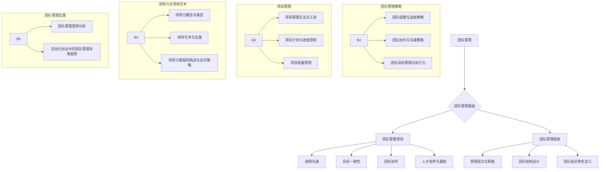

                 

# 自动化创业中的团队管理策略

## 关键词
- 自动化创业
- 团队管理
- 策略
- 项目管理
- 领导力
- 人工智能

## 摘要
本文深入探讨了自动化创业中的团队管理策略。首先，我们介绍了自动化创业的背景及其特点，阐述了团队管理在其中的重要性。接着，我们详细分析了团队管理的基本原则、框架和策略，包括团队组建与选拔、团队协作与沟通、目标管理与执行力。此外，我们还讨论了项目管理方法与工具、领导力与领导艺术以及团队管理案例的分析。最后，我们对自动化创业中的团队管理未来趋势进行了展望，并提出了一些创新方向。通过本文，读者可以全面了解自动化创业中的团队管理策略，从而为创业成功奠定基础。

### 目录大纲

#### 第一部分：团队管理基础

1. [第1章：自动化创业背景与团队管理的重要性](#第1章自动化创业背景与团队管理的重要性)
    1.1 自动化创业的定义与特点
    1.2 团队管理的基本原则
    1.3 团队管理框架概述
2. [第2章：团队组建与选拔策略](#第2章团队组建与选拔策略)
    2.1 团队组建的基本步骤
    2.2 团队成员职业发展规划
    2.3 团队文化塑造
3. [第3章：团队协作与沟通策略](#第3章团队协作与沟通策略)
    3.1 团队协作机制
    3.2 团队沟通策略
    3.3 团队冲突管理
4. [第4章：团队目标管理与执行力](#第4章团队目标管理与执行力)
    4.1 目标设定与分解
    4.2 执行力提升策略
    4.3 团队绩效评估与反馈

#### 第二部分：团队管理策略

1. [第5章：项目管理方法与工具](#第5章项目管理方法与工具)
    5.1 项目管理基本概念
    5.2 项目计划与进度控制
    5.3 项目质量管理
2. [第6章：团队领导力与领导艺术](#第6章团队领导力与领导艺术)
    6.1 领导力概念与类型
    6.2 领导艺术与实践
    6.3 领导力面临的挑战与应对策略
3. [第7章：团队管理案例分析](#第7章团队管理案例分析)
    7.1 成功案例分享
    7.2 失败案例剖析

#### 第三部分：团队管理实践

1. [第8章：自动化创业中的团队管理未来趋势](#第8章自动化创业中的团队管理未来趋势)
    8.1 自动化创业的发展趋势
    8.2 团队管理创新方向
    8.3 全球化团队管理挑战与对策

### 附录

1. [附录A：团队管理常用工具与方法](#附录a团队管理常用工具与方法)
2. [附录B：参考文献](#附录b参考文献)

#### Mermaid 流程图

---

### 第1章：自动化创业背景与团队管理的重要性

自动化创业是一种以自动化技术为核心，通过人工智能、机器学习、自然语言处理等手段，实现业务流程自动化和智能化改造的创新模式。随着技术的不断进步，自动化创业在各个领域得到了广泛应用，从金融、医疗到制造业、零售业，自动化技术正在重塑行业生态，推动企业转型升级。

#### 1.1 自动化创业的定义与特点

**自动化创业的定义：** 
自动化创业是指创业者利用自动化技术，构建一个能够自主执行业务流程的智能系统，以降低人力成本、提高生产效率、优化用户体验为目标，实现商业模式的创新。

**自动化创业的特点：**

1. **技术密集性：** 自动化创业依赖于先进的技术手段，如人工智能、大数据、云计算等，这些技术为创业提供了强大的支持。
2. **高效性：** 自动化技术能够快速处理大量数据，提高业务流程的效率，降低人力成本。
3. **灵活性：** 自动化系统可以根据业务需求进行灵活调整，快速响应市场变化。
4. **可持续性：** 自动化技术能够实现长期可持续发展，降低对人工的依赖，提高企业竞争力。

#### 1.2 团队管理在自动化创业中的关键作用

**团队管理的重要性：**
在自动化创业过程中，团队管理起着至关重要的作用。一个高效的团队管理能够确保项目顺利进行，提高团队协作效率，实现创业目标。

**团队管理的关键作用：**

1. **战略规划：** 团队管理负责制定项目战略，明确项目目标和发展方向，确保团队在正确的轨道上前进。
2. **资源协调：** 团队管理负责协调团队内外部的资源，确保项目所需的人力、资金、技术等资源得到充分保障。
3. **人员配置：** 团队管理负责团队成员的选拔、培训和激励，确保每个成员都能发挥自己的优势，为项目贡献力量。
4. **沟通协调：** 团队管理负责团队内部外的沟通协调，确保信息流畅，减少误解和冲突。
5. **风险管理：** 团队管理负责识别和管理项目风险，确保项目在遇到问题时能够及时应对。

#### 1.3 团队管理的基本原则

**团队管理的基本原则：**

1. **透明沟通：** 团队管理应建立透明的沟通机制，确保团队成员之间信息对称，降低误解和冲突。
2. **目标一致性：** 团队管理应确保团队成员目标一致，共同为实现项目目标而努力。
3. **团队协作：** 团队管理应鼓励团队成员之间的协作，建立良好的团队氛围，提高团队凝聚力。
4. **人才培养与激励：** 团队管理应关注团队成员的职业发展，提供培训和激励，激发团队成员的积极性和创造力。

#### 1.4 团队管理框架概述

**团队管理框架概述：**

1. **管理层次与职能：** 团队管理包括不同的管理层次，如项目总监、项目经理、团队成员等，每个层次都有不同的职能和责任。
2. **团队结构设计：** 团队管理需要根据项目特点和需求，设计合适的团队结构，如职能型、项目型、矩阵型等。
3. **团队成员角色定义：** 团队管理需要明确每个团队成员的角色和职责，确保团队运作有序。

### 总结

自动化创业作为一种新兴的创业模式，正逐渐改变传统创业的格局。团队管理在自动化创业中扮演着关键角色，一个高效的团队管理能够确保项目成功，实现创业目标。在接下来的章节中，我们将进一步探讨团队管理的策略和方法，帮助创业者更好地应对自动化创业的挑战。

---

### 第1章：自动化创业背景与团队管理的重要性

#### 1.1 自动化创业的定义与特点

自动化创业，作为一种新兴的商业模式，它依赖于先进的技术手段，如人工智能、机器学习、自然语言处理等，通过将业务流程自动化和智能化，以降低人力成本、提高生产效率和优化用户体验为目标。自动化创业不仅仅是在技术层面上的创新，更是一种商业模式和企业管理方式的变革。

**自动化创业的概念：**

自动化创业指的是创业者利用自动化技术，包括但不限于机器人、自动化软件、物联网设备等，构建一个能够自主执行业务流程的智能系统。这种智能系统能够自动处理重复性高、标准化程度高的工作，从而减少对人工的依赖，提高工作效率。

**自动化创业的特点：**

1. **技术密集性：** 自动化创业离不开先进的技术支持。创业者需要具备一定的技术背景，能够理解和应用人工智能、大数据、云计算等前沿技术，以实现业务流程的自动化和智能化。
2. **高效性：** 自动化技术能够快速处理大量数据，提高业务流程的效率。通过自动化系统，企业可以在短时间内完成大量重复性工作，从而解放人力，提高生产效率。
3. **灵活性：** 自动化系统可以根据业务需求进行灵活调整，快速响应市场变化。例如，通过机器学习算法，自动化系统能够不断优化自身的决策，以适应不断变化的市场环境。
4. **可持续性：** 自动化技术能够实现长期可持续发展。随着技术的不断进步，自动化系统可以不断升级和优化，从而为企业带来持续的价值。

**自动化创业的应用领域：**

自动化创业的应用领域非常广泛，几乎涵盖了所有行业。以下是一些典型的应用领域：

1. **制造业：** 通过自动化生产设备和机器人，提高生产效率，减少人力成本。
2. **服务业：** 通过智能客服系统、自动推荐系统等，提高客户服务质量，提升用户体验。
3. **医疗行业：** 通过自动化医疗设备和智能诊断系统，提高医疗服务的效率和准确性。
4. **金融行业：** 通过自动化交易系统、风险管理模型等，提高金融服务的效率和安全。
5. **零售行业：** 通过自动化物流和库存管理系统，提高供应链的效率，降低运营成本。

#### 1.2 团队管理在自动化创业中的关键作用

**团队管理的重要性：**

在自动化创业中，团队管理的作用至关重要。一个高效的团队管理能够确保项目顺利进行，提高团队协作效率，从而实现创业目标。具体来说，团队管理在自动化创业中扮演以下几个关键角色：

1. **战略规划：** 团队管理负责制定项目的战略规划，明确项目目标和发展方向，确保团队在正确的轨道上前进。在自动化创业中，战略规划尤为重要，因为技术更新速度快，市场变化多端，只有明确的战略规划，才能确保团队在复杂多变的环境中立于不败之地。

2. **资源协调：** 团队管理负责协调团队内外部的资源，确保项目所需的人力、资金、技术等资源得到充分保障。在自动化创业中，技术资源尤为重要。团队管理需要确保团队成员具备相应的技术能力，同时需要引入外部技术资源，如研发团队、技术顾问等，以支持项目的推进。

3. **人员配置：** 团队管理负责团队成员的选拔、培训和激励，确保每个成员都能发挥自己的优势，为项目贡献力量。在自动化创业中，团队成员的技能和知识结构往往更加多样化，团队管理需要根据项目需求，合理配置团队成员，确保项目团队能够高效运作。

4. **沟通协调：** 团队管理负责团队内部外的沟通协调，确保信息流畅，减少误解和冲突。在自动化创业中，技术复杂度高，团队成员之间的沟通尤为重要。团队管理需要建立有效的沟通机制，确保团队成员能够及时获取所需信息，协同完成任务。

5. **风险管理：** 团队管理负责识别和管理项目风险，确保项目在遇到问题时能够及时应对。在自动化创业中，技术风险和市场风险较高，团队管理需要建立完善的风险管理体系，提前识别潜在风险，制定应对策略，降低项目风险。

#### 1.3 团队管理的基本原则

**团队管理的基本原则：**

1. **透明沟通：** 团队管理应建立透明的沟通机制，确保团队成员之间信息对称，降低误解和冲突。在自动化创业中，技术复杂度高，团队成员需要及时了解项目进展、问题解决和决策过程，透明沟通有助于增强团队成员的信任感和凝聚力。

2. **目标一致性：** 团队管理应确保团队成员目标一致，共同为实现项目目标而努力。在自动化创业中，项目目标往往高度复杂，需要团队成员协同合作，只有目标一致，才能确保项目顺利进行。

3. **团队协作：** 团队管理应鼓励团队成员之间的协作，建立良好的团队氛围，提高团队凝聚力。在自动化创业中，团队协作尤为重要，因为项目往往需要跨部门、跨领域的合作，只有建立良好的团队协作机制，才能确保项目高效运作。

4. **人才培养与激励：** 团队管理应关注团队成员的职业发展，提供培训和激励，激发团队成员的积极性和创造力。在自动化创业中，团队成员的技能和知识结构往往需要不断更新和提升，只有提供良好的培训和激励，才能确保团队成员始终保持高水平的工作状态。

#### 1.4 团队管理框架概述

**团队管理框架概述：**

1. **管理层次与职能：** 团队管理包括不同的管理层次，如项目总监、项目经理、团队成员等。每个层次都有不同的职能和责任。项目总监负责整体战略规划和资源协调；项目经理负责项目执行和团队管理；团队成员负责具体任务的完成。

2. **团队结构设计：** 团队管理需要根据项目特点和需求，设计合适的团队结构。常见的团队结构有职能型、项目型、矩阵型等。职能型团队适用于日常工作；项目型团队适用于短期项目；矩阵型团队适用于跨部门、跨领域的复杂项目。

3. **团队成员角色定义：** 团队管理需要明确每个团队成员的角色和职责，确保团队运作有序。团队成员角色包括技术专家、产品经理、项目经理、运营人员等。每个角色都有明确的职责和任务，只有明确角色定义，才能确保团队高效运作。

### 总结

自动化创业作为一种新兴的商业模式，正在迅速改变传统创业的格局。团队管理在自动化创业中扮演着关键角色，一个高效的团队管理能够确保项目成功，实现创业目标。在接下来的章节中，我们将进一步探讨团队管理的策略和方法，帮助创业者更好地应对自动化创业的挑战。

---

### 第1章：自动化创业背景与团队管理的重要性

#### 1.1 自动化创业的定义与特点

自动化创业是一种以技术创新为核心，通过自动化技术实现业务流程自动化和智能化的创业模式。随着人工智能、大数据、物联网等技术的不断发展，自动化创业正在成为企业转型和创新的重要途径。

**自动化创业的定义：**

自动化创业指的是利用先进的技术手段，如人工智能、机器学习、自然语言处理、自动化机器人等，对企业的业务流程进行自动化和智能化改造，从而提高效率、降低成本、提升用户体验的创业活动。

**自动化创业的特点：**

1. **技术驱动：** 自动化创业的核心在于技术的应用，创业者需要具备较强的技术背景，能够理解和运用人工智能、大数据等前沿技术。
2. **高效性：** 自动化创业通过自动化技术将重复性高、标准化程度高的业务流程转化为自动化处理，大幅提高工作效率，降低人力成本。
3. **灵活性：** 自动化系统可以根据业务需求进行灵活调整，快速响应市场变化，提高企业的敏捷性。
4. **可持续性：** 自动化创业能够实现长期可持续发展，通过不断优化和升级自动化系统，持续为企业创造价值。

**自动化创业的应用领域：**

自动化创业的应用领域非常广泛，涵盖了制造业、服务业、医疗、金融、零售等多个行业。以下是一些典型的应用场景：

1. **制造业：** 通过自动化生产线和机器人，实现生产流程的自动化，提高生产效率，降低生产成本。
2. **服务业：** 通过自动化客服系统和智能推荐系统，提高服务质量，提升用户体验。
3. **医疗行业：** 通过自动化诊断系统和远程医疗技术，提高医疗服务的效率和质量。
4. **金融行业：** 通过自动化交易系统和风险管理模型，提高金融服务的效率和安全性。
5. **零售行业：** 通过自动化库存管理系统和智能物流系统，提高供应链的效率，降低运营成本。

#### 1.2 团队管理在自动化创业中的关键作用

**团队管理的重要性：**

在自动化创业过程中，团队管理起着至关重要的作用。一个高效的团队管理能够确保项目顺利进行，提高团队协作效率，实现创业目标。以下是团队管理在自动化创业中的几个关键作用：

1. **战略规划：** 团队管理负责制定项目的战略规划，明确项目目标和发展方向，确保团队在正确的轨道上前进。在自动化创业中，战略规划尤为重要，因为技术更新速度快，市场变化多端，只有明确的战略规划，才能确保团队在复杂多变的环境中立于不败之地。
   
2. **资源协调：** 团队管理负责协调团队内外部的资源，确保项目所需的人力、资金、技术等资源得到充分保障。在自动化创业中，技术资源尤为重要。团队管理需要确保团队成员具备相应的技术能力，同时需要引入外部技术资源，如研发团队、技术顾问等，以支持项目的推进。

3. **人员配置：** 团队管理负责团队成员的选拔、培训和激励，确保每个成员都能发挥自己的优势，为项目贡献力量。在自动化创业中，团队成员的技能和知识结构往往更加多样化，团队管理需要根据项目需求，合理配置团队成员，确保项目团队能够高效运作。

4. **沟通协调：** 团队管理负责团队内部外的沟通协调，确保信息流畅，减少误解和冲突。在自动化创业中，技术复杂度高，团队成员之间的沟通尤为重要。团队管理需要建立有效的沟通机制，确保团队成员能够及时获取所需信息，协同完成任务。

5. **风险管理：** 团队管理负责识别和管理项目风险，确保项目在遇到问题时能够及时应对。在自动化创业中，技术风险和市场风险较高，团队管理需要建立完善的风险管理体系，提前识别潜在风险，制定应对策略，降低项目风险。

#### 1.3 团队管理的基本原则

**团队管理的基本原则：**

1. **透明沟通：** 团队管理应建立透明的沟通机制，确保团队成员之间信息对称，降低误解和冲突。在自动化创业中，技术复杂度高，团队成员需要及时了解项目进展、问题解决和决策过程，透明沟通有助于增强团队成员的信任感和凝聚力。

2. **目标一致性：** 团队管理应确保团队成员目标一致，共同为实现项目目标而努力。在自动化创业中，项目目标往往高度复杂，需要团队成员协同合作，只有目标一致，才能确保项目顺利进行。

3. **团队协作：** 团队管理应鼓励团队成员之间的协作，建立良好的团队氛围，提高团队凝聚力。在自动化创业中，团队协作尤为重要，因为项目往往需要跨部门、跨领域的合作，只有建立良好的团队协作机制，才能确保项目高效运作。

4. **人才培养与激励：** 团队管理应关注团队成员的职业发展，提供培训和激励，激发团队成员的积极性和创造力。在自动化创业中，团队成员的技能和知识结构往往需要不断更新和提升，只有提供良好的培训和激励，才能确保团队成员始终保持高水平的工作状态。

#### 1.4 团队管理框架概述

**团队管理框架概述：**

1. **管理层次与职能：** 团队管理包括不同的管理层次，如项目总监、项目经理、团队成员等。每个层次都有不同的职能和责任。项目总监负责整体战略规划和资源协调；项目经理负责项目执行和团队管理；团队成员负责具体任务的完成。

2. **团队结构设计：** 团队管理需要根据项目特点和需求，设计合适的团队结构。常见的团队结构有职能型、项目型、矩阵型等。职能型团队适用于日常工作；项目型团队适用于短期项目；矩阵型团队适用于跨部门、跨领域的复杂项目。

3. **团队成员角色定义：** 团队管理需要明确每个团队成员的角色和职责，确保团队运作有序。团队成员角色包括技术专家、产品经理、项目经理、运营人员等。每个角色都有明确的职责和任务，只有明确角色定义，才能确保团队高效运作。

### 总结

自动化创业作为一种新兴的商业模式，正逐渐改变传统创业的格局。团队管理在自动化创业中扮演着关键角色，一个高效的团队管理能够确保项目成功，实现创业目标。在接下来的章节中，我们将进一步探讨团队管理的策略和方法，帮助创业者更好地应对自动化创业的挑战。

---

### 第1章：自动化创业背景与团队管理的重要性

#### 1.1 自动化创业的定义与特点

自动化创业是一种新兴的商业模式，它依托于先进的技术手段，如人工智能、机器学习、大数据分析等，将业务流程自动化和智能化，从而提高效率、降低成本、提升用户体验。这种创业模式在各个领域都取得了显著成效，成为企业创新和转型的重要途径。

**自动化创业的概念：**

自动化创业是指创业者通过引入自动化技术，对企业的业务流程进行智能化改造，实现业务流程的自动化和高效化，从而提升企业的竞争力和市场响应速度。这种创业模式的核心在于技术创新和商业模式创新的双重驱动。

**自动化创业的特点：**

1. **技术密集性：** 自动化创业离不开人工智能、机器学习、自然语言处理等先进技术的支持。创业者需要具备一定的技术背景，能够理解和运用这些技术，以实现业务流程的自动化和智能化。
2. **高效性：** 自动化技术能够自动执行重复性高、标准化程度高的业务流程，从而大幅提高工作效率，降低人力成本。例如，通过自动化客服系统，企业可以24小时提供客户服务，提高客户满意度。
3. **灵活性：** 自动化系统可以根据业务需求进行灵活调整，快速响应市场变化。例如，通过大数据分析，企业可以实时监控市场趋势，快速调整产品策略。
4. **可持续性：** 自动化创业能够实现长期可持续发展。随着技术的不断进步，自动化系统可以不断升级和优化，为企业带来持续的价值。

**自动化创业的应用领域：**

自动化创业的应用领域非常广泛，涵盖了制造业、服务业、医疗、金融、零售等多个行业。以下是一些典型的应用场景：

1. **制造业：** 通过自动化生产线和机器人，实现生产过程的自动化，提高生产效率，降低生产成本。
2. **服务业：** 通过自动化客服系统和智能推荐系统，提高服务质量，提升用户体验。
3. **医疗行业：** 通过自动化诊断系统和远程医疗技术，提高医疗服务的效率和质量。
4. **金融行业：** 通过自动化交易系统和风险管理模型，提高金融服务的效率和安全。
5. **零售行业：** 通过自动化库存管理系统和智能物流系统，提高供应链的效率，降低运营成本。

#### 1.2 团队管理在自动化创业中的关键作用

**团队管理的重要性：**

在自动化创业过程中，团队管理起着至关重要的作用。一个高效的团队管理能够确保项目顺利进行，提高团队协作效率，实现创业目标。以下是团队管理在自动化创业中的几个关键作用：

1. **战略规划：** 团队管理负责制定项目的战略规划，明确项目目标和发展方向，确保团队在正确的轨道上前进。在自动化创业中，战略规划尤为重要，因为技术更新速度快，市场变化多端，只有明确的战略规划，才能确保团队在复杂多变的环境中立于不败之地。
   
2. **资源协调：** 团队管理负责协调团队内外部的资源，确保项目所需的人力、资金、技术等资源得到充分保障。在自动化创业中，技术资源尤为重要。团队管理需要确保团队成员具备相应的技术能力，同时需要引入外部技术资源，如研发团队、技术顾问等，以支持项目的推进。

3. **人员配置：** 团队管理负责团队成员的选拔、培训和激励，确保每个成员都能发挥自己的优势，为项目贡献力量。在自动化创业中，团队成员的技能和知识结构往往更加多样化，团队管理需要根据项目需求，合理配置团队成员，确保项目团队能够高效运作。

4. **沟通协调：** 团队管理负责团队内部外的沟通协调，确保信息流畅，减少误解和冲突。在自动化创业中，技术复杂度高，团队成员之间的沟通尤为重要。团队管理需要建立有效的沟通机制，确保团队成员能够及时获取所需信息，协同完成任务。

5. **风险管理：** 团队管理负责识别和管理项目风险，确保项目在遇到问题时能够及时应对。在自动化创业中，技术风险和市场风险较高，团队管理需要建立完善的风险管理体系，提前识别潜在风险，制定应对策略，降低项目风险。

#### 1.3 团队管理的基本原则

**团队管理的基本原则：**

1. **透明沟通：** 团队管理应建立透明的沟通机制，确保团队成员之间信息对称，降低误解和冲突。在自动化创业中，技术复杂度高，团队成员需要及时了解项目进展、问题解决和决策过程，透明沟通有助于增强团队成员的信任感和凝聚力。

2. **目标一致性：** 团队管理应确保团队成员目标一致，共同为实现项目目标而努力。在自动化创业中，项目目标往往高度复杂，需要团队成员协同合作，只有目标一致，才能确保项目顺利进行。

3. **团队协作：** 团队管理应鼓励团队成员之间的协作，建立良好的团队氛围，提高团队凝聚力。在自动化创业中，团队协作尤为重要，因为项目往往需要跨部门、跨领域的合作，只有建立良好的团队协作机制，才能确保项目高效运作。

4. **人才培养与激励：** 团队管理应关注团队成员的职业发展，提供培训和激励，激发团队成员的积极性和创造力。在自动化创业中，团队成员的技能和知识结构往往需要不断更新和提升，只有提供良好的培训和激励，才能确保团队成员始终保持高水平的工作状态。

#### 1.4 团队管理框架概述

**团队管理框架概述：**

1. **管理层次与职能：** 团队管理包括不同的管理层次，如项目总监、项目经理、团队成员等。每个层次都有不同的职能和责任。项目总监负责整体战略规划和资源协调；项目经理负责项目执行和团队管理；团队成员负责具体任务的完成。

2. **团队结构设计：** 团队管理需要根据项目特点和需求，设计合适的团队结构。常见的团队结构有职能型、项目型、矩阵型等。职能型团队适用于日常工作；项目型团队适用于短期项目；矩阵型团队适用于跨部门、跨领域的复杂项目。

3. **团队成员角色定义：** 团队管理需要明确每个团队成员的角色和职责，确保团队运作有序。团队成员角色包括技术专家、产品经理、项目经理、运营人员等。每个角色都有明确的职责和任务，只有明确角色定义，才能确保团队高效运作。

### 总结

自动化创业作为一种新兴的商业模式，正逐渐改变传统创业的格局。团队管理在自动化创业中扮演着关键角色，一个高效的团队管理能够确保项目成功，实现创业目标。在接下来的章节中，我们将进一步探讨团队管理的策略和方法，帮助创业者更好地应对自动化创业的挑战。

---

### 第1章：自动化创业背景与团队管理的重要性

#### 1.1 自动化创业的定义与特点

自动化创业是一种新兴的商业模式，它依赖于人工智能、大数据、物联网等先进技术，通过自动化和智能化的手段对业务流程进行优化和升级。这种模式不仅在效率上大幅提升，还在成本控制和用户体验上带来了革命性的变化。

**自动化创业的定义：**

自动化创业是指创业者利用自动化技术，如机器人、自动化软件、智能设备等，对企业的运营和管理流程进行自动化改造，以提高生产效率、降低运营成本、提升服务质量，进而实现商业模式的创新和突破。

**自动化创业的特点：**

1. **技术创新驱动：** 自动化创业的核心是技术创新，创业者需要具备深厚的计算机科学、数据分析和人工智能知识，能够灵活应用这些技术来解决实际问题。
2. **效率提升显著：** 自动化技术能够自动执行重复性高、标准化程度高的工作，大幅减少人工干预，从而提高工作效率，降低运营成本。
3. **成本控制优化：** 通过自动化系统，企业可以减少人工成本，降低运营风险，实现精细化管理，从而提高利润率。
4. **用户体验优化：** 自动化技术可以提供更加个性化和智能化的服务，提升用户体验，增强用户粘性。

**自动化创业的应用领域：**

自动化创业的应用领域非常广泛，几乎涵盖了所有行业。以下是一些典型的应用场景：

1. **制造业：** 通过自动化生产线和智能物流系统，实现生产流程的自动化，提高生产效率和产品质量。
2. **服务业：** 通过智能客服系统和自动化推荐系统，提供更加个性化、高效的服务，提升客户满意度。
3. **医疗行业：** 通过自动化诊断系统和远程医疗技术，提高医疗服务的效率和准确性，降低误诊率。
4. **金融行业：** 通过自动化交易系统和风险管理模型，提高金融服务的效率和安全性，降低风险。
5. **零售行业：** 通过自动化库存管理系统和智能营销系统，优化供应链管理，提高库存周转率，降低库存成本。

#### 1.2 团队管理在自动化创业中的关键作用

**团队管理的重要性：**

在自动化创业过程中，团队管理是确保项目成功的关键因素。高效的团队管理能够提高团队协作效率，确保项目按时、按质完成。以下是团队管理在自动化创业中的几个关键作用：

1. **战略规划与决策：** 团队管理负责制定项目的战略规划，明确项目的目标、方向和关键里程碑，确保团队在正确的轨道上前进。自动化创业涉及的技术复杂度较高，需要团队成员共同参与决策，团队管理需要具备前瞻性和决断力。
   
2. **资源整合与协调：** 自动化创业需要大量的人力、资金和技术资源。团队管理需要协调内外部资源，确保项目有足够的支持。例如，可能需要引入外部技术专家、供应商和合作伙伴，以共同推动项目的发展。

3. **人员配置与激励：** 团队管理需要根据项目需求，合理配置团队成员，确保每个成员都能发挥自己的优势。同时，通过有效的激励机制，激发团队成员的积极性和创造力，提高工作效率。

4. **沟通协调与冲突管理：** 自动化创业项目中，团队成员之间需要频繁沟通，共享信息，协同工作。团队管理需要建立有效的沟通机制，确保信息的流畅传递，减少误解和冲突。在遇到问题时，团队管理需要及时解决冲突，保持团队稳定。

5. **风险管理与监控：** 自动化创业项目面临多种风险，包括技术风险、市场风险和管理风险。团队管理需要建立完善的风险管理体系，提前识别潜在风险，制定应对策略。同时，通过定期监控和评估项目进度，确保项目在控制范围内进行。

#### 1.3 团队管理的基本原则

**团队管理的基本原则：**

1. **透明沟通：** 团队管理需要建立透明的沟通机制，确保团队成员之间信息对称，减少误解和冲突。通过定期的会议、报告和文档共享，增强团队成员之间的信任和协作。
2. **目标一致性：** 团队管理需要确保团队成员的目标一致，共同为实现项目目标而努力。通过明确的任务分配和目标设定，确保每个成员都清楚自己的职责和期望成果。
3. **团队协作：** 团队管理需要鼓励团队成员之间的协作，建立良好的团队氛围。通过团队建设活动和协作工具，提高团队的凝聚力和协作效率。
4. **人才培养与激励：** 团队管理需要关注团队成员的职业发展和个人成长，提供培训和学习机会，激发团队成员的潜力。同时，通过合理的激励措施，鼓励团队成员不断提升自己的能力和贡献。
5. **灵活应变：** 团队管理需要具备灵活应变的能力，能够快速适应市场变化和技术更新。通过灵活的管理策略和决策机制，确保团队始终保持竞争优势。

#### 1.4 团队管理框架概述

**团队管理框架概述：**

1. **管理层次与职能：** 团队管理包括不同的管理层次，如高层管理、中层管理和基层管理。每个层次都有明确的职能和责任。高层管理负责制定战略和决策；中层管理负责执行和协调；基层管理负责具体任务的执行。
2. **团队结构设计：** 团队管理需要根据项目特点和需求，设计合适的团队结构。常见的团队结构有职能型、项目型、矩阵型等。职能型团队适用于日常运营；项目型团队适用于特定项目；矩阵型团队适用于跨部门、跨领域的项目。
3. **团队成员角色定义：** 团队管理需要明确每个团队成员的角色和职责，确保团队运作有序。团队成员角色包括项目经理、技术专家、产品经理、运营经理等。每个角色都有明确的职责和任务，只有明确角色定义，才能确保团队高效运作。

### 总结

自动化创业作为一种新兴的商业模式，具有广泛的应用前景和巨大的发展潜力。团队管理在自动化创业中扮演着关键角色，高效的团队管理能够确保项目成功，实现创业目标。在接下来的章节中，我们将深入探讨团队管理的具体策略和实践，帮助创业者更好地应对自动化创业的挑战。

---

### 第1章：自动化创业背景与团队管理的重要性

#### 1.1 自动化创业的定义与特点

自动化创业是一种新兴的商业模式，它利用先进的技术手段，如人工智能、机器学习、自然语言处理等，对企业的业务流程进行自动化和智能化改造。这种模式的核心在于通过技术手段提高生产效率、降低成本、提升用户体验，进而实现商业模式的创新和突破。

**自动化创业的概念：**

自动化创业是指创业者通过引入自动化技术，对企业的运营和管理流程进行自动化改造，从而实现业务流程的自动化和高效化。这种创业模式不仅包括技术层面的创新，还涉及到商业模式、管理方式的变革。

**自动化创业的特点：**

1. **技术密集性：** 自动化创业依赖于人工智能、机器学习、自然语言处理等先进技术。创业者需要具备一定的技术背景，能够理解和运用这些技术，以实现业务流程的自动化和智能化。
2. **效率提升显著：** 自动化技术能够自动执行重复性高、标准化程度高的工作，从而大幅提高工作效率，降低运营成本。例如，通过自动化客服系统，企业可以提供24小时在线服务，提高客户满意度。
3. **成本控制优化：** 自动化创业能够通过减少人工干预，降低运营成本，提高利润率。例如，通过自动化生产线，企业可以减少生产过程中的浪费，提高资源利用率。
4. **用户体验优化：** 自动化创业通过提供更加个性化和智能化的服务，提升用户体验。例如，通过智能推荐系统，企业可以根据用户行为和偏好，提供个性化的产品和服务。

**自动化创业的应用领域：**

自动化创业的应用领域非常广泛，涵盖了制造业、服务业、医疗、金融、零售等多个行业。以下是一些典型的应用场景：

1. **制造业：** 通过自动化生产线和智能物流系统，实现生产流程的自动化，提高生产效率和产品质量。
2. **服务业：** 通过智能客服系统和自动化推荐系统，提供个性化服务，提升客户满意度。
3. **医疗行业：** 通过自动化诊断系统和远程医疗技术，提高医疗服务的效率和准确性。
4. **金融行业：** 通过自动化交易系统和风险管理模型，提高金融服务的效率和安全。
5. **零售行业：** 通过自动化库存管理系统和智能营销系统，优化供应链管理，提高库存周转率，降低运营成本。

#### 1.2 团队管理在自动化创业中的关键作用

**团队管理的重要性：**

在自动化创业过程中，团队管理起着至关重要的作用。一个高效的团队管理能够确保项目顺利进行，提高团队协作效率，实现创业目标。以下是团队管理在自动化创业中的几个关键作用：

1. **战略规划与决策：** 团队管理负责制定项目的战略规划，明确项目的目标、方向和关键里程碑，确保团队在正确的轨道上前进。自动化创业涉及的技术复杂度较高，需要团队成员共同参与决策，团队管理需要具备前瞻性和决断力。
   
2. **资源整合与协调：** 自动化创业需要大量的人力、资金和技术资源。团队管理需要协调内外部资源，确保项目有足够的支持。例如，可能需要引入外部技术专家、供应商和合作伙伴，以共同推动项目的发展。

3. **人员配置与激励：** 团队管理需要根据项目需求，合理配置团队成员，确保每个成员都能发挥自己的优势。同时，通过有效的激励机制，激发团队成员的积极性和创造力，提高工作效率。

4. **沟通协调与冲突管理：** 自动化创业项目中，团队成员之间需要频繁沟通，共享信息，协同工作。团队管理需要建立有效的沟通机制，确保信息的流畅传递，减少误解和冲突。在遇到问题时，团队管理需要及时解决冲突，保持团队稳定。

5. **风险管理与监控：** 自动化创业项目面临多种风险，包括技术风险、市场风险和管理风险。团队管理需要建立完善的风险管理体系，提前识别潜在风险，制定应对策略。同时，通过定期监控和评估项目进度，确保项目在控制范围内进行。

#### 1.3 团队管理的基本原则

**团队管理的基本原则：**

1. **透明沟通：** 团队管理需要建立透明的沟通机制，确保团队成员之间信息对称，减少误解和冲突。通过定期的会议、报告和文档共享，增强团队成员之间的信任和协作。
2. **目标一致性：** 团队管理需要确保团队成员的目标一致，共同为实现项目目标而努力。通过明确的任务分配和目标设定，确保每个成员都清楚自己的职责和期望成果。
3. **团队协作：** 团队管理需要鼓励团队成员之间的协作，建立良好的团队氛围。通过团队建设活动和协作工具，提高团队的凝聚力和协作效率。
4. **人才培养与激励：** 团队管理需要关注团队成员的职业发展和个人成长，提供培训和学习机会，激发团队成员的潜力。同时，通过合理的激励措施，鼓励团队成员不断提升自己的能力和贡献。
5. **灵活应变：** 团队管理需要具备灵活应变的能力，能够快速适应市场变化和技术更新。通过灵活的管理策略和决策机制，确保团队始终保持竞争优势。

#### 1.4 团队管理框架概述

**团队管理框架概述：**

1. **管理层次与职能：** 团队管理包括不同的管理层次，如高层管理、中层管理和基层管理。每个层次都有明确的职能和责任。高层管理负责制定战略和决策；中层管理负责执行和协调；基层管理负责具体任务的执行。
2. **团队结构设计：** 团队管理需要根据项目特点和需求，设计合适的团队结构。常见的团队结构有职能型、项目型、矩阵型等。职能型团队适用于日常运营；项目型团队适用于特定项目；矩阵型团队适用于跨部门、跨领域的项目。
3. **团队成员角色定义：** 团队管理需要明确每个团队成员的角色和职责，确保团队运作有序。团队成员角色包括项目经理、技术专家、产品经理、运营经理等。每个角色都有明确的职责和任务，只有明确角色定义，才能确保团队高效运作。

### 总结

自动化创业作为一种新兴的商业模式，具有广泛的应用前景和巨大的发展潜力。团队管理在自动化创业中扮演着关键角色，高效的团队管理能够确保项目成功，实现创业目标。在接下来的章节中，我们将深入探讨团队管理的具体策略和实践，帮助创业者更好地应对自动化创业的挑战。

---

### 第1章：自动化创业背景与团队管理的重要性

#### 1.1 自动化创业的定义与特点

自动化创业是一种基于先进技术的创新商业模式，它依托于人工智能、大数据、物联网等前沿科技，通过自动化和智能化的手段对企业的运营和管理流程进行优化。这种模式的核心在于通过技术手段提升效率、降低成本、提升用户体验，从而实现商业模式的创新和突破。

**自动化创业的概念：**

自动化创业指的是创业者利用先进的技术手段，如人工智能、机器学习、自然语言处理、自动化机器人等，对企业现有的业务流程进行自动化改造，从而提高生产效率、降低运营成本、提升服务质量，进而实现商业模式的创新和突破。

**自动化创业的特点：**

1. **技术驱动性：** 自动化创业的核心是技术的应用，创业者需要具备较强的技术背景，能够理解和运用人工智能、大数据等前沿技术，以实现业务流程的自动化和智能化。
2. **效率提升明显：** 自动化技术能够自动执行重复性高、标准化程度高的业务流程，从而大幅提高工作效率，降低运营成本。例如，通过自动化

