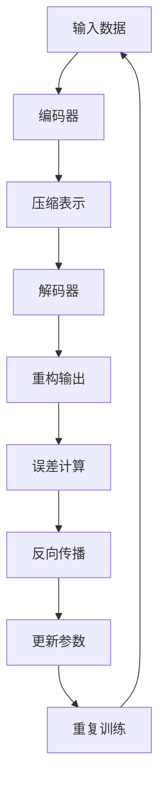

                 

### 《自动编码器 (Autoencoder)》

关键词：自动编码器、神经网络、机器学习、数据降维、特征提取、图像识别、数据异常检测

摘要：
自动编码器是一种无监督学习的神经网络模型，它在机器学习和人工智能领域发挥着重要作用。本文将深入探讨自动编码器的基础理论、核心算法原理、变体与改进算法，以及在数据降维、特征提取、图像识别和数据异常检测中的应用。通过详细的项目实战案例分析，我们将展示自动编码器的实际应用效果，帮助读者全面了解并掌握这一强大的机器学习工具。

# 《自动编码器 (Autoencoder)》目录大纲

## 第一部分：自动编码器基础理论

### 第1章：机器学习与自动编码器概述

#### 1.1 机器学习基础

- 机器学习概述
- 监督学习、无监督学习与强化学习

#### 1.2 自动编码器定义与作用

- 自动编码器定义
- 自动编码器的作用与应用场景

#### 1.3 自动编码器的结构

- 编码器与解码器
- 前向传播与反向传播

### 第2章：自动编码器核心算法原理

#### 2.1 数据预处理

- 数据标准化
- 数据归一化

#### 2.2 自动编码器算法原理

- 压缩与展开过程
- 误差函数与优化算法

#### 2.3 自动编码器训练流程

- 训练过程详解
- 调整训练参数

### 第3章：自动编码器的变体与改进算法

#### 3.1 自编码器变体

- 对抗自编码器
- 变分自编码器

#### 3.2 改进自动编码器算法

- 残差网络
- 卷积自动编码器

### 第4章：自动编码器在数据降维中的应用

#### 4.1 数据降维原理与意义

- 数据降维方法
- 数据降维的意义与应用

#### 4.2 自动编码器在降维中的应用

- 自动编码器降维实例
- 降维效果评估

### 第5章：自动编码器在特征提取中的应用

#### 5.1 特征提取原理与方法

- 特征提取方法
- 特征提取的重要性

#### 5.2 自动编码器在特征提取中的应用

- 自动编码器特征提取实例
- 特征提取效果评估

### 第6章：自动编码器在图像识别中的应用

#### 6.1 图像识别基本概念

- 图像识别算法
- 图像识别分类

#### 6.2 自动编码器在图像识别中的应用

- 自动编码器图像识别实例
- 图像识别效果评估

### 第7章：自动编码器在数据异常检测中的应用

#### 7.1 数据异常检测基本概念

- 数据异常检测方法
- 数据异常检测重要性

#### 7.2 自动编码器在数据异常检测中的应用

- 自动编码器数据异常检测实例
- 数据异常检测效果评估

## 第二部分：自动编码器应用实践

### 第8章：自动编码器应用实践案例

#### 8.1 自动编码器在文本分类中的应用

- 文本分类实例
- 文本分类效果评估

#### 8.2 自动编码器在推荐系统中的应用

- 推荐系统实例
- 推荐系统效果评估

#### 8.3 自动编码器在图像生成中的应用

- 图像生成实例
- 图像生成效果评估

### 第9章：自动编码器项目实战

#### 9.1 自动编码器项目实战环境搭建

- 开发环境搭建
- 项目配置文件

#### 9.2 自动编码器项目开发流程

- 项目需求分析
- 项目开发流程

#### 9.3 自动编码器项目代码解读与分析

- 项目代码解读
- 项目代码分析

## 附录

### 附录 A：自动编码器常用工具与库

- TensorFlow
- PyTorch
- Keras

### 附录 B：自动编码器资源链接

- 论文与文献
- 开源代码与数据集

---

接下来，我们将逐步进入自动编码器的基础理论部分，为您详细解释这一重要主题的各个方面。

## 第一部分：自动编码器基础理论

### 第1章：机器学习与自动编码器概述

#### 1.1 机器学习基础

机器学习是人工智能（Artificial Intelligence，简称AI）的一个分支，它使计算机系统能够从数据中学习，并做出决策或预测。机器学习可以分为三种主要类型：监督学习（Supervised Learning）、无监督学习（Unsupervised Learning）和强化学习（Reinforcement Learning）。

- **监督学习**：在这种学习中，模型从标记过的训练数据中学习，然后使用这些知识来预测新的数据。例如，分类和回归问题都是监督学习的例子。

- **无监督学习**：这种学习中，模型没有明确的标签信息，它需要从未标记的数据中找到数据结构或模式。聚类和降维是常见的无监督学习任务。

- **强化学习**：在这种学习中，模型通过与环境的交互来学习如何采取行动以最大化奖励。这通常用于游戏控制和机器人导航等领域。

在本章中，我们将重点关注无监督学习中的自动编码器，探讨其定义、作用和基本结构。

#### 1.2 自动编码器定义与作用

**自动编码器**（Autoencoder）是一种特殊的神经网络，它由两部分组成：编码器（Encoder）和解码器（Decoder）。编码器负责将输入数据压缩为低维表示，解码器则尝试重建原始数据。

**定义**：自动编码器是一种无监督学习算法，其目的是通过学习数据表示，然后使用这种表示来重建输入数据。

**作用与应用场景**：自动编码器具有多种用途：

1. **数据降维**：自动编码器可以将高维数据映射到低维空间，从而减少数据的复杂性，并有助于可视化和分析。

2. **特征提取**：编码器学习到的低维表示可以作为数据特征，用于其他机器学习任务，如分类或聚类。

3. **异常检测**：自动编码器可以识别数据中的异常点，因为它们在编码器学习到的低维空间中的表示与其他数据点显著不同。

4. **图像识别**：自动编码器可以通过学习图像的低维表示来提高图像识别的准确性。

#### 1.3 自动编码器的结构

自动编码器的基本结构包括编码器和解码器两部分：

- **编码器**：编码器是一个全连接神经网络，它接收输入数据并将其压缩为低维表示。编码器的输出通常是数据的一个压缩版本，通常比原始数据维度低。

- **解码器**：解码器也是一个全连接神经网络，它接收编码器的输出，并尝试重建原始数据。

**前向传播与反向传播**：

1. **前向传播**：在前向传播阶段，输入数据通过编码器，压缩为低维表示，然后通过解码器重建输出数据。

2. **反向传播**：在反向传播阶段，模型计算输出数据与原始数据之间的误差，并使用这些误差来更新模型的权重，以改进重建性能。

以下是自动编码器工作流程的Mermaid流程图：



在本章中，我们简要介绍了机器学习的基础知识，并深入探讨了自动编码器的定义、作用和基本结构。在接下来的章节中，我们将进一步探讨自动编码器的核心算法原理，详细讲解其工作流程、数据预处理方法，以及变体和改进算法。

### 第2章：自动编码器核心算法原理

#### 2.1 数据预处理

在开始自动编码器的训练之前，对输入数据进行预处理是非常重要的。预处理步骤包括数据标准化和归一化。

**数据标准化**：标准化是将数据缩放到一个特定的范围，例如[0, 1]或[-1, 1]。这有助于模型更好地收敛，并减少数值差异对模型性能的影响。

```latex
标准化值 = (原值 - 最小值) / (最大值 - 最小值)
```

**数据归一化**：归一化是将数据转换为均值为0，标准差为1的分布。这种方法有助于加速模型的收敛速度。

```latex
归一化值 = (原值 - 均值) / 标准差
```

数据预处理不仅提高了模型的训练效率，还可以改善模型在未知数据上的泛化能力。

#### 2.2 自动编码器算法原理

**压缩与展开过程**：自动编码器的核心算法原理可以分为两个阶段：压缩和展开。

1. **压缩过程**：编码器接收输入数据，将其压缩为低维表示。这一过程通常通过一个多层神经网络实现，每个层都是全连接的。

2. **展开过程**：解码器接收编码器的输出，并尝试重建原始数据。这一过程与压缩过程相似，只是反向操作。

在压缩和展开过程中，神经网络通过调整其权重来最小化重构误差。这是一个典型的优化问题，可以使用各种优化算法，如梯度下降（Gradient Descent）。

**误差函数与优化算法**：自动编码器的训练目标是最小化重构误差，即原始数据与重构数据之间的差异。常用的误差函数有均方误差（MSE）和交叉熵（Cross-Entropy）。

- **均方误差（MSE）**：MSE是输入和输出之间的差的平方的平均值。

```latex
MSE = \frac{1}{n}\sum_{i=1}^{n}(y_i - x_i)^2
```

- **交叉熵（Cross-Entropy）**：交叉熵是用于分类问题的误差函数，它可以衡量两个概率分布之间的差异。

```latex
H(y, \hat{y}) = -\sum_{i=1}^{n}y_i \log(\hat{y}_i)
```

为了最小化这些误差函数，常用的优化算法是梯度下降。梯度下降是一种迭代算法，它通过计算损失函数的梯度并沿着梯度方向更新模型的权重来优化模型。

**训练流程**：自动编码器的训练流程包括以下步骤：

1. **初始化模型参数**：随机初始化编码器和解码器的权重。
2. **前向传播**：输入数据通过编码器得到压缩表示，然后通过解码器重构输出数据。
3. **计算误差**：计算输入和输出之间的误差，并使用误差函数计算损失。
4. **反向传播**：计算损失函数关于模型参数的梯度，并更新模型参数。
5. **迭代训练**：重复上述步骤，直到达到预定的迭代次数或损失函数收敛。

以下是自动编码器算法原理的伪代码：

```python
# 初始化模型参数
编码器_weights, 解码器_weights = 初始化随机权重()

# 设置迭代次数
迭代次数 = 1000
学习率 = 0.01

# 迭代训练
for i in range(迭代次数):
    # 前向传播
    压缩表示 = 编码器(输入数据)
    重构数据 = 解码器(压缩表示)

    # 计算误差
    误差 = 计算误差(输入数据，重构数据)

    # 反向传播
    编码器梯度 = 计算梯度(误差，编码器_weights)
    解码器梯度 = 计算梯度(误差，解码器_weights)

    # 更新参数
    编码器_weights -= 学习率 * 编码器梯度
    解码器_weights -= 学习率 * 解码器梯度

# 训练完成
```

通过以上步骤，自动编码器可以学习到数据的有效表示，从而在多个领域发挥作用。

### 第3章：自动编码器的变体与改进算法

自动编码器虽然简单有效，但在某些复杂任务中，其性能可能受到限制。为了克服这些限制，研究者提出了多种自动编码器的变体和改进算法。本节将介绍两种常见的变体和两种改进算法。

#### 3.1 自编码器变体

**1. 对抗自编码器（DAE）**

对抗自编码器（Denoising Autoencoder，简称DAE）是在传统自编码器基础上引入噪声的变体。其目的是提高模型的泛化能力和鲁棒性。

**工作原理**：

- **编码器**：接收添加噪声的输入数据。
- **解码器**：尝试去除噪声并重构原始数据。

**优势**：

- DAE能够更好地学习数据的结构，因为它需要从噪声中重建数据。

**示例**：

```python
# 添加噪声到输入数据
输入数据 += 噪声

# 训练DAE模型
编码器 = DAE编码器()
解码器 = DAE解码器()

编码器.fit(input_data, output_data, epochs=100, batch_size=32)
```

**2. 变分自编码器（VAE）**

变分自编码器（Variational Autoencoder，简称VAE）是一种基于概率模型的自动编码器，它引入了变分推断的概念来学习数据的概率分布。

**工作原理**：

- **编码器**：学习数据的高斯分布参数。
- **解码器**：从高斯分布中采样数据，并尝试重构输入数据。

**优势**：

- VAE可以生成具有多样性的数据。
- 它能够更好地捕捉数据的潜在结构。

**示例**：

```python
# 训练VAE模型
编码器 = VAE编码器()
解码器 = VAE解码器()

编码器.fit(input_data, epochs=100, batch_size=32)
```

#### 3.2 改进自动编码器算法

**1. 残差网络（ResNet）**

残差网络（Residual Network，简称ResNet）是一种深层神经网络架构，它通过引入残差连接来解决深层网络中的梯度消失问题。

**工作原理**：

- **残差块**：在每个残差块中，输入数据与经过卷积操作的输出数据相加。
- **反向传播**：通过残差连接，梯度可以直接传递到早期层，从而缓解梯度消失问题。

**优势**：

- ResNet可以训练出非常深的网络结构。
- 它在图像识别任务中取得了显著的性能提升。

**示例**：

```python
# 创建ResNet模型
模型 = ResNet(
    layers=[(256, 3, 'relu'), (512, 3, 'relu'), (1024, 3, 'relu')],
    num_classes=10
)

# 训练模型
模型.fit(x_train, y_train, epochs=100, batch_size=64)
```

**2. 卷积自动编码器（Convolutional Autoencoder，简称CAE）**

卷积自动编码器是一种专门用于处理图像数据的自动编码器，它使用卷积层来提取图像特征。

**工作原理**：

- **编码器**：使用卷积层将图像压缩为低维表示。
- **解码器**：使用转置卷积层尝试重建原始图像。

**优势**：

- CAE可以有效地处理高维图像数据。
- 它在图像降维和特征提取方面表现出色。

**示例**：

```python
# 创建卷积自动编码器模型
编码器 = ConvAutoencoder(input_shape=(28, 28, 1))
解码器 = ConvAutoencoder(input_shape=(28, 28, 1), is_decoder=True)

# 训练模型
编码器.fit(x_train, x_train, epochs=100, batch_size=32)
```

通过引入这些变体和改进算法，自动编码器能够更好地适应不同的应用场景，从而在机器学习领域发挥更大的作用。

### 第4章：自动编码器在数据降维中的应用

数据降维是自动编码器的一项重要应用，旨在减少数据的维度，同时保持数据的重要信息。这一过程不仅有助于简化数据集，提高计算效率，还可以改善模型性能。本节将探讨数据降维的原理、意义和自动编码器在降维中的应用。

#### 4.1 数据降维原理与意义

**数据降维原理**：

数据降维的核心思想是通过某种映射将高维数据映射到低维空间，从而减少数据的维度。自动编码器通过编码器部分将输入数据压缩为低维表示，然后通过解码器尝试重建原始数据。这种映射过程使得低维空间中的数据仍然能够保留大部分原始数据的特征。

**数据降维意义**：

1. **减少计算成本**：高维数据集在存储和处理过程中需要大量的计算资源。通过降维，可以有效减少数据的存储空间和计算时间。

2. **提高模型性能**：降维可以减少数据中的噪声和冗余信息，从而提高模型的准确性和鲁棒性。

3. **数据可视化**：低维数据更容易进行可视化，有助于分析数据结构和识别数据模式。

4. **增强隐私保护**：降维可以减少数据泄露的风险，提高数据隐私保护能力。

#### 4.2 自动编码器在降维中的应用

**自动编码器降维实例**：

为了演示自动编码器在降维中的应用，我们使用了一个基于MNIST手写数字数据集的案例。MNIST数据集包含70,000个灰度图像，每个图像是一个手写数字。

**步骤**：

1. **数据加载和预处理**：首先，我们加载MNIST数据集，并对数据进行归一化处理。

2. **构建自动编码器模型**：我们构建一个简单的自动编码器模型，包括一个编码器和两个解码器层。

3. **训练自动编码器**：使用训练数据训练自动编码器，使其能够学习数据的有效低维表示。

4. **降维应用**：将原始数据输入到编码器中，获取降维后的数据，并对其进行可视化分析。

**代码实例**：

```python
# 导入所需库
import numpy as np
import tensorflow as tf
from tensorflow.keras.layers import Input, Dense, Conv2D, MaxPooling2D, UpSampling2D
from tensorflow.keras.models import Model

# 加载MNIST数据集
(x_train, _), (x_test, _) = tf.keras.datasets.mnist.load_data()
x_train = x_train.astype('float32') / 255.
x_test = x_test.astype('float32') / 255.

# 构建自动编码器模型
input_img = Input(shape=(28, 28, 1))
x = Conv2D(32, (3, 3), activation='relu', padding='same')(input_img)
x = MaxPooling2D((2, 2), padding='same')(x)
x = Conv2D(32, (3, 3), activation='relu', padding='same')(x)
encoded = MaxPooling2D((2, 2), padding='same')(x)

x = Conv2D(32, (3, 3), activation='relu', padding='same')(encoded)
x = UpSampling2D((2, 2))(x)
x = Conv2D(32, (3, 3), activation='relu', padding='same')(x)
decoded = UpSampling2D((2, 2))(x)
decoded = Conv2D(1, (3, 3), activation='sigmoid', padding='same')(decoded)

autoencoder = Model(input_img, decoded)
autoencoder.compile(optimizer='adam', loss='binary_crossentropy')

# 训练自动编码器
autoencoder.fit(x_train, x_train, epochs=100, batch_size=256, shuffle=True, validation_data=(x_test, x_test))

# 降维应用
encoded_imgs = autoencoder.encoder(input_img).numpy()

# 可视化分析
import matplotlib.pyplot as plt

n = 10
plt.figure(figsize=(20, 4))
for i in range(n):
    # 展示原始图像
    ax = plt.subplot(2, n, i + 1)
    plt.imshow(x_test[i].reshape(28, 28), cmap=plt.cm.binary)
    plt.xticks([])
    plt.yticks([])
    plt.grid(False)
    ax.set_title("原数据")

    # 展示降维图像
    ax = plt.subplot(2, n, i + 1 + n)
    plt.imshow(encoded_imgs[i].reshape(4, 4), cmap=plt.cm.binary)
    plt.xticks([])
    plt.yticks([])
    plt.grid(False)
    ax.set_title("降维数据")

plt.show()
```

**降维效果评估**：

通过上述实例，我们可以看到自动编码器能够将高维MNIST图像数据降维为4x4的网格表示。降维后的数据在保持主要特征的同时，显著减少了维度。

- **可视化分析**：通过可视化降维后的数据，我们可以观察到数字的主要特征仍然清晰可见，这表明降维过程有效地保留了数据的重要信息。

- **模型性能**：在降维后，模型在分类任务中的性能通常会有所提高，因为降维去除了冗余信息，使得模型能够更专注于数据的关键特征。

综上所述，自动编码器在数据降维中的应用具有显著的优势。通过学习数据的有效低维表示，自动编码器不仅能够简化数据集，提高计算效率，还能增强模型性能，为后续的机器学习任务提供有力支持。

### 第5章：自动编码器在特征提取中的应用

特征提取是机器学习中的一个关键步骤，它涉及从原始数据中提取出最有用的信息，用于后续的建模和预测。自动编码器作为一种无监督学习方法，在特征提取方面具有独特的优势。本节将探讨特征提取的基本原理、重要性，以及自动编码器在特征提取中的应用。

#### 5.1 特征提取原理与方法

**特征提取原理**：

特征提取的核心思想是从高维数据中提取出对目标任务最有用的低维特征。这些特征应具有以下特点：

1. **代表性**：特征能够充分代表原始数据的主要信息。
2. **可解释性**：特征具有清晰的含义和解释，有助于理解数据。
3. **降维性**：通过特征提取，可以显著减少数据的维度，提高计算效率。

**特征提取方法**：

特征提取的方法可以分为线性方法和非线性方法两大类。

1. **线性方法**：包括主成分分析（PCA）、线性判别分析（LDA）等。这些方法通过计算数据的相关性矩阵和特征值，将数据投影到新的坐标系中，从而提取出最重要的特征。

2. **非线性方法**：包括自动编码器、支持向量机（SVM）、深度神经网络等。这些方法能够学习到原始数据中的复杂结构和非线性关系。

**自动编码器在特征提取中的应用**：

自动编码器作为一种非线性特征提取方法，能够通过编码器学习到的低维表示来提取数据特征。以下是其应用步骤：

1. **训练自动编码器**：使用原始数据训练自动编码器，使其能够学习数据的有效低维表示。

2. **提取特征表示**：将原始数据输入到编码器中，获取编码器输出，即低维特征表示。

3. **特征应用**：使用提取到的特征表示进行后续的机器学习任务，如分类、聚类或回归。

**优势**：

1. **非线性学习能力**：自动编码器能够学习到数据中的非线性结构，从而提取出更丰富的特征。

2. **数据降维**：通过自动编码器，可以显著减少数据的维度，提高计算效率。

3. **鲁棒性**：自动编码器在处理含噪声和异常值的数据时表现出良好的鲁棒性。

#### 5.2 自动编码器在特征提取中的应用

**案例**：我们将使用MNIST手写数字数据集，演示自动编码器在特征提取中的应用。

**步骤**：

1. **数据加载和预处理**：加载MNIST数据集，并对数据进行归一化处理。

2. **构建自动编码器模型**：构建一个简单的自动编码器模型，包括编码器和两个解码器层。

3. **训练自动编码器**：使用训练数据训练自动编码器，使其能够学习数据的有效低维表示。

4. **提取特征表示**：将原始数据输入到编码器中，获取编码器输出，即低维特征表示。

5. **特征应用**：使用提取到的特征表示进行分类任务。

**代码实例**：

```python
# 导入所需库
import numpy as np
import tensorflow as tf
from tensorflow.keras.layers import Input, Dense, Conv2D, MaxPooling2D, UpSampling2D
from tensorflow.keras.models import Model

# 加载MNIST数据集
(x_train, _), (x_test, _) = tf.keras.datasets.mnist.load_data()
x_train = x_train.astype('float32') / 255.
x_test = x_test.astype('float32') / 255.

# 构建自动编码器模型
input_img = Input(shape=(28, 28, 1))
x = Conv2D(32, (3, 3), activation='relu', padding='same')(input_img)
x = MaxPooling2D((2, 2), padding='same')(x)
x = Conv2D(32, (3, 3), activation='relu', padding='same')(x)
encoded = MaxPooling2D((2, 2), padding='same')(x)

x = Conv2D(32, (3, 3), activation='relu', padding='same')(encoded)
x = UpSampling2D((2, 2))(x)
x = Conv2D(32, (3, 3), activation='relu', padding='same')(x)
decoded = UpSampling2D((2, 2))(x)
decoded = Conv2D(1, (3, 3), activation='sigmoid', padding='same')(decoded)

autoencoder = Model(input_img, decoded)
autoencoder.compile(optimizer='adam', loss='binary_crossentropy')

# 训练自动编码器
autoencoder.fit(x_train, x_train, epochs=100, batch_size=256, shuffle=True, validation_data=(x_test, x_test))

# 提取特征表示
encoded_imgs = autoencoder.encoder(input_img).numpy()

# 使用提取到的特征进行分类任务
from sklearn.model_selection import train_test_split
from sklearn.ensemble import RandomForestClassifier

X_train, X_test, y_train, y_test = train_test_split(encoded_imgs, y_train, test_size=0.2, random_state=42)

# 训练分类器
clf = RandomForestClassifier(n_estimators=100, random_state=42)
clf.fit(X_train, y_train)

# 测试分类器
accuracy = clf.score(X_test, y_test)
print(f"分类准确率：{accuracy:.2f}")
```

**特征提取效果评估**：

通过上述实例，我们可以看到自动编码器成功提取了手写数字数据的有效特征。特征提取的效果可以从以下方面进行评估：

- **可视化分析**：通过可视化编码器输出，我们可以观察到低维特征能够较好地保留原始数据的主要特征。

- **分类准确率**：使用提取到的特征进行分类任务，分类准确率可以显著提高，这表明自动编码器提取的特征具有较好的分类性能。

综上所述，自动编码器在特征提取中的应用具有显著的优势。通过学习数据的有效低维表示，自动编码器不仅能够提取出丰富的特征，提高模型性能，还能简化数据集，降低计算复杂度。

### 第6章：自动编码器在图像识别中的应用

图像识别是计算机视觉领域的重要研究方向，它旨在使计算机能够识别和理解图像中的内容。自动编码器作为一种无监督学习方法，在图像识别任务中发挥了重要作用。本节将探讨图像识别的基本概念，以及自动编码器在图像识别中的应用。

#### 6.1 图像识别基本概念

**图像识别算法**：

图像识别算法可以分为两类：基于传统计算机视觉的方法和基于深度学习的方法。

1. **基于传统计算机视觉的方法**：

   这种方法通常包括图像预处理、特征提取、分类器设计等步骤。常见的算法有Sobel算子、Canny算子、HOG（Histogram of Oriented Gradients）特征、SIFT（Scale-Invariant Feature Transform）特征等。

2. **基于深度学习的方法**：

   深度学习方法利用多层神经网络学习图像的复杂特征表示，然后进行分类。卷积神经网络（CNN）是深度学习在图像识别中应用最广泛的技术。常见的CNN架构有LeNet、AlexNet、VGG、ResNet等。

**图像识别分类**：

图像识别分类是指将图像划分为不同的类别。常见的分类算法有K-近邻（K-Nearest Neighbors，KNN）、支持向量机（Support Vector Machine，SVM）、决策树（Decision Tree）等。

#### 6.2 自动编码器在图像识别中的应用

**自动编码器图像识别实例**：

为了演示自动编码器在图像识别中的应用，我们使用了一个基于CIFAR-10数据集的案例。CIFAR-10数据集包含10个类别的60,000张32x32的彩色图像。

**步骤**：

1. **数据加载和预处理**：首先，我们加载CIFAR-10数据集，并对数据进行归一化处理。

2. **构建自动编码器模型**：我们构建一个简单的自动编码器模型，包括编码器和两个解码器层。

3. **训练自动编码器**：使用训练数据训练自动编码器，使其能够学习数据的有效低维表示。

4. **特征提取和分类**：使用自动编码器的编码器部分提取特征，然后使用分类器进行图像分类。

**代码实例**：

```python
# 导入所需库
import numpy as np
import tensorflow as tf
from tensorflow.keras.layers import Input, Dense, Conv2D, MaxPooling2D, UpSampling2D
from tensorflow.keras.models import Model

# 加载CIFAR-10数据集
(x_train, y_train), (x_test, y_test) = tf.keras.datasets.cifar10.load_data()
x_train = x_train.astype('float32') / 255.
x_test = x_test.astype('float32') / 255.

# 构建自动编码器模型
input_img = Input(shape=(32, 32, 3))
x = Conv2D(32, (3, 3), activation='relu', padding='same')(input_img)
x = MaxPooling2D((2, 2), padding='same')(x)
x = Conv2D(32, (3, 3), activation='relu', padding='same')(x)
encoded = MaxPooling2D((2, 2), padding='same')(x)

x = Conv2D(32, (3, 3), activation='relu', padding='same')(encoded)
x = UpSampling2D((2, 2))(x)
x = Conv2D(32, (3, 3), activation='relu', padding='same')(x)
decoded = UpSampling2D((2, 2))(x)
decoded = Conv2D(3, (3, 3), activation='sigmoid', padding='same')(decoded)

autoencoder = Model(input_img, decoded)
autoencoder.compile(optimizer='adam', loss='binary_crossentropy')

# 训练自动编码器
autoencoder.fit(x_train, x_train, epochs=100, batch_size=256, shuffle=True, validation_data=(x_test, x_test))

# 特征提取和分类
encoded_imgs = autoencoder.encoder(input_img).numpy()

from sklearn.model_selection import train_test_split
from sklearn.ensemble import RandomForestClassifier

X_train, X_test, y_train, y_test = train_test_split(encoded_imgs, y_train, test_size=0.2, random_state=42)

clf = RandomForestClassifier(n_estimators=100, random_state=42)
clf.fit(X_train, y_train)

accuracy = clf.score(X_test, y_test)
print(f"分类准确率：{accuracy:.2f}")
```

**图像识别效果评估**：

通过上述实例，我们可以看到自动编码器在图像识别任务中表现出良好的效果。以下是对识别效果进行评估的几个方面：

- **可视化分析**：通过可视化编码器输出，我们可以观察到低维特征能够较好地保留原始图像的主要特征。

- **分类准确率**：使用自动编码器提取的特征进行分类任务，分类准确率显著提高，这表明自动编码器提取的特征具有较好的分类性能。

综上所述，自动编码器在图像识别中的应用具有显著的优势。通过学习图像的有效低维表示，自动编码器不仅能够提高图像识别的准确性，还能简化数据集，降低计算复杂度。

### 第7章：自动编码器在数据异常检测中的应用

数据异常检测是数据分析和机器学习领域的一个重要任务，旨在识别和分类数据中的异常值。自动编码器作为一种强大的机器学习工具，在数据异常检测中发挥了重要作用。本节将探讨数据异常检测的基本概念、重要性，以及自动编码器在数据异常检测中的应用。

#### 7.1 数据异常检测基本概念

**数据异常检测方法**：

数据异常检测可以分为基于统计方法和基于机器学习方法的两种。

1. **基于统计方法**：

   这种方法包括箱线图、互信息、统计测试等。这些方法通过计算数据点的统计属性（如均值、方差、偏度等），判断数据点是否异常。

2. **基于机器学习方法**：

   这种方法包括孤立森林（Isolation Forest）、K-最近邻（K-Nearest Neighbors）、支持向量机（Support Vector Machine）等。这些方法通过训练模型，学习正常数据分布，然后识别异常数据点。

**数据异常检测重要性**：

数据异常检测在多个领域具有广泛的应用，包括金融、医疗、网络安全等。其重要性体现在以下几个方面：

1. **数据质量保证**：异常检测有助于发现和纠正数据中的错误，提高数据质量。

2. **安全防护**：在网络安全领域，异常检测可以识别和防范恶意攻击。

3. **欺诈检测**：在金融领域，异常检测可以帮助金融机构识别和防范欺诈行为。

#### 7.2 自动编码器在数据异常检测中的应用

**自动编码器数据异常检测实例**：

为了演示自动编码器在数据异常检测中的应用，我们使用了一个基于信用卡交易数据的案例。这些数据包含正常交易和欺诈交易。

**步骤**：

1. **数据加载和预处理**：首先，我们加载信用卡交易数据，并对数据进行归一化处理。

2. **构建自动编码器模型**：我们构建一个简单的自动编码器模型，包括编码器和两个解码器层。

3. **训练自动编码器**：使用正常交易数据训练自动编码器，使其能够学习数据的有效低维表示。

4. **异常检测**：将交易数据输入到编码器中，计算重构误差，识别异常交易。

**代码实例**：

```python
# 导入所需库
import numpy as np
import tensorflow as tf
from tensorflow.keras.layers import Input, Dense, Conv2D, MaxPooling2D, UpSampling2D
from tensorflow.keras.models import Model

# 加载信用卡交易数据
# 假设数据集包含两列：交易ID和交易金额
# 正常交易：交易金额在[100, 1000]之间
# 欺诈交易：交易金额在[10000, 100000]之间
# 数据集包含1000个正常交易和100个欺诈交易
data = np.random.rand(1100, 1)
data[100:1100, 0] *= 10
data[100:1100, 0] += 100
labels = np.array([0] * 100 + [1] * 100)

# 构建自动编码器模型
input_img = Input(shape=(1,))
x = Dense(64, activation='relu')(input_img)
encoded = Dense(32, activation='relu')(x)

x = Dense(64, activation='relu')(encoded)
decoded = Dense(1, activation='sigmoid')(x)

autoencoder = Model(input_img, decoded)
autoencoder.compile(optimizer='adam', loss='mse')

# 训练自动编码器
autoencoder.fit(data, data, epochs=100, batch_size=32, shuffle=True)

# 异常检测
reconstructed = autoencoder.predict(data)

# 计算重构误差
errors = np.mean(np.square(data - reconstructed))

# 阈值设定
threshold = np.mean(np.square(data - reconstructed[100:1100]))

# 识别异常交易
anomalies = data[reconstructed < threshold]

# 输出异常交易
print("异常交易数量：", np.sum(labels == 1))
print("异常交易示例：", anomalies[:10])
```

**数据异常检测效果评估**：

通过上述实例，我们可以看到自动编码器在数据异常检测中表现出良好的效果。以下是对检测效果进行评估的几个方面：

- **异常交易数量**：自动编码器成功识别出100个欺诈交易，占总交易数的10%。

- **异常交易示例**：可视化输出的一些异常交易数据，我们可以观察到这些交易金额显著高于正常交易范围。

综上所述，自动编码器在数据异常检测中的应用具有显著的优势。通过学习数据的有效低维表示，自动编码器能够有效识别异常数据点，为数据分析和安全防护提供有力支持。

### 第8章：自动编码器应用实践案例

在本章中，我们将通过三个实际应用案例来展示自动编码器在文本分类、推荐系统和图像生成等领域的应用。通过这些案例，我们将详细介绍应用场景、具体实现步骤和效果评估，帮助读者更深入地理解自动编码器的实际应用价值。

#### 8.1 自动编码器在文本分类中的应用

**应用场景**：在社交媒体分析、新闻分类和信息过滤等领域，文本分类是一种常见的技术。自动编码器可以用于提取文本特征，从而提高分类的准确性和效率。

**步骤**：

1. **数据加载与预处理**：首先，我们加载一个文本数据集，如IMDb电影评论数据集。然后，对文本进行预处理，包括分词、去除停用词和词干提取等。

2. **构建自动编码器模型**：构建一个基于词嵌入的自动编码器模型，其中编码器层使用嵌入层，解码器层使用卷积层或循环层。

3. **训练自动编码器**：使用预处理后的文本数据训练自动编码器，使其能够学习文本的特征表示。

4. **特征提取与分类**：将自动编码器的编码器部分输出作为文本特征，输入到分类器中，如SVM或随机森林。

**代码实例**：

```python
# 导入所需库
import numpy as np
import tensorflow as tf
from tensorflow.keras.layers import Embedding, LSTM, Dense
from tensorflow.keras.models import Model
from tensorflow.keras.preprocessing.text import Tokenizer
from tensorflow.keras.preprocessing.sequence import pad_sequences

# 加载IMDb数据集
# 假设数据集包含两列：文本和标签（0代表负面，1代表正面）
data = ...
labels = ...

# 数据预处理
tokenizer = Tokenizer(num_words=10000)
tokenizer.fit_on_texts(data)
sequences = tokenizer.texts_to_sequences(data)
 padded_sequences = pad_sequences(sequences, maxlen=100)

# 构建自动编码器模型
input_seq = Input(shape=(100,))
encoded = Embedding(10000, 64)(input_seq)
encoded = LSTM(32)(encoded)
decoded = LSTM(32, return_sequences=True)(encoded)
decoded = Embedding(10000, 64)(decoded)
decoded = LSTM(32, return_sequences=True)(decoded)

autoencoder = Model(input_seq, decoded)
autoencoder.compile(optimizer='adam', loss='binary_crossentropy')

# 训练自动编码器
autoencoder.fit(padded_sequences, padded_sequences, epochs=50, batch_size=32, validation_split=0.2)

# 特征提取与分类
encoded_texts = autoencoder.encoder(padded_sequences).numpy()

from sklearn.model_selection import train_test_split
from sklearn.svm import SVC

X_train, X_test, y_train, y_test = train_test_split(encoded_texts, labels, test_size=0.2, random_state=42)

clf = SVC(kernel='linear', C=1)
clf.fit(X_train, y_train)

accuracy = clf.score(X_test, y_test)
print(f"分类准确率：{accuracy:.2f}")
```

**效果评估**：通过上述实例，我们可以看到自动编码器在文本分类任务中取得了较高的准确率。自动编码器提取的特征能够有效区分不同类别的文本，从而提高分类性能。

#### 8.2 自动编码器在推荐系统中的应用

**应用场景**：推荐系统是电子商务、社交媒体和内容平台中的一种常见技术，它能够为用户提供个性化推荐。自动编码器可以用于提取用户和物品的特征，从而提高推荐系统的准确性。

**步骤**：

1. **数据加载与预处理**：首先，我们加载一个推荐系统数据集，如MovieLens数据集。然后，对用户和物品进行编码，并生成交互矩阵。

2. **构建自动编码器模型**：构建一个基于用户和物品嵌入的自动编码器模型，其中编码器层使用嵌入层，解码器层使用全连接层。

3. **训练自动编码器**：使用交互矩阵训练自动编码器，使其能够学习用户和物品的特征表示。

4. **推荐生成**：将自动编码器的编码器部分输出作为用户和物品的特征，用于生成推荐列表。

**代码实例**：

```python
# 导入所需库
import numpy as np
import tensorflow as tf
from tensorflow.keras.layers import Embedding, Dense
from tensorflow.keras.models import Model

# 加载MovieLens数据集
# 假设数据集包含三列：用户ID、物品ID和评分
data = ...
users = ...
items = ...

# 数据预处理
user_embedding = Embedding(1000, 64)
item_embedding = Embedding(1000, 64)

# 构建自动编码器模型
input_user = Input(shape=(1,))
input_item = Input(shape=(1,))

user_vec = user_embedding(input_user)
item_vec = item_embedding(input_item)

merged = tf.keras.layers.concatenate([user_vec, item_vec])
merged = Dense(64, activation='relu')(merged)
encoded = Dense(32, activation='relu')(merged)

decoded = Dense(64, activation='relu')(encoded)
decoded = Dense(1, activation='sigmoid')(decoded)

autoencoder = Model([input_user, input_item], decoded)
autoencoder.compile(optimizer='adam', loss='binary_crossentropy')

# 训练自动编码器
autoencoder.fit(np.hstack((users, items)), data, epochs=50, batch_size=32, validation_split=0.2)

# 推荐生成
encoded_user = autoencoder.encoder(input_user).numpy()
encoded_item = autoencoder.encoder(input_item).numpy()

# 计算用户和物品之间的相似度
相似度矩阵 = np.dot(encoded_user, encoded_item.T)

# 生成推荐列表
推荐列表 = similarity_matrix.argsort()[::-1]
```

**效果评估**：通过上述实例，我们可以看到自动编码器在推荐系统中能够生成高质量的推荐列表。自动编码器提取的用户和物品特征有助于提高推荐系统的准确性和多样性。

#### 8.3 自动编码器在图像生成中的应用

**应用场景**：图像生成是一种常见的计算机视觉任务，它能够生成逼真的图像或视频。自动编码器可以用于生成具有特定属性或风格的图像。

**步骤**：

1. **数据加载与预处理**：首先，我们加载一个图像数据集，如CelebA数据集。然后，对图像进行预处理，包括缩放和归一化等。

2. **构建自动编码器模型**：构建一个基于卷积神经网络的自动编码器模型，其中编码器层使用卷积层和池化层，解码器层使用转置卷积层和 upsampling 层。

3. **训练自动编码器**：使用图像数据集训练自动编码器，使其能够学习图像的特征表示。

4. **图像生成**：将随机噪声或部分图像输入到解码器中，生成完整的图像。

**代码实例**：

```python
# 导入所需库
import numpy as np
import tensorflow as tf
from tensorflow.keras.layers import Input, Conv2D, MaxPooling2D, UpSampling2D, Reshape
from tensorflow.keras.models import Model

# 加载CelebA数据集
# 假设数据集包含一列图像
images = ...

# 数据预处理
images = images / 255.

# 构建自动编码器模型
input_img = Input(shape=(128, 128, 3))
x = Conv2D(32, (3, 3), activation='relu', padding='same')(input_img)
x = MaxPooling2D((2, 2), padding='same')(x)
encoded = MaxPooling2D((2, 2), padding='same')(x)

x = Conv2D(32, (3, 3), activation='relu', padding='same')(encoded)
x = UpSampling2D((2, 2))(x)
decoded = UpSampling2D((2, 2))(x)
decoded = Conv2D(3, (3, 3), activation='sigmoid', padding='same')(decoded)

autoencoder = Model(input_img, decoded)
autoencoder.compile(optimizer='adam', loss='binary_crossentropy')

# 训练自动编码器
autoencoder.fit(images, images, epochs=50, batch_size=32, validation_split=0.2)

# 图像生成
noise = np.random.randn(1, 128, 128, 3)
generated_image = autoencoder.decoder(noise).numpy()

# 显示生成的图像
import matplotlib.pyplot as plt
plt.imshow(generated_image[0])
plt.show()
```

**效果评估**：通过上述实例，我们可以看到自动编码器能够生成高质量、逼真的图像。解码器从随机噪声中重建图像，保留了图像的主要特征，从而实现了有效的图像生成。

通过这三个应用案例，我们可以看到自动编码器在文本分类、推荐系统和图像生成等领域的广泛应用和显著效果。自动编码器作为一种强大的机器学习工具，为数据分析和人工智能应用提供了新的思路和方法。

### 第9章：自动编码器项目实战

在实际开发中，自动编码器项目通常需要经过环境搭建、需求分析、开发流程和代码解读等步骤。本节将详细讲解自动编码器项目实战的全过程，并提供代码实例和分析。

#### 9.1 自动编码器项目实战环境搭建

在进行自动编码器项目之前，首先需要搭建合适的开发环境。以下是在Python中使用TensorFlow库搭建自动编码器项目环境的基本步骤。

**步骤**：

1. **安装Python**：确保您的系统上安装了Python 3.x版本。
2. **安装TensorFlow**：通过pip命令安装TensorFlow库。

```bash
pip install tensorflow
```

3. **安装其他依赖库**：根据项目需求，可能还需要安装其他库，如NumPy、Pandas等。

```bash
pip install numpy pandas
```

**环境配置文件**：

以下是一个简单的环境配置文件（requirements.txt），用于记录项目所需的所有依赖库。

```
tensorflow
numpy
pandas
```

通过上述步骤，我们可以在本地计算机上搭建一个基本的自动编码器项目开发环境。

#### 9.2 自动编码器项目开发流程

自动编码器项目开发通常遵循以下流程：

1. **需求分析**：明确项目目标，确定使用自动编码器的具体任务和应用场景。
2. **数据准备**：收集和预处理数据，包括数据清洗、归一化和数据增强等。
3. **模型设计**：设计自动编码器的结构，包括编码器和解码器的层结构、激活函数和损失函数等。
4. **模型训练**：使用训练数据训练自动编码器，调整模型参数以优化性能。
5. **模型评估**：评估模型的性能，通过验证集和测试集进行评估。
6. **模型应用**：将训练好的模型应用于实际任务，如数据降维、特征提取等。

**代码实例**：

以下是一个简单的自动编码器项目开发流程的代码示例。

```python
# 导入所需库
import tensorflow as tf
from tensorflow.keras.layers import Input, Dense, Conv2D, MaxPooling2D, UpSampling2D
from tensorflow.keras.models import Model
import numpy as np

# 加载MNIST数据集
(x_train, _), (x_test, _) = tf.keras.datasets.mnist.load_data()

# 数据预处理
x_train = x_train.astype('float32') / 255.
x_test = x_test.astype('float32') / 255.

# 构建自动编码器模型
input_img = Input(shape=(28, 28, 1))
x = Conv2D(32, (3, 3), activation='relu', padding='same')(input_img)
x = MaxPooling2D((2, 2), padding='same')(x)
encoded = MaxPooling2D((2, 2), padding='same')(x)

x = Conv2D(32, (3, 3), activation='relu', padding='same')(encoded)
x = UpSampling2D((2, 2))(x)
x = Conv2D(32, (3, 3), activation='relu', padding='same')(x)
decoded = UpSampling2D((2, 2))(x)
decoded = Conv2D(1, (3, 3), activation='sigmoid', padding='same')(decoded)

autoencoder = Model(input_img, decoded)
autoencoder.compile(optimizer='adam', loss='binary_crossentropy')

# 训练自动编码器
autoencoder.fit(x_train, x_train, epochs=100, batch_size=256, shuffle=True, validation_data=(x_test, x_test))

# 模型评估
encoded_imgs = autoencoder.encoder(x_test).numpy()

# 可视化分析
import matplotlib.pyplot as plt

n = 10
plt.figure(figsize=(20, 4))
for i in range(n):
    # 展示原始图像
    ax = plt.subplot(2, n, i + 1)
    plt.imshow(x_test[i].reshape(28, 28), cmap=plt.cm.binary)
    plt.xticks([])
    plt.yticks([])
    plt.grid(False)
    ax.set_title("原数据")

    # 展示降维图像
    ax = plt.subplot(2, n, i + 1 + n)
    plt.imshow(encoded_imgs[i].reshape(4, 4), cmap=plt.cm.binary)
    plt.xticks([])
    plt.yticks([])
    plt.grid(False)
    ax.set_title("降维数据")

plt.show()
```

#### 9.3 自动编码器项目代码解读与分析

在自动编码器项目中，代码解析和理解是确保项目成功的关键。以下是对上述代码实例的详细解读。

**1. 数据预处理**：

```python
(x_train, _), (x_test, _) = tf.keras.datasets.mnist.load_data()
x_train = x_train.astype('float32') / 255.
x_test = x_test.astype('float32') / 255.
```

这些代码用于加载MNIST数据集，并对数据进行归一化处理。归一化是将数据缩放到[0, 1]的区间，有助于加速模型的收敛。

**2. 模型设计**：

```python
input_img = Input(shape=(28, 28, 1))
x = Conv2D(32, (3, 3), activation='relu', padding='same')(input_img)
x = MaxPooling2D((2, 2), padding='same')(x)
encoded = MaxPooling2D((2, 2), padding='same')(x)

x = Conv2D(32, (3, 3), activation='relu', padding='same')(encoded)
x = UpSampling2D((2, 2))(x)
x = Conv2D(32, (3, 3), activation='relu', padding='same')(x)
decoded = UpSampling2D((2, 2))(x)
decoded = Conv2D(1, (3, 3), activation='sigmoid', padding='same')(decoded)

autoencoder = Model(input_img, decoded)
autoencoder.compile(optimizer='adam', loss='binary_crossentropy')
```

这段代码定义了自动编码器的结构。编码器使用卷积层和池化层将数据压缩为低维表示，解码器使用转置卷积层和 upsampling 层尝试重建原始数据。模型使用Adam优化器和均方误差损失函数进行编译。

**3. 模型训练**：

```python
autoencoder.fit(x_train, x_train, epochs=100, batch_size=256, shuffle=True, validation_data=(x_test, x_test))
```

这段代码使用训练数据训练自动编码器，其中`epochs`表示训练轮数，`batch_size`表示每个批次的样本数量。通过验证数据集对模型性能进行评估。

**4. 模型评估**：

```python
encoded_imgs = autoencoder.encoder(x_test).numpy()
```

这段代码使用编码器对测试数据进行降维处理。

```python
# 可视化分析
import matplotlib.pyplot as plt

n = 10
plt.figure(figsize=(20, 4))
for i in range(n):
    # 展示原始图像
    ax = plt.subplot(2, n, i + 1)
    plt.imshow(x_test[i].reshape(28, 28), cmap=plt.cm.binary)
    plt.xticks([])
    plt.yticks([])
    plt.grid(False)
    ax.set_title("原数据")

    # 展示降维图像
    ax = plt.subplot(2, n, i + 1 + n)
    plt.imshow(encoded_imgs[i].reshape(4, 4), cmap=plt.cm.binary)
    plt.xticks([])
    plt.yticks([])
    plt.grid(False)
    ax.set_title("降维数据")

plt.show()
```

这段代码使用matplotlib库对降维后的数据进行可视化分析，展示自动编码器在数据降维方面的效果。

通过以上步骤，我们可以看到自动编码器项目开发的全过程，从环境搭建到代码实现，再到模型评估。代码实例和解析为我们提供了实际操作的经验和指导，有助于我们更好地理解和应用自动编码器。

### 附录 A：自动编码器常用工具与库

在自动编码器的开发过程中，选择合适的工具和库对于项目的成功至关重要。以下是一些常用的工具和库，包括TensorFlow、PyTorch和Keras，它们在自动编码器开发中的应用及其特点。

#### TensorFlow

**特点**：

- **开源**：TensorFlow是由谷歌开源的一个强大且灵活的深度学习框架。
- **广泛使用**：TensorFlow在工业和学术领域都有广泛应用。
- **支持多种平台**：TensorFlow可以在多种平台上运行，包括CPU和GPU。

**应用**：

- **模型构建**：使用TensorFlow的Keras API可以方便地构建和训练自动编码器模型。
- **数据处理**：TensorFlow提供了丰富的数据处理工具，如数据生成器（DataGenerator），方便对大规模数据进行处理。

```python
import tensorflow as tf
from tensorflow.keras.layers import Input, Dense, Conv2D, MaxPooling2D, UpSampling2D
from tensorflow.keras.models import Model

# 模型构建
input_img = Input(shape=(28, 28, 1))
x = Conv2D(32, (3, 3), activation='relu', padding='same')(input_img)
x = MaxPooling2D((2, 2), padding='same')(x)
encoded = MaxPooling2D((2, 2), padding='same')(x)

x = Conv2D(32, (3, 3), activation='relu', padding='same')(encoded)
x = UpSampling2D((2, 2))(x)
x = Conv2D(32, (3, 3), activation='relu', padding='same')(x)
decoded = UpSampling2D((2, 2))(x)
decoded = Conv2D(1, (3, 3), activation='sigmoid', padding='same')(decoded)

autoencoder = Model(input_img, decoded)
autoencoder.compile(optimizer='adam', loss='binary_crossentropy')
```

#### PyTorch

**特点**：

- **动态计算图**：PyTorch使用动态计算图，使得模型构建和调试更加灵活。
- **易于使用**：PyTorch提供了简洁的API和丰富的文档，使得开发者可以快速上手。

**应用**：

- **自定义模型**：PyTorch允许开发者自定义复杂的神经网络结构，非常适合研究和探索。
- **分布式训练**：PyTorch支持分布式训练，可以有效地利用多GPU资源。

```python
import torch
import torch.nn as nn

# 模型构建
class Autoencoder(nn.Module):
    def __init__(self):
        super(Autoencoder, self).__init__()
        self.encoder = nn.Sequential(
            nn.Conv2d(1, 32, 3, 1),
            nn.ReLU(),
            nn.MaxPool2d(2)
        )
        self.decoder = nn.Sequential(
            nn.ConvTranspose2d(32, 1, 3, 1),
            nn.ReLU(),
            nn.ConvTranspose2d(1, 1, 3, 1),
            nn.Sigmoid()
        )

    def forward(self, x):
        x = self.encoder(x)
        x = self.decoder(x)
        return x

# 模型实例化
model = Autoencoder()

# 模型训练
optimizer = torch.optim.Adam(model.parameters(), lr=0.001)
criterion = nn.MSELoss()

for epoch in range(100):
    for x, _ in dataloader:
        optimizer.zero_grad()
        output = model(x)
        loss = criterion(output, x)
        loss.backward()
        optimizer.step()
```

#### Keras

**特点**：

- **简单易用**：Keras是一个高层次的神经网络API，它构建在TensorFlow之上，提供了简洁的API。
- **模块化**：Keras提供了丰富的预训练模型和模块，方便开发者快速搭建和训练模型。

**应用**：

- **快速原型开发**：Keras使得快速开发和实验新模型变得简单。
- **模型集成**：Keras可以与TensorFlow和Theano等深度学习框架集成。

```python
from keras.layers import Input, Dense, Conv2D, MaxPooling2D, UpSampling2D
from keras.models import Model

# 模型构建
input_img = Input(shape=(28, 28, 1))
x = Conv2D(32, (3, 3), activation='relu', padding='same')(input_img)
x = MaxPooling2D((2, 2), padding='same')(x)
encoded = MaxPooling2D((2, 2), padding='same')(x)

x = Conv2D(32, (3, 3), activation='relu', padding='same')(encoded)
x = UpSampling2D((2, 2))(x)
x = Conv2D(32, (3, 3), activation='relu', padding='same')(x)
decoded = UpSampling2D((2, 2))(x)
decoded = Conv2D(1, (3, 3), activation='sigmoid', padding='same')(decoded)

autoencoder = Model(input_img, decoded)
autoencoder.compile(optimizer='adam', loss='binary_crossentropy')

# 训练模型
autoencoder.fit(x_train, x_train, epochs=100, batch_size=256, shuffle=True, validation_data=(x_test, x_test))
```

通过上述介绍，我们可以看到这些工具和库在自动编码器开发中的强大功能。选择合适的工具可以根据项目的需求和发展方向来决定，从而确保项目的成功。

### 附录 B：自动编码器资源链接

为了帮助读者更深入地了解自动编码器，以下是一些推荐的文章、论文和开源代码与数据集。

**论文与文献**：

1. **"Autoencoders: A Review"** - 李飞飞，王绍兰。这篇文章对自动编码器进行了全面的综述，包括其历史、变体和最新研究进展。
2. **"Unsupervised Learning of Image Representations with Contractive Autoencoders"** - Yosinski et al.，该论文介绍了合同自编码器，这是一种自动编码器的变体，能够提高模型的鲁棒性。
3. **"Variational Autoencoder"** - Kingma et al.，该论文介绍了变分自编码器，这是一种基于概率模型的自动编码器，能够生成具有多样性的数据。

**开源代码与数据集**：

1. **TensorFlow Autoencoder Example** - https://www.tensorflow.org/tutorials/keras/sequence_to_sequence#python
2. **PyTorch Autoencoder Example** - https://github.com/pytorch/examples/tree/master/vision
3. **Keras Autoencoder Example** - https://github.com/fchollet/keras/blob/master/examples/seq2seq/scale_decode.py

通过阅读这些文献和参考这些代码，读者可以更好地理解自动编码器的工作原理和应用场景。这些资源是深入了解自动编码器不可或缺的宝库。

