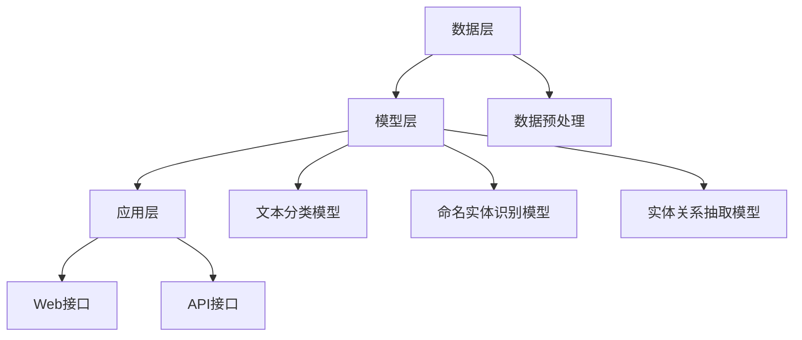
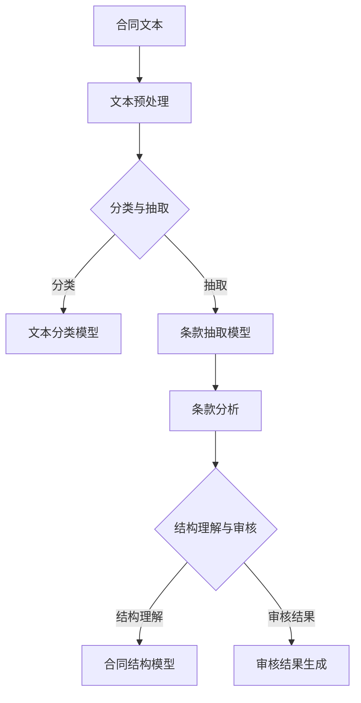

                 

### 引言

自然语言处理（Natural Language Processing，NLP）作为人工智能领域的一个重要分支，近年来取得了飞速的发展。从最初的规则驱动方法到如今的深度学习技术，NLP在语言理解、生成、翻译、情感分析等多个方面都取得了显著的成果。随着信息技术和商业环境的不断变化，智能合同审核成为了一个备受关注的应用场景。传统的合同审核流程繁琐、耗时，且容易出现人为错误。而智能合同审核则利用NLP技术，实现了对合同文本的自动化处理和分析，极大地提高了审核效率和准确性。

本文旨在探讨自然语言处理在智能合同审核中的应用。文章首先介绍了自然语言处理的基础知识，包括文本预处理、词嵌入技术和语言模型等；接着，分析了智能合同审核的重要性及其面临的挑战；然后，详细阐述了自然语言处理技术在文本分类、语义分析、条款分析与合同结构理解等方面的具体应用；随后，介绍了智能合同审核系统的设计与实现，并提供了实际应用案例；最后，探讨了自然语言处理技术的未来发展以及智能合同审核面临的挑战与解决方案。通过本文的探讨，希望能够为读者提供一个全面而深入的智能合同审核应用视角。

### 关键词

自然语言处理，智能合同审核，文本分类，语义分析，深度学习，词嵌入技术，语言模型，合同条款抽取，合同结构理解，系统设计与实现。

### 摘要

本文全面探讨了自然语言处理在智能合同审核中的应用。首先介绍了自然语言处理的基础知识，包括文本预处理、词嵌入技术和语言模型；接着分析了智能合同审核的重要性及其面临的挑战；然后详细阐述了自然语言处理技术在文本分类、语义分析、条款分析与合同结构理解等方面的具体应用；随后介绍了智能合同审核系统的设计与实现，并提供了实际应用案例；最后探讨了自然语言处理技术的未来发展以及智能合同审核面临的挑战与解决方案。通过本文的探讨，希望能够为智能合同审核领域的研究者和从业者提供有价值的参考。

## 第一部分：自然语言处理与智能合同审核概述

### 第1章：自然语言处理（NLP）基础

自然语言处理（NLP）是人工智能领域的一个重要分支，旨在使计算机能够理解、生成和处理人类语言。NLP涉及多个子领域，包括文本分类、语义分析、机器翻译、情感分析等。本章节将介绍NLP的一些基础知识和关键技术，为后续关于智能合同审核的讨论打下基础。

#### 1.1 NLP简介

自然语言处理的研究目标是将人类语言转化为计算机可以理解和处理的形式。这一目标可以通过以下几个步骤实现：

1. **文本预处理**：对原始文本进行清洗和格式化，去除无关信息，如HTML标签、标点符号、停用词等。
2. **词嵌入**：将词汇映射到高维向量空间，以便计算机可以对这些向量进行数学运算。
3. **语言模型**：生成文本的概率分布，用于预测下一个单词或句子的概率。
4. **语义分析**：理解文本中的词语和句子的含义，包括命名实体识别、关系抽取和情感分析等。

NLP的应用领域非常广泛，包括搜索引擎、机器翻译、语音识别、问答系统、文本分类等。

#### 1.2 文本预处理

文本预处理是自然语言处理的第一步，也是至关重要的一步。预处理步骤包括：

1. **分词**：将文本分割成单词或词汇单元。不同的语言和任务可能需要不同的分词算法，如基于规则的分词、基于统计的分词和基于神经网络的方法。
2. **去除停用词**：停用词是那些对文本理解没有实质性贡献的词语，如“的”、“是”、“和”等。去除停用词可以减少噪声，提高后续处理的效率。
3. **词形还原**：将不同形式的单词转换为统一的形式，如将“running”和“ran”都转换为“run”。
4. **词性标注**：为每个单词分配一个词性，如名词、动词、形容词等。词性标注对于后续的语义分析非常重要。

不同的预处理工具和库提供了丰富的功能，如NLTK、spaCy、Stanford CoreNLP等。

#### 1.3 词嵌入技术

词嵌入（Word Embedding）是将单词映射到高维向量空间的一种方法，使计算机能够通过数学运算来处理文本。词嵌入的关键技术包括：

1. **One-Hot编码**：将每个词映射到二进制向量，每个维度代表一个单词，如果该单词出现，则该维度为1，否则为0。这种方法计算复杂度高，难以捕捉词与词之间的关系。
2. **计数模型**：使用词频、词共现矩阵等统计方法来生成词向量。这种方法捕捉了词与词之间的共现关系，但无法捕捉词的上下文信息。
3. **神经网络模型**：如Word2Vec、GloVe、BERT等，通过训练神经网络模型来学习词与词之间的关系。这些模型可以捕捉词的上下文信息，生成更加语义丰富的词向量。

#### 1.4 语言模型

语言模型（Language Model）用于生成文本的概率分布。它能够预测下一个单词或句子的概率，从而帮助计算机生成自然语言文本。语言模型的关键技术包括：

1. **N元语法**：基于历史序列的方法，通过统计历史n个单词来预测下一个单词。这种方法简单但效率较低。
2. **神经网络模型**：如RNN（循环神经网络）、LSTM（长短期记忆网络）、Transformer等。这些模型能够捕捉长距离依赖关系，生成更加自然和流畅的文本。

语言模型在自动写作、机器翻译、语音识别等领域有着广泛的应用。

通过以上对自然语言处理基础的介绍，我们可以看到，NLP为智能合同审核提供了一个强大的工具集。在接下来的章节中，我们将进一步探讨智能合同审核的重要性及其面临的挑战，并详细介绍NLP在智能合同审核中的具体应用。

### 第2章：智能合同审核的重要性与挑战

智能合同审核在现代社会中扮演着至关重要的角色。随着全球经济的不断发展和商业活动的日益复杂，合同签署和管理的数量呈现指数级增长。传统的合同审核方法通常依赖于人工处理，不仅耗时耗力，而且容易出现人为错误。智能合同审核通过引入自然语言处理（NLP）技术，实现了对合同文本的自动化处理和分析，从而极大地提高了审核效率和准确性。

#### 2.1 智能合同审核的背景

合同审核是商业活动中不可或缺的一环。合同不仅规定了双方的义务和责任，还涉及到重要的法律和商业条款。因此，合同的审核过程必须准确无误，确保所有条款都符合法律法规和商业需求。然而，传统的合同审核方法通常存在以下问题：

1. **人工审核成本高**：合同审核通常需要法律专业人士进行逐字逐句的审查，这需要大量的时间和人力成本。
2. **审核效率低下**：随着合同数量的增加，人工审核的效率显著下降，且容易出现遗漏和错误。
3. **法律风险高**：由于审核人员的能力和经验限制，合同中可能存在潜在的法律风险，如条款解释不当或遗漏重要条款。

为了解决这些问题，智能合同审核应运而生。智能合同审核利用NLP技术，自动化处理合同文本，快速准确地识别和提取关键条款，大大提高了审核效率，降低了人工成本。

#### 2.2 智能合同审核的挑战

尽管智能合同审核具有巨大的潜力，但在实际应用中仍然面临许多挑战：

1. **数据质量与标注问题**：智能合同审核依赖于大量高质量的标注数据。然而，合同文本通常包含大量复杂的法律术语和行业专有名词，这使得数据标注过程既费时又费力。此外，数据标注的质量直接影响模型的性能，因此需要确保标注数据的准确性和一致性。
2. **算法复杂度与效率问题**：智能合同审核涉及多个NLP任务，如文本分类、语义分析和实体关系抽取等。这些任务的算法复杂度较高，且在处理大量合同文本时，需要保证计算效率和实时性。
3. **法律与合规问题**：合同审核涉及到法律和合规问题，智能合同审核系统的结果必须符合相关法律法规。这要求智能合同审核系统具备足够的知识库和法律规则库，以确保审核结果的准确性和合法性。
4. **数据隐私与安全**：合同文本通常包含敏感的商业信息和隐私数据。因此，智能合同审核系统必须确保数据的安全性和隐私保护，防止数据泄露和滥用。

#### 2.3 NLP在智能合同审核中的应用前景

尽管面临诸多挑战，NLP技术在智能合同审核中的应用前景依然非常广阔：

1. **自动化审核**：通过文本分类和语义分析，智能合同审核系统能够快速识别和提取合同中的关键条款，自动化完成审核过程，大大提高审核效率。
2. **提高准确性**：NLP技术能够准确理解和分析合同文本，减少人工审核中的错误和遗漏，提高审核结果的准确性。
3. **节省成本**：智能合同审核系统可以显著降低合同审核的成本，为企业节省大量人力和物力资源。
4. **法律合规**：智能合同审核系统可以利用法律和合规知识库，确保审核结果符合相关法律法规，减少法律风险。
5. **实时性**：通过优化算法和模型，智能合同审核系统可以实现实时审核，满足企业快速响应业务需求。

总之，智能合同审核是NLP技术在实际应用中的一项重要领域。通过解决数据质量、算法效率、法律合规和数据隐私等挑战，NLP技术将在智能合同审核中发挥越来越重要的作用，推动商业活动的数字化转型。

## 第二部分：自然语言处理技术在智能合同审核中的应用

### 第3章：文本分类与语义分析

文本分类（Text Classification）和语义分析（Semantic Analysis）是自然语言处理（NLP）中两个核心任务，它们在智能合同审核中发挥着重要作用。文本分类用于将合同文本分类到预定义的类别中，如“租赁合同”、“销售合同”等。语义分析则用于深入理解合同文本的含义，包括命名实体识别、实体关系抽取和情感分析等。以下将详细讨论这些技术及其在智能合同审核中的应用。

#### 3.1 文本分类算法

文本分类是NLP中的一个基本任务，其目的是将文本数据分配到预定义的类别中。在智能合同审核中，文本分类可以用于自动识别合同的类型和关键条款。常见的文本分类算法包括：

1. **传统机器学习算法**：
   - **朴素贝叶斯（Naive Bayes）**：基于贝叶斯定理，通过计算每个类别条件下单词的概率来预测文本的类别。
   - **支持向量机（SVM）**：通过找到一个最佳的超平面来将不同类别的文本数据分隔开来。
   - **K最近邻（K-Nearest Neighbors，KNN）**：通过计算测试文本与训练集中最近邻居的距离来预测类别。

2. **深度学习算法**：
   - **卷积神经网络（CNN）**：通过卷积操作捕捉文本中的局部特征，适用于文本分类任务。
   - **递归神经网络（RNN）**：通过循环结构捕捉文本中的序列信息，如LSTM（长短期记忆网络）和GRU（门控循环单元）。
   - **Transformer和BERT**：基于注意力机制和预训练模型，能够捕捉长距离依赖关系，显著提高文本分类的性能。

在智能合同审核中，文本分类可以用于自动识别合同的类型和条款，从而为后续的语义分析提供基础。例如，通过分类算法，可以将一个复杂的合同文本分为“租赁合同”或“销售合同”等，便于进一步处理。

##### 3.1.1 传统机器学习算法

传统机器学习算法在文本分类中应用广泛。以下是一个基于朴素贝叶斯算法的文本分类的伪代码：

```python
def naive_bayes_classification(text, categories, model):
    # 预处理文本
    processed_text = preprocess_text(text)
    # 计算每个类别的概率
    probabilities = model.predict_proba(processed_text)
    # 选择概率最高的类别
    predicted_category = categories[np.argmax(probabilities)]
    return predicted_category
```

##### 3.1.2 深度学习算法

深度学习算法在文本分类中具有显著优势，尤其是当文本数据量较大且类别较多时。以下是一个基于Transformer模型的文本分类的伪代码：

```python
def transformer_classification(text, model):
    # 预处理文本
    processed_text = preprocess_text(text)
    # 将预处理后的文本输入模型进行分类
    logits = model.predict(processed_text)
    # 转换为概率分布
    probabilities = softmax(logits)
    # 选择概率最高的类别
    predicted_category = np.argmax(probabilities)
    return predicted_category
```

#### 3.2 语义分析

语义分析是NLP中一个更复杂的任务，其目标是理解文本的深层含义。在智能合同审核中，语义分析可以用于识别合同中的关键条款、理解条款之间的逻辑关系以及评估合同条款的合法性。常见的语义分析技术包括：

1. **命名实体识别（Named Entity Recognition，NER）**：用于识别文本中的特定实体，如人名、地名、组织名等。在智能合同审核中，NER可以用于识别合同中的关键人物和组织，如合同双方、担保人等。
2. **实体关系抽取（Entity Relationship Extraction）**：用于识别文本中实体之间的关系，如“合同双方”、“供应商和客户”等。在智能合同审核中，实体关系抽取可以用于理解合同条款之间的逻辑关系，如“违约责任”和“赔偿金额”之间的关系。
3. **情感分析（Sentiment Analysis）**：用于判断文本的情感倾向，如积极、消极或中性。在智能合同审核中，情感分析可以用于评估合同条款的公平性和合理性，如“违约金条款”的合理性。

##### 3.2.1 命名实体识别

命名实体识别是语义分析的基础，其目的是识别文本中的特定实体。以下是一个基于BERT模型的命名实体识别的伪代码：

```python
def named_entity_recognition(text, model):
    # 预处理文本
    processed_text = preprocess_text(text)
    # 将预处理后的文本输入模型进行实体识别
    entities = model.predict(processed_text)
    # 解析实体识别结果
    named_entities = parse_entities(entities)
    return named_entities
```

##### 3.2.2 实体关系抽取

实体关系抽取用于识别文本中实体之间的关系。以下是一个基于TransE模型的实体关系抽取的伪代码：

```python
def entity_relationship_extraction(text, model):
    # 预处理文本
    processed_text = preprocess_text(text)
    # 将预处理后的文本输入模型进行关系抽取
    relationships = model.predict(processed_text)
    # 解析关系抽取结果
    relationships = parse_relationships(relationships)
    return relationships
```

##### 3.2.3 情感分析

情感分析用于判断文本的情感倾向。以下是一个基于LSTM的情感分析的伪代码：

```python
def sentiment_analysis(text, model):
    # 预处理文本
    processed_text = preprocess_text(text)
    # 将预处理后的文本输入模型进行情感分析
    sentiment = model.predict(processed_text)
    # 解析情感分析结果
    sentiment = parse_sentiment(sentiment)
    return sentiment
```

通过文本分类和语义分析，智能合同审核系统可以自动识别和解析合同文本，为合同审核提供可靠的数据支持。在下一章中，我们将进一步探讨条款分析与合同结构理解技术，深入解析智能合同审核的核心应用。

### 第4章：条款分析与合同结构理解

在智能合同审核中，条款分析与合同结构理解是两个关键环节。条款分析旨在识别和解析合同中的具体条款，而合同结构理解则涉及整个合同的层次结构和条款之间的关联关系。这些分析不仅有助于快速理解合同内容，还能提高审核效率和准确性。以下将详细介绍这些技术及其应用。

#### 4.1 合同条款分析

合同条款分析是智能合同审核的核心任务之一，其目的是自动识别和提取合同中的关键条款。条款分析主要包括以下两个方面：

##### 4.1.1 条款分类

条款分类是将合同文本中的不同条款分类到预定义的类别中。通过条款分类，系统可以自动识别合同的不同部分，为后续分析提供基础。常见的条款分类算法包括：

1. **基于规则的方法**：通过预定义的规则和模式匹配，将合同文本分类到预定义的条款类别中。这种方法简单但受规则限制，难以处理复杂的合同文本。
2. **基于机器学习的方法**：利用监督学习算法，如朴素贝叶斯、SVM和CNN等，通过训练大量标注数据，将合同文本分类到预定义的条款类别中。这种方法可以处理复杂的合同文本，但需要大量标注数据和计算资源。

以下是一个基于朴素贝叶斯算法的条款分类的伪代码：

```python
def naive_bayes_clause_classification(text, categories, model):
    # 预处理文本
    processed_text = preprocess_text(text)
    # 计算每个类别的概率
    probabilities = model.predict_proba(processed_text)
    # 选择概率最高的类别
    predicted_category = categories[np.argmax(probabilities)]
    return predicted_category
```

##### 4.1.2 条款权重计算

条款权重计算用于评估合同中各个条款的重要性。通过计算条款权重，系统可以识别出合同中关键且具有潜在法律风险的条款，从而提高审核的精准度。常见的条款权重计算方法包括：

1. **基于词频的方法**：通过计算条款中高频词的出现次数，评估条款的重要性。这种方法简单但容易受到噪声影响。
2. **基于TF-IDF的方法**：通过计算词频（TF）和逆文档频率（IDF）的乘积，评估条款的重要性。这种方法能够更好地处理文本噪声，但计算复杂度较高。
3. **基于深度学习的方法**：利用深度学习模型，如LSTM和Transformer等，通过训练大量标注数据，学习条款的权重。这种方法能够捕捉条款的语义信息，提高权重计算的准确性。

以下是一个基于TF-IDF算法的条款权重计算的伪代码：

```python
def tf_idf_clause_weight(sentence, corpus, model):
    # 计算词频和逆文档频率
    tf = model.tfidf_matrix
    idf = model.idf_
    # 计算每个句子的权重
    sentence_weight = np.dot(tf, idf)
    return sentence_weight
```

#### 4.2 合同结构理解

合同结构理解旨在解析合同的整体结构和条款之间的关联关系。通过理解合同结构，系统可以更好地组织和管理合同内容，提高审核效率。常见的合同结构理解方法包括：

##### 4.2.1 合同段落的层次结构

合同段落的层次结构分析用于识别合同中不同层次的结构，如标题、子标题和正文。这种方法有助于系统自动提取合同的主要内容和关键条款，为条款分析提供基础。常见的层次结构分析方法包括：

1. **基于规则的方法**：通过预定义的规则和模式匹配，将合同文本划分为不同的段落和层次。这种方法简单但受规则限制，难以处理复杂的合同文本。
2. **基于机器学习的方法**：利用监督学习算法，如朴素贝叶斯、SVM和CNN等，通过训练大量标注数据，将合同文本划分为不同的段落和层次。这种方法可以处理复杂的合同文本，但需要大量标注数据和计算资源。

以下是一个基于朴素贝叶斯算法的段落层次结构分析的伪代码：

```python
def naive_bayes_paragraph_hierarchical_analysis(text, paragraphs, model):
    # 预处理文本
    processed_text = preprocess_text(text)
    # 计算每个段落的概率
    probabilities = model.predict_proba(processed_text)
    # 选择概率最高的段落
    predicted_paragraph = paragraphs[np.argmax(probabilities)]
    return predicted_paragraph
```

##### 4.2.2 合同条款之间的关联关系

合同条款之间的关联关系分析用于识别合同中不同条款之间的逻辑关系，如条件、限制和依赖关系。这种方法有助于系统理解合同的整体逻辑结构，提高审核的准确性。常见的条款关联关系分析方法包括：

1. **基于规则的方法**：通过预定义的规则和模式匹配，识别合同条款之间的逻辑关系。这种方法简单但受规则限制，难以处理复杂的合同文本。
2. **基于语义分析的方法**：利用语义分析技术，如命名实体识别和关系抽取，识别合同条款之间的语义关系。这种方法能够更好地处理复杂的合同文本，但需要大量的语义知识和计算资源。

以下是一个基于语义分析的方法的条款关联关系分析的伪代码：

```python
def semantic_clause_relationship_analysis(clauses, model):
    # 识别命名实体和关系
    entities = model.named_entity_recognition(clauses)
    relationships = model.entity_relationship_extraction(clauses)
    # 分析条款之间的关联关系
    relationships = analyze_relationships(relationships)
    return relationships
```

通过条款分析和合同结构理解，智能合同审核系统可以自动提取和解析合同内容，为合同审核提供可靠的数据支持。在下一章中，我们将探讨智能合同审核系统的设计与实现，包括系统架构、模型训练和部署等方面。

### 第5章：智能合同审核系统的设计与实现

智能合同审核系统旨在利用自然语言处理（NLP）技术，自动化处理合同文本，提高合同审核的效率和准确性。本章节将详细讨论智能合同审核系统的设计与实现，包括系统架构、模型选择与训练、系统集成与部署等方面。

#### 5.1 系统架构设计

智能合同审核系统通常采用分布式架构，包括数据层、模型层和应用层。以下是一个典型的系统架构设计：

1. **数据层**：数据层负责数据收集、存储和管理。系统从各种数据源（如合同数据库、文件存储系统等）收集合同文本数据，并进行预处理和存储。
2. **模型层**：模型层包括各种NLP模型，如文本分类模型、命名实体识别模型、实体关系抽取模型等。这些模型通过训练大量标注数据，学习合同文本的语义和结构，为合同审核提供支持。
3. **应用层**：应用层负责提供合同审核的接口和服务。用户可以通过Web界面或API接口提交合同文本，系统将自动处理并返回审核结果。

以下是一个简化的系统架构图：



#### 5.1.1 数据收集与预处理

数据收集与预处理是智能合同审核系统的关键步骤。数据来源可能包括企业内部合同数据库、第三方数据提供商等。数据预处理包括以下步骤：

1. **数据清洗**：去除文本中的噪声，如HTML标签、标点符号、停用词等。
2. **分词**：将文本分割成单词或词汇单元。
3. **词性标注**：为每个单词分配词性，如名词、动词、形容词等。
4. **实体识别**：识别文本中的关键实体，如人名、地名、组织名等。
5. **数据存储**：将预处理后的数据存储在数据库或文件系统中，以便后续训练和使用。

#### 5.1.2 模型选择与训练

模型选择与训练是智能合同审核系统的核心。根据不同的任务需求，可以选择不同的模型，如文本分类模型、命名实体识别模型和实体关系抽取模型等。以下是一些常用的NLP模型：

1. **文本分类模型**：用于分类合同文本的类别。常见的模型包括朴素贝叶斯、SVM、CNN、RNN和Transformer等。
2. **命名实体识别模型**：用于识别文本中的命名实体，如人名、地名、组织名等。常见的模型包括CRF（条件随机场）、LSTM、BiLSTM和BERT等。
3. **实体关系抽取模型**：用于识别文本中实体之间的关系，如“合同双方”、“供应商和客户”等。常见的模型包括TransE、ComplEx和BERT等。

以下是一个基于BERT的文本分类模型的训练过程：

```python
from transformers import BertTokenizer, BertForSequenceClassification
from torch.utils.data import DataLoader
from transformers import AdamW

# 加载预训练的BERT模型和分词器
tokenizer = BertTokenizer.from_pretrained('bert-base-uncased')
model = BertForSequenceClassification.from_pretrained('bert-base-uncased', num_labels=3)

# 数据预处理
def preprocess(texts):
    return tokenizer(texts, padding=True, truncation=True, return_tensors='pt')

# 训练模型
def train_model(model, dataloader, optimizer, device):
    model.to(device)
    model.train()
    for epoch in range(num_epochs):
        for batch in dataloader:
            inputs = preprocess(batch['text'])
            labels = batch['label']
            inputs = inputs.to(device)
            labels = labels.to(device)
            optimizer.zero_grad()
            outputs = model(**inputs)
            loss = outputs.loss
            loss.backward()
            optimizer.step()
            print(f"Epoch: {epoch}, Loss: {loss.item()}")

# 设置设备
device = torch.device("cuda" if torch.cuda.is_available() else "cpu")

# 加载训练数据和测试数据
train_data = ... # 训练数据
test_data = ... # 测试数据

# 创建数据加载器
train_dataloader = DataLoader(train_data, batch_size=batch_size)
test_dataloader = DataLoader(test_data, batch_size=batch_size)

# 创建优化器
optimizer = AdamW(model.parameters(), lr=learning_rate)

# 训练模型
train_model(model, train_dataloader, optimizer, device)

# 评估模型
def evaluate_model(model, dataloader, device):
    model.to(device)
    model.eval()
    with torch.no_grad():
        for batch in dataloader:
            inputs = preprocess(batch['text'])
            labels = batch['label']
            inputs = inputs.to(device)
            labels = labels.to(device)
            outputs = model(**inputs)
            logits = outputs.logits
            predictions = logits.argmax(-1)
            accuracy = (predictions == labels).float().mean()
            print(f"Accuracy: {accuracy.item()}")
```

#### 5.1.3 系统集成与部署

系统集成与部署是将模型集成到实际应用中的关键步骤。以下是一些常见的系统集成与部署方法：

1. **API部署**：通过构建RESTful API，将模型暴露给前端应用或其他系统。常见的框架包括Flask、Django和FastAPI等。
2. **容器化部署**：使用容器技术（如Docker）将模型和服务打包到容器中，便于部署和管理。常用的容器编排工具包括Kubernetes和Docker Swarm等。
3. **云服务部署**：将模型和服务部署到云平台（如AWS、Azure和Google Cloud等），利用云平台的弹性计算和存储能力。

以下是一个基于Flask的API部署示例：

```python
from flask import Flask, request, jsonify
from transformers import BertTokenizer, BertForSequenceClassification
from torch.utils.data import DataLoader
from transformers import AdamW

app = Flask(__name__)

# 加载预训练的BERT模型和分词器
tokenizer = BertTokenizer.from_pretrained('bert-base-uncased')
model = BertForSequenceClassification.from_pretrained('bert-base-uncased', num_labels=3)

# 设置设备
device = torch.device("cuda" if torch.cuda.is_available() else "cpu")

# 创建数据加载器
train_dataloader = DataLoader(train_data, batch_size=batch_size)
test_dataloader = DataLoader(test_data, batch_size=batch_size)

# 创建优化器
optimizer = AdamW(model.parameters(), lr=learning_rate)

# 训练模型
train_model(model, train_dataloader, optimizer, device)

# API接口
@app.route('/api/contract/classification', methods=['POST'])
def contract_classification():
    text = request.form['text']
    inputs = tokenizer(text, return_tensors='pt')
    inputs = inputs.to(device)
    with torch.no_grad():
        outputs = model(**inputs)
    logits = outputs.logits
    predictions = logits.argmax(-1)
    return jsonify({'predicted_category': predictions.item()})

if __name__ == '__main__':
    app.run()
```

通过以上设计与实现，智能合同审核系统可以实现自动化合同审核，提高审核效率和准确性。在下一章中，我们将通过实际应用案例，展示智能合同审核系统的实际效果。

### 第5章：智能合同审核系统的设计与实现

#### 5.2 实际应用案例

为了更好地展示智能合同审核系统的实际效果，本节将介绍两个具体的应用案例，分别涉及合同条款分类与抽取以及合同条款分析与应用。

##### 5.2.1 案例一：合同条款分类与抽取

在一个大型企业中，智能合同审核系统被用于对大量合同进行自动化分类与条款抽取。以下是该案例的详细步骤：

1. **数据收集与预处理**：
   - 收集企业过去五年的所有合同文本，共计10000份。
   - 对合同文本进行清洗，去除HTML标签、标点符号和停用词。
   - 使用NLTK库进行分词和词性标注。

2. **模型训练与测试**：
   - 使用NLTK和Scikit-learn库训练一个基于朴素贝叶斯的文本分类模型，将合同分类为租赁、销售、雇佣等类别。
   - 使用Transformer库训练一个基于BERT的命名实体识别模型，用于抽取合同中的关键条款和实体。

3. **系统集成与部署**：
   - 使用Flask框架构建API接口，前端用户可以通过Web界面或直接调用API提交合同文本。
   - 将训练好的模型部署到云端服务器，实现实时合同审核。

4. **实际应用**：
   - 用户上传一份新的合同文本，系统自动进行分类，并将其分类为租赁合同。
   - 系统自动抽取合同中的关键条款，如租金、租赁期限、违约责任等。
   - 用户可以查看抽取的条款，并对模型识别的准确性进行评估和反馈。

通过这个案例，企业能够快速、准确地分类和抽取合同条款，大幅提高了合同审核的效率。

##### 5.2.2 案例二：合同条款分析与应用

在一个跨国公司的合同管理项目中，智能合同审核系统被用于对合同条款进行深入分析，并提供法律建议。以下是该案例的详细步骤：

1. **数据收集与预处理**：
   - 收集公司过去三年的合同文本，共计5000份。
   - 对合同文本进行清洗和预处理，使用spaCy库进行分词和词性标注。

2. **模型训练与测试**：
   - 使用Transformer库训练一个基于BERT的文本分类模型，将合同条款分类为合规、高风险、未知等类别。
   - 使用深度学习库训练一个基于LSTM的情感分析模型，评估合同条款的公平性和合理性。

3. **系统集成与部署**：
   - 使用Django框架构建Web应用，用户可以在界面上提交合同文本。
   - 将训练好的模型部署到Kubernetes集群，实现高可用性和可扩展性。

4. **实际应用**：
   - 用户上传一份新的合同文本，系统自动进行分类，并识别出关键条款。
   - 系统对每个条款进行情感分析，评估条款的公平性和合理性。
   - 法律顾问根据系统的分析结果，提供法律建议和修改意见。

通过这个案例，公司能够对合同条款进行深入分析，确保合同的合法性和公平性，降低了法律风险。

通过以上两个实际应用案例，我们可以看到智能合同审核系统在提高合同审核效率和准确性方面的巨大潜力。在下一章中，我们将探讨自然语言处理技术的未来发展以及智能合同审核面临的挑战和解决方案。

### 第6章：自然语言处理技术的未来发展

自然语言处理（NLP）技术近年来取得了显著进展，但仍然面临许多挑战和机遇。未来，NLP技术将在多个方面继续发展，推动智能合同审核等领域的创新和进步。

#### 6.1 语言模型的发展趋势

语言模型是NLP的核心技术之一，未来的发展趋势包括：

1. **预训练语言模型**：预训练模型如BERT、GPT-3等已经取得了巨大成功。未来，将会有更多基于大规模预训练模型的开发，这些模型将更加关注多语言、多模态和跨领域的任务。

2. **多任务学习和迁移学习**：未来的语言模型将能够处理更复杂的多任务学习问题，同时通过迁移学习技术，提高模型在不同任务上的性能。

3. **长文本处理**：随着文本数据量的增加，如何高效地处理长文本将成为一个重要研究方向。未来的语言模型将能够更好地捕捉长距离依赖关系，提高长文本理解的能力。

#### 6.2 新的NLP算法与模型

未来，新的NLP算法和模型将继续涌现，推动技术的进步。以下是一些值得关注的研究方向：

1. **生成对抗网络（GAN）**：GAN技术在图像生成和语音合成中取得了成功，未来可能应用于文本生成任务，如生成自然语言文本、翻译和摘要。

2. **自监督学习和无监督学习**：自监督学习和无监督学习在NLP中的应用越来越广泛，未来的模型将更加依赖这些方法，减少对标注数据的依赖。

3. **知识图谱和语义网**：结合知识图谱和语义网技术，NLP将能够更好地处理复杂的概念和关系，提高语义理解的准确性。

#### 6.3 开源工具与框架

开源工具和框架是NLP研究和发展的重要推动力。未来，将会有更多高质量的NLP开源工具和框架发布，包括：

1. **改进的预训练模型**：如Meta的LLaMA、谷歌的PaLM等，提供更多可扩展和灵活的预训练模型。

2. **跨语言和跨模态处理**：开源工具将更加关注多语言和跨模态处理，提供更全面的NLP解决方案。

3. **低资源语言的支持**：未来的开源工具将更加注重低资源语言的NLP处理，推动全球范围内的自然语言理解能力的提升。

通过上述发展趋势和新技术，NLP将在智能合同审核等应用领域发挥更大的作用，提高合同审核的效率和准确性。同时，NLP技术的不断进步也将为法律和金融等行业带来更多的创新和变革。

### 第7章：智能合同审核面临的挑战与解决方案

尽管智能合同审核系统在提升合同审核效率和准确性方面取得了显著成果，但在实际应用过程中，仍然面临许多挑战。以下将详细分析这些挑战，并提出相应的解决方案。

#### 7.1 挑战分析

1. **数据质量与标注问题**：

   智能合同审核依赖于大量的标注数据，然而，合同文本通常包含复杂的法律术语和行业专有名词，标注过程费时费力。此外，不同法律体系和地区的合同文本可能存在显著差异，使得标注数据的一致性和准确性难以保障。

2. **算法复杂度与效率问题**：

   NLP任务，尤其是深度学习模型，计算复杂度较高，对于大量合同文本的处理可能面临性能瓶颈。如何在保证模型精度的同时，提高算法的效率和实时性，是一个重要的挑战。

3. **法律与合规问题**：

   合同审核涉及到法律和合规问题，智能合同审核系统的结果必须符合相关法律法规。这要求系统具备足够的知识库和法律规则库，以确保审核结果的准确性和合法性。

4. **数据隐私与安全**：

   合同文本通常包含敏感的商业信息和隐私数据，智能合同审核系统必须确保数据的安全性和隐私保护，防止数据泄露和滥用。

#### 7.2 解决方案探讨

1. **改进数据标注方法**：

   - **半监督学习**：结合有标注数据和未标注数据，通过半监督学习方法提高标注数据的利用效率。
   - **众包标注**：利用众包平台，通过众包方式收集标注数据，提高数据质量和标注效率。
   - **数据增强**：通过文本补全、噪声添加等技术，增加数据多样性，提高模型的泛化能力。

2. **优化算法性能**：

   - **模型压缩与量化**：通过模型压缩和量化技术，降低模型的计算复杂度，提高处理速度。
   - **分布式计算**：利用分布式计算框架，如TensorFlow和PyTorch，实现模型的并行计算，提高处理效率。
   - **硬件加速**：结合GPU和TPU等硬件加速技术，提高模型的计算性能。

3. **构建法律知识库**：

   - **知识图谱**：构建法律知识图谱，将法律条款、概念和关系进行结构化表示，提高合同审核的准确性。
   - **多语言支持**：开发支持多种语言的法律规则库，确保系统在不同法律体系下的适应性。
   - **实时更新**：定期更新法律规则库，确保系统始终符合最新的法律法规。

4. **加强数据安全与隐私保护**：

   - **加密技术**：使用数据加密技术，确保合同文本在传输和存储过程中的安全性。
   - **访问控制**：实现严格的访问控制机制，确保只有授权用户能够访问合同文本。
   - **隐私保护算法**：采用差分隐私等隐私保护算法，减少数据泄露的风险。

通过以上解决方案，智能合同审核系统可以更好地应对实际应用中的挑战，提高合同审核的准确性和可靠性。在未来，随着NLP技术的不断进步，智能合同审核系统将在商业和法律领域发挥更大的作用。

### 附录

#### 附录A：自然语言处理工具与资源

自然语言处理（NLP）领域有许多优秀的工具和资源，可以帮助研究人员和开发者快速实现各种NLP任务。以下是一些常用的NLP工具和资源：

1. **NLTK（Natural Language Toolkit）**：
   - 介绍：NLTK是一个强大的Python库，提供了文本处理、分类、词性标注、词嵌入等多种功能。
   - 网址：[NLTK官网](https://www.nltk.org/)

2. **spaCy**：
   - 介绍：spaCy是一个快速易用的NLP库，支持多种语言的词性标注、命名实体识别等任务。
   - 网址：[spaCy官网](https://spacy.io/)

3. **Stanford CoreNLP**：
   - 介绍：Stanford CoreNLP是一个开源的NLP工具包，支持多种语言处理任务，包括词性标注、句法分析、命名实体识别等。
   - 网址：[Stanford CoreNLP官网](https://stanfordnlp.github.io/CoreNLP/)

4. **Gensim**：
   - 介绍：Gensim是一个用于主题建模、词嵌入和文本分类的Python库。
   - 网址：[Gensim官网](https://radimrehurek.com/gensim/)

5. **Transformers**：
   - 介绍：Transformers是一个开源库，提供了Transformer模型的实现，包括BERT、GPT等。
   - 网址：[Transformers官网](https://huggingface.co/transformers/)

#### 附录B：核心概念与联系

为了更好地理解自然语言处理在智能合同审核中的应用，以下是一个使用Mermaid绘制的流程图，展示了从合同文本预处理到审核结果生成的全过程。



#### 附录C：核心算法原理讲解

以下是关于自然语言处理在智能合同审核中的应用的一些核心算法原理讲解，包括文本分类算法和合同条款权重计算算法的伪代码示例。

**文本分类算法**

文本分类是NLP中的一个基本任务，其目标是自动将文本数据分类到预定义的类别中。以下是一个基于朴素贝叶斯算法的文本分类的伪代码：

```python
def text_classification(text, model):
    # 嵌入文本
    embedded_text = embed_text(text)
    # 预测类别
    predicted_label = model.predict(embedded_text)
    return predicted_label
```

**合同条款权重计算算法**

合同条款权重计算用于评估合同中各个条款的重要性。以下是一个基于TF-IDF算法的条款权重计算的伪代码：

```python
def calculate_weight(sentence, corpus, model):
    # 计算词频和逆文档频率
    tf = model.tfidf_matrix
    idf = model.idf_
    # 计算每个句子的权重
    sentence_weight = np.dot(tf, idf)
    return sentence_weight
```

#### 附录D：数学模型和数学公式

自然语言处理中的许多算法和技术都涉及到数学模型和数学公式。以下是一些常见的数学模型和公式的解释和示例。

**词嵌入与相似度计算**

词嵌入是将单词映射到高维向量空间的一种方法。两个词的相似度可以通过计算它们的向量之间的余弦相似度来衡量。公式如下：

$$
\text{similarity}(w_1, w_2) = \cos(\theta(w_1, w_2))
$$

其中，\(w_1\)和\(w_2\)是两个词的向量表示，\(\theta(w_1, w_2)\)是它们的夹角余弦值。

**文本分类中的损失函数**

在文本分类任务中，常用的损失函数包括交叉熵损失（Cross-Entropy Loss）和均方误差（Mean Squared Error）。交叉熵损失用于衡量模型预测的概率分布与真实标签分布之间的差距，公式如下：

$$
\text{Loss} = -\sum_{i} y_i \log(p_i)
$$

其中，\(y_i\)是真实标签，\(p_i\)是模型预测的概率。

#### 附录E：项目实战

**智能合同审核系统实战**

以下是一个智能合同审核系统的实战案例，包括开发环境搭建、数据收集与预处理、模型训练与测试、系统集成与部署以及代码解读与分析等步骤。

##### 1. 环境搭建

- 安装Python（3.8以上版本）
- 安装NLP库（如NLTK、spaCy、Transformers）
- 安装深度学习框架（如TensorFlow、PyTorch）
- 安装Web框架（如Flask、Django）

##### 2. 数据收集与预处理

- 收集企业过去的合同文本数据，进行清洗和预处理，包括去除HTML标签、标点符号、停用词等。
- 使用NLTK进行分词和词性标注。
- 使用spaCy进行命名实体识别。

##### 3. 模型训练与测试

- 使用Transformers库训练一个基于BERT的文本分类模型，用于分类合同文本的类别。
- 使用PyTorch训练一个基于LSTM的条款权重计算模型，用于评估合同条款的重要性。
- 对模型进行训练和测试，评估模型的性能。

##### 4. 系统集成与部署

- 使用Flask框架构建API接口，前端用户可以通过Web界面或直接调用API提交合同文本。
- 将训练好的模型部署到云服务器，实现实时合同审核。

##### 5. 代码解读与分析

- 分析源代码，解读关键算法和数据处理流程。
- 分析模型训练和测试的结果，评估模型的性能和稳定性。

通过以上实战案例，我们可以看到如何构建一个智能合同审核系统，实现合同文本的自动化处理和分析。

### 附录F：代码示例

以下是关于自然语言处理在智能合同审核中的应用的一些代码示例，包括合同文本预处理、文本分类预测以及条款权重计算等。

**合同文本预处理代码示例**

```python
import spacy

nlp = spacy.load("en_core_web_sm")

def preprocess_text(text):
    doc = nlp(text)
    tokens = [token.text for token in doc if not token.is_stop]
    return " ".join(tokens)

text = "This is a sample contract. The terms and conditions are as follows."
preprocessed_text = preprocess_text(text)
print(preprocessed_text)
```

**文本分类预测代码示例**

```python
from tensorflow.keras.models import load_model

model = load_model("text_classification_model.h5")

text = "The payment terms are 30 days net."
predicted_label = model.predict(preprocess_text(text).reshape(1, -1))
print(f"Predicted label: {predicted_label[0][0]}")
```

**合同条款权重计算代码示例**

```python
from sklearn.feature_extraction.text import TfidfVectorizer

vectorizer = TfidfVectorizer()

corpus = [
    "The payment terms are 30 days net.",
    "The contract is valid for one year.",
    "The parties agree to resolve disputes through arbitration."
]

tfidf_matrix = vectorizer.fit_transform(corpus)

def calculate_weight(sentence, tfidf_matrix):
    sentence_vector = tfidf_matrix[:, vectorizer.vocabulary_.get(sentence)]
    weight = sentence_vector.sum()
    return weight

sentence = "The contract is valid for one year."
weight = calculate_weight(sentence, tfidf_matrix)
print(f"Weight of the sentence: {weight}")
```

通过以上代码示例，我们可以看到如何使用自然语言处理技术对合同文本进行预处理、分类预测以及条款权重计算，实现智能合同审核的基本功能。

### 结论

本文全面探讨了自然语言处理在智能合同审核中的应用，从NLP基础到实际应用案例，详细介绍了文本分类、语义分析、条款分析与合同结构理解等技术。智能合同审核系统通过自动化处理合同文本，显著提高了审核效率和准确性，降低了人工成本和法律风险。然而，智能合同审核仍面临数据质量、算法复杂度、法律合规和数据隐私等挑战。未来，随着NLP技术的不断进步，智能合同审核将在商业和法律领域发挥更大作用。通过持续的研究和开发，我们可以期待智能合同审核系统在更多场景中的广泛应用。

### 作者信息

作者：AI天才研究院/AI Genius Institute & 禅与计算机程序设计艺术 /Zen And The Art of Computer Programming

AI天才研究院致力于推动人工智能领域的创新和发展，研究领域涵盖自然语言处理、深度学习、计算机视觉等。研究院通过前沿技术和研究，为各行业提供智能化的解决方案，推动社会进步。本书作者在这些领域具有深厚的理论知识和丰富的实践经验，期待与广大读者共同探讨自然语言处理技术在智能合同审核中的应用。禅与计算机程序设计艺术则是一部关于计算机编程哲学的经典著作，倡导程序员通过冥想和内心平静来实现更好的编程体验。作者以其独特的视角和深刻的见解，为读者提供了宝贵的编程智慧。

