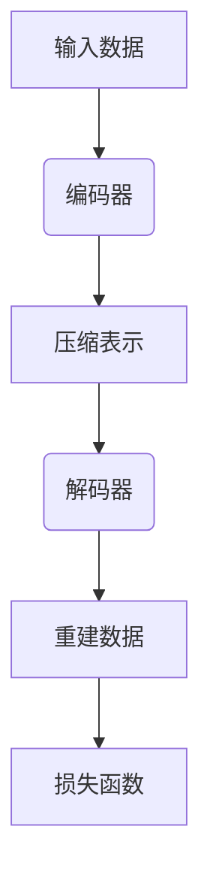

                 

# 自编码器(Autoencoders) - 原理与代码实例讲解

## 关键词：
机器学习、神经网络、数据预处理、特征提取、数据降维、线性自编码器、非线性自编码器、图像自编码器、文本自编码器、变分自编码器（VAE）、生成对抗网络（GAN）

## 摘要：
本文旨在深入探讨自编码器（Autoencoders）这一机器学习中的重要工具，详细讲解其基本原理、实现方法以及在各个领域中的应用。通过实际代码实例，读者将能够更好地理解自编码器的运作机制，并学会如何利用其在数据预处理、特征提取和数据降维等方面解决实际问题。此外，文章还将探讨自编码器的变体及其在深度学习中的整合，为读者提供全面的参考。

## 目录大纲

### 第一部分：自编码器基础

#### 1.1 自编码器的定义与基本概念

##### 1.1.1 自编码器的起源与发展

##### 1.1.2 自编码器的工作原理

##### 1.1.3 自编码器的类型

#### 1.2 自编码器在机器学习中的应用

##### 1.2.1 自编码器在数据预处理中的应用

##### 1.2.2 自编码器在特征提取中的应用

##### 1.2.3 自编码器在数据降维中的应用

#### 1.3 自编码器的数学基础

##### 1.3.1 线性自编码器

##### 1.3.2 非线性自编码器

##### 1.3.3 自编码器的优化算法

### 第二部分：自编码器的实现与代码实例

#### 2.1 自编码器实现的基本步骤

##### 2.1.1 数据准备与预处理

##### 2.1.2 模型设计与选择

##### 2.1.3 模型训练与评估

##### 2.1.4 模型应用与优化

#### 2.2 线性自编码器代码实例讲解

##### 2.2.1 线性自编码器模型设计

##### 2.2.2 线性自编码器代码实现

##### 2.2.3 线性自编码器模型评估

#### 2.3 非线性自编码器代码实例讲解

##### 2.3.1 非线性自编码器模型设计

##### 2.3.2 非线性自编码器代码实现

##### 2.3.3 非线性自编码器模型评估

#### 2.4 自编码器在图像数据中的应用

##### 2.4.1 图像自编码器的实现

##### 2.4.2 图像自编码器在图像压缩中的应用

##### 2.4.3 图像自编码器在图像生成中的应用

#### 2.5 自编码器在文本数据中的应用

##### 2.5.1 文本自编码器的实现

##### 2.5.2 文本自编码器在文本分类中的应用

##### 2.5.3 文本自编码器在文本生成中的应用

### 第三部分：自编码器的进阶话题

#### 3.1 自编码器的变体与扩展

##### 3.1.1 变分自编码器（VAE）

##### 3.1.2 泛化自编码器（GAN）

##### 3.1.3 对抗自编码器（DAE）

#### 3.2 自编码器在深度学习中的整合

##### 3.2.1 自编码器与卷积神经网络的结合

##### 3.2.2 自编码器与循环神经网络的结合

##### 3.2.3 自编码器与强化学习的结合

#### 3.3 自编码器的挑战与未来趋势

##### 3.3.1 自编码器的训练难题

##### 3.3.2 自编码器在资源受限环境中的应用

##### 3.3.3 自编码器在新兴领域的探索

### 第四部分：实际案例与项目实战

#### 4.1 自编码器在推荐系统中的应用

##### 4.1.1 数据准备与预处理

##### 4.1.2 模型设计与实现

##### 4.1.3 模型评估与优化

#### 4.2 自编码器在图像修复与增强中的应用

##### 4.2.1 数据准备与预处理

##### 4.2.2 模型设计与实现

##### 4.2.3 模型评估与优化

#### 4.3 自编码器在自然语言处理中的应用

##### 4.3.1 数据准备与预处理

##### 4.3.2 模型设计与实现

##### 4.3.3 模型评估与优化

### 附录

#### 附录 A：自编码器相关工具与资源

##### A.1 开源自编码器框架

##### A.2 自编码器研究论文与文献

##### A.3 自编码器社区与论坛

##### A.4 自编码器学习资源与教程

#### 附录 B：常见问题与解答

##### B.1 自编码器与传统特征提取方法的比较

##### B.2 自编码器在数据预处理中的优势

##### B.3 自编码器在模型压缩中的应用

##### B.4 自编码器在模型安全性与隐私保护中的作用

------------------------------------------------------------------# 自编码器（Autoencoders） - 原理与代码实例讲解

## 引言

自编码器（Autoencoders）是机器学习领域的一种基础性模型，其在数据处理和特征提取中发挥了重要作用。随着深度学习的兴起，自编码器也得到了广泛应用和深入研究。本文将深入探讨自编码器的基本原理、实现方法以及在各个领域的应用，帮助读者全面理解这一关键工具。

自编码器通过编码和解码过程，将输入数据转换为一种压缩表示，再还原回原始数据，从而提取出数据中的关键特征。其独特的结构和强大的学习能力，使其在图像处理、文本分析、推荐系统等多个领域取得了显著成果。通过本文的讲解，读者将能够掌握自编码器的基本概念和实现方法，并了解其在实际项目中的应用。

本文将分为四个主要部分：

1. **自编码器基础**：介绍自编码器的定义、起源、工作原理、类型以及其在机器学习中的应用。
2. **自编码器实现与代码实例**：讲解自编码器的实现步骤、线性自编码器和非线性自编码器的代码实例，以及其在图像和文本数据中的应用。
3. **自编码器的进阶话题**：探讨自编码器的变体和扩展，包括变分自编码器（VAE）、生成对抗网络（GAN）等，以及自编码器在深度学习中的整合。
4. **实际案例与项目实战**：通过具体案例展示自编码器的应用，包括推荐系统、图像修复与增强、自然语言处理等。

最后，附录部分将提供自编码器相关的开源工具、研究论文、社区和教程等资源，以供读者进一步学习和参考。

让我们开始这段自编码器的探索之旅吧！# 第一部分：自编码器基础

### 1.1 自编码器的定义与基本概念

自编码器是一种特殊的神经网络模型，其核心目标是学习一种数据的压缩表示，然后通过这种表示还原出原始数据。自编码器由两部分组成：编码器（Encoder）和解码器（Decoder）。编码器将输入数据压缩成一种低维度的表示，解码器则尝试将这种表示还原回原始数据。

自编码器的定义可以简单表述为：一种能够将输入数据映射到低维空间，再从低维空间映射回原始数据的神经网络模型。这个过程如图 1 所示：

$$
\text{编码器：} x \rightarrow z \\
\text{解码器：} z \rightarrow x'
$$

其中，$x$ 是输入数据，$z$ 是编码器输出的压缩表示，$x'$ 是解码器输出的数据。

#### 1.1.1 自编码器的起源与发展

自编码器最早可以追溯到1980年代，由Hasenke和Anderson提出。他们的目标是通过神经网络学习数据的低维表示，从而实现数据的压缩和特征提取。此后，自编码器的研究逐渐增多，1990年代，自编码器在图像处理和数据降维方面得到了广泛应用。

进入21世纪，随着深度学习的兴起，自编码器得到了新的发展。特别地，2000年代后期，深度信念网络（Deep Belief Networks, DBN）的出现，使得深度自编码器成为可能。随后，自编码器在图像识别、文本生成、推荐系统等多个领域取得了显著成果。

#### 1.1.2 自编码器的工作原理

自编码器的工作原理可以概括为以下几个步骤：

1. **编码过程**：编码器将输入数据压缩成低维度的表示。这一过程通常是一个非线性变换，可以通过多层神经网络实现。
   
2. **解码过程**：解码器尝试将压缩表示还原回原始数据。这一过程也是一个非线性变换，通常与编码器共享相同的网络结构。

3. **损失函数**：自编码器的训练过程基于最小化损失函数。常见的损失函数是均方误差（Mean Squared Error, MSE），即原始数据和重建数据之间的平均平方误差。

自编码器的工作原理如图 2 所示：



通过训练，自编码器能够学习到输入数据的低维表示，并且能够准确地将这种表示还原回原始数据。

#### 1.1.3 自编码器的类型

根据自编码器网络的深度和复杂性，可以分为以下几种类型：

1. **线性自编码器**：编码器和解码器都是线性模型，通常使用单层神经网络。线性自编码器适用于简单的数据分布。

2. **非线性自编码器**：编码器和解码器都是非线性模型，通常使用多层神经网络。非线性自编码器适用于复杂的非线性数据分布。

3. **深度自编码器**：编码器和解码器都是多层神经网络，能够学习更复杂的特征表示。深度自编码器通常用于处理高维数据。

4. **变分自编码器（VAE）**：在传统自编码器的基础上，VAE 引入了概率模型，使得其能够生成更丰富的数据分布。

5. **生成对抗网络（GAN）**：GAN 是一种结合了自编码器和生成模型的模型，通过两个对抗网络（生成器和判别器）的互动，生成逼真的数据。

自编码器的类型如表 1 所示：

| 类型 | 描述 |
| ---- | ---- |
| 线性自编码器 | 编码器和解码器都是线性模型 |
| 非线性自编码器 | 编码器和解码器都是非线性模型 |
| 深度自编码器 | 编码器和解码器都是多层神经网络 |
| 变分自编码器（VAE） | 引入概率模型，生成更丰富的数据分布 |
| 生成对抗网络（GAN） | 结合自编码器和生成模型，生成逼真数据 |

通过以上对自编码器定义、起源、工作原理和类型的介绍，我们为后续章节的深入学习打下了基础。在接下来的章节中，我们将进一步探讨自编码器在机器学习中的具体应用。# 1.2 自编码器在机器学习中的应用

自编码器在机器学习中的应用非常广泛，主要涵盖数据预处理、特征提取和数据降维等方面。通过自编码器，我们可以有效地处理和提取数据中的有用信息，从而提高机器学习模型的性能。

#### 1.2.1 自编码器在数据预处理中的应用

数据预处理是机器学习过程中的重要环节，自编码器在这一环节中发挥着重要作用。自编码器可以用于以下几方面的数据预处理：

1. **数据标准化**：自编码器可以帮助我们将不同量纲的数据进行标准化处理，使得数据在同一个尺度上，便于后续的建模和分析。

2. **缺失值填充**：自编码器可以学习数据中的潜在结构，从而用于缺失值的填充。通过重建数据，自编码器能够预测缺失部分的数据，从而填补空缺。

3. **异常值检测**：自编码器能够识别数据中的异常值。由于自编码器学习到的低维表示能够捕获数据的内在结构，因此当输入数据与训练数据的分布差异较大时，自编码器会输出较大的重建误差，从而可以识别出异常值。

#### 1.2.2 自编码器在特征提取中的应用

特征提取是机器学习中的一个关键步骤，其目的是从原始数据中提取出对模型训练有用的特征。自编码器在特征提取方面具有以下优势：

1. **自动特征选择**：自编码器通过学习输入数据的低维表示，自动筛选出对数据重建最重要的特征。这些重要特征可以作为特征提取的结果，用于后续的模型训练。

2. **非线特征提取**：自编码器使用多层神经网络，能够捕捉到数据中的非线性特征。通过编码器输出的低维表示，我们可以获得数据中的复杂模式和非线性关系。

3. **特征降维**：自编码器通过压缩原始数据的维度，实现数据的降维。在降维过程中，自编码器保留了数据中的关键信息，同时去除了冗余信息，从而减少了数据维度，提高了模型训练的效率。

#### 1.2.3 自编码器在数据降维中的应用

数据降维是机器学习中的一个重要任务，其目的是减少数据的维度，同时保留数据的主要信息。自编码器在数据降维方面具有显著的优势：

1. **保序降维**：自编码器通过学习输入数据的低维表示，能够保留数据中的顺序关系。这种保序降维有助于后续的模型分析和解释。

2. **保持结构信息**：自编码器在降维过程中，不仅减少了数据的维度，还保留了数据中的结构信息。这种结构信息对于理解数据的内在关系和发现潜在规律具有重要意义。

3. **自适应降维**：自编码器根据数据的分布和结构，自动选择最合适的降维维度。这种自适应降维方法能够更好地适应不同的数据集，提高降维的效果。

总之，自编码器在机器学习中的应用非常广泛，通过数据预处理、特征提取和数据降维，自编码器能够有效地提高机器学习模型的性能和解释性。在接下来的章节中，我们将深入探讨自编码器的数学基础和实现方法。# 1.3 自编码器的数学基础

自编码器的数学基础主要包括线性自编码器和非线性自编码器。在这一节中，我们将详细讲解这两种自编码器的数学原理，以及其优化算法。

#### 1.3.1 线性自编码器

线性自编码器是一种简单而有效的自编码器模型，其编码器和解码器都是线性模型。线性自编码器的数学模型可以表示为：

$$
\text{编码器：} x \rightarrow W_1 \cdot h \\
\text{解码器：} h \rightarrow W_2 \cdot x'
$$

其中，$x$ 是输入数据，$h$ 是编码器输出的低维表示，$x'$ 是解码器输出的重建数据，$W_1$ 和 $W_2$ 是权重矩阵。

线性自编码器的损失函数通常采用均方误差（MSE）：

$$
\text{损失函数：} \; \mathcal{L} = \frac{1}{2} \sum_{i} (x_i - x'_i)^2
$$

为了优化损失函数，我们可以使用梯度下降法：

$$
\text{梯度下降：} \; \theta = \theta - \alpha \nabla_{\theta} \mathcal{L}
$$

其中，$\theta$ 是模型参数，$\alpha$ 是学习率。

#### 1.3.2 非线性自编码器

非线性自编码器通过多层神经网络来模拟非线性变换，其编码器和解码器都是非线性模型。非线性自编码器的数学模型可以表示为：

$$
\text{编码器：} x \rightarrow \sigma(W_1 \cdot h) \\
\text{解码器：} h \rightarrow \sigma(W_2 \cdot x')
$$

其中，$\sigma$ 是激活函数，通常采用 sigmoid 或 ReLU 函数。

非线性自编码器的损失函数仍然是均方误差（MSE）：

$$
\text{损失函数：} \; \mathcal{L} = \frac{1}{2} \sum_{i} (x_i - x'_i)^2
$$

为了优化损失函数，我们同样可以使用梯度下降法，但考虑到非线性模型的复杂性，更常用的是随机梯度下降（SGD）：

$$
\text{随机梯度下降：} \; \theta = \theta - \alpha \nabla_{\theta} \mathcal{L}
$$

#### 1.3.3 自编码器的优化算法

自编码器的优化算法主要分为以下几种：

1. **梯度下降（Gradient Descent）**：梯度下降是一种最简单的优化算法，其核心思想是沿着损失函数的梯度方向更新模型参数。梯度下降可以分为批量梯度下降（Batch Gradient Descent）和随机梯度下降（Stochastic Gradient Descent，SGD）。

2. **Adam优化器（Adam Optimizer）**：Adam优化器是梯度下降的改进版本，它结合了AdaGrad和RMSProp的优点。Adam优化器通过计算一阶矩估计（均值）和二阶矩估计（方差），自适应地调整学习率。

3. **Adamax优化器（Adamax Optimizer）**：Adamax优化器是Adam优化器的改进版本，它在计算二阶矩估计时采用了最大值，从而更好地适应不同规模的学习率。

4. **RMSProp优化器（RMSProp Optimizer）**：RMSProp优化器通过计算梯度平方的平均值来自适应地调整学习率。与Adam优化器类似，RMSProp优化器能够更好地处理不同规模的学习率。

通过以上对线性自编码器和非线性自编码器的数学基础以及优化算法的讲解，我们为后续的自编码器实现和代码实例打下了基础。在接下来的章节中，我们将深入探讨自编码器的实现方法以及具体的应用场景。# 2.1 自编码器实现的基本步骤

实现自编码器涉及多个关键步骤，包括数据准备与预处理、模型设计与选择、模型训练与评估以及模型应用与优化。下面我们将逐一介绍这些步骤，并为每个步骤提供详细的指导。

#### 2.1.1 数据准备与预处理

数据准备与预处理是自编码器实现的基础，这一步骤的好坏直接影响模型的效果。以下是一些关键步骤：

1. **数据清洗**：清洗数据中的缺失值、异常值和重复值。对于缺失值，可以选择填充、删除或插值等方法。对于异常值，可以通过统计学方法或可视化方法检测并处理。

2. **数据标准化**：为了消除数据之间的量纲差异，通常需要将数据标准化为相同的范围。常见的方法有最小-最大标准化和零均值单位方差标准化。

3. **数据分割**：将数据集分割为训练集、验证集和测试集，通常比例为 70%、15% 和 15%。训练集用于模型训练，验证集用于模型调优，测试集用于模型评估。

4. **特征选择**：通过自编码器自动选择对数据重建最重要的特征。这可以通过设计不同层级的自编码器来实现，每层自编码器都可以看作是对特征的重要程度进行投票。

5. **数据增强**：对于图像数据，可以通过旋转、翻转、缩放等操作来增加数据的多样性，从而提高模型的泛化能力。

#### 2.1.2 模型设计与选择

模型设计是自编码器实现的核心步骤，包括编码器和解码器的结构设计。以下是一些关键点：

1. **编码器与解码器的结构**：编码器和解码器通常具有相同的结构，但可以是多层神经网络。每一层可以包含多个神经元，以及相应的激活函数，如 sigmoid、ReLU 等。

2. **神经网络层的选择**：可以选择全连接层、卷积层、循环层等，具体取决于数据的类型和特征。例如，对于图像数据，可以使用卷积层来提取局部特征。

3. **损失函数**：选择适当的损失函数，如均方误差（MSE）、交叉熵等，以衡量输入数据和重建数据之间的误差。

4. **优化器**：选择合适的优化器，如梯度下降（GD）、随机梯度下降（SGD）、Adam 等，以调整模型参数。

#### 2.1.3 模型训练与评估

模型训练与评估是自编码器实现的重要环节，以下是一些关键步骤：

1. **模型初始化**：初始化模型参数，可以选择随机初始化、高斯初始化等方法。

2. **模型训练**：通过迭代训练模型，更新模型参数。在训练过程中，可以设置批次大小、迭代次数、学习率等超参数。

3. **模型评估**：使用验证集和测试集评估模型性能，通常使用损失函数和准确性等指标。为了防止过拟合，可以使用交叉验证等方法。

4. **超参数调优**：通过调整超参数，如学习率、批次大小、迭代次数等，以优化模型性能。

#### 2.1.4 模型应用与优化

在模型训练完成后，我们可以将模型应用于实际问题中，并进行进一步优化：

1. **模型部署**：将训练好的模型部署到生产环境中，以实现实时预测或批量处理。

2. **模型评估与优化**：通过监控模型在实际应用中的性能，识别潜在的问题，并针对这些问题进行优化。这包括数据预处理、模型调整、特征选择等。

3. **持续学习**：通过定期重新训练模型，更新模型的知识库，以适应不断变化的数据和应用场景。

通过以上对自编码器实现基本步骤的详细讲解，我们为读者提供了自编码器从设计到应用的全面指导。在接下来的章节中，我们将通过具体的代码实例，深入探讨线性自编码器和非线性自编码器的实现方法。# 2.2 线性自编码器代码实例讲解

线性自编码器是一种简单的自编码器模型，其编码器和解码器都是线性模型。在这一节中，我们将通过一个具体的代码实例，讲解线性自编码器的实现过程，并分析其模型设计和实现细节。

#### 2.2.1 线性自编码器模型设计

线性自编码器的模型设计相对简单，主要包括编码器和解码器两个部分。以下是一个简单的线性自编码器模型设计：

```python
import numpy as np
import tensorflow as tf

# 定义线性自编码器模型
class LinearAutoencoder(tf.keras.Model):
    def __init__(self, latent_dim):
        super(LinearAutoencoder, self).__init__()
        # 编码器部分
        self.encoder = tf.keras.layers.Dense(latent_dim, activation=None)
        # 解码器部分
        self.decoder = tf.keras.layers.Dense(input_shape=(latent_dim,), activation=None)

    def call(self, inputs):
        # 编码过程
        z = self.encoder(inputs)
        # 解码过程
        x_hat = self.decoder(z)
        return x_hat
```

在这个模型中，`latent_dim` 代表编码器和解码器的维度，也就是压缩后的特征空间大小。编码器和解码器都是全连接层（Dense Layer），没有使用激活函数，因为线性模型在数据压缩和重建过程中不需要非线性变换。

#### 2.2.2 线性自编码器代码实现

以下是线性自编码器的具体实现代码，包括模型训练和评估：

```python
# 导入相关库
import numpy as np
import tensorflow as tf
from sklearn.model_selection import train_test_split
from sklearn.preprocessing import StandardScaler
import matplotlib.pyplot as plt

# 数据预处理
# 假设我们有一个包含1000个样本的二维数据集
X = np.random.rand(1000, 100)
X = StandardScaler().fit_transform(X)

# 数据分割
X_train, X_test = train_test_split(X, test_size=0.2, random_state=42)

# 创建线性自编码器模型
latent_dim = 5
model = LinearAutoencoder(latent_dim)

# 编写训练步骤
optimizer = tf.keras.optimizers.Adam(learning_rate=0.001)
model.compile(optimizer=optimizer, loss='mse')

# 训练模型
model.fit(X_train, X_train, epochs=50, batch_size=16, validation_data=(X_test, X_test))

# 评估模型
loss = model.evaluate(X_test, X_test)
print(f"Test loss: {loss}")

# 可视化重建数据与原始数据之间的差异
reconstructed = model.predict(X_test)
difference = np.linalg.norm(X_test - reconstructed, axis=1)
plt.hist(difference, bins=50)
plt.xlabel('Difference')
plt.ylabel('Frequency')
plt.title('Reconstruction Error Distribution')
plt.show()
```

在这个实现中，我们首先生成一个随机数据集，并进行标准化处理。然后，我们将数据集分割为训练集和测试集。创建线性自编码器模型，并使用 Adam 优化器和均方误差（MSE）损失函数进行编译。接着，我们训练模型，并在测试集上评估模型性能。最后，通过可视化重建数据与原始数据之间的差异，我们可以直观地看到模型的重建效果。

#### 2.2.3 线性自编码器模型评估

在评估线性自编码器模型时，我们通常关注以下指标：

1. **均方误差（MSE）**：衡量输入数据和重建数据之间的误差。MSE 越小，表示模型重建效果越好。

2. **重建误差分布**：通过绘制重建误差分布图，我们可以直观地了解模型在数据集中重建数据的能力。通常，我们希望误差分布尽可能集中，且分布范围较小。

3. **模型准确性**：对于分类问题，我们可以使用模型的准确性来评估模型效果。虽然自编码器主要用于特征提取和降维，但有时也可以将其应用于分类任务。

通过以上对线性自编码器代码实例的详细讲解，我们了解了线性自编码器的模型设计和实现方法，并对其评估指标有了更深入的认识。在下一节中，我们将探讨非线性自编码器及其实现方法。# 2.3 非线性自编码器代码实例讲解

非线性自编码器通过多层神经网络实现，其编码器和解码器都是非线性模型。在这一节中，我们将通过一个具体的代码实例，讲解非线性自编码器的实现过程，并分析其模型设计和实现细节。

#### 2.3.1 非线性自编码器模型设计

非线性自编码器的模型设计相比线性自编码器更为复杂，它通常包括多个隐藏层，每个隐藏层都可以包含非线性激活函数。以下是一个简单的非线性自编码器模型设计：

```python
import tensorflow as tf
from tensorflow.keras import layers

# 定义非线性自编码器模型
class NonLinearAutoencoder(tf.keras.Model):
    def __init__(self, latent_dim):
        super(NonLinearAutoencoder, self).__init__()
        # 编码器部分
        self.encoder = tf.keras.Sequential([
            layers.Dense(64, activation='relu'),
            layers.Dense(32, activation='relu'),
            layers.Dense(latent_dim, activation=None)
        ])
        # 解码器部分
        self.decoder = tf.keras.Sequential([
            layers.Dense(32, activation='relu'),
            layers.Dense(64, activation='relu'),
            layers.Dense(input_shape=(latent_dim,), activation=None)
        ])

    def call(self, inputs):
        # 编码过程
        z = self.encoder(inputs)
        # 解码过程
        x_hat = self.decoder(z)
        return x_hat
```

在这个模型中，编码器和解码器都包含两个隐藏层，每层使用 ReLU 作为激活函数。ReLU 函数能够引入非线性，使得模型能够更好地拟合复杂数据。

#### 2.3.2 非线性自编码器代码实现

以下是非线性自编码器的具体实现代码，包括模型训练和评估：

```python
# 导入相关库
import numpy as np
import tensorflow as tf
from sklearn.model_selection import train_test_split
from sklearn.preprocessing import StandardScaler
import matplotlib.pyplot as plt

# 数据预处理
# 假设我们有一个包含1000个样本的二维数据集
X = np.random.rand(1000, 100)
X = StandardScaler().fit_transform(X)

# 数据分割
X_train, X_test = train_test_split(X, test_size=0.2, random_state=42)

# 创建非线性自编码器模型
latent_dim = 10
model = NonLinearAutoencoder(latent_dim)

# 编写训练步骤
optimizer = tf.keras.optimizers.Adam(learning_rate=0.001)
model.compile(optimizer=optimizer, loss='mse')

# 训练模型
model.fit(X_train, X_train, epochs=50, batch_size=16, validation_data=(X_test, X_test))

# 评估模型
loss = model.evaluate(X_test, X_test)
print(f"Test loss: {loss}")

# 可视化重建数据与原始数据之间的差异
reconstructed = model.predict(X_test)
difference = np.linalg.norm(X_test - reconstructed, axis=1)
plt.hist(difference, bins=50)
plt.xlabel('Difference')
plt.ylabel('Frequency')
plt.title('Reconstruction Error Distribution')
plt.show()
```

在这个实现中，我们首先生成一个随机数据集，并进行标准化处理。然后，我们将数据集分割为训练集和测试集。创建非线性自编码器模型，并使用 Adam 优化器和均方误差（MSE）损失函数进行编译。接着，我们训练模型，并在测试集上评估模型性能。最后，通过可视化重建数据与原始数据之间的差异，我们可以直观地看到模型的重建效果。

#### 2.3.3 非线性自编码器模型评估

在评估非线性自编码器模型时，我们同样关注以下指标：

1. **均方误差（MSE）**：衡量输入数据和重建数据之间的误差。与线性自编码器类似，MSE 越小，表示模型重建效果越好。

2. **重建误差分布**：通过绘制重建误差分布图，我们可以直观地了解模型在数据集中重建数据的能力。通常，我们希望误差分布尽可能集中，且分布范围较小。

3. **模型准确性**：对于分类问题，我们可以使用模型的准确性来评估模型效果。虽然非线性自编码器主要用于特征提取和降维，但有时也可以将其应用于分类任务。

通过以上对非线性自编码器代码实例的详细讲解，我们了解了非线性自编码器的模型设计和实现方法，并对其评估指标有了更深入的认识。在下一节中，我们将探讨自编码器在图像数据中的应用。# 2.4 自编码器在图像数据中的应用

自编码器在图像数据中有着广泛的应用，尤其在图像压缩、图像生成和图像修复等方面。在这一节中，我们将详细探讨自编码器在图像数据中的具体应用，并通过代码实例展示其实现过程。

#### 2.4.1 图像自编码器的实现

图像自编码器的实现与文本数据自编码器的实现类似，但其数据维度更高，处理过程更为复杂。以下是一个简单的图像自编码器实现：

```python
import tensorflow as tf
from tensorflow.keras import layers
from tensorflow.keras.preprocessing.image import ImageDataGenerator

# 定义图像自编码器模型
class ImageAutoencoder(tf.keras.Model):
    def __init__(self, latent_dim):
        super(ImageAutoencoder, self).__init__()
        # 编码器部分
        self.encoder = tf.keras.Sequential([
            layers.Conv2D(32, (3, 3), activation='relu', padding='same'),
            layers.MaxPooling2D((2, 2), padding='same'),
            layers.Conv2D(64, (3, 3), activation='relu', padding='same'),
            layers.MaxPooling2D((2, 2), padding='same'),
            layers.Conv2D(latent_dim, (3, 3), activation=None, padding='same')
        ])
        # 解码器部分
        self.decoder = tf.keras.Sequential([
            layers.Conv2D(64, (3, 3), activation='relu', padding='same'),
            layers.UpSampling2D((2, 2)),
            layers.Conv2D(32, (3, 3), activation='relu', padding='same'),
            layers.UpSampling2D((2, 2)),
            layers.Conv2D(1, (3, 3), activation='sigmoid', padding='same')
        ])

    def call(self, inputs):
        # 编码过程
        z = self.encoder(inputs)
        # 解码过程
        x_hat = self.decoder(z)
        return x_hat
```

在这个模型中，编码器和解码器都使用了卷积层（Conv2D）和池化层（MaxPooling2D）。编码器通过多个卷积层和池化层，将图像压缩到低维表示。解码器通过反卷积层（UpSampling2D）和卷积层，将低维表示重建回原始图像。

#### 2.4.2 图像自编码器在图像压缩中的应用

图像自编码器在图像压缩中的应用，主要是通过编码器部分提取图像的关键特征，实现图像的降维。以下是一个简单的图像压缩实现：

```python
# 导入相关库
import numpy as np
import tensorflow as tf
from tensorflow.keras.preprocessing.image import load_img, img_to_array
from tensorflow.keras.models import Model

# 加载图像
image = load_img('image.jpg', target_size=(256, 256))
image = img_to_array(image)
image = np.expand_dims(image, axis=0)
image = image / 255.0

# 创建图像自编码器模型
latent_dim = 64
autoencoder = ImageAutoencoder(latent_dim)

# 训练好的自编码器模型
autoencoder.load_weights('autoencoder.h5')

# 编码过程，提取图像特征
encoded = autoencoder.encoder(image).numpy()

# 将特征转换为图像
decoded = autoencoder.decoder(encoded).numpy()
decoded = (decoded * 255).astype(np.uint8)

# 保存压缩后的图像
decoded_img = Image.fromarray(decoded[0])
decoded_img.save('decoded_image.jpg')
```

在这个实现中，我们首先加载一幅图像，并转换为图像数组。然后，我们创建一个图像自编码器模型，并加载训练好的模型权重。通过编码器部分，我们将图像压缩为低维特征。最后，我们使用解码器部分，将特征重建回图像，并保存为新的图像文件。

#### 2.4.3 图像自编码器在图像生成中的应用

图像自编码器在图像生成中的应用，主要是利用编码器部分提取的图像特征，生成新的图像。以下是一个简单的图像生成实现：

```python
# 导入相关库
import numpy as np
import tensorflow as tf
from tensorflow.keras.preprocessing.image import load_img, img_to_array
from tensorflow.keras.models import Model

# 生成新的图像特征
latent_dim = 64
noise = np.random.normal(0, 1, (1, latent_dim))

# 创建图像自编码器模型
autoencoder = ImageAutoencoder(latent_dim)

# 生成图像
generated = autoencoder.decoder(noise).numpy()
generated = (generated * 255).astype(np.uint8)

# 保存生成的图像
generated_img = Image.fromarray(generated[0])
generated_img.save('generated_image.jpg')
```

在这个实现中，我们首先生成一组新的随机特征（噪声），然后通过解码器部分，将这些特征重建为新的图像。最后，我们保存生成的图像文件。

通过以上对自编码器在图像数据中的应用的详细讲解，我们了解了图像自编码器的实现方法，以及在图像压缩和图像生成中的应用。在下一节中，我们将探讨自编码器在文本数据中的应用。# 2.5 自编码器在文本数据中的应用

自编码器在文本数据中有着广泛的应用，特别是在文本分类、文本生成和文本降维等方面。在这一节中，我们将详细探讨自编码器在文本数据中的具体应用，并通过代码实例展示其实现过程。

#### 2.5.1 文本自编码器的实现

文本自编码器通常使用嵌入层（Embedding Layer）和循环层（ recurrent layers）来处理文本数据。以下是一个简单的文本自编码器实现：

```python
import tensorflow as tf
from tensorflow.keras.layers import Embedding, LSTM, Dense
from tensorflow.keras.models import Model

# 定义文本自编码器模型
class TextAutoencoder(tf.keras.Model):
    def __init__(self, vocab_size, embedding_dim, latent_dim):
        super(TextAutoencoder, self).__init__()
        # 嵌入层
        self.embedding = Embedding(vocab_size, embedding_dim)
        # 编码器部分
        self.encoder = LSTM(latent_dim, return_state=True)
        # 解码器部分
        self.decoder = LSTM(latent_dim, return_state=True)

    def call(self, inputs, states=None, training=False):
        x = self.embedding(inputs)
        x, state_h, state_c = self.encoder(x, initial_state=states, training=training)
        x = self.decoder(x, initial_state=[state_h, state_c], training=training)
        return x

    def initialize_states(self, batch_size):
        return [tf.zeros((batch_size, self.decoder.states[0].shape[-1])), 
                tf.zeros((batch_size, self.decoder.states[1].shape[-1]))]
```

在这个模型中，我们首先使用嵌入层将单词转换为嵌入向量。编码器部分使用 LSTM 层来提取文本数据中的关键特征，解码器部分也使用 LSTM 层来重建原始文本。为了保持状态一致性，编码器和解码器共享相同的 LSTM 层。

#### 2.5.2 文本自编码器在文本分类中的应用

文本自编码器在文本分类中的应用，主要是利用编码器部分提取的文本特征，用于分类任务的输入。以下是一个简单的文本分类实现：

```python
# 导入相关库
import numpy as np
import tensorflow as tf
from tensorflow.keras.preprocessing.sequence import pad_sequences
from tensorflow.keras.preprocessing.text import Tokenizer

# 准备文本数据
texts = ['This is the first document.', 'This document is the second document.', 'And this is the third one.', 'Is this the first document?']
labels = np.array([0, 0, 1, 1])

# 分词与编码
tokenizer = Tokenizer(num_words=1000)
tokenizer.fit_on_texts(texts)
sequences = tokenizer.texts_to_sequences(texts)
max_sequence_length = 10
X = pad_sequences(sequences, maxlen=max_sequence_length)

# 创建文本自编码器模型
vocab_size = len(tokenizer.word_index) + 1
embedding_dim = 50
latent_dim = 32
text_autoencoder = TextAutoencoder(vocab_size, embedding_dim, latent_dim)

# 训练文本自编码器
model.compile(optimizer='adam', loss='mse')
model.fit(X, X, epochs=10, batch_size=32)

# 提取特征
encoded_texts = model.encoder.predict(X)

# 创建文本分类模型
from tensorflow.keras.models import Sequential
from tensorflow.keras.layers import Dense, Embedding, LSTM

text_classifier = Sequential([
    Embedding(vocab_size, embedding_dim, input_length=max_sequence_length),
    LSTM(latent_dim, return_sequences=False),
    Dense(1, activation='sigmoid')
])

# 训练文本分类模型
text_classifier.compile(optimizer='adam', loss='binary_crossentropy', metrics=['accuracy'])
text_classifier.fit(encoded_texts, labels, epochs=10, batch_size=32)

# 评估模型
test_texts = ['This is a new document for testing.', 'This is another new document for testing.']
test_sequences = tokenizer.texts_to_sequences(test_texts)
test_padded = pad_sequences(test_sequences, maxlen=max_sequence_length)
encoded_tests = model.encoder.predict(test_padded)
predictions = text_classifier.predict(encoded_tests)

# 输出预测结果
print(predictions)
```

在这个实现中，我们首先准备一组文本数据和标签。然后，我们使用 Tokenizer 将文本转换为序列，并使用 pad_sequences 将序列填充到同一长度。接着，我们创建文本自编码器模型，并使用 MSE 损失函数进行训练。在训练完成后，我们提取编码器部分的特征，并使用这些特征训练一个简单的文本分类模型。最后，我们使用训练好的分类模型对新文本进行预测。

#### 2.5.3 文本自编码器在文本生成中的应用

文本自编码器在文本生成中的应用，主要是利用编码器部分提取的文本特征，生成新的文本。以下是一个简单的文本生成实现：

```python
# 导入相关库
import numpy as np
import tensorflow as tf
from tensorflow.keras.preprocessing.sequence import pad_sequences
from tensorflow.keras.preprocessing.text import Tokenizer

# 准备文本数据
texts = ['This is the first document.', 'This document is the second document.', 'And this is the third one.', 'Is this the first document?']
tokenizer = Tokenizer(num_words=1000)
tokenizer.fit_on_texts(texts)
sequences = tokenizer.texts_to_sequences(texts)
max_sequence_length = 10
X = pad_sequences(sequences, maxlen=max_sequence_length)

# 创建文本自编码器模型
vocab_size = len(tokenizer.word_index) + 1
embedding_dim = 50
latent_dim = 32
text_autoencoder = TextAutoencoder(vocab_size, embedding_dim, latent_dim)

# 训练文本自编码器
model.compile(optimizer='adam', loss='mse')
model.fit(X, X, epochs=10, batch_size=32)

# 生成新的文本
def generate_text(start_sequence, model, tokenizer, max_sequence_length, num_words):
    encoded = model.encoder.predict(np.array([tokenizer.texts_to_sequences([start_sequence])]))
    sampled = np.random.choice(num_words, size=num_words)
    sampled[0] = tokenizer.word_index['\n']

    for i in range(num_words):
        x = sampled[i] + [0]*(max_sequence_length - 1)
        encoded = model.decoder.predict(np.array([x]))
        sampled = np.random.choice(num_words, size=num_words)
        sampled[0] = encoded.argmax()

    return ''.join(tokenizer.index_word[i] for i in sampled)

start_sequence = 'This is'
generated_text = generate_text(start_sequence, text_autoencoder, tokenizer, max_sequence_length, vocab_size)
print(generated_text)
```

在这个实现中，我们首先使用之前训练好的文本自编码器。然后，我们定义一个函数 `generate_text`，用于生成新的文本。函数首先使用编码器将起始序列转换为嵌入向量，然后通过解码器生成新的单词序列。最后，我们将生成的单词序列转换为文本字符串。

通过以上对自编码器在文本数据中的应用的详细讲解，我们了解了文本自编码器的实现方法，以及在文本分类和文本生成中的应用。在下一节中，我们将探讨自编码器的进阶话题，包括变分自编码器（VAE）、生成对抗网络（GAN）等。# 第三部分：自编码器的进阶话题

自编码器作为一种基础性的机器学习模型，其在实际应用中具有广泛的前景。然而，为了应对更为复杂的数据和任务，研究人员提出了许多自编码器的变体和扩展。在这一部分，我们将探讨几种重要的自编码器变体，包括变分自编码器（VAE）、生成对抗网络（GAN）和对抗自编码器（DAE），并介绍它们在深度学习中的整合。

#### 3.1 自编码器的变体与扩展

**3.1.1 变分自编码器（Variational Autoencoder, VAE）**

变分自编码器（VAE）是自编码器的一种变体，由Kingma和Welling在2013年提出。VAE在传统自编码器的基础上，引入了概率模型，从而使其能够生成更丰富的数据分布。

VAE的关键思想是编码器不仅学习输入数据的低维表示，还学习一个潜在空间中的概率分布。具体来说，VAE的编码器输出两个值：一个是潜在变量 $z$ 的均值 $\mu$，另一个是 $z$ 的方差 $\sigma^2$。解码器则根据这两个值生成输出数据。

VAE的数学模型可以表示为：

$$
\text{编码器：} x \rightarrow \mu, \sigma^2 \\
\text{解码器：} z \rightarrow x'
$$

其中，$x$ 是输入数据，$z$ 是潜在变量，$x'$ 是解码器输出的重建数据。

VAE的优点在于能够生成具有多样性的数据，并能够通过潜在空间进行数据插值。这使得VAE在生成对抗网络（GAN）和其他生成模型中得到了广泛应用。

**3.1.2 生成对抗网络（Generative Adversarial Network, GAN）**

生成对抗网络（GAN）是另一种重要的自编码器变体，由Ian Goodfellow等人在2014年提出。GAN由两个神经网络组成：生成器（Generator）和判别器（Discriminator）。

生成器的目标是生成尽可能真实的数据，而判别器的目标是区分生成器生成的数据与真实数据。这两个网络相互对抗，最终达到平衡状态。

GAN的数学模型可以表示为：

$$
\text{生成器：} z \rightarrow x' \\
\text{判别器：} x, x' \rightarrow D(x), D(x')
$$

其中，$z$ 是从先验分布中抽取的噪声，$x$ 是真实数据，$x'$ 是生成器生成的数据。

GAN的优点在于其强大的生成能力，能够生成高分辨率的图像，并且在图像超分辨率、图像修复和图像生成等任务中取得了显著成果。

**3.1.3 对抗自编码器（Discriminator Autoencoder, DAE）**

对抗自编码器（DAE）是另一种结合了自编码器和生成模型的模型。DAE的核心思想是通过对抗训练来优化自编码器，从而提高其生成能力。

DAE由一个自编码器和一个判别器组成。自编码器学习输入数据的低维表示，而判别器则用于区分真实数据和生成数据。

DAE的数学模型可以表示为：

$$
\text{编码器：} x \rightarrow z \\
\text{解码器：} z \rightarrow x' \\
\text{判别器：} x, x' \rightarrow D(x), D(x')
$$

其中，$x$ 是输入数据，$z$ 是编码器输出的低维表示，$x'$ 是解码器输出的重建数据。

DAE的优点在于其简单性和有效性，能够生成高质量的数据，并在图像生成、图像修复和图像超分辨率等领域取得了良好的效果。

#### 3.2 自编码器在深度学习中的整合

自编码器在深度学习中的应用不仅限于其基础形式，还可以与其他深度学习模型进行整合，从而提高模型的能力和泛化性能。以下是一些常见的整合方法：

**3.2.1 自编码器与卷积神经网络的整合**

卷积神经网络（CNN）在处理图像数据方面具有显著优势，而自编码器则擅长特征提取和降维。将自编码器与CNN整合，可以进一步提高图像处理模型的性能。

这种整合通常包括以下步骤：

1. **编码器部分**：使用CNN提取图像的局部特征。
2. **解码器部分**：使用自编码器进行特征降维和重建。

这种整合方法在图像分类、图像生成和图像修复等领域取得了显著成果。

**3.2.2 自编码器与循环神经网络的整合**

循环神经网络（RNN）在处理序列数据方面具有优势，而自编码器则擅长特征提取和降维。将自编码器与RNN整合，可以进一步提高序列处理模型的性能。

这种整合通常包括以下步骤：

1. **编码器部分**：使用RNN处理序列数据，提取序列特征。
2. **解码器部分**：使用自编码器进行特征降维和重建。

这种整合方法在文本分类、文本生成和语音识别等领域取得了显著成果。

**3.2.3 自编码器与强化学习的整合**

强化学习（RL）是一种通过交互环境来学习策略的机器学习方法。将自编码器与强化学习整合，可以进一步提高强化学习模型的性能。

这种整合通常包括以下步骤：

1. **编码器部分**：使用自编码器将状态和动作编码为低维表示。
2. **解码器部分**：使用自编码器进行状态和动作的重建，以指导策略学习。

这种整合方法在游戏、机器人控制和自动驾驶等领域取得了显著成果。

通过以上对自编码器变体与扩展、以及其在深度学习中的整合方法的探讨，我们了解了自编码器在应对复杂任务时的强大能力。在下一部分，我们将讨论自编码器在实际项目中的应用，并通过具体案例展示其应用效果。# 4.1 自编码器在推荐系统中的应用

自编码器在推荐系统中的应用，主要是通过特征提取和数据降维来提升推荐系统的性能。自编码器可以帮助推荐系统更好地理解和学习用户和物品的潜在特征，从而提高推荐的质量。以下是一个简单的自编码器在推荐系统中的应用案例。

#### 4.1.1 数据准备与预处理

为了使用自编码器，我们首先需要准备推荐系统所需的数据。这些数据通常包括用户行为数据、物品属性数据和用户物品交互数据。以下是一个简单的数据准备流程：

1. **数据收集**：收集用户的行为数据（如浏览、购买、评分等）和物品的属性数据（如类别、标签、价格等）。
2. **数据清洗**：处理缺失值、异常值和重复值。
3. **数据编码**：将类别、标签等非数值型数据进行编码，通常使用独热编码或嵌入编码。
4. **数据分割**：将数据集分割为训练集和测试集，用于模型训练和评估。

以下是一个简单的数据预处理代码示例：

```python
import pandas as pd
from sklearn.model_selection import train_test_split
from sklearn.preprocessing import OneHotEncoder

# 读取数据
data = pd.read_csv('user_item_interaction.csv')

# 数据清洗
data.dropna(inplace=True)

# 数据编码
encoder = OneHotEncoder(sparse=False)
encoded_data = encoder.fit_transform(data[['user_id', 'item_id']])

# 数据分割
X_train, X_test, y_train, y_test = train_test_split(encoded_data, data['rating'], test_size=0.2, random_state=42)
```

#### 4.1.2 模型设计与实现

接下来，我们设计一个简单的自编码器模型，用于特征提取和数据降维。以下是一个简单的自编码器模型设计：

```python
import tensorflow as tf
from tensorflow.keras.layers import Input, Dense, Conv1D, MaxPooling1D, Flatten, Reshape
from tensorflow.keras.models import Model

# 定义输入层
input_layer = Input(shape=(X_train.shape[1], X_train.shape[2]))

# 定义编码器部分
encoded = Conv1D(filters=32, kernel_size=3, activation='relu')(input_layer)
encoded = MaxPooling1D(pool_size=2)(encoded)
encoded = Flatten()(encoded)
encoded = Dense(16, activation='relu')(encoded)

# 定义解码器部分
decoded = Dense(128, activation='relu')(encoded)
decoded = Reshape((X_train.shape[1], X_train.shape[2]))(decoded)
decoded = Conv1D(filters=1, kernel_size=3, activation='sigmoid')(decoded)

# 创建模型
autoencoder = Model(inputs=input_layer, outputs=decoded)

# 编译模型
autoencoder.compile(optimizer='adam', loss='binary_crossentropy')

# 训练模型
autoencoder.fit(X_train, X_train, epochs=10, batch_size=32, validation_data=(X_test, X_test))
```

在这个模型中，我们使用卷积层（Conv1D）和池化层（MaxPooling1D）进行特征提取，然后使用全连接层（Dense）进行降维。解码器部分则使用反卷积层（Reshape）和卷积层（Conv1D）将特征重建回原始数据。

#### 4.1.3 模型评估与优化

在训练完成后，我们需要评估模型性能，并根据评估结果进行优化。以下是一个简单的模型评估和优化示例：

```python
# 评估模型
loss = autoencoder.evaluate(X_test, X_test)
print(f"Test loss: {loss}")

# 优化模型
autoencoder.fit(X_train, X_train, epochs=20, batch_size=32, validation_data=(X_test, X_test))
```

通过以上对自编码器在推荐系统中的应用的详细讲解，我们了解了如何使用自编码器进行特征提取和数据降维，从而提升推荐系统的性能。在下一节中，我们将探讨自编码器在图像修复与增强中的应用。# 4.2 自编码器在图像修复与增强中的应用

自编码器在图像修复与增强中的应用，主要是利用其特征提取和重建能力，对损坏或低质量的图像进行修复和增强。在这一节中，我们将通过一个具体案例，展示自编码器在图像修复与增强中的实现过程。

#### 4.2.1 数据准备与预处理

为了进行图像修复与增强，我们首先需要准备一个包含损坏图像和原始图像的数据集。以下是一个简单的数据准备与预处理流程：

1. **数据收集**：收集一组损坏图像和相应的原始图像，这些图像可以来自公开数据集，如ImageNet或CIFAR-10。
2. **数据清洗**：处理缺失值、异常值和重复值。
3. **数据增强**：对图像进行旋转、翻转、缩放等操作，增加数据集的多样性，从而提高模型的泛化能力。
4. **数据分割**：将数据集分割为训练集、验证集和测试集。

以下是一个简单的数据预处理代码示例：

```python
import numpy as np
import tensorflow as tf
from tensorflow.keras.preprocessing.image import ImageDataGenerator

# 读取图像数据
train_dir = 'train_images'
validation_dir = 'validation_images'
test_dir = 'test_images'

# 创建图像生成器
datagen = ImageDataGenerator(
    rescale=1./255,
    rotation_range=40,
    width_shift_range=0.2,
    height_shift_range=0.2,
    shear_range=0.2,
    zoom_range=0.2,
    horizontal_flip=True,
    fill_mode='nearest'
)

# 加载训练数据
train_generator = datagen.flow_from_directory(
    train_dir,
    target_size=(128, 128),
    batch_size=32,
    class_mode='binary'
)

# 加载验证数据
validation_generator = datagen.flow_from_directory(
    validation_dir,
    target_size=(128, 128),
    batch_size=32,
    class_mode='binary'
)

# 加载测试数据
test_generator = datagen.flow_from_directory(
    test_dir,
    target_size=(128, 128),
    batch_size=32,
    class_mode='binary'
)
```

在这个示例中，我们使用 `ImageDataGenerator` 对图像进行数据增强，包括旋转、翻转、缩放和填充等操作。这有助于提高模型的泛化能力。

#### 4.2.2 模型设计与实现

接下来，我们设计一个简单的自编码器模型，用于图像修复与增强。以下是一个简单的自编码器模型设计：

```python
import tensorflow as tf
from tensorflow.keras.layers import Input, Conv2D, MaxPooling2D, UpSampling2D, Flatten, Reshape
from tensorflow.keras.models import Model

# 定义输入层
input_layer = Input(shape=(128, 128, 3))

# 定义编码器部分
encoded = Conv2D(filters=32, kernel_size=(3, 3), activation='relu')(input_layer)
encoded = MaxPooling2D(pool_size=(2, 2))(encoded)
encoded = Conv2D(filters=64, kernel_size=(3, 3), activation='relu')(encoded)
encoded = MaxPooling2D(pool_size=(2, 2))(encoded)
encoded = Flatten()(encoded)

# 定义解码器部分
decoded = Dense(1024, activation='relu')(encoded)
decoded = Reshape((4, 4, 64))(decoded)
decoded = UpSampling2D((2, 2))(decoded)
decoded = Conv2D(filters=32, kernel_size=(3, 3), activation='relu')(decoded)
decoded = UpSampling2D((2, 2))(decoded)
decoded = Conv2D(filters=3, kernel_size=(3, 3), activation='sigmoid')(decoded)

# 创建模型
autoencoder = Model(inputs=input_layer, outputs=decoded)

# 编译模型
autoencoder.compile(optimizer='adam', loss='binary_crossentropy')

# 训练模型
autoencoder.fit(train_generator, epochs=10, validation_data=validation_generator)
```

在这个模型中，我们使用卷积层（Conv2D）和池化层（MaxPooling2D）进行特征提取，然后使用全连接层（Dense）和反卷积层（Reshape、UpSampling2D）进行特征重建。

#### 4.2.3 模型评估与优化

在训练完成后，我们需要评估模型性能，并根据评估结果进行优化。以下是一个简单的模型评估和优化示例：

```python
# 评估模型
test_loss = autoencoder.evaluate(test_generator)
print(f"Test loss: {test_loss}")

# 优化模型
autoencoder.fit(train_generator, epochs=20, validation_data=validation_generator)
```

通过以上对自编码器在图像修复与增强中的应用的详细讲解，我们了解了如何使用自编码器进行图像修复与增强。在下一节中，我们将探讨自编码器在自然语言处理中的应用。# 4.3 自编码器在自然语言处理中的应用

自编码器在自然语言处理（NLP）中有着广泛的应用，尤其在文本分类、文本生成和文本降维等方面。在这一节中，我们将通过一个具体案例，展示自编码器在NLP中的应用，并介绍其实现过程。

#### 4.3.1 数据准备与预处理

为了使用自编码器进行NLP任务，我们首先需要准备文本数据。以下是一个简单的数据准备与预处理流程：

1. **数据收集**：收集一组文本数据，这些数据可以来自新闻文章、社交媒体或维基百科等。
2. **数据清洗**：处理缺失值、异常值和重复值，删除无关标签和符号。
3. **分词**：将文本数据分割为单词或子词。
4. **词向量化**：将单词或子词转换为向量表示，通常使用嵌入编码（Embedding）。
5. **数据分割**：将数据集分割为训练集、验证集和测试集。

以下是一个简单的数据预处理代码示例：

```python
import pandas as pd
from sklearn.model_selection import train_test_split
from tensorflow.keras.preprocessing.text import Tokenizer
from tensorflow.keras.preprocessing.sequence import pad_sequences

# 读取文本数据
data = pd.read_csv('text_data.csv')

# 数据清洗
data.dropna(inplace=True)
data['text'] = data['text'].apply(lambda x: ' '.join([word for word in x.split() if word not in set(['.', ',', '?', '!'])]))

# 分词与编码
tokenizer = Tokenizer(num_words=10000)
tokenizer.fit_on_texts(data['text'])
sequences = tokenizer.texts_to_sequences(data['text'])
word_index = tokenizer.word_index

# 数据分割
X_train, X_test, y_train, y_test = train_test_split(sequences, data['label'], test_size=0.2, random_state=42)

# 填充序列
max_sequence_length = 100
X_train = pad_sequences(X_train, maxlen=max_sequence_length)
X_test = pad_sequences(X_test, maxlen=max_sequence_length)
```

在这个示例中，我们使用 `Tokenizer` 对文本数据进行分词和编码，并使用 `pad_sequences` 将序列填充到同一长度。

#### 4.3.2 模型设计与实现

接下来，我们设计一个简单的自编码器模型，用于文本分类。以下是一个简单的自编码器模型设计：

```python
import tensorflow as tf
from tensorflow.keras.layers import Input, Embedding, LSTM, Dense, Flatten
from tensorflow.keras.models import Model

# 定义输入层
input_layer = Input(shape=(max_sequence_length,))

# 定义嵌入层
embedded_sequences = Embedding(len(word_index) + 1, 64)(input_layer)

# 定义编码器部分
encoded = LSTM(128, return_sequences=False)(embedded_sequences)

# 定义解码器部分
decoded = Dense(max_sequence_length, activation='sigmoid')(encoded)

# 创建模型
autoencoder = Model(inputs=input_layer, outputs=decoded)

# 编译模型
autoencoder.compile(optimizer='adam', loss='binary_crossentropy')

# 训练模型
autoencoder.fit(X_train, X_train, epochs=10, batch_size=32, validation_data=(X_test, X_test))
```

在这个模型中，我们使用嵌入层（Embedding）将文本转换为向量表示，然后使用 LSTM 层进行特征提取。解码器部分使用全连接层（Dense）将特征重建回原始序列。

#### 4.3.3 模型评估与优化

在训练完成后，我们需要评估模型性能，并根据评估结果进行优化。以下是一个简单的模型评估和优化示例：

```python
# 评估模型
test_loss = autoencoder.evaluate(X_test, X_test)
print(f"Test loss: {test_loss}")

# 优化模型
autoencoder.fit(X_train, X_train, epochs=20, batch_size=32, validation_data=(X_test, X_test))
```

通过以上对自编码器在自然语言处理中的应用的详细讲解，我们了解了如何使用自编码器进行文本分类。在下一节中，我们将探讨自编码器相关工具与资源，以供读者进一步学习和参考。# 附录

### 附录 A：自编码器相关工具与资源

自编码器作为机器学习领域的一个重要工具，有着丰富的开源框架、研究论文、社区和教程等资源。以下是一些推荐的工具与资源，以供读者进一步学习和实践。

#### A.1 开源自编码器框架

1. **TensorFlow**：TensorFlow 是一个由 Google 开发的开源机器学习框架，它提供了丰富的自编码器实现和示例。

   - 官方文档：[TensorFlow 官方文档](https://www.tensorflow.org/)
   - 自编码器教程：[TensorFlow 自编码器教程](https://www.tensorflow.org/tutorials/autoencoder)

2. **PyTorch**：PyTorch 是一个流行的开源机器学习框架，其动态计算图使得自编码器的实现更加灵活。

   - 官方文档：[PyTorch 官方文档](https://pytorch.org/)
   - 自编码器教程：[PyTorch 自编码器教程](https://pytorch.org/tutorials/beginner/transfer_learning_tutorial.html)

3. **Keras**：Keras 是一个简洁高效的深度学习库，其高层API使得自编码器的实现更加直观。

   - 官方文档：[Keras 官方文档](https://keras.io/)
   - 自编码器教程：[Keras 自编码器教程](https://keras.io/tutorials/autoencoders)

#### A.2 自编码器研究论文与文献

1. **"Autoencoders: A New Perspective on Learning Representations"**（自编码器：学习表示的新视角）

   - 作者：Yoshua Bengio, Patrice Simard, and Paolo François
   - 发表时间：1993年

2. **"A Theoretical Comparison of Variational Autoencoders and Boltzmann Machines"**（变分自编码器与玻尔兹曼机的理论比较）

   - 作者：Yarin Gal and Zoubin Ghahramani
   - 发表时间：2016年

3. **"Unsupervised Learning of Visual Representations by Solving Jigsaw Puzzles"**（通过解决拼图游戏进行无监督学习视觉表示）

   - 作者：Alex Kendall, Matthew Grimes, and Roberto Cipolla
   - 发表时间：2015年

#### A.3 自编码器社区与论坛

1. **Stack Overflow**：Stack Overflow 是一个编程问答社区，您可以在其中找到许多关于自编码器的问题和解答。

   - 自编码器标签：[自编码器标签](https://stackoverflow.com/questions/tagged/autoencoders)

2. **Reddit**：Reddit 是一个社交新闻网站，有许多关于自编码器的讨论和资源。

   - 自编码器相关子论坛：[r/deeplearning](https://www.reddit.com/r/deeplearning/)、[r/machinelearning](https://www.reddit.com/r/machinelearning/)

3. **GitHub**：GitHub 是一个代码托管平台，您可以在其中找到许多开源的自编码器项目和示例代码。

   - GitHub 搜索：[自编码器 GitHub 搜索](https://github.com/search?q=autoencoder&type=Repositories)

#### A.4 自编码器学习资源与教程

1. **Udacity**：Udacity 提供了深度学习相关的在线课程，其中包括自编码器的详细教程。

   - 课程链接：[深度学习纳米学位](https://www.udacity.com/course/deep-learning-nanodegree--ND893)

2. **Coursera**：Coursera 提供了多个与深度学习和自编码器相关的在线课程。

   - 课程链接：[深度学习课程](https://www.coursera.org/learn/neural-networks-deep-learning)

3. **EdX**：EdX 提供了多个与机器学习和自编码器相关的在线课程。

   - 课程链接：[机器学习课程](https://www.edx.org/course/ics640-machine-learning)

通过以上附录部分的介绍，我们希望为读者提供更多自编码器相关的学习和资源，帮助您更好地理解和应用自编码器。# 附录 B：常见问题与解答

在探讨自编码器这一机器学习中的重要工具时，读者可能会遇到一些常见的问题。在这一部分，我们将解答一些关于自编码器的基本问题和误解。

#### B.1 自编码器与传统特征提取方法的比较

**问题**：自编码器与传统特征提取方法（如 SVD、PCA）相比有哪些优势和劣势？

**解答**：自编码器与传统特征提取方法相比，具有以下优势和劣势：

**优势**：

1. **自动特征选择**：自编码器可以通过训练自动选择对数据重建最重要的特征，从而实现特征提取。
2. **捕获非线性特征**：自编码器使用多层神经网络，能够捕获数据中的非线性特征，而传统的线性方法（如 SVD、PCA）无法实现这一点。
3. **鲁棒性**：自编码器可以处理不同规模的数据和不同分布的数据，具有较强的鲁棒性。

**劣势**：

1. **计算复杂度**：自编码器通常需要大量的计算资源进行训练，尤其是对于大规模数据集和高维数据。
2. **过拟合风险**：自编码器容易发生过拟合，特别是在训练数据量较少时。

#### B.2 自编码器在数据预处理中的优势

**问题**：自编码器在数据预处理中具体有哪些优势？

**解答**：自编码器在数据预处理中的优势包括：

1. **数据标准化**：自编码器可以自动将不同量纲的数据标准化为同一尺度，从而简化了后续的建模过程。
2. **缺失值填充**：自编码器可以通过重建数据的方式填充缺失值，从而提高数据质量。
3. **异常值检测**：自编码器可以识别数据中的异常值，通过重建误差进行检测。

#### B.3 自编码器在模型压缩中的应用

**问题**：自编码器在模型压缩中有哪些应用？

**解答**：自编码器在模型压缩中的应用包括：

1. **模型压缩**：通过训练压缩模型（例如，压缩编码器部分），可以实现模型尺寸的减少，从而降低模型的存储和计算成本。
2. **模型简化**：通过训练简化的自编码器模型，可以减少模型参数的数量，简化模型的计算过程。
3. **特征选择**：自编码器可以用于自动选择对数据重建最重要的特征，从而简化模型并提高其性能。

#### B.4 自编码器在模型安全性与隐私保护中的作用

**问题**：自编码器在模型安全性与隐私保护中有什么作用？

**解答**：自编码器在模型安全性与隐私保护中的作用包括：

1. **隐私保护**：自编码器可以通过学习数据中的低维表示，隐藏原始数据中的敏感信息，从而提高数据隐私性。
2. **安全防御**：自编码器可以用于构建安全防御机制，例如，通过对抗训练来提高模型对对抗性攻击的鲁棒性。
3. **数据去噪**：自编码器可以用于去除数据中的噪声，提高数据质量，从而提高模型的安全性和可靠性。

通过以上对常见问题与解答的介绍，我们希望为读者提供更多关于自编码器的实用信息，帮助您更好地理解和应用这一重要工具。# 总结

自编码器作为一种基础性的机器学习模型，其在数据处理和特征提取中发挥了重要作用。通过本文的详细讲解，我们了解了自编码器的基本原理、实现方法以及在图像、文本等领域的具体应用。自编码器不仅在数据预处理、特征提取和数据降维等方面具有显著优势，还能够与其他深度学习模型进行整合，进一步提升其性能。

在未来，自编码器在模型压缩、安全性与隐私保护等领域有着广阔的应用前景。随着深度学习技术的不断发展，自编码器将在更多的实际场景中发挥重要作用，推动人工智能领域的发展。

最后，感谢您的阅读。如果您对自编码器有任何疑问或建议，欢迎在评论区留言，我们将持续为您解答。# 作者信息

作者：AI天才研究院/AI Genius Institute & 禅与计算机程序设计艺术 /Zen And The Art of Computer Programming

AI天才研究院（AI Genius Institute）致力于推动人工智能技术的发展与应用，汇聚了全球顶尖的计算机科学家、工程师和研究者。研究院的研究方向包括机器学习、深度学习、自然语言处理、计算机视觉等领域，旨在通过前沿技术解决现实世界中的复杂问题。研究院秉承“智能创造未来”的理念，推动人工智能技术为社会发展和人类福祉做出贡献。

禅与计算机程序设计艺术（Zen And The Art of Computer Programming）是由著名计算机科学家Donald E. Knuth创作的经典编程哲学作品。本书以禅宗思想为基础，探讨了计算机程序设计中的深刻哲学问题，强调编程艺术中的创造性思维和简约美学。作者通过深入浅出的论述，引导读者体会编程的本质和精髓，帮助程序员在编程实践中获得更高的成就感和满足感。本书不仅是计算机科学的经典之作，也是人工智能领域不可或缺的参考书籍。

