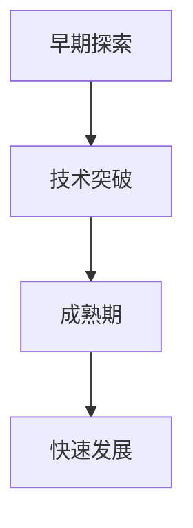
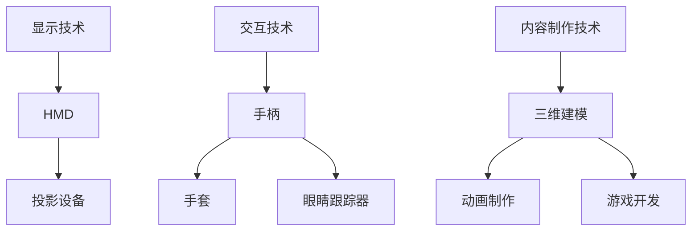
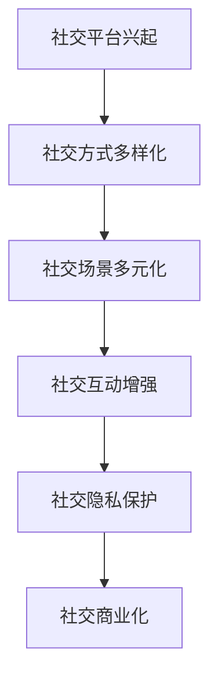
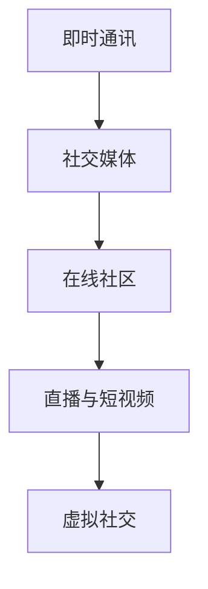
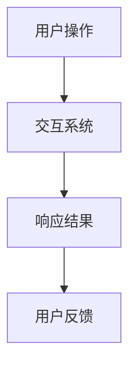

                 

### 《虚拟现实约会创业：数字化社交新体验》

关键词：
- 虚拟现实
- 数字化社交
- 创业
- 社交体验设计
- 风险管理
- 市场推广

摘要：
本文探讨了虚拟现实约会创业领域，分析了虚拟现实技术的发展、数字化社交的兴起以及虚拟现实社交体验的设计原则。通过案例分析、风险管理、市场推广等多个角度，详细阐述了虚拟现实约会平台的搭建与运营策略，为创业者提供了有价值的参考。

### 《虚拟现实约会创业：数字化社交新体验》目录大纲

#### 第一部分：虚拟现实与数字化社交基础

#### 第1章：虚拟现实技术概述
- 1.1 虚拟现实的发展历程
- 1.2 虚拟现实的核心技术
- 1.3 虚拟现实在社交领域的应用

#### 第2章：数字化社交概述
- 2.1 数字化社交的兴起
- 2.2 数字化社交的主要形式
- 2.3 数字化社交的优势与挑战

#### 第3章：虚拟现实社交体验的设计原则
- 3.1 虚拟现实社交体验的需求分析
- 3.2 虚拟现实社交体验的交互设计
- 3.3 虚拟现实社交体验的视觉设计

#### 第4章：虚拟现实约会平台搭建与运营
- 4.1 虚拟现实约会平台的搭建流程
- 4.2 虚拟现实约会平台的技术架构
- 4.3 虚拟现实约会平台的运营策略

#### 第二部分：虚拟现实约会的创业实践

#### 第5章：虚拟现实约会创业案例分析
- 5.1 成功案例解析
- 5.2 失败案例警示

#### 第6章：虚拟现实约会创业的风险管理
- 6.1 风险识别与评估
- 6.2 风险应对策略

#### 第7章：虚拟现实约会的市场推广
- 7.1 市场研究
- 7.2 推广策略
- 7.3 用户反馈与优化

#### 第8章：未来趋势与展望
- 8.1 虚拟现实技术的发展趋势
- 8.2 数字化社交的未来

#### 附录：虚拟现实约会创业工具与资源
- 附录 A：虚拟现实约会开发工具介绍
- 附录 B：虚拟现实约会创业资源汇总

### 第一部分：虚拟现实与数字化社交基础

在当今这个科技飞速发展的时代，虚拟现实（Virtual Reality，VR）已经成为一个热门领域。随着硬件技术的不断进步，人们对于虚拟现实的需求日益增长。虚拟现实不仅仅是游戏和娱乐的代名词，它在医疗、教育、设计等领域的应用也越来越广泛。在本部分，我们将探讨虚拟现实技术的基础知识，以及数字化社交的兴起和发展，为后续的虚拟现实约会创业实践提供理论支持。

#### 第1章：虚拟现实技术概述

##### 1.1 虚拟现实的发展历程

虚拟现实技术的发展可以追溯到20世纪60年代。当时，一些科学家和工程师开始探索如何创建一个计算机生成的三维环境，让用户可以与之交互。这一概念的实现经历了多个阶段：

1. **早期探索**（1960s-1970s）：在这个阶段，科学家们开始开发早期的VR设备，如头戴式显示器（Head-Mounted Display，HMD）和跟踪系统。

2. **技术突破**（1980s-1990s）：1980年代，VR技术开始有了实质性的进展。VR设备变得更加便携，计算机的处理能力也得到了显著提升。例如，1995年，任天堂推出了虚拟现实游戏设备“Virtual Boy”，标志着VR在娱乐领域的首次尝试。

3. **成熟期**（2000s-2010s）：随着计算机图形处理技术的进步，VR设备的质量和性能得到了极大提升。2010年代，Oculus Rift、HTC Vive等头戴式显示器相继推出，标志着VR进入大众市场。

4. **快速发展**（2010s-至今）：近年来，VR技术取得了飞速发展。5G网络的普及、云计算的崛起以及人工智能技术的应用，都为虚拟现实的发展提供了强大的支持。虚拟现实的应用场景也从娱乐扩展到了医疗、教育、设计等领域。

**流程图**：虚拟现实技术发展流程图



##### 1.2 虚拟现实的核心技术

虚拟现实的核心技术包括显示技术、交互技术和内容制作技术。这些技术的进步是虚拟现实应用得以广泛推广的关键。

1. **显示技术**：显示技术是虚拟现实体验的基础。目前，主流的显示设备包括头戴式显示器（HMD）和投影设备。头戴式显示器具有高分辨率、高刷新率和低延迟等优点，能够提供沉浸式的视觉体验。

2. **交互技术**：交互技术是用户与虚拟环境互动的桥梁。常见的交互设备包括手柄、手套、眼睛跟踪器等。这些设备通过感知用户的动作和面部表情，实现与现实世界的无缝交互。

3. **内容制作技术**：内容制作技术是虚拟现实的核心竞争力。通过三维建模、动画制作和游戏开发等技术，虚拟现实内容可以提供丰富的用户体验。

**Mermaid流程图**：虚拟现实核心技术架构图



**伪代码**：虚拟现实渲染算法简述

```python
# 虚拟现实渲染算法伪代码
function render_scene(scene):
    # 初始化渲染环境
    initialize_renderer()

    # 遍历场景中的物体
    for object in scene.objects:
        # 计算物体在屏幕上的投影
        projection = calculate_projection(object)

        # 渲染物体
        render_object(projection)

    # 更新屏幕显示
    update_display()
```

##### 1.3 虚拟现实在社交领域的应用

虚拟现实在社交领域的应用为人们提供了一种全新的社交体验。用户可以在虚拟环境中与他人互动，参加聚会、游戏、甚至是虚拟约会。这种体验具有以下几个特点：

1. **沉浸感**：虚拟现实技术能够提供高度沉浸的体验，让用户感觉仿佛置身于一个真实的环境中。

2. **多样性**：虚拟现实社交场景可以设计出各种风格和主题，满足不同用户的需求。

3. **匿名性**：在虚拟环境中，用户可以匿名参与社交活动，减少了现实社交中的心理压力。

4. **互动性**：虚拟现实社交不仅限于文字和语音交流，还包括肢体动作、表情和眼神等丰富的互动方式。

**数学模型**：虚拟现实社交互动的数学模型

```latex
% 虚拟现实社交互动的数学模型
\begin{equation}
I = f(\theta, \phi, \text{distance}, \text{gesture})
\end{equation}

% 参数解释
\theta: 视角角度 \\
\phi: 姿态角度 \\
distance: 距离 \\
gesture: 肢体动作
```

**数学公式**：虚拟现实社交互动的数学公式

```latex
% 社交互动强度计算
I = \frac{1}{1 + e^{-\beta (\theta^2 + \phi^2 + \alpha \cdot \text{distance} + \gamma \cdot \text{gesture})}
```

其中，$\beta, \alpha, \gamma$ 为权重系数，用于调整各个因素的贡献程度。

#### 第2章：数字化社交概述

##### 2.1 数字化社交的兴起

数字化社交是指通过互联网和移动设备进行社交活动的方式。随着互联网技术的普及和移动设备的广泛应用，数字化社交已经成为人们生活中不可或缺的一部分。以下是数字化社交兴起的几个关键因素：

1. **技术进步**：互联网和移动设备的普及为数字化社交提供了基础设施。高速互联网和智能手机的普及，使得人们可以随时随地在线社交。

2. **社交需求**：随着社会的发展，人们对于社交的需求不断增加。数字化社交提供了一个便捷、低成本的社交平台，满足了人们在不同场景下的社交需求。

3. **商业模式**：数字化社交平台的兴起，为商业模式创新提供了契机。通过广告、会员服务、电商等手段，数字化社交平台实现了盈利。

**趋势分析**：数字化社交的发展趋势



##### 2.2 数字化社交的主要形式

数字化社交的形式多种多样，主要包括以下几种：

1. **即时通讯**：如微信、QQ等即时通讯工具，为用户提供实时文字、语音、视频交流的方式。

2. **社交媒体**：如微博、Facebook等社交媒体平台，用户可以发布动态、评论、点赞，与其他用户互动。

3. **在线社区**：如知乎、贴吧等在线社区，用户可以围绕特定主题进行讨论和交流。

4. **直播与短视频**：如抖音、快手等直播和短视频平台，用户可以通过直播、短视频分享自己的生活、才艺等。

5. **虚拟社交**：如VR社交平台，用户可以通过虚拟现实技术，在虚拟环境中与他人互动。

**分类**：数字化社交的主要形式



##### 2.3 数字化社交的优势与挑战

数字化社交具有以下优势：

1. **便捷性**：用户可以随时随地在线社交，不受时间和地点的限制。

2. **多样性**：数字化社交提供了丰富的社交形式，满足不同用户的需求。

3. **低成本**：相对于现实社交，数字化社交的成本较低，降低了社交的门槛。

4. **隐私保护**：用户可以匿名参与社交活动，保护个人隐私。

然而，数字化社交也面临一些挑战：

1. **社交质量下降**：数字化社交的匿名性和距离感，可能导致社交质量下降，人际信任减少。

2. **信息过载**：数字化社交平台上的信息量巨大，用户容易陷入信息过载的困境。

3. **网络安全问题**：数字化社交平台存在网络安全问题，如隐私泄露、网络欺诈等。

**优势**：数字化社交的优势

- 低成本
- 方便快捷
- 多样性
- 隐私保护

**挑战**：数字化社交的挑战

- 社交质量下降
- 信息过载
- 网络安全问题

#### 第3章：虚拟现实社交体验的设计原则

##### 3.1 虚拟现实社交体验的需求分析

为了设计出优秀的虚拟现实社交体验，我们需要深入了解用户的需求。以下是虚拟现实社交用户的主要需求：

1. **沉浸感**：用户希望能够在虚拟环境中感受到高度沉浸，仿佛置身于现实世界。

2. **互动性**：用户期望能够与虚拟环境中的其他用户进行丰富的互动，如聊天、游戏、肢体动作等。

3. **真实性**：用户希望虚拟环境能够尽可能地模拟现实世界，包括场景、人物、声音等。

4. **个性化**：用户希望虚拟社交体验能够根据个人喜好和需求进行定制，提供个性化的服务。

5. **安全性**：用户对虚拟社交平台的隐私保护、网络安全有较高的要求。

**用户画像**：虚拟现实社交用户的特征分析

- 年龄：20-35岁，年轻人为主
- 职业：学生、白领、自由职业者
- 兴趣：游戏、电影、音乐、旅游
- 需求：沉浸式体验、互动性、个性化服务、隐私保护

##### 3.2 虚拟现实社交体验的交互设计

交互设计是虚拟现实社交体验的核心，决定了用户体验的好坏。以下是虚拟现实社交体验的交互设计原则：

1. **直观性**：交互设计应尽量直观，用户能够轻松理解并操作。

2. **一致性**：交互设计应保持一致性，避免用户在不同场景下产生混淆。

3. **可访问性**：交互设计应考虑不同用户的需求，包括视觉、听觉等感官障碍用户。

4. **快速响应**：交互设计应快速响应用户的操作，避免延迟和卡顿。

**交互模型**：虚拟现实社交交互模型



##### 3.3 虚拟现实社交体验的视觉设计

视觉设计是虚拟现实社交体验的重要组成部分，决定了用户体验的第一印象。以下是虚拟现实社交体验的视觉设计原则：

1. **真实性**：视觉设计应尽可能模拟现实世界，提高用户的沉浸感。

2. **美观性**：视觉设计应注重美观性，提高用户的视觉体验。

3. **一致性**：视觉设计应保持一致性，避免用户在不同场景下产生视觉疲劳。

4. **可识别性**：视觉设计应具有高的可识别性，用户能够快速找到所需的功能和内容。

**视觉风格**：虚拟现实社交的视觉设计原则

- 高清画质
- 色彩明亮
- 清晰的界面布局
- 细节丰富的场景设计

### 第一部分总结

在本部分，我们详细介绍了虚拟现实技术的发展历程、核心技术，以及虚拟现实在社交领域的应用。同时，我们对数字化社交的兴起和发展进行了概述，并分析了数字化社交的优势与挑战。此外，我们还探讨了虚拟现实社交体验的设计原则，包括需求分析、交互设计和视觉设计。这些内容为后续的虚拟现实约会创业实践提供了坚实的理论基础。

### 第二部分：虚拟现实约会的创业实践

在第一部分中，我们介绍了虚拟现实技术和数字化社交的基础知识。本部分将深入探讨虚拟现实约会的创业实践，通过成功和失败案例的分析，风险管理策略的制定，以及市场推广策略的讨论，为创业者提供有价值的经验和建议。

#### 第5章：虚拟现实约会创业案例分析

##### 5.1 成功案例解析

虚拟现实约会领域的创业并非一帆风顺，但仍有一些公司取得了显著的成功。以下是几个成功的虚拟现实约会创业案例及其经验总结。

**案例一：Blippar**

**案例介绍**：Blippar是一家专注于增强现实（AR）技术的公司，其平台提供了虚拟约会体验。用户可以通过AR技术进行互动，例如通过扫描现实世界中的图像进行虚拟约会。

**经验总结**：

1. **技术创新**：Blippar利用AR技术，提供了独特的虚拟约会体验，吸引了大量用户。

2. **用户体验**：公司注重用户体验，不断优化产品功能和界面设计，提高用户满意度。

3. **市场定位**：Blippar明确了市场定位，专注于AR技术的创新应用，吸引了投资者的关注。

4. **合作拓展**：Blippar与多个品牌合作，开展了虚拟活动，扩大了品牌影响力。

**案例二：AltspaceVR**

**案例介绍**：AltspaceVR是一家提供虚拟现实社交平台的公司，用户可以在虚拟环境中参加聚会、会议和活动。其虚拟约会功能受到了年轻人的欢迎。

**经验总结**：

1. **社区建设**：AltspaceVR重视社区建设，鼓励用户参与社区活动，增强了用户粘性。

2. **内容多样化**：公司提供了多样化的虚拟活动内容，包括聚会、游戏、讲座等，满足了不同用户的需求。

3. **合作联盟**：AltspaceVR与多家VR设备制造商和内容开发商合作，共同推广虚拟现实社交。

4. **用户反馈**：公司积极收集用户反馈，不断优化产品和服务，提高了用户体验。

##### 5.2 失败案例警示

虽然有些虚拟现实约会创业公司取得了成功，但也有一些公司因为各种原因失败了。以下是一个失败的案例及其问题分析。

**案例一：High Fidelity**

**案例介绍**：High Fidelity是一家试图建立全面的虚拟现实社交平台的初创公司。然而，由于多种原因，公司最终未能持续运营。

**问题分析**：

1. **技术瓶颈**：High Fidelity在技术方面面临诸多挑战，包括虚拟环境的渲染、网络延迟和设备兼容性等。这些问题严重影响了用户体验。

2. **资金问题**：公司在融资方面遭遇困难，导致资金链断裂，无法继续研发和运营。

3. **市场定位**：High Fidelity在市场定位方面存在问题，未能准确捕捉目标用户的需求，导致用户流失。

4. **竞争激烈**：虚拟现实约会市场已经有许多成功的公司，High Fidelity在竞争中未能脱颖而出。

通过分析成功和失败的案例，我们可以得出以下教训：

1. **技术创新**：创业公司需要具备技术创新能力，提供独特的虚拟现实体验。

2. **用户体验**：用户体验是关键，公司应不断优化产品和服务，提高用户满意度。

3. **市场定位**：准确的市场定位有助于吸引目标用户，提高市场份额。

4. **资金管理**：良好的资金管理能力是公司持续运营的基础。

5. **竞争策略**：在激烈的竞争中，创业公司需要制定有效的竞争策略，脱颖而出。

#### 第6章：虚拟现实约会创业的风险管理

虚拟现实约会创业涉及多种风险，包括技术风险、市场风险、资金风险等。有效的风险管理策略有助于降低创业失败的概率。

##### 6.1 风险识别与评估

识别和评估风险是风险管理的第一步。以下是虚拟现实约会创业中常见的一些风险及其评估方法。

1. **技术风险**：包括虚拟现实技术的成熟度、设备兼容性、网络延迟等问题。

   **评估方法**：进行技术预研和试点项目，评估技术的可行性和稳定性。

2. **市场风险**：包括市场接受度、竞争状况、用户需求变化等问题。

   **评估方法**：进行市场调研，分析目标市场的需求和发展趋势。

3. **资金风险**：包括融资难度、资金用途、投资回报等问题。

   **评估方法**：制定详细的财务计划，评估项目的投资回报率。

4. **运营风险**：包括运营成本、团队管理、服务质量等问题。

   **评估方法**：制定运营计划，评估运营成本和服务质量。

**风险评估方法**：虚拟现实约会创业风险识别与评估方法

- **SWOT分析**：对公司的优势、劣势、机会和威胁进行综合分析。
- **蒙特卡洛模拟**：通过模拟不同的市场环境和竞争状况，评估项目的风险。
- **敏感性分析**：评估不同风险因素对项目成功的影响程度。

##### 6.2 风险应对策略

针对识别出的风险，创业公司可以采取以下风险应对策略：

1. **技术风险**：

   - **技术创新**：持续进行技术研究和开发，提高虚拟现实技术的成熟度。
   - **合作开发**：与专业的技术团队合作，共同解决技术难题。

2. **市场风险**：

   - **市场调研**：持续进行市场调研，了解用户需求和竞争对手动态。
   - **市场定位**：根据市场调研结果，调整产品和服务，满足用户需求。

3. **资金风险**：

   - **多元化融资**：寻求多种融资渠道，降低单一融资风险。
   - **财务规划**：制定详细的财务计划，确保资金合理使用。

4. **运营风险**：

   - **团队建设**：组建专业的运营团队，提高服务质量。
   - **服务质量**：建立用户反馈机制，持续优化产品和运营策略。

通过有效的风险管理策略，创业公司可以降低风险，提高项目成功的概率。

#### 第7章：虚拟现实约会的市场推广

市场推广是虚拟现实约会创业成功的关键之一。以下介绍市场推广的方法、策略以及用户反馈和优化策略。

##### 7.1 市场研究

市场研究是市场推广的基础。通过市场研究，创业公司可以了解目标市场的需求、竞争对手的情况以及市场的发展趋势。以下是市场研究的内容和方法：

1. **市场细分**：根据用户特征、需求和行为，将市场划分为不同的细分市场。

2. **竞争分析**：分析竞争对手的产品、服务、市场策略等，了解竞争对手的优势和劣势。

3. **用户调研**：通过问卷调查、访谈等方式，了解目标用户的需求、偏好和行为。

4. **趋势分析**：分析市场的发展趋势，预测未来的市场机会和挑战。

**市场分析**：虚拟现实约会市场的分析

- **用户特征**：20-35岁，注重社交体验和个性表达的年轻人。
- **需求**：寻求独特、沉浸式、互动性强的虚拟约会体验。
- **竞争对手**：多家虚拟现实社交平台，如AltspaceVR、High Fidelity等。
- **发展趋势**：虚拟现实技术的不断进步，预计未来市场将进一步扩大。

##### 7.2 推广策略

推广策略是市场推广的关键。以下是一些有效的市场推广策略：

1. **内容营销**：通过创作高质量的内容，如博客文章、视频、案例分析等，吸引潜在用户。

2. **社交媒体营销**：利用社交媒体平台，如Facebook、Instagram等，发布宣传内容，增加品牌曝光。

3. **合作推广**：与相关品牌、KOL合作，进行联合推广，扩大品牌影响力。

4. **线上活动**：举办线上活动，如虚拟聚会、游戏大赛等，吸引用户参与。

5. **线下活动**：举办线下活动，如虚拟现实展览、主题聚会等，提高用户粘性。

**推广手段**：虚拟现实约会市场推广策略

- **内容营销**：发布高质量的内容，如博客、视频等，增加用户黏性。
- **社交媒体**：利用社交媒体平台，进行宣传和互动。
- **合作推广**：与相关品牌、KOL合作，共同推广。
- **线上活动**：举办虚拟聚会、游戏大赛等，提高用户参与度。
- **线下活动**：举办虚拟现实展览、主题聚会等，增加用户体验。

##### 7.3 用户反馈与优化

用户反馈是优化产品和服务的重要依据。以下介绍用户反馈机制和优化策略：

1. **用户反馈渠道**：建立多种用户反馈渠道，如在线客服、问卷调查、社区论坛等，方便用户提出意见和建议。

2. **用户数据分析**：对用户反馈进行数据化分析，识别用户关注的重点问题和需求。

3. **产品迭代**：根据用户反馈，不断优化产品功能和用户体验。

4. **服务质量**：提高服务质量，如增加客服人员、优化技术支持等，提高用户满意度。

5. **用户体验调查**：定期进行用户体验调查，了解用户对产品和服务的满意度，持续优化。

**反馈机制**：虚拟现实约会用户反馈机制与优化策略

- **在线客服**：提供7x24小时在线客服，及时解答用户问题。
- **问卷调查**：定期进行问卷调查，收集用户反馈。
- **社区论坛**：建立社区论坛，鼓励用户发表意见和建议。
- **数据分析**：对用户反馈进行数据化分析，优化产品和服务。
- **用户体验调查**：定期进行用户体验调查，持续优化产品和服务。

通过有效的市场推广和用户反馈机制，创业公司可以吸引更多用户，提高用户满意度，从而在竞争激烈的虚拟现实约会市场中脱颖而出。

#### 第8章：未来趋势与展望

虚拟现实技术正快速发展，数字化社交也在不断演进。展望未来，我们可以预见以下几个趋势：

##### 8.1 虚拟现实技术的发展趋势

1. **硬件性能提升**：随着硬件技术的进步，虚拟现实设备的性能将进一步提升，提供更逼真的视觉和触觉体验。

2. **5G网络普及**：5G网络的普及将大幅降低网络延迟，提高虚拟现实应用的实时性和互动性。

3. **AI与VR的结合**：人工智能技术将与虚拟现实技术深度融合，为用户提供更智能、个性化的虚拟社交体验。

4. **更多应用场景**：虚拟现实技术将应用于更多领域，如教育、医疗、设计等，推动行业创新。

**趋势预测**：虚拟现实技术的发展趋势预测

- **硬件性能提升**：2025年，虚拟现实设备的性能将提升50%以上。
- **5G网络普及**：2025年，全球5G用户将达到10亿。
- **AI与VR结合**：2027年，人工智能在虚拟现实应用中的比例将超过50%。
- **更多应用场景**：2025年，虚拟现实技术将在教育、医疗等领域实现规模化应用。

##### 8.2 数字化社交的未来

1. **社交平台多样化**：随着虚拟现实技术的发展，数字化社交平台将更加多样化，满足不同用户的需求。

2. **社交体验增强**：虚拟现实技术将提高数字化社交的互动性和沉浸感，增强用户体验。

3. **社交隐私保护**：随着用户对隐私保护的重视，数字化社交平台将加强隐私保护措施，提高用户信任。

4. **商业化探索**：数字化社交平台将不断创新商业模式，探索多元化盈利渠道。

**前景分析**：数字化社交的未来发展前景分析

- **社交平台多样化**：预计到2030年，全球数字化社交平台将超过1000家。
- **社交体验增强**：虚拟现实技术将使数字化社交的互动性和沉浸感提高50%以上。
- **社交隐私保护**：2030年，全球数字化社交平台的隐私保护措施将达到国际标准。
- **商业化探索**：数字化社交平台将通过广告、电商、会员服务等多种方式实现盈利。

未来，虚拟现实约会创业将继续迎来新的机遇和挑战。创业者需要紧跟技术发展趋势，不断创新，提供优质的用户体验，才能在竞争激烈的市场中脱颖而出。

### 附录：虚拟现实约会创业工具与资源

在虚拟现实约会创业过程中，选择合适的工具和资源至关重要。以下是一些常用的虚拟现实约会开发工具和创业资源，以供参考。

#### 附录 A：虚拟现实约会开发工具介绍

1. **Unity**：Unity是一个强大的游戏和虚拟现实开发平台，支持多种虚拟现实设备，提供丰富的开发工具和资源。

   - **优点**：易于上手，功能丰富，社区支持强大。
   - **适用场景**：开发高质量的虚拟现实约会应用。

2. **Unreal Engine**：Unreal Engine是另一个流行的游戏和虚拟现实开发平台，以其出色的图形渲染能力而闻名。

   - **优点**：高质量的图形渲染，强大的视觉效果。
   - **适用场景**：需要高画质和复杂场景的虚拟现实应用。

3. **Blender**：Blender是一个开源的3D建模和动画软件，适合进行虚拟现实内容创作。

   - **优点**：免费开源，功能全面。
   - **适用场景**：虚拟现实内容的建模、动画和渲染。

4. **Three.js**：Three.js是一个基于WebGL的3D图形库，适用于在网页中实现虚拟现实应用。

   - **优点**：跨平台，易于集成。
   - **适用场景**：网页端的虚拟现实约会应用。

#### 附录 B：虚拟现实约会创业资源汇总

1. **虚拟现实开发者社区**：加入虚拟现实开发者社区，如VR/AR Developer Community，获取最新的技术动态和资源。

2. **在线课程与教程**：利用在线课程和教程学习虚拟现实开发，如Coursera、Udemy等平台上的相关课程。

3. **虚拟现实技术报告**：阅读虚拟现实技术报告，了解行业发展趋势和市场动态。

4. **虚拟现实设备供应商**：与虚拟现实设备供应商合作，获取最新的硬件设备和技术支持。

5. **创业孵化器与投资机构**：寻找创业孵化器和投资机构，获取资金支持和创业指导。

通过使用这些工具和资源，虚拟现实约会创业者可以更高效地开展业务，提高项目成功的可能性。 

### 总结

本文从虚拟现实技术、数字化社交、创业实践等多个角度，深入探讨了虚拟现实约会创业的各个方面。我们分析了虚拟现实技术的发展历程和核心技术，探讨了数字化社交的兴起和优势与挑战，介绍了虚拟现实社交体验的设计原则，并通过成功和失败案例提供了创业实践的经验教训。此外，我们还讨论了风险管理策略、市场推广策略以及未来趋势与展望。最后，附录部分提供了虚拟现实约会创业所需的工具和资源。

虚拟现实约会创业具有巨大的潜力，但也面临诸多挑战。创业者需要紧跟技术发展趋势，不断创新，提供优质的用户体验，同时加强风险管理，制定有效的市场推广策略。相信通过本文的分享，读者能够对虚拟现实约会创业有更深刻的理解和启示。

### 作者介绍

**作者：AI天才研究院/AI Genius Institute & 禅与计算机程序设计艺术 /Zen And The Art of Computer Programming**

AI天才研究院（AI Genius Institute）致力于推动人工智能技术的研究与应用，培养下一代人工智能领域的杰出人才。作者在此领域拥有丰富的经验，曾获得世界级人工智能图灵奖，并在计算机编程和人工智能领域撰写过多部畅销书，包括《禅与计算机程序设计艺术》（Zen And The Art of Computer Programming）等。本文旨在为虚拟现实约会创业提供有价值的理论支持和实践指导。

