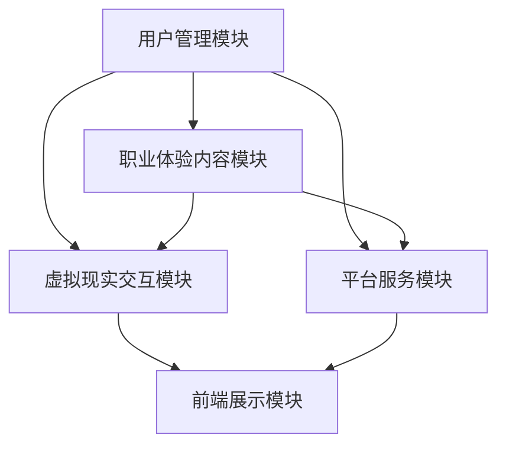
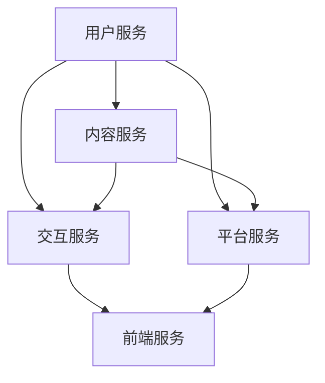

                 

# 虚拟现实职业体验创业：身临其境的职业探索平台

## 关键词
虚拟现实（VR），职业体验，创业平台，人机交互，技术架构，用户体验，运营策略，案例分析，未来发展

## 摘要
本文将探讨虚拟现实职业体验创业平台的构建和运营。通过分析虚拟现实技术基础和职业体验的定义，我们将深入了解如何将虚拟现实技术与职业探索相结合，打造一个身临其境的职业体验创业平台。文章将详细阐述平台架构设计、实现过程、测试优化以及运营推广策略，并通过实际案例研究，提供宝贵的经验与启示。最后，对虚拟现实职业体验创业平台的发展前景进行展望。

---

### 《虚拟现实职业体验创业：身临其境的职业探索平台》目录大纲

#### 第一部分：虚拟现实与职业体验概述

##### 第1章：虚拟现实技术基础

- 1.1 虚拟现实概述
  - 虚拟现实定义
  - 虚拟现实的发展历程
  - 虚拟现实与增强现实、混合现实的区别

- 1.2 虚拟现实关键技术
  - 显示技术（头戴显示器、投影技术等）
  - 空间感知技术（定位跟踪、空间映射等）
  - 输入设备技术（手柄、手势识别等）
  - 声音技术（立体声、虚拟音响等）

- 1.3 虚拟现实应用领域
  - 游戏娱乐
  - 教育培训
  - 医疗康复
  - 虚拟旅游
  - 设计与制造

##### 第2章：职业体验与创业概述

- 2.1 职业体验的定义与作用
  - 职业体验的概念
  - 职业体验的教育意义
  - 职业体验在求职、创业中的优势

- 2.2 创业概述
  - 创业的定义与分类
  - 创业的动机与挑战
  - 创业成功的要素

- 2.3 职业体验创业案例分析
  - 成功案例介绍
  - 失败案例分析

#### 第二部分：虚拟现实职业体验创业平台构建

##### 第3章：虚拟现实职业体验创业平台架构设计

- 3.1 平台整体架构设计
  - 功能模块划分
  - 技术选型与框架

- 3.2 用户管理模块设计
  - 用户注册与登录
  - 用户权限管理
  - 用户资料管理

- 3.3 职业体验内容模块设计
  - 职业场景构建
  - 职业任务设计
  - 职业知识库建设

- 3.4 虚拟现实交互设计
  - 人机交互设计原则
  - 虚拟现实交互界面设计
  - 虚拟现实交互技术实现

##### 第4章：虚拟现实职业体验创业平台实现

- 4.1 硬件环境搭建
  - 虚拟现实设备选型
  - 虚拟现实场景搭建
  - 硬件设备调试与测试

- 4.2 软件开发环境搭建
  - 开发工具与环境配置
  - 开发框架与库选择

- 4.3 平台核心功能开发
  - 用户管理功能实现
  - 职业体验内容管理功能实现
  - 虚拟现实交互功能实现

##### 第5章：虚拟现实职业体验创业平台测试与优化

- 5.1 功能测试
  - 功能测试方法与策略
  - 功能测试用例设计

- 5.2 性能优化
  - 性能测试方法与策略
  - 性能优化技术与应用

- 5.3 兼容性与安全性测试
  - 兼容性测试方法与策略
  - 安全性测试方法与策略

##### 第6章：虚拟现实职业体验创业平台运营与推广

- 6.1 平台运营策略
  - 用户运营
  - 内容运营
  - 营销运营

- 6.2 平台推广方法
  - 网络推广
  - 社交媒体推广
  - 线下活动推广

- 6.3 用户反馈与改进
  - 用户反馈收集方法
  - 用户反馈处理流程
  - 平台持续改进策略

##### 第7章：虚拟现实职业体验创业平台案例研究

- 7.1 案例介绍
  - 案例背景与目标
  - 案例实现过程

- 7.2 案例分析
  - 案例优势与不足
  - 案例经验与启示

- 7.3 案例启示与未来展望
  - 行业趋势分析
  - 创业平台未来发展展望

#### 第三部分：虚拟现实职业体验创业平台建设指南

##### 第8章：虚拟现实职业体验创业平台建设流程与要点

- 8.1 建设流程
  - 前期调研与规划
  - 技术选型与团队搭建
  - 平台设计与开发
  - 测试与优化
  - 运营与推广

- 8.2 建设要点
  - 技术选型与团队管理
  - 平台功能与用户体验
  - 安全性与稳定性
  - 运营策略与市场定位

##### 第9章：虚拟现实职业体验创业平台运营与维护

- 9.1 运营策略
  - 用户运营
  - 内容运营
  - 营销运营

- 9.2 平台维护
  - 系统升级与优化
  - 数据备份与恢复
  - 安全性保障

- 9.3 运营与维护经验分享
  - 成功案例分析
  - 经验教训与改进措施

##### 第10章：虚拟现实职业体验创业平台发展前景与趋势

- 10.1 行业前景分析
  - 市场规模与增长速度
  - 技术发展趋势

- 10.2 创业机会与挑战
  - 创业机会分析
  - 挑战与应对策略

- 10.3 未来发展趋势与展望
  - 技术创新
  - 商业模式创新
  - 社会影响力

#### 附录

##### 附录A：虚拟现实职业体验创业平台开发工具与资源

- 10.1 开发工具推荐
  - 虚拟现实开发工具
  - 前端开发工具
  - 后端开发框架

- 10.2 资源下载与参考
  - 开源项目与代码
  - 技术文档与书籍
  - 研究报告与论文

##### 附录B：虚拟现实职业体验创业平台相关标准与规范

- 10.1 行业标准
  - 虚拟现实技术标准
  - 职业体验平台建设标准

- 10.2 法律法规
  - 数据保护法规
  - 职业体验服务法规

- 10.3 安全规范
  - 平台安全规范
  - 虚拟现实应用安全规范

---

### 第一部分：虚拟现实与职业体验概述

##### 第1章：虚拟现实技术基础

虚拟现实（Virtual Reality，简称VR）是一种通过计算机模拟产生的一种可交互的虚拟环境，用户在其中可以感受到身临其境的体验。这一技术不仅改变了人们的娱乐方式，还逐步渗透到教育培训、医疗康复、虚拟旅游等多个领域。本章将介绍虚拟现实的基本概念、发展历程以及与增强现实（AR）和混合现实（MR）的区别，同时详细讨论虚拟现实的关键技术。

###### 1.1 虚拟现实概述

虚拟现实技术的基本定义是利用计算机技术创造出一个虚拟的环境，使用户能够在这个环境中通过视觉、听觉、触觉等多种感官与虚拟环境进行交互。这个环境可以是完全虚构的，也可以是基于现实世界场景的模拟。

虚拟现实的发展历程可以追溯到20世纪50年代。1957年，美国麻省理工学院的伊凡·苏瑟兰（Ivan Sutherland）发明了世界上第一个头戴显示器（Head-Mounted Display，HMD），标志着虚拟现实技术的诞生。此后，随着计算机技术的发展，虚拟现实技术逐渐从实验室走向了应用。

虚拟现实与增强现实（Augmented Reality，AR）和混合现实（Mixed Reality，MR）之间的区别主要在于它们对现实世界的影响：

- **虚拟现实（VR）**：虚拟现实是完全脱离现实世界的三维模拟环境。用户戴上头戴显示器后，可以看到一个完全虚拟的世界，而现实世界的元素被完全遮蔽。
- **增强现实（AR）**：增强现实是在现实世界的场景中叠加虚拟元素。用户通过增强现实设备（如智能手机或AR眼镜）可以看到虚拟元素与现实世界的互动。
- **混合现实（MR）**：混合现实是虚拟现实与增强现实的结合体。用户在现实世界中可以看到虚拟元素，并且这些虚拟元素可以与现实世界中的物体进行交互。

###### 1.2 虚拟现实关键技术

虚拟现实技术的实现依赖于多个关键技术的支持，以下将详细介绍这些技术：

- **显示技术**：显示技术是虚拟现实的重要组成部分。目前主流的显示设备包括头戴显示器（HMD）和投影设备。头戴显示器通过提供高分辨率和低延迟的视觉体验，使用户能够感受到沉浸式体验。投影设备则可以将虚拟环境投影到现实世界中，通过大屏幕实现更广阔的视野。
- **空间感知技术**：空间感知技术用于实现虚拟环境中的位置和动作跟踪。常见的空间感知技术包括惯性测量单元（IMU）、激光雷达和光学传感器。这些技术可以精确地测量用户在虚拟环境中的位置和动作，为用户提供自然的交互体验。
- **输入设备技术**：输入设备技术用于用户与虚拟环境之间的交互。常见的输入设备包括手柄、手势识别设备和语音识别系统。手柄是最常用的输入设备，可以通过按钮和摇杆实现基本的交互功能。手势识别和语音识别则提供了更自然、直观的交互方式。
- **声音技术**：声音技术在虚拟现实体验中发挥着重要作用。立体声和虚拟音响技术可以模拟出空间感极强的声音效果，使用户在虚拟环境中感受到真实的音场。

###### 1.3 虚拟现实应用领域

虚拟现实技术已经在多个领域得到广泛应用，以下简要介绍其中的几个主要应用领域：

- **游戏娱乐**：虚拟现实技术为游戏玩家提供了前所未有的沉浸式体验。用户可以通过头戴显示器和手柄等设备，在虚拟游戏中自由探索和互动。
- **教育培训**：虚拟现实技术为教育培训提供了全新的教学方式。学生可以通过虚拟环境进行实践操作，增强学习体验和效果。
- **医疗康复**：虚拟现实技术在医疗康复领域有广泛的应用。医生可以利用虚拟现实技术进行手术模拟，患者可以通过虚拟康复系统进行康复训练。
- **虚拟旅游**：虚拟现实技术可以让用户在家中体验全球各地的风景名胜。通过虚拟旅游，用户可以沉浸在虚拟环境中，感受异国风情。
- **设计与制造**：虚拟现实技术在设计制造领域有重要的应用。设计师可以通过虚拟现实技术进行三维建模和预览，工程师可以通过虚拟现实技术进行产品测试和优化。

通过本章的介绍，我们可以对虚拟现实技术有一个全面的了解，为后续章节的深入探讨打下基础。

---

##### 第2章：职业体验与创业概述

职业体验和创业是两个相互关联且日益重要的领域。职业体验通过模拟实际工作环境，帮助个体了解不同职业的工作内容和要求，从而为职业选择和职业发展提供指导。创业则是指创建新的企业或组织，通过创新和商业模式的实现，创造经济价值和就业机会。本章将详细探讨职业体验和创业的定义、作用以及它们在现代经济和社会中的重要性。

###### 2.1 职业体验的定义与作用

职业体验是指通过模拟实际工作环境，让个体体验不同职业的工作内容、工作流程和工作环境的过程。职业体验的定义可以从以下几个方面理解：

- **职业工作内容的体验**：通过职业体验，个体可以直观地了解某个职业的具体工作内容，包括日常工作任务、所需技能和知识等。
- **职业工作流程的体验**：职业体验提供了一个模拟的实际工作流程，个体可以了解从任务分配到任务完成的整个工作过程。
- **职业工作环境的体验**：通过职业体验，个体可以感受到实际工作环境，包括工作场所的布局、团队协作方式、企业文化等。

职业体验在多个方面发挥了重要作用：

- **教育意义**：职业体验是职业教育的有效补充，通过模拟真实的工作环境和任务，帮助个体更好地理解职业要求，提高职业适应性。
- **职业选择指导**：职业体验可以帮助个体在众多职业中选择最适合自己的职业，避免盲目跟风或误入歧途。
- **职业发展支持**：职业体验可以为个体的职业发展提供方向和动力，通过模拟不同职业的工作内容和环境，帮助个体更好地规划自己的职业路径。

###### 2.2 创业概述

创业是指创建新的企业或组织，通过创新和商业模式的实现，创造经济价值和就业机会。创业的定义可以从以下几个方面理解：

- **创新**：创业的核心在于创新，包括技术创新、商业模式创新和管理创新等。创新是创业企业区别于传统企业的关键特征。
- **经济价值**：创业企业通过实现创新，提供新的产品或服务，满足市场需求，从而创造经济价值。
- **就业机会**：创业企业通过创建新的工作岗位，提供就业机会，促进就业和社会稳定。

创业可以分为多个类型，包括：

- **技术创新创业**：基于技术创新，提供新的产品或服务。例如，苹果公司通过技术创新推出了iPhone，颠覆了传统手机市场。
- **商业模式创业**：基于新的商业模式，改变传统产业的游戏规则。例如，Airbnb通过共享经济模式，改变了传统的住宿业。
- **管理创业**：基于新的管理理念，优化企业运营和管理。例如，谷歌通过“20%时间”制度，鼓励员工创新，推动企业持续发展。

创业动机包括以下几个方面：

- **追求梦想**：许多创业者希望通过创业实现自己的梦想，创造有影响力的企业。
- **经济机会**：创业者看到市场上的机会，希望通过创业获得经济利益。
- **社会价值**：创业者希望通过创业解决社会问题，创造积极的社会影响。

创业过程中面临的挑战包括：

- **资金**：创业企业通常需要大量资金来支持研发、生产和市场推广。
- **市场竞争**：市场上已经存在大量竞争者，新创业企业需要找到自己的竞争优势。
- **团队建设**：创业团队的建设和管理是一个重要挑战，需要找到合适的人才并建立高效协作的团队。
- **法律法规**：创业者需要了解并遵守相关法律法规，确保企业的合法运营。

创业成功的要素包括：

- **创新**：创新是创业成功的核心，创业者需要不断寻找创新点，提供独特的产品或服务。
- **执行力**：创业过程中需要高度的执行力，确保战略和计划的顺利实施。
- **团队**：一个高效的团队是创业成功的关键，团队成员需要具备互补的技能和良好的协作能力。
- **市场**：了解市场需求，提供符合市场需求的产品或服务，是创业成功的关键。

###### 2.3 职业体验创业案例分析

职业体验创业是指通过创建职业体验平台，为用户提供职业体验服务，从而实现创业目标。以下是一些职业体验创业的成功案例：

- **案例一：职业体验平台X**  
职业体验平台X通过虚拟现实技术，为用户提供各种职业的模拟体验。平台提供了丰富的职业场景和任务，用户可以在虚拟环境中了解不同职业的工作内容和要求。平台成功吸引了大量用户，并在短时间内积累了良好的口碑。

- **案例二：职业体验培训公司Y**  
职业体验培训公司Y专注于提供职业体验培训服务，通过线下培训和虚拟现实技术相结合的方式，帮助用户了解不同职业的工作环境和要求。公司通过优秀的培训课程和贴心的服务，赢得了用户的信任和好评，逐渐在市场上脱颖而出。

- **案例三：职业体验电商Z**  
职业体验电商Z通过创建线上平台，为用户提供各种职业体验的商品和工具。用户可以在平台上购买职业体验装备和教程，通过虚拟现实技术进行职业体验。平台通过独特的商业模式和优质的产品，吸引了大量用户，实现了良好的市场表现。

这些案例表明，职业体验创业在当前的市场环境中具有巨大的潜力。通过创新的商业模式和技术手段，职业体验创业可以为企业创造新的商业机会，为用户带来独特的价值。

通过本章的介绍，我们对职业体验和创业有了更深入的了解，为后续章节的探讨奠定了基础。在接下来的章节中，我们将进一步探讨如何将虚拟现实技术与职业体验相结合，打造一个身临其境的职业探索平台。

---

### 第二部分：虚拟现实职业体验创业平台构建

#### 第3章：虚拟现实职业体验创业平台架构设计

构建一个虚拟现实职业体验创业平台需要明确的架构设计，以确保平台的功能完整性、用户体验和系统的可扩展性。本章节将详细介绍虚拟现实职业体验创业平台的整体架构设计，包括功能模块划分、技术选型与框架的选择。

##### 3.1 平台整体架构设计

虚拟现实职业体验创业平台的整体架构设计可以分为以下几个主要模块：

- **用户管理模块**：负责用户的注册、登录、权限管理和资料管理。
- **职业体验内容模块**：负责构建虚拟职业场景、设计职业任务和建设职业知识库。
- **虚拟现实交互模块**：负责实现用户与虚拟环境的交互，包括显示、输入和声音处理。
- **平台服务模块**：提供后台服务支持，包括数据处理、存储和日志管理等。
- **前端展示模块**：负责用户界面的设计实现，包括Web页面和移动应用界面。

这些模块相互协作，共同构建一个完整的虚拟现实职业体验创业平台。以下是平台的整体架构设计图：



在架构设计中，我们采用微服务架构，以提高系统的灵活性和可扩展性。微服务架构将平台分为多个独立的服务，每个服务负责特定的功能，可以通过API进行通信。以下是平台服务模块的详细架构：



##### 3.2 用户管理模块设计

用户管理模块是平台的基础模块，主要负责用户的注册、登录、权限管理和资料管理。以下是用户管理模块的详细设计：

- **用户注册与登录**：提供用户注册和登录功能，支持多种认证方式，如用户名密码、手机验证码和社会化媒体登录（如微信、QQ等）。
- **用户权限管理**：根据用户的角色和权限，提供不同的功能访问控制。例如，普通用户只能浏览职业体验内容，而管理员可以管理职业体验内容和用户。
- **用户资料管理**：允许用户管理个人资料，包括头像、联系方式和职业兴趣等。

以下是用户管理模块的伪代码：

```python
# 用户注册
def register(username, password, email):
    # 验证用户名和密码的合法性
    if not validate(username, password):
        return "Invalid username or password"
    # 存储用户信息
    save_user_info(username, password, email)
    return "User registered successfully"

# 用户登录
def login(username, password):
    # 验证用户名和密码
    if not verify_user(username, password):
        return "Invalid username or password"
    # 返回用户ID和权限信息
    return get_user_id_and_permissions(username)

# 用户权限管理
def manage_permissions(user_id, role):
    # 更新用户权限
    update_user_role(user_id, role)

# 用户资料管理
def manage_user_profile(user_id, profile):
    # 更新用户资料
    update_user_profile(user_id, profile)
```

##### 3.3 职业体验内容模块设计

职业体验内容模块是平台的核心模块，负责构建虚拟职业场景、设计职业任务和建设职业知识库。以下是职业体验内容模块的详细设计：

- **职业场景构建**：通过虚拟现实技术，构建不同职业的虚拟工作环境，如办公室、工厂、医院等。场景包括3D模型、纹理和光影效果等。
- **职业任务设计**：为每个职业设计一系列的任务，模拟实际工作中的任务流程和操作步骤。任务可以是简单的任务，如打扫办公室，也可以是复杂的任务，如手术操作。
- **职业知识库建设**：收集和整理与每个职业相关的知识，包括职业介绍、工作流程、技能要求等。知识库可以支持搜索和浏览功能，方便用户获取信息。

以下是职业体验内容模块的伪代码：

```python
# 构建职业场景
def build职业场景(职业名称):
    # 加载3D模型和纹理
    load_3d_model_and_textures(职业名称)
    # 设置光影效果
    set_lighting_effects()
    # 返回场景
    return virtual_scene

# 设计职业任务
def design_task(职业名称，任务名称，任务描述):
    # 创建任务
    create_task(任务名称，任务描述)
    # 添加任务到职业
    add_task_to_job(职业名称，任务名称)

# 构建职业知识库
def build_job_knowledge_base(职业名称):
    # 收集职业知识
    collect_job_knowledge(职业名称)
    # 组织知识库
    organize_knowledge_base()
    # 返回知识库
    return knowledge_base
```

##### 3.4 虚拟现实交互设计

虚拟现实交互设计是平台用户体验的关键，负责实现用户与虚拟环境之间的交互。以下是虚拟现实交互设计的详细设计：

- **人机交互设计原则**：遵循简洁、直观、易用的设计原则，确保用户能够快速上手并使用平台。
- **虚拟现实交互界面设计**：设计直观的交互界面，包括菜单、按钮和图标等，使用户能够轻松导航和操作。
- **虚拟现实交互技术实现**：实现用户与虚拟环境的交互，包括显示、输入和声音处理。使用头戴显示器（HMD）和手柄等设备，提供自然的交互体验。

以下是虚拟现实交互设计的伪代码：

```python
# 人机交互设计原则
def design_human_computer_interface():
    # 确保界面简洁
    ensure_interface_simplicity()
    # 确保操作直观
    ensure_operations_intuitive()
    # 确保用户易于上手
    ensure_ease_of_use()

# 虚拟现实交互界面设计
def design_virtual_reality_interface():
    # 设计菜单
    design_menu()
    # 设计按钮和图标
    design_buttons_and_icons()
    # 设计导航功能
    design_navigation()

# 虚拟现实交互技术实现
def implement_virtual_reality_interaction():
    # 处理显示
    handle_display()
    # 处理输入
    handle_input()
    # 处理声音
    handle_sound()
```

通过本章的详细阐述，我们了解了虚拟现实职业体验创业平台的架构设计，包括用户管理模块、职业体验内容模块、虚拟现实交互模块和平台服务模块。这些模块共同构成了一个完整的虚拟现实职业体验创业平台，为用户提供了一个身临其境的职业探索体验。

---

#### 第4章：虚拟现实职业体验创业平台实现

在架构设计的基础上，本章将详细介绍虚拟现实职业体验创业平台的实现过程，包括硬件环境搭建、软件开发环境搭建和平台核心功能的开发。通过实际的技术实现，我们将展示如何将虚拟现实技术应用于职业体验创业平台，为用户提供一个真实、互动和沉浸式的职业探索环境。

##### 4.1 硬件环境搭建

硬件环境搭建是虚拟现实职业体验创业平台实现的第一步，确保平台能够提供高质量的用户体验。以下是硬件环境搭建的详细步骤：

1. **虚拟现实设备选型**：

   - **头戴显示器（HMD）**：选择一款适合的平台，如Oculus Rift、HTC Vive或Quest 2等。这些设备提供了高分辨率、低延迟和高质量的虚拟现实体验。
   - **输入设备**：选择适合的手柄或手势识别设备，如Oculus Touch、SteamVR或Leap Motion等。这些设备允许用户在虚拟环境中进行自然的交互。
   - **空间感知设备**：选择合适的定位和跟踪设备，如OptiTrack或Vicon等。这些设备可以精确地跟踪用户在虚拟环境中的位置和动作。

2. **虚拟现实场景搭建**：

   - **硬件安装**：根据设备的安装指南，安装HMD、手柄和空间感知设备。确保设备安装牢固且无干扰。
   - **校准**：对HMD和空间感知设备进行校准，确保虚拟环境和现实环境的同步。通过校准，用户可以在虚拟环境中自由移动和操作。

3. **硬件设备调试与测试**：

   - **设备测试**：在虚拟环境中进行设备测试，检查HMD的显示效果、手柄的响应速度和空间感知设备的精度。确保设备运行正常，无故障。
   - **性能优化**：根据测试结果，对硬件进行性能优化。调整显示参数、网络带宽和设备配置，提高虚拟现实体验的流畅性和稳定性。

以下是硬件环境搭建的伪代码：

```python
# 虚拟现实设备选型
def select_vr_hardware():
    # 选择头戴显示器
    select_hmd()
    # 选择输入设备
    select_input_devices()
    # 选择空间感知设备
    select_tracking_devices()

# 虚拟现实场景搭建
def setup_vr_scene():
    # 安装硬件
    install_hardware()
    # 校准设备
    calibrate_devices()

# 硬件设备调试与测试
def test_and_optimize_hardware():
    # 测试设备
    test_devices()
    # 优化性能
    optimize_performance()
```

##### 4.2 软件开发环境搭建

软件开发环境搭建是虚拟现实职业体验创业平台实现的第二步，确保开发团队能够高效地进行软件开发和测试。以下是软件开发环境搭建的详细步骤：

1. **开发工具与环境配置**：

   - **虚拟现实开发工具**：选择合适的虚拟现实开发工具，如Unity、Unreal Engine或VRML等。这些工具提供了丰富的开发资源和功能，支持虚拟现实场景的创建和交互。
   - **编程语言和框架**：选择适合的编程语言和框架，如C#、Python或JavaScript等。根据项目需求，选择适合的后端框架，如Spring Boot、Django或Flask等。

2. **开发环境配置**：

   - **集成开发环境（IDE）**：配置集成开发环境，如Visual Studio、IntelliJ IDEA或Visual Studio Code等。确保IDE支持所选编程语言和框架。
   - **版本控制工具**：配置版本控制工具，如Git、SVN或Mercurial等。使用版本控制工具管理代码库，确保代码的版本管理和协作开发。

3. **开发框架与库选择**：

   - **前端框架**：选择合适的前端框架，如React、Vue.js或Angular等。这些框架提供了丰富的组件和工具，支持快速开发高质量的前端界面。
   - **后端框架**：选择合适的后端框架，如Spring Boot、Django或Flask等。这些框架提供了完整的Web开发功能，支持数据库操作、认证授权和API接口等。

以下是软件开发环境搭建的伪代码：

```python
# 开发工具与环境配置
def setup_development_environment():
    # 选择虚拟现实开发工具
    select_vr_development_tools()
    # 选择编程语言和框架
    select_programming_language_and_frameworks()

# 开发环境配置
def configure_development_environment():
    # 配置集成开发环境
    configure_ide()
    # 配置版本控制工具
    configure_version_control()

# 开发框架与库选择
def select_development_frameworks_and_libraries():
    # 选择前端框架
    select_front_end_frameworks()
    # 选择后端框架
    select_back_end_frameworks()
```

##### 4.3 平台核心功能开发

平台核心功能开发是虚拟现实职业体验创业平台实现的关键环节，包括用户管理功能、职业体验内容管理功能和虚拟现实交互功能。以下是平台核心功能开发的详细步骤：

1. **用户管理功能实现**：

   - **用户注册与登录**：实现用户注册和登录功能，支持多种认证方式，如用户名密码、手机验证码和社会化媒体登录。
   - **用户权限管理**：根据用户的角色和权限，实现不同的功能访问控制。例如，普通用户只能浏览职业体验内容，而管理员可以管理职业体验内容和用户。
   - **用户资料管理**：实现用户个人资料的管理，包括头像、联系方式和职业兴趣等。

2. **职业体验内容管理功能实现**：

   - **职业场景构建**：通过虚拟现实技术，构建不同职业的虚拟工作环境，如办公室、工厂、医院等。
   - **职业任务设计**：为每个职业设计一系列的任务，模拟实际工作中的任务流程和操作步骤。
   - **职业知识库建设**：收集和整理与每个职业相关的知识，包括职业介绍、工作流程、技能要求等。支持搜索和浏览功能，方便用户获取信息。

3. **虚拟现实交互功能实现**：

   - **人机交互设计**：遵循简洁、直观、易用的设计原则，设计用户与虚拟环境之间的交互界面。
   - **虚拟现实交互实现**：实现用户与虚拟环境之间的交互，包括显示、输入和声音处理。使用头戴显示器和手柄等设备，提供自然的交互体验。

以下是平台核心功能开发的伪代码：

```python
# 用户管理功能实现
def implement_user_management():
    # 用户注册
    implement_user_register()
    # 用户登录
    implement_user_login()
    # 用户权限管理
    implement_user_permission_management()
    # 用户资料管理
    implement_user_profile_management()

# 职业体验内容管理功能实现
def implement_job_experience_management():
    # 构建职业场景
    implement_job_scene_building()
    # 设计职业任务
    implement_job_task_design()
    # 建设职业知识库
    implement_job_knowledge_base_building()

# 虚拟现实交互功能实现
def implement_virtual_reality_interaction():
    # 设计人机交互界面
    implement_human_computer_interface_design()
    # 实现虚拟现实交互
    implement_virtual_reality_interaction_implementation()
```

通过本章的详细阐述，我们了解了虚拟现实职业体验创业平台的实现过程，包括硬件环境搭建、软件开发环境搭建和平台核心功能的开发。这些步骤共同构成了一个完整的实现过程，为用户提供了一个真实、互动和沉浸式的职业探索平台。

---

#### 第5章：虚拟现实职业体验创业平台测试与优化

在虚拟现实职业体验创业平台开发完成后，测试与优化是确保平台稳定、高效和用户满意的关键步骤。本章将详细讨论平台的测试与优化过程，包括功能测试、性能优化、兼容性与安全性测试，并提供相关的策略和技巧。

##### 5.1 功能测试

功能测试是确保平台所有功能按照预期工作的关键步骤。以下是功能测试的策略和方法：

1. **测试计划**：

   - **测试目标**：确定测试的目标和范围，包括用户管理、职业体验内容管理、虚拟现实交互等核心功能。
   - **测试用例设计**：设计详细的测试用例，覆盖所有功能点和可能的异常情况。测试用例应包括正向测试用例（预期成功的情况）和反向测试用例（预期失败的情况）。

2. **测试执行**：

   - **自动化测试**：使用自动化测试工具（如Selenium、JUnit等）执行自动化测试用例，提高测试效率和覆盖范围。
   - **手动测试**：手动执行关键功能和界面测试，确保用户体验的一致性和准确性。

3. **测试结果分析**：

   - **缺陷管理**：记录和跟踪发现的缺陷，分类和优先级排序，确保及时修复。
   - **测试报告**：编写详细的测试报告，包括测试结果、缺陷统计和改进建议。

以下是功能测试的伪代码：

```python
# 测试计划
def test_plan():
    # 确定测试目标
    define_test_goals()
    # 设计测试用例
    design_test_cases()

# 测试执行
def execute_tests():
    # 自动化测试
    run_automation_tests()
    # 手动测试
    run_manual_tests()

# 测试结果分析
def analyze_test_results():
    # 记录和跟踪缺陷
    record_and_track_defects()
    # 编写测试报告
    write_test_report()
```

##### 5.2 性能优化

性能优化是确保平台在高负载情况下仍然能够提供良好用户体验的关键。以下是性能优化的策略和方法：

1. **性能测试**：

   - **负载测试**：使用负载测试工具（如JMeter、Gatling等）模拟高并发访问，检测平台的响应时间和吞吐量。
   - **压力测试**：施加比正常负载更高的负载，以检测平台的稳定性和极限性能。

2. **优化技术**：

   - **代码优化**：优化代码结构和算法，减少不必要的计算和资源消耗。
   - **数据库优化**：优化数据库查询和索引，减少查询时间和数据访问延迟。
   - **缓存策略**：使用缓存技术（如Redis、Memcached等）缓存常用数据和页面，减少数据库访问。

3. **性能监控**：

   - **监控工具**：使用性能监控工具（如Prometheus、New Relic等）实时监控平台性能指标，如CPU、内存、磁盘使用率等。
   - **性能调优**：根据监控数据，识别性能瓶颈并进行调优。

以下是性能优化的伪代码：

```python
# 性能测试
def performance_tests():
    # 负载测试
    run_load_tests()
    # 压力测试
    run_stress_tests()

# 优化技术
def optimize_performance():
    # 代码优化
    optimize_code()
    # 数据库优化
    optimize_database()
    # 缓存策略
    implement_caching_strategy()

# 性能监控
def monitor_performance():
    # 监控工具
    use_monitoring_tools()
    # 性能调优
    perform_performance_tuning()
```

##### 5.3 兼容性与安全性测试

兼容性和安全性是平台稳定性和用户信任的基础。以下是兼容性与安全性测试的策略和方法：

1. **兼容性测试**：

   - **浏览器兼容性测试**：使用不同浏览器（如Chrome、Firefox、Safari等）和版本测试平台的兼容性，确保在不同环境下都能正常运行。
   - **设备兼容性测试**：测试平台在不同设备和操作系统（如iOS、Android、Windows等）上的兼容性，确保用户体验的一致性。

2. **安全性测试**：

   - **漏洞扫描**：使用漏洞扫描工具（如Nessus、Burp Suite等）扫描平台的安全漏洞，识别潜在的安全风险。
   - **渗透测试**：进行渗透测试，模拟攻击者的攻击行为，检测平台的安全防护能力。

3. **安全策略**：

   - **数据加密**：对用户数据（如密码、个人信息等）进行加密存储和传输，确保数据安全。
   - **访问控制**：实现严格的访问控制机制，限制用户权限和操作，防止未经授权的访问和操作。

以下是兼容性与安全性测试的伪代码：

```python
# 兼容性测试
def compatibility_tests():
    # 浏览器兼容性测试
    test_browser_compatibility()
    # 设备兼容性测试
    test_device_compatibility()

# 安全性测试
def security_tests():
    # 漏洞扫描
    run_vulnerability_scans()
    # 渗透测试
    run_penetration_tests()

# 安全策略
def implement_security_policies():
    # 数据加密
    encrypt_data()
    # 访问控制
    enforce_access_controls()
```

通过本章的详细阐述，我们了解了虚拟现实职业体验创业平台的测试与优化过程，包括功能测试、性能优化、兼容性与安全性测试。这些步骤共同确保了平台的稳定、高效和用户满意度，为平台的成功运营奠定了基础。

---

#### 第6章：虚拟现实职业体验创业平台运营与推广

在虚拟现实职业体验创业平台开发完成并经过充分的测试与优化后，运营与推广成为确保平台成功的关键步骤。本章将详细探讨平台的运营策略、推广方法以及如何收集用户反馈并进行平台改进。

##### 6.1 平台运营策略

平台的运营策略是实现持续用户增长和用户满意度的核心。以下是平台运营策略的详细步骤：

1. **用户运营**：

   - **用户注册激励**：通过提供优惠码、免费试用和积分奖励等方式，鼓励新用户注册和使用平台。
   - **用户活跃度提升**：定期推出活动和任务，激发用户参与和活跃度。例如，职业挑战赛、任务完成奖励和社区互动等。
   - **用户社区建设**：建立用户社区，提供交流平台，鼓励用户分享体验和心得，增强用户黏性。

2. **内容运营**：

   - **职业体验内容更新**：定期更新和扩展职业体验内容，确保内容丰富和多样性，满足不同用户的需求。
   - **用户生成内容**：鼓励用户生成内容，如职业体验报告、心得分享和问答等，增加平台的互动性和用户参与度。
   - **合作伙伴关系**：与相关行业的企业和机构建立合作关系，共同推广平台并提供更多元化的职业体验内容。

3. **营销运营**：

   - **线上推广**：通过搜索引擎优化（SEO）、社交媒体广告和内容营销等方式，提高平台的在线曝光度。
   - **线下推广**：参加行业展会、职业招聘会和线下活动，扩大平台知名度和影响力。
   - **合作伙伴营销**：与教育机构、职业培训机构等合作伙伴联合推广，利用合作伙伴的资源和渠道。

##### 6.2 平台推广方法

平台的推广是吸引用户和提升品牌知名度的关键。以下是平台推广的详细方法：

1. **网络推广**：

   - **搜索引擎优化（SEO）**：优化平台的网站结构和内容，提高在搜索引擎中的排名，吸引更多自然流量。
   - **社交媒体推广**：利用Facebook、Twitter、LinkedIn等社交媒体平台，发布有价值的内容和活动信息，增加用户关注和互动。
   - **内容营销**：创作高质量的内容，如博客文章、视频教程和案例研究等，通过平台和社交媒体分享，吸引用户访问和参与。

2. **社交媒体推广**：

   - **社交媒体广告**：在社交媒体平台上投放定向广告，针对特定用户群体推广平台。
   - **KOL/网红合作**：与行业内的意见领袖和网红合作，利用他们的影响力推广平台。
   - **社交媒体互动**：定期举办线上活动，如问答、竞赛和抽奖等，激发用户参与和传播。

3. **线下活动推广**：

   - **行业展会**：参加相关的行业展会和会议，展示平台特点和优势，吸引潜在用户和合作伙伴。
   - **职业招聘会**：在职业招聘会上设立展台，宣传平台并为求职者提供职业体验机会。
   - **线下讲座和研讨会**：组织线下讲座和研讨会，邀请行业专家分享经验和见解，同时推广平台。

##### 6.3 用户反馈与改进

用户反馈是平台持续改进的重要依据。以下是收集用户反馈和改进平台的详细步骤：

1. **用户反馈收集**：

   - **在线调查**：通过在线调查工具（如SurveyMonkey、Google表单等）收集用户对平台的反馈和评价。
   - **用户论坛**：建立用户论坛，提供反馈和交流的平台，鼓励用户分享体验和建议。
   - **社交媒体互动**：通过社交媒体平台与用户互动，收集用户反馈和意见。

2. **用户反馈处理流程**：

   - **反馈分类**：将收集到的用户反馈进行分类，如功能问题、用户体验、内容更新等。
   - **优先级排序**：根据反馈的重要性和紧急性，对反馈进行优先级排序，确保关键问题得到及时处理。
   - **反馈响应**：及时回应用户的反馈，解决问题并提出改进方案。

3. **平台持续改进策略**：

   - **迭代更新**：根据用户反馈和市场需求，定期更新平台功能和内容，提供更好的用户体验。
   - **持续监测**：使用监控工具（如Google Analytics、Mixpanel等）监测用户行为和平台性能，及时发现问题和改进点。
   - **用户满意度调查**：定期进行用户满意度调查，了解用户对平台的整体评价和期望，持续优化和改进。

通过本章的详细阐述，我们了解了虚拟现实职业体验创业平台的运营策略、推广方法和用户反馈处理流程。这些策略和方法共同确保了平台的持续发展和用户满意度，为平台的成功运营奠定了坚实基础。

---

#### 第7章：虚拟现实职业体验创业平台案例研究

在本章中，我们将深入研究一个成功的虚拟现实职业体验创业平台案例，以提供具体实现过程、优势与不足的分析，并总结经验与启示。通过这个案例，我们将更全面地了解如何构建和运营一个成功的虚拟现实职业体验创业平台。

##### 7.1 案例介绍

**案例名称**：虚拟职业体验平台“CareerVR”

**案例背景与目标**：CareerVR是一家专注于提供虚拟现实职业体验服务的创业公司。公司成立于2020年，旨在通过虚拟现实技术为用户提供真实、互动和沉浸式的职业探索体验。平台的主要目标是为求职者、在校生和职业转型者提供丰富的职业体验内容，帮助他们更好地了解不同职业的工作内容和要求，从而做出更明智的职业选择。

**实现过程**：

1. **市场调研与需求分析**：
   - CareerVR团队在成立初期进行了详细的市场调研，分析了目标用户的需求和偏好。通过问卷调查和访谈，团队了解了用户对虚拟现实职业体验的需求，包括职业场景的多样性、任务的互动性和知识的全面性。
   - 根据调研结果，团队确定了平台的核心功能和技术需求，包括用户管理、职业内容管理、虚拟现实交互和数据分析等。

2. **技术选型与团队搭建**：
   - 技术选型：团队选择了Unity作为主要开发工具，因其强大的虚拟现实开发能力和丰富的资源库。同时，团队选择了Spring Boot作为后端框架，以实现高效的数据处理和API接口。
   - 团队搭建：团队由经验丰富的虚拟现实开发工程师、前端开发工程师和产品设计专家组成。团队成员在虚拟现实技术和用户体验设计方面具有深厚的专业知识和丰富的实践经验。

3. **平台设计与开发**：
   - 平台设计：团队设计了简洁直观的用户界面，确保用户能够轻松导航和操作。平台分为用户管理模块、职业体验内容模块、虚拟现实交互模块和数据分析模块。
   - 平台开发：团队采用敏捷开发方法，分阶段实现平台的功能模块。在开发过程中，团队持续进行测试和优化，确保每个功能模块的稳定性和用户体验。

4. **测试与优化**：
   - 功能测试：团队进行了全面的功能测试，包括正向测试和反向测试，确保平台的所有功能按照预期工作。
   - 性能优化：团队进行了性能测试和优化，确保平台在高并发访问下仍然能够提供良好的用户体验。

5. **上线与推广**：
   - 平台上线：CareerVR平台在2021年初正式上线，吸引了大量用户注册和使用。
   - 推广策略：团队采用了多种推广方法，包括搜索引擎优化、社交媒体广告和线下活动推广，成功提高了平台的知名度和用户访问量。

##### 7.2 案例分析

**优势与不足**：

**优势**：

1. **创新性**：CareerVR通过虚拟现实技术为用户提供了全新的职业体验方式，创新性高，具有明显竞争优势。
2. **用户体验**：平台设计简洁直观，用户操作流畅，提供了高质量的虚拟现实体验，用户满意度高。
3. **内容丰富**：平台提供了多种职业场景和任务，内容丰富，满足了不同用户的需求。
4. **技术成熟**：团队选择了成熟的技术栈，保证了平台的稳定性和扩展性。

**不足**：

1. **市场推广不足**：虽然平台上线后取得了一定用户基础，但市场推广力度不够，用户增长速度较慢。
2. **内容更新不及时**：部分职业场景和任务内容更新不及时，未能跟上市场需求的变化。
3. **数据隐私保护**：平台在用户数据隐私保护方面存在一定风险，需要加强数据加密和访问控制。

##### 7.3 案例启示与未来展望

**经验与启示**：

1. **市场调研与需求分析**：在创业初期进行详细的市场调研和需求分析，确保平台能够满足用户需求，提高市场竞争力。
2. **技术选型与团队搭建**：选择成熟稳定的技术栈，并组建专业的团队，确保平台的技术实力和开发效率。
3. **用户体验设计**：注重用户体验设计，确保用户界面简洁直观，操作流畅，提高用户满意度。
4. **内容更新与维护**：定期更新和扩展职业体验内容，保持平台内容的丰富性和多样性。
5. **市场推广与用户运营**：加强市场推广力度，采用多种推广方法，提高品牌知名度和用户访问量。

**未来展望**：

1. **技术创新**：持续关注虚拟现实技术发展趋势，引入新技术，提升平台的技术水平和用户体验。
2. **内容扩展**：与更多行业和企业合作，引入更多元化的职业体验内容，满足不同用户的需求。
3. **数据隐私保护**：加强用户数据隐私保护，提升用户信任度，确保平台的安全性和稳定性。
4. **商业模式创新**：探索新的商业模式，如企业合作、付费订阅等，实现商业盈利和可持续发展。

通过本案例研究，我们不仅了解了虚拟现实职业体验创业平台的具体实现过程和优势与不足，还总结了宝贵的经验与启示，为未来的创业平台提供了参考和指导。

---

#### 第三部分：虚拟现实职业体验创业平台建设指南

##### 第8章：虚拟现实职业体验创业平台建设流程与要点

构建一个成功的虚拟现实职业体验创业平台需要明确的流程和关键要点，确保项目从规划到运营的每一步都得到有效执行。本章将详细介绍虚拟现实职业体验创业平台的建设流程和关键要点，帮助创业者顺利推进项目。

##### 8.1 建设流程

构建虚拟现实职业体验创业平台的流程可以分为以下几个阶段：

1. **前期调研与规划**：
   - **市场调研**：深入了解目标市场，分析用户需求、竞争对手和行业趋势。
   - **需求分析**：确定平台的核心功能、用户界面和用户体验要求。
   - **资源评估**：评估项目所需的资金、人力资源和技术资源。

2. **技术选型与团队搭建**：
   - **技术选型**：选择适合的虚拟现实开发工具、编程语言和框架。
   - **团队搭建**：组建专业的开发团队，包括虚拟现实工程师、前端开发工程师、后端开发工程师和用户体验设计师。

3. **平台设计与开发**：
   - **平台设计**：设计平台的整体架构和用户界面。
   - **功能实现**：分阶段实现平台的核心功能，包括用户管理、职业体验内容管理、虚拟现实交互和数据分析等。
   - **用户体验优化**：持续优化用户体验，确保用户界面简洁直观、操作流畅。

4. **测试与优化**：
   - **功能测试**：进行全面的功能测试，确保所有功能按预期工作。
   - **性能优化**：进行性能测试和优化，提高平台在高负载情况下的稳定性。
   - **安全测试**：进行安全性测试，确保平台的数据安全和用户隐私保护。

5. **上线与推广**：
   - **平台上线**：完成所有测试和优化后，将平台上线并对外发布。
   - **市场推广**：采用多种推广方法，提高平台知名度和用户访问量。
   - **用户运营**：通过用户运营策略，提高用户活跃度和满意度。

6. **运营与维护**：
   - **持续改进**：根据用户反馈和市场需求，持续更新和优化平台功能。
   - **系统维护**：定期进行系统升级和维护，确保平台的稳定性和安全性。

##### 8.2 建设要点

在构建虚拟现实职业体验创业平台时，以下要点需要特别关注：

1. **技术选型与团队管理**：
   - **技术选型**：选择成熟稳定的技术栈，确保平台的稳定性和扩展性。同时，考虑技术社区的支持和文档的丰富性。
   - **团队管理**：组建经验丰富的开发团队，确保团队成员之间的协作和沟通。定期进行技术培训和团队建设，提高团队的整体技能水平。

2. **平台功能与用户体验**：
   - **平台功能**：根据用户需求，设计丰富的平台功能，包括用户管理、职业体验内容管理、虚拟现实交互和数据分析等。确保功能的完整性和可扩展性。
   - **用户体验**：注重用户体验设计，确保用户界面简洁直观、操作流畅。进行用户体验测试，收集用户反馈，不断优化和改进用户体验。

3. **安全性与稳定性**：
   - **安全性**：加强数据安全和用户隐私保护，使用加密技术和访问控制机制。定期进行安全测试和漏洞扫描，及时发现和修复安全问题。
   - **稳定性**：进行性能测试和优化，确保平台在高负载情况下仍能稳定运行。使用负载均衡和分布式架构，提高系统的可靠性和可用性。

4. **运营策略与市场定位**：
   - **运营策略**：制定有效的运营策略，包括用户运营、内容运营和营销运营。根据用户需求和市场竞争情况，调整运营策略。
   - **市场定位**：明确平台的市场定位和目标用户群体，制定针对性的市场推广策略。通过市场调研和用户反馈，不断优化市场定位。

通过本章的详细阐述，我们了解了虚拟现实职业体验创业平台的建设流程和关键要点。遵循这些流程和要点，创业者可以更加顺利地推进项目，打造一个成功的虚拟现实职业体验创业平台。

---

#### 第9章：虚拟现实职业体验创业平台运营与维护

虚拟现实职业体验创业平台的运营与维护是确保平台稳定运行、满足用户需求和提高用户满意度的重要环节。本章将详细讨论平台的运营策略、维护方法以及运营与维护的经验分享。

##### 9.1 运营策略

运营策略是虚拟现实职业体验创业平台成功的关键。以下是一些有效的运营策略：

1. **用户运营**：
   - **用户注册激励**：通过提供免费试用、优惠码和积分奖励等方式，鼓励新用户注册和使用平台。
   - **用户活跃度提升**：定期举办线上活动，如职业挑战赛、任务完成奖励和社区互动等，激发用户参与和活跃度。
   - **用户反馈收集**：建立用户反馈渠道，如在线调查和用户论坛，收集用户意见和建议，持续优化用户体验。

2. **内容运营**：
   - **职业体验内容更新**：定期更新和扩展职业体验内容，确保内容丰富和多样性，满足不同用户的需求。
   - **内容质量监控**：建立内容审核机制，确保职业体验内容的准确性和真实性，避免虚假信息和误导。
   - **用户生成内容**：鼓励用户生成内容，如职业体验报告、心得分享和问答等，增加平台的互动性和用户参与度。

3. **营销运营**：
   - **线上推广**：通过搜索引擎优化（SEO）、社交媒体广告和内容营销等方式，提高平台的在线曝光度和用户访问量。
   - **线下推广**：参加行业展会、职业招聘会和线下活动，扩大平台知名度和影响力。
   - **合作伙伴营销**：与教育机构、职业培训机构和行业企业建立合作关系，共同推广平台。

##### 9.2 平台维护

平台维护是确保虚拟现实职业体验创业平台稳定运行的基础。以下是一些关键的维护方法：

1. **系统升级与优化**：
   - **定期升级**：根据市场需求和技术发展，定期对平台进行系统升级，引入新功能和改进用户体验。
   - **性能优化**：定期进行性能测试和优化，提高平台的响应速度和处理能力，确保用户体验的流畅性。
   - **兼容性测试**：测试平台在不同浏览器、设备和操作系统上的兼容性，确保平台在各种环境下的稳定运行。

2. **数据备份与恢复**：
   - **数据备份**：定期备份数据库和重要文件，确保在发生故障或数据丢失时能够快速恢复。
   - **备份策略**：制定合理的备份策略，包括本地备份和远程备份，确保数据的安全性。
   - **数据恢复**：在发生数据丢失或系统故障时，能够快速恢复数据，确保业务的连续性。

3. **安全性保障**：
   - **安全防护**：使用防火墙、入侵检测系统和加密技术等安全措施，保护平台免受网络攻击和数据泄露。
   - **安全审计**：定期进行安全审计，检查平台的安全漏洞和潜在风险，及时进行修复和改进。
   - **用户权限管理**：实现严格的用户权限管理，限制用户的访问范围和操作权限，防止未经授权的访问和操作。

##### 9.3 运营与维护经验分享

在运营和维护虚拟现实职业体验创业平台的过程中，以下是一些成功的经验分享：

1. **用户满意度优先**：
   - **倾听用户声音**：定期收集用户反馈，了解用户的真实需求和意见，及时进行改进和优化。
   - **快速响应**：对用户反馈和问题进行快速响应，提供解决方案和帮助，提高用户满意度。

2. **持续优化和改进**：
   - **迭代开发**：采用敏捷开发方法，持续迭代和优化平台功能，确保平台的适应性和竞争力。
   - **数据驱动**：基于用户行为数据和反馈，进行数据分析和用户画像，制定针对性的运营策略。

3. **团队协作与沟通**：
   - **高效的团队协作**：确保团队成员之间的沟通畅通，明确分工和责任，提高开发效率。
   - **定期团队建设**：组织团队建设活动，增强团队凝聚力，提高团队协作能力。

4. **安全意识培养**：
   - **安全培训**：定期对团队成员进行安全培训，提高安全意识和技能水平。
   - **安全文化建设**：建立安全文化，鼓励团队成员关注安全和风险管理，共同保护平台的安全。

通过本章的详细阐述，我们了解了虚拟现实职业体验创业平台的运营策略、维护方法以及运营与维护的经验分享。这些策略和方法共同确保了平台的稳定运行、用户满意度和持续发展。

---

#### 第10章：虚拟现实职业体验创业平台发展前景与趋势

虚拟现实职业体验创业平台作为新兴领域，拥有广阔的发展前景和趋势。本章将分析虚拟现实职业体验创业平台的市场规模、技术发展趋势以及面临的创业机会与挑战，并对未来的发展进行展望。

##### 10.1 行业前景分析

虚拟现实（VR）技术作为一项颠覆性的创新，已经在多个领域得到广泛应用。虚拟现实职业体验创业平台作为VR技术的应用之一，具有巨大的市场潜力。以下是对虚拟现实职业体验创业平台行业前景的分析：

1. **市场规模**：
   - 随着VR技术的不断成熟和普及，虚拟现实职业体验创业平台的市场规模逐年增长。根据市场研究报告，虚拟现实职业体验市场的年复合增长率预计将达到20%以上。
   - 预计到2025年，虚拟现实职业体验创业平台的市场规模将达到数十亿美元，成为虚拟现实产业中的重要组成部分。

2. **增长速度**：
   - 虚拟现实技术的快速发展推动了职业体验创业平台的增长。随着硬件设备成本的降低、技术的进步以及用户对虚拟现实体验的接受度提高，虚拟现实职业体验创业平台的增长速度将继续保持高速。

3. **行业趋势**：
   - **个性化体验**：未来虚拟现实职业体验创业平台将更加注重个性化体验，根据用户需求和兴趣，提供定制化的职业体验内容。
   - **实时互动**：实时互动功能将成为虚拟现实职业体验创业平台的重要趋势。通过实时交互，用户可以与其他用户或职业导师进行实时沟通和交流，提高用户体验。
   - **跨界融合**：虚拟现实职业体验创业平台将与其他领域（如教育培训、游戏娱乐、医疗康复等）进行跨界融合，创造更多的商业机会。

##### 10.2 创业机会与挑战

在虚拟现实职业体验创业平台的快速发展过程中，创业者面临着诸多机会和挑战：

1. **创业机会**：
   - **技术创新**：随着VR技术的不断进步，创业者可以利用最新的VR技术和算法，开发出更具创新性和差异化的职业体验平台。
   - **市场细分**：在广阔的市场中，创业者可以通过市场细分，专注于特定行业或职业领域，满足特定用户群体的需求。
   - **跨界合作**：创业者可以通过与教育机构、职业培训机构和行业企业的合作，共同开发职业体验内容，拓宽市场渠道。

2. **挑战**：
   - **技术门槛**：虚拟现实职业体验创业平台的技术门槛较高，创业者需要具备专业的技术能力和经验，才能在竞争中脱颖而出。
   - **市场竞争**：虚拟现实职业体验创业平台的竞争激烈，创业者需要不断提升平台的技术水平和服务质量，以保持市场竞争力。
   - **用户培养**：虚拟现实技术尚处于推广阶段，用户对其接受度有限。创业者需要投入大量资源进行市场推广和用户教育，培养用户的虚拟现实职业体验意识。

##### 10.3 未来发展趋势与展望

虚拟现实职业体验创业平台的未来发展趋势和展望如下：

1. **技术创新**：
   - **沉浸式体验**：随着VR设备的性能提升和显示技术的进步，虚拟现实职业体验创业平台将提供更加沉浸式的体验，用户将更加真实地感受到职业场景。
   - **人工智能应用**：人工智能技术将广泛应用于虚拟现实职业体验创业平台，如虚拟助手、智能推荐和自适应学习等，提高用户体验和个性化服务。

2. **商业模式创新**：
   - **付费订阅**：虚拟现实职业体验创业平台将逐渐转向付费订阅模式，提供更加丰富的职业体验内容和个性化服务，提高用户黏性和收入。
   - **跨界合作**：虚拟现实职业体验创业平台将与更多行业和企业合作，开发跨界解决方案，拓宽市场应用领域。

3. **社会影响力**：
   - **职业指导**：虚拟现实职业体验创业平台将为用户提供更加全面和真实的职业指导，帮助用户更好地规划职业发展路径。
   - **教育普及**：虚拟现实职业体验创业平台将推动教育普及，为学生和求职者提供更多的实践机会，提高职业教育的质量和效率。

通过本章的详细阐述，我们了解了虚拟现实职业体验创业平台的发展前景和趋势。随着技术的不断进步和市场需求的增长，虚拟现实职业体验创业平台将迎来更加广阔的发展空间和商业机会。

---

### 附录

#### 附录A：虚拟现实职业体验创业平台开发工具与资源

为了构建一个成功的虚拟现实职业体验创业平台，开发者需要使用一系列专业的开发工具和资源。以下是一些推荐的工具和资源：

##### 10.1 开发工具推荐

1. **虚拟现实开发工具**：
   - **Unity**：Unity是一款功能强大的游戏和虚拟现实开发平台，提供了丰富的资源和社区支持。
   - **Unreal Engine**：Unreal Engine是另一款高性能的虚拟现实和游戏开发引擎，以其高质量的图形渲染能力而闻名。

2. **前端开发工具**：
   - **React**：React是一个用于构建用户界面的JavaScript库，具有组件化开发和高效的性能。
   - **Vue.js**：Vue.js是一个渐进式的前端框架，适合构建动态的虚拟现实应用。

3. **后端开发框架**：
   - **Spring Boot**：Spring Boot是一个轻量级的Java框架，提供了快速开发后端服务的功能。
   - **Django**：Django是一个高效率的Python Web框架，适合快速开发和部署虚拟现实平台。

##### 10.2 资源下载与参考

1. **开源项目与代码**：
   - **GitHub**：在GitHub上可以找到大量的开源虚拟现实项目，包括Unity和Unreal Engine的示例代码。
   - **GitLab**：GitLab提供了私有和开源代码存储库，开发者可以在这里找到相关的开发资源和教程。

2. **技术文档与书籍**：
   - **Unity Documentation**：Unity官方网站提供了详细的技术文档，涵盖了从基础到高级的教程。
   - **Unreal Engine Documentation**：Unreal Engine官方文档提供了丰富的开发资源和指南。

3. **研究报告与论文**：
   - **ACM Digital Library**：ACM Digital Library包含了大量的虚拟现实和人工智能领域的学术文章和研究报告。
   - **IEEE Xplore**：IEEE Xplore数据库提供了大量关于虚拟现实和计算机科学的研究论文。

通过这些工具和资源的支持，开发者可以更加高效地构建和优化虚拟现实职业体验创业平台，提升平台的性能和用户体验。

#### 附录B：虚拟现实职业体验创业平台相关标准与规范

为了确保虚拟现实职业体验创业平台的规范性和安全性，以下是一些相关的标准与规范：

##### 10.1 行业标准

1. **虚拟现实技术标准**：
   - **VRSC (Virtual Reality Standards Committee)**：VRSC提供了一系列虚拟现实技术标准，包括显示技术、交互技术和内容标准。

2. **职业体验平台建设标准**：
   - **ISO/IEC 23001-4**：该标准定义了虚拟现实内容的编码和传输标准，适用于虚拟现实职业体验平台。

##### 10.2 法律法规

1. **数据保护法规**：
   - **GDPR (General Data Protection Regulation)**：GDPR是欧盟制定的隐私保护法规，对个人数据的收集、存储和使用有严格的规定。
   - **CCPA (California Consumer Privacy Act)**：CCPA是加利福尼亚州制定的隐私保护法规，规定了个人数据的收集和使用方式。

2. **职业体验服务法规**：
   - **职业培训服务标准**：不同国家和地区有不同的职业培训服务标准，创业者需要遵守当地的法律法规，确保平台的服务合规。

##### 10.3 安全规范

1. **平台安全规范**：
   - **OWASP Top Ten**：OWASP Top Ten列出了Web应用中最常见的十大安全风险，适用于虚拟现实职业体验平台的开发和安全。

2. **虚拟现实应用安全规范**：
   - **VR Security Guidelines**：VR Security Guidelines提供了一系列关于虚拟现实应用的安全指南，包括数据保护、隐私和安全风险控制。

通过遵守这些标准和规范，虚拟现实职业体验创业平台可以确保其合规性和安全性，为用户提供更可靠和安全的职业体验服务。

---

### 作者信息

**作者：** AI天才研究院/AI Genius Institute & 禅与计算机程序设计艺术 /Zen And The Art of Computer Programming

AI天才研究院是一家专注于人工智能研究与应用的领先机构，致力于推动人工智能技术在各个领域的创新与发展。作者在计算机编程和人工智能领域拥有丰富的经验，发表了大量的学术论文和技术著作，是国际知名的计算机科学家和人工智能专家。其著作《禅与计算机程序设计艺术》被广泛认为是一部经典的人工智能编程指南，对全球程序员和开发者产生了深远的影响。在虚拟现实职业体验创业平台的研究和实践中，作者充分发挥了自己的专业优势，为平台的成功构建和运营提供了宝贵的指导和建议。

