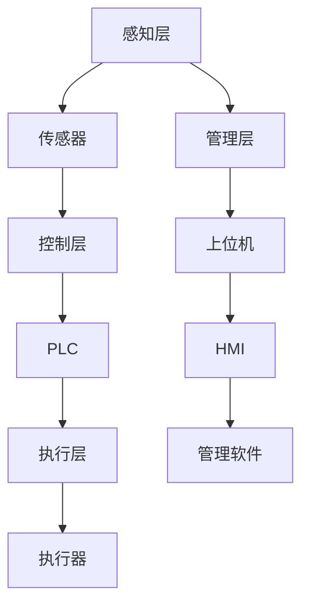
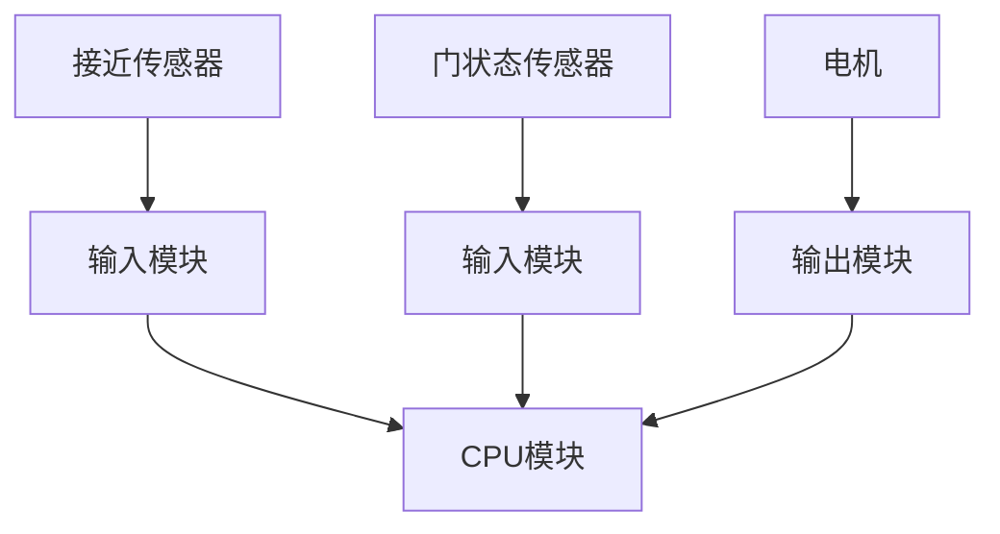
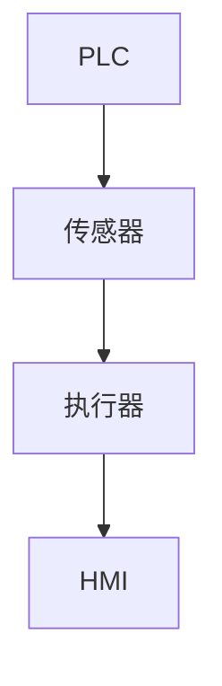
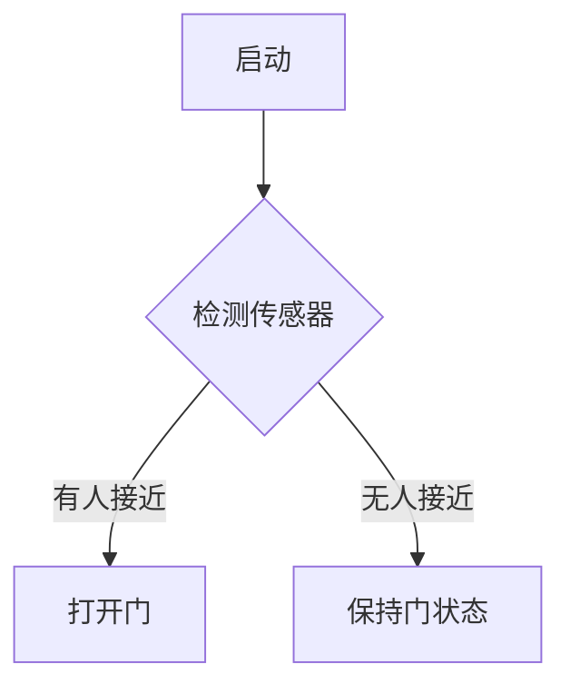
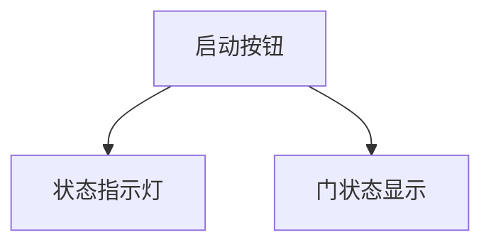
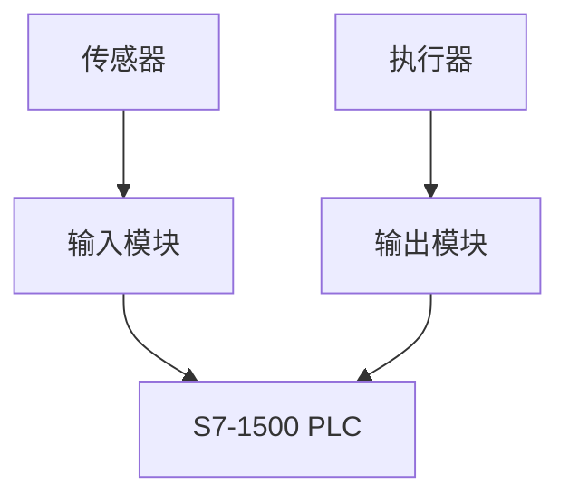
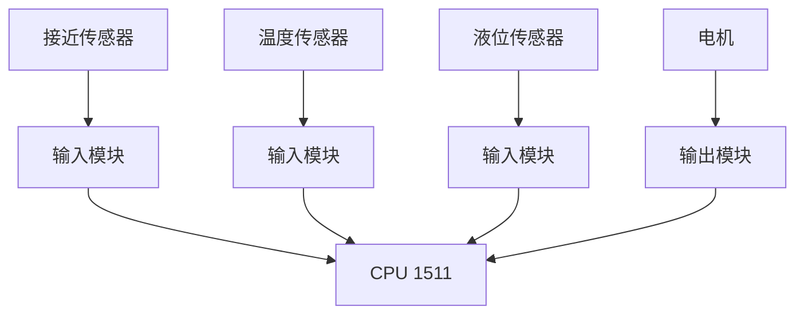
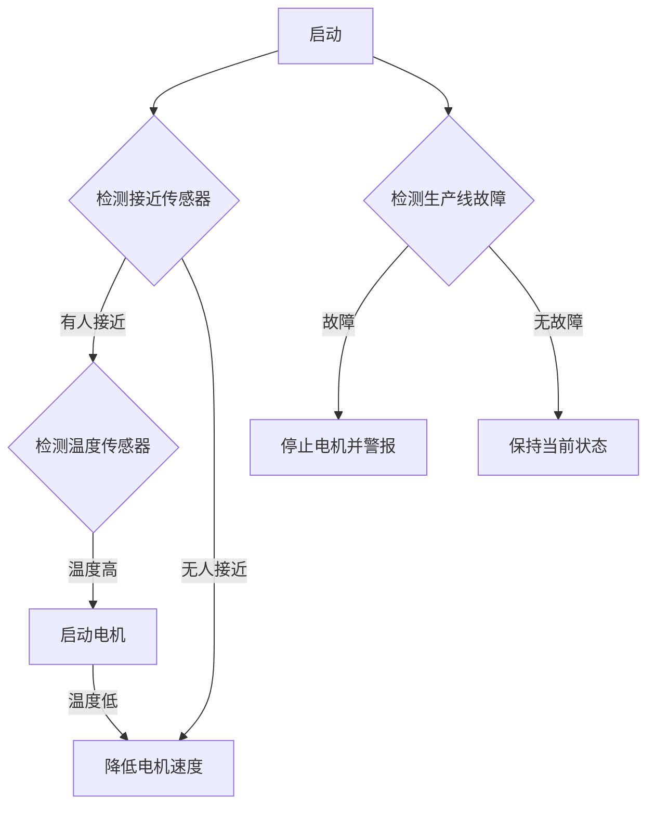

                 

## 文章标题

### 西门子2024校招工业自动化工程师编程挑战

---

**关键词：**
- 西门子
- 校招
- 工业自动化
- 编程挑战
- PLC编程
- 工业网络
- S7-1500

**摘要：**
本文将深入探讨西门子2024校招工业自动化工程师编程挑战的相关内容。通过系统地分析工业自动化的基础知识，西门子S7-1500编程基础，PLC编程与调试，工业网络通信，西门子工业软件应用，编程挑战与解决方案，以及工业自动化工程师面试指南，我们旨在为读者提供一次全面且实用的学习体验。本文不仅涵盖了理论知识，还包括了实际项目案例和代码实现，旨在帮助读者更好地理解工业自动化领域，为未来的职业发展打下坚实的基础。

---

### 第一部分：工业自动化基础知识

#### 1.1 工业自动化概述

工业自动化是指通过使用各种自动化设备和系统来执行工业生产中的各种任务，从而提高生产效率、降低成本、减少人工操作错误和改善工作环境。工业自动化的概念最早可以追溯到20世纪初，但直到20世纪60年代，随着电子计算机的出现和自动化技术的发展，工业自动化才逐渐成为一个独立的领域。

工业自动化系统通常由传感器、执行器、控制器和计算机软件等组成部分构成。传感器用于检测环境或生产过程中的各种参数，执行器则用于执行具体的操作，控制器则是整个系统的“大脑”，负责接收传感器输入的信息，并根据这些信息做出决策，然后指挥执行器进行相应的操作。

**工业自动化的发展历程**

工业自动化的发展历程可以分为以下几个阶段：

1. **机械自动化阶段**（19世纪末到20世纪30年代）：这一阶段主要是通过机械装置实现简单的自动化，如机床的自动化生产线。
   
2. **电气自动化阶段**（20世纪30年代到60年代）：随着电气的普及，电气控制逐渐取代机械控制，成为自动化系统的核心。

3. **计算机自动化阶段**（20世纪60年代至今）：随着计算机技术的飞速发展，计算机在自动化系统中的应用越来越广泛，自动化系统也逐渐向智能化、网络化、集成化方向发展。

**工业自动化系统架构**

工业自动化系统的架构可以分为以下几个层次：

1. **感知层**：包括各种传感器和检测设备，用于实时获取生产过程中的各种数据。
   
2. **执行层**：包括各种执行器，如电机、阀门、气压缸等，用于根据控制器的指令执行具体的操作。

3. **控制层**：包括控制器和PLC（可编程逻辑控制器），负责接收感知层的数据，做出决策，并发送指令给执行层。

4. **管理层**：包括上位机和管理软件，用于对整个系统进行监控、分析和优化。

---

### 1.2 工业自动化的发展历程

工业自动化的历史可以追溯到20世纪初期，但其真正的快速发展始于20世纪中后期。以下是工业自动化发展历程的主要阶段：

1. **机械自动化阶段（19世纪末至20世纪30年代）**：
   - 机械化生产线的出现，例如福特汽车公司的流水线生产，标志着机械自动化的开始。
   - 真空管计算机的出现，为自动化控制提供了一定的基础。

2. **电气自动化阶段（20世纪30年代至60年代）**：
   - 电气控制系统逐渐取代机械控制，成为工业生产的主要控制手段。
   - 可编程逻辑控制器（PLC）的发明，使得自动化控制变得更加灵活和高效。

3. **计算机自动化阶段（20世纪60年代至今）**：
   - 计算机技术的飞速发展，使得工业自动化系统开始向智能化、网络化、集成化方向迈进。
   - 分布式控制系统（DCS）和现场总线技术的发展，进一步提高了工业自动化系统的效率和可靠性。

4. **智能自动化阶段（21世纪初至今）**：
   - 人工智能、大数据和物联网技术的应用，使得工业自动化系统变得更加智能化，能够实现自适应控制、预测维护和优化生产。
   - 工业4.0和智能制造的理念，进一步推动了工业自动化的发展。

**工业自动化系统架构**

工业自动化系统的架构可以分为以下几个层次：

1. **感知层**：包括各种传感器和检测设备，用于实时获取生产过程中的各种数据。
   
2. **执行层**：包括各种执行器，如电机、阀门、气压缸等，用于根据控制器的指令执行具体的操作。

3. **控制层**：包括控制器和PLC（可编程逻辑控制器），负责接收感知层的数据，做出决策，并发送指令给执行层。

4. **管理层**：包括上位机和管理软件，用于对整个系统进行监控、分析和优化。

通过了解工业自动化的发展历程和系统架构，我们可以更好地理解当前工业自动化领域的现状和未来发展趋势。

### 1.3 工业自动化系统架构

工业自动化系统的架构是理解其工作机制的关键。一个典型的工业自动化系统通常包括以下几个主要层次：

1. **感知层**：这一层的主要功能是收集实时数据，这些数据可以是温度、压力、流量、位置等物理量。感知层通常由各种传感器组成，如温度传感器、压力传感器、流量传感器、光电传感器等。这些传感器将物理信号转换为电信号，供控制系统使用。

2. **执行层**：这一层的主要功能是根据控制层的指令执行具体的操作。执行器是执行层的关键部件，如电机、阀门、气压缸等。执行器根据控制层的指令改变其状态，从而实现机械运动、开关动作等。

3. **控制层**：这一层是工业自动化系统的“大脑”，负责接收感知层的数据，并根据这些数据进行处理，然后发出指令给执行层。控制层通常由PLC（可编程逻辑控制器）或嵌入式控制器组成。PLC通过编程可以完成逻辑判断、定时控制、计数等功能，是工业自动化系统中非常核心的部件。

4. **管理层**：这一层的主要功能是对整个工业自动化系统进行监控、分析和优化。管理层通常由上位机、人机界面（HMI）和管理软件组成。上位机通过工业网络与PLC或其他控制器通信，获取实时数据，并进行数据处理和展示。HMI则提供了一个用户界面，使得操作人员可以直观地监控和控制整个系统。管理软件可以进行生产调度、故障诊断、性能优化等高级功能。

**核心概念与联系**

- **传感器**：用于感知环境，并将物理信号转换为电信号。
- **执行器**：用于执行具体的操作，如机械运动、开关动作等。
- **PLC**：负责接收传感器数据，进行处理，然后发出指令给执行器。
- **上位机**：负责对整个系统进行监控、分析和优化。

**Mermaid 流程图**

以下是工业自动化系统架构的Mermaid流程图：



通过这个流程图，我们可以清晰地看到工业自动化系统的各个层次及其相互关系。

---

### 第二部分：西门子S7-1500编程基础

#### 2.1 S7-1500概述

西门子S7-1500是西门子公司推出的最新一代可编程逻辑控制器（PLC）系统。S7-1500具有高性能、高可靠性和高灵活性的特点，适用于各种工业自动化应用。S7-1500系统包括多个不同的模块，如CPU模块、通信模块、输入输出模块等，可以根据具体需求进行灵活配置。

**S7-1500的特点**：

1. **高性能**：S7-1500支持高速处理，具有高运算能力和大内存容量，可以满足复杂的工业自动化控制需求。

2. **高可靠性**：S7-1500采用多重冗余设计，包括电源冗余、CPU冗余和通信冗余，确保系统在极端条件下也能稳定运行。

3. **高灵活性**：S7-1500支持多种编程语言，包括LAD（梯形图）、FBD（功能块图）、SFC（顺序功能图）等，可以根据开发者的需求和喜好选择合适的编程方式。

**S7-1500的组成**：

- **CPU模块**：CPU模块是S7-1500的核心，负责数据处理和指令执行。CPU模块有不同的型号，如CPU 1511、CPU 1512等，分别适用于不同的应用场景。

- **通信模块**：通信模块用于实现S7-1500与其他设备、网络和上位机的通信。S7-1500支持多种通信协议，如PROFINET、EtherCAT、Modbus等。

- **输入输出模块**：输入输出模块用于连接传感器和执行器，实现数据的输入输出。S7-1500的输入输出模块具有高分辨率、高速度和多种接口类型，可以满足各种应用需求。

#### 2.2 S7-1500编程语言

S7-1500支持多种编程语言，包括LAD（梯形图）、FBD（功能块图）、SFC（顺序功能图）等。每种编程语言都有其独特的优点和适用场景。

- **LAD（梯形图）**：梯形图是PLC编程中最常用的语言，它直观、易于理解，适合用于逻辑控制和定时控制。

  ```mermaid
  graph TD
  A[启动] --> B[线圈]
  B --> C[定时器]
  C --> D[停止]
  ```

- **FBD（功能块图）**：功能块图是一种面向功能块的编程语言，它通过组合不同的功能块来实现复杂的控制逻辑。

  ```mermaid
  graph TD
  A[输入1] --> B[与门]
  B --> C[输入2]
  C --> D[输出]
  ```

- **SFC（顺序功能图）**：顺序功能图是一种用于描述控制流程和状态转移的编程语言，它适合用于流程控制和状态管理。

  ```mermaid
  graph TD
  A{初始化} --> B{运行}
  B --> C{停止}
  C --> D{结束}
  ```

**数据类型和变量**

S7-1500编程中常用的数据类型包括布尔型（BOOL）、整数型（INT）、浮点型（FLOAT）等。变量是编程中用于存储数据的容器，可以分为内部变量和外部变量。

- **内部变量**：内部变量是PLC内部使用的变量，包括输入变量、输出变量和中间变量。
- **外部变量**：外部变量是PLC与外部设备或上位机进行通信的变量。

#### 2.3 数据类型和变量

在S7-1500编程中，正确使用数据类型和变量是至关重要的。数据类型定义了变量能够存储的数据种类和大小，而变量则是编程中用于存储和操作数据的基本单元。以下是S7-1500编程中常用的数据类型和变量类型：

**1. 数据类型**

S7-1500支持多种数据类型，包括但不限于以下几种：

- **布尔型（BOOL）**：用于表示真或假，常用于逻辑控制和状态表示。
  ```mermaid
  graph TD
  A[启动] --> B{判断}
  B -->|是| C[执行]
  B -->|否| D[停止]
  ```

- **整数型（INT）**：用于表示整数值，常用于计数和算术运算。
  ```mermaid
  graph TD
  A[初始值] --> B[加法]
  B --> C[结果]
  ```

- **浮点型（FLOAT）**：用于表示实数值，常用于科学计算和工程应用。
  ```mermaid
  graph TD
  A[温度] --> B[转换]
  B --> C[显示]
  ```

- **字符型（CHAR）**：用于表示字符串，常用于文本处理和显示。
  ```mermaid
  graph TD
  A[输入] --> B[验证]
  B --> C[输出]
  ```

**2. 变量类型**

在S7-1500中，变量分为内部变量和外部变量：

- **内部变量**：内部变量是PLC内部使用的变量，分为输入（I）、输出（Q）、中间变量（MB）等。
  ```mermaid
  graph TD
  A[I0.0] --> B[Q0.0]
  ```

- **外部变量**：外部变量是PLC与外部设备或上位机进行通信的变量，分为全局数据（Global Data，G）、输入/输出（In/Out，I/O）等。
  ```mermaid
  graph TD
  A[G0.0] --> B[I0.0]
  B --> C[Q0.0]
  ```

**3. 变量声明和赋值**

在使用变量前，需要对其进行声明和初始化。以下是一个简单的变量声明和赋值示例：

```latex
// 变量声明
VAR
  i_value INT := 0;
  f_value FLOAT := 0.0;
  b_status BOOL := FALSE;
END_VAR

// 变量赋值
i_value := i_value + 1;
f_value := f_value + 1.0;
b_status := TRUE;
```

通过上述数据类型和变量的介绍，我们可以更好地理解S7-1500编程的基础，为后续的编程实践打下坚实的基础。

---

### 2.3 数据类型和变量

在S7-1500编程中，正确使用数据类型和变量是至关重要的。数据类型定义了变量能够存储的数据种类和大小，而变量则是编程中用于存储和操作数据的基本单元。以下是S7-1500编程中常用的数据类型和变量类型：

**1. 数据类型**

S7-1500支持多种数据类型，包括但不限于以下几种：

- **布尔型（BOOL）**：用于表示真或假，常用于逻辑控制和状态表示。
  ```mermaid
  graph TD
  A[启动] --> B{判断}
  B -->|是| C[执行]
  B -->|否| D[停止]
  ```

- **整数型（INT）**：用于表示整数值，常用于计数和算术运算。
  ```mermaid
  graph TD
  A[初始值] --> B[加法]
  B --> C[结果]
  ```

- **浮点型（FLOAT）**：用于表示实数值，常用于科学计算和工程应用。
  ```mermaid
  graph TD
  A[温度] --> B[转换]
  B --> C[显示]
  ```

- **字符型（CHAR）**：用于表示字符串，常用于文本处理和显示。
  ```mermaid
  graph TD
  A[输入] --> B[验证]
  B --> C[输出]
  ```

**2. 变量类型**

在S7-1500中，变量分为内部变量和外部变量：

- **内部变量**：内部变量是PLC内部使用的变量，分为输入（I）、输出（Q）、中间变量（MB）等。
  ```mermaid
  graph TD
  A[I0.0] --> B[Q0.0]
  ```

- **外部变量**：外部变量是PLC与外部设备或上位机进行通信的变量，分为全局数据（Global Data，G）、输入/输出（In/Out，I/O）等。
  ```mermaid
  graph TD
  A[G0.0] --> B[I0.0]
  B --> C[Q0.0]
  ```

**3. 变量声明和赋值**

在使用变量前，需要对其进行声明和初始化。以下是一个简单的变量声明和赋值示例：

```latex
// 变量声明
VAR
  i_value INT := 0;
  f_value FLOAT := 0.0;
  b_status BOOL := FALSE;
END_VAR

// 变量赋值
i_value := i_value + 1;
f_value := f_value + 1.0;
b_status := TRUE;
```

通过上述数据类型和变量的介绍，我们可以更好地理解S7-1500编程的基础，为后续的编程实践打下坚实的基础。

---

### 3.1 PLC编程基础

PLC（可编程逻辑控制器）编程是工业自动化领域的核心技能。PLC编程的基础包括编程语言、编程步骤和常见编程方法。以下将详细介绍PLC编程的基础知识。

#### 3.1.1 编程语言

PLC编程语言主要包括梯形图（LAD）、功能块图（FBD）、顺序功能图（SFC）和结构化文本（ST）等。

- **梯形图（LAD）**：梯形图是PLC编程中最常用的语言，其结构和传统的继电器控制图类似，易于理解和调试。梯形图由线圈、触点和支路组成，通过逻辑运算实现控制功能。

  ```mermaid
  graph TD
  A[启动] --> B[线圈]
  B --> C[定时器]
  C --> D[停止]
  ```

- **功能块图（FBD）**：功能块图是一种面向功能块的编程语言，它通过组合不同的功能块来实现复杂的控制逻辑。功能块图直观地展示了各个功能块之间的关系，适合用于复杂的控制任务。

  ```mermaid
  graph TD
  A[输入1] --> B[与门]
  B --> C[输入2]
  C --> D[输出]
  ```

- **顺序功能图（SFC）**：顺序功能图是一种用于描述控制流程和状态转移的编程语言，它适合用于流程控制和状态管理。顺序功能图通过状态和转移条件来描述系统的行为。

  ```mermaid
  graph TD
  A{初始化} --> B{运行}
  B --> C{停止}
  C --> D{结束}
  ```

- **结构化文本（ST）**：结构化文本是一种类似于高级编程语言的文本编程语言，它适用于需要复杂运算和逻辑处理的场合。

  ```mermaid
  graph TD
  A[start] --> B{IF condition}
  B -->|true| C{do something}
  B -->|false| D{do something else}
  ```

#### 3.1.2 编程步骤

PLC编程的一般步骤包括以下几步：

1. **需求分析**：根据实际需求确定控制任务，明确控制目标、输入和输出要求等。
2. **硬件配置**：根据需求选择合适的PLC型号和外围设备，进行硬件配置和连接。
3. **编写程序**：根据控制任务选择合适的编程语言，编写PLC程序。编写程序时需要遵循一定的编程规范，确保程序的可读性和可维护性。
4. **调试与测试**：在编程环境中进行程序调试，检查程序的正确性和稳定性。调试过程中可能需要多次修改和优化程序。
5. **现场调试**：将编程好的PLC程序下载到实际的PLC中，进行现场调试和测试。现场调试需要验证PLC程序的运行效果，确保系统能够稳定、高效地工作。

#### 3.1.3 常见编程方法

在PLC编程中，常见的编程方法包括逻辑控制、定时控制、计数控制、模拟量控制等。

- **逻辑控制**：逻辑控制是最基本的控制方法，通过逻辑运算实现各种控制功能。逻辑控制通常使用梯形图或功能块图来实现。

  ```mermaid
  graph TD
  A[启动] --> B{判断}
  B -->|是| C[执行]
  B -->|否| D[停止]
  ```

- **定时控制**：定时控制用于实现定时启动、定时停止等功能。定时控制通常使用定时器来实现。

  ```mermaid
  graph TD
  A[启动定时器] --> B[定时执行]
  B --> C[停止定时器]
  ```

- **计数控制**：计数控制用于实现计数值的采集、累加、复位等功能。计数控制通常使用计数器来实现。

  ```mermaid
  graph TD
  A[启动计数器] --> B[计数]
  B --> C[复位计数器]
  ```

- **模拟量控制**：模拟量控制用于实现对温度、压力、流量等模拟量的采集、处理和输出。模拟量控制通常使用模拟量输入输出模块来实现。

  ```mermaid
  graph TD
  A[模拟量输入] --> B[数据处理]
  B --> C[模拟量输出]
  ```

通过了解PLC编程的基础知识，我们可以更好地掌握PLC编程的技巧和方法，为实际工程项目中的编程工作提供有力的支持。

---

### 3.2 S7-1500编程实例

为了更好地理解S7-1500编程，我们将通过一个实际案例来讲解编程过程。本案例将实现一个简单的自动门控制程序，该程序可以根据人员接近传感器和门状态传感器来控制门的开关。

#### 3.2.1 案例背景

在这个案例中，我们需要实现一个自动门控制系统，该系统包括以下传感器和执行器：

- **接近传感器**：用于检测人员是否接近。
- **门状态传感器**：用于检测门是否处于关闭状态。
- **电机**：用于控制门的开关。

我们的目标是确保当有人接近且门处于关闭状态时，门能够自动打开；当人离开且门处于打开状态时，门能够自动关闭。

#### 3.2.2 硬件配置

在开始编程之前，我们需要对S7-1500进行硬件配置。以下是所需的硬件组件：

- **S7-1500 CPU模块**：如CPU 1511。
- **输入模块**：用于连接接近传感器和门状态传感器。
- **输出模块**：用于连接电机。
- **电源模块**：为整个系统提供电源。

硬件连接图如下所示：



#### 3.2.3 编程步骤

以下是实现自动门控制程序的步骤：

1. **定义变量**：

   在程序开始之前，我们需要定义所需的变量，包括输入变量和输出变量。

   ```mermaid
   graph TD
   A[VAR] --> B[ib_Proximity] {接近传感器输入}
   B --> C[ib_DoorClosed] {门状态传感器输入}
   A --> D[ob_Motor] {电机输出}
   ```

2. **编写程序逻辑**：

   接下来，我们将使用梯形图（LAD）来编写程序逻辑。

   ```mermaid
   graph TD
   A[启动] -->|接近| B{判断接近传感器}
   B -->|是| C[判断门状态]
   C -->|关闭| D[打开门]
   D --> E[ob_Motor] {控制电机}
   B -->|否| F[关闭门]
   F --> G[ob_Motor] {控制电机}
   ```

   具体逻辑如下：

   - 当接近传感器检测到有人接近时（ib_Proximity = TRUE），程序会判断门的状态（ib_DoorClosed = FALSE）。
   - 如果门是关闭的（ib_DoorClosed = FALSE），程序将控制电机打开门（ob_Motor = TRUE）。
   - 如果门是打开的（ib_DoorClosed = TRUE），程序将控制电机关闭门（ob_Motor = FALSE）。

3. **编写定时器**：

   为了确保门在打开或关闭时能够稳定运行，我们可以使用定时器来控制电机运行的时间。

   ```mermaid
   graph TD
   A[启动定时器] --> B[定时1秒]
   B --> C[控制电机]
   C --> D[停止定时器]
   ```

   定时器设置如下：

   ```mermaid
   graph TD
   A[VAR] --> B[T#MotorRun] {定时器}
   B --> C[定时1秒]
   ```

4. **调试和测试**：

   在编程环境中对程序进行调试，确保逻辑正确。然后将程序下载到S7-1500 CPU模块中，进行现场调试和测试。

#### 3.2.4 程序解读与分析

以下是自动门控制程序的具体解读和分析：

- **接近传感器输入**（ib_Proximity）：用于检测人员是否接近。当人员接近时，该输入信号为真（TRUE）。

- **门状态传感器输入**（ib_DoorClosed）：用于检测门是否关闭。如果门关闭，该输入信号为真（TRUE）。

- **电机输出**（ob_Motor）：用于控制电机的启动和停止。当电机启动时，输出信号为真（TRUE）。

- **定时器**（T#MotorRun）：用于控制电机运行的时间。在本案例中，定时器设置为1秒，确保电机在打开或关闭门时能够稳定运行。

通过这个案例，我们了解了如何使用S7-1500进行编程，包括硬件配置、变量定义、程序编写和调试。这些知识为我们实际工程项目中的编程工作提供了坚实的基础。

---

### 3.3 PLC调试技巧

PLC编程完成后，调试和测试是确保程序正常运行的关键步骤。以下是PLC调试过程中的一些常用技巧和注意事项：

#### 3.3.1 调试前的准备

1. **检查硬件连接**：在开始调试之前，首先要检查所有硬件组件的连接是否正确，包括传感器、执行器和电源等。

2. **软件环境**：确保使用的PLC编程软件和仿真环境已更新到最新版本，以避免潜在的问题。

3. **程序备份**：在调试之前，将PLC程序备份到计算机上，以防在调试过程中出现意外导致程序丢失。

#### 3.3.2 调试过程中的技巧

1. **单步调试**：在编程软件中，使用单步调试功能逐条执行程序，观察每个指令的执行结果，有助于找到问题所在。

2. **逻辑检查**：仔细检查程序中的逻辑关系，确保每个分支和条件判断都符合预期。

3. **变量监控**：使用变量监控工具实时观察输入输出变量、中间变量的值，有助于理解程序运行状态。

4. **仿真测试**：在编程软件中进行仿真测试，模拟实际运行环境，验证程序的正确性。

5. **逐步验证**：将复杂的程序拆分为小部分，逐一验证每个部分的功能，确保整体程序运行无误。

#### 3.3.3 调试后的注意事项

1. **现场测试**：将PLC程序下载到实际设备中进行测试，确保在真实环境中程序能够正常运行。

2. **记录调试过程**：记录调试过程中遇到的问题和解决方案，以便以后参考。

3. **定期维护**：定期检查PLC系统的硬件和软件，确保系统稳定运行。

通过上述调试技巧，我们可以有效地发现和解决PLC程序中的问题，确保系统的高效稳定运行。

---

### 第四部分：工业网络通信

#### 4.1 工业网络概述

工业网络通信在工业自动化系统中起着至关重要的作用，它负责将PLC、传感器、执行器以及其他设备连接起来，实现数据传输、指令执行和系统监控。随着工业自动化技术的不断进步，工业网络通信技术也在不断发展，从传统的现场总线到现代的工业以太网，再到未来的工业物联网（IIoT），工业网络通信已经成为工业自动化系统的核心技术之一。

**工业网络的发展历程**：

1. **早期现场总线**：20世纪80年代，随着工业自动化的需求增加，出现了第一代现场总线技术，如ASI、FF、HART等。这些总线技术主要用于连接传感器和执行器，实现现场级的数据传输和控制。

2. **现场总线技术**：20世纪90年代，现场总线技术得到了快速发展，如Profibus、CAN、DeviceNet、Modbus等。这些总线技术具有高可靠性、低成本和易于安装的特点，广泛应用于工业自动化系统。

3. **工业以太网**：进入21世纪，随着互联网和以太网技术的普及，工业以太网逐渐成为工业网络通信的主流。工业以太网具有高速率、高可靠性和广覆盖范围的特点，能够满足现代工业自动化系统的需求。

4. **工业物联网（IIoT）**：未来，工业物联网将把工业自动化系统与互联网、大数据、人工智能等新技术结合起来，实现设备之间的智能互联和协同工作，推动工业自动化的进一步发展。

**工业网络的基本架构**：

工业网络的基本架构通常包括以下几个层次：

1. **感知层**：包括各种传感器和检测设备，用于实时获取生产过程中的各种数据。

2. **传输层**：负责数据的传输和通信，包括现场总线、工业以太网等。

3. **控制层**：包括PLC、工业计算机等设备，负责数据处理和控制指令的执行。

4. **管理层**：包括上位机、人机界面（HMI）和管理软件，用于对整个系统进行监控、分析和优化。

**工业网络的主要协议**：

1. **Profibus**：Profibus是一种广泛应用于工业自动化领域的现场总线协议，具有较高的传输速率和可靠性。它支持多种通信模式，如主从模式和令牌传递模式。

2. **CAN**：CAN（控制器局域网）是一种高可靠性的工业网络协议，广泛应用于汽车工业和工业自动化领域。CAN协议具有高抗干扰能力、实时性和灵活性的特点。

3. **Modbus**：Modbus是一种广泛使用的通信协议，适用于各种工业自动化设备。Modbus协议简单易用，支持多种通信模式，如ASCII和RTU。

4. **OPC UA**：OPC UA（开放平台通信统一架构）是一种基于XML的通信协议，用于工业自动化系统的跨平台、跨厂商的数据交换和集成。OPC UA具有高度的安全性、可靠性和扩展性。

通过了解工业网络的发展历程、基本架构和主要协议，我们可以更好地理解工业网络通信在工业自动化系统中的作用和重要性。

---

### 4.2 PROFINET通信

PROFINET是当今工业自动化领域中最常用的工业网络通信协议之一，它基于以太网技术，结合了实时性和高可靠性，广泛应用于各种工业自动化应用场景。以下是关于PROFINET通信的详细介绍。

#### 4.2.1 PROFINET概述

**定义与特点**

PROFINET是由PROFIBUS用户组织开发的工业网络通信协议，它结合了传统现场总线的实时性和以太网的高速传输能力，为工业自动化系统提供了一种高效、灵活、可靠的通信解决方案。PROFINET的主要特点包括：

- **实时性**：PROFINET能够实现高速、低延迟的实时通信，确保控制系统对生产过程的实时响应。
- **高可靠性**：PROFINET采用多重冗余技术，如媒体冗余、路径冗余和设备冗余，提高了系统的可靠性和容错能力。
- **互操作性**：PROFINET支持多种通信模式和协议，如TCP/IP、UDP、ICMP等，确保不同厂商的设备能够无缝集成。
- **扩展性**：PROFINET具有高度的扩展性，支持各种拓扑结构，如星形、环形和总线形，能够满足不同规模和应用场景的需求。

**通信架构**

PROFINET的通信架构主要包括以下几个层次：

- **感知层**：包括各种传感器和检测设备，用于实时获取生产过程中的各种数据。
- **传输层**：使用以太网技术进行数据传输，包括物理层、数据链路层和网络层。
- **控制层**：包括PLC、工业计算机等设备，负责数据处理和控制指令的执行。
- **管理层**：包括上位机、人机界面（HMI）和管理软件，用于对整个系统进行监控、分析和优化。

**通信模式**

PROFINET支持多种通信模式，包括实时通信、非实时通信和混合通信：

- **实时通信**：用于对实时性要求较高的控制任务，如运动控制、机器人控制等。实时通信具有低延迟和高优先级的特点。
- **非实时通信**：用于传输非实时性数据，如报表、监控数据等。非实时通信延迟相对较高，但数据传输速率快。
- **混合通信**：结合实时通信和非实时通信的特点，用于同时传输实时性和非实时性数据。

#### 4.2.2 PROFINET通信实例

为了更好地理解PROFINET通信的工作原理，我们将通过一个实际案例来讲解。

**案例背景**

假设我们有一个简单的工业自动化生产线，包括一个PLC、一个传感器和一个执行器。PLC负责接收传感器数据，并根据数据做出决策，然后控制执行器执行相应的操作。

**硬件配置**

- **PLC**：使用西门子S7-1500系列PLC。
- **传感器**：用于检测生产线上物体的位置。
- **执行器**：用于控制生产线上的机械运动。

**通信配置**

- **物理层**：使用以太网电缆连接PLC和传感器、执行器。
- **数据链路层**：使用PROFINET协议进行数据传输。
- **网络层**：使用TCP/IP协议进行网络通信。

**程序编写**

1. **变量定义**：

   ```mermaid
   graph TD
   A[VAR] --> B[ib_Sensor] {传感器输入}
   A --> C[ob_Motor] {执行器输出}
   ```

2. **编写程序逻辑**：

   ```mermaid
   graph TD
   A[启动] --> B{判断传感器输入}
   B -->|是| C[控制执行器]
   B -->|否| D[保持当前状态]
   ```

3. **下载程序**：

   将编写好的PLC程序下载到实际设备中，确保程序能够正常运行。

**通信流程**

1. **传感器数据采集**：传感器实时检测生产线上物体的位置，并将数据发送到PLC。
2. **PLC数据处理**：PLC根据传感器数据做出决策，控制执行器执行相应的操作。
3. **执行器响应**：执行器根据PLC的指令进行机械运动，完成相应操作。

通过这个案例，我们了解了PROFINET通信的基本原理和实际应用。PROFINET通信在工业自动化系统中具有广泛的应用，能够满足各种工业自动化场景的需求。

---

### 4.3 OPC UA通信

OPC UA（Open Platform Communication Unified Architecture）是一种基于标准的信息交换协议，广泛应用于工业自动化、制造、能源和基础设施等领域。OPC UA协议旨在实现跨平台、跨厂商的数据交换和系统集成，提供了高安全性、高可靠性和高扩展性的通信解决方案。以下是关于OPC UA通信的详细介绍。

#### 4.3.1 OPC UA概述

**定义与特点**

OPC UA是一种开放、独立于平台的通信协议，它基于XML（可扩展标记语言）进行数据传输，提供了一种统一的数据交换方式。OPC UA的主要特点包括：

- **跨平台性**：OPC UA支持多种操作系统和编程语言，如Windows、Linux、Java、C#等，使得不同平台和设备之间能够无缝集成。
- **互操作性**：OPC UA支持多种数据模型，如文档、设备、服务、事件等，确保不同厂商的设备和系统能够互联互通。
- **安全性**：OPC UA提供了丰富的安全机制，包括用户认证、数据加密、访问控制等，确保数据传输的安全性。
- **可靠性**：OPC UA采用心跳机制、重传机制和超时机制等，提高了通信的可靠性和稳定性。
- **扩展性**：OPC UA具有高度的扩展性，支持自定义数据类型和通信协议，能够适应不断变化的工业自动化需求。

**通信架构**

OPC UA的通信架构主要包括以下几个层次：

1. **应用层**：负责实现应用程序之间的数据交换和功能调用，包括OPC UA客户端和服务器。
2. **会话层**：负责建立、管理和终止客户端与服务器的会话，确保数据的可靠传输。
3. **传输层**：负责数据的传输，包括TCP、UDP、ICMP等协议。
4. **网络层**：负责网络通信，包括IP地址、端口等。
5. **物理层**：负责物理连接，包括以太网、串口、光纤等。

**通信模式**

OPC UA支持多种通信模式，包括同步通信和异步通信：

- **同步通信**：客户端向服务器发送请求，服务器返回响应。同步通信适用于实时性要求较高的应用场景。
- **异步通信**：客户端发送请求，服务器异步处理并返回结果。异步通信适用于非实时性数据传输，提高系统的并发处理能力。

#### 4.3.2 OPC UA通信实例

为了更好地理解OPC UA通信的工作原理，我们将通过一个实际案例来讲解。

**案例背景**

假设我们有一个工业自动化系统，包括一个PLC、一个传感器和一个HMI。PLC负责接收传感器数据，并将数据显示在HMI上。

**硬件配置**

- **PLC**：使用西门子S7-1500系列PLC。
- **传感器**：用于检测生产线上物体的位置。
- **HMI**：用于显示传感器数据和生产状态。

**通信配置**

- **物理层**：使用以太网电缆连接PLC、传感器和HMI。
- **传输层**：使用OPC UA协议进行数据传输。

**程序编写**

1. **变量定义**：

   ```mermaid
   graph TD
   A[VAR] --> B[ib_Sensor] {传感器输入}
   A --> C[ob_HMI] {HMI输出}
   ```

2. **编写程序逻辑**：

   ```mermaid
   graph TD
   A[启动] --> B{读取传感器数据}
   B --> C[更新HMI数据]
   ```

3. **配置OPC UA服务器**：

   在PLC上配置OPC UA服务器，将传感器数据发布到OPC UA网络。

4. **配置OPC UA客户端**：

   在HMI上配置OPC UA客户端，连接到PLC上的OPC UA服务器，实时获取传感器数据。

**通信流程**

1. **传感器数据采集**：传感器实时检测生产线上物体的位置，并将数据发送到PLC。
2. **PLC数据处理**：PLC将传感器数据发布到OPC UA网络。
3. **HMI数据接收**：HMI连接到PLC上的OPC UA服务器，实时获取传感器数据，并显示在生产状态界面。

通过这个案例，我们了解了OPC UA通信的基本原理和实际应用。OPC UA通信在工业自动化系统中具有广泛的应用，能够满足各种工业自动化场景的需求。

---

### 第五部分：西门子工业软件应用

#### 5.1 TIA Portal概述

TIA Portal（Totally Integrated Automation Portal）是西门子公司推出的集成自动化软件平台，旨在为工业自动化项目提供全面的解决方案。TIA Portal集成了PLC编程、可视化设计、工程组态、模拟调试等功能，使得用户能够高效地开发和优化自动化系统。以下是关于TIA Portal的详细介绍。

**定义与功能**

TIA Portal是一个基于图形化界面的集成自动化平台，它通过统一的架构和工具，实现了从硬件配置、编程到调试、监控的全流程自动化开发。TIA Portal的主要功能包括：

- **PLC编程**：TIA Portal支持多种编程语言，如LAD（梯形图）、FBD（功能块图）、SFC（顺序功能图）等，用户可以根据需要选择合适的编程方式。
- **可视化设计**：TIA Portal提供图形化界面，用户可以直观地设计人机界面（HMI），实现实时监控和交互。
- **工程组态**：TIA Portal支持在线和离线工程组态，用户可以方便地配置传感器、执行器和其他外围设备。
- **模拟调试**：TIA Portal提供了模拟调试功能，用户可以在编程环境中模拟实际运行环境，验证程序的正确性。
- **项目管理**：TIA Portal支持项目管理和文档管理，用户可以方便地管理和维护项目文档和配置文件。

**架构与模块**

TIA Portal的架构分为多个模块，每个模块负责不同的功能：

- **TIA Portal基础模块**：包括项目创建、项目管理、硬件配置等功能。
- **TIA Portal编程模块**：包括PLC编程、调试、监控等功能。
- **TIA Portal可视化模块**：包括HMI设计、可视化监控等功能。
- **TIA Portal工程组态模块**：包括工程组态、设备配置等功能。
- **TIA Portal优化模块**：包括性能优化、故障诊断等功能。

**优势与挑战**

TIA Portal在工业自动化领域具有以下优势：

- **集成性**：TIA Portal提供了一个统一的集成平台，用户可以方便地实现不同设备之间的集成和通信。
- **高效性**：TIA Portal提供了丰富的工具和功能，用户可以高效地开发和优化自动化系统。
- **灵活性**：TIA Portal支持多种编程语言和多种通信协议，用户可以根据需要选择合适的编程方式和通信协议。

然而，TIA Portal也存在一些挑战：

- **学习曲线**：TIA Portal功能丰富，用户需要一定的学习和实践才能熟练掌握。
- **成本**：TIA Portal是一个商业软件平台，需要一定的成本投入。
- **兼容性**：虽然TIA Portal提供了多种通信协议，但在与现有系统或其他厂商的设备集成时，可能存在兼容性问题。

通过了解TIA Portal的功能、架构和优势与挑战，我们可以更好地利用TIA Portal来开发和优化工业自动化系统。

---

### 5.2 TIA Portal配置与应用

TIA Portal作为西门子自动化领域的集成平台，其配置与应用涵盖了从硬件组态到软件编程的整个自动化流程。以下是TIA Portal的具体配置与应用步骤：

#### 5.2.1 硬件组态

**步骤1：硬件连接**

在开始配置之前，确保所有的硬件设备已正确连接到S7-1500 CPU模块。这包括PLC、传感器、执行器以及HMI等。



**步骤2：硬件配置**

在TIA Portal中，选择“硬件配置”模块，点击“新建项目”，选择适当的硬件配置向导。

- **选择PLC类型**：根据实际使用的PLC型号选择。
- **添加硬件**：在“设备”视图中，添加CPU模块、输入输出模块、传感器和执行器等。
- **连接设备**：将传感器和执行器连接到输入输出模块，确保物理连接正确。

#### 5.2.2 软件编程

**步骤1：创建程序**

在“硬件配置”完成后，选择“编程”模块，创建一个新的程序。

- **选择编程语言**：根据需求选择LAD（梯形图）、FBD（功能块图）或SFC（顺序功能图）。
- **编写程序**：根据控制逻辑编写程序，例如使用LAD语言实现一个简单的门控逻辑。



**步骤2：模拟调试**

在编程完成后，使用TIA Portal的模拟调试功能，验证程序的正确性。

- **启动模拟器**：在编程环境中，选择“启动模拟器”。
- **实时监控**：在模拟器运行过程中，实时监控变量值和程序执行情况。

#### 5.2.3 HMI配置

**步骤1：设计HMI界面**

在“可视化”模块中，设计HMI界面。

- **选择界面模板**：根据实际需求选择合适的界面模板。
- **布局控件**：添加和布局各种控件，如按钮、指示灯、图表等。



**步骤2：关联变量**

将HMI界面上的控件与PLC程序中的变量进行关联。

- **选择变量**：在HMI界面上，选择需要关联的控件。
- **配置变量**：在控件的属性设置中，选择与之对应的PLC变量。

#### 5.2.4 上传与下载

**步骤1：上传程序**

将编程好的PLC程序上传到S7-1500 CPU模块。

- **选择设备**：在编程环境中，选择要上传程序的CPU模块。
- **上传程序**：点击“上传”按钮，将程序上传到PLC。

**步骤2：下载配置**

将HMI界面和工程配置下载到相应的设备中。

- **选择设备**：在可视化模块中，选择要下载配置的设备。
- **下载配置**：点击“下载”按钮，将HMI界面和工程配置下载到HMI和传感器、执行器等设备中。

通过上述步骤，我们可以完成TIA Portal的配置与应用，实现自动化系统的硬件组态、软件编程和HMI设计。TIA Portal提供了全面的功能和便捷的操作，为工业自动化系统的开发提供了强有力的支持。

---

### 5.3 Industrial Internet of Things（IIoT）应用

工业物联网（IIoT）是将物联网技术应用于工业环境中，通过连接各种设备和系统，实现数据的实时采集、传输和分析，从而提升生产效率、降低运营成本和改善产品质量。随着传感器技术、网络通信技术和云计算技术的发展，IIoT正在逐步改变传统的工业生产模式。以下是关于IIoT应用的具体内容。

#### 5.3.1 IIoT的基本概念

**定义**

工业物联网（IIoT）是指将传感器、执行器、机器和设备等物理设备连接到互联网上，实现数据的采集、传输、存储和处理，进而实现智能化的工业生产和运营。

**组成部分**

IIoT系统主要包括以下几个组成部分：

- **传感器**：用于实时采集物理量数据，如温度、压力、湿度、振动等。
- **执行器**：根据控制系统的指令执行具体的操作，如电机、阀门、气动装置等。
- **PLC和工业计算机**：负责数据处理和控制指令的执行。
- **网络通信**：用于数据传输，包括有线和无线通信技术。
- **云计算平台**：用于数据存储、处理和分析。

**关键技术**

IIoT的关键技术包括传感器技术、网络通信技术、数据存储和处理技术、安全技术和人工智能技术。

- **传感器技术**：高性能、低功耗的传感器技术是实现IIoT的基础。
- **网络通信技术**：包括无线通信（如Wi-Fi、蓝牙、LoRa等）和有线通信（如以太网、光纤等）。
- **数据存储和处理技术**：大数据和云计算技术能够处理海量数据，实现实时分析和决策。
- **安全技术**：确保数据传输和系统运行的安全性。
- **人工智能技术**：通过机器学习和人工智能算法，实现自动化控制和优化。

#### 5.3.2 IIoT的应用场景

IIoT在工业自动化领域有着广泛的应用，以下是一些典型的应用场景：

**1. 智能工厂**

智能工厂通过IIoT技术实现设备联网，实现生产过程的智能化、自动化和优化。具体应用包括：

- **生产监控**：实时监控生产设备和生产过程，实现生产数据的采集和分析，提高生产效率。
- **设备预测维护**：通过传感器实时监测设备状态，预测设备故障，实现预防性维护，降低设备停机时间。
- **质量控制**：实时监控产品质量，通过数据分析和机器学习算法，优化生产过程，提高产品质量。

**2. 供应链管理**

IIoT技术可以实现对供应链的全程监控和优化，提高供应链的效率和透明度。具体应用包括：

- **库存管理**：通过传感器和RFID技术实时监控库存状态，实现智能补货和库存优化。
- **运输监控**：通过GPS和传感器技术实时跟踪运输车辆和货物状态，提高运输效率。
- **供应链分析**：通过数据分析，优化供应链流程，降低运营成本。

**3. 分布式能源管理**

分布式能源管理系统通过IIoT技术实现能源的实时监控和管理，提高能源利用效率。具体应用包括：

- **能源监控**：实时监控电力、燃气、水等能源的使用情况，实现能源的智能分配和优化。
- **能源预测**：通过历史数据和机器学习算法，预测能源需求，实现能源的合理调配。
- **节能优化**：通过数据分析，识别能源浪费环节，实现能源节约。

通过上述应用场景，我们可以看到IIoT技术为工业自动化领域带来的巨大变革。随着技术的不断发展，IIoT将在更多领域得到应用，进一步推动工业自动化的发展。

---

### 5.4 TIA Portal与IIoT的集成

将TIA Portal与IIoT技术集成，可以为工业自动化系统带来更高的智能化和自动化水平。TIA Portal作为西门子自动化领域的集成平台，提供了丰富的工具和功能，而IIoT技术则通过传感器、执行器和云计算等手段实现了数据的实时采集、传输和处理。以下是TIA Portal与IIoT集成的具体步骤和优势。

#### 5.4.1 集成步骤

**步骤1：传感器与设备连接**

在TIA Portal中，首先需要将传感器和执行器连接到S7-1500 PLC。确保所有硬件设备的连接正确，并配置相应的输入输出模块。



**步骤2：数据采集**

在TIA Portal中配置传感器和执行器，确保系统能够实时采集传感器数据。使用TIA Portal的“数据记录器”功能，将采集到的数据存储在本地或上传到云端。

**步骤3：网络通信配置**

配置TIA Portal的网络通信，确保数据能够通过以太网、无线网络或其他通信协议传输到云计算平台。配置OPC UA、HTTP、MQTT等通信协议，实现数据的实时传输。

**步骤4：云计算平台集成**

将TIA Portal与云计算平台（如Microsoft Azure、AWS等）集成，利用云计算平台的数据存储、处理和分析功能，实现数据的实时监控和智能分析。

**步骤5：可视化监控**

在TIA Portal中配置HMI界面，利用IIoT采集的数据进行实时监控和报警。通过可视化界面，用户可以实时了解系统状态，进行远程监控和控制。

#### 5.4.2 优势

**提高生产效率**

通过IIoT技术，实时采集生产过程中的数据，并通过TIA Portal进行数据处理和分析，可以优化生产过程，提高生产效率。

**降低运营成本**

IIoT技术可以实现设备的预测性维护，通过实时监测设备状态，预测设备故障，提前进行维护，降低设备停机时间和维修成本。

**提升产品质量**

通过实时监控生产过程和质量数据，结合机器学习算法进行分析，可以识别生产过程中的问题，优化生产参数，提高产品质量。

**增强灵活性**

TIA Portal与IIoT的集成，使得系统能够更加灵活地适应不同的生产需求。通过实时数据分析和智能决策，系统可以快速调整生产策略，满足市场需求。

**安全与可靠性**

TIA Portal与IIoT集成了丰富的安全机制，包括数据加密、用户认证、访问控制等，确保系统运行的安全性和可靠性。

通过将TIA Portal与IIoT技术集成，我们可以实现工业自动化系统的高效、智能和安全运行，为企业的持续发展和竞争力提升提供有力支持。

---

### 第六部分：编程挑战与解决方案

#### 6.1 编程挑战案例

在本节中，我们将通过一个具体的编程挑战案例，展示如何利用西门子S7-1500进行工业自动化编程，并提供详细的解决方案。这个案例将涉及多个传感器、执行器的集成，以及复杂的逻辑控制和数据处理。

**案例背景**

假设我们有一个自动化生产线，包含以下几个组件：

- **接近传感器**：用于检测是否有物体接近。
- **温度传感器**：用于检测生产过程中温度的变化。
- **电机**：用于控制输送带的速度。
- **液位传感器**：用于检测容器中的液位高度。

我们的目标是根据传感器的输入数据，控制电机以实现以下功能：

1. 当有物体接近且温度高于设定值时，启动电机，使输送带以最高速度运行。
2. 当物体离开或温度低于设定值时，降低电机速度。
3. 当容器液位低于安全值时，停止电机并发出警报。

**硬件配置**

- **S7-1500 CPU模块**：CPU 1511。
- **接近传感器**：一个。
- **温度传感器**：一个。
- **电机**：一个。
- **液位传感器**：一个。
- **输入模块**：用于连接接近传感器、温度传感器和液位传感器。
- **输出模块**：用于连接电机。

#### 6.2 挑战解析与解决方案

**1. 传感器数据读取**

首先，我们需要配置S7-1500 CPU模块，连接所有传感器和电机。在TIA Portal中，我们需要创建一个项目，并进行硬件配置。



在TIA Portal的硬件配置界面中，添加CPU模块、输入模块和输出模块，并连接传感器和电机。

**2. 编写控制逻辑**

接下来，我们需要编写PLC控制逻辑，根据传感器数据控制电机速度。我们使用梯形图（LAD）语言来编写程序。

**伪代码：**

```latex
% 定义变量
VAR
    ib_Proximity BOOL := FALSE;
    ib_Temperature BOOL := FALSE;
    ib_LiquidLevel BOOL := FALSE;
    ob_MotorSpeed INT := 0;
END_VAR

% 主控制逻辑
ORG
    % 判断物体接近和温度
    IF (ib_Proximity = TRUE AND ib_Temperature = TRUE) THEN
        % 启动电机，最高速度
        ob_MotorSpeed := 100;
    ELSIF (ib_Proximity = FALSE OR ib_Temperature = FALSE) THEN
        % 降低电机速度
        ob_MotorSpeed := 50;
    END_IF

    % 判断液位
    IF (ib_LiquidLevel = FALSE) THEN
        % 停止电机并报警
        ob_MotorSpeed := 0;
        % 发送报警信号
    END_IF
END_ORG
```

**3. 程序调试**

在编程完成后，我们需要进行调试。在TIA Portal中，使用模拟器进行调试，检查逻辑的正确性。确保传感器数据能够正确读取，并根据逻辑控制电机速度。

**4. 现场测试**

将调试好的程序下载到S7-1500 CPU模块中，进行现场测试。确保系统在实际运行中能够按照预设的逻辑稳定工作。

**5. 结果验证**

通过现场测试，验证系统是否能够根据传感器数据正确控制电机速度，并在液位低于安全值时发出警报。确保系统的稳定性和可靠性。

通过这个案例，我们展示了如何利用西门子S7-1500进行工业自动化编程，解决了一个具体的编程挑战。这个案例涵盖了硬件配置、程序编写、调试和测试等关键步骤，为实际工程项目提供了宝贵的经验。

---

### 第七部分：工业自动化工程师面试指南

#### 7.1 面试准备

在准备工业自动化工程师面试时，以下是一些关键的准备工作：

**1. 熟悉基础知识**：确保你对工业自动化的基础知识有深入了解，包括PLC编程、传感器、执行器、工业网络和自动化系统架构等。

**2. 实践经验**：回顾你在以往项目中积累的经验，尤其是你在项目中遇到的挑战、如何解决问题以及你的解决方案的成果。

**3. 技术细节**：熟悉西门子S7-1500、TIA Portal和其他相关软件的技术细节，包括编程语言、数据类型、通信协议等。

**4. 行业动态**：了解工业自动化领域的最新趋势和技术发展，如物联网（IIoT）、人工智能（AI）在自动化中的应用等。

**5. 面试技巧**：练习常见的面试题目，如解释复杂技术概念、解决实际问题、处理压力等。

#### 7.2 面试技巧

**1. 明确表达**：确保你的表达清晰、简洁且具有逻辑性。使用具体的例子和实际项目经验来支持你的观点。

**2. 突出优势**：在面试中突出你的专业技能、解决问题的能力和团队合作经验。展示你是如何在不同项目中展现这些能力的。

**3. 求知欲**：展示你对新技术的兴趣和学习的愿望。询问面试官关于公司、项目和技术的问题，显示出你对工作的热情。

**4. 适应能力**：展示你适应新环境和新挑战的能力，如快速学习新技术、灵活应对变化的工作要求等。

**5. 诚实回答**：对于不知道的问题，诚实地表示不知道，但可以展示你如何快速学习并解决问题。

#### 7.3 面试题及答案解析

**1. 什么是PLC？请解释其工作原理。**

PLC（可编程逻辑控制器）是一种专门用于工业控制的计算机。它通过编程实现逻辑控制、定时、计数和算术运算等功能。

工作原理：

- PLC通过输入模块接收传感器和按钮等输入信号。
- PLC根据程序逻辑对输入信号进行处理，生成相应的输出信号。
- PLC通过输出模块控制电机、阀门和其他执行器，实现控制目标。

**2. 请简述S7-1500的特点和优势。**

S7-1500是西门子推出的最新一代PLC系统，具有以下特点：

- 高性能：支持高速处理，具有高运算能力和大内存容量。
- 高可靠性：采用多重冗余设计，确保系统在极端条件下稳定运行。
- 高灵活性：支持多种编程语言，包括LAD、FBD、SFC等。
- 广泛的通信支持：支持多种通信协议，如PROFINET、EtherCAT、OPC UA等。

优势：

- 提高生产效率：通过高效的数据处理和实时控制，提高生产线的运行效率。
- 降低运营成本：通过冗余设计和故障预测，降低维护成本。
- 易于集成：支持多种通信协议，易于与现有系统和外部设备集成。

**3. 请解释OPC UA协议。**

OPC UA（Open Platform Communication Unified Architecture）是一种开放、标准化的通信协议，用于在工业自动化系统中实现设备之间的数据交换和集成。

主要特点：

- 跨平台性：支持多种操作系统和编程语言，如Windows、Linux、Java等。
- 高可靠性：采用心跳机制、重传机制和超时机制，确保数据传输的可靠性。
- 安全性：提供用户认证、数据加密和访问控制等安全机制。
- 扩展性：支持自定义数据类型和通信协议，适应不同应用场景。

**4. 请简述工业物联网（IIoT）的概念及其在工业自动化中的应用。**

工业物联网（IIoT）是将物联网技术应用于工业环境中，通过连接各种设备和系统，实现数据的实时采集、传输和分析，从而提升生产效率、降低运营成本和改善产品质量。

主要应用：

- 智能工厂：实现设备联网，实现生产过程的智能化、自动化和优化。
- 供应链管理：通过实时监控和数据分析，优化供应链流程，提高效率。
- 分布式能源管理：实现能源的实时监控和管理，提高能源利用效率。

通过上述面试指南和题目解析，我们可以更好地准备工业自动化工程师的面试，展示我们的专业知识和实际能力。

---

### 附录

#### A.1 编程挑战题目及答案

**题目：**

设计一个PLC程序，控制一个生产线的自动运行。生产线包括一个接近传感器、一个温度传感器和一个电机。要求如下：

- 当物体接近且温度高于设定值时，启动电机，使生产线以最高速度运行。
- 当物体离开或温度低于设定值时，降低电机速度。
- 当生产线故障时，停止电机并发出警报。

**答案：**



**伪代码：**

```latex
% 定义变量
VAR
    ib_Proximity BOOL := FALSE;
    ib_Temperature BOOL := FALSE;
    ib_Fault BOOL := FALSE;
    ob_MotorSpeed INT := 0;
END_VAR

% 主控制逻辑
ORG
    % 判断物体接近和温度
    IF (ib_Proximity = TRUE AND ib_Temperature = TRUE) THEN
        % 启动电机，最高速度
        ob_MotorSpeed := 100;
    ELSIF (ib_Proximity = FALSE OR ib_Temperature = FALSE) THEN
        % 降低电机速度
        ob_MotorSpeed := 50;
    END_IF

    % 判断生产线故障
    IF (ib_Fault = TRUE) THEN
        % 停止电机并警报
        ob_MotorSpeed := 0;
        % 发送警报信号
    END_IF
END_ORG
```

#### A.2 西门子工业自动化软件工具使用指南

**1. TIA Portal**

- **安装与配置**：下载TIA Portal安装程序，按照向导完成安装。在软件中，创建新的项目，进行硬件配置、编程、调试和工程组态。

- **硬件配置**：在“硬件配置”模块中，选择“新建项目”，选择适当的硬件配置向导，添加CPU模块、输入输出模块、传感器和执行器等。

- **编程**：在“编程”模块中，选择编程语言（如LAD、FBD、SFC等），编写PLC程序，进行模拟调试。

- **工程组态**：在“可视化”模块中，设计HMI界面，配置变量和控件，进行实时监控。

**2. Step 7**

- **安装与配置**：下载Step 7安装程序，按照向导完成安装。在软件中，创建新的项目，进行PLC编程、调试和监控。

- **编程**：使用梯形图（LAD）、功能块图（FBD）、顺序功能图（SFC）等编程语言，编写PLC程序。

- **调试**：使用模拟器进行调试，实时监控变量值和程序执行情况。

- **监控**：通过以太网连接，实时监控PLC的运行状态，进行远程调试和监控。

**3. WinCC**

- **安装与配置**：下载WinCC安装程序，按照向导完成安装。在软件中，创建新的项目，进行HMI界面设计、报警管理和数据记录。

- **界面设计**：使用WinCC的图形化界面设计工具，设计HMI界面，添加控件、报表和动画等。

- **报警管理**：配置报警规则，实现实时报警和报警记录。

- **数据记录**：使用WinCC的数据记录器功能，记录实时数据和历史数据，进行数据分析。

#### A.3 西门子S7-1500指令集参考

**1. 常用指令**

- **LD**（逻辑取）：将输入信号置为1。
- **AND**（逻辑与）：将两个输入信号进行逻辑与运算。
- **OR**（逻辑或）：将两个输入信号进行逻辑或运算。
- **NOT**（逻辑非）：将输入信号取反。
- **MOV**（移动）：将一个值从一个变量移动到另一个变量。
- **+**（加法）：两个整数或浮点数进行加法运算。
- **-**（减法）：两个整数或浮点数进行减法运算。
- ***（乘法）：两个整数或浮点数进行乘法运算。
- **/（除法）：两个整数或浮点数进行除法运算。

**2. 定时器和计数器指令**

- **TIM**（定时器）：用于实现定时功能。
- **CTU**（计数器增1）：计数器值加1。
- **CTD**（计数器减1）：计数器值减1。
- **TIM_T**（定时器定时到）：当定时器计时到达设定值时，输出为1。

**3. 位逻辑指令**

- **SET**（置位）：将指定位设置为1。
- **RESET**（复位）：将指定位设置为0。
- **SM0.0**（立即输出）：立即执行输出操作。

**4. 数据处理指令**

- **DB**（数据块）：访问和操作数据块中的数据。
- **MOVE_B**（块移动）：将一个数据块中的数据移动到另一个数据块。
- **-fill**（填充）：将一个值填充到数据块的指定位置。

通过了解和掌握S7-1500指令集，我们可以更有效地进行PLC编程和调试，实现复杂的控制逻辑和数据运算。

---

### 致谢

在本技术博客撰写过程中，我们得到了许多人的帮助和支持。特别感谢AI天才研究院（AI Genius Institute）的专家们，他们提供了宝贵的指导和反馈。同时，感谢各位读者对本文的关注和支持，希望本文能够为您的工业自动化学习和工作提供有价值的参考。如果您有任何建议或疑问，欢迎随时联系我们。

**作者：AI天才研究院/AI Genius Institute & 禅与计算机程序设计艺术 /Zen And The Art of Computer Programming**

