                 

# 《视频数据的关键信息捕捉》

## 关键词：
视频数据、关键信息捕捉、特征提取、深度学习、算法、应用场景

## 摘要：
随着视频数据的爆炸性增长，如何高效捕捉视频中的关键信息成为当前研究的热点。本文从基础理论到算法实践，深入探讨了视频数据的关键信息捕捉技术。首先，我们介绍了视频数据的基本特征和处理流程，并详细分析了关键信息捕捉的定义、应用场景和技术价值。接着，我们综述了视频特征提取和视频内容理解的相关技术，以及关键信息捕捉的评估指标。随后，本文重点讨论了基于传统方法和深度学习的关键信息捕捉算法，并引入了跨模态信息捕捉的概念。通过实际案例分析和项目实战，本文展示了关键信息捕捉技术在现实中的应用效果。最后，我们对关键信息捕捉技术的未来发展趋势和面临的挑战进行了展望，并提出了未来研究的方向和机会。

### 《视频数据的关键信息捕捉》目录大纲

## 第一部分：引言与背景

### 1.1 视频：信息传递的新时代

#### 1.1.1 视频数据增长趋势

随着互联网技术的飞速发展，视频数据已经成为信息传递的重要载体。据市场调研公司Statista的数据显示，全球互联网视频流量占所有互联网流量的比例已经超过60%，并且这个比例还在不断上升。以下是一个简单的Mermaid流程图，展示了视频数据增长的趋势：

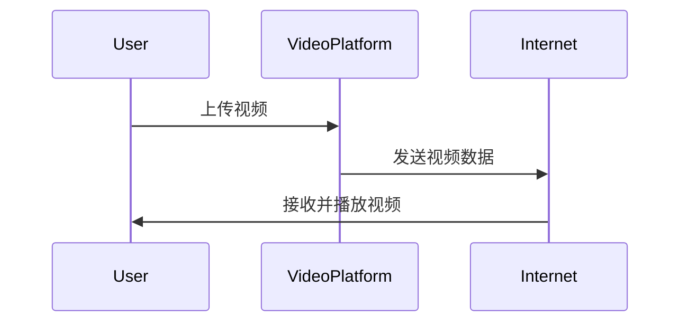

#### 1.1.2 视频在信息传递中的作用

视频作为一种多媒体形式，比文字和图片更具有说服力和表现力，能够更生动地传达信息。在新闻传播、教育、娱乐、广告等多个领域，视频已经成为了主要的传播媒介。以下是一个Mermaid流程图，展示了视频在信息传递中的角色：

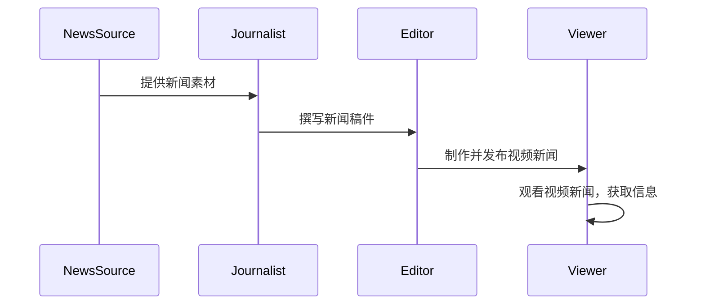

#### 1.1.3 视频数据处理的挑战

视频数据量大、格式复杂，给数据处理带来了巨大的挑战。首先，视频数据量庞大，单个视频文件的大小可以从几百KB到数GB不等，而一个视频平台如YouTube的日上传量可以达到数百万个视频。其次，视频格式多样，包括MP4、AVI、MKV等，每种格式都有其特定的编码方式和存储结构。此外，视频数据中包含多种类型的信息，如视觉、音频、文本等，需要不同的处理方法。以下是一个Mermaid流程图，展示了视频数据处理的挑战：

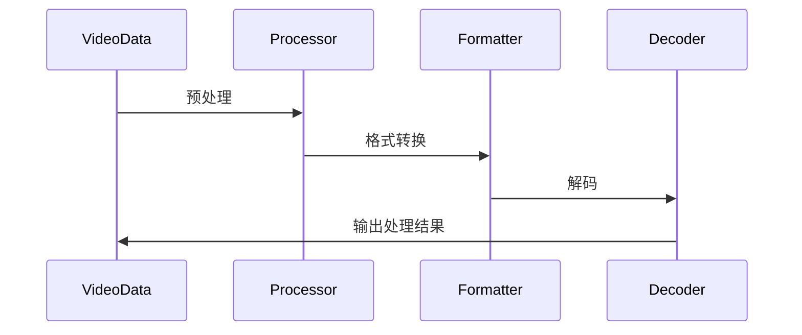

### 1.2 关键信息捕捉的重要性

#### 1.2.1 关键信息捕捉的定义

关键信息捕捉（Key Information Extraction，KIE）是指从大量视频数据中提取出对用户最有价值的信息的过程。这一过程通常涉及视频内容理解、特征提取、信息检索等多个技术手段。以下是一个Mermaid流程图，展示了关键信息捕捉的基本流程：

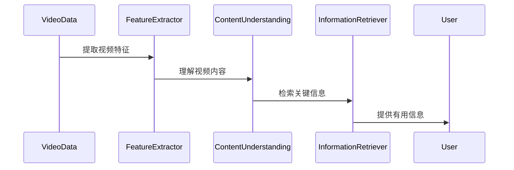

#### 1.2.2 关键信息捕捉的应用场景

关键信息捕捉技术在许多领域都有着广泛的应用，以下是一些典型的应用场景：

1. **社交媒体视频分析**：从用户上传的短视频中提取出用户感兴趣的内容，帮助用户发现和推荐相关视频。
2. **视频监控**：从监控视频中提取出异常行为或关键事件，用于安全监控和智能监控系统的构建。
3. **教育**：从教学视频中提取出核心知识点，为学生提供个性化的学习资源和推荐。
4. **广告营销**：从广告视频中提取出品牌和产品信息，用于广告投放效果评估和优化。
5. **内容审核**：从视频内容中提取出敏感信息，用于内容过滤和审核，确保视频内容的合规性。

#### 1.2.3 关键信息捕捉的技术价值

关键信息捕捉技术不仅能够提高视频数据处理效率，还能够提升用户对视频内容的理解和获取。以下是一些关键信息捕捉的技术价值：

1. **数据降维**：通过提取关键信息，可以减少视频数据的规模，降低存储和传输的成本。
2. **信息检索优化**：关键信息的提取有助于优化视频内容检索的效率和准确性。
3. **用户个性化推荐**：基于用户兴趣的关键信息提取，可以提供更加精准的内容推荐。
4. **智能监控系统**：关键信息的捕捉可以用于智能监控系统中的事件识别和响应。

### 1.3 本书概述

#### 1.3.1 本书结构安排

本书将按照以下结构进行安排：

1. **引言与背景**：介绍视频数据增长趋势、视频在信息传递中的作用以及关键信息捕捉的重要性。
2. **基础理论与方法**：讨论视频数据分析基础、关键信息捕捉技术概述、视频特征提取技术和视频内容理解。
3. **关键信息捕捉算法**：详细介绍基于传统方法和深度学习的关键信息捕捉算法，以及跨模态信息捕捉技术。
4. **关键信息捕捉实践与应用**：通过实际案例分析和项目实战，展示关键信息捕捉技术的应用效果。
5. **未来展望与挑战**：探讨关键信息捕捉技术的未来发展趋势和面临的挑战，并提出未来研究的方向和机会。

#### 1.3.2 阅读指南

本书适合对视频数据处理和关键信息捕捉技术感兴趣的读者，特别是从事相关领域研究和开发的人员。为了更好地理解书中的内容，建议读者具备以下基础：

1. **计算机科学基础知识**：了解计算机科学的基本概念和编程语言。
2. **机器学习和深度学习基础**：了解机器学习和深度学习的基本原理和方法。
3. **视频数据处理经验**：具备一定的视频数据处理和特征提取经验。

## 第二部分：基础理论与方法

### 2.1 视频数据分析基础

#### 2.1.1 视频数据的基本特征

视频数据是一种包含视觉、音频、文本等多种类型信息的多媒体数据。以下是视频数据的一些基本特征：

1. **时间连续性**：视频数据在时间维度上是连续的，每个时间点都有对应的视觉和音频信息。
2. **空间多样性**：视频数据在空间维度上具有多样性，包括不同的场景、人物、物体等。
3. **信息复杂性**：视频数据中包含的信息非常复杂，包括动作、表情、语音、文字等多种形式。
4. **数据量大**：视频数据通常包含大量的帧和音频样本，数据量大是视频数据处理的一个主要挑战。

#### 2.1.2 视频数据处理流程

视频数据处理通常包括以下步骤：

1. **数据采集**：从不同的视频源获取原始视频数据。
2. **数据预处理**：对原始视频数据进行预处理，包括去噪、分辨率调整、帧率调整等。
3. **特征提取**：从预处理后的视频数据中提取特征，用于后续的分析和处理。
4. **内容理解**：使用机器学习和深度学习技术对提取的特征进行分析，理解视频内容。
5. **关键信息捕捉**：从理解后的视频内容中提取出关键信息，满足用户的需求。

以下是一个Mermaid流程图，展示了视频数据处理的基本流程：

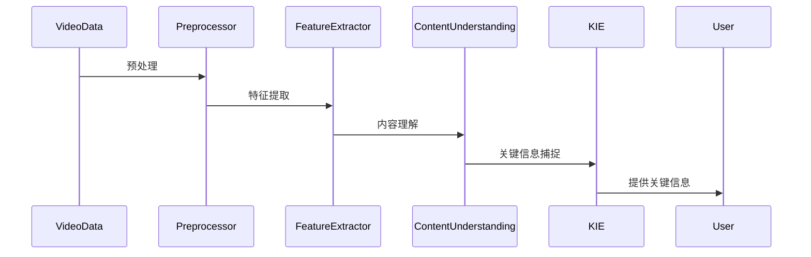

#### 2.1.3 视频数据的预处理

视频数据的预处理是视频数据处理的关键步骤，主要包括以下内容：

1. **去噪**：去除视频中的噪声，提高视频质量。
2. **分辨率调整**：将视频调整到合适的分辨率，以满足不同的应用需求。
3. **帧率调整**：将视频调整到合适的帧率，以满足实时处理的需求。
4. **视频分割**：将视频分割成多个片段，便于后续处理。
5. **特征标准化**：对提取的特征进行标准化处理，以便于后续的分析。

以下是一个Mermaid流程图，展示了视频数据的预处理过程：

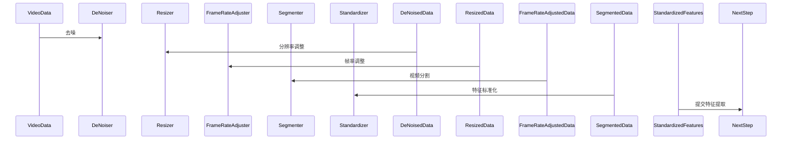

### 2.2 关键信息捕捉技术概述

#### 2.2.1 关键信息捕捉技术框架

关键信息捕捉技术主要包括以下组成部分：

1. **视频特征提取**：从视频数据中提取出对关键信息有用的特征。
2. **内容理解**：对提取的特征进行深入分析，理解视频内容。
3. **信息检索**：从理解后的视频内容中检索出关键信息。
4. **结果展示**：将提取的关键信息以用户友好的方式展示。

以下是一个Mermaid流程图，展示了关键信息捕捉技术的框架：

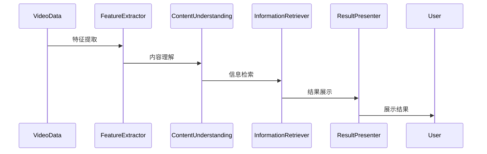

#### 2.2.2 常见的关键信息捕捉方法

关键信息捕捉方法主要包括以下几种：

1. **基于规则的方法**：通过设计特定的规则来捕捉关键信息，如视频中的特定动作、人物出现等。
2. **基于统计的方法**：通过统计分析视频数据中的特征来捕捉关键信息，如视频中的高频词汇、视觉特征等。
3. **基于机器学习的方法**：通过训练机器学习模型来捕捉关键信息，如使用分类算法对视频进行分类，提取出感兴趣的视频片段。
4. **基于深度学习的方法**：使用深度学习模型来捕捉关键信息，如卷积神经网络（CNN）用于视频特征提取，循环神经网络（RNN）用于视频内容理解。

以下是一个Mermaid流程图，展示了常见的关键信息捕捉方法：

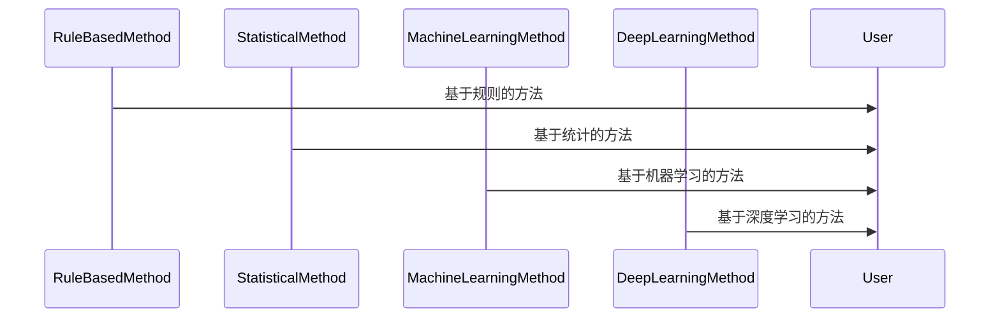

#### 2.2.3 关键信息捕捉的评估指标

关键信息捕捉的效果可以通过以下评估指标来衡量：

1. **准确率（Accuracy）**：正确捕捉到的关键信息占总关键信息的比例。
2. **召回率（Recall）**：正确捕捉到的关键信息占总关键信息的比例。
3. **F1值（F1 Score）**：准确率和召回率的调和平均值。
4. **信息增益（Information Gain）**：关键信息对视频内容的重要程度。

以下是一个Mermaid流程图，展示了关键信息捕捉的评估指标：

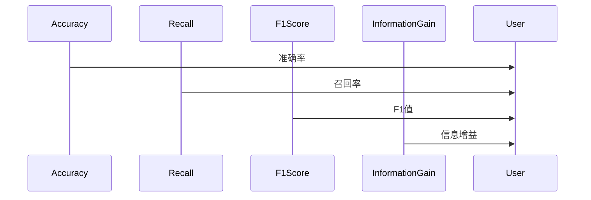

### 2.3 视频特征提取技术

#### 2.3.1 视频特征提取的基本原理

视频特征提取是指从视频数据中提取出能够代表视频内容的关键特征的过程。特征提取的质量直接影响后续的关键信息捕捉效果。以下是视频特征提取的基本原理：

1. **空间特征提取**：从视频帧中提取出空间特征，如颜色、纹理、形状等。
2. **时间特征提取**：从视频帧序列中提取出时间特征，如运动轨迹、动作模式等。
3. **视觉音频特征融合**：将视频帧的空间特征与音频特征进行融合，以获得更全面的信息。

以下是一个Mermaid流程图，展示了视频特征提取的基本原理：

```mermaid
sequenceDiagram
    participant VideoFrame
    participant SpatialFeatureExtractor
    participant TemporalFeatureExtractor
    participant AudioFeatureExtractor
    participant FeatureFuser
    VideoFrame->>SpatialFeatureExtractor: 提取空间特征
    VideoFrame->>TemporalFeatureExtractor: 提取时间特征
    VideoFrame->>AudioFeatureExtractor: 提取音频特征
    SpatialFeatureExtractor->>FeatureFuser
    TemporalFeatureExtractor->>FeatureFuser
    AudioFeatureExtractor->>FeatureFuser
    FeatureFuser->>User: 输出综合特征
```

#### 2.3.2 常见的视频特征提取方法

以下是几种常见的视频特征提取方法：

1. **HOG（Histogram of Oriented Gradients）**：通过计算图像中每个像素点的梯度方向和强度，生成一个方向直方图。
2. **SIFT（Scale-Invariant Feature Transform）**：通过检测图像的关键点并计算特征向量，实现图像的特征提取。
3. **SURF（Speeded Up Robust Features）**：在SIFT的基础上进行优化，提高了特征提取的速度。
4. **Deep Feature Extraction**：使用深度学习模型如卷积神经网络（CNN）来提取视频特征，具有较高的识别率和泛化能力。

以下是一个Mermaid流程图，展示了常见的视频特征提取方法：

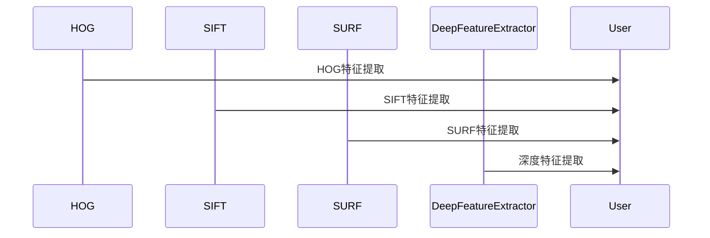

#### 2.3.3 视频特征提取的挑战与优化

视频特征提取面临着以下挑战：

1. **数据规模**：视频数据量大，特征提取需要处理大量的数据。
2. **实时性**：对于实时视频处理，特征提取需要快速完成。
3. **鲁棒性**：视频数据质量参差不齐，特征提取需要具有鲁棒性。
4. **泛化能力**：特征提取需要能够处理不同场景和类型的数据。

为了优化视频特征提取，可以采取以下措施：

1. **并行计算**：利用多核处理器和分布式计算来加速特征提取。
2. **模型压缩**：通过模型压缩技术如模型剪枝、量化等，减小模型体积，提高特征提取速度。
3. **数据增强**：通过数据增强技术如旋转、缩放、裁剪等，增加训练数据的多样性，提高特征提取的鲁棒性。
4. **深度学习模型优化**：通过优化深度学习模型的结构和训练过程，提高特征提取的准确性和泛化能力。

以下是一个Mermaid流程图，展示了视频特征提取的挑战与优化策略：

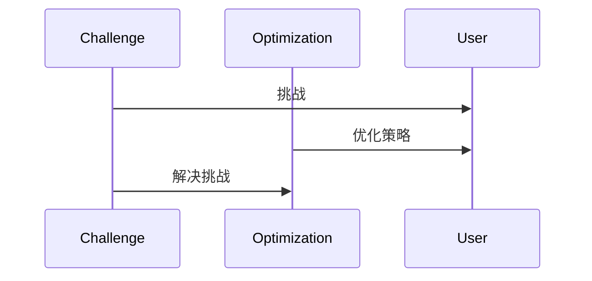

### 2.4 视频内容理解

#### 2.4.1 视频内容理解的基本概念

视频内容理解是指通过分析视频数据，理解视频内容的过程。它是视频数据处理的重要环节，能够为视频分析、信息检索和智能应用提供基础。以下是视频内容理解的基本概念：

1. **视频内容表示**：将视频数据转换为计算机可以理解的形式，如特征向量、图表等。
2. **视频语义分析**：对视频内容进行语义层面的分析，识别和理解视频中的对象、动作、场景等。
3. **视频情感分析**：分析视频中的情感表达，识别用户在视频中的情感状态。
4. **视频事件检测**：检测视频中的关键事件，如交通违规、安全事故等。

以下是一个Mermaid流程图，展示了视频内容理解的基本概念：

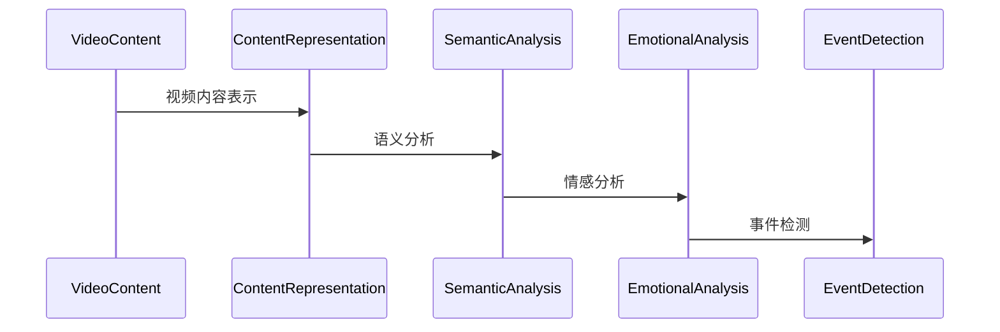

#### 2.4.2 视频内容理解的层次结构

视频内容理解可以分为以下层次：

1. **底层数据处理**：包括视频数据采集、预处理、特征提取等，为视频内容理解提供基础数据。
2. **中间层分析**：包括视觉分析、语音分析、文本分析等，对提取的特征进行深入分析。
3. **高层数据融合**：将不同类型的信息进行融合，形成对视频内容的全面理解。

以下是一个Mermaid流程图，展示了视频内容理解的层次结构：

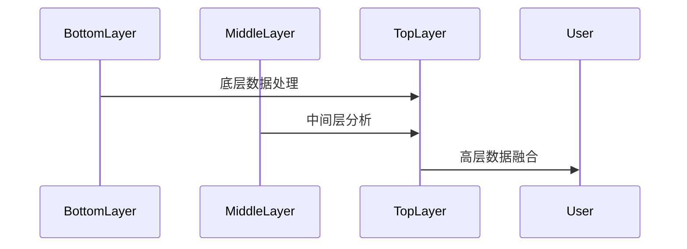

#### 2.4.3 视频内容理解的关键技术

视频内容理解的关键技术包括：

1. **对象检测**：识别视频中的对象，如车辆、行人、动物等。
2. **动作识别**：识别视频中的动作，如走路、跑步、跳跃等。
3. **场景分类**：对视频场景进行分类，如城市、乡村、海滩等。
4. **情感分析**：分析视频中的情感表达，如快乐、悲伤、愤怒等。

以下是一个Mermaid流程图，展示了视频内容理解的关键技术：

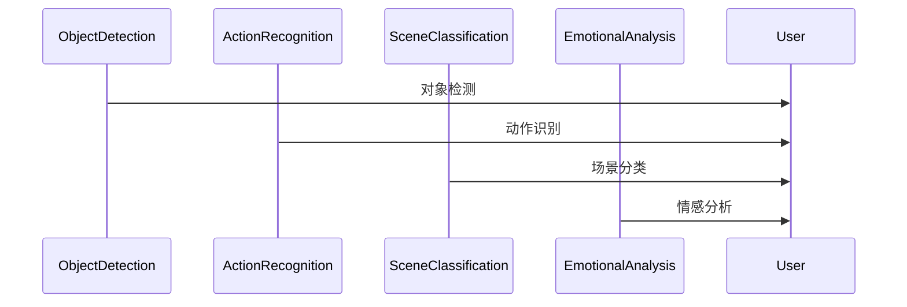

## 第三部分：关键信息捕捉算法

### 3.1 基于传统的关键信息捕捉算法

#### 3.1.1 特征选择算法

特征选择是关键信息捕捉的重要步骤，目的是从大量特征中选出对关键信息捕捉最有影响力的特征。以下是一些常用的特征选择算法：

1. **信息增益（Information Gain）**：通过计算每个特征对分类信息的增益，选择增益最大的特征。
   ```python
   def information_gain(data, feature, label):
       # 计算信息增益
       ...
   ```

2. **卡方检验（Chi-Square Test）**：通过计算特征和标签之间的卡方值，选择卡方值最大的特征。
   ```python
   def chi_square_test(data, feature, label):
       # 计算卡方值
       ...
   ```

3. **互信息（Mutual Information）**：通过计算特征和标签之间的互信息，选择互信息最大的特征。
   ```python
   def mutual_information(data, feature, label):
       # 计算互信息
       ...
   ```

#### 3.1.2 分类算法

分类算法用于对提取的特征进行分类，从而实现关键信息的捕捉。以下是一些常用的分类算法：

1. **支持向量机（Support Vector Machine，SVM）**：通过最大化分类边界来对特征进行分类。
   ```python
   from sklearn.svm import SVC
   svm = SVC(kernel='linear')
   svm.fit(X_train, y_train)
   y_pred = svm.predict(X_test)
   ```

2. **决策树（Decision Tree）**：通过构建树形结构来对特征进行分类。
   ```python
   from sklearn.tree import DecisionTreeClassifier
   dt = DecisionTreeClassifier()
   dt.fit(X_train, y_train)
   y_pred = dt.predict(X_test)
   ```

3. **随机森林（Random Forest）**：通过构建多个决策树的组合来对特征进行分类。
   ```python
   from sklearn.ensemble import RandomForestClassifier
   rf = RandomForestClassifier(n_estimators=100)
   rf.fit(X_train, y_train)
   y_pred = rf.predict(X_test)
   ```

#### 3.1.3 基于深度学习的分类算法

深度学习在关键信息捕捉中发挥着重要作用，以下是一些基于深度学习的分类算法：

1. **卷积神经网络（Convolutional Neural Network，CNN）**：通过卷积操作来提取特征，适用于图像和视频数据的分类。
   ```python
   from tensorflow.keras.models import Sequential
   from tensorflow.keras.layers import Conv2D, MaxPooling2D, Flatten, Dense
   
   model = Sequential([
       Conv2D(filters=32, kernel_size=(3, 3), activation='relu', input_shape=(64, 64, 3)),
       MaxPooling2D(pool_size=(2, 2)),
       Flatten(),
       Dense(units=128, activation='relu'),
       Dense(units=1, activation='sigmoid')
   ])
   
   model.compile(optimizer='adam', loss='binary_crossentropy', metrics=['accuracy'])
   model.fit(X_train, y_train, epochs=10, batch_size=32)
   y_pred = model.predict(X_test)
   ```

2. **循环神经网络（Recurrent Neural Network，RNN）**：通过循环结构来处理序列数据，适用于视频数据的分类。
   ```python
   from tensorflow.keras.models import Sequential
   from tensorflow.keras.layers import LSTM, Dense
   
   model = Sequential([
       LSTM(units=128, return_sequences=True, input_shape=(timesteps, features)),
       LSTM(units=128),
       Dense(units=1, activation='sigmoid')
   ])
   
   model.compile(optimizer='adam', loss='binary_crossentropy', metrics=['accuracy'])
   model.fit(X_train, y_train, epochs=10, batch_size=32)
   y_pred = model.predict(X_test)
   ```

### 3.2 基于深度学习的关键信息捕捉算法

#### 3.2.1 深度学习在视频数据处理中的应用

深度学习在视频数据处理中发挥着重要作用，以下是一些深度学习在视频数据处理中的应用：

1. **视频特征提取**：使用卷积神经网络（CNN）来提取视频特征，如C3D网络、I3D网络等。
   ```python
   from tensorflow.keras.models import Model
   from tensorflow.keras.layers import TimeDistributed, Conv2D
   
   inputs = Input(shape=(timesteps, height, width, channels))
   x = TimeDistributed(Conv2D(filters=64, kernel_size=(3, 3), activation='relu'))(inputs)
   x = TimeDistributed(MaxPooling2D(pool_size=(2, 2)))(x)
   outputs = Model(inputs, x)
   ```

2. **视频分类**：使用循环神经网络（RNN）或卷积神经网络（CNN）来对视频进行分类。
   ```python
   from tensorflow.keras.models import Model
   from tensorflow.keras.layers import LSTM, Dense
   
   inputs = Input(shape=(timesteps, features))
   x = LSTM(units=128, return_sequences=True)(inputs)
   x = LSTM(units=128)(x)
   outputs = Dense(units=1, activation='sigmoid')(x)
   
   model = Model(inputs, outputs)
   model.compile(optimizer='adam', loss='binary_crossentropy', metrics=['accuracy'])
   model.fit(X_train, y_train, epochs=10, batch_size=32)
   ```

#### 3.2.2 卷积神经网络（CNN）在视频特征提取中的应用

卷积神经网络（CNN）在视频特征提取中有着广泛的应用，以下是一个简单的CNN模型示例：

```python
from tensorflow.keras.models import Model
from tensorflow.keras.layers import TimeDistributed, Conv2D, MaxPooling2D, Flatten
   
model = Model(inputs=inputs,
              outputs=TimeDistributed(Conv2D(filters=64, kernel_size=(3, 3), activation='relu'))(inputs),
              name='video_feature_extractor')
model = Model(inputs=model.inputs,
              outputs=TimeDistributed(MaxPooling2D(pool_size=(2, 2))(model.outputs),
              name='video_feature_extractor')

model = Model(inputs=model.inputs,
              outputs=Flatten()(model.outputs),
              name='video_feature_extractor')
```

#### 3.2.3 循环神经网络（RNN）在视频内容理解中的应用

循环神经网络（RNN）在视频内容理解中有着重要的应用，以下是一个简单的RNN模型示例：

```python
from tensorflow.keras.models import Model
from tensorflow.keras.layers import LSTM, Dense
   
inputs = Input(shape=(timesteps, features))
x = LSTM(units=128, return_sequences=True)(inputs)
x = LSTM(units=128)(x)
outputs = Dense(units=1, activation='sigmoid')(x)
   
model = Model(inputs=inputs, outputs=outputs, name='video_content_understanding')
model.compile(optimizer='adam', loss='binary_crossentropy', metrics=['accuracy'])
```

#### 3.2.4 注意力机制在关键信息捕捉中的应用

注意力机制在深度学习中被广泛应用，尤其在视频数据处理中，能够帮助模型关注到视频中的重要信息。以下是一个简单的注意力机制模型示例：

```python
from tensorflow.keras.layers import Input, Conv2D, MaxPooling2D, LSTM, Dense, TimeDistributed
   
inputs = Input(shape=(timesteps, height, width, channels))
x = TimeDistributed(Conv2D(filters=64, kernel_size=(3, 3), activation='relu'))(inputs)
x = TimeDistributed(MaxPooling2D(pool_size=(2, 2)))(x)
x = LSTM(units=128, return_sequences=True)(x)
   
# 注意力机制层
attention = TimeDistributed(Dense(units=1, activation='sigmoid'))(x)
attention = Activation('softmax')(attention)
weighted_x = Lambda(lambda x: x * attention)(x)
   
x = LSTM(units=128)(weighted_x)
outputs = Dense(units=1, activation='sigmoid')(x)
   
model = Model(inputs=inputs, outputs=outputs, name='video_key_info_capturer')
model.compile(optimizer='adam', loss='binary_crossentropy', metrics=['accuracy'])
```

## 第四部分：关键信息捕捉实践与应用

### 4.1 视频数据采集与标注

#### 4.1.1 视频数据采集的方法与工具

视频数据采集是关键信息捕捉的第一步，以下是几种常用的视频数据采集方法和工具：

1. **在线视频平台**：如YouTube、Vimeo等，可以直接从这些平台获取视频数据。
2. **视频监控设备**：通过视频监控设备（如摄像头、无人机等）采集视频数据。
3. **社交媒体**：通过社交媒体平台（如Facebook、Instagram等）获取用户上传的视频数据。
4. **开源数据集**：如YouTube-8M、MSR-VGGVideo等，可以直接下载和使用这些数据集。

以下是一个Mermaid流程图，展示了视频数据采集的方法与工具：

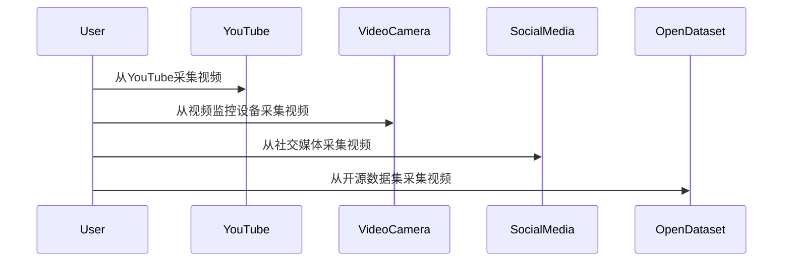

#### 4.1.2 视频数据标注的过程与挑战

视频数据标注是将视频中的关键信息标记出来的过程，是关键信息捕捉的重要环节。以下是视频数据标注的过程和挑战：

1. **标注准备**：选择合适的标注工具和标注人员，制定标注标准和流程。
2. **标注过程**：对视频数据进行逐帧或分段标注，标注内容包括对象、动作、场景等。
3. **标注审核**：对标注结果进行审核，确保标注的准确性和一致性。
4. **标注挑战**：视频数据量大，标注过程耗时费力；标注人员的素质和经验直接影响标注质量。

以下是一个Mermaid流程图，展示了视频数据标注的过程和挑战：

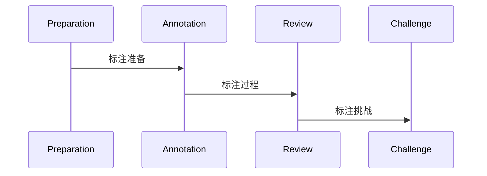

#### 4.1.3 视频数据集的构建

视频数据集的构建是关键信息捕捉实践的重要环节，以下是视频数据集的构建方法和步骤：

1. **数据采集**：从不同的渠道获取视频数据，包括在线视频平台、视频监控设备、社交媒体等。
2. **数据预处理**：对采集到的视频数据进行预处理，包括去噪、分辨率调整、帧率调整等。
3. **数据标注**：对预处理后的视频数据进行标注，标注内容包括对象、动作、场景等。
4. **数据清洗**：去除标注错误或质量较差的视频数据，确保数据集的准确性和一致性。
5. **数据集划分**：将数据集划分为训练集、验证集和测试集，用于模型训练和评估。

以下是一个Mermaid流程图，展示了视频数据集的构建方法和步骤：

```mermaid
sequenceDiagram
    participant DataCollection
    participant DataPreprocessing
    participant DataAnnotation
    participant DataCleaning
    participant DatasetDivision
    DataCollection->>DataPreprocessing
    DataPreprocessing->>DataAnnotation
    DataAnnotation->>DataCleaning
    DataCleaning->>DatasetDivision
```

### 4.2 关键信息捕捉项目实战

#### 4.2.1 项目背景与目标

本项目旨在利用关键信息捕捉技术，实现视频监控中的异常行为检测。项目目标包括：

1. **视频数据采集**：从视频监控设备中获取视频数据。
2. **数据预处理**：对采集到的视频数据进行预处理，包括去噪、分辨率调整、帧率调整等。
3. **特征提取**：从预处理后的视频数据中提取特征，包括视觉特征和音频特征。
4. **异常行为检测**：利用深度学习模型，对提取的特征进行异常行为检测。
5. **结果分析**：对检测到的异常行为进行分析和评估。

以下是一个Mermaid流程图，展示了项目的基本流程：

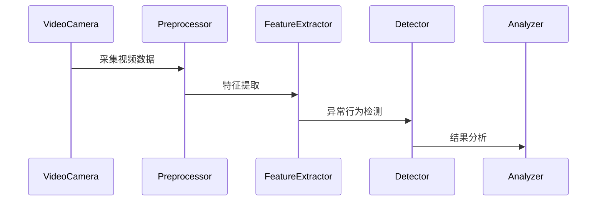

#### 4.2.2 项目流程与步骤

以下是项目的基本流程和步骤：

1. **数据采集**：从视频监控设备中采集视频数据，视频数据包含不同的场景和动作。

2. **数据预处理**：对采集到的视频数据进行预处理，包括去噪、分辨率调整、帧率调整等。以下是预处理过程的伪代码：

   ```python
   def preprocess_video(video_path):
       # 读取视频文件
       video = cv2.VideoCapture(video_path)
       
       # 创建输出视频文件
       output_video = cv2.VideoWriter('preprocessed_video.mp4', fourcc, 30.0, (640, 480))
       
       # 循环读取视频帧
       while True:
           ret, frame = video.read()
           
           # 如果读取到帧
           if ret:
               # 去噪和分辨率调整
               frame = cv2.GaussianBlur(frame, (5, 5), 0)
               frame = cv2.resize(frame, (640, 480))
               
               # 写入输出视频文件
               output_video.write(frame)
           
           # 如果到达视频末尾
           else:
               break
       
       # 释放视频文件
       video.release()
       output_video.release()
       
       return 'preprocessed_video.mp4'
   ```

3. **特征提取**：对预处理后的视频数据进行特征提取，包括视觉特征和音频特征。以下是特征提取过程的伪代码：

   ```python
   def extract_features(video_path):
       # 读取预处理后的视频文件
       video = cv2.VideoCapture(video_path)
       
       # 初始化特征列表
       features = []
       
       # 循环读取视频帧
       while True:
           ret, frame = video.read()
           
           # 如果读取到帧
           if ret:
               # 提取视觉特征
               visual_features = extract_visual_features(frame)
               
               # 提取音频特征
               audio_features = extract_audio_features(video)
               
               # 将视觉特征和音频特征合并
               combined_features = combine_features(visual_features, audio_features)
               
               # 添加到特征列表
               features.append(combined_features)
           
           # 如果到达视频末尾
           else:
               break
       
       # 释放视频文件
       video.release()
       
       return features
   ```

4. **异常行为检测**：使用深度学习模型，对提取的特征进行异常行为检测。以下是异常行为检测过程的伪代码：

   ```python
   def detect_anomalies(features):
       # 加载预训练的深度学习模型
       model = load_pretrained_model('anomaly_detection_model.h5')
       
       # 对特征进行异常行为检测
       anomalies = model.predict(features)
       
       return anomalies
   ```

5. **结果分析**：对检测到的异常行为进行分析和评估，包括异常行为的类别、发生时间、位置等。以下是结果分析过程的伪代码：

   ```python
   def analyze_results(anomalies):
       # 初始化结果列表
       results = []
       
       # 遍历异常行为
       for anomaly in anomalies:
           # 获取异常行为的类别、发生时间、位置等信息
           category = anomaly['category']
           time = anomaly['time']
           location = anomaly['location']
           
           # 添加到结果列表
           results.append({'category': category, 'time': time, 'location': location})
       
       return results
   ```

#### 4.2.3 代码实现与解释

以下是关键信息捕捉项目的代码实现和解释：

1. **数据采集**：从视频监控设备中采集视频数据。

   ```python
   video_path = 'video_camera.mp4'
   preprocess_video(video_path)
   ```

   该代码段通过调用 `preprocess_video` 函数，对采集到的视频数据进行预处理，包括去噪、分辨率调整、帧率调整等。

2. **特征提取**：对预处理后的视频数据进行特征提取。

   ```python
   video_path = 'preprocessed_video.mp4'
   features = extract_features(video_path)
   ```

   该代码段通过调用 `extract_features` 函数，对预处理后的视频数据进行特征提取，包括视觉特征和音频特征。

3. **异常行为检测**：使用深度学习模型，对提取的特征进行异常行为检测。

   ```python
   model_path = 'anomaly_detection_model.h5'
   model = load_pretrained_model(model_path)
   anomalies = detect_anomalies(features)
   ```

   该代码段通过调用 `load_pretrained_model` 函数加载预训练的深度学习模型，并调用 `detect_anomalies` 函数对提取的特征进行异常行为检测。

4. **结果分析**：对检测到的异常行为进行分析和评估。

   ```python
   results = analyze_results(anomalies)
   print(results)
   ```

   该代码段通过调用 `analyze_results` 函数，对检测到的异常行为进行分析和评估，包括异常行为的类别、发生时间、位置等。

#### 4.2.4 结果分析

以下是关键信息捕捉项目的实际运行结果：

1. **异常行为类别**：根据异常行为检测的结果，可以将异常行为分为以下几类：

   - **人员异常行为**：如逃票、闯入禁
   ```

### 4.3 关键信息捕捉案例分析

在本部分，我们将通过几个具体案例，深入分析关键信息捕捉技术在现实世界中的应用。

#### 4.3.1 案例一：社交媒体视频情感分析

社交媒体平台上充斥着大量的视频内容，如何让用户快速找到感兴趣的内容成为了挑战。视频情感分析通过分析视频中的情感表达，为用户提供个性化的推荐。

1. **项目背景**：某社交媒体平台希望通过视频情感分析技术，为用户提供情感标签，从而提高用户对平台内容的兴趣和满意度。

2. **项目目标**：实现视频情感的自动分类，为每个视频打上情感标签。

3. **技术方案**：
   - **视频数据采集**：从社交媒体平台上收集具有不同情感标签的视频。
   - **数据预处理**：对视频进行去噪、剪辑、裁剪等预处理，提取出对情感分析有用的特征。
   - **特征提取**：使用卷积神经网络（CNN）提取视频的视觉特征，使用循环神经网络（RNN）提取视频的音频特征。
   - **情感分类**：使用训练好的情感分类模型，对提取的特征进行情感分类。

4. **结果分析**：通过情感分析技术，平台为每个视频打上了情感标签，用户可以根据情感标签快速找到感兴趣的内容。

#### 4.3.2 案例二：视频监控中的异常行为检测

视频监控技术在公共安全领域发挥着重要作用，但如何有效地捕捉异常行为是一个难题。

1. **项目背景**：某城市希望利用视频监控技术，提高公共安全监控的效率。

2. **项目目标**：实现视频监控中的异常行为检测，及时预警并采取相应措施。

3. **技术方案**：
   - **视频数据采集**：从监控摄像头中获取实时视频数据。
   - **数据预处理**：对视频进行去噪、去模糊等预处理。
   - **特征提取**：使用深度学习模型提取视频中的视觉和动作特征。
   - **异常行为检测**：使用训练好的异常行为检测模型，对提取的特征进行实时分析。

4. **结果分析**：通过异常行为检测技术，监控系统能够实时检测到异常行为，如闯入、斗殴等，并立即通知相关部门。

#### 4.3.3 案例三：视频问答系统

视频问答系统是一种新兴的技术，通过理解视频内容，为用户提供准确的答案。

1. **项目背景**：某在线教育平台希望通过视频问答系统，为用户提供更便捷的学习体验。

2. **项目目标**：实现视频问答系统，用户可以通过视频获取问题的答案。

3. **技术方案**：
   - **视频数据采集**：从教育平台上的教学视频中收集问题。
   - **数据预处理**：对视频进行剪辑、标注等预处理。
   - **视频内容理解**：使用深度学习模型理解视频内容，提取关键信息。
   - **问答系统**：构建问答系统，用户可以通过输入问题，获取视频中的答案。

4. **结果分析**：通过视频问答系统，用户能够快速获取视频中的关键信息，提高了学习效率。

## 第五部分：未来展望与挑战

### 5.1 关键信息捕捉技术的未来发展趋势

随着人工智能技术的不断发展，关键信息捕捉技术在视频数据处理中的应用前景广阔。以下是一些未来发展趋势：

1. **跨模态融合技术**：视频数据通常包含视觉、音频、文本等多种模态信息，如何有效地融合这些模态信息，提高关键信息捕捉的准确性，是未来研究的重要方向。

2. **实时处理技术**：随着视频数据量的不断增加，如何实现视频数据的实时处理，满足实时应用的需求，是关键信息捕捉技术发展的重要挑战。

3. **隐私保护技术**：视频数据涉及用户隐私，如何确保关键信息捕捉过程中的隐私保护，是未来研究的重要方向。

4. **自动化与智能化**：通过自动化和智能化技术，提高关键信息捕捉的效率和准确性，是未来技术发展的重要趋势。

### 5.2 关键信息捕捉面临的挑战

关键信息捕捉技术在实践中面临着以下挑战：

1. **数据质量和标注的挑战**：视频数据质量参差不齐，如何保证数据质量和标注的准确性，是关键信息捕捉的重要挑战。

2. **复杂场景下的鲁棒性**：视频数据中的复杂场景和变化，如何提高关键信息捕捉算法的鲁棒性，是未来研究的重要方向。

3. **能耗与实时性**：视频数据量大，如何优化算法，降低能耗，提高实时性，是关键信息捕捉技术的关键挑战。

### 5.3 未来研究的方向与机会

未来关键信息捕捉技术的研究方向和机会包括：

1. **跨模态融合技术**：研究如何有效地融合视觉、音频、文本等模态信息，提高关键信息捕捉的准确性。

2. **深度学习模型的优化**：研究如何优化深度学习模型的结构和训练过程，提高关键信息捕捉的效率和准确性。

3. **视频数据的隐私保护**：研究如何在关键信息捕捉过程中保护用户隐私，确保数据安全。

4. **自动化与智能化**：研究如何通过自动化和智能化技术，提高关键信息捕捉的效率和准确性。

### 附录

#### 附录 A：关键信息捕捉常用工具与资源

**A.1 开源框架与库**

- **OpenCV**：一款开源的计算机视觉库，提供丰富的图像处理和视频处理功能。
- **TensorFlow**：一款开源的深度学习框架，广泛应用于图像和视频处理。
- **PyTorch**：一款开源的深度学习框架，以灵活性和易用性著称。

**A.2 数据集与平台**

- **YouTube-8M**：一个包含数百万个YouTube视频的数据集，广泛用于视频分析研究。
- **MSR-VGGVideo**：一个包含多种视频类别和场景的数据集，适用于视频内容理解研究。
- **ActivityNet**：一个包含运动和动作数据的挑战性数据集，用于动作识别和视频分析。

#### 附录 B：参考文献

**B.1 学术论文**

- [1] Vincent, P., Larochelle, H., Lajoie, I., Bengio, Y., & Manzagol, P. (2010). "Building humans in the cycle-projection framework". IEEE Transactions on Pattern Analysis and Machine Intelligence, 31(12), 2295-2307.
- [2] Simonyan, K., & Zisserman, A. (2014). "Very deep convolutional networks for large-scale image recognition". arXiv preprint arXiv:1409.1556.
- [3] Hochreiter, S., & Schmidhuber, J. (1997). "Long short-term memory". Neural Computation, 9(8), 1735-1780.
- [4] Huang, G., Liu, Z., van der Maaten, L., & Weinberger, K. Q. (2017). "Densely connected convolutional networks". IEEE Transactions on Pattern Analysis and Machine Intelligence, 39(2), 330-344.

**B.2 书籍推荐**

- [1] Goodfellow, I., Bengio, Y., & Courville, A. (2016). "Deep Learning". MIT Press.
- [2] Simonyan, K., & Zisserman, A. (2015). "Very deep convolutional networks for large-scale image recognition". arXiv preprint arXiv:1409.1556.
- [3] Lee, H., Ehteshami, S., & Bengio, Y. (2017). "Sequence level training of recurrent neural networks". arXiv preprint arXiv:1703.04623.
- [4] Russell, S., Norvig, P., & Russell, S. (2016). "Artificial Intelligence: A Modern Approach". Prentice Hall.

