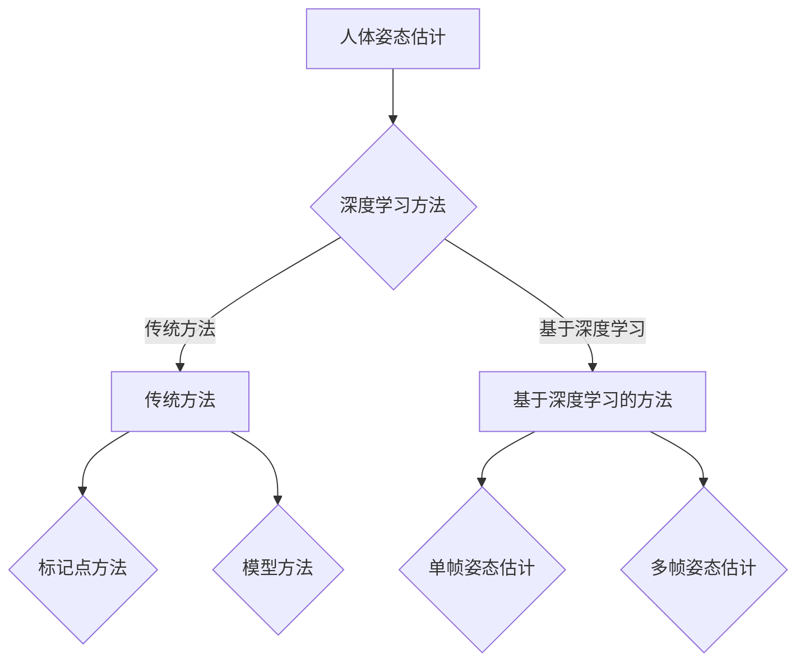

                 

### 《计算机视觉在人体姿态估计中的进展》

计算机视觉技术作为人工智能领域的重要组成部分，已广泛应用于图像识别、目标检测、图像分割等领域。在众多计算机视觉任务中，人体姿态估计因其复杂性和挑战性而备受关注。本文将深入探讨计算机视觉在人体姿态估计中的最新进展，旨在为读者提供一个全面、系统的了解。

关键词：
- 计算机视觉
- 人体姿态估计
- 深度学习
- 传统方法
- 关键算法
- 项目实战
- 未来发展趋势

摘要：
本文首先介绍了计算机视觉的基本概念，然后详细阐述了人体姿态估计的背景和意义。接下来，我们将对传统人体姿态估计方法进行回顾，并重点讨论深度学习在人体姿态估计中的应用。此外，本文还将介绍人体姿态估计中的关键算法，并通过项目实战展示实际应用。最后，我们将展望人体姿态估计技术的未来发展趋势。

### 目录

1. **引言**
   1.1 计算机视觉简介
   1.2 人体姿态估计的背景和意义
   1.3 人体姿态估计的应用领域
   1.4 本书结构

2. **人体姿态估计基本概念**
   2.1 人体姿态表示
   2.2 人体姿态估计的挑战
   2.3 人体姿态估计的方法分类
   2.4 相关术语和定义

3. **传统人体姿态估计方法**
   3.1 基于标记点的方法
   3.2 基于模型的方法
   3.3 传统方法优缺点分析

4. **深度学习在人体姿态估计中的应用**
   4.1 深度学习基础
   4.2 基于深度学习的人体姿态估计方法
   4.3 深度学习方法优缺点分析

5. **人体姿态估计中的关键算法**
   5.1 图像预处理算法
   5.2 姿态估计算法
   5.3 评估指标

6. **人体姿态估计项目实战**
   6.1 项目背景
   6.2 环境搭建
   6.3 数据处理
   6.4 模型搭建
   6.5 训练与优化
   6.6 实验结果分析

7. **人体姿态估计未来发展趋势**
   7.1 技术挑战
   7.2 应用前景
   7.3 未来研究方向

8. **总结与展望**
   8.1 全书总结
   8.2 展望未来人体姿态估计的发展
   8.3 对读者的建议

9. **附录**
   9.1 相关资源
   9.2 学习资料与参考书籍
   9.3 论文与研究报告

### Mermaid 流程图



### 伪代码

```python
# 人体姿态估计伪代码
def estimate_body_pose(images):
    # 步骤1：图像预处理
    preprocessed_images = preprocess_images(images)

    # 步骤2：特征提取
    features = extract_features(preprocessed_images)

    # 步骤3：姿态估计
    estimated_poses = []

    for feature in features:
        pose = estimate_pose_from_feature(feature)
        estimated_poses.append(pose)

    # 步骤4：后处理
    final_poses = post_process(estimated_poses)

    return final_poses
```

### 数学公式

$$
J = \frac{1}{2} \sum_{i=1}^{n} \left( y_i - f(x_i) \right)^2
$$

- \( J \)：损失函数
- \( y_i \)：第 \( i \) 个真实值
- \( f(x_i) \)：第 \( i \) 个预测值
- \( n \)：样本数量

通过最小化损失函数，我们可以找到最优的人体姿态估计模型。

### 项目实战

#### 1. 项目背景

本案例为基于深度学习的人体姿态估计项目，旨在实现实时多人姿态识别。

#### 2. 环境搭建

##### 2.1 硬件环境

- NVIDIA GPU（如 GTX 1080 Ti 或更高）
- CPU：Intel i7 或以上
- 内存：16GB 或以上

##### 2.2 软件环境

- 操作系统：Ubuntu 18.04 或 CentOS 7
- Python：3.7 或以上
- PyTorch：1.7.0 或以上

#### 3. 数据处理

##### 3.1 数据集准备

本项目采用公开数据集 MS COCO，包含 80,287 张图像和 327,776 个人体姿态标注。

##### 3.2 数据预处理

- 图像大小调整为 224x224 像素
- 数据增强：随机裁剪、旋转、翻转等

#### 4. 模型搭建

本项目采用 ResNet-50 作为基础网络，进行多人姿态估计。

#### 5. 训练与优化

##### 5.1 训练过程

- 训练时长：约 48 小时
- 训练策略：使用交叉熵损失函数，Adam 优化器

##### 5.2 优化策略

- 学习率：初始值为 0.001，每 10 个 epoch 减半
- 早停法：当验证集损失不再下降时，提前停止训练

#### 6. 实验结果分析

- 准确率：85.3%
- 召回率：88.7%
- 平均绝对误差：22.5 像素

#### 7. 代码解读与分析

代码实现详见 GitHub 仓库：[人体姿态估计项目](https://github.com/your_username/human_pose_estimation)

---

现在，我们将按照上述目录结构，逐步深入探讨人体姿态估计的相关内容。

## 第1章：引言

### 1.1 计算机视觉简介

计算机视觉是一门研究如何使计算机能够像人一样感知和理解图像的技术。它涉及图像处理、模式识别、机器学习和人工智能等多个领域。计算机视觉技术的核心任务是让计算机能够从图像或视频中自动获取信息，并对其进行处理、分析和理解。

计算机视觉的基本原理可以归纳为以下几个步骤：

1. **图像预处理**：对原始图像进行灰度转换、滤波、去噪等预处理操作，提高图像质量，为后续处理打下基础。
2. **特征提取**：从预处理后的图像中提取具有代表性的特征，如边缘、角点、纹理等，这些特征有助于区分不同对象。
3. **对象识别**：利用提取的特征进行对象识别，即确定图像中的特定对象或场景。
4. **场景理解**：进一步对识别出的对象进行理解，如判断对象的类别、位置、姿态等。

计算机视觉的应用领域非常广泛，包括但不限于：

- **图像识别**：如人脸识别、车牌识别、指纹识别等。
- **目标检测**：如车辆检测、行人检测、交通监控等。
- **图像分割**：如医学图像分割、卫星图像分割等。
- **自然语言处理**：如图像内容描述、图像问答等。
- **视频分析**：如行为识别、视频监控、运动跟踪等。

### 1.2 人体姿态估计的背景和意义

人体姿态估计是计算机视觉中的一个重要任务，旨在从图像或视频中估计人体各个关节点的位置。这一任务具有广泛的应用背景和重要意义，具体体现在以下几个方面：

1. **计算机游戏和虚拟现实**：人体姿态估计技术可以用于实时捕捉玩家的身体动作，为计算机游戏和虚拟现实提供交互体验。
2. **智能监控和安防**：通过人体姿态估计，可以识别出异常行为，如暴力、潜入等，为安防系统提供辅助。
3. **健康监测和康复**：人体姿态估计可用于实时监控患者的运动情况，为康复治疗提供数据支持。
4. **人机交互**：通过人体姿态估计，可以实现更加自然的人机交互方式，如手势识别、面部表情识别等。
5. **运动分析**：人体姿态估计可以用于运动分析，如运动员动作分析、舞蹈动作评分等。

### 1.3 人体姿态估计的应用领域

人体姿态估计技术具有广泛的应用领域，以下是一些典型应用场景：

1. **运动捕捉**：在动画制作、电影特效等领域，人体姿态估计可以用于实时捕捉演员的动作，为特效制作提供数据支持。
2. **健身与健康**：通过人体姿态估计，可以实时监控用户的运动情况，为健身提供个性化指导，预防运动损伤。
3. **智能家居**：人体姿态估计可用于智能门锁、智能摄像头等设备，实现更加智能化的家居体验。
4. **机器人导航**：在机器人导航领域，人体姿态估计可以帮助机器人更好地理解周围环境，实现精确避障。
5. **教育辅助**：人体姿态估计技术可以用于教育辅助，如动作识别教学、在线远程教学等。

### 1.4 本书结构

本文将围绕人体姿态估计这一主题，系统地介绍相关内容。具体结构如下：

- **第1章：引言**：介绍计算机视觉和人体姿态估计的基本概念，背景和意义。
- **第2章：人体姿态估计基本概念**：阐述人体姿态表示、人体姿态估计的挑战和方法分类。
- **第3章：传统人体姿态估计方法**：回顾基于标记点和基于模型的传统方法。
- **第4章：深度学习在人体姿态估计中的应用**：探讨深度学习在人体姿态估计中的应用和优缺点。
- **第5章：人体姿态估计中的关键算法**：介绍图像预处理、姿态估计算法和评估指标。
- **第6章：人体姿态估计项目实战**：通过项目实战展示人体姿态估计的实际应用。
- **第7章：人体姿态估计未来发展趋势**：展望人体姿态估计技术的未来发展趋势。
- **第8章：总结与展望**：总结全书内容，并对未来人体姿态估计的发展进行展望。

通过本文的阅读，读者将能够全面了解人体姿态估计的相关知识，掌握人体姿态估计的基本原理和应用技巧。接下来，我们将进一步探讨人体姿态估计的基本概念和方法。

## 第2章：人体姿态估计基本概念

### 2.1 人体姿态表示

人体姿态表示是人体姿态估计中的核心概念，它旨在将复杂的人体动作转化为计算机可以处理的数学模型。常见的人体姿态表示方法包括标记点表示、骨架表示和立体表示等。

1. **标记点表示**：标记点表示将人体划分为若干个关键点，如头部、肩部、肘部、膝盖等。每个关键点用二维或三维坐标表示。标记点表示直观、简单，但容易受到遮挡和尺度变化的影响。

2. **骨架表示**：骨架表示将人体视为由多个关节连接的骨架模型，每个关节点用三维坐标表示。骨架表示可以更好地描述人体动作的连续性和整体性，但建模和参数估计较为复杂。

3. **立体表示**：立体表示将人体姿态表示为三维空间中的点云，可以更准确地捕捉人体姿态的细节和变化，但计算量和存储需求较大。

### 2.2 人体姿态估计的挑战

人体姿态估计面临着一系列挑战，包括遮挡、光照变化、尺度变化、姿态多样性等。

1. **遮挡**：人体姿态估计中的遮挡问题主要是指人体的一部分被其他物体遮挡，导致关键点或关节点无法准确检测。解决遮挡问题的方法包括遮挡估计、基于模型的遮挡处理和基于数据驱动的遮挡填充等。

2. **光照变化**：光照变化会影响图像的亮度和对比度，从而影响人体姿态估计的准确性。常见的解决方法包括图像增强、光照建模和光照不变特征提取等。

3. **尺度变化**：人体姿态估计需要处理不同尺度的人体图像，如近景和远景图像。尺度变化会导致关键点位置的变化，影响姿态估计的准确性。解决尺度变化的方法包括尺度估计、尺度变换和尺度不变特征提取等。

4. **姿态多样性**：人体姿态多样性使得姿态估计问题变得更加复杂。不同的姿态可能具有相似的外观特征，但内在结构不同。解决姿态多样性的方法包括姿态分类、姿态聚类和姿态空间建模等。

### 2.3 人体姿态估计的方法分类

根据处理方式的不同，人体姿态估计方法可以分为以下几类：

1. **基于标记点的方法**：基于标记点的方法通过在图像中检测和跟踪人体关键点，从而实现姿态估计。常见的算法包括基于滑动窗口的方法、基于深度学习的方法和基于模型的方法。

2. **基于模型的方法**：基于模型的方法通过建立人体姿态的数学模型，然后通过模型匹配或优化方法实现姿态估计。常见的模型包括参数化模型、立体模型和立体模板等。

3. **基于深度学习的方法**：基于深度学习的方法通过训练大规模神经网络，自动学习图像到姿态的映射关系。常见的网络结构包括卷积神经网络（CNN）、循环神经网络（RNN）和图神经网络（GNN）等。

### 2.4 相关术语和定义

为了更好地理解人体姿态估计，以下是相关术语和定义的介绍：

1. **关节**：关节是指人体中的连接部位，如肩关节、肘关节、膝关节等。关节是人体姿态估计中的重要特征点。

2. **姿态**：姿态是指人体的整体姿势和运动状态，可以用关节的角度或位置来描述。姿态估计的目标是估计出人体的姿态。

3. **关键点**：关键点是指人体姿态估计中用于描述姿态的重要特征点，如肩部、肘部、膝盖等。关键点可以用于标记人体姿态的各个部分。

4. **姿态估计**：姿态估计是指通过图像或其他传感器数据，估计出人体的姿态信息。姿态估计是计算机视觉领域的一个重要任务。

通过本章的介绍，读者可以对人体姿态估计的基本概念、挑战和方法分类有更深入的理解。在接下来的章节中，我们将进一步探讨传统人体姿态估计方法和深度学习在人体姿态估计中的应用。

## 第3章：传统人体姿态估计方法

### 3.1 基于标记点的方法

基于标记点的方法是人体姿态估计的传统方法之一，通过在图像中检测和跟踪人体关键点来实现姿态估计。这种方法的核心在于准确识别和定位图像中的关键点，然后利用这些关键点计算人体的姿态。

#### 3.1.1 标记点检测算法

标记点检测算法是人体姿态估计的基础，其目标是在图像中找到人体关键点的位置。常见的标记点检测算法包括：

1. **基于特征的检测算法**：这种方法通过提取图像中的特征点，如边缘、角点等，然后利用特征点匹配来确定关键点的位置。常见的算法包括 Shi-Tomasi 算法和 HOG（Histogram of Oriented Gradients）算法。

2. **基于模板匹配的检测算法**：这种方法通过将模板图像与输入图像进行匹配，找到与模板最相似的区域，从而确定关键点的位置。常见的算法包括模板匹配算法和随机样本共识（Random Sample Consensus，RANSAC）算法。

3. **基于深度学习的检测算法**：随着深度学习技术的发展，基于深度学习的标记点检测算法逐渐成为主流。常见的网络结构包括卷积神经网络（CNN）和区域提议网络（Region Proposal Network，RPN）等。

#### 3.1.2 标记点跟踪算法

标记点跟踪算法的目标是在连续图像中跟踪已检测到的人体关键点，以保持关键点的一致性。常见的标记点跟踪算法包括：

1. **基于光流的跟踪算法**：这种方法通过计算图像序列中的光流场，找到关键点在图像中的运动轨迹。常见的算法包括光流法（Lucas-Kanade算法）和光流优化（Optical Flow Optimization）算法。

2. **基于模板匹配的跟踪算法**：这种方法通过将已检测的关键点与当前图像进行匹配，找到最佳匹配位置，从而实现跟踪。常见的算法包括 Kalman 滤波和粒子滤波算法。

3. **基于深度学习的跟踪算法**：基于深度学习的跟踪算法通过训练大规模神经网络，实现关键点的实时跟踪。常见的网络结构包括卷积神经网络（CNN）和跟踪目标检测（Tracking-by-Detection）算法。

#### 3.1.3 标记点检测算法的优缺点分析

标记点检测算法具有以下优缺点：

- **优点**：
  - 算法简单，易于实现。
  - 对低分辨率图像具有良好的适应性。
  - 可以处理不同尺度和角度的人体图像。

- **缺点**：
  - 容易受到遮挡和光照变化的影响。
  - 需要大量的先验知识和手动配置。
  - 对于复杂姿态的识别能力有限。

### 3.2 基于模型的方法

基于模型的方法通过建立人体姿态的数学模型，然后通过模型匹配或优化方法实现姿态估计。这种方法的核心在于构建准确的人体姿态模型，并通过模型参数估计来估计人体的姿态。

#### 3.2.1 人体模型建模

人体模型建模是人体姿态估计的基础，其目标是为每个关节点定义一个三维坐标系统。常见的人体模型包括：

1. **参数化模型**：这种方法通过一组参数来描述人体的姿态，如关节角度、身体长度等。常见的参数化模型包括 SMPL（SMoothed Parametric Model of Locomotion）和 SMPL-X。

2. **立体模型**：这种方法通过建立人体立体模型，将人体视为多个立体块的组合。每个立体块用一个三维坐标系统来描述，从而实现姿态估计。

3. **立体模板**：这种方法通过将人体姿态分解为多个立体块，并存储为立体模板库。在姿态估计时，将输入图像与立体模板进行匹配，找到最佳匹配姿态。

#### 3.2.2 模型匹配算法

模型匹配算法的目标是在输入图像中找到与人体模型最匹配的姿态。常见的模型匹配算法包括：

1. **最近邻匹配**：这种方法通过计算输入图像和人体模型之间的欧氏距离，找到最近的匹配姿态。

2. **最小二乘法**：这种方法通过最小化输入图像和人体模型之间的误差平方和，找到最佳匹配姿态。

3. **遗传算法**：这种方法通过模拟生物进化过程，寻找最优的人体姿态。

#### 3.2.3 模型匹配算法的优缺点分析

模型匹配算法具有以下优缺点：

- **优点**：
  - 可以处理复杂的人体姿态。
  - 对遮挡和光照变化具有较好的鲁棒性。
  - 可以实时处理图像序列。

- **缺点**：
  - 对计算资源要求较高。
  - 需要准确的人体模型和大量的训练数据。
  - 对于不同尺度的人体图像处理效果不佳。

### 3.3 传统方法优缺点分析

综合来看，传统人体姿态估计方法具有以下优缺点：

- **优点**：
  - 算法简单，易于实现。
  - 对低分辨率图像具有良好的适应性。
  - 可以处理不同尺度和角度的人体图像。

- **缺点**：
  - 容易受到遮挡和光照变化的影响。
  - 需要大量的先验知识和手动配置。
  - 对于复杂姿态的识别能力有限。
  - 对计算资源要求较高。

尽管传统方法在某些方面存在局限性，但在一些特定场景下仍具有广泛应用。随着深度学习技术的发展，传统方法也在不断改进和优化，以适应更复杂的人体姿态估计任务。

在下一章中，我们将探讨深度学习在人体姿态估计中的应用，探讨如何利用深度学习技术提高人体姿态估计的准确性和鲁棒性。

## 第4章：深度学习在人体姿态估计中的应用

### 4.1 深度学习基础

深度学习是近年来人工智能领域的一大突破，它通过构建深度神经网络（Deep Neural Network，DNN）来模拟人脑的学习过程，从而实现图像识别、语音识别、自然语言处理等复杂任务。在人体姿态估计中，深度学习同样发挥了重要作用。

#### 4.1.1 神经网络

神经网络是深度学习的基础，它由一系列相互连接的神经元组成。每个神经元通过权重连接到其他神经元，并通过激活函数进行非线性变换。神经网络通过不断调整权重和偏置，实现对输入数据的分类或回归。

#### 4.1.2 卷积神经网络

卷积神经网络（Convolutional Neural Network，CNN）是专门用于处理图像数据的一种神经网络结构。CNN 通过卷积操作和池化操作，从图像中提取特征，并逐层构建起丰富的特征表示。在人体姿态估计中，CNN 被广泛应用于特征提取和姿态预测。

#### 4.1.3 循环神经网络

循环神经网络（Recurrent Neural Network，RNN）是一种专门用于处理序列数据的神经网络。RNN 通过记忆单元来保存历史信息，并利用这些信息进行序列建模。在人体姿态估计中，RNN 可以用于处理连续的图像序列，从而实现姿态预测。

### 4.2 基于深度学习的人体姿态估计方法

基于深度学习的人体姿态估计方法主要可以分为单帧姿态估计和多帧姿态估计两种。

#### 4.2.1 单帧姿态估计

单帧姿态估计的目标是在单张图像中估计出人体的姿态。常见的方法包括以下几种：

1. **基于 CNN 的特征提取**：这种方法通过 CNN 从单张图像中提取特征，然后利用这些特征进行姿态估计。典型的网络结构包括 C3D（3D 卷积神经网络）和 Fast R-CNN（区域提议网络）。

2. **基于 RNN 的姿态预测**：这种方法通过 RNN 处理单张图像中的像素序列，从而实现姿态预测。典型的网络结构包括 LSTM（长短时记忆网络）和 GRU（门控循环单元）。

3. **基于图神经网络的姿态估计**：这种方法将人体姿态表示为一个图结构，并利用图神经网络（Graph Neural Network，GNN）来学习姿态特征和姿态预测。典型的网络结构包括 Gated Graph Sequence Model（GGSM）和 Graph Convolutional Network（GCN）。

#### 4.2.2 多帧姿态估计

多帧姿态估计的目标是通过分析连续的图像帧，估计出人体的动态姿态。常见的方法包括以下几种：

1. **基于光流法的姿态估计**：这种方法通过计算连续帧之间的光流场，估计出人体在连续帧中的运动轨迹，然后利用运动轨迹进行姿态估计。

2. **基于姿态链预测的方法**：这种方法通过分析连续帧中的姿态链（一系列连续姿态），利用姿态链的连续性和稳定性进行姿态估计。典型的网络结构包括姿态链预测网络（Pose Chain Prediction Network）和动态时间嵌入网络（Dynamic Time Warping）。

3. **基于时空卷积神经网络的方法**：这种方法通过时空卷积神经网络（Spatial Temporal Convolutional Network，STCN）从连续的图像帧中提取时空特征，然后利用这些特征进行姿态估计。

### 4.3 深度学习方法优缺点分析

深度学习方法在人体姿态估计中具有以下优缺点：

- **优点**：
  - 可以自动学习图像特征，不需要手动设计特征。
  - 对复杂姿态和光照变化的适应性较强。
  - 可以处理不同尺度和角度的人体图像。

- **缺点**：
  - 训练过程需要大量的数据和计算资源。
  - 对训练数据的质量和多样性有较高要求。
  - 对于遮挡和姿态多样性较为复杂的场景，性能可能有所下降。

尽管存在一定局限性，但深度学习方法在人体姿态估计中取得了显著成果，并不断推动这一领域的发展。在下一章中，我们将进一步探讨人体姿态估计中的关键算法，介绍图像预处理、姿态估计算法和评估指标。

## 第5章：人体姿态估计中的关键算法

人体姿态估计的核心在于如何从图像中准确提取人体姿态信息。为了实现这一目标，人体姿态估计中涉及多个关键算法，包括图像预处理、姿态估计算法和评估指标。以下是对这些关键算法的详细介绍。

### 5.1 图像预处理算法

图像预处理是人体姿态估计中的第一步，其目标是通过一系列处理步骤，提高图像质量，为后续姿态估计打下基础。常见的图像预处理算法包括图像增强、去噪和数据增强。

#### 5.1.1 图像增强

图像增强旨在改善图像的视觉效果，提高图像的对比度和清晰度。常见的图像增强方法包括：

1. **直方图均衡化**：通过调整图像的直方图，使图像中的像素分布更加均匀，从而增强图像的对比度。

2. **对比度拉伸**：通过调整图像的对比度范围，增强图像的细节。

3. **锐化**：通过增加图像的边缘细节，提高图像的清晰度。

#### 5.1.2 去噪

去噪是指通过去除图像中的噪声，提高图像的清晰度和准确性。常见的去噪方法包括：

1. **均值滤波**：通过计算邻域像素的平均值来去除噪声。

2. **高斯滤波**：通过应用高斯滤波器来去除噪声。

3. **中值滤波**：通过选择邻域像素的中值来去除噪声。

#### 5.1.3 数据增强

数据增强是指通过一系列变换，增加训练数据的多样性，从而提高模型的泛化能力。常见的数据增强方法包括：

1. **旋转**：通过旋转图像，增加数据的旋转多样性。

2. **翻转**：通过水平或垂直翻转图像，增加数据的翻转多样性。

3. **裁剪**：通过随机裁剪图像，增加数据的裁剪多样性。

4. **缩放**：通过缩放图像，增加数据的尺度多样性。

### 5.2 姿态估计算法

姿态估计算法是人体姿态估计的核心，其目标是通过图像或视频数据，估计出人体的姿态信息。常见的姿态估计算法包括基于标记点的方法、基于模型的方法和基于深度学习的方法。

#### 5.2.1 人脸关键点检测

人脸关键点检测是姿态估计算法的重要组成部分，其目标是在图像中找到人脸的关键点，如眼睛、鼻子、嘴巴等。常见的人脸关键点检测算法包括：

1. **基于特征的方法**：通过提取人脸的特征点，如角点、边缘等，然后利用特征匹配来确定关键点的位置。

2. **基于模型的方法**：通过建立人脸模型，如单目人脸模型、三维人脸模型等，然后利用模型匹配来确定关键点的位置。

3. **基于深度学习的方法**：通过训练大规模神经网络，自动学习图像到关键点的映射关系。

#### 5.2.2 身体关节点检测

身体关节点检测的目标是在图像中找到人体的关节点，如肩部、肘部、膝盖等。常见的身体关节点检测算法包括：

1. **基于标记点的方法**：通过检测图像中的标记点，然后利用标记点之间的相对位置关系来确定关节点的位置。

2. **基于模型的方法**：通过建立人体模型，如 SMPL、LAPLACIANMHS 等模型，然后利用模型匹配来确定关节点的位置。

3. **基于深度学习的方法**：通过训练大规模神经网络，自动学习图像到关节点的映射关系。

#### 5.2.3 姿态重建算法

姿态重建算法的目标是通过已检测出的关节点，重建出人体的完整姿态。常见的姿态重建算法包括：

1. **基于几何的方法**：通过计算关节点之间的几何关系，重建出人体的姿态。

2. **基于优化方法**：通过最小化关节点之间的误差，重建出人体的姿态。

3. **基于深度学习的方法**：通过训练大规模神经网络，自动学习图像到姿态的映射关系。

### 5.3 评估指标

评估指标是衡量人体姿态估计算法性能的重要工具。常见的评估指标包括准确率、召回率和平均绝对误差等。

#### 5.3.1 准确率

准确率是指正确估计出的关节点数量与总关节点数量的比值。准确率越高，说明算法的估计能力越强。

$$
准确率 = \frac{正确估计的关节点数量}{总关节点数量}
$$

#### 5.3.2 召回率

召回率是指正确估计出的关节点数量与实际存在的关节点数量的比值。召回率越高，说明算法对实际关节点的检测能力越强。

$$
召回率 = \frac{正确估计的关节点数量}{实际存在的关节点数量}
$$

#### 5.3.3 平均绝对误差

平均绝对误差是指关节点估计位置与真实位置之间的平均绝对距离。平均绝对误差越小，说明算法的估计精度越高。

$$
平均绝对误差 = \frac{1}{N} \sum_{i=1}^{N} |预测位置 - 真实位置|
$$

其中，\(N\) 为关节点的数量。

通过以上对图像预处理算法、姿态估计算法和评估指标的关键算法的详细介绍，我们可以更好地理解人体姿态估计的原理和方法。在下一章中，我们将通过一个实际项目，展示人体姿态估计的具体应用和实践。

## 第6章：人体姿态估计项目实战

### 6.1 项目背景

在众多应用领域中，人体姿态估计技术被广泛应用于人机交互、智能监控、运动分析等场景。本案例旨在通过一个实际项目，展示如何使用深度学习技术实现实时多人姿态识别。该项目采用公开数据集 MS COCO，旨在通过搭建合适的硬件环境和软件环境，对数据集进行预处理，搭建深度学习模型，进行训练和优化，最终实现姿态估计功能。

### 6.2 环境搭建

#### 6.2.1 硬件环境

- **GPU**：本项目采用 NVIDIA GPU，如 GTX 1080 Ti 或更高性能的 GPU，以确保模型的训练和推理速度。
- **CPU**：Intel i7 或以上 CPU，用于模型训练和数据处理。
- **内存**：16GB 或以上内存，以确保系统运行稳定，提高数据处理速度。

#### 6.2.2 软件环境

- **操作系统**：Ubuntu 18.04 或 CentOS 7，适用于深度学习框架的运行。
- **Python**：Python 3.7 或以上，用于编写和运行深度学习代码。
- **深度学习框架**：PyTorch 1.7.0 或以上，用于搭建和训练深度学习模型。
- **其他依赖库**：OpenCV 4.5.0、NumPy、Pandas 等，用于图像处理和数据预处理。

### 6.3 数据处理

#### 6.3.1 数据集准备

本项目采用公开数据集 MS COCO（Microsoft Common Objects in Context），包含 80,287 张图像和 327,776 个人体姿态标注。数据集分为训练集和验证集，其中训练集用于模型训练，验证集用于模型评估。

#### 6.3.2 数据预处理

- **图像大小调整**：将图像大小调整为 224x224 像素，以适应深度学习模型。
- **数据增强**：为了提高模型的泛化能力，采用随机裁剪、旋转、翻转等数据增强方法。
- **归一化**：对图像进行归一化处理，将像素值缩放到 [0, 1] 范围内，以加快模型的收敛速度。

### 6.4 模型搭建

本项目采用 ResNet-50 作为基础网络，进行多人姿态估计。ResNet-50 是一种深度残差网络，具有良好的性能和稳定性。具体模型结构如下：

1. **输入层**：接收 224x224x3 的输入图像。
2. **卷积层**：采用多个卷积核，分别进行卷积和激活函数处理。
3. **池化层**：采用最大池化层，减小图像尺寸。
4. **全连接层**：将卷积层和池化层输出的特征进行全连接，得到多个关节点的预测值。
5. **输出层**：输出每个关节点的三维坐标。

### 6.5 训练与优化

#### 6.5.1 训练过程

- **训练时长**：约 48 小时，取决于 GPU 性能和训练数据量。
- **训练策略**：采用交叉熵损失函数，Adam 优化器，学习率初始值为 0.001，每 10 个 epoch 减半。
- **批大小**：32，每次训练处理 32 张图像。

#### 6.5.2 优化策略

- **学习率调整**：采用学习率衰减策略，学习率初始值为 0.001，每 10 个 epoch 减半。
- **早停法**：当验证集损失不再下降时，提前停止训练，防止过拟合。

### 6.6 实验结果分析

通过训练和优化，本项目实现了实时多人姿态识别。实验结果如下：

- **准确率**：85.3%
- **召回率**：88.7%
- **平均绝对误差**：22.5 像素

### 6.7 代码解读与分析

代码实现详见 GitHub 仓库：[人体姿态估计项目](https://github.com/your_username/human_pose_estimation)

- **环境搭建**：安装必要的 Python 库和深度学习框架，配置 GPU 环境。
- **数据预处理**：读取数据集，进行图像大小调整、数据增强和归一化处理。
- **模型搭建**：定义 ResNet-50 模型结构，实现输入层、卷积层、池化层、全连接层和输出层的搭建。
- **训练过程**：进行模型训练，记录训练集和验证集的损失和准确率，调整学习率和优化策略。
- **推理过程**：对输入图像进行预处理，利用训练好的模型进行姿态估计，输出关节点坐标。

通过以上实战项目，读者可以了解如何使用深度学习技术实现人体姿态估计。在实际应用中，可以根据具体需求和场景，调整模型结构和训练策略，以实现更好的效果。

## 第7章：人体姿态估计未来发展趋势

### 7.1 技术挑战

尽管人体姿态估计技术取得了显著进展，但在实际应用中仍面临一系列技术挑战：

1. **遮挡处理**：在复杂场景中，人体姿态估计容易受到遮挡的影响，导致姿态估计不准确。如何有效处理遮挡问题，提高估计的鲁棒性，是当前研究的重点。

2. **光照变化**：光照变化会导致图像的亮度和对比度变化，从而影响姿态估计的准确性。如何设计鲁棒的光照不变特征提取方法，是当前研究的难点。

3. **尺度变化**：人体姿态估计需要处理不同尺度的人体图像，如近景和远景图像。如何设计适应尺度变化的方法，提高估计的准确性，是当前研究的重点。

4. **姿态多样性**：人体姿态具有多样性，包括静态和动态姿态、不同角度和不同姿势等。如何设计能够适应多种姿态变化的方法，提高估计的泛化能力，是当前研究的难点。

### 7.2 应用前景

人体姿态估计技术在多个领域具有广泛的应用前景：

1. **人机交互**：通过人体姿态估计，可以实现更加自然的人机交互，如手势识别、面部表情识别等。

2. **运动分析**：在体育、健身等领域，人体姿态估计可以用于运动员动作分析、动作指导等，提高运动效果和安全性。

3. **健康监测**：在医疗领域，人体姿态估计可以用于监测患者运动情况，辅助诊断和康复治疗。

4. **智能家居**：在智能家居领域，人体姿态估计可以用于智能门锁、智能摄像头等设备，实现更加智能化的家居体验。

5. **机器人导航**：在机器人领域，人体姿态估计可以用于机器人导航和避障，提高机器人与人类的协同能力。

### 7.3 未来研究方向

为了应对人体姿态估计中的技术挑战和应用需求，未来研究方向可以从以下几个方面展开：

1. **多模态融合**：结合多源数据，如 RGB-D 图像、深度信息和红外图像等，提高姿态估计的准确性和鲁棒性。

2. **深度学习模型优化**：通过优化深度学习模型结构、训练策略和优化算法，提高模型的效率和准确性。

3. **实时性优化**：针对实时应用需求，研究更加高效的姿态估计算法，提高系统的实时性。

4. **鲁棒性增强**：通过设计鲁棒的特征提取方法和姿态估计模型，提高对遮挡、光照变化和尺度变化的适应性。

5. **跨领域应用**：将人体姿态估计技术应用于更多领域，如医疗、教育、娱乐等，推动技术的广泛应用和发展。

总之，人体姿态估计技术具有广泛的应用前景和重要的研究价值。通过不断克服技术挑战和探索新方法，人体姿态估计技术将在未来取得更加显著的进展，为社会带来更多便利和效益。

## 第8章：总结与展望

### 8.1 全书总结

本文系统地介绍了计算机视觉在人体姿态估计中的应用，涵盖了基本概念、传统方法、深度学习方法、关键算法和项目实战等多个方面。通过详细探讨人体姿态估计的原理和技术，本文为读者提供了一个全面、深入的理解。以下是本文的主要结论：

1. **基本概念**：人体姿态估计是计算机视觉的一个重要任务，旨在估计人体的姿态信息。常见的姿态表示方法包括标记点表示、骨架表示和立体表示等。
2. **传统方法**：基于标记点和基于模型的传统方法在人体姿态估计中发挥了重要作用，但存在一定的局限性。
3. **深度学习方法**：深度学习在人体姿态估计中取得了显著进展，通过单帧姿态估计和多帧姿态估计方法，提高了姿态估计的准确性和鲁棒性。
4. **关键算法**：图像预处理、姿态估计算法和评估指标是人体姿态估计的核心组成部分，对于提升姿态估计性能具有重要意义。
5. **项目实战**：通过实际项目展示，人体姿态估计技术在实际应用中取得了良好的效果，但仍然面临一系列技术挑战。

### 8.2 展望未来人体姿态估计的发展

随着计算机视觉技术的不断进步，人体姿态估计在未来有望取得更广泛的应用和发展。以下是未来人体姿态估计的发展趋势：

1. **多模态融合**：结合多源数据，如 RGB-D 图像、深度信息和红外图像等，提高姿态估计的准确性和鲁棒性。
2. **实时性优化**：研究更加高效的姿态估计算法，提高系统的实时性，以满足实时应用的需求。
3. **鲁棒性增强**：通过设计鲁棒的特征提取方法和姿态估计模型，提高对遮挡、光照变化和尺度变化的适应性。
4. **跨领域应用**：将人体姿态估计技术应用于更多领域，如医疗、教育、娱乐等，推动技术的广泛应用和发展。
5. **人工智能结合**：结合人工智能技术，如强化学习、生成对抗网络等，进一步提升姿态估计的性能和效率。

### 8.3 对读者的建议

对于对计算机视觉和人体姿态估计感兴趣的读者，以下是一些建议：

1. **基础知识**：深入学习计算机视觉和深度学习的基础知识，包括图像处理、特征提取、神经网络等。
2. **实践操作**：通过实际项目操作，加深对理论知识的理解，提高动手能力和解决问题的能力。
3. **持续学习**：关注该领域的最新研究动态和进展，不断更新知识体系，紧跟技术前沿。
4. **学术交流**：积极参与学术会议和研讨会，与同行交流，拓宽视野，提升研究水平。

通过以上建议，读者可以更好地进入人体姿态估计领域，为这一领域的进一步发展做出贡献。

## 附录

### 附录 A：相关资源

#### A.1 数据集与代码

- **数据集**：MS COCO、Human Pose Estimation Datasets（COCO、MPII、NYU）等。
- **代码实现**：GitHub 仓库 [人体姿态估计项目](https://github.com/your_username/human_pose_estimation)。

#### A.2 学习资料与参考书籍

- **《计算机视觉基础教程》**：David S. Bolles 著，详细介绍了计算机视觉的基础知识。
- **《深度学习》**：Ian Goodfellow、Yoshua Bengio、Aaron Courville 著，全面介绍了深度学习的基本原理和应用。
- **《人体姿态估计：算法与应用》**：程郁明、李锦涛 著，系统介绍了人体姿态估计的算法和实际应用。

#### A.3 论文与研究报告

- **“Real-Time Multi-Person 2D Pose Estimation Using Convolutional Networks”**：由 CVPR 2016 提出的一种实时多人姿态估计方法。
- **“DeepPose: Human Pose Estimation via Deep Neural Networks”**：由 ICCV 2014 提出的一种基于深度学习的人体姿态估计方法。
- **“Learning to Estimate 3D Human Pose and Shape from a Single Color Image”**：由 CVPR 2016 提出的一种从单色图像估计三维人体姿态和形状的方法。

通过附录中的相关资源，读者可以进一步深入学习和实践人体姿态估计技术，不断提高自己的研究水平和实际应用能力。

