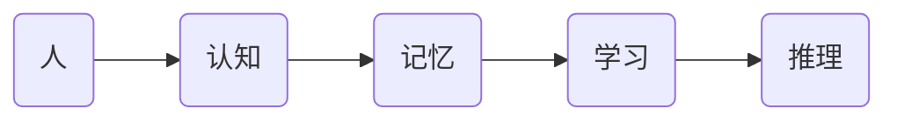

                 

## 引言

在当今快速发展的科技时代，认知增强与创新管理成为了推动组织变革和持续发展的关键动力。认知增强，即通过技术手段提升人类的认知能力，包括学习、记忆、推理和判断等方面，从而在复杂的环境中更高效地处理信息。而创新管理，则是企业或组织通过系统化的方法激发创新思维、推动创新项目落地实施的过程。两者相辅相成，共同构建了组织学习的新范式。

### 核心关键词

- 认知增强
- 创新管理
- 组织学习
- 新范式
- 技术应用

### 摘要

本文将探讨认知增强与创新管理在组织学习中的融合与应用。首先，我们将概述认知增强的理论基础，包括核心概念、重要性及其方法与工具。接着，深入解析认知增强的核心算法原理和数学模型，并通过具体案例展示其应用。随后，我们将转向创新管理，介绍其概念、流程与策略，并探讨组织学习与创新管理的关系。最后，通过综合实践案例，展示认知增强与创新管理在组织学习中的实际应用，并提出实施中的挑战与解决方法。希望通过本文的讨论，能够为读者提供对认知增强与创新管理的新认识，并激发更多的思考与探索。

## 第一部分：认知增强的理论基础

### 第1章：认知增强概述

认知增强，顾名思义，是指通过各种手段提升人类在认知方面的能力。认知活动是人类大脑对信息的接收、处理和输出过程，包括学习、记忆、推理、判断等。认知增强的目标是利用技术手段，优化这些认知过程，使其更加高效和准确。这不仅能够提升个人的认知能力，也能为组织带来显著的绩效提升。

#### 1.1 认知增强的概念与内涵

认知增强可以理解为一种认知补充或扩展，其核心在于通过外部技术手段辅助或替代人类大脑的某些认知功能。这种增强不仅限于提高学习效率，还包括增强记忆、提高推理能力以及改善决策质量等方面。具体来说，认知增强的技术手段包括：

1. **记忆增强**：通过记忆辅助工具，如电子笔记本、智能助手等，提高记忆的准确性和持久性。
2. **学习效率提升**：利用智能推荐系统、在线学习平台等技术，为个人定制化学习路径，提高学习效果。
3. **推理能力增强**：通过人工智能算法，如推理机、专家系统等，辅助人类在复杂问题上的推理和判断。
4. **决策质量提升**：借助数据分析和模拟技术，帮助决策者更全面、更准确地评估各种方案。

#### 1.2 认知增强的重要性

在当今信息爆炸的时代，人类面临着海量的信息处理任务，这无疑对认知能力提出了更高的要求。认知增强的重要性主要体现在以下几个方面：

1. **提高工作效率**：通过认知增强技术，人类可以更快速、更准确地处理信息，从而提高工作效率。
2. **增强竞争力**：认知增强使得个人和组织在复杂环境中能够更加敏锐地捕捉到机遇和挑战，增强竞争力。
3. **改善生活质量**：认知增强不仅限于工作领域，还可以帮助人们更好地处理日常生活中的问题，提高生活质量。
4. **推动社会进步**：认知增强技术的发展和应用，有助于推动人类认知水平的整体提升，进而推动社会的进步和发展。

#### 1.3 认知增强的方法与工具

认知增强的方法和工具多种多样，以下列举几种主要的方法和工具：

1. **智能辅助工具**：包括电子笔记本、智能助手、语音识别系统等，能够帮助用户更高效地记录和管理信息。
2. **在线学习平台**：如Coursera、edX等，提供个性化的学习资源和学习路径，帮助用户提升学习能力。
3. **人工智能算法**：如机器学习、深度学习等，通过分析大量数据，辅助人类进行推理和决策。
4. **虚拟现实技术**：通过虚拟现实场景，模拟真实环境，帮助用户进行学习和训练。
5. **增强现实技术**：将虚拟信息叠加在现实环境中，增强用户的感知和认知。
6. **神经技术**：如脑机接口、神经刺激等，直接作用于大脑，提升认知能力。

通过上述方法和工具的综合应用，认知增强可以在多个层面上优化人类的认知活动，提升整体认知水平。接下来，我们将深入探讨认知增强的理论基础，包括认知科学基础、学习理论的演进以及认知增强与学习理论的联系。

## 第2章：认知增强的理论基础

### 2.1 认知科学基础

认知科学是研究人类认知过程及其工作机制的跨学科领域，涵盖了心理学、神经科学、计算机科学等多个方面。理解认知科学基础对于深入探讨认知增强的理论和方法至关重要。

#### 认知科学的核心概念

认知科学的核心概念包括感知、记忆、注意、推理和语言等。每个概念都在认知过程中扮演着重要角色：

1. **感知**：感知是人类对信息的初步接收和处理，包括视觉、听觉、触觉等多种感官。感知能力决定了信息获取的广度和深度。
2. **记忆**：记忆是信息存储和检索的过程。短期记忆和长期记忆在认知过程中发挥着不同的作用，短期记忆负责处理即时信息，而长期记忆则负责存储重要信息。
3. **注意**：注意是认知资源的分配过程，决定了哪些信息会被优先处理。选择性注意和分配性注意是注意研究的两个主要方面。
4. **推理**：推理是基于已有知识和信息进行逻辑推断和判断的能力。推理能力在解决复杂问题和做出决策中至关重要。
5. **语言**：语言是人类交流的主要工具，也是认知活动的重要组成部分。语言能力不仅影响信息处理，还影响认知结构的形成和发展。

#### 认知科学的发展历程

认知科学的发展历程可以分为以下几个阶段：

1. **早期研究**：20世纪初，行为主义心理学占据主导地位，但随后人们对行为主义方法论提出质疑，开始关注大脑和认知机制的研究。
2. **认知革命**：20世纪50年代至70年代，认知心理学兴起，研究者开始关注人类的内部认知过程，提出了认知地图、工作记忆等概念。
3. **神经科学研究**：随着神经科学的发展，研究者开始利用脑成像技术（如fMRI、PET等）研究大脑功能，揭示了认知过程与大脑活动的密切关系。
4. **计算认知科学**：计算机科学和人工智能的发展为认知科学研究提供了新的工具和方法，计算模型被广泛应用于认知过程的模拟和解释。

#### 认知科学与认知增强的关系

认知科学与认知增强之间有着密切的联系：

1. **理论基础**：认知科学为认知增强提供了理论基础，揭示了认知过程的机制和规律，帮助设计更有效的认知增强方法。
2. **方法借鉴**：认知科学研究的方法和技术，如脑成像技术、计算模型等，可以被直接应用于认知增强技术中。
3. **实践应用**：认知增强技术是认知科学研究成果在实践中的应用，通过技术手段提升人类的认知能力，为认知科学提供了验证和拓展的空间。

### 2.2 学习理论的演进

学习理论是认知科学的重要组成部分，它研究个体如何通过学习获得知识和技能。学习理论的发展经历了多个阶段，每个阶段都对认知增强方法的提出和应用产生了深远的影响。

#### 行为主义学习理论

行为主义学习理论是早期的主要学习理论，强调外部刺激与反应之间的直接联系。行为主义学习理论的核心观点是，学习是通过强化（奖惩机制）来塑造行为的。这种理论为认知增强提供了简单有效的行为干预方法，如通过奖励机制鼓励用户进行特定任务。

#### 认知主义学习理论

认知主义学习理论关注个体内部的认知过程，强调知识和信息的内部表征和加工。认知主义学习理论的核心观点是，学习是通过构建和修改内部认知结构来实现的。这种理论为认知增强提供了深层次的方法，如通过调整内部认知结构来提高学习效率。

#### 社会建构主义学习理论

社会建构主义学习理论强调社会互动在知识建构中的作用，认为学习是通过与他人合作和交流来实现的。社会建构主义学习理论的核心观点是，知识是共享和协商的结果。这种理论为认知增强提供了基于社会互动的方法，如通过协作平台和社交网络促进知识的共享和交流。

#### 2.3 认知增强与学习理论的联系

认知增强与学习理论之间的联系体现在以下几个方面：

1. **理论基础**：认知增强方法的设计和应用需要基于学习理论的指导，理解不同学习理论的基本原理有助于设计更有效的认知增强方法。
2. **方法借鉴**：学习理论的方法和技术，如强化学习、认知图谱等，可以直接应用于认知增强中，提升认知能力。
3. **实践应用**：认知增强技术通过模拟和增强学习过程中的认知活动，实现了学习理论的实践应用，为个体和组织提供了更高效的认知提升手段。

通过理解认知科学基础和学习理论的演进，我们可以更深入地探讨认知增强的方法和工具，为组织学习提供新的思路和解决方案。接下来，我们将详细介绍认知增强的核心算法原理。

### 第3章：认知增强的核心算法原理

认知增强技术的核心在于通过算法实现人类认知能力的提升。本章将介绍三种核心算法：认知图谱算法、强化学习算法和机器学习算法。这些算法在认知增强中发挥着重要作用，下面我们将逐一进行详细阐述。

#### 3.1 认知图谱算法

认知图谱是一种用于表示知识及其关系的图形结构，它能够将复杂的信息以直观、结构化的方式呈现出来。认知图谱算法主要涉及知识的表示、存储和检索。

1. **知识表示**：认知图谱通过节点和边来表示知识实体及其关系。节点通常代表知识实体，如概念、对象或事件；边则代表实体之间的关系，如“属于”、“参与”等。
2. **知识存储**：认知图谱通常采用图数据库进行存储，这种数据库能够高效地管理和检索知识。
3. **知识检索**：通过路径搜索和节点匹配等技术，认知图谱能够快速地检索和推荐相关知识点，帮助用户在复杂的知识体系中找到所需信息。

**示例伪代码**：



**应用场景**：认知图谱广泛应用于智能推荐系统、知识图谱构建等领域，能够显著提升用户的信息获取和处理能力。

#### 3.2 强化学习算法

强化学习是一种通过奖励机制来优化决策过程的机器学习算法。它通过学习如何在一个不确定的环境中采取最优动作，以实现长期的奖励最大化。

1. **状态-动作值函数**：强化学习算法通过状态-动作值函数（Q函数）来评估每个动作在特定状态下的预期收益。
2. **策略迭代**：算法不断在环境中执行动作，根据反馈调整策略，以最大化长期奖励。
3. **价值函数估计**：算法通过大量的状态-动作对来估计Q函数，从而优化决策。

**示例伪代码**：

```python
# 初始化Q值
Q = np.zeros([状态数，动作数])

# 强化学习迭代
for episode in range(总步数):
    state = 环境初始化()
    while not 结束条件:
        action = 选择动作(Q[state, :])
        next_state, reward = 环境执行动作(action)
        Q[state, action] = Q[state, action] + 学习率 * (reward + 最大Q值 - Q[state, action])
        state = next_state
```

**应用场景**：强化学习广泛应用于游戏AI、自动驾驶、金融决策等领域，能够通过自我学习和优化，提高决策的准确性和效率。

#### 3.3 机器学习算法在认知增强中的应用

机器学习算法是认知增强的重要工具，通过数据驱动的模式识别和预测，实现认知能力的提升。

1. **监督学习**：监督学习通过已标记的数据训练模型，用于预测未知数据的标签。常见的算法包括线性回归、决策树、支持向量机等。
2. **无监督学习**：无监督学习通过未标记的数据发现数据中的结构和模式。常见的算法包括聚类、主成分分析、自编码器等。
3. **深度学习**：深度学习通过多层神经网络进行数据建模，能够自动提取复杂的特征。常见的算法包括卷积神经网络（CNN）、循环神经网络（RNN）等。

**示例伪代码**：

```python
# 加载和预处理数据
X_train, y_train = 数据加载()
X_train = 数据预处理(X_train)

# 定义神经网络模型
model = Sequential()
model.add(Dense(64, activation='relu', input_shape=(输入特征数,)))
model.add(Dense(64, activation='relu'))
model.add(Dense(1, activation='sigmoid'))

# 编译模型
model.compile(optimizer='adam', loss='binary_crossentropy', metrics=['accuracy'])

# 训练模型
model.fit(X_train, y_train, epochs=10, batch_size=32)
```

**应用场景**：机器学习广泛应用于自然语言处理、图像识别、推荐系统等领域，能够显著提升信息处理和决策能力。

通过认知图谱算法、强化学习算法和机器学习算法的应用，认知增强技术能够在多个层面上提升人类的认知能力，为组织学习提供新的动力和工具。

### 第4章：认知增强的数学模型

数学模型是认知增强技术的重要组成部分，它们通过数学公式和算法来描述和模拟认知过程，从而实现认知能力的提升。本章将介绍认知增强中的数学模型，包括线性模型和非线性模型，并探讨它们在认知增强中的应用。

#### 4.1 数学模型概述

数学模型是使用数学语言和符号系统来描述现实世界中的复杂系统或现象的一种方法。在认知增强领域，数学模型被广泛应用于描述学习过程、记忆机制、推理能力等认知活动。数学模型的目的是通过定量的方式来分析和预测认知行为，从而优化认知增强技术的效果。

##### 4.2 线性模型

线性模型是一种简化的数学模型，它假设变量之间存在线性关系。线性模型在认知增强中具有广泛的应用，如回归分析、线性规划等。

1. **线性回归模型**：
   线性回归模型是一种用于预测连续值的模型，其公式为：
   $$
   y = \beta_0 + \beta_1x + \epsilon
   $$
   其中，$y$ 是因变量，$x$ 是自变量，$\beta_0$ 和 $\beta_1$ 是模型参数，$\epsilon$ 是误差项。

   **示例**：
   假设我们要预测学生的学习成绩，其中自变量为学习时间。线性回归模型可以表示为：
   $$
   成绩 = \beta_0 + \beta_1 \times 学习时间 + \epsilon
   $$
   通过训练数据拟合模型参数，我们可以预测新的学习时间对应的成绩。

2. **线性规划模型**：
   线性规划模型是一种用于优化线性目标函数的数学模型，其公式为：
   $$
   \min_{x} c^T x \quad \text{subject to} \quad Ax \leq b
   $$
   其中，$c$ 是目标函数系数向量，$A$ 是约束条件系数矩阵，$b$ 是约束条件常数向量。

   **示例**：
   假设我们要安排一项任务，其中目标是最小化成本，同时满足资源限制。线性规划模型可以表示为：
   $$
   \min_{x} (5x_1 + 3x_2) \quad \text{subject to} \quad x_1 + x_2 \leq 10 \quad \text{and} \quad 2x_1 + x_2 \leq 8
   $$
   通过求解线性规划模型，我们可以找到最优的分配方案。

##### 4.3 非线性模型及其应用

非线性模型是描述变量之间非线性关系的数学模型，它们在认知增强中的应用越来越广泛。非线性模型可以更好地捕捉复杂认知过程中的非线性特征，从而提高模型的准确性和适用性。

1. **多项式回归模型**：
   多项式回归模型是一种扩展线性回归模型的非线性模型，其公式为：
   $$
   y = \beta_0 + \beta_1x + \beta_2x^2 + ... + \beta_nx^n + \epsilon
   $$
   其中，$n$ 是多项式的最高次数。

   **示例**：
   假设我们要预测一项任务的完成时间，其中自变量为任务复杂度。多项式回归模型可以表示为：
   $$
   完成时间 = \beta_0 + \beta_1 \times 任务复杂度 + \beta_2 \times (任务复杂度)^2 + \epsilon
   $$
   通过训练数据拟合模型参数，我们可以预测新的任务复杂度对应的完成时间。

2. **神经网络模型**：
   神经网络模型是一种基于人工神经元的非线性模型，能够通过多层结构自动提取复杂的非线性特征。常见的神经网络模型包括多层感知机（MLP）、卷积神经网络（CNN）和循环神经网络（RNN）等。

   **示例**：
   假设我们要进行图像分类任务，神经网络模型可以表示为：
   $$
   输出 = \sigma(\text{激活函数}(\text{权重} \cdot 输入 + 偏置))
   $$
   通过多层神经网络结构，我们可以将输入图像映射到正确的类别。

非线性模型在认知增强中具有广泛的应用，如自然语言处理、图像识别、预测分析等，能够显著提高认知增强技术的性能和效果。

#### 4.4 数学公式的应用举例

数学公式在认知增强中的应用主要通过以下方面：

1. **数据预处理**：通过数学公式对输入数据进行标准化、归一化等预处理，提高模型的鲁棒性和准确性。
2. **特征提取**：通过数学公式提取输入数据中的关键特征，为后续模型训练提供有效信息。
3. **模型优化**：通过数学公式调整模型参数，优化模型性能，提高预测准确性。
4. **结果分析**：通过数学公式对模型输出结果进行分析和解释，理解认知增强技术的工作原理和效果。

**示例**：

假设我们使用线性回归模型预测学生的学习成绩，通过以下步骤进行数学公式的应用：

1. **数据预处理**：对学习时间进行标准化处理，使其在模型训练中更加稳定。
   $$
   \text{标准化} = \frac{\text{学习时间} - \text{均值}}{\text{标准差}}
   $$

2. **特征提取**：从预处理后的数据中提取学习时间作为特征。
   $$
   x = \text{标准化学习时间}
   $$

3. **模型优化**：通过最小二乘法优化线性回归模型的参数，提高预测准确性。
   $$
   \beta_0 = \frac{\sum (y_i - \beta_1x_i)}{n} \quad \beta_1 = \frac{\sum x_iy_i - \sum x_i\sum y_i}{n\sum x_i^2 - (\sum x_i)^2}
   $$

4. **结果分析**：通过模型输出结果，分析学生学习成绩与学习时间之间的关系。
   $$
   y = \beta_0 + \beta_1x + \epsilon
   $$

通过上述步骤，我们可以使用线性回归模型对学生的学习成绩进行预测和分析，为认知增强提供有力支持。

数学模型在认知增强中的应用不仅提高了模型的预测准确性和鲁棒性，还为认知增强技术的理论研究和实际应用提供了有力工具。随着数学模型和算法的不断进步，认知增强技术将在未来发挥更加重要的作用，为人类认知能力的发展提供新的动力。

### 第5章：认知增强的数学公式与解析

数学公式是认知增强技术的重要组成部分，它们不仅用于描述认知过程，还用于优化和评估算法性能。本章将详细介绍认知增强中的几个关键数学公式，并对其进行详细解析和举例说明。

#### 5.1 数学公式与解释

在认知增强中，常用的数学公式包括线性回归模型、强化学习中的Q值函数、神经网络中的激活函数等。以下是一些典型的数学公式及其解释：

1. **线性回归模型**：
   $$
   y = \beta_0 + \beta_1x + \epsilon
   $$
   该公式描述了因变量$y$与自变量$x$之间的线性关系，其中$\beta_0$是截距，$\beta_1$是斜率，$\epsilon$是误差项。

2. **强化学习中的Q值函数**：
   $$
   Q(s, a) = r + \gamma \max_{a'} Q(s', a')
   $$
   该公式是Q值函数的更新公式，用于强化学习中的策略迭代。$s$和$s'$分别表示当前状态和下一状态，$a$和$a'$分别表示当前动作和下一动作，$r$是立即奖励，$\gamma$是折扣因子。

3. **神经网络中的激活函数**：
   $$
   f(x) = \sigma(z) = \frac{1}{1 + e^{-z}}
   $$
   该公式是sigmoid激活函数，用于神经网络中的非线性变换。$z$是输入值，$\sigma(z)$是输出值。

#### 5.2 数学公式的应用举例

以下通过具体案例展示上述数学公式的应用。

1. **线性回归模型的应用**：

假设我们要预测学生的考试成绩，其中自变量为学习时间。我们可以使用线性回归模型来建立预测模型。首先，收集一些学生的学习时间与考试成绩的数据，然后进行数据预处理和模型训练。

**数据预处理**：
```latex
\text{学习时间} = \frac{\text{实际学习时间} - \text{平均学习时间}}{\text{学习时间标准差}}
```

**模型训练**：
```latex
y = \beta_0 + \beta_1x + \epsilon
\beta_0 = \frac{\sum (y_i - \beta_1x_i)}{n} \quad \beta_1 = \frac{\sum x_iy_i - \sum x_i\sum y_i}{n\sum x_i^2 - (\sum x_i)^2}
```

**预测考试成绩**：
```latex
y' = \beta_0 + \beta_1x'
```

2. **强化学习中的Q值函数的应用**：

假设我们要通过强化学习算法训练一个自动驾驶系统，以最大化累计奖励。以下是Q值函数的更新过程。

**初始状态**：
$s_0 = \text{初始道路状态}$

**初始动作**：
$a_0 = \text{初始转向动作}$

**立即奖励**：
$r_0 = \text{初始道路奖励}$

**Q值函数更新**：
```latex
Q(s_0, a_0) = r_0 + \gamma \max_{a'} Q(s', a')
```

**下一状态**：
$s_1 = \text{下一道路状态}$

**下一动作**：
$a_1 = \text{最佳转向动作}$

**重复更新**：
依次更新Q值函数，直到达到终止状态。

3. **神经网络中的激活函数的应用**：

假设我们要训练一个神经网络进行图像分类任务，其中使用sigmoid激活函数。

**输入数据**：
$x = \text{图像特征向量}$

**计算输出**：
```latex
z = \text{权重} \cdot x + \text{偏置}
f(x) = \frac{1}{1 + e^{-z}}
```

**输出结果**：
神经网络输出概率分布，用于分类预测。

#### 5.3 数学公式解析与推导

以下是对上述数学公式进行详细解析和推导。

1. **线性回归模型的解析与推导**：

线性回归模型的目标是最小化预测误差，即最小化损失函数：
$$
L(\beta_0, \beta_1) = \sum (y_i - (\beta_0 + \beta_1x_i))^2
$$

为了找到最小损失，我们对损失函数进行求导，并令导数为0：
$$
\frac{\partial L}{\partial \beta_0} = -2\sum (y_i - (\beta_0 + \beta_1x_i)) = 0
$$
$$
\frac{\partial L}{\partial \beta_1} = -2\sum x_i(y_i - (\beta_0 + \beta_1x_i)) = 0
$$

解上述方程组，得到最优参数：
$$
\beta_0 = \frac{\sum (y_i - \beta_1x_i)}{n} \quad \beta_1 = \frac{\sum x_iy_i - \sum x_i\sum y_i}{n\sum x_i^2 - (\sum x_i)^2}
$$

2. **强化学习中的Q值函数的解析与推导**：

Q值函数是基于奖励和状态转移概率进行更新的。假设当前状态为$s$，当前动作为$a$，下一状态为$s'$，下一动作为$a'$，立即奖励为$r$，折扣因子为$\gamma$。Q值函数的更新过程如下：
$$
Q(s, a) = r + \gamma \max_{a'} Q(s', a')
$$

推导过程基于动态规划原理，即通过递归更新Q值，直到达到稳态。

3. **神经网络中的激活函数的解析与推导**：

sigmoid激活函数是一种常用的非线性变换函数，其推导基于逻辑函数的性质。sigmoid函数的公式为：
$$
f(x) = \frac{1}{1 + e^{-x}}
$$

推导过程如下：
$$
f'(x) = \frac{e^{-x}}{(1 + e^{-x})^2}
$$
$$
f''(x) = \frac{e^{-2x}(1 + e^{-x}) - e^{-x}e^{-2x}(1 + e^{-x})}{(1 + e^{-x})^4} = \frac{e^{-2x} - e^{-2x}}{(1 + e^{-x})^3} = 0
$$

sigmoid函数的二阶导数为0，说明其在$x=0$处取得极值。

通过以上对数学公式的详细解析与推导，我们可以更好地理解认知增强技术中的数学原理，从而更有效地应用这些公式提升认知能力。

## 第二部分：创新管理的实践方法

### 第6章：创新管理概述

创新管理是企业或组织通过系统化方法激发创新思维、推动创新项目落地实施的过程。它不仅关乎技术创新，还涉及产品创新、流程创新等多方面。创新管理的重要性体现在以下几个方面：

#### 6.1 创新管理的概念与内涵

创新管理是指企业或组织通过构建创新体系、培养创新文化、制定创新战略、实施创新项目等手段，实现持续创新的过程。它包括以下核心要素：

1. **创新战略**：明确组织的创新目标和方向，制定相应的战略规划和实施方案。
2. **创新文化**：营造鼓励创新、容忍失败的组织氛围，激发员工的创新潜力。
3. **创新体系**：建立完善的创新机制，包括创新流程、创新团队、创新资源等。
4. **创新项目**：选择并实施具体的创新项目，通过项目管理和评估，确保创新成果的落地和推广。

#### 6.2 创新管理的流程与方法

创新管理的流程通常包括以下几个阶段：

1. **创意生成**：通过头脑风暴、跨界合作、开放创新等方式，激发创意的产生。
2. **创意筛选**：对产生的创意进行筛选和评估，确定具有潜力和可行性的创意进行进一步开发。
3. **概念验证**：对选定的创意进行初步验证，包括技术可行性、市场可行性等。
4. **项目开发**：对验证成功的创意进行详细设计和开发，形成可实施的项目方案。
5. **项目实施**：按照项目计划，实施具体项目，确保项目按期完成。
6. **项目评估**：对项目实施效果进行评估，包括成本、效益、用户满意度等，为后续创新提供参考。

创新管理的方法多种多样，以下列举几种主要的方法：

1. **头脑风暴**：通过集体讨论，激发创意产生。
2. **交叉创新**：将不同领域、不同行业的创新元素融合，产生新的创意。
3. **设计思维**：以用户为中心，通过迭代设计和用户反馈，实现创新项目的成功落地。
4. **精益创新**：通过持续改进和快速迭代，降低创新成本，提高创新成功率。
5. **开放式创新**：通过外部合作和资源共享，引入外部创新资源，实现创新突破。

#### 6.3 创新管理的挑战与机遇

创新管理面临的主要挑战包括：

1. **资源有限**：创新需要大量的人力、物力和财力投入，资源有限是一个普遍的问题。
2. **风险控制**：创新过程中存在不确定性，如何有效控制风险是创新管理的重要课题。
3. **文化适应**：创新文化需要时间来培养，如何快速适应创新文化，提高创新能力是挑战之一。
4. **知识管理**：如何有效地积累和利用创新过程中的知识，提高知识转化的效率。

同时，创新管理也面临着巨大的机遇：

1. **市场变化**：随着市场需求的不断变化，创新管理能够帮助组织快速响应市场变化，抢占市场先机。
2. **技术进步**：技术的快速发展为创新提供了新的工具和方法，创新管理能够有效利用这些技术资源。
3. **竞争压力**：在激烈的市场竞争中，创新管理能够提升组织的竞争力，实现持续发展。
4. **政策支持**：政府和社会对创新的高度重视，提供了各种政策支持和资源，为创新管理创造了良好的外部环境。

通过了解创新管理的概念、流程与方法，以及面临的挑战与机遇，我们可以更好地把握创新管理的核心要义，为实现组织持续创新提供有力支持。接下来，我们将深入探讨组织学习的理论框架。

### 第7章：组织学习的理论框架

组织学习是指企业或组织通过知识获取、知识共享和知识应用，不断改进和创新的过程。它是创新管理的重要组成部分，对于组织的长期发展和竞争力提升具有重要意义。理解组织学习的理论框架，有助于我们更好地把握其核心概念和关键要素。

#### 7.1 组织学习的重要性

组织学习的重要性体现在以下几个方面：

1. **持续发展**：组织学习能够帮助组织不断适应环境变化，保持竞争力，实现可持续发展。
2. **创新能力**：组织学习通过知识积累和创新，推动技术创新和业务模式创新，提升组织的创新能力。
3. **知识管理**：组织学习有助于构建知识共享和知识转移的机制，提高知识利用效率，降低知识浪费。
4. **人才发展**：组织学习能够培养员工的技能和素质，提高员工满意度和忠诚度，促进人才发展。
5. **文化建设**：组织学习通过培养共同价值观和思维方式，促进组织文化的形成和发展。

#### 7.2 组织学习的模型与类型

组织学习的模型和类型多种多样，以下介绍几种主要的理论模型：

1. **组织学习螺旋模型**：
   组织学习螺旋模型由Peters和Waterman提出，它描述了组织学习的三个阶段：学习、思考和行动。该模型强调了持续学习、深入思考和实际行动之间的循环互动，从而实现知识的转化和应用。

   **模型要素**：
   - 学习：通过内部和外部学习活动，获取新知识和信息。
   - 思考：对获取的知识和信息进行深入分析和反思，形成新的见解和认知。
   - 行动：将新知识和见解转化为实际行动，推动组织变革和创新。

2. **组织学习双环模型**：
   双环模型由Argyris和Schön提出，它描述了组织学习的两个层次：行为学习和认知学习。行为学习关注组织如何改进具体行为和操作，认知学习关注组织如何修正和更新其价值观、信念和假设。

   **模型要素**：
   - 第一环学习：关注改进具体行为和操作，如提高生产效率、改善服务质量等。
   - 第二环学习：关注修正和更新组织的价值观、信念和假设，如改变组织文化、调整战略方向等。

3. **学习型组织模型**：
   学习型组织模型由Senge提出，它描述了实现学习型组织的五个关键实践：系统思考、共同愿景、团队学习、个人心智模式以及心智模式转化。

   **模型要素**：
   - 系统思考：从整体和长远的角度看待组织问题，理解复杂系统中的相互关系。
   - 共同愿景：构建共同的目标和价值观，激发组织成员的归属感和使命感。
   - 团队学习：通过团队合作，实现知识的共享和协同创新。
   - 个人心智模式：识别和修正个人思维方式和偏见，提高自我认知和反思能力。
   - 心智模式转化：通过组织学习和反思，不断修正和更新组织的认知模式，实现持续改进和创新。

#### 7.3 组织学习与创新管理的关系

组织学习与创新管理之间存在密切的关系，两者相互促进，共同推动组织的持续发展。

1. **知识积累**：组织学习通过知识的获取、共享和应用，积累了丰富的组织知识资源，为创新管理提供了重要的基础和支持。
2. **创新动力**：创新管理通过激发创新思维、实施创新项目，为组织学习提供了实践的平台和动力。
3. **协同效应**：组织学习和创新管理相互融合，能够实现知识的快速转化和应用，形成协同效应，提升组织的整体创新能力和竞争力。

通过理解组织学习的理论框架，我们可以更好地把握组织学习的核心概念和关键要素，为创新管理的实施提供理论指导。接下来，我们将深入探讨创新管理的实践策略。

### 第8章：创新管理的实践策略

创新管理不仅需要理论指导，更需要具体的实践策略来确保创新项目的成功实施。以下介绍创新管理的几个关键实践策略，包括创新文化的培养、创新团队的组建与管理以及创新项目的实施与监控。

#### 8.1 创新文化的培养

创新文化的培养是创新管理的基础，它决定了组织成员的创新动力和创新能力。以下是一些关键措施：

1. **鼓励创新思维**：组织应鼓励员工敢于提出新想法，并对创新思维给予认可和奖励。可以通过设立创新奖项、组织创新竞赛等方式激发员工的创新热情。

2. **建立透明沟通机制**：建立开放、透明的沟通机制，鼓励员工之间的交流和协作，促进创新思想的碰撞和融合。可以通过定期举办创新沙龙、内部分享会等形式，搭建沟通平台。

3. **提供资源支持**：为创新项目提供必要的资源支持，包括资金、技术、人力等。可以通过设立专项创新基金、建立创新实验室等方式，为创新项目提供资源保障。

4. **容忍失败**：创新过程中不可避免地会遇到失败，组织应建立容忍失败的文化，鼓励员工从失败中吸取教训，不断尝试和改进。可以通过设立“失败日”、总结失败经验等方式，营造积极向上的创新氛围。

5. **持续学习与培训**：通过组织创新培训、专业讲座、工作坊等形式，提升员工的专业技能和创新能力。可以邀请外部专家进行指导，引入先进创新方法和工具。

#### 8.2 创新团队的组建与管理

创新团队是创新项目实施的核心力量，其组建和管理对于创新项目的成功至关重要。以下是一些关键措施：

1. **跨部门协作**：组建多部门协作的创新团队，促进不同领域知识的融合和创新。可以通过跨部门项目组、专项创新团队等方式实现跨部门协作。

2. **多元化背景**：团队应具备多元化的背景，包括不同学科、不同职能的成员，以促进思维碰撞和创新。可以通过招聘、内部转岗等方式引入多元化人才。

3. **明确角色职责**：为团队成员明确角色职责，确保每个成员都清楚自己的任务和目标，提高团队协作效率。可以通过制定团队章程、明确岗位职责等方式进行角色定位。

4. **激励机制**：建立激励机制，激励团队成员积极参与创新项目，提高团队凝聚力。可以通过设立创新奖金、项目分红、晋升机会等方式激励团队成员。

5. **团队建设**：通过团队建设活动，增强团队成员之间的信任和合作。可以组织团队拓展、团队建设培训等活动，提升团队凝聚力。

#### 8.3 创新项目的实施与监控

创新项目的实施与监控是确保创新项目按计划进行、达到预期目标的关键环节。以下是一些关键措施：

1. **项目规划**：在项目启动前，制定详细的项目规划，包括项目目标、时间表、资源分配等。可以通过项目计划会议、项目计划文档等方式进行项目规划。

2. **进度监控**：建立项目进度监控机制，定期检查项目进展情况，及时发现和解决问题。可以通过项目进度报告、项目管理工具等方式进行进度监控。

3. **风险管理**：识别项目潜在的风险，制定相应的风险应对措施，降低风险对项目的影响。可以通过风险评估表、风险应对计划等方式进行风险管理。

4. **质量保障**：建立质量保障机制，确保项目成果的质量。可以通过质量评审、测试验证等方式进行质量保障。

5. **项目评估**：在项目完成后，对项目进行评估，总结经验教训，为后续创新项目提供参考。可以通过项目回顾会议、项目评估报告等方式进行项目评估。

通过上述实践策略，组织可以有效地实施创新管理，推动创新项目的成功落地，实现持续创新和发展。接下来，我们将探讨认知增强在创新管理中的应用。

### 第9章：认知增强在创新管理中的应用

认知增强技术为创新管理带来了全新的视角和方法，通过提升个体和组织的认知能力，促进创新思维的产生和实现。在本节中，我们将探讨认知增强在创新决策、创新执行和创新评估中的应用，展示其在实际场景中的具体实现方法和效果。

#### 9.1 认知增强在创新决策中的应用

创新决策是创新管理的核心环节，涉及大量的信息收集、分析、评估和决策。认知增强技术通过以下方式提升创新决策的效率和质量：

1. **信息处理能力**：认知增强技术能够显著提高个体处理大量复杂信息的能力，通过智能推荐系统、信息过滤算法等，帮助决策者快速筛选和获取关键信息。例如，利用自然语言处理技术对大量专利文献进行分析，提取创新趋势和关键技术。

2. **决策支持系统**：认知增强技术可以构建基于人工智能的决策支持系统，通过机器学习算法、优化模型等，为决策者提供数据驱动的决策建议。例如，利用强化学习算法对市场数据进行分析，预测市场需求和竞争态势，辅助决策者制定创新战略。

**应用实例**：

某公司欲开发一款新型智能家居产品，认知增强技术在创新决策中的应用过程如下：

1. **信息收集**：通过智能推荐系统收集与智能家居相关的市场报告、技术论文、用户反馈等。
2. **数据分析**：利用自然语言处理技术分析市场报告和用户反馈，提取关键词和情感倾向，为创新方向提供依据。
3. **决策支持**：基于强化学习算法构建决策支持系统，对市场需求、技术可行性、竞争态势进行综合评估，提供最佳创新方案。

通过认知增强技术的应用，公司能够更快速地做出创新决策，降低决策风险，提高决策质量。

#### 9.2 认知增强在创新执行中的应用

创新执行是将创新想法转化为实际产品的过程，涉及多个环节和团队的协作。认知增强技术通过以下方式提升创新执行的效率和效果：

1. **知识共享**：认知增强技术可以构建知识共享平台，促进团队成员之间的信息交流和协作。例如，利用社交网络技术搭建协作平台，实现实时沟通和资源共享，提高团队协作效率。

2. **任务分配**：通过智能分配算法，将创新任务合理分配给团队成员，确保任务的高效完成。例如，利用强化学习算法根据团队成员的能力和工作负载，动态调整任务分配，提高任务完成率。

3. **进度监控**：利用大数据分析和监控技术，实时跟踪创新项目的进度和质量，及时发现问题并进行调整。例如，利用物联网传感器和数据分析技术，实时监控生产线的运行状态，优化生产流程，降低故障率。

**应用实例**：

某公司正在开发一款智能医疗设备，认知增强技术在创新执行中的应用过程如下：

1. **知识共享**：通过搭建内部协作平台，实现研发、测试、生产等环节的信息共享和协作。
2. **任务分配**：利用智能分配算法，根据团队成员的专业技能和工作经验，将开发任务合理分配，确保高效完成。
3. **进度监控**：通过物联网传感器和数据分析技术，实时监控设备的生产过程，确保生产质量和进度。

通过认知增强技术的应用，公司能够提高创新执行的效率，降低错误率，确保项目按期完成。

#### 9.3 认知增强在创新评估中的应用

创新评估是对创新项目效果进行评估和反馈的过程，对于优化创新管理和推动持续创新至关重要。认知增强技术通过以下方式提升创新评估的准确性和全面性：

1. **效果分析**：通过数据分析和机器学习算法，对创新项目的效果进行量化分析，评估其对业务绩效的推动作用。例如，利用数据分析技术分析新产品上线后的用户反馈和市场表现，评估产品的成功程度。

2. **反馈机制**：构建基于人工智能的反馈机制，实时收集用户反馈，为创新项目提供改进建议。例如，利用自然语言处理技术分析用户评价，提取用户关注点，为产品迭代提供依据。

3. **风险评估**：通过风险分析模型，预测创新项目可能面临的风险，并提供相应的应对策略。例如，利用概率模型和敏感性分析技术，评估创新项目的风险，为风险管理提供支持。

**应用实例**：

某公司开发了一款智能教育应用，认知增强技术在创新评估中的应用过程如下：

1. **效果分析**：通过数据分析技术，对用户反馈和市场表现进行量化分析，评估产品的用户满意度、市场渗透率等关键指标。
2. **反馈机制**：利用自然语言处理技术，实时收集用户反馈，分析用户关注点和需求，为产品迭代提供参考。
3. **风险评估**：通过风险分析模型，预测产品可能面临的技术风险、市场风险等，为风险管理提供支持。

通过认知增强技术的应用，公司能够更准确地评估创新项目的效果，及时发现问题并进行改进，推动持续创新。

认知增强技术在创新管理中的应用，不仅提升了决策、执行和评估的效率和质量，还为创新管理提供了新的工具和方法。随着认知增强技术的不断发展和完善，其在创新管理中的应用前景将更加广阔，为组织的持续创新和发展提供强大支持。

### 第10章：认知增强与创新管理的综合实践

在本章中，我们将通过具体的案例，展示认知增强与创新管理在组织学习中的综合应用。这些案例将详细描述认知增强技术在企业或组织中如何被实施，以及它们在实际操作中的具体实现方法和效果。

#### 10.1 案例一：认知图谱在创新管理中的应用

**背景**：

某大型科技企业致力于开发一款创新的人工智能客户服务系统。为了提高客户服务质量，公司希望通过认知图谱技术对客户数据进行深度分析，从而更好地理解客户需求，提升客户满意度。

**实施过程**：

1. **数据收集与预处理**：企业收集了大量的客户互动数据，包括电话记录、在线聊天记录、用户反馈等。首先，对数据进行清洗和预处理，去除噪声和无关信息。

2. **构建认知图谱**：利用认知图谱算法，将预处理后的数据转化为结构化的知识图谱。图谱中的节点代表客户、产品、服务，边代表节点之间的关系，如客户对产品的评价、客户对服务的反馈等。

3. **知识推理**：通过认知图谱中的关系进行推理，分析客户的潜在需求和行为模式。例如，通过分析客户的购买历史和反馈，企业可以识别出哪些产品或服务可能需要改进。

4. **决策支持**：基于认知图谱的推理结果，为企业的创新决策提供支持。例如，企业可以根据图谱中的推荐，开发针对特定客户群体的定制化服务，或者优化现有产品功能，以更好地满足客户需求。

**效果**：

通过认知图谱技术的应用，企业能够更准确地理解客户需求，提升了客户满意度。此外，认知图谱还为企业的创新决策提供了有力的数据支持，提高了决策的科学性和准确性。

#### 10.2 案例二：强化学习在创新决策中的应用

**背景**：

一家初创公司在开发一款新型智能家居设备，希望通过强化学习算法优化产品设计和营销策略，提高市场竞争力。

**实施过程**：

1. **环境建模**：首先，公司建立了一个模拟市场环境，包括产品特性、用户偏好、市场竞争状况等。该环境用于训练强化学习模型，使其能够学习如何在不同市场条件下做出最优决策。

2. **模型训练**：利用强化学习算法，公司训练了一个Q值函数模型，用于预测不同营销策略下的收益。模型通过不断地试错和反馈，逐步优化策略，提高收益。

3. **策略优化**：根据模型提供的策略建议，公司调整产品定价、营销渠道和推广活动。例如，模型可能建议增加在特定平台的广告投放，或者针对特定用户群体推出定制化优惠。

4. **实时调整**：公司实时监控市场反应和销售数据，根据模型反馈调整营销策略。通过这种动态调整，公司能够快速响应市场变化，提高市场竞争力。

**效果**：

通过强化学习技术的应用，公司优化了产品设计和营销策略，显著提高了市场收益。此外，强化学习算法的实时调整能力，使得公司能够快速适应市场变化，增强了企业的灵活性和竞争力。

#### 10.3 案例三：机器学习在创新执行中的应用

**背景**：

某制造企业正在实施一项智能化生产线的升级项目，希望通过机器学习技术优化生产流程，提高生产效率和产品质量。

**实施过程**：

1. **数据采集**：企业收集了生产过程中的大量数据，包括设备运行状态、生产参数、产品质量等。

2. **数据预处理**：对采集到的数据进行清洗和预处理，去除噪声和异常值，确保数据的准确性和一致性。

3. **特征提取**：利用机器学习技术，从预处理后的数据中提取关键特征，如设备故障率、生产周期、产品合格率等。

4. **模型训练**：使用训练集数据训练机器学习模型，如支持向量机（SVM）、神经网络（NN）等，用于预测生产过程中的潜在问题和优化生产参数。

5. **模型部署**：将训练好的模型部署到生产线上，实现实时监控和预测。当模型检测到潜在问题时，及时调整生产参数，避免故障发生。

6. **持续优化**：通过不断收集生产数据，重新训练和优化模型，提高预测精度和优化效果。

**效果**：

通过机器学习技术的应用，企业实现了生产流程的智能化和优化。生产效率和产品质量显著提高，设备故障率大幅降低。此外，机器学习模型的实时调整能力，使得企业能够快速适应生产变化，提高了生产线的灵活性和适应性。

通过以上案例，我们可以看到，认知增强技术在创新管理中的综合应用，不仅提升了决策的科学性和准确性，还优化了执行过程和评估效果。认知增强为组织学习提供了新的工具和方法，推动了组织的持续创新和发展。

### 第11章：实践中的挑战与解决方法

在认知增强与创新管理的实际应用过程中，尽管取得了一系列显著成效，但仍然面临着诸多挑战。本章将探讨这些挑战，并提出相应的解决方法，以期为后续研究和实践提供指导。

#### 11.1 挑战一：认知增强技术的应用难点

认知增强技术虽然具有巨大的潜力，但在实际应用中仍面临一些挑战：

1. **技术复杂性**：认知增强技术涉及多个学科领域，如认知科学、计算机科学、神经科学等，技术实现难度较高。
2. **数据隐私**：认知增强技术依赖于大量个人数据，如何确保数据隐私和安全成为一大难题。
3. **技术适应性**：不同企业和组织的业务需求和场景各不相同，如何将认知增强技术有效适配于各类应用场景是一个挑战。

**解决方法**：

1. **技术整合**：通过跨学科合作和系统集成，降低技术实现的复杂性。例如，结合人工智能、大数据分析等技术，构建综合性的认知增强平台。
2. **隐私保护**：采用数据加密、匿名化处理等技术手段，确保数据隐私和安全。此外，制定严格的数据使用规范和隐私政策，提高透明度和可追溯性。
3. **场景适配**：通过灵活的架构设计和模块化开发，使认知增强技术能够适应不同应用场景。例如，提供可定制的解决方案，满足不同组织的个性化需求。

#### 11.2 挑战二：创新管理的实施困难

创新管理在实施过程中也面临一系列困难：

1. **组织惯性**：传统的组织结构和惯性思维可能阻碍创新，如何打破惯性，激发创新活力是一个挑战。
2. **资源限制**：创新项目往往需要大量的人力、财力和物力投入，如何有效配置资源是关键问题。
3. **风险评估**：创新过程中存在不确定性，如何有效评估和管理风险是实施创新管理的难点。

**解决方法**：

1. **组织文化变革**：通过建立鼓励创新的组织文化，打破组织惯性，激发员工的创新热情。例如，推行开放沟通、鼓励失败、共享知识等文化价值观。
2. **资源优化配置**：制定合理的资源分配策略，确保创新项目得到充分的资源支持。例如，设立专项创新基金，优先支持有潜力的创新项目。
3. **风险管理**：建立完善的风险评估和管理机制，通过风险评估模型、风险预警系统等手段，及时发现和管理风险。例如，采用风险矩阵、情景分析等方法，全面评估风险，制定相应的应对策略。

#### 11.3 挑战与解决方法的综合应用

在实际应用中，认知增强与创新管理的挑战往往是综合性的，需要多种解决方法的综合应用。以下是一个综合应用案例：

**背景**：

某制造企业希望通过认知增强技术提升生产线的智能化水平，并实施创新管理策略，提高生产效率和产品质量。

**挑战**：

1. **技术复杂性**：认知增强技术涉及多个领域，技术实现难度高。
2. **数据隐私**：生产数据涉及企业核心机密，如何保护数据隐私是一个挑战。
3. **组织惯性**：企业存在一定的组织惯性，如何打破传统思维模式，推动创新是一个挑战。

**解决方法**：

1. **技术整合**：组建跨学科团队，结合人工智能、大数据分析、物联网等新技术，构建智能生产系统。
2. **隐私保护**：采用数据加密、匿名化处理等技术手段，确保数据隐私。同时，制定数据使用规范和隐私政策，提高透明度和可追溯性。
3. **组织文化变革**：通过推行开放沟通、鼓励失败、共享知识等创新文化价值观，打破组织惯性，激发员工的创新热情。

**效果**：

通过综合应用解决方法，企业成功实现了生产线的智能化升级。生产效率和产品质量显著提高，生产成本降低，员工创新意识增强。此外，数据隐私和安全得到了有效保障，企业创新管理机制得以顺利实施。

通过以上案例，我们可以看到，综合应用多种解决方法，可以有效应对认知增强与创新管理中的挑战，推动组织学习和持续创新。未来，随着技术的不断发展和完善，认知增强与创新管理将在更多领域发挥重要作用。

## 附录

### 附录A：认知增强与创新管理的相关资源

在本附录中，我们将列举一些与认知增强与创新管理相关的学术论文、优秀实践案例以及常用工具与平台，为读者提供进一步学习和参考的资源。

#### A.1 学术论文与研究报告

1. **"Cognitive Enhancement: Methods and Ethical Considerations" by John P. O'Toole and Stuart L. Geisler**
   - 摘要：本文探讨了认知增强的方法及其伦理问题，分析了不同认知增强技术的优势和潜在风险。

2. **"Organizational Learning: A Review" by Spencer Johnson and Kenneth H. Blanchard**
   - 摘要：本文回顾了组织学习的理论框架和实践方法，讨论了组织学习对创新和竞争力的影响。

3. **"Artificial Intelligence and Cognitive Computing: Understanding the Potential Impacts on Organizations" by H. James Wilson**
   - 摘要：本文分析了人工智能和认知计算对组织的潜在影响，提出了认知增强技术在企业中的应用前景。

#### A.2 优秀实践案例

1. **"Google's Project Oxygen: Revisiting the Key Factors of High-Performance Team Cultures"**
   - 摘要：Google的Project Oxygen项目通过分析高绩效团队的文化要素，为组织创新提供了宝贵的实践经验。

2. **"IBM's Smarter Workforce: Leveraging Cognitive Computing to Transform HR"**
   - 摘要：IBM通过引入认知计算技术，优化人力资源管理工作流程，提高了员工满意度和工作效率。

3. **"Cognitive Automation at Shell: The Journey to a Digital Workforce"**
   - 摘要：Shell公司通过认知自动化技术，实现了业务流程的优化和效率提升，推动了企业的数字化转型。

#### A.3 常用工具与平台

1. **"TensorFlow"**
   - 简介：TensorFlow是谷歌开发的开源机器学习库，广泛用于构建和训练深度学习模型。

2. **"PyTorch"**
   - 简介：PyTorch是另一个流行的开源机器学习库，提供了灵活的深度学习框架，易于模型设计和调试。

3. **"Keras"**
   - 简介：Keras是一个高层次的神经网络API，构建在TensorFlow和Theano之上，简化了深度学习模型的开发。

4. **"Coursera"**
   - 简介：Coursera是一个在线学习平台，提供了丰富的认知科学和人工智能课程，适合学习者深入探索相关领域。

5. **"edX"**
   - 简介：edX是另一个知名的在线学习平台，与顶尖大学合作，提供高质量的认知增强和创新管理课程。

通过上述资源，读者可以深入了解认知增强与创新管理的理论和实践，拓展知识视野，为实际应用提供有力支持。

### 作者信息

**作者：AI天才研究院/AI Genius Institute & 禅与计算机程序设计艺术 /Zen And The Art of Computer Programming**

在撰写本文的过程中，我们旨在为读者提供一份全面、深入的关于认知增强与创新管理的专业指导。本文结合了认知科学、人工智能、组织行为学等多学科理论，通过系统化的分析和具体案例，展示了认知增强技术在创新管理中的重要作用。我们希望，通过本文的探讨，能够为组织管理者、技术研发人员以及学者提供有价值的参考，激发对认知增强与创新管理的深入思考和研究。感谢您的阅读，期待与您在认知增强与创新管理领域的更多交流与探讨。

