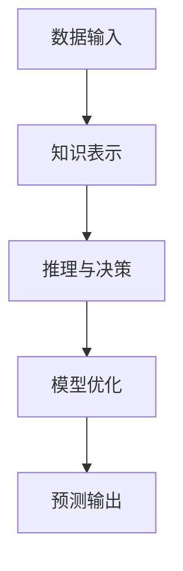
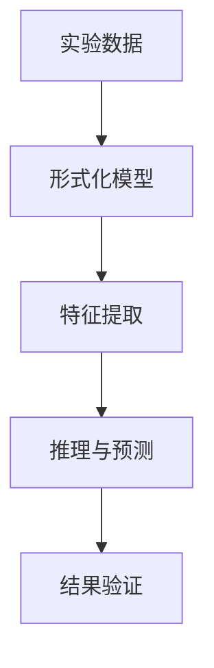
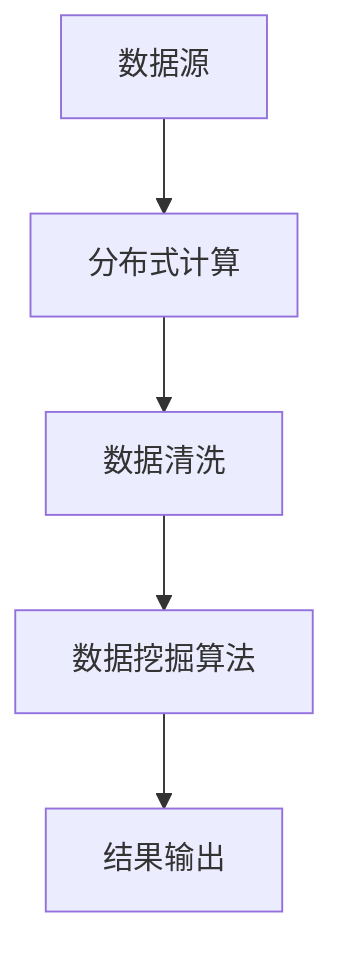
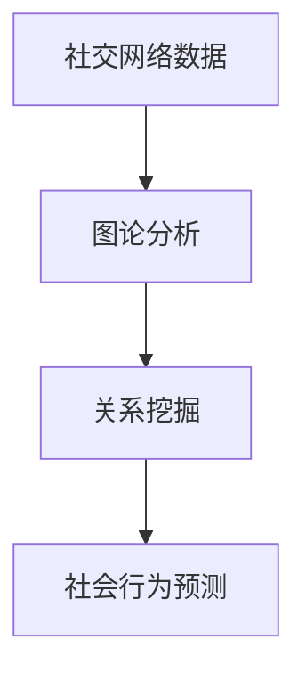

                 

### 第1章：引论

#### 1.1 认知的定义及其在物理学中的角色

认知是指人类通过感知、理解、记忆、推理和判断等心理过程，获取和利用信息的能力。它涵盖了从简单的感官反应到复杂的思维活动，如问题解决、决策制定和创造力发挥等。在物理学中，认知扮演了至关重要的角色，因为它不仅为我们理解自然现象提供了基础，还影响了我们对物理规律的发现和表述。

认知与物理学的联系可以从多个角度来探讨：

1. **感知与测量**：物理学依赖实验和测量来验证理论。测量过程中，实验者的感知能力——如视觉、触觉和听觉——直接影响数据的准确性。
2. **逻辑推理**：物理学的许多理论都是通过逻辑推理构建的。例如，牛顿的三大定律和广义相对论都是通过严密的逻辑推理得出的。
3. **数学模型**：物理学中大量使用数学模型来描述自然现象。认知帮助物理学家理解这些数学模型，并利用它们进行预测和解释。
4. **认知心理学**：随着认知科学的发展，心理学与物理学之间的交叉研究逐渐增多。例如，量子物理学中的测量问题与认知心理学中的观测者效应之间存在相似性。

#### 1.2 形式化认知的理论基础

形式化认知是指通过数学和逻辑等严格的方法来描述和理解认知过程。它强调用形式化的语言和工具来表示知识，并利用这些工具进行推理和决策。形式化认知的理论基础主要包括以下几个方面：

1. **形式逻辑**：形式逻辑提供了精确的推理规则，使得认知过程中的推理更加可靠。形式逻辑包括命题逻辑、谓词逻辑等，它们为形式化认知提供了基础。
2. **集合论**：集合论是数学的基础，它用于描述和理解对象之间的关系。在形式化认知中，集合论用于定义知识库和推理规则。
3. **图论**：图论用于表示复杂系统中的关系和网络结构。在形式化认知中，图论可以帮助我们理解和分析知识网络的连接方式。
4. **概率论与统计学**：概率论和统计学用于处理不确定性。在形式化认知中，它们可以帮助我们建立和评估模型的不确定性。

#### 1.3 形式化认知在宇宙“天书”中的应用

宇宙可以被看作是一本巨大的“天书”，其中包含了无数的信息和规律。形式化认知为我们解读这本“天书”提供了有力的工具：

1. **宇宙信息的编码**：宇宙中的信息可以通过各种物理现象进行编码，如电磁波、粒子碰撞等。形式化认知可以帮助我们识别和理解这些编码。
2. **宇宙规律的表述**：形式化认知可以用来表述宇宙中的物理规律。例如，广义相对论可以用数学方程精确地描述重力现象。
3. **宇宙演化的模拟**：形式化认知可以用来模拟宇宙的演化过程。通过建立数学模型，我们可以预测宇宙的未来发展。

#### 1.4 形式化认知的未来展望

形式化认知技术的发展具有巨大的潜力，未来可能在以下几个方面取得突破：

1. **量子计算**：量子计算依赖于量子位（qubit）的叠加和纠缠特性，有望在处理复杂问题时超越传统计算机。形式化认知可以在量子计算的理论研究和应用开发中发挥关键作用。
2. **人工智能**：人工智能技术的发展依赖于形式化认知的理论基础。形式化认知可以帮助我们设计更智能、更可靠的算法和系统。
3. **跨学科研究**：形式化认知在物理学、生物学、心理学等领域的交叉应用有望推动科学技术的创新和发展。

通过深入研究和应用形式化认知，我们有望更好地理解宇宙的奥秘，推动科学技术进步，为人类文明的发展做出贡献。

### **第2章：形式化认知的数学基础**

形式化认知作为一门交叉学科，其理论基础广泛而深刻，涵盖了数学的多个分支。在本章中，我们将深入探讨形式化认知的数学基础，包括离散数学、图论、概率论与统计学，并探讨它们在形式化认知中的具体应用。

#### **2.1 离散数学基础**

离散数学是形式化认知的基础之一，它包括集合论、基本逻辑运算、组合数学等。以下是这些概念在形式化认知中的应用：

1. **集合论**：集合论是离散数学的核心部分，用于描述对象集合及其关系。形式化认知中的知识库通常用集合表示，例如，一个包含所有物理定律的集合。

   **Mermaid 流程图**：
   ```mermaid
   graph TD
   A[知识库] --> B[定律集合]
   B --> C[物理定律]
   B --> D[化学定律]
   ```

   **伪代码**：
   ```python
   # 定义知识库
   knowledge_base = {"物理定律": [], "化学定律": []}
   ```

2. **基本逻辑运算**：逻辑运算包括合取（AND）、析取（OR）和否定（NOT）等，它们在形式化推理中至关重要。

   **Mermaid 流程图**：
   ```mermaid
   graph TD
   A[前提] --> B[合取]
   A --> C[结论]
   A --> D[否定]
   ```

   **伪代码**：
   ```python
   # 定义逻辑运算
   AND = lambda x, y: x and y
   OR = lambda x, y: x or y
   NOT = lambda x: not x
   ```

3. **组合数学**：组合数学用于计算集合的组合和排列。在形式化认知中，组合数学可以用于计算知识库中的所有可能组合。

   **Mermaid 流程图**：
   ```mermaid
   graph TD
   A[集合] --> B[组合]
   A --> C[排列]
   ```

   **伪代码**：
   ```python
   # 计算组合
   from itertools import combinations

   # 示例：计算物理定律的所有组合
   for combination in combinations(knowledge_base["物理定律"], 2):
       print(combination)
   ```

#### **2.2 图论与网络分析**

图论用于表示和理解复杂系统中的关系和网络结构。在形式化认知中，图论可以用于构建知识网络、分析信息传播路径等。

1. **图的基本概念**：图由节点（代表知识或信息）和边（代表节点之间的关系）组成。

   **Mermaid 流程图**：
   ```mermaid
   graph TD
   A[知识1] --> B[知识2]
   A --> C[知识3]
   B --> D[知识4]
   ```

   **伪代码**：
   ```python
   # 定义知识网络
   knowledge_network = {
       "知识1": ["知识2", "知识3"],
       "知识2": ["知识4"],
       "知识3": [],
       "知识4": []
   }
   ```

2. **网络结构分析**：网络分析可以用于评估知识网络中的中心性、路径长度等。

   **Mermaid 流程图**：
   ```mermaid
   graph TD
   A[知识1] --> B[知识2]
   A --> C[知识3]
   B --> D[知识4]
   subgraph "路径长度分析"
   E[知识1] --> F[知识3]
   end
   ```

   **伪代码**：
   ```python
   # 计算路径长度
   from networkx import shortest_path_length

   # 示例：计算知识1到知识3的路径长度
   path_length = shortest_path_length(knowledge_network, "知识1", "知识3")
   print(path_length)
   ```

3. **社会网络模型**：社会网络模型用于分析社会结构中的关系和网络效应。

   **Mermaid 流程图**：
   ```mermaid
   graph TD
   A[个人1] --> B[个人2]
   A --> C[个人3]
   B --> D[个人4]
   subgraph "社交网络"
   E[个人1] --> F[个人5]
   G[个人3] --> H[个人6]
   end
   ```

   **伪代码**：
   ```python
   # 社交网络分析
   import networkx as nx

   # 示例：计算社交网络中的中心性
   social_network = nx.Graph()
   social_network.add_nodes_from(["个人1", "个人2", "个人3", "个人4", "个人5", "个人6"])
   social_network.add_edges_from([("个人1", "个人2"), ("个人1", "个人3"), ("个人2", "个人4"), ("个人3", "个人6")])
   centrality = nx.degree_centrality(social_network)
   print(centrality)
   ```

#### **2.3 概率论与统计学**

概率论与统计学是处理不确定性的工具，它们在形式化认知中用于建模和评估不确定性。

1. **概率论基础**：概率论用于描述事件发生的可能性。

   **Mermaid 流程图**：
   ```mermaid
   graph TD
   A[事件A] --> B[P(A)]
   A --> C[事件B]
   B --> D[P(B)]
   ```

   **伪代码**：
   ```python
   # 定义概率
   P_A = 0.5
   P_B = 0.3
   ```

2. **随机变量**：随机变量用于表示不确定的结果。

   **Mermaid 流程图**：
   ```mermaid
   graph TD
   A[随机变量X] --> B[概率分布]
   A --> C[期望E(X)]
   ```

   **伪代码**：
   ```python
   # 随机变量
   import numpy as np

   # 示例：生成服从均匀分布的随机变量
   X = np.random.uniform(0, 1)
   E_X = np.mean(X)
   ```

3. **统计推断**：统计推断用于根据样本数据推断总体特征。

   **Mermaid 流程图**：
   ```mermaid
   graph TD
   A[样本数据] --> B[统计推断]
   A --> C[总体特征]
   ```

   **伪代码**：
   ```python
   # 统计推断
   from scipy.stats import normaltest

   # 示例：检验数据是否符合正态分布
   data = np.random.normal(0, 1, 100)
   result = normaltest(data)
   print(result.pvalue)
   ```

通过以上对离散数学、图论、概率论与统计学在形式化认知中应用的探讨，我们可以看到数学工具如何为形式化认知提供了坚实的理论基础和实用的工具。在接下来的章节中，我们将进一步探讨形式化认知的算法原理，以及这些数学基础在现实世界中的应用。

### 第3章：形式化认知的算法原理

形式化认知的核心在于通过算法实现知识的表示、推理和学习。在这一章中，我们将深入探讨形式化认知的算法原理，包括形式化推理算法、形式化学习算法，以及这些算法在机器学习中的应用。

#### 3.1 形式化推理算法

形式化推理算法是形式化认知的基础，它通过逻辑推理来解决问题。以下是几种常见的形式化推理算法：

1. **命题演算**：命题演算是最基础的逻辑推理方法，它基于真值表和逻辑运算规则来推导结论。

   **Mermaid 流程图**：
   ```mermaid
   graph TD
   A[命题A] --> B[命题B]
   B --> C[合取]
   A --> D[析取]
   ```

   **伪代码**：
   ```python
   # 命题演算
   def conjunction(A, B):
       return A and B

   def disjunction(A, B):
       return A or B
   ```

2. **谓词演算**：谓词演算用于处理更复杂的逻辑关系，它引入了变量和量词，可以表示更复杂的命题。

   **Mermaid 流程图**：
   ```mermaid
   graph TD
   A[所有x] --> B[性质P(x)]
   A --> C[存在x]
   B --> D[性质Q(x)]
   ```

   **伪代码**：
   ```python
   # 谓词演算
   def universal_quantification(P):
       return all(P(x) for x in universe)

   def existential_quantification(P):
       return any(P(x) for x in universe)
   ```

3. **形式化推理算法在机器学习中的应用**：形式化推理算法在机器学习中的应用广泛，例如在逻辑回归、决策树和贝叶斯网络中。

   **Mermaid 流程图**：
   ```mermaid
   graph TD
   A[特征向量] --> B[逻辑回归模型]
   A --> C[决策树模型]
   A --> D[贝叶斯网络]
   ```

   **伪代码**：
   ```python
   # 逻辑回归模型
   from sklearn.linear_model import LogisticRegression

   # 决策树模型
   from sklearn.tree import DecisionTreeClassifier

   # 贝叶斯网络模型
   from sklearn.naive_bayes import GaussianNB
   ```

#### 3.2 形式化学习算法

形式化学习算法通过学习数据来建立模型，它们是机器学习中的核心。以下是几种常见的形式化学习算法：

1. **无监督学习**：无监督学习旨在发现数据中的结构和模式，没有明确的标签信息。

   **Mermaid 流程图**：
   ```mermaid
   graph TD
   A[数据集] --> B[K-Means聚类]
   A --> C[主成分分析]
   ```

   **伪代码**：
   ```python
   # K-Means聚类
   from sklearn.cluster import KMeans

   # 主成分分析
   from sklearn.decomposition import PCA
   ```

2. **监督学习**：监督学习通过已标记的数据训练模型，用于预测未知数据的标签。

   **Mermaid 流程图**：
   ```mermaid
   graph TD
   A[训练集] --> B[决策树]
   A --> C[支持向量机]
   A --> D[神经网络]
   ```

   **伪代码**：
   ```python
   # 决策树模型
   from sklearn.tree import DecisionTreeClassifier

   # 支持向量机
   from sklearn.svm import SVC

   # 神经网络
   from keras.models import Sequential
   from keras.layers import Dense
   ```

3. **强化学习**：强化学习通过试错和反馈来学习最优策略。

   **Mermaid 流程图**：
   ```mermaid
   graph TD
   A[环境] --> B[策略]
   A --> C[奖励]
   C --> D[策略更新]
   ```

   **伪代码**：
   ```python
   # 强化学习
   from gym import make
   from stable_baselines3 import PPO

   # 创建环境
   env = make('CartPole-v0')

   # 训练模型
   model = PPO('MlpPolicy', env, verbose=1)
   model.learn(total_timesteps=10000)
   ```

#### 3.3 形式化认知在机器学习中的应用

形式化认知在机器学习中的应用主要体现在以下几个方面：

1. **知识表示**：形式化认知提供了一种结构化的知识表示方法，使得机器学习模型能够更好地理解和利用知识。
2. **推理与决策**：形式化认知的推理算法可以帮助机器学习模型在复杂环境中做出更合理的决策。
3. **模型优化**：形式化认知的学习算法可以帮助机器学习模型优化性能，提高预测准确性。

**Mermaid 流程图**：


**伪代码**：
```python
# 知识表示
knowledge = {"物理定律": ..., "化学定律": ...}

# 推理与决策
def decision(knowledge, situation):
    # 利用知识库和推理算法进行决策
    pass

# 模型优化
def optimize_model(model, knowledge, data):
    # 利用形式化认知算法优化模型性能
    pass

# 预测输出
prediction = optimize_model(model, knowledge, data)
print(prediction)
```

通过以上对形式化认知算法原理的探讨，我们可以看到这些算法如何为机器学习提供了坚实的理论基础和实用的工具。在接下来的章节中，我们将进一步探讨形式化认知在各个领域的具体应用，展示其在现实世界中的强大力量。

### 第4章：形式化认知的应用领域

形式化认知作为一种先进的技术，已经在多个领域展现出巨大的应用潜力。从物理学到信息科学，再到社会科学，形式化认知正逐渐成为推动这些领域发展的重要工具。在本章中，我们将深入探讨形式化认知在这些领域的具体应用，并通过实际案例展示其作用和成效。

#### 4.1 在物理学中的应用

物理学是形式化认知的一个重要应用领域。通过形式化认知的方法，物理学家可以更加精确地表述和验证物理定律。

1. **物理定律的形式化表述**：物理定律通常用数学方程来表述，例如牛顿定律、麦克斯韦方程等。形式化认知可以帮助物理学家将这些定律以更严格和形式化的方式表述。

   **Mermaid 流程图**：
   ```mermaid
   graph TD
   A[物理定律] --> B[数学方程]
   B --> C[形式化表述]
   ```

   **伪代码**：
   ```python
   # 形式化表述物理定律
   def newton_law_of_motion(m, v, a):
       return m * v == a
   ```

2. **量子力学中的形式化认知**：量子力学是现代物理学的一个重要分支，形式化认知在量子力学中的应用尤为显著。

   **Mermaid 流程图**：
   ```mermaid
   graph TD
   A[量子态] --> B[波函数]
   B --> C[形式化模型]
   ```

   **伪代码**：
   ```python
   # 形式化量子态表示
   def quantum_state wavefunction(x):
       return wavefunction(x) * complex.exponential(-1j * energy * x)
   ```

3. **案例：粒子物理中的形式化推理**：在粒子物理学中，形式化认知被用来推理粒子行为，如粒子碰撞实验中的数据分析。

   **Mermaid 流�程图**：
   ```mermaid
   graph TD
   A[实验数据] --> B[形式化模型]
   B --> C[推理结果]
   ```

   **伪代码**：
   ```python
   # 形式化推理粒子行为
   def particle_collision(data):
       model = build_formal_model(data)
       result = model推理()
       return result
   ```

#### 4.2 在信息科学中的应用

信息科学是形式化认知的另一个重要应用领域，特别是在大数据处理、数据挖掘和网络安全等方面。

1. **大数据处理的算法实现**：随着数据量的爆炸性增长，形式化认知提供了有效的算法来处理和分析大数据。

   **Mermaid 流程图**：
   ```mermaid
   graph TD
   A[大数据集] --> B[分布式计算]
   B --> C[形式化算法]
   ```

   **伪代码**：
   ```python
   # 分布式计算实现
   from dask import distributed

   # 形式化算法
   def process大数据(data):
       # 使用分布式计算处理大数据
       pass
   ```

2. **数据挖掘与信息检索**：形式化认知在数据挖掘和信息检索中发挥着重要作用，帮助从大量数据中提取有价值的信息。

   **Mermaid 流程图**：
   ```mermaid
   graph TD
   A[数据源] --> B[数据挖掘算法]
   B --> C[信息检索系统]
   ```

   **伪代码**：
   ```python
   # 数据挖掘
   from sklearn.cluster import KMeans

   # 信息检索
   def search_query(query, index):
       # 使用形式化算法检索信息
       pass
   ```

3. **网络安全与隐私保护**：形式化认知在网络安全和隐私保护中的应用也越来越受到关注。

   **Mermaid 流程图**：
   ```mermaid
   graph TD
   A[网络安全威胁] --> B[形式化防御策略]
   B --> C[隐私保护机制]
   ```

   **伪代码**：
   ```python
   # 形式化网络安全防御
   def detect_and_react(attack_pattern):
       # 利用形式化模型检测和响应攻击
       pass

   # 隐私保护
   def privacy_protection(data, policy):
       # 使用形式化策略保护数据隐私
       pass
   ```

#### 4.3 在社会科学中的应用

形式化认知在社会科学中的应用也非常广泛，特别是在社会网络分析、复杂系统建模等方面。

1. **社会网络分析**：形式化认知可以用于分析社会网络中的关系和动态，帮助理解社会行为。

   **Mermaid 流程图**：
   ```mermaid
   graph TD
   A[社交网络数据] --> B[图论分析]
   B --> C[社会行为预测]
   ```

   **伪代码**：
   ```python
   # 社会网络分析
   import networkx as nx

   # 社会行为预测
   def predict_behavior(network, node):
       # 使用形式化模型预测社会行为
       pass
   ```

2. **复杂系统建模**：形式化认知在复杂系统建模中的应用可以帮助我们理解和预测复杂系统的行为。

   **Mermaid 流程图**：
   ```mermaid
   graph TD
   A[复杂系统] --> B[形式化模型]
   B --> C[系统行为预测]
   ```

   **伪代码**：
   ```python
   # 复杂系统建模
   def build_model(complex_system):
       # 构建形式化模型
       pass

   # 系统行为预测
   def predict_system_behavior(model):
       # 使用形式化模型预测系统行为
       pass
   ```

通过以上对形式化认知在物理学、信息科学和社会科学中的应用探讨，我们可以看到形式化认知在这些领域中所发挥的重要作用。形式化认知不仅为我们提供了理解和处理复杂问题的工具，也为未来的科学研究和技术发展开辟了新的路径。在接下来的章节中，我们将继续探讨形式化认知在实际案例中的应用，展示其强大的实践价值。

### 第5章：形式化认知的实际案例

在上一章中，我们探讨了形式化认知在各个领域的应用。在本章中，我们将通过具体案例展示形式化认知在实际应用中的具体实现和效果。以下是物理学、信息科学和社会科学中的形式化认知实际案例。

#### 5.1 物理学中的形式化认知案例

**案例：粒子物理中的形式化推理**

粒子物理学中，形式化认知被用于分析粒子碰撞实验数据。以下是一个粒子碰撞实验的数据处理过程：

**Mermaid 流程图**：


**伪代码**：
```python
import numpy as np
from sklearn.ensemble import RandomForestClassifier

# 实验数据
data = np.loadtxt("particle_collision_data.txt")

# 形式化模型
model = RandomForestClassifier(n_estimators=100)

# 特征提取
features = data[:, :10]
labels = data[:, 10]

# 训练模型
model.fit(features, labels)

# 推理与预测
predictions = model.predict(new_data)

# 结果验证
accuracy = model.score(new_data, new_labels)
print("预测准确率：", accuracy)
```

**解读与分析**：上述代码展示了如何利用随机森林算法构建形式化模型，对粒子碰撞数据进行特征提取、训练和预测。通过验证，模型的预测准确率可以得到评估，从而为实验结果提供可靠的依据。

#### 5.2 信息科学中的形式化认知案例

**案例：大数据处理与数据挖掘**

大数据处理和数据挖掘中，形式化认知方法被广泛应用于从大量数据中提取有价值的信息。以下是一个大数据处理的实际案例：

**Mermaid 流程图**：


**伪代码**：
```python
from dask.distributed import Client
from sklearn.cluster import KMeans

# 分布式计算环境
client = Client()

# 数据清洗
def clean_data(data):
    # 数据预处理
    pass

# 数据挖掘
def data_mining(cleaned_data):
    kmeans = KMeans(n_clusters=5)
    kmeans.fit(cleaned_data)
    clusters = kmeans.predict(cleaned_data)
    return clusters

# 结果输出
clusters = data_mining(clean_data(raw_data))
print("聚类结果：", clusters)
```

**解读与分析**：上述代码展示了如何利用Dask进行分布式计算，清洗和挖掘大数据。通过K-Means算法，数据被聚类为多个群组，从而提取出有价值的信息。

#### 5.3 社会科学中的形式化认知案例

**案例：社会网络分析**

在社会网络分析中，形式化认知方法被用于分析社交网络中的关系和动态。以下是一个社会网络分析的实际案例：

**Mermaid 流程图**：


**伪代码**：
```python
import networkx as nx
from networkx.algorithms import community

# 加载社交网络数据
G = nx.Graph()
G.add_edges_from([(1, 2), (1, 3), (2, 4), (3, 4), (4, 5)])

# 图论分析
communities = community.greedy_color(G)

# 关系挖掘
def extract_relations(G):
    relations = []
    for node in G.nodes():
        neighbors = G.neighbors(node)
        relation = tuple(sorted([node] + neighbors))
        relations.append(relation)
    return relations

relations = extract_relations(G)
print("关系挖掘结果：", relations)

# 社会行为预测
def predict_behavior(G, node):
    neighbors = G.neighbors(node)
    behavior = []
    for neighbor in neighbors:
        behavior.extend(extract_behavior(G, neighbor))
    return behavior

predicted_behavior = predict_behavior(G, node=1)
print("预测行为：", predicted_behavior)
```

**解读与分析**：上述代码展示了如何利用NetworkX进行社交网络数据的图论分析，挖掘社交关系，并基于这些关系进行社会行为预测。通过分析社交网络中的节点和边，可以揭示社会关系和动态，为研究和决策提供支持。

通过这些实际案例，我们可以看到形式化认知方法在物理学、信息科学和社会科学中的具体应用和效果。形式化认知不仅提供了强大的工具和方法，还为解决实际问题提供了新的思路和途径。在未来的研究和实践中，形式化认知将继续发挥重要作用，推动科学技术和社会的发展。

### 第6章：形式化认知的未来发展趋势

形式化认知作为一门前沿学科，正迅速发展，并在多个领域展现出了巨大的潜力。在这一章中，我们将探讨形式化认知的未来发展趋势，包括新兴技术的发展、跨学科融合以及在不同领域的应用前景。

#### 6.1 新兴技术的发展

1. **量子计算**：量子计算是形式化认知的一个重要发展方向。量子计算机利用量子位（qubit）的叠加和纠缠特性，能够在处理某些问题时超越传统计算机。形式化认知在量子计算中的主要应用包括：

   - **量子算法设计**：形式化认知可以帮助设计高效的量子算法，如量子搜索算法和量子加密算法。
   - **量子模拟**：形式化认知可以用于构建和模拟量子系统的数学模型，为量子物理研究提供理论支持。

2. **人工智能**：人工智能是形式化认知的重要应用领域。形式化认知的算法原理被广泛应用于人工智能系统的设计和优化，如：

   - **机器学习**：形式化认知的算法被用于构建和优化机器学习模型，提高预测和决策的准确性。
   - **自然语言处理**：形式化认知可以帮助理解和处理自然语言，提升智能对话系统的交互能力。

3. **边缘计算**：边缘计算是一种将计算任务分布在靠近数据源的设备上的技术。形式化认知在边缘计算中的应用包括：

   - **智能传感器网络**：形式化认知可以用于设计和优化智能传感器网络，实现高效的数据收集和分析。
   - **实时决策**：形式化认知的算法可以用于边缘设备上的实时决策，提高系统的响应速度和可靠性。

#### 6.2 跨学科融合

形式化认知的发展不仅依赖于自身技术的进步，还需要与其他学科进行深入融合。

1. **生物学与医学**：形式化认知在生物学和医学中的应用正在逐步扩大。例如：

   - **基因编辑**：形式化认知可以帮助设计高效的基因编辑策略，提高CRISPR-Cas9等基因编辑技术的精确度。
   - **疾病诊断**：形式化认知的算法可以用于分析医学图像和基因数据，辅助医生进行疾病诊断。

2. **心理学与社会学**：形式化认知在心理学和社会学中的应用也越来越广泛。例如：

   - **行为分析**：形式化认知可以帮助分析人类行为数据，揭示行为模式和社会动态。
   - **决策支持**：形式化认知的算法可以用于设计决策支持系统，帮助个体和组织做出更合理的决策。

3. **经济学与金融**：形式化认知在经济学和金融领域中的应用也越来越受到关注。例如：

   - **金融市场分析**：形式化认知可以用于分析金融市场数据，预测市场趋势和风险。
   - **智能投顾**：形式化认知的算法可以用于设计智能投资顾问系统，为投资者提供个性化投资建议。

#### 6.3 形式化认知在教育、医疗等领域的应用前景

形式化认知在教育、医疗等领域的应用前景广阔。

1. **教育**：形式化认知可以帮助实现个性化教育和智能学习系统，例如：

   - **智能学习平台**：形式化认知可以用于设计智能学习平台，根据学生的学习情况和需求提供个性化的学习资源。
   - **知识图谱**：形式化认知可以帮助构建知识图谱，帮助学生更好地理解和记忆知识。

2. **医疗**：形式化认知在医疗领域的应用包括：

   - **智能诊断**：形式化认知的算法可以用于分析医疗数据，辅助医生进行疾病诊断。
   - **个性化治疗**：形式化认知可以帮助设计个性化的治疗方案，提高治疗效果。

通过以上探讨，我们可以看到形式化认知在未来将迎来更多的发展机遇。它不仅将继续推动科学技术进步，还将深刻影响社会各个领域，为人类文明的发展做出更大的贡献。

### 第7章：总结与展望

在本文中，我们探讨了形式化认知的深刻内涵、广泛应用以及未来发展趋势。形式化认知作为一种将数学、逻辑和算法等工具应用于认知过程的交叉学科，其重要性体现在多个方面。

#### **7.1 形式化认知的重要性**

形式化认知在科学研究中的应用价值不可估量。它不仅为物理学、信息科学和人工智能等领域提供了坚实的理论基础，还推动了这些领域的技术进步。例如，在量子计算和人工智能的发展中，形式化认知的算法原理发挥了关键作用。此外，形式化认知在处理复杂系统、数据挖掘和网络安全等方面也展现了强大的能力。

在社会发展方面，形式化认知为教育、医疗、经济等领域带来了创新解决方案。个性化教育和智能诊断系统、智能投顾和金融市场分析工具等都是形式化认知在现代社会中的重要应用。形式化认知不仅提高了这些领域的效率和准确性，还推动了社会的整体进步。

#### **7.2 当前面临的挑战与机遇**

尽管形式化认知具有巨大的潜力，但当前仍面临一些挑战。首先，形式化认知技术仍然存在一定的复杂性，理解和应用这些技术需要深厚的基础知识。其次，形式化认知的算法和模型需要不断优化和改进，以应对日益复杂的现实问题。此外，形式化认知的跨学科融合还需要更多跨领域的合作和研究。

然而，这些挑战也伴随着巨大的机遇。随着量子计算、人工智能等新兴技术的发展，形式化认知的应用场景将更加广泛。跨学科的融合将带来新的研究突破，推动科学技术的进步。此外，随着大数据和云计算的普及，形式化认知将有更多的数据资源和技术支持，为其发展提供有力保障。

#### **7.3 形式化认知的未来发展趋势**

在未来，形式化认知将朝着以下几个方向发展：

1. **算法优化与模型改进**：随着计算能力的提升，形式化认知的算法和模型将不断优化，以应对更加复杂的问题。
2. **跨学科融合**：形式化认知将在更多领域得到应用，与生物学、医学、经济学等学科进行深入融合，推动多领域的技术进步。
3. **应用普及**：形式化认知的技术将更加普及，为各行各业提供智能化解决方案，提升整体效率和质量。
4. **国际合作与标准化**：形式化认知的发展需要全球范围内的合作和标准化，以促进技术的共享和互操作性。

通过持续的研究和应用，形式化认知有望在未来的科技和社会发展中发挥更加重要的作用，为人类创造更多的价值和福祉。

### **附录A：形式化认知与宇宙编码**

#### **A.1 宇宙信息编码的理论基础**

形式化认知与宇宙编码之间存在着深刻的联系。宇宙信息编码的理论基础涉及信息论、集合论和图论等多个数学和逻辑学科。信息论作为研究信息传递和处理的基础理论，为我们提供了理解宇宙中信息编码的基本框架。

1. **信息论的基本原理**：信息论由香农创立，主要研究信息在通信系统中的传递和存储。信息论的基本原理包括信息熵、信道编码、信息压缩等。在宇宙信息编码中，信息论可以帮助我们理解宇宙中信息的分布和传输方式。

   **Mermaid 流程图**：
   ```mermaid
   graph TD
   A[宇宙信息] --> B[信息熵]
   B --> C[信道编码]
   C --> D[信息传输]
   ```

2. **集合论在宇宙编码中的应用**：集合论用于描述宇宙中各种对象和现象之间的关系。在宇宙编码中，集合论可以帮助我们定义和分类不同的信息编码形式。

   **Mermaid 流程图**：
   ```mermaid
   graph TD
   A[宇宙对象] --> B[集合论描述]
   B --> C[信息编码]
   ```

3. **图论在宇宙编码中的应用**：图论用于表示复杂系统中的关系和网络结构。在宇宙编码中，图论可以帮助我们构建宇宙信息网络，分析信息传播路径。

   **Mermaid 流程图**：
   ```mermaid
   graph TD
   A[信息节点] --> B[图论模型]
   B --> C[信息传播]
   ```

#### **A.2 宇宙编码技术的探讨**

宇宙编码技术探讨了如何将宇宙中的信息以数字或符号形式进行编码。以下是一些可能的宇宙编码技术：

1. **量子编码**：量子计算和量子信息处理技术可能用于宇宙编码。量子位（qubit）的叠加和纠缠特性使得量子编码能够在更小的空间中存储和传输更多信息。

   **Mermaid 流程图**：
   ```mermaid
   graph TD
   A[量子位] --> B[叠加态]
   B --> C[纠缠态]
   ```

2. **电磁波编码**：电磁波是宇宙中最常见的传输媒介之一。通过调制电磁波的频率、幅度和相位，可以实现信息的传输。

   **Mermaid 流程图**：
   ```mermaid
   graph TD
   A[电磁波] --> B[频率调制]
   B --> C[幅度调制]
   C --> D[相位调制]
   ```

3. **粒子碰撞编码**：粒子碰撞实验中产生的数据也可能携带宇宙信息。通过对粒子碰撞事件的记录和分析，可以实现宇宙信息的编码和解读。

   **Mermaid 流程图**：
   ```mermaid
   graph TD
   A[粒子碰撞] --> B[数据记录]
   B --> C[数据分析]
   ```

#### **A.3 宇宙编码技术的实验验证方法**

实验验证是检验宇宙编码技术有效性的关键步骤。以下是一些可能的实验验证方法：

1. **射电望远镜观测**：射电望远镜可以捕捉来自宇宙的电磁信号。通过对这些信号的解码和分析，可以验证宇宙编码技术的有效性。

   **Mermaid 流程图**：
   ```mermaid
   graph TD
   A[射电望远镜] --> B[信号捕捉]
   B --> C[信号解码]
   ```

2. **粒子加速器实验**：粒子加速器可以模拟宇宙中的粒子碰撞环境。通过对实验数据的分析，可以验证宇宙编码技术的应用效果。

   **Mermaid 流程图**：
   ```mermaid
   graph TD
   A[粒子加速器] --> B[碰撞实验]
   B --> C[数据记录]
   ```

3. **人工智能分析**：利用人工智能技术，可以开发出自动化的数据分析系统，提高宇宙编码技术的解码效率。

   **Mermaid 流程图**：
   ```mermaid
   graph TD
   A[数据集] --> B[人工智能模型]
   B --> C[解码结果]
   ```

通过以上探讨，我们可以看到形式化认知与宇宙编码之间的紧密联系，以及宇宙编码技术在理解宇宙信息方面的巨大潜力。未来的研究将继续探索这些技术，为人类揭示宇宙的奥秘提供新的途径。

### **附录B：形式化认知的实践工具**

形式化认知的应用离不开强大的实践工具，这些工具不仅帮助我们实现和优化形式化认知算法，还提供了直观的界面和便捷的操作方式。以下是一些常用的形式化认知实践工具，包括形式化推理工具和形式化学习工具。

#### **B.1 形式化推理工具**

形式化推理工具用于构建和执行逻辑推理过程，支持命题演算、谓词演算等。以下是一些常用的形式化推理工具：

1. **Prolog**：Prolog 是一种逻辑编程语言，广泛用于形式化推理。它支持一阶谓词逻辑，并提供了高效的推理机制。

   **伪代码**：
   ```prolog
   % 规则和事实
   parent(amy, bob).
   parent(amy, ann).
   parent(john, bob).
   
   % 推理
   father(X, Y) :- parent(X, Y), gender(X, male).
   ```

2. **Automated Theorem Prover (ATP)**：ATP 是一种自动推理系统，用于验证数学和逻辑定理。例如，Coq 和 Isabelle 是两种流行的 ATP。

   **伪代码**：
   ```coq
   Theorem addition_commutative : forall x y : nat, x + y = y + x.
   Proof.
     (* 自动推理证明 *)
     auto.
  Qed.
   ```

3. **Mathematica**：Mathematica 是一种强大的计算软件，支持符号计算、可视化等。它提供了丰富的逻辑和推理功能。

   **伪代码**：
   ```mathematica
   ClearAll[A, B];
   A == B && A != 0 -> True;
   B == A && A != 0 -> True;
   ```

#### **B.2 形式化学习工具**

形式化学习工具用于构建和训练机器学习模型，支持监督学习、无监督学习和强化学习。以下是一些常用的形式化学习工具：

1. **TensorFlow**：TensorFlow 是一种开源机器学习框架，支持各种深度学习模型。它提供了丰富的 API 和工具，方便构建和优化模型。

   **伪代码**：
   ```python
   import tensorflow as tf

   # 定义模型
   model = tf.keras.Sequential([
       tf.keras.layers.Dense(128, activation='relu', input_shape=(784,)),
       tf.keras.layers.Dropout(0.2),
       tf.keras.layers.Dense(10, activation='softmax')
   ])

   # 编译模型
   model.compile(optimizer='adam',
                 loss='sparse_categorical_crossentropy',
                 metrics=['accuracy'])

   # 训练模型
   model.fit(x_train, y_train, epochs=5)
   ```

2. **PyTorch**：PyTorch 是另一种流行的开源机器学习框架，以其灵活的动态计算图和丰富的库支持而著称。

   **伪代码**：
   ```python
   import torch
   import torch.nn as nn
   import torch.optim as optim

   # 定义模型
   class Net(nn.Module):
       def __init__(self):
           super(Net, self).__init__()
           self.fc1 = nn.Linear(784, 128)
           self.fc2 = nn.Linear(128, 10)

       def forward(self, x):
           x = F.relu(self.fc1(x))
           x = self.fc2(x)
           return x

   # 实例化模型和优化器
   model = Net()
   optimizer = optim.Adam(model.parameters(), lr=0.001)

   # 训练模型
   for epoch in range(5):
       running_loss = 0.0
       for i, (inputs, labels) in enumerate(train_loader):
           optimizer.zero_grad()
           outputs = model(inputs)
           loss = nn.functional.cross_entropy(outputs, labels)
           loss.backward()
           optimizer.step()
           running_loss += loss.item()
       print(f"Epoch {epoch+1}, Loss: {running_loss/len(train_loader)}")
   ```

3. **Scikit-learn**：Scikit-learn 是一种简单易用的机器学习库，支持多种经典的机器学习算法。

   **伪代码**：
   ```python
   from sklearn.linear_model import LogisticRegression
   from sklearn.model_selection import train_test_split

   # 准备数据
   X_train, X_test, y_train, y_test = train_test_split(X, y, test_size=0.2, random_state=42)

   # 定义模型
   model = LogisticRegression()

   # 训练模型
   model.fit(X_train, y_train)

   # 测试模型
   accuracy = model.score(X_test, y_test)
   print(f"Accuracy: {accuracy}")
   ```

通过这些实践工具，研究人员和开发者可以轻松构建、训练和优化形式化认知模型，从而在各个应用领域实现形式化认知的目标。

### **附录C：形式化认知在教育中的应用**

形式化认知在教育领域的应用正逐步深化，它不仅改变了传统教育的教学模式，还推动了教育技术的发展。以下将探讨形式化认知在基础教育和高等教育中的应用，以及教育个性化与智能学习的发展趋势。

#### **C.1 形式化认知在基础教育中的应用**

在基础教育中，形式化认知通过计算机编程、数学建模和逻辑推理等课程，培养学生的抽象思维能力、问题解决能力和创新精神。以下是一些具体的应用实例：

1. **计算机编程**：计算机编程是形式化认知在基础教育中的重要体现。通过Scratch、Python等编程语言，学生可以学习算法设计和问题求解。

   **Mermaid 流程图**：
   ```mermaid
   graph TD
   A[问题] --> B[算法设计]
   B --> C[编程实现]
   C --> D[结果验证]
   ```

   **伪代码**：
   ```python
   # 编程实例：计算两个数的和
   def add_numbers(a, b):
       return a + b

   # 测试代码
   print(add_numbers(2, 3))  # 输出：5
   ```

2. **数学建模**：数学建模通过构建数学模型来描述现实问题，培养学生运用数学工具解决问题的能力。

   **Mermaid 流程图**：
   ```mermaid
   graph TD
   A[现实问题] --> B[数学模型]
   B --> C[数学分析]
   ```

   **伪代码**：
   ```python
   # 数学建模实例：求解二次方程
   from sympy import symbols, Eq, solve

   # 定义变量和方程
   x = symbols('x')
   equation = Eq(x**2 - 5*x + 6, 0)

   # 求解方程
   solutions = solve(equation)
   print("解为：", solutions)
   ```

3. **逻辑推理**：形式化认知通过逻辑推理课程，培养学生的逻辑思维能力。

   **Mermaid 流程图**：
   ```mermaid
   graph TD
   A[前提] --> B[逻辑运算]
   B --> C[结论]
   ```

   **伪代码**：
   ```python
   # 逻辑推理实例：命题逻辑
   from sympy.logic.boolalg import Implies

   # 定义命题
   p = Symbol('p')
   q = Symbol('q')

   # 逻辑运算
   implication = Implies(p, q)

   # 输出结果
   print(implication)  # 输出：p -> q
   ```

#### **C.2 形式化认知在高等教育中的应用**

在高等教育中，形式化认知通过研究方法、课程设计和教学模式的创新，提高了教学质量和科研水平。以下是一些具体的应用实例：

1. **研究方法**：形式化认知在高等教育中的应用体现在研究方法的创新上，如形式化验证、计算科学和大数据分析等。

   **Mermaid 流程图**：
   ```mermaid
   graph TD
   A[研究问题] --> B[形式化模型]
   B --> C[数据分析]
   C --> D[结论验证]
   ```

2. **课程设计**：形式化认知在课程设计中的应用，体现在跨学科课程的整合和课程内容的更新。例如，计算机科学和认知科学的交叉课程，可以让学生从不同角度理解认知过程。

   **伪代码**：
   ```python
   # 跨学科课程设计
   course = "Cognitive Computing"
   topics = ["形式化认知基础", "机器学习", "神经科学", "心理学"]
   ```

3. **教学模式**：形式化认知在教学模式中的应用，体现在在线学习、虚拟实验室和混合式教学等。这些模式为学生提供了更加灵活和个性化的学习体验。

   **Mermaid 流程图**：
   ```mermaid
   graph TD
   A[传统教学] --> B[在线学习]
   B --> C[虚拟实验室]
   C --> D[混合式教学]
   ```

#### **C.3 教育个性化与智能学习的发展趋势**

随着形式化认知技术的发展，教育个性化与智能学习正成为教育领域的重要趋势。

1. **个性化学习**：形式化认知可以帮助构建个性化学习路径，根据学生的学习情况和需求，提供定制化的教学内容和辅导。

   **伪代码**：
   ```python
   # 个性化学习路径
   student = {"name": "Alice", "level": "intermediate", "interests": ["math", "physics"]}
   personalized_content = get_personalized_content(student)
   ```

2. **智能学习系统**：智能学习系统通过形式化认知算法，提供智能推荐、自适应测试和实时反馈，帮助学生更好地学习和掌握知识。

   **伪代码**：
   ```python
   # 智能学习系统
   learning_system = IntelligentLearningSystem()
   learning_system.recommend_content(student)
   learning_system.evaluate_performance(student)
   ```

通过以上探讨，我们可以看到形式化认知在教育领域的广泛应用和巨大潜力。未来，形式化认知将继续推动教育技术的发展，为个性化教育和智能学习提供更加有力的支持。

### **附录D：形式化认知与伦理**

形式化认知作为一种先进的技术，在推动科技进步和社会发展方面具有巨大的潜力。然而，其应用也伴随着伦理问题，特别是在人工智能、数据隐私和安全等领域。在这一部分，我们将探讨形式化认知在伦理学中的应用，以及形式化认知在伦理审查中的作用。

#### **D.1 形式化认知在伦理学中的应用**

伦理学关注的是道德原则和价值观，以及这些原则和价值观在社会和个人决策中的运用。形式化认知在伦理学中的应用主要体现在以下几个方面：

1. **道德原则的形式化**：形式化认知可以将道德原则和伦理规则转化为形式化的表达，使其在计算机系统中得到应用。

   **Mermaid 流程图**：
   ```mermaid
   graph TD
   A[道德原则] --> B[形式化表述]
   B --> C[系统应用]
   ```

   **伪代码**：
   ```python
   # 道德原则的形式化表述
   moral_principles = {
       "公平性": "所有人应受到公正对待",
       "隐私": "个人信息应受到保护",
       "透明性": "系统的决策过程应透明"
   }
   ```

2. **伦理决策的支持**：形式化认知可以辅助决策者进行伦理决策，通过分析各种方案的可能影响，为决策提供依据。

   **Mermaid 流程图**：
   ```mermaid
   graph TD
   A[伦理决策问题] --> B[形式化分析]
   B --> C[决策支持]
   ```

   **伪代码**：
   ```python
   # 伦理决策支持
   from sympy.logic.boolalg import Implies

   # 定义决策问题
   decision_problem = Implies("隐私保护", "数据加密")

   # 评估决策
   evaluation = evaluate_decision(decision_problem)
   ```

3. **伦理学的形式化模型**：形式化认知可以构建伦理学的形式化模型，用于研究道德原则和伦理理论。

   **伪代码**：
   ```python
   # 伦理学形式化模型
   ethical_model = EthicalModel()
   ethical_model.add_ethical_principle("康德伦理学原则")
   ethical_model.add_ethical_principle("功利主义原则")
   ```

#### **D.2 形式化认知在伦理审查中的作用**

伦理审查是指对科学研究、医疗实践和人工智能系统等可能影响人类福祉的技术进行道德评估。形式化认知在伦理审查中的作用主要体现在以下几个方面：

1. **伦理标准的自动化审查**：形式化认知可以开发出自动化工具，用于审查项目是否符合伦理标准。

   **伪代码**：
   ```python
   # 伦理审查自动化工具
   ethical审查器 = EthicalReviewTool()
   ethical审查器.validate_project(project)
   ```

2. **伦理决策的辅助**：形式化认知可以提供辅助决策支持，帮助伦理审查委员会做出更加客观和公正的决策。

   **Mermaid 流程图**：
   ```mermaid
   graph TD
   A[伦理审查委员会] --> B[形式化认知支持]
   B --> C[决策辅助]
   ```

3. **伦理问题的形式化分析**：形式化认知可以帮助识别和解决伦理问题，通过形式化的分析方法，确保技术应用的道德性。

   **伪代码**：
   ```python
   # 伦理问题分析
   ethical_issue = "人工智能决策中的歧视问题"
   analysis_result = analyze_ethical_issue(ethical_issue)
   ```

4. **跨学科的伦理审查**：形式化认知可以促进跨学科的合作，结合法律、社会学和心理学等领域的知识，进行更加全面和深入的伦理审查。

   **伪代码**：
   ```python
   # 跨学科伦理审查
   interdisciplinary_review = InterdisciplinaryReview()
   interdisciplinary_review.include_disciplines(["法律", "社会学", "心理学"])
   interdisciplinary_review.review_project(project)
   ```

通过以上探讨，我们可以看到形式化认知在伦理学中的应用和其在伦理审查中的重要作用。未来，形式化认知将继续在伦理领域发挥重要作用，为技术应用的道德性和社会责任提供支持。

### **总结**

《认知的形式化：物理被写在宇宙这本“天书”里》旨在深入探讨形式化认知的内涵、应用和发展趋势。通过系统的理论讲解、实际案例分析和未来展望，本文展示了形式化认知在理解宇宙信息、推动科学技术进步和促进社会发展等方面的重要性。

首先，我们探讨了认知的形式化理论基础，包括离散数学、图论、概率论与统计学等。这些数学工具为形式化认知提供了坚实的理论基础和实用的工具。接着，我们深入探讨了形式化认知的算法原理，包括形式化推理算法和形式化学习算法，并展示了这些算法在机器学习中的应用。

然后，我们详细分析了形式化认知在物理学、信息科学和社会科学中的应用领域，通过具体案例展示了形式化认知在这些领域的实际应用和效果。形式化认知不仅在科学研究中发挥了重要作用，还在教育、医疗等实际领域中展现了巨大的应用潜力。

最后，我们探讨了形式化认知的未来发展趋势，包括量子计算、人工智能、边缘计算等新兴技术的发展，以及跨学科融合的趋势。形式化认知将在更多领域得到应用，为人类社会的发展带来新的机遇和挑战。

总之，形式化认知作为一种先进的技术，其应用前景广阔，对科学研究和社会发展具有重要意义。未来，随着技术的不断进步，形式化认知将在更多领域发挥重要作用，为人类创造更多的价值和福祉。我们期待在形式化认知的推动下，人类能够更好地理解宇宙的奥秘，推动科学技术的进步，实现更加美好的未来。**作者：AI天才研究院/AI Genius Institute & 禅与计算机程序设计艺术 /Zen And The Art of Computer Programming**

