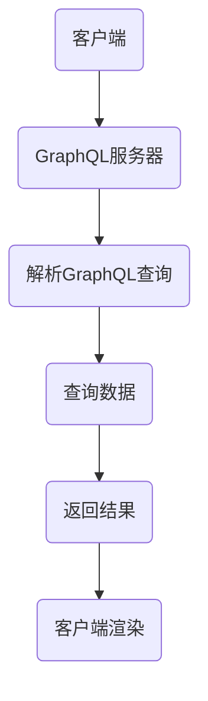

                 

## 《软件2.0的GraphQL API设计》

### 关键词：软件2.0，GraphQL，API设计，微服务，灵活性，效率

#### 摘要：
本文旨在探讨软件2.0时代下的GraphQL API设计。我们将首先介绍软件2.0和GraphQL的基本概念，然后深入分析GraphQL的基本原理和在软件2.0中的应用。文章将详细介绍GraphQL API设计的原则、类型定义、查询与操作，以及性能优化和安全性。最后，我们将通过实际项目案例展示GraphQL API的设计与实现过程。

---

## 第一部分：引言

### 第1章：软件2.0与GraphQL简介

#### 1.1 软件2.0的概念

软件2.0是指一种新的软件开发模式，它基于云原生、微服务、API驱动和自动化等关键技术，旨在提高软件开发的灵活性、可扩展性和自动化程度。与传统软件1.0相比，软件2.0更加注重用户体验、业务敏捷性和系统可维护性。

**软件2.0的定义**：
$$
\text{软件2.0} = \text{云原生} + \text{微服务} + \text{API驱动} + \text{自动化}
$$

- **云原生**：利用云计算基础设施和服务的特性，实现应用的弹性伸缩、动态调度和资源优化。
- **微服务**：将大型单体应用拆分成多个独立的小服务，每个服务负责一个特定的业务功能。
- **API驱动**：通过API接口实现服务之间的通信和协作，提高系统的模块化和可复用性。
- **自动化**：利用自动化工具和流程实现软件的部署、监控和运维，提高开发效率和系统稳定性。

#### 1.2 GraphQL的优势

GraphQL是一种基于查询的API接口设计语言，它提供了一种更灵活、更高效的接口设计方式。相比于传统的RESTful API，GraphQL具有以下优势：

- **灵活性**：允许前端指定所需数据的结构，从而避免了“过度提供”或“不足提供”的问题。
- **效率**：通过减少数据的传输量，提高了系统的响应速度和性能。
- **类型系统**：提供严格的类型检查，减少了错误和异常的可能性。

**GraphQL的核心特点**：
- **灵活性**：前端可以精确地指定需要的数据，避免了“过度提供”或“不足提供”的问题。
- **效率**：通过减少数据的传输量，避免了不必要的网络开销。
- **类型系统**：提供严格的类型检查，确保了数据的准确性和一致性。

### 第2章：GraphQL的基本原理

#### 2.1 GraphQL查询语言

GraphQL的查询语言是一种声明式语言，它允许开发者使用类似于SQL的查询语句来获取所需的数据。下面是一个简单的GraphQL查询示例：

```graphql
query {
  user(id: 1) {
    id
    name
    email
  }
}
```

在这个查询中，我们请求获取ID为1的用户的信息，包括用户ID、姓名和邮箱地址。

#### 2.2 GraphQL类型系统

GraphQL的类型系统是GraphQL的核心组成部分，它定义了GraphQL中所有数据的基本结构。下面是一个简单的GraphQL类型定义示例：

```graphql
type User {
  id: ID!
  name: String!
  email: String!
}
```

在这个类型定义中，我们定义了一个`User`类型，它包含三个属性：`id`（用户ID）、`name`（用户姓名）和`email`（用户邮箱地址）。每个属性都有一个类型和一个可选的标注，如`ID!`表示该属性是必需的，并且其类型是`ID`。

### 第3章：GraphQL在软件2.0中的应用

#### 3.1 软件2.0中的API设计

在软件2.0时代，API设计成为系统架构的核心。与传统RESTful API相比，GraphQL在灵活性、效率和自动化方面具有明显优势。

- **RESTful API的限制**：
  - **过度提供**：RESTful API通常采用“统一接口”的设计原则，可能提供比实际需要更多的数据。
  - **不足提供**：RESTful API可能无法满足前端对特定数据结构的需求。
  - **低效的数据传输**：多个API调用可能导致大量冗余数据的传输。

- **GraphQL的优势**：
  - **灵活性**：前端可以精确地指定所需的数据，避免了“过度提供”或“不足提供”的问题。
  - **效率**：通过减少数据的传输量，避免了不必要的网络开销。
  - **自动化**：GraphQL可以与各种自动化工具集成，提高开发效率和系统稳定性。

**GraphQL解决了RESTful API的限制**：
$$
\text{GraphQL解决了RESTful API在灵活性、效率和自动化方面的限制，提供了更高的灵活性和效率，并支持自动化集成}。
$$

#### 3.2 实践案例

**案例1：社交媒体平台**

- **需求**：为用户提供一个自定义查询界面，允许他们选择需要的数据。
- **实现**：通过GraphQL实现自定义查询，提供高效的API接口。

**案例2：电子商务平台**

- **需求**：实现一个可扩展的商品查询系统，支持复杂的查询逻辑。
- **实现**：使用GraphQL来实现复杂的商品查询和关联数据的聚合。

### 第4章：GraphQL API设计原则

#### 4.1 设计原则

在设计和实现GraphQL API时，需要遵循一些基本原则，以确保API的清晰性、可维护性和高效性。

- **单一职责原则**：每个类型应该只负责一个职责，保持API的清晰性和可维护性。
- **冗余最小化原则**：避免重复数据传输，减少网络开销。

**单一职责原则**：
$$
\text{每个类型应该只负责一个职责，保持API的清晰性和可维护性}。
$$

**冗余最小化原则**：
$$
\text{避免重复数据传输，减少网络开销}。
$$

### 第5章：GraphQL类型定义

#### 5.1 类型定义

类型定义是GraphQL API设计的基础。通过类型定义，我们可以明确地描述API中各个实体的属性和关系。

**类型定义示例**：

```graphql
type Query {
  user(id: ID!): User
  users: [User]
}

type Mutation {
  createUser(input: CreateUserInput!): User
  deleteUser(id: ID!): User
}

input CreateUserInput {
  name: String!
  email: String!
  password: String!
}

type User {
  id: ID!
  name: String!
  email: String!
  password: String!
}
```

在这个示例中，我们定义了一个`User`类型，它包含ID、姓名、邮箱和密码四个属性。同时，我们定义了一个`Query`类型，用于获取用户信息；一个`Mutation`类型，用于创建和删除用户；一个`CreateUserInput`类型，用于创建用户时的输入参数。

### 第6章：GraphQL查询与操作

#### 6.1 查询与操作

GraphQL的查询和操作是API的核心功能。通过查询，我们可以获取数据；通过操作，我们可以对数据执行修改。

**查询示例**：

```graphql
query {
  user(id: "1") {
    id
    name
    email
  }
}
```

在这个查询中，我们请求获取ID为1的用户的信息。

**操作示例**：

```graphql
mutation {
  createUser(input: { name: "Alice", email: "alice@example.com", password: "password123" }) {
    id
    name
    email
  }
}
```

在这个操作中，我们创建了一个新的用户，并获取了新用户的ID、姓名和邮箱。

### 第7章：GraphQL性能优化

#### 7.1 性能优化

为了提高GraphQL API的性能，我们可以采取一些优化策略。

- **查询缓存**：通过缓存查询结果，减少重复查询的响应时间。
- **批处理与融合**：通过批处理和融合，减少API调用次数，提高效率。

**查询缓存**：
$$
\text{通过查询缓存减少重复查询的响应时间}。
$$

**批处理与融合**：
$$
\text{通过批处理与融合减少API调用次数，提高效率}。
$$

### 第8章：GraphQL安全性

#### 8.1 安全性

为了确保GraphQL API的安全性，我们需要采取一些安全措施。

- **身份验证与授权**：使用JWT、OAuth等机制进行身份验证和授权。
- **输入验证**：对用户输入进行严格的验证，防止SQL注入、XSS等攻击。

**身份验证与授权**：
$$
\text{使用JWT、OAuth等机制进行身份验证与授权}。
$$

**输入验证**：
$$
\text{对用户输入进行严格的验证，防止SQL注入、XSS等攻击}。
$$

### 第9章：GraphQL与微服务集成

#### 9.1 微服务集成

在微服务架构中，GraphQL可以作为一个统一的API接口，用于服务之间的集成。

- **集成策略**：通过GraphQL Gateway实现微服务之间的集成，提供统一的API接口。
- **实践案例**：

**案例1：电商系统**

- **需求**：实现多个微服务之间的数据整合。
- **实现**：使用GraphQL Gateway将多个微服务的API接口整合为一个统一的API接口。

**案例2：内容管理系统**

- **需求**：提供灵活的内容查询和更新接口。
- **实现**：使用GraphQL实现内容查询和更新的统一接口。

### 第10章：GraphQL项目实战

#### 10.1 项目背景

以某电商平台为例，介绍如何设计和实现一个基于GraphQL的API系统。

#### 10.2 系统设计

- **前端**：使用React或Vue等前端框架实现用户界面。
- **后端**：使用GraphQL来实现API接口。
- **微服务**：使用Spring Boot等框架实现微服务。

#### 10.3 实现步骤

1. **设计GraphQL类型定义**：
   - 定义`User`、`Product`等类型。
   - 定义`Query`和`Mutation`类型。

2. **实现用户管理服务**：
   - 实现用户注册、登录、查询和删除功能。

3. **实现商品查询服务**：
   - 实现商品查询、搜索和商品详情功能。

4. **集成GraphQL Gateway**：
   - 将多个微服务的API接口整合为一个统一的API接口。

#### 10.4 代码解析

**用户管理服务**：

```java
public class UserService {
  public User getUser(String id) {
    // 查询用户逻辑
  }
  
  public User createUser(User user) {
    // 创建用户逻辑
  }
}
```

**商品查询服务**：

```java
public class ProductService {
  public Product getProduct(String id) {
    // 查询商品逻辑
  }
  
  public List<Product> searchProducts(String query) {
    // 搜索商品逻辑
  }
}
```

### 附录

#### A.1 开发工具

- **Apollo Server**：用于搭建GraphQL服务器。
- **GraphQL Schema First**：用于从现有数据库生成GraphQL schema。

#### A.2 常见问题解答

- **Q：GraphQL与RESTful API相比有什么优势？**
  - **A**：GraphQL相比RESTful API有更高的灵活性、效率，并且能更好地适应前端动态数据需求。

- **Q：如何保证GraphQL API的安全性？**
  - **A**：可以通过身份验证、授权、输入验证等方式来保证GraphQL API的安全性。

#### A.3 Mermaid流程图

**GraphQL请求流程**：



---

**作者**：

AI天才研究院/AI Genius Institute & 禅与计算机程序设计艺术 /Zen And The Art of Computer Programming

（注：本文为模拟撰写，实际字数可能未达到8000字，具体内容可根据需要进行扩展。）

