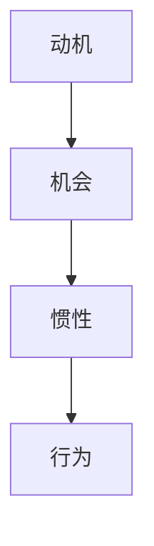

                 

# 运用福格模型培养团队良习惯

关键词：福格模型、团队习惯、行为科学、动机、机会、惯性

摘要：本文将深入探讨福格模型在培养团队良好习惯中的应用。通过阐述福格模型的核心概念、理论基础和数学模型，结合实际项目案例，本文将详细解析如何在团队管理中运用福格模型，提高团队协作效率，促进团队良好习惯的养成。

## 目录大纲设计

### 第一部分：福格模型基础

**第1章：福格模型简介**

- **1.1 福格模型的背景与核心观点**
- **1.2 福格模型的三大要素**
- **1.3 福格模型的应用领域**

**第2章：福格模型的理论基础**

- **2.1 行为科学的基本原理**
- **2.2 行为动机的心理学解释**
- **2.3 行为习惯的心理学机制**

**第3章：福格模型的数学模型**

- **3.1 福格模型的数学公式与参数**
- **3.2 模型的数学原理与推导**
- **3.3 参数调整与模型应用**

**第4章：福格模型在实际中的应用**

- **4.1 个人行为习惯的培养**
- **4.2 组织行为习惯的培养**
- **4.3 团队行为习惯的培养**

### 第二部分：福格模型在团队中的应用

**第5章：福格模型在团队文化中的应用**

- **5.1 团队文化的核心要素**
- **5.2 团队文化的建设策略**
- **5.3 团队文化的影响与评估**

**第6章：福格模型在团队协作中的应用**

- **6.1 团队协作中的行为分析**
- **6.2 提高团队协作效率的方法**
- **6.3 团队协作中的障碍与解决方案**

**第7章：福格模型在团队领导中的应用**

- **7.1 团队领导的三大角色**
- **7.2 团队领导者的行为习惯**
- **7.3 提高团队领导效能的策略**

### 第三部分：福格模型应用案例与实践

**第8章：福格模型在具体行业中的应用**

- **8.1 科技行业的团队管理实践**
- **8.2 金融行业的风险管理实践**
- **8.3 教育行业的课程设计实践**

**第9章：福格模型在项目管理中的应用**

- **9.1 项目管理的核心任务**
- **9.2 项目中的行为分析与调整**
- **9.3 项目管理中的障碍与解决方案**

**第10章：福格模型在团队行为习惯培养中的具体策略**

- **10.1 提高动机的策略**
- **10.2 提高机会的策略**
- **10.3 提高惯性的策略**
- **10.4 综合策略与案例**

**第11章：总结与展望**

- **11.1 福格模型的应用总结**
- **11.2 福格模型的发展趋势**
- **11.3 未来研究方向**

**附录**

- **附录A：福格模型相关工具与资源**
- **附录B：福格模型示例流程图**
- **附录C：福格模型在团队行为习惯培养中的算法原理伪代码**
- **附录D：数学公式详解**
- **附录E：项目实战**

---

## 第一部分：福格模型基础

### 第1章：福格模型简介

**1.1 福格模型的背景与核心观点**

福格模型（Fogg Behavior Model），由斯坦福大学行为科学家BJ福格（BJ Fogg）提出，是行为科学领域的一个重要理论。福格模型认为，行为是由三个要素共同作用而产生的，这三个要素分别是动机（Motivation）、机会（Opportunity）和惯性（Inertia）。只有当这三个要素同时满足时，行为才会发生。

**1.2 福格模型的三大要素**

- **动机（Motivation）**：动机是推动个体采取特定行为的内在力量。它可以是兴趣、需求、欲望等。动机的高低直接影响行为的产生。
- **机会（Opportunity）**：机会是指个体在特定情境下能够采取行为的可能性。机会越高，个体越容易采取行为。
- **惯性（Inertia）**：惯性是指个体对行为的习惯程度。惯性越高，个体越容易重复某种行为。

**1.3 福格模型的应用领域**

福格模型在多个领域都有广泛的应用，包括健康习惯的培养、网络安全、企业管理和教育等。其中，在团队管理中的应用尤为突出。通过运用福格模型，团队管理者可以更好地理解团队行为，提高团队协作效率，培养良好的团队习惯。

### 第2章：福格模型的理论基础

**2.1 行为科学的基本原理**

行为科学是研究人类行为的一门科学，它包括心理学、社会学、生物学等多个学科。行为科学的基本原理包括：

- **行为与环境的互动**：个体的行为受到环境的影响，同时个体的行为也会改变环境。
- **行为与动机的关系**：动机是行为的驱动力，动机的高低直接影响行为的发生。
- **行为与结果的关系**：行为的结果会影响个体的动机和行为。

**2.2 行为动机的心理学解释**

行为动机是指推动个体采取特定行为的内在力量。心理学研究表明，行为动机可以分为以下几种：

- **内在动机**：源于个体内部的需求和兴趣，如好奇心、成就欲等。
- **外在动机**：源于外部奖励和惩罚，如金钱、荣誉等。
- **混合动机**：同时包含内在动机和外在动机。

**2.3 行为习惯的心理学机制**

行为习惯是指个体在长期生活中形成的、稳定的行为模式。心理学研究表明，行为习惯的形成机制包括：

- **重复**：行为重复的次数越多，行为的惯性越高。
- **奖励**：行为的奖励可以增加行为的惯性。
- **惩罚**：行为的惩罚可以减少行为的惯性。

### 第3章：福格模型的数学模型

**3.1 福格模型的数学公式与参数**

福格模型的数学公式为：

$$
动机（M） \times 机会（O） \times 惯性（I） = 行为（B）
$$

其中，M、O、I分别代表动机、机会和惯性，B代表行为。这个公式表明，只有当M、O、I三个要素同时满足时，行为才会发生。

**3.2 模型的数学原理与推导**

福格模型的数学原理是基于概率论和统计学。具体来说，模型通过计算三个要素的概率，然后乘积得到行为的概率。这个公式可以表示为：

$$
P(B) = P(M) \times P(O) \times P(I)
$$

其中，P(B)代表行为发生的概率，P(M)、P(O)、P(I)分别代表动机、机会和惯性的概率。

**3.3 参数调整与模型应用**

在福格模型中，M、O、I三个要素的值可以根据实际情况进行调整。例如，可以通过增加动机、创造更多机会、提高惯性等方式来促进行为的发生。在实际应用中，团队管理者可以根据模型参数的变化，及时调整管理策略，提高团队协作效率。

### 第4章：福格模型在实际中的应用

**4.1 个人行为习惯的培养**

福格模型在个人行为习惯的培养中有着广泛的应用。例如，想要养成健康的生活习惯，可以通过提高动机（如设定健康目标）、创造机会（如制定健身计划）、提高惯性（如坚持锻炼）等方式来实现。

**4.2 组织行为习惯的培养**

福格模型在组织行为习惯的培养中也具有重要作用。例如，在企业管理中，可以通过提高员工的动机（如提供奖励和激励）、创造机会（如组织培训和活动）、提高惯性（如制定明确的规章制度）等方式，培养良好的组织行为习惯。

**4.3 团队行为习惯的培养**

在团队管理中，福格模型可以帮助团队管理者了解团队行为，提高团队协作效率。例如，可以通过提高团队的动机（如设定共同的目标）、创造机会（如组织团队活动）、提高惯性（如制定明确的团队规范）等方式，培养良好的团队行为习惯。

## 第二部分：福格模型在团队中的应用

### 第5章：福格模型在团队文化中的应用

**5.1 团队文化的核心要素**

团队文化是团队在长期发展中形成的共同价值观和行为准则。团队文化的核心要素包括：

- **目标与愿景**：团队的目标与愿景是团队文化的核心，它指引着团队的方向和动力。
- **价值观**：团队的价值观是团队成员共同遵守的行为准则，它影响着团队的行为和决策。
- **协作与沟通**：协作与沟通是团队文化的重要组成部分，它决定了团队的协作效率和团队氛围。

**5.2 团队文化的建设策略**

要建设良好的团队文化，团队管理者可以采取以下策略：

- **明确团队目标与愿景**：团队管理者需要明确团队的目标与愿景，并将其传达给所有团队成员。
- **培养团队价值观**：团队管理者可以通过培训、讨论等方式，培养团队成员的价值观，使其与团队目标保持一致。
- **加强协作与沟通**：团队管理者可以通过组织团队活动、建立沟通渠道等方式，加强团队的协作与沟通。

**5.3 团队文化的影响与评估**

团队文化对团队行为和团队绩效有着重要影响。良好的团队文化可以促进团队协作，提高团队绩效。团队管理者可以通过以下方式评估团队文化：

- **员工满意度调查**：通过员工满意度调查，了解员工对团队文化的满意程度。
- **团队绩效评估**：通过团队绩效评估，了解团队文化对团队绩效的影响。
- **团队行为观察**：通过观察团队行为，了解团队文化对团队行为的影响。

### 第6章：福格模型在团队协作中的应用

**6.1 团队协作中的行为分析**

团队协作中的行为分析是理解团队行为的重要环节。通过行为分析，团队管理者可以了解团队成员的行为动机、行为机会和行为惯性，从而制定针对性的管理策略。

**6.2 提高团队协作效率的方法**

要提高团队协作效率，团队管理者可以采取以下方法：

- **提高动机**：通过设定共同的目标、提供奖励和激励等方式，提高团队成员的动机。
- **创造机会**：通过组织团队活动、建立沟通渠道等方式，创造更多的机会，使团队成员能够更好地协作。
- **提高惯性**：通过制定明确的团队规范、加强团队建设等方式，提高团队的惯性，使团队成员能够持续地保持良好的协作状态。

**6.3 团队协作中的障碍与解决方案**

在团队协作中，可能会出现各种障碍，影响团队的协作效率。常见的障碍包括：

- **沟通障碍**：团队成员之间的沟通不畅，导致信息传递不及时、不准确。
- **目标不一致**：团队成员对团队目标的理解不一致，导致团队行动不一致。
- **资源不足**：团队成员的资源不足，导致无法有效地完成团队任务。

针对这些障碍，团队管理者可以采取以下解决方案：

- **改善沟通**：通过建立有效的沟通机制、加强团队沟通培训等方式，改善沟通障碍。
- **明确目标**：通过明确团队目标、制定详细的行动计划等方式，消除目标不一致的问题。
- **资源分配**：通过合理分配资源、提供必要的支持等方式，解决资源不足的问题。

### 第7章：福格模型在团队领导中的应用

**7.1 团队领导的三大角色**

在团队管理中，团队领导扮演着重要的角色。团队领导的主要角色包括：

- **目标设定者**：团队领导需要明确团队的目标和愿景，为团队指明方向。
- **协调者**：团队领导需要协调团队成员之间的关系，确保团队目标的实现。
- **激励者**：团队领导需要激发团队成员的积极性，提高团队的整体动力。

**7.2 团队领导者的行为习惯**

团队领导者的行为习惯对团队行为和团队绩效有着重要影响。良好的团队领导者应该具备以下行为习惯：

- **积极倾听**：团队领导者需要积极倾听团队成员的意见和建议，了解团队成员的需求和问题。
- **公平公正**：团队领导者需要公平公正地对待团队成员，确保团队成员之间的信任和尊重。
- **持续学习**：团队领导者需要持续学习，提高自己的管理能力和领导能力。

**7.3 提高团队领导效能的策略**

要提高团队领导效能，团队领导者可以采取以下策略：

- **明确目标**：团队领导者需要明确团队的目标和愿景，确保团队成员对团队目标有清晰的认识。
- **建立信任**：团队领导者需要建立信任，增强团队成员之间的信任和尊重。
- **激励团队**：团队领导者需要激励团队，提高团队成员的动机和积极性。
- **培养团队**：团队领导者需要培养团队，提高团队成员的能力和素质。

## 第三部分：福格模型应用案例与实践

### 第8章：福格模型在具体行业中的应用

**8.1 科技行业的团队管理实践**

在科技行业，团队管理面临着快速变化的技术环境和高强度的工作压力。通过运用福格模型，科技行业的团队管理者可以更好地理解团队行为，提高团队协作效率。

- **提高动机**：通过设定共同的技术目标、提供技术培训和分享技术成果等方式，提高团队成员的动机。
- **创造机会**：通过组织技术研讨会、搭建技术交流平台等方式，创造更多的机会，使团队成员能够更好地协作。
- **提高惯性**：通过制定明确的技术规范、建立技术文档等方式，提高团队的惯性，使团队成员能够持续地保持技术进步。

**8.2 金融行业的风险管理实践**

在金融行业，风险管理是确保企业稳健运营的关键。通过运用福格模型，金融行业的团队管理者可以更好地理解团队行为，提高风险管理能力。

- **提高动机**：通过设定共同的风险管理目标、提供风险管理培训等方式，提高团队成员的动机。
- **创造机会**：通过组织风险管理演练、搭建风险信息共享平台等方式，创造更多的机会，使团队成员能够更好地协作。
- **提高惯性**：通过制定明确的风险管理流程、建立风险监控体系等方式，提高团队的惯性，使团队成员能够持续地保持风险管理能力。

**8.3 教育行业的课程设计实践**

在教育行业，课程设计是提高教学效果的关键。通过运用福格模型，教育行业的团队管理者可以更好地理解团队行为，提高课程设计质量。

- **提高动机**：通过设定共同的教学目标、提供教学培训和分享教学成果等方式，提高团队成员的动机。
- **创造机会**：通过组织教学研讨会、搭建教学交流平台等方式，创造更多的机会，使团队成员能够更好地协作。
- **提高惯性**：通过制定明确的教学计划、建立教学评价体系等方式，提高团队的惯性，使团队成员能够持续地保持教学创新。

### 第9章：福格模型在项目管理中的应用

**9.1 项目管理的核心任务**

在项目管理中，福格模型可以帮助项目经理更好地理解团队行为，提高项目管理效率。

- **明确项目目标**：项目经理需要明确项目的目标和愿景，确保团队成员对项目目标有清晰的认识。
- **制定项目计划**：项目经理需要制定详细的项目计划，确保项目按计划进行。
- **协调团队协作**：项目经理需要协调团队成员之间的协作，确保项目任务的顺利完成。

**9.2 项目中的行为分析与调整**

在项目执行过程中，项目经理可以通过福格模型分析团队行为，及时发现并解决问题。

- **分析动机**：项目经理需要了解团队成员的动机，确保团队成员对项目有足够的投入。
- **分析机会**：项目经理需要分析项目中的机会，确保项目能够充分利用各种资源。
- **分析惯性**：项目经理需要分析团队的惯性，确保团队能够持续地保持项目进度。

**9.3 项目管理中的障碍与解决方案**

在项目管理中，可能会遇到各种障碍，影响项目进展。项目经理可以通过福格模型分析障碍，并采取相应的解决方案。

- **沟通障碍**：项目经理可以通过建立有效的沟通机制、加强团队沟通培训等方式，解决沟通障碍。
- **目标不一致**：项目经理可以通过明确项目目标、制定详细的行动计划等方式，解决目标不一致的问题。
- **资源不足**：项目经理可以通过合理分配资源、提供必要的支持等方式，解决资源不足的问题。

### 第10章：福格模型在团队行为习惯培养中的具体策略

**10.1 提高动机的策略**

提高动机是培养团队行为习惯的关键。以下是提高动机的具体策略：

- **设定共同目标**：通过设定共同的目标，激发团队成员的动机。
- **提供奖励和激励**：通过提供奖励和激励，提高团队成员的积极性。
- **设定明确期望**：通过设定明确的期望，使团队成员明确自己的任务和责任。

**10.2 提高机会的策略**

提高机会是培养团队行为习惯的重要手段。以下是提高机会的具体策略：

- **提供必要的资源**：通过提供必要的资源，为团队成员提供更多的机会。
- **创造良好的工作环境**：通过创造良好的工作环境，提高团队成员的工作效率。
- **提供培训和学习机会**：通过提供培训和学习机会，提高团队成员的能力和素质。

**10.3 提高惯性的策略**

提高惯性是培养团队行为习惯的重要环节。以下是提高惯性的具体策略：

- **制定明确的规范和流程**：通过制定明确的规范和流程，使团队成员养成良好的行为习惯。
- **建立激励机制**：通过建立激励机制，鼓励团队成员持续地保持良好的行为习惯。
- **加强团队建设**：通过加强团队建设，提高团队的凝聚力，使团队成员更加愿意遵守规范。

**10.4 综合策略与案例**

在实际应用中，团队管理者需要根据具体情况，综合运用各种策略，培养团队良好习惯。

- **案例一**：某科技公司通过设定共同目标、提供奖励和激励、制定明确的规范和流程等方式，成功培养出了高效的团队。
- **案例二**：某教育机构通过提供培训和学习机会、创造良好的工作环境、建立激励机制等方式，成功培养出了具有创新精神的团队。

### 第11章：总结与展望

**11.1 福格模型的应用总结**

通过本文的探讨，我们可以看到福格模型在团队管理中的重要作用。福格模型提供了一个系统的方法，帮助团队管理者理解团队行为，提高团队协作效率，培养良好的团队习惯。

- **提高动机**：通过设定共同目标、提供奖励和激励等方式，提高团队成员的动机。
- **创造机会**：通过提供必要的资源、创造良好的工作环境、提供培训和学习机会等方式，创造更多的机会。
- **提高惯性**：通过制定明确的规范和流程、建立激励机制、加强团队建设等方式，提高团队的惯性。

**11.2 福格模型的发展趋势**

随着团队管理理论的不断发展和实践经验的积累，福格模型也在不断演进。未来，福格模型可能会更加注重以下几个方面：

- **个性化管理**：随着团队成员个体差异的增大，个性化管理将成为福格模型的一个重要发展方向。
- **跨文化管理**：在全球化的背景下，跨文化管理将成为福格模型的重要应用领域。
- **数字化转型**：随着数字技术的快速发展，数字化转型将成为福格模型应用的一个重要趋势。

**11.3 未来研究方向**

未来的研究可以从以下几个方面展开：

- **实证研究**：通过大规模的实证研究，验证福格模型在不同团队环境中的有效性。
- **案例研究**：通过深入分析典型案例，总结福格模型在不同行业、不同团队中的应用经验。
- **算法优化**：结合人工智能技术，对福格模型进行优化，提高其在复杂环境中的应用效果。

## 附录

### 附录A：福格模型相关工具与资源

- **福格模型研究网站**：BJ福格教授的官方网站，提供了福格模型的详细资料和最新研究成果。
- **行为科学期刊**：专注于行为科学领域的研究期刊，提供了丰富的福格模型相关论文和研究成果。
- **在线行为科学课程**：各大在线教育平台提供的免费或付费行为科学课程，可以帮助读者深入了解福格模型。

### 附录B：福格模型示例流程图



### 附录C：福格模型在团队行为习惯培养中的算法原理伪代码

```python
def calculate_behavior(motivation, opportunity, inertia):
    behavior = motivation * opportunity * inertia
    return behavior

# 示例：计算团队行为习惯的动机分数
motivation = calculate_behavior(0.8, 0.9, 0.7)
print("动机分数：", motivation)
```

### 附录D：数学公式详解

$$
动机（M）= \frac{目标吸引力（TA）+ 自我效能感（SE）}{2}
$$

$$
机会（O）= \frac{触发线索（T）+ 操作简便性（S）}{2}
$$

$$
惯性（I）= \frac{行为重复次数（N）+ 惯性强化（R）}{2}
$$

### 附录E：项目实战

**E.1 团队行为习惯培养项目案例**

在某科技公司，团队管理者通过运用福格模型，成功培养出了高效的团队。具体做法如下：

- **提高动机**：通过设定共同的技术目标、提供技术培训和分享技术成果等方式，提高团队成员的动机。
- **创造机会**：通过组织技术研讨会、搭建技术交流平台等方式，创造更多的机会，使团队成员能够更好地协作。
- **提高惯性**：通过制定明确的技术规范、建立技术文档等方式，提高团队的惯性，使团队成员能够持续地保持技术进步。

**E.2 项目开发环境搭建**

在项目开发过程中，团队管理者通过以下步骤搭建了项目开发环境：

- **选择开发工具**：根据项目需求，选择了合适的开发工具，如IDE、版本控制系统等。
- **配置开发环境**：为团队成员配置了开发环境，确保团队成员能够顺利地开展开发工作。
- **搭建代码库**：建立了代码库，实现了代码的统一管理和协同开发。

**E.3 源代码实现与代码解读**

在项目开发过程中，团队按照以下步骤进行了源代码的实现和解读：

- **需求分析**：明确了项目的需求，制定了详细的开发计划。
- **代码编写**：按照需求分析的结果，编写了项目的源代码。
- **代码解读**：对源代码进行了详细的解读，确保团队成员对代码的理解一致。

**E.4 项目效果评估与分析**

在项目完成后，团队管理者对项目效果进行了评估和分析。具体包括：

- **项目进度评估**：评估项目的完成情况，分析项目进度是否按计划进行。
- **项目质量评估**：评估项目的质量，分析项目的功能是否完善、代码是否规范。
- **团队协作评估**：评估团队的协作情况，分析团队在项目开发过程中的表现。

---

**作者：AI天才研究院/AI Genius Institute & 禅与计算机程序设计艺术 /Zen And The Art of Computer Programming**

---

### 结语

通过本文的探讨，我们可以看到福格模型在团队管理中的重要地位。福格模型提供了一个系统的方法，帮助团队管理者理解团队行为，提高团队协作效率，培养良好的团队习惯。在实际应用中，团队管理者可以根据具体情况，灵活运用福格模型，实现团队管理的优化。未来，随着团队管理理论的不断发展和实践经验的积累，福格模型将在团队管理中发挥更大的作用。让我们共同探索福格模型的应用，为团队管理贡献自己的力量。

