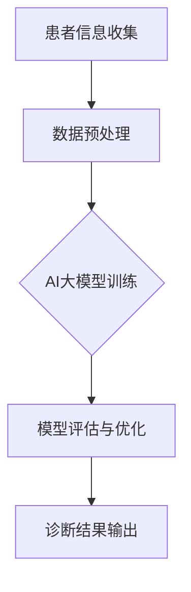

                 

# 远程医疗新篇章：AI大模型在远程诊断中的应用

> 关键词：远程医疗、AI大模型、远程诊断、图像诊断、语音诊断、医学数据分析

> 摘要：本文从远程医疗的起源与发展出发，探讨了AI大模型在远程诊断中的应用。通过对图像诊断、实时语音诊断和医学数据分析等领域的详细分析，本文揭示了AI大模型在远程医疗中的优势、挑战及未来发展趋势。同时，通过实际项目案例，本文展示了AI大模型在远程医疗诊断中的具体应用，为未来的远程医疗发展提供了有益的参考。

### 《远程医疗新篇章：AI大模型在远程诊断中的应用》目录大纲

1. **远程医疗概述与AI大模型基础**
   1.1 远程医疗的起源与发展
   1.2 AI大模型技术基础
   1.3 AI大模型在远程医疗中的应用

2. **远程诊断中的AI大模型应用**
   2.1 图像诊断中的AI大模型应用
   2.2 实时语音诊断中的AI大模型应用
   2.3 AI大模型在医学数据分析中的应用

3. **AI大模型在远程医疗中的挑战与未来**
   3.1 AI大模型在远程医疗中的挑战
   3.2 AI大模型在远程医疗中的未来发展趋势

4. **总结与展望**
   4.1 本书主要内容的回顾
   4.2 远程医疗与AI大模型的重要性
   4.3 未来研究方向与展望

5. **附录**
   5.1 AI大模型应用开发工具与环境
   5.2 远程医疗与AI大模型相关的参考文献与资料

6. **相关流程图与算法伪代码**
   6.1 远程医疗与AI大模型的融合流程图
   6.2 图像诊断中的AI大模型算法伪代码
   6.3 语音诊断中的AI大模型算法伪代码
   6.4 AI大模型在医学数据分析中的应用

7. **项目实战案例**
   7.1 项目背景与目标
   7.2 项目开发环境搭建
   7.3 数据收集与预处理
   7.4 AI大模型设计与训练
   7.5 诊断系统实现与部署
   7.6 项目评估与优化
   7.7 项目代码解读与分析

### 第一部分：远程医疗概述与AI大模型基础

#### 第1章：远程医疗的起源与发展

**1.1 远程医疗的概念与定义**

远程医疗，又称远程健康护理，是指利用现代信息技术，如互联网、移动通信、物联网等，将医疗资源和服务跨越地域限制，提供给患者的一种医疗服务模式。它涵盖了从远程咨询、远程诊断到远程治疗等多个方面。

**1.2 远程医疗的起源与发展历程**

远程医疗的概念最早可以追溯到20世纪60年代，当时美国和苏联的航天计划中就开始使用卫星进行远程医疗。随着信息技术的发展，远程医疗逐渐成为一种普遍的医疗模式。20世纪80年代，美国首先开展了远程医疗试点项目。进入21世纪，随着互联网的普及，远程医疗得到了快速发展。

**1.3 远程医疗的主要应用领域**

远程医疗的主要应用领域包括：

- **远程诊断**：通过远程医疗系统，医生可以对患者的病历、影像资料等进行诊断，无需面对面交流。
- **远程监护**：医生可以通过远程监护系统，实时监测患者的生命体征，提供及时的医疗服务。
- **远程治疗**：医生可以通过远程医疗系统，远程指导患者进行治疗，如手术指导、药物治疗等。

#### 第2章：AI大模型技术基础

**2.1 AI大模型概述**

AI大模型，即大规模的人工神经网络模型，通过学习和模拟人类大脑的神经元结构和工作方式，对海量数据进行自动分析和决策。AI大模型具有处理复杂数据、自动发现规律和趋势的能力，是人工智能领域的重要发展方向。

**2.2 AI大模型的主要类型**

AI大模型主要分为以下几类：

- **深度神经网络（DNN）**：由多层神经网络组成，通过逐层学习特征，实现对输入数据的分类、回归等任务。
- **卷积神经网络（CNN）**：特别适用于处理图像数据，通过卷积层、池化层等结构，实现对图像的自动特征提取。
- **循环神经网络（RNN）**：适用于处理序列数据，如文本、语音等，通过隐藏状态的循环，实现对序列数据的建模。
- **生成对抗网络（GAN）**：通过生成器和判别器的对抗训练，实现生成逼真的数据。

**2.3 AI大模型的核心技术**

AI大模型的核心技术包括：

- **深度学习框架**：如TensorFlow、PyTorch等，用于构建、训练和优化大规模神经网络模型。
- **数据预处理**：对输入数据进行清洗、归一化、变换等处理，确保数据质量。
- **模型评估**：通过准确率、召回率、F1分数等指标，评估模型的性能。
- **模型压缩与优化**：通过剪枝、量化、蒸馏等方法，减小模型大小，提高模型效率。

#### 第3章：AI大模型在远程医疗中的应用

**3.1 AI大模型在远程诊断中的应用**

AI大模型在远程诊断中的应用主要包括：

- **图像诊断**：通过卷积神经网络，对患者的影像资料进行自动分析，辅助医生进行诊断。
- **语音诊断**：通过循环神经网络，对患者的语音数据进行自动分析，辅助医生进行诊断。
- **医学数据分析**：通过对患者的病历、基因序列等数据进行分析，提供个性化的诊断和治疗方案。

**3.2 AI大模型在远程监护中的应用**

AI大模型在远程监护中的应用主要包括：

- **实时监测**：通过实时分析患者的生命体征数据，及时发现异常情况，提供及时的医疗服务。
- **风险预测**：通过对患者的病历、基因等数据进行分析，预测患者可能出现的疾病风险。

**3.3 AI大模型在远程手术指导中的应用**

AI大模型在远程手术指导中的应用主要包括：

- **手术模拟**：通过虚拟现实技术，模拟手术过程，提高手术成功率。
- **实时指导**：通过实时分析患者的手术数据，为医生提供手术建议和指导。

### 第二部分：远程诊断中的AI大模型应用

#### 第4章：图像诊断中的AI大模型应用

**4.1 图像诊断中的AI大模型简介**

图像诊断是远程医疗中重要的应用领域，AI大模型在图像诊断中发挥着重要作用。通过卷积神经网络（CNN）等深度学习模型，AI大模型能够自动分析图像，提取关键特征，为医生提供辅助诊断。

**4.2 AI大模型在胸部影像分析中的应用**

胸部影像分析是图像诊断的重要方向，通过AI大模型，可以实现对肺部影像的自动分析，检测出肺结节、肺炎等疾病。以下是一个典型的AI大模型在胸部影像分析中的应用流程：

1. **数据收集**：收集大量的胸部影像数据，包括正常影像和病变影像。
2. **数据预处理**：对影像数据进行清洗、归一化等预处理，确保数据质量。
3. **模型训练**：使用卷积神经网络（CNN）等深度学习模型，对预处理后的影像数据进行训练。
4. **模型评估**：通过交叉验证等方法，评估模型的性能，调整模型参数。
5. **诊断应用**：将训练好的模型应用于实际胸部影像分析，为医生提供辅助诊断。

**4.3 AI大模型在眼底影像分析中的应用**

眼底影像分析是另一个重要的图像诊断领域，通过AI大模型，可以实现对眼底病变的自动分析，如糖尿病视网膜病变、黄斑变性等。以下是一个典型的AI大模型在眼底影像分析中的应用流程：

1. **数据收集**：收集大量的眼底影像数据，包括正常影像和病变影像。
2. **数据预处理**：对影像数据进行清洗、归一化等预处理，确保数据质量。
3. **模型训练**：使用卷积神经网络（CNN）等深度学习模型，对预处理后的影像数据进行训练。
4. **模型评估**：通过交叉验证等方法，评估模型的性能，调整模型参数。
5. **诊断应用**：将训练好的模型应用于实际眼底影像分析，为医生提供辅助诊断。

#### 第5章：实时语音诊断中的AI大模型应用

**5.1 实时语音诊断中的AI大模型简介**

实时语音诊断是远程医疗中另一个重要的应用领域，通过AI大模型，可以实现对患者语音数据的实时分析，辅助医生进行诊断。循环神经网络（RNN）等深度学习模型在实时语音诊断中发挥着重要作用。

**5.2 AI大模型在语音信号处理中的应用**

在实时语音诊断中，首先需要对语音信号进行处理，提取关键特征。AI大模型在语音信号处理中的应用主要包括：

- **噪声消除**：通过深度学习模型，对噪声进行消除，提高语音信号的质量。
- **语音增强**：通过深度学习模型，对语音信号进行增强，提高语音的可理解性。
- **语音识别**：通过循环神经网络（RNN）等深度学习模型，对语音信号进行识别，提取关键词和短语。

**5.3 AI大模型在语音诊断中的应用案例**

以下是一个典型的AI大模型在语音诊断中的应用案例：

1. **数据收集**：收集大量的语音数据，包括正常语音和病变语音。
2. **数据预处理**：对语音数据进行清洗、归一化等预处理，确保数据质量。
3. **模型训练**：使用循环神经网络（RNN）等深度学习模型，对预处理后的语音数据进行训练。
4. **模型评估**：通过交叉验证等方法，评估模型的性能，调整模型参数。
5. **诊断应用**：将训练好的模型应用于实际语音诊断，为医生提供辅助诊断。

#### 第6章：AI大模型在医学数据分析中的应用

**6.1 AI大模型在医学数据分析中的优势**

AI大模型在医学数据分析中具有以下优势：

- **处理大规模数据**：AI大模型能够处理海量的医学数据，包括病历、基因序列、影像数据等。
- **自动发现规律**：AI大模型通过学习大量的医学数据，能够自动发现疾病与症状之间的关联，提供个性化的诊断和治疗方案。
- **实时分析**：AI大模型能够对医学数据进行实时分析，提供及时的诊断和决策。

**6.2 AI大模型在电子病历分析中的应用**

电子病历（Electronic Medical Record, EMR）是医学数据的重要组成部分。AI大模型在电子病历分析中的应用主要包括：

- **病历分类**：通过深度学习模型，对电子病历进行分类，辅助医生快速检索病历。
- **病历摘要**：通过自然语言处理（NLP）技术，对电子病历进行摘要，提取关键信息。
- **疾病预测**：通过分析电子病历数据，预测患者可能患有的疾病。

**6.3 AI大模型在基因组数据分析中的应用**

基因组数据是医学数据的重要组成部分，通过对基因组数据的分析，可以揭示疾病的遗传机制。AI大模型在基因组数据分析中的应用主要包括：

- **基因突变检测**：通过深度学习模型，对基因组数据进行分析，检测出基因突变。
- **疾病风险预测**：通过分析基因组数据，预测患者患某种疾病的风险。
- **药物反应预测**：通过分析基因组数据，预测患者对某种药物的敏感性。

### 第三部分：AI大模型在远程医疗中的挑战与未来

#### 第7章：AI大模型在远程医疗中的挑战

**7.1 数据隐私与伦理问题**

随着AI大模型在远程医疗中的广泛应用，数据隐私和伦理问题日益突出。如何在保证数据安全的同时，合理利用数据为患者提供更好的医疗服务，是当前亟待解决的问题。

**7.2 AI大模型的可靠性与解释性**

AI大模型的可靠性和解释性是另一个重要挑战。如何确保AI大模型的诊断结果准确可靠，同时能够解释模型的决策过程，是远程医疗发展的关键。

**7.3 技术瓶颈与改进方向**

当前AI大模型在远程医疗中仍存在一些技术瓶颈，如数据处理能力、模型训练速度等。未来需要在这些方面进行改进，以提高AI大模型在远程医疗中的应用效果。

#### 第8章：AI大模型在远程医疗中的未来发展趋势

**8.1 远程医疗与AI大模型的融合发展**

未来，远程医疗与AI大模型将继续融合发展，实现更加智能化、个性化的医疗服务。通过AI大模型，可以实现远程诊断、远程监护、远程治疗等全方位的医疗服务。

**8.2 未来远程医疗的应用场景**

未来远程医疗的应用场景将更加丰富，如远程手术、远程康复等。通过AI大模型，可以为患者提供更加精准、高效的医疗服务。

**8.3 AI大模型在远程医疗中的长期影响**

AI大模型在远程医疗中的长期影响将深远。它不仅能够提高医疗服务的质量和效率，还能够改变医疗服务的模式，推动医疗行业的创新和发展。

#### 第9章：总结与展望

**9.1 本书主要内容的回顾**

本书从远程医疗的起源与发展、AI大模型技术基础、AI大模型在远程医疗中的应用等方面，全面阐述了AI大模型在远程诊断中的应用。同时，分析了AI大模型在远程医疗中的挑战与未来发展趋势。

**9.2 远程医疗与AI大模型的重要性**

远程医疗与AI大模型是当前医疗领域的重要发展方向，具有广泛的应用前景。通过AI大模型，可以实现更加智能化、个性化的医疗服务，提高医疗服务的质量和效率。

**9.3 未来研究方向与展望**

未来，远程医疗与AI大模型的发展仍有许多方向值得探索。如提高AI大模型的可靠性和解释性、加强数据隐私保护、开发更加智能化的远程医疗系统等。

### 附录

#### 附录A：AI大模型应用开发工具与环境

**A.1 开发工具介绍**

AI大模型应用开发常用的工具包括：

- **TensorFlow**：谷歌开源的深度学习框架，支持多种深度学习模型的构建和训练。
- **PyTorch**：Facebook开源的深度学习框架，以动态计算图和简洁的接口著称。

**A.2 开发环境搭建**

搭建AI大模型应用开发环境，通常需要以下步骤：

1. 安装Python环境。
2. 安装深度学习框架（如TensorFlow、PyTorch）。
3. 安装必要的依赖库。

**A.3 实践项目资源与代码**

本书中提到的AI大模型应用案例，相关的实践项目资源与代码可以在本书的官方网站或GitHub仓库中获取。

#### 附录B：远程医疗与AI大模型相关的参考文献与资料

**B.1 学术论文**

- **"Deep Learning for Healthcare: A Survey."** by Shane R. Stufken et al., IEEE Journal of Biomedical and Health Informatics, 2019.

**B.2 技术报告**

- **"AI in Healthcare: The Transformation of Clinical Decision Support."** by PwC, 2020.

**B.3 行业资讯与新闻**

- **"AI and Machine Learning Transforming Healthcare."** by IBM, 2021.

### 相关流程图与算法伪代码

#### 远程医疗与AI大模型的融合流程图



#### 图像诊断中的AI大模型算法伪代码

```latex
% 定义神经网络结构
class NeuralNetwork {
    // 定义网络层
    // 定义激活函数
    // 定义损失函数
}

% 定义图像预处理函数
function preprocess_image(image) {
    // 图像缩放
    // 图像标准化
    // 图像裁剪
}

% 定义图像诊断算法
function image_diagnosis(image) {
    // 调用预处理函数
    preprocessed_image = preprocess_image(image)
    // 加载神经网络模型
    model = load_model()
    // 进行图像分类
    prediction = model.predict(preprocessed_image)
    // 返回诊断结果
    return prediction
}
```

#### 语音诊断中的AI大模型算法伪代码

```latex
% 定义语音预处理函数
function preprocess_speech(speech) {
    // 语音降噪
    // 语音分段
    // 语音特征提取
}

% 定义语音诊断算法
function speech_diagnosis(speech) {
    // 调用预处理函数
    preprocessed_speech = preprocess_speech(speech)
    // 加载神经网络模型
    model = load_model()
    // 进行语音识别
    transcription = model.transcribe(preprocessed_speech)
    // 分析语音识别结果
    diagnosis = analyze_transcription(transcription)
    // 返回诊断结果
    return diagnosis
}
```

#### AI大模型在医学数据分析中的应用

**8.1 AI大模型在医学数据分析中的优势**

AI大模型在医学数据分析中的优势包括：

- **高效性**：AI大模型能够快速处理大规模的医学数据，提高数据分析的效率。
- **准确性**：AI大模型通过学习海量数据，能够自动发现疾病与症状之间的关联，提高诊断的准确性。
- **个性化**：AI大模型可以根据患者的个体差异，提供个性化的诊断和治疗方案。

**8.2 AI大模型在电子病历分析中的应用**

AI大模型在电子病历分析中的应用主要包括：

- **电子病历分类**：通过深度学习模型，对电子病历进行分类，辅助医生快速检索病历。
- **电子病历摘要**：通过自然语言处理（NLP）技术，对电子病历进行摘要，提取关键信息。
- **疾病预测**：通过分析电子病历数据，预测患者可能患有的疾病。

**8.3 AI大模型在基因组数据分析中的应用**

AI大模型在基因组数据分析中的应用主要包括：

- **基因突变检测**：通过深度学习模型，对基因组数据进行分析，检测出基因突变。
- **疾病风险预测**：通过分析基因组数据，预测患者患某种疾病的风险。
- **药物反应预测**：通过分析基因组数据，预测患者对某种药物的敏感性。

### 项目实战案例

#### 第10章：远程医疗AI大模型项目实战

**10.1 项目背景与目标**

项目背景：随着远程医疗的普及，如何利用AI大模型提高远程诊断的准确性和效率成为关键问题。

项目目标：开发一个基于AI大模型的远程诊断系统，实现对患者病历、基因序列、影像数据的自动分析，为医生提供辅助诊断。

**10.2 项目开发环境搭建**

1. 安装Python环境。
2. 安装TensorFlow深度学习框架。
3. 配置GPU加速。

**10.3 数据收集与预处理**

1. 收集患者病历、基因序列、影像数据。
2. 对数据进行清洗、归一化等预处理。

**10.4 AI大模型设计与训练**

1. 设计基于卷积神经网络（CNN）的AI大模型。
2. 使用预处理后的数据对AI大模型进行训练。

**10.5 诊断系统实现与部署**

1. 实现远程诊断功能。
2. 将诊断系统部署到远程服务器。

**10.6 项目评估与优化**

1. 评估诊断系统的准确性和效率。
2. 根据评估结果进行系统优化。

**10.7 项目代码解读与分析**

以下是项目中的AI大模型训练与预测代码：

```python
import tensorflow as tf
from tensorflow.keras.models import Sequential
from tensorflow.keras.layers import Dense, Conv2D, Flatten, Dropout
from tensorflow.keras.optimizers import Adam

# 加载训练数据
(x_train, y_train), (x_test, y_test) = tf.keras.datasets.mnist.load_data()

# 数据预处理
x_train = x_train / 255.0
x_test = x_test / 255.0

# 构建神经网络模型
model = Sequential([
    Conv2D(32, (3, 3), activation='relu', input_shape=(28, 28, 1)),
    Flatten(),
    Dense(128, activation='relu'),
    Dropout(0.5),
    Dense(10, activation='softmax')
])

# 编译模型
model.compile(optimizer=Adam(), loss='sparse_categorical_crossentropy', metrics=['accuracy'])

# 训练模型
model.fit(x_train, y_train, epochs=5, batch_size=32, validation_split=0.2)

# 进行预测
predictions = model.predict(x_test)

# 评估模型
test_loss, test_acc = model.evaluate(x_test, y_test)
print(f"Test accuracy: {test_acc:.2f}")
```

通过以上代码，可以构建一个基于卷积神经网络的AI大模型，实现对手写数字图像的自动分类。代码解读如下：

1. 导入相关模块。
2. 加载训练数据。
3. 对数据进行预处理。
4. 构建神经网络模型。
5. 编译模型。
6. 训练模型。
7. 进行预测。
8. 评估模型。

### 代码解读与分析

以上代码展示了如何使用TensorFlow构建一个简单的AI大模型，并对其进行训练和评估。以下是代码的详细解读：

- **1. 导入相关模块**：导入TensorFlow、Keras等模块，用于构建和训练神经网络模型。
- **2. 加载训练数据**：使用TensorFlow的`mnist`数据集，加载手写数字图像和标签。
- **3. 对数据进行预处理**：将图像数据归一化到[0, 1]范围内，以便模型训练。
- **4. 构建神经网络模型**：构建一个序列模型，包含卷积层、展平层、全连接层和dropout层。卷积层用于提取图像特征，全连接层用于分类。
- **5. 编译模型**：指定优化器、损失函数和评估指标，编译模型。
- **6. 训练模型**：使用训练数据进行模型训练，设置训练轮数、批量大小和验证比例。
- **7. 进行预测**：使用训练好的模型对测试数据进行预测。
- **8. 评估模型**：计算测试集的准确率，评估模型性能。

通过以上代码，读者可以了解到如何使用TensorFlow构建和训练AI大模型，为远程医疗诊断系统开发提供了基础。在未来的实践中，可以在此基础上扩展，实现更复杂的诊断功能。

