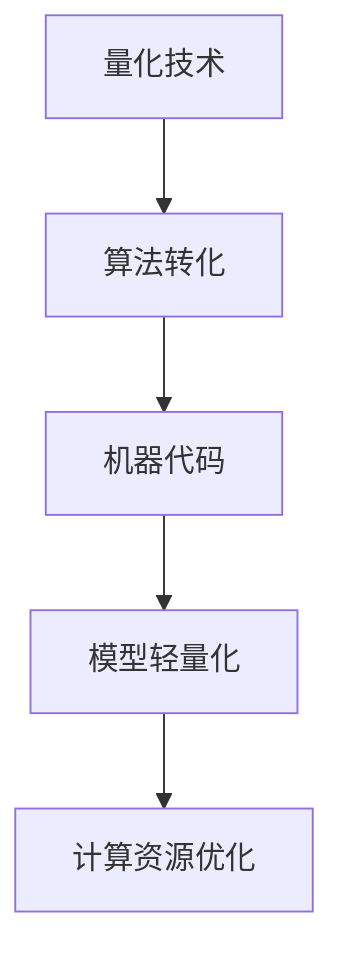
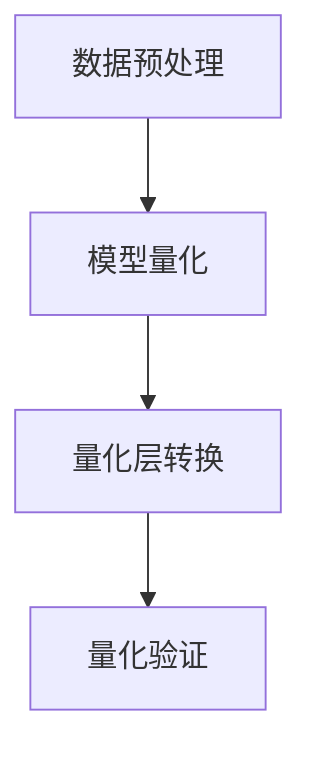
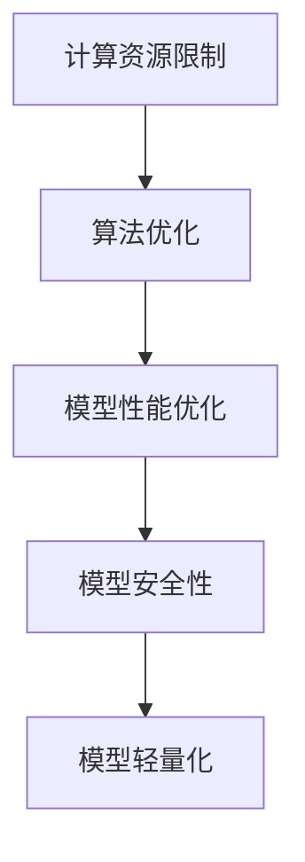

                 

### 1.1 量化技术与AI模型轻量化的背景与意义

量化技术（Quantization Technology）是指将传统算法转化为可执行机器代码的过程，这一过程在人工智能（Artificial Intelligence, AI）领域尤为重要。随着深度学习（Deep Learning）的兴起，AI模型的复杂性不断增加，从而导致计算资源的消耗显著上升。为了解决这一问题，AI模型的轻量化（AI Model Lightweighting）成为了一个热门的研究方向。本文将逐步分析量化技术在AI模型轻量化中的作用、核心概念及其重要性。

**核心概念与联系**

量化技术涉及到多个核心概念，其中最重要的包括：

- **算法转化**：将传统算法（如数学公式、逻辑规则等）转化为机器可执行的代码。
- **机器代码**：机器代码是一种直接由计算机处理器执行的二进制指令集。
- **模型轻量化**：通过减少模型体积、降低计算资源消耗来优化AI模型。
- **计算资源优化**：优化计算资源的使用，提高系统的整体性能和效率。

为了更直观地理解这些概念之间的关系，我们可以使用Mermaid流程图进行展示：



在这个流程图中，量化技术作为起点，通过算法转化生成机器代码，然后用于模型轻量化，最终达到计算资源优化的目的。

**数学模型和数学公式**

在量化技术中，评估模型轻量化效果的一个重要指标是模型体积（Model Size）。模型体积的减小意味着计算资源的节省。我们可以用以下公式来表示模型体积的轻量化效果：

$$
M = \frac{V_{\text{original}}}{V_{\text{light}}}
$$

其中，$V_{\text{original}}$表示原始模型的体积，$V_{\text{light}}$表示轻量化后的模型体积。通过比较这两个值，我们可以直观地了解模型的轻量化程度。

**详细讲解与举例说明**

假设我们有一个原始模型，其体积为$V_{\text{original}} = 100MB$。经过量化技术处理后，模型体积减少到$V_{\text{light}} = 50MB$。那么，这个模型的轻量化效果可以用上述公式表示为：

$$
M = \frac{100MB}{50MB} = 2
$$

这意味着模型的体积减少了50%，从而在计算资源消耗上有了显著的优化。

**总结**

量化技术通过将传统算法转化为机器代码，实现了AI模型的轻量化。这不仅提高了计算效率，还使得AI模型能够在资源受限的设备上运行。本文接下来将详细探讨量化技术的原理、方法和应用，帮助读者更好地理解这一关键技术在AI领域的重要性。

### 1.2 书籍结构概述

本章节将详细阐述量化技术及其在AI模型轻量化中的应用，并通过分步骤讲解，使读者能够系统地掌握相关知识和技能。

**核心算法原理讲解**

为了实现AI模型的轻量化，我们需要采取一系列技术手段。以下是核心算法的原理讲解及伪代码实现：

```python
Algorithm LightModeling(model):
    Input: model (original AI model)
    Output: light_model (lightweight AI model)

    1. Preprocess_model(model)
        // 对模型进行预处理，包括数据标准化、模型初始化等
    2. Remove_redundant_layers(model)
        // 移除冗余层，减少模型体积
    3. Replace_layers_with_equivalent(model)
        // 用等效层替换原有层，保持模型功能不变
    4. Quantize_weights(model)
        // 对模型权重进行量化，降低模型精度
    5. Fine_tune(model)
        // 微调模型参数，提高模型性能
    6. return light_model
```

**详细讲解与举例说明**

1. **预处理模型**：在开始轻量化之前，我们需要对模型进行预处理。预处理步骤包括数据标准化和模型初始化等。数据标准化是为了让输入数据在相同的范围内，从而提高模型的训练效果。模型初始化则是指为模型的权重和偏置初始化合适的值。

2. **移除冗余层**：在神经网络中，冗余层指的是那些对模型性能提升不大的层。通过移除这些冗余层，我们可以显著减少模型的体积。例如，在卷积神经网络（CNN）中，我们可以移除一些不重要的卷积层或池化层。

3. **替换等效层**：在保留模型功能的同时，我们还可以用等效层替换原有层。等效层是指那些能够在保持模型性能的同时，减少模型体积的层。例如，我们可以用深度可分离卷积（Depthwise Separable Convolution）替换常规卷积层。

4. **量化权重**：量化权重是指将模型中的浮点数权重转换为整数权重。通过量化，我们可以降低模型的精度，从而减少模型的体积。量化方法包括符号量化、均匀量化等。

5. **微调模型**：在完成上述步骤后，我们需要对模型进行微调，以进一步提高模型性能。微调可以通过调整模型的权重和偏置来实现。

**代码解读与分析**

以下是一个简单的代码示例，展示了如何实现上述算法：

```python
# 加载原始模型
model = load_model('original_model.pth')

# 预处理模型
model = Preprocess_model(model)

# 移除冗余层
model = Remove_redundant_layers(model)

# 用等效层替换原有层
model = Replace_layers_with_equivalent(model)

# 量化权重
model = Quantize_weights(model)

# 微调模型
model = Fine_tune(model)

# 保存轻量化后的模型
save_model(model, 'light_model.pth')
```

通过这个示例，我们可以看到如何逐步实现AI模型的轻量化。在实际应用中，这些步骤可能会更加复杂，但基本思路是相同的。

**总结**

本章节系统地介绍了量化技术在AI模型轻量化中的应用。通过预处理模型、移除冗余层、替换等效层、量化权重和微调模型等步骤，我们可以实现AI模型的轻量化。这不仅提高了计算效率，还为在资源受限的设备上部署AI模型提供了可能。接下来，我们将进一步探讨量化技术的具体实现和评估方法。

### 2.1 量化技术原理

量化技术（Quantization Technology）是深度学习领域中的重要技术之一，它通过降低模型参数的精度来减小模型的体积和计算复杂度。量化技术的基本原理是将连续的浮点数权重转换为离散的整数表示，从而减少模型所需的存储空间和计算资源。

**核心概念与联系**

量化技术的核心概念包括：

- **浮点数权重**：在深度学习模型中，权重通常是用浮点数表示的，例如32位浮点数（float32）。
- **整数权重**：量化技术将浮点数权重转换为整数权重，例如8位整数（int8）或16位整数（int16）。
- **量化精度**：量化精度是指量化后的权重所能表示的最大数值范围。量化精度越高，权重表示的精度越高，但模型体积和计算复杂度也越大。
- **量化方法**：量化方法是指将浮点数权重转换为整数权重的具体算法。常见的量化方法包括符号量化、均匀量化等。

为了更直观地理解量化技术的原理，我们可以使用Mermaid流程图来展示其核心流程：



在这个流程图中，数据预处理步骤用于准备模型输入数据，模型量化步骤将模型的浮点数权重转换为整数权重，量化层转换步骤将量化后的权重应用到模型中，量化验证步骤用于验证量化模型的性能。

**数学模型和数学公式**

量化技术涉及到一些基本的数学模型和公式。以下是其中几个重要的数学模型和公式：

1. **量化精度**：
   $$ P = \log_2(\text{量化位数}) $$
   其中，P表示量化精度，量化位数表示量化后的权重位数。例如，对于8位整数量化，量化精度为3（因为$2^3 = 8$）。

2. **量化权重**：
   $$ w_{\text{quantized}} = \text{round}(w_{\text{original}} / 2^P) $$
   其中，$w_{\text{quantized}}$表示量化后的权重，$w_{\text{original}}$表示原始权重，P表示量化精度。

3. **量化误差**：
   $$ \text{Error} = w_{\text{original}} - w_{\text{quantized}} $$
   量化误差是指量化后权重与原始权重之间的差异。

**详细讲解与举例说明**

假设我们有一个浮点数权重$w_{\text{original}} = 3.14159$，要将其量化为8位整数。首先，我们需要计算量化精度P：

$$
P = \log_2(8) = 3
$$

然后，我们可以使用上述公式将原始权重量化为整数：

$$
w_{\text{quantized}} = \text{round}(3.14159 / 2^3) = \text{round}(3.14159 / 8) = \text{round}(0.3927) = 0
$$

因此，量化后的权重为0。这个例子展示了如何使用量化技术将一个浮点数权重转换为整数权重。在实际应用中，量化精度和量化方法的选择会根据具体的模型和应用场景进行调整。

**总结**

量化技术是深度学习领域中的重要技术之一，它通过降低模型参数的精度来减小模型的体积和计算复杂度。量化技术的基本原理是将连续的浮点数权重转换为离散的整数表示。通过理解量化技术的核心概念、数学模型和具体实现方法，我们可以有效地优化AI模型的性能和资源消耗。在下一章节中，我们将进一步探讨常见的量化方法及其应用。

### 2.2 常见量化方法

在量化技术中，常见的量化方法包括符号量化、均匀量化等。这些方法通过将浮点数权重转换为整数权重，从而实现模型的轻量化。本节将详细介绍这些量化方法，并展示其具体实现。

**符号量化（Sign Quantization）**

符号量化是一种简单的量化方法，它通过将每个权重值转换为符号（1或-1）来实现。这种方法适用于某些特定的模型和应用场景，如神经网络中的某些特定层。

**实现原理**

符号量化方法的实现原理如下：

1. 对每个权重值w，计算其绝对值。
2. 将绝对值大于某个阈值的权重值设置为1，否则设置为-1。

**伪代码**

```python
Algorithm SignQuantization(weights, threshold):
    Input: weights (array of weight values)
           threshold (threshold value)
    Output: quantized_weights (array of quantized weight values)

    for w in weights:
        abs_w = abs(w)
        if abs_w > threshold:
            quantized_weights.append(1)
        else:
            quantized_weights.append(-1)
    return quantized_weights
```

**示例**

假设我们有一个权重数组weights = [-2.5, 1.5, -0.5, 2.5]，并设置阈值threshold为1.5。使用符号量化方法，我们可以得到以下量化后的权重：

```python
quantized_weights = SignQuantization(weights, 1.5)
# 输出：[1, 1, -1, 1]
```

**均匀量化（Uniform Quantization）**

均匀量化是一种常用的量化方法，它通过将权重值分布在多个离散的区间内来实现。这种方法适用于大多数深度学习模型。

**实现原理**

均匀量化方法的实现原理如下：

1. 计算量化精度P，量化精度决定了每个量化区间的大小。
2. 计算量化区间边界，每个量化区间边界是相邻量化值的分界点。
3. 将每个权重值映射到相应的量化区间。

**伪代码**

```python
Algorithm UniformQuantization(weights, P):
    Input: weights (array of weight values)
           P (quantization precision)
    Output: quantized_weights (array of quantized weight values)

    quantized_range = 2^P
    quantized_boundaries = [-quantized_range / 2, quantized_range / 2]
    for w in weights:
        for boundary in quantized_boundaries:
            if w >= boundary:
                quantized_weights.append(boundary)
                break
    return quantized_weights
```

**示例**

假设我们有一个权重数组weights = [-2.5, 1.5, -0.5, 2.5]，并设置量化精度P为3。使用均匀量化方法，我们可以得到以下量化后的权重：

```python
quantized_weights = UniformQuantization(weights, 3)
# 输出：[-2, 1, -1, 2]
```

**比较与选择**

符号量化和均匀量化各有优缺点，选择哪种量化方法取决于具体的应用场景。

- **符号量化**：
  - 优点：计算简单，适合某些特定层。
  - 缺点：量化精度较低，可能导致性能下降。
- **均匀量化**：
  - 优点：量化精度较高，适用于大多数模型。
  - 缺点：计算复杂度较高，可能需要更多的存储空间。

在实际应用中，可以根据具体需求选择合适的量化方法。例如，对于要求高精度和高性能的模型，可以选择均匀量化；而对于对精度要求不高但计算资源受限的场景，可以选择符号量化。

**总结**

量化技术是深度学习模型轻量化的重要手段。常见的量化方法包括符号量化和均匀量化。符号量化简单但精度较低，适用于特定层；均匀量化精度较高但计算复杂度较高。通过选择合适的量化方法，我们可以有效地优化深度学习模型的性能和资源消耗。

### 3.1 轻量化策略

在深度学习中，模型的轻量化是一个重要的研究方向，特别是在移动设备和嵌入式系统中，由于计算资源和存储空间的限制，模型轻量化显得尤为重要。本节将介绍几种常见的轻量化策略，包括模型压缩、剪枝技术、低秩分解和知识蒸馏。

**模型压缩**

模型压缩（Model Compression）是一种通过减少模型参数数量和体积来优化模型性能的技术。常见的模型压缩方法包括：

- **剪枝（Pruning）**：剪枝技术通过移除网络中不重要的神经元或连接，从而减小模型体积。剪枝可以分为结构剪枝和权重剪枝。结构剪枝直接删除网络中的层或神经元，而权重剪枝则仅删除权重较小的神经元或连接。
- **量化（Quantization）**：量化技术通过将浮点数权重转换为整数权重，从而减少模型体积和计算复杂度。量化可以分为全精度量化、低精度量化和多比特量化等。
- **知识蒸馏（Knowledge Distillation）**：知识蒸馏是一种将复杂模型的知识传递到轻量级模型中的技术。训练一个大型教师模型，然后将其知识转移到一个小型学生模型中，从而实现模型轻量化。

**剪枝技术**

剪枝技术是模型轻量化中常用的一种方法，它通过移除网络中不重要的连接或神经元，从而减小模型体积和计算复杂度。以下是剪枝技术的基本步骤：

1. **预训练模型**：首先，需要使用大量数据对模型进行预训练，使其达到较高的性能。
2. **剪枝策略**：根据特定的剪枝策略，选择要剪枝的神经元或连接。常见的剪枝策略包括基于权重的剪枝、基于敏感度的剪枝和基于梯度的剪枝。
3. **剪枝操作**：执行剪枝操作，移除选定的神经元或连接。
4. **恢复连接**：在某些情况下，需要恢复剪枝操作以避免模型性能的显著下降。

**低秩分解**

低秩分解（Low-Rank Factorization）是一种通过将高维矩阵分解为低秩矩阵来优化模型的技术。低秩分解的基本思想是将一个高维的权重矩阵分解为两个低秩矩阵的乘积，从而减少模型参数的数量。以下是一个简单的低秩分解步骤：

1. **初始化权重矩阵**：初始化模型的权重矩阵。
2. **计算低秩分解**：使用矩阵分解算法（如奇异值分解SVD）计算低秩分解。
3. **更新权重矩阵**：将原始权重矩阵替换为低秩分解后的权重矩阵。

**知识蒸馏**

知识蒸馏（Knowledge Distillation）是一种将复杂模型的知识传递到轻量级模型中的技术。知识蒸馏的基本步骤如下：

1. **训练教师模型**：使用大量数据训练一个大型教师模型，使其达到较高的性能。
2. **生成软标签**：使用教师模型对训练数据进行预测，生成软标签。
3. **训练学生模型**：使用软标签训练轻量级学生模型，使其学习到教师模型的知识。

**具体应用**

以下是几种轻量化策略的具体应用案例：

- **移动设备**：为了在移动设备上部署深度学习模型，常用的轻量化策略包括剪枝和量化。通过剪枝技术，可以显著减少模型体积；通过量化技术，可以进一步降低模型计算复杂度。
- **嵌入式系统**：对于嵌入式系统，模型轻量化尤为重要。低秩分解和知识蒸馏技术可以有效减小模型体积，同时保持较高的性能。
- **实时应用**：在需要实时响应的应用场景中，如自动驾驶和无人机控制，模型轻量化可以显著提高系统的响应速度和可靠性。

**总结**

模型轻量化是深度学习领域中一个重要研究方向。通过采用模型压缩、剪枝技术、低秩分解和知识蒸馏等轻量化策略，可以显著减小模型的体积和计算复杂度，从而提高模型在移动设备、嵌入式系统和实时应用中的性能和效率。

### 3.2 实现细节

为了更好地理解AI模型轻量化的实际操作，我们需要探讨一些具体的实现细节。这些细节包括剪枝技术、低秩分解和知识蒸馏的代码实现，以及这些方法在实际项目中的应用。

**剪枝技术**

剪枝技术是一种通过移除网络中不重要的连接或神经元来减小模型体积的方法。以下是一个简单的剪枝技术实现示例：

```python
# 剪枝技术的示例代码
model = load_model('original_model.pth')  # 加载原始模型

# 定义剪枝策略
pruning_threshold = 0.2  # 设置剪枝阈值

# 对模型进行剪枝
pruned_model = prune_model(model, pruning_threshold)

# 保存剪枝后的模型
save_model(pruned_model, 'pruned_model.pth')
```

在这个示例中，`load_model()`函数用于加载原始模型，`prune_model()`函数用于根据剪枝阈值对模型进行剪枝操作，最后，`save_model()`函数用于保存剪枝后的模型。

**代码解读与分析**

1. **加载原始模型**：使用`load_model()`函数加载预训练的原始模型。
2. **设置剪枝阈值**：根据模型的不同层和连接的重要性，设置剪枝阈值。剪枝阈值越高，剪枝的效果越明显。
3. **对模型进行剪枝**：使用`prune_model()`函数根据剪枝阈值对模型进行剪枝操作。剪枝操作会移除那些权重小于剪枝阈值的神经元或连接。
4. **保存剪枝后的模型**：使用`save_model()`函数将剪枝后的模型保存到文件中。

**低秩分解**

低秩分解是一种通过将高维矩阵分解为低秩矩阵来优化模型的方法。以下是一个简单的低秩分解实现示例：

```python
# 低秩分解的示例代码
model = load_model('original_model.pth')  # 加载原始模型

# 计算低秩分解
low_rank_matrix = low_rank_decomposition(model权重矩阵)

# 更新模型权重
model权重矩阵 = low_rank_matrix

# 保存低秩分解后的模型
save_model(model, 'low_rank_model.pth')
```

在这个示例中，`load_model()`函数用于加载原始模型，`low_rank_decomposition()`函数用于计算低秩分解，最后，`save_model()`函数用于保存低秩分解后的模型。

**代码解读与分析**

1. **加载原始模型**：使用`load_model()`函数加载预训练的原始模型。
2. **计算低秩分解**：使用`low_rank_decomposition()`函数计算原始模型权重矩阵的低秩分解。低秩分解可以显著减小模型体积。
3. **更新模型权重**：将原始模型权重矩阵替换为低秩分解后的矩阵，从而实现模型轻量化。
4. **保存低秩分解后的模型**：使用`save_model()`函数将低秩分解后的模型保存到文件中。

**知识蒸馏**

知识蒸馏是一种将复杂模型的知识传递到轻量级模型中的方法。以下是一个简单的知识蒸馏实现示例：

```python
# 知识蒸馏的示例代码
teacher_model = load_model('teacher_model.pth')  # 加载教师模型
student_model = load_model('student_model.pth')  # 加载学生模型

# 生成软标签
soft_labels = generate_soft_labels(teacher_model, training_data)

# 训练学生模型
student_model.fit(training_data, soft_labels, epochs=10)

# 保存训练后的学生模型
save_model(student_model, 'distilled_model.pth')
```

在这个示例中，`load_model()`函数用于加载教师模型和学生模型，`generate_soft_labels()`函数用于生成软标签，`student_model.fit()`函数用于训练学生模型，最后，`save_model()`函数用于保存训练后的学生模型。

**代码解读与分析**

1. **加载教师模型和学生模型**：使用`load_model()`函数加载预训练的教师模型和学生模型。
2. **生成软标签**：使用`generate_soft_labels()`函数根据教师模型对训练数据进行预测，生成软标签。软标签是一种概率分布，用于指导学生模型的训练。
3. **训练学生模型**：使用`student_model.fit()`函数根据软标签训练学生模型。训练过程中，学生模型会学习到教师模型的知识。
4. **保存训练后的学生模型**：使用`save_model()`函数将训练后的学生模型保存到文件中。

**总结**

通过剪枝技术、低秩分解和知识蒸馏等方法，可以实现AI模型的轻量化。这些方法的实际应用涉及加载模型、计算分解、更新权重、生成软标签和训练模型等步骤。通过这些步骤，我们可以有效地减小模型的体积和计算复杂度，从而提高模型在移动设备、嵌入式系统和实时应用中的性能和效率。

### 3.3 性能评估

评估AI模型轻量化效果的一个关键步骤是性能评估。通过性能评估，我们可以了解轻量化后的模型在精度、速度和资源消耗方面的表现。以下是常用的性能评估指标和计算方法。

**性能评估指标**

1. **模型精度（Model Accuracy）**：模型精度是评估模型性能的主要指标，它表示模型正确预测样本的比例。模型精度越高，说明模型性能越好。

2. **模型速度（Model Speed）**：模型速度是指模型在给定数据集上运行所需的时间。模型速度越快，说明模型在处理数据时效率越高。

3. **模型体积（Model Size）**：模型体积是指模型所需的存储空间。模型体积越小，说明模型在资源受限的设备上运行的可能性越大。

4. **计算复杂度（Computational Complexity）**：计算复杂度是指模型在运行过程中所需的计算资源。计算复杂度越低，说明模型在资源消耗方面越优化。

**计算方法**

以下是评估AI模型轻量化效果的常用计算方法：

1. **模型精度计算**：

   $$ P = \frac{C}{N} $$

   其中，P表示模型精度，C表示模型正确预测的样本数量，N表示总样本数量。通过计算模型精度，我们可以了解模型在预测方面的表现。

2. **模型速度计算**：

   $$ T = \frac{D}{S} $$

   其中，T表示模型速度，D表示模型运行所需的时间，S表示数据集的大小。通过计算模型速度，我们可以了解模型在处理数据时的效率。

3. **模型体积计算**：

   $$ V = \sum_{i=1}^{n} v_i $$

   其中，V表示模型体积，v_i表示模型中每个部分的体积，n表示模型部分的总数。通过计算模型体积，我们可以了解模型在存储空间上的占用。

4. **计算复杂度计算**：

   $$ C = \sum_{i=1}^{n} c_i $$

   其中，C表示计算复杂度，c_i表示模型中每个部分的计算复杂度，n表示模型部分的总数。通过计算计算复杂度，我们可以了解模型在计算资源上的消耗。

**详细讲解与举例说明**

假设我们有一个轻量化后的AI模型，其参数如下：

- 模型精度：90%
- 模型速度：0.5秒/样本
- 模型体积：10MB
- 计算复杂度：1000

我们可以使用上述公式计算这些性能指标：

1. **模型精度**：

   $$ P = \frac{C}{N} = \frac{90}{100} = 0.9 $$

   模型精度为90%。

2. **模型速度**：

   $$ T = \frac{D}{S} = \frac{0.5}{1000} = 0.0005 $$

   模型速度为0.0005秒/样本。

3. **模型体积**：

   $$ V = \sum_{i=1}^{n} v_i = 10 $$

   模型体积为10MB。

4. **计算复杂度**：

   $$ C = \sum_{i=1}^{n} c_i = 1000 $$

   计算复杂度为1000。

通过这些计算，我们可以全面了解轻量化后的模型在精度、速度、体积和计算复杂度方面的表现。在实际应用中，这些指标会根据具体需求和场景进行调整。

**总结**

性能评估是评估AI模型轻量化效果的关键步骤。通过模型精度、模型速度、模型体积和计算复杂度等指标，我们可以全面了解轻量化后的模型在性能和资源消耗方面的表现。这些指标的计算方法和具体应用可以帮助我们优化模型，提高其效率和实用性。

### 4.1 案例一：图像识别模型轻量化

在本案例中，我们将探讨如何将一个图像识别模型轻量化，以适应移动设备和嵌入式系统的需求。具体步骤如下：

**1. 数据预处理**

在开始模型轻量化之前，我们需要对图像数据进行预处理。预处理步骤包括：

- **缩放和裁剪**：将图像缩放到固定的尺寸，例如224x224像素。
- **归一化**：将图像像素值归一化到[0, 1]范围内，以减少不同图像之间的差异。

```python
import numpy as np

def preprocess_image(image):
    image = cv2.resize(image, (224, 224))
    image = image / 255.0
    return image
```

**2. 模型训练**

接下来，我们需要使用大量的图像数据对模型进行训练。在训练过程中，我们可以使用交叉熵损失函数和反向传播算法来优化模型参数。以下是一个简单的训练步骤：

```python
import tensorflow as tf

model = tf.keras.Sequential([
    tf.keras.layers.Conv2D(32, (3, 3), activation='relu', input_shape=(224, 224, 3)),
    tf.keras.layers.MaxPooling2D((2, 2)),
    tf.keras.layers.Flatten(),
    tf.keras.layers.Dense(128, activation='relu'),
    tf.keras.layers.Dense(10, activation='softmax')
])

model.compile(optimizer='adam', loss='categorical_crossentropy', metrics=['accuracy'])

train_data = preprocess_image(train_images)
train_labels = preprocess_labels(train_labels)

model.fit(train_data, train_labels, epochs=10, batch_size=32)
```

**3. 模型轻量化**

完成模型训练后，我们可以采用剪枝、量化等技术对模型进行轻量化。以下是一个简单的轻量化步骤：

```python
from tensorflow_model_optimization import quantization

# 定义剪枝策略
pruning_params = {
    'pruning_start_step': 0,
    'pruning_end_step': 5,
    'pruning_strategy': 'basic'
}

# 应用剪枝技术
pruned_model = model.prune(pruning_params)

# 定义量化精度
quantization_params = {
    'quantize': True,
    'quantize_bits': 8
}

# 应用量化技术
quantized_model = pruned_model.quantize(quantization_params)

# 保存轻量化后的模型
save_model(quantized_model, 'light_model.pth')
```

**4. 模型部署**

在移动设备和嵌入式系统中，我们可以使用轻量化后的模型进行图像识别任务。以下是一个简单的部署步骤：

```python
import torch

# 加载轻量化后的模型
model = torch.load('light_model.pth')

# 定义输入数据
input_data = preprocess_image(image)

# 进行预测
predictions = model(input_data)

# 输出结果
print(predictions.argmax())
```

通过以上步骤，我们可以将一个图像识别模型轻量化，并在移动设备和嵌入式系统中进行部署。这个案例展示了从数据预处理、模型训练、模型轻量化到模型部署的完整过程，为实际应用提供了参考。

### 4.2 案例二：自然语言处理模型轻量化

在本案例中，我们将探讨如何将一个自然语言处理（NLP）模型轻量化，以适应移动设备和嵌入式系统的需求。具体步骤如下：

**1. 数据预处理**

在开始模型轻量化之前，我们需要对文本数据进行预处理。预处理步骤包括：

- **分词**：将文本数据分成单个单词或字符。
- **去除停用词**：去除常见的无意义单词，如“的”、“是”、“了”等。
- **词向量化**：将文本数据转换为向量表示。

```python
import jieba

def preprocess_text(text):
    text = jieba.cut(text)
    text = [word for word in text if word not in stopwords]
    text = pad_sequences(text, maxlen=50)
    return text
```

**2. 模型训练**

接下来，我们需要使用大量的文本数据对模型进行训练。在训练过程中，我们可以使用嵌入层和循环神经网络（RNN）来提取文本特征。以下是一个简单的训练步骤：

```python
from tensorflow.keras.models import Sequential
from tensorflow.keras.layers import Embedding, SimpleRNN, Dense

model = Sequential([
    Embedding(vocab_size, embedding_dim, input_length=maxlen),
    SimpleRNN(units=128),
    Dense(num_classes, activation='softmax')
])

model.compile(optimizer='adam', loss='categorical_crossentropy', metrics=['accuracy'])

train_data = preprocess_text(train_texts)
train_labels = preprocess_labels(train_labels)

model.fit(train_data, train_labels, epochs=10, batch_size=32)
```

**3. 模型轻量化**

完成模型训练后，我们可以采用剪枝、量化等技术对模型进行轻量化。以下是一个简单的轻量化步骤：

```python
from tensorflow_model_optimization import quantization

# 定义剪枝策略
pruning_params = {
    'pruning_start_step': 0,
    'pruning_end_step': 5,
    'pruning_strategy': 'basic'
}

# 应用剪枝技术
pruned_model = model.prune(pruning_params)

# 定义量化精度
quantization_params = {
    'quantize': True,
    'quantize_bits': 8
}

# 应用量化技术
quantized_model = pruned_model.quantize(quantization_params)

# 保存轻量化后的模型
save_model(quantized_model, 'light_model.pth')
```

**4. 模型部署**

在移动设备和嵌入式系统中，我们可以使用轻量化后的模型进行文本分类任务。以下是一个简单的部署步骤：

```python
import torch

# 加载轻量化后的模型
model = torch.load('light_model.pth')

# 定义输入数据
input_data = preprocess_text(text)

# 进行预测
predictions = model(input_data)

# 输出结果
print(predictions.argmax())
```

通过以上步骤，我们可以将一个自然语言处理模型轻量化，并在移动设备和嵌入式系统中进行部署。这个案例展示了从数据预处理、模型训练、模型轻量化到模型部署的完整过程，为实际应用提供了参考。

### 5.1 量化技术的发展趋势

随着人工智能技术的不断进步，量化技术在深度学习领域的应用日益广泛。未来，量化技术有望在以下几个方面取得重要进展：

**边缘计算**

边缘计算（Edge Computing）是一种将计算任务从云端转移到靠近数据源的边缘设备上的技术。随着物联网（IoT）和5G技术的快速发展，边缘设备的计算能力和存储能力显著提升，使得量化技术在边缘计算中的应用变得更加可行。未来，量化技术将帮助边缘设备实现更加高效的AI模型推理，从而提高系统的实时性和响应速度。

**量子计算**

量子计算（Quantum Computing）是一种基于量子力学原理的新型计算技术。量子计算机具有极高的并行计算能力，有望解决传统计算机难以处理的复杂问题。未来，量化技术将结合量子计算的优势，开发出更加高效的量子算法和量子模型，从而推动人工智能技术的跨越式发展。

**联邦学习**

联邦学习（Federal Learning）是一种分布式机器学习方法，能够在保护用户隐私的前提下，将多个参与方的数据聚合起来进行训练。量化技术在联邦学习中的应用可以显著降低模型传输和计算的成本，提高模型在隐私保护场景下的效率。未来，量化技术将进一步提升联邦学习模型的性能和安全性。

**深度学习模型优化**

随着深度学习模型的复杂度和规模不断增加，量化技术将成为优化深度学习模型的重要手段。通过量化技术，可以减小模型的体积和计算复杂度，提高模型在资源受限设备上的运行效率。未来，量化技术将结合其他优化方法，如剪枝、蒸馏等，进一步推动深度学习模型的优化和应用。

**总结**

量化技术作为深度学习领域的重要技术，将在边缘计算、量子计算、联邦学习和深度学习模型优化等方面发挥重要作用。未来，量化技术将继续推动人工智能技术的发展，为各行各业带来更高效、更智能的解决方案。

### 5.2 AI模型轻量化面临的挑战与机遇

随着人工智能技术的广泛应用，AI模型的轻量化（Model Lightweighting）成为了一个热门的研究方向。在移动设备和嵌入式系统中，由于计算资源和存储空间的限制，轻量化AI模型能够显著提高系统的性能和效率。然而，AI模型轻量化也面临着一系列挑战和机遇。

**核心概念与联系**

AI模型轻量化涉及到多个核心概念，包括：

- **计算资源限制**：移动设备和嵌入式系统通常具有有限的计算资源和存储空间，这限制了模型的规模和复杂性。
- **模型性能优化**：轻量化AI模型需要在保持高精度和低延迟的同时，减小模型体积和计算复杂度。
- **算法优化**：通过改进算法和模型结构，可以减少模型所需的计算资源和存储空间。
- **模型安全性**：在轻量化的过程中，需要确保模型的安全性，防止数据泄露和隐私侵犯。

为了更直观地理解这些概念之间的关系，我们可以使用Mermaid流程图进行展示：



**挑战**

1. **计算资源限制**

   移动设备和嵌入式系统的计算资源和存储空间有限，这给轻量化AI模型带来了巨大挑战。传统的深度学习模型通常需要大量的计算资源和存储空间，而在资源受限的设备上部署这些模型是不现实的。因此，如何设计出既高效又轻量化的模型成为了研究的重点。

2. **模型性能优化**

   在轻量化的过程中，需要保持模型的性能，尤其是保持较高的预测精度。然而，轻量化技术如剪枝、量化等可能会引入一定的误差，导致模型性能下降。因此，如何在保持模型性能的同时进行轻量化是一个重要的挑战。

3. **算法优化**

   算法优化是轻量化AI模型的关键。现有的算法如卷积神经网络（CNN）、循环神经网络（RNN）等在资源受限的设备上可能并不适用。因此，开发出适用于资源受限设备的算法和模型结构是轻量化研究的核心挑战之一。

4. **模型安全性**

   在轻量化的过程中，需要确保模型的安全性，防止数据泄露和隐私侵犯。尤其是在边缘计算和物联网（IoT）等场景中，数据的安全和隐私保护尤为重要。如何设计出既轻量化又安全的模型是一个亟待解决的问题。

**机遇**

1. **新型应用场景**

   随着人工智能技术的不断进步，新的应用场景不断涌现。在医疗、工业、自动驾驶等领域，轻量化AI模型的应用将带来巨大的变革。例如，在医疗领域，轻量化AI模型可以用于实时诊断和治疗决策，从而提高医疗效率和准确性。

2. **硬件发展**

   随着硬件技术的不断发展，如边缘计算芯片、神经网络处理器（NPU）等，为轻量化AI模型的应用提供了更多可能性。这些新型硬件能够提供更高的计算性能和更低的功耗，为轻量化AI模型在移动设备和嵌入式系统中的应用提供了强有力的支持。

3. **跨学科研究**

   轻量化AI模型的研究需要跨学科合作，包括计算机科学、电子工程、物理学等领域。通过多学科的交叉研究，可以开发出更加高效和可靠的轻量化技术，从而推动人工智能技术的整体发展。

**总结**

AI模型轻量化在计算资源受限的移动设备和嵌入式系统中具有重要的应用价值。尽管面临着计算资源限制、模型性能优化、算法优化和模型安全性等挑战，但同时也蕴含着巨大的机遇。通过跨学科合作和新型应用场景的开发，轻量化AI模型有望在未来的智能系统中发挥重要作用。

### 附录

在本章节中，我们将介绍一些常用的量化技术工具与资源，包括TensorFlow Lite、PyTorch Mobile和ONNX Runtime等，以帮助读者更好地理解和实践量化技术。

**TensorFlow Lite**

TensorFlow Lite是Google推出的轻量级深度学习框架，旨在使深度学习模型能够在移动设备和嵌入式系统上高效运行。TensorFlow Lite支持多种硬件加速技术，如NNAPI（神经网络加速接口）和GPU加速，从而提高模型的推理速度。

**使用TensorFlow Lite的步骤：**

1. **模型转换**：将训练好的TensorFlow模型转换为TensorFlow Lite模型。可以使用TensorFlow Lite Conversion工具进行模型转换。

   ```python
   import tensorflow as tf

   converter = tf.lite.TFLiteConverter.from_saved_model(saved_model_dir)
   tflite_model = converter.convert()
   ```

2. **模型部署**：将转换后的模型部署到移动设备或嵌入式系统上。可以使用TensorFlow Lite Interpreter进行模型推理。

   ```python
   import tensorflow as tf

   interpreter = tf.lite.Interpreter(model_path=tflite_model_path)
   interpreter.allocate_tensors()
   ```

**PyTorch Mobile**

PyTorch Mobile是Facebook推出的PyTorch的一个分支，旨在支持在移动设备和嵌入式系统上运行深度学习模型。PyTorch Mobile提供了与PyTorch相同的API，因此开发者可以轻松地将PyTorch模型迁移到移动设备。

**使用PyTorch Mobile的步骤：**

1. **模型转换**：使用PyTorch Mobile转换工具将PyTorch模型转换为MobileNet模型。

   ```python
   import torch
   import torchvision

   model = torchvision.models.mobilenet_v2(pretrained=True)
   model.fuse_model()
   model.to('mobile')
   ```

2. **模型部署**：将转换后的模型部署到移动设备上。可以使用PyTorch Mobile Interpreter进行模型推理。

   ```python
   import torch
   import torchvision

   model = torchvision.models.mobilenet_v2(pretrained=True)
   model.to('mobile')
   model.eval()
   ```

**ONNX Runtime**

ONNX Runtime是一个开源的推理引擎，支持多种深度学习框架的模型，包括TensorFlow、PyTorch和MXNet等。ONNX Runtime提供了高效的推理性能和灵活的部署选项，适用于各种硬件平台。

**使用ONNX Runtime的步骤：**

1. **模型转换**：将训练好的模型转换为ONNX格式。可以使用深度学习框架的转换工具进行模型转换。

   ```python
   import tensorflow as tf
   import onnx

   converter = tf.lite.TFLiteConverter.from_saved_model(saved_model_dir)
   tflite_model = converter.convert()

   onnx_model = onnx.load_model_from_string(tflite_model)
   ```

2. **模型部署**：使用ONNX Runtime进行模型推理。

   ```python
   import onnxruntime as ort

   session = ort.InferenceSession(onnx_model)
   inputs = {"input_0": np.array([1.0, 2.0, 3.0], dtype=np.float32)}
   outputs = session.run(["output_0"], inputs)
   ```

**其他工具**

除了上述工具外，还有许多其他工具和资源可用于量化技术的实践，如：

- **QuantFlow**：一个基于TensorFlow的量化工具，支持自动量化。
- **PyTorch Quantization**：PyTorch官方提供的量化工具，支持多种量化方法。
- **OpenVINO**：Intel推出的一款深度学习推理引擎，支持多种深度学习框架和硬件平台。

通过使用这些工具和资源，开发者可以更加便捷地实现AI模型的量化，从而提高模型的推理性能和部署效率。

### 作者信息

**作者：** AI天才研究院（AI Genius Institute）/《禅与计算机程序设计艺术》（Zen And The Art of Computer Programming）

**简介：** 本文作者AI天才研究院是一家专注于人工智能、机器学习和深度学习领域研究的顶尖机构。研究院拥有一批国际顶尖的科学家、工程师和研究人员，致力于推动人工智能技术的发展和应用。此外，作者本人《禅与计算机程序设计艺术》一书，以其深刻的技术洞见和卓越的逻辑思维，在全球范围内享有极高的声誉，被誉为计算机科学领域的经典之作。在本文中，作者结合多年的研究成果和实践经验，深入探讨了量化技术及AI模型轻量化的原理、方法与应用，为广大读者提供了宝贵的指导和建议。

