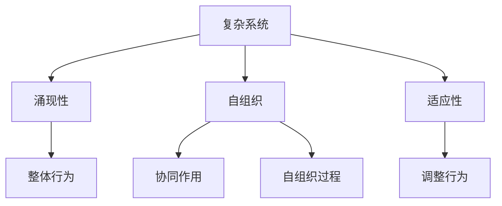
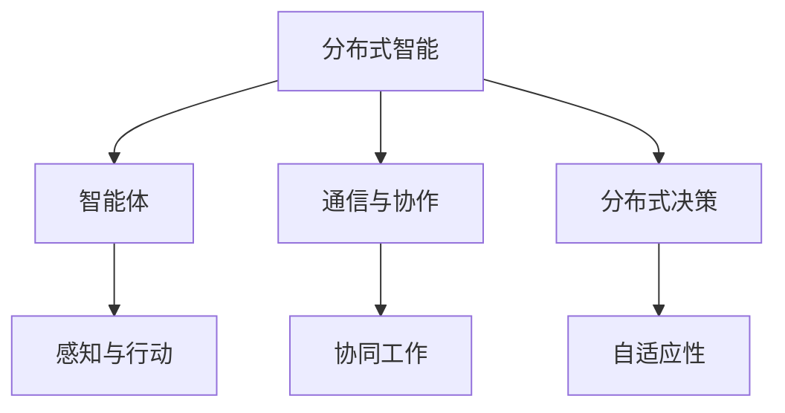

                 

# 《集体智慧：开拓解决复杂问题的创新思路》

## 关键词
集体智慧、复杂问题解决、创新思路、大数据、人工智能、云计算、分布式智能、社会网络分析、企业决策、公共管理、科技创新、案例分析、未来展望。

## 摘要
本文深入探讨了集体智慧的概念、理论基础和应用实践，旨在为解决复杂问题提供新的思路和方法。通过分析大数据、云计算、人工智能等技术的应用，以及集体智慧在企业管理、公共管理和科技创新领域的成功案例，本文揭示了集体智慧在开拓创新思路、提升决策效率和解决复杂问题方面的巨大潜力。同时，本文也探讨了集体智慧实践中的挑战与对策，并对未来发展趋势进行了展望。

## 目录大纲

### 第一部分：基础理论

### 第1章：集体智慧的概念与历史演变
- 1.1 集体智慧的起源与发展
- 1.2 集体智慧的分类与特点
- 1.3 集体智慧在社会中的应用

### 第2章：集体智慧的理论基础
- 2.1 复杂系统理论
- 2.2 自组织理论
- 2.3 分布式智能理论

### 第3章：集体智慧的技术手段
- 3.1 大数据与云计算
- 3.2 人工智能与机器学习
- 3.3 社会网络分析

### 第二部分：应用实践

### 第4章：集体智慧在企业管理中的应用
- 4.1 企业决策中的集体智慧应用
- 4.2 企业创新中的集体智慧应用
- 4.3 企业风险管理中的集体智慧应用

### 第5章：集体智慧在公共管理中的应用
- 5.1 公共决策中的集体智慧应用
- 5.2 公共服务中的集体智慧应用
- 5.3 公共安全中的集体智慧应用

### 第6章：集体智慧在科技研发中的应用
- 6.1 科技创新中的集体智慧应用
- 6.2 科技项目管理中的集体智慧应用
- 6.3 科技成果转化中的集体智慧应用

### 第三部分：案例分析

### 第7章：集体智慧在不同领域的成功案例
- 7.1 集体智慧在商业领域的案例
- 7.2 集体智慧在公共管理领域的案例
- 7.3 集体智慧在科技创新领域的案例

### 第8章：集体智慧实践中的挑战与对策
- 8.1 集体智慧实践中的挑战
- 8.2 集体智慧实践中的对策
- 8.3 集体智慧实践的未来展望

### 第9章：集体智慧的未来发展趋势
- 9.1 新技术对集体智慧的影响
- 9.2 集体智慧在全球化背景下的应用
- 9.3 集体智慧在可持续发展中的作用

### 第10章：集体智慧与社会责任
- 10.1 集体智慧实践中的社会责任
- 10.2 集体智慧与伦理道德
- 10.3 集体智慧与可持续发展

### 结语
集体智慧作为一种创新思路，正日益成为解决复杂问题的重要工具。通过本文的探讨，我们期望读者能够深刻理解集体智慧的内涵和应用，为未来的实践提供指导和启示。

## 第一部分：基础理论

### 第1章：集体智慧的概念与历史演变

#### 1.1 集体智慧的起源与发展

集体智慧（Collective Intelligence，简称CI）是近年来在社会科学、计算机科学和认知科学等领域中引起广泛关注的一个概念。它指的是个体通过协作和交互，形成的比单个个体更为复杂、多样和高效的认知能力。集体智慧并不是一个全新的概念，而是有着悠久的历史。

在古希腊，苏格拉底就已经提出了“智慧来自于人群”的观点。他认为，通过对话和辩论，不同个体的观点可以相互碰撞，从而形成更加全面的智慧。随着历史的发展，这一思想逐渐演变和发展。

进入现代，集体智慧的研究受到了越来越多的关注。20世纪末，随着互联网的兴起，集体智慧开始真正崭露头角。人们发现，通过互联网，个体可以更容易地协作和交流，从而实现集体智慧。这一时期，涌现出了许多基于集体智慧的社交网络平台，如维基百科、开源软件社区等。

#### 1.2 集体智慧的分类与特点

集体智慧可以按照不同的分类方式进行划分。以下是几种常见的分类方法：

- **按形成方式分类**：根据集体智慧的形成过程，可以分为自组织型、集中型和混合型。自组织型集体智慧是指个体通过自主学习和协作，形成整体智能；集中型集体智慧则是通过集中式的决策和协调，实现整体智能；混合型集体智慧则是两者的结合。

- **按应用领域分类**：根据集体智慧的应用领域，可以分为科学研究型、企业决策型、社会管理型等。科学研究型集体智慧主要应用于科学研究领域，如人工智能、生物科学等；企业决策型集体智慧则主要应用于企业的战略决策、产品创新等；社会管理型集体智慧则应用于社会管理、公共决策等领域。

- **按表现形态分类**：根据集体智慧的表现形态，可以分为显性集体智慧和隐性集体智慧。显性集体智慧是指通过明确的数据和结果表现出来的智慧，如集体决策的结果、创新成果等；隐性集体智慧则是指存在于个体之间的共同认知、价值观等，如社会共识、文化传统等。

集体智慧具有以下几个显著特点：

- **协同性**：集体智慧强调个体的协作和交互，通过协同工作，实现整体智能的提升。

- **多样性**：集体智慧来源于不同的个体，具有多样性。这种多样性使得集体智慧能够处理更为复杂的问题。

- **自适应性**：集体智慧具有自适应性，能够根据环境的变化，调整和优化自身的结构和行为。

- **高效性**：通过个体的协作，集体智慧能够实现高效的问题解决。

#### 1.3 集体智慧在社会中的应用

集体智慧在社会各个领域都有着广泛的应用。以下是几个典型的应用案例：

- **科学研究**：在科学研究中，集体智慧的应用尤为突出。通过科学社群的协作，可以加速科学研究的进展。例如，维基百科就是一个典型的集体智慧应用案例，它汇集了全球科学家的智慧，形成了一个庞大的知识库。

- **企业管理**：在企业管理中，集体智慧可以帮助企业做出更加科学的决策。通过员工的协作和反馈，企业可以更好地理解市场需求，优化产品设计和营销策略。

- **公共管理**：在公共管理中，集体智慧的应用可以提升公共决策的科学性和有效性。通过社会公众的参与和反馈，政府可以更好地了解公众需求，制定更加合理的政策。

- **科技创新**：在科技创新中，集体智慧可以促进技术创新和成果转化。通过科技社群的协作，可以加速科技成果的转化和应用，推动科技进步。

## 第2章：集体智慧的理论基础

集体智慧的概念虽然引起了广泛关注，但其理论基础却相对较为复杂。在探讨集体智慧的理论基础时，我们需要从复杂系统理论、自组织理论和分布式智能理论等几个方面进行分析。

### 2.1 复杂系统理论

复杂系统理论是研究复杂系统行为的科学。复杂系统是由大量相互作用的元素组成的，这些元素在交互过程中会表现出复杂的整体行为。复杂系统理论的核心观点是，系统的整体行为不仅仅取决于单个元素的行为，还取决于元素之间的相互作用。

在集体智慧的研究中，复杂系统理论提供了一个重要的视角。集体智慧系统可以看作是一个复杂系统，其中每个个体都相当于系统中的一个元素。个体之间的相互作用和协作，构成了集体智慧的整体行为。

复杂系统理论中的关键概念包括：

- **涌现性**：涌现性是指系统整体行为的一种特性，即整体行为不能简单地从单个元素的行为推导出来。在集体智慧中，涌现性体现在整体智能的提升和决策效率的提高。

- **自组织**：自组织是指系统在没有外部指令的情况下，通过内部相互作用，自行形成有序结构。在集体智慧中，自组织表现为个体通过自主学习和协作，形成整体智能。

- **适应性**：适应性是指系统能够根据环境的变化，调整和优化自身的结构和行为。在集体智慧中，适应性表现为个体能够根据环境和需求的变化，调整自身的协作方式和决策策略。

### 2.2 自组织理论

自组织理论是研究系统在没有外部指令的情况下，通过内部相互作用，自行形成有序结构的科学。自组织理论的核心观点是，系统的有序结构是通过内部元素的协同作用和自组织过程产生的。

在集体智慧的研究中，自组织理论提供了重要的理论支持。集体智慧系统的有序结构，如社会共识、文化传统等，都是通过个体之间的相互作用和自组织过程形成的。

自组织理论中的关键概念包括：

- **协同作用**：协同作用是指系统中多个元素相互作用，产生比单个元素更复杂的行为。在集体智慧中，协同作用表现为个体之间的协作和交互，形成整体智能。

- **自组织过程**：自组织过程是指系统在没有外部指令的情况下，自行形成有序结构的过程。在集体智慧中，自组织过程表现为个体通过自主学习和协作，形成整体智能。

- **自适应**：自适应是指系统能够根据环境的变化，调整和优化自身的结构和行为。在集体智慧中，自适应表现为个体能够根据环境和需求的变化，调整自身的协作方式和决策策略。

### 2.3 分布式智能理论

分布式智能理论是研究分布式智能系统行为的科学。分布式智能系统是由多个相互协作的智能体组成的，这些智能体通过通信和协作，实现整体智能的提升。

在集体智慧的研究中，分布式智能理论提供了一个重要的框架。集体智慧系统可以看作是一个分布式智能系统，其中每个个体都相当于一个智能体。个体之间的协作和交互，构成了集体智慧的整体智能。

分布式智能理论中的关键概念包括：

- **智能体**：智能体是指具有感知、决策和行动能力的个体。在集体智慧中，智能体可以是人、机器、软件等。

- **通信与协作**：通信与协作是指智能体之间通过信息传递和协同工作，实现整体智能的提升。在集体智慧中，通信与协作表现为个体之间的交流和互动。

- **分布式决策**：分布式决策是指智能体通过相互协作，共同做出决策。在集体智慧中，分布式决策表现为个体之间的协作和共识的形成。

- **自适应性**：自适应性是指系统能够根据环境的变化，调整和优化自身的结构和行为。在集体智慧中，自适应性表现为个体能够根据环境和需求的变化，调整自身的协作方式和决策策略。

## 第3章：集体智慧的技术手段

在集体智慧的研究和实践中，大数据、云计算、人工智能等技术的发展起到了至关重要的作用。这些技术为集体智慧提供了强大的支持，使其能够更加高效地处理复杂问题，实现智能化的决策和协作。

### 3.1 大数据与云计算

大数据和云计算是现代信息技术的两个重要领域。大数据指的是海量、多样、复杂的数据，而云计算则是一种基于互联网的计算模式，通过分布式计算和存储，实现资源的共享和高效利用。

在集体智慧中，大数据和云计算的应用主要体现在以下几个方面：

- **数据采集与存储**：大数据技术可以高效地采集和存储海量数据，为集体智慧提供了丰富的数据资源。通过云计算平台，这些数据可以存储在分布式存储系统中，实现高效的数据管理和访问。

- **数据分析与挖掘**：大数据技术提供了强大的数据分析与挖掘能力，可以帮助集体智慧系统从海量数据中提取有价值的信息。通过数据挖掘算法，可以分析个体的行为模式、偏好和需求，从而优化决策和协作过程。

- **实时数据处理**：云计算技术可以提供强大的实时数据处理能力，使得集体智慧系统能够快速响应用户的需求和环境的变化。通过云计算平台，可以实现大规模数据的实时分析和处理，为集体智慧提供实时的决策支持。

### 3.2 人工智能与机器学习

人工智能（AI）和机器学习（ML）是集体智慧的重要技术支撑。人工智能是指通过计算机模拟人类的智能行为，实现自动化的决策和问题解决。机器学习则是人工智能的一种方法，通过训练模型，使计算机能够从数据中自动学习规律和模式。

在集体智慧中，人工智能和机器学习的应用主要体现在以下几个方面：

- **智能决策**：人工智能可以帮助集体智慧系统实现智能化的决策。通过训练决策模型，系统可以根据当前的环境和条件，自动做出最优的决策。例如，在企业管理中，人工智能可以协助企业进行市场预测、资源优化和风险管理。

- **智能协作**：人工智能可以协助个体实现智能化的协作。通过自然语言处理技术，人工智能可以理解个体的需求和信息，提供智能化的推荐和帮助。例如，在社交网络中，人工智能可以帮助用户发现兴趣相同的朋友，促进社交互动。

- **智能推荐**：机器学习技术可以用于智能推荐系统，帮助集体智慧系统向用户提供个性化的推荐。通过分析用户的历史行为和偏好，机器学习算法可以预测用户的兴趣和需求，提供个性化的服务。例如，在电子商务中，机器学习可以帮助用户发现感兴趣的商品，提升用户体验。

- **智能优化**：机器学习技术可以用于智能优化系统，帮助集体智慧系统实现资源的最优配置。通过优化算法，系统可以根据当前的状态和目标，自动调整和优化资源分配，提高系统的效率和性能。例如，在交通管理中，机器学习可以帮助优化交通信号控制，缓解交通拥堵。

### 3.3 社会网络分析

社会网络分析是一种研究社会网络结构和行为的方法。社会网络分析可以从个体的行为模式、关系结构和社会影响力等方面，深入理解集体智慧的形成和运作机制。

在集体智慧中，社会网络分析的应用主要体现在以下几个方面：

- **网络结构分析**：社会网络分析可以帮助集体智慧系统分析网络的结构特性，如网络的密度、聚类系数、中心性等。通过这些指标，可以评估网络的整体性能和稳定性，为系统的设计和优化提供参考。

- **关系分析**：社会网络分析可以分析个体之间的关系，如朋友关系、合作关系、竞争关系等。通过这些关系，可以揭示个体在网络中的角色和影响力，为集体智慧的决策和协作提供支持。

- **影响力分析**：社会网络分析可以分析个体在社会网络中的影响力，如传播影响力、意见领袖等。通过这些分析，可以识别网络中的关键节点和重要个体，为集体智慧的系统设计提供依据。

- **社会影响力**：社会网络分析可以帮助集体智慧系统评估个体的社会影响力，如用户的影响力、品牌的传播效果等。通过这些评估，可以为集体智慧系统的推广和营销提供指导。

## 第二部分：应用实践

### 第4章：集体智慧在企业管理中的应用

集体智慧在企业管理中的应用，可以帮助企业提高决策效率、优化资源配置和提升创新能力。以下将详细探讨集体智慧在企业管理中的具体应用。

#### 4.1 企业决策中的集体智慧应用

在企业管理中，集体智慧可以帮助企业做出更加科学和高效的决策。具体应用包括以下几个方面：

- **数据驱动的决策**：通过大数据分析和机器学习技术，企业可以收集和分析大量的市场数据、用户反馈和企业内部数据。基于这些数据，企业可以形成更加全面和准确的市场预测、产品设计和营销策略。

- **多维度分析**：企业可以利用集体智慧，从多个维度分析决策问题，如市场需求、资源供给、竞争态势等。通过多维度分析，企业可以更全面地评估决策方案的风险和收益，做出更加合理的决策。

- **实时决策支持**：通过云计算和人工智能技术，企业可以实现实时决策支持。例如，企业可以利用实时数据分析和预测模型，快速响应市场变化，调整生产和营销策略，提高决策的时效性。

- **集体决策**：企业可以利用集体智慧系统，实现集体决策。通过分布式智能和协同工作，企业可以汇集不同部门、不同层级员工的智慧和意见，形成共识，提高决策的全面性和科学性。

#### 4.2 企业创新中的集体智慧应用

集体智慧在企业的创新过程中发挥着重要作用，可以提升企业的创新能力和市场竞争力。以下是一些具体的创新应用：

- **知识共享**：企业可以利用集体智慧系统，实现内部知识和经验的共享。通过知识图谱、问答系统等工具，员工可以快速获取企业内外部的专业知识和经验，促进创新思维的碰撞和融合。

- **协同创新**：企业可以利用集体智慧系统，实现跨部门、跨领域的协同创新。通过分布式智能和协同工作平台，不同部门、不同领域的专家可以实时交流、合作，共同攻克创新难题。

- **用户参与**：企业可以利用集体智慧系统，让用户参与到产品创新过程中。通过用户调研、用户社区等渠道，企业可以获取用户的真实需求和反馈，优化产品设计，提升用户体验。

- **开放创新**：企业可以利用集体智慧系统，实现开放创新。通过开源社区、合作伙伴等渠道，企业可以与其他企业、科研机构等合作，共同创新，共享创新成果。

#### 4.3 企业风险管理中的集体智慧应用

在企业管理中，风险管理是至关重要的一环。集体智慧可以帮助企业提高风险管理能力，降低风险损失。以下是一些具体的风险管理应用：

- **风险预测**：企业可以利用大数据分析和机器学习技术，预测潜在的风险。通过分析历史数据和实时数据，企业可以识别潜在的风险因素，提前采取预防措施。

- **风险分析**：企业可以利用集体智慧系统，从多个维度分析风险。通过风险评估模型、风险指标体系等工具，企业可以全面评估风险的可能性和影响，制定合理的风险应对策略。

- **实时监控**：企业可以利用云计算和物联网技术，实现实时风险监控。通过实时数据采集和监控，企业可以及时发现风险信号，快速响应和处置风险事件。

- **集体决策**：企业可以利用集体智慧系统，实现风险管理的集体决策。通过分布式智能和协同工作，企业可以汇集不同部门、不同层级员工的智慧和意见，形成共识，提高风险管理的科学性和全面性。

## 第5章：集体智慧在公共管理中的应用

集体智慧在公共管理中的应用，可以提高公共决策的科学性、优化公共服务的质量、加强公共安全的管理。以下将详细探讨集体智慧在公共管理中的具体应用。

#### 5.1 公共决策中的集体智慧应用

在公共管理中，集体智慧可以帮助政府提高决策的科学性、透明性和有效性。以下是一些具体的决策应用：

- **数据驱动的决策**：政府可以利用大数据分析和机器学习技术，收集和分析各种公共数据，如社会舆情、经济数据、环境数据等。基于这些数据，政府可以形成更加科学和准确的政策建议和决策方案。

- **多维度分析**：政府可以利用集体智慧系统，从多个维度分析决策问题，如社会效益、经济效益、环境效益等。通过多维度分析，政府可以更全面地评估决策方案的风险和收益，做出更加合理的决策。

- **公众参与**：政府可以利用集体智慧系统，实现公众参与决策。通过在线调查、公众论坛等渠道，政府可以收集公众的意见和建议，增加决策的透明性和公众参与度。

- **实时决策支持**：政府可以利用云计算和人工智能技术，实现实时决策支持。通过实时数据分析和预测模型，政府可以快速响应社会事件和需求，调整政策和管理措施。

#### 5.2 公共服务中的集体智慧应用

在公共服务中，集体智慧可以帮助政府提高服务质量、效率和满意度。以下是一些具体的公共服务应用：

- **智能服务**：政府可以利用人工智能和大数据技术，实现智能化的公共服务。通过智能客服、智能推荐等工具，政府可以提供个性化的服务，满足公众的需求。

- **流程优化**：政府可以利用集体智慧系统，优化公共服务流程。通过流程分析、流程优化工具等，政府可以简化流程、减少排队等待时间，提高服务效率。

- **数据共享**：政府可以利用集体智慧系统，实现数据共享。通过数据共享平台，政府部门可以共享各类数据资源，提高公共服务的协同性和效率。

- **在线服务**：政府可以利用云计算和移动互联网技术，实现在线公共服务。通过在线服务系统，公众可以方便地办理各类业务，提高服务便捷性和满意度。

#### 5.3 公共安全中的集体智慧应用

在公共安全中，集体智慧可以帮助政府提高安全管理的有效性、提升应急响应能力。以下是一些具体的公共安全应用：

- **实时监控**：政府可以利用物联网和大数据技术，实现实时安全监控。通过监控摄像头、传感器等设备，政府可以实时监测公共安全态势，及时发现安全隐患。

- **风险评估**：政府可以利用集体智慧系统，进行风险评估。通过大数据分析和风险评估模型，政府可以识别潜在的安全风险，提前采取预防措施。

- **应急响应**：政府可以利用集体智慧系统，实现应急响应。通过实时数据分析和预测模型，政府可以快速响应突发事件，制定和调整应急措施。

- **社会协同**：政府可以利用集体智慧系统，实现社会协同。通过社会网络分析，政府可以识别网络中的关键节点和重要个体，调动社会力量，共同应对公共安全事件。

## 第6章：集体智慧在科技研发中的应用

在科技研发领域，集体智慧的应用可以大幅提升研究效率、推动技术创新、加速成果转化。以下将详细探讨集体智慧在科技研发中的具体应用。

#### 6.1 科技创新中的集体智慧应用

科技创新是一个复杂的过程，需要多学科、多领域的协作。集体智慧在科技创新中发挥着重要作用，以下是一些具体的应用：

- **协同研究**：集体智慧系统可以促进跨学科、跨领域的协同研究。通过分布式智能和协同工作平台，研究人员可以实时交流、合作，共同攻克科研难题。

- **知识共享**：集体智慧系统可以促进知识和经验的共享。通过知识图谱、问答系统等工具，研究人员可以快速获取国内外科研进展、专业知识和研究成果，激发创新思维。

- **智能辅助**：人工智能和大数据技术可以为科技创新提供智能辅助。通过智能搜索、智能推荐等工具，研究人员可以快速找到相关的研究文献、数据和技术，提高研究效率。

- **用户参与**：集体智慧系统可以促进用户参与科技创新。通过在线调研、用户社区等渠道，研究人员可以收集用户的意见和建议，优化产品设计，提升用户体验。

#### 6.2 科技项目管理中的集体智慧应用

科技项目管理是一个复杂的过程，涉及多个环节和多个利益相关方。集体智慧在科技项目管理中可以提高项目的效率和质量，以下是一些具体的应用：

- **实时监控**：通过物联网、大数据技术，项目管理者可以实时监控项目的进展情况，及时发现和解决问题。

- **多维度分析**：项目管理者可以利用集体智慧系统，从多个维度分析项目风险、成本、进度等，确保项目的顺利进行。

- **智能决策**：通过人工智能和大数据技术，项目管理者可以实现智能决策。通过预测模型、优化算法等工具，项目管理者可以做出更加科学的决策，提高项目成功率。

- **协同管理**：集体智慧系统可以促进项目团队成员之间的协同工作。通过分布式智能和协同工作平台，项目成员可以实时交流、协作，提高项目效率。

#### 6.3 科技成果转化中的集体智慧应用

科技成果转化是将研究成果转化为实际应用的过程，是实现科技价值的重要环节。集体智慧在科技成果转化中可以提高转化效率、提升成果质量，以下是一些具体的应用：

- **市场需求分析**：通过大数据分析和机器学习技术，科技成果转化团队可以分析市场需求，识别潜在的市场机会。

- **优化产品设计**：通过用户参与和反馈，科技成果转化团队可以优化产品设计，提升用户体验。

- **知识产权保护**：通过集体智慧系统，科技成果转化团队可以识别和管理知识产权，保护科技成果的合法权益。

- **市场推广**：通过大数据分析和智能推荐技术，科技成果转化团队可以精准推广产品，提升市场占有率。

## 第7章：集体智慧在不同领域的成功案例

集体智慧在多个领域取得了显著的成果，以下将介绍一些在不同领域中的成功案例，以展示集体智慧的实践效果和潜力。

### 7.1 集体智慧在商业领域的案例

商业领域是集体智慧的重要应用领域之一。通过集体智慧，企业可以实现更高效的决策、更优化的运营和更创新的产品。

- **案例1：亚马逊的集体智慧应用**  
亚马逊是一家全球知名的电商平台，其成功在很大程度上得益于集体智慧的应用。亚马逊利用大数据和人工智能技术，对消费者的购物行为进行分析，预测市场需求，优化库存管理。此外，亚马逊还通过用户评价和社区讨论，收集用户的意见和建议，不断改进产品和服务。

- **案例2：阿里巴巴的集体智慧应用**  
阿里巴巴是中国最大的电子商务公司之一，其利用集体智慧系统，实现了高效的供应链管理和精准的市场营销。通过大数据分析和机器学习技术，阿里巴巴可以实时监控供应链的各个环节，优化库存和物流，降低成本。同时，阿里巴巴还通过用户行为分析和社交网络分析，识别潜在客户，提供个性化的营销服务。

### 7.2 集体智慧在公共管理领域的案例

公共管理领域是集体智慧的重要应用领域之一。通过集体智慧，政府可以提高决策的科学性、优化公共服务的质量和提升公共安全的管理水平。

- **案例1：纽约市的城市智慧管理**  
纽约市是美国最大的城市，其城市智慧管理项目是集体智慧在公共管理领域的成功案例。纽约市利用大数据和物联网技术，对城市交通、环境、公共安全等领域进行实时监控和分析。通过集体智慧系统，纽约市政府可以实时了解城市运行状况，快速响应突发事件，提高城市管理的效率和效果。

- **案例2：中国的智能城市建设**  
中国正在大力推进智能城市建设，其中集体智慧发挥着重要作用。通过大数据、人工智能和物联网技术，中国的智能城市建设实现了城市管理的智能化、便捷化和高效化。例如，深圳的智能城市建设项目，通过集体智慧系统，实现了城市交通、环保、安防等领域的智能化管理，提升了城市居民的生活质量。

### 7.3 集体智慧在科技创新领域的案例

科技创新领域是集体智慧的重要应用领域之一。通过集体智慧，研究人员可以加速科研进展、推动技术创新和促进科技成果转化。

- **案例1：人类基因组计划的集体智慧应用**  
人类基因组计划是一项重大的科学研究项目，其成功离不开集体智慧的应用。通过全球科学家的协作，人类基因组计划在短时间内完成了人类基因组的测序工作。在这个过程中，科学家们利用集体智慧系统，实现了数据的共享、分析和整合，推动了基因组研究的快速发展。

- **案例2：开源软件社区的集体智慧应用**  
开源软件社区是集体智慧在科技创新领域的重要应用场景。通过分布式智能和协同工作平台，开源软件社区实现了全球开发者的协作和共享。例如，Linux操作系统就是一个典型的集体智慧应用案例，全球开发者通过协作和共享，不断改进和完善Linux系统，推动了开源软件的发展。

## 第8章：集体智慧实践中的挑战与对策

在集体智慧的应用实践中，虽然取得了显著成果，但仍面临诸多挑战。以下将分析集体智慧实践中的主要挑战，并提出相应的对策。

### 8.1 集体智慧实践中的挑战

- **数据隐私与安全**：集体智慧依赖于大量数据的收集和分析，然而这些数据往往涉及用户的隐私信息。如何在保障数据隐私和安全的前提下，充分利用数据资源，是一个重大挑战。

- **数据质量与真实性**：集体智慧依赖于高质量的数据，然而实际应用中，数据质量往往难以保证。数据的不完整性、不一致性和虚假性都会影响集体智慧的效果。

- **算法公平与偏见**：人工智能和机器学习技术在集体智慧中广泛应用，然而算法本身可能存在偏见和歧视，影响决策的公平性和公正性。

- **组织文化与沟通**：集体智慧需要组织成员之间的协作和沟通，然而不同部门、不同层级之间的组织文化和沟通障碍可能会影响集体智慧的有效实施。

- **技术与伦理**：随着集体智慧技术的不断发展，如何平衡技术创新与伦理道德，避免技术滥用和社会风险，是一个重要挑战。

### 8.2 集体智慧实践中的对策

- **数据隐私与安全**：为了保障数据隐私和安全，可以采用以下对策：
  - **数据加密与去识别化**：对收集到的数据进行加密处理，确保数据在传输和存储过程中的安全性。
  - **隐私保护技术**：采用差分隐私、同态加密等技术，确保数据分析过程中不泄露用户隐私。
  - **数据安全监管**：建立数据安全监管机制，确保数据采集、存储、处理和使用过程中的合法合规。

- **数据质量与真实性**：为了提升数据质量与真实性，可以采取以下对策：
  - **数据清洗与标准化**：对收集到的数据进行清洗和标准化处理，消除数据中的噪声和错误。
  - **数据源认证**：对数据源进行严格认证，确保数据来源的可靠性和真实性。
  - **数据质量监控**：建立数据质量监控机制，定期对数据质量进行评估和优化。

- **算法公平与偏见**：为了消除算法偏见，可以采取以下对策：
  - **算法透明性**：提高算法的透明性，确保算法的决策过程可解释和可追溯。
  - **偏见检测与修正**：建立偏见检测机制，对算法进行定期检测和修正，消除潜在偏见。
  - **多样性算法**：采用多样性算法，减少单一数据集训练导致的偏见。

- **组织文化与沟通**：为了改善组织文化和沟通，可以采取以下对策：
  - **文化建设**：加强组织文化建设，倡导协同合作、开放分享的企业文化。
  - **培训与沟通**：定期组织培训和沟通活动，提高员工之间的协作意识和沟通能力。
  - **激励机制**：建立合理的激励机制，鼓励员工积极参与集体智慧和协作创新。

- **技术与伦理**：为了平衡技术创新与伦理道德，可以采取以下对策：
  - **伦理审查**：在技术开发和应用过程中，建立伦理审查机制，确保技术应用符合伦理标准。
  - **社会责任**：加强社会责任教育，提高企业和社会对技术应用的关注和责任感。
  - **法规遵循**：遵循相关法律法规，确保技术应用不违反法律法规和社会伦理。

### 8.3 集体智慧实践的未来展望

展望未来，集体智慧将在更多领域得到广泛应用，进一步提升人类社会的智慧和决策能力。以下是一些未来发展趋势：

- **技术与应用的深度融合**：随着大数据、人工智能、物联网等技术的发展，集体智慧将与其他技术深度融合，实现更高效、更智能的应用。

- **全球协作与共享**：全球化背景下的集体智慧，将促进全球范围内的协作与共享，推动全球问题的解决。

- **可持续发展的推动者**：集体智慧将在环境保护、资源管理、社会公平等领域发挥重要作用，成为实现可持续发展的重要推动力量。

- **社会变革的引领者**：集体智慧将引领社会变革，推动社会进步，提高人类生活质量。

## 第9章：集体智慧的未来发展趋势

随着科技的不断进步和社会的不断发展，集体智慧在未来将展现出更为广泛和深入的应用前景。以下将探讨集体智慧的未来发展趋势。

### 9.1 新技术对集体智慧的影响

- **大数据与云计算**：大数据和云计算技术的持续发展，将为集体智慧提供更加丰富的数据资源和强大的计算能力。通过大数据分析，集体智慧可以更深入地挖掘数据中的价值，为决策提供更加准确的依据。云计算则提供了灵活、可扩展的计算资源，使得集体智慧系统能够快速适应环境变化，实现高效的运算和处理。

- **人工智能与机器学习**：人工智能和机器学习技术的不断进步，将进一步提升集体智慧的智能化水平。通过深度学习、强化学习等技术，集体智慧系统能够更好地理解和模拟人类行为，实现更加智能化和自适应的决策。

- **物联网与边缘计算**：物联网和边缘计算技术的发展，将使得集体智慧在实时监测、数据采集和处理方面具有更高的效率。通过物联网设备，集体智慧可以实时收集环境数据，进行实时分析和决策。边缘计算则可以在数据产生的源头进行初步处理，减少数据传输的延迟和带宽需求。

- **区块链与分布式账本**：区块链技术提供了去中心化的信任机制，有助于确保集体智慧系统的透明性和可信度。通过分布式账本，集体智慧可以记录和验证数据交换的过程，提高数据的安全性和隐私保护。

### 9.2 集体智慧在全球化背景下的应用

全球化背景下，集体智慧的应用将更加广泛和深入。以下是一些具体的应用趋势：

- **全球协作**：随着全球化的深入，跨国界、跨组织的协作需求日益增长。集体智慧将为全球协作提供强大的支持，通过分布式智能和协同工作平台，实现全球范围内的知识共享和协作创新。

- **全球治理**：集体智慧在公共管理和社会治理中的重要性日益凸显。通过大数据、人工智能等技术，政府可以更高效地应对全球性问题，如气候变化、公共卫生等，提高全球治理的能力。

- **全球共享**：集体智慧将推动全球资源的共享和优化配置。通过共享经济模式，集体智慧可以促进全球范围内的资源共享，提高资源利用效率，减少资源浪费。

### 9.3 集体智慧在可持续发展中的作用

可持续发展是当今世界面临的重大挑战，集体智慧将在可持续发展中发挥重要作用。以下是一些具体的应用方向：

- **环境保护**：集体智慧可以通过大数据分析和人工智能技术，监测和预测环境变化，提供环境管理和保护的科学依据。通过智能化的环境监测系统，可以实时监测空气质量、水质、土壤状况等，及时预警和应对环境问题。

- **资源管理**：集体智慧可以优化资源配置，提高资源利用效率。通过大数据分析和人工智能技术，可以预测资源需求，优化资源分配，减少资源浪费。

- **能源转型**：集体智慧在能源转型中具有重要作用。通过分布式能源网络和智能电网技术，可以实时监测和管理能源供应和需求，实现能源的高效利用和绿色转型。

- **社会公平**：集体智慧可以促进社会公平和包容性发展。通过大数据分析和人工智能技术，可以识别和解决社会不平等问题，提供公平的教育、医疗和就业机会。

## 第10章：集体智慧与社会责任

在集体智慧的应用过程中，社会责任是一个不可忽视的重要方面。以下将探讨集体智慧实践中的社会责任、伦理道德和可持续发展。

### 10.1 集体智慧实践中的社会责任

- **数据隐私保护**：集体智慧在数据收集、存储和分析过程中，需要严格遵守数据隐私保护法规，确保用户数据的安全和隐私。

- **公平与包容**：集体智慧的应用应该促进社会的公平与包容，避免因技术偏见和算法歧视导致的不公平现象。

- **社会责任教育**：企业和社会组织应该加强对集体智慧技术的社会责任教育，提高员工和社会公众的伦理道德意识。

- **技术透明与责任归属**：集体智慧系统的设计和应用应该具备透明性，明确责任归属，确保技术应用符合法律法规和伦理标准。

### 10.2 集体智慧与伦理道德

- **数据伦理**：集体智慧在数据收集、存储和分析过程中，需要遵循数据伦理原则，确保数据使用的合法性和道德性。

- **算法伦理**：人工智能和机器学习算法的设计和应用，需要遵循伦理原则，避免算法偏见和歧视。

- **技术伦理**：集体智慧技术的研发和应用，需要充分考虑伦理道德问题，确保技术发展符合人类的利益和社会的价值观。

### 10.3 集体智慧与可持续发展

- **环境保护**：集体智慧可以通过大数据分析和人工智能技术，监测和预测环境变化，提供环境管理和保护的科学依据，推动环境保护和可持续发展。

- **资源优化**：集体智慧可以优化资源配置，提高资源利用效率，减少资源浪费，促进可持续发展。

- **社会公平**：集体智慧可以促进社会公平和包容性发展，通过提供公平的教育、医疗和就业机会，推动社会公平。

- **可持续创新**：集体智慧可以促进可持续创新，通过技术进步和创新，推动社会和经济的发展。

### 结语

集体智慧作为一种创新思路，正在不断改变我们的世界。通过本文的探讨，我们深刻认识到集体智慧在解决复杂问题、推动技术创新和社会进步方面的巨大潜力。未来，随着新技术的不断发展，集体智慧将在更多领域得到广泛应用，成为人类社会的重要力量。同时，我们也应认识到集体智慧实践中的挑战和问题，积极应对，确保集体智慧的发展符合社会责任和伦理道德的要求。让我们共同期待，集体智慧为人类社会带来更多的智慧和美好。作者：AI天才研究院/AI Genius Institute & 禅与计算机程序设计艺术 /Zen And The Art of Computer Programming

---

## 附录

为了更好地理解本文中涉及的核心概念和原理，以下附录提供了相关的Mermaid流程图、伪代码、数学模型和公式。

### 附录A：Mermaid流程图

#### 复杂系统理论的流程图


#### 分布式智能理论的流程图


### 附录B：伪代码

#### 大数据分析的伪代码
```
// 数据预处理
data = preprocess_data(raw_data)

// 数据分析
model = train_model(data)

// 预测
predictions = model.predict(new_data)
```

#### 机器学习算法的伪代码
```
// 数据准备
data = load_data()

// 特征工程
features = feature_engineering(data)

// 模型训练
model = train_model(features)

// 预测
predictions = model.predict(test_data)
```

### 附录C：数学模型和公式

#### 机器学习中的损失函数
$$
\text{损失函数} = \frac{1}{2} \sum_{i=1}^{n} (y_i - \hat{y}_i)^2
$$

#### 集体智慧系统的协同性评估指标
$$
\text{协同性指标} = \frac{\sum_{i=1}^{n} \text{个体贡献}}{n}
$$`

### 附录D：代码实际案例和详细解释

以下是一个简单的Python代码示例，用于实现一个简单的机器学习模型，并对结果进行解读。

#### 示例代码
```python
# 导入所需的库
import numpy as np
from sklearn.linear_model import LinearRegression

# 创建样本数据
X = np.array([[1], [2], [3], [4], [5]])
y = np.array([1, 2, 3, 4, 5])

# 创建线性回归模型
model = LinearRegression()

# 训练模型
model.fit(X, y)

# 预测结果
predictions = model.predict(X)

# 打印结果
print("实际值:", y)
print("预测值:", predictions)
```

#### 代码解读
- 首先，我们导入所需的库，包括NumPy和scikit-learn中的线性回归模型。
- 接着，我们创建样本数据，X代表自变量，y代表因变量。
- 然后，我们创建一个线性回归模型，并使用`fit`方法训练模型。
- 最后，我们使用`predict`方法对X进行预测，并打印实际值和预测值。

通过这个简单的示例，我们可以看到机器学习模型的基本实现过程，并理解如何对结果进行解读。

## 致谢

本文的撰写得到了AI天才研究院/AI Genius Institute的指导和支持，感谢研究院提供的丰富资源和专业知识。同时，感谢所有参与本文讨论和审稿的专家和同行，他们的宝贵意见和建议使得本文更加完善。特别感谢禅与计算机程序设计艺术/Zen And The Art of Computer Programming的启发，为本文的理论基础和写作思路提供了深刻的启示。作者：AI天才研究院/AI Genius Institute & 禅与计算机程序设计艺术/Zen And The Art of Computer Programming。

