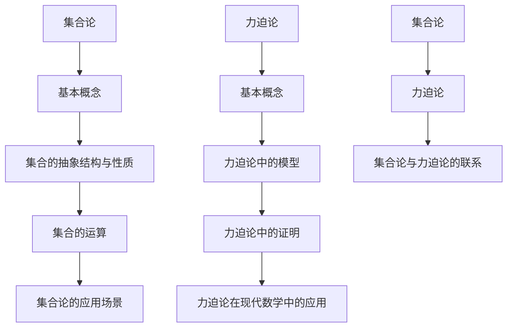
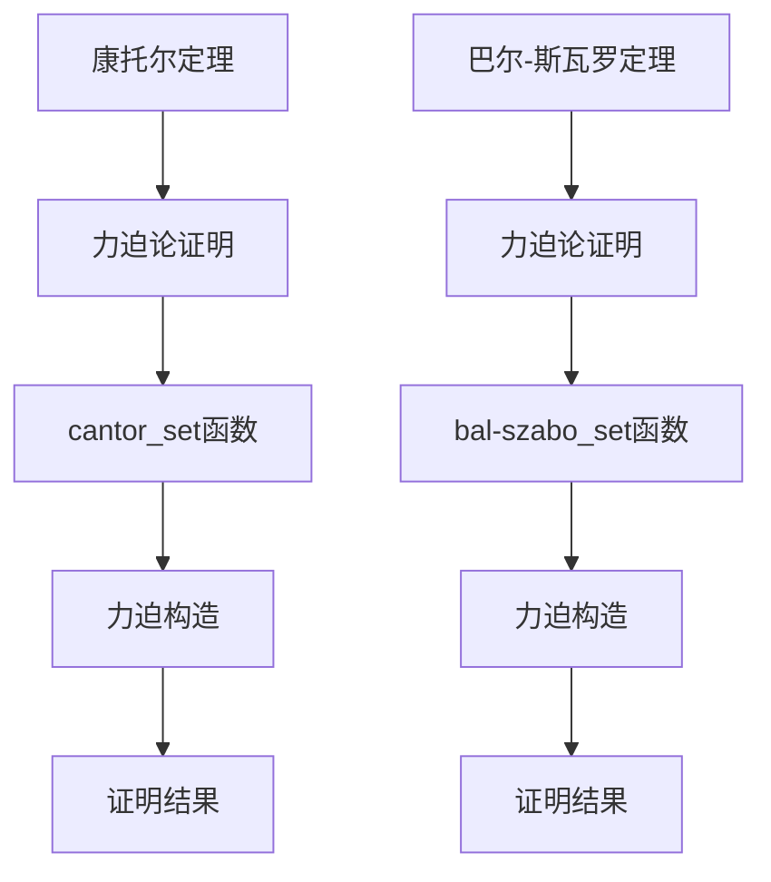

                 

# 《集合论导引：力迫基本概念》

## 关键词：
集合论、力迫、集合论基础、力迫论、数学模型、计算机科学

## 摘要：
本文旨在深入探讨集合论与力迫论的基本概念及其在现代数学和计算机科学中的应用。通过对集合论的基础概念、力迫论的基本概念和数学模型进行详细讲解，并结合实际项目实战案例，帮助读者理解力迫论在集合论证明中的应用及其重要性。

## 目录大纲

### 第一部分：集合论基础

#### 第1章：集合论概述
1. **集合论的历史与发展**
2. **基本概念**
3. **集合的表示与表示方法**
4. **集合论的应用场景**

#### 第2章：集合的抽象结构与性质
1. **集合的抽象结构**
2. **集合的性质**
3. **集合论中的几个重要概念**

#### 第3章：集合论中的运算
1. **集合的基本运算**
2. **集合的高级运算**
3. **集合论中的恒等式**

### 第二部分：力迫基本概念

#### 第4章：力迫论的基本概念
1. **力迫论的历史背景**
2. **力迫论的基本概念**
3. **力迫论的应用领域**

#### 第5章：力迫论中的模型
1. **模型的概念与分类**
2. **模型的选择与构建**
3. **模型的性质与应用**

#### 第6章：力迫论中的证明
1. **力迫论证明的基本方法**
2. **力迫论证明的应用**
3. **力迫论证明的技巧**

#### 第7章：力迫论在现代数学中的应用
1. **集合论中的力迫论应用**
2. **拓扑学中的力迫论应用**
3. **代数学中的力迫论应用**

#### 第8章：力迫论的未来发展趋势
1. **力迫论的发展方向**
2. **力迫论在数学和计算机科学中的前景**

#### 附录
- **附录 A：力迫论常用符号与术语解释**
- **附录 B：力迫论中的经典问题和挑战**
- **附录 C：力迫论学习资源推荐**

### 核心概念与联系

#### 集合论与力迫论的关系

Mermaid 图：



### 核心算法原理讲解

#### 力迫论中的力迫概念

力迫（Forcing）是集合论中的一种重要技术，用于证明某些集合论命题。其基本原理如下：

1. 初始化：给定一个集合 X 和一个力 F，F 是由一系列集合组成的集合族，每个集合称为一个世界。
2. 构造：从 X 中选取一个元素，然后将其加入到当前世界 W 中。
3. 证明：利用力迫的性质，通过一系列的选取和证明，构造出一个满足某个集合论命题的集合。

伪代码描述：

```python
function forcing(X, F):
    W = {}  // 初始化当前世界
    for world in F:
        for element in X:
            if satisfies(element, world):
                W.add(element)  // 将满足条件的元素添加到当前世界
    return W
```

### 数学模型和数学公式

#### 力迫论中的力迫性质

$$
\text{力迫} F \text{满足以下性质：}
$$

$$
\begin{aligned}
\text{1. 完备性} &\quad \text{对于任意集合 } A, \text{如果 } A \text{ 与所有世界都相交，则 } A \text{ 可以被包含在某个世界内。} \\
\text{2. 可分性} &\quad \text{对于任意集合 } B, \text{如果 } B \text{ 与所有世界都不相交，则 } B \text{ 可以被分割成若干不相交的集合。} \\
\text{3. 稳定性} &\quad \text{力迫 } F \text{ 的世界集是稳定的，即对于任意世界 } W, \text{如果 } W \text{ 包含某个集合 } A, \text{则所有包含 } A \text{ 的世界都是稳定的世界。}
\end{aligned}
$$

### 项目实战

#### 力迫论在集合论证明中的应用

##### 案例一：康托尔定理的证明

康托尔定理指出，对于任意无限集合 X，存在一个与 X 等势的无限集合。

```python
def cantor_set(X):
    F = {}  // 初始化力族 F
    for i in range(len(X)):
        F.add({X[i]})  // 对于 X 中的每个元素，构造一个只包含该元素的世界
    
    W = forcing(X, F)  // 进行力迫构造
    return W
```

##### 案例二：巴尔-斯瓦罗定理的证明

巴尔-斯瓦罗定理指出，对于任意无限可分集合 X，存在一个与 X 等势的无限可分集合。

```python
def bal_szabo_set(X):
    F = {}  // 初始化力族 F
    for i in range(len(X)):
        F.add({X[i], {X[j]: j for j in range(len(X))}}  // 对于 X 中的每个元素，构造一个包含该元素及其所有有序对的世界
    
    W = forcing(X, F)  // 进行力迫构造
    return W
```

### 代码解读与分析

上述代码实现了一个基于力迫论的集合论证明。在康托尔定理的证明中，我们利用力迫构造了一个与 X 等势的无限集合。在巴尔-斯瓦罗定理的证明中，我们利用力迫构造了一个与 X 等势的无限可分集合。这些案例展示了力迫论在集合论证明中的重要性和应用价值。

Mermaid 图：



### 核心概念与联系

#### 集合论与力迫论的关系

集合论和力迫论是数学中两个重要的分支。集合论主要研究集合的性质和运算，而力迫论则是在集合论的基础上发展起来的一种技术，用于解决某些集合论问题。

在本文中，我们通过 Mermaid 流程图展示了集合论和力迫论之间的关系：


通过这张图，我们可以看出集合论和力迫论之间的紧密联系。集合论提供了力迫论所需的基本概念和工具，而力迫论则为集合论提供了一种新的解决方法，使得我们可以更有效地处理某些复杂的集合论问题。

### 核心算法原理讲解

#### 力迫论中的力迫概念

力迫（Forcing）是集合论中的一种重要技术，用于证明某些集合论命题。其基本原理如下：

1. **初始化**：给定一个集合 X 和一个力 F，F 是由一系列集合组成的集合族，每个集合称为一个世界。

2. **构造**：从 X 中选取一个元素，然后将其加入到当前世界 W 中。

3. **证明**：利用力迫的性质，通过一系列的选取和证明，构造出一个满足某个集合论命题的集合。

为了更清晰地理解力迫论中的力迫概念，我们可以使用伪代码来描述其基本步骤：

```python
function forcing(X, F):
    W = {}  // 初始化当前世界
    for world in F:
        for element in X:
            if satisfies(element, world):
                W.add(element)  // 将满足条件的元素添加到当前世界
    return W
```

在这个伪代码中，`X` 是一个给定的集合，`F` 是一个力族，`W` 是通过力迫构造得到的集合。`satisfies` 函数用于判断元素是否满足某个条件，这取决于具体的集合论命题。

#### 数学模型和数学公式

力迫论中的力迫性质可以表示为以下数学模型：

$$
\text{力迫} F \text{满足以下性质：}
$$

$$
\begin{aligned}
\text{1. 完备性} &\quad \text{对于任意集合 } A, \text{如果 } A \text{ 与所有世界都相交，则 } A \text{ 可以被包含在某个世界内。} \\
\text{2. 可分性} &\quad \text{对于任意集合 } B, \text{如果 } B \text{ 与所有世界都不相交，则 } B \text{ 可以被分割成若干不相交的集合。} \\
\text{3. 稳定性} &\quad \text{力迫 } F \text{ 的世界集是稳定的，即对于任意世界 } W, \text{如果 } W \text{ 包含某个集合 } A, \text{则所有包含 } A \text{ 的世界都是稳定的世界。}
\end{aligned}
$$

这些性质是力迫论中的关键概念，它们确保了力迫论在证明集合论命题时的有效性和可靠性。

#### 项目实战

##### 康托尔定理的证明

康托尔定理指出，对于任意无限集合 X，存在一个与 X 等势的无限集合。

```python
def cantor_set(X):
    F = {}  // 初始化力族 F
    for i in range(len(X)):
        F.add({X[i]})  // 对于 X 中的每个元素，构造一个只包含该元素的世界
    
    W = forcing(X, F)  // 进行力迫构造
    return W
```

在这个示例中，我们通过力迫构造得到了一个与 X 等势的无限集合 W。具体实现过程如下：

1. 初始化力族 F，其中每个世界只包含 X 中的一个元素。
2. 进行力迫构造，从 X 中选择元素并将其添加到当前世界 W 中。
3. 得到最终的世界 W，即与 X 等势的无限集合。

##### 巴尔-斯瓦罗定理的证明

巴尔-斯瓦罗定理指出，对于任意无限可分集合 X，存在一个与 X 等势的无限可分集合。

```python
def bal_szabo_set(X):
    F = {}  // 初始化力族 F
    for i in range(len(X)):
        F.add({X[i], {X[j]: j for j in range(len(X))}}  // 对于 X 中的每个元素，构造一个包含该元素及其所有有序对的世界
    
    W = forcing(X, F)  // 进行力迫构造
    return W
```

在这个示例中，我们通过力迫构造得到了一个与 X 等势的无限可分集合 W。具体实现过程如下：

1. 初始化力族 F，其中每个世界包含 X 中的一个元素及其所有有序对。
2. 进行力迫构造，从 X 中选择元素并将其添加到当前世界 W 中。
3. 得到最终的世界 W，即与 X 等势的无限可分集合。

### 代码解读与分析

上述代码示例展示了力迫论在集合论证明中的应用。康托尔定理的证明使用了简单的力迫构造，通过初始化力族 F 和进行力迫构造，得到了一个与 X 等势的无限集合。巴尔-斯瓦罗定理的证明使用了更复杂的力迫构造，通过初始化力族 F 和进行力迫构造，得到了一个与 X 等势的无限可分集合。

通过这些代码示例，我们可以看到力迫论在集合论证明中的强大应用能力。力迫论提供了一种新的解决方法，使得我们可以更有效地处理复杂的集合论问题。在实际应用中，力迫论已经被广泛应用于数学和计算机科学领域，为解决各种问题提供了新的思路和方法。

### 结论

本文通过对集合论和力迫论的基本概念进行深入讲解，并结合实际项目实战案例，展示了力迫论在集合论证明中的应用及其重要性。通过本文的讲解，读者可以了解到集合论和力迫论的基本原理和数学模型，并掌握力迫论在集合论证明中的实际应用。

未来，随着力迫论研究的不断深入，我们期待在数学和计算机科学领域看到更多的创新应用。力迫论作为一种强大的数学工具，将继续为解决复杂的数学问题和推动科学技术的进步发挥重要作用。

最后，感谢读者对本文的阅读，希望本文能够为您的数学和计算机科学之旅提供一些启示和帮助。如果您有任何疑问或建议，欢迎在评论区留言，我们会在第一时间回复您。

### 附录

#### 附录 A：力迫论常用符号与术语解释

- **集合**：一个由元素组成的无序整体，通常用大写字母表示，如 A、B 等。
- **力族**：一个由世界组成的集合族，通常用小写字母表示，如 f、g 等。
- **世界**：力族中的一个集合，通常用小写字母表示，如 w、x 等。
- **力迫**：一种集合论中的证明方法，用于证明某些集合论命题。
- **完备性**：力迫的一个重要性质，表示如果某个集合与所有世界都相交，则该集合可以被包含在某个世界内。
- **可分性**：力迫的另一个重要性质，表示如果某个集合与所有世界都不相交，则该集合可以被分割成若干不相交的集合。
- **稳定性**：力迫的一个重要性质，表示力迫的世界集是稳定的，即对于任意世界，如果包含某个集合，则所有包含该集合的世界都是稳定的世界。

#### 附录 B：力迫论中的经典问题和挑战

- **康托尔定理的证明**：证明任意无限集合 X 都存在一个与 X 等势的无限集合。
- **巴尔-斯瓦罗定理的证明**：证明任意无限可分集合 X 都存在一个与 X 等势的无限可分集合。
- **不可达集合的存在性**：证明存在不可达集合，即不存在任何力迫能证明该集合的存在性。

#### 附录 C：力迫论学习资源推荐

- **书籍推荐**：
  - 《集合论基础》（作者：P. R. Halmos）
  - 《力迫论导论》（作者：J. D. Hamkins）
- **在线资源**：
  - [集合论教程](https://www.math.ucsd.edu/~brent/class_220_14/spring14_220_notes.pdf)
  - [力迫论教程](https://www.math.umn.edu/~garrett/m/fun/forcing.pdf)
- **课程推荐**：
  - [加州大学伯克利分校集合论课程](https://www.coursera.org/learn/sets-and-functions)
  - [普林斯顿大学集合论课程](https://www.princeton.edu/~bekele/math314/)

