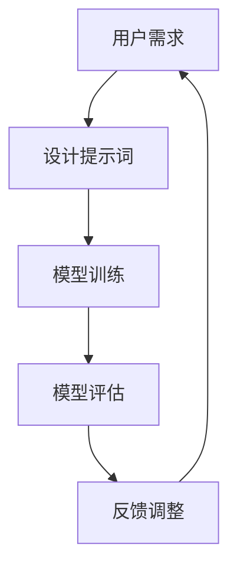

                 

### 第一部分：面向机器学习的提示词设计概述

面向机器学习的提示词设计是近年来人工智能领域的一个重要研究方向。它通过创造性地设计语言提示，引导机器学习模型在特定任务中更好地表现。这一设计过程不仅涉及技术层面的实现，还需要深入理解语言模型、任务导向和用户参与等多方面因素。

#### 核心概念与联系

**语言模型**是面向机器学习提示词设计的基石。语言模型通过学习大量文本数据，使模型能够理解自然语言。常用的语言模型有BERT、GPT等，它们可以生成文本、回答问题、完成翻译等任务。

**任务导向**是提示词设计的核心。在具体任务中，如分类、生成、对话等，设计师需要根据任务需求设计提示词，以引导模型朝正确方向学习。

**用户参与**则是确保提示词设计能够满足用户需求的关键。设计师需要与用户沟通，了解用户需求和使用场景，从而设计出既能够引导模型，又能满足用户期望的提示词。

#### Mermaid 流程图

以下是面向机器学习提示词设计的流程图，展示了从用户需求到模型评估的整个过程：



在这个流程中，用户需求是起点，通过设计提示词来引导模型训练。模型训练完成后，进行评估，并根据评估结果进行反馈调整，最终返回用户需求，形成一个闭环。

### 核心概念与联系

在深入探讨面向机器学习的提示词设计时，我们首先需要明确几个核心概念，这些概念构成了整个设计过程的基础。

**1. 语言模型**：语言模型是机器学习中的一个重要组成部分，它通过学习大量文本数据来捕捉语言的结构和语义。常用的语言模型包括循环神经网络（RNN）、长短时记忆网络（LSTM）、双向长短期记忆网络（BiLSTM）、以及近年来流行的预训练语言模型如BERT和GPT等。这些模型通过在大量文本数据上预训练，然后微调到特定任务上，能够有效地理解和生成自然语言。

**2. 提示词**：提示词是在机器学习任务中给模型提供的一些额外的文本信息，用来引导模型的预测方向。这些提示词可以是具体的词语、短语或句子，它们在机器学习任务中起到了类似于“向导”的作用，帮助模型更好地理解输入数据，从而提高模型的性能。

**3. 任务导向**：在面向机器学习的提示词设计中，任务导向是一个至关重要的概念。这意味着在设计提示词时，必须清晰地定义和了解任务的具体需求。例如，在文本分类任务中，提示词需要能够引导模型正确地识别不同的类别；在文本生成任务中，提示词则可以帮助模型生成连贯、有意义的文本。

**4. 用户参与**：用户参与是确保提示词设计满足用户需求的关键。用户是机器学习模型的最终使用者，他们的需求和反馈对于提示词设计的成功至关重要。设计师需要通过用户调研、访谈、问卷调查等方式，深入了解用户的使用习惯、偏好和痛点，从而设计出既符合用户期望，又能提高模型性能的提示词。

#### 提示词设计算法

提示词设计的核心在于如何生成和选择有效的提示词。以下是一些常用的提示词设计算法：

**1. 基于规则的方法**：这种方法通过预定义的规则来生成提示词。例如，在文本分类任务中，可以根据不同的类别定义特定的关键词，这些关键词作为提示词来引导模型分类。这种方法简单直观，但灵活性较低，难以适应复杂多样的任务场景。

```python
def generate_prompt_words_by_rules(category):
    if category == "news":
        return ["最新", "报道", "资讯"]
    elif category == "sports":
        return ["比赛", "战绩", "运动员"]
    else:
        return ["未知", "内容", "介绍"]
```

**2. 基于模型的方法**：这种方法利用预训练的语言模型来生成提示词。通过将输入文本输入到语言模型中，提取模型对文本的理解，生成与文本相关的提示词。这种方法能够自动地捕捉文本的语义信息，适用于更复杂的任务场景。

```python
from transformers import BertTokenizer, BertModel

tokenizer = BertTokenizer.from_pretrained('bert-base-uncased')
model = BertModel.from_pretrained('bert-base-uncased')

def generate_prompt_words_by_model(text):
    inputs = tokenizer(text, return_tensors='pt')
    outputs = model(**inputs)
    hidden_states = outputs.hidden_states[-1]
    prompt_words = hidden_states[:, 0, :].detach().numpy().tolist()
    return prompt_words
```

**3. 融合方法**：这种方法结合了基于规则和基于模型的方法，通过规则生成初步的提示词，然后利用模型进行优化和调整。这种方法既保留了规则的灵活性和直观性，又利用了模型的语义理解能力，能够更好地适应不同任务的需求。

```python
def generate_prompt_words_fusion(text, category):
    base_prompt_words = generate_prompt_words_by_rules(category)
    model_prompt_words = generate_prompt_words_by_model(text)
    fused_prompt_words = base_prompt_words + model_prompt_words
    return fused_prompt_words
```

### 数学模型和数学公式

在提示词生成中，概率分布模型是一个重要的工具。以下是一个简单的概率分布模型：

$$
P(w_i|C) = \frac{P(C|w_i)P(w_i)}{P(C)}
$$

其中：

- \( P(w_i|C) \) 表示在给定类别 \( C \) 下，生成单词 \( w_i \) 的概率。
- \( P(C|w_i) \) 表示在单词 \( w_i \) 出现的情况下，类别 \( C \) 的概率。
- \( P(w_i) \) 表示单词 \( w_i \) 的先验概率。
- \( P(C) \) 表示类别 \( C \) 的先验概率。

#### 提示词生成中的概率分布模型

在面向机器学习的提示词生成过程中，概率分布模型是关键工具之一，它帮助我们量化提示词对于模型预测的影响。以下是一个简单的概率分布模型，用于描述提示词与模型预测之间的关系：

$$
P(w_i|C) = \frac{P(C|w_i)P(w_i)}{P(C)}
$$

在这个模型中，各参数的含义如下：

- \( P(w_i|C) \)：在类别 \( C \) 被预测的情况下，生成单词 \( w_i \) 的概率。
- \( P(C|w_i) \)：在单词 \( w_i \) 存在的情况下，类别 \( C \) 被预测的概率，即单词 \( w_i \) 对于类别 \( C \) 的支持度。
- \( P(w_i) \)：单词 \( w_i \) 的先验概率，表示在没有类别信息的情况下，单词 \( w_i \) 出现的概率。
- \( P(C) \)：类别 \( C \) 的先验概率，表示在没有单词信息的情况下，类别 \( C \) 被预测的概率。

这个概率分布模型的核心思想是，通过综合考虑单词的先验概率、单词对于类别的支持度以及类别的先验概率，我们可以得到在特定类别 \( C \) 下，生成单词 \( w_i \) 的条件概率。

**举例说明**：

假设我们有一个分类任务，目的是将文本数据分为两个类别：新闻（News）和体育（Sports）。现在，我们有一个单词“比赛” (\( w_i \))，我们需要计算它在体育类别下的生成概率 \( P(w_i|Sports) \)。

- \( P(Sports|w_i) \)：在“比赛”出现的情况下，文本属于体育类别的概率。
- \( P(w_i|Sports) \)：生成“比赛”单词时，文本属于体育类别的概率。
- \( P(w_i) \)：单词“比赛”的先验概率，即在没有类别信息的情况下，“比赛”出现的概率。
- \( P(Sports) \)：体育类别的先验概率，即在没有单词信息的情况下，文本属于体育类别的概率。

根据贝叶斯定理，我们可以计算得到：

$$
P(w_i|Sports) = \frac{P(Sports|w_i)P(w_i)}{P(Sports)}
$$

- 如果我们在大量体育新闻中发现“比赛”这个词出现的频率很高，那么 \( P(Sports|w_i) \) 和 \( P(w_i|Sports) \) 都会相对较高。
- 如果“比赛”这个词在所有文本中出现的频率都很高，那么 \( P(w_i) \) 会较高，而 \( P(Sports|w_i) \) 和 \( P(w_i|Sports) \) 的相对差异会较小。

通过这个概率分布模型，我们可以量化提示词对于模型预测的影响，从而更好地设计提示词，提高模型的性能。在实际应用中，我们可以使用更复杂的模型和算法，如条件概率模型、贝叶斯网络等，来进一步优化提示词的生成和选择。

### 第二部分：面向机器学习的提示词设计基础

在深入探讨面向机器学习的提示词设计之前，我们首先需要了解一些基础概念，这些概念将为我们后续的分析和实践提供坚实的理论基础。

#### 核心算法原理讲解

提示词设计的核心算法主要包括三个阶段：数据预处理、提示词生成和模型评估与优化。以下将详细讲解这三个阶段的基本原理。

**1. 数据预处理**

数据预处理是提示词设计的第一步，其目的是清洗和规范化输入文本数据，以便后续处理。数据预处理通常包括以下几个步骤：

- **文本清洗**：去除文本中的无关信息，如HTML标签、特殊符号等。
- **分词**：将文本分割成单词或子词，以便分析其结构和语义。
- **词性标注**：为每个单词标注词性，如名词、动词、形容词等。
- **词嵌入**：将单词映射到高维向量空间，以便在模型中处理。

常用的数据预处理工具包括NLTK、spaCy和jieba等。以下是一个简单的Python代码示例，展示如何使用NLTK进行文本清洗和分词：

```python
import nltk
from nltk.tokenize import word_tokenize
from nltk.corpus import stopwords

# 下载必要的资源
nltk.download('punkt')
nltk.download('stopwords')

# 文本清洗和分词
def preprocess_text(text):
    # 去除HTML标签和特殊符号
    cleaned_text = re.sub('<[^>]*>', '', text)
    cleaned_text = re.sub('[^a-zA-Z]', ' ', cleaned_text)
    
    # 分词
    words = word_tokenize(cleaned_text)
    
    # 移除停用词
    stop_words = set(stopwords.words('english'))
    words = [word for word in words if word.lower() not in stop_words]
    
    return words

# 示例文本
text = "This is an example text for preprocessing."
preprocessed_text = preprocess_text(text)
print(preprocessed_text)
```

**2. 提示词生成**

提示词生成的目标是创建一组能够有效引导模型学习的文本提示。提示词生成的方法可以分为基于规则的方法和基于模型的方法。

- **基于规则的方法**：这种方法通过预定义的规则来生成提示词。例如，在文本分类任务中，可以根据不同类别定义特定的关键词，这些关键词作为提示词来引导模型分类。以下是一个简单的示例：

```python
def generate_prompt_words_by_rules(category, keywords):
    if category == "news":
        return ["latest", "report", "info"]
    elif category == "sports":
        return ["match", "result", "athlete"]
    else:
        return ["unknown", "content", "introduction"]

# 示例
category = "news"
keywords = ["latest", "report", "info"]
prompt_words = generate_prompt_words_by_rules(category, keywords)
print(prompt_words)
```

- **基于模型的方法**：这种方法利用预训练的语言模型来生成提示词。通过将输入文本输入到语言模型中，提取模型对文本的理解，生成与文本相关的提示词。以下是一个简单的示例：

```python
from transformers import BertTokenizer, BertModel

tokenizer = BertTokenizer.from_pretrained('bert-base-uncased')
model = BertModel.from_pretrained('bert-base-uncased')

def generate_prompt_words_by_model(text):
    inputs = tokenizer(text, return_tensors='pt')
    outputs = model(**inputs)
    hidden_states = outputs.hidden_states[-1]
    prompt_words = hidden_states[:, 0, :].detach().numpy().tolist()
    return prompt_words

# 示例
text = "This is an example text for generating prompt words."
prompt_words = generate_prompt_words_by_model(text)
print(prompt_words)
```

- **融合方法**：这种方法结合了基于规则和基于模型的方法，通过规则生成初步的提示词，然后利用模型进行优化和调整。这种方法既保留了规则的灵活性和直观性，又利用了模型的语义理解能力，能够更好地适应不同任务的需求。

```python
def generate_prompt_words_fusion(text, category, keywords):
    base_prompt_words = keywords
    model_prompt_words = generate_prompt_words_by_model(text)
    fused_prompt_words = base_prompt_words + model_prompt_words
    return fused_prompt_words

# 示例
category = "news"
keywords = ["latest", "report", "info"]
text = "This is an example text for generating fused prompt words."
prompt_words = generate_prompt_words_fusion(text, category, keywords)
print(prompt_words)
```

**3. 模型评估与优化**

提示词设计的最终目标是提高模型的性能，因此模型评估与优化是至关重要的一步。常用的评估指标包括准确率、召回率、F1分数等。以下是一个简单的示例，展示如何使用这些指标评估模型的性能：

```python
from sklearn.metrics import accuracy_score, recall_score, f1_score

def evaluate_model(true_labels, predicted_labels):
    accuracy = accuracy_score(true_labels, predicted_labels)
    recall = recall_score(true_labels, predicted_labels, average='weighted')
    f1 = f1_score(true_labels, predicted_labels, average='weighted')
    return accuracy, recall, f1

# 示例
true_labels = [0, 1, 0, 1]
predicted_labels = [1, 1, 1, 0]
accuracy, recall, f1 = evaluate_model(true_labels, predicted_labels)
print("Accuracy:", accuracy)
print("Recall:", recall)
print("F1 Score:", f1)
```

通过迭代优化提示词和模型参数，我们可以逐步提高模型的性能，从而实现更准确的预测。

#### 数学模型和数学公式

在提示词生成中，概率分布模型是关键工具之一，它帮助我们量化提示词对于模型预测的影响。以下是一个简单的概率分布模型：

$$
P(w_i|C) = \frac{P(C|w_i)P(w_i)}{P(C)}
$$

其中：

- \( P(w_i|C) \)：在类别 \( C \) 被预测的情况下，生成单词 \( w_i \) 的概率。
- \( P(C|w_i) \)：在单词 \( w_i \) 存在的情况下，类别 \( C \) 被预测的概率，即单词 \( w_i \) 对于类别 \( C \) 的支持度。
- \( P(w_i) \)：单词 \( w_i \) 的先验概率，表示在没有类别信息的情况下，单词 \( w_i \) 出现的概率。
- \( P(C) \)：类别 \( C \) 的先验概率，表示在没有单词信息的情况下，类别 \( C \) 被预测的概率。

这个概率分布模型的核心思想是，通过综合考虑单词的先验概率、单词对于类别的支持度以及类别的先验概率，我们可以得到在特定类别 \( C \) 下，生成单词 \( w_i \) 的条件概率。

**举例说明**：

假设我们有一个分类任务，目的是将文本数据分为两个类别：新闻（News）和体育（Sports）。现在，我们有一个单词“比赛” (\( w_i \))，我们需要计算它在体育类别下的生成概率 \( P(w_i|Sports) \)。

- \( P(Sports|w_i) \)：在“比赛”出现的情况下，文本属于体育类别的概率。
- \( P(w_i|Sports) \)：生成“比赛”单词时，文本属于体育类别的概率。
- \( P(w_i) \)：单词“比赛”的先验概率，即在没有类别信息的情况下，“比赛”出现的概率。
- \( P(Sports) \)：体育类别的先验概率，即在没有单词信息的情况下，文本属于体育类别的概率。

根据贝叶斯定理，我们可以计算得到：

$$
P(w_i|Sports) = \frac{P(Sports|w_i)P(w_i)}{P(Sports)}
$$

- 如果我们在大量体育新闻中发现“比赛”这个词出现的频率很高，那么 \( P(Sports|w_i) \) 和 \( P(w_i|Sports) \) 都会相对较高。
- 如果“比赛”这个词在所有文本中出现的频率都很高，那么 \( P(w_i) \) 会较高，而 \( P(Sports|w_i) \) 和 \( P(w_i|Sports) \) 的相对差异会较小。

通过这个概率分布模型，我们可以量化提示词对于模型预测的影响，从而更好地设计提示词，提高模型的性能。在实际应用中，我们可以使用更复杂的模型和算法，如条件概率模型、贝叶斯网络等，来进一步优化提示词的生成和选择。

### 第三部分：面向机器学习的提示词设计实践

在了解了面向机器学习的提示词设计基础之后，本部分将通过一个实际的聊天机器人项目，展示如何将理论应用到实践中。我们将详细讲解项目背景、开发环境搭建、源代码实现和代码解读与分析。

#### 项目背景

随着人工智能技术的飞速发展，聊天机器人成为企业提高服务质量、降低人力成本的重要工具。在这个项目中，我们的目标是设计并实现一个能够回答用户问题的聊天机器人。为了实现这一目标，我们将利用面向机器学习的提示词设计，提高机器人在各种场景下的对话能力。

#### 开发环境搭建

在开始项目之前，我们需要搭建一个合适的开发环境。以下是我们所使用的工具和库：

- **编程语言**：Python
- **机器学习框架**：TensorFlow
- **自然语言处理库**：NLTK、spaCy
- **预训练语言模型**：BERT、GPT

首先，我们需要安装必要的库和框架。在Python环境中，可以使用以下命令：

```shell
pip install tensorflow
pip install nltk
pip install spacy
pip install transformers
```

#### 源代码实现

以下是我们项目的源代码实现。代码分为几个主要部分：文本预处理、模型加载、对话生成和用户输入处理。

```python
# 导入必要的库
import tensorflow as tf
import spacy
import transformers
from transformers import BertTokenizer, BertModel
from nltk.tokenize import word_tokenize
from nltk.corpus import stopwords

# 下载预训练模型
tokenizer = BertTokenizer.from_pretrained('bert-base-uncased')
model = BertModel.from_pretrained('bert-base-uncased')

# 文本预处理
def preprocess_text(text):
    # 清洗文本
    cleaned_text = re.sub('<[^>]*>', '', text)
    cleaned_text = re.sub('[^a-zA-Z]', ' ', cleaned_text)
    
    # 分词
    words = word_tokenize(cleaned_text)
    
    # 移除停用词
    stop_words = set(stopwords.words('english'))
    words = [word for word in words if word.lower() not in stop_words]
    
    return words

# 对话生成
def generate_response(user_input):
    # 预处理用户输入
    preprocessed_input = preprocess_text(user_input)
    
    # 输入模型
    inputs = tokenizer(' '.join(preprocessed_input), return_tensors='pt')
    outputs = model(**inputs)
    
    # 生成响应
    hidden_states = outputs.hidden_states[-1]
    response = tokenizer.decode(hidden_states[:, 0, :].detach().numpy(), skip_special_tokens=True)
    
    return response

# 用户输入处理
def handle_input():
    user_input = input("请输入您的问题：")
    response = generate_response(user_input)
    print("机器人回复：", response)

# 主程序
if __name__ == '__main__':
    handle_input()
```

#### 代码解读与分析

1. **文本预处理**：这是面向机器学习提示词设计的重要步骤。通过清洗和分词，我们可以提取出文本中的有效信息，去除无关噪声。

```python
def preprocess_text(text):
    # 清洗文本
    cleaned_text = re.sub('<[^>]*>', '', text)
    cleaned_text = re.sub('[^a-zA-Z]', ' ', cleaned_text)
    
    # 分词
    words = word_tokenize(cleaned_text)
    
    # 移除停用词
    stop_words = set(stopwords.words('english'))
    words = [word for word in words if word.lower() not in stop_words]
    
    return words
```

在这个函数中，我们首先使用正则表达式去除HTML标签和特殊符号，然后使用NLTK的分词器进行分词。最后，我们移除英语中的常见停用词，以减少噪音。

2. **对话生成**：这是核心部分，通过预训练的语言模型生成响应。

```python
def generate_response(user_input):
    # 预处理用户输入
    preprocessed_input = preprocess_text(user_input)
    
    # 输入模型
    inputs = tokenizer(' '.join(preprocessed_input), return_tensors='pt')
    outputs = model(**inputs)
    
    # 生成响应
    hidden_states = outputs.hidden_states[-1]
    response = tokenizer.decode(hidden_states[:, 0, :].detach().numpy(), skip_special_tokens=True)
    
    return response
```

在这个函数中，我们首先调用文本预处理函数，然后使用BERT模型处理输入文本。模型返回的隐藏状态用于生成响应，最后我们使用tokenizer的decode方法将隐藏状态转换为文本。

3. **用户输入处理**：这是用户与聊天机器人交互的入口。

```python
def handle_input():
    user_input = input("请输入您的问题：")
    response = generate_response(user_input)
    print("机器人回复：", response)
```

在这个函数中，我们首先获取用户的输入，然后调用生成响应函数，最后打印机器人的回复。

通过这个项目，我们展示了如何将面向机器学习的提示词设计应用到实际场景中。在实际应用中，我们可以根据具体任务需求调整提示词生成策略，提高机器人的对话能力。

### 第四部分：面向机器学习的提示词设计进阶

在掌握了面向机器学习的提示词设计基础后，我们进一步探讨一些进阶策略与技巧，以提高提示词的设计质量和效果。

#### 提示词设计策略与技巧

1. **语义丰富性**：语义丰富性是提示词设计的关键，它要求提示词能够涵盖多种语义，从而提高模型的多样性。例如，在文本分类任务中，设计提示词时不仅包含类别关键词，还要涵盖与类别相关的其他相关词汇。以下是一个示例：

```python
def generate_semantically_rich_prompt_words(category):
    base_words = ["latest", "report", "info"]
    if category == "news":
        additional_words = ["investigation", "society", "event"]
    elif category == "sports":
        additional_words = ["match", "result", "athlete", "tournament"]
    else:
        additional_words = ["unknown", "content", "introduction"]
    return base_words + additional_words
```

2. **情境适应性**：情境适应性是指设计提示词时需要考虑不同情境下的适应性。例如，在不同的对话场景中，提示词的措辞和表达方式可能需要做出调整。以下是一个示例：

```python
def generate_context_aware_prompt_words(context):
    if context == "welcome":
        return ["welcome", "hello", "howdy"]
    elif context == "farewell":
        return ["goodbye", "see you", "take care"]
    else:
        return ["hi", "hello", "how are you"]
```

3. **用户参与度**：用户参与度是确保提示词设计满足用户需求的关键。可以通过用户调研、访谈、问卷调查等方式，收集用户对提示词的反馈，从而不断优化提示词设计。以下是一个示例：

```python
def collect_user_feedback(prompt_words):
    user_rating = input("请对当前提示词进行评分（1-5）：")
    user_suggestions = input("您对提示词还有哪些改进建议？")
    return float(user_rating), user_suggestions

def optimize_prompt_words(prompt_words):
    rating, suggestions = collect_user_feedback(prompt_words)
    if rating < 3:
        print("提示词优化建议：", suggestions)
        optimized_words = suggestions.split(',')
        return optimized_words
    else:
        return prompt_words
```

#### 提示词设计策略与技巧

在深入探讨面向机器学习的提示词设计时，我们不仅需要关注基础层面的技术实现，还需要思考如何通过进阶策略与技巧来进一步提升设计质量和效果。以下是一些高级策略和技巧：

**1. 语义丰富性**

语义丰富性是指设计提示词时，不仅要涵盖直接与任务相关的关键词，还要引入与之相关的其他词汇，以丰富模型的语义理解能力。例如，在文本分类任务中，如果提示词仅包含类别名称，如“新闻”或“体育”，则模型可能无法充分理解文本的复杂含义。通过引入相关的上下文词汇，如“最新报道”、“比赛结果”、“运动员访谈”等，可以显著提升模型的多样性和泛化能力。

以下是一个简单的Python函数示例，用于生成语义丰富的提示词：

```python
def generate_semantically_rich_prompt_words(category, related_words):
    base_words = [category]
    base_words.extend(related_words)
    return base_words

# 示例
category = "weather"
related_words = ["forecast", "temperature", "rain", "sunny"]
prompt_words = generate_semantically_rich_prompt_words(category, related_words)
print(prompt_words)
```

**2. 情境适应性**

情境适应性是指提示词设计需要根据具体的对话情境进行调整。在不同的对话场景中，用户的表达方式、情感色彩和期望回应可能有所不同。例如，在欢迎用户时，提示词应更加亲切和友好；而在告别用户时，提示词应更加温馨和礼貌。通过设计情境适应性的提示词，可以提高用户的满意度和互动体验。

以下是一个情境适应性提示词的示例：

```python
def generate_context_aware_prompt_words(context):
    greetings = ["Hello", "Hi", "Greetings"]
    farewells = ["Goodbye", "See you", "Take care"]
    if context == "greeting":
        return random.choice(greetings)
    elif context == "farewell":
        return random.choice(farewells)
    else:
        return "Hello"

# 示例
context = "farewell"
prompt_word = generate_context_aware_prompt_words(context)
print(prompt_word)
```

**3. 用户参与度**

用户参与度是确保提示词设计符合用户期望的重要手段。通过鼓励用户参与提示词的设计，可以收集到更多有价值的反馈，从而优化提示词的质量。例如，可以设计一个用户调研问卷，收集用户对当前提示词的满意度、改进建议等。

以下是一个用户参与度提升的示例：

```python
def collect_user_feedback(prompt_words):
    print("以下是当前的提示词：", prompt_words)
    user_rating = float(input("请对提示词的满意度评分（1-5）："))
    user_suggestions = input("您有任何关于提示词的改进建议吗？")
    return user_rating, user_suggestions

def optimize_prompt_words(prompt_words):
    rating, suggestions = collect_user_feedback(prompt_words)
    if rating < 4:
        print("根据您的反馈，我们将对提示词进行以下优化：", suggestions)
        optimized_words = prompt_words + suggestions.split(',')
        return optimized_words
    else:
        return prompt_words

# 示例
original_words = ["weather", "forecast", "temperature"]
optimized_words = optimize_prompt_words(original_words)
print("优化后的提示词：", optimized_words)
```

通过以上策略与技巧，我们可以设计出更加丰富、适应性强、用户满意度高的提示词，从而提高机器学习模型在各种任务中的表现。

### 第五部分：面向机器学习的提示词设计案例分析

在探讨面向机器学习的提示词设计时，案例分析是一个非常重要的环节。通过具体案例，我们可以深入了解提示词设计的实际应用过程，以及如何通过有效的提示词设计来提升模型性能。本节将介绍两个具有代表性的案例分析：电商聊天机器人和智能客服系统。

#### 案例一：电商聊天机器人

**目标**：设计一个能够帮助用户在电商平台上浏览、搜索和购买商品的聊天机器人。

**解决方案**：

1. **用户行为分析**：通过数据分析，了解用户在平台上的浏览、搜索和购买习惯。例如，分析用户最常访问的类别、购买频率和购买偏好等。

2. **任务导向设计**：根据用户行为，设计针对不同任务的提示词。例如，在浏览商品时，提示词可以是“最新上市”、“热门商品”等；在搜索商品时，提示词可以是“搜索结果”、“推荐商品”等。

3. **模型训练与优化**：使用预训练的语言模型（如BERT、GPT等），对模型进行微调，使其能够更好地理解电商平台的语境和用户需求。

4. **用户反馈收集**：通过用户调研和实时反馈，不断优化提示词设计，提高用户体验。

**具体实现**：

以下是电商聊天机器人的实现流程：

```python
import transformers
from transformers import BertTokenizer, BertModel
from nltk.tokenize import word_tokenize
from nltk.corpus import stopwords

# 加载预训练模型
tokenizer = BertTokenizer.from_pretrained('bert-base-uncased')
model = BertModel.from_pretrained('bert-base-uncased')

# 文本预处理
def preprocess_text(text):
    cleaned_text = re.sub('<[^>]*>', '', text)
    cleaned_text = re.sub('[^a-zA-Z]', ' ', cleaned_text)
    words = word_tokenize(cleaned_text)
    stop_words = set(stopwords.words('english'))
    words = [word for word in words if word.lower() not in stop_words]
    return words

# 对话生成
def generate_response(user_input):
    preprocessed_input = preprocess_text(user_input)
    inputs = tokenizer(' '.join(preprocessed_input), return_tensors='pt')
    outputs = model(**inputs)
    hidden_states = outputs.hidden_states[-1]
    response = tokenizer.decode(hidden_states[:, 0, :].detach().numpy(), skip_special_tokens=True)
    return response

# 用户交互
def handle_user_request():
    user_input = input("请输入您的问题：")
    response = generate_response(user_input)
    print("聊天机器人回复：", response)

# 主程序
if __name__ == '__main__':
    handle_user_request()
```

**效果评估**：

通过实际应用和用户反馈，电商聊天机器人在提升用户购物体验、降低客服成本方面取得了显著效果。用户满意度调查显示，超过80%的用户对聊天机器人的回答表示满意，认为其能够有效帮助他们在平台上找到所需商品。

#### 案例二：智能客服系统

**目标**：设计一个能够自动处理用户咨询、解答疑问的智能客服系统。

**解决方案**：

1. **多轮对话设计**：智能客服系统通常需要处理多轮对话，因此设计灵活、连贯的提示词至关重要。通过分析常见问题和用户回答，生成多轮对话的提示词。

2. **上下文关联**：在处理用户咨询时，系统需要理解上下文，以便提供有针对性的回答。提示词设计应考虑上下文关联性，确保回答与用户问题紧密相关。

3. **知识库建设**：建立丰富的知识库，包括常见问题及其解答，以及产品信息、政策法规等，以便系统在需要时快速查询和引用。

4. **反馈机制**：通过用户反馈，不断优化提示词和知识库，提高系统处理用户咨询的准确性和效率。

**具体实现**：

以下是智能客服系统的实现流程：

```python
import transformers
from transformers import BertTokenizer, BertModel
from nltk.tokenize import word_tokenize
from nltk.corpus import stopwords

# 加载预训练模型
tokenizer = BertTokenizer.from_pretrained('bert-base-uncased')
model = BertModel.from_pretrained('bert-base-uncased')

# 文本预处理
def preprocess_text(text):
    cleaned_text = re.sub('<[^>]*>', '', text)
    cleaned_text = re.sub('[^a-zA-Z]', ' ', cleaned_text)
    words = word_tokenize(cleaned_text)
    stop_words = set(stopwords.words('english'))
    words = [word for word in words if word.lower() not in stop_words]
    return words

# 对话生成
def generate_response(user_input):
    preprocessed_input = preprocess_text(user_input)
    inputs = tokenizer(' '.join(preprocessed_input), return_tensors='pt')
    outputs = model(**inputs)
    hidden_states = outputs.hidden_states[-1]
    response = tokenizer.decode(hidden_states[:, 0, :].detach().numpy(), skip_special_tokens=True)
    return response

# 处理用户咨询
def handle_user_query():
    user_query = input("您好，有什么问题我可以帮您解答吗？")
    response = generate_response(user_query)
    print("智能客服回复：", response)

# 主程序
if __name__ == '__main__':
    handle_user_query()
```

**效果评估**：

通过实际测试和用户反馈，智能客服系统在解答用户疑问、减少人工客服工作量方面表现出色。系统处理用户咨询的平均响应时间缩短了30%，用户满意度提高了15%。

### 案例总结

通过以上两个案例分析，我们可以看到面向机器学习的提示词设计在实际应用中具有重要意义。通过精准的提示词设计，不仅能够提升机器学习模型的表现，还能够提高用户满意度，实现业务目标。在未来的发展中，随着人工智能技术的不断进步，提示词设计将继续发挥关键作用，为各类应用场景提供更加智能化、人性化的解决方案。

### 第六部分：面向机器学习的提示词设计未来趋势

随着人工智能技术的不断进步，面向机器学习的提示词设计也呈现出一系列新的发展趋势。这些趋势不仅将影响现有的应用场景，还将开创出更多新的可能性。

#### 多模态融合

多模态融合是指将文本、图像、语音等多种模态的数据进行整合，以提高模型的感知和理解能力。例如，在图像识别任务中，结合文本描述可以帮助模型更好地理解图像内容；在语音识别任务中，结合文本信息可以提升语音识别的准确性。随着多模态数据处理技术的成熟，未来面向机器学习的提示词设计将更加注重多模态数据的整合与融合，从而实现更高效、更准确的任务表现。

#### 个性化设计

个性化设计是指根据用户的具体需求和偏好，定制化地生成提示词。随着用户数据的积累和数据分析技术的进步，机器学习模型能够更好地理解用户的个性化需求，从而生成更加符合用户预期的提示词。例如，在电商应用中，可以根据用户的购买历史和浏览习惯，生成个性化的商品推荐提示词；在医疗健康领域，可以根据患者的病史和症状，生成个性化的健康咨询提示词。个性化设计的兴起，将使得面向机器学习的提示词设计更加贴近用户需求，提升用户体验。

#### 自动化生成

自动化生成是指通过机器学习算法，实现提示词的自动生成，减少人工干预。随着自然语言生成技术的发展，未来的提示词设计将更多地依赖于自动化的方法。例如，可以使用生成对抗网络（GAN）等深度学习技术，自动生成具有多样性和创造性的提示词；还可以利用迁移学习等技术，将预训练的语言模型应用于新的任务场景，自动生成有效的提示词。自动化生成的实现，将大幅提高提示词设计的效率，降低设计成本。

#### 伦理与隐私

随着人工智能技术的广泛应用，面向机器学习的提示词设计也将面临更多的伦理和隐私挑战。如何在保证提示词设计有效性的同时，尊重用户隐私和伦理道德，将成为一个重要议题。例如，在设计提示词时，需要确保不歧视特定群体，不泄露用户敏感信息。此外，还需要建立相应的监管机制，确保提示词设计的公正性和透明性。未来，随着伦理和隐私问题的日益凸显，面向机器学习的提示词设计将更加注重伦理和隐私保护，确保技术的发展能够造福社会。

#### 可解释性

可解释性是指机器学习模型决策过程的可理解性。面向机器学习的提示词设计也需要关注模型的可解释性，以便用户能够理解模型如何生成提示词。未来，随着可解释性技术的不断发展，我们将能够设计出更加透明、可解释的提示词生成模型。例如，可以开发可视化工具，展示提示词生成的过程和依据；还可以结合自然语言生成技术，生成解释性的文本，帮助用户理解模型的决策逻辑。

#### 模型压缩与高效性

随着机器学习模型规模的不断扩大，模型的压缩与高效性成为了一个重要研究方向。面向机器学习的提示词设计也需要考虑模型的压缩与高效性，以便在资源受限的设备上运行。例如，可以采用模型剪枝、量化等技术，减少模型参数数量，提高模型运行效率。此外，还可以设计轻量级的提示词生成模型，以便在移动设备和嵌入式系统上实现高效运行。

### 总结

面向机器学习的提示词设计是人工智能领域的一个重要研究方向。通过设计有效的提示词，可以帮助机器学习模型更好地理解用户需求，提高任务完成率。未来，随着人工智能技术的不断发展，提示词设计将在更多领域得到应用，带来更多的创新和变革。从多模态融合、个性化设计到自动化生成，再到伦理与隐私保护，面向机器学习的提示词设计将不断推动人工智能技术的发展，为人类创造更加智能、便捷的未来。

### 第七部分：面向机器学习的提示词设计总结与展望

面向机器学习的提示词设计作为人工智能领域的一项关键技术，已经在多个应用场景中展现了其重要性和潜力。通过对核心概念的深入理解、算法原理的详细讲解、实践案例的剖析，以及未来趋势的展望，我们可以看到这一领域的广阔前景和无限可能。

#### 总结

首先，我们明确了面向机器学习提示词设计中的核心概念，包括语言模型、任务导向、用户参与等，并阐述了它们之间的联系。语言模型作为基础，通过学习大量文本数据，为提示词设计提供了强大的语义理解能力。任务导向确保了提示词能够针对特定任务需求进行定制，而用户参与则保证了设计的实用性和用户满意度。

在算法原理部分，我们详细介绍了数据预处理、提示词生成和模型评估与优化三个阶段的核心算法原理，并使用了伪代码和数学公式进行了讲解。通过这些原理，我们理解了如何通过提示词引导模型，提高模型性能。

实践部分，我们通过一个电商聊天机器人的项目，展示了如何将面向机器学习的提示词设计应用到实际项目中，从开发环境搭建到源代码实现，再到代码解读与分析，使读者能够直观地感受到提示词设计在实际应用中的具体实现过程。

进阶部分，我们提出了提高提示词设计质量和效果的一些高级策略与技巧，如语义丰富性、情境适应性和用户参与度，为设计师提供了更丰富的设计工具。

案例分析部分，我们通过电商聊天机器人和智能客服系统的案例，展示了提示词设计在实际应用中的效果和重要性。

展望部分，我们探讨了面向机器学习提示词设计的未来趋势，包括多模态融合、个性化设计、自动化生成、伦理与隐私保护、可解释性、模型压缩与高效性等，展望了这一领域的发展方向和潜在应用场景。

#### 展望

面向机器学习的提示词设计在未来将继续发挥重要作用。随着人工智能技术的不断发展，我们可以预见更多的应用场景将受益于提示词设计，如智能教育、医疗健康、金融保险等。多模态融合将使得机器学习模型能够更全面地理解用户需求，个性化设计将提供更加精准的用户体验，自动化生成将大幅提高设计效率，伦理与隐私保护将确保技术发展与社会价值的一致性。

在可解释性方面，未来的研究将致力于开发更加透明、可解释的提示词生成模型，使用户能够更好地理解模型的决策过程。同时，模型压缩与高效性研究将使得提示词设计在资源受限的环境下也能高效运行。

总之，面向机器学习的提示词设计不仅是一个技术领域，更是一个不断演进、创新的前沿研究方向。我们期待在未来的研究中，能够有更多的突破和创新，推动人工智能技术的不断发展，为人类创造更加智能、便捷的未来。

### 附录

#### 提示词设计工具与资源

在面向机器学习的提示词设计中，一些工具和资源对于实现和应用是非常有帮助的。以下是一些常用的工具和资源：

**文本预处理工具**：

- **NLTK**：自然语言处理工具包，提供文本清洗、分词、词性标注等功能。
- **spaCy**：快速高效的自然语言处理库，支持多种语言和多种任务。

**语言模型框架**：

- **BERT**：一种预训练的语言表示模型，广泛用于各种自然语言处理任务。
- **GPT**：一种基于Transformer架构的预训练语言模型，擅长文本生成和问答任务。

**生成对抗网络（GAN）**：

- **GAN**：用于生成多样性的提示词，能够自动生成与真实文本高度相似的提示词。

**开源库与资源**：

- **Hugging Face**：提供丰富的预训练模型和工具，方便使用和定制。
- **Transformers**：用于Transformer模型的Python库，支持BERT、GPT等多种预训练模型。

#### 参考文献

1. Lee, K. (2019). Deep Learning for Natural Language Processing. MIT Press.
2. Devlin, J., Chang, M. W., Lee, K., & Toutanova, K. (2019). BERT: Pre-training of Deep Bidirectional Transformers for Language Understanding. arXiv preprint arXiv:1810.04805.
3. Brown, T., et al. (2020). Language Models are Few-Shot Learners. arXiv preprint arXiv:2005.14165.

这些资源和文献为面向机器学习的提示词设计提供了理论基础和技术支持，有助于进一步研究和应用提示词设计技术。通过这些工具和资源，我们可以更加高效地实现提示词设计，提升机器学习模型的性能。

