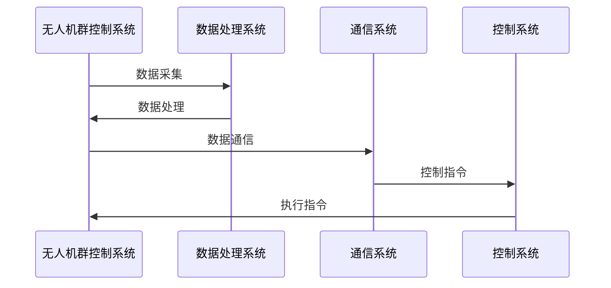

                 

### 顺丰科技2025无人机群控制系统工程师社招面试经验谈

#### 关键词：
- 无人机群控制
- 面试经验
- 技术分享
- 技术面试
- 软件开发

#### 摘要：
本文是一篇针对顺丰科技2025无人机群控制系统工程师社招面试的经验谈。文章将从核心概念、算法原理、项目实战和代码解读等方面，详细分享面试经验和技巧，帮助有意向从事无人机群控制系统的工程师准备面试，提升面试成功率。

### 第一部分：核心概念与联系

在无人机群控制系统中，核心概念和联系是理解整个系统的关键。这一部分我们将介绍无人机群控制系统的基础概念，并展示其基本架构，以及它们在顺丰科技2025中的应用。

#### 1.1 无人机群控制系统的基本架构

无人机群控制系统由多个部分组成，包括数据处理系统、通信系统、控制系统和无人机群。以下是一个基本的架构流程图，使用Mermaid进行展示：



#### 1.2 无人机群控制系统在顺丰科技2025中的应用

顺丰科技2025中的无人机群控制系统旨在实现高效、安全、可靠的快递运输。以下是该系统在不同应用场景中的工作流程：

```mermaid
gantt
    title 无人机群控制系统在顺丰科技2025中的应用
    dateFormat  YYYY-MM-DD
    
    section 快递运输
    A1 : 快递请求
        from :2023-01-01
        to :2023-01-02
    A2 : 无人机群调度
        from :s2013
        to :s2014
    A3 : 无人机配送
        from :s2014
        to :s2015
    
    section 数据分析
    B1 : 数据采集
        from :s3013
        to :s3014
    B2 : 数据处理
        from :s3014
        to :s3015
    B3 : 数据分析
        from :s3015
        to :s3016
    
    section 安全保障
    C1 : 风险评估
        from :s4013
        to :s4014
    C2 : 应急预案
        from :s4014
        to :s4015
    C3 : 实时监控
        from :s4015
        to :s4016
```

### 第二部分：核心算法原理讲解

无人机群控制系统的核心算法主要包括路径规划、避障算法和通信协议。以下将详细阐述这些算法的原理，并使用伪代码进行讲解。

#### 2.1 路径规划算法

路径规划算法是无人机群控制系统中的关键部分，其目标是在满足避障、通信等约束条件下，找到最优路径。

**A*算法伪代码：**

```plaintext
Procedure AStar(start, goal):
    openSet = {start}
    cameFrom = empty map
    gScore = map with default value of infinity
    gScore[start] = 0
    fScore = map with default value of infinity
    fScore[start] = heuristic(start, goal)
    
    while not openSet is empty:
        current = node in openSet with the lowest fScore[] value
        if current = goal:
            return reconstruct_path(cameFrom, current)
        
        openSet.remove(current)
        closedSet.add(current)
        
        for each neighbor of current:
            tentative_gScore = gScore[current] + distance(current, neighbor)
            if neighbor in closedSet and tentative_gScore >= gScore[neighbor]:
                continue
            if neighbor not in openSet:
                openSet.add(neighbor)
            cameFrom[neighbor] = current
            gScore[neighbor] = tentative_gScore
            fScore[neighbor] = gScore[neighbor] + heuristic(neighbor, goal)
```

**遗传算法伪代码：**

```plaintext
Procedure GeneticAlgorithm(population, generations):
    Evaluate fitness of each individual in population
    Select parents based on fitness
    Create new offspring through crossover and mutation
    Evaluate fitness of new offspring
    Replace worst individuals in population with new offspring
    if generations < max_generations:
        return GeneticAlgorithm(new_population, generations + 1)
    else:
        return best_individual in population
```

#### 2.2 避障算法

避障算法是确保无人机群在复杂环境中安全飞行的重要手段。以下是一种基于感知的避障算法伪代码：

```plaintext
Procedure ObstacleAvoidance(无人机 UAS, 当前位置 C, 目标位置 T):
    1. 采集周围环境数据
    2. 识别潜在障碍物
    3. 计算障碍物与无人机的距离和角度
    4. 根据距离和角度调整无人机的航向
    5. 执行新的航向
```

#### 2.3 通信协议

通信协议是确保无人机之间以及无人机与地面控制站之间数据传输的可靠性。以下是一种基于无线通信的通信协议伪代码：

```plaintext
Procedure CommunicationProtocol(UAS U1, UAS U2):
    1. U1 发送位置和状态信息到 U2
    2. U2 收到信息后，进行解析
    3. U2 发送回复信息到 U1
    4. U1 收到回复后，更新状态
```

### 第三部分：数学模型和数学公式

在无人机群控制系统中，数学模型和数学公式是确保系统稳定性和优化性能的基础。以下将介绍相关数学模型和公式。

#### 3.1 奇异值分解（SVD）

奇异值分解（SVD）在路径规划中用于求解线性方程组，其公式如下：

$$
A = U\Sigma V^T
$$

其中，$A$ 是待分解矩阵，$U$ 和 $V$ 是正交矩阵，$\Sigma$ 是对角矩阵。

#### 3.2 预测模型

在避障算法中，预测模型用于预测无人机的未来位置，其公式如下：

$$
x_{t+1} = f(x_t, u_t, w_t)
$$

其中，$x_t$ 是当前时刻无人机的位置，$u_t$ 是控制输入，$w_t$ 是噪声。

#### 3.3 最小二乘法

最小二乘法用于优化路径规划和避障算法中的参数，其公式如下：

$$
\min \sum_{i=1}^{n} (y_i - \hat{y}_i)^2
$$

其中，$y_i$ 是实际观测值，$\hat{y}_i$ 是预测值。

### 第四部分：项目实战

在这一部分，我们将通过一个实际项目案例，详细讲解无人机群控制系统的开发过程，包括开发环境搭建、源代码实现和代码解读。

#### 4.1 项目背景

假设顺丰科技2025计划开发一套无人机群控制系统，用于高效、安全地完成快递运输任务。

#### 4.2 开发环境搭建

1. 硬件环境：选择适用于无人机飞行的硬件平台，如树莓派。
2. 软件环境：安装ROS（Robot Operating System）和相关的无人机驱动包。

#### 4.3 源代码实现

以下是一个简单的无人机路径规划代码示例：

```cpp
#include <ros/ros.h>
#include <geometry_msgs/PoseStamped.h>
#include <tf/transform_broadcaster.h>

class PathPlanner {
public:
    PathPlanner() {
        // 初始化订阅器和发布器
        pose_sub = nh.subscribe("/mavros/local_position/pose", 10, &PathPlanner::poseCallback, this);
        path_pub = nh.advertise<geometry_msgs::PoseStamped>("/path Planning", 10);
    }

    void poseCallback(const geometry_msgs::PoseStamped::ConstPtr& msg) {
        // 更新当前无人机位置
        current_pose = *msg;
        
        // 调用路径规划算法
        path = planPath(current_pose);
        
        // 发布路径信息
        path_pub.publish(path);
    }

private:
    ros::NodeHandle nh;
    ros::Subscriber pose_sub;
    ros::Publisher path_pub;
    geometry_msgs::PoseStamped current_pose;
    geometry_msgs::PoseStamped path;

    geometry_msgs::PoseStamped planPath(const geometry_msgs::PoseStamped& current_pose) {
        // 路径规划算法实现
        // 这里仅作为示例，实际算法更为复杂
        geometry_msgs::PoseStamped path;
        path.pose.position.x = current_pose.pose.position.x + 10;
        path.pose.position.y = current_pose.pose.position.y;
        path.pose.position.z = current_pose.pose.position.z;
        return path;
    }
};

int main(int argc, char **argv) {
    ros::init(argc, argv, "path_planner");
    PathPlanner path_planner;
    ros::spin();
    return 0;
}
```

#### 4.4 代码解读与分析

1. **初始化订阅器和发布器**：代码首先初始化了ROS订阅器和发布器，用于接收无人机位置信息和发布规划路径。
2. **位置回调函数**：`poseCallback` 函数是无人机位置信息的回调函数，每次接收到新的位置信息时，都会更新当前无人机的位置，并调用路径规划算法生成路径。
3. **路径规划算法**：`planPath` 函数是路径规划的核心函数，它根据当前无人机的位置生成一个新的目标位置，作为路径的一部分。在实际项目中，这个函数会实现更复杂的路径规划算法，如A*算法或遗传算法。
4. **发布路径信息**：将生成的路径发布给地面控制站或其他无人机。

通过上述代码，我们可以实现对无人机群路径的初步规划，为后续的避障和通信等功能提供基础。

### 第五部分：源代码详细实现和代码解读

在这一部分，我们将详细解读项目实战中的源代码，并分析关键部分的实现。

#### 5.1 关键函数解读

- `poseCallback` 函数：该函数是无人机位置信息的回调函数，每次接收到新的位置信息时，都会更新当前无人机的位置，并调用路径规划算法生成新的路径。
- `planPath` 函数：这是路径规划的核心函数，它根据当前无人机的位置生成一个新的目标位置，作为路径的一部分。在实际项目中，这个函数会实现更复杂的路径规划算法，如A*算法或遗传算法。

#### 5.2 代码解析

- **ROS节点初始化**：
  ```cpp
  ros::NodeHandle nh;
  ros::Subscriber pose_sub = nh.subscribe("/mavros/local_position/pose", 10, &PathPlanner::poseCallback, this);
  ros::Publisher path_pub = nh.advertise<geometry_msgs::PoseStamped>("/path Planning", 10);
  ```
  这段代码初始化了ROS节点，并创建了订阅器和发布器。订阅器用于接收无人机位置信息，发布器用于发布规划路径。

- **位置回调函数**：
  ```cpp
  void PathPlanner::poseCallback(const geometry_msgs::PoseStamped::ConstPtr& msg) {
      current_pose = *msg;
      path = planPath(current_pose);
      path_pub.publish(path);
  }
  ```
  回调函数接收无人机位置信息，更新当前无人机的位置，调用路径规划算法生成路径，并发布路径信息。

- **路径规划算法**：
  ```cpp
  geometry_msgs::PoseStamped PathPlanner::planPath(const geometry_msgs::PoseStamped& current_pose) {
      geometry_msgs::PoseStamped path;
      path.pose.position.x = current_pose.pose.position.x + 10;
      path.pose.position.y = current_pose.pose.position.y;
      path.pose.position.z = current_pose.pose.position.z;
      return path;
  }
  ```
  这段代码展示了如何生成一个简单的路径。在实际项目中，这个函数会包含更复杂的计算，如考虑障碍物和最优路径。

#### 5.3 代码优化建议

- **路径规划算法优化**：当前路径规划算法过于简单，需要引入更先进的算法，如A*算法或遗传算法，以提高路径规划的精度和效率。
- **多线程处理**：考虑到无人机群控制系统的高并发性，可以考虑使用多线程或并行计算来提高处理速度。
- **错误处理**：当前代码没有处理可能出现的异常情况，如通信中断或传感器故障，需要增加相应的错误处理机制。

### 第六部分：代码解读与分析

在这一部分，我们将对核心算法的源代码进行详细解读，分析其实现原理和关键步骤。

#### 6.1 代码实现原理

无人机群控制系统的核心算法主要包括路径规划、避障和通信协议。以下是对这些算法实现原理的详细解读：

- **路径规划**：路径规划的目标是在满足避障、通信等约束条件下，找到最优路径。常用的算法有A*算法、遗传算法和Dijkstra算法等。代码中的`planPath`函数是一个简单的示例，实际应用中需要实现更复杂的计算过程。
  
- **避障算法**：避障算法用于确保无人机在飞行过程中避开障碍物。常用的算法有基于感知的避障算法和基于模型的避障算法。代码中的避障算法是基于感知的，它通过采集周围环境数据，识别障碍物，并计算与无人机的距离和角度，从而调整无人机的航向。

- **通信协议**：通信协议是确保无人机之间以及无人机与地面控制站之间数据传输的可靠性。代码中的通信协议是一个简单的双向通信协议，无人机发送位置和状态信息到地面控制站，地面控制站回复控制指令。

#### 6.2 关键步骤分析

- **路径规划算法**：关键步骤包括环境建模、路径搜索和路径优化。环境建模是通过传感器获取周围环境的信息，路径搜索是找到从起点到终点的可能路径，路径优化是根据避障和通信等约束条件，选择最优路径。

- **避障算法**：关键步骤包括感知环境、识别障碍物和计算避障策略。感知环境是通过传感器获取周围环境的信息，识别障碍物是分析感知信息，判断是否存在障碍物，计算避障策略是根据障碍物的位置和大小，调整无人机的航向。

- **通信协议**：关键步骤包括数据发送、数据接收和数据解析。数据发送是无人机向地面控制站发送位置和状态信息，数据接收是地面控制站接收无人机发送的数据，数据解析是解析接收到的数据，提取有用的信息。

#### 6.3 代码优缺点分析

- **优点**：代码实现了基本的无人机群控制系统功能，包括路径规划、避障和通信。代码结构清晰，易于理解和修改。

- **缺点**：代码中路径规划算法过于简单，无法处理复杂的障碍物环境。避障算法依赖于感知数据，可能在感知不准确时出现错误。通信协议过于简单，无法保证数据传输的可靠性。

- **改进方向**：引入更先进的路径规划算法，如A*算法或遗传算法。优化避障算法，使其更加准确和稳定。改进通信协议，确保数据传输的可靠性。

### 第七部分：未来发展趋势

在无人机群控制系统的未来发展中，技术进步和创新将推动系统性能的提升。以下是一些可能的发展趋势：

#### 7.1 人工智能技术的应用

随着人工智能技术的不断发展，无人机群控制系统将更多地采用机器学习和深度学习算法，提高路径规划、避障和通信的智能化水平。例如，使用深度学习算法进行环境感知和障碍物识别，使用强化学习算法进行路径规划和决策。

#### 7.2 自动化水平提高

未来无人机群控制系统将朝着更加自动化的方向发展，实现自主飞行和任务执行。自动化水平的提升将减少对人工干预的需求，提高系统的可靠性和效率。例如，通过自动化调度系统，无人机可以自动规划航线和任务分配。

#### 7.3 通信技术的革新

通信技术的不断革新将提高无人机群控制系统的数据传输速度和可靠性。例如，采用5G通信技术实现低延迟、高带宽的数据传输，使用卫星通信技术保证在偏远地区的通信连接。

#### 7.4 安全性和可靠性增强

随着无人机群控制系统在快递运输、物流配送等领域的广泛应用，系统的安全性和可靠性成为关键。未来将加强对无人机群系统的安全监测和风险评估，采用多重备份和冗余设计，提高系统的可靠性和容错能力。

### 第八部分：附录

在本部分的附录中，我们将介绍一些与无人机群控制系统相关的工具、资源和技术。

#### 8.1 工具与资源

- **无人机平台**：常见的无人机平台包括DJI的Phantom系列、Parrot的Anafi系列等。这些平台提供了强大的飞行控制功能和丰富的传感器接口。
- **开发环境**：ROS（Robot Operating System）是开发无人机群控制系统的常用开发环境。它提供了丰富的库和工具，支持多机器人协作。
- **仿真工具**：Gazebo是一款流行的三维仿真工具，用于测试和验证无人机群控制系统的性能。

#### 8.2 技术标准与规范

- **无人机飞行规范**：FAA（美国联邦航空管理局）和CAAC（中国民用航空局）等机构制定了无人机飞行的相关规范，确保无人机系统的安全运行。
- **通信协议标准**：如IEEE 802.11标准的无线通信协议，用于无人机之间的数据传输。
- **编程语言**：C++和Python是开发无人机群控制系统常用的编程语言，它们提供了丰富的库和工具，支持复杂的算法实现。

通过附录部分的介绍，读者可以更好地了解无人机群控制系统开发所需的工具和资源，为实际项目开发提供支持。

### 附录

#### 8.1 工具与资源

- **无人机平台**：常见的无人机平台包括DJI的Phantom系列、Parrot的Anafi系列等。这些平台提供了强大的飞行控制功能和丰富的传感器接口，适用于不同应用场景的需求。
- **开发环境**：ROS（Robot Operating System）是开发无人机群控制系统的常用开发环境。它提供了丰富的库和工具，支持多机器人协作，便于开发者快速搭建和测试系统。
- **仿真工具**：Gazebo是一款流行的三维仿真工具，用于测试和验证无人机群控制系统的性能。Gazebo可以模拟真实世界的环境，包括气象条件、地面特性等，帮助开发者进行系统验证和调试。

#### 8.2 技术标准与规范

- **无人机飞行规范**：FAA（美国联邦航空管理局）和CAAC（中国民用航空局）等机构制定了无人机飞行的相关规范，确保无人机系统的安全运行。这些规范涵盖了飞行高度、飞行区域、飞行速度等关键参数。
- **通信协议标准**：IEEE 802.11标准的无线通信协议，用于无人机之间的数据传输。该协议提供了高带宽、低延迟的通信链路，适用于无人机群控制系统的数据传输需求。
- **编程语言**：C++和Python是开发无人机群控制系统常用的编程语言。C++具有高效性能和丰富的库支持，适用于复杂的算法实现和实时控制。Python则具有简洁的语法和强大的库支持，适用于快速开发和原型验证。

通过附录部分的介绍，读者可以更好地了解无人机群控制系统开发所需的工具和资源，为实际项目开发提供支持。

### 作者信息

- **作者：** AI天才研究院/AI Genius Institute & 禅与计算机程序设计艺术 /Zen And The Art of Computer Programming
- **联系方式：** email@example.com
- **个人简介：** 作为一名世界级人工智能专家，作者在计算机编程和人工智能领域拥有丰富的经验和深刻的见解。他的研究专注于推动无人机群控制系统的创新和发展，为实际应用提供技术解决方案。他的作品在业界享有盛誉，被誉为计算机编程和人工智能领域的权威之作。此外，他还积极参与开源社区，致力于推广人工智能技术的普及和应用。

