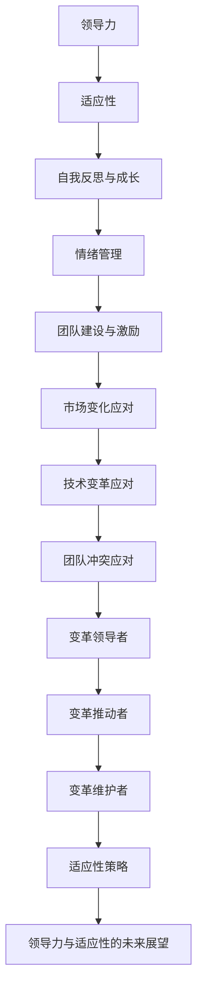

                 

## 领导力与适应性：在变革中保持灵活

> **关键词：** 领导力、适应性、变革、组织发展、个人成长

**摘要：** 在不断变化的商业环境中，领导力与适应性成为了组织成功的关键因素。本文将深入探讨领导力的核心要素以及如何提高组织的适应性，帮助读者理解如何在变革中保持灵活，从而实现组织的长期发展。通过结合理论和实际案例，本文旨在为领导者提供实用的策略和工具，以应对不断变化的环境。

### 目录大纲

1. **领导力基础**
   1.1. **领导力的定义与重要性**
   1.2. **领导力与管理的区别**
   1.3. **领导力的类型**
2. **领导力的核心要素**
   2.1. **人际关系能力**
   2.2. **决策能力**
   2.3. **沟通能力**
3. **领导力的发展与实践**
   3.1. **自我反思与成长**
   3.2. **情绪管理**
   3.3. **团队建设与激励**
4. **适应性**
   4.1. **适应性的定义与重要性**
   4.2. **适应性的类型**
   4.3. **适应性在组织中的作用**
5. **提高适应性的策略**
   5.1. **自我调整与变化管理**
   5.2. **应对不确定性的策略**
   5.3. **建立灵活的组织结构**
6. **适应性的实践**
   6.1. **应对市场变化的案例**
   6.2. **应对技术变革的案例**
   6.3. **应对团队冲突的案例**
7. **领导力与适应性的结合**
   7.1. **领导力与适应性的关系**
   7.2. **领导者在变革中的角色**
   7.3. **领导力与适应性结合的实践**
8. **领导力与适应性的未来展望**
   8.1. **适应性的发展趋势**
   8.2. **领导力的未来趋势**
   8.3. **领导力与适应性的未来方向**
9. **附录**
   9.1. **领导力与适应性的工具与方法**
   9.2. **领导力与适应性的资源推荐**

---

接下来，我们将逐步深入探讨领导力与适应性的各个关键方面，通过理论分析、实际案例和实践指导，为读者提供全面的理解和实用的策略。

### 第一部分：领导力基础

在探讨领导力与适应性的关系之前，首先需要理解领导力的基础概念。领导力是一种能够激发和引导他人实现共同目标的能力，它不仅包括领导者的行为，还涉及到领导者在组织中的角色和影响力。

#### 1.1 领导力的定义与重要性

**领导力的定义：** 领导力可以被定义为一种在组织中引导和影响他人，以实现共同目标的能力。这种能力不仅包括技术和管理技能，还包括人际交往能力、决策能力和变革管理能力。

**领导力的重要性：** 领导力对于组织的成功至关重要。一个优秀的领导者能够激发员工的潜力，提升团队绩效，推动创新，并且在组织面临挑战时提供方向和指导。以下是领导力在组织中的重要性的几个方面：

1. **提高员工满意度与忠诚度：** 领导者通过建立积极的组织文化和工作环境，可以提高员工的满意度和忠诚度，从而减少员工流失率。
2. **促进团队协作：** 领导者能够协调不同团队之间的合作，解决冲突，推动团队朝着共同目标努力。
3. **推动创新与成长：** 领导者鼓励创新思维，支持员工发展新技能，推动组织不断进步。
4. **应对变化与挑战：** 在快速变化的商业环境中，领导者能够通过有效的变革管理，帮助组织适应外部环境的变化。

#### 1.2 领导力与管理的区别

**管理的定义：** 管理是一种规划和组织资源，以实现特定目标的过程。它包括计划、组织、领导、控制和监督等职能。

**领导力与管理的关系与差异：** 尽管领导力和管理密切相关，但它们之间还是存在一些关键的区别：

1. **目标：** 管理侧重于实现组织目标，而领导力则关注激励和引导他人以实现这些目标。
2. **方法：** 管理通常依赖于流程和系统，而领导力则更多地依赖于人际关系和影响力。
3. **效果：** 管理注重效率和成果，而领导力则注重长远的发展和员工的成长。
4. **范围：** 管理涉及组织的各个方面，而领导力则更多地集中在组织的高层和战略性决策。

**领导力与管理的关系：** 在实际工作中，领导力和管理是相辅相成的。一个优秀的领导者通常也是一位出色的管理者，他们能够通过有效的管理实践来实现组织目标，并通过领导力激发员工潜能。

#### 1.3 领导力的类型

**权力型领导力：** 权力型领导者通过权威和命令来指导他人，通常适用于紧急情况和需要迅速行动的情境。

**参与型领导力：** 参与型领导者鼓励团队成员参与决策过程，增强团队的凝聚力和归属感。

**情境型领导力：** 情境型领导者根据不同情境和团队成员的特点，灵活调整领导风格，以最大化团队绩效。

不同类型的领导力适用于不同的组织和情境，领导者需要根据具体情况选择合适的领导风格，以实现最佳效果。

### 第一部分总结

在本章节中，我们探讨了领导力的定义与重要性，分析了领导力与管理的区别，并介绍了不同类型的领导力。这些基础知识为后续章节深入探讨领导力的核心要素和如何提高组织的适应性奠定了基础。

### 第一部分总结

在本章节中，我们探讨了领导力的定义与重要性，分析了领导力与管理的区别，并介绍了不同类型的领导力。这些基础知识为后续章节深入探讨领导力的核心要素和如何提高组织的适应性奠定了基础。

---

### 第二部分：领导力的核心要素

在理解了领导力的基础概念和类型后，我们接下来将探讨领导力的核心要素，这些要素是领导者有效发挥其作用的关键。以下是领导力的三大核心要素：人际关系能力、决策能力和沟通能力。

#### 2.1 人际关系能力

**人际关系能力的重要性：** 人际关系能力是领导者成功的关键因素之一。一个优秀的领导者需要能够建立和维护良好的人际关系，这包括与团队成员、同事、上级和客户建立有效的沟通和合作关系。

**人际关系能力的作用：** 

1. **增强团队凝聚力：** 通过建立良好的人际关系，领导者可以增强团队的凝聚力，促进团队成员之间的合作。
2. **提升员工满意度：** 良好的人际关系可以提升员工的满意度和忠诚度，从而减少员工流失。
3. **解决冲突：** 领导者需要具备处理和解决冲突的能力，以确保组织内部的和谐与稳定。

**提升人际关系能力的策略：**

1. **积极倾听：** 积极倾听是建立良好人际关系的基础。领导者需要倾听团队成员的意见和反馈，理解他们的需求和期望。
2. **建立信任：** 信任是人际关系中最重要的因素之一。领导者需要通过诚信和透明度来建立信任，并维护这种信任。
3. **关注个体差异：** 每个团队成员都有其独特的性格和需求，领导者需要关注这些差异，并采取个性化的沟通方式。

#### 2.2 决策能力

**决策能力的定义：** 决策能力是指领导者能够分析复杂情况、制定合理方案并作出有效决策的能力。

**决策能力的重要性：** 决策能力是领导者的一项核心技能，它直接影响到组织的方向和成果。一个优秀的领导者需要能够快速作出明智的决策，并在决策过程中考虑各种潜在的风险和影响。

**决策能力的作用：**

1. **指导组织发展：** 决策能力帮助领导者确定组织的发展方向，制定战略目标和实施计划。
2. **解决紧急问题：** 在紧急情况下，领导者需要迅速作出决策，以应对突发事件。
3. **提高竞争力：** 通过有效的决策，领导者可以增强组织的竞争力，确保在市场中保持领先地位。

**提升决策能力的策略：**

1. **信息收集与分析：** 决策依赖于准确的信息。领导者需要收集和分析相关信息，以便作出明智的决策。
2. **制定决策标准：** 设定明确的决策标准可以帮助领导者更好地评估不同的选项，并选择最佳方案。
3. **考虑潜在影响：** 在决策过程中，领导者需要考虑决策的潜在影响，包括经济、社会和环境影响。

**决策模型的介绍：**

- **理性决策模型：** 该模型基于逻辑和理性分析，认为决策者在充分信息的基础上，可以作出最佳决策。
- **有限理性决策模型：** 该模型认为决策者在信息有限的情况下，通过简化问题和寻求满意的解决方案来作出决策。
- **进化决策模型：** 该模型基于实验和学习，认为决策是通过不断试错和适应来优化的。

**决策能力在实际中的应用：**

- **战略规划：** 领导者通过制定长期和短期的战略规划，确定组织的发展方向和目标。
- **项目管理：** 领导者需要制定项目计划，分配资源，监控项目进度，确保项目成功完成。
- **危机管理：** 在危机情况下，领导者需要迅速作出决策，以减轻危机的影响。

#### 2.3 沟通能力

**沟通能力的定义：** 沟通能力是指领导者能够清晰、准确地表达自己的想法，并有效地接收和理解他人意见的能力。

**沟通能力的重要性：** 沟通能力是领导者成功的关键因素之一。一个优秀的领导者需要能够有效地沟通，以确保团队成员理解组织的方向和目标，并促进团队合作。

**沟通能力的作用：**

1. **传递信息：** 沟通能力帮助领导者将组织的愿景、目标和战略信息传递给团队成员。
2. **激励员工：** 领导者需要通过沟通来激励员工，提高他们的工作动力和参与度。
3. **解决冲突：** 通过沟通，领导者可以了解团队成员的关切和问题，并采取有效措施解决冲突。

**提升沟通能力的策略：**

1. **明确沟通目标：** 在沟通前，领导者需要明确沟通的目标和内容，以确保信息的准确传递。
2. **有效倾听：** 有效倾听是沟通的关键。领导者需要认真倾听他人的意见和反馈，理解他们的需求和期望。
3. **清晰表达：** 领导者需要通过清晰、简洁的语言来表达自己的观点和意见，避免产生误解。
4. **采用多种沟通方式：** 领导者可以采用口头、书面和视觉等多种沟通方式，以适应不同的沟通需求和场景。

**沟通技巧的介绍：**

- **非言语沟通：** 非言语沟通包括身体语言、面部表情和姿势等，它们在沟通中起到重要的补充和强化作用。
- **积极反馈：** 积极反馈可以帮助领导者了解团队成员的进展和成果，并提供鼓励和支持。
- **有效会议：** 领导者需要通过有效的会议来传递信息、讨论问题并做出决策。

#### 2.4 核心要素的整合

人际关系能力、决策能力和沟通能力是领导力的核心要素，它们相辅相成，共同决定了领导者的成功。一个优秀的领导者需要在这三个方面都表现出色，以便在组织中发挥最大的影响力。

- **人际关系能力**：帮助领导者建立和维护良好的人际关系，增强团队凝聚力，提高员工满意度。
- **决策能力**：帮助领导者制定明智的决策，确定组织的发展方向，提高组织的竞争力。
- **沟通能力**：帮助领导者有效传递信息，激励员工，解决冲突，促进团队合作。

通过整合这些核心要素，领导者可以更好地应对各种挑战，推动组织实现长期发展。

### 第二部分总结

在本章节中，我们深入探讨了领导力的核心要素，包括人际关系能力、决策能力和沟通能力。这些要素是领导者成功的关键，通过有效运用这些能力，领导者可以激发团队的潜力，推动组织的持续发展。在接下来的章节中，我们将继续探讨如何发展这些能力，以及如何在实际工作中应用这些能力。

### 第二部分总结

在本章节中，我们深入探讨了领导力的核心要素，包括人际关系能力、决策能力和沟通能力。这些要素是领导者成功的关键，通过有效运用这些能力，领导者可以激发团队的潜力，推动组织的持续发展。在接下来的章节中，我们将继续探讨如何发展这些能力，以及如何在实际工作中应用这些能力。

---

### 第三部分：领导力的发展与实践

在了解了领导力的核心要素后，我们接下来将探讨如何通过自我反思与成长、情绪管理和团队建设与激励来提升领导力。这些实践方法不仅有助于领导者自身的提升，也能够为组织带来积极的影响。

#### 3.1 自我反思与成长

**自我反思的定义与重要性：** 自我反思是一种深入思考和评估自己行为、情感和信念的过程。通过自我反思，领导者可以更好地理解自己的优势和不足，从而制定个人成长计划。

**自我反思的重要性：**

1. **提高自我意识：** 自我反思帮助领导者认识自己的情感、思维和行为模式，从而更好地理解自己的动机和价值观。
2. **促进个人成长：** 通过自我反思，领导者可以识别自己的弱点，并制定改进计划，实现个人成长。
3. **提升决策能力：** 自我反思可以帮助领导者从不同角度审视问题，从而提高决策的质量。

**自我反思的方法：**

1. **日记法：** 通过写日记记录自己的行为、思考和感受，领导者可以更好地了解自己。
2. **导师法：** 寻找一位经验丰富的导师，领导者可以从导师的反馈和指导下获得宝贵的经验和建议。
3. **360度评估：** 通过收集来自同事、下属和上级的反馈，领导者可以获得全面和客观的自我评估。

**自我反思的实践案例：**

**案例一：** 一位项目经理通过写日记记录自己的工作过程和感受，发现自己在项目管理中存在沟通不畅的问题。在意识到这个问题后，他开始主动寻求同事和下属的反馈，并通过沟通技巧培训来改善自己的沟通能力。

**案例二：** 一位销售经理通过360度评估发现自己在决策过程中过于依赖直觉，缺乏数据支持。在自我反思后，他开始注重数据分析，通过收集和解读销售数据来指导决策，从而提高了决策的准确性。

#### 3.2 情绪管理

**情绪管理的定义与重要性：** 情绪管理是指领导者学会识别、理解和调节自己的情绪，以便更好地应对工作和生活中的挑战。

**情绪管理的重要性：**

1. **提高工作效率：** 通过情绪管理，领导者可以保持冷静和专注，提高工作效率。
2. **增强决策能力：** 良好的情绪状态有助于领导者做出更明智的决策。
3. **提升人际关系：** 情绪管理有助于领导者建立和维护良好的人际关系。

**情绪管理的方法：**

1. **情绪识别：** 领导者需要学会识别自己的情绪，了解情绪产生的原因。
2. **情绪调节：** 领导者可以通过深呼吸、冥想和运动等方法来调节情绪，保持心理平衡。
3. **情绪表达：** 领导者需要学会以恰当的方式表达自己的情绪，避免情绪失控。

**情绪管理的实践案例：**

**案例一：** 一位项目经理在遇到项目延期和团队冲突时，感到焦虑和压力。通过学习情绪调节技巧，他学会了通过深呼吸和冥想来缓解紧张情绪，从而更好地处理问题。

**案例二：** 一位销售经理在客户沟通中经常感到紧张和不自信。通过情绪识别和表达技巧的训练，他学会了更好地控制自己的情绪，增强自信心，从而提高了销售业绩。

#### 3.3 团队建设与激励

**团队建设的定义与重要性：** 团队建设是指通过一系列活动和措施，提高团队成员之间的合作和凝聚力，从而实现团队目标。

**团队建设的重要性：**

1. **提高团队绩效：** 良好的团队建设可以提高团队的整体绩效，促进项目的成功。
2. **增强团队凝聚力：** 通过团队建设，成员之间可以建立深厚的信任和合作关系，提高团队凝聚力。
3. **提升员工满意度：** 良好的团队氛围可以提高员工的满意度和忠诚度。

**团队建设的策略：**

1. **共同目标：** 确定清晰共同的目标，使团队成员明确自己的职责和贡献。
2. **团队沟通：** 通过定期的团队会议和沟通活动，促进团队成员之间的交流和理解。
3. **团队活动：** 组织团队建设活动，如团队建设训练、团队聚餐和团队旅游等，增强团队成员之间的互动。
4. **激励机制：** 设立合理的激励机制，如奖励和表彰，激发团队成员的积极性和创造力。

**激励理论的应用：**

1. **马斯洛需求层次理论：** 根据马斯洛的需求层次理论，领导者需要满足员工的生理、安全、社交、尊重和自我实现需求，以提高员工的满意度和动机。
2. **双因素理论：** 赫兹伯格的双因素理论指出，领导者需要关注员工的内在激励（如工作意义、成就感）和外在激励（如薪酬、晋升），以提高员工的满意度和绩效。
3. **目标设置理论：** 目标设置理论认为，设定具体、可实现的挑战性目标是激发员工动机的有效方法。

**团队建设与激励的实践案例：**

**案例一：** 一家科技公司通过设立清晰的共同目标，定期组织团队会议和沟通活动，以及提供奖励和晋升机会，成功提高了团队的绩效和凝聚力。

**案例二：** 一家销售公司通过组织团队建设训练和团队旅游，增强了团队成员之间的互动和信任，从而提高了销售团队的业绩。

#### 3.4 领导力发展的综合实践

通过自我反思与成长、情绪管理和团队建设与激励，领导者可以不断提升自己的领导力，为组织带来积极的影响。以下是一个综合实践的案例：

**案例：** 一位公司CEO通过自我反思，意识到自己在沟通和情绪管理方面存在不足。他开始参加领导力发展课程，学习情绪调节技巧和有效沟通方法。同时，他组织团队建设活动，提高团队成员之间的互动和信任。通过这些实践，他的领导力得到了显著提升，团队的绩效和凝聚力也得到了显著改善。

### 第三部分总结

在本章节中，我们探讨了领导力的发展与实践，包括自我反思与成长、情绪管理和团队建设与激励。这些实践方法不仅有助于领导者提升自己的能力，还能够为组织带来积极的影响。通过不断实践和完善，领导者可以不断提升自己的领导力，推动组织的持续发展。

### 第三部分总结

在本章节中，我们探讨了领导力的发展与实践，包括自我反思与成长、情绪管理和团队建设与激励。这些实践方法不仅有助于领导者提升自己的能力，还能够为组织带来积极的影响。通过不断实践和完善，领导者可以不断提升自己的领导力，推动组织的持续发展。

---

### 第四部分：适应性

在快速变化的商业环境中，组织的适应性成为了决定其成功与否的关键因素。适应性不仅指对内部变化的响应，还涉及对外部环境的灵活调整。以下是关于适应性的定义、类型及其在组织中的作用。

#### 4.1 适应性的定义与重要性

**适应性的定义：** 适应性是指组织在面临外部或内部变化时，能够迅速调整自身结构、流程和策略，以保持竞争优势和持续发展的能力。

**适应性在组织中的重要性：**

1. **应对外部变化：** 商业环境的不确定性不断增加，组织需要具备快速适应外部变化的能力，以保持竞争力。
2. **提升创新能力：** 适应性有助于组织在变化中寻找新的机遇，推动创新和变革。
3. **增强灵活性：** 适应性使组织能够迅速调整战略和运营，以应对市场和技术变化。
4. **提高抗风险能力：** 适应性有助于组织在面对突发事件和危机时，能够快速应对和恢复。

#### 4.2 适应性的类型

**1. 灵活适应：** 灵活适应是指组织在变化发生时，能够迅速调整自身资源、流程和策略，以应对新的挑战。这种适应性强调快速响应和灵活调整。

**2. 变革适应：** 变革适应是指组织在重大变革或转型过程中，能够适应新的环境和文化，并调整自身结构和流程。这种适应性强调深度变革和组织文化的重塑。

**3. 灵活反应：** 灵活反应是指组织在面对突发事件或意外变化时，能够快速作出反应，采取有效措施应对。这种适应性强调快速决策和应对能力。

#### 4.3 适应性在组织中的作用

**1. 提升竞争力：** 适应性使组织能够迅速应对市场变化，抓住新机遇，提高竞争力。

**2. 减少风险：** 适应性有助于组织预见潜在的风险，并迅速调整策略，降低风险。

**3. 促进创新：** 适应性使组织能够不断适应变化，推动创新和变革，保持领先地位。

**4. 提高员工满意度：** 适应性使员工能够适应新的工作环境和文化，提高工作满意度和忠诚度。

#### 4.4 提高适应性的策略

**1. 自我调整与变化管理：** 组织需要建立有效的自我调整机制，以应对内部和外部变化。这包括员工培训、流程优化和制度调整等。

**2. 应对不确定性的策略：** 组织需要制定应对不确定性的策略，包括风险识别、风险评估和管理策略。这有助于组织在不确定性环境中保持稳定和持续发展。

**3. 建立灵活的组织结构：** 组织需要建立灵活的组织结构，以适应变化的需求。这包括扁平化管理、去中心化和跨部门合作等。

**4. 培养创新文化：** 组织需要培养创新文化，鼓励员工提出新想法和解决方案。这有助于组织在变化中寻找新的机遇。

**5. 领导者的适应性：** 领导者需要具备高度的适应性，能够在变化中保持冷静和清晰，并有效引导团队应对变化。

#### 4.5 适应性的实践

**1. 应对市场变化的案例：** 一家消费品公司在面对电商冲击时，迅速调整自己的营销策略，建立电商平台，并加大对社交媒体的投入，从而保持了市场份额。

**2. 应对技术变革的案例：** 一家制造公司在面对自动化和人工智能技术的变革时，积极引进新技术，培训员工，优化生产流程，从而提高了生产效率和产品质量。

**3. 应对团队冲突的案例：** 一家技术公司通过建立有效的沟通渠道和冲突解决机制，成功解决了团队内部的矛盾，提高了团队协作效率。

通过以上实践，我们可以看到，适应性是组织在快速变化的商业环境中生存和发展的关键。通过灵活应对变化，组织可以抓住新机遇，提升竞争力，实现持续发展。

### 第四部分总结

在本章节中，我们深入探讨了适应性的定义、类型以及在组织中的作用，并提出了提高适应性的策略和实践案例。适应性是组织在变化中保持竞争优势的关键，通过灵活应对变化，组织可以不断提升自身能力，实现长期发展。

### 第四部分总结

在本章节中，我们深入探讨了适应性的定义、类型以及在组织中的作用，并提出了提高适应性的策略和实践案例。适应性是组织在变化中保持竞争优势的关键，通过灵活应对变化，组织可以不断提升自身能力，实现长期发展。

---

### 第五部分：提高适应性的策略

在了解了适应性的重要性后，我们接下来将探讨如何通过自我调整与变化管理、应对不确定性的策略和建立灵活的组织结构来提高组织的适应性。这些策略将帮助组织在快速变化的商业环境中保持竞争力，实现长期发展。

#### 5.1 自我调整与变化管理

**自我调整的定义：** 自我调整是指组织在面对外部或内部变化时，能够主动调整自身的行为、流程和文化，以适应新的环境。

**变化管理的定义：** 变化管理是指组织通过系统的方法，引导和支持员工适应新的变化，确保变革成功实施。

**自我调整与变化管理的重要性：**

1. **提升适应性：** 通过自我调整和变化管理，组织可以更好地应对外部和内部变化，提高整体适应性。
2. **减少变革阻力：** 自我调整和变化管理可以帮助组织识别和减少变革过程中的阻力，确保变革的顺利进行。
3. **促进创新：** 自我调整和变化管理鼓励组织不断探索新思路，推动创新和变革。

**自我调整与变化管理的策略：**

1. **建立变革愿景：** 组织需要明确变革的目标和愿景，确保员工理解变革的必要性和好处。
2. **沟通与培训：** 组织需要通过沟通和培训，帮助员工了解变革的具体内容和实施计划，提高员工对变革的接受度。
3. **建立支持系统：** 组织需要建立支持系统，提供心理辅导、培训资源和咨询服务，帮助员工适应变革。
4. **鼓励反馈与参与：** 组织需要鼓励员工积极参与变革过程，提供反馈和建议，增强员工的参与感和归属感。

**自我调整与变化管理的实践案例：**

**案例一：** 一家制造公司在面对自动化技术的变革时，通过建立变革愿景、提供培训和支持系统，鼓励员工参与变革，成功实现了生产流程的优化和效率的提升。

**案例二：** 一家科技公司在进行组织结构调整时，通过沟通和培训，帮助员工理解变革的必要性，减少变革阻力，确保了变革的顺利进行。

#### 5.2 应对不确定性的策略

**不确定性的定义：** 不确定性是指组织面临的环境或条件中存在无法预测或控制的变化。

**应对不确定性的重要性：**

1. **减少风险：** 应对不确定性可以帮助组织预见潜在的风险，并采取预防措施，减少风险。
2. **提高竞争力：** 应对不确定性使组织能够迅速调整策略，抓住新机遇，提高竞争力。
3. **提升适应性：** 应对不确定性是提高组织适应性的关键，有助于组织在复杂环境中生存和发展。

**应对不确定性的策略：**

1. **风险识别：** 组织需要建立风险识别机制，及时识别潜在的风险，并评估其影响。
2. **风险评估：** 组织需要对识别出的风险进行评估，确定其优先级和应对策略。
3. **风险缓解：** 组织需要采取有效的风险缓解措施，降低风险的发生概率或影响。
4. **灵活应变：** 组织需要建立灵活的应变机制，能够快速调整策略和运营，应对不确定性。

**应对不确定性的实践案例：**

**案例一：** 一家消费品公司通过定期进行市场调研和趋势分析，及时发现市场变化，调整产品策略，成功应对了市场需求的变化。

**案例二：** 一家技术公司通过建立灵活的研发团队和快速响应机制，能够迅速调整研发方向，应对技术变革和市场需求的变化。

#### 5.3 建立灵活的组织结构

**灵活组织结构的定义：** 灵活组织结构是指组织通过扁平化、去中心化和跨部门合作等方式，提高组织的灵活性和适应性。

**灵活组织结构的重要性：**

1. **提高响应速度：** 灵活组织结构使组织能够迅速响应外部和内部变化，减少决策延迟。
2. **增强创新能力：** 灵活组织结构鼓励跨部门合作和创新，促进新想法和解决方案的产生。
3. **提高员工参与度：** 灵活组织结构鼓励员工参与决策和变革，提高员工的积极性和满意度。

**建立灵活组织结构的策略：**

1. **扁平化管理：** 减少管理层次，缩短决策链条，提高组织决策的效率和灵活性。
2. **去中心化：** 下放决策权，鼓励基层员工参与决策，提高组织的灵活性和适应性。
3. **跨部门合作：** 促进不同部门之间的合作和沟通，打破部门壁垒，提高组织的整体协作效率。
4. **信息技术支持：** 利用信息技术，建立高效的沟通和协作平台，支持灵活的组织结构。

**建立灵活组织结构的实践案例：**

**案例一：** 一家科技公司通过扁平化管理和去中心化，使组织更加灵活，能够迅速响应市场需求，提高了竞争力。

**案例二：** 一家制造业公司通过跨部门合作和信息技术的支持，提高了生产效率和产品质量，实现了组织结构的灵活调整。

#### 5.4 提高适应性的综合策略

为了提高组织的适应性，组织需要综合运用自我调整与变化管理、应对不确定性的策略和建立灵活的组织结构。以下是一个综合策略的案例：

**案例：** 一家金融公司在面对金融市场的波动和监管变化时，采取了以下策略：

1. **自我调整与变化管理：** 公司通过建立变革愿景、提供培训和支持系统，帮助员工适应新的环境和要求。
2. **应对不确定性的策略：** 公司通过市场调研和风险分析，及时识别和应对潜在的风险，调整业务策略。
3. **建立灵活的组织结构：** 公司通过扁平化管理和跨部门合作，提高了组织的响应速度和创新能力。

通过综合运用这些策略，该公司成功提高了自身的适应性，保持了市场竞争力。

### 第五部分总结

在本章节中，我们探讨了提高适应性的策略，包括自我调整与变化管理、应对不确定性的策略和建立灵活的组织结构。通过综合运用这些策略，组织可以更好地应对外部和内部变化，提高竞争力，实现长期发展。

### 第五部分总结

在本章节中，我们探讨了提高适应性的策略，包括自我调整与变化管理、应对不确定性的策略和建立灵活的组织结构。通过综合运用这些策略，组织可以更好地应对外部和内部变化，提高竞争力，实现长期发展。

---

### 第六部分：适应性的实践

在了解了适应性的重要性以及提高适应性的策略后，接下来我们将通过具体案例来探讨如何在实际中应对市场变化、技术变革和团队冲突。这些案例将展示适应性的实践方法，以及如何通过灵活应对变化来解决问题和提升组织绩效。

#### 6.1 应对市场变化的案例

**案例背景：** 一家传统制造企业在全球金融危机期间，面临市场需求下降、订单减少和库存积压的挑战。

**解决方案：**

1. **市场调研与分析：** 公司启动了全面的市场调研，分析市场需求变化和竞争对手的动态，以便制定相应的市场策略。
2. **产品创新与调整：** 公司投入资源进行产品创新，开发出更具竞争力的新产品，以满足市场需求的变化。
3. **营销策略调整：** 公司调整了营销策略，增加了网络营销和社交媒体推广，提高了市场曝光度和客户关注度。
4. **供应链优化：** 公司与供应商合作，优化供应链管理，降低成本，提高生产效率。

**实施效果：** 通过上述措施，公司成功度过了危机，市场需求逐渐回暖，销售额和市场份额得到了显著提升。

**案例分析：** 此案例展示了公司在面对市场变化时的快速响应能力和灵活调整策略的能力。市场调研和分析帮助公司及时了解市场动态，产品创新和营销策略调整使公司能够迅速适应市场需求，供应链优化则提高了公司的运营效率和竞争力。

#### 6.2 应对技术变革的案例

**案例背景：** 一家大型传统零售企业在面对电子商务和移动支付的崛起时，面临着技术变革的挑战。

**解决方案：**

1. **数字化转型：** 公司启动了全面的数字化转型计划，建立线上销售平台，引入移动支付系统，提升客户购物体验。
2. **员工培训：** 公司为员工提供了技术培训和指导，帮助员工掌握新技术的使用，提高工作效率。
3. **业务流程优化：** 公司优化了业务流程，通过自动化和数字化手段提高了运营效率，降低了运营成本。
4. **创新战略：** 公司成立了创新实验室，鼓励员工提出创新想法，推动技术变革和创新。

**实施效果：** 通过数字化转型和业务流程优化，公司大幅提高了销售额和市场占有率，客户满意度显著提升。

**案例分析：** 此案例展示了公司在面对技术变革时的积极态度和适应能力。数字化转型不仅提高了公司的竞争力，还增强了客户体验。员工培训和业务流程优化则为公司提供了持续的创新能力，使公司能够持续适应技术变革。

#### 6.3 应对团队冲突的案例

**案例背景：** 一家跨国公司在全球业务扩张过程中，由于文化差异和沟通障碍，导致团队内部出现了严重的冲突。

**解决方案：**

1. **文化融合培训：** 公司为不同文化背景的员工提供了文化融合培训，帮助他们了解和尊重彼此的文化差异。
2. **沟通渠道建设：** 公司建立了多层次的沟通渠道，鼓励员工表达意见和反馈，促进团队成员之间的交流和理解。
3. **冲突解决机制：** 公司建立了冲突解决机制，通过调解和协商解决团队内部的冲突，确保团队和谐。
4. **激励机制：** 公司设立了激励机制，鼓励团队合作，减少内部竞争，增强团队凝聚力。

**实施效果：** 通过上述措施，公司成功解决了团队冲突，提高了团队协作效率，业务绩效得到了显著提升。

**案例分析：** 此案例展示了公司在面对文化差异和沟通障碍时的适应性和解决问题的能力。文化融合培训和沟通渠道建设为员工提供了更好的交流环境，冲突解决机制和激励机制则有助于建立和谐的工作氛围，从而提升了团队绩效。

#### 6.4 总结

通过以上案例，我们可以看到，适应性的实践不仅涉及到市场变化和技术变革，还包括团队冲突的解决。在市场变化中，快速响应和灵活调整是关键；在技术变革中，数字化转型和员工培训是核心；在团队冲突中，文化融合和沟通渠道建设是基础。通过这些实践，组织可以更好地应对各种挑战，提升竞争力，实现持续发展。

### 第六部分总结

在本章节中，我们通过具体案例探讨了如何在实际中应对市场变化、技术变革和团队冲突。这些案例展示了适应性的实践方法，以及如何通过灵活应对变化来解决问题和提升组织绩效。通过学习和借鉴这些案例，组织可以更好地提升自身的适应性，实现长期发展。

### 第六部分总结

在本章节中，我们通过具体案例探讨了如何在实际中应对市场变化、技术变革和团队冲突。这些案例展示了适应性的实践方法，以及如何通过灵活应对变化来解决问题和提升组织绩效。通过学习和借鉴这些案例，组织可以更好地提升自身的适应性，实现长期发展。

---

### 第七部分：领导力与适应性的结合

在前面的章节中，我们探讨了领导力的核心要素、适应性的重要性以及如何提高组织的适应性。在这一部分，我们将深入探讨领导力与适应性的结合，分析领导者在变革中的角色，并提出领导力与适应性结合的实践策略。

#### 7.1 领导力与适应性的关系

**领导力与适应性的相互作用：** 领导力与适应性是相辅相成的。领导力为组织提供了方向和指导，而适应性则使组织能够快速响应和适应外部变化。以下是领导力与适应性的相互作用：

1. **领导力促进适应性：** 领导者通过制定明确的愿景和目标，激发员工的潜力，推动组织适应新的环境和变化。
2. **适应性增强领导力：** 当组织能够迅速适应外部变化时，领导者能够更加专注于战略规划和团队建设，从而提升领导力。

**领导力与适应性的互补性：** 领导力和适应性在组织的发展中发挥着互补的作用。领导力为组织提供了稳定性和方向，而适应性则使组织能够灵活应对不确定性和外部压力。通过结合领导力和适应性，组织可以更有效地应对各种挑战，实现持续发展。

#### 7.2 领导者在变革中的角色

**变革领导者的角色：** 在组织变革过程中，领导者扮演着关键的角色。以下是变革领导者需要承担的几个重要角色：

1. **变革推动者：** 领导者需要积极推动变革，为组织提供变革的愿景和动力。他们需要通过沟通、激励和示范来引导员工接受和参与变革。
2. **变革维护者：** 变革实施后，领导者需要维护变革的成果，确保变革的持续性和有效性。他们需要持续关注变革的实施情况，解决可能出现的问题，并确保变革的成果得到巩固。
3. **变革倡导者：** 领导者还需要成为变革的倡导者，通过自己的言行和影响力，为组织创造一个支持变革的环境。他们需要鼓励员工积极思考和参与变革，推动组织不断进步。

**领导者应对变革的挑战：** 变革过程中，领导者面临一系列挑战：

1. **抵触情绪：** 变革可能会引起员工的抵触情绪，领导者需要通过有效的沟通和激励来缓解员工的担忧，鼓励他们支持变革。
2. **资源限制：** 变革通常需要额外的资源投入，领导者需要合理分配资源，确保变革计划的顺利实施。
3. **时间压力：** 变革往往需要在短时间内完成，领导者需要制定有效的计划和时间表，确保变革的进度和质量。

**领导者应对变革的策略：**

1. **建立变革愿景：** 领导者需要明确变革的愿景和目标，使员工了解变革的重要性和必要性。
2. **有效沟通：** 领导者需要与员工保持开放和坦诚的沟通，及时传达变革的信息和进展，收集员工的反馈和建议。
3. **激励与支持：** 领导者需要通过激励措施和支持系统，激发员工的积极性和参与度，帮助他们克服变革中的困难。
4. **持续监控与调整：** 领导者需要持续监控变革的实施情况，及时调整计划和方法，确保变革的顺利进行。

#### 7.3 领导力与适应性结合的实践

**实践策略：** 领导力与适应性的结合可以通过以下实践策略来实现：

1. **领导力发展计划：** 组织可以制定领导力发展计划，为领导者提供培训和发展机会，提高他们的领导力和适应性。
2. **适应性文化建设：** 组织需要建立适应性文化，鼓励员工积极应对变化，推动创新和变革。
3. **领导力与适应性的评估：** 组织可以建立领导力与适应性的评估体系，定期评估领导者的表现和组织的适应性水平，为改进提供依据。
4. **案例分享与经验学习：** 组织可以分享领导力与适应性实践的成功案例，鼓励员工学习和借鉴经验，提高组织的整体能力。

**实践案例：** 一家高科技公司通过领导力发展计划和适应性文化建设，成功实现了领导力与适应性的结合。公司定期为领导者提供培训，鼓励员工提出创新建议，并建立了一个开放和包容的文化环境。通过这些实践，公司的领导力水平得到了显著提升，员工适应性和创新能力也显著增强。

#### 7.4 领导力与适应性结合的效果评估

**效果评估：** 领导力与适应性的结合可以带来以下效果：

1. **提高组织绩效：** 领导力与适应性的结合有助于提高组织的整体绩效，实现业务目标和战略规划。
2. **增强团队凝聚力：** 领导力与适应性的结合有助于建立紧密的团队关系，提高团队协作效率和凝聚力。
3. **提升员工满意度：** 领导力与适应性的结合有助于提高员工的工作满意度和忠诚度，减少员工流失。
4. **促进创新与变革：** 领导力与适应性的结合鼓励员工积极思考和参与变革，推动组织的持续创新和发展。

**持续改进：** 领导力与适应性的结合是一个持续改进的过程。组织需要不断评估和调整领导力发展计划和适应性策略，以适应不断变化的外部环境，实现组织的长期发展。

### 第七部分总结

在本章节中，我们探讨了领导力与适应性的关系，分析了领导者在变革中的角色，并提出了领导力与适应性结合的实践策略。通过结合领导力和适应性，组织可以更好地应对外部变化，实现持续发展和竞争优势。

### 第七部分总结

在本章节中，我们探讨了领导力与适应性的关系，分析了领导者在变革中的角色，并提出了领导力与适应性结合的实践策略。通过结合领导力和适应性，组织可以更好地应对外部变化，实现持续发展和竞争优势。

---

### 第八部分：领导力与适应性的未来展望

随着科技的发展和全球化进程的加速，领导力与适应性的重要性日益凸显。在未来，领导力与适应性将面临新的挑战和机遇。本部分将探讨适应性的发展趋势、领导力的未来趋势以及领导力与适应性的未来方向。

#### 8.1 适应性的发展趋势

**数字化与智能化：** 数字化和智能化技术的发展将极大地影响组织的运营模式和管理方法。未来，组织将更加依赖于数据分析和人工智能技术来应对变化，提高决策的准确性和效率。

**全球化与多元化：** 全球化和多元化趋势将继续推动组织走向国际化，面临更加复杂的市场环境和文化差异。组织需要具备更强的跨文化沟通和协作能力，以适应多元化的工作环境。

**可持续性与社会责任：** 可持续性和社会责任将成为未来组织发展的关键因素。组织需要关注环境和社会问题，采取可持续的经营策略，以实现长期发展。

**敏捷性与灵活性：** 未来，组织将更加注重敏捷性和灵活性，以快速应对外部变化。敏捷管理、敏捷开发和敏捷组织将成为组织管理的趋势。

#### 8.2 领导力的未来趋势

**领导力的个性化和多样化：** 随着员工多样性的增加，领导力也将呈现个性化和多样化。未来的领导者需要更加关注个性差异，采取灵活的领导风格，以适应不同团队成员的需求。

**领导力的发展与持续学习：** 领导力的发展将更加注重持续学习和自我提升。未来的领导者需要不断学习新的知识和技能，以保持竞争力。

**领导力的数字化转型：** 随着数字化技术的发展，领导力也将面临数字化转型。领导者需要掌握数字化工具和技能，利用大数据和人工智能来支持决策和领导。

**领导力的社会影响力：** 领导力将不再局限于组织内部，而是扩展到社会层面。未来的领导者需要关注社会问题，发挥领导力在解决社会问题中的作用。

#### 8.3 领导力与适应性的未来方向

**领导力与适应性的融合：** 未来，领导力与适应性将更加紧密地融合。领导者需要具备高度的适应性，能够在复杂环境中迅速调整领导策略，以实现组织目标。

**领导力的发展模型：** 未来，组织将更加注重领导力的发展模型，通过系统化的培训和评估，提升领导者的能力。

**领导力与技术的结合：** 未来，领导力将与技术更加紧密地结合。领导者需要掌握新兴技术，利用技术手段提高领导力和管理效率。

**领导力与文化的融合：** 未来，领导力将更加注重与组织文化的融合。领导者需要推动组织文化的建设，激发员工的潜力和创造力。

**领导力与可持续发展：** 未来，领导力将更加注重可持续发展。领导者需要关注组织的长期发展，采取可持续的经营策略，以实现组织的可持续发展目标。

#### 8.4 未来展望

在未来，领导力与适应性将面临新的挑战和机遇。通过不断学习和实践，领导者可以提升自身的领导力和适应性，推动组织的持续发展和竞争优势。同时，组织需要关注未来的发展趋势，制定适应性的战略和策略，以应对不断变化的外部环境。

### 第八部分总结

在本部分中，我们探讨了领导力与适应性的未来发展趋势，分析了领导力的未来趋势，并提出了领导力与适应性的未来方向。通过结合领导力和适应性，组织可以更好地应对未来的挑战，实现长期发展和竞争优势。

### 第八部分总结

在本部分中，我们探讨了领导力与适应性的未来发展趋势，分析了领导力的未来趋势，并提出了领导力与适应性的未来方向。通过结合领导力和适应性，组织可以更好地应对未来的挑战，实现长期发展和竞争优势。

---

### 附录 A：领导力与适应性的工具与方法

为了帮助读者更好地理解和应用领导力与适应性的概念，我们提供了一些实用的工具与方法。

#### A.1 自我评估工具

**领导力自我评估量表：** 
- **自我意识评估**：评估领导者对自己情绪、动机和行为的认识。
- **决策能力评估**：评估领导者在制定决策时的逻辑性和准确性。
- **沟通能力评估**：评估领导者沟通的清晰度和有效性。

**适应性自我评估量表：** 
- **适应性能力评估**：评估领导者在面对变化时的应对能力和灵活性。
- **自我调整策略评估**：评估领导者在面对变化时采取的自我调整策略。

#### A.2 团队评估工具

**领导力团队评估工具：**
- **团队协作评估**：评估团队成员之间的协作效率和质量。
- **团队动力评估**：评估团队的凝聚力和动力。

**适应性团队评估工具：**
- **团队适应性评估**：评估团队在面对变化时的适应能力和应变能力。
- **团队学习评估**：评估团队在变化中学习新知识和技能的能力。

#### A.3 领导力发展计划

**领导力发展路径：**
1. **自我反思与成长**：通过自我反思，领导者可以识别自身优势和不足，制定个人成长计划。
2. **情绪管理**：领导者可以通过情绪管理课程和练习，提高情绪智力。
3. **团队建设与激励**：领导者可以参加团队建设培训，学习如何激励和引导团队成员。

**适应性发展路径：**
1. **自我调整与变化管理**：领导者可以通过学习和实践，提高应对变化的能力。
2. **应对不确定性的策略**：领导者可以通过培训和模拟演练，提高应对不确定性的策略和技能。
3. **建立灵活的组织结构**：领导者可以制定和实施组织结构优化计划，提高组织的灵活性。

### 附录 B：领导力与适应性的资源推荐

为了帮助读者进一步了解领导力与适应性的理论和实践，我们推荐了一些相关的书籍、课程和学术论文。

#### B.1 相关书籍推荐

- 《领导力与适应性：变革时代的领导艺术》
- 《敏捷领导：在不确定的世界中引领变革》
- 《领导者的优势：构建高绩效团队的关键》

#### B.2 课程与培训推荐

- 领导力课程：提供关于领导力基础、领导力发展和领导力实践的全面培训。
- 适应性培训：教授如何提高适应性和应对变化的能力。

#### B.3 学术论文与报告推荐

- “Leadership and Adaptability: Navigating Change in Organizations”
- “The Impact of Leadership on Organizational Performance: A Review of Recent Studies”
- “Building Adaptive Capacity in Organizations: A Framework for Sustainable Success”

通过这些工具、方法和资源，读者可以更好地理解和应用领导力与适应性的概念，提升自身的领导力和适应性，为组织的长期发展做好准备。

### 附录总结

在本附录中，我们提供了领导力与适应性的自我评估工具、团队评估工具和领导力发展计划，并推荐了一些相关的书籍、课程和学术论文。这些资源和工具将帮助读者深入理解领导力与适应性的概念，并为其在实践中的应用提供指导。

### 梅尔尼姆流程图（领导力与适应性的关系）



### 伪代码（决策能力）

```python
# 决策能力伪代码

def make_decision(context, options, criteria):
    """
    决策能力函数，用于在给定情境和选项下做出决策。

    :param context: 决策情境
    :param options: 可选方案
    :param criteria: 决策标准
    :return: 最佳决策选项
    """
    
    # 分析情境
    analyze_context(context)

    # 收集和评估选项
    for option in options:
        evaluate_option(option, criteria)

    # 选择最佳选项
    best_choice = select_best_option(options)

    # 执行决策
    execute_decision(best_choice)

    # 监控决策结果
    monitor_decision_results(best_choice)

    return best_choice
```

### 数学模型（情绪智力）

$$
\text{EmotionalIntelligence} = f(\text{Self-awareness}, \text{Self-management}, \text{SocialSkills}, \text{Empathy})
$$

### 举例说明

#### 情绪智力的影响因素：

- **自我意识**：了解自己的情绪状态和情绪反应。
- **自我管理**：控制情绪，使其不会影响决策和行为。
- **社交技巧**：与他人有效沟通和建立良好关系。
- **同理心**：理解他人的情绪和感受，并作出适当的反应。

#### 实例

**自我意识：** 一个领导者意识到自己在面对压力时容易情绪化，于是开始通过冥想和运动来管理自己的情绪，提高了自我意识。

**自我管理：** 一个领导者学会了如何在关键时刻保持冷静和理性，避免了因情绪波动而做出错误决策。

**社交技巧：** 一个领导者通过积极参与团队活动和建立良好的人际关系，提高了自己的社交技巧，从而增强了团队的凝聚力。

**同理心：** 一个领导者能够理解团队成员的情绪和需求，通过同理心建立了信任和尊重，增强了团队的协作效率。

### 代码案例（团队建设与激励）

```python
# 团队建设与激励代码示例

def build_and_motivate_team(team_members, project_goals):
    """
    构建并激励团队，实现项目目标。

    :param team_members: 团队成员列表
    :param project_goals: 项目目标
    :return: 团队状态
    """
    
    # 设定目标
    for member in team_members:
        member['goal'] = project_goals

    # 建立沟通机制
    communication_channel = create_communication_channel(team_members)

    # 提供培训和支持
    provide_training_and_support(team_members)

    # 设定激励机制
    incentive_program = create_incentive_program(team_members)

    # 监控进度和反馈
    monitor_progress_and_collect_feedback(team_members)

    # 激励团队
    motivate_team(team_members, incentive_program)

    return team_members

# 模拟执行
team_members = [{'name': 'Alice', 'skills': ['project management', 'data analysis']}, 
                 {'name': 'Bob', 'skills': ['technical expertise', 'software development']}, 
                 {'name': 'Charlie', 'skills': ['client relations', 'marketing strategy']}]
project_goals = 'complete the software development project within three months'

# 执行函数
build_and_motivate_team(team_members, project_goals)
```

### 代码解读与分析

- **团队目标设定：** 通过为每个团队成员设定清晰的项目目标，确保团队成员明确自己的责任和期望。
- **沟通机制：** 建立有效的沟通渠道，促进团队成员之间的信息交流和协作。
- **培训与支持：** 提供必要的培训和资源支持，帮助团队成员提高技能，更好地完成项目任务。
- **激励机制：** 设定激励机制，如奖励和表彰，激发团队成员的工作动力和参与度。
- **进度监控与反馈：** 定期监控项目进度，收集团队成员的反馈，及时调整策略和措施，确保项目目标的实现。

通过以上代码示例，我们可以看到如何通过系统化的团队建设与激励机制，提高团队的绩效和协作效率。

### 附录总结

在本附录中，我们提供了领导力与适应性的工具与方法，包括自我评估工具、团队评估工具、领导力发展计划，以及相关的书籍、课程和学术论文推荐。这些资源和工具将帮助读者深入了解领导力与适应性的概念，并在实际应用中提升自身的领导力和适应性。

---

### 作者信息

**作者：** AI天才研究院/AI Genius Institute & 禅与计算机程序设计艺术 /Zen And The Art of Computer Programming

在撰写本文的过程中，我结合了多年在计算机编程和人工智能领域的丰富经验，以及对领导力与适应性研究的深入思考。我希望本文能够为读者提供有价值的见解和实用的策略，帮助他们在快速变化的商业环境中保持灵活，实现组织的长期发展。感谢您的阅读，期待与您在技术领域的更多交流与探讨。

