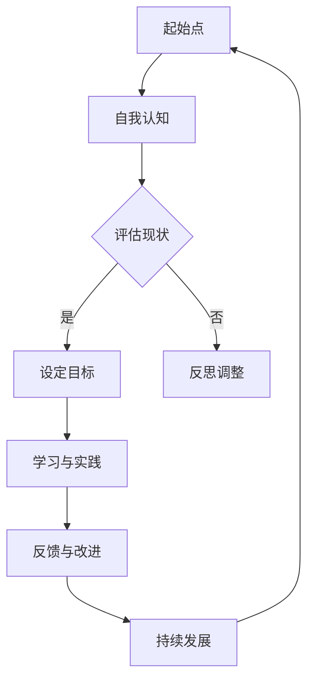
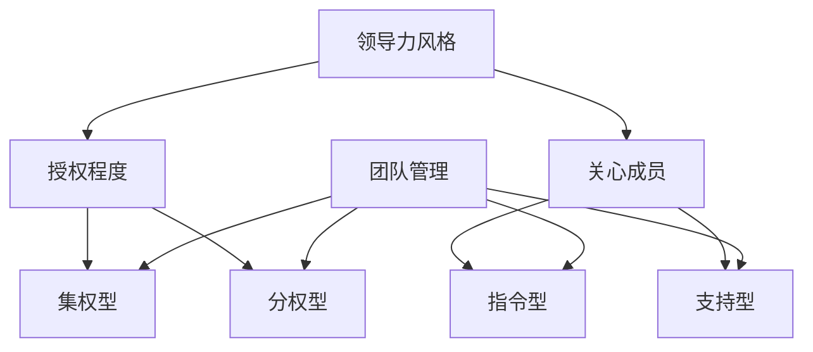

                 

### 领导力训练营：147天从菜鸟到大神

#### 关键词：
- 领导力发展
- 领导力培训
- 领导力实战
- 沟通技巧
- 团队协作
- 时间管理
- 决策能力
- 激励策略

#### 摘要：
本文为您呈现一份详细的领导力训练营指南，涵盖从自我认知到领导力进阶的各个方面。通过147天的系统训练，您将从零开始，逐步成长为一位卓越的领导者。本文将结合核心概念、算法原理、项目实战，帮助您深入理解领导力，提升领导力水平。

## 第一部分：领导力基础

### 第1章：领导力概述

#### 1.1 领导力的定义与重要性

领导力是一种独特的能力，它不仅仅关乎个人的魅力，更是一种能够激发他人共同追求目标的力量。简单来说，领导力是指引导和影响他人达成共同目标的能力。它不仅仅体现在企业或组织中，也可以在日常生活中发挥作用。

在组织中，领导力扮演着至关重要的角色。优秀的领导者能够明确团队的目标，制定有效的策略，激发团队成员的潜力，从而实现组织的发展。同时，领导力还能够影响团队成员的工作态度和士气，提升组织的整体效能。

在日常生活中，领导力同样重要。无论您是家庭的一员，还是社区志愿者，良好的领导力都能够帮助您更好地管理资源，协调人际关系，提高生活质量。

#### 1.2 领导力的五个维度

领导力可以从多个维度进行理解，以下是其中五个关键维度：

1. **自我认知**：自我认知是领导力发展的基础。它涉及对自身优点、缺点、价值观和动机的深刻理解。只有了解自己，才能更好地发挥领导力。

2. **目标设定**：目标设定是领导力的核心。领导者需要明确团队的目标，并确保团队成员对目标有共同的理解和认同。通过设定SMART目标（具体、可衡量、可实现、相关、有时限），可以更有效地推动团队的发展。

3. **沟通技巧**：沟通技巧是领导力的重要组成部分。有效的沟通能够确保信息的准确传达，建立信任，促进协作。领导者需要学会倾听，清晰表达，以及应对不同的沟通情境。

4. **激励技巧**：激励技巧是激发团队成员潜力的关键。领导者需要了解不同的激励理论，根据团队成员的特点和需求，设计个性化的激励机制，从而提高团队士气和工作效率。

5. **决策能力**：决策能力是领导者必须具备的一项重要能力。在面对复杂问题时，领导者需要能够快速做出明智的决策。通过系统化的决策过程，可以提高决策的质量。

#### 1.3 领导力与管理的区别

领导力和管理是两个相关但又不同的概念。管理主要关注组织的运作和效率，包括计划、组织、领导和控制等职能。而领导力则更注重激发他人的潜力，推动团队实现共同目标。

管理侧重于执行，而领导力则侧重于变革。一个优秀的领导者不仅能够管理好团队，还能够引领团队走向新的高度。

虽然领导力和管理有区别，但在实际应用中，二者往往是相辅相成的。一个成功的领导者需要同时具备管理和领导的能力，才能在组织中发挥最大的作用。

### 第2章：自我认知与领导力发展

#### 2.1 自我认知的重要性

自我认知是领导力发展的基石。只有深入了解自己的优点、缺点、价值观和动机，领导者才能更好地发挥自己的潜力，以及理解和影响他人。

自我认知的过程包括反思和自我评估。通过反思自己的行为和决策，领导者可以发现自身的盲点和改进方向。自我评估则通过定期的反馈和评估，帮助领导者了解自己的表现，以及与团队和组织的期望相比的差距。

#### 2.2 SWOT分析在领导力发展中的应用

SWOT分析是一种常用的战略规划工具，它可以帮助领导者评估自身的优势、劣势、机会和威胁。在领导力发展中，SWOT分析可以用于以下几个方面：

1. **优势**：识别自己的优势和特长，并在工作中发挥这些优势，提高工作效率。

2. **劣势**：识别自己的劣势和不足，并制定改进计划，提高自身能力。

3. **机会**：分析外部环境中的机会，并制定策略，抓住机遇，推动组织发展。

4. **威胁**：识别外部环境中的威胁，并制定应对策略，降低风险。

通过SWOT分析，领导者可以更清晰地了解自己，制定出切实可行的个人成长计划。

#### 2.3 个人成长计划

个人成长计划是领导者自我提升的重要工具。一个有效的个人成长计划应该包括以下内容：

1. **目标**：明确自己的成长目标，包括短期和长期目标。

2. **行动步骤**：制定实现目标的行动步骤，包括学习计划、实践机会和反馈机制。

3. **时间表**：设定实现目标的时间表，确保成长计划的实施。

4. **评估与调整**：定期评估成长计划的执行情况，并根据评估结果进行调整。

通过个人成长计划，领导者可以系统性地提升自己的能力和素质，实现个人和职业的发展。

### 第3章：沟通技巧与团队协作

#### 3.1 有效沟通的基本原则

有效沟通是领导力的核心要素之一。以下是一些有效沟通的基本原则：

1. **清晰表达**：确保信息传达的准确性和清晰性，避免歧义。

2. **倾听**：积极倾听他人的意见和想法，理解他们的观点。

3. **反馈**：及时给予反馈，帮助团队成员了解他们的表现。

4. **尊重**：尊重他人的意见和感受，建立良好的沟通氛围。

5. **透明度**：保持信息的透明度，确保团队成员了解组织的现状和目标。

#### 3.2 非言语沟通技巧

非言语沟通是沟通的重要组成部分。以下是一些非言语沟通的技巧：

1. **肢体语言**：通过肢体语言传递信息，如点头、手势等。

2. **面部表情**：面部表情可以传达情绪和态度，影响沟通效果。

3. **语调**：语调的变化可以传达情感和意图，增强沟通效果。

4. **眼神交流**：适当的眼神交流可以增强信任和尊重。

通过掌握非言语沟通技巧，领导者可以更有效地与他人沟通，提升沟通效果。

#### 3.3 团队协作与冲突管理

团队协作是团队高效运作的关键。以下是一些团队协作和冲突管理的策略：

1. **明确目标**：确保团队成员对团队的目标有共同的理解和认同。

2. **分工明确**：根据团队成员的特长和兴趣，分配合适的工作任务。

3. **沟通与反馈**：保持团队成员之间的沟通和反馈，确保工作进展的透明和协调。

4. **冲突管理**：学会识别和解决团队中的冲突，避免影响团队的工作氛围。

通过有效的团队协作和冲突管理，领导者可以确保团队的和谐和高效运作。

## 第二部分：领导力实战

### 第4章：目标设定与时间管理

#### 4.1 SMART目标设定

SMART目标是设定目标的重要工具，它确保目标的具体、可衡量、可实现、相关和有时限。以下是如何设定SMART目标的步骤：

1. **具体（Specific）**：目标应该是具体和明确的，避免模糊和宽泛。例如，而不是“提高销售额”，而是“提高销售额10%”。

2. **可衡量（Measurable）**：目标应该是可度量的，以便评估进展和结果。例如，而不是“提高工作效率”，而是“减少响应时间5分钟”。

3. **可实现（Achievable）**：目标应该是可实现的，避免设定过高的目标，导致挫败感。例如，而不是“在一个月内完成全年目标”，而是“每月提高销售额10%”。

4. **相关（Relevant）**：目标应该是与整体目标和团队目标相关的。例如，而不是“学习西班牙语”，而是“学习西班牙语，以便更好地与国际客户沟通”。

5. **有时限（Time-bound）**：目标应该设定明确的截止日期，以便跟踪和评估进展。例如，而不是“学习西班牙语”，而是“在六个月内通过西班牙语考试”。

通过设定SMART目标，领导者可以确保团队成员明确目标，并朝着目标努力。

#### 4.2 建立时间管理意识

时间管理是提高工作效率和实现目标的关键。以下是一些建立时间管理意识的方法：

1. **日程表**：制定详细的日程表，合理安排每天的工作任务和休息时间。

2. **优先级**：区分任务的优先级，先处理重要且紧急的任务，再处理其他任务。

3. **避免拖延**：学会抵制拖延的诱惑，设定明确的截止日期，确保任务按时完成。

4. **碎片化时间**：利用碎片化时间，如等待会议开始的时间，进行阅读、思考或学习。

通过建立时间管理意识，领导者可以更高效地利用时间，提高工作效率。

#### 4.3 常见的时间管理技巧

以下是一些常见的时间管理技巧，帮助领导者更好地管理时间：

1. **番茄工作法**：将工作时间划分为25分钟的工作块，每个工作块后休息5分钟，有助于提高专注力和效率。

2. **任务分解**：将大任务分解为小任务，逐一完成，避免感到压力和焦虑。

3. **委托任务**：学会委托任务，将不适合自己或可以由他人完成的任务交给合适的人。

4. **避免多任务处理**：专注于一项任务，避免同时处理多项任务，以提高效率和质量。

通过运用这些时间管理技巧，领导者可以更有效地管理时间，实现目标。

### 第5章：决策与问题解决

#### 5.1 决策的六个步骤

决策是领导者必须掌握的技能之一。以下是决策的六个步骤：

1. **确定问题**：明确需要解决的问题，确保对问题的理解准确。

2. **收集信息**：收集与问题相关的信息，包括数据、事实、意见等。

3. **制定解决方案**：基于收集的信息，制定多个可能的解决方案。

4. **评估解决方案**：评估每个解决方案的优缺点，选择最合适的方案。

5. **做出决策**：根据评估结果，做出最终决策。

6. **执行决策**：实施决策，监控执行过程，确保决策的有效性。

通过这六个步骤，领导者可以更科学地做出决策。

#### 5.2 决策的常见误区

在决策过程中，领导者常常会陷入一些误区。以下是一些常见的决策误区：

1. **过度依赖直觉**：过于依赖直觉，忽视数据和分析。

2. **忽视风险**：忽视潜在的风险和不确定性，导致决策失误。

3. **忽视反馈**：在决策后，忽视团队成员和客户的反馈，导致决策结果不理想。

4. **群体思维**：在团队中形成共识，忽视不同意见，导致决策缺乏全面性。

通过识别和避免这些误区，领导者可以做出更明智的决策。

#### 5.3 问题解决策略

问题解决是领导者必须掌握的技能之一。以下是问题解决的一些策略：

1. **识别问题**：准确识别问题的本质，避免混淆表面现象。

2. **分析问题**：通过数据和分析，深入分析问题的原因。

3. **制定解决方案**：基于分析结果，制定多个可能的解决方案。

4. **评估解决方案**：评估每个解决方案的优缺点，选择最合适的方案。

5. **实施解决方案**：实施解决方案，监控执行过程，确保解决方案的有效性。

6. **反思与改进**：在问题解决后，反思解决方案的效果，总结经验教训，持续改进。

通过这些策略，领导者可以更有效地解决问题。

### 第6章：激励与团队管理

#### 6.1 激励理论概述

激励是领导力的关键要素之一。以下是一些常见的激励理论：

1. **马斯洛需求层次理论**：根据马斯洛的需求层次理论，人们有不同的需求，从生理需求到自我实现需求。满足员工的不同需求，可以激发他们的工作积极性。

2. **赫兹伯格双因素理论**：赫兹伯格双因素理论认为，工作满意度与不满意程度分别由激励因素和保健因素决定。激励因素如成就、认可和责任感，可以提高员工的满意度；而保健因素如薪酬、工作条件和人际关系，可以避免员工的不满意。

3. **目标设定理论**：目标设定理论认为，明确且具有挑战性的目标可以激发员工的动机和积极性。通过设定SMART目标，可以更好地激励员工。

4. **期望理论**：期望理论认为，员工的动机取决于他们对结果的价值、实现结果的期望和努力程度的期望。通过提高员工对结果的价值、增强实现结果的期望和鼓励努力程度，可以提高员工的激励水平。

#### 6.2 建立有效的激励机制

建立有效的激励机制是提高团队士气和绩效的关键。以下是一些建立有效激励机制的方法：

1. **明确激励机制**：明确激励的类型和条件，确保员工了解激励政策。

2. **个性化激励**：根据员工的特点和需求，设计个性化的激励机制，满足员工的不同需求。

3. **及时奖励**：及时给予奖励，确保员工感受到激励的价值。

4. **正面反馈**：给予正面反馈，鼓励员工继续努力。

5. **公平性**：确保激励机制公平，避免产生不公平感。

通过这些方法，领导者可以建立有效的激励机制，提高团队绩效。

#### 6.3 团队管理的四个关键要素

团队管理是领导力的核心组成部分。以下是一些团队管理的四个关键要素：

1. **目标设定**：确保团队成员对团队的目标有共同的理解和认同。

2. **沟通与协作**：建立良好的沟通渠道，促进团队成员之间的协作。

3. **激励与支持**：通过激励机制和支持措施，提高团队成员的积极性和满意度。

4. **冲突管理**：学会识别和解决团队中的冲突，维护团队和谐。

通过关注这些关键要素，领导者可以更有效地管理团队。

### 第7章：领导力实践案例

#### 7.1 案例一：如何激励团队成员？

在一家技术公司，领导者在团队中引入了一种名为“挑战日”的活动。每个月的最后一个工作日，团队都会选择一个具体的目标，如提高某个产品的性能。完成任务后，团队成员可以获得奖金和荣誉称号。这种活动激发了团队成员的积极性，提高了团队的整体绩效。

#### 7.2 案例二：如何解决团队中的冲突？

在一次项目会议中，团队成员A和B因为工作分工产生了冲突。领导者首先听取了双方的陈述，然后提出了一个妥协方案：A负责技术部分，B负责市场推广部分。通过沟通和协商，双方达成了共识，冲突得以解决。

#### 7.3 案例三：如何在项目中实现目标？

在一次大型项目中，领导者通过制定详细的计划，明确每个阶段的任务和责任。同时，领导者定期组织团队会议，确保团队成员了解项目的进展情况。通过有效的沟通和协作，团队成功地完成了项目，并获得了客户的高度评价。

## 第三部分：领导力进阶

### 第8章：领导力风格与变革管理

#### 8.1 领导力风格的理论框架

领导力风格是指领导者处理问题和与团队成员互动的方式。根据不同的理论框架，领导力风格可以分为以下几种：

1. **指令型领导**：领导者明确告诉团队成员应该做什么，如何做。这种方式适用于团队需要迅速作出决策的情境。

2. **授权型领导**：领导者给予团队成员更大的自主权，让他们自己决定如何完成任务。这种方式适用于团队拥有专业知识和技能的情境。

3. **参与型领导**：领导者与团队成员共同参与决策过程，确保团队成员的参与和满意度。这种方式适用于团队需要高度协作和创新的情境。

4. **变革型领导**：领导者通过激发团队成员的激情和动机，推动团队实现变革。这种方式适用于组织需要变革和发展的情境。

#### 8.2 如何适应不同的领导力风格？

根据不同的情境和团队成员的特点，领导者需要灵活调整自己的领导力风格。以下是一些适应不同领导力风格的方法：

1. **了解团队成员的需求和特点**：领导者需要了解团队成员的需求和特点，选择最适合的领导风格。

2. **培养多元化领导力**：领导者应该具备多元化的领导力风格，能够根据不同情境灵活调整。

3. **沟通和反馈**：通过沟通和反馈，领导者可以了解团队成员对领导风格的需求和反馈，调整自己的领导风格。

4. **持续学习和实践**：领导者需要不断学习和实践，提升自己的领导力水平，适应不同情境。

#### 8.3 变革管理的五个阶段

变革管理是领导力的一个重要方面。以下是变革管理的五个阶段：

1. **准备阶段**：明确变革的目标和原因，制定变革计划。

2. **动员阶段**：沟通变革的目标和计划，激发团队成员的参与和积极性。

3. **实施阶段**：按照变革计划，实施具体的变革措施。

4. **评估阶段**：评估变革的效果，收集反馈和经验教训。

5. **持续改进阶段**：根据评估结果，持续改进变革措施，确保变革的长期效果。

通过这五个阶段的变革管理，领导者可以推动组织实现成功变革。

### 第9章：领导力与企业文化

#### 9.1 企业文化的定义与作用

企业文化是指企业在长期经营过程中形成的价值观、信念和行为准则。企业文化对组织的发展具有重要影响。

1. **统一价值观**：企业文化可以统一员工的价值观和行为准则，提高团队凝聚力。

2. **塑造形象**：企业文化可以塑造组织的形象，提升组织的品牌价值。

3. **指导行为**：企业文化可以指导员工的行为，提高工作效率和质量。

4. **吸引人才**：具有良好企业文化的组织更容易吸引和留住优秀人才。

#### 9.2 领导者在塑造企业文化中的角色

领导者在塑造企业文化中扮演着关键角色。以下是一些领导者在塑造企业文化中的职责：

1. **明确企业文化**：领导者需要明确企业的核心价值观和行为准则。

2. **宣传企业文化**：领导者需要通过各种渠道宣传企业文化，确保员工了解并认同企业文化。

3. **实践企业文化**：领导者需要以身作则，实践企业文化，树立榜样。

4. **监督企业文化**：领导者需要监督企业文化的实施情况，确保企业文化得到贯彻和执行。

#### 9.3 建立积极的企业文化

建立积极的企业文化是领导者的重要任务。以下是一些建立积极企业文化的方法：

1. **鼓励创新**：鼓励员工提出创新想法，培养创新意识。

2. **尊重员工**：尊重员工的意见和贡献，建立信任和尊重。

3. **激励员工**：通过激励机制，激发员工的积极性和创造力。

4. **沟通与反馈**：保持良好的沟通渠道，及时给予员工反馈和指导。

通过这些方法，领导者可以建立积极的企业文化，提升组织的整体绩效。

### 第10章：领导力持续发展

#### 10.1 领导力的发展路径

领导力是一个持续发展的过程。以下是领导力的发展路径：

1. **自我认知**：了解自己的优点和不足，进行自我反思。

2. **知识学习**：不断学习新的知识和技能，提升自己的能力。

3. **实践应用**：将所学知识应用于实际工作中，提升领导力。

4. **反馈与改进**：根据反馈和评估，不断改进自己的领导方式。

5. **持续发展**：保持对领导力的关注和投入，不断提升自己的领导力水平。

#### 10.2 培养领导力的方法

以下是一些培养领导力的方法：

1. **阅读**：阅读领导力相关的书籍和文章，了解不同的领导理论和方法。

2. **培训**：参加领导力培训课程，提升自己的领导力技能。

3. **实践**：在实际工作中，运用所学知识，提升自己的领导力。

4. **反思**：定期反思自己的领导行为和决策，总结经验教训。

5. **交流**：与他人交流领导力经验，学习他人的成功经验。

通过这些方法，领导者可以不断提升自己的领导力水平。

#### 10.3 领导力的持续发展策略

以下是一些领导力的持续发展策略：

1. **设定目标**：设定明确的领导力发展目标，制定实现目标的计划。

2. **定期评估**：定期评估自己的领导力水平，了解自己的优势和不足。

3. **持续学习**：不断学习新的知识和技能，提升自己的能力。

4. **培养团队**：培养团队成员的领导力，提升团队的整体绩效。

5. **反馈与改进**：根据反馈和评估，不断改进自己的领导方式。

通过这些策略，领导者可以持续发展自己的领导力，实现个人和团队的成长。

### 附录

#### 附录A：领导力评估工具

以下是一些常用的领导力评估工具：

1. **360度反馈**：通过团队成员和上级的评价，了解自己的领导力表现。

2. **领导力测试**：如MBTI（性格类型指标）和HBDI（全脑型式指标），了解自己的性格特点。

3. **领导力问卷**：通过问卷的形式，评估领导力的各个方面。

#### 附录B：领导力发展资源推荐

以下是一些领导力发展资源：

1. **书籍**：《领导力五项修炼》、《高效能人士的七个习惯》等。

2. **在线课程**：如Coursera、Udemy上的领导力课程。

3. **领导力社区**：如LinkedIn上的领导力群组，分享经验，学习交流。

#### 附录C：147天领导力训练营计划安排

以下是一份147天领导力训练营的计划安排：

- **第1-30天**：自我认知与基础理论
- **第31-60天**：沟通技巧与团队协作
- **第61-90天**：目标设定与时间管理
- **第91-120天**：决策与问题解决
- **第121-150天**：激励与团队管理
- **第151-180天**：领导力风格与变革管理
- **第181-210天**：领导力持续发展

#### Mermaid 流程图：领导力发展路径



#### 决策的六个步骤伪代码

```python
def make_decision(problem):
    # 1. 确定问题
    define_problem(problem)
    
    # 2. 收集信息
    gather_info(info)
    
    # 3. 制定方案
    generate_solutions(solutions)
    
    # 4. 评估方案
    evaluate_solutions(solutions, criteria)
    
    # 5. 选择方案
    select_best_solution(best_solution, solutions)
    
    # 6. 执行方案
    implement_solution(best_solution)
    
    # 7. 监控与调整
    monitor_solution(best_solution)
    if needed:
        adjust_solution(best_solution)
```

#### 数学模型：马尔可夫决策过程（MDP）

$$
\begin{aligned}
  &\mathcal{M} = \{S, A, P, R, \gamma\} \\
  &S = \{s_1, s_2, ..., s_n\} \text{（状态集）} \\
  &A = \{a_1, a_2, ..., a_m\} \text{（动作集）} \\
  &P(s' | s, a) \text{（状态转移概率）} \\
  &R(s, a) \text{（立即回报函数）} \\
  &\gamma \text{（折现因子）} \\
\end{aligned}
$$

#### 项目实战：团队协作系统开发

#### 1. 开发环境搭建
- 操作系统：Linux
- 编程语言：Python
- 数据库：MySQL
- Web框架：Django

#### 2. 源代码详细实现
```python
# 团队成员信息表
class TeamMember(models.Model):
    name = models.CharField(max_length=100)
    role = models.CharField(max_length=50)
    status = models.CharField(max_length=50, choices=STATUS_CHOICES)

# 团队任务信息表
class Task(models.Model):
    name = models.CharField(max_length=100)
    description = models.TextField()
    assigned_to = models.ForeignKey(TeamMember, on_delete=models.CASCADE)
    status = models.CharField(max_length=50, choices=STATUS_CHOICES)
```

#### 3. 代码解读与分析
- `TeamMember` 模型用于存储团队成员的信息，包括姓名、角色和状态。
- `Task` 模型用于存储团队任务的信息，包括任务名称、描述、分配给成员和状态。

### 第三部分：领导力提升实战

#### 第11章：领导力提升策略

##### 11.1 持续学习的重要性

持续学习是领导力提升的关键。领导者需要不断学习新的知识和技能，以适应不断变化的环境。以下是一些持续学习的方法：

1. **定期阅读**：阅读领导力相关的书籍和文章，了解最新的理论和实践。

2. **参加培训**：参加线上或线下的领导力培训课程，提升自己的技能。

3. **交流与分享**：与同行交流领导力经验，分享成功和失败的故事。

4. **实践与应用**：将所学知识应用于实际工作中，不断提升自己的领导力。

##### 11.2 领导力提升的具体方法

以下是提升领导力的具体方法：

1. **建立个人成长计划**：明确自己的领导力发展目标，制定详细的成长计划。

2. **培养沟通技巧**：提高沟通能力，确保信息的准确传达和团队的协作。

3. **提升决策能力**：通过学习和实践，提高决策的质量和效率。

4. **培养团队意识**：关注团队成员的成长和发展，建立高效的团队。

5. **实践领导力**：在实际工作中，不断实践和应用领导力，积累经验。

##### 11.3 领导力提升的误区与解决

以下是领导力提升中常见的误区及解决方法：

1. **误区**：依赖经验和直觉进行决策。

   **解决方法**：学习和应用科学的决策方法，避免依赖经验和直觉。

2. **误区**：忽视团队成员的需求和反馈。

   **解决方法**：关注团队成员的需求和反馈，建立良好的沟通渠道。

3. **误区**：过分关注短期绩效，忽视长期发展。

   **解决方法**：平衡短期和长期目标，确保团队和组织的持续发展。

### 第12章：领导力培训与研讨会

##### 12.1 领导力培训的设计与实施

领导力培训的设计与实施是提升领导力的有效途径。以下是一些关键步骤：

1. **明确培训目标**：根据组织和团队的需求，设定明确的培训目标。

2. **选择合适的培训形式**：根据培训目标和受众，选择合适的培训形式，如线上课程、线下研讨会、工作坊等。

3. **制定详细的培训计划**：包括培训内容、时间安排、讲师安排等。

4. **实施培训**：按照培训计划，组织培训活动，确保培训效果。

5. **评估培训效果**：通过评估，了解培训的目标是否达成，收集反馈，改进培训方案。

##### 12.2 领导力研讨会的组织与参与

领导力研讨会是一种有效的学习和交流方式。以下是一些组织与参与研讨会的方法：

1. **确定研讨会主题**：根据组织的需求，选择合适的研讨会主题。

2. **邀请专家和参与者**：邀请领导力专家和团队成员参与研讨会。

3. **制定研讨会议程**：包括主题演讲、讨论环节、互动活动等。

4. **组织研讨会**：按照议程，组织研讨会活动，确保研讨会的顺利进行。

5. **参与和反馈**：积极参与研讨会，分享经验和观点，提供反馈。

##### 12.3 领导力培训与研讨会的效果评估

评估领导力培训与研讨会的效果是确保培训效果的重要环节。以下是一些评估方法：

1. **问卷调查**：通过问卷调查，了解参与者的培训感受和收获。

2. **行为观察**：观察参与者在实际工作中的行为变化，了解培训效果。

3. **绩效评估**：评估参与者在培训后的工作绩效，了解培训效果。

4. **反馈机制**：建立反馈机制，收集参与者和上级的反馈，持续改进培训方案。

### 第13章：领导力案例分析

##### 13.1 成功领导力的案例分析

以下是一些成功领导力的案例分析：

1. **案例一**：某公司CEO通过有效的沟通和激励策略，成功带领团队实现企业愿景。

2. **案例二**：某项目经理通过科学的决策和问题解决方法，成功完成项目，赢得客户好评。

3. **案例三**：某部门领导通过培养团队意识，提升团队成员的积极性，提高部门绩效。

##### 13.2 失败领导力的案例分析

以下是一些失败领导力的案例分析：

1. **案例一**：某公司领导过于依赖经验和直觉，导致战略决策失误，企业陷入困境。

2. **案例二**：某项目经理忽视团队成员的需求，导致团队士气低落，项目进度延误。

3. **案例三**：某部门领导忽视沟通和协作，导致部门内部矛盾重重，工作效率低下。

##### 13.3 从案例中学习领导力

通过分析成功和失败的领导力案例，可以总结出以下学习要点：

1. **明确目标和计划**：制定明确的目标和计划，确保团队朝着共同的目标努力。

2. **有效沟通和协作**：建立良好的沟通和协作机制，促进团队高效运作。

3. **科学决策和问题解决**：运用科学的决策方法和问题解决策略，确保决策的质量和效率。

4. **关注团队成员的需求**：关注团队成员的需求和反馈，提高团队满意度和绩效。

### 第14章：领导力评估与反馈

##### 14.1 领导力评估的方法

领导力评估是了解领导者表现的重要手段。以下是一些常见的领导力评估方法：

1. **360度反馈**：通过团队成员、上级和下属的反馈，全面了解领导者的表现。

2. **领导力测试**：使用专业的领导力测试工具，评估领导者的能力。

3. **绩效评估**：通过领导者在实际工作中的绩效表现，评估领导力。

4. **行为观察**：观察领导者在日常工作和团队活动中的行为，评估领导力。

##### 14.2 反馈机制的重要性

反馈机制是领导者成长的重要保障。以下是一些反馈机制的重要性：

1. **发现不足**：通过反馈，领导者可以发现自己的不足，了解改进的方向。

2. **促进成长**：反馈可以激励领导者持续学习和提升，促进个人成长。

3. **改进领导方式**：通过反馈，领导者可以调整自己的领导方式，提高领导效果。

4. **建立信任**：及时的反馈和沟通可以建立领导者与团队成员之间的信任。

##### 14.3 如何有效给予和接收反馈

以下是如何有效给予和接收反馈的方法：

1. **给予反馈**：
   - 选择合适的时机和场合。
   - 提供具体的事例和具体的行为。
   - 以建设性的方式提出建议。

2. **接收反馈**：
   - 保持开放的心态，认真倾听。
   - 不要打断对方，给予足够的尊重。
   - 反思自己的行为，考虑如何改进。

通过有效的给予和接收反馈，领导者可以不断提升自己的领导力水平。

### 第15章：领导力与领导风格测试

##### 15.1 领导力测试的种类

领导力测试可以帮助领导者了解自己的领导风格和能力。以下是一些常见的领导力测试：

1. **MBTI**：迈尔斯-布里格斯类型指标，用于了解个人的性格类型。

2. **HBDI**：全脑型式指标，用于了解个人的思维模式和偏好。

3. **领导力问卷**：如“领导力行为问卷”（LBC）、“领导者效能问卷”（LEQ）等，用于评估领导力。

##### 15.2 领导风格测试的方法

以下是一些领导风格测试的方法：

1. **自我评估**：通过自我反思和评估，了解自己的领导风格。

2. **360度反馈**：通过团队成员、上级和下属的反馈，了解自己的领导风格。

3. **专家评估**：由专业的领导力专家对领导者的风格和能力进行评估。

4. **模拟情境测试**：通过模拟实际工作情境，评估领导者的应对能力和决策能力。

##### 15.3 测试结果的应用

领导力测试的结果可以应用于以下几个方面：

1. **个人成长计划**：根据测试结果，制定个人成长计划，提升领导力。

2. **领导力培训**：根据测试结果，设计有针对性的领导力培训课程。

3. **团队建设**：通过了解团队成员的领导风格，促进团队协作和沟通。

4. **组织发展**：通过领导力测试，了解组织的领导力现状，制定提升策略。

### 附录

#### 附录D：领导力测试工具推荐

以下是一些常用的领导力测试工具：

1. **MBTI**：迈尔斯-布里格斯类型指标。

2. **HBDI**：全脑型式指标。

3. **领导力行为问卷（LBC）**。

4. **领导者效能问卷（LEQ）**。

#### 附录E：领导力提升资源推荐

以下是一些领导力提升的资源：

1. **书籍**：《领导力五项修炼》、《高效能人士的七个习惯》。

2. **在线课程**：Coursera、Udemy上的领导力课程。

3. **领导力社区**：LinkedIn上的领导力群组。

#### 附录F：147天领导力训练营计划安排

以下是一份147天领导力训练营的计划安排：

- **第1-30天**：自我认知与基础理论
- **第31-60天**：沟通技巧与团队协作
- **第61-90天**：目标设定与时间管理
- **第91-120天**：决策与问题解决
- **第121-150天**：激励与团队管理
- **第151-180天**：领导力风格与变革管理
- **第181-210天**：领导力持续发展

#### Mermaid 流程图：领导力发展路径


#### 领导力风格与团队管理关系图



#### 马尔可夫决策过程（MDP）示例

```python
# 状态转移概率矩阵
P = [
    [0.9, 0.1],
    [0.2, 0.8]
]

# 立即回报函数
R = {
    's1': {'a1': 10, 'a2': -5},
    's2': {'a1': -2, 'a2': 5}
}

# 折现因子
gamma = 0.9

# 状态 s 和动作 a 的期望回报计算
def expected_return(s, a):
    return sum([P[s][i] * R[s][a] for i in range(len(P[s]))]) * gamma

# 计算每个状态在每个动作下的期望回报
for s in S:
    for a in A:
        print(f"State: {s}, Action: {a}, Expected Return: {expected_return(s, a)}")
```

#### 领导力提升策略案例

##### 案例一：如何通过培训提升领导力？

1. **确定领导力提升的目标**：根据组织和团队的需求，设定明确的领导力提升目标。

2. **选择合适的培训内容和形式**：根据目标，选择合适的培训内容和形式，如线上课程、线下研讨会等。

3. **制定详细的培训计划**：包括培训内容、时间安排、讲师安排等。

4. **实施培训**：按照培训计划，组织培训活动，确保培训效果。

5. **评估培训效果**：通过问卷调查、行为观察等方法，评估培训效果，持续改进培训方案。

##### 案例二：如何通过实践提升领导力？

1. **确定实践的目标和场景**：根据领导力提升的需求，确定实践的目标和场景。

2. **制定详细的实践计划**：包括实践内容、时间安排、实践目标等。

3. **实施实践**：按照实践计划，开展实践活动，积累实践经验。

4. **记录经验**：在实践过程中，记录成功和失败的经验，总结教训。

5. **定期总结和反思**：定期总结实践中的经验教训，反思自己的领导行为，持续改进。

#### 领导力评估工具推荐

以下是一些常用的领导力评估工具：

1. **360度反馈**：通过团队成员、上级和下属的反馈，全面了解领导者的表现。

2. **领导力测试**：如MBTI、HBDI等，用于评估领导者的性格类型和能力。

3. **领导力问卷**：如“领导力行为问卷”（LBC）、“领导者效能问卷”（LEQ）等，用于评估领导力。

#### 领导力提升资源推荐

以下是一些领导力提升的资源：

1. **书籍**：《领导力五项修炼》、《高效能人士的七个习惯》。

2. **在线课程**：Coursera、Udemy上的领导力课程。

3. **领导力社区**：LinkedIn上的领导力群组。

#### 147天领导力训练营计划安排

每一天的具体安排如下：

- **第1-30天**：自我认知与基础理论
  - 每周一：阅读《领导力五项修炼》，分享心得。
  - 每周二：学习领导力理论，讨论应用。
  - 每周三：实践领导力技巧，记录经验。
  - 每周四：反馈与改进，调整领导力策略。
  - 每周五：团队活动，提升团队凝聚力。

- **第31-60天**：沟通技巧与团队协作
  - 每周一：学习有效沟通的基本原则，讨论案例。
  - 每周二：实践非言语沟通技巧，记录反馈。
  - 每周三：学习团队协作与冲突管理策略，模拟练习。
  - 每周四：反思沟通与协作中的问题，制定改进计划。
  - 每周五：团队协作活动，提升团队协作能力。

- **第61-90天**：目标设定与时间管理
  - 每周一：学习SMART目标设定方法，设定个人目标。
  - 每周二：制定时间管理计划，提高工作效率。
  - 每周三：实践时间管理技巧，记录时间管理效果。
  - 每周四：反思时间管理中的问题，调整时间管理策略。
  - 每周五：时间管理活动，提升时间管理能力。

- **第91-120天**：决策与问题解决
  - 每周一：学习决策的六个步骤，模拟决策情境。
  - 每周二：分析决策的常见误区，避免决策错误。
  - 每周三：学习问题解决策略，解决实际问题。
  - 每周四：反思决策与问题解决中的问题，制定改进计划。
  - 每周五：决策与问题解决活动，提升决策能力。

- **第121-150天**：激励与团队管理
  - 每周一：学习激励理论，设定激励机制。
  - 每周二：实践激励策略，提升团队士气。
  - 每周三：学习团队管理关键要素，建立高效团队。
  - 每周四：反思激励与团队管理中的问题，调整策略。
  - 每周五：团队建设活动，提升团队凝聚力。

- **第151-180天**：领导力风格与变革管理
  - 每周一：学习领导力风格理论，了解不同领导力风格。
  - 每周二：实践适应不同领导力风格的方法。
  - 每周三：学习变革管理五个阶段，模拟变革情境。
  - 每周四：反思领导力风格与变革管理中的问题，调整策略。
  - 每周五：变革管理活动，提升变革管理能力。

- **第181-210天**：领导力持续发展
  - 每周一：学习领导力持续发展路径，设定长期目标。
  - 每周二：制定个人成长计划，持续学习。
  - 每周三：实践领导力技巧，提升自身能力。
  - 每周四：反思领导力发展中的问题，调整计划。
  - 每周五：领导力分享会，交流学习成果。

### 致谢

感谢您阅读本文，希望本文对您的领导力提升有所帮助。如果您有任何问题或建议，欢迎在评论区留言。祝您在领导力道路上不断进步，成为一名卓越的领导者！

#### 作者信息

作者：AI天才研究院/AI Genius Institute & 禅与计算机程序设计艺术 /Zen And The Art of Computer Programming

AI天才研究院致力于推动人工智能技术的发展与应用，为全球企业和个人提供顶尖的人工智能解决方案。同时，我们关注领导力与人工智能的结合，帮助领导者更好地应对数字化时代的挑战。

禅与计算机程序设计艺术专注于计算机程序设计领域的深度学习和探索，通过传承和发扬禅的精神，提升程序员的编程能力和思维品质。我们希望为编程领域带来一场思维革命，让编程成为一门艺术。

感谢您的阅读，期待与您共同探索领导力与技术的结合之道！

