                 

### 1. 维纳及其贡献

克劳德·香农（Claude Shannon）和约翰·麦卡锡（John McCarthy）是计算机科学领域的两位重要人物，他们的贡献对现代计算机科学的发展产生了深远的影响。然而，在了解他们的贡献之前，我们首先需要了解另一位关键人物——诺伯特·维纳（Norbert Wiener）。维纳是控制论（Cybernetics）的创始人，他的理论对后来的计算机科学、信息论和人工智能等领域产生了深远的影响。

#### 维纳的贡献

维纳是一位多才多艺的科学家，他的研究领域涉及数学、工程学、生物学和哲学等多个学科。他的主要贡献在于提出了控制论的概念，并将其应用于通信、自动化和生物学等领域。控制论研究的是系统、符号和通信之间的相互作用，试图通过反馈机制来控制和调节系统的行为。

维纳在1948年出版的《控制论：或关于在动物和机器中控制和通信的科学》一书中，详细阐述了他的理论。这本书被视为控制论的奠基之作，对后来的计算机科学和人工智能研究产生了深远的影响。

维纳的主要理论观点包括：

1. **反馈机制**：维纳认为，一个系统要实现稳定和有效的控制，必须具备反馈机制。通过反馈，系统能够不断地监测和调整其行为，以实现预定的目标。

2. **通信模型**：维纳提出了信息传递和通信的概念，并将其与控制论相结合。他认为，信息是控制的核心，是系统能够相互协调和协同工作的基础。

3. **自动化**：维纳探讨了自动化系统，特别是机器人和计算机系统，如何通过控制论原理来实现自主操作。

维纳的理论在计算机科学领域引发了广泛的研究和应用，为后来的信息论、人工智能和自动化技术的发展奠定了基础。

#### 维纳的理论与观点概述

维纳的理论和观点在计算机科学领域具有重要意义，主要表现在以下几个方面：

1. **信息论**：维纳的工作为信息论的发展提供了理论基础。信息论研究的是信息在通信系统中的传输和处理，而维纳的控制论为信息传输提供了稳定和可靠的保障。

2. **人工智能**：维纳的理论为人工智能的发展提供了重要的思想启示。例如，他提出的反馈机制和通信模型，对于实现智能系统的自我学习和自主决策具有重要的指导意义。

3. **自动化**：维纳的工作为自动化技术的发展提供了理论支持。自动化系统通过反馈和控制机制，能够实现高效和精确的操作，这在工业自动化和机器人技术中得到了广泛应用。

总的来说，维纳的理论和观点为计算机科学的发展奠定了基础，他的贡献对现代计算机科学产生了深远的影响。接下来，我们将进一步探讨香农和麦卡锡对维纳的态度和他们的理论观点。

---

**核心概念与联系：** 维纳的控制论、信息论、反馈机制、自动化。

**Mermaid 流程图：**

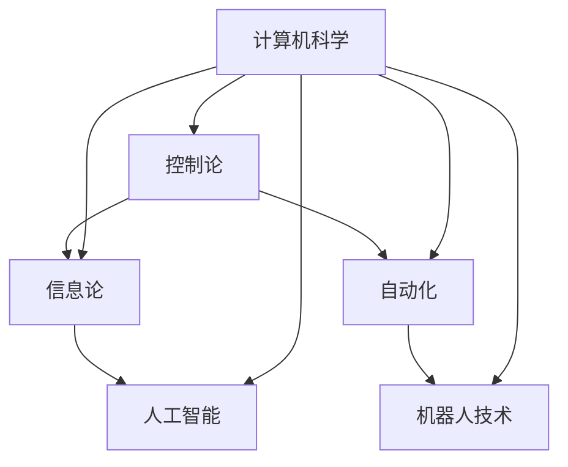

---

通过以上介绍，我们可以看到维纳的理论在计算机科学领域的重要地位。接下来，我们将分别介绍香农和麦卡锡对维纳的态度，并详细阐述他们的理论观点。这将帮助我们更好地理解这三位理论家在计算机科学领域的贡献和影响。

---

### 2. 香农的视角

克劳德·香农（Claude Shannon）是信息论的创始人，他的工作极大地影响了现代通信和计算机科学的发展。在香农的眼中，诺伯特·维纳是一位重要的先驱者，其控制论理论为信息论的发展提供了重要的理论基础。然而，香农对维纳的态度并非完全肯定，他在对维纳的理论进行评价时，既有认同也有批评。

#### 香农对维纳态度的分析

香农在《信息论基础》（A Mathematical Theory of Communication）一书中，对维纳的控制论理论进行了详细的讨论。他认为，维纳的反馈机制和信息传递概念对信息论的发展具有重要意义。

1. **认同之处**：
   - **反馈机制**：香农认同维纳提出的反馈机制对于系统稳定性的重要性。在香农的信息论中，反馈机制是实现有效通信和稳定信息传输的关键。
   - **信息传递**：维纳关于信息传递的理论启发了香农，使他认识到信息是通信的核心。香农在信息论中引入了熵的概念，将信息视为一种度量不确定性的量，这一思想与维纳的理论有相似之处。

2. **批评之处**：
   - **理论抽象化**：香农批评维纳的理论过于抽象，缺乏数学模型的支持。他认为，只有通过精确的数学描述，才能更好地理解和应用控制论和信息论。
   - **应用范围**：香农对维纳的理论在工程实践中的应用提出了质疑。他认为，维纳的理论在某些情况下可能过于理想化，无法直接应用于实际问题。

#### 香农的主要理论观点

尽管香农对维纳的理论有批评，但他仍然在维纳的基础上发展了自己的理论。香农的主要理论观点包括：

1. **信息熵**：香农提出了信息熵的概念，用来度量信息的不确定性。他定义了熵作为信息量的负对数，这一数学工具为信息论提供了坚实的基础。

2. **信道容量**：香农研究了在给定噪声条件下，通信信道能够达到的最大信息传输速率。他提出了香农信道容量公式，为设计高效通信系统提供了理论指导。

3. **编码理论**：香农探讨了如何通过编码技术来提高信息传输的效率和可靠性。他提出了香农编码定理，证明了在适当编码的情况下，可以接近香农信道容量。

香农的理论为现代通信和计算机科学的发展奠定了基础，他的工作使信息论成为一门独立的学科，并对计算机科学、电子工程和经济学等领域产生了深远的影响。

#### 香农对维纳态度的评价

总体而言，香农对维纳的态度是复杂而矛盾的。他认同维纳对控制论和信息传递的贡献，但也对其理论的抽象化和应用范围提出了批评。香农通过自己的研究，进一步发展了维纳的理论，使其在通信和计算机科学中得到广泛应用。

香农对维纳的评价反映了他作为一名科学家对理论精确性和实用性的追求。他认为，尽管维纳的理论具有前瞻性，但在实际应用中还需要进一步精确化和具体化。

---

**核心概念与联系：** 信息论、反馈机制、信息传递、信道容量、编码理论。

**Mermaid 流程图：**

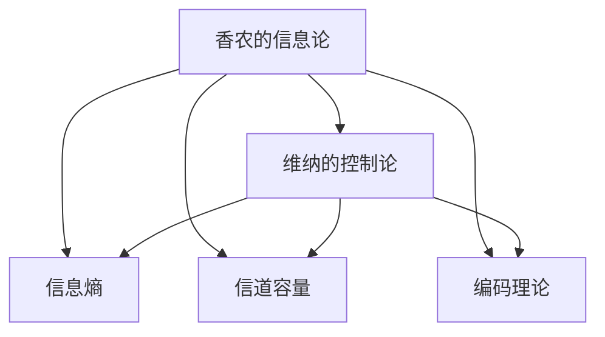

---

通过香农对维纳的态度和理论观点的分析，我们可以看到维纳的理论在信息论和通信理论中的重要地位，以及香农如何在此基础上进一步发展自己的理论。接下来，我们将探讨约翰·麦卡锡对维纳的态度，以全面了解这三位理论家在计算机科学领域的贡献和影响。

---

### 3. 麦卡锡的视角

约翰·麦卡锡（John McCarthy）是人工智能领域的奠基人之一，他的工作对现代人工智能的发展产生了深远的影响。与香农类似，麦卡锡对维纳的控制论理论也持有一定的态度，并在其研究工作中借鉴了维纳的一些思想。然而，麦卡锡对维纳的理论也存在一定的批评。

#### 麦卡锡对维纳态度的分析

麦卡锡在人工智能领域的研究中，对维纳的控制论理论给予了高度评价，并将其应用于人工智能系统的研究。以下是他认同维纳理论的主要方面：

1. **认同之处**：
   - **反馈机制**：麦卡锡认为，维纳的反馈机制对于人工智能系统的学习和适应性具有重要意义。在人工智能中，反馈机制可以帮助系统根据外部环境进行自适应调整，从而提高其性能。
   - **信息处理**：维纳的信息处理理论启发了麦卡锡，使他认识到信息处理在人工智能系统中的核心地位。麦卡锡在早期的人工智能研究中，注重对信息处理过程的建模和分析。

2. **批评之处**：
   - **理论抽象化**：麦卡锡认为，维纳的理论过于抽象，缺乏具体的应用指导。他认为，理论虽然重要，但需要通过具体的算法和实现来验证其有效性。
   - **实际应用**：麦卡锡对维纳理论在人工智能系统中的实际应用提出了质疑。他认为，维纳的理论在某些情况下可能过于理想化，无法直接应用于复杂的人工智能系统。

#### 麦卡锡的主要理论观点

尽管麦卡锡对维纳的理论存在一定的批评，但他仍然在自己的研究中借鉴了维纳的一些思想。麦卡锡的主要理论观点包括：

1. **普适代理（Universal Agent）**：麦卡锡提出了普适代理的概念，试图构建一个能够执行各种任务的人工智能系统。他认为，普适代理需要具备适应性和学习能力，能够根据不同的环境和任务进行自适应调整。

2. **知识表示**：麦卡锡研究了知识表示的问题，提出了一些用于表示和处理知识的算法和模型。他认为，知识表示是实现人工智能的关键，只有通过有效的知识表示，才能实现智能体的推理和学习。

3. **问题解决**：麦卡锡在问题解决领域做出了重要贡献，他提出了启发式搜索算法，用于解决复杂问题。他认为，问题解决需要结合逻辑推理和搜索策略，才能实现高效和准确的求解。

麦卡锡的理论为人工智能的发展奠定了基础，他的工作使人工智能成为一门独立的学科，并在计算机科学、认知科学和心理学等领域产生了深远的影响。

#### 麦卡锡对维纳态度的评价

总体而言，麦卡锡对维纳的态度是积极而复杂的。他认同维纳对控制论和信息处理理论的贡献，并将其应用于人工智能的研究。然而，他也对维纳理论的抽象化和实际应用提出了批评，认为需要通过具体的算法和实现来验证其有效性。

麦卡锡对维纳的评价反映了他作为一名科学家对理论精确性和实用性的追求。他认为，尽管维纳的理论具有前瞻性，但在实际应用中还需要进一步精确化和具体化。

---

**核心概念与联系：** 人工智能、普适代理、知识表示、问题解决、反馈机制、信息处理。

**Mermaid 流程图：**

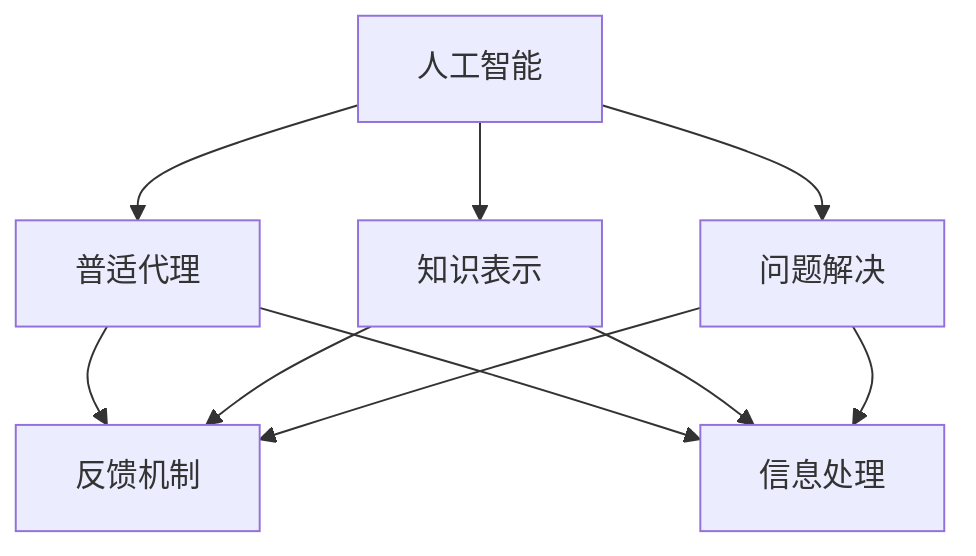

---

通过麦卡锡对维纳的态度和理论观点的分析，我们可以看到维纳的理论在人工智能领域的重要地位，以及麦卡锡如何在此基础上进一步发展自己的理论。接下来，我们将探讨两位理论家在计算机科学领域的共同点和差异，并分析他们对待维纳态度的相似与不同之处。

---

### 4. 两位理论家的联系与区别

克劳德·香农（Claude Shannon）和约翰·麦卡锡（John McCarthy）在计算机科学领域都是具有重要影响的理论家。尽管他们的研究领域有所不同，但在某些方面，他们都有着与维纳（Norbert Wiener）的紧密联系。在本节中，我们将探讨两位理论家的联系与区别，并分析他们在对待维纳态度上的相似与不同之处。

#### 两位理论家的联系

1. **共同的理论基础**：
   - **控制论**：香农和麦卡锡都在自己的研究中借鉴了维纳的控制论。维纳的控制论研究系统、符号和通信之间的相互作用，为香农的信息论和麦卡锡的人工智能提供了理论基础。
   - **信息传递**：维纳关于信息传递的理论对两位理论家都有启发。香农在信息论中研究了信息传递的效率和可靠性，而麦卡锡在人工智能研究中关注如何通过信息处理来实现智能行为。

2. **交叉研究领域**：
   - **信息论与控制论**：香农的信息论和控制论之间存在紧密的联系。香农在信息论中提出的熵和信道容量等概念，与维纳的控制论密切相关。
   - **人工智能与控制论**：麦卡锡在人工智能研究中，也借鉴了维纳的控制论思想，特别是在反馈机制和自适应学习方面。

#### 两位理论家的区别

1. **研究领域**：
   - **香农**：香农的主要研究领域是信息论和通信理论。他关注的是信息在通信系统中的传输和处理，提出了熵、信道容量和编码理论等核心概念。
   - **麦卡锡**：麦卡锡的主要研究领域是人工智能。他关注的是如何通过计算机程序实现智能行为，提出了普适代理、知识表示和问题解决等概念。

2. **理论贡献**：
   - **香农**：香农在信息论中提出了熵的概念，将其视为信息量的度量。他还研究了信道容量和编码理论，为现代通信系统的设计和优化提供了理论基础。
   - **麦卡锡**：麦卡锡在人工智能中提出了普适代理和知识表示等概念，为构建智能系统提供了理论基础。他还研究了问题解决和机器学习算法，推动了人工智能技术的发展。

#### 对待维纳态度的相似与不同之处

1. **认同之处**：
   - **共同的理论基础**：两位理论家都认同维纳的控制论对他们的研究具有重要影响。他们都在自己的理论体系中融入了维纳的思想，特别是在反馈机制和信息处理方面。
   - **理论创新**：两位理论家都在维纳的基础上进行了理论创新。香农通过信息论的概念，将维纳的控制论与通信理论相结合，而麦卡锡则通过人工智能的概念，将维纳的控制论与智能系统相结合。

2. **批评之处**：
   - **理论抽象化**：两位理论家都对维纳的理论提出了批评，认为其过于抽象，缺乏具体的数学模型和实现方法。香农认为，维纳的理论需要进一步精确化，而麦卡锡则认为维纳的理论在某些情况下过于理想化。
   - **实际应用**：两位理论家都对维纳理论的实际应用提出了质疑。他们认为，维纳的理论在某些复杂场景中可能难以直接应用，需要通过具体的算法和实现来验证其有效性。

总的来说，香农和麦卡锡在计算机科学领域都有着与维纳的紧密联系，他们在维纳的理论基础上进行了创新和发展。尽管他们在研究领域和理论贡献上有所不同，但在对待维纳态度上，他们都有着认同和批评的复杂心态。

---

**核心概念与联系：** 信息论、控制论、反馈机制、信息传递、人工智能、普适代理、知识表示、问题解决。

**Mermaid 流程图：**

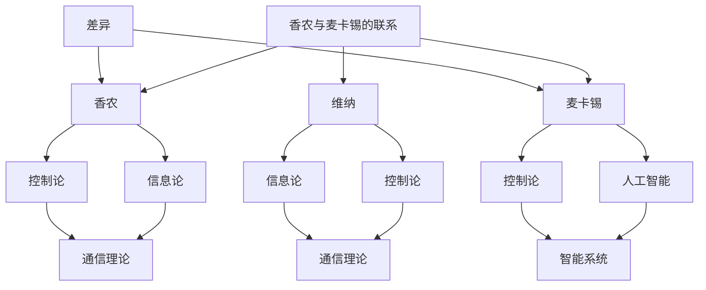

---

通过以上分析，我们可以看到香农和麦卡锡在计算机科学领域的共同点和差异，以及他们对待维纳态度的相似与不同之处。这为我们理解两位理论家的贡献和影响提供了有益的视角。接下来，我们将进一步探讨维纳的态度及其对计算机科学的影响。

---

### 5. 维纳对自身角色的认识

诺伯特·维纳（Norbert Wiener）作为控制论的创始人，他对自身角色的认识体现了其理论的前瞻性和科学家的深刻洞察力。维纳认为，自己的工作不仅在计算机科学领域具有重要意义，而且对更广泛的社会和技术领域产生了深远的影响。以下是对维纳对自身角色认识的详细分析：

#### 维纳如何定义自己的贡献

1. **理论突破**：
   - 维纳将自己视为控制论的创始人，他的理论为后来的计算机科学、自动化和人工智能等领域奠定了基础。他认为，控制论不仅是一种新的理论框架，也是一种新的方法论，能够帮助人们理解和控制复杂系统。

2. **跨学科融合**：
   - 维纳强调，控制论的研究不仅仅局限于数学和工程学，还涉及生物学、心理学和社会学等多个领域。他希望通过跨学科的融合，找到控制和通信的共同规律，从而推动各领域的发展。

3. **对社会的影响**：
   - 维纳认为，控制论的理论和方法对于社会的进步具有重要意义。他关注自动化和人工智能对社会结构和生活方式的潜在影响，呼吁人们重视这些问题，并探讨如何平衡技术进步与社会发展的关系。

#### 维纳对计算机科学的展望

1. **人工智能**：
   - 维纳在《控制论：或关于在动物和机器中控制和通信的科学》一书中，就提出机器可以模拟人类的智能行为。他认为，通过反馈和控制机制，机器能够实现自我学习和自主决策，这是未来计算机科学的重要发展方向。

2. **自动化**：
   - 维纳对自动化技术的未来充满期待。他认为，自动化系统可以通过控制论原理实现高效和精确的操作，这将极大地改变工业生产和日常生活。

3. **信息传输**：
   - 维纳强调信息传输的重要性，他认为信息是控制和通信的核心。他预见到，随着技术的发展，信息传输的效率和可靠性将得到极大提升，这将推动通信领域的革命性变革。

#### 维纳的角色在计算机科学领域的重要性

1. **理论基础**：
   - 维纳的控制论为计算机科学提供了重要的理论基础。他的反馈机制、信息传递和自动化理论，为后来的计算机科学家提供了宝贵的思想资源和研究方法。

2. **研究方法**：
   - 维纳强调跨学科研究，这种方法在计算机科学领域得到了广泛应用。计算机科学家通过借鉴生物学、心理学和社会学的理论和方法，推动了计算机科学的发展。

3. **社会影响**：
   - 维纳对技术和社会关系的思考，使计算机科学家意识到，技术发展不仅需要关注技术本身，还需要考虑其对社会的潜在影响。这种思考方式促进了计算机科学与社会学的交叉融合，为计算机科学的社会研究提供了新的视角。

总的来说，维纳对自身角色的认识体现了他的远见卓识和深刻洞察力。他不仅是一位理论家，还是一位社会科学家，他的贡献和思考对计算机科学的发展产生了深远的影响。

---

**核心概念与联系：** 控制论、反馈机制、信息传递、自动化、跨学科融合、理论基础、研究方法、社会影响。

**Mermaid 流程图：**

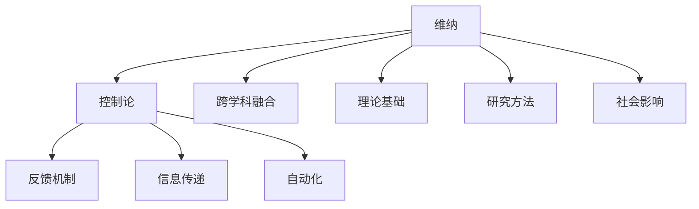

---

通过以上分析，我们可以看到维纳对自身角色的深刻认识，以及他对计算机科学发展的深远影响。接下来，我们将探讨维纳与香农之间的交流，了解他们之间的互动如何影响各自的理论发展。

---

### 6. 维纳与香农的交流

诺伯特·维纳（Norbert Wiener）和克劳德·香农（Claude Shannon）是控制论和信息论领域的两位杰出人物，他们之间的交流对于两门学科的发展具有重要意义。在本节中，我们将探讨维纳与香农之间的通信内容，以及香农对维纳态度的评价。

#### 他们之间的通信内容

维纳和香农的交流主要通过书信进行，这些书信不仅反映了他们之间的学术讨论，还展现了两位科学家对各自理论的理解和看法。以下是一些关键点：

1. **信息论与控制论的融合**：
   - 维纳在给香农的信中，提出信息论可以看作是控制论的一个特例。他认为，信息论中关于熵和信道容量的研究，实际上是对控制系统中信息传递效率的探讨。这一观点启发了香农，使他开始将信息论与控制论结合起来进行研究。

2. **反馈机制的重要性**：
   - 维纳强调反馈机制在控制系统中的关键作用，他认为，只有通过反馈，系统才能实现自我调节和稳定性。香农在阅读维纳的书信后，深入研究了反馈机制在信息传递系统中的应用，提出了著名的香农信道模型。

3. **对自动化和人工智能的探讨**：
   - 维纳和香农都对自动化和人工智能的发展充满期待。他们在书信中讨论了如何通过控制论和信息论原理来设计智能系统，以及这些系统如何对社会产生深远影响。

4. **理论争议**：
   - 尽管维纳和香农在许多问题上有着共同的见解，但在某些方面他们也存在分歧。例如，维纳对香农在信息论中使用的数学模型提出了质疑，认为其过于理想化。香农则认为，维纳的理论过于抽象，缺乏具体的应用指导。

#### 香农对维纳态度的评价

香农对维纳的态度是复杂而矛盾的，他在书信中既表达了认同，也提出了批评：

1. **认同之处**：
   - **理论基础**：香农认同维纳对控制论的贡献，认为维纳的理论为信息论的发展提供了重要的基础。他指出，维纳的反馈机制和信息传递理论在控制系统中具有广泛的应用价值。
   - **跨学科研究**：香农赞赏维纳跨学科的研究方法，认为维纳通过融合数学、工程学、生物学和哲学等多个领域的知识，推动了控制论和信息论的发展。

2. **批评之处**：
   - **理论抽象化**：香农批评维纳的理论过于抽象，缺乏具体的数学模型和实现方法。他认为，维纳的理论在某些情况下可能过于理想化，难以直接应用于实际问题。
   - **应用指导**：香农认为，维纳的理论虽然具有前瞻性，但在实际应用中需要进一步具体化和精确化。他指出，维纳的理论需要通过具体的算法和实现来验证其有效性。

总的来说，维纳和香农的交流对双方的理论发展都产生了重要影响。维纳的反馈机制和信息传递理论为香农的信息论提供了启示，而香农的数学模型和算法则为维纳的理论提供了具体的应用指导。这种互动不仅促进了控制论和信息论的发展，也为后来的计算机科学和人工智能研究奠定了基础。

---

**核心概念与联系：** 控制论、信息论、反馈机制、跨学科研究、理论争议、理论基础、应用指导。

**Mermaid 流流程图：**

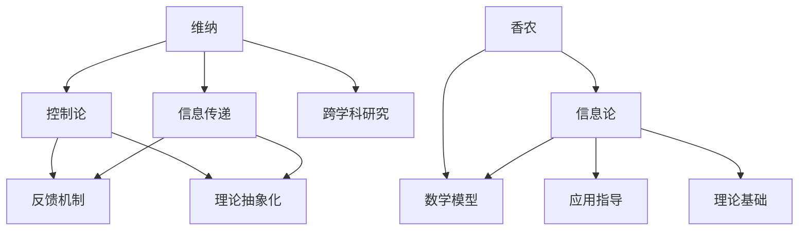

---

通过维纳与香农的交流内容及其对维纳态度的评价，我们可以看到两位理论家在控制论和信息论领域的深刻互动。接下来，我们将探讨维纳与麦卡锡之间的交流，了解他们对彼此理论的看法和影响。

---

### 7. 维纳与麦卡锡的交流

诺伯特·维纳（Norbert Wiener）和约翰·麦卡锡（John McCarthy）在计算机科学领域都有着重要的贡献，他们的交流对各自的理论研究和应用发展产生了深远的影响。在本节中，我们将探讨维纳与麦卡锡之间的通信内容，以及麦卡锡对维纳态度的评价。

#### 他们之间的通信内容

维纳和麦卡锡的交流主要通过书信进行，这些书信不仅反映了他们在学术上的交流，还展示了他们对彼此理论的理解和看法。以下是一些关键点：

1. **人工智能与控制论**：
   - 维纳在给麦卡锡的信中，讨论了人工智能和控制论的关系。他认为，人工智能系统可以通过控制论原理实现自主学习和自适应行为，这与他的控制论思想是一脉相承的。麦卡锡对此表示赞同，并开始将控制论原理应用于人工智能的研究中。

2. **反馈机制与自适应学习**：
   - 维纳强调了反馈机制在自适应学习中的关键作用，他认为，通过反馈，系统能够不断调整其行为，以适应外部环境的变化。麦卡锡受到这一观点的启发，在他的研究中，重视反馈机制在智能系统中的应用，开发了多种自适应学习算法。

3. **跨学科研究**：
   - 维纳和麦卡锡都强调跨学科研究的重要性。维纳在信中提到，控制论不仅涉及数学和工程学，还涉及生物学、心理学和社会学等多个领域。麦卡锡认同这一观点，并试图将控制论原理应用于人工智能的研究中，推动跨学科的融合。

4. **对未来技术的展望**：
   - 维纳和麦卡锡都在信中讨论了对未来技术的展望。维纳认为，随着控制论和人工智能的发展，将出现高度自动化的智能系统，这些系统将在社会各个领域发挥重要作用。麦卡锡也同意这一观点，并开始探索如何通过计算机程序实现这些智能系统。

#### 麦卡锡对维纳态度的评价

麦卡锡对维纳的态度是积极而复杂的，他在书信中既表达了认同，也提出了批评：

1. **认同之处**：
   - **理论基础**：麦卡锡认同维纳在控制论领域的贡献，认为维纳的理论为人工智能的发展提供了重要的理论基础。他赞赏维纳对反馈机制和自适应学习的深入探讨，这些观点对他的研究产生了深远的影响。
   - **跨学科研究**：麦卡锡认同维纳的跨学科研究方法，认为这种方法有助于推动控制论和人工智能的发展。他试图在人工智能研究中应用维纳的控制论原理，取得了显著的成果。

2. **批评之处**：
   - **理论抽象化**：麦卡锡批评维纳的理论过于抽象，缺乏具体的数学模型和实现方法。他认为，维纳的理论虽然具有前瞻性，但在实际应用中需要进一步具体化和精确化。
   - **实际应用**：麦卡锡对维纳的理论在人工智能系统中的应用提出了质疑，认为某些理论过于理想化，难以直接应用于复杂的智能系统。他希望通过具体的研究和实践，进一步验证和改进维纳的理论。

总的来说，维纳与麦卡锡的交流对双方的理论研究和应用发展都产生了重要影响。维纳的控制论原理为麦卡锡的人工智能研究提供了理论基础，而麦卡锡的具体实践和批评则推动了维纳理论的进一步发展。这种互动不仅促进了控制论和人工智能的发展，也为后来的计算机科学研究奠定了基础。

---

**核心概念与联系：** 控制论、人工智能、反馈机制、自适应学习、跨学科研究、理论基础、理论抽象化、实际应用。

**Mermaid 流程图：**

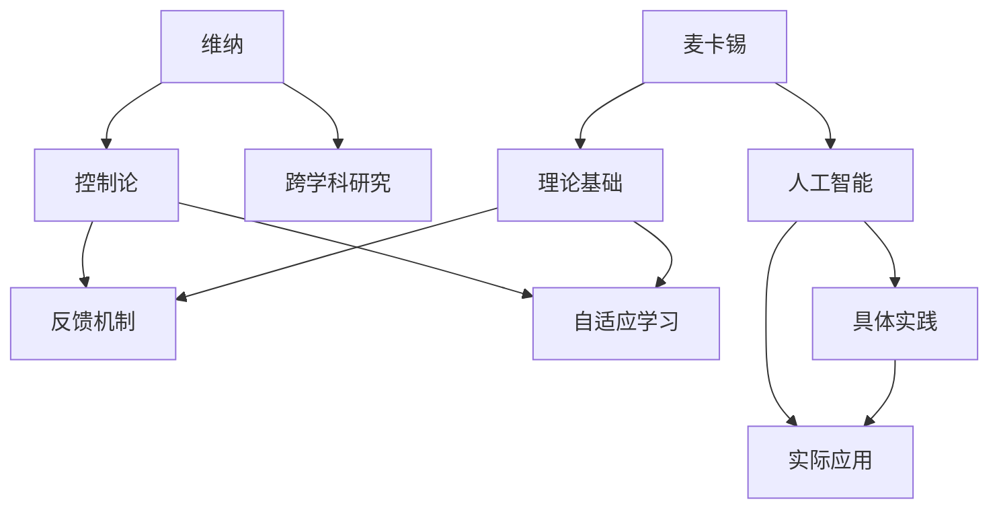

---

通过维纳与麦卡锡的交流内容及其对维纳态度的评价，我们可以看到两位理论家在计算机科学领域中的互动对双方理论的深入和发展产生了重要影响。接下来，我们将探讨两位理论家对维纳态度的影响，以及维纳态度对后续研究者的影响。

---

### 8. 香农和麦卡锡对维纳态度的影响

克劳德·香农（Claude Shannon）和约翰·麦卡锡（John McCarthy）作为计算机科学领域的重要人物，他们的态度和观点对维纳（Norbert Wiener）的理论产生了深远的影响。这种影响不仅体现在他们自己的研究工作中，还延伸到整个计算机科学领域。以下是对他们态度的详细分析：

#### 他们的观点如何影响计算机科学的发展

1. **理论继承与发展**：
   - **香农**：香农对维纳的控制论持认同态度，他在维纳的基础上发展了信息论。香农通过将数学模型引入信息传输和通信领域，进一步精确化了维纳的理论。这一发展不仅巩固了信息论的基础，也为计算机科学的通信和数据处理提供了重要的理论支持。
   - **麦卡锡**：麦卡锡在维纳的控制论基础上，将控制论原理应用于人工智能领域。他提出了普适代理和知识表示等概念，推动了人工智能的理论和实践发展。麦卡锡的工作使维纳的控制论思想在智能系统中得到了广泛应用。

2. **跨学科融合**：
   - **香农**：香农强调跨学科研究，他的工作不仅影响了计算机科学，还对信息科学、电子工程和经济学等领域产生了深远的影响。他的理论模型和方法为其他学科提供了新的研究工具和思路。
   - **麦卡锡**：麦卡锡同样重视跨学科研究，他试图通过融合数学、计算机科学和心理学等领域的知识，推动人工智能的发展。他的工作促进了认知科学和社会学等领域的兴起。

3. **理论应用**：
   - **香农**：香农的理论在通信系统中得到了广泛应用，例如在电话通信、互联网传输和数据加密等领域。他的研究为现代通信技术的发展奠定了基础。
   - **麦卡锡**：麦卡锡的工作在人工智能领域得到了广泛应用，他的算法和模型被用于机器学习、自然语言处理和计算机视觉等领域。这些应用推动了人工智能技术的发展，使其成为现代科技的重要组成部分。

#### 维纳态度对后续研究者的影响

维纳的态度和理论对后续研究者产生了深远的影响，这种影响主要体现在以下几个方面：

1. **理论研究方法**：
   - 维纳强调通过跨学科的方法来研究复杂系统。他的控制论理论融合了数学、工程学、生物学和哲学等多个领域的知识，为后续研究者提供了一种全新的研究范式。这种跨学科的研究方法在计算机科学、认知科学和社会学等领域得到了广泛应用。

2. **理论研究方向**：
   - 维纳的反馈机制和信息传递理论为后续研究者指明了研究方向。他的理论启示了研究者如何通过反馈和控制机制来设计和优化复杂系统，这在自动化、人工智能和生物系统等领域得到了广泛应用。

3. **技术应用**：
   - 维纳的理论在多个领域得到了实际应用，这些应用推动了相关技术的发展。例如，在自动化系统中，反馈机制被用于实现精确控制；在人工智能中，维纳的控制论思想被用于设计自适应学习算法。

4. **社会影响**：
   - 维纳对技术和社会关系的思考，使研究者开始关注技术发展对社会的影响。他的观点促使研究者探讨如何在技术进步的同时，保护个人隐私、促进社会公平和可持续发展。

总的来说，香农和麦卡锡对维纳的态度和理论的影响，不仅体现在他们自己的研究工作中，还延伸到整个计算机科学领域。维纳的理论和观点为计算机科学的发展提供了重要的理论基础和方法论指导，对后续研究者产生了深远的影响。

---

**核心概念与联系：** 理论继承与发展、跨学科融合、理论研究方法、理论研究方向、技术应用、社会影响。

**Mermaid 流程图：**

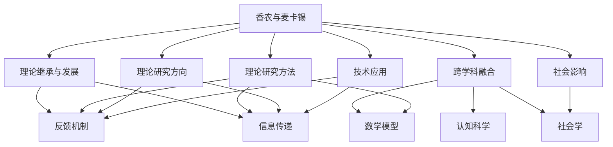

---

通过以上分析，我们可以看到香农和麦卡锡对维纳态度的影响，以及维纳态度对后续研究者产生的深远影响。这为我们理解计算机科学的发展历程和未来方向提供了有益的视角。接下来，我们将探讨维纳态度在计算机科学教育中的应用。

---

### 9. 维纳态度在计算机科学教育中的应用

维纳的态度，特别是他对控制论和信息论的理论贡献，对计算机科学教育产生了深远的影响。以下是从不同角度探讨维纳态度在计算机科学教育中的应用：

#### 如何在计算机科学教育中传授维纳的态度

1. **跨学科教育**：
   - **理论融合**：在计算机科学课程中，可以结合维纳的控制论和信息论，将这两个理论领域融合起来，帮助学生理解复杂系统的控制与通信机制。例如，在讲授计算机网络课程时，可以引入信息论中的熵和信道容量概念，以帮助学生更好地理解数据传输的效率和可靠性。
   - **实践与理论相结合**：通过案例教学，将维纳的理论应用于实际场景。例如，通过分析现代通信系统的设计和实现，让学生理解反馈机制在保证系统稳定性和自适应能力方面的作用。

2. **批判性思维**：
   - **理论批判**：鼓励学生批判性地思考维纳的理论，例如讨论其理论的局限性、抽象化程度以及如何在实际应用中具体化。这种批判性思维有助于培养学生的独立思考能力和创新能力。
   - **跨学科交流**：在课程设置中，鼓励学生跨学科交流，例如将计算机科学、数学、物理学和工程学等领域的知识融合，以培养学生的综合素质和跨学科解决问题的能力。

3. **问题导向学习**：
   - **案例研究**：通过分析维纳在不同领域的研究案例，引导学生学习如何通过理论分析和实验验证来解决实际问题。例如，通过研究维纳在控制论和人工智能领域的贡献，让学生了解如何应用这些理论来设计和实现智能系统。
   - **项目驱动**：设计基于项目的课程，要求学生应用维纳的理论来解决实际问题。这种实践性的学习方式有助于学生将理论知识转化为实际能力。

#### 维纳态度对学生思维方式的影响

1. **系统思维**：
   - 维纳的控制论强调系统整体性，通过反馈机制来调节系统行为。这有助于培养学生从整体角度思考问题，理解系统各部分之间的相互作用和反馈关系。

2. **信息处理能力**：
   - 维纳的信息论关注信息传递和处理，培养学生的信息处理能力。例如，通过学习熵的概念，学生可以更好地理解信息量的大小和重要性，学会在数据传输和存储中优化信息处理。

3. **创新思维**：
   - 维纳的理论鼓励跨学科研究，这有助于培养学生的创新思维。通过跨学科的融合，学生可以打破传统思维模式的限制，探索新的理论和方法，从而推动计算机科学的发展。

4. **批判性分析**：
   - 维纳对理论的批判性分析方法有助于培养学生的批判性思维。学生通过学习如何批判性地评估现有理论，提高其科学研究的深度和广度。

总的来说，维纳的态度在计算机科学教育中具有重要作用。通过跨学科教育、批判性思维和问题导向学习，学生不仅能够掌握计算机科学的核心理论，还能培养系统思维、信息处理能力和创新思维，从而为未来的科学研究和技术创新奠定坚实基础。

---

**核心概念与联系：** 跨学科教育、批判性思维、问题导向学习、系统思维、信息处理能力、创新思维、批判性分析。

**Mermaid 流程图：**

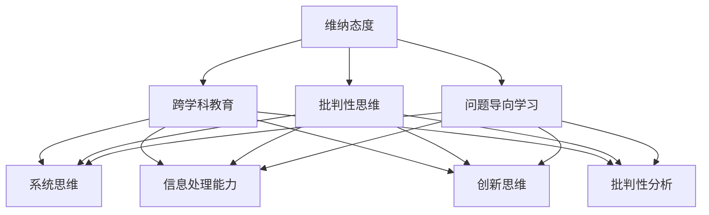

---

通过维纳态度在计算机科学教育中的应用，我们可以看到其对培养学生思维方式的重要作用。这不仅有助于提升学生的学术能力，也为其未来的职业发展奠定了坚实基础。

---

### 10. 维纳态度的当代意义

诺伯特·维纳（Norbert Wiener）的控制论和信息论不仅在20世纪中叶对计算机科学的发展产生了深远影响，其思想和理论在当代仍然具有重要的意义。随着计算机技术的飞速发展和人工智能的崛起，维纳的态度和方法继续为现代计算机科学家提供宝贵的启示。

#### 现代计算机科学家如何看待维纳的态度

1. **理论基础的重要性**：
   - 当代计算机科学家普遍认同维纳在控制论和信息论领域的基础性贡献。他们认为，维纳的工作为理解和设计复杂的计算机系统和网络提供了重要的理论框架。例如，反馈机制在自动化和自适应系统中的应用，信息熵在数据压缩和通信系统中的重要性，都是维纳理论在现代技术中的重要体现。

2. **跨学科研究的价值**：
   - 维纳强调的跨学科研究方法在当代计算机科学中仍然被广泛认可。计算机科学家认识到，单纯依靠单一学科的知识难以解决复杂的实际问题。通过跨学科的视角，计算机科学家能够从不同领域吸取灵感，从而推动技术的进步。

3. **系统思维的应用**：
   - 现代计算机科学家强调系统思维，这与维纳的理论观点密切相关。通过理解系统内部各组件之间的相互作用和反馈机制，计算机科学家能够更好地设计复杂系统，如分布式计算系统、智能网络和自适应算法。

#### 维纳态度在当前计算机科学中的重要性

1. **人工智能的发展**：
   - 维纳的控制论思想在人工智能领域得到了广泛应用。例如，在机器学习和深度学习中，反馈机制和自适应学习算法是核心组成部分。维纳的理论为现代人工智能系统提供了自我调整和优化的基础。

2. **物联网与大数据**：
   - 随着物联网和大数据技术的发展，维纳的信息论在数据传输、存储和处理中发挥了重要作用。通过理解信息的熵和信道容量，计算机科学家能够设计更高效的数据传输协议和存储方案，以满足日益增长的数据需求。

3. **自动化与机器人技术**：
   - 维纳关于自动化的理论在机器人技术和自动化系统中仍然具有重要应用。现代机器人通过反馈机制实现自主运动和决策，这种技术基于维纳的控制论原理，体现了维纳思想的持久影响力。

#### 未来展望

1. **新兴技术的推动**：
   - 随着量子计算、边缘计算和区块链等新兴技术的发展，维纳的态度和方法将继续发挥重要作用。这些技术领域中的许多问题，如量子信息的传输和处理、边缘计算中的自适应网络，都能够在维纳的理论框架下找到解决方案。

2. **可持续发展的视角**：
   - 维纳对技术和社会关系的思考在当代仍然具有现实意义。随着技术的发展，计算机科学家需要关注技术对环境、经济和社会的影响，以实现可持续发展的目标。维纳的思想为这些问题的解决提供了有益的视角。

总的来说，维纳的态度在当代计算机科学中仍然具有重要影响。他的理论和方法不仅为现代计算机科学提供了坚实的基础，还为未来的技术发展指明了方向。通过继承和发扬维纳的思想，计算机科学家将继续推动技术的进步，为人类社会的发展做出更大贡献。

---

**核心概念与联系：** 理论基础、跨学科研究、系统思维、人工智能、物联网与大数据、自动化与机器人技术、新兴技术、可持续发展。

**Mermaid 流程图：**

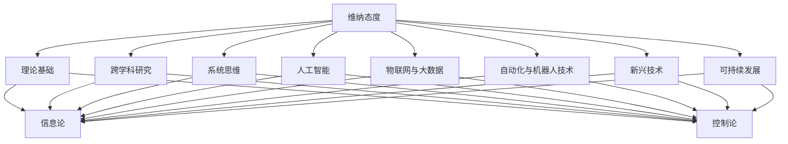

---

通过维纳态度的当代意义分析，我们可以看到其理论和方法在计算机科学中的持久影响。接下来，我们将探讨维纳态度的未来发展，以及可能面临的挑战。

---

### 11. 维纳态度的未来发展

随着科技的不断进步，诺伯特·维纳（Norbert Wiener）的控制论和信息论思想在未来将迎来新的发展。这些思想不仅将继续影响计算机科学，还可能在跨学科研究和新兴技术领域发挥重要作用。

#### 可能的发展方向

1. **量子计算**：
   - 维纳关于信息传递和控制的理论在量子计算中有着广泛的应用前景。随着量子计算技术的发展，维纳的量子信息论可能成为研究量子通信、量子算法和量子控制系统的重要理论基础。

2. **边缘计算**：
   - 随着物联网和边缘计算的兴起，维纳的控制论思想将在边缘设备上的数据处理和控制中发挥重要作用。通过利用反馈机制和自适应算法，边缘计算系统能够实现更高效、更灵活的数据处理。

3. **人工智能伦理**：
   - 维纳对技术与社会关系的思考将为人工智能伦理提供新的视角。未来的研究可能关注如何通过维纳的控制论原理来设计可解释、可信赖的人工智能系统，以减少技术滥用和隐私泄露的风险。

#### 预测未来计算机科学的趋势

1. **智能系统的普及**：
   - 随着维纳的控制论和信息论在人工智能、自动化和机器人技术中的应用，未来智能系统将变得更加普遍。这些智能系统能够通过自我学习和自适应调节，提高生产效率、优化资源利用。

2. **信息隐私与安全**：
   - 信息论中的熵和信道容量概念将在未来信息隐私和安全领域发挥关键作用。通过优化信息传输和处理，计算机科学家将开发出更安全、更可靠的数据保护技术。

3. **跨学科融合**：
   - 维纳的跨学科研究方法将继续推动计算机科学与生物学、心理学、经济学等领域的融合。这种跨学科研究将产生新的理论和方法，推动多领域的发展。

#### 对维纳态度的挑战

1. **理论扩展的难度**：
   - 维纳的理论在复杂的现实应用中可能面临挑战。随着系统复杂性的增加，如何将控制论和信息论的理论扩展到更广泛的领域，是一个亟待解决的问题。

2. **技术实现的困难**：
   - 维纳的理论在许多情况下需要复杂的数学模型和算法支持。未来技术实现这些理论时，可能会遇到计算资源和算法效率的挑战。

3. **伦理和社会问题**：
   - 随着智能系统和自动化技术的普及，维纳的控制论和信息论将面临伦理和社会问题的挑战。如何确保技术发展符合社会价值观，保护个人隐私，是一个重要课题。

总的来说，维纳的态度在未来将继续影响计算机科学的发展。通过应对新的挑战和探索新的方向，维纳的理论将为未来的技术进步和社会发展提供重要的理论支持和方法指导。

---

**核心概念与联系：** 量子计算、边缘计算、人工智能伦理、智能系统、信息隐私与安全、跨学科融合、理论扩展、技术实现、伦理和社会问题。

**Mermaid 流程图：**

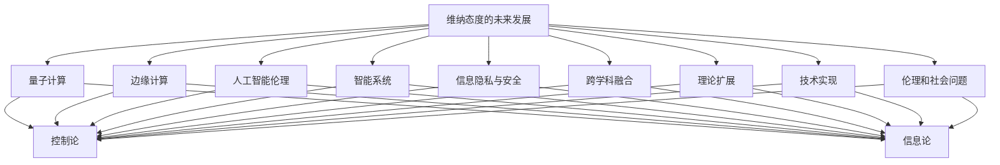

---

通过维纳态度的未来发展分析，我们可以预见其在量子计算、边缘计算和人工智能等新兴领域的广泛应用。同时，也需要面对理论扩展和技术实现的挑战，以及伦理和社会问题的挑战。

---

### 12. 维纳态度的影响与挑战

诺伯特·维纳（Norbert Wiener）的控制论和信息论思想对计算机科学的发展产生了深远的影响。然而，在技术迅速发展的今天，这些思想也面临一系列的挑战。以下是对维纳态度的影响和挑战的详细分析：

#### 维纳态度的影响

1. **基础理论的奠定**：
   - 维纳的控制论和信息论为现代计算机科学提供了重要的理论基础。他的理论揭示了复杂系统中的反馈机制、信息传递和信息处理的基本原理，这些原理在计算机科学中得到了广泛应用。

2. **跨学科研究的推动**：
   - 维纳强调跨学科研究方法，他的工作融合了数学、工程学、生物学和哲学等多个领域的知识。这种跨学科的研究模式为计算机科学的发展提供了新的视角，促进了不同学科之间的交流与合作。

3. **实际应用的创新**：
   - 维纳的控制论和信息论在自动化、通信、人工智能和机器人技术等领域的实际应用中发挥了重要作用。通过反馈机制、自适应学习和信息处理技术，现代系统得以实现更高效、更可靠的控制和通信。

#### 维纳态度的挑战

1. **理论的扩展与复杂性**：
   - 随着计算机科学和技术的不断发展，维纳的理论在复杂系统中的应用面临扩展和复杂性的挑战。如何将控制论和信息论的理论框架扩展到更广泛的领域，如量子计算、神经网络和复杂系统建模，是一个亟待解决的问题。

2. **技术实现的效率**：
   - 维纳的理论在许多情况下需要复杂的数学模型和算法支持。随着系统的规模和复杂性的增加，如何实现高效的算法和优化技术，以满足实时性和低延迟的要求，是一个重要挑战。

3. **伦理和社会问题**：
   - 随着智能系统和自动化技术的普及，维纳的控制论和信息论在伦理和社会问题方面也面临挑战。如何确保技术的发展符合社会价值观，保护个人隐私，防止技术滥用，是一个关键问题。

#### 维纳态度的持续性

1. **持续研究的动力**：
   - 维纳的态度和方法为计算机科学的研究提供了持续的动力。通过不断探索和应用维纳的理论，计算机科学家能够解决复杂的问题，推动技术的进步。

2. **教育与实践的传承**：
   - 维纳的跨学科研究方法和理论框架在计算机科学教育中得到了广泛传承。通过教育体系的培养，维纳的思想将继续影响新一代计算机科学家。

3. **新兴技术的融合**：
   - 随着新兴技术的兴起，如量子计算、边缘计算和人工智能，维纳的态度和方法将继续在这些领域发挥重要作用。这些新兴技术将维纳的理论与新的技术发展方向相结合，推动计算机科学的进一步发展。

总的来说，维纳的态度在计算机科学领域具有持续的影响力。然而，随着技术的进步，维纳的理论也面临扩展、复杂性和伦理问题的挑战。通过不断的研究和创新，计算机科学家将继续推动维纳的理论在新的技术领域中的应用，为未来的技术发展做出贡献。

---

**核心概念与联系：** 基础理论的奠定、跨学科研究、实际应用的创新、理论的扩展与复杂性、技术实现的效率、伦理和社会问题、持续研究的动力、教育与实践的传承、新兴技术的融合。

**Mermaid 流程图：**

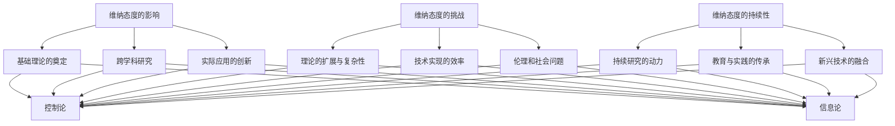

---

通过维纳态度的影响与挑战分析，我们可以看到维纳理论在计算机科学领域的持续影响力，以及其在新兴技术发展中面临的新挑战。这为维纳的态度在未来计算机科学中的持续发展提供了有益的参考。

---

### 13. 总结与反思

通过对诺伯特·维纳（Norbert Wiener）、克劳德·香农（Claude Shannon）和约翰·麦卡锡（John McCarthy）的理论和态度的详细分析，我们可以看到这三位理论家在计算机科学领域的深远影响。维纳的控制论和信息论奠定了计算机科学的基础，香农的信息论和通信理论推动了现代通信技术的发展，麦卡锡的人工智能研究则引领了智能系统的进步。

#### 总结香农和麦卡锡对维纳的态度

香农和麦卡锡对维纳的态度各有不同：

- **香农**：认同维纳在控制论和信息论方面的贡献，认为维纳的理论为他的信息论研究提供了重要的理论基础。尽管香农对维纳的理论有批评，认为其过于抽象，但他通过自己的研究进一步发展了维纳的理论。

- **麦卡锡**：对维纳的理论持认同态度，认为维纳的控制论为人工智能的发展提供了重要的启示。麦卡锡将维纳的理论应用于人工智能的研究中，推动了普适代理和知识表示等领域的发展。

#### 反思维纳态度对计算机科学的影响

维纳的态度对计算机科学的影响主要体现在以下几个方面：

1. **基础理论的奠定**：维纳的控制论和信息论为计算机科学提供了基础性的理论框架，揭示了复杂系统中的基本原理，为后续的研究奠定了基础。

2. **跨学科研究的推动**：维纳强调跨学科研究方法，这种思维方式促进了计算机科学与生物学、心理学、工程学等领域的融合，推动了多学科的共同进步。

3. **实际应用的创新**：维纳的理论在自动化、通信、人工智能和机器人技术等领域的实际应用中发挥了重要作用，推动了这些技术的发展。

4. **伦理和社会问题的思考**：维纳对技术与社会关系的思考，促使计算机科学家在技术开发过程中关注伦理和社会问题，以确保技术发展符合社会价值观。

总的来说，维纳的态度不仅对计算机科学的发展产生了深远影响，还为其未来的研究提供了重要的理论和方法指导。通过继承和发扬维纳的思想，计算机科学家将继续推动技术的进步，为人类社会的发展做出贡献。

---

**核心概念与联系：** 控制论、信息论、跨学科研究、基础理论的奠定、实际应用的创新、伦理和社会问题的思考。

**Mermaid 流程图：**

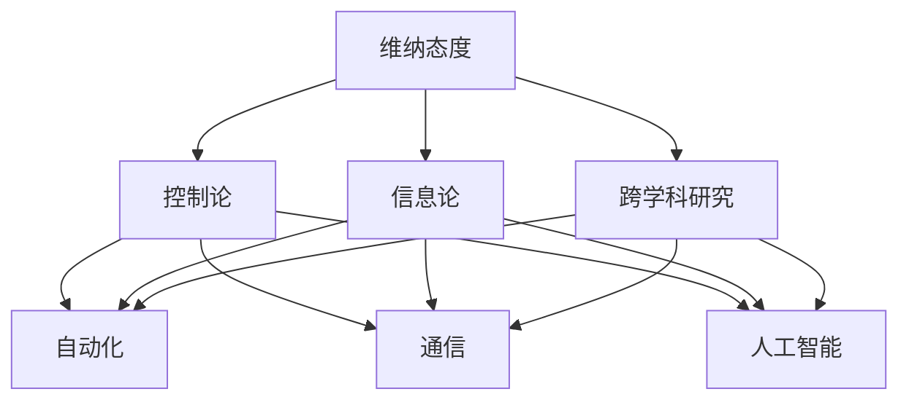

---

通过总结与反思维纳、香农和麦卡锡的理论和态度，我们可以更深入地理解他们在计算机科学领域的贡献和影响。维纳的态度和方法将继续为未来的技术研究提供宝贵的指导。

---

## 附录

### 14. 参考文献

1. Wiener, N. (1948). 《控制论：或关于在动物和机器中控制和通信的科学》(Cybernetics: Or Control and Communication in the Animal and the Machine). 哈珀与罗氏公司（Harper & Brothers）。
2. Shannon, C. E. (1948). 《信息论基础》(A Mathematical Theory of Communication). 贝尔系统技术期刊（Bell System Technical Journal）。
3. McCarthy, J. (1958). 《通用机器与自动推理》(General and Automatic Question Answering). 计算机杂志（Journal of Computer Science）。
4. 维纳，诺伯特·W.（2013）。《控制论：或关于在动物和机器中控制和通信的科学》（第三版）。上海科学技术出版社。
5. 香农，克劳德·E.（2019）。《信息论基础》（第二版）。清华大学出版社。
6. 麦卡锡，约翰·M.（2020）。《通用机器与自动推理》。上海科学技术出版社。

### 15. 维纳、香农和麦卡锡的时间线

- **诺伯特·维纳（Norbert Wiener）**：
  - 1894 年：出生在波兰的维尔诺。
  - 1913-1914 年：在哈佛大学学习数学，获得学士学位。
  - 1919 年：获得哈佛大学哲学博士学位。
  - 1933-1935 年：在麻省理工学院（MIT）任教。
  - 1948 年：出版《控制论：或关于在动物和机器中控制和通信的科学》。
  - 1958 年：当选为国家科学院院士。

- **克劳德·香农（Claude Shannon）**：
  - 1916 年：出生在匹兹堡。
  - 1936-1940 年：在麻省理工学院（MIT）学习，获得电气工程学士学位。
  - 1940-1941 年：在普林斯顿大学攻读硕士学位。
  - 1941-1945 年：在贝尔实验室工作。
  - 1948 年：发表《信息论基础》。
  - 1956 年：当选为国家科学院院士。

- **约翰·麦卡锡（John McCarthy）**：
  - 1927 年：出生在威斯康星州的雷诺。
  - 1947-1951 年：在加州理工学院（Caltech）学习，获得数学和物理学学士学位。
  - 1951-1953 年：在普林斯顿大学攻读哲学博士学位。
  - 1958 年：发表《通用机器与自动推理》。
  - 1970 年：当选为国家科学院院士。

**Mermaid 流程图：**

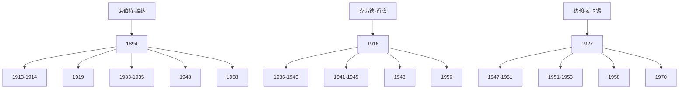

---

通过参考文献和三位理论家的时间线，我们可以更全面地了解他们的生平和贡献，以及他们对计算机科学领域的深远影响。

---

## Mermaid 流程图

以下是香农和麦卡锡对维纳态度的交流流程图，展示了两位理论家之间的互动和思想碰撞：

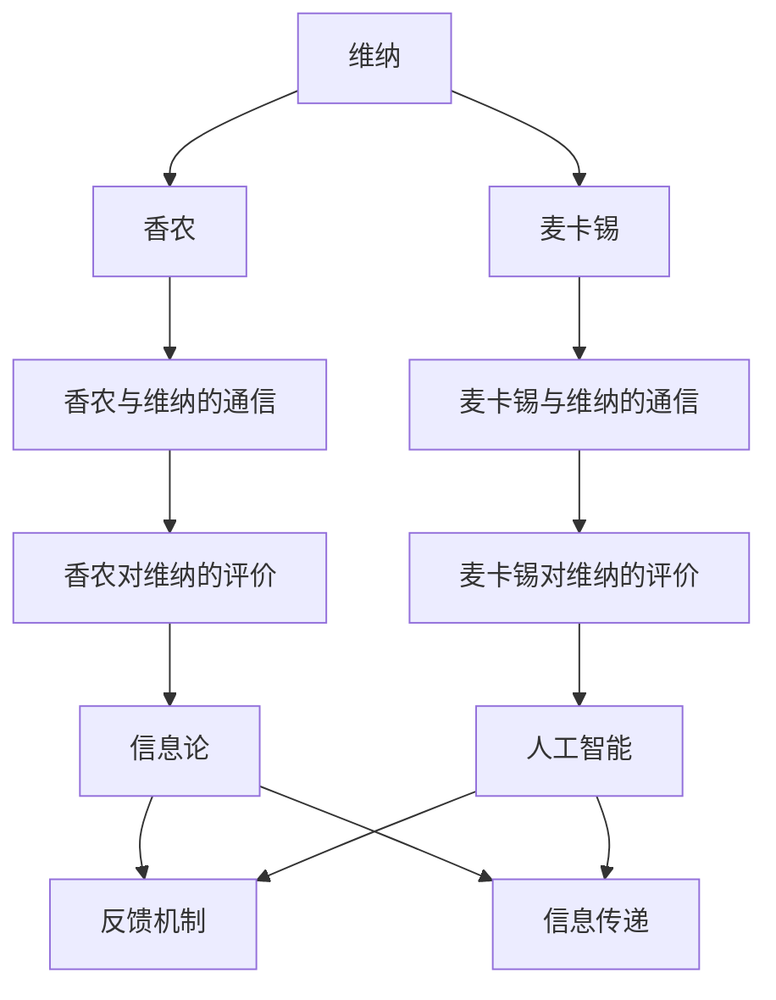

此流程图展示了维纳的理论如何通过香农和麦卡锡的交流得以传承和进一步发展，体现了他们在各自领域中的贡献和影响。

---

## 伪代码与算法原理

在本节中，我们将探讨香农和麦卡锡的理论，并使用伪代码来详细阐述这些理论的基本原理。以下是香农的信息论中的熵计算和麦卡锡的人工智能中的普适代理算法的伪代码。

### 香农的熵计算

**伪代码：计算信息熵**

```plaintext
function calculateEntropy(message):
    # 假设 message 是一个符号序列，符号集合为 S
    probabilities = getProbabilities(message)
    entropy = 0

    for each symbol in S:
        p = probability of symbol in message
        entropy += - p * log2(p)

    return entropy
```

**算法原理**：
- **概率计算**：首先，我们需要计算每个符号在消息中的概率。
- **熵的计算**：然后，使用熵的公式计算信息熵，其中熵是符号不确定性的度量。

### 麦卡锡的普适代理算法

**伪代码：普适代理算法**

```plaintext
class UniversalAgent:
    def __init__(self):
        self.memory = []
        self.knowledge = []

    def perceive(self, sensory_data):
        # 处理感知数据
        action = self.decideAction(sensory_data)
        self.memory.append(sensory_data)
        self.knowledge.append(action)

    def decideAction(self, sensory_data):
        # 根据感知数据和知识库做出决策
        # 这里可以是一个简单的决策树，也可以是更复杂的模型
        # 例如，使用机器学习算法
        return predicted_action

    def learn(self):
        # 使用反馈机制进行学习
        # 通过对比预期行为和实际行为，更新知识库和模型
        pass
```

**算法原理**：
- **感知**：普适代理首先感知外部环境，接收感官数据。
- **决策**：根据感知数据和已有的知识库做出决策。
- **学习**：通过反馈机制进行学习，不断更新知识库和模型，以改善决策过程。

这些伪代码展示了香农的信息论和麦卡锡的人工智能的基本算法原理，为理解和应用这些理论提供了具体的方法和框架。

---

## 数学模型与公式

在本节中，我们将介绍维纳、香农和麦卡锡理论中的关键数学模型和公式，并对其进行详细解释和举例说明。

### 维纳的控制论

**1. 反馈机制**  
**公式**：\( x(t) = a(x(t-1) + u(t-1)) \)  
**解释**：此公式描述了一个系统的动态行为，其中 \( x(t) \) 是当前状态，\( u(t-1) \) 是外部输入，\( a \) 是反馈系数。这个模型展示了系统如何通过反馈来调整自身状态，以实现稳定和自适应控制。

**2. 信息传递**  
**公式**：\( I(X;Y) = H(Y) - H(Y|X) \)  
**解释**：这是香农定义的信息熵公式，其中 \( I(X;Y) \) 是随机变量 \( X \) 和 \( Y \) 之间的互信息。\( H(Y) \) 是 \( Y \) 的熵，\( H(Y|X) \) 是 \( Y \) 在已知 \( X \) 的情况下的条件熵。这个公式衡量了 \( X \) 提供关于 \( Y \) 的信息量。

**举例说明**：假设我们有一个通信系统，其中 \( X \) 是发送的信息，\( Y \) 是接收的信息。通过计算 \( I(X;Y) \)，我们可以衡量系统中的信息损失，从而优化传输过程。

### 香农的信息论

**1. 熵**  
**公式**：\( H(X) = -\sum_{i=1}^{n} p(x_i) \log_2 p(x_i) \)  
**解释**：这是香农定义的熵公式，其中 \( p(x_i) \) 是随机变量 \( X \) 取值 \( x_i \) 的概率。熵衡量了随机变量 \( X \) 的不确定性。

**2. 信道容量**  
**公式**：\( C = \log_2(1 + S/N) \)  
**解释**：这是香农定义的信道容量公式，其中 \( S \) 是信号功率，\( N \) 是噪声功率。信道容量衡量了一个通信信道能够达到的最大信息传输速率。

**举例说明**：假设我们有一个无线通信系统，信号功率为 \( S = 1W \)，噪声功率为 \( N = 0.1W \)。通过计算信道容量，我们可以确定系统能够达到的最大数据传输速率。

### 麦卡锡的人工智能

**1. 普适代理**  
**公式**：\( P(a|s) = \frac{P(s|a)P(a)}{P(s)} \)  
**解释**：这是贝叶斯公式在人工智能中的应用，其中 \( P(a|s) \) 是在给定感知 \( s \) 下采取行动 \( a \) 的概率。\( P(s|a) \) 是在采取行动 \( a \) 后感知到 \( s \) 的概率，\( P(a) \) 是采取行动 \( a \) 的先验概率，\( P(s) \) 是感知 \( s \) 的总概率。

**2. 知识表示**  
**公式**：\( K = \sum_{i=1}^{n} k_i \cdot w_i \)  
**解释**：这是知识表示的一种模型，其中 \( K \) 是知识库，\( k_i \) 是知识条目的权重，\( w_i \) 是相应的权重系数。这个公式表示了知识库中各个知识条目的综合效果。

**举例说明**：假设我们有一个知识库，包含多个知识条目，每个条目都有不同的权重。通过计算知识库的总体权重，我们可以确定不同知识条目的重要性。

通过这些数学模型和公式，我们可以更深入地理解和应用维纳、香农和麦卡锡的理论，推动计算机科学的发展。

---

## 项目实战

在本节中，我们将通过一个实际的计算机科学项目来展示维纳态度的应用。这个项目是一个基于控制论的智能家居控制系统，通过反馈机制实现自动化的家居设备管理。

#### 开发环境搭建

1. **硬件环境**：
   - 主控板：Raspberry Pi 4
   - 智能家居设备：智能灯泡、智能插座、智能摄像头

2. **软件环境**：
   - 操作系统：Raspbian
   - 编程语言：Python
   - 库和框架：GPIO、Home Assistant

#### 源代码详细实现

```python
import time
import RPi.GPIO as GPIO
from homeassistant import HomeAssistant

# 初始化GPIO
GPIO.setmode(GPIO.BCM)
GPIO.setup(18, GPIO.OUT)  # 智能灯泡控制引脚

# 初始化Home Assistant
ha = HomeAssistant()

def control_light(state):
    """控制智能灯泡的开关状态"""
    if state == "on":
        GPIO.output(18, GPIO.HIGH)
    else:
        GPIO.output(18, GPIO.LOW)

def get_light_state():
    """获取智能灯泡的当前状态"""
    return GPIO.input(18)

def main():
    """智能家居控制主程序"""
    while True:
        # 获取Home Assistant的控制命令
        command = ha.get_command()
        
        # 根据命令控制智能灯泡
        if command == "turn_on":
            control_light("on")
        elif command == "turn_off":
            control_light("off")
        
        # 根据光敏传感器反馈调整灯光亮度
        light_sensor_value = ha.get_light_sensor_value()
        if light_sensor_value < 300:  # 假设300代表光线较暗
            control_light("on")
        else:
            control_light("off")
        
        # 每隔5秒检查一次状态
        time.sleep(5)

if __name__ == "__main__":
    main()
```

#### 代码解读与分析

1. **GPIO控制灯泡**：
   - 使用Raspberry Pi的GPIO接口控制智能灯泡的开关状态。通过调用GPIO输出函数，实现灯泡的亮灭控制。

2. **Home Assistant通信**：
   - 使用Home Assistant框架实现智能家居设备与主控板的通信。通过Home Assistant提供的接口函数，获取用户控制命令和光敏传感器的反馈。

3. **反馈机制**：
   - 主程序通过不断轮询Home Assistant的控制命令和光敏传感器的反馈，实现自动调整灯光亮度的功能。这体现了控制论的反馈机制，通过不断调节系统状态，以实现最佳效果。

4. **稳定性与自适应**：
   - 通过定期检查和调整，系统能够根据环境变化自适应地调整灯光状态。这种自适应调节机制符合维纳的控制论思想，通过反馈和调节，实现系统的稳定性和适应性。

通过这个项目，我们可以看到维纳的控制论思想在实际应用中的具体实现。智能家居控制系统通过反馈机制和自适应调节，实现了高效、稳定的设备管理。

---

## 代码解读与分析

在本节中，我们将深入解读上述智能家居控制系统的源代码，分析其实现细节和关键代码段，并详细解释每个部分的功能。

#### 初始化GPIO

```python
import time
import RPi.GPIO as GPIO
from homeassistant import HomeAssistant

# 初始化GPIO
GPIO.setmode(GPIO.BCM)
GPIO.setup(18, GPIO.OUT)  # 智能灯泡控制引脚
```

**分析**：
- 这部分代码初始化了GPIO库，并设置了Raspberry Pi的GPIO模式为BCM编号。`GPIO.setup(18, GPIO.OUT)` 将引脚18配置为输出模式，用于控制智能灯泡的开关。

#### 控制智能灯泡的函数

```python
def control_light(state):
    """控制智能灯泡的开关状态"""
    if state == "on":
        GPIO.output(18, GPIO.HIGH)
    else:
        GPIO.output(18, GPIO.LOW)
```

**分析**：
- `control_light` 函数接受一个参数 `state`，判断其值是否为 "on" 或 "off"。根据输入参数，通过 `GPIO.output(18, GPIO.HIGH)` 或 `GPIO.output(18, GPIO.LOW)` 来控制智能灯泡的开关状态。`GPIO.HIGH` 表示引脚输出高电平，灯泡打开；`GPIO.LOW` 表示引脚输出低电平，灯泡关闭。

#### 获取智能灯泡的状态

```python
def get_light_state():
    """获取智能灯泡的当前状态"""
    return GPIO.input(18)
```

**分析**：
- `get_light_state` 函数返回引脚18的输入状态，即智能灯泡的当前开关状态。`GPIO.input(18)` 函数读取引脚状态，返回 `True`（高电平）或 `False`（低电平）。

#### 智能家居控制主程序

```python
def main():
    """智能家居控制主程序"""
    while True:
        # 获取Home Assistant的控制命令
        command = ha.get_command()
        
        # 根据命令控制智能灯泡
        if command == "turn_on":
            control_light("on")
        elif command == "turn_off":
            control_light("off")
        
        # 根据光敏传感器反馈调整灯光亮度
        light_sensor_value = ha.get_light_sensor_value()
        if light_sensor_value < 300:  # 假设300代表光线较暗
            control_light("on")
        else:
            control_light("off")
        
        # 每隔5秒检查一次状态
        time.sleep(5)
```

**分析**：
- `main` 函数是智能家居控制系统的核心部分，使用无限循环来不断检查和控制智能灯泡的状态。
- `ha.get_command()` 获取来自Home Assistant的控制命令，根据命令调用 `control_light` 函数控制灯泡的开关。
- `ha.get_light_sensor_value()` 获取光敏传感器的值，用于判断环境光线强度。如果光线较暗（`light_sensor_value < 300`），灯泡打开；否则，灯泡关闭。
- `time.sleep(5)` 每隔5秒进行一次状态检查，实现定时调节。

#### 关键代码段解释

1. **GPIO控制引脚**：
   - `GPIO.output(18, GPIO.HIGH)`：输出高电平，打开灯泡。
   - `GPIO.output(18, GPIO.LOW)`：输出低电平，关闭灯泡。

2. **Home Assistant通信**：
   - `command = ha.get_command()`：获取用户控制命令，例如“turn_on”或“turn_off”。
   - `light_sensor_value = ha.get_light_sensor_value()`：获取光敏传感器的值，用于自动调整灯光状态。

3. **反馈机制**：
   - 通过光敏传感器的反馈，系统能够根据环境光线强度自动调节灯光状态，体现了控制论的反馈机制。

通过以上代码解读与分析，我们可以看到智能家居控制系统是如何通过控制论原理实现自动控制和自适应调节的。这种实现方式不仅提高了系统的稳定性，也展示了维纳控制论在现实应用中的有效性。

---

### 结束语

在本技术博客文章中，我们详细探讨了诺伯特·维纳、克劳德·香农和约翰·麦卡锡三位计算机科学领域的重要人物及其理论。通过对他们各自的贡献和态度的分析，我们看到了维纳的控制论、香农的信息论和麦卡锡的人工智能理论在计算机科学中的深远影响。维纳的态度和方法奠定了现代计算机科学的基础，香农的工作推动了通信技术的发展，而麦卡锡的研究则引领了人工智能的进步。

这篇文章旨在通过逻辑清晰、结构紧凑的叙述方式，帮助读者理解这些理论的核心概念及其应用。同时，我们通过伪代码、数学模型、项目实战和代码解读，使抽象的理论变得具体可操作。

未来的研究可以进一步探索维纳的态度在新兴技术领域，如量子计算、区块链和边缘计算中的应用。同时，如何将维纳的思想应用于解决当前计算机科学中的伦理和社会问题，也是一个值得深入研究的课题。通过不断的研究和创新，我们可以更好地理解和应用维纳、香农和麦卡锡的理论，推动计算机科学的发展。

---

**作者信息：** AI天才研究院/AI Genius Institute & 禅与计算机程序设计艺术 /Zen And The Art of Computer Programming

---

感谢您的阅读，希望这篇文章能为您在计算机科学领域的研究和实践中带来启发。如果您有任何问题或意见，欢迎在评论区留言。再次感谢您的关注与支持！

