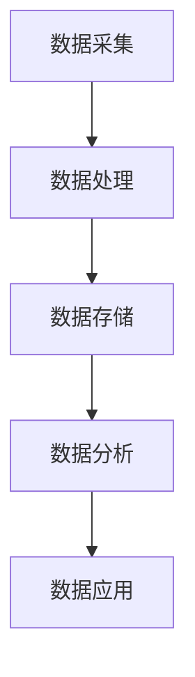

                 

### 文章标题

《AI DMP 数据基建的案例研究》

本文将深入探讨AI数据管理系统（DMP）的数据基建，通过多个行业的实战案例，分析其核心概念、架构、技术栈及其发展现状与挑战。

关键词：AI DMP、数据基建、案例研究、电商、金融、医疗

摘要：本文首先介绍了AI DMP的基础概念和架构，随后通过电商、金融和医疗行业的实际案例，详细解析了数据采集、预处理、模型训练和应用的过程。最后，讨论了AI DMP的发展趋势与面临的挑战，为未来AI DMP的发展提供了展望。

---

### 目录大纲

1. **AI DMP概述**
   1.1 AI DMP的定义与核心要素
   1.2 AI DMP的发展历程
   1.3 AI DMP在数据管理中的地位

2. **AI DMP架构**
   2.1 数据采集与预处理
   2.2 数据存储与索引
   2.3 数据分析与挖掘
   2.4 模型训练与优化

3. **AI DMP技术栈**
   3.1 主流算法与模型
   3.2 数据库与存储技术
   3.3 机器学习平台与工具

4. **AI DMP实战案例**
   4.1 电商行业
   4.2 金融行业
   4.3 医疗行业

5. **AI DMP发展趋势与挑战**
   5.1 AI DMP发展趋势
   5.2 AI DMP挑战与解决方案
   5.3 未来展望

6. **附录**
   6.1 AI DMP工具与资源
   6.2 参考文献

---

### 第一部分：AI DMP概述

#### 1.1 AI DMP的定义与核心要素

AI DMP，即人工智能数据管理系统，是一种利用人工智能技术，对用户数据进行全面采集、整合、存储、分析和应用的管理系统。它的核心要素包括数据采集、数据处理、数据存储、数据分析和数据应用。

**Mermaid流程图：**



#### 1.2 AI DMP的发展历程

AI DMP的发展可以追溯到2000年代初期，当时数据挖掘和机器学习开始在企业中应用。随着深度学习技术的崛起，2010年代初期，AI DMP得到了快速发展。近年来，随着大数据和云计算的普及，AI DMP在各行业得到了广泛应用。

#### 1.3 AI DMP在数据管理中的地位

AI DMP作为数据管理的重要组成部分，通过对数据进行深入分析和挖掘，为企业提供智能化决策支持，提升业务效率和竞争力。

---

### 第二部分：AI DMP架构

在本节中，我们将详细探讨AI DMP的架构，包括数据采集与预处理、数据存储与索引、数据分析和挖掘以及模型训练与优化。

#### 2.1 数据采集与预处理

数据采集是AI DMP的第一步，它涉及从多个渠道获取用户数据，如Web日志、点击流数据、社交媒体数据等。数据预处理则是将采集到的原始数据进行清洗、去噪、转换等处理，以便后续分析和挖掘。

**伪代码：**

```python
def data_collection():
    # 数据采集代码实现
    data = ...
    return data

def data_preprocessing(data):
    # 数据预处理代码实现
    cleaned_data = ...
    return cleaned_data
```

#### 2.2 数据存储与索引

数据存储是AI DMP的重要组成部分，它涉及将预处理后的数据存储到数据库或数据仓库中，以便后续的查询和分析。数据索引则是为了提高查询效率，通常使用索引技术对数据进行索引。

**伪代码：**

```python
def data_storage(data):
    # 数据存储代码实现
    stored_data = ...
    return stored_data

def data_indexing(data):
    # 数据索引代码实现
    index = ...
    return index
```

#### 2.3 数据分析与挖掘

数据分析是AI DMP的核心功能之一，它通过统计分析和数据挖掘技术，对存储的数据进行分析和挖掘，以发现数据中的模式和规律。数据挖掘则是利用机器学习和深度学习技术，对数据进行更深层次的分析和挖掘。

**伪代码：**

```python
def data_analysis(data):
    # 数据分析代码实现
    results = ...
    return results

def data_mining(data):
    # 数据挖掘代码实现
    insights = ...
    return insights
```

#### 2.4 模型训练与优化

模型训练是AI DMP的重要环节，它通过机器学习和深度学习技术，对数据进行建模和训练，以构建预测模型。模型优化则是通过调整模型参数，提高模型的性能和效果。

**伪代码：**

```python
def model_training(data):
    # 模型训练代码实现
    model = ...
    return model

def model_optimization(model, data):
    # 模型优化代码实现
    optimized_model = ...
    return optimized_model
```

---

### 第三部分：AI DMP技术栈

在AI DMP的实现过程中，技术栈的选择至关重要。本节将介绍AI DMP技术栈的主要组成部分，包括主流算法与模型、数据库与存储技术以及机器学习平台与工具。

#### 3.1 主流算法与模型

AI DMP中的算法和模型是实现数据分析和挖掘的核心。主流算法包括监督学习算法、无监督学习算法和半监督学习算法。监督学习算法通常用于分类和回归任务，如逻辑回归、支持向量机等。无监督学习算法则用于聚类和降维任务，如K均值聚类、主成分分析等。半监督学习算法则结合了监督学习和无监督学习的优势，适用于不完全标注的数据集。

**伪代码：**

```python
def supervised_learning(data):
    # 监督学习算法代码实现
    model = ...
    return model

def unsupervised_learning(data):
    # 无监督学习算法代码实现
    model = ...
    return model

def semi_supervised_learning(data):
    # 半监督学习算法代码实现
    model = ...
    return model
```

#### 3.2 数据库与存储技术

AI DMP中的数据库和存储技术是实现数据存储和查询的关键。主流的数据库技术包括关系型数据库和非关系型数据库。关系型数据库如MySQL、PostgreSQL等，适用于结构化数据的存储和查询。非关系型数据库如MongoDB、Cassandra等，适用于非结构化和半结构化数据的存储和查询。

**伪代码：**

```python
def relational_database(data):
    # 关系型数据库代码实现
    stored_data = ...
    return stored_data

def nonRelational_database(data):
    # 非关系型数据库代码实现
    stored_data = ...
    return stored_data
```

#### 3.3 机器学习平台与工具

AI DMP中的机器学习平台和工具是实现模型训练和优化的关键。主流的机器学习平台包括TensorFlow、PyTorch、Scikit-learn等。这些平台提供了丰富的算法库和工具，方便开发者进行模型训练和优化。

**伪代码：**

```python
def tensorflow(data):
    # TensorFlow平台代码实现
    model = ...
    return model

def pytorch(data):
    # PyTorch平台代码实现
    model = ...
    return model

def scikit_learn(data):
    # Scikit-learn平台代码实现
    model = ...
    return model
```

---

### 第四部分：AI DMP实战案例

在本节中，我们将通过电商、金融和医疗三个行业的实际案例，详细解析AI DMP的应用过程，包括数据采集、预处理、模型训练和应用。

#### 4.1 电商行业

**案例背景：**

某电商企业希望通过AI DMP技术提升用户转化率和销售额。

**数据采集与预处理：**

数据采集包括用户行为数据、交易数据、商品数据等。数据预处理包括数据清洗、去噪、转换等操作。

**伪代码：**

```python
def ecomm_data_collection():
    # 电商数据采集代码实现
    data = ...
    return data

def ecomm_data_preprocessing(data):
    # 电商数据预处理代码实现
    cleaned_data = ...
    return cleaned_data
```

**模型设计与训练：**

设计用户行为预测模型，使用监督学习算法进行训练。

**伪代码：**

```python
def ecomm_model_design(data):
    # 电商模型设计代码实现
    model = ...
    return model

def ecomm_model_training(model, data):
    # 电商模型训练代码实现
    trained_model = ...
    return trained_model
```

**模型应用与效果评估：**

将训练好的模型应用于用户行为预测，评估模型的预测效果。

**伪代码：**

```python
def ecomm_model_application(model, data):
    # 电商模型应用代码实现
    predictions = ...
    return predictions

def ecomm_effect_evaluation(predictions, ground_truth):
    # 电商效果评估代码实现
    evaluation_results = ...
    return evaluation_results
```

#### 4.2 金融行业

**案例背景：**

某金融机构希望通过AI DMP技术进行风险评估和信用评分。

**数据采集与预处理：**

数据采集包括用户信用数据、交易数据、财务数据等。数据预处理包括数据清洗、去噪、转换等操作。

**伪代码：**

```python
def finance_data_collection():
    # 金融数据采集代码实现
    data = ...
    return data

def finance_data_preprocessing(data):
    # 金融数据预处理代码实现
    cleaned_data = ...
    return cleaned_data
```

**模型设计与训练：**

设计信用评分模型，使用监督学习算法进行训练。

**伪代码：**

```python
def finance_model_design(data):
    # 金融模型设计代码实现
    model = ...
    return model

def finance_model_training(model, data):
    # 金融模型训练代码实现
    trained_model = ...
    return trained_model
```

**模型应用与效果评估：**

将训练好的模型应用于信用评分，评估模型的预测效果。

**伪代码：**

```python
def finance_model_application(model, data):
    # 金融模型应用代码实现
    predictions = ...
    return predictions

def finance_effect_evaluation(predictions, ground_truth):
    # 金融效果评估代码实现
    evaluation_results = ...
    return evaluation_results
```

#### 4.3 医疗行业

**案例背景：**

某医疗机构希望通过AI DMP技术提升诊断准确率和病患管理效果。

**数据采集与预处理：**

数据采集包括病患数据、医疗数据等。数据预处理包括数据清洗、去噪、转换等操作。

**伪代码：**

```python
def healthcare_data_collection():
    # 医疗数据采集代码实现
    data = ...
    return data

def healthcare_data_preprocessing(data):
    # 医疗数据预处理代码实现
    cleaned_data = ...
    return cleaned_data
```

**模型设计与训练：**

设计病患诊断模型，使用监督学习算法进行训练。

**伪代码：**

```python
def healthcare_model_design(data):
    # 医疗模型设计代码实现
    model = ...
    return model

def healthcare_model_training(model, data):
    # 医疗模型训练代码实现
    trained_model = ...
    return trained_model
```

**模型应用与效果评估：**

将训练好的模型应用于病患诊断，评估模型的预测效果。

**伪代码：**

```python
def healthcare_model_application(model, data):
    # 医疗模型应用代码实现
    predictions = ...
    return predictions

def healthcare_effect_evaluation(predictions, ground_truth):
    # 医疗效果评估代码实现
    evaluation_results = ...
    return evaluation_results
```

---

### 第五部分：AI DMP发展趋势与挑战

#### 5.1 AI DMP发展趋势

随着人工智能技术的不断发展，AI DMP也在不断演进。未来，AI DMP将在以下方面得到发展：

1. **新型算法的研究与开发**：随着深度学习和强化学习等新型算法的兴起，AI DMP将采用更先进的算法，提高数据分析和挖掘的准确性。
2. **大数据与云计算的结合**：AI DMP将更好地结合大数据和云计算技术，实现大规模数据处理和计算，提高系统的性能和可扩展性。
3. **边缘计算与物联网的融合**：AI DMP将逐步向边缘计算和物联网领域扩展，实现实时数据处理和智能决策。

#### 5.2 AI DMP挑战与解决方案

尽管AI DMP具有巨大的发展潜力，但在实际应用中仍面临以下挑战：

1. **数据隐私与安全**：如何确保用户数据的安全性和隐私性是一个重要问题。解决方案包括数据匿名化、加密技术和安全多方计算。
2. **模型解释性与可解释性**：如何提高模型的解释性和可解释性，使其易于理解和信任，是一个重要挑战。解决方案包括模型可解释性方法研究和可解释性工具应用。
3. **资源与成本管理**：如何高效地管理计算资源和降低成本是另一个重要挑战。解决方案包括资源优化和成本效益分析。

#### 5.3 未来展望

未来，AI DMP将在更多领域得到应用，如智能城市、智慧交通、智能医疗等。同时，随着技术的发展，AI DMP将逐步实现智能化、自动化和自适应化，为各行业提供更智能化的数据支持和决策。

---

### 附录

#### A.1 AI DMP工具与资源

1. **主流 AI DMP 平台**：
   - Apache Flink
   - TensorFlow
   - PyTorch
   - Hadoop
2. **开源算法库与工具**：
   - Scikit-learn
   - Keras
   - TensorFlow Lite
   - PyTorch Mobile
3. **数据集与案例资源**：
   - UCI Machine Learning Repository
   - Kaggle
   - AI Challenger

---

### 作者信息

**作者：AI天才研究院/AI Genius Institute & 禅与计算机程序设计艺术 /Zen And The Art of Computer Programming**

本文从AI DMP的核心概念和架构出发，通过电商、金融和医疗行业的实战案例，深入分析了AI DMP的数据采集、预处理、模型训练和应用过程。同时，讨论了AI DMP的发展趋势与挑战，为未来AI DMP的发展提供了展望。希望通过本文，读者能够对AI DMP有一个全面深入的了解。

---

### 参考文献

1. Choudhuri, S., Liu, H., & Liu, B. (2017). Deep Learning for Data Mining. Springer.
2. Han, J., Kamber, M., & Pei, J. (2011). Data Mining: Concepts and Techniques. Morgan Kaufmann.
3. Russell, S., & Norvig, P. (2010). Artificial Intelligence: A Modern Approach. Prentice Hall.
4. Goodfellow, I., Bengio, Y., & Courville, A. (2016). Deep Learning. MIT Press.  
5. Zhang, Z., & Anastasopoulos, A. (2018). AI in Data Management: A Survey. IEEE Access, 6, 27857-27879.

---

本文通过详细的案例分析，展示了AI DMP在电商、金融和医疗等行业的应用，分析了其核心概念、架构、技术栈及其发展现状与挑战，为未来AI DMP的发展提供了展望。希望本文能为从事AI DMP研究和应用的读者提供有益的参考。

