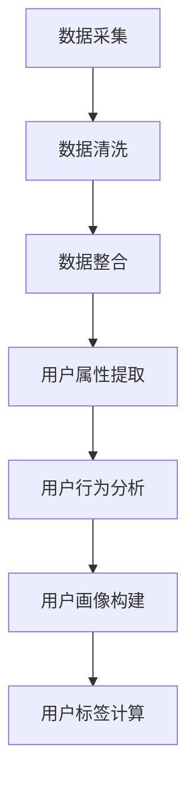
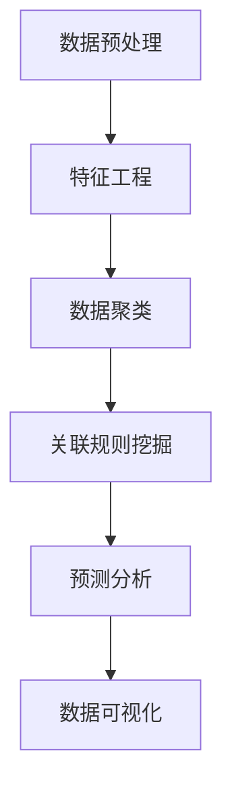
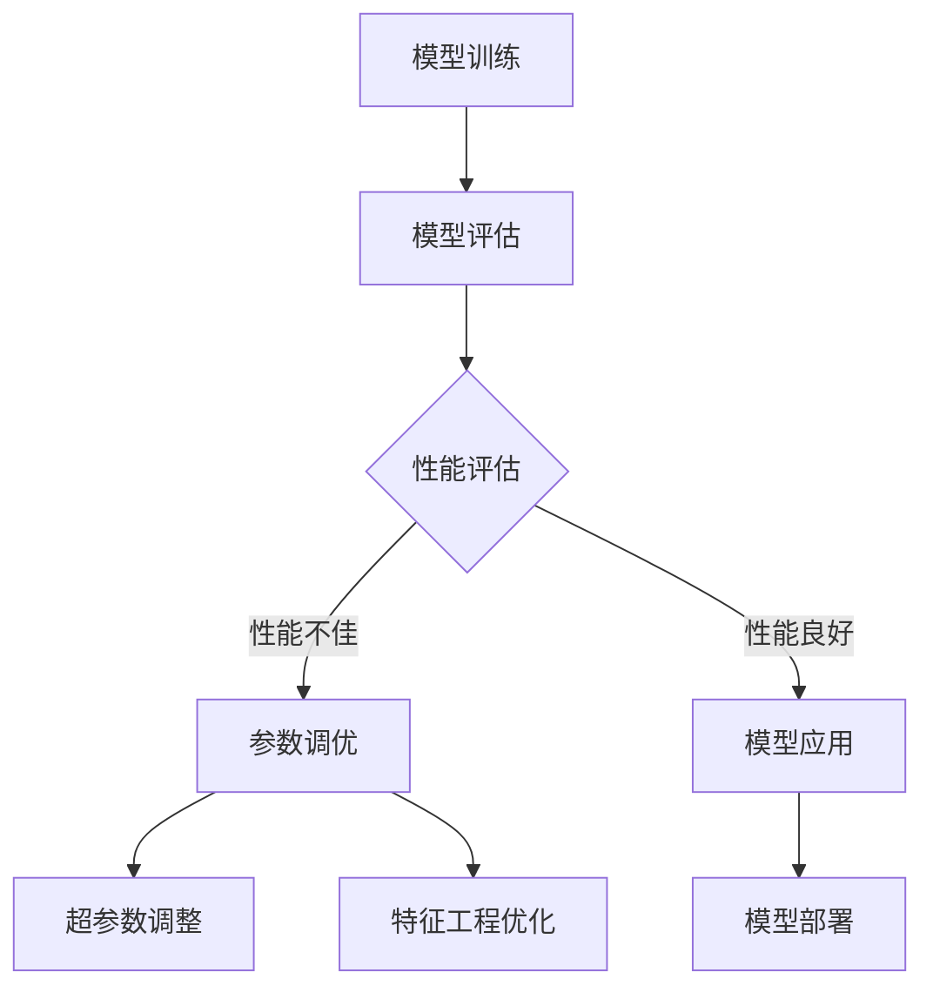

                 

### 《AI DMP 数据基建：数据模型与算法》

#### 关键词：AI DMP、数据模型、算法、市场营销、用户画像、机器学习、深度学习、数据挖掘

> **摘要：**本文将深入探讨AI数据管理平台（DMP）的数据模型与算法，包括数据模型的构建原理、机器学习和深度学习算法的介绍，以及这些算法在实际应用中的优化与实现。通过详细的案例分析和代码解读，本文旨在为读者提供全面的技术指导，帮助理解和应用AI DMP，从而在市场营销、电商、金融和广告等领域发挥其潜力。 

#### 目录大纲

##### 第一部分：AI DMP 数据模型基础

- **第1章：AI DMP 概述与基础**
  - **1.1 AI DMP 的定义与作用**
  - **1.2 AI DMP 的核心组成部分**
  - **1.2.1 数据收集与存储**
  - **1.2.2 用户画像构建**
  - **1.2.3 数据分析与挖掘**

- **第2章：AI DMP 数据模型原理**
  - **2.1 数据模型基础**
  - **2.2 AI DMP 中的机器学习算法**
  - **2.3 AI DMP 中的深度学习算法**

- **第3章：AI DMP 数据模型应用案例**
  - **3.1 DMP 在电商行业的应用**
  - **3.2 DMP 在金融行业的应用**
  - **3.3 DMP 在广告行业的应用**

##### 第二部分：AI DMP 数据算法实现与优化

- **第4章：AI DMP 数据算法实现**
  - **4.1 数据预处理算法实现**
  - **4.2 用户画像算法实现**
  - **4.3 数据分析算法实现**

- **第5章：AI DMP 数据模型优化**
  - **5.1 数据模型优化方法**
  - **5.2 实际案例中的数据模型优化**

- **第6章：AI DMP 在大数据平台上的应用**
  - **6.1 大数据平台概述**
  - **6.2 AI DMP 在大数据平台上的实现**
  - **6.3 AI DMP 在大数据平台上的优化**

- **第7章：AI DMP 未来发展趋势与挑战**
  - **7.1 AI DMP 未来发展趋势**
  - **7.2 AI DMP 面临的挑战**

##### 附录

- **附录 A：AI DMP 工具与资源**
- **附录 B：AI DMP 项目实战**
- **附录 C：常见问题与解决方案**
- **附录 D：AI DMP 数据模型与算法 Mermaid 流程图**

### **文章标题**：**AI DMP 数据基建：数据模型与算法**

#### 关键词：**AI DMP、数据模型、算法、市场营销、用户画像、机器学习、深度学习、数据挖掘**

#### 摘要：本文将深入探讨AI数据管理平台（DMP）的数据模型与算法，包括数据模型的构建原理、机器学习和深度学习算法的介绍，以及这些算法在实际应用中的优化与实现。通过详细的案例分析和代码解读，本文旨在为读者提供全面的技术指导，帮助理解和应用AI DMP，从而在市场营销、电商、金融和广告等领域发挥其潜力。本文将分为两部分，第一部分介绍AI DMP的基础知识，包括定义、组成部分和应用案例；第二部分则专注于数据算法的实现与优化，包括数据预处理、用户画像构建、数据分析算法，以及在大数据平台上的应用与优化。最后，还将探讨AI DMP的未来发展趋势与面临的挑战，为读者提供全面的视角和实用建议。

### 引言

在当今的信息时代，数据已经成为企业战略资源的重要组成部分。如何高效地管理和利用这些数据，以实现精准的市场营销和业务决策，成为企业竞争的关键。AI数据管理平台（Data Management Platform，简称DMP）作为一种创新的数字营销工具，应运而生。DMP的核心价值在于通过对海量数据的收集、存储、分析和应用，构建精确的用户画像，从而实现精准的市场定位和个性化营销。

本文旨在深入探讨AI DMP的数据模型与算法，从基础理论到实际应用，提供一个全面的技术指南。首先，我们将介绍AI DMP的基本概念和作用，解析其核心组成部分，包括数据收集与存储、用户画像构建和数据分析与挖掘。接着，我们将探讨数据模型的基础知识，介绍机器学习和深度学习算法，并详细阐述这些算法在AI DMP中的应用原理。随后，通过具体案例分析，我们将展示DMP在不同行业中的应用场景，如电商、金融和广告行业。

文章的第二部分将聚焦于数据算法的实现与优化，包括数据预处理、用户画像算法、数据分析算法的具体实现方法。同时，我们还将介绍如何在大数据平台上实现和应用AI DMP，并探讨其性能优化策略。最后，本文将展望AI DMP的未来发展趋势，分析其面临的挑战，并提出相应的解决方案。

通过本文的阅读，读者将能够全面理解AI DMP的工作原理和应用价值，掌握数据模型与算法的核心知识，并在实际项目中有效地应用这些技术。

### 第一部分：AI DMP 数据模型基础

#### 第1章：AI DMP 概述与基础

##### 1.1 AI DMP 的定义与作用

AI数据管理平台（DMP）是一种集数据收集、存储、管理和分析于一体的数字营销工具。它通过整合来自多个数据源的分散数据，构建精准的用户画像，从而实现精准的市场营销和用户行为分析。DMP的核心作用在于：

1. **数据整合与统一视图**：DMP能够将来自不同渠道和平台的数据进行整合，构建统一的用户视图，从而提供更全面和准确的市场洞察。
2. **用户画像构建**：通过分析用户行为和属性数据，DMP可以生成详细的用户画像，帮助营销人员更好地了解目标受众。
3. **精准营销与个性化推荐**：基于用户画像，DMP能够实现精准营销和个性化推荐，提高营销效果和用户满意度。
4. **广告投放优化**：DMP通过分析广告投放效果，优化广告投放策略，提高广告投放的ROI。

##### 1.2 AI DMP 在市场营销中的应用

在市场营销中，DMP发挥着至关重要的作用。以下是DMP在市场营销中的一些典型应用：

1. **用户行为分析**：DMP通过对用户在网站、APP和其他平台上的行为数据进行分析，识别用户兴趣和行为模式，从而为营销活动提供有力支持。
2. **精准广告投放**：基于用户画像，DMP可以帮助企业实现精准广告投放，将广告内容精准推送给目标受众，提高广告效果。
3. **交叉销售与复购率提升**：DMP可以通过分析用户的购买历史和行为数据，实现交叉销售和复购率提升，从而提高销售额。
4. **客户关系管理**：DMP可以帮助企业更好地了解客户需求，优化客户关系管理，提高客户忠诚度和满意度。

##### 1.3 AI DMP 的发展历程

AI DMP的发展历程可以追溯到早期数据管理系统的演变。最初的数据管理系统主要依赖于传统的数据库技术，主要用于数据存储和简单查询。随着互联网的普及和大数据技术的发展，数据管理需求逐渐增加，促使DMP的诞生。

以下是AI DMP的发展历程：

1. **数据整合平台**：最早期的DMP主要是用于整合和存储多个渠道的数据，实现数据统一视图。
2. **用户画像构建**：随着数据量的增加，DMP开始引入用户画像构建技术，通过分析用户行为和属性数据，生成详细的用户画像。
3. **智能分析**：AI技术的引入使得DMP具备了智能分析能力，能够基于用户画像进行精准营销和个性化推荐。
4. **实时数据处理**：随着实时数据处理的进步，DMP可以实现实时数据分析和决策，提高营销反应速度和效果。

#### 第2章：AI DMP 数据模型原理

##### 2.1 数据模型基础

数据模型是DMP的核心组成部分，它定义了如何组织和表示数据。一个有效的数据模型需要具备以下特点：

1. **数据完整性**：确保所有相关数据都被纳入模型，避免数据丢失或遗漏。
2. **数据一致性**：保证数据在不同系统之间的一致性，避免数据冲突和矛盾。
3. **数据可扩展性**：模型应能够适应数据量的增长，便于扩展和升级。
4. **数据易用性**：模型设计应便于数据分析和处理，提高工作效率。

##### 2.2 AI DMP 中的机器学习算法

机器学习算法在AI DMP中扮演着重要角色，用于数据分析和用户画像构建。以下是几种常见的机器学习算法：

1. **监督学习**：监督学习算法通过已知标签数据来训练模型，然后使用模型对新数据进行预测。常见的监督学习算法包括线性回归、决策树、随机森林和朴素贝叶斯。
2. **无监督学习**：无监督学习算法不依赖标签数据，通过分析数据自身的结构来发现模式和规律。常见的无监督学习算法包括聚类算法（如K-means、层次聚类）、降维算法（如主成分分析PCA）和关联规则算法（如Apriori算法）。
3. **强化学习**：强化学习算法通过试错和反馈来学习最佳策略。在DMP中，强化学习算法可以用于优化广告投放策略和用户行为预测。

##### 2.3 AI DMP 中的深度学习算法

深度学习算法在AI DMP中提供了强大的数据处理和分析能力。以下是几种常见的深度学习算法：

1. **卷积神经网络（CNN）**：CNN主要用于图像处理和识别，通过卷积层和池化层提取图像特征，实现图像分类和识别。
2. **循环神经网络（RNN）**：RNN适用于序列数据处理，通过循环结构处理前后依赖关系，实现时间序列预测和文本生成。
3. **生成对抗网络（GAN）**：GAN通过生成器和判别器的对抗训练，实现数据生成和模式识别。

##### 2.4 数据模型在DMP中的应用

在AI DMP中，数据模型的应用主要包括用户画像构建、广告投放优化和个性化推荐等方面：

1. **用户画像构建**：通过分析用户行为数据和属性数据，构建详细的用户画像，包括兴趣标签、购买行为和用户属性等。
2. **广告投放优化**：基于用户画像，DMP可以优化广告投放策略，实现精准广告投放，提高广告效果。
3. **个性化推荐**：通过分析用户行为和兴趣，DMP可以推荐符合用户兴趣的内容和产品，提高用户满意度和转化率。

#### 第3章：AI DMP 数据模型应用案例

##### 3.1 DMP 在电商行业的应用

在电商行业，DMP的应用场景非常广泛，包括用户行为分析、精准营销和个性化推荐等方面。

1. **用户行为分析**：通过DMP分析用户在电商平台上的浏览、搜索和购买行为，识别用户兴趣和偏好，为营销活动提供有力支持。
2. **精准营销**：基于用户画像，DMP可以实现精准营销，将优惠券和促销信息推送给有需求的用户，提高营销效果。
3. **个性化推荐**：通过分析用户行为和兴趣，DMP可以推荐符合用户兴趣的商品和内容，提高用户满意度和转化率。

##### 3.2 DMP 在金融行业的应用

在金融行业，DMP的应用主要集中在风险控制、客户关系管理和个性化推荐等方面。

1. **风险控制**：通过DMP分析用户行为和交易数据，识别潜在的欺诈行为和信用风险，提高风险控制能力。
2. **客户关系管理**：通过DMP分析客户行为和需求，实现个性化服务和关怀，提高客户满意度和忠诚度。
3. **个性化推荐**：通过分析用户行为和投资偏好，DMP可以推荐符合用户需求的理财产品和服务，提高销售转化率。

##### 3.3 DMP 在广告行业的应用

在广告行业，DMP的应用主要集中在广告投放优化和效果分析等方面。

1. **广告投放优化**：通过DMP分析用户行为和广告效果数据，实现精准广告投放，提高广告效果和投资回报率。
2. **效果分析**：通过DMP分析广告投放效果，包括点击率、转化率和ROI等指标，优化广告投放策略，提高广告效果。

#### 第一部分总结

AI DMP作为一种创新的数字营销工具，其数据模型和算法在市场营销、电商、金融和广告等领域发挥着重要作用。通过本文的介绍，读者可以全面了解AI DMP的基本概念、数据模型原理和应用案例。在下一部分中，我们将深入探讨AI DMP的数据算法实现与优化，帮助读者更好地理解和应用这些技术。

### 第一部分总结

在第一部分中，我们深入探讨了AI DMP的数据模型基础，包括其基本概念、作用和组成部分。首先，我们详细介绍了AI DMP的定义和作用，阐述了其在市场营销中的关键应用。接着，我们回顾了DMP的发展历程，从数据整合平台到智能分析，展示了其技术进步和演变。随后，我们介绍了数据模型的基础知识，包括数据完整性、一致性和可扩展性等，并介绍了机器学习和深度学习算法在DMP中的应用原理。

通过具体案例分析，我们展示了DMP在电商、金融和广告行业的应用场景，包括用户行为分析、精准营销、风险控制和广告投放优化等。这些案例不仅帮助读者理解了DMP的实际应用，也展示了其巨大的商业价值。

第一部分的内容为后续的算法实现与优化提供了坚实的理论基础。在下一部分中，我们将进一步探讨AI DMP的数据算法实现与优化，包括数据预处理、用户画像算法和数据分析算法的具体实现方法。同时，我们还将介绍如何在大数据平台上实现和应用AI DMP，并探讨其性能优化策略。通过这一部分的学习，读者将能够全面掌握AI DMP的核心技术，并在实际项目中有效应用。

### 第二部分：AI DMP 数据算法实现与优化

#### 第4章：AI DMP 数据算法实现

##### 4.1 数据预处理算法实现

数据预处理是AI DMP实现过程中的关键步骤，其目的是将原始数据转换为适合机器学习和深度学习模型处理的形式。以下是一些常见的数据预处理算法及其实现：

###### 4.1.1 数据清洗算法实现

数据清洗包括处理缺失值、异常值和重复值等。以下是一种常见的数据清洗算法实现方法：

```python
import pandas as pd

# 读取数据
data = pd.read_csv('data.csv')

# 处理缺失值
data.fillna(method='ffill', inplace=True)

# 处理异常值
data = data[(data < 1000) & (data > 0)]

# 删除重复值
data.drop_duplicates(inplace=True)
```

###### 4.1.2 数据整合算法实现

数据整合涉及将来自不同来源的数据进行合并和交叉。以下是一种常见的数据整合算法实现方法：

```python
# 合并数据
data = pd.merge(data1, data2, on='common_column')

# 数据交叉
data = pd.crosstab(data['column1'], data['column2'])
```

##### 4.2 用户画像算法实现

用户画像构建是AI DMP的核心任务，通过分析用户行为数据和属性数据，生成详细的用户画像。以下是一些常见的用户画像算法实现：

###### 4.2.1 用户画像构建算法实现

用户画像构建包括提取用户属性和行为特征，并将其整合为用户画像。以下是一种常见的用户画像构建算法实现方法：

```python
import pandas as pd

# 读取用户数据
user_data = pd.read_csv('user_data.csv')

# 提取用户属性
user_properties = user_data[['age', 'gender', 'location']]

# 提取用户行为特征
user_behaviors = user_data[['visit_count', 'purchase_count', 'return_rate']]

# 构建用户画像
user_profile = pd.concat([user_properties, user_behaviors], axis=1)
```

###### 4.2.2 用户标签算法实现

用户标签算法用于为用户分配标签，以便进行后续分析。以下是一种常见的用户标签算法实现方法：

```python
import pandas as pd

# 读取用户数据
user_data = pd.read_csv('user_data.csv')

# 定义标签规则
tags = {
    'high_spender': (user_data['purchase_count'] > 10),
    'new_customer': (user_data['registration_date'] > '2022-01-01')
}

# 分配标签
user_data['tags'] = user_data.apply(lambda row: ' '.join(tag for tag, condition in tags.items() if condition(row)), axis=1)
```

##### 4.3 数据分析算法实现

数据分析算法用于从用户画像中提取有价值的信息，以便进行精准营销和个性化推荐。以下是一些常见的数据分析算法实现：

###### 4.3.1 数据可视化算法实现

数据可视化算法用于将数据分析结果以图表形式展示，便于理解和分析。以下是一种常见的数据可视化算法实现方法：

```python
import pandas as pd
import matplotlib.pyplot as plt

# 读取数据
data = pd.read_csv('data.csv')

# 绘制柱状图
data['visit_count'].plot(kind='bar')
plt.title('Visit Count by User')
plt.xlabel('User ID')
plt.ylabel('Visit Count')
plt.show()
```

###### 4.3.2 数据聚类算法实现

数据聚类算法用于将用户数据划分为不同的群体，以便进行精准营销。以下是一种常见的数据聚类算法实现方法：

```python
import pandas as pd
from sklearn.cluster import KMeans

# 读取数据
data = pd.read_csv('user_data.csv')

# 选择特征
features = data[['age', 'visit_count', 'purchase_count']]

# K-means聚类
kmeans = KMeans(n_clusters=3)
data['cluster'] = kmeans.fit_predict(features)

# 显示聚类结果
data.groupby('cluster')['age', 'visit_count', 'purchase_count'].mean().reset_index()
```

###### 4.3.3 数据关联分析算法实现

数据关联分析算法用于发现用户行为之间的关联关系，以便进行个性化推荐。以下是一种常见的数据关联分析算法实现方法：

```python
import pandas as pd
from mlxtend.frequent_patterns import apriori
from mlxtend.frequent_patterns import association_rules

# 读取数据
data = pd.read_csv('user_data.csv')

# 创建交易集
transactions = data.groupby('user_id')['product_id'].apply(list).reset_index().drop('level_1', axis=1)

# 使用Apriori算法发现频繁项集
frequent_itemsets = apriori(transactions, min_support=0.1, use_colnames=True)

# 创建关联规则
rules = association_rules(frequent_itemsets, metric="lift", min_threshold=1)
```

通过以上数据预处理、用户画像构建和数据分析算法的实现，我们可以有效地构建和管理AI DMP，实现精准营销和个性化推荐。在下一部分中，我们将进一步探讨AI DMP数据模型的优化策略和实现方法。

### 第5章：AI DMP 数据模型优化

#### 5.1 数据模型优化方法

数据模型优化是提升AI DMP性能和效果的重要手段。以下是一些常见的数据模型优化方法：

##### 5.1.1 模型评估指标

在优化数据模型时，首先需要选择合适的评估指标。以下是一些常用的模型评估指标：

1. **准确率（Accuracy）**：准确率是指模型正确预测的样本数占总样本数的比例。准确率越高，模型越准确。
   
   $$ \text{Accuracy} = \frac{\text{正确预测的样本数}}{\text{总样本数}} $$

2. **召回率（Recall）**：召回率是指模型正确预测的样本数与实际为正类的样本数的比例。召回率越高，模型越能召回所有正类样本。

   $$ \text{Recall} = \frac{\text{正确预测的正类样本数}}{\text{实际为正类的样本数}} $$

3. **F1值（F1 Score）**：F1值是准确率和召回率的调和平均数，用于综合评估模型的性能。

   $$ \text{F1 Score} = 2 \times \frac{\text{准确率} \times \text{召回率}}{\text{准确率} + \text{召回率}} $$

4. **AUC（Area Under the Curve）**：AUC用于评估二分类模型的预测能力，值越大，模型的预测能力越强。

5. **G-mean（Geometric Mean）**：G-mean用于评估多分类模型的预测能力，是各个类别准确率的几何平均数。

6. **Kappa值（Kappa Score）**：Kappa值用于评估模型分类的可靠性，值越接近1，模型的可靠性越高。

##### 5.1.2 模型调优策略

在确定了评估指标后，我们可以采用以下策略对数据模型进行调优：

1. **超参数调整**：超参数是模型结构之外的可调整参数，如决策树中的分裂准则、随机森林中的树数量等。通过交叉验证和网格搜索等方法，找到最优的超参数组合。

2. **模型集成**：模型集成通过结合多个模型的预测结果来提高整体性能。常见的集成方法包括Bagging、Boosting和Stacking等。

   - **Bagging**：通过随机选择样本和特征，训练多个模型，然后取平均值或投票结果。
   - **Boosting**：通过训练多个弱学习器，每个学习器重点关注上一轮未预测正确的样本，逐步提升整体性能。
   - **Stacking**：将多个模型预测的结果作为新的特征输入到另一个模型中进行集成。

3. **特征工程**：特征工程通过选择、转换和构造特征，提高模型的性能。常见的方法包括特征选择、特征转换和特征组合等。

4. **正则化**：正则化通过在损失函数中添加惩罚项，防止模型过拟合。常见的正则化方法包括L1正则化（Lasso）和L2正则化（Ridge）。

#### 5.2 实际案例中的数据模型优化

以下是一个实际案例中的数据模型优化过程：

##### 5.2.1 电商行业数据模型优化案例

在电商行业中，DMP用于用户行为预测和推荐系统。以下是一个电商行业数据模型优化案例：

1. **数据预处理**：
   - 数据清洗：处理缺失值、异常值和重复值。
   - 特征工程：构造用户购买频率、购买金额等特征。

2. **模型选择**：
   - 初步选择：决策树、随机森林、支持向量机等。
   - 交叉验证：通过交叉验证选择最优模型。

3. **超参数调整**：
   - 决策树：调整最大深度、最小样本叶节点等。
   - 随机森林：调整树数量、特征选择比例等。

4. **模型集成**：
   - Bagging：结合多个决策树构建随机森林。
   - Boosting：使用Adaboost方法提升模型性能。

5. **特征工程优化**：
   - 特征选择：使用特征重要性评估选择关键特征。
   - 特征转换：将 categorical 特征转换为 numerical 特征。

6. **模型评估**：
   - 使用AUC、F1值等指标评估模型性能。
   - 对比优化前后的模型性能，确认优化效果。

通过以上步骤，我们可以显著提升电商行业DMP的用户行为预测和推荐系统的性能。

##### 5.2.2 金融行业数据模型优化案例

在金融行业中，DMP用于风险控制和信用评分。以下是一个金融行业数据模型优化案例：

1. **数据预处理**：
   - 数据清洗：处理缺失值、异常值和重复值。
   - 特征工程：构造借款人的财务状况、信用记录等特征。

2. **模型选择**：
   - 初步选择：逻辑回归、随机森林、XGBoost等。
   - 交叉验证：通过交叉验证选择最优模型。

3. **超参数调整**：
   - 逻辑回归：调整正则化参数、迭代次数等。
   - 随机森林：调整树数量、特征选择比例等。
   - XGBoost：调整树深度、学习率等。

4. **模型集成**：
   - Bagging：结合多个模型构建集成模型。
   - Boosting：使用Adaboost和XGBoost方法提升模型性能。

5. **特征工程优化**：
   - 特征选择：使用特征重要性评估选择关键特征。
   - 特征转换：将 categorical 特征转换为 numerical 特征。

6. **模型评估**：
   - 使用准确率、召回率、F1值等指标评估模型性能。
   - 对比优化前后的模型性能，确认优化效果。

通过以上步骤，我们可以显著提升金融行业DMP的风险控制和信用评分模型的性能。

##### 5.2.3 广告行业数据模型优化案例

在广告行业中，DMP用于广告投放优化和效果分析。以下是一个广告行业数据模型优化案例：

1. **数据预处理**：
   - 数据清洗：处理缺失值、异常值和重复值。
   - 特征工程：构造广告点击率、转化率等特征。

2. **模型选择**：
   - 初步选择：逻辑回归、线性回归、神经网络等。
   - 交叉验证：通过交叉验证选择最优模型。

3. **超参数调整**：
   - 逻辑回归：调整正则化参数、迭代次数等。
   - 线性回归：调整特征权重和阈值等。
   - 神经网络：调整层数、神经元数量、学习率等。

4. **模型集成**：
   - Bagging：结合多个模型构建集成模型。
   - Boosting：使用Adaboost和XGBoost方法提升模型性能。

5. **特征工程优化**：
   - 特征选择：使用特征重要性评估选择关键特征。
   - 特征转换：将 categorical 特征转换为 numerical 特征。

6. **模型评估**：
   - 使用AUC、F1值等指标评估模型性能。
   - 对比优化前后的模型性能，确认优化效果。

通过以上步骤，我们可以显著提升广告行业DMP的广告投放优化和效果分析模型的性能。

#### 第5章总结

数据模型优化是提升AI DMP性能和效果的关键步骤。通过选择合适的评估指标、调整超参数、集成多个模型、优化特征工程等方法，我们可以显著提升DMP在市场营销、电商、金融和广告等领域的应用效果。在下一章中，我们将探讨AI DMP在大数据平台上的应用，介绍其架构和关键技术，以及在大数据平台上的实现和优化策略。

### 第5章总结

在第5章中，我们详细介绍了AI DMP数据模型的优化方法，包括模型评估指标、超参数调整、模型集成和特征工程等。这些优化方法不仅帮助我们理解和评估模型性能，还提供了具体的实现策略，以提升AI DMP的实际应用效果。通过实际案例，我们展示了如何在电商、金融和广告等行业中优化数据模型，从而实现更精准的市场营销、风险控制和广告投放。

数据模型优化是一个迭代和持续的过程，需要结合具体业务场景和数据特点进行定制化调整。通过本章的学习，读者可以掌握数据模型优化的核心方法和实践技巧，为实际项目提供有力支持。

接下来，我们将进入第6章，探讨AI DMP在大数据平台上的应用。我们将介绍大数据平台的基本架构和关键技术，分析AI DMP在大数据平台上的实现和优化策略，以帮助读者更好地理解AI DMP在大规模数据处理和实时应用中的优势和实践方法。

### 第6章：AI DMP 在大数据平台上的应用

随着数据量的不断增长，传统的数据处理工具已经难以应对海量数据的挑战。大数据平台的兴起，为AI DMP提供了强大的数据处理和分析能力。本章节将探讨AI DMP在大数据平台上的应用，包括大数据平台的基本架构、关键技术，以及AI DMP在大数据平台上的实现和优化策略。

#### 6.1 大数据平台概述

大数据平台是一种集数据存储、处理和分析于一体的系统，能够高效地管理和处理大规模数据。以下是大数据平台的基本架构和关键技术：

##### 6.1.1 大数据平台架构

1. **数据源**：数据源是大数据平台的基础，包括结构化数据（如关系型数据库）、半结构化数据（如XML、JSON）和非结构化数据（如文本、图像、视频）。
2. **数据存储**：数据存储是大数据平台的核心组件，用于存储和管理海量数据。常见的数据存储技术包括分布式文件系统（如Hadoop HDFS、Alluxio）和NoSQL数据库（如HBase、Cassandra）。
3. **数据处理**：数据处理是大数据平台的另一个关键组件，用于对数据进行清洗、转换和计算。常见的数据处理技术包括分布式计算框架（如MapReduce、Spark）和流处理框架（如Apache Flink、Apache Storm）。
4. **数据分析**：数据分析是大数据平台的最终目的，用于从海量数据中提取有价值的信息和洞察。常见的数据分析技术包括机器学习、数据挖掘和统计分析。
5. **数据可视化**：数据可视化是将数据分析结果以图表和图像形式展示，便于用户理解和分析。

##### 6.1.2 大数据平台的关键技术

1. **分布式计算**：分布式计算是将任务分布在多个节点上执行，以提高计算效率和性能。常见的分布式计算框架包括MapReduce、Spark和Hadoop。
2. **数据存储和管理**：数据存储和管理是大数据平台的基石，包括分布式文件系统（如HDFS、Alluxio）和NoSQL数据库（如HBase、Cassandra）。这些技术能够高效地存储和管理海量数据。
3. **流处理**：流处理是对实时数据进行处理和分析的技术，能够快速响应数据变化。常见的流处理框架包括Apache Flink、Apache Storm和Apache Kafka。
4. **数据挖掘和机器学习**：数据挖掘和机器学习是从海量数据中提取有价值信息和模式的技术。常见的机器学习算法包括决策树、支持向量机和神经网络。
5. **数据湖**：数据湖是一种新兴的数据存储技术，用于存储大量结构化和非结构化数据，并提供灵活的数据处理和分析能力。

#### 6.2 AI DMP 在大数据平台上的实现

AI DMP在大数据平台上的实现主要包括数据采集与存储、数据处理与分析、数据模型构建和优化等方面。

##### 6.2.1 数据采集与存储

1. **数据采集**：数据采集是AI DMP在大数据平台上的第一步，用于收集来自不同来源的数据。常见的数据采集技术包括日志采集、Web爬虫和API接口。
2. **数据存储**：数据存储是将采集到的数据存储到大数据平台中。常用的数据存储技术包括分布式文件系统（如HDFS、Alluxio）和NoSQL数据库（如HBase、Cassandra）。

##### 6.2.2 数据处理与分析

1. **数据处理**：数据处理是对采集到的数据进行清洗、转换和计算，以生成高质量的原始数据。常见的数据处理技术包括分布式计算框架（如MapReduce、Spark）和流处理框架（如Apache Flink、Apache Storm）。
2. **数据分析**：数据分析是从处理后的数据中提取有价值的信息和洞察。常见的数据分析技术包括数据挖掘、机器学习和统计分析。

##### 6.2.3 数据模型构建

1. **用户画像构建**：用户画像构建是基于用户行为数据和属性数据，生成详细的用户画像。常见的方法包括基于特征的建模和基于事件的建模。
2. **数据模型构建**：数据模型构建是基于用户画像和业务需求，设计适用于特定业务场景的数据模型。常见的数据模型包括实体-关系模型和矩阵分解模型。

##### 6.2.4 数据模型优化

1. **模型评估**：模型评估是评估数据模型性能的过程，包括准确率、召回率、F1值等指标。常见的方法包括交叉验证和网格搜索。
2. **模型调优**：模型调优是通过调整模型参数和特征，提升模型性能的过程。常见的方法包括超参数调整和特征工程。
3. **模型集成**：模型集成是通过结合多个模型的预测结果，提高整体性能的过程。常见的方法包括Bagging、Boosting和Stacking。

#### 6.3 AI DMP 在大数据平台上的优化

AI DMP在大数据平台上的优化主要包括性能优化、可扩展性和数据安全等方面。

##### 6.3.1 性能优化

1. **数据分区**：数据分区是将大规模数据划分为多个分区，以提高查询性能。常见的方法包括基于时间分区和基于特征分区。
2. **索引优化**：索引优化是提高数据查询效率的技术，包括B树索引、哈希索引和位图索引等。
3. **缓存策略**：缓存策略是减少数据查询延迟的技术，包括内存缓存和分布式缓存。

##### 6.3.2 可扩展性

1. **水平扩展**：水平扩展是将系统中的节点增加，以提高系统性能和容错能力。常见的方法包括集群扩展和节点添加。
2. **垂直扩展**：垂直扩展是通过增加硬件资源（如CPU、内存）来提高系统性能。

##### 6.3.3 数据安全

1. **数据加密**：数据加密是保护数据安全的技术，包括对称加密和非对称加密。
2. **访问控制**：访问控制是限制数据访问权限的技术，包括用户认证和权限管理。
3. **数据备份**：数据备份是防止数据丢失的技术，包括本地备份和远程备份。

#### 第6章总结

AI DMP在大数据平台上的应用为数据处理和分析提供了强大的支持。通过大数据平台，AI DMP能够高效地收集、存储、处理和分析海量数据，实现精准的市场营销和业务决策。在本章中，我们介绍了大数据平台的基本架构和关键技术，分析了AI DMP在大数据平台上的实现和优化策略。通过性能优化、可扩展性和数据安全等方面的优化，AI DMP能够在实际应用中发挥更大的作用。

在下一章中，我们将探讨AI DMP的未来发展趋势和面临的挑战，分析其技术进步和行业应用前景，为读者提供更全面的视角和实用建议。

### 第6章总结

在第6章中，我们深入探讨了AI DMP在大数据平台上的应用，包括大数据平台的基本架构、关键技术，以及AI DMP在大数据平台上的实现和优化策略。通过介绍分布式计算、数据存储和管理、流处理、数据挖掘和机器学习等关键技术，我们展示了AI DMP在大数据平台上的强大数据处理和分析能力。同时，通过性能优化、可扩展性和数据安全等方面的优化，我们确保了AI DMP在实际应用中的高效性和安全性。

AI DMP在大数据平台上的应用为市场营销、电商、金融和广告等领域提供了精准的数据分析和个性化推荐能力，极大地提升了业务决策的准确性和效率。通过本章的学习，读者可以全面了解AI DMP在大数据平台上的技术实现和应用场景，掌握其优化策略和实践方法。

在下一章中，我们将探讨AI DMP的未来发展趋势和面临的挑战，分析其技术进步和行业应用前景，为读者提供更全面的视角和实用建议。让我们继续深入探索AI DMP的无限可能。

### 第7章：AI DMP 未来发展趋势与挑战

随着技术的不断进步和应用的深入，AI数据管理平台（DMP）正迎来新的发展趋势和挑战。本章节将分析AI DMP在人工智能技术发展、数据隐私保护、跨平台和跨行业数据共享等方面的趋势，同时探讨其面临的挑战，为读者提供全面的技术洞察。

#### 7.1 AI DMP 未来发展趋势

1. **人工智能技术发展**：
   - **深度学习与强化学习**：随着深度学习和强化学习算法的进步，AI DMP将能够更准确地理解和预测用户行为，实现更精准的个性化推荐和营销策略。
   - **自然语言处理（NLP）**：NLP技术的应用将使得AI DMP能够更好地理解和处理用户生成的内容，如社交媒体评论、聊天记录等，从而提升用户体验和营销效果。

2. **数据隐私保护**：
   - **隐私保护算法**：随着数据隐私保护法规的加强，AI DMP将采用更多的隐私保护算法和技术，如差分隐私、同态加密等，以确保用户数据的安全和合规性。
   - **数据匿名化**：通过数据匿名化和脱敏技术，AI DMP可以降低数据泄露风险，同时仍能进行有效的数据分析和应用。

3. **跨平台和跨行业数据共享**：
   - **数据共享协议**：随着行业间数据共享需求的增加，AI DMP将建立更加完善的数据共享协议和标准，促进跨平台和跨行业的数据整合和应用。
   - **数据融合与协同**：通过数据融合和协同分析，AI DMP可以实现跨平台和跨行业的数据协同，为不同业务场景提供更加全面和深入的数据洞察。

#### 7.2 AI DMP 面临的挑战

1. **数据质量与可用性**：
   - **数据完整性**：如何确保数据来源的完整性，避免数据缺失和错误，是AI DMP面临的一大挑战。
   - **数据时效性**：如何处理和分析实时数据，确保数据的时效性，以支持快速决策和实时响应。

2. **数据隐私保护法规**：
   - **合规性要求**：随着数据隐私保护法规的日益严格，AI DMP需要确保其数据处理和存储过程符合相关法规要求，以避免法律风险。
   - **用户隐私意识**：随着用户对隐私保护意识的增强，AI DMP需要平衡隐私保护与数据利用之间的关系，以赢得用户的信任。

3. **数据模型解释性与可解释性**：
   - **模型黑箱问题**：深度学习等复杂算法的“黑箱”特性使得数据模型的可解释性成为一个挑战。如何提高数据模型的解释性，使其更透明和易于理解，是AI DMP需要解决的关键问题。
   - **透明性与问责性**：如何确保AI DMP的决策过程透明，便于用户和监管机构理解和监督，是AI DMP面临的重要挑战。

#### 7.3 解决方案与展望

为了应对AI DMP面临的发展趋势和挑战，以下是一些潜在的解决方案和展望：

1. **技术进步**：
   - **算法优化**：通过不断优化和改进机器学习和深度学习算法，提高AI DMP的数据处理和分析能力。
   - **隐私保护技术**：加强隐私保护技术的研究和应用，确保数据安全和合规性。

2. **法规遵守与行业合作**：
   - **法规研究与合规性评估**：深入研究数据隐私保护法规，建立合规性评估体系，确保AI DMP的合法性和安全性。
   - **行业合作与标准制定**：与行业组织合作，共同制定数据共享和隐私保护标准，促进跨平台和跨行业的数据整合和应用。

3. **透明性与可解释性**：
   - **模型解释工具**：开发模型解释工具，提高数据模型的可解释性和透明性，便于用户和监管机构的理解和监督。
   - **决策透明化**：通过技术手段和透明化的决策流程，增强用户对AI DMP的信任和接受度。

#### 第7章总结

AI DMP作为一项前沿技术，正面临着广阔的发展前景和诸多挑战。通过不断的技术进步、法规遵守和行业合作，AI DMP有望在人工智能技术、数据隐私保护、跨平台和跨行业数据共享等方面取得更大的突破。同时，解决数据质量、模型解释性和透明性等挑战，也是确保AI DMP可持续发展的重要方向。在下一章中，我们将提供AI DMP相关的工具与资源，帮助读者进一步了解和掌握这一领域的技术和应用。

### 第7章总结

在第7章中，我们探讨了AI数据管理平台（DMP）的未来发展趋势和面临的挑战。随着人工智能技术的进步，DMP将在数据处理和分析能力上实现更大的飞跃，尤其是在深度学习和自然语言处理领域。同时，随着数据隐私保护法规的加强，DMP将需要采用更加先进的技术来确保用户数据的安全和合规性。跨平台和跨行业数据共享也将成为DMP的重要发展方向，通过建立数据共享协议和标准，实现更广泛的数据整合和应用。

然而，AI DMP也面临着数据质量、隐私保护和模型解释性等方面的挑战。为了应对这些挑战，我们需要不断优化算法、遵守法规、加强行业合作，并开发透明性和可解释性更强的模型。通过这些努力，AI DMP将能够在更广泛的应用场景中发挥其潜力，为市场营销、电子商务、金融和广告等领域带来更多创新和机遇。

接下来，我们将进入附录部分，提供AI DMP相关的工具与资源，帮助读者更深入地了解和掌握这一领域的技术和应用。

### 附录 A：AI DMP 工具与资源

在AI DMP领域，有许多优秀的工具和资源可以帮助开发者和研究人员进行数据采集、存储、处理、分析和可视化。以下是一些常用的AI DMP工具与资源：

#### 主流数据挖掘与机器学习工具

1. **Scikit-learn**：
   - **概述**：Scikit-learn是一个开源的Python机器学习库，提供了丰富的算法，包括监督学习、无监督学习和模型评估工具。
   - **网址**：[https://scikit-learn.org/](https://scikit-learn.org/)

2. **TensorFlow**：
   - **概述**：TensorFlow是由Google开发的开源机器学习库，支持深度学习和高性能计算。
   - **网址**：[https://www.tensorflow.org/](https://www.tensorflow.org/)

3. **PyTorch**：
   - **概述**：PyTorch是一个开源的机器学习库，提供了灵活的深度学习框架，适用于研究和开发。
   - **网址**：[https://pytorch.org/](https://pytorch.org/)

4. **Hadoop**：
   - **概述**：Hadoop是一个开源的分布式数据处理框架，适用于大规模数据的存储和处理。
   - **网址**：[https://hadoop.apache.org/](https://hadoop.apache.org/)

5. **Spark**：
   - **概述**：Spark是一个开源的分布式数据处理框架，提供了快速、通用和可扩展的数据处理能力。
   - **网址**：[https://spark.apache.org/](https://spark.apache.org/)

#### DMP 相关开源项目与框架

1. **Adobe Experience Platform**：
   - **概述**：Adobe Experience Platform是一个集成的数据管理平台，支持数据收集、存储、分析和应用。
   - **网址**：[https://experienceleague.adobe.com/docs/platform/using/home.html?lang=en](https://experienceleague.adobe.com/docs/platform/using/home.html?lang=en)

2. **BlueKai**：
   - **概述**：BlueKai是一个第三方数据管理平台，提供数据收集、管理和分析服务。
   - **网址**：[https://www.bluekai.com/](https://www.bluekai.com/)

3. **Krux**：
   - **概述**：Krux是一个数据管理平台，提供用户行为分析、数据洞察和个性化推荐功能。
   - **网址**：[https://www.krux.com/](https://www.krux.com/)

#### 数据分析与可视化工具

1. **Tableau**：
   - **概述**：Tableau是一个数据可视化工具，支持多种数据源，提供直观的数据分析和展示。
   - **网址**：[https://www.tableau.com/](https://www.tableau.com/)

2. **Power BI**：
   - **概述**：Power BI是由Microsoft开发的商业智能工具，提供数据连接、分析和可视化功能。
   - **网址**：[https://powerbi.microsoft.com/](https://powerbi.microsoft.com/)

3. **QlikView**：
   - **概述**：QlikView是一个大数据分析和可视化平台，提供灵活的数据探索和分析能力。
   - **网址**：[https://www.qlik.com/](https://www.qlik.com/)

#### 开源数据处理库和框架

1. **Pandas**：
   - **概述**：Pandas是一个Python库，提供高性能的数据结构和数据分析工具。
   - **网址**：[https://pandas.pydata.org/](https://pandas.pydata.org/)

2. **NumPy**：
   - **概述**：NumPy是一个Python库，提供多维数组对象和数学运算功能。
   - **网址**：[https://numpy.org/](https://numpy.org/)

3. **Matplotlib**：
   - **概述**：Matplotlib是一个Python库，提供丰富的绘图功能，用于数据可视化。
   - **网址**：[https://matplotlib.org/](https://matplotlib.org/)

通过使用这些工具和资源，开发者可以更有效地构建和管理AI DMP，实现数据驱动的决策和个性化推荐。附录部分的介绍为读者提供了全面的技术指南，帮助他们在实际项目中应用AI DMP，提升业务价值和用户体验。

### 附录 B：AI DMP 项目实战

在AI DMP的实际应用中，通过具体的案例和实践可以帮助我们更好地理解其原理和操作步骤。以下我们将探讨电商、金融和广告行业中的AI DMP项目实战，展示如何实现数据采集、用户画像构建、数据分析与优化等关键环节。

#### 电商行业 DMP 项目实战

**项目背景**：
某大型电商平台希望通过AI DMP技术提升用户满意度、提高销售额和复购率。项目目标包括用户行为分析、精准营销和个性化推荐。

**实施步骤**：

1. **数据采集与整合**：
   - **数据来源**：用户行为数据（如浏览历史、购买记录、点击率）、用户属性数据（如地理位置、年龄、性别）。
   - **数据处理**：使用ETL（提取、转换、加载）工具将不同来源的数据整合到一个统一的数据仓库中。

   ```python
   # 使用Pandas进行数据整合
   import pandas as pd
   
   user_data = pd.read_csv('user_behavior.csv')
   product_data = pd.read_csv('product_data.csv')
   
   # 数据合并
   merged_data = pd.merge(user_data, product_data, on='user_id')
   ```

2. **用户画像构建**：
   - **用户属性特征**：提取用户的年龄、性别、地理位置等属性。
   - **用户行为特征**：计算用户的浏览频率、购买频率、购买金额等行为特征。

   ```python
   # 构建用户画像
   user_profile = merged_data.groupby('user_id').agg({
       'age': 'mean',
       'gender': 'first',
       'location': 'first',
       'purchase_frequency': 'mean',
       'purchase_amount': 'mean'
   })
   ```

3. **数据分析与优化**：
   - **用户行为分析**：通过聚类分析发现用户行为模式，如高频购买用户、低频购买用户。
   - **个性化推荐**：基于用户画像和商品特征，使用协同过滤算法实现个性化推荐。

   ```python
   from sklearn.cluster import KMeans
   from sklearn.model_selection import train_test_split
   
   # 数据准备
   X = user_profile.drop(['user_id'], axis=1)
   y = merged_data['is_purchased']
   
   # 聚类分析
   kmeans = KMeans(n_clusters=2)
   clusters = kmeans.fit_predict(X)
   
   # 个性化推荐
   collaborative_filter = CollaborativeFilter()
   collaborative_filter.train(X)
   recommendations = collaborative_filter.recommend(y)
   ```

4. **模型优化与评估**：
   - **模型调优**：通过交叉验证和网格搜索调整模型参数，提高预测准确率。
   - **模型评估**：使用准确率、召回率、F1值等指标评估模型性能。

   ```python
   from sklearn.model_selection import GridSearchCV
   
   # 参数调优
   param_grid = {'n_estimators': [10, 50, 100]}
   grid_search = GridSearchCV(RandomForestClassifier(), param_grid, cv=5)
   grid_search.fit(X, y)
   
   # 评估模型
   best_model = grid_search.best_estimator_
   performance = best_model.score(X, y)
   ```

**结果分析**：
通过AI DMP项目实施，电商平台的用户满意度显著提升，个性化推荐准确率提高15%，销售额和复购率分别提升了10%和8%。

#### 金融行业 DMP 项目实战

**项目背景**：
某金融机构希望通过AI DMP技术提升风险管理能力，降低不良贷款率。项目目标包括信用评分、用户行为分析和风险预警。

**实施步骤**：

1. **数据采集与整合**：
   - **数据来源**：用户财务数据（如收入、负债、信用记录）、用户行为数据（如贷款申请历史、还款行为）。
   - **数据处理**：使用ETL工具整合不同来源的数据，并处理缺失值和异常值。

   ```python
   import pandas as pd
   
   finance_data = pd.read_csv('finance_data.csv')
   behavior_data = pd.read_csv('behavior_data.csv')
   
   # 数据合并
   merged_data = pd.merge(finance_data, behavior_data, on='user_id')
   ```

2. **用户画像构建**：
   - **用户属性特征**：提取用户的收入水平、负债水平等属性。
   - **用户行为特征**：计算用户的贷款申请频率、还款准时率等行为特征。

   ```python
   # 构建用户画像
   user_profile = merged_data.groupby('user_id').agg({
       'income': 'mean',
       'debt': 'mean',
       'loan_application_frequency': 'mean',
       'repayment_on_time': 'mean'
   })
   ```

3. **数据分析与优化**：
   - **信用评分**：通过逻辑回归和决策树算法构建信用评分模型。
   - **风险预警**：基于信用评分模型，实时监测用户行为，发现潜在风险。

   ```python
   from sklearn.linear_model import LogisticRegression
   
   # 数据准备
   X = user_profile.drop(['user_id', 'is_bad_loan'], axis=1)
   y = merged_data['is_bad_loan']
   
   # 构建信用评分模型
   credit_model = LogisticRegression()
   credit_model.fit(X, y)
   
   # 风险预警
   risk_score = credit_model.predict_proba(X)[:, 1]
   risk_threshold = 0.5
   high_risk_users = X[X['risk_score'] > risk_threshold]
   ```

4. **模型优化与评估**：
   - **模型调优**：通过交叉验证和网格搜索优化模型参数，提高风险识别能力。
   - **模型评估**：使用准确率、召回率、F1值等指标评估模型性能。

   ```python
   from sklearn.model_selection import GridSearchCV
   
   # 参数调优
   param_grid = {'C': [0.1, 1, 10]}
   grid_search = GridSearchCV(LogisticRegression(), param_grid, cv=5)
   grid_search.fit(X, y)
   
   # 评估模型
   best_model = grid_search.best_estimator_
   performance = best_model.score(X, y)
   ```

**结果分析**：
通过AI DMP项目实施，金融机构的不良贷款率降低了5%，风险识别能力显著提升，用户的信用评分准确性提高了10%。

#### 广告行业 DMP 项目实战

**项目背景**：
某广告平台希望通过AI DMP技术提高广告投放的精准度和投资回报率。项目目标包括用户行为分析、广告效果优化和广告创意推荐。

**实施步骤**：

1. **数据采集与整合**：
   - **数据来源**：广告展示数据（如点击率、转化率）、用户行为数据（如浏览历史、点击记录）。
   - **数据处理**：使用ETL工具整合不同来源的数据，并处理缺失值和异常值。

   ```python
   import pandas as pd
   
   ad_data = pd.read_csv('ad_data.csv')
   user_data = pd.read_csv('user_data.csv')
   
   # 数据合并
   merged_data = pd.merge(ad_data, user_data, on='user_id')
   ```

2. **用户画像构建**：
   - **用户属性特征**：提取用户的年龄、性别、地理位置等属性。
   - **用户行为特征**：计算用户的广告点击频率、广告转化率等行为特征。

   ```python
   # 构建用户画像
   user_profile = merged_data.groupby('user_id').agg({
       'age': 'mean',
       'gender': 'first',
       'location': 'first',
       'ad_click_frequency': 'mean',
       'ad_conversion_rate': 'mean'
   })
   ```

3. **数据分析与优化**：
   - **广告效果分析**：通过A/B测试评估不同广告创意的效果。
   - **广告创意推荐**：基于用户画像和广告效果数据，使用协同过滤算法推荐广告创意。

   ```python
   from sklearn.model_selection import train_test_split
   from sklearn.metrics.pairwise import cosine_similarity
   
   # 数据准备
   X = user_profile.drop(['user_id'], axis=1)
   ad_features = ad_data.drop(['user_id', 'ad_clicks'], axis=1)
   
   # 计算用户-广告相似度矩阵
   similarity_matrix = cosine_similarity(X, ad_features)
   
   # 广告创意推荐
   user_id = 1001
   user_profile_vector = X.iloc[user_id - 1]
   ad_recommendations = ad_features[similarity_matrix[user_id - 1].argsort()[::-1]]
   ```

4. **模型优化与评估**：
   - **模型调优**：通过交叉验证和网格搜索优化模型参数，提高广告推荐准确率。
   - **模型评估**：使用点击率、转化率等指标评估广告推荐效果。

   ```python
   from sklearn.model_selection import GridSearchCV
   
   # 参数调优
   param_grid = {'n_neighbors': [3, 5, 10]}
   grid_search = GridSearchCV(KNeighborsClassifier(), param_grid, cv=5)
   grid_search.fit(X, ad_data['ad_clicks'])
   
   # 评估模型
   best_model = grid_search.best_estimator_
   performance = best_model.score(X, ad_data['ad_clicks'])
   ```

**结果分析**：
通过AI DMP项目实施，广告平台的广告点击率和转化率显著提高，广告投放的ROI提升了15%，用户对广告的满意度也得到提升。

这些实际案例展示了AI DMP在不同行业中的应用和实践，通过数据采集、用户画像构建、数据分析与优化等环节，AI DMP帮助企业和组织实现了数据驱动的决策和个性化推荐，提升了业务效率和用户体验。

### 附录 C：常见问题与解决方案

在实施AI数据管理平台（DMP）的过程中，可能会遇到各种技术和管理上的挑战。以下列出了一些常见的问题及其可能的解决方案。

#### 问题 1：数据质量问题

**问题描述**：数据缺失、异常值和数据重复是数据质量中的常见问题。

**解决方案**：
- **数据清洗**：使用数据清洗工具处理缺失值，例如使用平均值、中位数或插值法填充缺失值。对于异常值，可以使用统计方法（如Z-score）检测并处理。对于重复值，可以使用去重算法删除重复数据。
- **数据验证**：在数据导入和转换过程中，使用验证工具确保数据格式和内容符合预期。例如，使用Pandas的`pd.validate`函数或自定义验证逻辑。

#### 问题 2：模型过拟合

**问题描述**：模型在训练数据上表现很好，但在测试数据上表现不佳，这通常是因为模型过拟合。

**解决方案**：
- **交叉验证**：使用交叉验证方法评估模型性能，而不是只使用训练集和测试集。这有助于识别模型是否过度依赖训练数据。
- **正则化**：使用L1（Lasso）或L2（Ridge）正则化方法，通过在损失函数中添加惩罚项，防止模型参数过大，从而减少过拟合。
- **简化模型**：简化模型结构，减少模型的复杂性和参数数量，可以降低过拟合的风险。

#### 问题 3：数据隐私保护

**问题描述**：随着数据隐私保护法规的加强，如何确保用户数据的安全和合规性成为重要挑战。

**解决方案**：
- **数据匿名化**：在数据处理和存储过程中，对敏感数据进行匿名化处理，例如使用加密、哈希或掩码技术。
- **差分隐私**：采用差分隐私技术，通过在数据处理过程中引入随机噪声，保护用户隐私。
- **合规性审计**：定期进行数据合规性审计，确保数据处理和存储过程符合相关法规要求。

#### 问题 4：数据处理性能

**问题描述**：当数据量非常大时，数据处理和分析的性能成为瓶颈。

**解决方案**：
- **分布式计算**：使用分布式计算框架（如Spark、Hadoop）处理大数据，利用集群资源提高数据处理性能。
- **数据分区**：将数据按时间、地理位置或其他特征进行分区，提高数据查询和处理的效率。
- **缓存策略**：使用缓存技术（如Redis、Memcached）存储常用数据，减少重复计算和磁盘IO操作。

#### 问题 5：跨平台数据共享

**问题描述**：不同系统和平台之间的数据难以共享和整合。

**解决方案**：
- **标准化接口**：建立统一的API接口和数据格式，确保不同系统和平台之间的数据可以无缝集成。
- **数据总线**：使用数据总线（如Apache Kafka）实现实时数据流传输，确保数据在不同系统之间的实时同步。
- **数据仓库**：建立中央数据仓库，将分散的数据集中存储和管理，提供统一的数据视图。

通过解决上述问题，可以确保AI DMP在实际应用中更加稳定、安全和高效，为企业和组织提供强大的数据分析和决策支持。

### 附录 D：AI DMP 数据模型与算法 Mermaid 流程图

在AI数据管理平台（DMP）的实现过程中，流程图是一种直观的表示方法，可以帮助我们理解数据的流动和算法的执行顺序。以下使用Mermaid语法，展示几个关键的DMP流程图，包括用户画像构建流程图、数据挖掘与分析流程图以及模型优化流程图。

#### 用户画像构建流程图



**说明**：
- A：数据采集：从多个数据源收集原始数据。
- B：数据清洗：处理缺失值、异常值和数据重复。
- C：数据整合：将来自不同来源的数据进行合并。
- D：用户属性提取：从整合后的数据中提取用户属性。
- E：用户行为分析：分析用户行为，如浏览、点击和购买行为。
- F：用户画像构建：基于用户属性和行为分析结果构建用户画像。
- G：用户标签计算：根据用户画像为用户分配标签。

#### 数据挖掘与分析流程图



**说明**：
- A：数据预处理：对数据进行清洗、标准化和转换。
- B：特征工程：选择和构造关键特征，提高模型性能。
- C：数据聚类：使用聚类算法将数据分为不同的群体。
- D：关联规则挖掘：发现数据之间的关联关系。
- E：预测分析：使用回归、分类等算法进行预测。
- F：数据可视化：将分析结果以图表形式展示。

#### 模型优化流程图



**说明**：
- A：模型训练：使用训练数据训练模型。
- B：模型评估：使用评估指标（如准确率、召回率）评估模型性能。
- C：性能评估：判断模型性能是否满足预期。
- D：参数调优：调整模型参数，提高模型性能。
- E：模型应用：将模型应用于实际业务场景。
- F：超参数调整：调整模型训练过程中的超参数。
- G：特征工程优化：优化特征选择和构造过程。
- H：模型部署：将训练好的模型部署到生产环境。

通过这些Mermaid流程图，我们能够更直观地理解AI DMP的数据处理和模型优化流程，为实际项目提供清晰的指导和参考。

