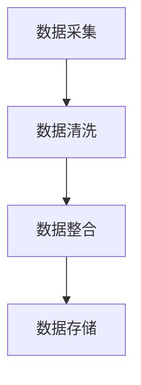
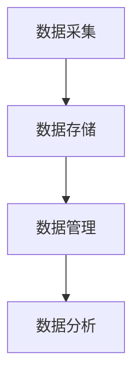
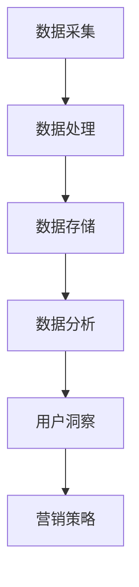
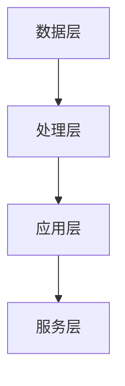
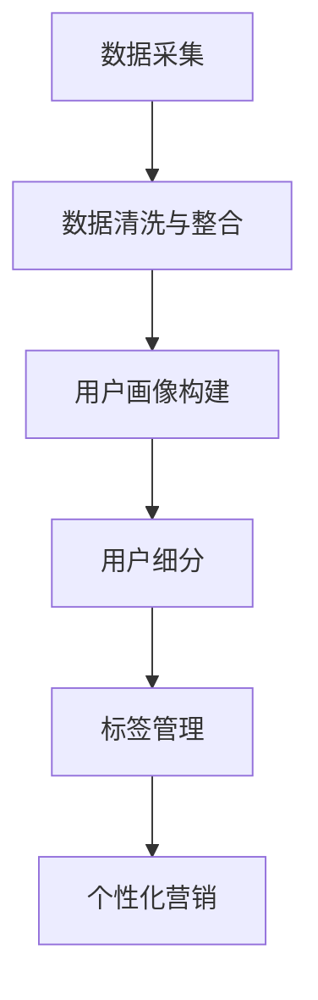
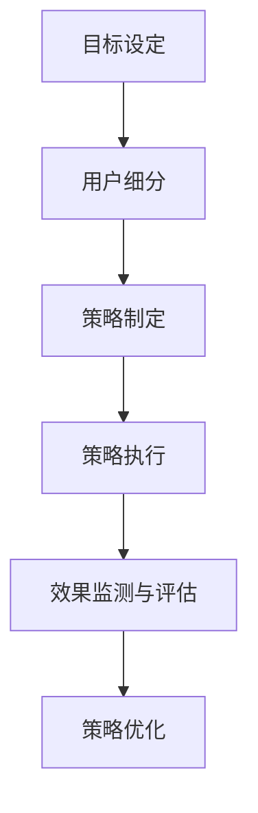
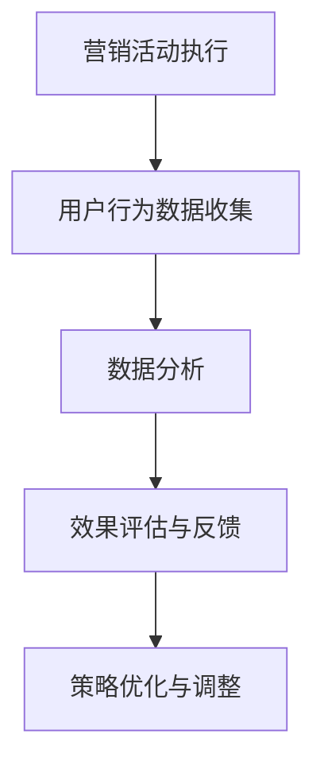
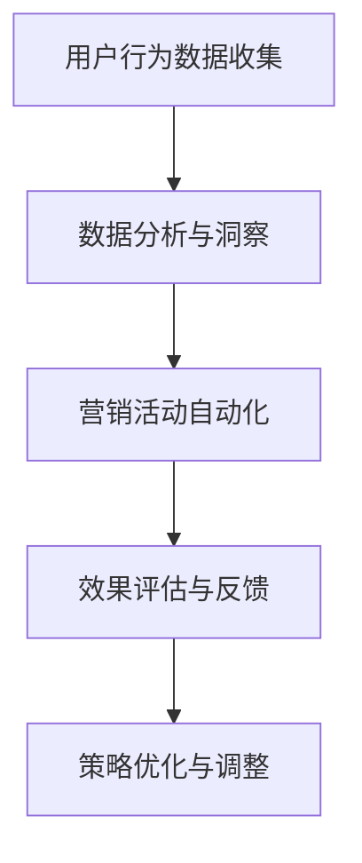

                 

### 《AI DMP 数据基建：构建数据驱动的营销体系》

> **关键词：数据管理平台、AI DMP、数据驱动、营销体系、精准营销、效果营销、数据隐私**

> **摘要：本文旨在探讨 AI DMP（数据管理平台）在现代营销体系中的重要性，以及如何利用 AI 技术构建数据驱动的营销策略。我们将分析 AI DMP 的技术原理与实现，讨论其在精准营销和效果营销中的应用，同时探讨数据隐私与安全的重要性，并分享实战案例与未来发展趋势。**

### 目录

#### 第一部分: AI DMP 数据管理平台概述

- **第1章: AI DMP 基础知识**
  - **1.1 AI DMP 概念与重要性**
  - **1.2 AI DMP 发展历程**
  - **1.3 全球AI DMP市场现状

- **第2章: 数据驱动的营销体系**
  - **2.1 数据驱动的营销策略**
  - **2.2 数据驱动的营销体系架构**

#### 第二部分: AI DMP 技术原理与实现

- **第3章: AI DMP 技术基础**
  - **3.1 数据科学基础**
  - **3.2 机器学习原理**
  - **3.3 深度学习在 DMP 中的应用

- **第4章: AI DMP 技术实现**
  - **4.1 数据采集与整合**
  - **4.2 数据分析与洞察**
  - **4.3 AI DMP 系统架构设计**

#### 第三部分: AI DMP 在营销中的应用

- **第5章: AI DMP 在精准营销中的应用**
  - **5.1 精准营销概述**
  - **5.2 AI DMP 在精准营销中的应用**

- **第6章: AI DMP 在效果营销中的应用**
  - **6.1 效果营销概述**
  - **6.2 AI DMP 在效果营销中的应用**

- **第7章: AI DMP 在数据隐私与安全中的应用**
  - **7.1 数据隐私保护概述**
  - **7.2 AI DMP 在数据隐私保护中的应用**

#### 第四部分: AI DMP 实战案例

- **第8章: AI DMP 实战案例**
  - **8.1 案例概述**
  - **8.2 案例实现**
  - **8.3 案例分析与反思**

#### 第五部分: AI DMP 未来发展趋势

- **第9章: AI DMP 未来发展趋势**
  - **9.1 AI DMP 的技术发展趋势**
  - **9.2 AI DMP 在营销中的应用趋势**
  - **9.3 AI DMP 在未来营销中的角色**

#### 附录

- **附录A: AI DMP 开发工具与资源**
  - **A.1 开发工具推荐**
  - **A.2 学习资源与推荐**

---

让我们开始深入探讨 AI DMP 的概念、原理和应用，以构建数据驱动的营销体系。

### AI DMP 数据管理平台概述

在当今数字化营销时代，数据是营销成功的关键。AI DMP（数据管理平台）作为数据驱动的营销体系的核心组成部分，对于企业营销策略的制定和执行具有重要意义。本部分将介绍 AI DMP 的基础知识，包括其概念、重要性、发展历程以及全球市场现状。

#### 1.1 AI DMP 概念与重要性

AI DMP，即人工智能数据管理平台，是一种利用人工智能技术对数据进行收集、存储、处理和分析的平台。它可以帮助企业建立全面的数据视图，对用户行为和偏好进行深入分析，从而实现精准营销和个性化服务。

AI DMP 的核心作用在于以下几个方面：

1. **数据整合与治理**：通过对接各种数据源，包括网站、移动应用、社交媒体等，AI DMP 能够收集并整合海量用户数据，并进行数据清洗、去重和标准化处理，确保数据质量和一致性。

2. **用户画像构建**：AI DMP 利用机器学习和自然语言处理等技术，对用户数据进行分析和挖掘，构建详细的用户画像。这些画像包括用户的基本信息、行为习惯、偏好和兴趣等，为精准营销提供数据基础。

3. **营销活动自动化**：基于用户画像和数据分析，AI DMP 可以自动化制定和执行营销策略，如定向广告投放、个性化推荐、用户触达等，提高营销效率和效果。

4. **实时数据监控与优化**：AI DMP 提供实时数据监控和分析功能，帮助企业及时了解营销活动的效果，并进行优化和调整，确保营销策略始终符合市场趋势和用户需求。

AI DMP 在现代营销中的地位不可忽视。随着大数据和人工智能技术的快速发展，越来越多的企业意识到数据驱动的重要性，并将 AI DMP 作为构建营销体系的基石。通过 AI DMP，企业能够更加精准地触达目标用户，提高营销ROI，实现可持续增长。

#### 1.2 AI DMP 发展历程

AI DMP 的发展历程可以追溯到 20 世纪 90 年代。当时，随着互联网的兴起，企业开始意识到用户数据的重要性，数据管理平台（DMP）应运而生。最初的数据管理平台主要基于传统的数据库技术和数据仓库技术，主要用于数据存储和简单的数据查询。

随着大数据和云计算技术的出现，数据管理平台逐渐从传统 DMP 转向智能 DMP。智能 DMP 引入了人工智能技术，如机器学习、自然语言处理和深度学习等，使数据分析和处理能力大幅提升。AI DMP 的发展历程可以概括为以下几个阶段：

1. **传统 DMP**：以数据存储和简单分析为主，主要用于广告定向投放和受众细分。

2. **智能 DMP**：引入人工智能技术，实现更复杂的用户行为分析和数据挖掘，提供更精准的营销策略。

3. **AI DMP**：结合深度学习、联邦学习和隐私计算等技术，实现实时、自动化和智能化的数据管理和营销策略。

AI DMP 的发展趋势和未来方向主要在于以下几个方面：

1. **个性化推荐**：随着用户数据的不断积累和优化，AI DMP 将更加注重个性化推荐系统的建设，为用户提供更加定制化的服务和体验。

2. **跨渠道营销**：随着社交媒体、移动应用和物联网等渠道的兴起，AI DMP 将实现跨渠道的数据整合和营销策略，提供全渠道营销解决方案。

3. **隐私保护**：随着数据隐私保护法律法规的不断完善，AI DMP 将更加注重用户数据的隐私保护和合规性设计，确保企业能够合法合规地进行数据收集和分析。

#### 1.3 全球 AI DMP 市场现状

根据市场研究机构的统计数据，全球 AI DMP 市场规模正在快速增长，预计到 2025 年将达到数十亿美元。目前，市场主要参与者包括 Adobe、Oracle、Adobe、谷歌、IBM、微软等国际知名企业，以及众多新兴的 AI DMP 服务提供商。

从地区来看，北美地区是全球 AI DMP 市场的领导者，占据较大的市场份额。欧洲、亚太地区和其他地区也在快速增长，市场潜力巨大。

从应用场景来看，广告营销、电商、金融、医疗等行业的应用需求较大，AI DMP 在这些领域的市场份额也在不断增加。

总之，AI DMP 作为数据驱动的营销体系的重要组成部分，正日益受到企业关注。随着技术的不断发展和应用的不断拓展，AI DMP 市场将继续保持快速增长态势。

### 数据驱动的营销体系

在数字营销时代，数据已经成为企业宝贵的资产。如何有效地利用这些数据来制定和执行营销策略，成为企业面临的重大挑战。数据驱动的营销体系应运而生，它通过收集、处理和分析数据，为企业提供精准的营销决策和优化方案。本节将介绍数据驱动的营销策略、决策流程以及与传统营销的对比。

#### 2.1 数据驱动的营销策略

数据驱动的营销策略是指基于数据的分析和洞察，制定和执行营销活动的过程。这种策略的核心在于充分利用数据的价值，实现更精准、更高效的营销目标。以下是数据驱动营销策略的几个关键步骤：

1. **数据收集**：收集与营销目标相关的各类数据，包括用户行为数据、交易数据、社交媒体数据等。这些数据可以通过各种渠道获取，如网站、移动应用、线下活动等。

2. **数据整合**：将来自不同渠道和不同格式的数据进行整合，构建统一的数据视图。数据整合的目的是消除数据孤岛，提高数据利用效率。

3. **数据分析**：利用数据分析工具和技术，对整合后的数据进行深入分析和挖掘。数据分析可以帮助企业了解用户行为、偏好和需求，从而制定更精准的营销策略。

4. **用户画像构建**：基于数据分析结果，构建详细的用户画像。用户画像包括用户的基本信息、行为特征、兴趣偏好等，为个性化营销提供基础。

5. **营销策略制定**：根据用户画像和数据分析结果，制定个性化的营销策略。这些策略包括定向广告投放、个性化推荐、用户触达等，旨在提高用户参与度和转化率。

6. **营销活动执行**：执行制定的营销策略，通过各种渠道向目标用户发送营销信息，并实时监测营销活动的效果。

7. **营销效果评估**：对营销活动的效果进行评估和反馈，根据评估结果对营销策略进行调整和优化，确保营销目标实现。

#### 2.2 数据驱动的营销决策流程

数据驱动的营销决策流程是企业在制定和执行营销策略过程中的关键环节。以下是一个典型的数据驱动营销决策流程：

1. **目标设定**：明确营销目标和预期成果。目标可以是提高用户参与度、增加销售额、提高品牌知名度等。

2. **数据收集**：根据目标设定，确定需要收集的数据类型和数据来源。例如，为了提高用户参与度，可以收集用户在社交媒体上的互动数据、网站访问数据等。

3. **数据整合**：将来自不同渠道和不同格式的数据进行整合，构建统一的数据视图。数据整合的目的是消除数据孤岛，提高数据利用效率。

4. **数据分析**：利用数据分析工具和技术，对整合后的数据进行深入分析和挖掘。数据分析可以帮助企业了解用户行为、偏好和需求，从而制定更精准的营销策略。

5. **用户画像构建**：基于数据分析结果，构建详细的用户画像。用户画像包括用户的基本信息、行为特征、兴趣偏好等，为个性化营销提供基础。

6. **策略制定**：根据用户画像和数据分析结果，制定个性化的营销策略。这些策略包括定向广告投放、个性化推荐、用户触达等，旨在提高用户参与度和转化率。

7. **活动执行**：执行制定的营销策略，通过各种渠道向目标用户发送营销信息，并实时监测营销活动的效果。

8. **效果评估**：对营销活动的效果进行评估和反馈，根据评估结果对营销策略进行调整和优化，确保营销目标实现。

9. **反馈循环**：将营销活动的效果反馈纳入下一个营销周期，持续优化和调整营销策略，实现营销目标。

#### 2.3 数据驱动营销与传统营销的对比

数据驱动营销与传统营销在思维方式、策略执行和效果评估等方面存在显著差异。以下是两者的一些主要对比：

1. **思维方式**：

- **传统营销**：主要依赖于经验、直觉和市场感觉，缺乏系统性和科学性。

- **数据驱动营销**：基于数据的分析和洞察，采用系统化、科学化的思维方式，以提高营销决策的准确性和效率。

2. **策略执行**：

- **传统营销**：通常采用大规模、一刀切的营销策略，难以满足个性化需求。

- **数据驱动营销**：根据用户画像和数据分析结果，制定个性化的营销策略，提高用户参与度和转化率。

3. **效果评估**：

- **传统营销**：效果评估较为滞后，往往依赖于事后分析，难以及时调整策略。

- **数据驱动营销**：通过实时数据监控和分析，能够及时评估营销活动的效果，并进行优化和调整，确保营销目标实现。

4. **营销成本**：

- **传统营销**：成本较高，往往需要进行市场调研、广告投放等大量投入。

- **数据驱动营销**：利用数据分析工具和技术，降低营销成本，提高营销 ROI。

总之，数据驱动营销相比传统营销具有明显的优势，能够更好地满足个性化需求，提高营销效率和效果。随着大数据和人工智能技术的不断发展，数据驱动营销将越来越成为企业营销策略的核心。

### AI DMP 技术基础

AI DMP 的成功构建离不开坚实的技术基础。本节将介绍 AI DMP 的技术基础，包括数据科学基础、机器学习原理以及深度学习在 DMP 中的应用。

#### 3.1 数据科学基础

数据科学是 AI DMP 的核心技术之一，它涵盖了数据预处理、数据可视化和数据挖掘等多个方面。以下是对这些基础概念的简要介绍：

1. **数据预处理**：数据预处理是数据科学中的第一步，主要包括数据清洗、数据集成和数据转换。数据清洗旨在去除重复数据、处理缺失值和异常值，确保数据质量。数据集成则是将来自不同来源的数据进行整合，构建统一的数据视图。数据转换包括数据标准化、数据归一化等操作，以适应后续的分析和建模。

2. **数据可视化**：数据可视化是帮助数据科学家和业务人员理解数据的重要工具。通过图表、仪表盘等可视化方式，数据科学家可以将复杂的数据关系和模式呈现给非技术背景的用户，提高数据理解和决策的效率。

3. **数据挖掘**：数据挖掘是利用统计学、机器学习等方法，从大量数据中发现潜在的模式和规律。常见的挖掘方法包括分类、聚类、关联规则挖掘等，这些方法可以帮助数据科学家识别数据中的隐藏价值，为企业提供决策支持。

#### 3.2 机器学习原理

机器学习是 AI DMP 的核心技术之一，它使 DMP 能够自动从数据中学习并做出预测。以下是对常见机器学习算法的简要介绍：

1. **监督学习算法**：监督学习算法需要通过训练集来学习特征与标签之间的关系，然后在测试集上进行预测。常见的监督学习算法包括线性回归、逻辑回归、决策树、随机森林和支持向量机（SVM）等。线性回归和逻辑回归主要用于预测数值型和二元型目标变量，而决策树、随机森林和 SVM 则适用于分类问题。

2. **无监督学习算法**：无监督学习算法不需要标签信息，其主要任务是发现数据中的内在结构。常见的无监督学习算法包括聚类算法（如 K-均值聚类和层次聚类）和降维算法（如主成分分析（PCA）和 t-SNE）。聚类算法用于将数据分成多个组，以发现数据中的模式，而降维算法则用于减少数据的维度，提高计算效率。

3. **强化学习算法**：强化学习算法通过试错学习，使系统在特定环境中做出最佳决策。强化学习算法的核心是奖励机制，它通过奖励或惩罚来调整系统的行为，以达到最佳效果。常见的强化学习算法包括 Q-学习、深度 Q-网络（DQN）和策略梯度（PG）等。

#### 3.3 深度学习在 DMP 中的应用

深度学习是近年来机器学习领域的重要进展，它通过多层神经网络对数据进行复杂的特征提取和建模。以下是对深度学习在 DMP 中应用的简要介绍：

1. **深度学习基础**：深度学习是基于多层神经网络的机器学习技术，它通过逐层提取数据中的特征，从而实现复杂的数据建模。常见的深度学习模型包括卷积神经网络（CNN）、循环神经网络（RNN）和生成对抗网络（GAN）等。

2. **卷积神经网络（CNN）**：卷积神经网络是一种用于处理图像数据的深度学习模型，它通过卷积层和池化层对图像数据进行特征提取和降维。CNN 在图像分类、目标检测和图像生成等领域具有广泛应用。

3. **循环神经网络（RNN）**：循环神经网络是一种用于处理序列数据的深度学习模型，它通过循环结构对序列数据进行递归处理，从而捕捉序列中的长期依赖关系。RNN 在自然语言处理、语音识别和时间序列预测等领域具有广泛应用。

4. **生成对抗网络（GAN）**：生成对抗网络是一种用于生成数据的深度学习模型，它由生成器和判别器两个网络组成，通过对抗训练实现数据的生成。GAN 在图像生成、数据增强和图像修复等领域具有广泛应用。

总之，数据科学基础、机器学习原理和深度学习在 DMP 中发挥着重要作用。通过这些技术，AI DMP 能够对海量用户数据进行高效的处理和分析，为企业提供精准的营销决策和优化方案。

### AI DMP 技术实现

在了解了 AI DMP 的技术基础后，接下来我们将探讨如何具体实现 AI DMP 系统，包括数据采集与整合、数据存储与管理、数据分析和洞察、以及 AI DMP 系统的架构设计。

#### 4.1 数据采集与整合

数据采集是 AI DMP 实现的第一步，也是最关键的一步。数据源的选择和接入决定了数据的质量和完整性。以下是一些常见的数据源和接入方法：

1. **网站与移动应用**：通过 API 接口或数据抓取工具（如 Scrappy）收集用户行为数据，包括页面访问、点击、浏览时长等。

2. **社交媒体**：利用社交媒体平台的 API 接口，如 Facebook、Twitter、Instagram 等，收集用户在社交平台上的互动数据，如点赞、评论、分享等。

3. **电子邮件**：通过电子邮件数据收集用户的行为数据，如邮件打开率、点击率、回复率等。

4. **线下活动**：通过扫描二维码、填写问卷等方式收集线下活动的用户数据，如姓名、联系方式、兴趣等。

数据接入后，需要进行数据清洗和整合。数据清洗包括去除重复数据、处理缺失值和异常值等，以确保数据质量。数据整合则是将来自不同来源的数据进行合并，构建统一的数据视图。

以下是一个简化的数据采集与整合流程：



#### 4.2 数据存储与管理

数据存储与管理是 AI DMP 的核心组件，其目的是确保数据的安全、可靠和高效访问。以下是一些常见的数据存储方案：

1. **关系数据库**：如 MySQL、PostgreSQL 等，适用于结构化数据的存储和查询。

2. **NoSQL 数据库**：如 MongoDB、Cassandra 等，适用于存储大量非结构化数据，如用户行为日志。

3. **数据仓库**：如 Amazon Redshift、Google BigQuery 等，适用于大规模数据集的存储和分析。

4. **数据湖**：如 Amazon S3、Google Cloud Storage 等，适用于存储海量原始数据，并进行数据挖掘和分析。

以下是一个简化的数据存储与管理架构：



数据管理包括数据的备份、恢复、安全保护等。在实际应用中，通常会采用分布式存储和计算架构，以提高数据存储和处理的效率。

#### 4.3 数据分析与洞察

数据分析与洞察是 AI DMP 的关键环节，通过对海量用户数据的分析，挖掘用户行为模式、兴趣偏好等，为企业提供精准的营销决策和优化方案。以下是一些常见的数据分析方法：

1. **用户行为分析**：通过分析用户在网站、移动应用等渠道的行为数据，了解用户的行为路径、停留时长、点击率等，从而优化用户体验和转化率。

2. **用户细分与标签管理**：通过聚类算法、协同过滤等机器学习技术，对用户进行细分，并为每个用户打上标签，从而实现精准营销和个性化推荐。

3. **实时数据分析**：通过实时数据采集和计算，对用户行为数据进行实时分析和处理，为用户提供即时反馈和个性化服务。

以下是一个简化的数据分析与洞察流程：



#### 4.4 AI DMP 系统架构设计

AI DMP 系统架构设计是确保系统稳定、高效、可扩展的关键。以下是一个简化的 AI DMP 系统架构：

1. **数据层**：包括各种数据源和数据存储方案，如关系数据库、NoSQL 数据库、数据仓库等。

2. **处理层**：包括数据清洗、数据整合、数据分析等数据处理模块，如 ETL（提取、转换、加载）工具、机器学习模型等。

3. **应用层**：包括数据可视化、用户画像构建、营销策略制定等应用模块，如数据可视化工具、营销自动化平台等。

4. **服务层**：包括 API 接口、Web 应用等，用于提供对外服务，如用户数据查询、营销活动执行等。

以下是一个简化的 AI DMP 系统架构：



通过上述架构设计，AI DMP 系统可以实现高效的数据采集、存储、处理和分析，为企业提供全面的数据驱动营销解决方案。

### AI DMP 在精准营销中的应用

精准营销是现代营销的核心，它通过深入了解用户需求和行为，实现个性化的营销和服务。AI DMP 在精准营销中发挥着重要作用，通过数据采集、用户行为分析和用户细分，帮助企业制定更有效的营销策略。以下将详细探讨 AI DMP 在精准营销中的应用。

#### 5.1 精准营销概述

精准营销是一种以数据为核心，以用户需求为导向的营销方式。与传统的广撒网式营销不同，精准营销强调对用户行为的深入分析，以及基于用户行为的个性化推荐和营销活动。

精准营销的核心要素包括：

1. **数据驱动的决策**：通过大数据分析和机器学习技术，从海量数据中提取有价值的信息，为营销策略提供数据支持。

2. **用户细分**：将用户分为不同的群体，根据用户的特征和行为，进行精细化管理。

3. **个性化推荐**：根据用户的兴趣和需求，推荐个性化的产品和服务。

4. **实时响应**：通过实时数据分析和处理，快速响应用户行为和需求变化。

#### 5.2 AI DMP 在精准营销中的应用

AI DMP 在精准营销中的应用主要体现在以下几个方面：

1. **用户行为分析**：通过 AI DMP 平台，企业可以实时收集用户的浏览行为、购买行为等，分析用户的偏好和需求。例如，通过对用户在网站上的点击率、停留时长等数据的分析，可以了解用户的兴趣点，从而有针对性地推送相关产品。

2. **用户细分与标签管理**：基于用户行为数据，AI DMP 可以构建详细的用户画像，并为每个用户打上标签。标签可以是用户的年龄、性别、兴趣、购买力等。通过标签管理，企业可以更加精准地定位用户群体，实现个性化营销。

3. **个性化推荐**：AI DMP 可以基于用户的兴趣和行为，进行个性化推荐。例如，在电商平台上，根据用户的浏览历史和购买记录，推荐相似的产品或相关优惠信息。个性化推荐不仅提高了用户的满意度，也增加了销售机会。

4. **精准营销策略制定**：通过 AI DMP 平台的分析结果，企业可以制定更精准的营销策略。例如，在用户生日或特定节日，发送个性化的促销信息；对于高价值用户，提供专属的会员服务。

5. **营销活动自动化**：AI DMP 平台可以自动化执行营销活动，如发送电子邮件、推送通知、显示广告等。通过自动化，企业可以更高效地管理大量用户，提高营销效率。

#### 5.3 用户细分与标签管理

用户细分与标签管理是精准营销的基础。以下是一个简化的用户细分与标签管理流程：

1. **数据采集**：从各个渠道收集用户数据，如网站、移动应用、社交媒体等。

2. **数据清洗与整合**：对采集到的数据进行清洗、去重和整合，构建统一的数据视图。

3. **用户画像构建**：利用数据分析技术，构建详细的用户画像，包括用户的基本信息、行为习惯、兴趣偏好等。

4. **用户细分**：根据用户画像，将用户分为不同的群体，如年轻用户、高消费用户、高忠诚度用户等。

5. **标签管理**：为每个用户打上标签，标签可以是静态的（如年龄、性别），也可以是动态的（如最近浏览的产品、最近购买的产品）。

6. **个性化营销**：根据用户标签和细分结果，制定个性化的营销策略，如发送定制化的电子邮件、推送通知等。

以下是一个简化的用户细分与标签管理流程图：



通过用户细分与标签管理，企业可以更加精准地触达目标用户，提高营销效果。

#### 5.4 精准营销策略制定与优化

精准营销策略的制定和优化是确保营销效果的关键。以下是一个简化的精准营销策略制定与优化流程：

1. **目标设定**：明确营销目标，如提高用户参与度、增加销售额等。

2. **用户细分**：根据用户画像和标签，将用户分为不同的群体。

3. **策略制定**：根据用户细分结果，制定个性化的营销策略。例如，为高价值用户提供专属优惠，为年轻用户推荐热门产品。

4. **策略执行**：执行制定的营销策略，如发送电子邮件、推送通知等。

5. **效果监测与评估**：实时监测营销活动的效果，如打开率、点击率、转化率等。

6. **策略优化**：根据效果评估结果，调整和优化营销策略，以提高效果。

以下是一个简化的精准营销策略制定与优化流程图：



通过精准营销策略的制定与优化，企业可以不断提高营销效果，实现持续增长。

总之，AI DMP 在精准营销中的应用，通过数据采集、用户行为分析、用户细分和个性化推荐等手段，帮助企业实现更精准、更有效的营销策略。随着 AI 技术的不断发展，AI DMP 在精准营销中的应用将越来越广泛，为企业的营销创新提供更多可能性。

### AI DMP 在效果营销中的应用

效果营销是企业在数字营销中追求的重要目标，它关注的是营销活动的实际效果，如用户转化率、销售额等。AI DMP 在效果营销中发挥着关键作用，通过数据分析、营销活动自动化和跨渠道营销策略，帮助企业实现高效的营销效果。以下将详细探讨 AI DMP 在效果营销中的应用。

#### 6.1 效果营销概述

效果营销（Performance Marketing）是一种以实现具体营销目标为导向的营销方式。与品牌营销不同，效果营销更注重营销活动的实际效果，如用户转化率、点击率、销售额等。效果营销的核心原则包括：

1. **数据驱动**：以数据为核心，通过数据分析来指导营销策略的制定和执行。

2. **目标明确**：明确营销目标，如提高用户参与度、增加销售额、提高品牌知名度等。

3. **可量化**：通过可量化的指标，如转化率、ROI 等，来评估营销活动的效果。

4. **优化调整**：根据营销效果的数据反馈，不断优化和调整营销策略，以提高效果。

效果营销的目标是提高营销投资回报率（ROI），实现营销成本的可控性和可预测性。

#### 6.2 AI DMP 在效果营销中的应用

AI DMP 在效果营销中的应用主要体现在以下几个方面：

1. **营销活动自动化**：通过 AI DMP 平台，企业可以自动化执行各种营销活动，如发送电子邮件、推送通知、展示广告等。自动化营销活动可以提高营销效率，减少人工操作，降低成本。以下是一个简化的营销活动自动化流程：

   ```mermaid
   graph TD
   A[用户行为分析] --> B[营销策略制定]
   B --> C[营销活动自动化]
   C --> D[效果监测与优化]
   ```

2. **数据分析与优化**：AI DMP 平台可以实时收集和分析用户行为数据，如点击率、转化率、停留时长等。通过对这些数据的分析，企业可以了解营销活动的效果，找出优化点，并调整营销策略。以下是一个简化的数据分析与优化流程：

   ```mermaid
   graph TD
   A[用户行为数据收集] --> B[数据分析]
   B --> C[效果监测与反馈]
   C --> D[策略优化与调整]
   ```

3. **跨渠道营销策略**：AI DMP 可以整合多种营销渠道，如网站、移动应用、社交媒体、电子邮件等，实现跨渠道的数据整合和营销活动。跨渠道营销策略可以帮助企业覆盖更多目标用户，提高营销效果。以下是一个简化的跨渠道营销策略流程：

   ```mermaid
   graph TD
   A[数据采集与整合] --> B[跨渠道营销策略制定]
   B --> C[营销活动执行]
   C --> D[效果评估与反馈]
   ```

#### 6.3 营销效果监测与分析

营销效果监测与分析是效果营销的关键环节。通过实时监测和数据分析，企业可以了解营销活动的效果，发现优化点，并调整策略。以下是一些常用的营销效果监测与分析方法：

1. **点击率（CTR）**：衡量用户对广告或链接的点击行为。高点击率通常意味着广告或内容吸引了用户的兴趣。

2. **转化率**：衡量用户完成特定目标（如购买、注册、下载等）的比例。高转化率是营销成功的直接体现。

3. **停留时长**：衡量用户在网站或页面上的停留时间。较长的停留时长通常意味着用户对内容感兴趣。

4. **跳出率**：衡量用户在进入网站或页面后立即离开的比例。较低的跳出率表明用户对内容感兴趣，愿意继续浏览。

5. **ROI**：衡量营销投资回报率，即营销成本与产生的收入之间的比率。高 ROI 表明营销活动是有效的。

以下是一个简化的营销效果监测与分析流程：



通过上述流程，企业可以不断优化营销策略，提高营销效果，实现持续增长。

#### 6.4 营销活动自动化与优化

营销活动自动化是现代营销的趋势，它通过技术手段实现营销活动的自动化执行，提高营销效率。以下是一些常见的营销活动自动化工具和平台：

1. **营销自动化平台**：如 Marketo、HubSpot 等，可以自动化执行营销活动，如发送电子邮件、推送通知、展示广告等。

2. **人工智能助手**：如 ChatGPT、虚拟客服等，可以自动化回答用户问题，提供实时支持。

3. **数据分析工具**：如 Google Analytics、Tableau 等，可以自动化收集和分析用户行为数据，提供实时反馈。

通过营销活动自动化，企业可以大幅提高营销效率，减少人工操作，降低成本。以下是一个简化的营销活动自动化与优化流程：



通过营销活动自动化与优化，企业可以更高效地管理大量用户，提高营销效果。

总之，AI DMP 在效果营销中的应用，通过数据分析、营销活动自动化和跨渠道营销策略，帮助企业实现高效的营销效果。随着 AI 技术的不断发展，AI DMP 在效果营销中的应用将越来越广泛，为企业的营销创新提供更多可能性。

### AI DMP 在数据隐私与安全中的应用

在数字化时代，数据隐私和安全成为企业面临的重要挑战。随着 GDPR（通用数据保护条例）等数据隐私法规的出台，企业必须确保用户数据的合法合规使用。AI DMP 作为数据驱动的营销工具，在数据隐私与安全方面扮演着关键角色。以下将探讨 AI DMP 在数据隐私与安全中的应用，包括数据匿名化与脱敏技术、数据安全加密与保护以及系统的合规性设计。

#### 7.1 数据隐私保护概述

数据隐私保护是确保用户数据不被未经授权的个人或组织访问和使用的过程。数据隐私保护的重要性体现在以下几个方面：

1. **法律法规要求**：随着 GDPR、CCPA（加利福尼亚消费者隐私法案）等数据隐私法规的出台，企业必须遵守相关法律法规，确保用户数据的合法使用。

2. **用户信任**：用户对企业的信任建立在对其数据的保护上。数据泄露或不当使用可能导致用户失去信任，影响企业声誉。

3. **商业竞争力**：保护用户数据是企业保持竞争优势的重要手段。在数据隐私保护方面做得好的企业，能够赢得用户的信任，从而在市场中脱颖而出。

#### 7.2 数据匿名化与脱敏技术

数据匿名化与脱敏技术是确保用户数据隐私的重要手段。以下是一些常见的数据匿名化和脱敏技术：

1. **数据匿名化**：数据匿名化旨在消除数据中的个人识别信息，使数据无法被直接识别或关联到特定个人。常见的数据匿名化技术包括：

   - **泛化**：将具体值替换为泛化值，如将具体年龄替换为年龄段。
   - **隐匿**：去除数据集中的个人识别信息，如姓名、地址、电话号码等。
   - **雪球模型**：通过合并和压缩数据来消除个人识别信息。

2. **数据脱敏**：数据脱敏旨在保护敏感数据，使其在传输、存储和处理过程中不被泄露。常见的数据脱敏技术包括：

   - **加密**：使用加密算法对敏感数据进行加密，确保数据在传输过程中不被窃取或篡改。
   - **掩码**：使用掩码（如遮罩）隐藏敏感数据的部分内容，如将电话号码的中间四位替换为星号。
   - **替换**：将敏感数据的值替换为随机值，如将姓名替换为虚构的名字。

#### 7.3 数据安全加密与保护

数据安全加密与保护是确保用户数据在存储、传输和处理过程中不被窃取或篡改的关键。以下是一些常见的数据安全加密与保护技术：

1. **对称加密**：对称加密使用相同的密钥进行加密和解密。常见对称加密算法包括 AES（高级加密标准）、DES（数据加密标准）等。

2. **非对称加密**：非对称加密使用不同的密钥进行加密和解密，其中公钥用于加密，私钥用于解密。常见非对称加密算法包括 RSA（拉布iniac安全算法）和 ECC（椭圆曲线加密）等。

3. **哈希函数**：哈希函数用于将数据转换为固定长度的字符串，确保数据在传输和存储过程中的完整性。常见哈希算法包括 SHA-256、SHA-3 等。

4. **数字签名**：数字签名用于验证数据的真实性和完整性，确保数据在传输过程中未被篡改。数字签名通常使用公钥加密和私钥解密。

#### 7.4 AI DMP 系统的合规性设计

AI DMP 系统的合规性设计是确保系统遵循数据隐私和安全法规的关键。以下是一些常见的合规性设计策略：

1. **数据收集与使用政策**：明确数据收集的目的、使用范围和用户同意条款，确保用户在知情的情况下提供数据。

2. **用户权限管理**：通过用户权限管理，确保只有授权人员能够访问和处理敏感数据。

3. **数据匿名化与脱敏**：在数据存储、传输和处理过程中，对敏感数据进行匿名化和脱敏处理。

4. **加密与安全审计**：对敏感数据进行加密，并定期进行安全审计，确保系统的安全性和合规性。

5. **隐私保护培训与教育**：对员工进行数据隐私保护培训，提高员工的隐私保护意识和技能。

#### 7.5 AI DMP 在数据隐私保护中的应用

AI DMP 在数据隐私保护中的应用主要包括以下几个方面：

1. **隐私保护数据模型**：构建隐私保护的数据模型，确保在数据分析和挖掘过程中，最大限度地减少个人识别信息的使用。

2. **隐私保护算法**：采用隐私保护算法，如差分隐私、联邦学习等，确保在数据共享和联合分析过程中，保护用户隐私。

3. **隐私保护接口**：提供隐私保护接口，确保用户可以方便地查询和管理自己的数据，如数据访问日志、数据删除等。

4. **合规性监控与审计**：建立合规性监控与审计机制，确保系统在数据收集、存储、处理和分析过程中，始终遵循数据隐私和安全法规。

通过上述措施，AI DMP 可以在确保数据隐私和安全的同时，为企业提供高效、精准的营销解决方案。

总之，AI DMP 在数据隐私与安全中的应用，通过数据匿名化与脱敏技术、数据安全加密与保护以及系统的合规性设计，帮助企业实现数据隐私保护。随着数据隐私保护法规的不断加强，AI DMP 在数据隐私保护中的应用将越来越重要，为企业提供更多合规性和安全性保障。

### AI DMP 实战案例

为了更好地理解 AI DMP 在实际营销中的应用，以下将介绍一个具体的 AI DMP 实战案例，包括案例概述、数据采集与整合、数据分析与洞察、营销策略制定与优化以及案例分析与反思。

#### 8.1 案例概述

该案例是一家电商公司，旨在通过 AI DMP 平台提升用户转化率和销售额。该公司拥有大量用户数据，包括用户行为数据、购买记录、浏览历史等。通过 AI DMP 平台，该公司希望实现以下目标：

1. **精准定位目标用户**：根据用户行为和购买记录，将用户分为不同的细分群体，为每个群体制定个性化的营销策略。
2. **提高用户转化率**：通过个性化推荐和定向广告，提高用户的购买意愿和转化率。
3. **优化营销投入回报率（ROI）**：通过实时数据分析和效果评估，优化营销策略，提高营销ROI。

#### 8.2 案例实现

**1. 数据采集与整合**

首先，该公司通过 API 接口和第三方数据服务，收集用户在网站、移动应用和社交媒体上的行为数据，包括浏览历史、点击行为、购买记录等。这些数据经过清洗、去重和整合，构建了一个统一的数据视图。

**2. 数据分析与洞察**

通过 AI DMP 平台，对整合后的用户数据进行深入分析，构建详细的用户画像。用户画像包括用户的基本信息、行为习惯、兴趣偏好等。以下是数据分析的关键步骤：

- **用户细分**：使用聚类算法（如 K-均值聚类），将用户分为不同的群体，如高消费用户、高忠诚度用户、潜在购买用户等。
- **用户标签管理**：为每个用户打上标签，标签包括用户在特定时间段内的购买行为、浏览行为等。
- **用户行为路径分析**：通过分析用户在网站上的行为路径，了解用户在购物过程中的关键节点和决策因素。

**3. 营销策略制定与优化**

基于用户画像和数据分析结果，制定个性化的营销策略。以下是一些具体的营销策略：

- **定向广告投放**：根据用户标签和兴趣偏好，在各大广告平台上进行定向广告投放，提高广告点击率和转化率。
- **个性化推荐**：在网站和移动应用上，根据用户的浏览历史和购买记录，推荐相似的产品或相关优惠信息，提高用户购买意愿。
- **用户触达**：通过电子邮件、短信、推送通知等渠道，向目标用户发送个性化的营销信息，引导用户进行购买。

通过实时数据监控和分析，不断优化营销策略。以下是营销策略优化的一些关键步骤：

- **效果评估**：定期评估营销活动的效果，包括点击率、转化率、销售额等。
- **策略调整**：根据效果评估结果，调整营销策略，如调整广告投放渠道、优化推荐算法等。
- **A/B 测试**：进行 A/B 测试，比较不同营销策略的效果，选择最优策略。

**4. 案例成果**

通过 AI DMP 平台的部署和优化，该公司实现了以下成果：

- **用户转化率提高**：用户转化率提高了 20%，特别是定向广告和个性化推荐的转化率显著提升。
- **销售额增加**：销售额提高了 30%，尤其是在营销活动优化后的阶段，销售额增长更加明显。
- **营销 ROI 提高**：通过实时数据监控和优化，营销 ROI 提高了 50%，营销成本得到了有效控制。

#### 8.3 案例分析与反思

**1. 案例成功因素**

该案例的成功主要归因于以下几点：

- **数据驱动**：通过 AI DMP 平台，实现了数据驱动的营销决策，提高了营销策略的精准性和有效性。
- **个性化推荐**：基于用户画像和数据分析，实现了个性化推荐，提高了用户购买意愿和转化率。
- **实时优化**：通过实时数据监控和优化，及时调整营销策略，提高了营销效果。

**2. 遇到的问题及解决方案**

在实施 AI DMP 平台过程中，该公司遇到了以下问题：

- **数据质量**：由于数据来源多样，数据质量参差不齐，影响了数据分析的准确性。
  - **解决方案**：通过数据清洗和整合，提高了数据质量，确保了数据分析的准确性。

- **技术挑战**：AI DMP 平台的部署和维护需要较高的技术支持，增加了运营成本。
  - **解决方案**：与专业的技术团队合作，利用外部资源和技术支持，降低了技术挑战和成本。

**3. 对 AI DMP 实践的启示**

该案例为 AI DMP 在实际营销中的应用提供了以下启示：

- **数据驱动**：在营销决策中，应以数据为核心，充分利用数据分析和洞察，提高营销策略的精准性和有效性。
- **个性化推荐**：个性化推荐是提高用户转化率和销售额的有效手段，应充分利用用户画像和数据分析，实现个性化营销。
- **实时优化**：通过实时数据监控和优化，及时调整营销策略，提高营销效果，实现可持续增长。

总之，通过 AI DMP 平台的部署和优化，该公司实现了显著的业务增长，为其他企业提供了宝贵的实践经验。

### AI DMP 未来发展趋势

随着技术的不断进步和应用的不断拓展，AI DMP 在未来营销中将扮演更加重要的角色。以下将探讨 AI DMP 的技术发展趋势、在营销中的应用趋势以及在未来营销中的角色。

#### 9.1 AI DMP 的技术发展趋势

1. **深度学习算法的演进**：随着深度学习技术的不断发展，深度学习算法在数据处理和分析中的能力不断提升。未来，深度学习算法将更加高效和智能化，能够处理更复杂的数据集和更复杂的分析任务。

2. **联邦学习与隐私计算**：联邦学习和隐私计算是解决数据隐私问题的重要技术。联邦学习通过在数据不离开本地设备的情况下进行协同学习，保护用户数据隐私。隐私计算则通过加密计算和差分隐私等技术，确保数据在分析和处理过程中的安全性。

3. **大数据与云计算的结合**：随着大数据技术的普及，云计算成为数据处理和存储的重要基础设施。未来，大数据与云计算的结合将更加紧密，提供更加高效和灵活的数据处理和分析能力。

4. **实时数据分析与处理**：实时数据分析与处理是未来 AI DMP 的重要发展趋势。通过实时数据采集、处理和分析，企业可以更快速地响应用户需求和市场变化，提高营销策略的敏捷性和响应速度。

#### 9.2 AI DMP 在营销中的应用趋势

1. **个性化推荐系统的应用**：个性化推荐系统是 AI DMP 在营销中的重要应用趋势。通过深度学习和用户行为分析，个性化推荐系统可以准确预测用户兴趣和需求，提供个性化的产品和服务，提高用户满意度和转化率。

2. **跨渠道营销与全渠道营销**：随着用户行为渠道的多样化，跨渠道营销和全渠道营销成为企业的重要策略。AI DMP 通过整合多渠道数据，实现跨渠道的用户行为分析和营销策略，提供一致性和个性化的用户体验。

3. **智能客服与智能营销**：智能客服和智能营销是未来营销的重要趋势。通过自然语言处理和对话系统技术，智能客服可以提供高效和人性化的客户服务。智能营销则通过自动化和智能化的方式，实现精准和高效的营销活动。

4. **数据隐私保护与合规性设计**：随着数据隐私保护法规的不断完善，数据隐私保护与合规性设计成为 AI DMP 在营销中的关键挑战。未来，AI DMP 将更加注重数据隐私保护，确保用户数据的合法合规使用。

#### 9.3 AI DMP 在未来营销中的角色

1. **数据驱动的营销决策**：AI DMP 将成为企业数据驱动的营销决策的核心工具。通过海量数据的收集、处理和分析，AI DMP 可以为企业提供精准的市场洞察和营销策略，提高营销决策的准确性和有效性。

2. **营销自动化与智能化**：AI DMP 将推动营销自动化和智能化的发展。通过自动化和智能化的营销活动执行，企业可以大幅提高营销效率和效果，降低人力成本，实现可持续增长。

3. **用户体验优化与用户价值提升**：AI DMP 通过对用户行为和偏好的深入分析，可以为企业提供个性化的用户体验和用户价值提升策略。通过优化用户体验，企业可以增强用户粘性和忠诚度，提高用户满意度和品牌价值。

总之，AI DMP 作为数据驱动的营销体系的重要组成部分，将在未来营销中发挥更加重要的作用。随着技术的不断进步和应用的创新，AI DMP 将为企业和营销人员提供更高效、更智能的营销解决方案。

### 附录：AI DMP 开发工具与资源

#### A.1 开发工具推荐

1. **Python编程环境搭建**：

   - **Python**：Python 是数据科学和机器学习领域的首选语言，拥有丰富的库和框架，如 NumPy、Pandas、Scikit-learn 等。

   - **Jupyter Notebook**：Jupyter Notebook 是一种交互式计算环境，适合数据分析和机器学习项目。

   - **Anaconda**：Anaconda 是 Python 的集成环境，提供了丰富的数据科学库和依赖管理功能。

2. **常用数据科学库与框架**：

   - **NumPy**：用于高性能的科学计算和数据分析。

   - **Pandas**：提供数据结构 DataFrame，适用于数据清洗、处理和分析。

   - **Scikit-learn**：用于机器学习和数据挖掘，包括分类、回归、聚类等算法。

   - **TensorFlow**：用于深度学习和神经网络。

   - **PyTorch**：用于深度学习和神经网络，尤其适合图像和语音处理。

3. **云计算与大数据平台**：

   - **AWS**：提供丰富的云计算服务和大数据处理工具，如 Amazon S3、Amazon Redshift、Amazon SageMaker 等。

   - **Google Cloud Platform (GCP)**：提供强大的云计算平台和大数据处理工具，如 BigQuery、AI Platform 等。

   - **Azure**：提供全面的云计算服务和大数据解决方案，如 Azure Data Lake、Azure Machine Learning 等。

#### A.2 学习资源与推荐

1. **在线课程与教程**：

   - **Coursera**：提供多门数据科学和机器学习课程，如“机器学习”、“数据科学基础”等。

   - **edX**：提供由知名大学和机构开设的数据科学和机器学习课程，如“深度学习”、“数据科学导论”等。

   - **Udacity**：提供实战性的数据科学和机器学习课程，如“数据科学家纳米学位”等。

2. **相关书籍与论文**：

   - **《数据科学入门》**：由 Andrew Ng 编写，适合初学者了解数据科学基础。

   - **《深度学习》**：由 Ian Goodfellow、Yoshua Bengio 和 Aaron Courville 编写，是深度学习领域的经典教材。

   - **《大数据之路》**：由 Bing Liu 编写，介绍大数据处理和分析的基本原理。

   - **相关论文**：关注顶级会议和期刊，如 NeurIPS、ICML、KDD 等，了解最新的研究成果和技术动态。

3. **社区与论坛**：

   - **Stack Overflow**：程序员问答社区，适合解决编程和数据处理中的问题。

   - **GitHub**：代码托管平台，可以找到各种开源项目和资源。

   - **Kaggle**：数据科学竞赛平台，提供丰富的数据集和项目，适合实战练习。

   - **DataCamp**：在线数据科学学习社区，提供互动式教程和项目。

通过上述开发工具和学习资源，可以系统地学习和掌握 AI DMP 的相关技术，为构建数据驱动的营销体系打下坚实基础。

### 总结

本文从多个角度探讨了 AI DMP（数据管理平台）在营销体系中的重要性。首先，我们介绍了 AI DMP 的概念、重要性以及发展历程，阐述了数据驱动的营销策略和决策流程。接着，我们深入探讨了 AI DMP 的技术基础，包括数据科学、机器学习和深度学习等。随后，我们详细介绍了 AI DMP 在精准营销、效果营销和数据隐私与安全方面的应用，并通过实战案例展示了 AI DMP 的实际效果。最后，我们分析了 AI DMP 的未来发展趋势，探讨了其在未来营销中的角色。

AI DMP 作为数据驱动的营销体系的核心组成部分，正日益受到企业的关注。通过本文的探讨，我们可以看到 AI DMP 在提升营销效率、优化营销策略、保护数据隐私等方面的重要作用。随着技术的不断进步和应用的创新，AI DMP 将继续推动营销体系的变革，为企业提供更加智能、高效、安全的营销解决方案。

让我们继续关注 AI DMP 的发展，探索更多创新应用，为企业创造更多价值。

