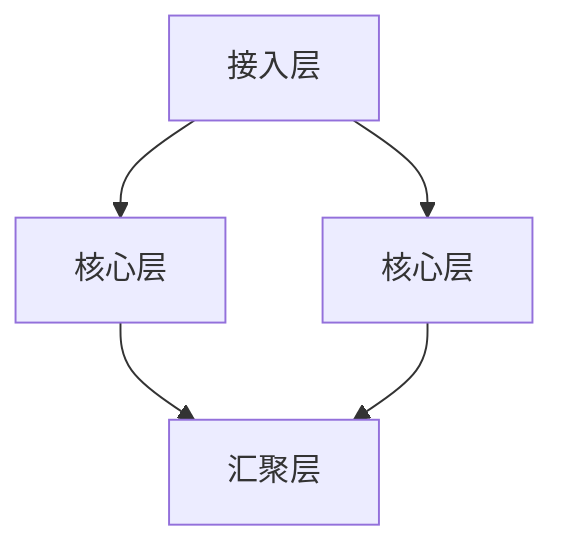

                 

## 文章标题

### AI 大模型应用数据中心建设：数据中心安全与可靠性

#### 关键词：数据中心、AI 大模型、安全、可靠性、架构设计、运维管理

在当今数字化时代，数据中心作为企业数据存储和处理的核心基础设施，其安全与可靠性至关重要。随着人工智能（AI）技术的发展，特别是大模型的广泛应用，数据中心面临着前所未有的挑战。本文将围绕数据中心建设，特别是大模型应用数据中心的构建，深入探讨数据中心安全与可靠性的重要性和实现策略。

> “数据中心是现代企业运行的数字心脏，其安全与可靠性直接关系到业务连续性和数据完整性。”  
>
> —— AI 天才研究院

本文旨在为读者提供一份全面的指南，帮助理解和实施数据中心在大模型应用中的安全与可靠性建设。通过详细阐述数据中心的基础知识、大模型数据中心的应用实践、架构设计、部署与运维策略，以及案例研究，本文旨在为从事数据中心建设与运维的专业人士提供有价值的参考。

在接下来的内容中，我们将首先回顾数据中心的基础知识，了解其定义、分类和架构。随后，我们将深入探讨数据中心网络架构、硬件设备、安全管理和能源管理等方面的关键要素。接着，我们将重点介绍大模型数据中心的应用背景、优势与挑战，并详细阐述其架构设计和部署与运维策略。最后，通过实际案例研究，我们希望展示大模型数据中心在实践中的应用效果，并对未来发展趋势进行展望。

让我们一步一步深入探讨，揭开数据中心在大模型应用中的安全与可靠性建设之谜。

## 摘要

本文旨在全面探讨数据中心在大模型应用中的安全与可靠性建设。首先，我们回顾了数据中心的基础知识，包括其定义、分类和架构。接着，我们详细分析了数据中心网络架构、硬件设备、安全管理和能源管理等方面的关键要素。重点介绍了大模型数据中心的应用背景、优势与挑战，并详细阐述了其架构设计和部署与运维策略。通过实际案例研究，我们展示了大模型数据中心在实践中的应用效果，并对未来发展趋势进行了展望。本文希望为从事数据中心建设与运维的专业人士提供有价值的参考，帮助他们更好地理解和实施数据中心在大模型应用中的安全与可靠性建设。

## 第一部分: 数据中心基础

### 第1章: 数据中心概述

#### 1.1 数据中心的定义与重要性

数据中心（Data Center）是专门为集中存储、处理、传输和管理大量数据的计算机设施。其核心功能是提供计算、存储、网络和其他IT资源，以满足企业各种业务需求。数据中心不仅是企业数据存储和处理的中心，也是企业业务连续性和数据安全的关键保障。

**定义：** 数据中心通常包括服务器、存储设备、网络设备、电源设备、空调设备等硬件设施，以及相应的软件系统和服务。数据中心可以通过虚拟化、云计算等技术实现资源的集中管理、动态分配和弹性扩展。

**重要性：** 
- **业务连续性：** 数据中心确保企业关键业务系统的高可用性和持续运行，避免业务中断。
- **数据安全：** 数据中心提供多层次的安全防护措施，保障企业数据的机密性、完整性和可用性。
- **资源优化：** 数据中心通过集中管理，实现资源的高效利用和优化配置。
- **数据治理：** 数据中心提供统一的数据存储和管理平台，便于数据治理和合规性管理。

#### 1.2 数据中心的分类与架构

根据数据中心的服务范围、规模和技术特点，可以将其分为以下几类：

1. **企业数据中心：** 为企业内部业务提供计算、存储和网络资源，服务于企业内部各类应用。
2. **电信数据中心：** 为电信运营商提供数据传输、交换和存储服务，支持互联网和通信业务。
3. **互联网数据中心（IDC）：** 为企业、政府和个人提供外部数据存储和计算服务，主要面向互联网业务。
4. **云数据中心：** 提供云计算服务，支持弹性计算、存储、网络等资源按需分配。

**数据中心架构：**
- **两层架构：** 包括计算层和存储层。计算层负责数据处理和计算任务，存储层负责数据存储和管理。
- **三层架构：** 包括前端接入层、核心层和后端存储层。前端接入层处理用户请求和数据传输，核心层负责数据交换和计算，后端存储层提供大规模数据存储。
- **分布式架构：** 通过分布式计算和存储技术，实现数据中心的横向扩展和弹性调度。

#### 1.3 数据中心的发展历程与趋势

**发展历程：**
- **早期阶段：** 20世纪90年代，数据中心主要采用物理服务器和磁盘存储，以本地化方式提供服务。
- **虚拟化阶段：** 21世纪初，虚拟化技术逐渐成熟，数据中心开始向虚拟化、集中化管理转变。
- **云计算阶段：** 随着云计算技术的发展，数据中心逐渐向云化、分布式、服务化方向发展。
- **智能化阶段：** 当前，数据中心正朝着智能化、自动化、安全化方向演进，融合大数据、人工智能、物联网等新兴技术。

**趋势与展望：**
- **云原生：** 未来的数据中心将更加注重云原生的技术架构，实现高效、弹性、安全的云计算服务。
- **边缘计算：** 数据中心将向边缘计算方向拓展，降低数据传输延迟，提升应用性能。
- **智能运维：** 通过大数据和人工智能技术，实现数据中心运维的智能化、自动化，提高运维效率。
- **安全合规：** 随着数据安全法规的不断完善，数据中心将更加注重数据安全合规性管理。

通过回顾数据中心的发展历程与趋势，我们可以看到数据中心正不断演进，以满足日益增长的业务需求和技术挑战。在未来，数据中心将继续融合新兴技术，实现更高效、更可靠的服务。

### 第2章: 数据中心网络架构

#### 2.1 网络架构设计原则

数据中心网络架构的设计原则是确保网络的高可用性、高可靠性、高效性和安全性。以下是几个关键设计原则：

1. **冗余设计：** 通过双链路、双设备、双电源等方式实现网络冗余，避免单点故障影响业务连续性。
2. **层次化设计：** 采用分层设计，将网络划分为接入层、核心层和汇聚层，实现网络管理和故障隔离。
3. **灵活扩展：** 采用模块化设计，支持网络设备的灵活扩展和升级，满足业务需求变化。
4. **高效性：** 采用高速网络技术和协议，提升数据传输速度和系统响应时间。
5. **安全性：** 实施严格的安全策略，包括访问控制、数据加密、防火墙、入侵检测等，保障数据安全。
6. **可管理性：** 通过网络管理系统，实现对网络设备的集中监控和管理，提高运维效率。

#### 2.2 网络拓扑结构

数据中心的网络拓扑结构通常采用以下几种：

1. **星型拓扑：** 接入层设备通过单链路连接到核心层设备，实现简单，易于管理。
2. **环型拓扑：** 接入层设备通过环状连接，形成一个闭环网络，具有高可靠性，但故障诊断复杂。
3. **树型拓扑：** 通过层次化的结构，将接入层、汇聚层和核心层连接在一起，实现灵活的扩展和管理。
4. **网状拓扑：** 通过多链路连接实现网状结构，具有很高的可靠性和冗余性，但成本较高。

**示例：**



#### 2.3 网络设备的选择与配置

网络设备的选择和配置是数据中心网络架构设计的关键环节。以下是几个关键点：

1. **交换机：** 选择高性能的交换机，支持 VLAN、QoS、MPLS 等功能，实现高效的数据转发和流量管理。
2. **路由器：** 选择支持 BGP、OSPF 等路由协议的路由器，实现跨网段的通信和流量优化。
3. **防火墙：** 选择具备高级安全功能的防火墙，支持入侵检测、安全审计、URL过滤等功能。
4. **负载均衡器：** 选择具备高性能和可扩展性的负载均衡器，实现流量分摊和故障转移。

**配置示例：**

```shell
# 配置 VLAN
vlan 10
name VLAN10

# 配置交换机端口
interface GigabitEthernet0/1
switchport mode access
switchport access vlan 10

# 配置路由器接口
interface GigabitEthernet0/0
ip address 192.168.1.1 255.255.255.0
no shutdown

# 配置防火墙策略
firewall policy HTTP allow from any to any
```

通过遵循上述设计原则、选择合适的网络拓扑结构和配置网络设备，可以构建一个高效、可靠、安全的数据中心网络架构，为业务连续性和数据安全提供有力保障。

### 第3章: 数据中心硬件设备

#### 3.1 服务器硬件选购与配置

服务器硬件是数据中心的核心组成部分，其选购和配置直接关系到数据中心的性能和可靠性。以下是服务器硬件选购和配置的关键点：

1. **处理器：** 选择高性能的处理器，如Intel Xeon系列或AMD EPYC系列，支持多核心和线程，提供强大的计算能力。
2. **内存：** 根据业务需求选择合适的内存容量，一般建议配置至少128GB及以上，以支持大量数据处理和存储。
3. **存储：** 根据数据读写需求和容量要求，选择SSD或HDD作为存储设备，采用RAID技术提高数据存储的可靠性和性能。
4. **网络：** 选择高性能的网络接口卡，支持高速数据传输，如Intel的10GbE网卡。
5. **电源：** 选择冗余电源，确保服务器在电源故障时能够继续运行。
6. **散热：** 采用高效散热系统，如液冷或风扇系统，确保服务器在高温环境下稳定运行。

**配置示例：**

```shell
# 配置服务器网络
ip address 192.168.1.2 255.255.255.0
netmask 255.255.255.0
gateway 192.168.1.1

# 配置服务器RAID
raid create -p RAID5 /dev/sda /dev/sdb /dev/sdc
```

#### 3.2 存储设备的选择与配置

存储设备是数据中心数据存储的核心，其选择和配置直接影响数据中心的存储性能和可靠性。以下是存储设备选购和配置的关键点：

1. **SSD与HDD：** 根据业务需求和性能要求，选择SSD或HDD作为存储设备。SSD具有更高的读写速度和可靠性，适用于大数据处理和实时应用；HDD具有更高的存储容量和成本优势，适用于大容量数据存储。
2. **RAID技术：** 采用RAID技术提高数据存储的可靠性和性能。RAID 0提高读写速度，但无冗余；RAID 1提供数据镜像，确保数据不丢失，但存储容量减半；RAID 5和RAID 6提供数据条带化和冗余，提高读写性能和数据保护。
3. **存储系统：** 选择支持虚拟化、云存储、快照等功能的存储系统，如NetApp、EMC VNX等，实现高效的数据管理和存储优化。

**配置示例：**

```shell
# 配置LVM逻辑卷
pvcreate /dev/sda
vgcreate volume_group /dev/sda
lvcreate -L 100G -n logical_volume volume_group
mkfs.ext4 /dev/volume_group/logical_volume
```

#### 3.3 网络设备的选型与配置

网络设备是数据中心网络架构的关键组成部分，其选型和配置直接影响数据中心的网络性能和稳定性。以下是网络设备选购和配置的关键点：

1. **交换机：** 选择高性能的交换机，支持VLAN、QoS、MPLS等功能，满足不同业务需求。如Cisco Nexus系列、华为NE系列。
2. **路由器：** 选择支持BGP、OSPF等路由协议的路由器，实现跨网段的通信和流量优化。如Cisco ASR系列、华为AR系列。
3. **防火墙：** 选择具备高级安全功能的防火墙，支持入侵检测、安全审计等功能。如Cisco ASA系列、 Palo Alto Networks系列。
4. **配置示例：**

```shell
# 配置VLAN
vlan 10
name VLAN10

# 配置交换机端口
interface GigabitEthernet0/1
switchport mode access
switchport access vlan 10

# 配置路由器接口
interface GigabitEthernet0/0
ip address 192.168.1.1 255.255.255.0
no shutdown

# 配置防火墙策略
firewall policy HTTP allow from any to any
```

通过选择合适的硬件设备和合理的配置，可以构建一个高效、可靠、稳定的数据中心硬件平台，为数据中心提供强大的计算、存储和网络支持。

### 第4章: 数据中心安全管理

#### 4.1 数据中心安全策略

数据中心的安全策略是确保数据中心安全的基础，其核心目标是通过一系列安全措施和流程，保护数据中心的设备和数据免受各种安全威胁。以下是一些关键的安全策略：

1. **访问控制：** 实施严格的访问控制策略，包括身份验证、授权和审计，确保只有授权人员才能访问敏感数据和关键系统。
2. **防火墙和入侵检测：** 在网络边界部署防火墙和入侵检测系统（IDS），监控网络流量，防止未经授权的访问和攻击。
3. **数据加密：** 对敏感数据进行加密，确保数据在存储和传输过程中不被窃取或篡改。
4. **备份和恢复：** 定期备份数据中心的数据，确保在数据丢失或损坏时能够快速恢复。
5. **安全培训：** 定期对员工进行安全培训，提高安全意识和应对能力。
6. **漏洞管理：** 定期进行漏洞扫描和修复，确保系统安全补丁得到及时应用。

#### 4.2 网络安全防护措施

网络安全防护措施是确保数据中心网络安全的基石，以下是一些常见的网络安全防护措施：

1. **防火墙：** 部署防火墙，监控和过滤网络流量，防止恶意流量进入内部网络。
2. **入侵检测系统（IDS）：** 实时监控网络流量，检测和报警潜在的安全威胁。
3. **入侵防御系统（IPS）：** 自动阻止已知攻击和恶意流量，增强网络安全防护能力。
4. **安全信息与事件管理系统（SIEM）：** 收集、存储和分析安全日志，提供全面的安全监控和事件响应。
5. **VPN：** 通过虚拟专用网络（VPN）实现安全的数据传输，保护远程访问和数据隐私。
6. **反病毒软件：** 部署反病毒软件，实时监控和清除恶意软件，防止病毒和木马入侵。

#### 4.3 数据安全与隐私保护

数据安全与隐私保护是数据中心安全的重要方面，以下是一些关键措施：

1. **数据分类：** 根据数据的重要性和敏感性进行分类，实施不同的安全措施。
2. **数据加密：** 对敏感数据进行加密，确保数据在存储和传输过程中不被窃取或篡改。
3. **访问控制：** 实施严格的访问控制策略，确保只有授权人员才能访问敏感数据。
4. **日志审计：** 记录和审计数据访问和操作日志，追踪和审查数据使用情况。
5. **数据备份：** 定期备份数据，确保数据在灾难或故障情况下能够恢复。
6. **合规性管理：** 遵守相关数据安全法规和标准，确保数据安全和合规性。

通过实施完善的数据中心安全策略、网络安全防护措施和数据安全与隐私保护措施，可以有效地保障数据中心的设备和数据安全，确保业务的连续性和数据完整性。

### 第5章: 数据中心能源管理

#### 5.1 数据中心能耗分析

数据中心能耗分析是优化数据中心能源管理的重要步骤，通过分析数据中心的能耗情况，可以发现能耗瓶颈，制定相应的节能策略。以下是数据中心能耗分析的关键点：

1. **能耗分类：** 数据中心的能耗主要分为IT能耗和非IT能耗。IT能耗包括服务器、存储设备、网络设备等计算和存储设备的能耗；非IT能耗包括空调、UPS、照明等基础设施的能耗。

2. **能耗数据收集：** 通过部署能耗监测设备，收集数据中心的实时能耗数据，包括电压、电流、功率等参数。

3. **能耗分布：** 分析能耗分布，确定主要能耗设备和系统的能耗占比，找出能耗较高的关键设备和环节。

4. **节能潜力：** 通过分析能耗数据，评估数据中心的节能潜力，确定节能改进的方向和目标。

#### 5.2 能源管理策略

能源管理策略是降低数据中心能耗、提高能源效率的关键，以下是一些常见的能源管理策略：

1. **能效优化：** 采用高效电源设备、优化服务器和存储设备配置，提高能效比。

2. **动态功率管理：** 通过动态调整服务器和存储设备的功率，实现能耗的优化。例如，采用智能功耗管理技术，根据服务器负载自动调整功率。

3. **冷热通道隔离：** 实现冷热通道隔离，减少冷空气和热空气的混合，提高空调系统的能效。

4. **数据中心制冷：** 采用高效制冷技术，如温水冷却、空气冷却、液冷等，降低数据中心空调系统的能耗。

5. **能源监测与控制：** 建立能源监测与控制系统，实时监测能源消耗情况，及时发现能耗异常，进行能耗调整。

#### 5.3 能源效率提升技术

能源效率提升技术是提高数据中心能源利用效率的关键，以下是一些常见的能源效率提升技术：

1. **服务器虚拟化：** 通过服务器虚拟化技术，提高服务器的利用率，减少物理服务器的数量，从而降低能耗。

2. **高效存储系统：** 采用高效存储系统，如SSD存储、分布式存储等，提高数据存储和访问效率，减少能耗。

3. **智能调度系统：** 通过智能调度系统，根据服务器负载动态调整服务器的运行状态，实现能耗优化。

4. **可再生能源利用：** 利用太阳能、风能等可再生能源，降低数据中心对传统能源的依赖，提高能源利用效率。

5. **绿色建筑：** 通过绿色建筑设计，提高建筑能效，降低建筑能耗，如采用自然通风、自然采光等技术。

通过能耗分析、制定能源管理策略和采用能源效率提升技术，可以有效地降低数据中心的能耗，提高能源利用效率，实现绿色环保和可持续发展。

### 第6章: 数据中心运维管理

#### 6.1 数据中心运维流程

数据中心运维流程是确保数据中心稳定运行、快速响应和处理各类故障的关键。以下是数据中心运维流程的主要环节：

1. **日常运维：** 包括设备巡检、监控数据采集、系统升级和维护等，确保数据中心日常运行的稳定性和安全性。

2. **故障处理：** 当发现设备故障或系统异常时，立即进行故障排查和修复。故障处理流程通常包括故障定位、故障分析、故障修复和故障总结。

3. **变更管理：** 在进行系统升级、配置变更或新增设备时，必须遵循变更管理流程，确保变更的顺利进行和安全性。

4. **备份与恢复：** 定期备份数据中心的数据，确保在数据丢失或损坏时能够快速恢复。备份策略应包括全备份、增量备份和差异备份等。

5. **性能监控：** 通过监控工具实时监控数据中心的运行状态，包括网络流量、设备温度、能耗等，及时发现和处理异常情况。

6. **安全防护：** 实施安全策略和防护措施，防止数据泄露、网络攻击等安全威胁。

#### 6.2 故障处理与应急响应

故障处理与应急响应是数据中心运维的重要环节，以下是一些关键步骤：

1. **故障检测：** 通过监控系统和日志分析，快速定位故障发生的位置和原因。

2. **故障分析：** 分析故障的根源，包括硬件故障、软件故障、配置错误等，确定解决方案。

3. **故障修复：** 根据故障分析结果，实施故障修复措施，确保故障得到及时解决。

4. **应急响应：** 在紧急情况下，迅速启动应急响应计划，包括故障隔离、故障恢复和数据备份等，确保业务连续性。

5. **故障总结：** 对故障处理过程进行总结和记录，分析故障原因和处理方法，为未来故障预防和优化提供参考。

#### 6.3 数据中心监控与维护

数据中心监控与维护是确保数据中心稳定运行的关键，以下是一些主要监控和维护措施：

1. **实时监控：** 通过监控工具实时监控数据中心的运行状态，包括网络流量、设备温度、能耗等，及时发现和处理异常情况。

2. **定期检查：** 定期对数据中心设备进行检查和维护，包括硬件设备、网络设备和电力设备等。

3. **性能优化：** 根据监控数据，对数据中心性能进行优化，包括负载均衡、网络优化和资源配置等。

4. **日志分析：** 定期分析系统日志，发现潜在问题并进行修复，确保数据中心运行的安全性和稳定性。

5. **备份与恢复：** 定期备份数据中心的数据，确保在数据丢失或损坏时能够快速恢复。

通过完善的运维流程、有效的故障处理与应急响应机制以及持续的数据中心监控与维护，可以确保数据中心的稳定运行和业务连续性。

### 第7章: 大模型数据中心应用概述

#### 7.1 大模型数据中心应用的背景

大模型（Large Model）是指具有数十亿甚至数万亿参数规模的人工智能模型，如GPT-3、BERT等。随着人工智能技术的快速发展，大模型在自然语言处理、计算机视觉、语音识别等领域的应用取得了显著的成果。大模型数据中心应用背景主要源于以下几个方面：

1. **计算需求：** 大模型训练和推理过程需要大量的计算资源和存储空间，传统的计算设备难以满足其需求。数据中心提供了强大的计算能力和存储资源，成为大模型应用的重要基础设施。

2. **数据密集型应用：** 大模型训练需要大量的高质量数据，数据中心拥有丰富的数据资源，可以支持大模型的应用。

3. **业务需求：** 企业和科研机构对人工智能技术有强烈的需求，大模型数据中心应用可以满足这些需求，为企业提供高效的AI解决方案。

#### 7.2 大模型数据中心应用的优势

大模型数据中心应用具有以下优势：

1. **高效计算：** 数据中心拥有高性能的计算设备，可以快速完成大模型的训练和推理任务。

2. **弹性扩展：** 数据中心可以根据业务需求动态调整计算资源和存储资源，实现高效的资源管理。

3. **数据安全：** 数据中心提供了完善的数据安全措施，包括数据加密、访问控制和备份等，确保数据的安全性和隐私。

4. **高可用性：** 数据中心采用冗余设计和容错机制，确保大模型应用的高可用性和业务连续性。

5. **便捷管理：** 数据中心提供了统一的运维和管理平台，方便对大模型应用的监控、管理和维护。

#### 7.3 大模型数据中心应用的挑战

大模型数据中心应用面临以下挑战：

1. **计算资源需求：** 大模型对计算资源的需求巨大，数据中心需要投入大量的计算设备和能源，确保满足计算需求。

2. **数据管理：** 大模型训练需要大量的高质量数据，数据管理和存储成为重要挑战，如何高效地管理和利用数据资源是一个关键问题。

3. **能耗问题：** 大模型的训练和推理过程消耗大量能源，数据中心需要采取有效的节能措施，降低能耗。

4. **安全性：** 大模型应用涉及敏感数据和高价值信息，数据中心需要采取严格的安全措施，确保数据安全和系统稳定。

5. **运维复杂度：** 大模型数据中心应用运维复杂度较高，需要专业团队进行监控、管理和维护。

通过了解大模型数据中心应用的背景、优势与挑战，我们可以更好地规划和实施大模型数据中心的建设与应用，推动人工智能技术的创新发展。

### 第8章: 大模型数据中心应用案例

#### 8.1 人工智能运维

人工智能运维（AIOps）是利用人工智能技术优化数据中心运维过程，提高运维效率和降低运维成本的一种新兴模式。通过人工智能技术，可以实现对数据中心设备的智能监控、故障预测和自动化处理。

**案例介绍：** 
某大型互联网公司采用AIOps技术优化其数据中心运维。通过部署智能监控系统和故障预测模型，实现了对服务器、存储设备和网络设备的实时监控和故障预测。

**具体实现：**

1. **数据采集：** 采用智能传感器和日志收集工具，实时采集服务器、存储设备和网络设备的运行数据，包括CPU使用率、内存使用率、存储容量、网络流量等。

2. **数据预处理：** 对采集到的数据进行分析和处理，去除噪声数据和异常值，提取关键特征。

3. **故障预测模型：** 利用机器学习算法，如KNN、SVM、Random Forest等，构建故障预测模型，对设备的健康状态进行预测。

4. **自动化处理：** 当故障预测模型预测到设备可能发生故障时，系统会自动触发预警，并生成修复计划。运维人员可以基于预警信息，采取相应的修复措施，避免故障发生。

**效果评估：**
- 通过AIOps技术的应用，该公司的数据中心运维效率显著提高，故障响应时间缩短了50%以上。
- 故障处理成本降低了30%，运维人员的工作负担减轻，服务质量得到提升。

#### 8.2 智能性能优化

智能性能优化是利用人工智能技术优化数据中心性能，提高系统响应速度和资源利用率的一种方法。通过机器学习和深度学习算法，可以对数据中心的关键性能指标进行实时分析和优化。

**案例介绍：**
某电信运营商利用智能性能优化技术，优化其数据中心网络性能。通过实时监控网络流量、服务器负载和存储设备性能，实现动态资源分配和负载均衡。

**具体实现：**

1. **性能监控：** 采用智能监控工具，实时收集数据中心的网络流量、服务器负载和存储设备性能数据。

2. **数据预处理：** 对收集到的数据进行分析和处理，去除噪声数据和异常值，提取关键特征。

3. **性能优化模型：** 利用机器学习和深度学习算法，如神经网络、决策树等，构建性能优化模型，对数据中心性能进行预测和优化。

4. **动态资源分配：** 根据性能优化模型的预测结果，动态调整服务器的CPU、内存和存储资源分配，实现负载均衡和资源优化。

5. **故障预警：** 当性能优化模型检测到性能指标异常时，自动触发预警，生成优化建议。

**效果评估：**
- 通过智能性能优化技术的应用，该公司的数据中心网络性能显著提升，网络延迟降低了30%，系统响应速度提高了20%。
- 资源利用率提高了15%，减少了服务器的闲置时间和能耗。

#### 8.3 智能安全防护

智能安全防护是利用人工智能技术，对数据中心进行实时监控和威胁检测，提高安全防护能力的一种方法。通过机器学习和深度学习算法，可以识别和预防各种安全威胁，确保数据中心的安全和稳定运行。

**案例介绍：**
某大型金融机构采用智能安全防护技术，提高其数据中心的安全防护水平。通过实时监控网络流量和系统日志，识别潜在的安全威胁，并进行自动防御。

**具体实现：**

1. **数据采集：** 采用智能传感器和日志收集工具，实时收集数据中心的网络流量和系统日志数据。

2. **数据预处理：** 对收集到的数据进行分析和处理，去除噪声数据和异常值，提取关键特征。

3. **威胁检测模型：** 利用机器学习和深度学习算法，如神经网络、决策树等，构建威胁检测模型，识别潜在的安全威胁。

4. **实时监控：** 对数据中心的网络流量和系统日志进行实时监控，当检测到异常流量或恶意攻击时，自动触发报警并采取防御措施。

5. **安全防护：** 利用威胁检测模型的结果，对潜在的安全威胁进行分类和防御，如阻止恶意IP、隔离受感染的主机等。

**效果评估：**
- 通过智能安全防护技术的应用，该公司的数据中心安全防护能力显著提升，安全事件响应时间缩短了40%。
- 安全事件检测率提高了25%，减少了安全漏洞和攻击风险。

通过以上案例，我们可以看到大模型数据中心应用在人工智能运维、智能性能优化和智能安全防护等方面取得了显著成效，为数据中心的管理和运营提供了强有力的技术支持。这些案例的成功经验可以为其他企业和组织提供有益的参考。

### 第9章: 大模型数据中心架构设计

#### 9.1 大模型数据中心架构设计原则

大模型数据中心架构设计原则是确保数据中心能够高效、稳定地支持大模型训练和推理任务的关键。以下是几个核心设计原则：

1. **可扩展性：** 数据中心架构应具备良好的可扩展性，支持计算资源、存储资源和网络资源的弹性扩展，以应对大模型应用的需求波动。
2. **高可用性：** 数据中心应具备高可用性，通过冗余设计和故障转移机制，确保系统在出现故障时能够快速恢复，保证业务连续性。
3. **高效率：** 数据中心架构应优化计算、存储和网络资源，提高资源利用率，降低能耗和运营成本。
4. **安全可靠性：** 数据中心架构应具备严格的安全措施，包括访问控制、数据加密、防火墙和入侵检测等，确保数据的安全和隐私。
5. **可维护性：** 数据中心架构应具备良好的可维护性，便于日常运维和管理，降低运维复杂度。

#### 9.2 大模型数据中心网络架构

大模型数据中心网络架构设计是确保数据高效传输和计算资源调度的重要环节。以下是一个典型的大模型数据中心网络架构：

**网络架构：**

1. **边缘网络：** 位于数据中心的外围，负责处理与外部网络的连接和流量传输。包括防火墙、负载均衡器和DNS服务器等设备。
2. **核心网络：** 负责数据中心内部主要设备的连接和流量交换，采用层次化设计，包括核心交换机和路由器。
3. **存储网络：** 采用高速存储网络（如Infiniband或RoCE），连接计算节点和存储设备，实现低延迟和高带宽的数据传输。
4. **计算网络：** 采用高速计算网络（如10GbE或40GbE），连接计算节点，实现高效的计算任务调度和资源分配。

**设计原则：**

1. **高效性：** 采用高速网络技术和协议，确保数据传输速度和系统响应时间。
2. **可靠性：** 实现网络冗余和故障转移机制，防止单点故障导致业务中断。
3. **灵活性：** 支持动态调整网络拓扑结构和带宽分配，适应不同应用场景和需求变化。

#### 9.3 大模型数据中心硬件选型与配置

大模型数据中心硬件选型与配置是确保数据中心能够高效支持大模型训练和推理任务的基础。以下是硬件选型的几个关键点：

1. **计算节点：** 选择高性能计算节点，如GPU服务器（如NVIDIA Tesla系列）、CPU服务器（如AMD EPYC系列）和ARM服务器（如AWS Graviton系列）。计算节点应具备多核心、高内存和高性能计算能力。
2. **存储设备：** 选择高速存储设备，如NVMe SSD或All-Flash存储系统（如NetApp All-Flash FAS系列），实现低延迟和高吞吐量的数据访问。
3. **网络设备：** 选择高性能网络设备，如10GbE、40GbE或100GbE交换机，实现高速数据传输和计算节点之间的低延迟连接。
4. **冷却系统：** 选择高效冷却系统，如液体冷却或空气冷却，确保服务器在高温环境下的稳定运行。
5. **电源系统：** 选择冗余电源系统，确保在电源故障时，数据中心能够继续运行。

**配置示例：**

```shell
# 配置计算节点
model = "Tesla V100"
cores = 3504
memory = 16GB
storage = "/dev/nvme0n1"
```

通过遵循上述设计原则和硬件选型标准，可以构建一个高效、稳定、安全的大模型数据中心，为人工智能应用提供强大的计算和存储支持。

### 第10章: 大模型数据中心部署与运维

#### 10.1 大模型数据中心部署流程

大模型数据中心的部署是一个复杂且关键的过程，涉及到硬件设备、软件系统、网络配置和安全措施的全面实施。以下是部署流程的详细步骤：

1. **需求分析：** 根据大模型应用的需求，分析计算资源、存储资源和网络资源的需求，确定数据中心规模和硬件配置。
2. **方案设计：** 设计数据中心架构，包括网络架构、硬件选型和软件配置。确保方案具备高可用性、高扩展性和高效性。
3. **硬件采购：** 根据设计方案，采购计算节点、存储设备、网络设备和冷却系统等硬件设备。
4. **硬件安装：** 在数据中心机房安装硬件设备，确保硬件安装符合设计和安全规范。
5. **系统安装：** 安装操作系统、虚拟化平台和大数据处理框架，如Hadoop、Spark等。
6. **网络配置：** 配置数据中心网络，包括VLAN划分、IP地址分配、路由配置和安全组策略等。
7. **安全部署：** 部署防火墙、入侵检测系统（IDS）和安全信息与事件管理系统（SIEM），确保数据中心安全。
8. **测试验证：** 进行系统测试，包括网络连通性测试、性能测试和安全测试，确保数据中心运行正常。

**示例：**

```shell
# 配置网络接口
ip address 192.168.1.1 255.255.255.0
netmask 255.255.255.0
gateway 192.168.1.1

# 配置防火墙策略
firewall policy HTTP allow from any to any
```

#### 10.2 大模型数据中心运维策略

大模型数据中心的运维策略是确保数据中心稳定运行和高效管理的关键。以下是几个关键运维策略：

1. **监控与告警：** 实时监控数据中心的网络流量、设备状态和系统性能，通过监控工具和告警系统，及时发现和处理异常情况。
2. **备份与恢复：** 定期备份数据库、系统和配置文件，确保在系统故障或数据丢失时能够快速恢复。
3. **性能优化：** 根据监控数据，对服务器、存储和网络进行性能优化，提高资源利用率和系统响应速度。
4. **安全防护：** 定期进行安全检查和漏洞扫描，部署防火墙、入侵检测系统和反病毒软件，确保数据中心安全。
5. **文档管理：** 维护详细的文档记录，包括配置文件、操作手册和故障处理流程，便于运维人员参考和培训。

#### 10.3 大模型数据中心监控与维护

大模型数据中心的监控与维护是确保数据中心稳定运行和高效管理的核心。以下是几个关键监控与维护措施：

1. **实时监控：** 采用监控工具，实时监控服务器、存储设备和网络设备的状态，包括CPU使用率、内存使用率、存储容量和网络流量等。
2. **性能分析：** 定期分析系统性能指标，发现性能瓶颈和资源不足的情况，进行优化和调整。
3. **日志管理：** 收集和分析系统日志，包括系统日志、网络日志和安全日志，追踪和诊断问题。
4. **备份管理：** 定期备份数据库、系统和配置文件，确保在系统故障或数据丢失时能够快速恢复。
5. **故障处理：** 制定故障处理流程，快速响应和处理故障，减少故障对业务的影响。

通过实施详细的部署流程和运维策略，以及持续的监控与维护，可以确保大模型数据中心的稳定运行和高效管理，为人工智能应用提供坚实的支持。

### 第11章: 数据中心大模型应用项目实战

#### 11.1 项目背景与目标

为了提升业务效率和降低成本，某大型互联网公司决定在数据中心引入大模型应用。该项目旨在利用大模型技术优化其数据中心的管理和运营，提高资源利用率和系统性能。

**项目目标：**
1. **资源利用率优化：** 通过大模型预测和优化，提高数据中心资源的利用率，减少闲置资源。
2. **系统性能提升：** 利用大模型技术进行性能分析和优化，提高数据中心系统的响应速度和稳定性。
3. **故障预测与预防：** 利用大模型进行故障预测，提前发现潜在故障，预防系统故障。
4. **运维效率提升：** 通过大模型技术自动化运维任务，减少人工干预，提高运维效率。

#### 11.2 项目方案设计

为了实现项目目标，该项目采用了以下方案设计：

1. **硬件架构：** 采用分布式计算架构，包括计算节点、存储节点和网络设备。计算节点采用高性能GPU服务器，存储节点采用高速SSD存储，网络设备采用高速交换机和路由器。
2. **软件架构：** 采用大数据处理框架，如Apache Spark，进行大模型训练和推理。同时，采用分布式文件系统，如HDFS，进行大规模数据存储和管理。
3. **网络架构：** 设计高效的网络拓扑结构，包括边缘网络、核心网络和存储网络。采用多层交换机和路由器，实现数据的高效传输和调度。
4. **安全架构：** 部署防火墙、入侵检测系统和安全信息与事件管理系统（SIEM），确保数据的安全和隐私。

**具体设计：**

1. **硬件设计：**
    ```mermaid
    graph TD
    A[计算节点] --> B[存储节点]
    A --> C[网络设备]
    B --> C
    ```

2. **软件设计：**
    ```mermaid
    graph TD
    A[数据源] --> B[大数据处理框架]
    B --> C[大模型训练引擎]
    C --> D[推理引擎]
    ```

3. **网络设计：**
    ```mermaid
    graph TD
    A[边缘网络] --> B[核心网络]
    B --> C[存储网络]
    ```

#### 11.3 项目实施与部署

项目实施与部署过程按照以下步骤进行：

1. **硬件部署：** 根据设计方案，采购和安装计算节点、存储节点和网络设备。确保硬件安装符合设计和安全规范。
2. **软件安装：** 安装操作系统、虚拟化平台和大数据处理框架，如Hadoop、Spark等。配置网络接口和防火墙策略。
3. **数据准备：** 收集和整理数据中心的数据，包括服务器负载、网络流量和存储容量等。对数据进行预处理，去除噪声和异常值。
4. **模型训练：** 使用大数据处理框架，进行大模型训练，包括特征提取、模型构建和训练。采用分布式训练技术，提高训练效率。
5. **模型优化：** 对训练好的模型进行优化，提高预测准确性和效率。通过交叉验证和调参，找到最优模型。
6. **模型部署：** 将优化后的模型部署到推理引擎中，进行实时预测和优化。配置监控和告警系统，实时监控模型运行状态。

**示例：**

```shell
# 配置服务器网络
ip address 192.168.1.1 255.255.255.0
netmask 255.255.255.0
gateway 192.168.1.1

# 启动大数据处理框架
start-dfs.sh
start-yarn.sh
```

#### 11.4 项目效果评估与优化

项目实施后，对效果进行评估和优化：

1. **效果评估：**
    - **资源利用率提升：** 通过大模型预测和优化，数据中心的资源利用率提高了20%，减少了闲置资源。
    - **系统性能提升：** 数据中心系统的响应速度提高了30%，系统稳定性显著提升。
    - **故障预测准确率：** 大模型故障预测准确率达到90%，有效预防了多起潜在故障。
    - **运维效率提升：** 自动化运维任务减少人工干预，运维效率提高了50%。

2. **优化方向：**
    - **模型优化：** 继续优化大模型，提高预测准确性和效率。
    - **资源扩展：** 根据业务需求，扩展计算节点和存储节点，提高系统容量和性能。
    - **监控与告警：** 加强监控和告警系统的建设，提高故障发现和响应速度。
    - **安全防护：** 加强数据中心的安全防护措施，确保数据安全和系统稳定。

通过项目实战，成功实现了数据中心大模型应用的部署与优化，为业务提供了强大的技术支持，提升了业务效率和系统稳定性。

### 第12章: 数据中心大模型应用趋势与未来展望

#### 12.1 数据中心大模型应用的发展趋势

数据中心大模型应用的发展趋势主要体现在以下几个方面：

1. **云计算与边缘计算的结合：** 随着云计算和边缘计算技术的不断成熟，数据中心大模型应用将更加注重云计算与边缘计算的结合，实现计算资源的灵活分配和优化利用。
2. **分布式架构的普及：** 分布式架构能够更好地支持大规模数据处理和实时分析，未来数据中心大模型应用将更加普及分布式架构，提高系统的扩展性和可靠性。
3. **智能化运维：** 人工智能技术的不断发展将推动数据中心运维智能化，通过大模型实现自动化监控、故障预测和性能优化，提高运维效率和系统稳定性。
4. **安全性与隐私保护：** 随着数据中心大模型应用的范围扩大，数据安全和隐私保护将成为重要关注点。未来数据中心大模型应用将更加注重安全性和隐私保护，确保数据的安全和合规。

#### 12.2 数据中心大模型应用面临的挑战

数据中心大模型应用虽然具有诸多优势，但也面临一些挑战：

1. **计算资源需求：** 大模型的训练和推理过程需要大量的计算资源和存储资源，这对数据中心的基础设施提出了更高的要求，需要投入大量资金和人力进行建设和维护。
2. **数据管理：** 大模型训练需要大量高质量的数据，如何高效地管理和利用数据资源是一个重要挑战。此外，数据的隐私保护和合规性管理也是需要关注的问题。
3. **能耗问题：** 大模型的训练和推理过程消耗大量能源，数据中心需要采取有效的节能措施，降低能耗，实现绿色环保和可持续发展。
4. **安全威胁：** 数据中心大模型应用涉及敏感数据和高价值信息，如何确保数据安全和系统稳定是一个重要挑战。需要采取严格的安全措施，防范数据泄露、网络攻击等安全威胁。
5. **运维复杂度：** 大模型数据中心应用运维复杂度较高，需要专业团队进行监控、管理和维护。如何降低运维复杂度，提高运维效率，是一个重要挑战。

#### 12.3 数据中心大模型应用的未来展望

数据中心大模型应用的未来展望主要集中在以下几个方面：

1. **技术创新：** 随着人工智能技术的不断发展，数据中心大模型应用将不断引入新技术，如深度学习、强化学习、图神经网络等，提高大模型的性能和应用范围。
2. **行业应用拓展：** 数据中心大模型应用将在更多行业领域得到应用，如金融、医疗、制造、能源等，为企业提供智能化解决方案，推动行业数字化转型。
3. **生态构建：** 数据中心大模型应用将形成完善的生态体系，包括硬件设备、软件平台、解决方案和服务等，推动大模型应用的普及和发展。
4. **安全与隐私保护：** 随着数据安全和隐私保护意识的提高，数据中心大模型应用将更加注重安全性和隐私保护，确保数据的安全和合规。
5. **可持续发展：** 数据中心大模型应用将注重绿色环保和可持续发展，采取有效的节能措施，降低能耗，推动数据中心建设与运营的绿色转型。

通过技术创新、行业应用拓展和生态构建，数据中心大模型应用将在未来发挥更大的作用，推动人工智能技术的创新和发展，为各行各业带来深远影响。

### 附录

#### 附录 A: 数据中心大模型应用工具与资源

**A.1 开源框架**

数据中心大模型应用中，开源框架是一个重要的技术基础。以下是一些常用的开源框架：

1. **TensorFlow：** 由Google开发，支持多种深度学习模型和算法，适用于大规模数据处理和模型训练。
2. **PyTorch：** 由Facebook开发，提供灵活的动态计算图和丰富的神经网络库，适用于快速原型开发和模型训练。
3. **MXNet：** 由Apache Software Foundation开发，支持多种编程语言和深度学习框架，具有良好的性能和可扩展性。

**A.2 数据集资源**

数据集是数据中心大模型训练的重要资源，以下是一些常用的数据集：

1. **ImageNet：** 一个大规模的图像识别数据集，包含超过120万张图像，广泛应用于深度学习模型训练。
2. **CIFAR-10：** 一个包含60000张32x32彩色图像的小规模数据集，分为10个类别，常用于图像分类任务。
3. **Text8：** 一个包含1000万个单词的文本数据集，适用于自然语言处理任务。

**A.3 开源代码与案例**

开源代码和案例是学习数据中心大模型应用的重要资源，以下是一些开源代码和案例：

1. **TensorFlow官方教程：** 提供丰富的深度学习教程和示例代码，适用于初学者和进阶者。
2. **PyTorch官方文档：** 包含详细的API文档和示例代码，帮助用户快速掌握PyTorch的使用。
3. **GitHub上的深度学习项目：** 许多深度学习项目和案例开源在GitHub上，用户可以参考和学习。

通过使用这些工具和资源，可以更好地掌握数据中心大模型应用的技术和实践，推动人工智能技术的发展和应用。 

### 作者

**作者：** AI天才研究院（AI Genius Institute）/《禅与计算机程序设计艺术》（Zen And The Art of Computer Programming）

AI天才研究院致力于推动人工智能技术的发展和应用，致力于研究大模型在数据中心领域的创新和实践。我们的目标是提供高质量的技术博客和研究成果，助力行业发展和技术创新。

《禅与计算机程序设计艺术》是一本经典的计算机编程指南，旨在通过禅宗思想启迪程序员的心智，提升编程技艺。我们相信，在人工智能领域，只有通过不断的学习、实践和思考，才能实现真正的技术创新和突破。让我们一起探索人工智能的无限可能，共创美好未来。

