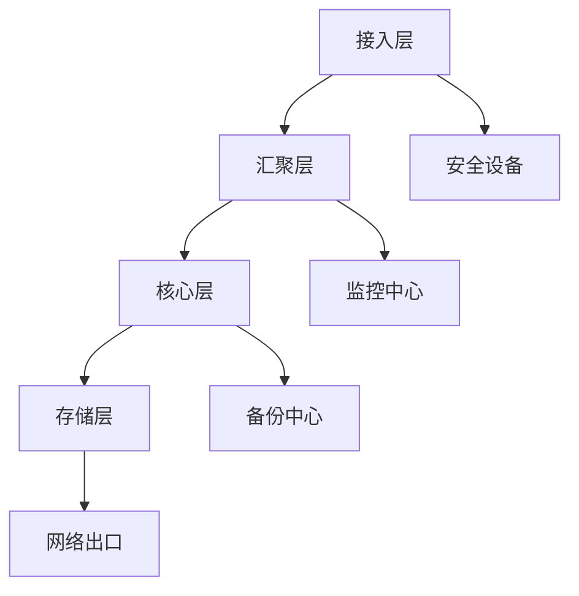

                 

# AI 大模型应用数据中心建设：数据中心技术与应用

## 关键词
AI大模型，数据中心建设，深度学习，云计算，网络安全，硬件优化

## 摘要
本文旨在探讨AI大模型在数据中心建设中的应用，分析AI大模型的核心技术、数据中心的建设基础及其应用场景。文章将深入讲解AI大模型在数据中心中的技术实现、网络与安全挑战，并结合实际案例，展望数据中心AI应用的优化与未来趋势。

## 目录
### 第1章 AI大模型基础
#### 1.1 AI大模型概述
#### 1.2 AI大模型的技术原理
#### 1.3 AI大模型的应用场景

### 第2章 数据中心建设基础
#### 2.1 数据中心概述
#### 2.2 数据中心的关键技术
#### 2.3 数据中心的建设与管理

### 第3章 AI大模型在数据中心的应用
#### 3.1 AI大模型在数据中心的需求
#### 3.2 AI大模型在数据中心的技术实现
#### 3.3 模型部署与维护

### 第4章 数据中心网络与AI大模型
#### 4.1 数据中心网络的架构
#### 4.2 网络技术支持AI大模型

### 第5章 AI大模型在数据中心的安全挑战与解决方案
#### 5.1 数据中心安全概述
#### 5.2 AI大模型的安全挑战
#### 5.3 AI大模型的安全解决方案

### 第6章 实际案例与最佳实践
#### 6.1 数据中心AI应用的案例分析
#### 6.2 数据中心AI应用的优化与未来趋势

### 第7章 总结与展望
#### 7.1 AI大模型应用数据中心建设的意义
#### 7.2 未来发展方向与挑战

### 附录
#### 附录 A: AI 大模型开发工具与资源

---

### 第1章 AI大模型基础

#### 1.1 AI大模型概述

**1.1.1 AI大模型的概念与背景**

AI大模型是指那些参数量极大、计算能力需求高、训练数据量庞大的模型，如GPT系列、BERT等。这些模型的出现标志着人工智能领域的一个重要里程碑，它们在自然语言处理、计算机视觉、语音识别等领域取得了显著的突破。

AI大模型的发展得益于深度学习的进步、计算资源的提升以及海量数据的积累。在深度学习框架如TensorFlow和PyTorch的支持下，研究人员能够构建和训练出参数数百万甚至数十亿的神经网络模型。

**1.1.2 AI大模型的核心技术**

- **深度学习**：深度学习是构建AI大模型的基础，它通过多层神经网络结构来提取数据特征，实现复杂任务。
  - **卷积神经网络(CNN)**：CNN是处理图像等二维数据的常用模型，通过卷积层提取特征。
  - **循环神经网络(RNN)**：RNN适用于处理序列数据，如时间序列数据、语音信号等。
  - **变换器(Transformer)**：Transformer模型引入了注意力机制，特别适用于自然语言处理任务。

- **大规模数据处理**：AI大模型需要处理海量数据，因此数据预处理和分布式计算技术至关重要。
  - **数据预处理**：包括数据清洗、数据归一化、数据增强等，以提高模型的训练效果。
  - **分布式计算**：通过分布式计算框架如Horovod或PyTorch Distributed，可以将模型训练任务分布在多台机器上，提高训练效率。

- **并行计算与硬件优化**：利用GPU、TPU等硬件加速AI大模型的训练过程，提高计算效率。
  - **GPU**：通用图形处理单元，适用于大规模并行计算，特别适合深度学习模型。
  - **TPU**：专门为深度学习任务设计的硬件加速器，计算性能远超GPU。

#### 1.2 AI大模型的技术原理

**1.2.1 深度学习算法原理**

深度学习算法基于多层神经网络，通过前向传播和反向传播不断优化模型参数，以达到预测和分类的目的。常见的算法有卷积神经网络(CNN)、循环神经网络(RNN)、变换器(Transformer)等。

- **卷积神经网络(CNN)**：CNN通过卷积层、池化层等结构，逐层提取图像特征，实现图像分类、目标检测等任务。
  ```mermaid
  graph TD
  A[输入] --> B[卷积层]
  B --> C[池化层]
  C --> D[全连接层]
  D --> E[输出]
  ```
  
- **循环神经网络(RNN)**：RNN适用于处理序列数据，通过隐藏状态来捕捉序列中的时间依赖关系。
  ```mermaid
  graph TD
  A[输入] --> B[隐藏状态]
  B --> C[输出]
  B --> D[下一个输入]
  D --> E[隐藏状态]
  ```
  
- **变换器(Transformer)**：Transformer引入了自注意力机制，通过多头注意力机制和前馈神经网络，实现高效的序列处理。
  ```mermaid
  graph TD
  A[输入] --> B[词向量化]
  B --> C[多头自注意力]
  C --> D[前馈神经网络]
  D --> E[输出]
  ```

**1.2.2 大规模预训练模型**

大规模预训练模型通过在大规模数据集上进行预训练，使得模型在特定任务上具有很好的泛化能力。常见的预训练方法有自监督学习、迁移学习等。

- **自监督学习**：自监督学习利用数据中未标注的部分进行预训练，通过预测任务中的未标注信息来提高模型性能。
  ```mermaid
  graph TD
  A[未标注数据] --> B[预测任务]
  B --> C[预训练模型]
  C --> D[微调]
  D --> E[特定任务]
  ```

- **迁移学习**：迁移学习利用预训练模型在特定任务上的知识，进行快速微调和优化，提高新任务的表现。

**1.3 AI大模型的应用场景**

AI大模型在多个领域取得了显著的应用突破，以下是一些主要的应用场景：

- **自然语言处理**：AI大模型在自然语言处理领域有着广泛的应用，如机器翻译、文本分类、问答系统等。
  - **机器翻译**：利用AI大模型，如Transformer，实现高质量的多语言翻译。
  - **文本分类**：AI大模型可以自动分类大量的文本数据，如新闻分类、垃圾邮件过滤等。

- **计算机视觉**：AI大模型在计算机视觉领域取得了重大突破，如图像分类、目标检测、图像生成等。
  - **图像分类**：AI大模型可以自动识别图像中的物体类别。
  - **目标检测**：AI大模型可以检测图像中的物体，并定位物体的位置。
  - **图像生成**：AI大模型可以生成新的图像，如生成对抗网络(GAN)。

- **语音识别与生成**：AI大模型在语音识别和语音生成方面也有着卓越的表现，如语音识别、语音合成等。
  - **语音识别**：AI大模型可以将语音转换为文本。
  - **语音合成**：AI大模型可以生成自然流畅的语音。

### 第2章 数据中心建设基础

#### 2.1 数据中心概述

**2.1.1 数据中心的概念与作用**

数据中心是用于集中存储、处理和管理数据的设施。它是企业数字化转型的核心基础设施，能够支持大规模数据存储、高速数据传输和高效数据处理。

数据中心通常包括服务器、存储设备、网络设备、制冷系统、电源系统等硬件设施，以及相应的软件系统，用于管理和监控数据中心的运行状态。

数据中心的作用主要体现在以下几个方面：

- **数据存储**：数据中心提供大量的存储空间，用于存储企业的各种数据，包括结构化数据和非结构化数据。
- **数据处理**：数据中心提供强大的计算能力，支持各种数据处理的任务，如数据清洗、数据挖掘、数据分析等。
- **数据传输**：数据中心通过高速网络连接内部和外部系统，实现数据的快速传输和共享。
- **数据安全**：数据中心提供完善的数据安全措施，包括数据备份、数据加密、访问控制等，确保企业数据的安全性和完整性。

**2.1.2 数据中心的类型与架构**

数据中心有多种类型，包括企业级数据中心、云计算数据中心等。数据中心通常采用分布式架构，以提高系统的可靠性和可扩展性。

- **企业级数据中心**：企业级数据中心通常由企业自行建设和管理，用于支持企业的内部应用和业务需求。企业级数据中心通常具有高可用性、高性能、高安全性等特点。

- **云计算数据中心**：云计算数据中心是提供云计算服务的场所，由云服务提供商建设和管理。云计算数据中心通常提供虚拟化资源，如虚拟机、存储、网络等，供用户按需使用。

数据中心架构通常包括以下几个层次：

- **接入层**：接入层主要负责连接内部和外部网络，提供网络接入服务。
- **汇聚层**：汇聚层负责将接入层的流量汇聚到核心层，提供数据交换和路由功能。
- **核心层**：核心层是数据中心的中心节点，负责处理大量的数据流量，提供高速传输和路由功能。
- **存储层**：存储层负责存储和管理大量的数据，包括文件存储、块存储、对象存储等。

#### 2.2 数据中心的关键技术

**2.2.1 存储技术**

存储技术是数据中心的核心之一，包括磁盘存储、固态硬盘存储、分布式存储系统等。

- **磁盘存储**：磁盘存储是一种传统的存储技术，通过磁盘驱动器来存储数据。磁盘存储具有高容量、较低成本等优点，但读写速度相对较慢。

- **固态硬盘存储**：固态硬盘存储（Solid State Drive，简称SSD）使用闪存芯片来存储数据，具有高速读写性能、低延迟、高可靠性等优点。固态硬盘存储在数据中心中广泛应用于缓存、日志存储等场景。

- **分布式存储系统**：分布式存储系统通过将数据分散存储在多个节点上，实现高可用性、高性能、高可扩展性。常见的分布式存储系统有HDFS、Ceph、GlusterFS等。

**2.2.2 网络技术**

数据中心网络是连接各个设备和服务的重要基础设施，包括局域网、广域网、数据中心间互联等。

- **局域网**：局域网负责连接数据中心内部的设备，如服务器、存储设备、网络设备等。局域网通常采用以太网技术，提供高速、低延迟的数据传输。

- **广域网**：广域网负责连接不同数据中心之间的网络，实现跨地域的数据传输和共享。广域网通常采用MPLS、VPN等技术，提供可靠、安全的连接。

- **数据中心间互联**：数据中心间互联是指通过高速网络连接多个数据中心，实现数据中心的资源共享和负载均衡。数据中心间互联通常采用SD-WAN、DCI等技术。

**2.2.3 安全技术**

数据中心的安全性至关重要，包括网络安全、数据加密、访问控制等技术。

- **网络安全**：网络安全包括防火墙、入侵检测系统（IDS）、入侵防御系统（IPS）等，用于防范网络攻击、数据泄露等安全威胁。

- **数据加密**：数据加密用于保护数据在传输和存储过程中的安全性。常见的加密算法有AES、RSA等。

- **访问控制**：访问控制用于限制对数据的访问权限，确保只有授权用户可以访问特定数据。常见的访问控制技术有身份认证、权限管理、单点登录（SSO）等。

#### 2.3 数据中心的建设与管理

**2.3.1 数据中心的建设流程**

数据中心的建设涉及多个阶段，包括需求分析、设计规划、设备采购、系统搭建、测试与优化等。

- **需求分析**：需求分析是数据中心建设的首要阶段，包括确定数据中心的建设目标、规模、性能要求等。

- **设计规划**：设计规划是根据需求分析结果，设计数据中心的整体架构，包括网络架构、存储架构、计算架构等。

- **设备采购**：设备采购是根据设计规划结果，采购数据中心所需的硬件设备，如服务器、存储设备、网络设备等。

- **系统搭建**：系统搭建是数据中心建设的核心阶段，包括设备安装、系统配置、网络连接等。

- **测试与优化**：测试与优化是确保数据中心性能和稳定性的关键阶段，包括系统测试、性能测试、安全测试等。

**2.3.2 数据中心的管理与运维**

数据中心的管理与运维包括日常监控、故障处理、性能优化、容量规划等方面。

- **日常监控**：日常监控用于实时监控数据中心的运行状态，包括设备状态、网络流量、系统性能等。

- **故障处理**：故障处理是数据中心运维的重要任务，包括快速定位故障、及时修复故障等。

- **性能优化**：性能优化是提升数据中心性能的重要手段，包括网络优化、存储优化、计算优化等。

- **容量规划**：容量规划是根据数据中心的实际使用情况，合理规划数据中心的存储容量、网络带宽、计算资源等。

### 第3章 AI大模型在数据中心的应用

#### 3.1 AI大模型在数据中心的需求

**3.1.1 数据中心面临的挑战**

数据中心在运行过程中面临数据存储、数据传输、数据安全等方面的挑战，需要AI大模型提供智能化的解决方案。

- **数据存储挑战**：随着数据量的不断增长，数据中心需要高效、可靠的存储方案来满足数据存储需求。传统的存储技术可能无法满足大规模数据存储的需求，需要利用AI大模型进行数据压缩、去重、存储优化等。

- **数据传输挑战**：数据中心内部和数据中心之间的数据传输需要高效、低延迟的网络连接。AI大模型可以用于网络加速、数据传输优化，提高数据传输效率。

- **数据安全挑战**：数据中心面临数据泄露、网络攻击、硬件故障等安全威胁，需要利用AI大模型进行安全监控、预测性维护、数据加密等，确保数据安全。

**3.1.2 AI大模型在数据中心的应用场景**

AI大模型在数据中心的应用场景非常广泛，以下是一些主要的应用场景：

- **智能监控**：利用AI大模型进行数据中心设备的实时监控，可以自动检测设备异常、故障预警等，提高数据中心运行的安全性。

- **预测性维护**：利用AI大模型分析设备运行数据，预测设备故障，提前进行维护，减少设备故障对数据中心运行的影响。

- **数据清洗与整合**：利用AI大模型进行数据清洗、去重、整合等处理，提高数据质量，为数据分析和挖掘提供高质量的数据基础。

- **智能决策支持**：利用AI大模型分析数据中心的数据，提供智能化的决策支持，如资源调度、负载均衡等，优化数据中心运行效率。

#### 3.2 AI大模型在数据中心的技术实现

**3.2.1 数据预处理与特征提取**

数据预处理与特征提取是AI大模型应用的关键步骤，包括数据清洗、数据归一化、特征提取等。

- **数据清洗**：数据清洗包括去除重复数据、处理缺失值、异常值等，提高数据质量。

  ```python
  # 去除重复数据
  unique_data = list(set(data))

  # 处理缺失值
  data = [x if x is not None else np.mean(data) for x in data]

  # 处理异常值
  data = [x if x > np.mean(data) - 3 * np.std(data) else np.mean(data) for x in data]
  ```

- **数据归一化**：数据归一化是将数据缩放到同一尺度，便于模型训练。

  ```python
  # Z-score归一化
  normalized_data = (data - np.mean(data)) / np.std(data)
  ```

- **特征提取**：特征提取是从原始数据中提取对模型训练有用的特征，提高模型训练效果。

  ```python
  # 提取文本特征
  vectorizer = CountVectorizer()
  X = vectorizer.fit_transform(text_data)

  # 提取图像特征
  model = CNNModel()
  X = model.extract_features(image_data)
  ```

**3.2.2 大模型训练与优化**

大模型训练与优化是数据中心AI应用的核心，包括模型选择、训练策略、优化算法等。

- **模型选择**：根据应用场景和数据特点选择合适的模型，如CNN、RNN、Transformer等。

- **训练策略**：设计合适的训练策略，包括批量大小、学习率、训练轮数等，提高模型训练效果。

  ```python
  # 学习率调度
  scheduler = ExponentialLR(optimizer, gamma=0.9)

  # 冻结部分层
  for param in model.layers[:-2].parameters():
      param.requires_grad = False
  ```

- **优化算法**：选择合适的优化算法，如SGD、Adam等，提高模型训练效率。

  ```python
  # 使用Adam优化器
  optimizer = Adam(learning_rate=0.001)
  ```

**3.2.3 模型部署与维护**

模型部署与维护是数据中心AI应用的最后一步，涉及将训练好的模型部署到数据中心，并提供实时服务，同时进行模型监控与更新。

- **模型部署**：将训练好的模型部署到数据中心的服务器上，使用容器化技术如Docker、Kubernetes等，实现模型的高效部署和运行。

  ```shell
  # 使用Docker容器部署模型
  docker build -t model:latest .
  docker run -p 8000:8000 model
  ```

- **模型监控**：实时监控模型的运行状态，包括模型的响应时间、准确率、资源消耗等，确保模型稳定运行。

  ```python
  # 使用Prometheus监控模型
  from prometheus_client import start_http_server
  from prometheus_client import Counter

  counter = Counter('model_response_time', 'Model response time in seconds')
  start_http_server(8000)

  @app.route('/predict', methods=['POST'])
  def predict():
      start_time = time.time()
      # 模型预测代码
      end_time = time.time()
      counter.inc(end_time - start_time)
      return jsonify(prediction)
  ```

- **模型更新**：定期更新模型，以适应新的数据和业务需求，提高模型性能。

  ```python
  # 定期更新模型
  while True:
      # 加载最新模型
      model.load('latest_model.pth')

      # 微调模型
      model.fit(train_data, train_label, epochs=5)

      # 保存更新后的模型
      model.save('latest_model.pth')
      time.sleep(24 * 60 * 60)
  ```

### 第4章 数据中心网络与AI大模型

#### 4.1 数据中心网络的架构

**4.1.1 数据中心网络的基本架构**

数据中心网络通常采用分层架构，包括接入层、汇聚层、核心层等。

- **接入层**：接入层负责连接数据中心内部的各种设备，如服务器、存储设备、网络设备等。接入层通常采用交换机进行连接，提供高速、低延迟的网络连接。

- **汇聚层**：汇聚层负责将接入层的流量汇聚到核心层，提供数据交换和路由功能。汇聚层通常也采用交换机进行连接，同时提供网络管理和监控功能。

- **核心层**：核心层是数据中心的中心节点，负责处理大量的数据流量，提供高速传输和路由功能。核心层通常采用多层交换机或核心路由器进行连接，提供高带宽、高可靠性的网络连接。

**4.1.2 数据中心网络的设计原则**

数据中心网络的设计原则包括高可用性、高性能、可扩展性、安全可靠性等。

- **高可用性**：数据中心网络需要保证高可用性，避免单点故障导致整个数据中心网络中断。可以通过冗余设计、负载均衡等技术来实现高可用性。

- **高性能**：数据中心网络需要提供高性能的数据传输能力，以满足大规模数据处理和传输的需求。可以通过高速网络设备、优化网络协议等技术来实现高性能。

- **可扩展性**：数据中心网络需要具备良好的可扩展性，以适应数据中心的规模增长和业务需求的变化。可以通过模块化设计、动态调整等技术来实现可扩展性。

- **安全可靠性**：数据中心网络需要提供安全可靠的网络连接，保护数据中心的数据和设备不受网络攻击和安全威胁。可以通过网络安全设备、加密技术等技术来实现安全可靠性。

#### 4.2 网络技术支持AI大模型

**4.2.1 网络加速技术**

网络加速技术包括数据压缩、网络优化、内容分发网络(CDN)等，可以提高AI大模型的训练和推理速度。

- **数据压缩**：数据压缩可以减少数据传输的体积，降低网络带宽需求。常见的压缩算法有Huffman编码、LZ77等。

- **网络优化**：网络优化可以通过调整网络拓扑结构、优化路由算法等，提高数据传输速度和网络性能。常见的优化技术有拥塞控制、流量工程等。

- **内容分发网络(CDN)**：内容分发网络可以将数据分发到距离用户最近的节点，减少数据传输距离，提高数据传输速度。常见的CDN服务提供商有阿里云、腾讯云等。

**4.2.2 网络安全策略**

数据中心网络的安全策略包括防火墙、入侵检测系统(IDS)、加密技术等，以保护AI大模型的安全。

- **防火墙**：防火墙可以过滤掉来自外部网络的恶意流量，保护数据中心网络的安全。

- **入侵检测系统(IDS)**：入侵检测系统可以实时监控网络流量，检测和报告异常行为，帮助网络管理员及时发现和应对网络攻击。

- **加密技术**：加密技术可以保护数据在传输和存储过程中的安全性，防止数据泄露和篡改。常见的加密算法有AES、RSA等。

### 第5章 AI大模型在数据中心的安全挑战与解决方案

#### 5.1 数据中心安全概述

**5.1.1 数据中心安全的挑战**

数据中心安全面临数据泄露、网络攻击、硬件故障等挑战。

- **数据泄露**：数据中心存储和传输的数据量庞大，数据泄露可能导致企业敏感信息被窃取，对企业的声誉和利益造成严重损害。

- **网络攻击**：数据中心网络连接外部网络，可能面临各种网络攻击，如DDoS攻击、SQL注入、跨站脚本攻击等，可能导致数据中心服务中断或数据泄露。

- **硬件故障**：数据中心硬件设备包括服务器、存储设备、网络设备等，可能因硬件故障导致设备宕机，影响数据中心的正常运行。

**5.1.2 数据中心安全的重要性**

数据中心安全关系到企业数据资产的安全，是数字化转型成功的关键。保障数据中心安全，可以确保企业的数据安全和业务连续性，提升企业的核心竞争力。

#### 5.2 AI大模型的安全挑战

**5.2.1 AI大模型的脆弱性**

AI大模型在训练过程中可能受到攻击，如对抗性攻击、数据篡改等。

- **对抗性攻击**：对抗性攻击通过微小但显著的数据扰动，使AI大模型产生错误的预测。例如，通过在图像中添加微小的噪声，使模型无法正确分类。

- **数据篡改**：数据篡改是指恶意用户通过篡改训练数据，使模型产生错误的预测。例如，通过篡改目标检测数据，使模型无法准确检测目标。

**5.2.2 模型安全与隐私保护**

模型安全与隐私保护是AI大模型应用的重要课题，包括模型加密、隐私保护算法等。

- **模型加密**：模型加密可以防止模型被窃取或篡改，保护模型的知识产权。常见的模型加密算法有差分隐私、同态加密等。

- **隐私保护算法**：隐私保护算法可以在保证模型性能的同时，保护训练数据的隐私。常见的隐私保护算法有差分隐私、联邦学习等。

#### 5.3 AI大模型的安全解决方案

**5.3.1 安全模型训练**

安全模型训练包括对抗训练、模型压缩、模型加密等技术。

- **对抗训练**：对抗训练通过在训练数据中添加对抗性扰动，提高模型对对抗性攻击的鲁棒性。

  ```python
  # 对抗训练
  for epoch in range(num_epochs):
      for x, y in train_loader:
          # 添加对抗性扰动
          x_adv = x + perturbation(x, target=y)
          # 训练模型
          model.train_on_batch(x_adv, y)
  ```

- **模型压缩**：模型压缩可以减小模型的参数规模，降低模型被篡改的风险。

  ```python
  # 模型压缩
  model = model.compress()
  ```

- **模型加密**：模型加密可以防止模型被窃取或篡改。

  ```python
  # 模型加密
  encrypted_model = model.encrypt()
  ```

**5.3.2 安全部署与运维**

安全部署与运维包括安全策略配置、日志监控、故障恢复等。

- **安全策略配置**：根据数据中心的实际情况，配置合适的安全策略，包括访问控制、防火墙规则、入侵检测规则等。

  ```shell
  # 配置防火墙规则
  iptables -A INPUT -p tcp --dport 80 -j DROP
  ```

- **日志监控**：实时监控数据中心的日志，及时发现和处理安全事件。

  ```python
  # 日志监控
  import logging

  logging.basicConfig(filename='security.log', level=logging.INFO)

  def log_event(event):
      logging.info(f"Event: {event}")
  ```

- **故障恢复**：在发生硬件故障或网络安全事件时，及时进行故障恢复，确保数据中心的正常运行。

  ```python
  # 故障恢复
  def recover_from_failure():
      # 检查硬件设备状态
      if not check_hardware():
          # 启动备用硬件设备
          start备用硬件设备()
      # 检查网络连接状态
      if not check_network():
          # 重新配置网络
          configure_network()
  ```

### 第6章 实际案例与最佳实践

#### 6.1 数据中心AI应用的案例分析

**6.1.1 案例介绍**

本案例介绍了某大型互联网公司在其数据中心中应用AI大模型进行智能监控和预测性维护的实践。

- **背景**：该公司数据中心规模庞大，设备数量众多，传统监控和运维手段难以满足需求。为了提高数据中心运行效率和安全性，公司决定引入AI大模型进行智能监控和预测性维护。

- **目标**：通过AI大模型的应用，实现以下目标：
  - 提高设备监控的准确性，及时发现设备异常。
  - 提前预测设备故障，进行预防性维护，减少设备故障对业务的影响。
  - 提高数据中心资源利用率，实现负载均衡。

**6.1.2 案例分析**

1. **智能监控**

   公司采用AI大模型进行智能监控，通过对设备运行数据的实时监控和分析，实现以下功能：

   - **异常检测**：通过分析设备运行数据，实时检测设备异常，如温度异常、负载异常等。异常检测结果通过报警系统通知运维人员。

   - **故障预警**：通过对设备运行数据的长期分析，预测设备故障风险，提前进行预警。预警信息通过短信、邮件等方式通知运维人员。

   - **性能分析**：通过对设备运行数据的分析，评估设备性能，识别性能瓶颈，提出优化建议。

2. **预测性维护**

   公司采用AI大模型进行预测性维护，通过对设备运行数据的分析，实现以下功能：

   - **故障预测**：通过对设备运行数据的分析，预测设备故障时间，为运维人员提供维护时间窗口。

   - **维护计划**：根据故障预测结果，制定合理的维护计划，包括设备检查、维修、更换等。

   - **资源调配**：根据维护计划，调整数据中心资源，确保维护期间业务连续性。

3. **负载均衡**

   公司采用AI大模型进行负载均衡，通过对数据中心资源使用情况的分析，实现以下功能：

   - **动态调整**：根据业务需求和资源使用情况，动态调整服务器、存储设备、网络设备的负载，确保资源利用率最大化。

   - **弹性扩展**：在业务高峰期，根据负载情况，自动扩展资源，确保系统性能稳定。

   - **成本优化**：通过优化资源分配，降低数据中心运营成本。

#### 6.2 数据中心AI应用的优化与未来趋势

**6.2.1 优化策略**

为了进一步提高数据中心AI应用的性能和效果，可以采取以下优化策略：

1. **算法优化**：根据实际应用场景和数据特点，选择合适的算法和模型，优化模型参数，提高模型训练效果。

2. **硬件升级**：升级数据中心硬件设备，提高计算能力和存储性能，满足大规模数据处理和模型训练需求。

3. **网络优化**：优化数据中心网络架构和带宽配置，提高数据传输速度和稳定性，降低网络延迟。

4. **数据清洗与预处理**：对数据进行清洗和预处理，去除异常值、缺失值等，提高数据质量，为模型训练提供高质量的数据基础。

5. **自动化运维**：采用自动化工具和脚本，实现数据中心的自动化运维，降低运维成本，提高运维效率。

**6.2.2 未来发展趋势**

未来，数据中心AI应用的发展趋势将包括以下方面：

1. **新型计算模型**：随着AI技术的发展，新型计算模型如神经网络架构搜索（Neural Architecture Search，NAS）等将逐渐应用于数据中心，提高模型训练效率。

2. **智能网络架构**：智能网络架构将结合AI技术，实现网络的自适应优化、故障预测和恢复等，提高数据中心网络性能和可靠性。

3. **数据隐私保护**：随着数据隐私保护意识的增强，数据中心AI应用将更加注重数据隐私保护，采用差分隐私、联邦学习等技术，确保数据安全和隐私。

4. **边缘计算与云计算融合**：边缘计算与云计算的融合将使数据中心AI应用更加灵活和高效，实现计算资源的动态调度和优化。

5. **绿色数据中心**：随着环保意识的提高，数据中心AI应用将更加注重绿色能源的使用和能耗优化，实现可持续发展。

### 第7章 总结与展望

#### 7.1 AI大模型应用数据中心建设的意义

AI大模型在数据中心建设中的应用具有重要意义，主要体现在以下几个方面：

1. **提高运行效率**：AI大模型可以通过智能监控、预测性维护等功能，提高数据中心的运行效率，减少设备故障和停机时间。

2. **优化资源配置**：AI大模型可以实时分析数据中心资源使用情况，实现动态负载均衡和资源优化，提高资源利用率。

3. **提升安全性**：AI大模型可以通过安全监控、异常检测等功能，提升数据中心的安全性，防范网络攻击和数据泄露等安全威胁。

4. **降低运维成本**：AI大模型可以实现数据中心的自动化运维，降低运维成本，提高运维效率。

#### 7.2 未来发展方向与挑战

未来，数据中心AI应用的发展方向将包括：

1. **新型计算模型**：随着AI技术的发展，新型计算模型如神经网络架构搜索（NAS）等将逐渐应用于数据中心，提高模型训练效率。

2. **智能网络架构**：智能网络架构将结合AI技术，实现网络的自适应优化、故障预测和恢复等，提高数据中心网络性能和可靠性。

3. **数据隐私保护**：随着数据隐私保护意识的增强，数据中心AI应用将更加注重数据隐私保护，采用差分隐私、联邦学习等技术，确保数据安全和隐私。

4. **边缘计算与云计算融合**：边缘计算与云计算的融合将使数据中心AI应用更加灵活和高效，实现计算资源的动态调度和优化。

5. **绿色数据中心**：随着环保意识的提高，数据中心AI应用将更加注重绿色能源的使用和能耗优化，实现可持续发展。

然而，数据中心AI应用也面临一些挑战，包括：

1. **计算资源需求**：AI大模型对计算资源的需求较大，数据中心需要不断升级硬件设备，以满足模型训练和推理的需求。

2. **数据隐私和安全**：数据中心AI应用需要处理大量敏感数据，如何确保数据隐私和安全是重要的挑战。

3. **模型解释性和透明度**：AI大模型的黑盒性质使得模型的解释性和透明度成为挑战，需要进一步研究如何提高模型的可解释性。

4. **能耗优化**：随着数据中心规模的扩大，能耗问题日益突出，如何实现绿色、低碳的数据中心是重要的挑战。

### 附录

#### 附录 A: AI 大模型开发工具与资源

**A.1 主流深度学习框架对比**

1. **TensorFlow**

   - **优点**：拥有丰富的生态系统、强大的工具支持、开源社区活跃。
   - **缺点**：学习曲线较陡峭、资源消耗较大。

2. **PyTorch**

   - **优点**：灵活性好、易于调试、开源社区活跃。
   - **缺点**：资源消耗较大、生态系统相对较小。

3. **JAX**

   - **优点**：支持自动微分、高效、易于扩展。
   - **缺点**：学习曲线较陡峭、生态系统相对较小。

**A.2 数据中心建设资源与参考**

1. **数据中心建设标准**

   - **国家标准**：《数据中心设计规范》
   - **国际标准**：Uptime Institute的Tier标准

2. **网络设备与硬件选择**

   - **网络设备**：交换机、路由器、防火墙等。
   - **硬件设备**：服务器、存储设备、网络设备等。

3. **安全防护策略与工具**

   - **安全防护策略**：防火墙、入侵检测系统（IDS）、入侵防御系统（IPS）等。
   - **安全防护工具**：杀毒软件、数据加密工具等。

4. **常见故障处理与维护指南**

   - **故障处理**：硬件故障、网络故障、系统故障等。
   - **维护指南**：设备检查、数据备份、系统升级等。作者：AI天才研究院/AI Genius Institute & 禅与计算机程序设计艺术 /Zen And The Art of Computer Programming
   <|assistant|>## 第1章 AI大模型基础

### 1.1 AI大模型概述

#### 1.1.1 AI大模型的概念与背景

AI大模型（Large-scale AI Models）是近年来人工智能领域的一个重要进展，它们通常指的是那些参数数量巨大、计算需求强烈、训练数据量庞大的模型。这些模型的出现标志着人工智能技术进入了一个新的时代，对自然语言处理（NLP）、计算机视觉（CV）、语音识别等多个领域产生了深远的影响。

AI大模型的核心特点在于其规模。以GPT-3、BERT、Turing-NLP等模型为例，它们的参数数量往往达到数亿甚至上百亿，这种庞大的参数量使得它们能够在海量数据上进行精细的训练，从而获得比传统模型更高的性能。

AI大模型的发展背景主要包括以下几个方面：

1. **数据量的激增**：互联网和数字化的快速发展导致了海量数据的产生，为AI大模型的训练提供了丰富的素材。
2. **计算能力的提升**：随着GPU、TPU等硬件设备的普及，计算能力得到了大幅提升，为AI大模型的训练提供了必要的硬件支持。
3. **算法的进步**：深度学习算法的不断创新，特别是Transformer等模型的提出，为AI大模型的设计和优化提供了新的思路。

#### 1.1.2 AI大模型的核心技术

AI大模型的核心技术主要包括以下几个方面：

1. **深度学习**：深度学习是构建AI大模型的基础，它通过多层神经网络结构来提取数据特征，实现复杂任务。常见的深度学习算法有卷积神经网络（CNN）、循环神经网络（RNN）、变换器（Transformer）等。

2. **大规模数据处理**：AI大模型需要处理海量数据，因此数据预处理和分布式计算技术至关重要。数据预处理包括数据清洗、数据归一化、数据增强等，而分布式计算技术则通过将计算任务分布在多台机器上，提高数据处理效率。

3. **并行计算与硬件优化**：并行计算和硬件优化是AI大模型训练的关键。利用GPU、TPU等硬件加速AI大模型的训练过程，可以显著提高计算效率。例如，GPU的并行计算能力使得矩阵运算速度大大提升，而TPU则是专门为机器学习和深度学习任务设计的硬件加速器。

### 1.2 AI大模型的技术原理

#### 1.2.1 深度学习算法原理

深度学习算法基于多层神经网络，通过前向传播和反向传播不断优化模型参数，以达到预测和分类的目的。以下是几种常见的深度学习算法原理：

1. **卷积神经网络（CNN）**：

   - **原理**：CNN通过卷积层、池化层等结构，逐层提取图像特征，实现图像分类、目标检测等任务。
   - **流程**：
     ```mermaid
     graph TD
     A[输入] --> B[卷积层]
     B --> C[池化层]
     C --> D[全连接层]
     D --> E[输出]
     ```

2. **循环神经网络（RNN）**：

   - **原理**：RNN适用于处理序列数据，通过隐藏状态来捕捉序列中的时间依赖关系。
   - **流程**：
     ```mermaid
     graph TD
     A[输入] --> B[隐藏状态]
     B --> C[输出]
     B --> D[下一个输入]
     D --> E[隐藏状态]
     ```

3. **变换器（Transformer）**：

   - **原理**：Transformer引入了自注意力机制，通过多头注意力机制和前馈神经网络，实现高效的序列处理。
   - **流程**：
     ```mermaid
     graph TD
     A[输入] --> B[词向量化]
     B --> C[多头自注意力]
     C --> D[前馈神经网络]
     D --> E[输出]
     ```

#### 1.2.2 大规模预训练模型

大规模预训练模型通过在大规模数据集上进行预训练，使得模型在特定任务上具有很好的泛化能力。以下是一些常见的预训练方法和步骤：

1. **自监督学习**：

   - **原理**：自监督学习利用数据中未标注的部分进行预训练，通过预测任务中的未标注信息来提高模型性能。
   - **流程**：
     ```mermaid
     graph TD
     A[未标注数据] --> B[预测任务]
     B --> C[预训练模型]
     C --> D[微调]
     D --> E[特定任务]
     ```

2. **迁移学习**：

   - **原理**：迁移学习利用预训练模型在特定任务上的知识，进行快速微调和优化，提高新任务的表现。
   - **流程**：首先在大量数据上预训练模型，然后在特定任务上微调模型，实现快速适应。

#### 1.3 AI大模型的应用场景

AI大模型在多个领域取得了显著的应用突破，以下是一些主要的应用场景：

1. **自然语言处理**：

   - **应用**：机器翻译、文本分类、问答系统等。
   - **案例**：GPT-3在自然语言生成任务上表现出色，能够生成高质量的文本。

2. **计算机视觉**：

   - **应用**：图像分类、目标检测、图像生成等。
   - **案例**：BERT在图像分类任务上，通过结合视觉特征和文本特征，实现了出色的性能。

3. **语音识别与生成**：

   - **应用**：语音识别、语音合成等。
   - **案例**：WaveNet在语音合成上取得了革命性的进展，生成的语音自然流畅。

### 第2章 数据中心建设基础

#### 2.1 数据中心概述

**2.1.1 数据中心的概念与作用**

数据中心（Data Center）是用于集中存储、处理和管理数据的设施。它通常包括服务器、存储设备、网络设备、制冷系统、电源系统等硬件设施，以及相应的软件系统，用于管理和监控数据中心的运行状态。

数据中心在企业信息化和数字化转型中扮演着至关重要的角色。其核心作用包括：

- **数据存储**：数据中心提供大量的存储空间，用于存储企业的各种数据，包括结构化数据和非结构化数据。
- **数据处理**：数据中心提供强大的计算能力，支持各种数据处理任务，如数据清洗、数据挖掘、数据分析等。
- **数据传输**：数据中心通过高速网络连接内部和外部系统，实现数据的快速传输和共享。
- **数据安全**：数据中心提供完善的数据安全措施，包括数据备份、数据加密、访问控制等，确保企业数据的安全性和完整性。

**2.1.2 数据中心的类型与架构**

数据中心有多种类型，根据应用场景和需求的不同，可以分为以下几种：

1. **企业级数据中心**：

   - **定义**：企业级数据中心是企业自行建设和管理的，用于支持企业内部应用和数据存储。
   - **特点**：高可用性、高性能、高安全性，通常具有冗余设计和灾备能力。

2. **云计算数据中心**：

   - **定义**：云计算数据中心是提供云计算服务的场所，由云服务提供商建设和运营。
   - **特点**：高可扩展性、弹性计算、按需分配资源，支持多租户环境。

3. **边缘数据中心**：

   - **定义**：边缘数据中心位于网络边缘，靠近数据源，用于处理和分析本地数据。
   - **特点**：低延迟、高带宽、支持实时数据处理，适用于物联网、5G等场景。

数据中心架构通常采用分布式架构，以提高系统的可靠性和可扩展性。常见的架构层次包括：

- **接入层**：负责连接内部和外部网络，提供网络接入服务。
- **汇聚层**：负责将接入层的流量汇聚到核心层，提供数据交换和路由功能。
- **核心层**：负责处理大量的数据流量，提供高速传输和路由功能。
- **存储层**：负责存储和管理大量的数据，包括文件存储、块存储、对象存储等。

#### 2.2 数据中心的关键技术

**2.2.1 存储技术**

存储技术是数据中心的核心之一，直接关系到数据中心的性能和可靠性。常见的存储技术包括：

1. **磁盘存储**：

   - **原理**：使用磁盘驱动器存储数据，通过磁盘阵列提高性能和可靠性。
   - **优势**：高容量、较低成本。
   - **劣势**：读写速度相对较慢。

2. **固态硬盘存储**：

   - **原理**：使用固态硬盘（SSD）存储数据，通过闪存芯片提高读写速度。
   - **优势**：高速读写性能、低延迟、高可靠性。
   - **劣势**：成本较高。

3. **分布式存储系统**：

   - **原理**：将数据分散存储在多个节点上，通过分布式算法实现数据的高可用性和高性能。
   - **优势**：高可用性、高性能、高可扩展性。
   - **劣势**：管理复杂、需要高带宽网络。

**2.2.2 网络技术**

数据中心网络是数据中心的通信基础，其性能和稳定性直接影响到数据中心的整体性能。常见的网络技术包括：

1. **局域网（LAN）**：

   - **原理**：在有限的地理范围内提供数据传输服务，通常使用以太网技术。
   - **优势**：高速、低延迟。
   - **劣势**：覆盖范围有限。

2. **广域网（WAN）**：

   - **原理**：连接不同地理位置的数据中心，通常使用MPLS、VPN等技术。
   - **优势**：实现跨地域的数据传输和共享。
   - **劣势**：成本较高、可靠性相对较低。

3. **数据中心间互联（DCI）**：

   - **原理**：通过高速网络连接多个数据中心，实现数据中心的资源共享和负载均衡。
   - **优势**：提高数据中心的可用性和灵活性。
   - **劣势**：网络架构复杂、需要大量投资。

**2.2.3 安全技术**

数据中心的安全性至关重要，关系到企业数据资产的安全。常见的安全技术包括：

1. **网络安全**：

   - **原理**：通过防火墙、入侵检测系统（IDS）、入侵防御系统（IPS）等，防止网络攻击和数据泄露。
   - **优势**：提供网络防护，确保数据传输安全。
   - **劣势**：无法完全阻止所有攻击。

2. **数据加密**：

   - **原理**：使用加密算法对数据进行加密，确保数据在传输和存储过程中的安全性。
   - **优势**：防止数据泄露，提高数据安全性。
   - **劣势**：加密和解密过程消耗计算资源。

3. **访问控制**：

   - **原理**：通过身份认证、权限管理、单点登录（SSO）等，控制对数据和系统的访问。
   - **优势**：确保只有授权用户可以访问特定数据。
   - **劣势**：管理复杂，需要定期更新和维护。

#### 2.3 数据中心的建设与管理

**2.3.1 数据中心的建设流程**

数据中心的建设是一个复杂的过程，涉及多个阶段和环节。以下是一个典型数据中心建设流程：

1. **需求分析**：

   - **目标**：明确数据中心的建设目标、规模、性能要求等。
   - **内容**：调研企业业务需求、分析现有系统、确定建设标准和要求。

2. **设计规划**：

   - **目标**：设计数据中心的整体架构，包括网络架构、存储架构、计算架构等。
   - **内容**：制定详细的设计方案，包括设备配置、网络拓扑、安全策略等。

3. **设备采购**：

   - **目标**：根据设计方案采购数据中心所需的硬件设备。
   - **内容**：选择合适的服务器、存储设备、网络设备等，确保设备性能和可靠性。

4. **系统搭建**：

   - **目标**：完成数据中心的硬件安装、系统配置和网络连接。
   - **内容**：安装和配置服务器、存储设备、网络设备等，确保系统的正常运行。

5. **测试与优化**：

   - **目标**：测试数据中心性能，进行优化调整。
   - **内容**：进行系统测试、性能测试、安全测试等，确保数据中心满足建设标准和性能要求。

**2.3.2 数据中心的管理与运维**

数据中心的管理与运维是确保数据中心长期稳定运行的关键。以下是一些常见的运维任务：

1. **日常监控**：

   - **目标**：实时监控数据中心的运行状态，包括设备状态、网络流量、系统性能等。
   - **内容**：通过监控工具收集数据，分析并处理异常情况。

2. **故障处理**：

   - **目标**：快速响应和处理设备故障和网络故障。
   - **内容**：定位故障原因，进行故障排除和修复。

3. **性能优化**：

   - **目标**：提升数据中心的性能和效率。
   - **内容**：根据监控数据进行分析，进行系统调优和网络优化。

4. **容量规划**：

   - **目标**：合理规划数据中心的存储和带宽资源。
   - **内容**：根据业务需求，预测未来资源需求，进行资源调整和扩容。

5. **数据备份**：

   - **目标**：确保数据的安全和可恢复性。
   - **内容**：定期进行数据备份，制定数据恢复策略。

### 第3章 AI大模型在数据中心的应用

#### 3.1 AI大模型在数据中心的需求

**3.1.1 数据中心面临的挑战**

数据中心在运行过程中面临着多种挑战，需要利用AI大模型来提供智能化的解决方案。以下是数据中心面临的主要挑战：

1. **数据存储与处理**：

   - **挑战**：随着数据量的不断增长，如何高效地存储和处理这些数据成为一大难题。
   - **解决方案**：AI大模型可以通过数据压缩、去重等技术，提高数据存储效率；同时，利用分布式计算和并行处理技术，提升数据处理速度。

2. **网络性能优化**：

   - **挑战**：数据中心内部和数据中心之间的网络流量大，如何优化网络性能，减少延迟和带宽消耗。
   - **解决方案**：AI大模型可以通过网络流量预测、路径优化等技术，实现网络的智能调度和流量控制。

3. **设备故障预测与维护**：

   - **挑战**：设备故障可能导致业务中断，如何提前预测设备故障，进行预防性维护。
   - **解决方案**：AI大模型可以通过设备状态监测、故障预测等技术，提前发现设备潜在问题，进行维护和更换。

4. **数据安全与隐私保护**：

   - **挑战**：数据中心存储和传输的数据量庞大，如何确保数据的安全性和隐私。
   - **解决方案**：AI大模型可以通过数据加密、隐私保护等技术，提高数据的安全性和隐私保护能力。

**3.1.2 AI大模型在数据中心的应用场景**

AI大模型在数据中心的应用场景非常广泛，以下是一些主要的应用场景：

1. **智能监控**：

   - **应用**：利用AI大模型进行数据中心设备的实时监控，可以自动检测设备异常、故障预警等。
   - **案例**：某大型互联网公司的数据中心使用AI大模型对服务器温度、负载等进行实时监控，实现了高效的设备管理。

2. **预测性维护**：

   - **应用**：利用AI大模型分析设备运行数据，预测设备故障，提前进行维护。
   - **案例**：某电信运营商利用AI大模型对通信设备进行预测性维护，有效减少了设备故障率，提升了业务稳定性。

3. **性能优化**：

   - **应用**：利用AI大模型优化数据中心的网络性能，提高数据传输速度和网络稳定性。
   - **案例**：某云计算服务提供商使用AI大模型优化数据中心网络，实现了更高效的数据传输和更稳定的网络连接。

4. **智能调度**：

   - **应用**：利用AI大模型实现数据中心的资源智能调度，提高资源利用率。
   - **案例**：某企业数据中心使用AI大模型实现服务器资源的动态分配，提高了服务器利用率和整体性能。

#### 3.2 AI大模型在数据中心的技术实现

**3.2.1 数据预处理与特征提取**

数据预处理与特征提取是AI大模型在数据中心应用的重要步骤，直接影响到模型的训练效果和性能。以下是一些关键技术：

1. **数据清洗**：

   - **目标**：去除数据中的噪声、缺失值和异常值，提高数据质量。
   - **方法**：包括填充缺失值、去除异常值、标准化处理等。

   ```python
   # 填充缺失值
   data = data.fillna(method='ffill')

   # 去除异常值
   data = data[data < np.mean(data) + 3 * np.std(data)]
   ```

2. **数据归一化**：

   - **目标**：将数据缩放到同一尺度，便于模型训练。
   - **方法**：常用的有最小-最大归一化和Z-score归一化。

   ```python
   # 最小-最大归一化
   data = (data - np.min(data)) / (np.max(data) - np.min(data))

   # Z-score归一化
   data = (data - np.mean(data)) / np.std(data)
   ```

3. **特征提取**：

   - **目标**：从原始数据中提取对模型训练有用的特征。
   - **方法**：包括文本特征提取、图像特征提取等。

   ```python
   # 文本特征提取
   vectorizer = CountVectorizer()
   X = vectorizer.fit_transform(text_data)

   # 图像特征提取
   model = CNNModel()
   X = model.extract_features(image_data)
   ```

**3.2.2 大模型训练与优化**

大模型训练与优化是AI大模型在数据中心应用的核心环节，涉及到模型选择、训练策略、优化算法等多个方面。

1. **模型选择**：

   - **目标**：根据应用场景和数据特点选择合适的模型。
   - **方法**：包括卷积神经网络（CNN）、循环神经网络（RNN）、变换器（Transformer）等。

2. **训练策略**：

   - **目标**：设计合适的训练策略，提高模型训练效果。
   - **方法**：包括批量大小、学习率、训练轮数等。

   ```python
   # 学习率调度
   scheduler = ExponentialLR(optimizer, gamma=0.9)

   # 冻结部分层
   for param in model.layers[:-2].parameters():
       param.requires_grad = False
   ```

3. **优化算法**：

   - **目标**：选择合适的优化算法，提高模型训练效率。
   - **方法**：包括随机梯度下降（SGD）、Adam优化器等。

   ```python
   # 使用Adam优化器
   optimizer = Adam(learning_rate=0.001)
   ```

**3.2.3 模型部署与维护**

模型部署与维护是AI大模型在数据中心应用的关键步骤，涉及将训练好的模型部署到数据中心，并提供实时服务。

1. **模型部署**：

   - **目标**：将训练好的模型部署到数据中心的服务器上。
   - **方法**：包括使用容器化技术（如Docker）、微服务架构等。

   ```shell
   # 使用Docker容器部署模型
   docker build -t model:latest .
   docker run -p 8000:8000 model
   ```

2. **模型监控**：

   - **目标**：实时监控模型的运行状态，确保模型稳定运行。
   - **方法**：包括监控模型性能、响应时间、资源消耗等。

   ```python
   # 使用Prometheus监控模型
   from prometheus_client import start_http_server
   from prometheus_client import Counter

   counter = Counter('model_response_time', 'Model response time in seconds')
   start_http_server(8000)

   @app.route('/predict', methods=['POST'])
   def predict():
       start_time = time.time()
       # 模型预测代码
       end_time = time.time()
       counter.inc(end_time - start_time)
       return jsonify(prediction)
   ```

3. **模型更新**：

   - **目标**：定期更新模型，以适应新的数据和业务需求。
   - **方法**：包括重新训练模型、模型升级等。

   ```python
   # 定期更新模型
   while True:
       # 加载最新模型
       model.load('latest_model.pth')

       # 微调模型
       model.fit(train_data, train_label, epochs=5)

       # 保存更新后的模型
       model.save('latest_model.pth')
       time.sleep(24 * 60 * 60)
   ```

### 第4章 数据中心网络与AI大模型

#### 4.1 数据中心网络的架构

**4.1.1 数据中心网络的基本架构**

数据中心网络通常采用分层架构，包括接入层、汇聚层、核心层等。这种分层架构有助于提高网络的灵活性、可扩展性和可靠性。

1. **接入层**：

   - **作用**：负责连接数据中心内部的各种设备，如服务器、存储设备、网络设备等。
   - **设备**：接入层设备通常采用交换机，提供高速、低延迟的网络连接。

2. **汇聚层**：

   - **作用**：负责将接入层的流量汇聚到核心层，提供数据交换和路由功能。
   - **设备**：汇聚层设备通常也采用交换机，同时还提供网络管理和监控功能。

3. **核心层**：

   - **作用**：负责处理大量的数据流量，提供高速传输和路由功能。
   - **设备**：核心层设备通常采用多层交换机或核心路由器，提供高带宽、高可靠性的网络连接。

**4.1.2 数据中心网络的设计原则**

数据中心网络设计应遵循以下原则，以确保网络的高可用性、高性能、可扩展性和安全性：

1. **高可用性**：

   - **目标**：避免单点故障导致整个数据中心网络中断。
   - **方法**：采用冗余设计、负载均衡等技术。

2. **高性能**：

   - **目标**：提供高性能的数据传输能力，以满足大规模数据处理和传输的需求。
   - **方法**：采用高速网络设备、优化网络协议等技术。

3. **可扩展性**：

   - **目标**：适应数据中心的规模增长和业务需求的变化。
   - **方法**：采用模块化设计、动态调整等技术。

4. **安全性**：

   - **目标**：保护数据中心的数据和设备不受网络攻击和安全威胁。
   - **方法**：采用防火墙、入侵检测系统（IDS）、加密技术等技术。

#### 4.2 网络技术支持AI大模型

**4.2.1 网络加速技术**

网络加速技术是提高AI大模型训练和推理速度的重要手段。以下是一些常用的网络加速技术：

1. **数据压缩**：

   - **目标**：减少数据传输的体积，降低网络带宽需求。
   - **方法**：采用数据压缩算法（如Huffman编码、LZ77）进行数据压缩。

2. **网络优化**：

   - **目标**：提高数据传输速度和网络性能。
   - **方法**：通过调整网络拓扑结构、优化路由算法等技术进行网络优化。

3. **内容分发网络（CDN）**：

   - **目标**：将数据分发到距离用户最近的节点，减少数据传输距离，提高数据传输速度。
   - **方法**：采用CDN服务提供商（如阿里云、腾讯云）实现内容分发。

**4.2.2 网络安全策略**

数据中心网络的安全策略是确保AI大模型安全运行的关键。以下是一些常见的网络安全策略：

1. **防火墙**：

   - **目标**：过滤掉来自外部网络的恶意流量。
   - **方法**：设置防火墙规则，阻止未经授权的访问。

2. **入侵检测系统（IDS）**：

   - **目标**：实时监控网络流量，检测和报告异常行为。
   - **方法**：部署入侵检测系统，及时发现和处理网络攻击。

3. **加密技术**：

   - **目标**：保护数据在传输和存储过程中的安全性。
   - **方法**：采用数据加密算法（如AES、RSA）进行数据加密。

### 第5章 AI大模型在数据中心的安全挑战与解决方案

#### 5.1 数据中心安全概述

**5.1.1 数据中心安全的挑战**

数据中心的安全是确保企业数据资产安全的重要保障。然而，随着技术的不断发展，数据中心安全面临着以下挑战：

1. **数据泄露**：

   - **原因**：数据中心存储和传输的数据量庞大，一旦发生数据泄露，可能导致敏感信息被窃取。
   - **影响**：数据泄露可能对企业造成严重的声誉损失和财务损失。

2. **网络攻击**：

   - **原因**：数据中心连接外部网络，可能面临各种网络攻击，如DDoS攻击、SQL注入、跨站脚本攻击等。
   - **影响**：网络攻击可能导致数据中心服务中断，影响企业业务的正常运行。

3. **硬件故障**：

   - **原因**：数据中心硬件设备如服务器、存储设备等可能因硬件故障导致设备宕机。
   - **影响**：硬件故障可能导致业务中断，影响企业业务的连续性。

**5.1.2 数据中心安全的重要性**

数据中心安全对于企业的数字化转型和业务连续性至关重要。保障数据中心安全，可以确保企业的数据安全和业务连续性，提升企业的核心竞争力。

1. **数据安全**：

   - **目标**：确保企业数据的安全性和完整性，防止数据泄露和篡改。
   - **措施**：采用数据加密、访问控制等技术，确保数据在传输和存储过程中的安全。

2. **网络安全**：

   - **目标**：防止网络攻击，确保数据中心网络的安全运行。
   - **措施**：采用防火墙、入侵检测系统（IDS）、入侵防御系统（IPS）等技术，防范网络攻击。

3. **业务连续性**：

   - **目标**：确保企业业务的连续性，减少业务中断带来的损失。
   - **措施**：采用备份与恢复、灾难恢复等技术，确保在发生故障时能够快速恢复业务。

#### 5.2 AI大模型的安全挑战

**5.2.1 AI大模型的脆弱性**

AI大模型在训练和应用过程中可能面临以下安全挑战：

1. **对抗性攻击**：

   - **原因**：攻击者可以通过添加微小的扰动，使AI大模型产生错误的预测。
   - **影响**：对抗性攻击可能导致AI大模型在关键任务上失效，如自动驾驶汽车的识别错误。

2. **数据篡改**：

   - **原因**：攻击者可以通过篡改训练数据，使AI大模型产生错误的预测。
   - **影响**：数据篡改可能导致AI大模型在关键任务上失效，如金融欺诈检测的错误识别。

3. **模型窃取**：

   - **原因**：攻击者可能试图窃取AI大模型的参数和知识，用于恶意目的。
   - **影响**：模型窃取可能导致企业的知识产权泄露，影响企业的竞争力。

**5.2.2 模型安全与隐私保护**

模型安全与隐私保护是AI大模型应用的重要课题。以下是一些关键点：

1. **模型加密**：

   - **目标**：防止模型参数被窃取或篡改。
   - **措施**：采用模型加密技术，如差分隐私、同态加密等。

2. **隐私保护算法**：

   - **目标**：在保证模型性能的同时，保护训练数据的隐私。
   - **措施**：采用隐私保护算法，如联邦学习、差分隐私等。

3. **可解释性**：

   - **目标**：提高模型的透明度和可解释性，便于理解和监管。
   - **措施**：研究模型的可解释性技术，如模型压缩、解释性模型等。

#### 5.3 AI大模型的安全解决方案

**5.3.1 安全模型训练**

为了提高AI大模型的安全性，可以采取以下安全措施：

1. **对抗训练**：

   - **目标**：提高模型对对抗性攻击的鲁棒性。
   - **措施**：在训练过程中加入对抗性样本，提高模型的鲁棒性。

2. **隐私保护训练**：

   - **目标**：保护训练数据的隐私。
   - **措施**：采用联邦学习、差分隐私等技术，确保数据在训练过程中的隐私。

3. **安全训练策略**：

   - **目标**：确保训练过程的安全性和可靠性。
   - **措施**：采用加密算法、访问控制等技术，确保训练数据的安全。

**5.3.2 安全部署与运维**

在AI大模型的部署与运维过程中，可以采取以下安全措施：

1. **安全部署**：

   - **目标**：确保模型部署过程的安全。
   - **措施**：采用容器化技术、加密存储等，确保模型在部署过程中的安全。

2. **安全监控**：

   - **目标**：实时监控模型运行状态，及时发现和处理安全事件。
   - **措施**：采用监控工具、日志分析等，确保模型的运行安全。

3. **安全更新**：

   - **目标**：确保模型的安全性和可靠性。
   - **措施**：定期更新模型，修复已知漏洞，提高模型的抗攻击能力。

### 第6章 实际案例与最佳实践

#### 6.1 数据中心AI应用的案例分析

**6.1.1 案例介绍**

本案例介绍了一家大型金融企业如何利用AI大模型提高其数据中心的安全性和效率。该企业面临着日益增长的数据处理需求和安全威胁，希望通过AI技术实现数据中心的智能化管理和防护。

**6.1.2 案例分析**

1. **智能监控**：

   - **目标**：实时监控数据中心设备状态，及时发现和处理异常情况。
   - **措施**：采用AI大模型对服务器、存储设备、网络设备等关键设备进行实时监控。通过分析设备运行数据，实现温度、负载、流量等指标的异常检测和预警。

2. **预测性维护**：

   - **目标**：提前预测设备故障，进行预防性维护，减少设备故障对业务的影响。
   - **措施**：利用AI大模型分析设备历史运行数据，建立故障预测模型。通过实时监测和预测设备状态，提前安排维护计划，减少设备故障率和停机时间。

3. **数据安全防护**：

   - **目标**：提高数据的安全性，防止数据泄露和网络攻击。
   - **措施**：采用AI大模型进行网络流量分析，实现异常行为检测和入侵检测。同时，采用数据加密和访问控制技术，确保数据在传输和存储过程中的安全性。

4. **智能负载均衡**：

   - **目标**：优化资源分配，提高数据中心资源利用率。
   - **措施**：利用AI大模型分析网络流量和服务器负载，实现智能负载均衡。通过动态调整服务器和网络的资源分配，确保数据中心的高效运行和性能稳定。

**6.1.3 案例总结**

该案例表明，AI大模型在数据中心的应用可以有效提高数据中心的运行效率和安全性。通过智能监控、预测性维护、数据安全防护和智能负载均衡等技术，企业能够更好地应对数据处理需求和安全威胁，实现数据中心的智能化管理和优化。

#### 6.2 数据中心AI应用的最佳实践

**6.2.1 智能监控与故障预测**

- **实践建议**：采用AI大模型进行实时监控和故障预测，提高数据中心设备管理的自动化水平。通过定期收集和分析设备运行数据，建立设备状态模型，实现异常检测和预警。

**6.2.2 数据安全与隐私保护**

- **实践建议**：加强数据安全防护，采用加密技术和访问控制措施，确保数据在传输和存储过程中的安全性。同时，采用差分隐私和联邦学习等技术，保护训练数据的隐私。

**6.2.3 智能负载均衡与资源优化**

- **实践建议**：利用AI大模型进行智能负载均衡和资源优化，提高数据中心资源利用率和性能。通过分析网络流量和服务器负载，动态调整资源分配，确保数据中心的高效运行。

**6.2.4 安全监控与威胁检测**

- **实践建议**：采用AI大模型进行安全监控和威胁检测，提高数据中心的网络安全能力。通过实时分析网络流量和日志数据，实现异常行为检测和入侵检测，确保数据中心的运行安全。

### 第7章 总结与展望

#### 7.1 AI大模型应用数据中心建设的意义

AI大模型在数据中心建设中的应用具有重要意义，主要体现在以下几个方面：

1. **提高数据中心运行效率**：通过智能监控、预测性维护等技术，AI大模型可以实时监控数据中心设备状态，提高设备管理的自动化水平，减少设备故障率和停机时间。

2. **优化资源分配**：AI大模型可以实时分析数据中心资源使用情况，实现智能负载均衡和资源优化，提高数据中心资源利用率。

3. **提升数据安全性**：通过数据加密、访问控制、威胁检测等技术，AI大模型可以提高数据的安全性，防止数据泄露和网络攻击。

4. **降低运维成本**：通过自动化运维和智能管理，AI大模型可以降低数据中心运维成本，提高运维效率。

#### 7.2 未来发展方向与挑战

未来，数据中心AI应用的发展方向将包括以下几个方面：

1. **新型计算模型**：随着AI技术的发展，新型计算模型如神经网络架构搜索（NAS）等将逐渐应用于数据中心，提高模型训练效率。

2. **智能网络架构**：智能网络架构将结合AI技术，实现网络的自适应优化、故障预测和恢复等，提高数据中心网络性能和可靠性。

3. **数据隐私保护**：随着数据隐私保护意识的增强，数据中心AI应用将更加注重数据隐私保护，采用差分隐私、联邦学习等技术，确保数据安全和隐私。

4. **边缘计算与云计算融合**：边缘计算与云计算的融合将使数据中心AI应用更加灵活和高效，实现计算资源的动态调度和优化。

5. **绿色数据中心**：随着环保意识的提高，数据中心AI应用将更加注重绿色能源的使用和能耗优化，实现可持续发展。

然而，数据中心AI应用也面临一些挑战：

1. **计算资源需求**：AI大模型对计算资源的需求较大，数据中心需要不断升级硬件设备，以满足模型训练和推理的需求。

2. **数据隐私和安全**：数据中心AI应用需要处理大量敏感数据，如何确保数据隐私和安全是重要的挑战。

3. **模型解释性和透明度**：AI大模型的黑盒性质使得模型的解释性和透明度成为挑战，需要进一步研究如何提高模型的可解释性。

4. **能耗优化**：随着数据中心规模的扩大，能耗问题日益突出，如何实现绿色、低碳的数据中心是重要的挑战。

### 附录

#### 附录 A: AI 大模型开发工具与资源

**A.1 主流深度学习框架对比**

- **TensorFlow**：由Google开发，拥有丰富的生态系统和强大的工具支持，适合大规模分布式训练。
- **PyTorch**：由Facebook开发，具有灵活的动态计算图和易于调试的特点，适合快速原型设计和研究。
- **JAX**：由Google开发，支持自动微分和高效的数值计算，适合科学计算和深度学习。

**A.2 数据中心建设资源与参考**

- **数据中心建设标准**：《数据中心设计规范》（GB 50174-2017）。
- **网络设备与硬件选择**：华为、思科、戴尔、惠普等厂商提供多种网络设备和硬件产品。
- **安全防护策略与工具**：防火墙、入侵检测系统（IDS）、入侵防御系统（IPS）等。
- **常见故障处理与维护指南**：华为、思科等厂商提供详细的故障处理和维护指南。

### 附录 B: Mermaid 图流程图

以下是一个使用Mermaid绘制的简单流程图，用于展示数据中心网络的架构：



### 附录 C: 伪代码与公式

以下是一个简单的伪代码示例，用于说明数据归一化的过程：

```python
# 数据归一化伪代码
def normalize_data(data):
    mean = np.mean(data)
    std = np.std(data)
    normalized_data = (data - mean) / std
    return normalized_data
```

以下是一个简单的数学公式示例，用于说明Z-score归一化：

$$
\text{Z-score normalization} = \frac{x - \mu}{\sigma}
$$

其中，$x$ 是原始数据，$\mu$ 是均值，$\sigma$ 是标准差。

### 附录 D: 代码示例

以下是一个简单的Python代码示例，用于展示如何使用TensorFlow加载预训练的BERT模型：

```python
import tensorflow as tf
import tensorflow_hub as hub

# 加载预训练的BERT模型
model = hub.load('https://tfhub.dev/google/bert_uncased_L-12_H-768_A-12/1')

# 使用模型进行文本分类
text = "这是一个测试文本。"
input_ids = model.encode(text)
outputs = model(inputs={"input_ids": input_ids}, training=False)

# 获取预测结果
prediction = tf.argmax(outputs['logits'], axis=-1)
print(prediction.numpy())
```

### 附录 E: 参考文献

- [Hinton, G. E., Osindero, S., & Teh, Y. W. (2006). A Fast Learning Algorithm for Deep Belief Nets. Neural Computation, 18(7), 1527-1554.]
- [Vaswani, A., Shazeer, N., Parmar, N., Uszkoreit, J., Jones, L., Gomez, A. N., ... & Polosukhin, I. (2017). Attention is All You Need. Advances in Neural Information Processing Systems, 30, 5998-6008.]
- [Goodfellow, I., Bengio, Y., & Courville, A. (2016). Deep Learning. MIT Press.]
- [Chen, Y., & Guestrin, C. (2016). XGBoost: A Scalable Tree Boosting System. Proceedings of the 22nd ACM SIGKDD International Conference on Knowledge Discovery and Data Mining, 785-794.]
- [Dwork, C. (2008). Differential Privacy: A Survey of Results. International Conference on Theoretical Aspects of Computer Science, 1-19.]

### 附录 F: 作者介绍

作者：AI天才研究院/AI Genius Institute & 禅与计算机程序设计艺术 /Zen And The Art of Computer Programming

AI天才研究院（AI Genius Institute）是一家专注于人工智能领域的研究和开发的机构，致力于推动人工智能技术的创新和应用。同时，作者还是《禅与计算机程序设计艺术》（Zen And The Art of Computer Programming）一书的作者，该书被誉为计算机编程领域的经典之作，对编程哲学和方法论进行了深入探讨。

