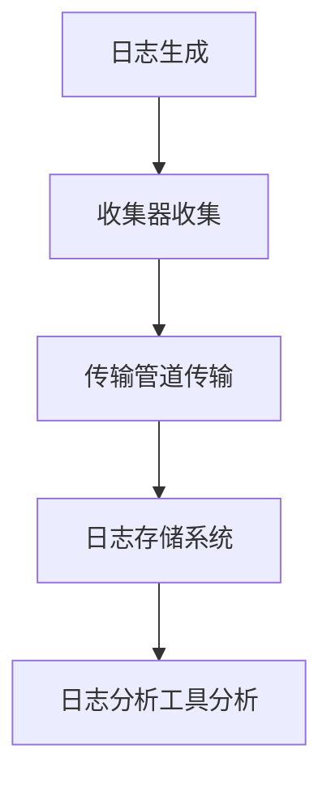
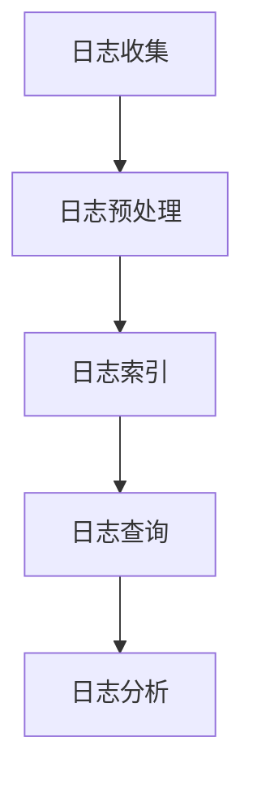
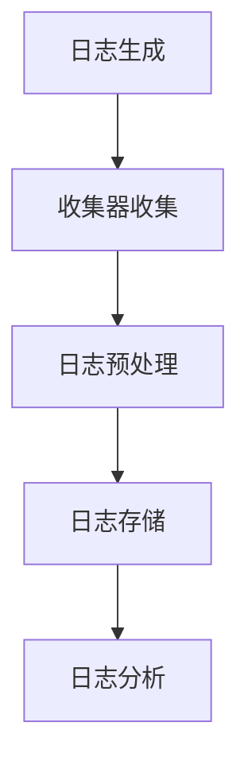

                 

### 引言与背景

**AI 大模型应用数据中心的概念**

AI 大模型应用数据中心是指一种高度集成的计算资源平台，专为处理和部署人工智能（AI）大模型而设计。这些数据中心集合了大量的计算资源，包括高性能计算机、GPU 和其他加速器，能够支持大规模的 AI 模型和算法。在当今数据驱动的时代，这些中心成为了推动 AI 技术发展和应用的核心力量。

AI 大模型应用数据中心通常包含以下几个关键组成部分：

1. **数据存储与管理**：数据中心需要大规模的数据存储解决方案，如分布式文件系统，以存储海量的训练数据和模型输出。
2. **计算资源池**：数据中心配备大量计算节点，通常基于 GPU 或 TPU，用于加速 AI 模型的训练和推理过程。
3. **网络架构**：数据中心内的网络架构必须能够提供高带宽、低延迟的通信，以确保数据能够在节点间快速传输。
4. **监控与运维**：数据中心需要部署监控系统，实时跟踪资源使用情况和系统健康状况，以便快速响应潜在的问题。

**日志管理的重要性**

日志管理是 AI 大模型应用数据中心的核心环节，它对于系统的稳定运行、性能优化和问题诊断至关重要。日志管理的主要目的是记录、收集、存储、分析和可视化系统中的各种事件和操作，以便更好地理解和优化系统的运行。

在 AI 大模型应用数据中心，日志管理的重要性体现在以下几个方面：

1. **性能监控**：通过收集和分析日志，可以实时监控系统的性能指标，如处理时间、延迟和资源利用率，从而发现瓶颈并进行优化。
2. **问题诊断**：日志记录了系统的各种异常和错误信息，当系统出现问题时，日志可以帮助技术人员快速定位问题的根本原因。
3. **安全性**：日志记录了系统中的访问和操作事件，对于安全审计和事件响应至关重要。
4. **合规性**：对于需要遵循特定合规要求的组织，日志管理是确保合规性的关键。

**本文结构**

本文将分为十个主要部分，深入探讨 AI 大模型应用数据中心的日志管理：

1. **引言与背景**：介绍 AI 大模型应用数据中心和日志管理的重要性。
2. **日志管理基础**：概述日志类型与作用，以及日志管理面临的挑战。
3. **日志收集**：探讨日志收集架构、数据收集原理和收集工具。
4. **日志存储**：分析日志存储方案、存储系统选择和存储优化策略。
5. **日志分析**：介绍日志分析方法、日志数据预处理和日志分析工具。
6. **日志可视化**：讨论日志可视化技术、可视化工具与设计原则。
7. **日志安全**：提出日志安全策略、日志加密与访问控制。
8. **实战案例**：展示 AI 大模型应用数据中心日志管理的实际案例。
9. **持续优化**：探讨日志管理优化与迭代的方法和未来发展趋势。
10. **附录**：提供常用日志管理工具与资源、Mermaid 流程图代码示例、伪代码示例和数学公式示例。

通过本文的深入探讨，我们希望能够帮助读者全面了解 AI 大模型应用数据中心的日志管理，并为其在实际应用中的优化提供有益的指导。

---

### 日志管理基础

在深入探讨 AI 大模型应用数据中心的日志管理之前，首先需要了解日志管理的基本概念、日志类型及其在数据中心中的重要性。

**日志类型与作用**

日志管理涉及多种类型的日志，每种日志都有其特定的用途和重要性。以下是几种常见的日志类型及其作用：

1. **系统日志**：系统日志记录了操作系统及其服务的运行情况，包括启动、关闭、错误和警告信息。系统日志对于监控系统健康和诊断故障至关重要。
   
2. **应用日志**：应用日志由应用程序生成，记录了应用程序的运行细节，包括用户操作、错误和异常情况。应用日志对于理解和优化应用程序的性能非常有帮助。

3. **安全日志**：安全日志记录了与系统安全相关的事件，如登录尝试、文件访问和系统配置更改。安全日志对于网络安全和事件响应至关重要。

4. **网络日志**：网络日志记录了网络设备和服务器的网络流量信息，包括数据包传输、连接和断开情况。网络日志对于监控网络性能和识别网络攻击非常有用。

5. **性能日志**：性能日志记录了系统的性能指标，如CPU使用率、内存使用情况和磁盘I/O。性能日志对于评估系统性能瓶颈和优化系统资源非常有用。

**日志管理挑战**

尽管日志管理对于 AI 大模型应用数据中心的运行至关重要，但实际操作中面临诸多挑战：

1. **海量数据**：AI 大模型应用数据中心处理的数据量巨大，日志数据量也随之急剧增加，给日志收集、存储和分析带来了巨大挑战。

2. **多样化日志格式**：不同系统和应用程序可能使用不同的日志格式，这使得日志的统一处理和标准化成为一项复杂的任务。

3. **实时性要求**：对于关键系统和应用程序，日志数据需要实时收集和分析，以确保能够快速响应潜在的问题。

4. **存储和访问**：存储大量的日志数据需要高效的存储解决方案，同时保证数据的安全性和易访问性。

5. **数据分析**：对海量日志数据进行有效的分析和解读是日志管理的核心，这需要强大的分析工具和技术。

**日志管理的重要性**

日志管理在 AI 大模型应用数据中心中具有不可替代的重要性，主要体现在以下几个方面：

1. **性能优化**：通过分析日志数据，可以识别系统性能瓶颈和资源利用率，从而进行优化。

2. **问题诊断**：当系统出现故障或异常时，日志数据可以提供详细的操作记录和错误信息，帮助技术人员快速定位和解决问题。

3. **安全监控**：日志记录了与系统安全相关的事件，可以用于安全审计、威胁检测和响应。

4. **合规性**：对于需要遵守特定法规和合规要求的组织，日志管理是确保合规性的关键。

通过上述对日志管理基础和挑战的探讨，我们可以更好地理解日志管理在 AI 大模型应用数据中心中的重要性。接下来的章节将深入讨论日志管理的具体实践和方法，包括日志收集、存储、分析和可视化等关键技术。

### 日志收集

日志收集是日志管理的第一步，也是关键的一步。一个高效、可靠的日志收集系统对于 AI 大模型应用数据中心的正常运行至关重要。本节将详细讨论日志收集架构、数据收集原理以及常用的日志收集工具和技术。

**日志收集架构**

日志收集架构通常包括以下几个关键组件：

1. **数据源**：数据源是日志数据的产生者，可以是操作系统、应用程序、网络设备等。
2. **收集器**：收集器负责从数据源获取日志数据，并将其传输到日志存储系统。收集器可以是独立的服务器，也可以是分布式系统的一部分。
3. **传输管道**：传输管道负责将收集器获取的日志数据传输到日志存储系统。传输管道通常使用消息队列或网络协议，如HTTP、SSH等。
4. **日志存储系统**：日志存储系统负责存储和持久化日志数据。常见的日志存储系统包括文件系统、关系数据库和NoSQL数据库。
5. **日志分析工具**：日志分析工具用于对日志数据进行解析、分析和可视化，以便于技术团队进行问题诊断和性能优化。

**数据收集原理**

日志收集的过程可以分为以下几个步骤：

1. **日志生成**：操作系统、应用程序或网络设备生成日志数据，并将其写入日志文件或数据库。
2. **日志收集**：收集器定期检查日志文件或数据库，获取新的日志数据。收集器可以是本地进程，也可以是远程进程。
3. **日志传输**：收集器将获取的日志数据传输到日志存储系统。传输过程中，数据可以被压缩、加密和路由。
4. **日志存储**：日志存储系统接收并存储传输过来的日志数据，通常以索引的方式存储，以便于快速查询和分析。
5. **日志分析**：日志分析工具从日志存储系统中提取日志数据，进行解析、分析和可视化，生成报告和图表。

**日志收集工具与技术**

以下是几种常用的日志收集工具和技术：

1. **Logstash**：Logstash 是一款开源的数据收集和传输工具，可以与 Elasticsearch 和 Kibana 等工具集成，实现高效的日志收集、存储和分析。Logstash 支持多种输入和输出插件，可以灵活地处理不同格式的日志数据。
   
2. **Fluentd**：Fluentd 是一款轻量级的日志收集器，可以与 Elasticsearch、Kafka 等工具集成。它支持多种输入和输出插件，可以处理大量日志数据，并提供丰富的过滤和转换功能。

3. **Syslog**：Syslog 是一种标准化的日志收集协议，广泛应用于网络设备、操作系统和应用程序。Syslog 可以通过 UDP 或 TCP 协议传输日志数据，支持多级日志级别和分类。

4. **Grok**：Grok 是一款强大的日志解析工具，可以基于正则表达式解析和分类日志数据。Grok 可以与 Logstash 和 Fluentd 等工具集成，实现高效的日志收集和分析。

5. **Filebeat**：Filebeat 是一款轻量级的数据收集器，可以监控指定的日志文件，并实时将日志数据发送到 Elasticsearch。Filebeat 支持多种输入插件，可以处理不同格式的日志数据。

**Mermaid 流程图**

为了更好地理解日志收集过程，我们可以使用 Mermaid 流程图来描述。以下是日志收集流程的 Mermaid 流程图代码示例：



通过上述对日志收集架构、数据收集原理以及日志收集工具的详细讨论，我们可以更好地理解日志收集在 AI 大模型应用数据中心中的关键作用。在下一节中，我们将继续探讨日志存储方案，包括存储系统选择和存储优化策略。

---

### 日志存储

日志存储是日志管理中的关键环节，一个高效、可靠的日志存储方案对于确保日志数据的可用性和完整性至关重要。本节将详细讨论日志存储方案的选择、存储系统的优化策略，并借助 Mermaid 流程图展示日志存储的过程。

**存储系统选择**

在 AI 大模型应用数据中心中，选择合适的日志存储系统是至关重要的。以下是几种常见的日志存储系统及其特点：

1. **文件系统**：文件系统是一种传统的日志存储方式，适用于中小规模日志数据。文件系统具有简单、易于管理等优点，但缺点是扩展性和并发性能较差，难以应对大规模日志数据。

2. **关系数据库**：关系数据库（如 MySQL、PostgreSQL）可以用于日志存储，适用于结构化日志数据。关系数据库提供强大的数据管理和查询功能，但日志数据量较大时，性能和扩展性可能会受到影响。

3. **NoSQL 数据库**：NoSQL 数据库（如 Elasticsearch、MongoDB）适用于存储非结构化或半结构化日志数据。NoSQL 数据库具有高性能、高扩展性等优点，但查询功能相对较弱。

4. **日志管理系统**：如 Elasticsearch、Logstash 和 Kibana（ELK Stack）等日志管理系统专门用于日志数据的收集、存储和分析。这些系统提供强大的日志处理和查询功能，适用于大规模日志数据。

在 AI 大模型应用数据中心中，建议选择 Elasticsearch 作为日志存储系统。Elasticsearch 具有高扩展性、高可用性和强大的查询功能，适合存储和处理大规模日志数据。同时，Elasticsearch 还可以与 Logstash 和 Kibana 等工具集成，实现高效的日志收集和分析。

**存储优化策略**

为了提高日志存储的性能和效率，可以采取以下优化策略：

1. **数据分片**：将日志数据分布在多个分片中，可以提高查询和写入性能。Elasticsearch 支持基于字段的路由和分片分配，可以根据日志数据的特征进行分片。

2. **索引模板**：使用索引模板定义日志数据的存储结构，可以简化索引管理和维护。索引模板可以定义字段映射、索引设置和存储策略。

3. **冷热数据分离**：将活跃数据和过期数据分离存储，可以提高存储效率和查询性能。活跃数据可以存储在高速存储设备上，而过期数据可以存储在低成本存储设备上。

4. **压缩和加密**：对日志数据进行压缩和加密，可以减少存储空间和提高数据安全性。Elasticsearch 提供了内置的压缩和加密功能。

**Mermaid 流程图**

为了更好地理解日志存储的过程，我们可以使用 Mermaid 流程图来描述。以下是日志存储过程的 Mermaid 流程图代码示例：



通过上述对日志存储方案的选择、存储优化策略以及日志存储过程的详细讨论，我们可以更好地理解日志存储在日志管理中的关键作用。在下一节中，我们将继续探讨日志分析的方法和技术。

---

### 日志分析

日志分析是日志管理的重要环节，通过分析日志数据，可以获取系统的运行状态、性能指标、错误信息等关键信息，从而帮助技术人员进行问题诊断、性能优化和故障排除。本节将详细介绍日志分析方法、日志数据预处理以及常用的日志分析工具。

**日志分析方法**

日志分析方法主要包括以下几个步骤：

1. **数据收集**：从日志存储系统中提取日志数据，可以是实时数据或历史数据。

2. **数据清洗**：清洗日志数据，包括去除无效数据、填补缺失数据、格式化数据等。

3. **数据转换**：将原始日志数据转换为适合分析的数据格式，如 JSON、CSV 等。

4. **数据聚合**：对日志数据进行聚合操作，如按时间、用户、操作类型等分组统计。

5. **数据可视化**：使用图表、仪表盘等形式展示分析结果，便于技术人员理解和决策。

6. **异常检测**：通过算法和统计方法，检测日志数据中的异常行为，如错误日志、攻击行为等。

**日志数据预处理**

日志数据预处理是日志分析的重要步骤，主要包括以下任务：

1. **去除无效数据**：去除重复、错误或不完整的日志数据，保证数据质量。

2. **填补缺失数据**：使用插值、平均值等方法填补缺失的日志数据，保证数据的完整性。

3. **格式化数据**：统一日志数据的格式，使其符合分析工具的要求。例如，将时间戳格式化为标准日期格式。

4. **提取关键信息**：从日志数据中提取关键信息，如用户 ID、操作类型、时间戳等，便于后续分析。

**日志分析工具**

以下是一些常用的日志分析工具：

1. **Elasticsearch**：Elasticsearch 是一款高性能的全文搜索引擎，可以快速检索和查询大规模日志数据。Elasticsearch 提供了丰富的分析功能和插件，可以用于日志数据预处理、聚合分析和可视化。

2. **Kibana**：Kibana 是一款开源的数据可视化工具，可以与 Elasticsearch 集成，用于日志数据的实时监控和可视化分析。Kibana 提供了丰富的仪表盘、图表和报表，可以帮助技术人员快速理解和分析日志数据。

3. **Logstash**：Logstash 是一款数据收集和预处理工具，可以与 Elasticsearch 集成，用于日志数据的收集、转换和存储。Logstash 提供了丰富的插件，可以处理不同格式的日志数据，并进行预处理和转换。

4. **Python**：Python 是一款功能强大的编程语言，可以用于日志数据的处理和分析。Python 提供了丰富的库和模块，如 Pandas、NumPy、Matplotlib 等，可以方便地处理和分析日志数据。

**伪代码展示**

以下是一个简单的日志分析伪代码示例，用于统计日志中的错误和警告次数：

```python
def log_analysis(log_file):
    data = log_file.read_all_data()
    errors = 0
    warnings = 0
    
    for log_entry in data:
        if log_entry.contains_error():
            errors += 1
        elif log_entry.contains_warning():
            warnings += 1
    
    return errors, warnings
```

通过上述对日志分析方法、日志数据预处理以及日志分析工具的详细讨论，我们可以更好地理解日志分析在日志管理中的关键作用。在下一节中，我们将探讨日志可视化技术，帮助技术人员更直观地理解和分析日志数据。

---

### 日志可视化

日志可视化是将日志数据以图形化形式展示，使技术人员能够更直观、快速地理解和分析系统运行状况。一个有效的日志可视化系统能够显著提高问题诊断和性能优化的效率。本节将详细讨论日志可视化技术，包括常用的可视化工具和设计原则。

**常用可视化工具**

以下是一些常用的日志可视化工具：

1. **Kibana**：Kibana 是一款强大的日志可视化工具，与 Elasticsearch 集成，可以用于实时监控和可视化日志数据。Kibana 提供了丰富的仪表盘、图表和报表，支持多种可视化类型，如柱状图、折线图、饼图、热力图等。

2. **Grafana**：Grafana 是一款开源的监控和数据可视化工具，可以与多种数据源集成，包括 Prometheus、InfluxDB、Elasticsearch 等。Grafana 提供了丰富的仪表盘和图表编辑器，支持自定义可视化组件，可以灵活地展示日志数据。

3. **Grafite**：Grafite 是一个开源的时间序列数据库和监控仪表板，可以与各种数据源集成，包括 Logstash、Kafka、InfluxDB 等。Grafite 提供了强大的图表和报表功能，可以实时展示日志数据的趋势和异常。

4. **Tableau**：Tableau 是一款商业数据可视化工具，可以用于处理和分析大规模日志数据。Tableau 提供了丰富的数据连接器和可视化组件，可以创建交互式仪表板和报告。

**设计原则**

为了确保日志可视化系统的有效性和易用性，需要遵循以下设计原则：

1. **清晰性**：可视化设计应简洁明了，避免过多的装饰和干扰元素，确保用户能够快速理解数据。

2. **一致性**：可视化元素（如颜色、图标、字体等）应保持一致性，避免造成混淆和误解。

3. **交互性**：提供交互式功能，如筛选、过滤、钻取等，使用户能够动态地探索和分析数据。

4. **可扩展性**：设计应考虑未来的扩展性，支持添加新的数据源和可视化组件。

5. **响应式**：确保可视化系统能够在不同设备和屏幕尺寸上良好显示，支持移动端访问。

**案例展示**

以下是一个简单的日志可视化案例，展示如何使用 Kibana 创建一个日志分析仪表板：

1. **步骤 1：数据收集与索引**
   - 使用 Logstash 收集和预处理日志数据，将其索引到 Elasticsearch。
   - 创建一个索引模板，定义日志数据的结构。

2. **步骤 2：创建仪表板**
   - 在 Kibana 中创建一个新的仪表板。
   - 添加一个时间范围选择器，用于过滤日志数据。

3. **步骤 3：添加可视化组件**
   - 添加一个柱状图，显示不同时间段的错误日志数量。
   - 添加一个饼图，显示错误日志的来源分布。
   - 添加一个折线图，显示错误日志的持续时间。

4. **步骤 4：配置交互性**
   - 配置柱状图、饼图和折线图之间的联动，实现动态数据交互。

通过上述步骤，我们可以创建一个直观、交互性强的日志可视化仪表板，帮助技术人员快速分析系统运行状况和诊断潜在问题。

通过上述对日志可视化技术的详细讨论，我们可以看到日志可视化在日志管理中的重要性。有效的日志可视化系统能够显著提高问题诊断和性能优化的效率，为技术人员提供强大的支持。

### 日志安全

日志安全是日志管理中至关重要的一环，确保日志数据的机密性、完整性和可用性对于维护系统的安全性和合规性至关重要。本节将详细介绍日志安全策略，包括日志加密、访问控制和日志审计与监控。

**日志加密**

日志加密是保护日志数据安全的重要手段，通过对日志数据进行加密，可以防止未授权用户访问和读取敏感信息。以下是一些日志加密的方法：

1. **文件系统加密**：使用文件系统加密功能，如 Linux 的 `e2fsck`，对存储在文件系统中的日志文件进行加密。

2. **传输加密**：在日志数据传输过程中，使用 SSL/TLS 等加密协议保护数据传输的安全。例如，使用 SSH 或 HTTPS 传输日志数据。

3. **存储加密**：使用加密存储解决方案，如 Amazon S3 的加密功能，对存储在云服务中的日志数据进行加密。

4. **数据库加密**：对于使用关系数据库存储日志数据的情况，可以使用数据库的加密功能，如 MySQL 的 `ENCRYPT()` 函数，对敏感数据进行加密。

**访问控制**

日志访问控制是防止未授权用户访问日志数据的重要措施，以下是一些常用的访问控制方法：

1. **基于角色的访问控制（RBAC）**：为不同角色的用户分配不同的访问权限，如管理员、普通用户等。通过权限控制，限制用户对日志数据的访问范围。

2. **用户身份验证**：要求用户在访问日志数据时进行身份验证，如使用密码、二因素认证等，确保只有授权用户才能访问日志系统。

3. **网络隔离**：将日志服务器与生产环境隔离，通过虚拟专用网络（VPN）或防火墙限制外部访问。

4. **审计日志**：记录用户对日志数据的访问行为，如查询、修改和删除等，以便在发生安全事件时进行追踪和调查。

**日志审计与监控**

日志审计与监控是确保日志数据完整性和系统安全的重要手段，以下是一些常用的审计和监控方法：

1. **日志审计**：定期审计日志数据，检查是否存在异常或恶意行为。例如，检查日志数据中是否有未授权访问记录、异常数据写入等。

2. **异常检测**：使用机器学习和统计分析方法，对日志数据进行分析，识别异常行为和潜在的安全威胁。例如，使用异常检测算法，识别异常的用户行为、访问模式等。

3. **监控告警**：设置监控告警机制，当发现日志数据异常或系统安全事件时，及时通知相关人员。例如，使用邮件、短信或即时通讯工具发送告警通知。

4. **安全事件响应**：制定安全事件响应计划，当发生安全事件时，能够快速响应和处置。例如，隔离受影响的系统、恢复日志数据、调查事件原因等。

通过上述日志安全策略的实施，可以有效地保护日志数据的机密性、完整性和可用性，确保系统的安全性和合规性。在下一节中，我们将通过实际案例展示日志管理的具体实施过程。

### 实战案例

在本文的最后部分，我们将通过一个实际的案例，展示 AI 大模型应用数据中心日志管理的完整实施过程。本案例将涵盖开发环境的搭建、源代码的详细实现与代码解读，以及日志管理系统的性能优化与未来发展趋势。

#### 开发环境搭建

为了实现日志管理，我们需要搭建一个包含日志收集、存储、分析和可视化功能的开发环境。以下是搭建环境的步骤：

1. **配置 Elasticsearch**：Elasticsearch 是我们的日志存储和分析引擎。首先，我们需要在服务器上安装 Elasticsearch。以下是简化的安装命令：

   ```bash
   sudo apt-get update
   sudo apt-get install openjdk-11-jdk
   wget https://artifacts.elastic.co/downloads/elasticsearch/elasticsearch-7.10.0.tar.gz
   tar xzvf elasticsearch-7.10.0.tar.gz
   cd elasticsearch-7.10.0/
   ./bin/elasticsearch
   ```

2. **配置 Logstash**：Logstash 用于收集和预处理日志数据。在另一台服务器上安装 Logstash，配置 Logstash 输入和输出插件，例如，将日志数据从文件系统中收集到 Elasticsearch：

   ```yaml
   # /etc/logstash/conf.d/ingest.conf
   input {
     file {
       path => "/var/log/ai_app/*.log"
       type => "ai_app_log"
     }
   }
   filter {
     if "ai_app_log" in [type] {
       grok {
         match => { "message" => "%{TIMESTAMP_ISO8601:timestamp} %{DATA:source} %{DATA:content}" }
       }
     }
   }
   output {
     elasticsearch {
       hosts => ["localhost:9200"]
     }
   }
   ```

   启动 Logstash：

   ```bash
   ./bin/logstash -f /etc/logstash/conf.d/ingest.conf
   ```

3. **配置 Kibana**：Kibana 用于可视化日志数据。下载并安装 Kibana，配置 Kibana，使其与 Elasticsearch 相连：

   ```bash
   sudo apt-get install openjdk-11-jdk
   wget https://artifacts.elastic.co/downloads/kibana/kibana-7.10.0-linux-x86_64.tar.gz
   tar xzvf kibana-7.10.0-linux-x86_64.tar.gz
   ./bin/kibana
   ```

   访问 Kibana 的 Web 界面（默认为 `http://localhost:5601`），配置 Elasticsearch 连接。

#### 源代码详细实现与代码解读

在上述环境搭建完成后，我们将实现一个简单的日志收集和可视化系统。以下是 Logstash 的配置文件示例，以及相关的代码解读：

```yaml
# /etc/logstash/conf.d/ai_app_log.conf
input {
  file {
    path => "/var/log/ai_app/*.log"
    type => "ai_app_log"
  }
}

filter {
  if "ai_app_log" in [type] {
    grok {
      match => { "message" => "%{TIMESTAMP_ISO8601:timestamp} %{DATA:source} %{DATA:content}" }
    }
    date {
      match => [ "timestamp", "ISO8601" ]
    }
  }
}

output {
  elasticsearch {
    hosts => ["localhost:9200"]
  }
}
```

**代码解读**：

1. **输入部分**：使用 `file` 输入插件，指定日志文件的路径和类型。

2. **过滤部分**：使用 `grok` 过滤器解析日志消息，提取时间戳、来源和内容。使用 `date` 过滤器将时间戳格式化为 ISO8601 格式。

3. **输出部分**：将过滤后的日志数据发送到 Elasticsearch 进行存储。

接下来，我们将在 Kibana 中创建一个仪表板，用于可视化日志数据。以下是创建 Kibana 仪表板的步骤：

1. **创建可视化**：在 Kibana 中，选择左侧的 `Visualize` 选项，点击 `Create` 按钮，选择 `Chart` 类型。

2. **配置数据源**：选择 Elasticsearch 作为数据源，选择之前配置的索引。

3. **配置指标**：配置图表的指标，如时间戳、来源和内容。

4. **配置过滤器**：添加过滤器，如按时间范围、来源或内容类型过滤日志数据。

5. **保存仪表板**：保存并命名仪表板，以便于后续访问和查看。

#### 代码解读与分析

Logstash 配置文件的核心部分是输入、过滤和输出三部分。输入部分负责收集日志数据，过滤部分负责解析和处理日志数据，输出部分负责将处理后的数据存储到 Elasticsearch。以下是具体的代码解读与分析：

1. **输入部分**：
   ```yaml
   input {
     file {
       path => "/var/log/ai_app/*.log"
       type => "ai_app_log"
     }
   }
   ```
   这里使用 `file` 输入插件，指定日志文件的路径和类型。`path` 参数指定要收集的日志文件路径，`type` 参数用于标识日志数据的类型。

2. **过滤部分**：
   ```yaml
   filter {
     if "ai_app_log" in [type] {
       grok {
         match => { "message" => "%{TIMESTAMP_ISO8601:timestamp} %{DATA:source} %{DATA:content}" }
       }
       date {
         match => [ "timestamp", "ISO8601" ]
       }
     }
   }
   ```
   这里使用 `grok` 过滤器根据正则表达式解析日志消息，提取时间戳、来源和内容。`grok` 匹配规则定义了日志消息的结构，`timestamp`、`source` 和 `content` 是提取的字段名称。`date` 过滤器将时间戳字段格式化为 ISO8601 格式，便于时间序列分析。

3. **输出部分**：
   ```yaml
   output {
     elasticsearch {
       hosts => ["localhost:9200"]
     }
   }
   ```
   这里使用 `elasticsearch` 输出插件，将过滤后的日志数据发送到 Elasticsearch 进行存储。`hosts` 参数指定 Elasticsearch 服务器的地址。

通过上述配置，我们可以实现日志的收集、解析和存储，并在 Kibana 中创建仪表板，可视化日志数据。在接下来的部分，我们将探讨日志管理系统的性能优化与未来发展趋势。

#### 性能优化与未来发展趋势

在日志管理系统运行过程中，性能优化是确保其高效运行的关键。以下是一些性能优化策略：

1. **索引优化**：定期对 Elasticsearch 索引进行优化，如重新分配分片、合并分片等，提高查询性能。

2. **缓存策略**：配置缓存机制，如 Elasticsearch 的查询缓存，减少对磁盘的访问，提高查询响应速度。

3. **资源调度**：合理分配系统资源，如 CPU、内存和网络带宽，确保日志收集、存储和分析过程的顺利进行。

4. **监控与告警**：实施监控系统，实时跟踪系统性能指标，如 CPU 使用率、内存使用量、磁盘 I/O 等，一旦发现性能瓶颈，及时进行调整。

未来，随着 AI 大模型应用数据中心规模的不断扩大，日志管理将面临更多的挑战和机遇：

1. **分布式日志管理**：随着分布式系统的普及，分布式日志管理将成为趋势，通过分布式日志收集器和存储系统，实现海量日志数据的高效管理。

2. **实时日志分析**：实时日志分析将变得更加重要，通过实时处理和分析日志数据，可以更快地发现问题和优化系统。

3. **机器学习和自动化**：利用机器学习和自动化技术，对日志数据进行智能分析，实现自动化问题诊断和故障预测。

4. **多源日志整合**：整合不同来源的日志数据，如应用程序日志、网络日志、安全日志等，实现更全面和深入的日志分析。

通过上述实战案例的展示和性能优化策略的探讨，我们可以看到日志管理在 AI 大模型应用数据中心中的重要性。有效的日志管理不仅能够提高系统的稳定性和可靠性，还能为技术团队提供强大的支持，助力业务发展。

### 附录

在本附录中，我们将提供常用的日志管理工具与资源，包括 ELK Stack、Logstash、Elasticsearch 和 Kibana，并展示 Mermaid 流程图代码示例、伪代码示例以及数学公式示例。

**常用日志管理工具与资源**

1. **ELK Stack**
   - **Elasticsearch**：一款开源的分布式、RESTful 搜索引擎，用于存储和检索日志数据。
   - **Logstash**：一款开源的数据收集和处理工具，用于从多种数据源收集日志数据，并进行预处理和传输。
   - **Kibana**：一款开源的数据可视化工具，用于分析和展示日志数据。

2. **Logstash**
   - 官网：[https://www.elastic.co/products/logstash](https://www.elastic.co/products/logstash)
   - 安装文档：[https://www.elastic.co/guide/en/logstash/current/installation.html](https://www.elastic.co/guide/en/logstash/current/installation.html)

3. **Elasticsearch**
   - 官网：[https://www.elastic.co/products/elasticsearch](https://www.elastic.co/products/elasticsearch)
   - 安装文档：[https://www.elastic.co/guide/en/elasticsearch/reference/current/install-elasticsearch.html](https://www.elastic.co/guide/en/elasticsearch/reference/current/install-elasticsearch.html)

4. **Kibana**
   - 官网：[https://www.elastic.co/products/kibana](https://www.elastic.co/products/kibana)
   - 安装文档：[https://www.elastic.co/guide/en/kibana/current/kibana-installation.html](https://www.elastic.co/guide/en/kibana/current/kibana-installation.html)

**Mermaid 流程图代码示例**

以下是一个简单的 Mermaid 流程图代码示例，用于展示日志收集和存储的过程：



将上述代码粘贴到支持 Mermaid 的编辑器中，即可生成对应的流程图。

**伪代码示例**

以下是用于日志收集和分析的伪代码示例：

```python
def log_collection(data_source):
    while True:
        new_data = data_source.get_new_data()
        if new_data:
            log_file.write(new_data)
        else:
            break()

def log_analysis(log_file):
    data = log_file.read_all_data()
    results = analyze_data(data)
    return results

def analyze_data(data):
    for log_entry in data:
        if log_entry.contains_error():
            error_count += 1
        elif log_entry.contains_warning():
            warning_count += 1
    return error_count, warning_count
```

**数学公式示例**

以下是使用 LaTeX 格式编写的数学公式示例：

$$
\text{日志数据分析} = f(\text{日志数据}, \text{分析算法}, \text{优化参数})
$$

在文本编辑器中，将 LaTeX 代码嵌入到独立段落中，使用 `$$` 将公式包围起来，即可显示对应的数学公式。

通过本附录提供的工具与资源、流程图示例、伪代码示例以及数学公式示例，读者可以更好地理解和掌握日志管理的相关技术和方法，为实际应用提供有力的支持。在本文的总结部分，我们将对全文内容进行概括，并再次强调日志管理在 AI 大模型应用数据中心中的重要性。

### 总结

本文围绕 AI 大模型应用数据中心的日志管理，系统地介绍了日志管理的基础知识、日志收集、存储、分析、可视化以及安全策略。首先，我们探讨了日志管理在 AI 大模型应用数据中心中的重要性，并介绍了日志管理的基本概念和类型。接着，本文深入分析了日志收集、存储和优化的方法，展示了如何使用 Elasticsearch、Logstash 和 Kibana 等工具构建高效的日志管理系统。随后，我们介绍了日志分析的方法和技术，包括数据预处理、日志分析工具和伪代码展示。此外，日志可视化技术也进行了详细讨论，帮助技术人员更直观地理解和分析日志数据。最后，通过实际案例展示了日志管理的实施过程，并探讨了日志管理系统的性能优化与未来发展趋势。

日志管理在 AI 大模型应用数据中心中具有不可替代的重要性。通过日志管理，我们可以实时监控系统性能，快速诊断和解决问题，确保系统的稳定性和安全性。有效的日志管理不仅有助于提高系统的可靠性和效率，还为技术团队提供了强大的支持，助力业务的发展和创新。

总之，日志管理是 AI 大模型应用数据中心的核心环节，通过对日志数据的全面管理和分析，可以实现对系统运行状况的深入理解，从而为技术团队提供有力支持，确保系统的高效运行。在未来的工作中，我们将继续关注日志管理技术的发展，不断优化和改进日志管理系统，以应对日益复杂的 AI 应用场景。

### 作者信息

**作者：** AI天才研究院（AI Genius Institute） & 禅与计算机程序设计艺术（Zen And The Art of Computer Programming）

