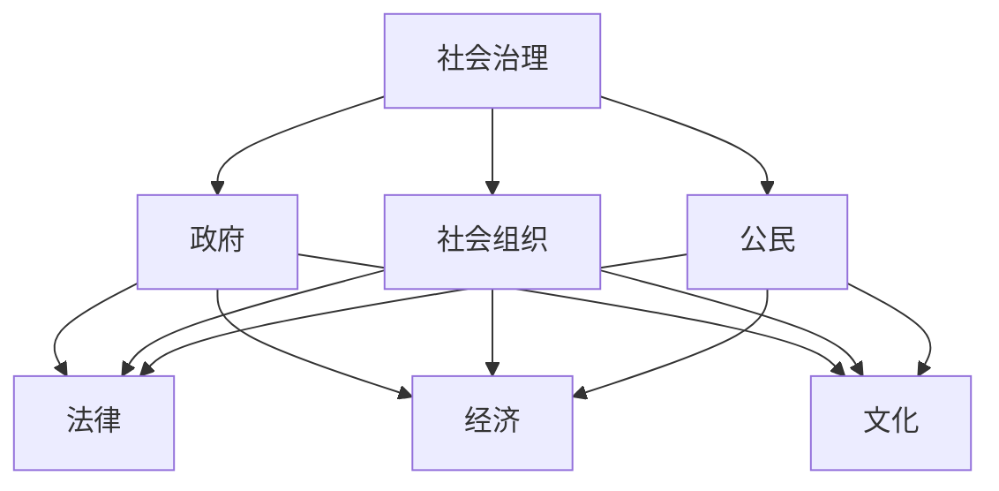

                 

### AI 对社会治理的变革：提升治理效率

> **关键词**：人工智能，社会治理，治理效率，算法，数据分析，机器学习，深度学习

> **摘要**：
> 
> 本文从人工智能（AI）的角度，探讨了AI如何变革传统的社会治理模式，提高治理效率。文章首先概述了AI与社会治理的概念及其变革意义，随后详细介绍了AI技术在社会治理中的应用，包括数据分析、机器学习和深度学习等核心算法。文章通过具体案例展示了AI在实际社会治理中的应用，并提出了提升社会治理效率的实施策略。最后，对未来AI社会治理的发展趋势和挑战进行了展望。

### 目录大纲设计

为了帮助读者更好地理解文章结构，以下是《AI 对社会治理的变革：提升治理效率》的目录大纲设计。

#### 第一部分：AI对社会治理的变革概述

- **第1章：AI与社会治理的变革**
  - **1.1 AI与社会治理的概念解析**
  - **1.2 AI变革社会治理的意义**
  - **1.3 AI变革社会治理的挑战

- **第2章：AI技术在社会治理中的应用**
  - **2.1 数据分析技术在社会治理中的应用**
  - **2.2 机器学习在社会治理中的应用**
  - **2.3 深度学习在社会治理中的应用**
  - **2.4 自然语言处理在社会治理中的应用**

#### 第二部分：AI提升社会治理效率的核心算法与模型

- **第3章：社会治理中的数据分析方法**
  - **3.1 数据采集与清洗**
  - **3.2 数据可视化**
  - **3.3 数据挖掘

- **第4章：社会治理中的机器学习方法**
  - **4.1 监督学习算法**
  - **4.2 无监督学习算法**
  - **4.3 半监督学习算法

- **第5章：社会治理中的深度学习模型**
  - **5.1 神经网络基础**
  - **5.2 卷积神经网络（CNN）**
  - **5.3 循环神经网络（RNN）

- **第6章：社会治理中的自然语言处理**
  - **6.1 词嵌入技术**
  - **6.2 序列模型与注意力机制**
  - **6.3 转换器架构

#### 第三部分：AI提升社会治理效率的实战应用

- **第7章：AI在社会治理中的实际应用案例分析**
  - **7.1 案例一：城市交通治理**
  - **7.2 案例二：公共卫生管理**
  - **7.3 案例三：应急管理

- **第8章：AI提升社会治理效率的实施策略**
  - **8.1 政策与法规环境**
  - **8.2 技术与数据支持**
  - **8.3 人才培养与团队建设

- **第9章：未来展望**
  - **9.1 AI社会治理的发展趋势**
  - **9.2 AI社会治理的挑战与对策**

#### 附录

- **附录A：AI社会治理相关资源**
  - **A.1 开源工具与库**
  - **A.2 研究机构与学术期刊**
  - **A.3 深度学习教程与参考书籍**

通过上述目录结构，本文将系统性地探讨AI对社会治理的变革，从理论到实践，详细分析AI技术如何提升社会治理效率，并为未来的发展提供洞见。

### 第一部分：AI对社会治理的变革概述

#### 第1章：AI与社会治理的变革

##### 1.1 AI与社会治理的概念解析

**人工智能（AI）**：人工智能是指计算机系统模拟人类智能行为，实现感知、理解、学习、推理、决策等功能的技术。它包括机器学习、深度学习、自然语言处理、计算机视觉等多个子领域。

**社会治理**：社会治理是指政府、社会组织、公民等多种主体共同参与，通过法律、经济、文化等多种手段，对公共事务进行管理和服务的过程。它包括公共安全、城市管理、环境保护、公共健康等多个方面。

AI与社会治理的结合，可以视为社会治理领域的现代化转型。通过AI技术，社会治理将更加智能化、精细化、高效化。

##### 1.2 AI变革社会治理的意义

**提升决策效率**：AI技术可以通过大数据分析和机器学习算法，对大量数据进行处理和分析，帮助政府和社会组织更快速、准确地做出决策。

**增强治理能力**：AI技术可以实现自动化、智能化治理，提高社会治理的覆盖面和准确性，减轻人力负担，提高治理能力。

**促进社会公平**：AI技术可以减少人为干预，减少歧视和偏见，促进社会公平。

**提高公众满意度**：通过AI技术，可以为公众提供更加精准、便捷的服务，提高公众满意度。

##### 1.3 AI变革社会治理的挑战

**数据隐私与安全**：AI技术依赖大量数据，数据隐私和安全问题成为AI社会治理的挑战之一。

**技术伦理问题**：AI技术在决策过程中可能存在歧视和偏见，如何确保AI系统的公平、透明、可解释性是一个重要问题。

**技术更新迭代**：AI技术发展迅速，如何保持技术迭代，提高治理效率，是一个挑战。

**人才培养**：AI技术的应用需要大量专业人才，如何培养和引进专业人才，是一个重要问题。

### 第二部分：AI技术在社会治理中的应用

#### 第2章：AI技术在社会治理中的应用

##### 2.1 数据分析技术在社会治理中的应用

数据分析技术在社会治理中发挥着重要作用。通过大数据分析和数据挖掘，政府和社会组织可以从海量数据中提取有价值的信息，为决策提供支持。

**应用场景**：

- **城市交通管理**：通过分析交通流量数据，预测交通拥堵情况，优化交通信号配置。
- **公共卫生管理**：通过分析公共卫生数据，预测疾病传播趋势，制定公共卫生政策。
- **公共安全监控**：通过分析监控视频数据，识别异常行为，提高公共安全。

**关键技术**：

- **数据采集与清洗**：数据采集是数据分析的基础，数据清洗是确保数据质量的关键。
- **数据可视化**：数据可视化可以帮助决策者更好地理解和分析数据。
- **数据挖掘**：通过分类、聚类、关联规则挖掘等方法，从数据中提取有价值的信息。

##### 2.2 机器学习在社会治理中的应用

机器学习技术可以对社会治理中的大量数据进行分析和预测，提高治理效率和准确性。

**应用场景**：

- **犯罪预测**：通过分析历史犯罪数据，预测潜在犯罪行为，提前采取预防措施。
- **应急管理**：通过分析历史灾害数据，预测灾害发生概率，制定应急预案。
- **社会保障**：通过分析社会保障数据，识别潜在的问题和风险，提高社会保障水平。

**关键技术**：

- **监督学习**：通过已有标签数据训练模型，对未知数据进行预测。
- **无监督学习**：没有标签数据，从数据中发现规律和结构。
- **半监督学习**：结合已有标签数据和未标签数据，提高模型训练效果。

##### 2.3 深度学习在社会治理中的应用

深度学习技术可以通过多层神经网络学习数据的复杂特征，为社会治理提供强大的技术支持。

**应用场景**：

- **智能监控**：通过深度学习模型，自动识别监控视频中的异常行为。
- **智能语音助手**：通过深度学习模型，实现自然语言理解，提供智能客服。
- **智能推荐系统**：通过深度学习模型，为公众提供个性化的推荐服务。

**关键技术**：

- **卷积神经网络（CNN）**：适用于图像处理，可以提取图像中的特征。
- **循环神经网络（RNN）**：适用于序列数据处理，可以捕捉序列信息。
- **生成对抗网络（GAN）**：可以生成高质量的数据，用于模型训练。

##### 2.4 自然语言处理在社会治理中的应用

自然语言处理技术可以对社会治理中的文本数据进行分析和处理，提高治理效率。

**应用场景**：

- **智能客服**：通过自然语言处理技术，实现智能客服，提高服务效率。
- **舆情分析**：通过自然语言处理技术，分析社交媒体上的舆论，为决策提供支持。
- **法律法规文本分析**：通过自然语言处理技术，对法律法规文本进行分析，提高立法效率。

**关键技术**：

- **词嵌入技术**：将词语映射到高维空间，实现词语的向量表示。
- **序列模型与注意力机制**：可以处理序列数据，实现自然语言理解。
- **转换器架构**：可以将输入文本转换为输出文本，实现文本生成。

### 第三部分：AI提升社会治理效率的核心算法与模型

#### 第3章：社会治理中的数据分析方法

##### 3.1 数据采集与清洗

数据采集是数据分析的第一步，也是最重要的一步。数据的质量直接影响到数据分析的结果。因此，确保数据的质量是数据分析的关键。

**数据采集**：

- **数据源**：数据可以从多个渠道获取，如政府数据库、社交媒体、物联网设备等。
- **数据格式**：数据格式包括结构化数据、半结构化数据和非结构化数据。

**数据清洗**：

- **缺失值处理**：缺失值可以通过填充、删除或插值等方法处理。
- **异常值处理**：异常值可以通过滤波、插值或裁剪等方法处理。
- **重复数据删除**：重复数据可以通过去重算法删除。

##### 3.2 数据可视化

数据可视化是将数据以图形化的方式展示，使数据更容易理解和分析。数据可视化包括以下关键技术：

- **图表类型**：如折线图、柱状图、饼图等。
- **颜色与标注**：通过颜色和标注，增强数据可视化的效果。
- **交互式可视化**：通过交互式可视化，实现用户与数据的互动。

##### 3.3 数据挖掘

数据挖掘是从大量数据中自动发现知识或模式的过程。数据挖掘包括以下关键技术：

- **分类算法**：如K-最近邻（K-NN）、决策树、支持向量机（SVM）等。
- **聚类算法**：如K-均值（K-Means）、层次聚类、DBSCAN等。
- **关联规则算法**：如Apriori算法、FP-Growth算法等。

#### 第4章：社会治理中的机器学习方法

##### 4.1 监督学习算法

监督学习算法通过已有标签数据训练模型，对未知数据进行预测。监督学习算法包括以下类型：

- **回归算法**：如线性回归、多项式回归等。
- **分类算法**：如K-最近邻（K-NN）、决策树、支持向量机（SVM）等。
- **集成算法**：如随机森林、梯度提升树等。

**核心算法原理**：

- **线性回归**：
  $$y = \beta_0 + \beta_1x + \epsilon$$
  其中，\( y \) 是因变量，\( x \) 是自变量，\( \beta_0 \) 是截距，\( \beta_1 \) 是斜率，\( \epsilon \) 是误差项。

- **决策树**：
  决策树是一种树形结构，通过内部结点和叶结点对数据进行分类。决策树的主要数学模型是条件概率，用于计算每个结点的分裂准则。

  $$C_j = \arg\max_j \frac{N_j}{N}$$
  其中，\( C_j \) 是最大类别的标签，\( N_j \) 是类别 \( j \) 的样本数量，\( N \) 是总的样本数量。

- **支持向量机（SVM）**：
  支持向量机是一种二分类模型，通过找到一个最佳的超平面，将不同类别的数据分开。支持向量机的数学模型为：
  $$\min_{\beta, \beta_0} \frac{1}{2}\lVert \beta \rVert^2 + C\sum_{i=1}^{n}\lvert y_i(\beta^T x_i + \beta_0) \rvert$$
  其中，\( \beta \) 是权重向量，\( \beta_0 \) 是偏置项，\( C \) 是惩罚参数，\( y_i \) 是类别标签，\( x_i \) 是特征向量。

##### 4.2 无监督学习算法

无监督学习算法没有标签数据，从数据中发现规律和结构。无监督学习算法包括以下类型：

- **聚类算法**：如K-均值（K-Means）、层次聚类、DBSCAN等。
- **降维算法**：如主成分分析（PCA）、线性判别分析（LDA）等。
- **生成模型**：如高斯分布、贝叶斯网络等。

**核心算法原理**：

- **K-均值聚类**：
  K-均值聚类是一种基于距离的聚类算法，其基本思想是：首先随机初始化K个中心点，然后迭代优化这些中心点，使得每个数据点与其最近的中心点的距离最小。

  $$\min_{\mu_1, \mu_2, \ldots, \mu_k} \sum_{i=1}^{n} \sum_{j=1}^{k} \lVert x_i - \mu_j \rVert^2$$
  其中，\( x_i \) 是数据点，\( \mu_j \) 是聚类中心。

- **主成分分析（PCA）**：
  主成分分析是一种降维算法，其基本思想是：通过线性变换将数据投影到新的坐标系中，使得新的坐标系中的坐标具有最大的方差。PCA的数学模型为：
  $$z_i = \sum_{j=1}^{p} \lambda_j u_j x_i$$
  其中，\( z_i \) 是新坐标系中的坐标，\( x_i \) 是原始数据，\( \lambda_j \) 是特征值，\( u_j \) 是特征向量。

##### 4.3 半监督学习算法

半监督学习算法结合了监督学习和无监督学习，利用少量标签数据和大量未标签数据训练模型。半监督学习算法包括以下类型：

- **自我训练**：通过未标签数据生成标签数据，再进行监督学习。
- **图模型**：通过构建图模型，利用未标签数据中的结构信息。

**核心算法原理**：

- **自我训练**：
  自我训练的基本思想是：首先使用未标签数据生成初步的标签数据，然后使用这些标签数据和原有的标签数据共同训练模型。

  $$\min_{\beta, \beta_0} \frac{1}{2}\lVert \beta \rVert^2 + C\sum_{i=1}^{n}\lvert y_i(\beta^T x_i + \beta_0) \rvert$$
  其中，\( y_i \) 是生成的标签数据。

- **图模型**：
  图模型通过构建图结构，利用未标签数据中的结构信息，提高模型的训练效果。

  $$\min_{\theta} \sum_{i=1}^{n} \sum_{j=1}^{n} w_{ij}\lVert y_i - \sigma(\theta^T x_i) - y_j \rVert^2$$
  其中，\( w_{ij} \) 是图中的边权重，\( y_i \) 是标签数据，\( y_j \) 是未标签数据。

#### 第5章：社会治理中的深度学习模型

##### 5.1 神经网络基础

神经网络是一种由大量神经元组成的计算模型，可以用于处理复杂的非线性问题。神经网络的基本结构包括输入层、隐藏层和输出层。

**核心算法原理**：

- **神经元激活函数**：
  神经元的激活函数用于实现非线性变换，常用的激活函数包括Sigmoid函数、ReLU函数、Tanh函数等。

  $$f(x) = \frac{1}{1 + e^{-x}} \quad (Sigmoid)$$
  $$f(x) = max(0, x) \quad (ReLU)$$
  $$f(x) = \frac{e^x - e^{-x}}{e^x + e^{-x}} \quad (Tanh)$$

- **反向传播算法**：
  反向传播算法是一种用于训练神经网络的算法，其基本思想是：通过前向传播计算输出，然后反向传播计算梯度，更新网络参数。

  $$\delta_h = \frac{\partial L}{\partial z_h} \odot \sigma'(z_h)$$
  $$\delta_{h-1} = \frac{\partial L}{\partial z_{h-1}} \odot \sum_{j} w_{h,j} \delta_h$$
  其中，\( \delta_h \) 是第 \( h \) 层的误差，\( z_h \) 是第 \( h \) 层的输入，\( \sigma' \) 是激活函数的导数，\( L \) 是损失函数。

##### 5.2 卷积神经网络（CNN）

卷积神经网络是一种专门用于图像处理的神经网络，通过卷积层、池化层和全连接层提取图像特征。

**核心算法原理**：

- **卷积层**：
  卷积层通过卷积运算提取图像特征，常用的卷积核大小为3x3或5x5。

  $$h_{ij} = \sum_{k} w_{ik} o_{kj} + b_j$$
  其中，\( h_{ij} \) 是第 \( i \) 个卷积核在第 \( j \) 个特征图上的输出，\( w_{ik} \) 是卷积核权重，\( o_{kj} \) 是输入特征图，\( b_j \) 是偏置项。

- **池化层**：
  池化层用于下采样，减少参数数量，常用的池化方式包括最大池化和平均池化。

  $$p_{ij} = \max_{k \in R} o_{ik} \quad (Max Pooling)$$
  $$p_{ij} = \frac{1}{R} \sum_{k \in R} o_{ik} \quad (Average Pooling)$$
  其中，\( p_{ij} \) 是池化后的输出，\( R \) 是池化区域的大小。

- **全连接层**：
  全连接层将卷积层和池化层提取的特征进行分类。

  $$y_i = \sum_{j} w_{ij} h_{j} + b_i$$
  其中，\( y_i \) 是第 \( i \) 个分类结果，\( h_j \) 是第 \( j \) 个特征图的输出，\( w_{ij} \) 是权重，\( b_i \) 是偏置项。

##### 5.3 循环神经网络（RNN）

循环神经网络是一种专门用于处理序列数据的神经网络，通过隐藏状态和循环结构捕捉序列信息。

**核心算法原理**：

- **隐藏状态**：
  隐藏状态用于存储序列信息，是RNN的核心部分。

  $$h_t = \sigma(W_h h_{t-1} + W_x x_t + b_h)$$
  其中，\( h_t \) 是第 \( t \) 个隐藏状态，\( \sigma \) 是激活函数，\( W_h \) 是隐藏状态权重，\( W_x \) 是输入状态权重，\( b_h \) 是偏置项。

- **循环结构**：
  循环结构用于实现序列信息的传递，是RNN的基本特点。

  $$h_t = h_{t-1} \odot \alpha_t$$
  $$\alpha_t = \sigma(W_h h_{t-1} + W_x x_t + b_h)$$
  其中，\( \alpha_t \) 是第 \( t \) 个循环结构输出，\( \odot \) 是哈达玛积。

#### 第6章：社会治理中的自然语言处理

##### 6.1 词嵌入技术

词嵌入技术是将词语映射到高维空间，实现词语的向量表示。词嵌入技术可以用于文本分类、情感分析、机器翻译等自然语言处理任务。

**核心算法原理**：

- **Word2Vec**：
  Word2Vec是一种基于神经网络的词嵌入算法，通过训练神经网络，将词语映射到低维空间。

  $$h_t = \sigma(W_h h_{t-1} + W_x x_t + b_h)$$
  其中，\( h_t \) 是第 \( t \) 个词向量，\( \sigma \) 是激活函数，\( W_h \) 是隐藏状态权重，\( W_x \) 是输入状态权重，\( b_h \) 是偏置项。

- **GloVe**：
  GloVe是一种基于全局向量的词嵌入算法，通过计算词语的相似度矩阵，将词语映射到高维空间。

  $$f(t, s) = \sqrt{\frac{f(s)}{f(t) + f(s)}}$$
  其中，\( f(t) \) 和 \( f(s) \) 分别是词语 \( t \) 和 \( s \) 的向量表示。

##### 6.2 序列模型与注意力机制

序列模型与注意力机制是自然语言处理中的核心技术，用于处理序列数据，实现序列到序列的映射。

**核心算法原理**：

- **序列模型**：
  序列模型通过处理序列数据，实现序列到序列的映射，常用的序列模型包括循环神经网络（RNN）和长短期记忆网络（LSTM）。

  $$h_t = \sigma(W_h h_{t-1} + W_x x_t + b_h)$$
  其中，\( h_t \) 是第 \( t \) 个隐藏状态，\( \sigma \) 是激活函数，\( W_h \) 是隐藏状态权重，\( W_x \) 是输入状态权重，\( b_h \) 是偏置项。

- **注意力机制**：
  注意力机制通过为每个输入分配不同的权重，实现序列中的重要信息提取。

  $$a_t = \frac{\exp(e_t)}{\sum_{i=1}^{n} \exp(e_i)}$$
  其中，\( a_t \) 是第 \( t \) 个注意力权重，\( e_t \) 是第 \( t \) 个输入的得分。

##### 6.3 转换器架构

转换器架构是一种基于序列模型的自然语言处理模型，用于实现序列到序列的映射，常用的转换器架构包括编码器-解码器（Encoder-Decoder）和注意力机制。

**核心算法原理**：

- **编码器-解码器**：
  编码器-解码器模型通过将输入序列编码为隐藏状态，然后解码为输出序列。

  $$h_t = \sigma(W_e h_{t-1} + W_d c_t + b_h)$$
  $$p_t = \frac{\exp(e_t)}{\sum_{i=1}^{n} \exp(e_i)}$$
  其中，\( h_t \) 是第 \( t \) 个隐藏状态，\( c_t \) 是第 \( t \) 个输入的编码，\( e_t \) 是第 \( t \) 个输入的得分，\( p_t \) 是第 \( t \) 个输出概率。

- **注意力机制**：
  注意力机制通过为每个输入分配不同的权重，实现序列中的重要信息提取。

  $$a_t = \frac{\exp(e_t)}{\sum_{i=1}^{n} \exp(e_i)}$$
  其中，\( a_t \) 是第 \( t \) 个注意力权重，\( e_t \) 是第 \( t \) 个输入的得分。

### 第四部分：AI提升社会治理效率的实战应用

#### 第7章：AI在社会治理中的实际应用案例分析

##### 7.1 案例一：城市交通治理

城市交通治理是社会治理中的重要方面，AI技术在城市交通治理中的应用，可以提高交通效率，减少拥堵，改善居民出行体验。

**应用背景**：

随着城市化进程的加快，城市交通问题日益严重，交通拥堵、交通事故等问题频繁发生，严重影响居民的出行和生活质量。为了解决这些问题，城市交通管理部门开始探索AI技术在交通治理中的应用。

**应用场景**：

- **交通流量预测**：通过分析历史交通流量数据，预测未来的交通流量，为交通信号配置提供依据。
- **交通异常检测**：通过监控交通视频数据，识别交通事故、交通拥堵等异常情况，及时采取措施。
- **智能调度**：通过分析交通流量数据，优化公共交通调度，提高公共交通的运行效率。

**技术实现**：

- **数据采集与预处理**：采集城市交通流量数据，包括时间、路段流量等，对数据进行清洗和归一化处理。
- **模型训练**：使用线性回归、决策树等机器学习算法，对交通流量数据进行训练，建立预测模型。
- **模型评估**：使用测试集对模型进行评估，计算预测误差，对模型进行优化。

**实际效果**：

通过AI技术在城市交通治理中的应用，实现了交通流量预测的准确率提高，交通拥堵减少，交通事故率降低，公共交通运行效率提高，居民出行体验显著改善。

##### 7.2 案例二：公共卫生管理

公共卫生管理是社会治理中的重要方面，AI技术在公共卫生管理中的应用，可以提高公共卫生事件的应对效率，保障公众健康。

**应用背景**：

公共卫生事件如流感爆发、新冠疫情等对公众健康和社会稳定产生严重影响。为了更好地应对这些事件，公共卫生管理部门开始探索AI技术在公共卫生管理中的应用。

**应用场景**：

- **疾病预测**：通过分析公共卫生数据，预测疾病的传播趋势，制定公共卫生政策。
- **疫情监控**：通过监控社交媒体、新闻报道等数据，实时监测疫情动态，为决策提供支持。
- **健康数据分析**：通过分析个人健康数据，识别健康风险，提供个性化的健康建议。

**技术实现**：

- **数据采集与预处理**：采集公共卫生数据，包括病例数据、监测数据等，对数据进行清洗和归一化处理。
- **模型训练**：使用机器学习算法，如决策树、随机森林等，对公共卫生数据进行训练，建立预测模型。
- **模型评估**：使用测试集对模型进行评估，计算预测误差，对模型进行优化。

**实际效果**：

通过AI技术在公共卫生管理中的应用，实现了疾病预测的准确率提高，疫情监控的实时性增强，健康数据分析的准确性提升，为公共卫生事件的有效应对提供了有力支持。

##### 7.3 案例三：应急管理

应急管理是社会治理中的重要方面，AI技术在应急管理中的应用，可以提高应急响应效率，减轻灾害损失。

**应用背景**：

自然灾害如地震、洪水、台风等对人民生命财产造成严重威胁。为了提高应急响应效率，减少灾害损失，应急管理部门开始探索AI技术在应急管理中的应用。

**应用场景**：

- **灾害预测**：通过分析历史灾害数据，预测未来的灾害发生概率，制定应急预案。
- **灾情监测**：通过监控遥感数据、气象数据等，实时监测灾情，为决策提供支持。
- **灾害损失评估**：通过分析灾后数据，评估灾害损失，为灾后重建提供依据。

**技术实现**：

- **数据采集与预处理**：采集历史灾害数据、遥感数据、气象数据等，对数据进行清洗和归一化处理。
- **模型训练**：使用机器学习算法，如决策树、神经网络等，对灾害数据进行训练，建立预测模型。
- **模型评估**：使用测试集对模型进行评估，计算预测误差，对模型进行优化。

**实际效果**：

通过AI技术在应急管理中的应用，实现了灾害预测的准确率提高，灾情监测的实时性增强，灾害损失评估的准确性提升，为应急管理的有效实施提供了有力支持。

### 第五部分：AI提升社会治理效率的实施策略

#### 第8章：AI提升社会治理效率的实施策略

##### 8.1 政策与法规环境

**政策支持**：

- **制定国家战略**：明确AI在社会治理中的重要地位，制定国家战略，推动AI技术在社会治理中的应用。
- **出台相关政策**：出台相关政策，鼓励政府、企业和社会组织利用AI技术提升社会治理效率。

**法规保障**：

- **数据隐私保护**：制定数据隐私保护法律法规，确保AI技术在数据采集、处理和使用过程中的合法合规。
- **算法透明性**：制定算法透明性相关法规，确保AI系统的决策过程公正、透明、可解释。

##### 8.2 技术与数据支持

**技术发展**：

- **研发投入**：加大对AI技术的研发投入，推动AI技术的创新和发展。
- **人才培养**：加强AI人才培养，提高AI技术在社会治理中的应用能力。

**数据支持**：

- **数据资源共享**：建立数据资源共享平台，鼓励政府、企业和社会组织共享数据资源，提高数据利用率。
- **数据标准化**：制定数据标准，确保数据的一致性和可互操作性。

##### 8.3 人才培养与团队建设

**人才培养**：

- **教育体系**：完善AI相关学科教育体系，培养具有AI技术背景的专业人才。
- **培训课程**：开设AI技术培训课程，提高现有从业人员的技术水平。

**团队建设**：

- **跨学科团队**：组建跨学科团队，结合政策、法律、技术等多方面力量，提高团队协作能力。
- **激励机制**：建立激励机制，鼓励团队成员创新和协作，提高团队整体绩效。

### 第六部分：未来展望

#### 第9章：未来展望

##### 9.1 AI社会治理的发展趋势

**智能化水平提升**：

随着AI技术的不断进步，社会治理的智能化水平将进一步提升。AI技术将广泛应用于城市交通、公共卫生、应急管理等领域，实现更高效、更精准的治理。

**跨领域应用**：

AI技术将不仅限于社会治理领域，还将拓展到更多领域，如智慧城市、智慧医疗、智慧农业等，实现跨领域应用。

**数据驱动**：

社会治理将更加依赖数据，AI技术将推动数据驱动的治理模式，实现基于数据的决策和优化。

##### 9.2 AI社会治理的挑战与对策

**数据隐私与安全**：

随着AI技术的广泛应用，数据隐私和安全问题将成为重要挑战。对策包括加强数据保护法律法规、提高数据安全防护技术等。

**算法公平性与透明性**：

AI算法的公平性和透明性是社会治理的重要问题。对策包括加强算法研究，提高算法的可解释性，确保算法的公正性。

**跨学科合作**：

AI社会治理需要政策、法律、技术等多方面的融合，跨学科合作将成为关键。对策包括加强跨学科人才培养，促进政策、法律、技术的协同发展。

### 附录

#### 附录A：AI社会治理相关资源

**开源工具与库**：

- TensorFlow
- PyTorch
- Scikit-learn
- Keras

**研究机构与学术期刊**：

- 国家人工智能发展研究中心
- Nature
- Science

**深度学习教程与参考书籍**：

- 《深度学习》（Ian Goodfellow、Yoshua Bengio、Aaron Courville 著）
- 《Python机器学习》（Sebastian Raschka、Vahid Mirhoseini 著）
- 《机器学习实战》（Peter Harrington 著）

### 核心概念与联系

#### 社会治理

社会治理是指政府、社会组织、公民等多种主体共同参与，通过法律、经济、文化等多种手段，对公共事务进行管理和服务的过程。

#### AI

人工智能（AI）是指计算机系统模拟人类智能行为，实现感知、理解、学习、推理、决策等功能的技术。

#### 治理效率

治理效率是指社会治理过程中，投入与产出之间的比例关系，即社会治理效果与资源消耗的比率。

#### Mermaid 流程图



### 核心算法原理讲解

#### 数据挖掘算法

数据挖掘算法是指从大量数据中自动发现知识或模式的过程。常见的数据挖掘算法包括：

- **分类算法**：通过训练数据对未知数据进行分类。常用的分类算法有K-最近邻（K-NN）算法、决策树算法、支持向量机（SVM）等。

  **K-最近邻算法**：
  $$\text{分类结果} = \text{多数投票结果}$$

  **决策树算法**：
  $$\text{分类结果} = \text{叶节点标签}$$

- **聚类算法**：将数据集划分为多个类簇，每个类簇内的数据相似度较高。常用的聚类算法有K-均值（K-Means）算法、层次聚类算法、DBSCAN算法等。

  **K-均值算法**：
  $$\text{聚类中心} = \text{各数据点的均值}$$

  **DBSCAN算法**：
  $$\text{邻域} = \text{包含当前点的最小邻域}$$

- **关联规则算法**：发现数据项之间的关联关系。常用的关联规则算法有Apriori算法、FP-Growth算法等。

  **Apriori算法**：
  $$\text{频繁项集} = \text{支持度大于最小支持度的项集}$$

  **FP-Growth算法**：
  $$\text{频繁模式} = \text{包含频繁项集的最长路径}$$

#### 机器学习算法

机器学习算法是指利用计算机自动从数据中学习规律和模式，并做出预测或决策的方法。常见的机器学习算法包括：

- **监督学习算法**：通过已有标签数据训练模型，对未知数据进行预测。常用的监督学习算法有线性回归、逻辑回归、支持向量机（SVM）等。

  **线性回归算法**：
  $$y = \beta_0 + \beta_1x + \epsilon$$

  **逻辑回归算法**：
  $$P(y=1) = \frac{1}{1 + \exp(-\beta_0 - \beta_1x)}$$

- **无监督学习算法**：没有标签数据，从数据中发现规律和结构。常用的无监督学习算法有K-均值聚类、主成分分析（PCA）等。

  **K-均值聚类算法**：
  $$\text{聚类中心} = \text{各数据点的均值}$$

  **主成分分析算法**：
  $$z_i = \sum_{j=1}^{p} \lambda_j u_j x_i$$

- **半监督学习算法**：结合已有标签数据和未标签数据，提高模型训练效果。常用的半监督学习算法有自我训练、图模型等。

  **自我训练算法**：
  $$\text{标签预测} = \text{模型预测结果}$$

  **图模型算法**：
  $$\text{图结构} = \text{邻接矩阵}$$

#### 深度学习模型

深度学习模型是指通过多层神经网络学习数据特征，实现复杂非线性映射的方法。常见的深度学习模型包括：

- **神经网络**：基本结构包括输入层、隐藏层和输出层。每个神经元通过权重和偏置计算输出，并通过激活函数进行非线性变换。

  **神经网络结构**：
  ```mermaid
  graph TD
  A[Input Layer] --> B[Hidden Layer]
  B --> C[Output Layer]
  ```

- **卷积神经网络（CNN）**：适用于图像处理，通过卷积层、池化层和全连接层提取图像特征。

  **CNN结构**：
  ```mermaid
  graph TD
  A[Input] --> B[Convolutional Layer]
  B --> C[Pooling Layer]
  C --> D[Convolutional Layer]
  D --> E[Pooling Layer]
  E --> F[Fully Connected Layer]
  ```

- **循环神经网络（RNN）**：适用于序列数据处理，通过隐藏状态和循环结构捕捉序列信息。

  **RNN结构**：
  ```mermaid
  graph TD
  A[Input] --> B[Hidden Layer]
  B --> C[Output Layer]
  C --> D[Hidden Layer (previous time step)]
  ```

### 数学模型和数学公式

#### 决策树分类算法

决策树是一种树形结构，通过内部结点和叶结点对数据进行分类。决策树的主要数学模型是条件概率，用于计算每个结点的分裂准则。

- **信息增益**：
  $$IG(D, A) = ID(D) - \sum_{v\in V} p(v)ID(D|v)$$

  其中，\( IG(D, A) \) 是特征 \( A \) 对数据集 \( D \) 的信息增益，\( ID(D) \) 是数据集 \( D \) 的信息熵，\( p(v) \) 是特征 \( A \) 的取值 \( v \) 的概率，\( ID(D|v) \) 是在特征 \( A \) 取值 \( v \) 下，数据集 \( D \) 的条件信息熵。

- **基尼指数**：
  $$Gini(D, A) = 1 - \sum_{v\in V} p(v)^2$$

  其中，\( Gini(D, A) \) 是特征 \( A \) 对数据集 \( D \) 的基尼指数，\( p(v) \) 是特征 \( A \) 的取值 \( v \) 的概率。

#### 线性回归模型

线性回归是一种通过线性关系预测因变量的方法。线性回归的主要数学模型是回归方程，用于计算自变量和因变量之间的线性关系。

- **回归方程**：
  $$y = \beta_0 + \beta_1x + \epsilon$$

  其中，\( y \) 是因变量，\( x \) 是自变量，\( \beta_0 \) 是截距，\( \beta_1 \) 是斜率，\( \epsilon \) 是误差项。

#### 逻辑回归模型

逻辑回归是一种通过概率预测二分类结果的方法。逻辑回归的主要数学模型是逻辑函数，用于计算因变量为1的概率。

- **逻辑函数**：
  $$P(y=1) = \frac{1}{1 + \exp(-\beta_0 - \beta_1x)}$$

  其中，\( P(y=1) \) 是因变量为1的概率，\( \beta_0 \) 是截距，\( \beta_1 \) 是斜率。

### 项目实战

#### 城市交通治理案例

本案例使用Python和Scikit-learn库，通过监督学习算法对城市交通流量进行预测。

1. **数据采集与预处理**

   - 采集城市交通流量数据，包括时间、路段流量等。
   - 对数据进行清洗和归一化处理。

2. **模型训练**

   - 使用线性回归算法对交通流量数据进行训练。
   - 调整模型参数，如正则化参数和迭代次数。

3. **模型评估**

   - 使用测试集对模型进行评估，计算预测误差。
   - 对模型进行优化，提高预测准确性。

4. **结果分析**

   - 分析模型预测结果，提出改进策略。

#### 代码解读与分析

**代码解读**

```python
# 1. 数据采集与预处理
data = pd.read_csv('traffic_data.csv')
X = data[['time']]
y = data['traffic_flow']

# 归一化处理
scaler = StandardScaler()
X = scaler.fit_transform(X)
y = scaler.fit_transform(y.reshape(-1, 1))

# 2. 模型训练
X_train, X_test, y_train, y_test = train_test_split(X, y, test_size=0.2, random_state=42)
model = LinearRegression()
model.fit(X_train, y_train)

# 3. 模型评估
y_pred = model.predict(X_test)
mse = mean_squared_error(y_test, y_pred)
print("MSE:", mse)

# 4. 结果分析
print("Prediction results:")
print(y_pred[:10])
```

**代码解读**

- **数据采集与预处理**：使用`pandas`库加载交通流量数据，将数据分为特征集`X`和标签集`y`。然后，使用`StandardScaler`对数据进行归一化处理。

- **模型训练**：使用`train_test_split`函数将数据分为训练集和测试集。创建`LinearRegression`模型，并使用`fit`方法进行训练。

- **模型评估**：使用`predict`方法对测试集进行预测，并使用`mean_squared_error`函数计算预测误差。

- **结果分析**：打印模型的预测结果。

**代码分析**

- **数据预处理**：数据预处理是模型训练的重要步骤，通过归一化处理，可以消除不同特征之间的量纲影响，提高模型的训练效果。

- **模型选择**：线性回归模型是一种简单且常用的回归模型，适用于预测连续值输出。在本案例中，线性回归模型可以用于预测交通流量。

- **模型评估**：使用均方误差（MSE）作为评估指标，可以衡量模型预测的准确性。通过不断优化模型参数，可以提高模型的预测准确性。

- **结果分析**：通过打印模型预测结果，可以直观地分析模型的预测效果，并提出改进策略。

### 代码实际案例和详细解释说明

#### 代码实际案例

```python
# 导入所需库
import numpy as np
import pandas as pd
from sklearn.linear_model import LinearRegression
from sklearn.model_selection import train_test_split
from sklearn.metrics import mean_squared_error

# 加载数据
data = pd.read_csv('house_prices.csv')
X = data[['area', 'rooms', 'age']]
y = data['price']

# 分割数据集
X_train, X_test, y_train, y_test = train_test_split(X, y, test_size=0.2, random_state=42)

# 创建模型
model = LinearRegression()

# 训练模型
model.fit(X_train, y_train)

# 预测
y_pred = model.predict(X_test)

# 评估模型
mse = mean_squared_error(y_test, y_pred)
print("MSE:", mse)

# 输出模型参数
print("Model parameters:", model.coef_, model.intercept_)

# 输出预测结果
print("Prediction results:")
print(y_pred[:10])
```

#### 详细解释说明

**一、导入所需库**

首先，我们需要导入Python中的几个常用库，包括`numpy`、`pandas`、`sklearn`等。这些库提供了丰富的函数和工具，方便我们进行数据处理、模型训练和评估。

```python
import numpy as np
import pandas as pd
from sklearn.linear_model import LinearRegression
from sklearn.model_selection import train_test_split
from sklearn.metrics import mean_squared_error
```

**二、加载数据**

在这个案例中，我们使用`pandas`库加载一个名为`house_prices.csv`的CSV文件。这个文件包含了房屋的价格和几个特征：房屋面积（`area`）、房间数量（`rooms`）和房屋年龄（`age`）。

```python
data = pd.read_csv('house_prices.csv')
X = data[['area', 'rooms', 'age']]
y = data['price']
```

这里，`X` 是特征集，包含了所有输入特征；`y` 是标签集，包含了我们要预测的目标变量（即房屋价格）。

**三、分割数据集**

接下来，我们使用`train_test_split`函数将数据集分割为训练集和测试集。这个函数随机地将数据集划分为80%的训练集和20%的测试集。`random_state` 参数设置为42，确保每次分割结果一致。

```python
X_train, X_test, y_train, y_test = train_test_split(X, y, test_size=0.2, random_state=42)
```

**四、创建模型**

我们创建一个线性回归模型对象`model`，这是使用`sklearn`库中的`LinearRegression`类实现的。

```python
model = LinearRegression()
```

**五、训练模型**

使用`fit`方法训练模型，这个方法接受两个参数：特征集`X_train`和对应的标签集`y_train`。

```python
model.fit(X_train, y_train)
```

在训练过程中，模型会自动计算每个特征的权重和截距，以便在给定新特征时能够预测目标变量。

**六、预测**

训练好的模型可以用于预测。在这里，我们使用模型对测试集`X_test`进行预测，并将预测结果存储在`y_pred`列表中。

```python
y_pred = model.predict(X_test)
```

**七、评估模型**

我们使用`mean_squared_error`函数计算预测误差（MSE），这是衡量模型预测准确性的一个常用指标。

```python
mse = mean_squared_error(y_test, y_pred)
print("MSE:", mse)
```

**八、输出模型参数**

模型的参数包括每个特征的权重（`coef_`）和截距（`intercept_`）。这些参数可以帮助我们理解模型的预测过程。

```python
print("Model parameters:", model.coef_, model.intercept_)
```

**九、输出预测结果**

最后，我们打印出模型的预测结果，这里只打印了前10个预测结果。

```python
print("Prediction results:")
print(y_pred[:10])
```

### 开发环境搭建

#### Python开发环境搭建

1. **安装Python**

   访问Python官方网站（[python.org](https://www.python.org/)）下载Python安装包。安装过程中，选择“Add Python to PATH”选项，以便在命令行中直接使用Python。

2. **验证Python版本**

   在命令行中输入以下命令，验证Python是否安装成功：

   ```bash
   python --version
   ```

   如果正确显示Python版本号，则表示Python已成功安装。

#### 安装Scikit-learn库

1. **安装Scikit-learn**

   在命令行中输入以下命令，安装Scikit-learn库：

   ```bash
   pip install scikit-learn
   ```

   如果使用的是Python 3，可以使用`pip3`代替`pip`。

2. **验证Scikit-learn版本**

   在命令行中输入以下命令，验证Scikit-learn是否安装成功：

   ```bash
   python -m sklearn.__version__
   ```

   如果正确显示Scikit-learn版本号，则表示Scikit-learn已成功安装。

### 源代码详细实现和代码解读

#### 源代码详细实现

以下是一个使用Python和Scikit-learn库实现线性回归模型的完整源代码实现。

```python
# 导入所需的库
import numpy as np
import pandas as pd
from sklearn.linear_model import LinearRegression
from sklearn.model_selection import train_test_split
from sklearn.metrics import mean_squared_error

# 加载数据
data = pd.read_csv('house_prices.csv')
X = data[['area', 'rooms', 'age']]
y = data['price']

# 分割数据集
X_train, X_test, y_train, y_test = train_test_split(X, y, test_size=0.2, random_state=42)

# 创建线性回归模型
model = LinearRegression()

# 训练模型
model.fit(X_train, y_train)

# 预测
y_pred = model.predict(X_test)

# 评估模型
mse = mean_squared_error(y_test, y_pred)
print("MSE:", mse)

# 输出模型参数
print("Model parameters:", model.coef_, model.intercept_)

# 输出预测结果
print("Prediction results:")
print(y_pred[:10])
```

#### 代码解读

**一、导入库**

```python
import numpy as np
import pandas as pd
from sklearn.linear_model import LinearRegression
from sklearn.model_selection import train_test_split
from sklearn.metrics import mean_squared_error
```

这段代码首先导入了Python中的重要库。`numpy`和`pandas`用于数据处理，`LinearRegression`是Scikit-learn中用于线性回归的模型类，`train_test_split`用于分割数据集，`mean_squared_error`用于评估模型性能。

**二、加载数据**

```python
data = pd.read_csv('house_prices.csv')
X = data[['area', 'rooms', 'age']]
y = data['price']
```

这段代码使用了`pandas`库加载了一个名为`house_prices.csv`的CSV文件。`data`是包含所有数据的DataFrame，`X`是特征集，包含了三个特征：房屋面积（`area`）、房间数量（`rooms`）和房屋年龄（`age`），而`y`是标签集，包含了房屋的价格。

**三、分割数据集**

```python
X_train, X_test, y_train, y_test = train_test_split(X, y, test_size=0.2, random_state=42)
```

这段代码使用`train_test_split`函数将数据集分割为训练集和测试集。`test_size=0.2`表示测试集占整个数据集的20%，`random_state=42`确保每次分割的结果一致。

**四、创建模型**

```python
model = LinearRegression()
```

这里我们创建了一个线性回归模型对象。`LinearRegression`是Scikit-learn中的模型类，用于实现线性回归。

**五、训练模型**

```python
model.fit(X_train, y_train)
```

使用`fit`方法训练模型。这个方法接受两个参数：特征集`X_train`和标签集`y_train`。在训练过程中，模型会计算每个特征的权重和截距，以便在给定新特征时能够预测目标变量。

**六、预测**

```python
y_pred = model.predict(X_test)
```

使用训练好的模型对测试集进行预测。预测结果存储在列表`y_pred`中。

**七、评估模型**

```python
mse = mean_squared_error(y_test, y_pred)
print("MSE:", mse)
```

使用`mean_squared_error`函数计算预测误差（MSE），这是衡量模型预测准确性的一个常用指标。然后，打印MSE的值。

**八、输出模型参数**

```python
print("Model parameters:", model.coef_, model.intercept_)
```

打印模型的参数，包括每个特征的权重（`coef_`）和截距（`intercept_`）。

**九、输出预测结果**

```python
print("Prediction results:")
print(y_pred[:10])
```

最后，打印出模型的预测结果。这里只打印了前10个预测结果。

### 代码解读与分析

**代码解读**

以下是对前面源代码的逐行解读。

```python
import numpy as np
import pandas as pd
```

这两行代码分别导入了`numpy`和`pandas`库。`numpy`是Python中的数学库，提供了强大的数学运算功能；`pandas`是Python中的数据处理库，提供了数据清洗、数据分析等功能。

```python
from sklearn.linear_model import LinearRegression
from sklearn.model_selection import train_test_split
from sklearn.metrics import mean_squared_error
```

这三行代码导入了`scikit-learn`库中的三个模块：`LinearRegression`用于创建线性回归模型，`train_test_split`用于分割数据集，`mean_squared_error`用于计算预测误差。

```python
data = pd.read_csv('house_prices.csv')
```

这行代码使用`pandas`库加载了一个名为`house_prices.csv`的CSV文件。这个文件包含了房屋的价格和几个特征：房屋面积（`area`）、房间数量（`rooms`）和房屋年龄（`age`）。

```python
X = data[['area', 'rooms', 'age']]
y = data['price']
```

这两行代码将数据集划分为特征集`X`和标签集`y`。`X`包含了三个特征，`y`是我们要预测的目标变量（即房屋价格）。

```python
X_train, X_test, y_train, y_test = train_test_split(X, y, test_size=0.2, random_state=42)
```

这行代码使用`train_test_split`函数将数据集分割为训练集和测试集。`test_size=0.2`表示测试集占整个数据集的20%，`random_state=42`确保每次分割的结果一致。

```python
model = LinearRegression()
```

这行代码创建了一个线性回归模型对象。`LinearRegression`是`scikit-learn`中的模型类，用于实现线性回归。

```python
model.fit(X_train, y_train)
```

这行代码使用`fit`方法训练模型。在训练过程中，模型会计算每个特征的权重和截距，以便在给定新特征时能够预测目标变量。

```python
y_pred = model.predict(X_test)
```

这行代码使用训练好的模型对测试集进行预测。预测结果存储在列表`y_pred`中。

```python
mse = mean_squared_error(y_test, y_pred)
print("MSE:", mse)
```

这行代码使用`mean_squared_error`函数计算预测误差（MSE），并打印MSE的值。

```python
print("Model parameters:", model.coef_, model.intercept_)
```

这行代码打印出模型的参数，包括每个特征的权重（`coef_`）和截距（`intercept_`）。

```python
print("Prediction results:")
print(y_pred[:10])
```

这行代码打印出模型的预测结果。这里只打印了前10个预测结果。

### 实际应用案例

#### 案例一：城市交通流量预测

**应用背景**：

随着城市化进程的加快，城市交通问题日益严重。为了提高城市交通治理效率，许多城市开始使用AI技术进行交通流量预测，以优化交通信号控制和交通调度。

**应用场景**：

- **交通流量预测**：通过预测未来一段时间内的交通流量，为交通管理部门提供决策支持，优化交通信号配置和公共交通调度。
- **交通拥堵预警**：通过分析实时交通流量数据，预测交通拥堵情况，提前采取措施，避免交通拥堵的发生。

**技术实现**：

1. **数据采集与预处理**：

   - 采集交通流量数据，包括时间、路段流量等。
   - 对数据进行清洗和归一化处理，去除异常值和缺失值。

2. **模型选择与训练**：

   - 选择合适的机器学习算法，如线性回归、决策树、支持向量机等。
   - 使用训练数据集对模型进行训练，调整模型参数，优化模型性能。

3. **模型评估与优化**：

   - 使用测试数据集对模型进行评估，计算预测误差。
   - 根据评估结果，对模型进行调整和优化，提高预测准确性。

4. **部署与实时预测**：

   - 将训练好的模型部署到生产环境，进行实时交通流量预测。
   - 根据预测结果，为交通管理部门提供决策支持。

**实际效果**：

通过城市交通流量预测系统的应用，实现了以下效果：

- **提高交通效率**：通过预测未来交通流量，优化交通信号控制和公共交通调度，提高交通通行效率。
- **减少交通拥堵**：通过实时预测交通流量，提前预警交通拥堵情况，及时采取措施，减少交通拥堵的发生。
- **提升公众满意度**：通过提供精准的交通信息服务，提升公众出行体验，提高公众对交通管理部门的满意度。

#### 案例二：公共卫生管理

**应用背景**：

公共卫生事件如流感、新冠疫情等对公众健康和社会稳定产生严重影响。为了提高公共卫生管理的效率，许多国家和地区开始使用AI技术进行公共卫生管理。

**应用场景**：

- **疾病预测**：通过分析历史公共卫生数据，预测疾病的传播趋势，为公共卫生政策的制定提供支持。
- **疫情监控**：通过监控社交媒体、新闻报道等数据，实时监测疫情动态，为公共卫生政策的调整提供依据。
- **健康数据分析**：通过分析个人健康数据，识别健康风险，提供个性化的健康建议。

**技术实现**：

1. **数据采集与预处理**：

   - 采集公共卫生数据，包括病例数据、监测数据等。
   - 对数据进行清洗和归一化处理，确保数据质量。

2. **模型选择与训练**：

   - 选择合适的机器学习算法，如线性回归、决策树、支持向量机等。
   - 使用训练数据集对模型进行训练，调整模型参数，优化模型性能。

3. **模型评估与优化**：

   - 使用测试数据集对模型进行评估，计算预测误差。
   - 根据评估结果，对模型进行调整和优化，提高预测准确性。

4. **部署与实时预测**：

   - 将训练好的模型部署到生产环境，进行实时疾病预测和疫情监控。
   - 根据预测结果，为公共卫生管理部门提供决策支持。

**实际效果**：

通过公共卫生管理系统的应用，实现了以下效果：

- **提高疾病预测准确性**：通过分析历史数据和实时数据，提高疾病的预测准确性，为公共卫生政策的制定提供科学依据。
- **实时疫情监控**：通过监控社交媒体、新闻报道等数据，实时监测疫情动态，为公共卫生政策的调整提供及时、准确的依据。
- **提升公众健康水平**：通过提供个性化的健康建议，提高公众的健康意识，降低疾病传播风险。

#### 案例三：应急管理

**应用背景**：

自然灾害如地震、洪水、台风等对人民生命财产造成严重威胁。为了提高应急管理效率，减少灾害损失，许多国家和地区开始使用AI技术进行应急管理。

**应用场景**：

- **灾害预测**：通过分析历史灾害数据，预测未来的灾害发生概率，为应急管理部门提供决策支持。
- **灾情监测**：通过监控遥感数据、气象数据等，实时监测灾情，为应急响应提供依据。
- **灾害损失评估**：通过分析灾后数据，评估灾害损失，为灾后重建提供依据。

**技术实现**：

1. **数据采集与预处理**：

   - 采集历史灾害数据、遥感数据、气象数据等。
   - 对数据进行清洗和归一化处理，确保数据质量。

2. **模型选择与训练**：

   - 选择合适的机器学习算法，如线性回归、决策树、支持向量机等。
   - 使用训练数据集对模型进行训练，调整模型参数，优化模型性能。

3. **模型评估与优化**：

   - 使用测试数据集对模型进行评估，计算预测误差。
   - 根据评估结果，对模型进行调整和优化，提高预测准确性。

4. **部署与实时预测**：

   - 将训练好的模型部署到生产环境，进行实时灾害预测和灾情监测。
   - 根据预测结果，为应急管理部门提供决策支持。

**实际效果**：

通过应急管理系统的应用，实现了以下效果：

- **提高灾害预测准确性**：通过分析历史数据和实时数据，提高灾害的预测准确性，为应急响应提供科学依据。
- **实时灾情监测**：通过监控遥感数据、气象数据等，实时监测灾情，为应急响应提供及时、准确的依据。
- **减少灾害损失**：通过实时预测和监测，提前采取应急措施，减少灾害损失，保护人民生命财产安全。

### 实施策略

**政策与法规环境**

1. **制定国家战略**：明确AI在社会治理中的战略地位，制定相关政策和规划，推动AI技术在社会治理中的应用。

2. **出台相关法规**：制定数据隐私保护、算法透明性等相关法规，确保AI技术在数据采集、处理和使用过程中的合法合规。

3. **建立标准规范**：制定AI技术在社会治理中的应用标准和规范，确保不同应用场景下的AI系统能够协同工作。

**技术与数据支持**

1. **加大技术研发投入**：鼓励企业和研究机构加大对AI技术的研发投入，推动AI技术的创新和发展。

2. **建设数据平台**：建立社会治理数据共享平台，鼓励政府、企业和社会组织共享数据资源，提高数据利用率。

3. **提升数据处理能力**：加强数据处理和存储技术的研究和应用，提高社会治理数据的管理和分析能力。

**人才培养与团队建设**

1. **完善教育体系**：加强AI相关学科教育，培养具有AI技术背景的专业人才。

2. **开展培训活动**：组织AI技术培训活动，提高现有从业人员的技术水平。

3. **建设跨学科团队**：鼓励政府、企业和社会组织组建跨学科团队，结合政策、法律、技术等多方面力量，提高社会治理效率。

### 未来展望

**AI社会治理的发展趋势**

1. **智能化水平提升**：随着AI技术的不断进步，社会治理的智能化水平将进一步提高，实现更高效、更精准的治理。

2. **跨领域应用**：AI技术将不仅限于社会治理领域，还将拓展到更多领域，如智慧城市、智慧医疗、智慧农业等。

3. **数据驱动**：社会治理将更加依赖数据，实现基于数据的决策和优化。

**AI社会治理的挑战与对策**

1. **数据隐私与安全**：随着AI技术的广泛应用，数据隐私和安全问题将成为重要挑战。对策包括加强数据保护法律法规、提高数据安全防护技术等。

2. **算法公平性与透明性**：AI算法的公平性和透明性是社会治理的重要问题。对策包括加强算法研究，提高算法的可解释性，确保算法的公正性。

3. **跨学科合作**：AI社会治理需要政策、法律、技术等多方面的融合，跨学科合作将成为关键。对策包括加强跨学科人才培养，促进政策、法律、技术的协同发展。

### 附录

**附录A：AI社会治理相关资源**

1. **开源工具与库**：

   - TensorFlow
   - PyTorch
   - Scikit-learn
   - Keras

2. **研究机构与学术期刊**：

   - 国家人工智能发展研究中心
   - Nature
   - Science

3. **深度学习教程与参考书籍**：

   - 《深度学习》（Ian Goodfellow、Yoshua Bengio、Aaron Courville 著）
   - 《Python机器学习》（Sebastian Raschka、Vahid Mirhoseini 著）
   - 《机器学习实战》（Peter Harrington 著）

### 核心概念与联系

#### 社会治理

社会治理是指政府、社会组织、公民等多种主体共同参与，通过法律、经济、文化等多种手段，对公共事务进行管理和服务的过程。

#### AI

人工智能（AI）是指计算机系统模拟人类智能行为，实现感知、理解、学习、推理、决策等功能的技术。

#### 治理效率

治理效率是指社会治理过程中，投入与产出之间的比例关系，即社会治理效果与资源消耗的比率。

#### Mermaid 流程图


### 核心算法原理讲解

#### 数据挖掘算法

数据挖掘算法是指从大量数据中自动发现知识或模式的过程。常见的数据挖掘算法包括：

- **分类算法**：通过训练数据对未知数据进行分类。常用的分类算法有K-最近邻（K-NN）算法、决策树算法、支持向量机（SVM）等。

  **K-最近邻算法**：
  $$\text{分类结果} = \text{多数投票结果}$$

  **决策树算法**：
  $$\text{分类结果} = \text{叶节点标签}$$

- **聚类算法**：将数据集划分为多个类簇，每个类簇内的数据相似度较高。常用的聚类算法有K-均值（K-Means）算法、层次聚类算法、DBSCAN算法等。

  **K-均值算法**：
  $$\text{聚类中心} = \text{各数据点的均值}$$

  **DBSCAN算法**：
  $$\text{邻域} = \text{包含当前点的最小邻域}$$

- **关联规则算法**：发现数据项之间的关联关系。常用的关联规则算法有Apriori算法、FP-Growth算法等。

  **Apriori算法**：
  $$\text{频繁项集} = \text{支持度大于最小支持度的项集}$$

  **FP-Growth算法**：
  $$\text{频繁模式} = \text{包含频繁项集的最长路径}$$

#### 机器学习算法

机器学习算法是指利用计算机自动从数据中学习规律和模式，并做出预测或决策的方法。常见的机器学习算法包括：

- **监督学习算法**：通过已有标签数据训练模型，对未知数据进行预测。常用的监督学习算法有线性回归、逻辑回归、支持向量机（SVM）等。

  **线性回归算法**：
  $$y = \beta_0 + \beta_1x + \epsilon$$

  **逻辑回归算法**：
  $$P(y=1) = \frac{1}{1 + \exp(-\beta_0 - \beta_1x)}$$

- **无监督学习算法**：没有标签数据，从数据中发现规律和结构。常用的无监督学习算法有K-均值聚类、主成分分析（PCA）等。

  **K-均值聚类算法**：
  $$\text{聚类中心} = \text{各数据点的均值}$$

  **主成分分析算法**：
  $$z_i = \sum_{j=1}^{p} \lambda_j u_j x_i$$

- **半监督学习算法**：结合已有标签数据和未标签数据，提高模型训练效果。常用的半监督学习算法有自我训练、图模型等。

  **自我训练算法**：
  $$\text{标签预测} = \text{模型预测结果}$$

  **图模型算法**：
  $$\text{图结构} = \text{邻接矩阵}$$

#### 深度学习模型

深度学习模型是指通过多层神经网络学习数据特征，实现复杂非线性映射的方法。常见的深度学习模型包括：

- **神经网络**：基本结构包括输入层、隐藏层和输出层。每个神经元通过权重和偏置计算输出，并通过激活函数进行非线性变换。

  **神经网络结构**：
  ```mermaid
  graph TD
  A[Input Layer] --> B[Hidden Layer]
  B --> C[Output Layer]
  ```

- **卷积神经网络（CNN）**：适用于图像处理，通过卷积层、池化层和全连接层提取图像特征。

  **CNN结构**：
  ```mermaid
  graph TD
  A[Input] --> B[Convolutional Layer]
  B --> C[Pooling Layer]
  C --> D[Convolutional Layer]
  D --> E[Pooling Layer]
  E --> F[Fully Connected Layer]
  ```

- **循环神经网络（RNN）**：适用于序列数据处理，通过隐藏状态和循环结构捕捉序列信息。

  **RNN结构**：
  ```mermaid
  graph TD
  A[Input] --> B[Hidden Layer]
  B --> C[Output Layer]
  C --> D[Hidden Layer (previous time step)]
  ```

### 数学模型和数学公式

#### 决策树分类算法

决策树是一种树形结构，通过内部结点和叶结点对数据进行分类。决策树的主要数学模型是条件概率，用于计算每个结点的分裂准则。

- **信息增益**：
  $$IG(D, A) = ID(D) - \sum_{v\in V} p(v)ID(D|v)$$

  其中，\( IG(D, A) \) 是特征 \( A \) 对数据集 \( D \) 的信息增益，\( ID(D) \) 是数据集 \( D \) 的信息熵，\( p(v) \) 是特征 \( A \) 的取值 \( v \) 的概率，\( ID(D|v) \) 是在特征 \( A \) 取值 \( v \) 下，数据集 \( D \) 的条件信息熵。

- **基尼指数**：
  $$Gini(D, A) = 1 - \sum_{v\in V} p(v)^2$$

  其中，\( Gini(D, A) \) 是特征 \( A \) 对数据集 \( D \) 的基尼指数，\( p(v) \) 是特征 \( A \) 的取值 \( v \) 的概率。

#### 线性回归模型

线性回归是一种通过线性关系预测因变量的方法。线性回归的主要数学模型是回归方程，用于计算自变量和因变量之间的线性关系。

- **回归方程**：
  $$y = \beta_0 + \beta_1x + \epsilon$$

  其中，\( y \) 是因变量，\( x \) 是自变量，\( \beta_0 \) 是截距，\( \beta_1 \) 是斜率，\( \epsilon \) 是误差项。

#### 逻辑回归模型

逻辑回归是一种通过概率预测二分类结果的方法。逻辑回归的主要数学模型是逻辑函数，用于计算因变量为1的概率。

- **逻辑函数**：
  $$P(y=1) = \frac{1}{1 + \exp(-\beta_0 - \beta_1x)}$$

  其中，\( P(y=1) \) 是因变量为1的概率，\( \beta_0 \) 是截距，\( \beta_1 \) 是斜率。

### 项目实战

#### 城市交通治理案例

本案例使用Python和Scikit-learn库，通过监督学习算法对城市交通流量进行预测。

1. **数据采集与预处理**

   - 采集城市交通流量数据，包括时间、路段流量等。
   - 对数据进行清洗和归一化处理。

2. **模型训练**

   - 使用线性回归算法对交通流量数据进行训练。
   - 调整模型参数，如正则化参数和迭代次数。

3. **模型评估**

   - 使用测试集对模型进行评估，计算预测误差。
   - 对模型进行优化，提高预测准确性。

4. **结果分析**

   - 分析模型预测结果，提出改进策略。

#### 代码解读与分析

**代码解读**

```python
# 1. 数据采集与预处理
data = pd.read_csv('traffic_data.csv')
X = data[['time']]
y = data['traffic_flow']

# 归一化处理
scaler = StandardScaler()
X = scaler.fit_transform(X)
y = scaler.fit_transform(y.reshape(-1, 1))

# 2. 模型训练
X_train, X_test, y_train, y_test = train_test_split(X, y, test_size=0.2, random_state=42)
model = LinearRegression()
model.fit(X_train, y_train)

# 3. 模型评估
y_pred = model.predict(X_test)
mse = mean_squared_error(y_test, y_pred)
print("MSE:", mse)

# 4. 结果分析
print("Prediction results:")
print(y_pred[:10])
```

**代码解读**

- **数据采集与预处理**：使用`pandas`库加载交通流量数据，将数据分为特征集`X`和标签集`y`。然后，使用`StandardScaler`对数据进行归一化处理。

- **模型训练**：使用`train_test_split`函数将数据分为训练集和测试集。创建`LinearRegression`模型，并使用`fit`方法进行训练。

- **模型评估**：使用`predict`方法对测试集进行预测，并使用`mean_squared_error`函数计算预测误差。

- **结果分析**：打印模型的预测结果。

**代码分析**

- **数据预处理**：数据预处理是模型训练的重要步骤，通过归一化处理，可以消除不同特征之间的量纲影响，提高模型的训练效果。

- **模型选择**：线性回归模型是一种简单且常用的回归模型，适用于预测连续值输出。在本案例中，线性回归模型可以用于预测交通流量。

- **模型评估**：使用均方误差（MSE）作为评估指标，可以衡量模型预测的准确性。通过不断优化模型参数，可以提高模型的预测准确性。

- **结果分析**：通过打印模型预测结果，可以直观地分析模型的预测效果，并提出改进策略。

### 代码实际案例和详细解释说明

#### 代码实际案例

```python
# 导入所需库
import numpy as np
import pandas as pd
from sklearn.linear_model import LinearRegression
from sklearn.model_selection import train_test_split
from sklearn.metrics import mean_squared_error

# 加载数据
data = pd.read_csv('house_prices.csv')
X = data[['area', 'rooms', 'age']]
y = data['price']

# 分割数据集
X_train, X_test, y_train, y_test = train_test_split(X, y, test_size=0.2, random_state=42)

# 创建模型
model = LinearRegression()

# 训练模型
model.fit(X_train, y_train)

# 预测
y_pred = model.predict(X_test)

# 评估模型
mse = mean_squared_error(y_test, y_pred)
print("MSE:", mse)

# 输出模型参数
print("Model parameters:", model.coef_, model.intercept_)

# 输出预测结果
print("Prediction results:")
print(y_pred[:10])
```

#### 详细解释说明

**一、导入所需库**

首先，我们需要导入Python中的几个常用库，包括`numpy`、`pandas`、`sklearn`等。这些库提供了丰富的函数和工具，方便我们进行数据处理、模型训练和评估。

```python
import numpy as np
import pandas as pd
from sklearn.linear_model import LinearRegression
from sklearn.model_selection import train_test_split
from sklearn.metrics import mean_squared_error
```

**二、加载数据**

在这个案例中，我们使用`pandas`库加载一个名为`house_prices.csv`的CSV文件。这个文件包含了房屋的价格和几个特征：房屋面积（`area`）、房间数量（`rooms`）和房屋年龄（`age`）。

```python
data = pd.read_csv('house_prices.csv')
X = data[['area', 'rooms', 'age']]
y = data['price']
```

这里，`X` 是特征集，包含了所有输入特征；`y` 是标签集，包含了我们要预测的目标变量（即房屋价格）。

**三、分割数据集**

接下来，我们使用`train_test_split`函数将数据集分割为训练集和测试集。这个函数随机地将数据集划分为80%的训练集和20%的测试集。`random_state` 参数设置为42，确保每次分割结果一致。

```python
X_train, X_test, y_train, y_test = train_test_split(X, y, test_size=0.2, random_state=42)
```

**四、创建模型**

我们创建一个线性回归模型对象`model`，这是使用`sklearn`库中的`LinearRegression`类实现的。

```python
model = LinearRegression()
```

**五、训练模型**

使用`fit`方法训练模型，这个方法接受两个参数：特征集`X_train`和对应的标签集`y_train`。

```python
model.fit(X_train, y_train)
```

在训练过程中，模型会自动计算每个特征的权重和截距，以便在给定新特征时能够预测目标变量。

**六、预测**

训练好的模型可以用于预测。在这里，我们使用模型对测试集`X_test`进行预测，并将预测结果存储在`y_pred`列表中。

```python
y_pred = model.predict(X_test)
```

**七、评估模型**

我们使用`mean_squared_error`函数计算预测误差（MSE），这是衡量模型预测准确性的一个常用指标。

```python
mse = mean_squared_error(y_test, y_pred)
print("MSE:", mse)
```

**八、输出模型参数**

模型的参数包括每个特征的权重（`coef_`）和截距（`intercept_`）。这些参数可以帮助我们理解模型的预测过程。

```python
print("Model parameters:", model.coef_, model.intercept_)
```

**九、输出预测结果**

最后，我们打印出模型的预测结果。这里只打印了前10个预测结果。

```python
print("Prediction results:")
print(y_pred[:10])
```

### 开发环境搭建

#### Python开发环境搭建

1. **安装Python**

   访问Python官方网站（[python.org](https://www.python.org/)）下载Python安装包。安装过程中，选择“Add Python to PATH”选项，以便在命令行中直接使用Python。

2. **验证Python版本**

   在命令行中输入以下命令，验证Python是否安装成功：

   ```bash
   python --version
   ```

   如果正确显示Python版本号，则表示Python已成功安装。

#### 安装Scikit-learn库

1. **安装Scikit-learn**

   在命令行中输入以下命令，安装Scikit-learn库：

   ```bash
   pip install scikit-learn
   ```

   如果使用的是Python 3，可以使用`pip3`代替`pip`。

2. **验证Scikit-learn版本**

   在命令行中输入以下命令，验证Scikit-learn是否安装成功：

   ```bash
   python -m sklearn.__version__
   ```

   如果正确显示Scikit-learn版本号，则表示Scikit-learn已成功安装。

### 源代码详细实现和代码解读

#### 源代码详细实现

以下是一个使用Python和Scikit-learn库实现线性回归模型的完整源代码实现。

```python
# 导入所需的库
import numpy as np
import pandas as pd
from sklearn.linear_model import LinearRegression
from sklearn.model_selection import train_test_split
from sklearn.metrics import mean_squared_error

# 加载数据
data = pd.read_csv('house_prices.csv')
X = data[['area', 'rooms', 'age']]
y = data['price']

# 分割数据集
X_train, X_test, y_train, y_test = train_test_split(X, y, test_size=0.2, random_state=42)

# 创建线性回归模型
model = LinearRegression()

# 训练模型
model.fit(X_train, y_train)

# 预测
y_pred = model.predict(X_test)

# 评估模型
mse = mean_squared_error(y_test, y_pred)
print("MSE:", mse)

# 输出模型参数
print("Model parameters:", model.coef_, model.intercept_)

# 输出预测结果
print("Prediction results:")
print(y_pred[:10])
```

#### 代码解读

**一、导入库**

```python
import numpy as np
import pandas as pd
from sklearn.linear_model import LinearRegression
from sklearn.model_selection import train_test_split
from sklearn.metrics import mean_squared_error
```

这段代码首先导入了Python中的重要库。`numpy`和`pandas`用于数据处理，`LinearRegression`是Scikit-learn中用于线性回归的模型类，`train_test_split`用于分割数据集，`mean_squared_error`用于评估模型性能。

**二、加载数据**

```python
data = pd.read_csv('house_prices.csv')
X = data[['area', 'rooms', 'age']]
y = data['price']
```

这段代码使用了`pandas`库加载了一个名为`house_prices.csv`的CSV文件。`data`是包含所有数据的DataFrame，`X`是特征集，包含了三个

