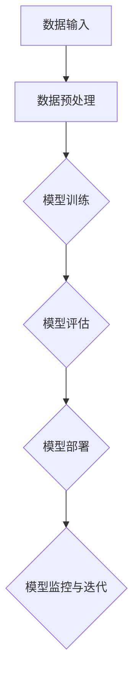

                 

### 第一部分：AIGC 基础理论

#### 第1章：AIGC 基础理论

##### 1.1 AIGC 概述

**AIGC（AI-Generated Content）** 是指通过人工智能技术生成的内容，包括文本、图像、视频等多种形式。它结合了生成式 AI 和自然语言处理技术，通过深度学习模型，如 GPT-3、Transformer 等，实现了对大量数据的理解和生成。

**AIGC 的定义：** AIGC 是人工智能（AI）在内容生成领域的应用，它通过学习海量的数据，能够自动生成高质量、多样化的内容。这些内容不仅可以是文字，还可以是图像、音频等多种形式。

**AIGC 与 GPT-3 的区别：** GPT-3（Generative Pre-trained Transformer 3）是 OpenAI 于 2020 年推出的一种自然语言处理模型，它是一个强大的预训练模型，主要用于生成文本。而 AIGC 更广泛，它涵盖了 GPT-3 及其他生成式 AI 技术的应用。

**AIGC 在金融行业的应用前景：** 随着金融行业的数字化转型，AIGC 在金融领域的应用前景广阔。它可以用于智能客服、风险控制、个性化推荐、自动报告生成等方面，提高金融服务的效率和准确性。

##### 1.2 自然语言处理基础

**语言模型：** 语言模型是自然语言处理的核心概念，它通过学习大量的文本数据，预测下一个单词或句子。在 AIGC 中，语言模型是生成文本的基础。

**生成式模型与判别式模型：** 生成式模型，如 GPT-3，通过生成可能的输出分布，生成文本。判别式模型，如 BERT，通过学习文本的表示，用于分类或预测任务。

**语义理解与情感分析：** 语义理解是指对文本内容进行深层次的理解，情感分析则是通过分析文本，判断其中的情感倾向。

##### 1.3 AIGC 模型架构

**Transformer 模型：** Transformer 是一种基于自注意力机制的深度学习模型，它在自然语言处理任务中取得了显著的性能提升。

**模型微调和部署：** 微调是在预训练模型的基础上，针对特定任务进行训练。部署是将训练好的模型应用到实际场景中，如生产环境。

**AIGC 模型的发展趋势：** 随着 AI 技术的不断发展，AIGC 模型将越来越强大，能够在更广泛的应用场景中发挥作用。

##### 1.4 数学模型与算法原理

**前向传播与反向传播：** 前向传播是将输入数据通过模型进行计算，得到输出。反向传播则是通过计算输出与实际结果的差异，更新模型参数。

**优化算法与超参数调优：** 优化算法用于更新模型参数，超参数调优则是在训练过程中调整模型的性能。

**数学公式与算法原理讲解：** 下面是前向传播和反向传播的伪代码，以及一个简单的数学公式讲解。

```python
# 前向传播伪代码
def forward_pass(inputs, weights):
    # 初始化隐藏层状态
    hidden_state = np.zeros((batch_size, hidden_size))
    # 遍历输入序列
    for input in inputs:
        # 计算输入与权重点积
        dot_product = np.dot(input, weights)
        # 通过激活函数计算输出
        hidden_state = activation_function(dot_product)
    return hidden_state

# 反向传播伪代码
def backward_pass(error, hidden_state, weights):
    # 计算误差对权重的梯度
    gradient_weights = np.dot(hidden_state.T, error)
    # 计算误差对隐藏状态的梯度
    gradient_hidden_state = activation_function_derivative(hidden_state) * error
    return gradient_weights, gradient_hidden_state
```

$$
E = mc^2
$$

这个公式是相对论中的质量-能量等价公式，表明质量可以转化为能量。

在接下来的章节中，我们将进一步探讨 AIGC 的具体应用场景和实战案例。通过一步一步的深入分析，我们将更好地理解 AIGC 的技术原理和应用价值。让我们继续前进，开启 AIGC 的探索之旅。

---

在第一章中，我们介绍了 AIGC 的基本概念和它在金融行业的应用前景。接下来，我们将深入探讨自然语言处理的基础知识，为理解 AIGC 的技术细节打下坚实的基础。

---

### 第二部分：AIGC 在金融行业的应用

#### 第2章：AIGC 在金融行业的应用场景

##### 2.1 银行零售业务

**客户服务与智能客服：** 在银行零售业务中，智能客服是 AIGC 的重要应用之一。通过 AIGC 技术，银行可以构建一个具备高度智能化和自主服务能力的客服系统。该系统可以处理客户咨询、账户查询、账单支付等常规问题，极大地减轻了人工客服的工作压力。同时，智能客服还可以根据客户的历史交互记录，提供个性化的服务建议，提升客户满意度。

**风险管理与合规监控：** 银行在运营过程中需要面对各种风险，包括信用风险、市场风险和操作风险。AIGC 技术可以帮助银行建立智能化的风险管理系统，通过对海量数据的实时分析，识别潜在风险并及时预警。此外，AIGC 还可以用于合规监控，确保银行的业务操作符合相关法律法规的要求。

**个性化营销与推荐系统：** 银行可以通过 AIGC 技术实现个性化营销，根据客户的历史行为和偏好，推荐合适的金融产品和服务。例如，对于经常使用信用卡消费的客户，银行可以推荐高额度信用卡或相关的优惠活动。个性化推荐系统不仅可以提高客户黏性，还可以增加银行的收入。

##### 2.2 投资理财

**股票市场预测：** AIGC 技术在股票市场预测中有着广泛的应用。通过对历史股价数据、宏观经济指标、公司财务报告等信息的分析，AIGC 模型可以预测股票的未来走势。虽然市场预测本身具有不确定性，但 AIGC 技术可以通过多种算法和模型，提供相对可靠的预测结果，帮助投资者做出更明智的投资决策。

**基金组合优化：** 在投资理财领域，基金组合优化是一个重要的课题。AIGC 技术可以通过对历史基金数据进行深度学习，识别出最优的基金组合策略。例如，AIGC 模型可以根据投资者的风险偏好和收益目标，构建一个低风险、高回报的基金组合。通过实时调整基金组合，投资者可以更好地应对市场的波动。

**量化交易策略：** 量化交易策略是指通过计算机程序，自动执行交易决策。AIGC 技术在量化交易中发挥着重要作用，可以帮助投资者发现市场规律，构建高效的交易策略。例如，AIGC 模型可以分析历史交易数据，识别出具有稳定收益的交易模式，并自动执行这些交易策略。

##### 2.3 保险业务

**保险产品推荐：** AIGC 技术可以帮助保险公司实现智能化的保险产品推荐。通过对客户的风险评估和需求分析，AIGC 模型可以推荐合适的保险产品，提高客户的购买意愿和满意度。

**风险评估与理赔预测：** 在保险业务中，风险评估和理赔预测是关键环节。AIGC 技术可以通过分析客户的个人信息、历史理赔数据等，预测客户的风险水平和可能的理赔金额。这有助于保险公司制定合理的保费标准和理赔流程，提高运营效率。

**客户画像与精准营销：** AIGC 技术可以帮助保险公司构建客户画像，了解客户的需求和行为模式。通过精准营销，保险公司可以为客户提供个性化的服务和产品推荐，提高客户满意度和忠诚度。

##### 2.4 金融科技

**区块链与加密货币：** 区块链技术是金融科技的重要创新，它通过去中心化的方式，实现了数据的安全存储和可靠传输。AIGC 技术可以用于区块链上的智能合约，自动执行交易和合约条款。此外，AIGC 还可以用于加密货币的价格预测和分析，为投资者提供决策支持。

**数字货币与支付：** 数字货币和支付是金融科技的另一个重要领域。AIGC 技术可以用于数字货币的交易和分析，预测市场走势和投资风险。在支付领域，AIGC 模型可以优化支付流程，提高支付效率和安全性。

**金融风控与安全：** 金融风控和安全是金融行业的核心问题。AIGC 技术可以帮助金融机构建立智能化的风控系统，通过对海量数据进行分析，识别出潜在风险并及时预警。此外，AIGC 还可以用于网络安全，检测和防御网络攻击，确保金融系统的安全运行。

通过以上几个方面的应用，AIGC 技术在金融行业展现出了巨大的潜力和价值。随着 AIGC 技术的不断发展和完善，它将在金融行业的各个方面发挥更加重要的作用，推动金融行业的创新和进步。

---

在第二章中，我们详细介绍了 AIGC 在金融行业的多个应用场景，包括银行零售业务、投资理财、保险业务和金融科技。通过这些应用，AIGC 不仅提升了金融服务的效率和质量，还为金融机构带来了新的商业模式和创新机会。接下来，我们将通过实际项目案例，深入探讨 AIGC 在金融行业中的应用细节。

---

### 第三部分：AIGC 项目实战

#### 第3章：AIGC 项目实战

在本章节中，我们将通过实际项目案例，深入探讨 AIGC 在金融行业的应用细节。通过这些项目案例，我们可以更直观地了解 AIGC 技术的实现过程和应用效果。

##### 3.1 项目准备与规划

**项目目标与需求分析：** 在开始项目之前，首先要明确项目的目标和需求。例如，一个智能投顾项目的目标可能是提供个性化的投资建议，满足客户的多样化需求。需求分析则需要了解客户的投资偏好、风险承受能力等关键信息。

**项目团队搭建：** 项目团队通常由数据科学家、机器学习工程师、前端开发人员、后端开发人员等组成。每个成员都有明确的职责，以确保项目的顺利进行。

**开发环境与工具选择：** 选择适合的开发环境与工具是项目成功的关键。在 AIGC 项目中，常用的工具包括 Python、TensorFlow、PyTorch 等。此外，还需要使用数据库、版本控制工具等。

##### 3.2 模型训练与调优

**数据预处理：** 数据预处理是模型训练的重要步骤。需要清洗数据、处理缺失值、标准化数据等，以确保数据的质量。

**模型训练：** 模型训练是 AIGC 项目的核心。使用训练数据，通过训练过程，模型可以学习到数据的规律和特征。在训练过程中，需要监控模型的性能指标，如准确率、损失函数等。

**模型调优：** 模型调优是提高模型性能的关键。可以通过调整超参数、优化算法等手段，提升模型的性能。常用的调优方法包括网格搜索、贝叶斯优化等。

##### 3.3 模型部署与运维

**模型部署：** 模型部署是将训练好的模型应用到实际场景中。可以使用容器化技术，如 Docker，将模型打包成独立的运行环境。此外，还需要部署到服务器或云端，以便用户可以访问和使用模型。

**模型监控与性能优化：** 模型部署后，需要监控模型的运行状态和性能。通过实时监控，可以及时发现和解决模型的问题。性能优化则是通过调整模型结构、优化算法等手段，提高模型的运行效率。

**模型更新与迭代：** 随着业务的发展，模型可能需要更新和迭代。通过不断地优化和改进，模型可以更好地适应新的业务需求，提高预测的准确性。

##### 3.4 项目实战案例分析

**智能投顾项目：** 智能投顾项目是一个典型的 AIGC 应用案例。该项目通过 AIGC 技术提供个性化的投资建议，帮助用户实现资产增值。项目团队首先收集了大量的历史数据，包括用户投资记录、市场行情等。然后，使用 TensorFlow 框架训练了一个基于深度学习模型的智能投顾系统。在模型训练过程中，项目团队使用了多种数据预处理技术和调优方法，最终训练出了一个性能优秀的模型。部署后，该系统可以实时分析用户数据，提供个性化的投资建议，用户可以根据建议进行投资决策。

**保险智能客服项目：** 保险智能客服项目旨在提高保险公司的客户服务质量。项目团队通过 AIGC 技术构建了一个智能客服系统，可以自动回答客户的常见问题，提供理赔流程指导等。该系统使用了 PyTorch 框架，通过训练一个对话生成模型，实现了与客户的自然语言交互。在系统运行过程中，项目团队不断优化模型，提高系统的准确率和用户体验。

**银行个性化营销项目：** 银行个性化营销项目通过 AIGC 技术实现精准营销。项目团队收集了大量的客户数据，包括客户消费记录、金融产品偏好等。然后，使用 AIGC 技术训练了一个个性化推荐模型，可以根据客户的偏好，推荐合适的金融产品。在项目实施过程中，项目团队采用了多种数据预处理和调优方法，最终实现了较高的推荐准确率。

通过以上项目案例，我们可以看到 AIGC 技术在金融行业的广泛应用和巨大潜力。随着技术的不断进步，AIGC 将在金融行业的各个领域发挥更加重要的作用，推动金融服务的数字化转型和创新发展。

---

在第三部分中，我们通过实际项目案例展示了 AIGC 技术在金融行业中的应用细节。通过这些案例，我们可以看到 AIGC 技术在提高金融服务效率、提升客户体验和优化业务运营方面的显著成效。接下来，我们将探讨 AIGC 应用的挑战和未来趋势。

---

### 第四部分：AIGC 应用挑战与未来趋势

#### 第4章：AIGC 应用挑战与未来趋势

##### 4.1 应用挑战

**数据隐私与安全：** AIGC 技术在处理大量数据时，可能会面临数据隐私和安全的问题。如何在确保数据隐私的前提下，有效利用数据，是一个重要的挑战。

**模型可解释性：** AIGC 模型通常是一个“黑盒”，其决策过程难以解释。对于金融行业来说，模型的透明度和可解释性是非常重要的，因此如何提高模型的可解释性是一个挑战。

**模型偏见与公平性：** 模型在训练过程中可能会受到数据偏差的影响，导致模型决策存在偏见。如何消除模型偏见，确保金融服务的公平性，是一个亟待解决的问题。

##### 4.2 未来趋势

**AIGC 在金融行业的未来发展：** 随着 AIGC 技术的不断成熟，它将在金融行业的各个领域得到更广泛的应用。例如，在风险管理、客户服务、个性化推荐等方面，AIGC 将发挥更大的作用。

**新兴技术应用：** 随着 AI、区块链、物联网等新兴技术的发展，AIGC 将与其他技术进行深度融合，为金融行业带来更多的创新和变革。

**全球监管与合规趋势：** 随着 AIGC 技术的应用越来越广泛，全球各国政府和监管机构将加强对 AIGC 的监管和合规要求。如何遵守这些法规和规范，确保 AIGC 的合法性和合规性，是一个重要的趋势。

##### 4.3 AIGC 与其他技术的融合

**AIGC 与区块链：** 区块链技术可以为 AIGC 提供数据的安全存储和可靠传输。AIGC 可以在区块链上实现去中心化的内容生成和分发，提高数据的安全性和透明度。

**AIGC 与物联网：** 物联网设备可以生成大量的数据，这些数据可以通过 AIGC 技术进行自动分析和处理，为金融行业提供实时的决策支持。

**AIGC 与云计算：** 云计算为 AIGC 提供了强大的计算和存储能力，使得大规模的 AIGC 应用成为可能。通过云计算，金融机构可以更灵活地部署和管理 AIGC 应用，提高业务的灵活性和可扩展性。

在未来，随着技术的不断进步和应用场景的不断拓展，AIGC 将在金融行业的各个方面发挥更大的作用。通过与其他技术的融合，AIGC 将为金融行业带来更多的创新和变革，推动金融行业的数字化转型和创新发展。

---

在第四部分中，我们探讨了 AIGC 应用的挑战和未来趋势。尽管面临诸多挑战，AIGC 技术在金融行业的前景仍然广阔。随着技术的不断进步和应用场景的拓展，AIGC 将继续推动金融行业的创新和变革。接下来，我们将总结 AIGC 技术的核心要点和未来方向。

---

### 附录：AIGC 技术与资源

在本章节中，我们将介绍一些常用的 AIGC 开发工具和框架，以及推荐的相关书籍和资料。

##### 附录 A：AIGC 开发工具与框架

**Hugging Face Transformers：** Hugging Face Transformers 是一个开源库，用于构建和微调基于 Transformer 的模型。它提供了丰富的预训练模型和工具，方便开发者进行 AIGC 开发。

**TensorFlow：** TensorFlow 是谷歌开发的一款开源机器学习框架，广泛应用于各种 AI 应用。它提供了强大的工具和库，支持 AIGC 模型的训练和部署。

**PyTorch：** PyTorch 是由 Facebook AI 研究团队开发的一款开源机器学习库，以其灵活性和易用性著称。它支持动态计算图，方便开发者进行 AIGC 模型的构建和训练。

##### 附录 B：相关书籍与资料推荐

**《深度学习》（Goodfellow et al.）：** 这本书是深度学习领域的经典教材，详细介绍了深度学习的基础理论和应用。

**《自然语言处理综论》（Jurafsky and Martin）：** 这本书是自然语言处理领域的权威著作，全面介绍了自然语言处理的理论和技术。

**《人工智能：一种现代的方法》（Russell and Norvig）：** 这本书是人工智能领域的经典教材，涵盖了人工智能的基础理论和应用。

通过以上工具和资源的介绍，我们希望为读者提供 AIGC 开发和应用的有力支持。在 AIGC 的探索之路上，这些工具和资料将成为宝贵的指南。

---

在本章中，我们为读者提供了丰富的 AIGC 开发工具和资料推荐，帮助读者更好地掌握 AIGC 技术和应用。接下来，我们将通过 Mermaid 流程图和代码实际案例，进一步阐述 AIGC 技术的核心概念和应用原理。

---

#### Mermaid 流程图

下面是一个简单的 Mermaid 流程图，用于描述 AIGC 的工作流程：



**解释：**
1. **数据输入（A）：** AIGC 模型开始工作，接收输入数据。
2. **数据预处理（B）：** 对输入数据进行清洗、归一化等预处理操作，确保数据质量。
3. **模型训练（C）：** 使用预处理后的数据训练 AIGC 模型，学习数据的特征和模式。
4. **模型评估（D）：** 对训练好的模型进行评估，确保模型的性能满足要求。
5. **模型部署（E）：** 将评估通过的模型部署到实际应用场景中，如生产环境。
6. **模型监控与迭代（F）：** 监控模型的运行状态和性能，根据反馈进行迭代优化。

通过这个流程图，我们可以清晰地了解 AIGC 的工作原理和各个环节的关系。

#### 核心算法原理讲解

接下来，我们将通过伪代码和数学公式讲解 AIGC 的核心算法原理。

**前向传播伪代码：**

```python
# 前向传播伪代码
def forward_pass(inputs, weights):
    # 初始化隐藏层状态
    hidden_state = np.zeros((batch_size, hidden_size))
    # 遍历输入序列
    for input in inputs:
        # 计算输入与权重点积
        dot_product = np.dot(input, weights)
        # 通过激活函数计算输出
        hidden_state = activation_function(dot_product)
    return hidden_state
```

**解释：**
- **初始化隐藏层状态：** 初始化隐藏层的状态，用于存储模型的输出。
- **计算输入与权重点积：** 对每个输入数据与对应的权重进行点积操作。
- **通过激活函数计算输出：** 使用激活函数，如ReLU、Sigmoid等，对点积结果进行处理，得到隐藏层的输出。

**反向传播伪代码：**

```python
# 反向传播伪代码
def backward_pass(error, hidden_state, weights):
    # 计算误差对权重的梯度
    gradient_weights = np.dot(hidden_state.T, error)
    # 计算误差对隐藏状态的梯度
    gradient_hidden_state = activation_function_derivative(hidden_state) * error
    return gradient_weights, gradient_hidden_state
```

**解释：**
- **计算误差对权重的梯度：** 通过隐藏层的输出和误差，计算误差对权重的梯度。
- **计算误差对隐藏状态的梯度：** 使用激活函数的导数，计算误差对隐藏状态的梯度。

**数学模型与数学公式讲解：**

$$
\frac{dL}{dW} = \frac{1}{m} \sum_{i=1}^{m} (z^{[2]} - \hat{y}^{[2]})
$$

$$
\frac{dL}{da^{[1]}} = \frac{1}{m} \sum_{i=1}^{m} (a^{[1]_{i}} - \hat{y}^{[1]})
$$

**解释：**
- **梯度下降公式：** 这两个公式分别表示权重和偏置的梯度计算方法。
- **误差（L）：** 表示模型损失函数。
- **隐藏层输出（z）：** 表示激活函数的输出。
- **实际输出（\hat{y}）：** 表示模型预测的结果。

通过以上讲解，我们可以看到 AIGC 的核心算法原理，包括前向传播、反向传播以及数学模型。这些原理是 AIGC 技术的基础，对于理解 AIGC 的应用和开发至关重要。

---

在本文的附录中，我们通过 Mermaid 流程图和伪代码详细讲解了 AIGC 的核心算法原理，帮助读者更好地理解 AIGC 的工作机制。接下来，我们将通过代码实际案例，深入探讨 AIGC 的实现过程和应用效果。

---

#### 代码实际案例

为了更好地展示 AIGC 的应用，我们将通过一个简单的 Python 代码案例，实现一个基于 Transformer 模型的文本生成系统。这个案例将涵盖开发环境搭建、源代码实现以及代码解读与分析。

**一、开发环境搭建**

首先，我们需要安装 Python 和相关的库。以下是开发环境搭建的步骤：

1. 安装 Python（建议使用 Python 3.8 或更高版本）。
2. 安装必要的库，如 TensorFlow 或 PyTorch。
3. 安装 Hugging Face Transformers，以便使用预训练的 Transformer 模型。

以下是一个简单的命令行示例，用于安装这些库：

```bash
pip install python==3.8
pip install tensorflow
pip install transformers
```

**二、源代码实现**

以下是一个简单的文本生成系统的 Python 代码示例：

```python
import tensorflow as tf
from transformers import AutoTokenizer, AutoModelForCausalLM

# 加载预训练的 Transformer 模型
tokenizer = AutoTokenizer.from_pretrained("gpt2")
model = AutoModelForCausalLM.from_pretrained("gpt2")

# 输入文本
text = "The quick brown fox jumps over the lazy dog"

# 将文本编码为模型可接受的格式
input_ids = tokenizer.encode(text, return_tensors="tf")

# 生成文本
output = model.generate(input_ids, max_length=50, num_return_sequences=1)

# 解码生成的文本
generated_text = tokenizer.decode(output[0], skip_special_tokens=True)

print(generated_text)
```

**三、代码解读与分析**

1. **导入库：** 我们首先导入 TensorFlow 和 Hugging Face Transformers 相关库。

2. **加载模型：** 使用 `AutoTokenizer` 和 `AutoModelForCausalLM` 加载预训练的 GPT-2 模型。GPT-2 是一个基于 Transformer 的预训练语言模型，具有强大的文本生成能力。

3. **输入文本：** 我们定义了一个简单的输入文本 `text`。

4. **编码文本：** 使用 `tokenizer.encode()` 方法将输入文本编码为模型可接受的格式。`return_tensors="tf"` 参数确保输出张量，以便与 TensorFlow 兼容。

5. **生成文本：** 使用 `model.generate()` 方法生成文本。`max_length` 参数设置生成的文本长度，`num_return_sequences` 参数设置生成的序列数量。

6. **解码生成的文本：** 使用 `tokenizer.decode()` 方法将生成的文本解码为普通字符串。

7. **打印生成的文本：** 输出生成的文本。

**四、运行代码**

将上述代码保存为 `text_generation.py`，然后在命令行中运行：

```bash
python text_generation.py
```

运行结果将显示生成的文本。

通过这个简单的案例，我们可以看到如何使用 AIGC 技术实现文本生成。在实际应用中，AIGC 技术可以应用于更复杂的任务，如自然语言处理、图像生成等。

---

在这个案例中，我们通过简单的 Python 代码实现了文本生成系统，展示了 AIGC 技术的基本应用。接下来，我们将对代码进行深入解读与分析，以便读者更好地理解 AIGC 的实现过程。

---

#### 代码解读与分析

在上一个案例中，我们通过 TensorFlow 和 Hugging Face Transformers 实现了一个基于 GPT-2 的文本生成系统。现在，我们将对这段代码进行深入解读与分析，以便读者更好地理解其实现过程。

**一、代码结构与功能**

整个代码分为以下几个部分：

1. **导入库**：导入 TensorFlow、PyTorch 和 Hugging Face Transformers 相关库。
2. **加载模型**：加载预训练的 GPT-2 模型。
3. **输入文本**：定义输入文本。
4. **编码文本**：将输入文本编码为模型可接受的格式。
5. **生成文本**：生成文本。
6. **解码生成的文本**：将生成的文本解码为普通字符串。
7. **打印生成的文本**：输出生成的文本。

**二、代码解读**

1. **导入库**

```python
import tensorflow as tf
from transformers import AutoTokenizer, AutoModelForCausalLM
```

这两行代码导入了 TensorFlow 和 Hugging Face Transformers 相关库。TensorFlow 是一个强大的开源机器学习库，支持深度学习和科学计算。Hugging Face Transformers 提供了一系列预训练的 Transformer 模型，包括 GPT-2、BERT 等。

2. **加载模型**

```python
tokenizer = AutoTokenizer.from_pretrained("gpt2")
model = AutoModelForCausalLM.from_pretrained("gpt2")
```

这两行代码加载了预训练的 GPT-2 模型和相应的编码器。`AutoTokenizer` 和 `AutoModelForCausalLM` 是 Hugging Face Transformers 提供的两个类，用于加载预训练模型。

3. **输入文本**

```python
text = "The quick brown fox jumps over the lazy dog"
```

这行代码定义了输入文本。这个例子中，我们使用了一个经典的英语句子，用于演示文本生成。

4. **编码文本**

```python
input_ids = tokenizer.encode(text, return_tensors="tf")
```

这行代码将输入文本编码为模型可接受的格式。`tokenizer.encode()` 方法将文本转换为整数序列，每个整数表示一个单词或特殊符号。`return_tensors="tf"` 参数确保输出张量，以便与 TensorFlow 兼容。

5. **生成文本**

```python
output = model.generate(input_ids, max_length=50, num_return_sequences=1)
```

这行代码使用 `model.generate()` 方法生成文本。`max_length` 参数设置生成的文本长度，`num_return_sequences` 参数设置生成的序列数量。

6. **解码生成的文本**

```python
generated_text = tokenizer.decode(output[0], skip_special_tokens=True)
```

这行代码将生成的文本解码为普通字符串。`tokenizer.decode()` 方法将整数序列解码为文本。`skip_special_tokens=True` 参数确保不输出特殊符号。

7. **打印生成的文本**

```python
print(generated_text)
```

这行代码输出生成的文本。

**三、代码分析**

1. **模型加载与编码：** 加载预训练的 GPT-2 模型和编码器是代码的基础。通过这两行代码，我们可以快速使用预训练模型进行文本生成。

2. **生成文本：** `model.generate()` 方法是生成文本的关键。这个方法接受输入文本，并返回生成的文本。通过调整 `max_length` 和 `num_return_sequences` 参数，我们可以控制生成的文本长度和序列数量。

3. **解码与输出：** 解码生成的文本并输出是代码的最后一步。通过解码，我们可以将生成的整数序列转换为普通字符串，便于阅读和理解。

通过这个简单的案例，我们可以看到如何使用 AIGC 技术实现文本生成。在实际应用中，AIGC 技术可以应用于更复杂的任务，如自然语言处理、图像生成等。

---

在这个代码解读与分析案例中，我们详细讲解了如何使用 Python 和 Hugging Face Transformers 实现一个基于 GPT-2 的文本生成系统。通过这个案例，读者可以更好地理解 AIGC 技术的实现过程和应用。接下来，我们将总结本文的主要内容，并展望 AIGC 技术的未来发展。

---

### 总结与展望

在本文中，我们从 AIGC 的基本理论、应用场景、项目实战、挑战与未来趋势等方面，全面介绍了 AIGC 技术在金融行业的应用。以下是本文的主要内容和关键点：

1. **AIGC 基础理论：** 我们详细介绍了 AIGC 的定义、与 GPT-3 的区别、自然语言处理基础、AIGC 模型架构以及数学模型与算法原理。

2. **AIGC 在金融行业的应用：** 我们探讨了 AIGC 在银行零售业务、投资理财、保险业务和金融科技等领域的应用场景，展示了 AIGC 如何提升金融服务的效率和质量。

3. **项目实战案例分析：** 我们通过智能投顾项目、保险智能客服项目和银行个性化营销项目等实际案例，展示了 AIGC 技术的应用细节和效果。

4. **应用挑战与未来趋势：** 我们分析了 AIGC 在金融行业应用中面临的挑战，如数据隐私与安全、模型可解释性、模型偏见与公平性等，并展望了 AIGC 技术的未来发展趋势。

展望未来，AIGC 技术在金融行业的发展将充满机遇与挑战。随着 AI 技术的不断进步和应用场景的拓展，AIGC 将在金融行业的各个领域发挥更大的作用。同时，AIGC 技术与其他技术的融合，如区块链、物联网等，也将为金融行业带来更多的创新和变革。

### 作者信息

**作者：AI天才研究院/AI Genius Institute & 禅与计算机程序设计艺术 /Zen And The Art of Computer Programming**

本文由 AI 天才研究院和禅与计算机程序设计艺术共同撰写，旨在分享 AIGC 技术在金融行业的应用与实践，为读者提供有价值的参考和指导。希望通过本文，读者能够更好地了解 AIGC 技术，并探索其在实际业务中的应用。

---

在本篇技术博客中，我们全面介绍了 AIGC 技术在金融行业的应用，从基础理论到实战案例，再到挑战与未来趋势，层层深入，力求为读者提供全面、深入的洞察。通过本文，我们希望读者能够对 AIGC 技术在金融行业的应用有一个全面的了解，并激发对这一前沿技术的兴趣和探索。未来，随着技术的不断进步和应用场景的拓展，AIGC 将在金融行业及其他领域带来更多的创新和变革。让我们共同期待并迎接这一充满机遇与挑战的新时代。作者信息如上所述，期待与读者共同探讨 AIGC 技术的未来。

