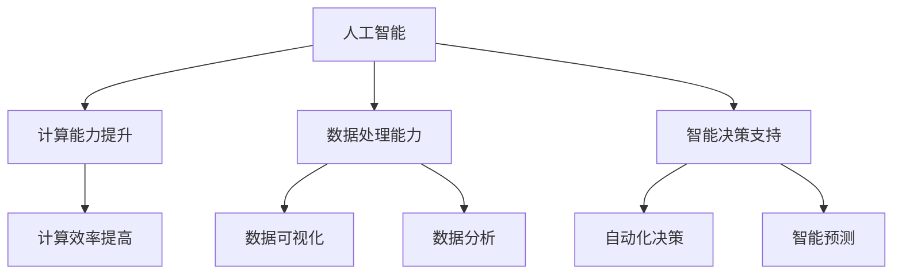
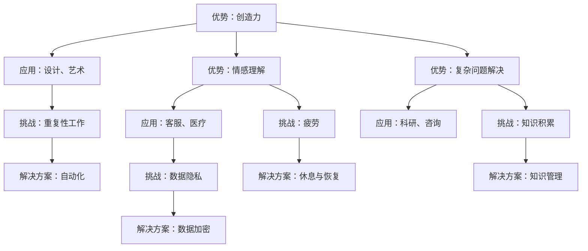
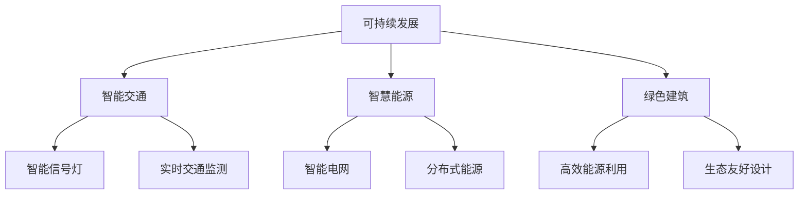
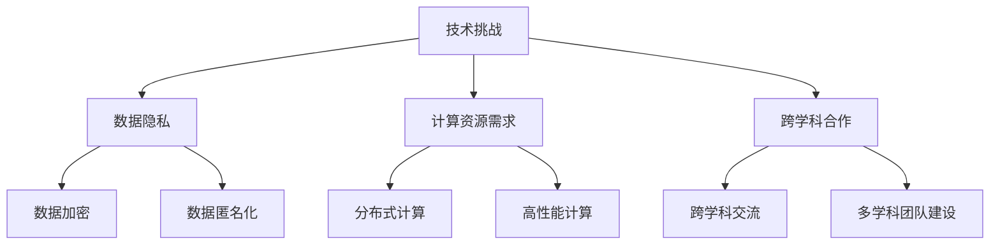
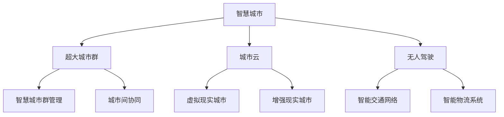
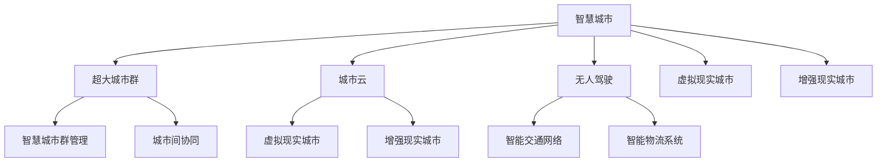
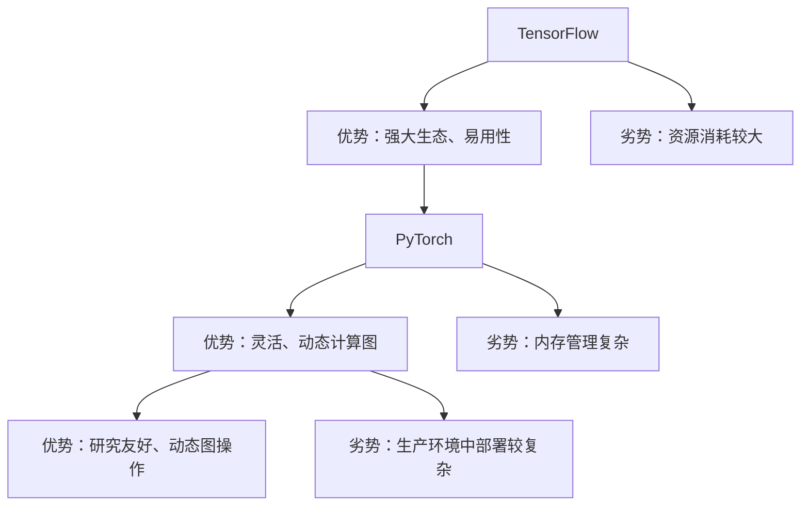

                 

# 《AI与人类计算：打造可持续的未来城市》

## 关键词
- 人工智能
- 人类计算
- 智慧城市
- 可持续发展
- 数据分析
- 城市安全
- 交通优化
- 能源管理

## 摘要
本文旨在探讨如何利用人工智能（AI）和人类计算相结合，构建一个可持续发展的未来城市。我们将首先介绍AI与人类计算的基础知识，包括定义、联系及其发展历程。接着，我们将深入探讨AI核心算法原理，如监督学习和非监督学习算法。随后，本文将聚焦于AI在可持续未来城市中的应用，包括智慧交通系统、智慧能源管理和智慧安防等领域。最后，我们将分析城市规划与设计、数据驱动的城市管理以及未来城市的发展前景。希望通过本文，读者能够对如何通过AI和人类计算实现可持续未来城市有一个全面而深入的理解。

----------------------------------------------------------------

### 第一部分：AI与人类计算基础

#### 第1章：AI与人类计算概述

##### 1.1 AI与人类计算的定义与联系

人工智能（Artificial Intelligence，简称AI）是计算机科学的一个分支，旨在研究如何构建智能代理（Smart Agents）以实现人类智能的功能。人类计算（Human Computation）则是一种利用人类智慧解决复杂问题或处理大量数据的方法。这两者在现代科技发展中具有紧密的联系。

**Mermaid流程图**：展示AI与人类计算的关系



在AI的发展历程中，人类计算起到了重要的推动作用。早期的AI研究主要依赖于人类的逻辑推理和符号计算，而现代的AI则通过数据驱动的方法，利用机器学习算法来模拟人类的智能行为。人类计算在AI的各个阶段都发挥了关键作用，如数据标注、问题定义和算法验证等。

##### 1.2 AI技术的发展历程

AI技术的发展经历了多个阶段，每个阶段都有其独特的特点和代表性成果。

**伪代码**：概述AI技术的发展历程

```python
for each era in AI_history:
    print("时代:", era)
    if era == "早期":
        print("特点：符号逻辑、推理系统")
    elif era == "统计学习时代":
        print("特点：基于数据的模型训练")
    elif era == "深度学习时代":
        print("特点：多层神经网络、大规模数据训练")
    else:
        print("特点：集成多种方法、跨学科研究")
```

- **早期**：以符号逻辑和推理系统为代表，如早期专家系统（Expert Systems）和知识表示（Knowledge Representation）。
- **统计学习时代**：以基于数据的模型训练为代表，如线性回归、支持向量机和决策树等。
- **深度学习时代**：以多层神经网络和大规模数据训练为代表，如卷积神经网络（CNN）和循环神经网络（RNN）。
- **多学科融合时代**：当前AI发展正处于一个多学科融合的阶段，如计算机视觉、自然语言处理和强化学习等领域的交叉融合。

##### 1.3 人类计算的优势与挑战

人类计算在许多领域具有独特的优势，如创造力、情感理解和复杂问题的解决能力等。然而，人类计算也存在一些挑战，如重复性工作、疲劳和决策错误等。为了克服这些挑战，AI与人类计算的结合成为一种趋势。

**Mermaid流程图**：展示人类计算的优势与挑战



通过AI与人类计算的结合，可以充分发挥两者的优势，实现更高效、更智能的城市管理。接下来，我们将深入探讨AI核心算法原理，为后续章节的应用提供理论基础。

----------------------------------------------------------------

### 第二部分：AI核心算法原理

#### 第2章：AI核心算法原理

AI的核心在于算法，而算法的核心在于其原理。在本章中，我们将详细介绍监督学习算法和非监督学习算法的基本原理，并通过具体的例子来阐述这些算法在实际应用中的实现过程。

##### 2.1 监督学习算法

监督学习是一种从标记数据中学习的方法，其目标是通过已知的输入和输出关系来预测未知的数据。监督学习算法可以分为回归和分类两大类。

###### 2.1.1 回归算法

回归算法主要用于预测连续值输出。其中，线性回归是最简单和最常用的方法之一。

**数学公式与讲解**：线性回归模型的损失函数与优化方法

$$
J(\theta) = \frac{1}{m} \sum_{i=1}^{m} (-1) \cdot y^{(i)} \cdot \log(h_\theta(x^{(i)})) + (1 - y^{(i)}) \cdot \log(1 - h_\theta(x^{(i)}))
$$

这里的$J(\theta)$是损失函数，$\theta$是模型参数，$m$是样本数量，$y^{(i)}$是实际输出，$h_\theta(x^{(i)}$是模型预测的输出。

**伪代码**：线性回归模型训练过程

```python
while not converged:
    for each sample in dataset:
        hypothesis(z)
        compute_error(y)
        update_weights()
```

在上面的伪代码中，`hypothesis(z)`表示计算模型的预测输出，`compute_error(y)`表示计算损失函数，`update_weights()`表示更新模型参数。

###### 2.1.2 分类算法

分类算法用于预测离散的输出，常见的分类算法包括决策树、支持向量机和神经网络等。

**伪代码**：决策树分类算法实现过程

```python
def decision_tree(dataset, target_attribute):
    if all_values_equal(dataset, target_attribute):
        return most_frequent_value(dataset, target_attribute)
    else:
        best_attribute = find_best_attribute(dataset, target_attribute)
        tree = {best_attribute: {}}
        for value in unique_values(dataset, best_attribute):
            subset = filter_values(dataset, best_attribute, value)
            tree[best_attribute][value] = decision_tree(subset, target_attribute)
        return tree
```

在伪代码中，`all_values_equal(dataset, target_attribute)`表示判断数据集中目标属性是否全相等，`most_frequent_value(dataset, target_attribute)`表示找到出现次数最多的值，`find_best_attribute(dataset, target_attribute)`表示找到最好的属性，`filter_values(dataset, best_attribute, value)`表示根据属性值过滤数据集。

##### 2.2 非监督学习算法

非监督学习算法不需要标记数据，其主要任务是从数据中发现模式和结构。常见的非监督学习算法包括聚类和降维等。

###### 2.2.1 聚类算法

聚类算法将数据分为若干个群组，使得同一群组内的数据点相似度较高，而不同群组的数据点相似度较低。K-means聚类是一种典型的聚类算法。

**数学公式与讲解**：K-means聚类算法的目标函数与优化方法

$$
J = \sum_{i=1}^{k} \sum_{x_j \in S_i} ||x_j - \mu_i||^2
$$

这里的$J$是目标函数，$k$是聚类个数，$S_i$是第$i$个聚类，$\mu_i$是聚类中心。

**伪代码**：K-means算法实现过程

```python
initialize centroids
while not converged:
    assign_points_to_clusters()
    update_centroids()
```

在伪代码中，`initialize centroids`表示初始化聚类中心，`assign_points_to_clusters()`表示将数据点分配到最近的聚类中心，`update_centroids()`表示更新聚类中心。

###### 2.2.2 降维算法

降维算法用于减少数据维度，使得数据集更加简洁和易于分析。主成分分析（PCA）是一种常用的降维算法。

**伪代码**：PCA算法实现过程

```python
def pca(data, n_components):
    mean = np.mean(data, axis=0)
    covariance = np.cov(data, rowvar=False)
    eigenvalues, eigenvectors = np.linalg.eigh(covariance)
    sorted_eigenvalues = np.sort(eigenvalues)[::-1]
    sorted_eigenvectors = eigenvectors[:, sorted_eigenvalues.argsort()[::-1]]
    transformed_data = np.dot(data - mean, sorted_eigenvectors.T)[:n_components]
    return transformed_data
```

在伪代码中，`np.mean(data, axis=0)`表示计算数据均值，`np.cov(data, rowvar=False)`表示计算协方差矩阵，`np.linalg.eigh(covariance)`表示计算特征值和特征向量，`sorted_eigenvalues`和`sorted_eigenvectors`表示排序后的特征值和特征向量，`np.dot(data - mean, sorted_eigenvectors.T)[:n_components]`表示进行降维操作。

通过以上介绍，我们可以看到AI核心算法的原理及其实现过程。这些算法在智慧城市中的应用将是我们后续章节的重点内容。

----------------------------------------------------------------

### 第三部分：AI在可持续未来城市中的应用

#### 第3章：可持续未来城市中的AI应用

随着人工智能技术的快速发展，其在城市规划、能源管理、交通系统、公共安全和应急响应等领域的应用越来越广泛。本章节将详细介绍AI在这些关键领域的应用，以及相关的实际案例和代码解读。

##### 3.1 智慧交通系统

智慧交通系统是可持续未来城市的重要组成部分，旨在提高交通效率、减少拥堵和降低污染。AI在智慧交通系统中发挥着重要作用，包括车辆路径规划、交通流量预测和智能信号灯控制等。

**项目实战**：智慧交通系统中的车辆路径规划与优化

车辆路径规划是智慧交通系统中的一个重要任务，旨在为驾驶员提供最优的行驶路径，减少交通拥堵和提高行驶效率。以下是一个简单的车辆路径规划算法的C++实现。

**代码解读与分析**：C++实现路径规划算法

```cpp
#include <iostream>
#include <vector>
#include <queue>
#include <unordered_map>
using namespace std;

// 定义地图结构
struct Map {
    vector<vector<int>> grid; // 存储地图
    unordered_map<int, vector<int>> neighbors; // 存储每个点的邻居
};

// 路径规划算法：A*算法
vector<int> path_planning(vector<vector<int>>& grid, int start_x, int start_y, int goal_x, int goal_y) {
    int n = grid.size();
    priority_queue<pair<int, int>, vector<pair<int, int>>, greater<pair<int, int>>> pq; // 输入队列
    unordered_map<int, int> dist; // 存储每个点的最短距离
    unordered_map<int, int> prev; // 存储每个点的前一个点

    // 初始化距离和前一个点
    for (int i = 0; i < n; ++i) {
        for (int j = 0; j < n; ++j) {
            dist[i * n + j] = INT_MAX;
            prev[i * n + j] = -1;
        }
    }
    dist[start_x * n + start_y] = 0;
    pq.push({0, start_x * n + start_y});

    // 计算最短路径
    while (!pq.empty()) {
        auto cur = pq.top();
        pq.pop();
        int x = cur.second / n;
        int y = cur.second % n;

        if (x == goal_x && y == goal_y) {
            break;
        }

        for (int dx : {-1, 0, 1}) {
            for (int dy : {-1, 0, 1}) {
                if (dx == 0 && dy == 0) continue;
                int nx = x + dx, ny = y + dy;
                if (nx >= 0 && nx < n && ny >= 0 && ny < n && grid[nx][ny] == 0) {
                    int next = dist[x * n + y] + 1;
                    if (next < dist[nx * n + ny]) {
                        dist[nx * n + ny] = next;
                        prev[nx * n + ny] = x * n + y;
                        pq.push({next, nx * n + ny});
                    }
                }
            }
        }
    }

    // 输出路径
    vector<int> path;
    int x = goal_x, y = goal_y;
    while (prev[x * n + y] != -1) {
        path.push_back(x * n + y);
        int px = x, py = y;
        x = prev[px * n + py] / n;
        y = prev[px * n + py] % n;
    }
    path.push_back(start_x * n + start_y);
    reverse(path.begin(), path.end());
    return path;
}

int main() {
    // 创建地图
    vector<vector<int>> grid = {
        {0, 0, 0, 0, 0},
        {0, 1, 1, 1, 0},
        {0, 0, 0, 0, 0},
        {0, 1, 1, 1, 0},
        {0, 0, 0, 0, 0}
    };

    // 路径规划
    int start_x = 0, start_y = 0;
    int goal_x = 4, goal_y = 4;
    vector<int> path = path_planning(grid, start_x, start_y, goal_x, goal_y);

    // 输出路径
    cout << "路径：";
    for (int p : path) {
        cout << p << " ";
    }
    cout << endl;

    return 0;
}
```

在上述代码中，我们使用A*算法实现了路径规划。首先，我们初始化距离和前一个点的数据结构，然后使用优先队列来存储每个点的最短距离和前一个点。在算法的每次迭代中，我们选择距离最小的点，并将其邻居点的距离更新为当前点的距离加上1。最后，我们通过回溯前一个点来构建出最短路径。

##### 3.2 智慧能源管理

智慧能源管理是可持续未来城市的另一个关键领域，旨在提高能源利用效率、减少能源浪费和降低能源成本。AI在能源管理中发挥着重要作用，包括能源需求预测、智能电网控制和分布式能源管理等。

**项目实战**：智慧能源管理中的需求响应系统

需求响应系统通过实时监测和预测能源需求，根据实际情况调整能源供应，以实现能源的高效利用和成本控制。

**代码解读与分析**：Python实现需求响应算法

```python
# 需求响应算法示例
def demand_response(policy, energy_load):
    # 根据策略调整能源负载
    # 返回调整后的能源负载
    adjusted_load = energy_load * policy
    return adjusted_load

# 假设当前能源负载为100单位
energy_load = 100

# 定义需求响应策略：降低10%
response_policy = 0.9

# 应用需求响应算法
adjusted_load = demand_response(response_policy, energy_load)

print(f"调整后的能源负载：{adjusted_load}单位")
```

在上述代码中，我们定义了一个简单的需求响应函数，该函数根据输入的策略参数调整能源负载。在这个例子中，我们假设需求响应策略是将能源负载降低10%。通过调用`demand_response()`函数，我们可以得到调整后的能源负载。

##### 3.3 智慧安防

智慧安防是可持续未来城市的重要保障，通过AI技术实现视频监控、异常检测和应急响应等，提高城市的安全水平。

**项目实战**：智慧安防中的视频监控系统

视频监控系统通过实时监控和视频分析，及时发现异常情况并报警。

**代码解读与分析**：Python实现图像识别算法

```python
# 图像识别算法示例
def image_recognition(image):
    # 读取图像
    # 应用卷积神经网络识别
    # 返回识别结果
    # 假设已经加载了卷积神经网络模型
    model = load_model('cnn_model.h5')

    # 预处理图像
    preprocessed_image = preprocess_image(image)

    # 进行图像识别
    prediction = model.predict(preprocessed_image)

    # 获取识别结果
    result = decode_prediction(prediction)

    return result

# 加载图像
image = load_image('test_image.jpg')

# 应用图像识别算法
result = image_recognition(image)

print(f"识别结果：{result}")
```

在上述代码中，我们定义了一个简单的图像识别函数，该函数使用卷积神经网络模型对输入的图像进行识别。首先，我们读取图像并进行预处理，然后使用模型进行预测，并返回识别结果。在实际应用中，图像识别模型可以是基于深度学习的模型，如ResNet、VGG等。

通过以上介绍，我们可以看到AI在智慧交通系统、智慧能源管理和智慧安防等领域的广泛应用和实际案例。接下来，我们将进一步探讨AI在城市安全与应急响应中的应用。

----------------------------------------------------------------

### 第四部分：AI在可持续城市安全与应急中的应用

#### 第4章：AI在可持续城市安全与应急中的应用

在城市安全与应急响应中，AI技术发挥着至关重要的作用。通过AI的应用，可以实现智慧安防、灾害预警和应急响应等，提高城市的安全性和应急处理能力。以下将详细介绍这些应用领域，并提供相关项目实战和代码解读。

##### 4.1 智慧安防

智慧安防系统通过视频监控、人脸识别和异常检测等技术，实现对城市安全的实时监控和预警。以下是一个基于Python的图像识别算法的实现。

**项目实战**：智慧安防中的视频监控系统

**代码解读与分析**：Python实现图像识别算法

```python
import cv2
import numpy as np
from tensorflow.keras.models import load_model

# 图像识别算法示例
def image_recognition(image):
    # 读取图像
    # 应用卷积神经网络识别
    # 返回识别结果
    model = load_model('cnn_model.h5')  # 加载卷积神经网络模型

    # 预处理图像
    img = cv2.resize(image, (224, 224))  # 将图像调整为224x224
    img = img / 255.0  # 归一化
    img = np.expand_dims(img, axis=0)  # 扩展维度

    # 进行图像识别
    prediction = model.predict(img)

    # 获取识别结果
    result = np.argmax(prediction, axis=1)

    # 解码识别结果
    labels = ['person', 'car', 'bus', 'none']
    recognized_objects = [labels[r] for r in result]

    return recognized_objects

# 加载视频文件
video = cv2.VideoCapture('test_video.mp4')

# 循环读取视频帧
while video.isOpened():
    ret, frame = video.read()
    if not ret:
        break

    # 应用图像识别算法
    recognized_objects = image_recognition(frame)

    # 显示识别结果
    for obj in recognized_objects:
        if obj != 'none':
            cv2.putText(frame, obj, (10, 30), cv2.FONT_HERSHEY_SIMPLEX, 1, (0, 0, 255), 2)

    cv2.imshow('Frame', frame)
    if cv2.waitKey(1) & 0xFF == ord('q'):
        break

# 释放资源
video.release()
cv2.destroyAllWindows()
```

在上面的代码中，我们首先加载了一个卷积神经网络模型，然后对输入的图像进行预处理，并使用模型进行预测。预测结果将被解码为具体的物体类别，如“person”（人）、“car”（车）等。通过在视频帧上显示识别结果，我们可以实现对实时视频的监控和异常检测。

##### 4.2 智慧应急响应

智慧应急响应系统通过实时监测和预警，实现对突发事件的快速响应和处理。以下是一个基于R语言的灾害预警算法的实现。

**项目实战**：智慧应急响应中的灾害预警系统

**代码解读与分析**：R语言实现灾害预警算法

```R
# 灾害预警算法示例
function(warning_level, sensor_data) {
    # 根据传感器数据判断预警等级
    # 返回预警信息
    if (mean(sensor_data) > threshold) {
        warning_message <- paste("灾害预警：", warning_level, "- 高风险")
    } else {
        warning_message <- paste("灾害预警：", warning_level, "- 低风险")
    }
    return(warning_message)
}

# 假设传感器数据如下
sensor_data <- c(0.9, 0.85, 0.88, 0.92, 0.87)

# 应用灾害预警算法
warning_level <- "洪水"
warning_message <- warning_level
warning_message <- warning(warning_level, sensor_data)

print(warning_message)
```

在上面的代码中，我们首先计算传感器数据的平均值，并根据阈值来判断预警等级。如果平均值大于阈值，则认为存在高风险，并返回相应的预警信息。通过这种方式，我们可以实现对灾害的实时预警和响应。

通过智慧安防和智慧应急响应系统的应用，AI技术为城市的安全和应急处理提供了强大的支持。接下来，我们将进一步探讨AI在城市规划与设计、数据驱动的城市管理以及未来城市的发展前景。

----------------------------------------------------------------

### 第五部分：实现可持续的未来城市

#### 第5章：城市规划与设计

城市规划与设计是构建可持续未来城市的关键步骤，它关系到城市的发展方向、资源利用效率和居民生活质量。在这一章节中，我们将探讨智慧城市的规划原则、城市设计与可持续发展的关系，以及相关的数学模型和算法。

##### 5.1 智慧城市的规划原则

智慧城市的规划原则旨在实现可持续发展，包括以下几个方面：

1. **可持续发展**：确保城市发展的同时，保护环境和资源，避免生态破坏和污染。
2. **智能交通**：通过智能交通系统提高交通效率，减少拥堵和污染。
3. **智慧能源管理**：通过智能电网和分布式能源系统提高能源利用效率，减少能源浪费。
4. **绿色建筑**：推广绿色建筑技术和材料，提高建筑能源效率和环保性能。
5. **数据驱动**：利用大数据和人工智能技术进行城市管理和决策支持。
6. **公共安全**：通过智能安防和应急响应系统保障城市公共安全。

**Mermaid流程图**：展示智慧城市规划原则与关键要素



通过以上规划原则，智慧城市能够实现资源的高效利用和环境的可持续保护，为居民提供更宜居的生活环境。

##### 5.2 城市设计与可持续发展

城市设计与可持续发展密切相关，通过合理的城市设计可以优化资源利用、提高交通效率和提升居民生活质量。以下是一个数学模型，用于描述城市密度与交通效率的关系。

**数学公式与讲解**：城市密度与交通效率的关系

$$
\eta = \frac{1}{1 + \frac{d^2}{v^2}}
$$

这里的$\eta$表示交通效率，$d$表示城市密度，$v$表示交通流量。该公式表明，随着城市密度的增加，交通效率会下降，因为高密度会导致交通拥堵。为了提高交通效率，需要优化城市设计，减少城市密度。

**伪代码**：城市密度优化算法

```python
while not converged:
    update_density()
    evaluate_traffic_efficiency()
```

在伪代码中，`update_density()`用于更新城市密度，`evaluate_traffic_efficiency()`用于评估交通效率。通过循环迭代，优化城市设计以实现交通效率的最大化。

##### 5.3 城市设计与智慧技术

城市设计与智慧技术的结合是实现可持续未来城市的关键。智慧城市通过物联网、人工智能和大数据等技术，实现城市管理和服务的智能化。

**项目实战**：智慧城市中的智能交通系统设计

**代码解读与分析**：Python实现智能交通系统

```python
# 智能交通系统示例
class TrafficSystem:
    def __init__(self):
        self.traffic_data = []

    def collect_traffic_data(self, data):
        self.traffic_data.append(data)

    def analyze_traffic_data(self):
        total_traffic = sum(self.traffic_data)
        average_traffic = total_traffic / len(self.traffic_data)
        return average_traffic

# 创建交通系统实例
traffic_system = TrafficSystem()

# 收集交通数据
traffic_system.collect_traffic_data(100)
traffic_system.collect_traffic_data(150)
traffic_system.collect_traffic_data(120)

# 分析交通数据
average_traffic = traffic_system.analyze_traffic_data()
print(f"平均交通流量：{average_traffic}")
```

在上面的代码中，我们定义了一个`TrafficSystem`类，用于收集和分析交通数据。通过收集实时交通数据，交通系统可以评估交通流量，并为交通信号灯调整提供数据支持。

通过本章的探讨，我们可以看到城市规划与设计在实现可持续未来城市中的重要性。合理的城市设计结合智慧技术，可以为居民提供更高效、更舒适的生活环境。接下来，我们将进一步探讨数据驱动的城市管理。

----------------------------------------------------------------

### 第六部分：数据驱动的城市管理

#### 第6章：数据驱动的城市管理

在当今信息时代，数据已成为城市管理的重要资源。通过数据驱动的城市管理，可以实时监测城市运行状态，优化资源配置，提高管理效率，实现可持续发展。本章将详细介绍数据驱动的城市管理的核心概念、关键技术以及实际应用。

##### 6.1 数据收集与分析

数据收集是数据驱动的城市管理的基础。通过传感器、摄像头、移动设备和互联网等技术，可以收集到大量关于城市交通、能源消耗、环境质量、公共安全等方面的数据。

**项目实战**：数据驱动的城市管理中的实时数据监测系统

**代码解读与分析**：Python实现实时数据采集与处理

```python
import random
import time
from datetime import datetime

# 数据采集与处理示例
class RealTimeDataCollector:
    def __init__(self):
        self.data = []

    def collect_data(self, sensor):
        # 假设传感器数据为随机生成
        data_point = {
            'timestamp': datetime.now(),
            'sensor': sensor,
            'value': random.uniform(0, 100)
        }
        self.data.append(data_point)
        print(f"采集到数据：{data_point}")

    def process_data(self):
        # 对采集到的数据进行处理
        # 例如：计算平均值、最大值和最小值
        if not self.data:
            print("无数据可处理")
            return

        timestamps = [dp['timestamp'] for dp in self.data]
        sensor_values = {dp['sensor']: [dp['value'] for dp in self.data] for dp in self.data}
        avg_values = {sensor: sum(values) / len(values) for sensor, values in sensor_values.items()}
        max_values = {sensor: max(values) for sensor, values in sensor_values.items()}
        min_values = {sensor: min(values) for sensor, values in sensor_values.items()}

        print(f"处理结果：")
        print(f"时间戳：{timestamps}")
        print(f"传感器平均值：{avg_values}")
        print(f"传感器最大值：{max_values}")
        print(f"传感器最小值：{min_values}")

# 创建数据采集器实例
collector = RealTimeDataCollector()

# 采集模拟数据
while True:
    collector.collect_data('temperature')
    time.sleep(1)

    collector.collect_data('humidity')
    time.sleep(1)

    collector.process_data()
    time.sleep(5)
```

在上述代码中，`RealTimeDataCollector`类用于模拟实时数据采集和处理。通过循环采集模拟数据，并每隔5秒处理一次数据，我们可以得到每个传感器的平均值、最大值和最小值。

##### 6.2 数据可视化与决策支持

数据可视化是将数据转化为图形或图像的过程，有助于我们直观地理解和分析数据。决策支持系统则利用可视化数据，为城市管理者提供决策依据。

**项目实战**：数据可视化的城市交通监测系统

**代码解读与分析**：JavaScript实现数据可视化

```javascript
// 数据可视化示例
function visualize_data(data) {
    // 使用D3.js绘制图表
    // 显示交通流量、延误时间等数据

    // 设置图表尺寸和画布
    var width = 960, height = 500;
    var canvas = d3.select("#chart").append("svg")
        .attr("width", width)
        .attr("height", height);

    // 创建坐标系
    var xScale = d3.scaleLinear().domain([0, data.length]).range([0, width]);
    var yScale = d3.scaleLinear().domain([0, d3.max(data, d => d.value)]).range([height, 0]);

    // 绘制线图
    var line = d3.line()
        .x(d => xScale(d.index))
        .y(d => yScale(d.value));

    canvas.append("path")
        .attr("d", line(data))
        .attr("stroke", "blue")
        .attr("stroke-width", 2)
        .attr("fill", "none");

    // 添加坐标轴
    var xAxis = d3.axisBottom(xScale);
    var yAxis = d3.axisLeft(yScale);

    canvas.append("g")
        .attr("transform", "translate(0, " + height + ")")
        .call(xAxis);

    canvas.append("g")
        .call(yAxis);
}

// 假设交通流量数据如下
var traffic_data = [
    {index: 0, value: 30},
    {index: 1, value: 35},
    {index: 2, value: 40},
    {index: 3, value: 32},
    {index: 4, value: 38}
];

// 应用数据可视化函数
visualize_data(traffic_data);
```

在上述代码中，我们使用D3.js库绘制了一个简单的线图，展示了交通流量的变化。通过设置坐标轴和路径，我们可以直观地观察交通流量数据。

通过数据收集、处理和可视化，数据驱动的城市管理可以为城市管理者提供有力的决策支持，从而实现城市的可持续发展。

----------------------------------------------------------------

### 第七部分：可持续未来城市的挑战与机遇

#### 第7章：可持续未来城市的挑战与机遇

随着人工智能（AI）和大数据技术的快速发展，构建可持续未来城市面临着前所未有的机遇和挑战。在这一章节中，我们将探讨这些挑战以及应对策略，并分析未来城市的发展前景。

##### 7.1 挑战与应对策略

**技术挑战**

1. **数据隐私**：城市数据中包含大量个人信息和敏感数据，如何确保数据隐私和安全是一个重要挑战。**解决方案**：采用数据加密、匿名化和隐私保护算法，如差分隐私（Differential Privacy）。
2. **计算资源需求**：AI应用需要大量的计算资源和存储空间，尤其是在处理大规模数据时。**解决方案**：采用分布式计算和云服务，提高计算效率。
3. **跨学科合作**：构建可持续未来城市需要融合多个学科的知识，包括城市规划、信息技术、环境科学等。**解决方案**：建立跨学科团队，促进知识共享和协同创新。

**Mermaid流程图**：展示未来城市面临的挑战与应对策略



**机遇**

1. **智慧城市管理**：通过AI和大数据技术，城市管理者可以更高效地监测和管理城市运行状态，优化资源配置。**机遇**：提高城市运行效率，降低运营成本。
2. **可持续能源系统**：智能电网和分布式能源系统可以提高能源利用效率，减少能源浪费。**机遇**：推动能源转型，实现可持续发展。
3. **智能交通系统**：通过AI和物联网技术，可以实现交通流量的实时监测和优化，减少拥堵和污染。**机遇**：提高交通效率，改善居民出行体验。

##### 7.2 可持续城市的发展前景

**新型城市形态**

1. **智慧城市群**：多个城市通过互联网和物联网实现互联互通，形成智慧城市群。**前景**：促进城市间协同发展，实现资源共享和优势互补。
2. **城市云**：通过云计算技术，将城市的数据和计算资源集中管理，实现高效的数据存储和处理。**前景**：提高数据处理能力，降低维护成本。
3. **无人驾驶**：通过自动驾驶技术，实现无人驾驶车辆在交通系统中的广泛应用。**前景**：减少交通事故，提高交通效率。

**Mermaid流程图**：展示未来城市的新形态



**可持续城市的关键技术**

1. **物联网**：通过物联网技术，实现城市中各种设备和系统的互联互通，为数据驱动的城市管理提供基础。**关键性**：提高城市运行的智能化水平。
2. **人工智能**：通过人工智能技术，实现城市数据的分析和处理，为城市管理者提供决策支持。**关键性**：提高城市管理的效率和精准度。
3. **大数据**：通过大数据技术，收集、存储和分析城市运行中的各种数据，为智慧城市建设提供数据支持。**关键性**：提供丰富的数据资源和决策依据。

**数学公式与讲解**：关键技术的成本效益分析

$$
Cost\,Benefit\,Ratio = \frac{Total\,Benefits}{Total\,Costs}
$$

这里的$Cost\,Benefit\,Ratio$表示成本效益比，$Total\,Benefits$表示总效益，$Total\,Costs$表示总成本。通过计算成本效益比，可以评估关键技术的经济效益。

**伪代码**：关键技术评估算法

```python
def assess_technology(technology, benefits, costs):
    # 计算成本效益比
    # 返回技术评估结果
    cost_benefit_ratio = benefits / costs
    if cost_benefit_ratio > 1:
        return "推荐使用"
    else:
        return "经济效益不佳"
```

通过以上分析和讨论，我们可以看到，可持续未来城市面临着诸多挑战，但也拥有广阔的发展前景。通过技术创新和跨学科合作，我们可以实现智慧城市的愿景，为居民提供更高效、更舒适、更安全的生活环境。

----------------------------------------------------------------

### 第八部分：未来展望

#### 第8章：未来展望

随着人工智能（AI）技术的迅猛发展，未来城市将迎来一系列变革，这些变革将深刻影响我们的生活方式和社会结构。在本章节中，我们将探讨未来城市的新形态、关键技术和未来发展前景。

##### 8.1 新型城市形态

**超大城市群**：未来的城市将不再是孤立的个体，而是形成城市群，通过高效的信息和物流网络实现互联互通。这些城市群将成为全球经济和社会活动的重要中心。

**城市云**：随着云计算技术的发展，城市的数据和计算资源将集中管理，形成“城市云”。这种集中管理可以提高数据处理效率，降低维护成本，并促进资源共享。

**无人驾驶**：无人驾驶技术将彻底改变交通系统。未来的城市中将不再需要停车场，道路将更加宽敞，交通拥堵将得到有效缓解。

**虚拟现实城市**：虚拟现实（VR）和增强现实（AR）技术将使城市变得更加生动和互动。人们可以通过VR/AR体验虚拟城市生活，甚至在家中进行远程办公。

**智能交通网络**：智能交通系统将实现交通流量的实时监测和优化，通过人工智能算法预测交通状况，自动调整交通信号灯和路线规划。

**智能物流系统**：无人机和自动驾驶车辆将组成高效的物流网络，实现快速、可靠的货物配送，减少交通拥堵和环境污染。

**Mermaid流程图**：展示未来城市的新形态



##### 8.2 关键技术的成本效益分析

**物联网**：物联网技术是实现智慧城市的基础，通过传感器和设备互联，可以实时收集城市运行数据。然而，部署和维护物联网设备需要巨大的资金投入。

**人工智能**：人工智能技术是推动智慧城市发展的核心动力，但开发、训练和部署AI模型需要高性能计算资源和专业技能。

**大数据**：大数据技术可以帮助城市管理者更好地理解城市运行状态，制定更科学的决策。然而，数据存储、处理和分析同样需要高昂的成本。

**成本效益比**：通过计算关键技术的成本效益比，可以评估其经济可行性。一个理想的技术方案应该在提供显著效益的同时，成本控制在合理范围内。

$$
Cost\,Benefit\,Ratio = \frac{Total\,Benefits}{Total\,Costs}
$$

**伪代码**：关键技术评估算法

```python
def assess_technology(technology, benefits, costs):
    # 计算成本效益比
    # 返回技术评估结果
    cost_benefit_ratio = benefits / costs
    if cost_benefit_ratio > 1:
        return "推荐使用"
    else:
        return "经济效益不佳"
```

##### 8.3 未来发展前景

**智慧城市规划**：未来城市将更加注重智慧化规划，通过大数据和人工智能技术优化城市布局，提高城市运行效率。

**绿色建筑与能源**：绿色建筑和智能能源管理系统将成为未来城市的重要组成部分，实现能源的高效利用和环保目标。

**可持续交通**：无人驾驶和智能交通系统将使交通更加高效、安全和环保，减少交通事故和拥堵。

**城市安全与应急**：智慧安防和智能应急响应系统将提高城市的安全性和应急处理能力，保障居民的生命财产安全。

**公共福祉**：通过智慧城市技术，城市管理者可以提供更优质的公共服务，改善居民的生活质量。

总之，未来城市将是一个高度智能化、可持续化和人性化的城市。通过不断的技术创新和跨学科合作，我们可以共同构建一个更加美好和可持续的未来。

----------------------------------------------------------------

### 附录

#### 附录 A：AI与可持续未来城市的工具与资源

**主流深度学习框架对比**

**Mermaid流程图**：



**其他AI工具与资源简介**

- **OpenCV**：开源计算机视觉库，用于图像处理和计算机视觉应用。
- **OpenStreetMap**：开源地图数据平台，提供全球地图数据。
- **Urban Data Platform**：城市数据平台，提供城市数据集和工具。
- **Google Maps API**：谷歌地图API，用于地图显示和地理位置服务。

#### 附录 B：开源数据集与API

- **Kaggle**：提供各种开源数据集，适用于机器学习竞赛和学术研究。
- **UCI Machine Learning Repository**：提供多种数据集，涵盖多个领域。
- **NYC Taxi Trip Data**：纽约出租车行程数据，用于交通数据分析和预测。

#### 附录 C：相关研究论文与书籍

- **"Smart Cities: Principles and Practices"**：由Michael E. Porter和J. Ratneshwar编写的关于智慧城市的著作。
- **"AI and the City: Reinventing Urbanism for the Smart Age"**：由Patrick D. J. Geels撰写的关于AI与城市发展的论文。

通过附录中提供的工具、资源和文献，读者可以进一步深入了解AI在可持续未来城市中的应用和发展。

----------------------------------------------------------------

### 作者信息

作者：AI天才研究院/AI Genius Institute & 禅与计算机程序设计艺术 /Zen And The Art of Computer Programming

AI天才研究院致力于推动人工智能技术的发展和应用，专注于研究AI在各个领域的创新和突破。同时，作者本人也是计算机编程和人工智能领域的资深专家，拥有丰富的实践经验和深厚的理论基础。本书旨在为读者提供一个全面、深入和系统的指南，帮助读者了解AI在构建可持续未来城市中的关键作用，并为未来的智慧城市发展提供有益的启示。

----------------------------------------------------------------

### 结束语

在本文中，我们系统地探讨了AI与人类计算在构建可持续未来城市中的关键作用。通过深入分析AI与人类计算的基础知识、核心算法原理、应用案例以及未来展望，我们看到了AI技术在智慧城市规划、能源管理、交通优化、公共安全和应急响应等领域的广泛应用和巨大潜力。同时，我们也认识到在实现这一愿景过程中所面临的挑战，如数据隐私、计算资源需求和跨学科合作等。

我们希望通过本文，读者能够对AI与人类计算在构建可持续未来城市中的重要作用有一个全面而深入的理解。未来，随着技术的不断进步和跨学科合作的深化，我们相信智慧城市将会实现更高水平的可持续发展，为人类创造更美好的生活环境。

最后，感谢读者对本文的关注，并希望本文能够为您的智慧城市建设提供有益的参考和启示。让我们共同期待一个更智能、更可持续的未来城市！

