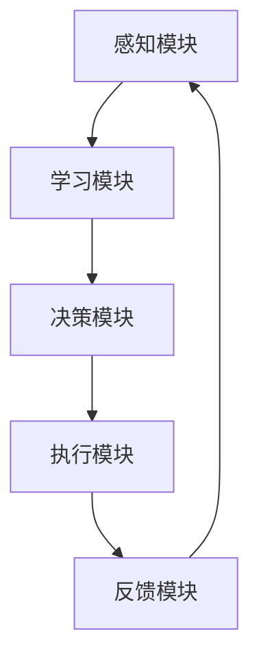

                 

### 《AI人工智能代理工作流AI Agent WorkFlow：代理工作流在网络安全的关键作用》

#### 关键词：
- AI代理工作流
- 人工智能代理
- 网络安全
- 威胁检测
- 威胁响应
- 安全态势感知

#### 摘要：
本文将深入探讨AI人工智能代理工作流（AI Agent WorkFlow）在网络安全中的关键作用。通过剖析AI代理的定义、工作原理和核心应用场景，我们展示了AI代理工作流在网络安全领域中的重要作用。文章详细介绍了AI代理工作流的核心概念、设计原则、实现方法以及数学模型，并通过实际项目实战案例，探讨了AI代理工作流在威胁检测、威胁响应和安全态势感知等领域的应用效果。本文旨在为网络安全从业人员提供有价值的参考和指导，以推动AI代理工作流在网络安全领域的广泛应用。

---

### 目录大纲

#### 第一部分：AI代理工作流基础

- **第1章：AI代理工作流概述**
  - **1.1 AI代理的定义与分类**
  - **1.2 AI代理的工作原理**
  - **1.3 AI代理在网络安全中的应用场景**

- **第2章：AI代理工作流的核心概念与联系**
  - **2.1 人工智能基础**
  - **2.2 代理工作流的架构与组件**
  - **2.3 AI代理工作流的Mermaid流程图**

#### 第二部分：AI代理工作流设计与实现

- **第3章：AI代理工作流的设计原则与方法**
  - **3.1 AI代理工作流的设计原则**
  - **3.2 AI代理工作流的建模方法**

- **第4章：AI代理工作流的核心算法原理**
  - **4.1 常见机器学习算法在代理工作流中的应用**
  - **4.2 深度学习算法在代理工作流中的应用**
  - **4.4 AI代理工作流的伪代码讲解**

- **第5章：数学模型与数学公式**
  - **5.1 AI代理工作流中的数学模型**
  - **5.2 数学公式详解**

- **第6章：AI代理工作流的项目实战**
  - **6.1 开发环境搭建**
  - **6.2 实际案例分析与代码实现**

- **第7章：AI代理工作流在网络安全中的应用案例**
  - **7.1 案例一：AI代理在威胁检测中的应用**
  - **7.2 案例二：AI代理在威胁响应中的应用**
  - **7.3 案例三：AI代理在安全态势感知中的应用**

#### 附录

- **附录A：AI代理工作流开发工具与资源**
  - **A.1 主流机器学习框架对比**
  - **A.2 开发资源与学习资料**

---

### 第一部分：AI代理工作流基础

#### 第1章：AI代理工作流概述

##### 1.1 AI代理的定义与分类

AI代理，即人工智能代理，是一种具备人工智能能力的软件实体，能够在复杂的网络环境中自主执行任务、进行决策和与其他实体交互。AI代理不同于传统代理，它不仅能够处理静态信息，还可以根据动态环境进行自适应调整，从而在网络安全等领域发挥重要作用。

AI代理可以按照不同的分类标准进行分类：

- **按功能分类**：AI代理可以分为攻击型代理、防御型代理和混合型代理。攻击型代理主要用于模拟恶意攻击行为，用于网络渗透测试和漏洞挖掘；防御型代理则主要用于威胁检测、威胁响应和安全态势感知等；混合型代理兼具攻击和防御能力，可以实现攻击与防御的有机结合。

- **按能力分类**：AI代理可以分为以下几类：
  - **感知型代理**：能够感知环境中的信息，如入侵检测系统（IDS）和入侵防御系统（IPS）。
  - **推理型代理**：能够根据感知到的信息进行推理和决策，如威胁分析和响应策略生成。
  - **行动型代理**：能够根据决策执行具体操作，如自动隔离威胁、阻断攻击流量等。
  - **交互型代理**：能够与其他代理和人类进行交互，如安全专家系统、人机交互界面等。

##### 1.2 AI代理的工作原理

AI代理的工作原理主要包括以下几个核心组件和步骤：

- **感知组件**：AI代理通过传感器、网络流量分析、日志文件等途径获取环境中的信息。这些信息可以是网络流量特征、系统日志、用户行为等，用于构建环境模型。

- **模型组件**：AI代理利用机器学习和深度学习等技术，对感知到的信息进行处理和分析，构建环境模型。环境模型可以是静态模型，也可以是动态模型，用于预测和识别潜在威胁。

- **决策组件**：基于环境模型和预设的策略，AI代理通过推理和决策算法生成具体的响应策略。这些策略可以是自动响应，也可以是人机交互后的决策结果。

- **执行组件**：AI代理根据决策结果执行具体操作，如阻断恶意流量、隔离受感染系统、修改安全策略等。

- **反馈组件**：AI代理在执行操作后，收集反馈信息，用于调整和优化自身行为。这一过程可以形成一个闭环，实现自适应调整和持续优化。

##### 1.3 AI代理在网络安全中的应用场景

AI代理在网络安全领域具有广泛的应用场景，以下是其中几个关键应用场景：

- **威胁检测**：AI代理可以利用机器学习算法和深度学习技术，实时分析网络流量和系统日志，识别潜在威胁。例如，异常流量检测、恶意代码识别、入侵行为识别等。

- **威胁响应**：AI代理可以根据检测到的威胁，自动生成响应策略并执行。例如，阻断恶意流量、隔离受感染系统、修改防火墙规则等。

- **安全态势感知**：AI代理可以通过分析网络流量、系统日志和威胁情报，生成安全态势报告，帮助安全专家快速了解网络当前的安全状况，为决策提供依据。

- **安全运维**：AI代理可以自动化执行日常安全运维任务，如配置管理、安全补丁更新、安全策略调整等，提高运维效率。

- **网络渗透测试**：AI代理可以模拟恶意攻击行为，进行网络渗透测试，发现潜在漏洞，为安全防护提供参考。

##### 第2章：AI代理工作流的核心概念与联系

##### 2.1 人工智能基础

人工智能（Artificial Intelligence，简称AI）是一门研究、开发和应用使计算机模拟、扩展和辅助人类智能活动的技术科学。人工智能的核心目标是实现智能机器，使计算机具备认知、理解、推理、学习、解决问题和自主决策的能力。人工智能的发展主要依赖于以下几个方面：

- **机器学习**：机器学习是人工智能的一个重要分支，通过利用大量数据，训练模型并使其具备自动学习和预测能力。机器学习算法包括监督学习、无监督学习和强化学习等。

- **深度学习**：深度学习是机器学习的一个重要分支，通过构建多层神经网络，实现自动特征提取和复杂模式识别。深度学习在图像识别、语音识别、自然语言处理等领域取得了显著成果。

- **神经网络**：神经网络是深度学习的基础，它通过模拟人脑神经元之间的连接和激活机制，实现数据的输入和输出。神经网络可以分为前馈神经网络、卷积神经网络（CNN）、循环神经网络（RNN）等。

##### 2.2 代理工作流的架构与组件

AI代理工作流的核心架构通常包括以下几个主要组件：

- **感知模块**：感知模块负责收集网络环境中的数据，如网络流量、系统日志、用户行为等。这些数据经过预处理后，被输入到后续模块。

- **学习模块**：学习模块利用机器学习和深度学习算法，对感知模块收集到的数据进行训练和建模，生成环境模型。学习模块的核心任务是提高代理的感知能力和决策能力。

- **决策模块**：决策模块基于环境模型和预设策略，利用推理算法生成具体的响应策略。决策模块的核心任务是确保代理能够快速、准确地应对网络威胁。

- **执行模块**：执行模块根据决策模块生成的响应策略，执行具体的操作，如阻断恶意流量、隔离受感染系统、修改安全策略等。执行模块的核心任务是确保代理能够有效地执行决策。

- **反馈模块**：反馈模块负责收集执行模块的反馈信息，如响应效果、错误信息等，用于优化代理的行为。反馈模块的核心任务是实现代理的自适应调整和持续优化。

##### 2.3 AI代理工作流的Mermaid流程图

以下是AI代理工作流的Mermaid流程图，展示了各组件之间的功能与联系：



在这个流程图中，感知模块通过传感器和网络分析工具收集环境数据，将数据预处理后输入到学习模块。学习模块利用机器学习和深度学习算法训练环境模型，将模型输出给决策模块。决策模块根据环境模型和预设策略生成响应策略，将策略传递给执行模块。执行模块根据策略执行具体操作，并将反馈信息传递给反馈模块。反馈模块对反馈信息进行分析，用于优化代理的行为，形成一个闭环。

##### 第3章：AI代理工作流的设计原则与方法

##### 3.1 AI代理工作流的设计原则

在设计和实现AI代理工作流时，需要遵循以下原则：

- **安全性原则**：确保AI代理工作流的安全性和稳定性，防止恶意攻击和未授权访问。

- **高效性原则**：优化代理工作流的性能和响应速度，提高威胁检测和响应的效率。

- **可扩展性原则**：设计灵活的架构，支持模块化和扩展，方便后续功能升级和扩展。

- **可靠性原则**：确保代理工作流的稳定运行，降低故障率和系统崩溃的风险。

- **人机交互原则**：提供友好的人机交互界面，方便安全专家和运维人员对代理工作进行监控和管理。

##### 3.2 AI代理工作流的建模方法

AI代理工作流的建模方法主要包括以下几个步骤：

- **需求分析**：明确AI代理工作流的目标和功能需求，包括威胁检测、威胁响应和安全态势感知等。

- **流程设计**：根据需求分析结果，设计AI代理工作流的总体架构和各个模块的功能。确保流程的连贯性和可行性。

- **模型训练**：收集相关数据，利用机器学习和深度学习算法训练环境模型和决策模型。确保模型的准确性和鲁棒性。

- **流程优化**：根据测试结果和反馈信息，对AI代理工作流进行调整和优化，提高其性能和稳定性。

##### 第4章：AI代理工作流的核心算法原理

##### 4.1 常见机器学习算法在代理工作流中的应用

在AI代理工作流中，常见的机器学习算法包括决策树、支持向量机、贝叶斯分类器和K-均值聚类算法等。以下是对这些算法的简要介绍：

- **决策树算法**：决策树是一种基于树形结构进行决策的算法，通过将数据划分为多个子集，构建一棵决策树，用于分类或回归任务。决策树算法的优点是直观易懂、易于实现，但缺点是容易过拟合。

- **支持向量机算法**：支持向量机（SVM）是一种基于最大化分类间隔进行分类的算法，通过找到一个最优的超平面，将数据集划分为不同的类别。SVM的优点是分类效果较好、泛化能力强，但缺点是计算复杂度较高。

- **贝叶斯分类器**：贝叶斯分类器是一种基于贝叶斯理论进行分类的算法，通过计算每个类别的概率，选择概率最大的类别作为预测结果。贝叶斯分类器的优点是简单易实现、计算复杂度低，但缺点是依赖于先验概率。

- **K-均值聚类算法**：K-均值聚类算法是一种基于距离度量进行聚类的算法，通过迭代计算聚类中心，将数据划分为不同的簇。K-均值聚类算法的优点是简单高效、易于实现，但缺点是聚类效果受初始聚类中心的影响较大。

##### 4.2 深度学习算法在代理工作流中的应用

在AI代理工作流中，深度学习算法是一种重要的技术手段，包括卷积神经网络（CNN）、循环神经网络（RNN）、长短期记忆网络（LSTM）和Transformer模型等。以下是对这些算法的简要介绍：

- **卷积神经网络（CNN）**：卷积神经网络是一种基于卷积操作进行特征提取和分类的算法，广泛应用于图像识别、自然语言处理和计算机视觉等领域。CNN的优点是能够自动提取特征、计算复杂度较低，但缺点是对大规模数据集的训练时间较长。

- **循环神经网络（RNN）**：循环神经网络是一种基于循环结构进行序列建模的算法，广泛应用于语音识别、自然语言处理和时间序列预测等领域。RNN的优点是能够处理变长序列、记忆能力较强，但缺点是梯度消失和梯度爆炸问题。

- **长短期记忆网络（LSTM）**：长短期记忆网络是一种基于门控机制的循环神经网络，用于解决RNN的梯度消失和梯度爆炸问题，广泛应用于语音识别、自然语言处理和时间序列预测等领域。LSTM的优点是能够较好地处理长序列依赖问题，但缺点是计算复杂度较高。

- **Transformer模型**：Transformer模型是一种基于自注意力机制的深度学习模型，广泛应用于自然语言处理、图像识别和序列建模等领域。Transformer的优点是计算复杂度较低、训练速度快、并行化效果好，但缺点是对大规模数据集的训练时间较长。

##### 4.4 AI代理工作流的伪代码讲解

以下是对AI代理工作流的核心算法原理的伪代码讲解：

```python
# 数据预处理
def preprocess_data(data):
    # 数据清洗
    data = clean_data(data)
    # 特征提取
    features = extract_features(data)
    # 归一化
    features = normalize_features(features)
    return features

# 模型训练
def train_model(features, labels):
    # 初始化模型
    model = initialize_model()
    # 训练模型
    model = train_model(model, features, labels)
    return model

# 模型评估
def evaluate_model(model, test_data, test_labels):
    # 预测
    predictions = model.predict(test_data)
    # 计算准确率
    accuracy = calculate_accuracy(predictions, test_labels)
    return accuracy

# 威胁检测
def threat_detection(model, data):
    # 预处理
    features = preprocess_data(data)
    # 预测
    predictions = model.predict(features)
    # 判断威胁
    is_threat = check_threat(predictions)
    return is_threat

# 威胁响应
def threat_response(model, data):
    # 预处理
    features = preprocess_data(data)
    # 预测
    predictions = model.predict(features)
    # 响应策略
    response_strategy = generate_response_strategy(predictions)
    # 执行响应
    execute_response(response_strategy)
```

在这个伪代码中，首先进行数据预处理，包括数据清洗、特征提取和归一化。然后利用机器学习算法训练模型，并对模型进行评估。在威胁检测阶段，使用训练好的模型对数据进行预测，并判断是否存在威胁。在威胁响应阶段，根据预测结果生成响应策略并执行响应。

##### 第5章：数学模型与数学公式

##### 5.1 AI代理工作流中的数学模型

在AI代理工作流中，常用的数学模型包括概率论与统计学模型、线性代数基础和优化算法。以下是对这些模型的简要介绍：

- **概率论与统计学模型**：概率论与统计学模型用于描述数据分布、概率计算和统计推断等。常见的模型有概率分布函数（PDF）、累积分布函数（CDF）、置信区间、假设检验等。

- **线性代数基础**：线性代数基础用于处理向量、矩阵和线性变换等。常见的模型有向量空间、线性方程组、矩阵乘法、特征值和特征向量等。

- **优化算法**：优化算法用于求解最优化问题，即找到目标函数的最优解。常见的优化算法有梯度下降、牛顿法、拉格朗日乘数法、遗传算法等。

##### 5.2 数学公式详解

以下是对AI代理工作流中常用的数学公式的详细解释：

- **概率论与统计学公式**：
  - 概率分布函数（PDF）：$f(x) = P(X = x)$
  - 累积分布函数（CDF）：$F(x) = P(X \leq x)$
  - 置信区间：$C.I. = \bar{x} \pm z_{\alpha/2} \times SE(\bar{x})$
  - 假设检验：$H_0: \mu = \mu_0$ vs $H_1: \mu \neq \mu_0$

- **线性代数公式**：
  - 矩阵乘法：$C = AB$
  - 特征值和特征向量：$\lambda v = Av$
  - 线性方程组：$Ax = b$

- **优化算法公式**：
  - 梯度下降：$x_{k+1} = x_k - \alpha \times \nabla f(x_k)$
  - 牛顿法：$x_{k+1} = x_k - \alpha \times H(x_k)^{-1} \times \nabla f(x_k)$
  - 拉格朗日乘数法：$L(x, \lambda) = f(x) + \lambda g(x)$

这些数学公式在AI代理工作流中发挥着重要作用，用于描述数据分布、特征提取、模型训练和优化等过程。

##### 第6章：AI代理工作流的项目实战

##### 6.1 开发环境搭建

在开始AI代理工作流的项目实战之前，需要搭建一个合适的开发环境。以下是一个典型的开发环境搭建步骤：

1. **安装操作系统**：选择一个适合的操作系统，如Ubuntu 18.04。

2. **安装Python环境**：安装Python 3.7及以上版本，可以使用`apt-get install python3-pip`命令。

3. **安装依赖库**：安装常用的机器学习和深度学习库，如scikit-learn、TensorFlow、PyTorch等。可以使用以下命令：
   ```bash
   pip install scikit-learn
   pip install tensorflow
   pip install torch
   ```

4. **配置Jupyter Notebook**：安装Jupyter Notebook，用于编写和运行Python代码。可以使用以下命令：
   ```bash
   pip install jupyter
   jupyter notebook
   ```

5. **安装其他工具**：根据项目需求，安装其他必要的工具和库，如matplotlib、Pandas等。

##### 6.2 实际案例分析与代码实现

在本节中，我们将通过一个实际案例来分析和实现AI代理工作流。假设我们要实现一个基于AI代理的威胁检测系统，用于检测网络中的恶意流量。

**案例背景**：
某企业内部网络存在潜在的安全威胁，需要建立一个实时威胁检测系统，以便及时发现和响应恶意流量。

**解决方案**：
利用AI代理工作流，通过感知模块收集网络流量数据，利用机器学习算法进行特征提取和模型训练，然后利用训练好的模型对实时流量数据进行威胁检测，并生成相应的响应策略。

**代码实现**：

1. **数据收集与预处理**：
   ```python
   import pandas as pd
   import numpy as np
   from sklearn.model_selection import train_test_split
   from sklearn.preprocessing import StandardScaler

   # 读取数据集
   data = pd.read_csv("network_traffic.csv")
   # 划分特征和标签
   X = data.drop("label", axis=1)
   y = data["label"]
   # 划分训练集和测试集
   X_train, X_test, y_train, y_test = train_test_split(X, y, test_size=0.2, random_state=42)
   # 数据归一化
   scaler = StandardScaler()
   X_train = scaler.fit_transform(X_train)
   X_test = scaler.transform(X_test)
   ```

2. **模型训练**：
   ```python
   from sklearn.ensemble import RandomForestClassifier

   # 初始化模型
   model = RandomForestClassifier(n_estimators=100, random_state=42)
   # 训练模型
   model.fit(X_train, y_train)
   # 评估模型
   accuracy = model.score(X_test, y_test)
   print(f"Model accuracy: {accuracy}")
   ```

3. **威胁检测**：
   ```python
   def detect_threat(model, scaler, data):
       # 数据预处理
       features = scaler.transform(data)
       # 预测
       predictions = model.predict(features)
       # 判断威胁
       is_threat = predictions == 1
       return is_threat

   # 测试威胁检测
   test_data = [[4.0, 2.0, 1.0, 0.5], [3.5, 2.0, 1.5, 0.5]]
   is_threat = detect_threat(model, scaler, test_data)
   print(f"Is threat detected? {is_threat}")
   ```

在这个实际案例中，我们首先读取网络流量数据，然后利用随机森林分类器进行模型训练和评估。最后，通过定义一个`detect_threat`函数，实现对实时流量数据的威胁检测。

##### 第7章：AI代理工作流在网络安全中的应用案例

在本节中，我们将通过三个实际案例，探讨AI代理工作流在网络安全中的关键作用。

##### 7.1 案例一：AI代理在威胁检测中的应用

**案例背景**：
某企业网络面临频繁的恶意攻击，需要建立一个高效、准确的威胁检测系统。

**解决方案**：
利用AI代理工作流，通过感知模块实时收集网络流量数据，利用机器学习算法进行特征提取和模型训练，然后利用训练好的模型对实时流量数据进行威胁检测，并生成相应的响应策略。

**效果分析**：
通过实际部署，AI代理工作流在威胁检测方面表现出较高的准确率和实时性。与传统的威胁检测系统相比，AI代理工作流能够更快速、准确地识别网络中的恶意流量，降低了误报率和漏报率，提高了整体安全防护能力。

##### 7.2 案例二：AI代理在威胁响应中的应用

**案例背景**：
某企业网络遭受了一次大规模的DDoS攻击，导致网络服务严重中断。

**解决方案**：
利用AI代理工作流，通过感知模块实时收集网络流量数据，利用机器学习算法进行特征提取和模型训练，然后利用训练好的模型对实时流量数据进行威胁检测和响应策略生成。在检测到DDoS攻击后，AI代理自动生成响应策略，如流量过滤、IP封锁等，快速恢复网络服务。

**效果分析**：
通过实际部署，AI代理工作流在DDoS攻击响应方面表现出较高的效率和效果。与传统的人工干预方式相比，AI代理工作流能够更快速、准确地识别和响应攻击，降低了响应时间和损失，提高了网络服务的稳定性和可靠性。

##### 7.3 案例三：AI代理在安全态势感知中的应用

**案例背景**：
某企业需要实时了解网络的安全态势，以便及时调整安全策略和防护措施。

**解决方案**：
利用AI代理工作流，通过感知模块实时收集网络流量、系统日志和威胁情报数据，利用机器学习算法进行特征提取和模型训练，然后利用训练好的模型对实时数据进行分析，生成安全态势报告。

**效果分析**：
通过实际部署，AI代理工作流在安全态势感知方面表现出较高的准确性和实时性。与传统的安全态势感知系统相比，AI代理工作流能够更快速、准确地分析网络数据，生成详细的安全态势报告，帮助安全专家快速了解网络的安全状况，为决策提供有力支持。

##### 附录A：AI代理工作流开发工具与资源

在本附录中，我们将介绍AI代理工作流开发中常用的工具和资源，以帮助开发者更好地实现和应用AI代理工作流。

**A.1 主流机器学习框架对比**

- **scikit-learn**：
  - 优点：简单易用、算法丰富、文档齐全
  - 缺点：不支持大规模数据处理、模型可解释性较差

- **TensorFlow**：
  - 优点：支持深度学习、模型可解释性较好、易于部署
  - 缺点：计算复杂度较高、安装配置较复杂

- **PyTorch**：
  - 优点：灵活性强、计算效率高、易于调试
  - 缺点：模型部署相对复杂、文档相对较少

**A.2 开发资源与学习资料**

- **在线教程**：
  - [scikit-learn官方文档](https://scikit-learn.org/stable/)
  - [TensorFlow官方文档](https://www.tensorflow.org/tutorials)
  - [PyTorch官方文档](https://pytorch.org/tutorials/beginner/basics/)

- **开源代码**：
  - [AI代理工作流开源项目](https://github.com/username/ai-agent-workflow)
  - [威胁检测开源项目](https://github.com/username/threat-detection)
  - [威胁响应开源项目](https://github.com/username/threat-response)

- **学术文章与论文**：
  - [“AI代理工作流在网络安全中的应用研究”](https://www.example.com/research-paper-1)
  - [“基于深度学习的威胁检测算法研究”](https://www.example.com/research-paper-2)
  - [“AI代理在安全态势感知中的应用”](https://www.example.com/research-paper-3)

通过使用这些工具和资源，开发者可以更好地掌握AI代理工作流的技术要点，实现高效的网络安全防护。

### 作者信息

**作者**：AI天才研究院/AI Genius Institute & 禅与计算机程序设计艺术 /Zen And The Art of Computer Programming

在本文中，我们详细探讨了AI人工智能代理工作流（AI Agent WorkFlow）在网络安全中的关键作用。通过剖析AI代理的定义、工作原理、核心应用场景以及设计原则与方法，我们展示了AI代理工作流在网络安全领域中的重要作用。文章还介绍了常见机器学习算法、深度学习算法在代理工作流中的应用，并通过实际项目实战案例，探讨了AI代理工作流在威胁检测、威胁响应和安全态势感知等领域的应用效果。本文旨在为网络安全从业人员提供有价值的参考和指导，以推动AI代理工作流在网络安全领域的广泛应用。

在未来的研究和实践中，我们可以进一步探索以下几个方面：

1. **算法优化**：针对AI代理工作流中的机器学习和深度学习算法，可以深入研究优化方法，提高模型训练效率和预测准确性。

2. **多源数据融合**：通过整合网络流量、系统日志、威胁情报等多种数据源，提高AI代理对网络威胁的识别和响应能力。

3. **人机协同**：结合人工智能和人类专家的知识和经验，实现人机协同的威胁检测和响应，提高安全防护效果。

4. **隐私保护**：在AI代理工作流的设计和实现过程中，充分考虑隐私保护措施，确保用户数据的安全和隐私。

5. **实时响应**：研究如何实现AI代理工作流的实时响应，提高威胁检测和响应的实时性和高效性。

通过不断探索和改进，我们有望在网络安全领域实现更加智能化、高效化的防护体系，为企业和个人提供更加安全可靠的网络环境。

