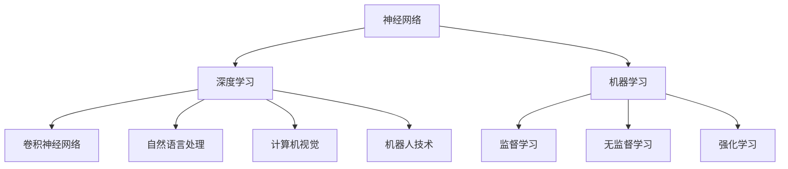
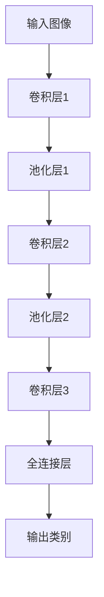

                 

### AI人工智能核心算法原理与代码实例讲解：元学习

#### 关键词：AI、人工智能、深度学习、神经网络、卷积神经网络、循环神经网络、生成对抗网络、强化学习、元学习

#### 摘要：
本文深入探讨了AI人工智能的核心算法原理，包括深度学习、神经网络、卷积神经网络、循环神经网络、生成对抗网络和强化学习等，并结合具体代码实例讲解了元学习算法的实现与应用。通过对这些核心算法的详细解析，读者可以掌握AI人工智能的基本原理和实际应用，为未来的AI项目开发打下坚实的基础。

---

## 第一部分：AI人工智能核心算法原理

### 第1章：AI人工智能核心概念与联系

#### 1.1 AI人工智能的起源与发展

人工智能（Artificial Intelligence，简称AI）是计算机科学的一个分支，旨在研究、开发和应用使计算机模拟、延伸和扩展人的智能的理论、方法、技术和系统。人工智能的定义和范畴随着技术的发展而不断演变，但核心目标始终是让机器能够自主完成原本需要人类智能才能完成的任务。

- **AI人工智能的定义：** 模拟、延伸和扩展人的智能的计算机系统。
- **AI人工智能的历史：** 人工智能的概念最早可以追溯到20世纪50年代，当时的科学家们开始探索如何让计算机表现出类似于人类智能的行为。早期的AI研究主要集中在符号主义（Symbolic AI）和逻辑推理上，但随着计算机性能的提升和数据量的增加，连接主义（Connectionism）和深度学习（Deep Learning）逐渐成为主流。

#### 1.2 AI人工智能的核心原理

人工智能的核心原理主要包括以下几个方面：

- **机器学习：** 机器学习是人工智能的核心技术之一，它使计算机能够从数据中学习规律和模式，从而做出决策或预测。机器学习可以分为以下几种类型：
  - **监督学习（Supervised Learning）：** 在监督学习模式下，模型使用标记过的数据来学习，并从中提取特征，以便在新数据上进行预测。
  - **无监督学习（Unsupervised Learning）：** 无监督学习不使用标记数据，模型需要从未标记的数据中自动发现隐藏的结构或模式。
  - **强化学习（Reinforcement Learning）：** 强化学习是一种通过试错过程来学习策略的机器学习方法，模型通过与环境的交互来学习最优行为。

- **学习算法与模型：** 常见的学习算法和模型包括：
  - **线性回归（Linear Regression）：** 用于预测连续值输出。
  - **决策树（Decision Tree）：** 用于分类和回归任务。
  - **神经网络（Neural Networks）：** 一种模拟人脑神经元结构和功能的计算模型，具有强大的学习和泛化能力。
  - **深度学习（Deep Learning）：** 深度学习是神经网络的一种特殊形式，通过多层神经元的堆叠，实现更复杂的特征提取和模式识别。

#### 1.3 AI人工智能架构与联系

人工智能的体系结构多种多样，但其核心组件通常包括以下几部分：

- **神经网络（Neural Networks）：** 神经网络是深度学习的基础，通过多层神经元的堆叠，实现从输入数据到输出数据的映射。
- **深度学习（Deep Learning）：** 深度学习是人工智能领域的一个重要分支，它通过构建多层神经网络，实现对复杂数据的自动特征提取和模式识别。
- **卷积神经网络（Convolutional Neural Networks，CNN）：** CNN是一种特殊的神经网络，通过卷积和池化操作，实现对图像等二维数据的处理。
- **自然语言处理（Natural Language Processing，NLP）：** NLP是一种用于处理和理解人类语言的技术，广泛应用于机器翻译、情感分析、文本分类等领域。
- **计算机视觉（Computer Vision）：** 计算机视觉是使计算机能够从图像或视频中提取信息的技术，广泛应用于图像识别、物体检测、人脸识别等领域。
- **机器人技术（Robotics）：** 机器人技术是人工智能在实践领域的一个重要应用，通过机器人和自动化系统，实现人机交互和任务自动化。

为了更好地理解人工智能的核心原理和架构，我们可以使用Mermaid流程图来展示这些组件及其交互关系：



### 第2章：深度学习与神经网络基础

#### 2.1 深度学习的基本原理

深度学习（Deep Learning）是一种基于多层神经网络的学习方法，它的核心思想是通过多层的非线性变换，从原始数据中提取更高层次的特征，从而实现复杂的预测和分类任务。深度学习的起源可以追溯到1980年代，但直到近年来，随着计算能力的提升和数据量的爆炸性增长，深度学习才取得了显著的成功。

- **深度学习的定义：** 深度学习是一种多层神经网络，通过堆叠多层神经网络来实现从原始数据到复杂决策的映射。
- **深度学习的特点：**
  - **层次化特征表示：** 深度学习通过多层神经元的堆叠，实现从原始数据到高层次抽象特征的转化。
  - **强大的非线性映射能力：** 深度学习通过使用非线性激活函数，可以实现从输入数据到输出数据的复杂映射。
  - **自适应性和泛化能力：** 深度学习模型通过训练自动学习数据中的模式和规律，具有良好的自适应性和泛化能力。

#### 2.2 神经网络的基础知识

神经网络（Neural Networks）是一种模拟人脑神经元结构和功能的计算模型，它通过神经元之间的连接（权重）和激活函数，实现对输入数据的处理和决策。神经网络的核心组成部分包括神经元、层和前向传播与反向传播算法。

- **神经元（Neuron）：** 神经元是神经网络的基本单元，它通过输入、权重和激活函数产生输出。一个简单的神经元可以表示为：
  $$ 
  f(z) = \sigma(z) = \frac{1}{1 + e^{-z}} 
  $$
  其中，$z$ 是神经元的输入，$\sigma$ 是激活函数（通常使用Sigmoid函数）。

- **层（Layer）：** 神经网络由多个层组成，包括输入层、隐藏层和输出层。每一层都包含多个神经元，前一层的输出作为后一层的输入。隐藏层可以有多层，每层都能提取更高层次的特征。

- **前向传播（Forward Propagation）：** 前向传播是神经网络处理数据的过程，它从输入层开始，逐层计算每个神经元的输出，直到输出层。前向传播的过程可以表示为：
  $$ 
  z^{(l)} = \sum_{j} w^{(l)}_{ji} a^{(l-1)}_j + b^{(l)} 
  $$
  $$ 
  a^{(l)}_i = f(z^{(l)}_i) 
  $$
  其中，$a^{(l)}$ 是第$l$层的输出，$w^{(l)}_{ji}$ 是从第$l-1$层到第$l$层的权重，$b^{(l)}$ 是第$l$层的偏置，$f$ 是激活函数。

- **反向传播（Backpropagation）：** 反向传播是神经网络训练的核心算法，它通过计算损失函数关于权重的梯度，来更新网络的权重和偏置，以最小化损失函数。反向传播的过程可以表示为：
  $$ 
  \delta^{(l)}_i = (f'(z^{(l)}_i) \cdot (\delta^{(l+1)} \cdot w^{(l+1)}_{ij})) 
  $$
  $$ 
  \Delta w^{(l)}_{ji} = \eta \cdot a^{(l-1)}_j \cdot \delta^{(l)}_i 
  $$
  $$ 
  \Delta b^{(l)} = \eta \cdot \delta^{(l)} 
  $$
  其中，$\delta^{(l)}$ 是第$l$层的误差，$\eta$ 是学习率，$f'$ 是激活函数的导数。

#### 2.3 神经网络的优化算法

神经网络的优化目标是找到一组权重和偏置，使得损失函数最小。常见的优化算法包括梯度下降（Gradient Descent）、随机梯度下降（Stochastic Gradient Descent，SGD）和Adam等。

- **梯度下降（Gradient Descent）：** 梯度下降是最简单的优化算法，它通过计算损失函数关于权重的梯度，并沿梯度的反方向更新权重和偏置，以最小化损失函数。梯度下降的伪代码如下：

  ```python
  initialize weights and biases
  while not converged:
      compute gradients
      update weights and biases
  ```

- **随机梯度下降（Stochastic Gradient Descent，SGD）：** 随机梯度下降是梯度下降的一种变体，它在每个迭代步骤中随机选择一部分数据样本来计算梯度。SGD可以加快收敛速度，但可能导致收敛不稳定。SGD的伪代码如下：

  ```python
  initialize weights and biases
  while not converged:
      for each sample in the training data:
          compute gradients
          update weights and biases
  ```

- **Adam（Adaptive Gradient Algorithm）：** Adam是一种自适应的优化算法，它结合了SGD和动量法的优点，能够自适应地调整每个参数的学习率。Adam的伪代码如下：

  ```python
  initialize weights and biases
  initialize momentum and adaptive learning rates
  while not converged:
      update gradients
      update momentum
      update adaptive learning rates
      update weights and biases
  ```

### 第3章：卷积神经网络（CNN）

#### 3.1 CNN的基本概念

卷积神经网络（Convolutional Neural Networks，CNN）是一种专门用于处理图像数据的神经网络。与传统的神经网络相比，CNN具有以下特点：

- **卷积操作（Convolution Operation）：** CNN通过卷积操作来提取图像中的局部特征，卷积操作可以看作是一种线性滤波器，它可以捕捉图像中的边缘、纹理等特征。
- **池化操作（Pooling Operation）：** 池化操作用于减少网络的参数数量，提高网络的泛化能力。常见的池化操作包括最大池化和平均池化。
- **多层的神经网络结构：** CNN通常由多个卷积层和池化层组成，通过堆叠多层卷积层，可以实现从原始图像到复杂特征的转化。

#### 3.2 CNN的架构

CNN的架构通常包括以下几个部分：

- **卷积层（Convolutional Layer）：** 卷积层是CNN的核心部分，它通过卷积操作提取图像中的特征。卷积层的输出可以看作是对输入图像的局部特征提取。
- **池化层（Pooling Layer）：** 池化层用于降低数据的维度，同时保留最重要的特征。常见的池化操作包括最大池化和平均池化。
- **全连接层（Fully Connected Layer）：** 全连接层是CNN的最后一层，它将卷积层和池化层提取的局部特征映射到输出类别。全连接层通常用于分类任务。

CNN的架构可以用Mermaid流程图表示如下：



#### 3.3 CNN的核心算法

CNN的核心算法包括卷积操作、池化操作和前向传播与反向传播算法。

- **卷积操作：** 卷积操作是CNN中最基本的操作，它通过在图像上滑动一个滤波器（卷积核），提取图像的局部特征。卷积操作的数学原理可以表示为：
  $$
  (f * g)(x) = \sum_{y} f(y) \cdot g(x - y)
  $$
  其中，$f$ 和 $g$ 分别是卷积核和图像，$x$ 是图像上的一个点。

- **池化操作：** 池化操作用于降低数据的维度，同时保留最重要的特征。常见的池化操作包括最大池化和平均池化。最大池化在每个窗口内选择最大值，而平均池化选择窗口内所有值的平均值。

- **前向传播与反向传播算法：** CNN的前向传播与反向传播算法与传统的神经网络类似。在训练过程中，通过前向传播计算输出，然后通过反向传播计算损失函数关于权重的梯度，并更新权重和偏置。

### 第4章：循环神经网络（RNN）

#### 4.1 RNN的基本原理

循环神经网络（Recurrent Neural Networks，RNN）是一种用于处理序列数据的神经网络。与传统的神经网络不同，RNN具有循环结构，能够记住过去的输入信息，并将其用于处理当前的输入。

- **RNN的定义：** RNN是一种能够处理序列数据的神经网络，通过循环结构将当前输入与历史输入信息进行交互。
- **RNN的特点：**
  - **记忆能力：** RNN能够记住过去的输入信息，并将其用于处理当前的输入。
  - **序列建模能力：** RNN能够对序列数据进行建模，处理文本、语音、时间序列等任务。

#### 4.2 RNN的核心算法

RNN的核心算法包括前向传播和反向传播算法。

- **前向传播：** RNN的前向传播算法可以表示为：
  $$
  h_t = \sigma(W_h h_{t-1} + W_x x_t + b)
  $$
  其中，$h_t$ 是第$t$个时刻的隐藏状态，$x_t$ 是第$t$个时刻的输入，$W_h$ 和 $W_x$ 分别是隐藏状态和输入的权重矩阵，$b$ 是偏置项，$\sigma$ 是激活函数（通常使用Sigmoid函数）。

- **反向传播：** RNN的反向传播算法用于计算损失函数关于权重的梯度，并更新权重和偏置。反向传播的过程可以表示为：
  $$
  \delta_t = (1 - \sigma'(h_t)) \cdot (C_{t+1} - y_t)
  $$
  $$
  \Delta W_h = \eta \cdot h_{t-1} \cdot \delta_t
  $$
  $$
  \Delta W_x = \eta \cdot x_t \cdot \delta_t
  $$
  $$
  \Delta b = \eta \cdot \delta_t
  $$
  其中，$\delta_t$ 是第$t$个时刻的误差，$C_{t+1}$ 是第$t+1$个时刻的隐藏状态，$y_t$ 是第$t$个时刻的输出，$\eta$ 是学习率。

### 第5章：生成对抗网络（GAN）

#### 5.1 GAN的基本概念

生成对抗网络（Generative Adversarial Networks，GAN）是一种由生成器和判别器组成的神经网络模型，它通过对抗训练来生成与真实数据相似的数据。

- **GAN的定义：** GAN是一种由生成器和判别器组成的神经网络模型，生成器尝试生成与真实数据相似的数据，而判别器尝试区分真实数据和生成数据。
- **GAN的特点：**
  - **对抗训练：** GAN通过生成器和判别器的对抗训练来提高生成质量。
  - **无监督学习：** GAN可以在没有标记数据的情况下训练，从而生成高质量的数据。

#### 5.2 GAN的核心算法

GAN的核心算法包括生成器、判别器和对抗训练。

- **生成器（Generator）：** 生成器的目标是生成与真实数据相似的数据。生成器通常是一个全连接神经网络，它将随机噪声映射到数据空间。生成器的损失函数可以表示为：
  $$
  G(\theta_G) = \mathbb{E}_{z \sim p_z(z)} [\log(D(G(z))]
  $$
  其中，$G(z)$ 是生成器生成的数据，$D$ 是判别器，$z$ 是随机噪声。

- **判别器（Discriminator）：** 判别器的目标是区分真实数据和生成数据。判别器通常也是一个全连接神经网络，它对数据进行分类。判别器的损失函数可以表示为：
  $$
  D(\theta_D) = \mathbb{E}_{x \sim p_{data}(x)} [\log(D(x))] + \mathbb{E}_{z \sim p_z(z)} [\log(1 - D(G(z))]
  $$
  其中，$x$ 是真实数据，$G(z)$ 是生成器生成的数据。

- **对抗训练：** GAN的训练过程是一个对抗训练过程，生成器和判别器交替更新。在每次迭代中，生成器尝试生成更真实的数据，而判别器尝试更好地区分真实数据和生成数据。

### 第6章：强化学习

#### 6.1 强化学习的基本概念

强化学习（Reinforcement Learning，RL）是一种通过试错过程来学习最优策略的机器学习方法。强化学习通常由一个智能体（Agent）、环境（Environment）、状态（State）、动作（Action）和奖励（Reward）组成。

- **强化学习的定义：** 强化学习是一种通过试错过程来学习最优策略的机器学习方法，它通过与环境互动来最大化累积奖励。
- **强化学习的特点：**
  - **基于反馈：** 强化学习通过接收环境反馈来调整策略，以达到最优目标。
  - **序列决策：** 强化学习涉及序列决策，智能体需要根据当前状态选择最优动作，并更新策略。

#### 6.2 强化学习算法

强化学习算法可以分为以下几种：

- **Q-Learning：** Q-Learning是一种基于值函数的强化学习算法，它通过迭代更新值函数来学习最优策略。Q-Learning的算法可以表示为：
  $$
  Q(s, a) \leftarrow Q(s, a) + \alpha [r + \gamma \max_{a'} Q(s', a') - Q(s, a)]
  $$
  其中，$Q(s, a)$ 是状态$s$和动作$a$的值函数，$r$ 是奖励，$\gamma$ 是折扣因子，$\alpha$ 是学习率。

- **Policy Gradient：** Policy Gradient是一种基于策略的强化学习算法，它通过迭代更新策略来学习最优策略。Policy Gradient的算法可以表示为：
  $$
  \theta \leftarrow \theta + \alpha [R - \log(\pi(\theta)(a))]
  $$
  其中，$\theta$ 是策略参数，$R$ 是累积奖励，$\pi(\theta)$ 是策略分布。

### 第7章：AI人工智能项目实战

#### 7.1 AI项目开发流程

AI项目的开发流程通常包括以下几个阶段：

- **需求分析：** 分析项目需求，明确目标、任务和性能指标。
- **数据准备：** 收集和处理数据，包括数据清洗、数据预处理和数据增强等。
- **模型设计：** 设计合适的神经网络模型，包括网络结构、优化器和损失函数等。
- **训练与优化：** 训练模型并调整参数，以提高模型的性能。
- **部署与维护：** 将模型部署到生产环境中，并进行监控和维护。

#### 7.2 实战案例：图像分类项目

在本节中，我们将介绍一个使用卷积神经网络进行图像分类的项目。

- **项目背景：** 图像分类是一个常见的计算机视觉任务，目标是将图像分类到不同的类别中。在本项目中，我们将使用CIFAR-10数据集，它包含10个类别，每个类别有6000个训练图像和1000个测试图像。
- **开发环境搭建：** 我们使用Python和PyTorch作为开发环境，安装PyTorch库并设置GPU支持。
- **源代码实现：** 我们将实现一个简单的卷积神经网络模型，包括卷积层、池化层和全连接层。以下是模型的源代码实现：

  ```python
  import torch
  import torch.nn as nn
  import torch.optim as optim

  class ConvNet(nn.Module):
      def __init__(self):
          super(ConvNet, self).__init__()
          self.conv1 = nn.Conv2d(3, 32, 3)
          self.conv2 = nn.Conv2d(32, 64, 3)
          self.fc1 = nn.Linear(64 * 6 * 6, 128)
          self.fc2 = nn.Linear(128, 10)

      def forward(self, x):
          x = nn.functional.relu(self.conv1(x))
          x = nn.functional.max_pool2d(x, 2)
          x = nn.functional.relu(self.conv2(x))
          x = nn.functional.max_pool2d(x, 2)
          x = x.view(-1, 64 * 6 * 6)
          x = nn.functional.relu(self.fc1(x))
          x = self.fc2(x)
          return x

  # 初始化模型、损失函数和优化器
  model = ConvNet()
  criterion = nn.CrossEntropyLoss()
  optimizer = optim.Adam(model.parameters(), lr=0.001)

  # 训练模型
  for epoch in range(10):
      running_loss = 0.0
      for inputs, labels in train_loader:
          optimizer.zero_grad()
          outputs = model(inputs)
          loss = criterion(outputs, labels)
          loss.backward()
          optimizer.step()
          running_loss += loss.item()
      print(f'Epoch {epoch+1}, Loss: {running_loss/len(train_loader)}')

  # 评估模型
  correct = 0
  total = 0
  with torch.no_grad():
      for inputs, labels in test_loader:
          outputs = model(inputs)
          _, predicted = torch.max(outputs.data, 1)
          total += labels.size(0)
          correct += (predicted == labels).sum().item()
  print(f'Accuracy: {100 * correct / total}%')
  ```

- **代码解读与分析：** 代码首先定义了一个简单的卷积神经网络模型，包括两个卷积层、两个池化层和一个全连接层。接着，我们初始化模型、损失函数和优化器，并使用训练数据训练模型。在训练过程中，我们通过反向传播算法更新模型的权重和偏置，以最小化损失函数。训练完成后，我们使用测试数据评估模型的性能，计算分类准确率。

#### 7.3 实战案例：文本分类项目

在本节中，我们将介绍一个使用循环神经网络进行文本分类的项目。

- **项目背景：** 文本分类是一个常见的自然语言处理任务，目标是将文本分类到不同的类别中。在本项目中，我们将使用IMDB电影评论数据集，它包含50,000条训练文本和25,000条测试文本。
- **开发环境搭建：** 我们使用Python和TensorFlow作为开发环境，安装TensorFlow库并设置GPU支持。
- **源代码实现：** 我们将实现一个简单的循环神经网络模型，包括嵌入层、循环层和全连接层。以下是模型的源代码实现：

  ```python
  import tensorflow as tf
  from tensorflow.keras.preprocessing.sequence import pad_sequences
  from tensorflow.keras.layers import Embedding, LSTM, Dense
  from tensorflow.keras.models import Sequential

  # 加载IMDB电影评论数据集
  (train_data, train_labels), (test_data, test_labels) = tf.keras.datasets.imdb.load_data(num_words=10000)

  # 预处理数据
  train_data = pad_sequences(train_data, maxlen=100, padding='post')
  test_data = pad_sequences(test_data, maxlen=100, padding='post')

  # 定义循环神经网络模型
  model = Sequential()
  model.add(Embedding(10000, 32, input_length=100))
  model.add(LSTM(32))
  model.add(Dense(1, activation='sigmoid'))

  # 编译模型
  model.compile(optimizer='adam', loss='binary_crossentropy', metrics=['accuracy'])

  # 训练模型
  model.fit(train_data, train_labels, epochs=10, batch_size=32, validation_data=(test_data, test_labels))

  # 评估模型
  test_loss, test_acc = model.evaluate(test_data, test_labels)
  print(f'Accuracy: {test_acc}')
  ```

- **代码解读与分析：** 代码首先加载IMDB电影评论数据集，并对其进行预处理，包括将文本转换为序列，并使用嵌入层将序列转换为向量。接着，我们定义一个简单的循环神经网络模型，包括嵌入层、循环层和全连接层。最后，我们编译模型并使用训练数据训练模型，然后使用测试数据评估模型的性能，计算分类准确率。

### 第8章：未来展望与趋势

#### 8.1 AI人工智能的发展趋势

随着技术的不断进步和应用的深入，人工智能在未来的发展中将呈现以下几个趋势：

- **跨学科融合：** 人工智能与生物、物理、数学、心理学等学科的交叉融合，将推动人工智能的理论和技术创新。
- **多模态数据处理：** 人工智能将能够处理多种类型的数据，如文本、图像、音频和视频，实现更智能化的信息处理和分析。
- **强化学习：** 强化学习在游戏、机器人、自动驾驶等领域的应用将不断拓展，成为人工智能的重要组成部分。
- **伦理与安全：** 人工智能的伦理和安全问题将受到更多的关注，确保人工智能的发展符合人类的价值观和道德标准。

#### 8.2 AI人工智能的挑战与伦理

尽管人工智能具有巨大的潜力和应用前景，但它也面临着一些挑战和伦理问题：

- **数据隐私：** 人工智能系统对大量个人数据的依赖引发了对数据隐私的担忧，需要制定相应的隐私保护措施。
- **算法透明性：** 人工智能系统的决策过程通常是非透明的，难以解释和理解，需要提高算法的透明度和可解释性。
- **失业问题：** 人工智能的广泛应用可能导致部分职业的失业，需要制定相应的政策和措施来缓解失业问题。
- **偏见与歧视：** 人工智能系统可能存在偏见和歧视，需要加强算法的公平性和多样性。

### 附录

#### 附录A：AI人工智能相关资源

为了更好地学习AI人工智能的核心算法原理和应用，读者可以参考以下资源：

- **开源框架与工具：** TensorFlow、PyTorch、Keras等。
- **参考文献与推荐阅读：** 《深度学习》（Ian Goodfellow、Yoshua Bengio、Aaron Courville著）、《神经网络与深度学习》（邱锡鹏著）等。
- **在线课程与教程：** Coursera、edX、Udacity等平台上的相关课程。

### 文章标题：AI人工智能核心算法原理与代码实例讲解：元学习

关键词：AI、人工智能、深度学习、神经网络、卷积神经网络、循环神经网络、生成对抗网络、强化学习、元学习

摘要：
本文深入探讨了AI人工智能的核心算法原理，包括深度学习、神经网络、卷积神经网络、循环神经网络、生成对抗网络和强化学习等，并结合具体代码实例讲解了元学习算法的实现与应用。通过对这些核心算法的详细解析，读者可以掌握AI人工智能的基本原理和实际应用，为未来的AI项目开发打下坚实的基础。

