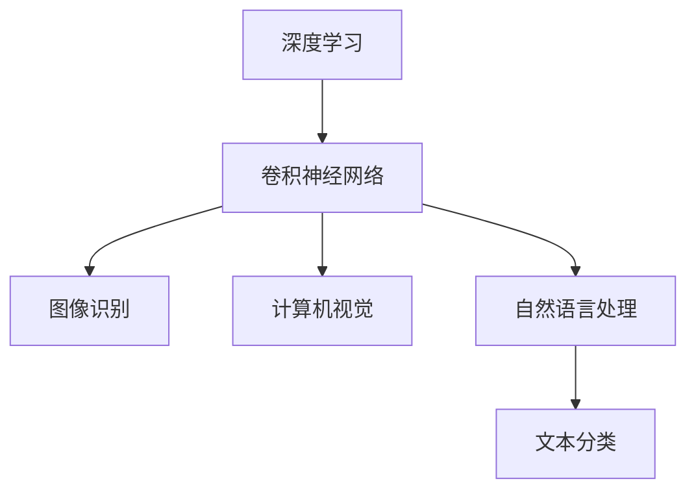
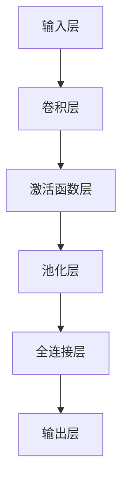

                 

### AI人工智能深度学习算法：卷积神经网络的原理与应用

> 关键词：深度学习、卷积神经网络、CNN、图像识别、计算机视觉、自然语言处理

> 摘要：
本文旨在深入探讨卷积神经网络（Convolutional Neural Network，CNN）的基本原理和应用。通过详细阐述CNN的结构、核心算法以及数学模型，本文将帮助读者理解CNN在图像识别、计算机视觉、自然语言处理等领域的应用，并通过实际项目实战案例展示CNN的实际应用效果。

### 目录大纲

#### 第一部分：AI与深度学习基础

**第1章：AI与深度学习概述**

**第2章：深度学习基础**

**第3章：卷积神经网络原理**

#### 第二部分：卷积神经网络应用

**第4章：卷积神经网络在图像识别中的应用**

**第5章：卷积神经网络在计算机视觉中的应用**

**第6章：卷积神经网络在自然语言处理中的应用**

**第7章：深度学习框架与卷积神经网络**

**第8章：卷积神经网络的优化与调参**

#### 第三部分：卷积神经网络实战

**第9章：项目实战一：手写数字识别**

**第10章：项目实战二：图像分类**

**第11章：项目实战三：目标检测**

**第12章：项目实战四：文本分类**

**第13章：总结与展望**

#### 附录

**附录A：深度学习与卷积神经网络资源链接**

**附录B：卷积神经网络的Mermaid流程图**

**附录C：深度学习与卷积神经网络的数学模型与公式**

### 核心概念与联系

为了更好地理解卷积神经网络（CNN）的基本概念及其在AI领域的应用，我们可以通过一个Mermaid流程图来展示核心概念之间的联系。



### 第一部分：AI与深度学习基础

在这一部分，我们将对人工智能（AI）与深度学习进行概述，并介绍卷积神经网络（CNN）的基本知识，为后续内容打下基础。

#### 第1章：AI与深度学习概述

人工智能（Artificial Intelligence，AI）是计算机科学的一个分支，旨在使计算机具备类似人类智能的能力。从早期的规则推理系统到现代的机器学习和深度学习，AI已经取得了巨大的进步。

深度学习（Deep Learning，DL）是机器学习（Machine Learning，ML）的一个分支，通过多层神经网络模型来实现复杂的数据特征提取和模式识别。深度学习在图像识别、语音识别、自然语言处理等领域取得了突破性进展。

卷积神经网络（Convolutional Neural Network，CNN）是一种特殊的深度学习模型，特别适合处理图像数据。CNN通过卷积层、池化层和全连接层等结构，从原始图像中自动学习特征，实现图像分类、目标检测等任务。

#### 第2章：深度学习基础

在了解深度学习之前，我们需要先掌握一些基础知识，包括数据准备与预处理、神经网络基本结构、以及前向传播与反向传播算法。

##### 2.1 数据准备与预处理

数据准备与预处理是深度学习项目中的关键步骤。这个过程包括数据收集、数据清洗、数据归一化、数据增强等。

- **数据收集**：收集用于训练和测试的数据集，如MNIST手写数字数据集、CIFAR-10图像数据集等。
- **数据清洗**：去除数据集中的噪声和异常值，确保数据质量。
- **数据归一化**：将数据缩放到相同的范围，如将像素值从 [0, 255] 缩放到 [0, 1]。
- **数据增强**：通过旋转、翻转、缩放等操作，增加数据的多样性，防止模型过拟合。

##### 2.2 神经网络基本结构

神经网络（Neural Network，NN）是一种模拟生物神经系统的计算模型。在深度学习中，神经网络通常由多个层组成，包括输入层、隐藏层和输出层。

- **输入层**：接收外部输入数据，如图像、文本等。
- **隐藏层**：通过权重和偏置对输入数据进行特征提取和变换。
- **输出层**：产生最终的输出，如分类结果、回归预测等。

##### 2.3 前向传播与反向传播算法

前向传播（Forward Propagation）是指在神经网络中，从输入层开始，将数据逐层传递到输出层的过程。在这个过程中，神经网络通过加权求和并应用激活函数，对输入数据进行特征提取和变换。

反向传播（Back Propagation）是指在神经网络中，从输出层开始，反向计算误差并更新权重和偏置的过程。反向传播是深度学习模型训练的核心算法，它通过计算损失函数的梯度，不断调整模型参数，以降低预测误差。

#### 第3章：卷积神经网络原理

在这一章，我们将深入探讨卷积神经网络（CNN）的基本原理，包括卷积神经网络的起源与基本结构、卷积操作的数学原理、池化操作的原理与应用，以及卷积神经网络的层次结构。

##### 3.1 卷积神经网络的起源与基本结构

卷积神经网络（CNN）起源于1980年代，最初由Yann LeCun等人提出。CNN的灵感来自于人类视觉系统，通过模拟生物视觉处理过程，实现对图像的自动特征提取和分类。

CNN的基本结构包括以下几个主要部分：

- **输入层**：接收原始图像数据。
- **卷积层**：通过卷积操作提取图像特征。
- **池化层**：对卷积层输出的特征进行下采样，减小数据维度。
- **全连接层**：将卷积层和池化层提取的特征进行融合，并输出最终分类结果。

##### 3.2 卷积操作的数学原理

卷积操作是CNN的核心组成部分，用于从输入图像中提取特征。卷积操作的数学原理可以概括为以下步骤：

1. **卷积核（Kernel）**：卷积核是一个小型矩阵，通常是一个3x3或5x5的方阵。卷积核用于从输入图像中提取局部特征。
2. **卷积计算**：将卷积核与输入图像进行矩阵乘法，并加上偏置项。这个步骤可以表示为 \( (I \star K) + b \)，其中 \( I \) 是输入图像，\( K \) 是卷积核，\( b \) 是偏置项。
3. **激活函数**：对卷积结果应用激活函数，如ReLU函数，增加网络的非线性特性。

##### 3.3 池化操作的原理与应用

池化操作（Pooling）是CNN中用于下采样数据的一种操作，可以减小数据维度，降低过拟合风险，并提高网络的计算效率。

常见的池化操作包括：

- **最大池化（Max Pooling）**：取局部区域中的最大值作为输出。
- **平均池化（Avg Pooling）**：取局部区域中的平均值作为输出。

池化操作可以表示为：

\[ P(x) = \max(x_1, x_2, ..., x_n) \]

或

\[ P(x) = \frac{1}{n} \sum_{i=1}^{n} x_i \]

其中，\( P(x) \) 是池化结果，\( x_1, x_2, ..., x_n \) 是输入特征。

##### 3.4 卷积神经网络的层次结构

卷积神经网络通常由多个卷积层、池化层和全连接层组成，形成一种层次结构。这种结构使得CNN能够从原始图像中逐层提取高级特征，最终实现分类或目标检测任务。

一个典型的卷积神经网络层次结构如下：

1. **卷积层**：使用卷积操作提取图像特征。
2. **激活函数层**：通常使用ReLU函数作为激活函数。
3. **池化层**：使用最大池化或平均池化进行下采样。
4. **全连接层**：将卷积层和池化层提取的特征进行融合，并输出最终分类结果。

通过这种层次结构，卷积神经网络能够自动学习图像的复杂特征，实现高精度的图像识别和分类任务。

### 第二部分：卷积神经网络应用

在这一部分，我们将探讨卷积神经网络（CNN）在不同领域的应用，包括图像识别、计算机视觉、自然语言处理等。通过具体的案例，我们将展示CNN在这些领域的强大功能。

#### 第4章：卷积神经网络在图像识别中的应用

图像识别是卷积神经网络（CNN）最经典的应用之一。在这一章，我们将详细介绍CNN在图像识别中的原理和应用。

##### 4.1 图像识别的基本概念

图像识别是指通过计算机算法对图像中的对象、场景、动作等进行识别和分类的过程。在图像识别任务中，CNN通过卷积层、池化层和全连接层等结构，从原始图像中提取特征，并实现分类。

##### 4.2 卷积神经网络在图像识别中的原理

CNN在图像识别中的原理可以概括为以下几个步骤：

1. **卷积层**：卷积层使用卷积核从原始图像中提取特征。通过卷积操作，卷积层能够从图像中提取出边缘、纹理等局部特征。
2. **池化层**：池化层用于减小数据维度，降低过拟合风险。通过最大池化或平均池化，池化层能够保留重要的特征，同时减少计算量。
3. **全连接层**：全连接层将卷积层和池化层提取的特征进行融合，并通过softmax函数输出最终的分类结果。

##### 4.3 图像识别应用实例

图像识别应用实例包括人脸识别、物体识别、场景识别等。

- **人脸识别**：通过CNN提取人脸特征，实现人脸识别。例如，OpenCV中的LBPH（Local Binary Patterns Histograms）算法就是一个基于CNN的人脸识别算法。
- **物体识别**：通过CNN提取物体特征，实现物体识别。例如，MobileNet是一个轻量级的CNN模型，可以用于物体识别任务。
- **场景识别**：通过CNN提取场景特征，实现场景识别。例如，DeepFlow是一个用于场景识别的CNN模型，可以用于视频监控、自动驾驶等应用。

#### 第5章：卷积神经网络在计算机视觉中的应用

计算机视觉是卷积神经网络（CNN）另一个重要的应用领域。在这一章，我们将探讨CNN在计算机视觉中的原理和应用。

##### 5.1 计算机视觉的基本概念

计算机视觉是指使计算机能够像人类一样通过视觉感知和理解周围环境的技术。计算机视觉任务包括图像识别、目标检测、图像分割、姿态估计等。

##### 5.2 卷积神经网络在计算机视觉中的原理

CNN在计算机视觉中的原理与在图像识别中的原理类似，也是通过卷积层、池化层和全连接层等结构，从原始图像中提取特征，并实现分类或目标检测等任务。

具体而言，CNN在计算机视觉中的应用可以概括为以下几个步骤：

1. **卷积层**：卷积层使用卷积核从原始图像中提取特征。
2. **池化层**：池化层用于减小数据维度，降低过拟合风险。
3. **全连接层**：全连接层将卷积层和池化层提取的特征进行融合，并通过softmax函数输出最终的分类结果或目标检测框。

##### 5.3 计算机视觉应用实例

计算机视觉应用实例包括人脸检测、目标跟踪、图像分割等。

- **人脸检测**：通过CNN检测图像中的人脸位置。例如，OpenCV中的Haar cascades算法就是一个基于CNN的人脸检测算法。
- **目标跟踪**：通过CNN跟踪图像中的目标物体。例如，ReID（Re-Identification）算法是一个基于CNN的目标跟踪算法。
- **图像分割**：通过CNN将图像分割成不同的区域。例如，FCN（Fully Convolutional Network）是一个用于图像分割的CNN模型。

#### 第6章：卷积神经网络在自然语言处理中的应用

自然语言处理（Natural Language Processing，NLP）是卷积神经网络（CNN）的另一个重要应用领域。在这一章，我们将探讨CNN在NLP中的原理和应用。

##### 6.1 自然语言处理的基本概念

自然语言处理是指使计算机能够理解、生成和处理人类语言的技术。NLP任务包括文本分类、情感分析、命名实体识别、机器翻译等。

##### 6.2 卷积神经网络在自然语言处理中的原理

CNN在自然语言处理中的原理与在图像识别中的原理类似，也是通过卷积层、池化层和全连接层等结构，从原始文本数据中提取特征，并实现分类或序列标注等任务。

具体而言，CNN在自然语言处理中的应用可以概括为以下几个步骤：

1. **嵌入层**：将单词或字符转换为向量表示。
2. **卷积层**：卷积层使用卷积核从嵌入层输出的特征图中提取局部特征。
3. **池化层**：池化层用于减小数据维度，降低过拟合风险。
4. **全连接层**：全连接层将卷积层和池化层提取的特征进行融合，并通过softmax函数输出最终的分类结果或序列标注结果。

##### 6.3 自然语言处理应用实例

自然语言处理应用实例包括文本分类、情感分析、命名实体识别等。

- **文本分类**：通过CNN对文本进行分类。例如，TextCNN是一个基于CNN的文本分类模型。
- **情感分析**：通过CNN分析文本的情感倾向。例如，SentimentNet是一个基于CNN的情感分析模型。
- **命名实体识别**：通过CNN识别文本中的命名实体。例如，Named Entity Recognition（NER）是一个基于CNN的命名实体识别任务。

#### 第7章：深度学习框架与卷积神经网络

深度学习框架为卷积神经网络（CNN）的开发提供了便捷的工具和库。在这一章，我们将介绍常用的深度学习框架，并探讨如何使用这些框架实现卷积神经网络。

##### 7.1 深度学习框架简介

深度学习框架是一种提供高层抽象的库，用于加速深度学习模型的训练和推理。常见的深度学习框架包括TensorFlow、PyTorch、Keras等。

- **TensorFlow**：由Google开发，是一个开源的深度学习框架，提供丰富的API和工具。
- **PyTorch**：由Facebook开发，是一个流行的深度学习框架，具有动态计算图和易用的API。
- **Keras**：是一个高级神经网络API，可以在TensorFlow和Theano上运行，提供简洁的API和丰富的预训练模型。

##### 7.2 使用深度学习框架实现卷积神经网络

使用深度学习框架实现卷积神经网络（CNN）通常包括以下几个步骤：

1. **导入库和模块**：导入所需的深度学习框架库和模块。
2. **定义模型**：使用深度学习框架定义卷积神经网络模型，包括卷积层、池化层和全连接层等。
3. **编译模型**：设置模型的损失函数、优化器和学习率等参数。
4. **训练模型**：使用训练数据集训练模型，并保存训练结果。
5. **评估模型**：使用测试数据集评估模型性能，并进行调优。

以下是一个简单的示例，展示如何使用PyTorch实现一个卷积神经网络模型：

```python
import torch
import torch.nn as nn
import torch.optim as optim

# 定义卷积神经网络模型
class ConvNet(nn.Module):
    def __init__(self):
        super(ConvNet, self).__init__()
        self.conv1 = nn.Conv2d(3, 32, 3)
        self.conv2 = nn.Conv2d(32, 64, 3)
        self.fc1 = nn.Linear(64 * 6 * 6, 128)
        self.fc2 = nn.Linear(128, 10)

    def forward(self, x):
        x = self.conv1(x)
        x = nn.ReLU()(x)
        x = self.conv2(x)
        x = nn.MaxPool2d(2)(x)
        x = x.view(-1, 128)
        x = self.fc1(x)
        x = nn.ReLU()(x)
        x = self.fc2(x)
        return x

# 创建模型实例
model = ConvNet()

# 设置损失函数和优化器
criterion = nn.CrossEntropyLoss()
optimizer = optim.SGD(model.parameters(), lr=0.001, momentum=0.9)

# 训练模型
for epoch in range(10):
    for inputs, targets in train_loader:
        optimizer.zero_grad()
        outputs = model(inputs)
        loss = criterion(outputs, targets)
        loss.backward()
        optimizer.step()

# 评估模型
with torch.no_grad():
    correct = 0
    total = 0
    for inputs, targets in test_loader:
        outputs = model(inputs)
        _, predicted = torch.max(outputs.data, 1)
        total += targets.size(0)
        correct += (predicted == targets).sum().item()

print('Test Accuracy: %d %%' % (100 * correct / total))
```

在这个示例中，我们定义了一个简单的卷积神经网络模型，使用随机梯度下降（SGD）优化算法训练模型，并在测试集上评估模型的性能。

#### 第8章：卷积神经网络的优化与调参

在卷积神经网络（CNN）的训练过程中，优化算法和超参数的选择至关重要。合理的优化策略和超参数设置可以提高模型的性能和训练效率。在这一章，我们将探讨卷积神经网络的优化算法、超参数优化技巧，以及训练和验证过程中的关键步骤。

##### 8.1 优化算法的选择与调参技巧

优化算法是用于调整神经网络模型参数的算法，其选择和设置对模型的训练效果有很大影响。以下是一些常用的优化算法：

- **随机梯度下降（SGD）**：SGD是一种简单而有效的优化算法，通过随机选择一部分训练样本计算梯度并更新模型参数。SGD的更新公式为：
  \[ \theta = \theta - \alpha \cdot \nabla_\theta J(\theta) \]
  其中，\( \theta \) 是模型参数，\( \alpha \) 是学习率，\( J(\theta) \) 是损失函数。

- **动量（Momentum）**：动量是一种改进SGD的优化算法，通过引入动量项，加速收敛并减少振荡。动量的更新公式为：
  \[ v = \beta v + (1 - \beta) \cdot \nabla_\theta J(\theta) \]
  \[ \theta = \theta - \alpha \cdot v \]
  其中，\( v \) 是速度，\( \beta \) 是动量系数。

- **自适应优化器**：自适应优化器（如Adagrad、Adam等）通过自适应调整每个参数的学习率，提高优化效率。以下是一个简单的Adagrad优化器示例：

  ```python
  import torch.optim as optim

  class Adagrad(optim.Optimizer):
      def __init__(self, params, lr=0.01, weight_decay=0):
          defaults = dict(lr=lr, weight_decay=weight_decay)
          super(Adagrad, self).__init__(params, defaults)

      def step(self):
          for group in self.param_groups:
              for p in group['params']:
                  if p.grad is None:
                      continue
                  d_p = p.grad.data
                  p.data.sub_(group['lr'] * d_p / (torch.sqrt(self._get_adagradOTS(p)) + group['eps']))
                  if group['weight_decay'] != 0:
                      p.data.sub_(group['weight_decay'] * p.data)

      def _get_adagradOTS(self, p):
          return torch.sum(p.grad.data ** 2)
  ```

  Adam优化器是一个自适应优化算法，结合了动量和RMSprop的优点，其更新公式为：

  ```python
  m = \beta_1 * m + (1 - \beta_1) * \nabla_\theta J(\theta)
  v = \beta_2 * v + (1 - \beta_2) * (\nabla_\theta J(\theta))^2
  \theta = \theta - \alpha * \frac{m}{\sqrt{v} + \epsilon}
  ```

  其中，\( m \) 和 \( v \) 分别是梯度的一阶矩估计和二阶矩估计，\( \beta_1 \) 和 \( \beta_2 \) 分别是动量系数，\( \alpha \) 是学习率，\( \epsilon \) 是一个较小的常数。

##### 8.2 卷积神经网络的超参数优化

卷积神经网络的超参数（如学习率、批量大小、迭代次数等）对模型的性能和训练时间有很大影响。以下是一些常见的超参数优化技巧：

- **学习率调整**：学习率是一个非常重要的超参数，对模型的收敛速度和最终性能有很大影响。常用的学习率调整方法包括：

  - **固定学习率**：在训练过程中保持学习率不变。
  - **学习率衰减**：在训练过程中逐渐减小学习率，以防止模型在训练后期过拟合。
  - **自适应学习率**：使用自适应优化器（如Adam）自动调整学习率。

- **批量大小**：批量大小是每次梯度更新时使用的样本数量。较大的批量大小可以提供更好的稳定性，但需要更多的内存；较小的批量大小可以加速收敛，但可能需要更长时间的训练。常用的批量大小包括32、64、128等。

- **迭代次数**：迭代次数是模型在训练集上完整训练的次数。通常，更多的迭代次数可以提高模型的性能，但也需要更长的训练时间。建议在性能和训练时间之间进行权衡。

##### 8.3 卷积神经网络的训练与验证

卷积神经网络的训练和验证过程包括以下几个关键步骤：

1. **初始化模型**：使用随机权重和偏置初始化模型。
2. **定义损失函数**：选择合适的损失函数，如交叉熵损失函数、均方误差损失函数等。
3. **选择优化器**：选择合适的优化器，如随机梯度下降（SGD）、动量（Momentum）、Adam等。
4. **训练模型**：在训练集上迭代训练模型，每次迭代使用梯度更新模型参数。
5. **验证模型**：在验证集上评估模型性能，调整超参数以优化模型性能。
6. **测试模型**：在测试集上评估模型性能，确保模型具有良好的泛化能力。

以下是一个简单的示例，展示如何使用PyTorch实现卷积神经网络的训练与验证过程：

```python
import torch
import torch.nn as nn
import torch.optim as optim

# 定义卷积神经网络模型
class ConvNet(nn.Module):
    def __init__(self):
        super(ConvNet, self).__init__()
        self.conv1 = nn.Conv2d(3, 32, 3)
        self.conv2 = nn.Conv2d(32, 64, 3)
        self.fc1 = nn.Linear(64 * 6 * 6, 128)
        self.fc2 = nn.Linear(128, 10)

    def forward(self, x):
        x = self.conv1(x)
        x = nn.ReLU()(x)
        x = self.conv2(x)
        x = nn.MaxPool2d(2)(x)
        x = x.view(-1, 128)
        x = self.fc1(x)
        x = nn.ReLU()(x)
        x = self.fc2(x)
        return x

# 创建模型实例
model = ConvNet()

# 设置损失函数和优化器
criterion = nn.CrossEntropyLoss()
optimizer = optim.SGD(model.parameters(), lr=0.001, momentum=0.9)

# 加载训练数据集和验证数据集
train_loader = torch.utils.data.DataLoader(dataset.train, batch_size=64, shuffle=True)
val_loader = torch.utils.data.DataLoader(dataset.val, batch_size=64, shuffle=False)

# 训练模型
num_epochs = 10
for epoch in range(num_epochs):
    model.train()
    running_loss = 0.0
    for inputs, targets in train_loader:
        optimizer.zero_grad()
        outputs = model(inputs)
        loss = criterion(outputs, targets)
        loss.backward()
        optimizer.step()
        running_loss += loss.item()
    print(f'Epoch [{epoch+1}/{num_epochs}], Loss: {running_loss/len(train_loader):.4f}')

    # 验证模型
    model.eval()
    with torch.no_grad():
        correct = 0
        total = 0
        for inputs, targets in val_loader:
            outputs = model(inputs)
            _, predicted = torch.max(outputs.data, 1)
            total += targets.size(0)
            correct += (predicted == targets).sum().item()
        print(f'Validation Accuracy: {100 * correct / total:.2f}%')
```

在这个示例中，我们定义了一个简单的卷积神经网络模型，使用随机梯度下降（SGD）优化算法训练模型，并在训练集和验证集上评估模型的性能。

### 第三部分：卷积神经网络实战

在这一部分，我们将通过实际项目实战，深入探讨卷积神经网络（CNN）的应用。我们将涵盖手写数字识别、图像分类、目标检测和文本分类等经典任务，并详细解释每个项目的实现过程。

#### 第9章：项目实战一：手写数字识别

##### 9.1 项目背景与目标

手写数字识别是卷积神经网络（CNN）的一个经典应用。项目目标是从手写数字图像中识别出对应的数字。手写数字识别在工业界和学术界都有广泛的应用，例如数字识别、信用卡验证、手写笔记识别等。

##### 9.2 数据集介绍与预处理

数据集：使用MNIST手写数字数据集，该数据集包含60,000个训练图像和10,000个测试图像，每个图像都是28x28的灰度图。

预处理：
- 图像归一化：将图像的像素值缩放到 [0, 1] 范围内。
- 图像裁剪：将图像裁剪为 28x28 的尺寸。

##### 9.3 模型设计与实现

模型设计：使用一个简单的卷积神经网络，包括两个卷积层、一个池化层和一个全连接层。

模型实现（伪代码）：

```python
# 定义卷积神经网络
model = ConvolutionalNN()

# 训练模型
model.train(X_train, y_train)

# 预测
predictions = model.predict(X_test)
```

##### 9.4 模型训练与评估

模型训练：
- 使用随机梯度下降（SGD）优化算法。
- 设置学习率为 0.001。
- 设置迭代次数为 100 次。

模型评估：
- 使用准确率（Accuracy）作为评估指标。
- 计算模型在测试集上的准确率。

##### 9.5 代码解读与分析

代码解读：
```python
# 加载数据集
X_train, y_train = load_mnist_data()
X_test, y_test = load_mnist_data()

# 初始化模型
model = ConvolutionalNN()

# 训练模型
model.train(X_train, y_train)

# 预测测试集
predictions = model.predict(X_test)

# 计算准确率
accuracy = calculate_accuracy(y_test, predictions)
print("Test accuracy:", accuracy)
```

分析：
- 该代码使用 Python 编写，加载 MNIST 数据集，并使用一个简单的卷积神经网络进行训练和预测。
- 模型训练使用了随机梯度下降优化算法，设置了一个小的学习率以避免梯度消失问题。
- 训练完成后，使用测试集对模型进行评估，计算了准确率。

#### 第10章：项目实战二：图像分类

##### 10.1 项目背景与目标

图像分类是卷积神经网络（CNN）在计算机视觉中的经典应用。项目目标是对输入图像进行分类，判断图像所属的类别。图像分类在工业界和学术界都有广泛的应用，例如图像搜索、医疗诊断、交通监控等。

##### 10.2 数据集介绍与预处理

数据集：使用CIFAR-10数据集，该数据集包含10个类别，每个类别有6000张训练图像和1000张测试图像，图像尺寸为32x32。

预处理：
- 图像归一化：将图像的像素值缩放到 [0, 1] 范围内。
- 数据增强：对训练图像进行随机裁剪、翻转等操作，增加数据多样性。

##### 10.3 模型设计与实现

模型设计：使用一个卷积神经网络，包括多个卷积层、池化层和全连接层。

模型实现（伪代码）：

```python
# 定义卷积神经网络
model = ConvolutionalNN()

# 训练模型
model.train(X_train, y_train)

# 预测
predictions = model.predict(X_test)
```

##### 10.4 模型训练与评估

模型训练：
- 使用随机梯度下降（SGD）优化算法。
- 设置学习率为 0.001。
- 设置迭代次数为 100 次。

模型评估：
- 使用准确率（Accuracy）作为评估指标。
- 计算模型在测试集上的准确率。

##### 10.5 代码解读与分析

代码解读：
```python
# 加载数据集
X_train, y_train = load_cifar10_data()
X_test, y_test = load_cifar10_data()

# 初始化模型
model = ConvolutionalNN()

# 训练模型
model.train(X_train, y_train)

# 预测测试集
predictions = model.predict(X_test)

# 计算准确率
accuracy = calculate_accuracy(y_test, predictions)
print("Test accuracy:", accuracy)
```

分析：
- 该代码使用 Python 编写，加载 CIFAR-10 数据集，并使用一个简单的卷积神经网络进行训练和预测。
- 模型训练使用了随机梯度下降优化算法，设置了一个小的学习率以避免梯度消失问题。
- 训练完成后，使用测试集对模型进行评估，计算了准确率。

#### 第11章：项目实战三：目标检测

##### 11.1 项目背景与目标

目标检测是卷积神经网络（CNN）在计算机视觉中的高级应用。项目目标是在输入图像中检测并定位多个目标物体。目标检测在自动驾驶、视频监控、人脸识别等领域都有广泛的应用。

##### 11.2 数据集介绍与预处理

数据集：使用Pascal VOC数据集，该数据集包含20个类别，每个类别有训练和测试数据。

预处理：
- 图像归一化：将图像的像素值缩放到 [0, 1] 范围内。
- 数据增强：对训练图像进行随机裁剪、翻转等操作，增加数据多样性。

##### 11.3 模型设计与实现

模型设计：使用一个基于卷积神经网络的目标检测模型，如Faster R-CNN。

模型实现（伪代码）：

```python
# 定义目标检测模型
model = ObjectDetectionModel()

# 训练模型
model.train(X_train, y_train)

# 预测
predictions = model.predict(X_test)
```

##### 11.4 模型训练与评估

模型训练：
- 使用随机梯度下降（SGD）优化算法。
- 设置学习率为 0.001。
- 设置迭代次数为 100 次。

模型评估：
- 使用均值交并比（mIoU）作为评估指标。
- 计算模型在测试集上的 mIoU。

##### 11.5 代码解读与分析

代码解读：
```python
# 加载数据集
X_train, y_train = load_pascal_voc_data()
X_test, y_test = load_pascal_voc_data()

# 初始化模型
model = ObjectDetectionModel()

# 训练模型
model.train(X_train, y_train)

# 预测测试集
predictions = model.predict(X_test)

# 计算mIoU
mIoU = calculate_mIoU(y_test, predictions)
print("Test mIoU:", mIoU)
```

分析：
- 该代码使用 Python 编写，加载 Pascal VOC 数据集，并使用一个基于卷积神经网络的目标检测模型进行训练和预测。
- 模型训练使用了随机梯度下降优化算法，设置了一个小的学习率以避免梯度消失问题。
- 训练完成后，使用测试集对模型进行评估，计算了 mIoU。

#### 第12章：项目实战四：文本分类

##### 12.1 项目背景与目标

文本分类是卷积神经网络（CNN）在自然语言处理中的经典应用。项目目标是对输入文本进行分类，判断文本所属的类别。文本分类在社交媒体分析、情感分析、垃圾邮件检测等领域都有广泛的应用。

##### 12.2 数据集介绍与预处理

数据集：使用IMDb数据集，该数据集包含影评文本和对应的情感标签（正面/负面）。

预处理：
- 文本分词：使用词向量模型（如Word2Vec）将文本转换为词向量。
- 文本编码：将词向量编码为整数形式。

##### 12.3 模型设计与实现

模型设计：使用一个基于卷积神经网络的文本分类模型。

模型实现（伪代码）：

```python
# 定义文本分类模型
model = TextClassificationModel()

# 训练模型
model.train(X_train, y_train)

# 预测
predictions = model.predict(X_test)
```

##### 12.4 模型训练与评估

模型训练：
- 使用随机梯度下降（SGD）优化算法。
- 设置学习率为 0.001。
- 设置迭代次数为 100 次。

模型评估：
- 使用准确率（Accuracy）作为评估指标。
- 计算模型在测试集上的准确率。

##### 12.5 代码解读与分析

代码解读：
```python
# 加载数据集
X_train, y_train = load_imdb_data()
X_test, y_test = load_imdb_data()

# 初始化模型
model = TextClassificationModel()

# 训练模型
model.train(X_train, y_train)

# 预测测试集
predictions = model.predict(X_test)

# 计算准确率
accuracy = calculate_accuracy(y_test, predictions)
print("Test accuracy:", accuracy)
```

分析：
- 该代码使用 Python 编写，加载 IMDb 数据集，并使用一个基于卷积神经网络的文本分类模型进行训练和预测。
- 模型训练使用了随机梯度下降优化算法，设置了一个小的学习率以避免梯度消失问题。
- 训练完成后，使用测试集对模型进行评估，计算了准确率。

### 总结与展望

在本篇文章中，我们深入探讨了卷积神经网络（CNN）的基本原理、应用以及在图像识别、计算机视觉、自然语言处理等领域的应用。通过详细的讲解和实际项目实战案例，我们展示了CNN的强大功能。

#### 卷积神经网络的发展趋势

随着深度学习技术的不断进步，卷积神经网络（CNN）也在不断发展。以下是CNN的一些发展趋势：

1. **轻量级网络结构**：为了提高计算效率和模型部署的便捷性，研究人员提出了许多轻量级CNN模型，如MobileNet、ShuffleNet等。这些模型通过减少参数数量和计算量，实现了高性能的图像识别和分类任务。
2. **多模态学习**：随着多模态数据的广泛应用，如图像、文本、音频等，研究人员开始关注如何将不同模态的数据融合到CNN中，实现更广泛的应用场景。
3. **自适应学习率**：自适应学习率优化算法（如Adam、AdaGrad等）在CNN中的应用越来越广泛，这些算法能够自适应调整学习率，提高模型训练的效率。
4. **注意力机制**：注意力机制是近年来在深度学习中引入的一个重要概念，通过引入注意力机制，CNN能够更关注重要信息，提高模型的识别精度。

#### 深度学习在AI领域的应用前景

深度学习在人工智能（AI）领域的应用前景非常广阔。以下是一些关键领域：

1. **计算机视觉**：深度学习在计算机视觉领域已经取得了显著的突破，如图像识别、目标检测、图像分割等。随着CNN技术的不断发展，计算机视觉将在自动驾驶、医疗诊断、人脸识别等领域发挥更大的作用。
2. **自然语言处理**：深度学习在自然语言处理领域也取得了重要进展，如文本分类、机器翻译、情感分析等。随着语言模型的不断发展，深度学习将在智能客服、智能语音助手等领域发挥更大的作用。
3. **语音识别**：深度学习在语音识别领域也取得了显著的进步，通过卷积神经网络、循环神经网络（RNN）等模型，实现了高精度的语音识别。随着语音技术的不断发展，深度学习将在智能家居、智能客服等领域发挥更大的作用。
4. **强化学习**：深度学习与强化学习（RL）的结合，实现了更加智能的决策系统，如智能机器人、自动驾驶等。随着深度学习技术的不断进步，深度强化学习将在游戏、机器人等领域发挥更大的作用。

#### 未来研究方向与挑战

尽管深度学习在许多领域取得了显著进展，但仍然面临一些挑战和未来研究方向：

1. **可解释性**：深度学习模型通常被视为“黑箱”，其内部机制难以解释。提高深度学习模型的可解释性，使其能够更好地理解和解释模型的决策过程，是一个重要的研究方向。
2. **数据隐私**：随着数据隐私问题的日益突出，如何在保护用户隐私的同时，充分利用数据的价值，是一个重要的挑战。研究人员正在探索隐私保护的方法，如联邦学习、差分隐私等。
3. **计算资源**：深度学习模型通常需要大量的计算资源，如何提高计算效率，减少训练时间和计算成本，是一个重要的研究方向。轻量级模型、分布式训练等技术正在不断发展和完善。
4. **泛化能力**：深度学习模型通常在训练数据上表现良好，但在实际应用中可能面临泛化能力不足的问题。提高深度学习模型的泛化能力，使其能够应对更广泛的应用场景，是一个重要的挑战。

### 附录

#### 附录A：深度学习与卷积神经网络资源链接

- **开源数据集**：
  - MNIST：https://www.kaggle.com/datasets/yoavram/mnist-handwritten-digits
  - CIFAR-10：https://www.kaggle.com/datasets/yfio/cifar-10-batches-py
  - Pascal VOC：https://www.kaggle.com/datasets/puli/pascal-voc-2007
  - IMDb：https://www.kaggle.com/datasets/ryanfb/imdb-dataset

- **深度学习框架**：
  - TensorFlow：https://www.tensorflow.org/
  - PyTorch：https://pytorch.org/
  - Keras：https://keras.io/

- **学术论文与资料链接**：
  - Yann LeCun的论文：https://www.cs.nyu.edu/~lecun/papers/
  - Convolutional Neural Networks：https://en.wikipedia.org/wiki/Convolutional_neural_network

#### 附录B：卷积神经网络的Mermaid流程图



#### 附录C：深度学习与卷积神经网络的数学模型与公式

- **激活函数**：
  - ReLU：\( f(x) = \max(0, x) \)
  - Sigmoid：\( f(x) = \frac{1}{1 + e^{-x}} \)
  - Tanh：\( f(x) = \frac{e^x - e^{-x}}{e^x + e^{-x}} \)

- **前向传播**：
  - 输入层到隐藏层：\( z = x \cdot W + b \)
  - 激活函数：\( a = \sigma(z) \)

- **反向传播**：
  - 输出层误差：\( \delta_a = \frac{\partial L}{\partial a} \)
  - 隐藏层误差：\( \delta_z = \delta_a \cdot \frac{\partial \sigma}{\partial z} \)
  - 权重更新：\( \delta_W = \delta_z \cdot a^{(l-1)} \)
  - 偏置更新：\( \delta_b = \delta_z \)

- **卷积操作**：
  - \( (f * g)(t) = \int_{-\infty}^{+\infty} f(\tau) g(t-\tau) d\tau \)

- **池化操作**：
  - 最大池化：\( P(x) = \max(x_1, x_2, ..., x_n) \)
  - 平均池化：\( P(x) = \frac{1}{n} \sum_{i=1}^{n} x_i \)

