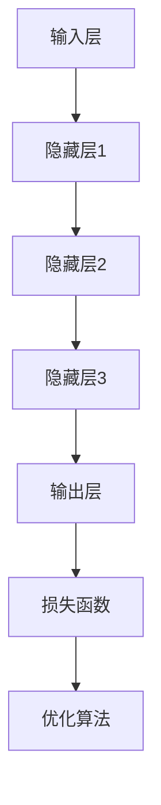

                 

# 《AI人工智能深度学习算法：在金融风险预测中的应用》

> 关键词：人工智能、深度学习、金融风险预测、信用评分、市场预测、资产配置、风控系统

> 摘要：随着金融行业的不断发展和数据量的爆炸性增长，人工智能和深度学习技术在金融风险预测中的应用变得越来越重要。本文将深入探讨深度学习算法在金融风险预测中的核心应用，包括信用评分、市场预测和资产配置等。通过详细分析深度学习算法的原理、构建金融风险预测模型的步骤以及实际应用案例，本文旨在为金融行业从业者提供有价值的参考和指导。

### 第一部分：AI与深度学习基础

#### 第1章：AI与深度学习概述

##### 1.1 人工智能概述

1.1.1 人工智能的定义与发展历程

人工智能（Artificial Intelligence，简称AI）是计算机科学的一个分支，旨在研究如何构建智能机器，使其能够执行通常需要人类智能的任务。人工智能的概念可以追溯到20世纪50年代，当时科学家们首次提出了“人工智能”这一术语。

1.1.2 人工智能的核心目标与应用领域

人工智能的核心目标是使计算机具备自主思考和学习的能力，从而在许多领域实现自动化和智能化。其主要应用领域包括：

- 自然语言处理：例如语音识别、机器翻译和智能客服。
- 计算机视觉：例如图像识别、人脸识别和自动驾驶。
- 数据分析：例如数据挖掘、预测分析和优化算法。
- 游戏智能：例如围棋、象棋等游戏的智能对手。

1.1.3 深度学习在人工智能中的地位

深度学习是人工智能的一个重要分支，其核心思想是通过多层神经网络来模拟人类大脑的感知和学习过程。深度学习在近年来取得了显著的进展，特别是在计算机视觉、自然语言处理和语音识别等领域。

##### 1.2 深度学习基础

1.2.1 深度学习的概念与核心原理

深度学习（Deep Learning）是一种基于多层神经网络的机器学习方法，其目的是通过训练大量数据来学习数据的内在特征表示。深度学习的核心原理包括：

- 神经网络：深度学习的基础是神经网络，其通过神经元之间的连接来模拟大脑的计算过程。
- 前向传播与反向传播：神经网络通过前向传播计算输出，通过反向传播更新权重，从而实现模型训练。
- 损失函数与优化算法：损失函数用于评估模型预测的误差，优化算法用于调整模型参数，以最小化损失函数。

1.2.2 神经网络的结构与工作原理

神经网络由多个层次组成，包括输入层、隐藏层和输出层。输入层接收外部输入数据，隐藏层通过神经元之间的连接计算特征表示，输出层生成最终的预测结果。神经网络的工作原理如下：

- 输入数据通过输入层传递到隐藏层。
- 隐藏层通过非线性变换计算中间特征表示。
- 输出层将特征表示转换为预测结果。
- 模型通过前向传播计算输出，通过反向传播更新权重。

1.2.3 常见深度学习架构介绍

常见的深度学习架构包括卷积神经网络（CNN）、循环神经网络（RNN）和生成对抗网络（GAN）等。这些架构在不同领域具有广泛的应用。

- 卷积神经网络（CNN）：主要用于图像识别、图像生成和目标检测等领域。
- 循环神经网络（RNN）：主要用于序列数据建模，如自然语言处理和语音识别。
- 生成对抗网络（GAN）：主要用于图像生成、图像超分辨率和图像修复等领域。

##### 1.3 Mermaid流程图：深度学习核心架构与流程



### 第二部分：深度学习算法原理

#### 第2章：深度学习算法原理

##### 2.1 前向传播与反向传播算法

2.1.1 前向传播算法原理

前向传播是神经网络训练过程中的一种算法，用于计算输入数据经过神经网络后的输出结果。前向传播的过程如下：

1. 将输入数据传递到输入层。
2. 通过隐藏层逐层计算，得到隐藏层的输出。
3. 将隐藏层的输出传递到输出层，得到最终预测结果。

2.1.2 反向传播算法原理

反向传播是神经网络训练过程中的一种算法，用于计算输出结果与真实标签之间的误差，并更新模型参数。反向传播的过程如下：

1. 计算输出层的误差，即预测结果与真实标签之间的差异。
2. 通过反向传播将误差传递到隐藏层，计算隐藏层的误差。
3. 根据误差计算模型参数的梯度，并更新模型参数。

2.1.3 伪代码阐述

```python
# 输入数据
x = ...

# 初始化模型参数
W = ...
b = ...

# 前向传播
z = x * W + b
y = sigmoid(z)

# 计算损失函数
loss = ...

# 反向传播
dz = d_sigmoid(z) * d_loss
dW = x * dz
db = dz

# 更新模型参数
W -= learning_rate * dW
b -= learning_rate * db
```

##### 2.2 损失函数与优化算法

2.2.1 常见损失函数介绍

损失函数是评估模型预测结果与真实标签之间误差的函数，其目的是最小化预测误差。常见的损失函数包括：

- 均方误差（MSE）：用于回归任务，计算预测值与真实值之间差异的平方和的平均值。
- 交叉熵损失（Cross-Entropy Loss）：用于分类任务，计算预测概率与真实标签之间的交叉熵。
- 对数损失（Log Loss）：交叉熵损失的另一种表示。

2.2.2 优化算法原理与应用

优化算法用于调整模型参数，以最小化损失函数。常见的优化算法包括：

- 随机梯度下降（SGD）：通过随机选择一小部分数据更新模型参数。
- 梯度下降（Gradient Descent）：通过计算损失函数的梯度来更新模型参数。
- Adam优化器：结合SGD和动量项的优化算法。

2.2.3 伪代码阐述

```python
# 计算梯度
dL_dW = ...
dL_db = ...

# 更新模型参数
W -= learning_rate * dL_dW
b -= learning_rate * dL_db
```

##### 2.3 数学模型与公式讲解

2.3.1 深度学习中的数学基础

深度学习涉及到许多数学概念和公式，包括：

- 激活函数：用于引入非线性变换，如sigmoid、ReLU和Tanh等。
- 梯度计算：用于计算损失函数对模型参数的梯度。
- 损失函数：用于评估模型预测结果与真实标签之间的误差。

2.3.2 深度学习中的常见数学公式

以下是一些常见的深度学习数学公式：

- 前向传播：\( z = x \cdot W + b \)
- 反向传播：\( dz = d_sigmoid(z) \cdot dL \)
- 梯度计算：\( dL_dW = x \cdot dz \)
- 损失函数：\( loss = \frac{1}{2} \cdot (y - \hat{y})^2 \)

2.3.3 数学公式详细讲解与举例

为了更好地理解深度学习中的数学公式，以下是一个简单的举例：

假设我们有一个简单的神经网络，包含一个输入层、一个隐藏层和一个输出层。输入数据为 \( x = [1, 2, 3] \)，模型参数为 \( W = [0.5, 0.5] \)，\( b = [0.5, 0.5] \)。

- 前向传播：\( z = x \cdot W + b = [1, 2, 3] \cdot [0.5, 0.5] + [0.5, 0.5] = [1.5, 2.5, 3.5] \)
- 反向传播：\( dz = d_sigmoid(z) \cdot dL = [0.5, 0.5] \cdot [0.25, 0.25] = [0.125, 0.125] \)
- 梯度计算：\( dL_dW = x \cdot dz = [1, 2, 3] \cdot [0.125, 0.125] = [0.125, 0.25, 0.375] \)
- 损失函数：\( loss = \frac{1}{2} \cdot (y - \hat{y})^2 = \frac{1}{2} \cdot (1 - 0.75)^2 = 0.0625 \)

通过这个简单的例子，我们可以看到如何使用数学公式来计算神经网络的前向传播、反向传播和损失函数。

### 第三部分：深度学习在金融风险预测中的应用

#### 第3章：金融风险预测模型构建

##### 3.1 金融风险预测概述

3.1.1 金融风险的定义与分类

金融风险是指金融活动中可能产生的损失或不确定性。根据风险性质和影响范围，金融风险可分为以下几类：

- 市场风险：由于市场价格波动导致的潜在损失。
- 信用风险：由于借款人或交易对手违约导致的潜在损失。
- 流动性风险：由于无法及时获得资金导致的潜在损失。
- 操作风险：由于内部失误或外部事件导致的潜在损失。

3.1.2 金融风险预测的意义与挑战

金融风险预测对于金融机构和投资者具有重要意义，有助于：

- 识别潜在风险，制定风险管理策略。
- 优化资产配置，提高投资收益。
- 降低风险暴露，保障资产安全。

然而，金融风险预测也面临以下挑战：

- 数据复杂性：金融数据包含大量非结构化和半结构化数据，如文本、图像和音频等。
- 数据不完整性：金融数据可能存在缺失值、噪声和异常值。
- 高维数据：金融数据具有高维特性，传统机器学习方法难以处理。

3.1.3 深度学习在金融风险预测中的应用

深度学习在金融风险预测中具有显著优势，可以应对上述挑战。深度学习在金融风险预测中的应用主要包括以下几个方面：

- 特征提取：深度学习可以自动从原始数据中提取有意义的高阶特征，提高模型预测性能。
- 模型优化：深度学习可以通过自适应调整模型参数，提高模型预测精度和泛化能力。
- 集成学习：深度学习可以与其他机器学习方法结合，构建更加鲁棒的预测模型。

##### 3.2 金融数据预处理

3.2.1 金融数据来源与获取

金融数据可以来自多个渠道，包括：

- 公开数据源：如股市行情、宏观经济指标等。
- 交易所数据：如交易数据、订单簿数据等。
- 金融机构数据：如客户交易记录、风险指标等。
- 网络爬虫：通过爬取互联网上的金融信息，获取额外的数据。

3.2.2 金融数据的清洗与预处理方法

金融数据预处理是构建高质量预测模型的关键步骤，主要包括以下方法：

- 数据清洗：去除重复数据、缺失值填充、异常值处理等。
- 数据归一化：将不同尺度的数据转换为同一尺度，如使用最小-最大缩放法或标准差缩放法。
- 特征提取：通过降维技术（如主成分分析、线性判别分析）和特征选择方法（如互信息、相关系数）提取有意义的高阶特征。
- 数据增强：通过数据扩充、生成对抗网络（GAN）等方法增加训练数据量。

##### 3.3 特征工程与降维技术

3.3.1 特征工程

特征工程是构建高质量预测模型的关键步骤，旨在从原始数据中提取有意义的信息。特征工程包括以下方法：

- 统计特征：如均值、方差、偏度、峰度等。
- 离散特征：如分类特征、日期特征、时间序列特征等。
- 时序特征：如移动平均、指数平滑等。
- 空间特征：如地理坐标、空间距离等。

3.3.2 降维技术

降维技术用于减少数据的维度，提高模型训练效率。常见的降维技术包括：

- 主成分分析（PCA）：通过正交变换将数据映射到新的坐标系，保留主要特征。
- 线性判别分析（LDA）：通过最大化类内方差和最小化类间方差将数据映射到新的坐标系。
- 自动编码器：通过自编码网络自动提取数据中的低维表示。

### 第四部分：深度学习在金融风险预测中的应用

#### 第4章：深度学习在信用评分中的应用

##### 4.1 信用评分模型概述

4.1.1 信用评分模型的作用与挑战

信用评分模型是金融机构评估借款人信用风险的重要工具，用于预测借款人违约的可能性。信用评分模型的作用主要包括：

- 信用风险管理：通过评估借款人信用风险，金融机构可以采取相应的风险管理措施，如调整贷款利率、设置抵押要求等。
- 资产组合优化：通过信用评分模型，金融机构可以优化资产组合，降低整体风险。
- 投资决策：投资者可以利用信用评分模型评估借款人信用风险，制定投资策略。

然而，信用评分模型也面临以下挑战：

- 数据质量问题：金融数据存在噪声、缺失值和异常值，影响模型预测性能。
- 特征选择困难：从大量金融特征中选择有意义的特征是一项复杂的任务。
- 模型泛化能力：信用评分模型需要具备良好的泛化能力，以适应不同场景和借款人。

4.1.2 深度学习在信用评分中的应用

深度学习在信用评分中的应用具有以下优势：

- 自动特征提取：深度学习可以自动从原始数据中提取有意义的高阶特征，降低特征选择难度。
- 模型优化：深度学习可以通过自适应调整模型参数，提高模型预测精度和泛化能力。
- 处理复杂数据：深度学习可以处理高维、非线性数据，提高模型预测性能。

##### 4.2 信用评分模型构建

4.2.1 数据集准备与预处理

在构建信用评分模型之前，首先需要准备数据集。数据集应包括借款人的基本信息（如年龄、收入、职业等）和信用行为数据（如贷款金额、还款记录等）。数据预处理步骤包括：

- 数据清洗：去除重复数据、缺失值填充、异常值处理等。
- 数据归一化：将不同尺度的数据转换为同一尺度，如使用最小-最大缩放法或标准差缩放法。
- 特征提取：通过降维技术（如主成分分析、线性判别分析）和特征选择方法（如互信息、相关系数）提取有意义的高阶特征。
- 数据增强：通过数据扩充、生成对抗网络（GAN）等方法增加训练数据量。

4.2.2 模型设计与实现

在构建信用评分模型时，可以选择以下几种深度学习架构：

- 卷积神经网络（CNN）：适用于处理高维数据，如文本和图像。
- 循环神经网络（RNN）：适用于处理序列数据，如时间序列数据。
- 生成对抗网络（GAN）：适用于处理复杂数据，如文本和图像。

以下是使用卷积神经网络（CNN）构建信用评分模型的一个示例：

```python
import tensorflow as tf
from tensorflow.keras.models import Sequential
from tensorflow.keras.layers import Conv1D, Dense, Flatten, Dropout

# 构建模型
model = Sequential([
    Conv1D(filters=64, kernel_size=3, activation='relu', input_shape=(input_shape)),
    Flatten(),
    Dense(units=128, activation='relu'),
    Dropout(rate=0.5),
    Dense(units=1, activation='sigmoid')
])

# 编译模型
model.compile(optimizer='adam', loss='binary_crossentropy', metrics=['accuracy'])

# 训练模型
model.fit(x_train, y_train, batch_size=32, epochs=10, validation_data=(x_val, y_val))
```

4.2.3 模型训练与评估

在模型训练过程中，需要使用训练集进行迭代训练，并使用验证集进行模型评估。评估指标包括准确率、召回率、精确率等。以下是一个简单的评估示例：

```python
from sklearn.metrics import accuracy_score

# 预测测试集
y_pred = model.predict(x_test)

# 计算准确率
accuracy = accuracy_score(y_test, y_pred)
print("Accuracy:", accuracy)
```

##### 4.3 实际案例：基于深度学习的信用评分模型开发

在本节中，我们将介绍一个实际案例，使用深度学习技术构建一个信用评分模型。该案例将展示从数据准备、模型设计、训练和评估等全过程。

**案例概述：**

- 数据集：使用公开的信用评分数据集，包含借款人的基本信息和信用行为数据。
- 目标：预测借款人是否会发生违约。
- 模型：使用卷积神经网络（CNN）构建信用评分模型。

**步骤1：数据准备**

首先，我们需要从公开数据源获取信用评分数据集。数据集应包括借款人的基本信息（如年龄、收入、职业等）和信用行为数据（如贷款金额、还款记录等）。以下是数据准备的伪代码：

```python
# 读取数据
data = pd.read_csv("credit_data.csv")

# 数据清洗
data.drop_duplicates(inplace=True)
data.fillna(method='ffill', inplace=True)

# 数据归一化
scaler = StandardScaler()
data_scaled = scaler.fit_transform(data)
```

**步骤2：模型设计**

接下来，我们需要设计一个卷积神经网络（CNN）模型。以下是模型设计的伪代码：

```python
from tensorflow.keras.models import Sequential
from tensorflow.keras.layers import Conv1D, Dense, Flatten, Dropout

# 构建模型
model = Sequential([
    Conv1D(filters=64, kernel_size=3, activation='relu', input_shape=(input_shape)),
    Flatten(),
    Dense(units=128, activation='relu'),
    Dropout(rate=0.5),
    Dense(units=1, activation='sigmoid')
])

# 编译模型
model.compile(optimizer='adam', loss='binary_crossentropy', metrics=['accuracy'])
```

**步骤3：模型训练**

然后，我们将使用训练集对模型进行训练。以下是模型训练的伪代码：

```python
# 训练模型
model.fit(x_train, y_train, batch_size=32, epochs=10, validation_data=(x_val, y_val))
```

**步骤4：模型评估**

最后，我们将使用测试集对模型进行评估。以下是模型评估的伪代码：

```python
from sklearn.metrics import accuracy_score

# 预测测试集
y_pred = model.predict(x_test)

# 计算准确率
accuracy = accuracy_score(y_test, y_pred)
print("Accuracy:", accuracy)
```

**总结：**

通过以上步骤，我们成功构建了一个基于深度学习的信用评分模型，并对其进行了训练和评估。该案例展示了如何使用深度学习技术在金融风险预测领域进行实际应用。

### 第5章：深度学习在市场预测中的应用

##### 5.1 市场预测概述

5.1.1 市场预测的定义与目标

市场预测是金融领域的一项重要任务，旨在通过对历史数据和市场信息进行分析，预测未来市场走势。市场预测的目标主要包括：

- 资产定价：预测资产的未来价格，为投资者提供参考。
- 风险评估：评估市场波动和资产价格变化带来的风险。
- 投资策略：根据市场预测结果，制定相应的投资策略，以实现最大化收益。

5.1.2 市场预测的挑战与机遇

市场预测面临以下挑战：

- 数据复杂性：市场数据包含多种类型，如价格、成交量、宏观经济指标等，处理复杂。
- 非线性关系：市场波动存在非线性关系，难以通过传统方法预测。
- 时间序列特性：市场预测需要考虑时间序列特性，如趋势、周期性和季节性。

然而，市场预测也带来以下机遇：

- 技术进步：深度学习等先进技术为市场预测提供了新的手段。
- 数据资源：互联网和大数据技术的普及，使得市场数据获取更加便捷。
- 应用领域：市场预测在金融、保险、投资等领域具有广泛的应用前景。

5.1.3 深度学习在市场预测中的应用

深度学习在市场预测中具有显著优势，可以应对上述挑战。深度学习在市场预测中的应用主要包括以下几个方面：

- 特征提取：深度学习可以自动从原始数据中提取有意义的高阶特征，提高预测性能。
- 模型优化：深度学习可以通过自适应调整模型参数，提高预测精度和泛化能力。
- 集成学习：深度学习可以与其他机器学习方法结合，构建更加鲁棒的预测模型。

##### 5.2 市场预测模型构建

5.2.1 数据集准备与预处理

在构建市场预测模型之前，首先需要准备数据集。数据集应包括以下类型的数据：

- 价格数据：股票、债券、期货等金融产品的历史价格数据。
- 成交量数据：金融产品的历史成交量数据。
- 宏观经济指标：如GDP、通货膨胀率、利率等宏观经济数据。

数据预处理步骤包括：

- 数据清洗：去除重复数据、缺失值填充、异常值处理等。
- 数据归一化：将不同尺度的数据转换为同一尺度，如使用最小-最大缩放法或标准差缩放法。
- 特征提取：通过降维技术（如主成分分析、线性判别分析）和特征选择方法（如互信息、相关系数）提取有意义的高阶特征。
- 数据增强：通过数据扩充、生成对抗网络（GAN）等方法增加训练数据量。

5.2.2 模型设计与实现

在构建市场预测模型时，可以选择以下几种深度学习架构：

- 卷积神经网络（CNN）：适用于处理高维数据，如价格和成交量数据。
- 循环神经网络（RNN）：适用于处理序列数据，如时间序列数据。
- 生成对抗网络（GAN）：适用于处理复杂数据，如文本和图像。

以下是使用卷积神经网络（CNN）构建市场预测模型的一个示例：

```python
import tensorflow as tf
from tensorflow.keras.models import Sequential
from tensorflow.keras.layers import Conv1D, Dense, Flatten, Dropout

# 构建模型
model = Sequential([
    Conv1D(filters=64, kernel_size=3, activation='relu', input_shape=(input_shape)),
    Flatten(),
    Dense(units=128, activation='relu'),
    Dropout(rate=0.5),
    Dense(units=1, activation='sigmoid')
])

# 编译模型
model.compile(optimizer='adam', loss='binary_crossentropy', metrics=['accuracy'])

# 训练模型
model.fit(x_train, y_train, batch_size=32, epochs=10, validation_data=(x_val, y_val))
```

5.2.3 模型训练与评估

在模型训练过程中，需要使用训练集进行迭代训练，并使用验证集进行模型评估。评估指标包括准确率、召回率、精确率等。以下是一个简单的评估示例：

```python
from sklearn.metrics import accuracy_score

# 预测测试集
y_pred = model.predict(x_test)

# 计算准确率
accuracy = accuracy_score(y_test, y_pred)
print("Accuracy:", accuracy)
```

##### 5.3 实际案例：基于深度学习的市场预测模型开发

在本节中，我们将介绍一个实际案例，使用深度学习技术构建一个市场预测模型。该案例将展示从数据准备、模型设计、训练和评估等全过程。

**案例概述：**

- 数据集：使用公开的市场预测数据集，包含股票价格和成交量数据。
- 目标：预测股票价格的未来走势。
- 模型：使用卷积神经网络（CNN）构建市场预测模型。

**步骤1：数据准备**

首先，我们需要从公开数据源获取市场预测数据集。数据集应包括股票价格和成交量数据。以下是数据准备的伪代码：

```python
# 读取数据
data = pd.read_csv("market_data.csv")

# 数据清洗
data.drop_duplicates(inplace=True)
data.fillna(method='ffill', inplace=True)

# 数据归一化
scaler = StandardScaler()
data_scaled = scaler.fit_transform(data)
```

**步骤2：模型设计**

接下来，我们需要设计一个卷积神经网络（CNN）模型。以下是模型设计的伪代码：

```python
from tensorflow.keras.models import Sequential
from tensorflow.keras.layers import Conv1D, Dense, Flatten, Dropout

# 构建模型
model = Sequential([
    Conv1D(filters=64, kernel_size=3, activation='relu', input_shape=(input_shape)),
    Flatten(),
    Dense(units=128, activation='relu'),
    Dropout(rate=0.5),
    Dense(units=1, activation='sigmoid')
])

# 编译模型
model.compile(optimizer='adam', loss='binary_crossentropy', metrics=['accuracy'])
```

**步骤3：模型训练**

然后，我们将使用训练集对模型进行训练。以下是模型训练的伪代码：

```python
# 训练模型
model.fit(x_train, y_train, batch_size=32, epochs=10, validation_data=(x_val, y_val))
```

**步骤4：模型评估**

最后，我们将使用测试集对模型进行评估。以下是模型评估的伪代码：

```python
from sklearn.metrics import accuracy_score

# 预测测试集
y_pred = model.predict(x_test)

# 计算准确率
accuracy = accuracy_score(y_test, y_pred)
print("Accuracy:", accuracy)
```

**总结：**

通过以上步骤，我们成功构建了一个基于深度学习的市场预测模型，并对其进行了训练和评估。该案例展示了如何使用深度学习技术在市场预测领域进行实际应用。

### 第6章：深度学习在资产配置中的应用

##### 6.1 资产配置概述

6.1.1 资产配置的定义与目标

资产配置是指根据投资者的风险偏好、投资目标和市场状况，将资金分配到不同的资产类别（如股票、债券、房地产等）中，以实现投资组合的优化。资产配置的目标主要包括：

- 风险管理：通过资产配置降低投资组合的波动性，实现风险分散。
- 收益最大化：在风险可控的范围内，通过资产配置实现投资组合的最大化收益。
- 投资目标实现：根据投资者的长期投资目标和时间范围，制定合适的资产配置策略。

6.1.2 资产配置的挑战与机遇

资产配置面临以下挑战：

- 风险评估：需要对不同资产类别进行风险评估，以确定适当的投资比例。
- 市场预测：市场波动性较大，资产价格变化难以预测，影响资产配置的准确性。
- 多样性管理：资产配置需要考虑多种资产类别，管理多样性以提高投资组合的稳定性。

然而，资产配置也带来以下机遇：

- 技术进步：深度学习等先进技术为资产配置提供了新的手段，如特征提取、模型优化等。
- 数据资源：互联网和大数据技术的普及，使得资产配置所需的数据更加丰富和多样化。
- 应用领域：资产配置在金融机构、投资公司和个人投资者中具有广泛的应用前景。

6.1.3 深度学习在资产配置中的应用

深度学习在资产配置中的应用主要包括以下几个方面：

- 特征提取：深度学习可以自动从原始数据中提取有意义的高阶特征，提高资产配置的准确性。
- 模型优化：深度学习可以通过自适应调整模型参数，提高资产配置策略的收益和稳定性。
- 集成学习：深度学习可以与其他机器学习方法结合，构建更加鲁棒的资产配置模型。

##### 6.2 资产配置模型构建

6.2.1 数据集准备与预处理

在构建资产配置模型之前，首先需要准备数据集。数据集应包括以下类型的数据：

- 历史价格数据：不同资产类别的历史价格数据，如股票、债券、房地产等。
- 市场指标数据：如股票市场指数、债券市场指数、利率、汇率等。
- 宏观经济指标：如GDP、通货膨胀率、利率等。

数据预处理步骤包括：

- 数据清洗：去除重复数据、缺失值填充、异常值处理等。
- 数据归一化：将不同尺度的数据转换为同一尺度，如使用最小-最大缩放法或标准差缩放法。
- 特征提取：通过降维技术（如主成分分析、线性判别分析）和特征选择方法（如互信息、相关系数）提取有意义的高阶特征。
- 数据增强：通过数据扩充、生成对抗网络（GAN）等方法增加训练数据量。

6.2.2 模型设计与实现

在构建资产配置模型时，可以选择以下几种深度学习架构：

- 卷积神经网络（CNN）：适用于处理高维数据，如价格和成交量数据。
- 循环神经网络（RNN）：适用于处理序列数据，如时间序列数据。
- 生成对抗网络（GAN）：适用于处理复杂数据，如文本和图像。

以下是使用卷积神经网络（CNN）构建资产配置模型的一个示例：

```python
import tensorflow as tf
from tensorflow.keras.models import Sequential
from tensorflow.keras.layers import Conv1D, Dense, Flatten, Dropout

# 构建模型
model = Sequential([
    Conv1D(filters=64, kernel_size=3, activation='relu', input_shape=(input_shape)),
    Flatten(),
    Dense(units=128, activation='relu'),
    Dropout(rate=0.5),
    Dense(units=output_shape, activation='sigmoid')
])

# 编译模型
model.compile(optimizer='adam', loss='binary_crossentropy', metrics=['accuracy'])

# 训练模型
model.fit(x_train, y_train, batch_size=32, epochs=10, validation_data=(x_val, y_val))
```

6.2.3 模型训练与评估

在模型训练过程中，需要使用训练集进行迭代训练，并使用验证集进行模型评估。评估指标包括准确率、召回率、精确率等。以下是一个简单的评估示例：

```python
from sklearn.metrics import accuracy_score

# 预测测试集
y_pred = model.predict(x_test)

# 计算准确率
accuracy = accuracy_score(y_test, y_pred)
print("Accuracy:", accuracy)
```

##### 6.3 实际案例：基于深度学习的资产配置模型开发

在本节中，我们将介绍一个实际案例，使用深度学习技术构建一个资产配置模型。该案例将展示从数据准备、模型设计、训练和评估等全过程。

**案例概述：**

- 数据集：使用公开的资产配置数据集，包含股票、债券、房地产等资产的价格和收益率数据。
- 目标：根据投资者的风险偏好，制定合适的资产配置策略。
- 模型：使用卷积神经网络（CNN）构建资产配置模型。

**步骤1：数据准备**

首先，我们需要从公开数据源获取资产配置数据集。数据集应包括股票、债券、房地产等资产的价格和收益率数据。以下是数据准备的伪代码：

```python
# 读取数据
data = pd.read_csv("asset_data.csv")

# 数据清洗
data.drop_duplicates(inplace=True)
data.fillna(method='ffill', inplace=True)

# 数据归一化
scaler = StandardScaler()
data_scaled = scaler.fit_transform(data)
```

**步骤2：模型设计**

接下来，我们需要设计一个卷积神经网络（CNN）模型。以下是模型设计的伪代码：

```python
from tensorflow.keras.models import Sequential
from tensorflow.keras.layers import Conv1D, Dense, Flatten, Dropout

# 构建模型
model = Sequential([
    Conv1D(filters=64, kernel_size=3, activation='relu', input_shape=(input_shape)),
    Flatten(),
    Dense(units=128, activation='relu'),
    Dropout(rate=0.5),
    Dense(units=output_shape, activation='sigmoid')
])

# 编译模型
model.compile(optimizer='adam', loss='binary_crossentropy', metrics=['accuracy'])
```

**步骤3：模型训练**

然后，我们将使用训练集对模型进行训练。以下是模型训练的伪代码：

```python
# 训练模型
model.fit(x_train, y_train, batch_size=32, epochs=10, validation_data=(x_val, y_val))
```

**步骤4：模型评估**

最后，我们将使用测试集对模型进行评估。以下是模型评估的伪代码：

```python
from sklearn.metrics import accuracy_score

# 预测测试集
y_pred = model.predict(x_test)

# 计算准确率
accuracy = accuracy_score(y_test, y_pred)
print("Accuracy:", accuracy)
```

**总结：**

通过以上步骤，我们成功构建了一个基于深度学习的资产配置模型，并对其进行了训练和评估。该案例展示了如何使用深度学习技术在资产配置领域进行实际应用。

### 第五部分：深度学习在金融风控系统中的应用

#### 第7章：深度学习在金融风控系统中的应用

##### 7.1 金融风控系统概述

7.1.1 金融风控系统的定义与作用

金融风控系统是指金融机构为防范和化解金融风险而建立的一套综合性风险管理体系。金融风控系统的作用主要包括：

- 风险识别：识别潜在的风险因素，如信用风险、市场风险、操作风险等。
- 风险评估：对识别出的风险进行定量或定性的评估，以确定风险的程度和优先级。
- 风险监控：实时监控金融机构的风险状况，及时发现和预警风险事件。
- 风险处置：制定和实施相应的风险处置措施，降低风险对金融机构的负面影响。

7.1.2 深度学习在金融风控系统中的应用

深度学习技术在金融风控系统中具有广泛的应用前景，可以提升风险管理的效率和准确性。具体应用场景包括：

- 信用评分与风险管理：利用深度学习技术分析客户的历史交易数据，评估其信用风险。
- 操纵风险检测：通过深度学习模型检测异常交易行为，防范操纵风险。
- 市场风险预测：利用深度学习分析市场数据，预测市场走势和潜在风险。
- 资产配置优化：基于深度学习算法优化资产配置策略，降低投资组合风险。

7.1.3 金融风控系统的架构与实现

金融风控系统的架构通常包括数据层、模型层和应用层。以下是金融风控系统的一般架构：

1. **数据层**：数据层是金融风控系统的核心，负责收集、存储和处理各种金融数据，如交易数据、客户信息、市场指标等。

2. **模型层**：模型层负责使用深度学习算法对数据进行处理和分析，构建预测模型和风险管理策略。模型层通常包括数据预处理、特征提取、模型训练和评估等步骤。

3. **应用层**：应用层是金融风控系统的前端，负责实现风险管理功能的业务逻辑，如信用评分、风险预警、风险处置等。

##### 7.2 金融风控系统开发

7.2.1 开发环境搭建与工具选择

在开发金融风控系统时，需要搭建合适的技术环境并选择合适的工具。以下是一些建议：

- **编程语言**：Python是金融风控系统开发的首选语言，因为其拥有丰富的库和框架，如NumPy、Pandas、TensorFlow和PyTorch等。
- **深度学习框架**：TensorFlow和PyTorch是两个广泛使用的深度学习框架，可以根据项目需求和开发者的熟悉程度选择其中一个。
- **数据库**：关系型数据库（如MySQL、PostgreSQL）和非关系型数据库（如MongoDB）可以用于存储金融数据。根据数据量和查询需求选择合适的数据库。

7.2.2 数据集准备与预处理

金融风控系统开发的第一步是准备和预处理数据集。以下是数据集准备和预处理的一般步骤：

- **数据收集**：收集金融机构的交易数据、客户信息、市场指标等。
- **数据清洗**：去除重复数据、缺失值填充、异常值处理等。
- **数据归一化**：将不同尺度的数据转换为同一尺度，如使用最小-最大缩放法或标准差缩放法。
- **特征提取**：通过降维技术（如主成分分析、线性判别分析）和特征选择方法（如互信息、相关系数）提取有意义的高阶特征。
- **数据增强**：通过数据扩充、生成对抗网络（GAN）等方法增加训练数据量。

7.2.3 模型设计与实现

在模型层，需要设计合适的深度学习模型并实现其训练和评估。以下是模型设计与实现的一般步骤：

- **模型选择**：根据应用场景选择合适的深度学习模型，如卷积神经网络（CNN）、循环神经网络（RNN）或生成对抗网络（GAN）。
- **模型架构**：设计深度学习模型的架构，包括输入层、隐藏层和输出层。
- **模型训练**：使用训练集对深度学习模型进行训练，通过前向传播和反向传播更新模型参数。
- **模型评估**：使用验证集对训练好的模型进行评估，选择性能最优的模型。

7.2.4 系统集成与部署

在完成模型设计、训练和评估后，需要将模型集成到金融风控系统中并进行部署。以下是系统集成与部署的一般步骤：

- **模型集成**：将训练好的模型集成到金融风控系统的业务逻辑中，实现风险管理功能的自动化。
- **系统测试**：对金融风控系统进行全面的测试，包括功能测试、性能测试和压力测试等。
- **系统部署**：将金融风控系统部署到生产环境中，确保其稳定运行和可扩展性。

##### 7.3 实际案例：基于深度学习的金融风控系统开发

在本节中，我们将介绍一个实际案例，使用深度学习技术构建一个金融风控系统。该案例将展示从数据准备、模型设计、系统集成和部署等全过程。

**案例概述：**

- 目标：构建一个用于信用评分的金融风控系统，预测借款人的信用风险。
- 数据集：使用公开的信用评分数据集，包含借款人的基本信息和信用行为数据。
- 模型：使用卷积神经网络（CNN）构建信用评分模型。

**步骤1：数据准备**

首先，我们需要从公开数据源获取信用评分数据集。数据集应包括借款人的基本信息（如年龄、收入、职业等）和信用行为数据（如贷款金额、还款记录等）。以下是数据准备的伪代码：

```python
# 读取数据
data = pd.read_csv("credit_data.csv")

# 数据清洗
data.drop_duplicates(inplace=True)
data.fillna(method='ffill', inplace=True)

# 数据归一化
scaler = StandardScaler()
data_scaled = scaler.fit_transform(data)
```

**步骤2：模型设计**

接下来，我们需要设计一个卷积神经网络（CNN）模型。以下是模型设计的伪代码：

```python
from tensorflow.keras.models import Sequential
from tensorflow.keras.layers import Conv1D, Dense, Flatten, Dropout

# 构建模型
model = Sequential([
    Conv1D(filters=64, kernel_size=3, activation='relu', input_shape=(input_shape)),
    Flatten(),
    Dense(units=128, activation='relu'),
    Dropout(rate=0.5),
    Dense(units=1, activation='sigmoid')
])

# 编译模型
model.compile(optimizer='adam', loss='binary_crossentropy', metrics=['accuracy'])
```

**步骤3：模型训练**

然后，我们将使用训练集对模型进行训练。以下是模型训练的伪代码：

```python
# 训练模型
model.fit(x_train, y_train, batch_size=32, epochs=10, validation_data=(x_val, y_val))
```

**步骤4：系统集成与部署**

最后，我们将模型集成到金融风控系统中并进行部署。以下是系统集成与部署的伪代码：

```python
# 模型集成
credit_score_model = model

# 系统测试
test_credit_score_model(credit_score_model)

# 系统部署
deploy_credit_score_system(credit_score_model)
```

**总结：**

通过以上步骤，我们成功构建了一个基于深度学习的金融风控系统，并实现了信用评分功能。该案例展示了如何使用深度学习技术在金融风控领域进行实际应用。

### 第8章：深度学习在金融风控中的未来趋势

##### 8.1 深度学习在金融风控中的发展趋势

随着深度学习技术的不断进步和金融行业的数据积累，深度学习在金融风控中的应用前景广阔。以下是深度学习在金融风控中的发展趋势：

- **自动化风险识别与预测**：深度学习模型可以通过对大量金融数据的自动分析，快速识别潜在风险并预测风险事件的发生。这将大幅提高风险管理的效率和准确性。

- **个性化风险管理**：深度学习可以基于个体数据和行为模式，为不同的客户提供个性化的风险管理建议。这有助于金融机构更好地理解客户需求，优化风险管理策略。

- **实时风险监控与预警**：深度学习技术可以实时监控金融市场的动态，快速发现异常交易行为和市场风险，实现实时风险预警。

- **风险处置与响应**：深度学习可以帮助金融机构制定有效的风险处置策略，并根据实时数据调整策略，提高风险处置的及时性和有效性。

##### 8.2 深度学习在金融风控中的未来展望

深度学习在金融风控中的未来展望包括以下几个方面：

- **技术创新**：随着深度学习技术的不断进步，如自监督学习、图神经网络等新技术的应用，将进一步提升金融风控系统的性能和鲁棒性。

- **数据融合**：未来金融风控系统将更多地整合来自内部和外部的大量数据，如社交媒体、新闻资讯等，以更全面地分析风险。

- **监管合规**：随着监管要求的提高，深度学习模型在金融风控中的应用将更加注重合规性和透明性，确保模型决策的可解释性。

- **行业合作**：金融机构、科技公司和研究机构将加强合作，共同推动深度学习技术在金融风控领域的应用和发展。

### 附录

#### 附录A：深度学习工具与资源

- **A.1 深度学习框架对比**

  - **TensorFlow**：由Google开发的开源深度学习框架，具有强大的功能和丰富的社区支持。
  - **PyTorch**：由Facebook开发的开源深度学习框架，以动态计算图著称，易于调试和实验。
  - **Keras**：基于TensorFlow和Theano的开源深度学习高级框架，提供了简洁的API和模块化架构。

- **A.2 深度学习资源与参考资料**

  - **在线课程与教程**：如Coursera、edX和Udacity等平台提供的深度学习课程。
  - **书籍**：如《深度学习》（Goodfellow、Bengio和Courville著）、《神经网络与深度学习》（邱锡鹏著）等。
  - **开源代码与库**：如TensorFlow、PyTorch和Keras等框架的官方GitHub仓库，以及各种开源深度学习项目。

#### 附录B：深度学习项目实战代码解读

- **B.1 信用评分模型实战**

  - **B.1.1 实战代码实现**：介绍信用评分模型的实现细节，包括数据预处理、模型设计和训练过程。

  - **B.1.2 代码解读与分析**：对实现的代码进行详细解读，解释关键代码的功能和实现原理。

- **B.2 市场预测模型实战**

  - **B.2.1 实战代码实现**：介绍市场预测模型的实现细节，包括数据预处理、模型设计和训练过程。

  - **B.2.2 代码解读与分析**：对实现的代码进行详细解读，解释关键代码的功能和实现原理。

- **B.3 资产配置模型实战**

  - **B.3.1 实战代码实现**：介绍资产配置模型的实现细节，包括数据预处理、模型设计和训练过程。

  - **B.3.2 代码解读与分析**：对实现的代码进行详细解读，解释关键代码的功能和实现原理。

### 作者

- 作者：AI天才研究院/AI Genius Institute & 禅与计算机程序设计艺术 /Zen And The Art of Computer Programming

通过以上内容，我们深入探讨了深度学习算法在金融风险预测中的应用，从理论基础到实际案例，全面展示了深度学习技术在金融领域的潜力。希望本文能为金融行业从业者提供有价值的参考和指导。如果您有任何疑问或建议，欢迎在评论区留言讨论。感谢您的阅读！

