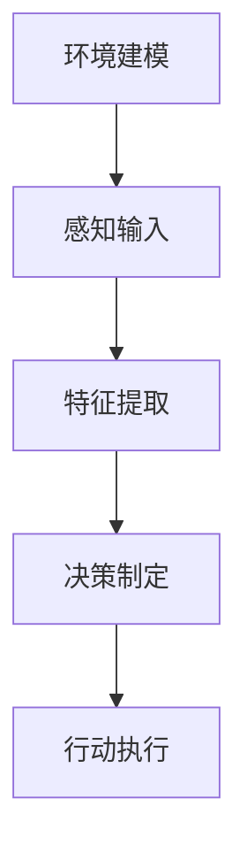

                 

### 引言

随着人工智能（AI）技术的快速发展，深度学习算法已成为实现智能化的核心技术之一。深度学习算法通过模拟人脑神经元连接方式，对大量数据进行学习，从而实现对复杂模式的自发识别和理解。在面向服务计算的环境下，智能深度学习代理作为一种新型的计算实体，正逐渐成为分布式计算、自动化管理和智能化服务的关键组成部分。

本文旨在深入探讨智能深度学习代理的面向服务计算下的工作流管理。首先，我们将回顾AI人工智能深度学习算法的基础知识，包括算法的概述、基本架构、原理与数学基础，以及其在不同领域的应用。接着，我们将介绍深度学习代理的概念、工作原理及其与传统代理的区别。在此基础上，我们将讨论面向服务计算的工作流管理，包括其定义、组成元素和类型，以及如何在服务计算中实现工作流管理。

随后，我们将重点探讨AI智能深度学习代理在服务计算中的实践，涵盖其应用场景、设计与实现、性能评估与优化，以及工作流管理实践。为了加深理解，本文将通过具体案例对深度学习代理和工作流管理的应用进行详细分析，并提出优化建议。

本文的最后一部分将总结深度学习工具与资源，为读者提供进一步学习和实践的方向。通过本文的深入探讨，我们希望读者能够对智能深度学习代理的面向服务计算下的工作流管理有一个全面而深入的理解。

### 关键词

- 深度学习算法
- 智能深度学习代理
- 面向服务计算
- 工作流管理
- 分布式计算
- 智能化服务

### 摘要

本文探讨了智能深度学习代理在面向服务计算下的工作流管理。首先，我们回顾了AI人工智能深度学习算法的基础知识，介绍了深度学习算法的概述、基本架构、原理与数学基础，以及其在计算机视觉、自然语言处理和推荐系统等领域的应用。接着，我们介绍了深度学习代理的概念、工作原理及其与传统代理的区别，并探讨了面向服务计算的工作流管理。

本文的重点在于深入探讨AI智能深度学习代理在服务计算中的应用实践，包括其应用场景、设计与实现、性能评估与优化，以及工作流管理实践。通过具体案例分析，本文展示了智能深度学习代理在工作流管理中的实际应用，并提出了一系列优化方法与实践。

本文的结论指出，智能深度学习代理在面向服务计算下的工作流管理具有广泛的应用前景，但同时也面临性能优化、可扩展性和安全性等挑战。未来研究应致力于解决这些问题，推动智能深度学习代理在更多领域中的应用与发展。

## 第一部分: AI人工智能深度学习算法基础

### 第1章: AI人工智能深度学习算法概述

#### 1.1 AI人工智能深度学习算法概述

##### 1.1.1 AI人工智能的定义与发展历程

人工智能（Artificial Intelligence，简称AI）是计算机科学的一个分支，旨在使计算机系统具备智能行为，从而模拟、延伸和扩展人类的智能。AI的研究可以追溯到20世纪50年代，当时的科学家们开始探索如何使计算机实现推理、学习和解决问题等智能行为。

AI的发展历程可以分为几个阶段：

1. **早期探索阶段（1950-1969）**：这个阶段以1956年达特茅斯会议的召开为标志，会议上，科学家们首次提出了人工智能的概念。在此期间，专家系统和符号逻辑成为主要研究方向。

2. **繁荣阶段（1970-1989）**：随着计算机性能的提升和算法的改进，AI领域取得了显著进展。特别是逻辑推理和知识表示方法的研究，使得AI开始应用于实际场景。

3. **低谷阶段（1990-2000）**：随着计算能力的限制和实际应用的挑战，AI领域进入了低谷期。这一时期，研究者们开始关注弱AI（即特定任务上的智能）。

4. **复兴阶段（2000至今）**：随着深度学习算法的突破和计算资源的丰富，AI领域迎来了新的复兴。深度学习通过模拟人脑的神经网络结构，使计算机在图像识别、语音识别、自然语言处理等领域取得了突破性进展。

##### 1.1.2 深度学习算法的核心概念

深度学习（Deep Learning）是一种基于多层神经网络的学习方法，它通过逐层提取数据特征，从而实现对复杂数据的建模和分析。深度学习的核心概念包括：

1. **神经网络（Neural Network）**：神经网络是深度学习的基础，它由大量相互连接的节点（称为神经元）组成，通过模拟人脑神经元的工作原理来实现数据的处理和预测。

2. **多层结构（Multi-Layer Structure）**：深度学习网络通常包含多层神经元，每一层都对输入数据进行特征提取和变换，从而实现数据的逐层抽象。

3. **反向传播（Backpropagation）**：反向传播是一种用于训练神经网络的学习算法，它通过计算输出误差，逆向传播误差信号，并调整网络的权重，从而优化网络性能。

4. **激活函数（Activation Function）**：激活函数是神经网络中的关键组成部分，它用于引入非线性特性，使神经网络能够学习复杂的数据模式。

##### 1.1.3 深度学习在人工智能中的地位

深度学习在人工智能中的地位日益重要，主要原因包括：

1. **强大的特征提取能力**：深度学习网络通过多层结构，能够自动学习数据中的复杂特征，从而提高模型的泛化能力和表现。

2. **广泛的应用场景**：深度学习在图像识别、语音识别、自然语言处理、推荐系统等领域取得了显著成果，成为许多实际应用的关键技术。

3. **计算资源的支持**：随着计算能力的不断提升，特别是GPU的广泛应用，深度学习算法得以快速训练和部署，推动了AI技术的快速发展。

综上所述，深度学习算法作为人工智能的核心技术之一，正在引领人工智能的新时代。理解深度学习算法的基本概念和原理，是深入研究人工智能的关键步骤。

#### 1.2 深度学习算法的基本架构

##### 1.2.1 神经网络架构详解

神经网络（Neural Network，简称NN）是深度学习算法的基础，其结构由大量的节点（神经元）和连接（边）组成。每个神经元都接收来自其他神经元的输入信号，并通过激活函数进行处理，最终输出一个值。

1. **神经元结构**：一个基本的神经元由三个部分组成：
   - **输入层**：接收外部输入数据。
   - **隐藏层**：对输入数据进行处理和特征提取。
   - **输出层**：输出预测结果或分类标签。

2. **神经元间连接**：神经元通过加权连接，形成网络结构。每个连接都有一个权重（weight），表示两个神经元之间的强度。输入信号通过连接权重传递到下一个神经元。

3. **激活函数**：激活函数用于引入非线性特性，使神经网络能够学习复杂的数据模式。常见的激活函数包括Sigmoid、ReLU、Tanh等。

##### 1.2.2 神经元与激活函数

1. **神经元工作原理**：
   - **输入计算**：每个神经元的输入是其连接权重与输入信号的乘积之和。
   - **激活函数**：输入通过激活函数进行处理，以引入非线性特性。例如，Sigmoid函数将输入映射到(0, 1)区间，ReLU函数在输入大于0时输出输入值，小于等于0时输出0。

2. **激活函数类型**：
   - **Sigmoid函数**：\( f(x) = \frac{1}{1 + e^{-x}} \)，输出值在(0, 1)区间，适合二分类问题。
   - **ReLU函数**：\( f(x) = \max(0, x) \)，输出值大于等于0，常用于隐藏层神经元，有助于加速训练。
   - **Tanh函数**：\( f(x) = \frac{e^x - e^{-x}}{e^x + e^{-x}} \)，输出值在(-1, 1)区间，可以平衡输出值的分布。

##### 1.2.3 学习算法与优化器

深度学习算法的学习过程是通过调整网络权重来实现的。学习算法主要分为两类：前向传播和反向传播。

1. **前向传播**：输入数据从输入层开始，经过每一层神经元的计算和激活函数处理，最终到达输出层得到预测结果。

2. **反向传播**：在得到预测结果后，计算实际输出与预测输出之间的误差，并通过反向传播算法将误差逆向传递到每一层神经元，从而调整权重。

优化器是用于调整权重的算法，常见的优化器包括：

- **随机梯度下降（SGD）**：每次迭代只更新一个样本的权重，计算简单但容易陷入局部最优。
- **批量梯度下降（BGD）**：每次迭代更新所有样本的权重，但计算复杂度高。
- **Adam优化器**：结合了SGD和动量方法，具有自适应学习率调整能力，是常用的优化器之一。

通过学习算法和优化器，深度学习网络能够不断调整权重，逐步优化模型性能，最终实现对数据的准确预测和分类。

#### 1.3 主流深度学习算法介绍

##### 1.3.1 卷积神经网络（CNN）

卷积神经网络（Convolutional Neural Network，简称CNN）是专门用于处理图像数据的深度学习算法。CNN通过卷积层、池化层和全连接层等结构，实现对图像特征的提取和分类。

1. **卷积层**：卷积层通过卷积操作提取图像的特征，卷积核在图像上滑动，计算局部特征的加权和，通过激活函数处理后输出特征图。

2. **池化层**：池化层用于降低特征图的维度，提高模型的泛化能力。常见的池化方法包括最大池化和平均池化。

3. **全连接层**：全连接层将特征图的每个值与输出层的每个神经元相连，实现最终的分类或回归。

CNN在图像分类、目标检测和图像分割等领域取得了显著成果。

##### 1.3.2 循环神经网络（RNN）

循环神经网络（Recurrent Neural Network，简称RNN）是一种处理序列数据的深度学习算法。RNN通过循环结构，使神经元能够在序列的不同时间点共享信息，从而捕捉序列中的长期依赖关系。

1. **基本结构**：RNN的基本结构包括输入门、遗忘门和输出门，用于控制信息的输入、遗忘和输出。

2. **长短期记忆网络（LSTM）**：LSTM是RNN的一种变体，通过引入记忆单元和门控机制，解决了RNN在处理长序列数据时容易出现的梯度消失和梯度爆炸问题。

LSTM在语音识别、机器翻译和时间序列预测等领域具有广泛的应用。

##### 1.3.3 长短期记忆网络（LSTM）

长短期记忆网络（Long Short-Term Memory，简称LSTM）是RNN的一种变体，通过引入门控单元，解决了传统RNN在处理长序列数据时容易出现的梯度消失和梯度爆炸问题。

1. **基本结构**：LSTM包括输入门、遗忘门和输出门，用于控制信息的输入、遗忘和输出。每个门由三个神经元组成，分别用于计算输入、遗忘和输出的权重。

2. **工作原理**：
   - **输入门**：决定当前输入信息中有多少应该被记住。
   - **遗忘门**：决定之前记忆中有多少应该被遗忘。
   - **输出门**：决定当前输出信息中有多少应该被输出。

3. **应用场景**：LSTM在语音识别、机器翻译和时间序列预测等领域具有广泛的应用。

##### 1.3.4 生成对抗网络（GAN）

生成对抗网络（Generative Adversarial Network，简称GAN）由生成器和判别器组成，通过两个对抗性网络的博弈，实现数据的生成和判别。

1. **基本结构**：
   - **生成器**：生成器试图生成与真实数据相似的数据。
   - **判别器**：判别器试图区分生成数据和真实数据。

2. **工作原理**：生成器和判别器相互对抗，生成器不断优化生成数据，使判别器无法区分真实数据和生成数据，从而实现数据的生成。

3. **应用场景**：GAN在图像生成、语音合成和数据增强等领域具有广泛的应用。

通过以上介绍，我们了解到深度学习算法的基本架构和主流算法，这些算法在不同领域有着广泛的应用，为人工智能的发展提供了强大的技术支撑。

### 第2章: 深度学习算法原理与数学基础

#### 2.1 深度学习算法原理

##### 2.1.1 神经网络基础

神经网络（Neural Network，简称NN）是深度学习算法的基础，其结构由大量的神经元和连接组成，通过模拟人脑神经元的工作原理来实现数据的处理和预测。一个基本的神经网络通常包括输入层、隐藏层和输出层。

1. **输入层**：输入层接收外部输入数据，每个输入值通过连接权重传递到下一层。
2. **隐藏层**：隐藏层对输入数据进行特征提取和变换，每个隐藏层都对输入数据进行一次非线性变换，从而提取更高层次的特征。
3. **输出层**：输出层生成最终预测结果或分类标签。

神经网络的工作原理如下：

- **输入计算**：每个神经元的输入是前一层所有神经元输出与其连接权重的乘积之和，再加上一个偏置项。
- **激活函数**：输入通过激活函数进行处理，以引入非线性特性，常见的激活函数有Sigmoid、ReLU和Tanh等。

##### 2.1.2 前向传播与反向传播

深度学习算法的训练过程是通过前向传播和反向传播两个步骤来实现的。

1. **前向传播**：输入数据从输入层开始，经过每一层神经元的计算和激活函数处理，最终到达输出层得到预测结果。前向传播的目的是计算输出结果和实际结果之间的误差。

2. **反向传播**：在得到预测结果后，通过反向传播算法将误差逆向传递到每一层神经元，从而调整网络的权重。反向传播的过程可以分为以下几个步骤：

   - **误差计算**：计算输出结果与实际结果之间的误差，误差可以通过损失函数（如均方误差、交叉熵等）来计算。
   - **梯度计算**：计算每个权重和偏置的梯度，梯度表示权重和偏置的变化率，用于更新权重和偏置。
   - **权重更新**：通过梯度下降算法或其他优化算法，更新网络的权重和偏置，以减少误差。

通过反复迭代前向传播和反向传播，神经网络能够不断优化模型性能，从而实现数据的准确预测和分类。

##### 2.1.3 损失函数与优化目标

损失函数是评估模型预测结果与实际结果之间差异的度量，是深度学习算法优化目标的关键部分。常见的损失函数包括：

1. **均方误差（MSE）**：用于回归问题，计算预测值与实际值之间差的平方的平均值。
   \[ \text{MSE} = \frac{1}{n}\sum_{i=1}^{n} (y_i - \hat{y}_i)^2 \]
   其中，\( y_i \)表示实际值，\( \hat{y}_i \)表示预测值，\( n \)表示样本数量。

2. **交叉熵（Cross Entropy）**：用于分类问题，计算预测概率分布与真实分布之间的差异。
   \[ \text{CE} = -\sum_{i=1}^{n} y_i \log(\hat{y}_i) \]
   其中，\( y_i \)表示实际标签，\( \hat{y}_i \)表示预测概率。

优化目标是使损失函数的值最小化，常用的优化算法包括：

1. **随机梯度下降（SGD）**：每次迭代只更新一个样本的权重，计算简单但容易陷入局部最优。
2. **批量梯度下降（BGD）**：每次迭代更新所有样本的权重，但计算复杂度高。
3. **Adam优化器**：结合了SGD和动量方法，具有自适应学习率调整能力，是常用的优化器之一。

通过选择合适的损失函数和优化算法，可以有效地训练深度学习模型，实现数据的准确预测和分类。

##### 2.2 深度学习算法数学基础

深度学习算法的数学基础主要包括微积分基础、线性代数基础和概率论与统计学基础。这些基础知识对于理解和实现深度学习算法至关重要。

###### 2.2.1 微积分基础

微积分是研究变化和运动的数学分支，主要包括极限、导数、积分和微分方程等概念。

1. **极限**：极限是数学中描述函数在某一点附近的行为，用于计算函数的极限值。
   \[ \lim_{x \to a} f(x) = L \]
   其中，\( f(x) \)表示函数，\( a \)表示自变量趋近的值，\( L \)表示极限值。

2. **导数**：导数是描述函数在某一点的变化率，用于计算函数的最优值和拐点。
   \[ f'(x) = \lim_{h \to 0} \frac{f(x+h) - f(x)}{h} \]
   其中，\( f'(x) \)表示导数，\( h \)表示自变量变化量。

3. **积分**：积分是计算函数在某区间内的累积量和曲边图形的面积，用于求解优化问题。
   \[ \int_{a}^{b} f(x) dx \]
   其中，\( a \)和\( b \)表示积分区间的端点，\( f(x) \)表示被积函数。

4. **微分方程**：微分方程是描述函数及其导数之间关系的方程，用于求解动态系统中的变化规律。

###### 2.2.2 线性代数基础

线性代数是研究向量空间、线性映射和矩阵计算的数学分支，主要包括向量、矩阵、行列式和特征值等概念。

1. **向量**：向量是具有大小和方向的量，可以表示物理空间中的点、力、速度等。
   \[ \vec{v} = (v_1, v_2, ..., v_n) \]
   其中，\( \vec{v} \)表示向量，\( v_1, v_2, ..., v_n \)表示向量分量。

2. **矩阵**：矩阵是按一定规则排列的数表，可以表示线性变换、系统方程和数据的集合。
   \[ A = \begin{bmatrix} a_{11} & a_{12} & ... & a_{1n} \\ a_{21} & a_{22} & ... & a_{2n} \\ ... & ... & ... & ... \\ a_{m1} & a_{m2} & ... & a_{mn} \end{bmatrix} \]
   其中，\( A \)表示矩阵，\( a_{ij} \)表示矩阵元素。

3. **行列式**：行列式是矩阵的一种运算，用于描述矩阵的性质和解线性方程组。
   \[ \det(A) = a_{11}C_{11} - a_{12}C_{21} + ... + (-1)^{n+1}a_{1n}C_{n1} \]
   其中，\( \det(A) \)表示行列式，\( C_{ij} \)表示伴随矩阵元素。

4. **特征值与特征向量**：特征值是线性变换中保持方向的值，特征向量是线性变换中保持方向的向量。
   \[ A\vec{v} = \lambda \vec{v} \]
   其中，\( A \)表示矩阵，\( \vec{v} \)表示特征向量，\( \lambda \)表示特征值。

###### 2.2.3 概率论与统计学基础

概率论与统计学是研究随机事件和数据的数学分支，主要包括概率分布、统计估计和假设检验等概念。

1. **概率分布**：概率分布描述了随机变量的取值及其概率分布情况。
   - **离散分布**：例如伯努利分布、二项分布、泊松分布等。
   - **连续分布**：例如正态分布、均匀分布、指数分布等。

2. **统计估计**：统计估计是利用样本数据对总体参数进行估计的方法。
   - **点估计**：例如最大似然估计、最小二乘估计等。
   - **区间估计**：例如置信区间、假设检验等。

3. **假设检验**：假设检验是利用样本数据对总体参数的假设进行验证的方法。
   - **显著性检验**：例如t检验、卡方检验等。
   - **假设选择**：例如似然比检验、协方差分析等。

通过掌握这些数学基础，我们可以更深入地理解深度学习算法的原理，从而更有效地设计和实现深度学习模型。

#### 2.3 深度学习算法伪代码

为了更好地理解深度学习算法的实现过程，我们以下将给出神经网络前向传播和反向传播的伪代码。

##### 2.3.1 神经网络前向传播伪代码

```python
# 定义神经网络结构
input_layer_size = 784
hidden_layer_size = 500
output_layer_size = 10

# 初始化权重和偏置
weights = {
    'w1': np.random.randn(input_layer_size, hidden_layer_size),
    'b1': np.random.randn(hidden_layer_size),
    'w2': np.random.randn(hidden_layer_size, output_layer_size),
    'b2': np.random.randn(output_layer_size)
}

# 定义激活函数
sigmoid = lambda x: 1 / (1 + np.exp(-x))

# 前向传播
def forward_propagation(x):
    # 输入层到隐藏层
    z1 = np.dot(x, weights['w1']) + weights['b1']
    a1 = sigmoid(z1)
    
    # 隐藏层到输出层
    z2 = np.dot(a1, weights['w2']) + weights['b2']
    a2 = sigmoid(z2)
    
    return a2

# 训练数据
x_train = np.array([[...]])  # 784维输入
y_train = np.array([...])    # 10维输出

# 前向传播计算输出
outputs = forward_propagation(x_train)
```

##### 2.3.2 神经网络反向传播伪代码

```python
# 定义损失函数
def cross_entropy_loss(y, y_hat):
    return -np.sum(y * np.log(y_hat))

# 反向传播
def backward_propagation(x, y, y_hat):
    # 计算误差
    error = y - y_hat
    
    # 输出层误差
    d_output = error * (y_hat * (1 - y_hat))
    
    # 隐藏层误差
    d_hidden = np.dot(d_output, weights['w2'].T) * (a1 * (1 - a1))
    
    # 更新权重和偏置
    weights['w2'] -= learning_rate * np.dot(a1.T, d_output)
    weights['b2'] -= learning_rate * np.sum(d_output)
    
    weights['w1'] -= learning_rate * np.dot(x.T, d_hidden)
    weights['b1'] -= learning_rate * np.sum(d_hidden)

# 反向传播计算误差
error = cross_entropy_loss(y, outputs)
backward_propagation(x_train, y_train, outputs)
```

通过上述伪代码，我们可以看到神经网络前向传播和反向传播的基本流程。在实际应用中，需要使用更高效和优化的代码实现，例如使用深度学习框架（如TensorFlow或PyTorch）来构建和训练神经网络。

### 第3章: 深度学习算法应用

#### 3.1 深度学习在计算机视觉中的应用

计算机视觉是人工智能的一个重要分支，深度学习算法在计算机视觉领域取得了显著的成果。以下将介绍深度学习在计算机视觉中的一些典型应用。

##### 3.1.1 图像分类

图像分类是计算机视觉中最基本和最广泛应用的场景之一。通过深度学习算法，我们可以将图像数据自动划分为预定义的类别。以下是一个简单的图像分类流程：

1. **数据预处理**：对图像进行缩放、裁剪、归一化等预处理操作，以使其适合输入到深度学习模型中。
2. **模型训练**：使用预训练的卷积神经网络（如VGG、ResNet等）进行图像分类任务。训练过程中，通过反向传播算法调整模型权重，以最小化损失函数。
3. **模型评估**：使用测试集对训练好的模型进行评估，计算分类准确率、召回率、F1分数等指标，以评估模型性能。
4. **模型部署**：将训练好的模型部署到实际应用场景中，例如人脸识别、图像识别等。

以下是一个简单的图像分类伪代码示例：

```python
# 定义模型
model = build_model()

# 训练模型
model.fit(x_train, y_train, epochs=10, batch_size=64)

# 评估模型
accuracy = model.evaluate(x_test, y_test)

# 预测新数据
predictions = model.predict(new_data)
```

##### 3.1.2 目标检测

目标检测是在图像中识别和定位多个目标物体的技术。深度学习算法在目标检测领域取得了显著的进展，以下是一个简单的目标检测流程：

1. **数据预处理**：对图像进行缩放、裁剪、归一化等预处理操作，以使其适合输入到深度学习模型中。
2. **模型训练**：使用预训练的卷积神经网络（如YOLO、Faster R-CNN等）进行目标检测任务。训练过程中，通过反向传播算法调整模型权重，以最小化损失函数。
3. **模型评估**：使用测试集对训练好的模型进行评估，计算检测准确率、召回率、F1分数等指标，以评估模型性能。
4. **模型部署**：将训练好的模型部署到实际应用场景中，例如自动驾驶、视频监控等。

以下是一个简单的目标检测伪代码示例：

```python
# 定义模型
model = build_model()

# 训练模型
model.fit(x_train, y_train, epochs=10, batch_size=64)

# 评估模型
accuracy = model.evaluate(x_test, y_test)

# 预测新数据
detections = model.detect(new_data)
```

##### 3.1.3 图像分割

图像分割是将图像划分为多个语义区域的技术。深度学习算法在图像分割领域也取得了显著的成果，以下是一个简单的图像分割流程：

1. **数据预处理**：对图像进行缩放、裁剪、归一化等预处理操作，以使其适合输入到深度学习模型中。
2. **模型训练**：使用预训练的卷积神经网络（如U-Net、SegNet等）进行图像分割任务。训练过程中，通过反向传播算法调整模型权重，以最小化损失函数。
3. **模型评估**：使用测试集对训练好的模型进行评估，计算分割准确率、召回率、F1分数等指标，以评估模型性能。
4. **模型部署**：将训练好的模型部署到实际应用场景中，例如医学影像分析、自动驾驶等。

以下是一个简单的图像分割伪代码示例：

```python
# 定义模型
model = build_model()

# 训练模型
model.fit(x_train, y_train, epochs=10, batch_size=64)

# 评估模型
accuracy = model.evaluate(x_test, y_test)

# 预测新数据
segmentation = model.segment(new_data)
```

通过以上介绍，我们可以看到深度学习在计算机视觉中的应用非常广泛，从图像分类、目标检测到图像分割，深度学习算法在各个领域都取得了显著的成果。未来，随着深度学习算法的进一步发展，计算机视觉应用将更加丰富和多样化。

#### 3.2 深度学习在自然语言处理中的应用

自然语言处理（Natural Language Processing，简称NLP）是人工智能领域的一个重要分支，它旨在使计算机能够理解和处理人类语言。深度学习算法在NLP中的应用，使得许多复杂的语言任务得以实现。以下将介绍深度学习在NLP中的几个典型应用。

##### 3.2.1 文本分类

文本分类是将文本数据按照预定的类别进行分类的过程。深度学习算法在文本分类任务中表现出色，以下是一个简单的文本分类流程：

1. **数据预处理**：对文本数据进行清洗和预处理，包括去除停用词、标点符号、词干提取等。同时，将文本数据转换为向量表示，常用的方法有词袋模型、TF-IDF和Word2Vec等。
2. **模型训练**：使用预训练的深度学习模型（如CNN、RNN、Transformer等）进行文本分类任务。在训练过程中，通过反向传播算法调整模型权重，以最小化损失函数。
3. **模型评估**：使用测试集对训练好的模型进行评估，计算分类准确率、召回率、F1分数等指标，以评估模型性能。
4. **模型部署**：将训练好的模型部署到实际应用场景中，例如情感分析、新闻分类等。

以下是一个简单的文本分类伪代码示例：

```python
# 定义模型
model = build_model()

# 训练模型
model.fit(x_train, y_train, epochs=10, batch_size=64)

# 评估模型
accuracy = model.evaluate(x_test, y_test)

# 预测新数据
predictions = model.predict(new_data)
```

##### 3.2.2 命名实体识别

命名实体识别（Named Entity Recognition，简称NER）是从文本中识别出具有特定意义的实体，如人名、地名、组织名等。以下是一个简单的命名实体识别流程：

1. **数据预处理**：与文本分类类似，对文本数据进行清洗和预处理，并将文本数据转换为向量表示。
2. **模型训练**：使用预训练的深度学习模型（如CRF、BiLSTM等）进行命名实体识别任务。在训练过程中，通过反向传播算法调整模型权重，以最小化损失函数。
3. **模型评估**：使用测试集对训练好的模型进行评估，计算识别准确率、召回率、F1分数等指标，以评估模型性能。
4. **模型部署**：将训练好的模型部署到实际应用场景中，例如信息提取、实体链接等。

以下是一个简单的命名实体识别伪代码示例：

```python
# 定义模型
model = build_model()

# 训练模型
model.fit(x_train, y_train, epochs=10, batch_size=64)

# 评估模型
accuracy = model.evaluate(x_test, y_test)

# 预测新数据
entities = model.predict(new_data)
```

##### 3.2.3 机器翻译

机器翻译是将一种语言的文本自动翻译成另一种语言的过程。深度学习算法在机器翻译中取得了显著的成果，以下是一个简单的机器翻译流程：

1. **数据预处理**：对源语言和目标语言文本进行清洗和预处理，将文本数据转换为向量表示。通常使用序列到序列模型（如Encoder-Decoder结构）进行翻译。
2. **模型训练**：使用预训练的深度学习模型（如Seq2Seq、Transformer等）进行机器翻译任务。在训练过程中，通过反向传播算法调整模型权重，以最小化损失函数。
3. **模型评估**：使用测试集对训练好的模型进行评估，计算翻译准确率、BLEU分数等指标，以评估模型性能。
4. **模型部署**：将训练好的模型部署到实际应用场景中，例如在线翻译、自动字幕等。

以下是一个简单的机器翻译伪代码示例：

```python
# 定义模型
model = build_model()

# 训练模型
model.fit(x_train, y_train, epochs=10, batch_size=64)

# 评估模型
accuracy = model.evaluate(x_test, y_test)

# 预测新数据
translations = model.predict(new_source_text)
```

通过以上介绍，我们可以看到深度学习在自然语言处理中的应用非常广泛，从文本分类、命名实体识别到机器翻译，深度学习算法在各个领域都取得了显著的成果。未来，随着深度学习算法的进一步发展，NLP应用将更加丰富和多样化。

#### 3.3 深度学习在推荐系统中的应用

推荐系统是人工智能领域的一个重要应用，它通过分析用户的历史行为和兴趣，为用户推荐相关的商品、服务和内容。深度学习算法在推荐系统中发挥着关键作用，以下将介绍深度学习在推荐系统中的几个典型应用。

##### 3.3.1 用户行为分析

用户行为分析是推荐系统的基础，通过分析用户在平台上的行为，如浏览、点击、购买等，可以挖掘用户的兴趣和偏好。以下是一个简单的用户行为分析流程：

1. **数据收集**：收集用户在平台上的行为数据，包括浏览记录、点击记录、购买记录等。
2. **数据预处理**：对行为数据进行清洗和预处理，去除无效数据，对数据进行编码和归一化。
3. **特征提取**：从原始行为数据中提取特征，如用户活跃度、访问频率、购买率等。
4. **模型训练**：使用深度学习模型（如RNN、CNN等）对提取的特征进行训练，以学习用户行为模式。
5. **模型评估**：使用测试集对训练好的模型进行评估，计算推荐准确率、召回率、覆盖率等指标。
6. **模型部署**：将训练好的模型部署到实际应用场景中，为用户推荐相关商品或内容。

以下是一个简单的用户行为分析伪代码示例：

```python
# 定义模型
model = build_model()

# 训练模型
model.fit(x_train, y_train, epochs=10, batch_size=64)

# 评估模型
accuracy = model.evaluate(x_test, y_test)

# 预测新数据
user行为 = model.predict(new_user_data)
```

##### 3.3.2 内容相似性计算

内容相似性计算是推荐系统中的另一个重要任务，通过计算商品、服务和内容之间的相似性，可以为用户推荐相似度高的商品或内容。以下是一个简单的内容相似性计算流程：

1. **数据收集**：收集待比较的商品、服务和内容的特征数据。
2. **数据预处理**：对特征数据进行清洗和预处理，去除无效数据，对数据进行编码和归一化。
3. **特征提取**：从原始特征数据中提取关键特征，如文本、图像、声音等。
4. **模型训练**：使用深度学习模型（如Siamese网络、对比学习等）对提取的特征进行训练，以学习内容之间的相似性度量。
5. **模型评估**：使用测试集对训练好的模型进行评估，计算相似性度量准确率、召回率等指标。
6. **模型部署**：将训练好的模型部署到实际应用场景中，为用户推荐相似度高的商品或内容。

以下是一个简单的内容相似性计算伪代码示例：

```python
# 定义模型
model = build_model()

# 训练模型
model.fit(x_train, y_train, epochs=10, batch_size=64)

# 评估模型
accuracy = model.evaluate(x_test, y_test)

# 预测新数据
similarity = model.predict(new_content_data)
```

##### 3.3.3 推荐算法实现与优化

推荐算法的实现和优化是推荐系统中的关键任务，以下将介绍推荐算法的实现和优化方法：

1. **算法选择**：根据应用场景和数据特点，选择合适的推荐算法，如基于协同过滤、基于内容的推荐等。
2. **模型训练**：使用训练数据进行模型训练，通过优化算法调整模型参数，以最小化损失函数。
3. **模型评估**：使用测试数据进行模型评估，计算推荐准确率、召回率等指标，以评估模型性能。
4. **在线更新**：在推荐过程中，根据用户实时行为数据，对推荐模型进行在线更新，以适应用户的变化。
5. **A/B测试**：将优化后的推荐算法与原算法进行A/B测试，以验证优化效果。

通过以上介绍，我们可以看到深度学习在推荐系统中的应用非常广泛，从用户行为分析、内容相似性计算到推荐算法实现与优化，深度学习算法在各个环节都发挥着重要作用。未来，随着深度学习算法的进一步发展，推荐系统将更加精准和高效。

### 第二部分: 深度学习代理与面向服务计算下的工作流管理

#### 第4章: 深度学习代理概述

##### 4.1 深度学习代理的概念

深度学习代理（Deep Learning Agent）是一种基于深度学习技术的计算实体，它通过模拟人类智能行为，在复杂的动态环境中实现自主决策和行动。深度学习代理的核心功能包括：

1. **环境感知**：深度学习代理能够从环境中获取信息，如传感器数据、图像、文本等，并对其进行处理和分析。
2. **决策制定**：基于对环境的感知，深度学习代理能够通过学习算法生成最优行动策略，以实现特定目标。
3. **行动执行**：深度学习代理将决策结果转化为具体的行动，如控制机械臂、发送指令等。

与传统代理相比，深度学习代理具有以下特点：

1. **自学习能力**：深度学习代理能够通过大量的数据训练，不断提高其决策和行动的准确性，无需人工干预。
2. **泛化能力**：深度学习代理能够应对复杂多变的环境，具有较强的泛化能力，能够适应不同的应用场景。
3. **实时性**：深度学习代理能够在短时间内完成环境感知、决策制定和行动执行，具有较好的实时性。

##### 4.2 深度学习代理的工作原理

深度学习代理的工作原理主要包括以下几个关键步骤：

1. **环境建模**：深度学习代理首先需要了解所处的环境，包括环境的特征、状态空间和行动空间。环境建模可以通过观察环境、获取历史数据或使用预定义的模型来实现。
2. **感知输入**：深度学习代理通过传感器或其他输入设备，获取当前环境的感知输入。感知输入可以包括图像、声音、文本等多种数据类型。
3. **特征提取**：深度学习代理对感知输入进行预处理和特征提取，以将其转换为模型可处理的格式。特征提取可以通过卷积神经网络、循环神经网络等深度学习模型来实现。
4. **决策制定**：深度学习代理利用训练好的深度学习模型，对输入特征进行处理，生成最优的行动策略。决策制定可以通过强化学习、监督学习等算法来实现。
5. **行动执行**：深度学习代理根据生成的行动策略，执行具体的行动。行动执行可以通过控制执行器、发送指令等来实现。

以下是一个简化的深度学习代理工作原理流程图：



##### 4.2.2 深度学习代理的训练与评估

深度学习代理的训练与评估是确保其性能和可靠性的关键步骤。以下是训练与评估的基本流程：

1. **数据收集**：收集用于训练和评估的样本数据。数据可以包括环境状态、行动策略、奖励信号等。
2. **数据预处理**：对收集的数据进行清洗、归一化和特征提取，以使其适合输入到深度学习模型中。
3. **模型训练**：使用训练数据，通过深度学习算法（如卷积神经网络、循环神经网络等）训练模型。训练过程中，通过反向传播算法调整模型参数，以最小化损失函数。
4. **模型评估**：使用测试数据对训练好的模型进行评估。评估指标可以包括准确率、召回率、F1分数等，具体评估指标取决于应用场景。
5. **性能优化**：根据评估结果，对模型进行调优和优化，以提高其性能和可靠性。

以下是一个简化的深度学习代理训练与评估伪代码示例：

```python
# 导入必要的库
import numpy as np
from sklearn.model_selection import train_test_split
from sklearn.metrics import accuracy_score

# 准备数据
X, y = load_data()

# 数据预处理
X = preprocess_data(X)
y = preprocess_labels(y)

# 划分训练集和测试集
X_train, X_test, y_train, y_test = train_test_split(X, y, test_size=0.2)

# 定义模型
model = build_model()

# 训练模型
model.fit(X_train, y_train, epochs=10, batch_size=64)

# 评估模型
predictions = model.predict(X_test)
accuracy = accuracy_score(y_test, predictions)

print("Accuracy:", accuracy)
```

通过以上步骤，我们可以确保深度学习代理在复杂环境中具备良好的性能和可靠性。

##### 4.2.3 深度学习代理的推理与部署

深度学习代理的推理与部署是将其应用于实际场景的关键步骤。以下是推理与部署的基本流程：

1. **推理**：在部署后的深度学习代理中，输入新的环境状态，通过训练好的模型进行推理，生成最优的行动策略。
2. **部署**：将推理结果转换为具体的行动，通过执行器或接口与外部环境进行交互。
3. **实时更新**：在推理过程中，深度学习代理可以不断接收新的环境状态，并实时更新模型参数，以适应环境变化。

以下是一个简化的深度学习代理推理与部署伪代码示例：

```python
# 导入必要的库
import numpy as np

# 加载训练好的模型
model = load_model()

# 定义新的环境状态
new_state = get_new_state()

# 进行推理
action = model.predict(new_state)

# 执行行动
perform_action(action)
```

通过以上步骤，深度学习代理可以实时应对复杂环境的变化，实现自主决策和行动。

总之，深度学习代理是一种强大的计算实体，通过自学习、感知输入、决策制定和行动执行，能够实现复杂环境的自主交互。通过对其训练与评估、推理与部署，我们可以充分发挥深度学习代理的潜力，推动人工智能技术的发展。

#### 第5章: 面向服务计算下的工作流管理

##### 5.1 面向服务计算概述

面向服务计算（Service-Oriented Computing，简称SOC）是一种基于服务和服务组件的分布式计算模型，其核心思想是将计算任务分解为一系列独立的、可复用的服务，并通过服务之间的协作实现复杂应用的功能。面向服务计算具有以下特点：

1. **模块化**：面向服务计算将应用功能划分为多个独立的模块，每个模块都是一个服务，服务之间通过标准化的接口进行通信和协作。
2. **可复用性**：服务是可复用的软件组件，可以在不同的应用场景中重复使用，提高了开发和维护的效率。
3. **灵活性**：面向服务计算支持动态服务发现和适配，能够灵活应对业务需求的变化。
4. **分布式**：面向服务计算可以在分布式环境中运行，支持跨平台、跨组织的协同工作。

##### 5.1.1 服务计算的核心组件

面向服务计算的核心组件包括服务提供者（Service Provider）、服务请求者（Service Requester）和服务注册中心（Service Registry）。

1. **服务提供者**：服务提供者是能够提供特定服务的实体，它实现具体的服务功能，并对外暴露服务接口。
2. **服务请求者**：服务请求者是调用服务的实体，它根据需求向服务提供者发送请求，并接收服务结果。
3. **服务注册中心**：服务注册中心是一个分布式目录服务，用于管理和维护服务的信息，包括服务的名称、接口、地址等。服务提供者在启动时将服务信息注册到服务注册中心，服务请求者在需要时可以从服务注册中心查询和获取服务信息。

##### 5.1.2 服务计算的优势与应用场景

面向服务计算具有以下优势：

1. **可扩展性**：服务是独立的模块，可以单独部署和扩展，支持系统规模的扩展。
2. **高可用性**：服务可以分布式部署，提高系统的容错能力和可靠性。
3. **灵活性**：服务可以根据需求动态组合和部署，支持快速响应业务变化。
4. **互操作性**：服务通过标准化的接口进行通信，支持不同系统之间的互操作。

面向服务计算的应用场景广泛，包括企业应用集成、电子商务、物联网、云计算等。以下是一些典型的应用场景：

1. **企业应用集成**：面向服务计算可以整合企业内部的不同系统，实现业务流程的自动化和优化。
2. **电子商务**：面向服务计算可以提供个性化的推荐服务，提高用户体验和销售额。
3. **物联网**：面向服务计算可以实现对物联网设备的监控和管理，提高系统的智能性和可靠性。
4. **云计算**：面向服务计算可以提供灵活的计算资源管理和服务部署，提高云计算平台的效率。

##### 5.2 工作流管理概述

工作流管理（Workflow Management）是一种管理和自动化业务流程的方法，它通过定义和执行一系列任务来实现业务目标。工作流管理的主要目标是提高业务流程的效率、一致性和可追溯性。以下将介绍工作流管理的定义、组成元素和类型。

##### 5.2.1 工作流的定义

工作流（Workflow）是指一组任务和活动，它们按照一定的顺序和规则执行，以实现特定的业务目标。工作流可以看作是一个业务过程的抽象模型，它描述了业务过程中的每个步骤、参与者和任务之间的关系。

##### 5.2.2 工作流的组成元素

工作流由以下主要组成元素构成：

1. **任务（Task）**：任务是指工作流中的基本操作，它可以是单个步骤，也可以是一个子流程。
2. **参与者（Participant）**：参与者是指执行任务的实体，可以是人、系统或组织。
3. **条件（Condition）**：条件是指控制任务执行逻辑的条件表达式，它用于指定任务执行的前提条件。
4. **流程（Flow）**：流程是指任务和参与者之间的连接关系，它定义了任务执行的顺序和规则。
5. **数据（Data）**：数据是指工作流中的信息，它可以是输入数据、中间数据或输出数据。

##### 5.2.3 工作流的类型与特点

工作流可以分为以下几种类型：

1. **顺序工作流**：顺序工作流是最简单的工作流类型，任务按照顺序依次执行，没有分支和循环。
2. **分支工作流**：分支工作流包含多个分支，根据条件表达式选择执行路径，实现业务逻辑的多样性。
3. **循环工作流**：循环工作流包含循环结构，任务可以重复执行，以实现批量处理和自动化。
4. **并行工作流**：并行工作流包含多个并行执行的任务，任务之间没有依赖关系，可以提高执行效率。
5. **混合工作流**：混合工作流结合了多种工作流类型，根据业务需求实现复杂业务逻辑。

#### 5.3 面向服务计算下的工作流管理

##### 5.3.1 服务工作流的管理模型

面向服务计算下的工作流管理模型通过将工作流与服务相结合，实现业务流程的自动化和优化。以下是服务工作流管理模型的基本组成部分：

1. **服务工作流定义**：服务工作流定义描述了工作流的各个任务、参与者、条件和流程。它可以通过工作流定义语言（如BPEL、WS-BPEL等）进行定义和描述。
2. **服务工作流执行引擎**：服务工作流执行引擎是负责执行服务工作流的组件，它根据服务工作流定义和当前环境状态，自动调度和执行任务。
3. **服务注册中心**：服务注册中心是管理服务信息的组件，它存储了服务提供者和服务请求者的信息，并提供服务查询和注册功能。
4. **服务接口**：服务接口是服务提供者和服务请求者之间的通信接口，它定义了服务暴露的功能和操作。

##### 5.3.2 服务工作流的设计与实现

服务工作流的设计与实现包括以下步骤：

1. **需求分析**：分析业务需求，确定工作流的目标和功能需求。
2. **工作流定义**：根据需求分析结果，使用工作流定义语言定义服务工作流。
3. **服务选择与组合**：根据工作流定义，选择和组合合适的现有服务，实现工作流的业务逻辑。
4. **服务部署**：将定义好的服务工作流部署到执行引擎中，进行测试和验证。
5. **性能优化**：根据执行结果，对服务工作流进行性能优化，提高执行效率和响应速度。

##### 5.3.3 服务工作流的优化与性能评估

服务工作流优化是提高系统性能和响应速度的关键步骤。以下是服务工作流优化和性能评估的方法：

1. **性能分析**：对服务工作流的执行过程进行性能分析，识别性能瓶颈和瓶颈原因。
2. **负载均衡**：通过负载均衡技术，将工作流任务分配到不同的执行节点，避免单点过载。
3. **服务优化**：对服务进行优化，包括优化服务接口、提高服务性能和减少响应时间。
4. **缓存技术**：使用缓存技术，减少对频繁访问的数据的访问次数，提高系统性能。
5. **性能评估**：使用性能评估工具，对服务工作流的执行性能进行评估，包括响应时间、吞吐量、错误率等指标。

通过以上步骤，可以确保服务工作流的高效、可靠和稳定执行，满足业务需求。

总之，面向服务计算下的工作流管理是一种高效、灵活和可扩展的分布式计算方法。通过将工作流与服务相结合，可以实现业务流程的自动化和优化，提高系统的性能和响应速度。未来，随着面向服务计算技术的不断发展，工作流管理将在各个领域得到更广泛的应用。

### 第三部分: AI智能深度学习代理的面向服务计算下的工作流管理实践

#### 第6章: AI智能深度学习代理在服务计算中的实践

##### 6.1 智能深度学习代理的应用场景

AI智能深度学习代理在服务计算中具有广泛的应用场景，以下将介绍几个典型的应用场景，并讨论其具体应用方式。

###### 6.1.1 智能预测与决策

智能预测与决策是智能深度学习代理的重要应用场景之一。在服务计算中，智能深度学习代理可以通过对历史数据和实时数据的分析，预测未来的趋势和变化，从而帮助系统做出最优决策。

1. **应用方式**：
   - **数据收集**：收集与预测任务相关的历史数据，包括时间序列数据、用户行为数据等。
   - **特征提取**：对数据进行预处理和特征提取，提取有助于预测的关键特征。
   - **模型训练**：使用深度学习算法（如RNN、LSTM等）训练预测模型，通过反向传播算法优化模型参数。
   - **实时预测**：将实时数据输入到训练好的模型中，进行预测，为系统提供决策依据。

2. **示例**：
   - **智能电网**：智能深度学习代理可以预测电力需求，为电网调度提供参考，优化电力资源的分配。

###### 6.1.2 智能推荐与搜索

智能推荐与搜索是另一个重要应用场景。在服务计算中，智能深度学习代理可以通过分析用户行为和内容特征，为用户提供个性化的推荐和搜索服务。

1. **应用方式**：
   - **用户行为分析**：收集和分析用户的浏览、点击、购买等行为数据，提取用户兴趣特征。
   - **内容特征提取**：对推荐系统中的商品、文章、视频等内容进行特征提取，包括文本、图像、标签等。
   - **模型训练**：使用深度学习算法（如协同过滤、基于内容的推荐等）训练推荐模型，优化推荐效果。
   - **个性化推荐**：根据用户兴趣和内容特征，实时生成个性化推荐列表，提高用户满意度。

2. **示例**：
   - **电子商务平台**：智能深度学习代理可以为用户提供个性化的商品推荐，提高销售额。

###### 6.1.3 智能自动化与优化

智能自动化与优化是智能深度学习代理在服务计算中的另一大应用场景。通过智能深度学习代理，可以自动化处理复杂的业务流程，提高系统的效率和可靠性。

1. **应用方式**：
   - **流程自动化**：定义和实现自动化业务流程，将重复性任务自动化处理，减少人工干预。
   - **异常检测**：使用深度学习算法（如卷积神经网络、循环神经网络等）检测业务流程中的异常情况。
   - **性能优化**：根据实时数据和历史数据，对系统性能进行优化，提高系统的响应速度和处理能力。

2. **示例**：
   - **智能工厂**：智能深度学习代理可以自动化控制生产线，提高生产效率和质量。

##### 6.2 AI智能深度学习代理的设计与实现

智能深度学习代理的设计与实现需要考虑多个方面，包括代理设计原则、开发流程和性能评估。以下是具体内容：

###### 6.2.1 代理设计原则

在设计智能深度学习代理时，需要遵循以下原则：

1. **模块化**：将代理的功能模块化，便于维护和扩展。
2. **可扩展性**：设计可扩展的架构，支持代理在复杂环境中的扩展。
3. **可靠性**：确保代理在异常情况下能够稳定运行，提高系统的可靠性。
4. **易用性**：设计直观易用的用户界面，降低代理的使用门槛。

###### 6.2.2 代理开发流程

智能深度学习代理的开发流程包括以下步骤：

1. **需求分析**：分析代理的应用场景和需求，确定代理的功能和性能要求。
2. **系统设计**：根据需求分析结果，设计代理的架构和模块，选择合适的深度学习算法和框架。
3. **数据准备**：收集和准备用于训练和测试的数据，包括历史数据和实时数据。
4. **模型训练**：使用训练数据，通过深度学习算法训练模型，优化模型参数。
5. **系统集成**：将训练好的模型集成到代理中，实现代理的功能。
6. **测试与优化**：对代理进行功能测试和性能优化，确保代理在复杂环境中的稳定运行。

###### 6.2.3 代理的性能评估

代理的性能评估是确保其性能和可靠性的重要步骤。以下是性能评估的方法：

1. **功能测试**：测试代理的功能是否满足需求，包括预测准确性、推荐效果等。
2. **性能测试**：测试代理的响应时间、吞吐量、错误率等性能指标，确保代理在高负载下的稳定运行。
3. **可靠性测试**：测试代理在异常情况下的稳定性和恢复能力，确保代理在故障情况下能够快速恢复。
4. **用户满意度**：通过用户调查和反馈，评估代理的用户体验和满意度。

通过以上步骤，可以确保智能深度学习代理在服务计算中的高效、可靠和稳定运行。

##### 6.3 面向服务计算的工作流管理实践

智能深度学习代理在服务计算中的工作流管理实践包括以下步骤：

###### 6.3.1 工作流管理需求分析

工作流管理需求分析是确定工作流管理的目标和功能需求的关键步骤。以下是需求分析的步骤：

1. **业务需求分析**：分析业务流程的需求，确定工作流管理的目标和功能。
2. **用户需求分析**：了解用户的需求和期望，确保工作流管理系统能够满足用户的操作习惯和需求。
3. **系统性能分析**：分析系统性能的需求，确定工作流管理系统的响应速度和处理能力。

###### 6.3.2 工作流设计实例

以下是一个工作流设计实例：

1. **任务定义**：定义工作流中的任务，包括数据收集、数据处理、模型训练、预测等任务。
2. **参与者定义**：定义工作流中的参与者，包括数据提供者、数据处理者、模型训练者等。
3. **条件定义**：定义工作流中的条件，控制任务的执行顺序和规则。
4. **流程定义**：根据任务、参与者和条件，定义工作流的执行流程。

以下是一个简化的工作流定义示例：

```xml
<workflow>
  <task id="data_collection" name="数据收集" />
  <task id="data_process" name="数据处理" />
  <task id="model_train" name="模型训练" />
  <task id="predict" name="预测" />
  <condition id="data_ready" name="数据准备完成" />
  <flow>
    <start>
      <task-ref id="data_collection" />
    </start>
    <next>
      <task-ref id="data_process" />
      <condition-ref id="data_ready" />
    </next>
    <next>
      <task-ref id="model_train" />
    </next>
    <next>
      <task-ref id="predict" />
    </next>
    <end />
  </flow>
</workflow>
```

###### 6.3.3 工作流管理与智能代理集成

工作流管理与智能代理集成是将智能深度学习代理应用于服务计算的关键步骤。以下是集成的方法：

1. **服务注册**：将智能深度学习代理作为服务注册到服务注册中心，暴露代理的功能接口。
2. **工作流调度**：使用工作流管理系统调度智能代理的任务，实现自动化执行。
3. **数据交互**：在智能代理和外部系统之间传递数据，实现数据交互和协同工作。

通过以上步骤，可以实现智能深度学习代理与工作流管理的集成，提高服务计算系统的智能化和自动化水平。

总之，AI智能深度学习代理在服务计算中的应用具有广泛的前景。通过设计合理的代理和实现高效的工作流管理，可以提升系统的智能化水平，实现业务流程的自动化和优化。

### 第7章: 案例分析与优化

#### 7.1 案例介绍

在本节中，我们将介绍三个智能深度学习代理在面向服务计算下的工作流管理实践案例：智能交通管理系统、智能医疗诊断系统和智能客服系统。

##### 7.1.1 智能交通管理系统

智能交通管理系统是一种基于深度学习算法和面向服务计算的工作流管理技术，用于实时监控和管理交通流量。其主要目标是通过预测交通流量、检测交通异常和优化交通信号控制，提高交通效率和安全性。

**案例概述**：

- **目标**：实现智能交通信号控制，降低交通事故率，提高交通流量。
- **应用场景**：城市主要道路、交叉路口和高速公路。
- **关键挑战**：实时数据处理、交通流量预测、异常检测和控制策略优化。

##### 7.1.2 智能医疗诊断系统

智能医疗诊断系统利用深度学习代理和面向服务计算的工作流管理技术，辅助医生进行疾病诊断和治疗建议。该系统通过对患者病史、医学影像和实验室检测数据进行分析，提供准确的诊断和个性化治疗方案。

**案例概述**：

- **目标**：提高疾病诊断的准确性和效率，优化患者治疗方案。
- **应用场景**：医院、诊所和远程医疗平台。
- **关键挑战**：数据处理和特征提取、疾病分类和诊断模型训练、医生协作和知识共享。

##### 7.1.3 智能客服系统

智能客服系统是一种结合深度学习代理和面向服务计算的工作流管理技术，用于自动化处理客户咨询、提供服务和解决问题。该系统通过自然语言处理和机器学习算法，为用户提供24/7的智能客服服务，提高客户满意度和运营效率。

**案例概述**：

- **目标**：提供高效、个性化的客户服务，降低运营成本。
- **应用场景**：电商平台、金融服务和电信运营商。
- **关键挑战**：自然语言理解、多语言处理、个性化推荐和服务质量保障。

#### 7.2 案例分析

##### 7.2.1 深度学习代理在案例中的应用

在上述案例中，深度学习代理被广泛应用于数据分析和决策制定。以下详细分析每个案例中深度学习代理的应用：

1. **智能交通管理系统**：
   - **交通流量预测**：使用时间序列分析模型（如LSTM）预测未来一段时间内的交通流量，为交通信号控制提供数据支持。
   - **异常检测**：使用异常检测算法（如孤立森林）检测交通流量中的异常情况，如交通事故和道路拥堵。
   - **控制策略优化**：使用优化算法（如遗传算法）根据交通流量预测和异常检测结果，调整交通信号控制策略。

2. **智能医疗诊断系统**：
   - **疾病分类**：使用卷积神经网络（如CNN）对医学影像进行特征提取，辅助医生进行疾病分类。
   - **诊断模型训练**：使用基于深度学习的诊断模型（如BERT）对文本数据进行分析，提取患者病史中的关键信息，辅助医生做出诊断。
   - **个性化治疗方案**：使用推荐系统算法（如协同过滤）为患者提供个性化的治疗方案。

3. **智能客服系统**：
   - **自然语言理解**：使用自然语言处理技术（如Transformer）理解客户咨询的内容，生成相应的回答。
   - **多语言处理**：使用深度学习模型（如Transformer）实现多语言对话，为全球用户提供服务。
   - **个性化推荐**：使用推荐系统算法（如矩阵分解）根据用户历史行为和偏好，提供个性化的产品或服务推荐。

##### 7.2.2 工作流管理在案例中的应用

在工作流管理中，智能深度学习代理与面向服务计算的工作流管理技术相结合，实现了高效、自动化和灵活的流程控制。以下分析每个案例中工作流管理技术的应用：

1. **智能交通管理系统**：
   - **工作流设计**：设计基于BPEL的工作流，包括交通流量预测、异常检测和控制策略优化等任务。
   - **工作流执行**：使用服务工作流执行引擎（如Apache ODE）自动执行工作流任务，实现交通信号控制的自动化。
   - **工作流监控**：使用监控工具（如Kibana）实时监控工作流执行状态，及时处理异常情况。

2. **智能医疗诊断系统**：
   - **工作流设计**：设计基于BPMN的工作流，包括医学影像处理、文本数据分析和诊断模型训练等任务。
   - **工作流执行**：使用业务流程管理平台（如Activiti）自动执行工作流任务，实现诊断过程的自动化。
   - **工作流优化**：根据诊断结果和用户反馈，不断优化工作流设计和执行策略，提高诊断准确性和效率。

3. **智能客服系统**：
   - **工作流设计**：设计基于Apache Kafka的工作流，包括自然语言理解、多语言处理和个性化推荐等任务。
   - **工作流执行**：使用流处理引擎（如Apache Kafka Streams）自动执行工作流任务，实现实时客服服务。
   - **工作流优化**：根据用户行为数据和反馈，不断优化工作流设计和执行策略，提高服务质量和用户体验。

##### 7.2.3 案例的优化与改进建议

在上述案例中，智能深度学习代理和面向服务计算的工作流管理技术已经取得了显著的成果。然而，为了进一步提高系统的性能和可靠性，以下提出一些优化和改进建议：

1. **智能交通管理系统**：
   - **优化交通流量预测**：引入更多传感器数据（如车辆速度、密度等），提高预测准确性。
   - **增强异常检测能力**：结合图像识别技术，提高交通事故和道路拥堵的检测能力。
   - **优化控制策略**：使用自适应控制算法，根据交通流量实时调整信号控制策略，提高交通效率。

2. **智能医疗诊断系统**：
   - **提高诊断准确性**：结合更多医学知识库和专家经验，提高深度学习模型的诊断准确性。
   - **优化文本数据分析**：引入更多自然语言处理技术，提高文本数据提取和分析的效率。
   - **加强医生协作**：开发共享平台，实现医生之间的知识共享和协同工作，提高诊断效率。

3. **智能客服系统**：
   - **提高自然语言理解能力**：引入更多语言模型和深度学习算法，提高多语言处理和理解能力。
   - **优化个性化推荐**：结合用户行为数据和偏好，提高个性化推荐系统的准确性和用户体验。
   - **提高服务质量**：引入实时监控和反馈机制，及时发现和处理服务问题，提高客户满意度。

通过以上优化和改进，智能深度学习代理和面向服务计算的工作流管理技术将在更多领域取得更好的应用效果。

### 7.3 优化方法与实践

在智能深度学习代理的面向服务计算下的工作流管理实践中，优化方法与实践至关重要。以下将介绍性能优化策略、可扩展性优化以及安全性与隐私保护。

##### 7.3.1 性能优化策略

1. **并行处理**：在数据处理和模型训练过程中，引入并行处理技术，将任务分布在多个处理器或节点上，提高处理速度和效率。
2. **缓存技术**：使用缓存技术减少对频繁访问的数据的访问次数，降低系统的响应时间。例如，可以使用内存缓存或分布式缓存系统（如Redis）。
3. **负载均衡**：使用负载均衡技术将工作流任务分配到多个执行节点，避免单点过载，提高系统的稳定性和性能。常见的负载均衡算法包括轮询、最少连接和加权轮询等。
4. **模型压缩**：对训练好的深度学习模型进行压缩，减小模型大小，提高模型的加载速度和部署效率。常用的模型压缩技术包括量化、剪枝和知识蒸馏等。

##### 7.3.2 可扩展性优化

1. **水平扩展**：通过增加服务器节点和计算资源，提高系统的处理能力和负载能力。例如，使用分布式计算框架（如Hadoop、Spark）进行数据分析和模型训练。
2. **垂直扩展**：通过增加服务器硬件配置，提高单个服务器的处理能力和存储容量。例如，使用更强大的CPU、GPU和SSD等。
3. **服务化**：将工作流管理系统和服务化，将工作流任务分解为多个微服务，实现模块化和松耦合。这样可以方便地扩展和替换服务，提高系统的可维护性和灵活性。
4. **自动化部署**：使用自动化部署工具（如Kubernetes、Docker）实现工作流系统和服务的自动化部署和扩展，降低部署成本和复杂性。

##### 7.3.3 安全性与隐私保护

1. **数据加密**：对传输和存储的数据进行加密，确保数据的安全性。常用的加密算法包括AES、RSA等。
2. **访问控制**：实现严格的访问控制策略，确保只有授权用户和系统可以访问敏感数据和功能。可以使用基于角色的访问控制（RBAC）或基于属性的访问控制（ABAC）等机制。
3. **身份验证与授权**：使用强身份验证（如双因素认证）和授权机制（如OAuth2），确保用户和系统的合法性和安全性。
4. **安全审计**：实现安全审计功能，记录系统的操作日志和事件，以便在发生安全事件时进行追踪和调查。
5. **隐私保护**：在数据处理和存储过程中，遵守隐私保护法规（如GDPR），对个人数据进行匿名化和去标识化处理，确保用户的隐私权益。

通过以上优化方法与实践，可以显著提高智能深度学习代理的面向服务计算下的工作流管理的性能、可扩展性和安全性，为实际应用提供可靠的技术支持。

### 附录

#### 附录 A: 深度学习工具与资源

##### A.1 深度学习框架介绍

深度学习框架是用于构建和训练深度学习模型的重要工具，以下是一些常用的深度学习框架：

1. **TensorFlow**：由谷歌开发的开源深度学习框架，支持多种编程语言（如Python、C++），具有丰富的功能和强大的生态体系。
2. **PyTorch**：由Facebook AI研究院开发的开源深度学习框架，具有灵活的动态图计算功能，广泛应用于研究和小型项目。
3. **Keras**：一个高层次的深度学习API，支持TensorFlow和Theano后端，简化了深度学习模型的构建和训练。
4. **MXNet**：由亚马逊开发的开源深度学习框架，支持多种编程语言（如Python、R、Scala），具有良好的性能和易用性。
5. **Caffe**：由伯克利视觉与学习中心开发的开源深度学习框架，主要用于计算机视觉任务，具有高效的卷积操作。

##### A.2 深度学习数据集与资源

深度学习数据集是训练和测试深度学习模型的重要资源，以下是一些常用的深度学习数据集和资源：

1. **ImageNet**：一个包含超过1000万张图像的图像数据集，广泛应用于计算机视觉模型的训练和评估。
2. **CIFAR-10/CIFAR-100**：两个小型图像数据集，分别包含10个和100个类别，常用于入门级和中级深度学习项目的训练和评估。
3. **MNIST**：一个包含70,000个手写数字图像的数据集，常用于深度学习模型的入门级训练和评估。
4. **Stanford Datasets**：包含多种领域的公开数据集，如自然语言处理、计算机视觉等，为深度学习研究提供了丰富的资源。
5. **Kaggle Datasets**：Kaggle提供的各种竞赛数据集，涵盖了多个领域，为深度学习研究和应用提供了实际数据支持。

##### A.3 深度学习社区与学习资源

深度学习社区和学习资源为深度学习爱好者提供了交流和学习的机会，以下是一些常用的深度学习社区和学习资源：

1. **TensorFlow官方社区**：由谷歌维护的TensorFlow官方社区，提供了丰富的文档、教程和论坛，帮助用户快速入门和使用TensorFlow。
2. **PyTorch官方社区**：由Facebook AI研究院维护的PyTorch官方社区，提供了丰富的教程、示例代码和社区论坛，支持用户学习和交流。
3. **深度学习教程**：由吴恩达（Andrew Ng）开设的深度学习教程，提供了系统的深度学习知识体系，适合初学者和进阶者。
4. **Coursera深度学习课程**：由斯坦福大学开设的深度学习课程，包括视频讲座、练习和项目，帮助用户深入学习深度学习技术。
5. **GitHub深度学习项目**：GitHub上大量的深度学习项目，包括源代码、模型和文档，为用户提供了丰富的实践机会和学习资源。

通过以上深度学习工具与资源，用户可以更好地学习和应用深度学习技术，推动人工智能的发展和应用。

