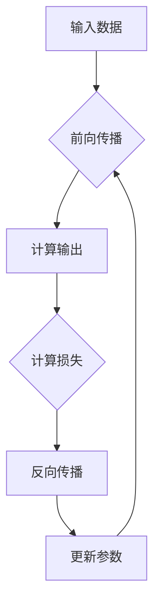

                 

# AI人工智能深度学习算法：深度学习代理工作流的可视化与用户交互设计

> **关键词：** 深度学习、可视化设计、用户交互、工作流、计算机视觉、自然语言处理、推荐系统

> **摘要：** 本文旨在探讨深度学习算法在人工智能领域中的应用，重点关注深度学习代理工作流的可视化与用户交互设计。通过详细解析深度学习的基础知识、数据处理技术、算法应用、可视化工具和用户交互原则，本文提供了一个全面的技术指南，帮助开发者提升深度学习项目的实践效果。

## 第一部分：AI人工智能深度学习算法基础

### 第1章：深度学习算法基础

#### 第1节：深度学习原理

##### 1.1.1 从浅层网络到深层网络的演进

深度学习（Deep Learning）是机器学习（Machine Learning）的一个子领域，其主要特点是通过构建具有多个隐藏层的神经网络模型来实现对复杂数据的自动特征提取和模式识别。与传统机器学习方法相比，深度学习在图像识别、语音识别、自然语言处理等领域取得了显著突破。

从浅层网络到深层网络的演进是深度学习发展的重要历程。早期神经网络模型如感知机（Perceptron）和多层感知机（MLP）由于网络层数有限，难以解决复杂问题。随着计算能力的提升和算法的改进，深层网络（Deep Neural Network，DNN）逐渐成为研究热点。

##### 1.1.2 神经元模型与感知机

神经元模型是深度学习的基础。一个简单的神经元模型包括输入层、权重层和输出层。输入层接收外部输入信息，通过权重层进行加权求和，最后通过激活函数得到输出。

感知机（Perceptron）是最早的神经网络模型之一。它通过线性可分分类问题来演示神经网络的工作原理。感知机的核心思想是找到一组权重，使得输入数据的分类边界得到最大化。

##### 1.1.3 反向传播算法

反向传播算法（Backpropagation Algorithm）是深度学习训练的核心算法。它通过计算网络输出和实际输出之间的误差，然后反向传播误差到网络中的每个神经元，更新权重和偏置，以最小化误差。

反向传播算法的核心步骤包括前向传播、计算误差、反向传播和权重更新。这个过程不断迭代，直到网络输出满足要求。

#### 第2节：神经网络结构

##### 1.2.1 前向传播与反向传播

神经网络中的前向传播（Forward Propagation）是指将输入数据通过网络进行逐层计算，最终得到输出。反向传播（Back Propagation）是指通过计算输出误差，反向更新网络中的权重和偏置。

前向传播和反向传播是深度学习训练的基础。通过不断迭代这个过程，网络能够逐渐优化参数，提高模型的准确性和泛化能力。

##### 1.2.2 网络层数与神经元数量

网络层数和神经元数量是深度学习模型设计的重要参数。通常，网络层数越多，模型能够学习的特征越复杂，但计算成本也越高。神经元数量需要根据具体问题进行调整，以平衡模型复杂度和训练时间。

##### 1.2.3 常见的神经网络结构

常见的神经网络结构包括多层感知机（MLP）、卷积神经网络（CNN）和循环神经网络（RNN）。MLP适用于分类和回归问题，CNN适用于计算机视觉任务，RNN适用于序列数据建模。

#### 第3节：激活函数

激活函数（Activation Function）是神经网络中的重要组成部分。激活函数将神经元的线性组合映射到非负实数，引入非线性特性，使得神经网络能够学习复杂函数。

常见的激活函数包括：

- Sigmoid函数：将输入映射到（0，1）区间，具有平滑的S形曲线。
- Tanh函数：与Sigmoid函数类似，但映射范围是（-1，1），对称性更好。
- ReLU函数：在输入大于0时输出输入，小于0时输出0，计算效率高。

##### 1.3.1 Sigmoid函数

Sigmoid函数是最早的激活函数之一。它的优点是能够将输入映射到（0，1）区间，易于解释。但Sigmoid函数的缺点是梯度较小，导致训练速度较慢。

##### 1.3.2 Tanh函数

Tanh函数与Sigmoid函数类似，但映射范围是（-1，1），具有更好的对称性。Tanh函数的梯度较大，训练速度较快。

##### 1.3.3 ReLU函数

ReLU函数是当前最流行的激活函数之一。它在输入大于0时输出输入，小于0时输出0，具有计算效率高的优点。但ReLU函数存在梯度消失问题，即输入为负值时梯度为0，导致训练不稳定。

#### 第4节：损失函数与优化算法

损失函数（Loss Function）用于衡量模型输出和实际输出之间的误差。常见的损失函数包括：

- 交叉熵损失函数（Cross-Entropy Loss）：常用于分类问题，衡量模型输出概率分布与实际分布之间的差异。
- 均方误差损失函数（Mean Squared Error Loss）：常用于回归问题，衡量输出值与实际值之间的差异。

优化算法（Optimization Algorithm）用于调整模型参数，最小化损失函数。常见的优化算法包括：

- 随机梯度下降（Stochastic Gradient Descent，SGD）：通过随机选择样本计算梯度，更新模型参数。
-Adam优化器（Adam Optimizer）：结合SGD和Momentum的优点，具有自适应学习率。

### 第2章：特征工程与数据处理

#### 第1节：数据预处理

数据预处理是特征工程的重要环节。常见的预处理方法包括：

- 数据清洗（Data Cleaning）：去除无效数据、处理缺失值、消除噪声。
- 数据归一化（Data Normalization）：将数据缩放到相同范围，便于模型训练。
- 特征提取（Feature Extraction）：从原始数据中提取有用的特征。

##### 2.1.1 数据清洗

数据清洗是数据预处理的第一步。常见的数据清洗方法包括：

- 去除重复数据：通过比较数据行之间的差异，删除重复的数据行。
- 处理缺失值：使用填充方法、插值方法或删除缺失值，保持数据完整性。
- 去除噪声：通过平滑、滤波等方法，降低噪声对数据的影响。

##### 2.1.2 数据归一化

数据归一化是将数据缩放到相同范围，以便模型能够更好地学习。常见的归一化方法包括：

- 最小-最大归一化：将数据缩放到（0，1）区间。
- 标准化：将数据缩放到均值为0、标准差为1的区间。

##### 2.1.3 特征提取

特征提取是从原始数据中提取有用的特征，提高模型性能。常见的特征提取方法包括：

- 统计特征：从数据中提取均值、方差、标准差等统计特征。
- 空间特征：从图像或空间数据中提取边界、角点、纹理等特征。
- 文本特征：从文本数据中提取词频、词向量等特征。

#### 第2节：特征选择

特征选择是特征工程的重要步骤。常见的特征选择方法包括：

- 相关性分析：通过计算特征之间的相关性，筛选出相关性较高的特征。
- 降维技术：通过主成分分析（PCA）、线性判别分析（LDA）等方法，降低特征维度。
- 特征重要性评估：通过模型训练结果，评估特征对模型性能的影响，筛选重要特征。

##### 2.2.1 相关性分析

相关性分析是特征选择的基础。常见的相关性分析方法包括：

- 皮尔逊相关系数（Pearson Correlation Coefficient）：衡量两个特征之间的线性关系。
- 斯皮尔曼相关系数（Spearman Correlation Coefficient）：衡量两个特征之间的单调关系。

##### 2.2.2 降维技术

降维技术是将高维特征空间映射到低维空间，提高模型训练效率。常见的降维技术包括：

- 主成分分析（PCA）：通过最大化特征方差，提取主要成分。
- 线性判别分析（LDA）：通过最大化类内散度，提取有判别力的特征。
- 自动编码器（Autoencoder）：通过自编码模型，实现特征降维。

##### 2.2.3 特征重要性评估

特征重要性评估是通过模型训练结果，评估特征对模型性能的影响。常见的特征重要性评估方法包括：

- 决策树（Decision Tree）：通过决策树模型，评估特征的重要程度。
- 随机森林（Random Forest）：通过随机森林模型，评估特征的重要程度。
- LASSO回归（LASSO Regression）：通过LASSO回归模型，评估特征的重要程度。

#### 第3节：数据增强

数据增强（Data Augmentation）是提高模型泛化能力的重要方法。常见的数据增强方法包括：

- 随机水平翻转（Random Horizontal Flip）：将图像沿水平方向翻转，增加数据多样性。
- 随机裁剪（Random Crop）：从图像中随机裁剪一个矩形区域，增加数据多样性。
- Color jittering：对图像的颜色进行随机调整，增加数据多样性。

##### 2.3.1 随机水平翻转

随机水平翻转是将图像沿水平方向翻转，增加数据多样性。这种方法适用于图像分类任务，可以增强模型的泛化能力。

##### 2.3.2 随机裁剪

随机裁剪是从图像中随机裁剪一个矩形区域，增加数据多样性。这种方法适用于图像识别任务，可以增强模型的鲁棒性。

##### 2.3.3 Color jittering

Color jittering是对图像的颜色进行随机调整，增加数据多样性。这种方法适用于图像分类和识别任务，可以增强模型的泛化能力。

## 第二部分：深度学习在计算机视觉中的应用

### 第3章：深度学习在计算机视觉中的应用

计算机视觉（Computer Vision）是深度学习的重要应用领域之一。深度学习模型通过学习大量图像数据，能够实现图像分类、对象检测、图像分割等任务。

#### 第1节：卷积神经网络（CNN）

卷积神经网络（Convolutional Neural Network，CNN）是深度学习在计算机视觉领域的核心模型。CNN通过卷积操作和池化操作，能够提取图像的特征，实现图像分类、对象检测等任务。

##### 3.1.1 卷积操作

卷积操作是CNN的核心操作之一。卷积操作通过滑动窗口（滤波器）在输入图像上滑动，计算每个位置的特征图。卷积操作具有局部感知性和平移不变性，能够提取图像的局部特征。

##### 3.1.2 池化操作

池化操作是CNN中的另一个重要操作。池化操作通过采样操作，将每个特征图中的局部特征合并，降低特征维度。常见的池化操作包括最大池化和平均池化。

##### 3.1.3 卷积神经网络结构

卷积神经网络通常由卷积层、池化层、全连接层等组成。卷积层用于提取图像特征，池化层用于降低特征维度，全连接层用于分类。

常见的卷积神经网络结构包括：

- AlexNet：由5个卷积层、3个池化层和2个全连接层组成，是深度学习在计算机视觉领域的里程碑。
- VGGNet：由多个卷积层和池化层组成，具有简洁、有效的网络结构。
- ResNet：引入残差块，解决了深层网络训练中的梯度消失问题。

#### 第2节：对象检测

对象检测（Object Detection）是计算机视觉的重要任务之一。对象检测旨在识别图像中的物体并定位其位置。常见的对象检测算法包括：

- R-CNN（Region-based Convolutional Neural Network）：通过区域提议网络（Region Proposal Network，RPN）生成候选区域，然后使用CNN进行特征提取和分类。
- Fast R-CNN：在R-CNN的基础上，引入了ROI Pooling层，提高了检测速度。
- YOLO（You Only Look Once）：将对象检测任务看作一个回归问题，直接预测物体的位置和类别，具有实时性。

##### 3.2.1 R-CNN

R-CNN（Region-based Convolutional Neural Network）是一种基于区域提议的对象检测算法。R-CNN通过区域提议网络（RPN）生成候选区域，然后使用CNN进行特征提取和分类。

##### 3.2.2 Fast R-CNN

Fast R-CNN在R-CNN的基础上，引入了ROI Pooling层，提高了检测速度。Fast R-CNN通过滑动窗口生成候选区域，然后使用CNN提取特征。

##### 3.2.3 YOLO

YOLO（You Only Look Once）是一种基于回归的对象检测算法。YOLO将对象检测任务看作一个回归问题，直接预测物体的位置和类别。YOLO具有实时性，适用于实时对象检测任务。

#### 第3节：图像分类

图像分类（Image Classification）是计算机视觉的基础任务之一。图像分类旨在将图像划分为预定义的类别。常见的图像分类算法包括：

- AlexNet：由5个卷积层、3个池化层和2个全连接层组成，是深度学习在图像分类领域的里程碑。
- VGGNet：由多个卷积层和池化层组成，具有简洁、有效的网络结构。
- ResNet：引入残差块，解决了深层网络训练中的梯度消失问题。

##### 3.3.1 AlexNet

AlexNet是由Alex Krizhevsky等人于2012年提出的一种卷积神经网络结构。AlexNet由5个卷积层、3个池化层和2个全连接层组成，是深度学习在图像分类领域的里程碑。

##### 3.3.2 VGGNet

VGGNet是由牛津大学视觉几何组（Visual Geometry Group）提出的一种卷积神经网络结构。VGGNet由多个卷积层和池化层组成，具有简洁、有效的网络结构。

##### 3.3.3 ResNet

ResNet是由微软研究院提出的一种卷积神经网络结构。ResNet引入了残差块，解决了深层网络训练中的梯度消失问题。ResNet具有简洁、有效的网络结构，在图像分类任务中取得了显著的性能提升。

## 第三部分：自然语言处理中的深度学习

自然语言处理（Natural Language Processing，NLP）是深度学习的另一个重要应用领域。深度学习模型通过学习大量的文本数据，能够实现文本分类、机器翻译、情感分析等任务。

### 第4章：自然语言处理中的深度学习

#### 第1节：词嵌入

词嵌入（Word Embedding）是将词汇映射到低维空间的方法。词嵌入能够捕捉词汇之间的语义关系，是深度学习在NLP领域的基础。

常见的词嵌入方法包括：

- 神经网络嵌入（Neural Network Embedding）：通过训练神经网络模型，将词汇映射到低维空间。
- word2vec算法：通过训练两个神经网络模型，实现词汇的词向量和上下文表示。

##### 4.1.1 神经网络嵌入

神经网络嵌入是一种通过训练神经网络模型，将词汇映射到低维空间的方法。神经网络嵌入能够捕捉词汇之间的语义关系，提高NLP任务的性能。

##### 4.1.2 word2vec算法

word2vec算法是一种基于神经网络的词嵌入方法。word2vec算法通过训练两个神经网络模型，实现词汇的词向量和上下文表示。word2vec算法包括Skip-Gram和Continuous Bag-of-Words（CBOW）两种模型。

#### 第2节：序列模型

序列模型（Sequence Model）是处理序列数据的深度学习模型。常见的序列模型包括循环神经网络（Recurrent Neural Network，RNN）、长短期记忆网络（Long Short-Term Memory，LSTM）和门控循环单元（Gated Recurrent Unit，GRU）。

##### 4.2.1 RNN

循环神经网络（RNN）是一种能够处理序列数据的深度学习模型。RNN通过循环结构，将当前输入与前一时刻的输出和隐藏状态相连接，实现序列数据的建模。

##### 4.2.2 LSTM

长短期记忆网络（LSTM）是RNN的一种变体，通过引入门控机制，解决了RNN梯度消失问题，能够更好地处理长序列数据。

##### 4.2.3 GRU

门控循环单元（GRU）是另一种RNN变体，通过合并输入门和控制门，简化了LSTM结构，具有更高的计算效率。

#### 第3节：生成模型

生成模型（Generative Model）是用于生成新数据的深度学习模型。常见的生成模型包括变分自编码器（Variational Autoencoder，VAE）和生成对抗网络（Generative Adversarial Network，GAN）。

##### 4.3.1 参考生成对抗网络（GAN）

生成对抗网络（GAN）是一种由生成器和判别器组成的深度学习模型。生成器生成新数据，判别器判断生成数据与真实数据的相似程度。GAN通过不断优化生成器和判别器，实现数据的生成。

### 第四部分：深度学习在推荐系统中的应用

推荐系统（Recommender System）是一种基于用户历史行为和偏好，为用户提供个性化推荐服务的系统。深度学习在推荐系统中的应用，旨在通过学习用户和物品的表示，提高推荐效果。

#### 第5章：深度学习在推荐系统中的应用

#### 第1节：矩阵分解

矩阵分解（Matrix Factorization）是推荐系统的一种常见技术，通过分解用户-物品评分矩阵，提取用户和物品的潜在特征。

常见的矩阵分解方法包括：

- SVD分解（Singular Value Decomposition，SVD）：将用户-物品评分矩阵分解为用户特征矩阵和物品特征矩阵的乘积。
- 动态矩阵分解（Dynamic Matrix Factorization，DMF）：考虑用户和物品的时间动态特性，更新用户和物品的特征矩阵。

##### 5.1.1 SVD分解

SVD分解是一种基于线性代数的矩阵分解方法。通过SVD分解，可以将用户-物品评分矩阵分解为用户特征矩阵和物品特征矩阵的乘积。SVD分解能够提取用户和物品的潜在特征，提高推荐效果。

##### 5.1.2 动态矩阵分解

动态矩阵分解（DMF）是一种考虑用户和物品的时间动态特性的矩阵分解方法。DMF通过引入时间因素，更新用户和物品的特征矩阵，实现动态推荐。

#### 第2节：基于模型的推荐算法

基于模型的推荐算法（Model-based Recommender Algorithm）是推荐系统的一种重要方法，通过训练用户和物品的表示模型，实现个性化推荐。

常见的基于模型的推荐算法包括：

- 协同过滤算法（Collaborative Filtering，CF）：基于用户的历史行为和偏好，寻找相似用户或物品，进行推荐。
- 线性回归模型（Linear Regression Model）：通过训练线性回归模型，预测用户对物品的评分。
- 随机梯度下降算法（Stochastic Gradient Descent，SGD）：通过随机选择样本，更新模型参数，实现模型训练。

##### 5.2.1 协同过滤算法

协同过滤算法是一种基于用户历史行为的推荐方法。协同过滤算法通过计算用户之间的相似度，寻找相似用户或物品，为用户进行推荐。

常见的协同过滤算法包括：

- 基于用户的协同过滤（User-based CF）：通过计算用户之间的相似度，为用户推荐与相似用户喜欢的物品。
- 基于项目的协同过滤（Item-based CF）：通过计算物品之间的相似度，为用户推荐与物品相似的物品。

##### 5.2.2 线性回归模型

线性回归模型是一种基于预测的推荐方法。线性回归模型通过训练用户和物品的表示模型，预测用户对物品的评分，实现个性化推荐。

##### 5.2.3 随机梯度下降算法

随机梯度下降算法（SGD）是一种常用的优化算法，用于训练线性回归模型。SGD通过随机选择样本，计算梯度，更新模型参数，实现模型训练。

#### 第3节：神经网络在推荐系统中的应用

神经网络（Neural Network）在推荐系统中的应用，旨在通过学习用户和物品的表示，提高推荐效果。

常见的神经网络在推荐系统中的应用包括：

- 点积模型（Dot Product Model）：通过计算用户和物品的表示向量的点积，预测用户对物品的评分。
- 层次模型（Hierarchy Model）：通过构建用户和物品的层次结构，实现个性化推荐。

##### 5.3.1 点积模型

点积模型是一种基于神经网络的推荐方法。点积模型通过计算用户和物品的表示向量的点积，预测用户对物品的评分。

##### 5.3.2 层次模型

层次模型是一种基于神经网络的推荐方法。层次模型通过构建用户和物品的层次结构，实现个性化推荐。层次模型能够处理大规模用户和物品数据，提高推荐效果。

### 第五部分：深度学习代理工作流的可视化与用户交互设计

深度学习代理工作流的可视化与用户交互设计是深度学习应用的重要环节。可视化设计能够帮助用户更好地理解深度学习模型的工作过程，用户交互设计能够提高用户的操作体验和系统性能。

#### 第6章：深度学习代理工作流的可视化与用户交互设计

#### 第1节：可视化设计原则

可视化设计原则是深度学习代理工作流设计的重要依据。常见的可视化设计原则包括：

- 信息可视化：通过图表、图形等方式，将深度学习模型的结构、参数和训练过程等信息可视化，帮助用户理解模型。
- 直观性：设计简洁直观的界面，使用户能够快速了解系统功能和操作方法。
- 交互性：提供丰富的交互功能，使用户能够与系统进行实时互动，调整模型参数和训练过程。

##### 6.1.1 信息可视化

信息可视化是深度学习代理工作流设计的重要原则。通过图表、图形等方式，将深度学习模型的结构、参数和训练过程等信息可视化，帮助用户更好地理解模型。

常见的可视化工具包括：

- Matplotlib：用于绘制各种类型的图表，如折线图、柱状图、饼图等。
- Plotly：提供交互式的图表绘制功能，支持多种图表类型和交互模式。
- D3.js：基于Web的图表绘制库，支持复杂的交互和动态数据可视化。

##### 6.1.2 直观性

直观性是深度学习代理工作流设计的重要原则。设计简洁直观的界面，使用户能够快速了解系统功能和操作方法。

常见的界面设计原则包括：

- 清晰性：界面布局合理，信息展示清晰，避免过多的冗余和复杂元素。
- 易用性：界面操作简单，提供明确的操作提示和反馈，提高用户体验。
- 美观性：界面设计美观，符合用户审美需求，增强用户体验。

##### 6.1.3 交互性

交互性是深度学习代理工作流设计的重要原则。提供丰富的交互功能，使用户能够与系统进行实时互动，调整模型参数和训练过程。

常见的交互模式包括：

- 鼠标操作：通过鼠标点击、拖动等操作，调整界面元素和参数。
- 键盘操作：通过键盘输入和快捷键，实现快速操作。
- 滚动操作：通过滚动条或滑动操作，调整界面元素和参数。

##### 6.1.4 用户研究方法

用户研究方法是深度学习代理工作流设计的重要手段。通过用户研究方法，了解用户需求和行为，为界面设计和交互设计提供依据。

常见的研究方法包括：

- 用户访谈：通过面对面访谈，了解用户的需求、偏好和痛点。
- 观察法：通过观察用户在使用系统时的行为和反应，发现问题和优化方向。
- 用户调研：通过问卷调查、用户反馈等方式，收集用户意见和反馈。
- 用户测试：通过实际操作测试，评估界面设计和交互设计的有效性。

### 第六部分：AI人工智能深度学习算法在实践中的应用案例

深度学习算法在实践中的应用案例丰富多样，涵盖了计算机视觉、自然语言处理、推荐系统等多个领域。本节通过三个具体案例，介绍深度学习算法在实际项目中的应用。

#### 第1节：图像识别

图像识别（Image Recognition）是深度学习在计算机视觉领域的重要应用之一。本案例介绍了一个基于卷积神经网络（CNN）的图像识别项目。

##### 6.1.1 项目背景

随着互联网和移动设备的普及，图像数据量呈爆炸式增长。图像识别技术在安防监控、医疗诊断、自动驾驶等领域具有广泛的应用前景。本案例旨在实现一个能够识别常见物体的图像识别系统。

##### 6.1.2 技术方案

本案例采用卷积神经网络（CNN）作为图像识别模型，通过迁移学习（Transfer Learning）和数据增强（Data Augmentation）方法，提高模型的性能和泛化能力。具体步骤如下：

1. 数据集准备：收集大量的图像数据，包括训练集和测试集。
2. 预训练模型：使用预训练的CNN模型，如VGG16、ResNet50等，作为迁移学习的基础。
3. 数据预处理：对图像数据进行归一化和数据增强，提高模型泛化能力。
4. 模型训练：通过迁移学习和数据增强，训练CNN模型。
5. 模型评估：使用测试集评估模型性能，调整模型参数。
6. 模型部署：将训练好的模型部署到实际应用场景中。

##### 6.1.3 实现步骤

实现步骤如下：

1. 数据集准备：从网上下载常用的图像识别数据集，如ImageNet、CIFAR-10等。
2. 预训练模型：选择VGG16作为预训练模型，通过迁移学习技术，将其应用于图像识别任务。
3. 数据预处理：对图像数据进行归一化处理，将像素值缩放到[0, 1]区间。同时，采用数据增强方法，如随机裁剪、旋转、翻转等，增加数据多样性。
4. 模型训练：使用训练数据和标签，训练VGG16模型。通过交叉熵损失函数（Cross-Entropy Loss）和Adam优化器（Adam Optimizer），优化模型参数。
5. 模型评估：使用测试集评估模型性能，计算准确率（Accuracy）、召回率（Recall）等指标。
6. 模型部署：将训练好的模型部署到实际应用场景中，如手机APP、服务器等。

#### 第2节：文本分类

文本分类（Text Classification）是深度学习在自然语言处理领域的重要应用之一。本案例介绍了一个基于循环神经网络（RNN）的文本分类项目。

##### 6.2.1 项目背景

随着互联网信息的爆炸式增长，文本数据量呈指数级增长。文本分类技术在新闻分类、垃圾邮件过滤、情感分析等领域具有广泛的应用。本案例旨在实现一个能够对新闻文章进行分类的系统。

##### 6.2.2 技术方案

本案例采用循环神经网络（RNN）作为文本分类模型，通过预训练的词向量（Word Embedding）和双向RNN（Bidirectional RNN），实现文本分类。具体步骤如下：

1. 数据集准备：收集大量的文本数据，包括训练集和测试集。
2. 词向量训练：使用预训练的词向量，如word2vec、GloVe等，将文本数据转换为词向量表示。
3. 数据预处理：对文本数据进行清洗、分词和标点符号去除，将文本转换为序列数据。
4. 模型训练：使用训练数据和标签，训练双向RNN模型。
5. 模型评估：使用测试集评估模型性能，计算准确率（Accuracy）、召回率（Recall）等指标。
6. 模型部署：将训练好的模型部署到实际应用场景中。

##### 6.2.3 实现步骤

实现步骤如下：

1. 数据集准备：从网上下载常用的文本分类数据集，如20 Newsgroups、IMDB评论等。
2. 词向量训练：使用GloVe算法训练词向量，将文本数据转换为词向量表示。
3. 数据预处理：对文本数据进行清洗、分词和标点符号去除，将文本转换为序列数据。同时，将标签转换为独热编码（One-Hot Encoding）。
4. 模型训练：使用训练数据和标签，训练双向RNN模型。通过交叉熵损失函数（Cross-Entropy Loss）和Adam优化器（Adam Optimizer），优化模型参数。
5. 模型评估：使用测试集评估模型性能，计算准确率（Accuracy）、召回率（Recall）等指标。同时，对模型进行调参，优化模型性能。
6. 模型部署：将训练好的模型部署到实际应用场景中，如服务器、手机APP等。

#### 第3节：推荐系统

推荐系统（Recommender System）是深度学习在推荐领域的重要应用。本案例介绍了一个基于矩阵分解（Matrix Factorization）的推荐系统项目。

##### 6.3.1 项目背景

随着电子商务、社交媒体和在线娱乐的普及，推荐系统在提高用户满意度和促进业务增长方面发挥着重要作用。本案例旨在实现一个能够为用户推荐商品和内容的推荐系统。

##### 6.3.2 技术方案

本案例采用矩阵分解（Matrix Factorization）方法，通过SVD分解（Singular Value Decomposition，SVD）提取用户和物品的潜在特征，实现个性化推荐。具体步骤如下：

1. 数据集准备：收集用户行为数据，如用户对商品的评价、浏览记录等。
2. 数据预处理：对用户行为数据进行清洗、归一化和特征提取。
3. 矩阵分解：使用SVD分解用户-物品评分矩阵，提取用户和物品的潜在特征。
4. 推荐算法：基于用户和物品的潜在特征，计算用户对物品的评分，生成推荐列表。
5. 模型评估：使用测试集评估推荐算法的性能，计算准确率（Accuracy）、召回率（Recall）等指标。
6. 模型部署：将训练好的模型部署到实际应用场景中，如电商平台、社交媒体等。

##### 6.3.3 实现步骤

实现步骤如下：

1. 数据集准备：从网上下载常用的推荐系统数据集，如MovieLens、Netflix等。
2. 数据预处理：对用户行为数据进行清洗、归一化和特征提取。例如，对用户评分数据进行归一化处理，将评分范围缩放到[0, 1]区间。
3. 矩阵分解：使用SVD分解用户-物品评分矩阵，提取用户和物品的潜在特征。具体实现可以参考Python的scikit-learn库。
4. 推荐算法：基于用户和物品的潜在特征，计算用户对物品的评分，生成推荐列表。可以使用基于相似度的推荐算法，如余弦相似度（Cosine Similarity）。
5. 模型评估：使用测试集评估推荐算法的性能，计算准确率（Accuracy）、召回率（Recall）等指标。同时，对模型进行调参，优化模型性能。
6. 模型部署：将训练好的模型部署到实际应用场景中，如电商平台、社交媒体等。可以使用Python的Flask或Django框架搭建Web应用，实现推荐系统的接口和前端展示。

### 第七部分：未来展望与挑战

深度学习作为人工智能的重要分支，已经取得了显著的进展。然而，深度学习算法在优化、应用前景和挑战方面仍然面临许多问题和机遇。

#### 第1节：深度学习算法的优化方向

随着深度学习应用的不断扩展，算法的优化方向也成为研究的热点。以下是一些深度学习算法的优化方向：

1. **并行计算**：深度学习算法的运算量巨大，通过并行计算可以提高训练速度和效率。例如，使用GPU或TPU等专用硬件进行并行计算。

2. **分布式训练**：分布式训练能够利用多台计算机的资源，提高训练速度和降低训练成本。例如，使用参数服务器（Parameter Server）或分布式深度学习框架（如TensorFlow Distribution、PyTorch Distributed）进行分布式训练。

3. **算法优化**：通过优化算法结构、优化器选择和超参数调整，可以提高深度学习算法的性能。例如，使用Adam优化器、动态学习率调整等方法。

4. **增量学习**：增量学习（Incremental Learning）是指模型在已有知识的基础上，不断更新和优化，以适应新的数据。增量学习能够提高模型的适应性和可扩展性。

5. **迁移学习**：迁移学习（Transfer Learning）是指将预训练模型应用于新任务，通过迁移已有知识，提高新任务的性能。迁移学习能够减少训练数据的需求，提高模型泛化能力。

#### 第2节：深度学习算法的应用前景

深度学习算法在多个领域具有广泛的应用前景：

1. **工业自动化**：深度学习算法可以用于图像识别、缺陷检测、设备故障预测等任务，提高生产效率和质量。

2. **医疗诊断**：深度学习算法可以用于医学图像分析、疾病预测和诊断等任务，提高医疗诊断的准确性和效率。

3. **教育科技**：深度学习算法可以用于智能教育、个性化学习路径推荐等任务，提高教育质量和学习效果。

4. **自动驾驶**：深度学习算法可以用于自动驾驶车辆的感知、决策和控制，提高自动驾驶的安全性和可靠性。

5. **智能家居**：深度学习算法可以用于智能家居设备的智能控制、语音识别等任务，提高生活便利性和舒适度。

6. **自然语言处理**：深度学习算法可以用于机器翻译、文本生成、情感分析等任务，提高语言处理能力和人机交互体验。

#### 第3节：深度学习算法面临的挑战

深度学习算法在发展过程中也面临许多挑战：

1. **可解释性**：深度学习模型通常被视为“黑箱”，难以解释模型的决策过程。提高模型的可解释性，是深度学习研究的重要方向。

2. **数据隐私**：深度学习算法在处理大量数据时，可能涉及用户隐私数据。如何保护用户隐私，是深度学习应用中的重要问题。

3. **算法公平性**：深度学习算法在处理社会数据时，可能引入偏见和不公平性。如何确保算法的公平性，是深度学习研究的重要问题。

4. **计算资源消耗**：深度学习算法通常需要大量的计算资源，包括CPU、GPU等。如何优化算法，降低计算资源消耗，是深度学习应用中的重要问题。

5. **模型泛化能力**：深度学习算法在训练过程中可能过度拟合训练数据，导致模型泛化能力不足。如何提高模型的泛化能力，是深度学习研究的重要问题。

## 附录

### 附录A：深度学习算法的Mermaid流程图



### 附录B：深度学习算法的伪代码

```python
# 初始化模型参数
w1, b1 = 初始化参数()

# 前向传播
x = 输入数据
z = w1 * x + b1
a = 激活函数(z)

# 计算损失
loss = 损失函数(a, y)

# 反向传播
dz = 损失对a的偏导数
dw1 = dz * x
db1 = dz

# 更新参数
w1 = w1 - 学习率 * dw1
b1 = b1 - 学习率 * db1
```

### 附录C：数学模型和数学公式

$$
f(x) = \sigma(w \cdot x + b)
$$

$$
\text{交叉熵损失函数} = -\sum_{i=1}^{n} y_i \log(a_i)
$$

$$
\text{均方误差损失函数} = \frac{1}{2} \sum_{i=1}^{n} (y_i - \hat{y}_i)^2
$$

### 附录D：深度学习实践项目代码与分析

```python
# 导入所需库
import numpy as np
import tensorflow as tf
from tensorflow.keras import layers, models

# 定义模型结构
model = models.Sequential()
model.add(layers.Conv2D(32, (3, 3), activation='relu', input_shape=(28, 28, 1)))
model.add(layers.MaxPooling2D((2, 2)))
model.add(layers.Conv2D(64, (3, 3), activation='relu'))
model.add(layers.MaxPooling2D((2, 2)))
model.add(layers.Conv2D(64, (3, 3), activation='relu'))
model.add(layers.Flatten())
model.add(layers.Dense(64, activation='relu'))
model.add(layers.Dense(10, activation='softmax'))

# 编译模型
model.compile(optimizer='adam',
              loss='categorical_crossentropy',
              metrics=['accuracy'])

# 加载数据
(x_train, y_train), (x_test, y_test) = tf.keras.datasets.mnist.load_data()

# 数据预处理
x_train = x_train.astype('float32') / 255
x_test = x_test.astype('float32') / 255
x_train = np.expand_dims(x_train, -1)
x_test = np.expand_dims(x_test, -1)

# 转换为one-hot编码
y_train = tf.keras.utils.to_categorical(y_train, 10)
y_test = tf.keras.utils.to_categorical(y_test, 10)

# 训练模型
model.fit(x_train, y_train, epochs=10, batch_size=64, validation_split=0.2)

# 评估模型
test_loss, test_acc = model.evaluate(x_test, y_test)
print('Test accuracy:', test_acc)
```

### 附录E：深度学习相关工具与资源列表

- TensorFlow：https://www.tensorflow.org/
- PyTorch：https://pytorch.org/
- Keras：https://keras.io/
- scikit-learn：https://scikit-learn.org/stable/
- OpenCV：https://opencv.org/
- Matplotlib：https://matplotlib.org/
- Plotly：https://plotly.com/
- D3.js：https://d3js.org/

### 作者

作者：AI天才研究院/AI Genius Institute & 禅与计算机程序设计艺术 /Zen And The Art of Computer Programming

本文由AI天才研究院/AI Genius Institute与禅与计算机程序设计艺术/Zen And The Art of Computer Programming共同撰写，旨在为深度学习开发者提供全面的技术指南。希望本文能够帮助读者更好地理解深度学习算法、可视化设计、用户交互设计以及其在实践中的应用案例。如果您有任何问题或建议，欢迎在评论区留言交流。感谢您的阅读！

