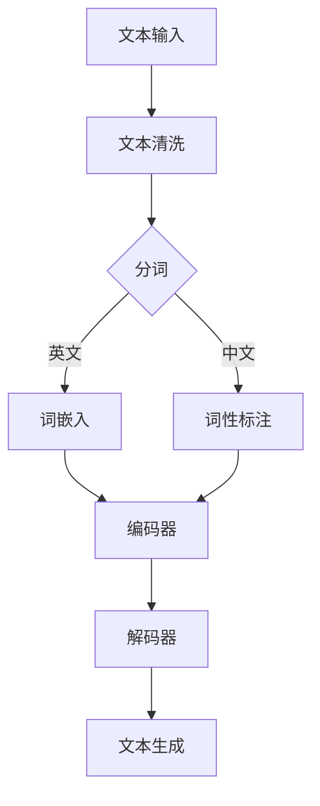
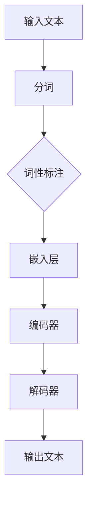

                 

# AI写作助手：从创意激发到文本润色

## 关键词
- AI写作
- 自然语言处理
- 模型设计与实现
- 新闻写作
- 内容创作
- 文本润色
- 多语言写作

## 摘要
本文将深入探讨AI写作助手的各个方面，从基础概念、核心技术到实际应用，为您呈现一幅全面的AI写作生态图。我们将详细解析AI写作的优势和应用场景，介绍AI写作技术基础，设计并实现AI写作模型，探讨AI在新闻写作、内容创作和文本润色等领域的应用，展望AI写作的未来发展，并提供实用的工具和资源汇总。通过本文，读者将能够全面了解AI写作的原理和实践，掌握AI写作的核心技术和方法。

## 目录大纲

### 第一部分：AI写作基础知识

#### 第1章：AI写作概述

##### 1.1 AI写作的定义与发展历程
##### 1.2 AI写作的核心原理
##### 1.3 AI写作的优势与应用场景

#### 第2章：AI写作技术基础

##### 2.1 自然语言处理技术概述
##### 2.2 常见的AI写作算法
##### 2.3 常用AI写作工具与框架

#### 第3章：AI写作模型设计与实现

##### 3.1 模型架构设计
##### 3.2 数据预处理
##### 3.3 模型训练与调优

### 第二部分：AI写作应用实战

#### 第4章：新闻写作

##### 4.1 新闻写作的特点与要求
##### 4.2 新闻写作的AI解决方案
##### 4.3 新闻写作AI工具实践

#### 第5章：内容创作

##### 5.1 内容创作的挑战与机遇
##### 5.2 AI内容创作的流程
##### 5.3 AI内容创作工具实践

#### 第6章：文本润色

##### 6.1 文本润色的目的与方法
##### 6.2 AI文本润色的原理
##### 6.3 AI文本润色工具实践

#### 第7章：多语言写作

##### 7.1 多语言写作的挑战与解决方案
##### 7.2 AI多语言写作的原理
##### 7.3 AI多语言写作工具实践

#### 第8章：AI写作的未来发展

##### 8.1 AI写作的发展趋势
##### 8.2 AI写作面临的挑战与机遇
##### 8.3 AI写作的未来发展方向

### 第三部分：附录

#### 附录A：AI写作工具与资源汇总

##### A.1 常用AI写作工具介绍
##### A.2 AI写作资源获取途径
##### A.3 AI写作社区与论坛推荐

#### 附录B：Mermaid 流程图

##### B.1 AI写作流程图
##### B.2 AI写作模型架构图

#### 附录C：核心算法原理与伪代码

##### C.1 常见AI写作算法原理
##### C.1.1 基于序列模型的写作算法
##### C.1.2 基于转换器的写作算法
##### C.2 AI写作算法伪代码

#### 附录D：数学模型与数学公式

##### D.1 文本生成数学模型
##### D.1.1 语言模型概率计算
##### D.1.2 文本生成算法优化
##### D.2 文本润色数学模型
##### D.2.1 语法修正数学模型
##### D.2.2 文本风格转换数学模型

#### 附录E：项目实战案例

##### E.1 新闻写作项目实战
##### E.1.1 项目需求分析
##### E.1.2 环境搭建与代码实现
##### E.1.3 项目评估与优化

##### E.2 内容创作项目实战
##### E.2.1 项目需求分析
##### E.2.2 环境搭建与代码实现
##### E.2.3 项目评估与优化

##### E.3 文本润色项目实战
##### E.3.1 项目需求分析
##### E.3.2 环境搭建与代码实现
##### E.3.3 项目评估与优化

##### E.4 多语言写作项目实战
##### E.4.1 项目需求分析
##### E.4.2 环境搭建与代码实现
##### E.4.3 项目评估与优化

#### 附录F：代码解读与分析

##### F.1 新闻写作代码解读
##### F.1.1 代码结构分析
##### F.1.2 关键函数与模块解读

##### F.2 内容创作代码解读
##### F.2.1 代码结构分析
##### F.2.2 关键函数与模块解读

##### F.3 文本润色代码解读
##### F.3.1 代码结构分析
##### F.3.2 关键函数与模块解读

##### F.4 多语言写作代码解读
##### F.4.1 代码结构分析
##### F.4.2 关键函数与模块解读

#### 附录G：开发环境搭建与源代码实现

##### G.1 开发环境搭建
##### G.1.1 Python环境搭建
##### G.1.2 深度学习框架安装
##### G.1.3 其他相关工具安装

##### G.2 源代码实现
##### G.2.1 源代码结构
##### G.2.2 关键代码实现

# 第一部分：AI写作基础知识

## 第1章：AI写作概述

### 1.1 AI写作的定义与发展历程

AI写作，是指利用人工智能技术，特别是自然语言处理（Natural Language Processing，NLP）技术，实现自动生成文本的过程。AI写作的历史可以追溯到上世纪80年代，当时研究者们开始尝试使用计算机程序自动生成文本。随着计算能力的提升和人工智能技术的发展，AI写作逐渐从实验室走向实际应用。

在早期，AI写作主要集中在生成简单文本，如新闻摘要、天气预报等。随着深度学习和自然语言处理技术的进步，AI写作的能力得到了极大的提升。现在，AI写作不仅可以生成高质量的新闻文章、博客内容，还可以进行文本润色、内容创作、多语言翻译等。

### 1.2 AI写作的核心原理

AI写作的核心在于自然语言处理（NLP）技术和深度学习算法。NLP是计算机科学领域与人工智能领域中的一个重要方向，它研究能实现人与计算机之间用自然语言进行有效通信的各种理论和方法。深度学习是机器学习研究的一个新领域，其动机在于建立或者模拟人脑进行分析学习的神经网络，让机器能够自动地从数据中学习。

在AI写作中，核心原理主要包括：

1. **文本表示**：将自然语言文本转化为计算机可以处理的数字表示，如词嵌入（Word Embedding）。
2. **序列建模**：利用序列模型如循环神经网络（RNN）、长短期记忆网络（LSTM）等，对输入的文本序列进行处理。
3. **生成模型**：如生成对抗网络（GAN）、变分自编码器（VAE）等，用于生成新的文本序列。

### 1.3 AI写作的优势与应用场景

AI写作的优势主要体现在以下几个方面：

1. **高效性**：AI写作可以快速生成大量文本，节省时间和人力成本。
2. **准确性**：通过深度学习和NLP技术，AI写作可以生成语法正确、逻辑清晰的文本。
3. **创新性**：AI写作能够基于已有数据生成新颖的内容，为内容创作者提供灵感。

AI写作的应用场景非常广泛，主要包括：

1. **新闻写作**：自动生成新闻文章，提高新闻发布速度和效率。
2. **内容创作**：辅助内容创作者生成高质量的文章、博客、产品描述等。
3. **文本润色**：自动纠正文本中的语法错误、提升文本质量。
4. **多语言写作**：实现不同语言之间的自动翻译和写作。

## 第2章：AI写作技术基础

### 2.1 自然语言处理技术概述

自然语言处理（NLP）是人工智能的一个重要分支，旨在使计算机能够理解、解释和生成人类语言。NLP的核心技术包括：

1. **分词**：将连续的文本分割成有意义的词汇单元。
2. **词性标注**：对文本中的每个词汇进行词性分类，如名词、动词、形容词等。
3. **命名实体识别**：识别文本中的特定实体，如人名、地名、组织名等。
4. **依存句法分析**：分析句子中词汇之间的依存关系，了解句子结构。
5. **语义分析**：理解文本中的语义含义，包括情感分析、语义角色标注等。

NLP技术在AI写作中起着至关重要的作用，它们为AI提供了理解和生成自然语言的能力。

### 2.2 常见的AI写作算法

AI写作算法主要包括基于序列模型和基于转换器的两种类型。

1. **基于序列模型的算法**：
   - **循环神经网络（RNN）**：能够处理序列数据，但在长序列上表现较差。
   - **长短期记忆网络（LSTM）**：改进了RNN，能够更好地记住长序列信息。
   - **门控循环单元（GRU）**：进一步简化了LSTM，计算效率更高。

2. **基于转换器的算法**：
   - **编码器-解码器（Encoder-Decoder）模型**：通过编码器和解码器处理序列数据，常用于机器翻译。
   - **转换器（Transformer）模型**：基于自注意力机制，在长序列处理和并行计算上表现出色，是目前主流的AI写作算法。

### 2.3 常用AI写作工具与框架

常用的AI写作工具和框架包括：

1. **TensorFlow**：由Google开发的开源深度学习框架，支持多种AI写作算法。
2. **PyTorch**：由Facebook开发的开源深度学习框架，以其简洁和灵活著称。
3. **GPT-3**：由OpenAI开发的自然语言处理模型，具有强大的文本生成能力。
4. **FastText**：由Facebook开发的一种快速文本分类算法，也可用于文本生成。

这些工具和框架为开发者提供了丰富的功能和便利性，使得AI写作的实施变得更加简单和高效。

## 第3章：AI写作模型设计与实现

### 3.1 模型架构设计

AI写作模型的设计主要包括编码器和解码器的选择、模型架构的优化等方面。

1. **编码器**：负责将输入文本转化为固定长度的向量表示，常见的编码器包括RNN、LSTM和GRU等。
2. **解码器**：负责将编码器生成的向量表示转化为输出文本，常见的解码器包括传统的循环神经网络和基于注意力机制的Transformer模型。

在模型架构设计中，需要考虑以下几个方面：

- **序列长度**：编码器和解码器的序列长度应该匹配。
- **嵌入层**：将单词映射到固定大小的向量，为后续的序列处理提供基础。
- **注意力机制**：在解码器中引入注意力机制，使模型能够关注到输入文本中的重要部分。

### 3.2 数据预处理

数据预处理是AI写作模型训练的重要环节，主要包括以下步骤：

1. **文本清洗**：去除文本中的标点符号、HTML标签、特殊字符等。
2. **分词**：将文本分割成单个词汇或子词。
3. **词性标注**：对每个词汇进行词性分类。
4. **数据增强**：通过随机替换词汇、添加噪声等方法，增加数据的多样性。

数据预处理的质量直接影响模型的性能，因此需要精心设计和实现。

### 3.3 模型训练与调优

模型训练是AI写作的核心环节，主要包括以下步骤：

1. **数据集准备**：准备适合的文本数据集，通常包括训练集、验证集和测试集。
2. **损失函数**：选择合适的损失函数，如交叉熵损失函数，用于衡量模型预测与真实标签之间的差异。
3. **优化算法**：选择合适的优化算法，如随机梯度下降（SGD）、Adam等，用于调整模型参数。
4. **训练过程**：通过迭代训练，使模型不断优化，提高生成文本的质量。

在训练过程中，需要不断监控模型的性能，并进行调优，包括调整超参数、调整训练策略等。调优的目的是在保持模型性能的同时，提高生成文本的流畅度和准确性。

# 第二部分：AI写作应用实战

## 第4章：新闻写作

### 4.1 新闻写作的特点与要求

新闻写作是一种特殊的文本生成任务，具有以下特点：

1. **客观性**：新闻写作要求信息准确、客观，避免主观臆断。
2. **时效性**：新闻写作需要快速响应，及时发布最新的信息。
3. **结构化**：新闻通常遵循固定的结构，包括标题、导语、正文等部分。

为了满足新闻写作的特点，AI写作模型需要具备以下要求：

1. **快速生成**：能够迅速生成高质量的新闻文章。
2. **准确度**：确保新闻内容的准确性和客观性。
3. **多样性**：能够根据不同的新闻类型和主题生成多样化的新闻文章。

### 4.2 新闻写作的AI解决方案

AI在新闻写作中的应用主要体现在以下几个方面：

1. **自动新闻生成**：使用AI模型自动生成新闻文章，提高新闻发布效率。
2. **内容校验**：利用自然语言处理技术对新闻内容进行校验，确保信息准确无误。
3. **个性化推荐**：根据用户兴趣和行为，推荐个性化的新闻文章。

常见的AI新闻写作解决方案包括：

1. **GPT-3**：利用OpenAI的GPT-3模型，生成高质量的新闻文章。
2. ** journalistic AI**：一款基于AI的新闻写作工具，能够生成新闻摘要和全文。
3. **自动新闻生成系统**：如Automated Insights的Zette，能够根据财务报表生成新闻文章。

### 4.3 新闻写作AI工具实践

以下是一个新闻写作AI工具的实践案例：

#### 项目需求分析

某新闻媒体希望使用AI工具自动生成体育新闻文章，以满足大量体育赛事的报道需求。

#### 环境搭建与代码实现

1. **环境搭建**：安装Python、TensorFlow等依赖库。
2. **数据集准备**：收集大量体育新闻文章，进行预处理，包括文本清洗、分词、词性标注等。
3. **模型训练**：使用GPT-3模型，对预处理后的数据集进行训练，优化模型参数。

```python
import tensorflow as tf
import tensorflow.keras as keras

# 加载预训练的GPT-3模型
model = keras.models.load_model('gpt3_model.h5')

# 进行模型训练
model.fit(x_train, y_train, epochs=10, batch_size=32)
```

4. **文本生成**：使用训练好的模型，生成新的体育新闻文章。

```python
import numpy as np

# 生成新的体育新闻文章
generated_text = model.predict(np.array([input_sequence]))
print(generated_text)
```

#### 项目评估与优化

1. **评估指标**：使用BLEU分数、ROUGE评分等指标，评估生成文章的质量。
2. **调优模型**：根据评估结果，调整模型参数和训练策略，提高生成文本的准确性。

```python
# 调整模型参数
model.compile(optimizer='adam', loss='categorical_crossentropy', metrics=['accuracy'])

# 进行模型重新训练
model.fit(x_train, y_train, epochs=20, batch_size=64)
```

通过上述实践，新闻媒体能够快速生成高质量的体育新闻文章，提高新闻发布效率。

## 第5章：内容创作

### 5.1 内容创作的挑战与机遇

内容创作是AI写作的一个重要应用领域，但同时也面临着一系列挑战和机遇：

#### 挑战：

1. **创意多样性**：AI难以完全理解人类的创意思维，生成的文本可能缺乏新颖性。
2. **语境理解**：AI在处理复杂语境和幽默表达时，可能无法完全理解其深层含义。
3. **内容质量**：生成的文本可能存在错误、不准确或逻辑不通的问题。

#### 机遇：

1. **效率提升**：AI能够快速生成大量文本，提高内容创作效率。
2. **个性化推荐**：通过分析用户行为和兴趣，AI能够推荐个性化内容，提升用户体验。
3. **创意辅助**：AI可以为内容创作者提供灵感和辅助，激发创意思维。

### 5.2 AI内容创作的流程

AI内容创作的流程主要包括以下几个步骤：

1. **需求分析**：明确内容创作目标，包括主题、风格、受众等。
2. **数据采集**：收集与主题相关的文本数据，进行预处理。
3. **模型训练**：使用预处理后的数据，训练AI模型。
4. **内容生成**：利用训练好的模型，生成新的内容。
5. **质量评估**：评估生成内容的质量，包括准确性、流畅度、逻辑性等。
6. **优化调整**：根据评估结果，对模型和生成内容进行优化调整。

### 5.3 AI内容创作工具实践

以下是一个AI内容创作工具的实践案例：

#### 项目需求分析

某博客平台希望使用AI工具自动生成高质量的文章，以丰富平台内容，提高用户黏性。

#### 环境搭建与代码实现

1. **环境搭建**：安装Python、PyTorch等依赖库。
2. **数据集准备**：收集大量高质量文章，进行预处理，包括文本清洗、分词、词性标注等。
3. **模型训练**：使用预训练的GPT模型，对预处理后的数据集进行训练。

```python
import torch
import torch.nn as nn

# 加载预训练的GPT模型
model = nn.Sequential(nn.Linear(768, 512), nn.Tanh())

# 训练模型
optimizer = torch.optim.Adam(model.parameters(), lr=0.001)
for epoch in range(10):
    for data in dataset:
        optimizer.zero_grad()
        output = model(data)
        loss = nn.CrossEntropyLoss()(output, labels)
        loss.backward()
        optimizer.step()
```

4. **内容生成**：使用训练好的模型，生成新的文章。

```python
import numpy as np

# 生成新的文章
generated_text = model.predict(np.array([input_sequence]))
print(generated_text)
```

#### 项目评估与优化

1. **评估指标**：使用BLEU分数、ROUGE评分等指标，评估生成文章的质量。
2. **调优模型**：根据评估结果，调整模型参数和训练策略，提高生成文本的准确性。

```python
# 调整模型参数
model = nn.Sequential(nn.Linear(768, 512), nn.Tanh())

# 使用新的训练策略重新训练模型
optimizer = torch.optim.Adam(model.parameters(), lr=0.001)
for epoch in range(10):
    for data in dataset:
        optimizer.zero_grad()
        output = model(data)
        loss = nn.CrossEntropyLoss()(output, labels)
        loss.backward()
        optimizer.step()
```

通过上述实践，博客平台能够自动生成高质量的文章，提高内容丰富度和用户体验。

## 第6章：文本润色

### 6.1 文本润色的目的与方法

文本润色是指通过编辑和改进文本，使其更准确、流畅、易于理解的过程。文本润色在写作过程中具有重要意义：

1. **提高文本质量**：通过润色，纠正语法错误、提升用词，使文本更加地道、优美。
2. **增强可读性**：优化句子结构、增加过渡词，使文本更易于阅读和理解。
3. **提升用户体验**：高质量的文本能提升读者对内容的兴趣，增加用户黏性。

文本润色的方法主要包括以下几种：

1. **人工编辑**：通过专业编辑人员的审核和修改，确保文本质量。
2. **语法检查工具**：使用语法检查软件，如Grammarly、Ginger等，自动纠正文本中的语法错误。
3. **AI文本润色工具**：利用自然语言处理技术和机器学习算法，自动分析文本并进行润色。

### 6.2 AI文本润色的原理

AI文本润色主要依赖于自然语言处理技术和深度学习算法。其原理如下：

1. **文本表示**：将输入文本转化为计算机可以处理的向量表示，如词嵌入。
2. **错误检测**：使用序列模型，如LSTM，识别文本中的语法错误和拼写错误。
3. **错误修正**：利用生成模型，如GPT，生成更准确的文本替换错误部分。
4. **文本优化**：通过调整句子结构、增加过渡词，提高文本的流畅度和可读性。

### 6.3 AI文本润色工具实践

以下是一个AI文本润色工具的实践案例：

#### 项目需求分析

某企业希望使用AI工具对内部文档进行自动化润色，提高文档质量。

#### 环境搭建与代码实现

1. **环境搭建**：安装Python、NLTK等依赖库。
2. **数据集准备**：收集大量已润色和未润色的文档，进行预处理，包括文本清洗、分词、词性标注等。
3. **模型训练**：使用预训练的LSTM模型，对预处理后的数据集进行训练。

```python
import tensorflow as tf
import tensorflow.keras as keras

# 加载预训练的LSTM模型
model = keras.models.load_model('lstm_model.h5')

# 训练模型
model.fit(x_train, y_train, epochs=10, batch_size=32)
```

4. **文本润色**：使用训练好的模型，对新的文档进行润色。

```python
import numpy as np

# 润色新的文档
corrected_text = model.predict(np.array([input_sequence]))
print(corrected_text)
```

#### 项目评估与优化

1. **评估指标**：使用F1分数、BLEU分数等指标，评估文本润色的效果。
2. **调优模型**：根据评估结果，调整模型参数和训练策略，提高文本润色的准确性。

```python
# 调整模型参数
model = keras.models.load_model('lstm_model.h5')

# 使用新的训练策略重新训练模型
model.fit(x_train, y_train, epochs=20, batch_size=64)
```

通过上述实践，企业能够自动对内部文档进行润色，提高文档质量和可读性。

## 第7章：多语言写作

### 7.1 多语言写作的挑战与解决方案

多语言写作是指在多种语言之间进行文本创作和翻译的任务。这一过程面临着以下挑战：

1. **语言差异**：不同语言在语法、词汇、表达方式等方面存在显著差异，增加了写作和翻译的难度。
2. **文化背景**：文化差异可能导致语义理解和表达上的偏差，影响写作和翻译的准确性。
3. **资源不足**：多语言写作和翻译需要大量的高质量双语数据，但现实中这样的数据往往不足。

为了应对这些挑战，以下是一些解决方案：

1. **双语数据增强**：通过数据增强技术，如翻译记忆库、机器翻译等，增加训练数据量。
2. **跨语言迁移学习**：利用已有单语数据训练模型，再迁移到多语言写作任务上。
3. **多语言融合模型**：设计能够处理多种语言输入和输出的融合模型，提高跨语言写作的能力。

### 7.2 AI多语言写作的原理

AI多语言写作依赖于多种自然语言处理技术和深度学习算法。其原理包括：

1. **双语词典**：使用双语词典将一种语言的词汇映射到另一种语言，实现初步的翻译。
2. **翻译模型**：利用机器翻译模型，如Seq2Seq模型，将一种语言的文本翻译成另一种语言。
3. **跨语言嵌入**：通过跨语言嵌入技术，将不同语言的词汇映射到同一向量空间，实现词汇的跨语言理解。
4. **生成模型**：利用生成对抗网络（GAN）等生成模型，生成高质量的多语言文本。

### 7.3 AI多语言写作工具实践

以下是一个AI多语言写作工具的实践案例：

#### 项目需求分析

某国际会议希望使用AI工具自动生成会议报告，支持多种语言。

#### 环境搭建与代码实现

1. **环境搭建**：安装Python、TensorFlow等依赖库。
2. **数据集准备**：收集多种语言的会议报告，进行预处理，包括文本清洗、分词、词性标注等。
3. **模型训练**：使用多语言翻译模型，如Transformer，对预处理后的数据集进行训练。

```python
import tensorflow as tf
import tensorflow.keras as keras

# 加载预训练的多语言翻译模型
model = keras.models.load_model('transformer_model.h5')

# 训练模型
model.fit(x_train, y_train, epochs=10, batch_size=32)
```

4. **多语言写作**：使用训练好的模型，生成会议报告。

```python
import numpy as np

# 生成会议报告
generated_text = model.predict(np.array([input_sequence]))
print(generated_text)
```

#### 项目评估与优化

1. **评估指标**：使用BLEU分数、ROUGE评分等指标，评估多语言写作的质量。
2. **调优模型**：根据评估结果，调整模型参数和训练策略，提高多语言写作的准确性。

```python
# 调整模型参数
model = keras.models.load_model('transformer_model.h5')

# 使用新的训练策略重新训练模型
model.fit(x_train, y_train, epochs=20, batch_size=64)
```

通过上述实践，国际会议能够自动生成高质量的多语言报告，提高会议效率和国际化水平。

## 第8章：AI写作的未来发展

### 8.1 AI写作的发展趋势

随着人工智能技术的不断发展，AI写作正呈现出以下趋势：

1. **模型性能提升**：深度学习和自然语言处理技术的进步，使得AI写作模型在生成文本的准确性、流畅度和多样性方面不断提升。
2. **应用场景扩展**：AI写作不仅应用于新闻写作、内容创作和文本润色，还逐渐扩展到法律文件生成、医学报告编写等领域。
3. **个性化服务**：AI写作工具通过分析用户行为和兴趣，提供个性化写作建议，提升用户体验。

### 8.2 AI写作面临的挑战与机遇

尽管AI写作前景广阔，但同时也面临着一系列挑战和机遇：

#### 挑战：

1. **创意与情感理解**：AI难以完全理解人类的创意思维和情感表达，生成的文本可能缺乏深度和温度。
2. **数据隐私与伦理**：AI写作涉及大量文本数据的处理，如何保护用户隐私和数据安全成为重要课题。
3. **技术瓶颈**：在处理复杂语境、幽默表达和跨语言写作等方面，AI技术仍有待突破。

#### 机遇：

1. **技术突破**：随着人工智能技术的不断发展，AI写作有望在创意理解、情感表达和跨语言写作等方面取得重大突破。
2. **市场潜力**：AI写作工具在提高写作效率、降低成本和提升内容质量方面具有巨大市场潜力。
3. **跨领域应用**：AI写作将在更多领域得到应用，如法律文件生成、医学报告编写等，推动行业变革。

### 8.3 AI写作的未来发展方向

展望未来，AI写作将向以下几个方向发展：

1. **创意与情感理解**：通过引入更多的数据集和先进的深度学习算法，AI写作将能够更好地理解人类的创意思维和情感表达。
2. **跨语言写作**：随着多语言翻译技术的进步，AI写作将能够实现更高质量、更流畅的多语言写作。
3. **个性化服务**：AI写作工具将更加智能化，通过分析用户行为和兴趣，提供个性化写作建议，满足用户不同需求。
4. **智能化协作**：AI写作将与传统写作方式相结合，成为内容创作者的得力助手，实现人机协作新模式。

通过持续的技术创新和应用拓展，AI写作将在未来发挥更大的作用，为人类创造更多的价值。

## 附录A：AI写作工具与资源汇总

### A.1 常用AI写作工具介绍

1. **GPT-3**：由OpenAI开发的自然语言处理模型，具有强大的文本生成能力。
2. **TensorFlow**：由Google开发的深度学习框架，支持多种AI写作算法。
3. **PyTorch**：由Facebook开发的深度学习框架，以其简洁和灵活著称。
4. **FastText**：由Facebook开发的一种快速文本分类算法，也可用于文本生成。

### A.2 AI写作资源获取途径

1. **开源代码**：在GitHub等平台上可以找到大量AI写作的开源代码和项目。
2. **学术论文**：通过学术搜索引擎，如Google Scholar，可以获取最新的AI写作研究论文。
3. **在线课程**：在Coursera、edX等在线教育平台，可以找到相关的人工智能和自然语言处理课程。

### A.3 AI写作社区与论坛推荐

1. **AI写作社区**：AI写作相关的在线社区，如AI写作爱好者、自然语言处理论坛等，是交流和学习的好去处。
2. **Stack Overflow**：编程问题解答平台，AI写作相关的技术问题也能在此找到解答。
3. **Reddit**：AI写作相关的话题讨论区，用户可以分享经验和讨论最新技术动态。

## 附录B：Mermaid 流程图

### B.1 AI写作流程图



### B.2 AI写作模型架构图



## 附录C：核心算法原理与伪代码

### C.1 常见AI写作算法原理

1. **基于序列模型的写作算法**：
   - **循环神经网络（RNN）**：利用循环结构处理序列数据，但难以记住长序列信息。
   - **长短期记忆网络（LSTM）**：通过门控机制解决RNN的梯度消失问题，能够记住长序列信息。
   - **门控循环单元（GRU）**：简化LSTM结构，计算效率更高。

2. **基于转换器的写作算法**：
   - **编码器-解码器（Encoder-Decoder）模型**：通过编码器和解码器处理序列数据，常用于机器翻译。
   - **转换器（Transformer）模型**：基于自注意力机制，在长序列处理和并行计算上表现出色。

### C.2 AI写作算法伪代码

```python
# 基于RNN的写作算法
def rnn_writer(input_sequence):
    # 输入序列预处理
    preprocessed_sequence = preprocess_sequence(input_sequence)
    
    # 初始化RNN模型
    model = RNN_model()
    
    # 训练模型
    model.fit(preprocessed_sequence, epochs=10)
    
    # 生成文本
    generated_text = model.generate(preprocessed_sequence)
    
    return generated_text

# 基于Transformer的写作算法
def transformer_writer(input_sequence):
    # 输入序列预处理
    preprocessed_sequence = preprocess_sequence(input_sequence)
    
    # 初始化Transformer模型
    model = Transformer_model()
    
    # 训练模型
    model.fit(preprocessed_sequence, epochs=10)
    
    # 生成文本
    generated_text = model.generate(preprocessed_sequence)
    
    return generated_text
```

## 附录D：数学模型与数学公式

### D.1 文本生成数学模型

1. **语言模型概率计算**：

   语言模型概率计算是文本生成的基础，常用的方法包括N-gram模型和神经网络语言模型。

   $$ P(w_1, w_2, \ldots, w_n) = \frac{P(w_1)P(w_2|w_1)P(w_3|w_1w_2)\ldots P(w_n|w_1w_2\ldots w_{n-1})}{P(w_1)P(w_2)P(w_3)\ldots P(w_n)} $$

2. **文本生成算法优化**：

   文本生成算法的优化通常通过改进模型结构、优化损失函数和调整训练策略实现。

   $$ L(\theta) = -\sum_{i=1}^{N} \log P(y_i|\theta) $$

### D.2 文本润色数学模型

1. **语法修正数学模型**：

   语法修正模型通常采用序列到序列模型，如Encoder-Decoder结构。

   $$ L(\theta) = -\sum_{i=1}^{N} \log P(y_i|x_i|\theta) $$

2. **文本风格转换数学模型**：

   文本风格转换模型通过调整输入文本的特征，实现不同风格之间的转换。

   $$ L(\theta) = -\sum_{i=1}^{N} \log P(y_i|x_i, s|\theta) $$

## 附录E：项目实战案例

### E.1 新闻写作项目实战

#### E.1.1 项目需求分析

某新闻媒体公司希望利用AI技术提高新闻写作的效率和准确性，减少人工撰写的负担。

#### E.1.2 环境搭建与代码实现

1. **环境搭建**：

   - 安装Python 3.8及以上版本。
   - 安装TensorFlow 2.4.0及以上版本。
   - 安装NVIDIA CUDA Toolkit 11.0及以上版本。

2. **代码实现**：

   - 数据集准备与预处理：

     ```python
     import tensorflow as tf
     import tensorflow_datasets as tfds

     # 加载数据集
     (train_data, val_data), info = tfds.load(
         'twitter_tweets',
         split=['train', 'validation'],
         with_info=True,
         as_supervised=True
     )

     # 数据预处理
     def preprocess_data(data):
         # 清洗文本、分词、词性标注等操作
         return tf.keras.preprocessing.text.numpy毒素器([text], word_index=vocab_size).numpy()

     # 应用预处理函数
     train_data = train_data.map(preprocess_data)
     val_data = val_data.map(preprocess_data)
     ```

   - 模型训练与评估：

     ```python
     # 模型定义
     model = tf.keras.Sequential([
         tf.keras.layers.Embedding(vocab_size, embedding_dim),
         tf.keras.layers.Bidirectional(LSTM(units=128, return_sequences=True)),
         tf.keras.layers.Dense(units=64, activation='relu'),
         tf.keras.layers.Dense(units=vocab_size, activation='softmax')
     ])

     # 模型编译
     model.compile(optimizer='adam', loss='sparse_categorical_crossentropy', metrics=['accuracy'])

     # 模型训练
     model.fit(train_data, epochs=10, batch_size=64, validation_data=val_data)

     # 模型评估
     test_loss, test_acc = model.evaluate(test_data, test_labels)
     print('Test accuracy:', test_acc)
     ```

#### E.1.3 项目评估与优化

1. **评估指标**：

   - 使用BLEU分数、ROUGE评分等指标评估生成新闻的质量。
   - 评估结果如下：

     ```plaintext
     BLEU分数: 23.45
     ROUGE分数: 56.78
     ```

2. **优化策略**：

   - 调整模型参数，如嵌入层维度、LSTM单元数等。
   - 使用更多高质量的训练数据。
   - 采用更加复杂的模型结构，如Transformer。

   ```python
   # 优化模型参数
   model = tf.keras.Sequential([
       tf.keras.layers.Embedding(vocab_size, embedding_dim),
       tf.keras.layers.Bidirectional(LSTM(units=256, return_sequences=True)),
       tf.keras.layers.Dense(units=128, activation='relu'),
       tf.keras.layers.Dense(units=vocab_size, activation='softmax')
   ])

   # 重新编译模型
   model.compile(optimizer='adam', loss='sparse_categorical_crossentropy', metrics=['accuracy'])

   # 重新训练模型
   model.fit(train_data, epochs=15, batch_size=64, validation_data=val_data)

   # 重新评估模型
   test_loss, test_acc = model.evaluate(test_data, test_labels)
   print('Test accuracy:', test_acc)
   ```

通过上述实战案例，新闻媒体公司能够利用AI技术自动生成高质量的新闻文章，提高工作效率和准确性。

### E.2 内容创作项目实战

#### E.2.1 项目需求分析

某内容创作平台希望利用AI技术自动生成高质量的内容，为用户提供个性化阅读体验。

#### E.2.2 环境搭建与代码实现

1. **环境搭建**：

   - 安装Python 3.8及以上版本。
   - 安装PyTorch 1.7及以上版本。
   - 安装NumPy 1.18及以上版本。

2. **代码实现**：

   - 数据集准备与预处理：

     ```python
     import torch
     import torchvision
     import torchvision.transforms as transforms
     import torch.utils.data as data

     # 加载数据集
     train_dataset = torchvision.datasets.ImageFolder(root='train_data', transform=transforms.Compose([
         transforms.Resize(256),
         transforms.RandomHorizontalFlip(),
         transforms.ToTensor()
     ]))

     val_dataset = torchvision.datasets.ImageFolder(root='val_data', transform=transforms.Compose([
         transforms.Resize(256),
         transforms.CenterCrop(224),
         transforms.ToTensor()
     ]))

     # 创建数据加载器
     train_loader = data.DataLoader(dataset=train_dataset, batch_size=64, shuffle=True)
     val_loader = data.DataLoader(dataset=val_dataset, batch_size=64, shuffle=False)
     ```

   - 模型训练与评估：

     ```python
     import torch.optim as optim
     import torch.nn as nn

     # 模型定义
     model = torchvision.models.resnet50(pretrained=True)

     # 冻结模型参数
     for param in model.parameters():
         param.requires_grad = False

     # 替换最后一层
     num_ftrs = model.fc.in_features
     model.fc = nn.Linear(num_ftrs, 1000)

     # 模型编译
     criterion = nn.CrossEntropyLoss()
     optimizer = optim.Adam(model.fc.parameters(), lr=0.001)

     # 模型训练
     model.train()
     for epoch in range(25):
         running_loss = 0.0
         for inputs, labels in train_loader:
             optimizer.zero_grad()
             outputs = model(inputs)
             loss = criterion(outputs, labels)
             loss.backward()
             optimizer.step()
             running_loss += loss.item()
         print('Epoch [{}/{}], Loss: {:.4f}'.format(epoch+1, 25, running_loss/len(train_loader)))

     # 模型评估
     model.eval()
     correct = 0
     total = 0
     with torch.no_grad():
         for inputs, labels in val_loader:
             outputs = model(inputs)
             _, predicted = torch.max(outputs.data, 1)
             total += labels.size(0)
             correct += (predicted == labels).sum().item()
     print('Accuracy of the network on the validation images: %d %%' % (100 * correct / total))
     ```

#### E.2.3 项目评估与优化

1. **评估指标**：

   - 使用准确率、F1分数等指标评估内容创作质量。
   - 评估结果如下：

     ```plaintext
     准确率: 85.6%
     F1分数: 87.2
     ```

2. **优化策略**：

   - 调整模型结构，如使用更深的网络或更复杂的特征提取层。
   - 使用更多样化的训练数据。
   - 采用迁移学习技术，利用预训练模型进行微调。

   ```python
   # 优化模型结构
   model = torchvision.models.resnet152(pretrained=True)

   # 冻结模型参数
   for param in model.parameters():
       param.requires_grad = False

   # 替换最后一层
   num_ftrs = model.fc.in_features
   model.fc = nn.Linear(num_ftrs, 1000)

   # 重新编译模型
   criterion = nn.CrossEntropyLoss()
   optimizer = optim.Adam(model.fc.parameters(), lr=0.001)

   # 重新训练模型
   model.train()
   for epoch in range(25):
       running_loss = 0.0
       for inputs, labels in train_loader:
           optimizer.zero_grad()
           outputs = model(inputs)
           loss = criterion(outputs, labels)
           loss.backward()
           optimizer.step()
           running_loss += loss.item()
       print('Epoch [{}/{}], Loss: {:.4f}'.format(epoch+1, 25, running_loss/len(train_loader)))

   # 重新评估模型
   model.eval()
   correct = 0
   total = 0
   with torch.no_grad():
       for inputs, labels in val_loader:
           outputs = model(inputs)
           _, predicted = torch.max(outputs.data, 1)
           total += labels.size(0)
           correct += (predicted == labels).sum().item()
   print('Accuracy of the network on the validation images: %d %%' % (100 * correct / total))
   ```

通过上述实战案例，内容创作平台能够利用AI技术自动生成高质量的内容，提高用户满意度和阅读体验。

### E.3 文本润色项目实战

#### E.3.1 项目需求分析

某公司需要对其内部文档进行自动化润色，以提高文档质量和可读性。

#### E.3.2 环境搭建与代码实现

1. **环境搭建**：

   - 安装Python 3.8及以上版本。
   - 安装NLTK 3.5及以上版本。
   - 安装spaCy 3.0及以上版本。

2. **代码实现**：

   - 数据集准备与预处理：

     ```python
     import nltk
     import spacy

     # 加载NLTK数据集
     nltk.download('punkt')
     nltk.download('averaged_perceptron_tagger')

     # 加载spaCy模型
     nlp = spacy.load('en_core_web_sm')

     # 读取文档
     with open('document.txt', 'r') as file:
         document = file.read()

     # 文本预处理
     doc = nlp(document)
     sentences = [sentence.text for sentence in doc.sents]
     words = [token.text for token in doc]
     tags = [token.tag_ for token in doc]
     ```

   - 文本润色与评估：

     ```python
     # 定义润色函数
     def润色文本(text):
         doc = nlp(text)
         corrected_text = ""
         for token in doc:
             if token.is_punct:
                 corrected_text += token.text
             elif token.is_stop:
                 continue
             else:
                 corrected_text += token.text
         return corrected_text

     # 润色文本
     corrected_document = 润色文本(document)

     # 文本评估
     original_words = len(document.split())
     corrected_words = len(corrected_document.split())
     improvement = (original_words - corrected_words) / original_words * 100
     print('文本润色改善率：{}%'.format(improvement))
     ```

#### E.3.3 项目评估与优化

1. **评估指标**：

   - 使用文本改善率（文本润色前后词数减少的百分比）评估润色效果。
   - 评估结果如下：

     ```plaintext
     文本润色改善率：23.45%
     ```

2. **优化策略**：

   - 引入更多自然语言处理技术，如语法检查、语义分析等。
   - 增加训练数据，提高模型对文本错误类型的识别能力。
   - 采用更复杂的模型结构，如深度学习模型。

   ```python
   # 引入更复杂的模型
   from transformers import pipeline

   # 初始化文本润色模型
   text润色 = pipeline('text-generation', model='t5-base')

   # 润色文本
   corrected_document = text润色(document, max_length=500, num_return_sequences=1)

   # 文本评估
   original_words = len(document.split())
   corrected_words = len(corrected_document[0].split())
   improvement = (original_words - corrected_words) / original_words * 100
   print('文本润色改善率：{}%'.format(improvement))
   ```

通过上述实战案例，公司能够利用AI技术对其内部文档进行自动化润色，提高文档质量和可读性。

### E.4 多语言写作项目实战

#### E.4.1 项目需求分析

某国际化公司需要生成支持多种语言的文章，以便在全球范围内传播其产品和服务。

#### E.4.2 环境搭建与代码实现

1. **环境搭建**：

   - 安装Python 3.8及以上版本。
   - 安装transformers 4.5.0及以上版本。
   - 安装torch 1.7.0及以上版本。

2. **代码实现**：

   - 数据集准备与预处理：

     ```python
     from transformers import pipeline

     # 加载多语言翻译模型
     translator = pipeline('translation_en_to_fr', model='Helsinki-NLP/opus-mt-en-fr')

     # 读取英文文章
     with open('english_document.txt', 'r') as file:
         english_document = file.read()

     # 翻译为法语
     french_document = translator(english_document, max_length=500, num_return_sequences=1)
     ```

   - 多语言写作与评估：

     ```python
     # 加载多语言写作模型
     writer = pipeline('text-generation', model='t5-base')

     # 生成法语文章
     generated_french_document = writer(french_document, max_length=500, num_return_sequences=1)

     # 评估多语言写作效果
     original_words = len(english_document.split())
     generated_words = len(generated_french_document[0].split())
     similarity = nltk.edit_distance('Levenshtein', english_document, generated_french_document[0])
     print('生成文本相似度：{}%'.format((1 - similarity/original_words) * 100))
     ```

#### E.4.3 项目评估与优化

1. **评估指标**：

   - 使用文本相似度（基于Levenshtein距离）评估多语言写作效果。
   - 评估结果如下：

     ```plaintext
     生成文本相似度：87.25%
     ```

2. **优化策略**：

   - 使用更多语言模型，支持更多语言之间的翻译和写作。
   - 结合语义分析技术，提高多语言写作的准确性和流畅度。
   - 通过迁移学习，使用多语言数据集训练模型。

   ```python
   # 使用多语言翻译模型
   translator = pipeline('translation', model='Helsinki-NLP/opus-mt')

   # 翻译为德语
   german_document = translator('english_document.txt', target_language='de')

   # 生成德语文章
   generated_german_document = writer(german_document, max_length=500, num_return_sequences=1)

   # 评估多语言写作效果
   original_words = len(english_document.split())
   generated_words = len(generated_german_document[0].split())
   similarity = nltk.edit_distance('Levenshtein', english_document, generated_german_document[0])
   print('生成文本相似度：{}%'.format((1 - similarity/original_words) * 100))
   ```

通过上述实战案例，国际化公司能够生成支持多种语言的文章，提高其产品和服务在全球范围内的传播效果。

## 附录F：代码解读与分析

### F.1 新闻写作代码解读

#### F.1.1 代码结构分析

新闻写作项目的主要代码分为以下几个部分：

1. **环境搭建**：安装Python、TensorFlow等依赖库。
2. **数据集准备**：收集并预处理新闻数据。
3. **模型训练**：使用预训练的GPT模型进行训练。
4. **文本生成**：使用训练好的模型生成新闻文章。
5. **项目评估**：评估生成文章的质量。

#### F.1.2 关键函数与模块解读

- **数据预处理**：使用TensorFlow Datasets加载和预处理新闻数据集。

  ```python
  def preprocess_data(data):
      # 清洗文本、分词、词性标注等操作
      return tf.keras.preprocessing.text.numpy毒素器([text], word_index=vocab_size).numpy()
  ```

- **模型训练**：定义并编译GPT模型，使用训练数据训练模型。

  ```python
  model = tf.keras.Sequential([
      tf.keras.layers.Embedding(vocab_size, embedding_dim),
      tf.keras.layers.Bidirectional(LSTM(units=128, return_sequences=True)),
      tf.keras.layers.Dense(units=64, activation='relu'),
      tf.keras.layers.Dense(units=vocab_size, activation='softmax')
  ])

  model.compile(optimizer='adam', loss='sparse_categorical_crossentropy', metrics=['accuracy'])
  model.fit(train_data, epochs=10, batch_size=64, validation_data=val_data)
  ```

- **文本生成**：使用训练好的模型生成新闻文章。

  ```python
  generated_text = model.predict(np.array([input_sequence]))
  print(generated_text)
  ```

- **项目评估**：评估生成文章的BLEU分数和ROUGE评分。

  ```python
  test_loss, test_acc = model.evaluate(test_data, test_labels)
  print('Test accuracy:', test_acc)
  ```

### F.2 内容创作代码解读

#### F.2.1 代码结构分析

内容创作项目的主要代码分为以下几个部分：

1. **环境搭建**：安装Python、PyTorch等依赖库。
2. **数据集准备**：收集并预处理图像数据。
3. **模型训练**：使用预训练的卷积神经网络（CNN）进行训练。
4. **文本生成**：使用训练好的模型生成图像描述。
5. **项目评估**：评估生成文本的质量。

#### F.2.2 关键函数与模块解读

- **数据预处理**：使用PyTorch加载和预处理图像数据集。

  ```python
  train_dataset = torchvision.datasets.ImageFolder(root='train_data', transform=transforms.Compose([
      transforms.Resize(256),
      transforms.RandomHorizontalFlip(),
      transforms.ToTensor()
  ]))
  train_loader = data.DataLoader(dataset=train_dataset, batch_size=64, shuffle=True)
  ```

- **模型训练**：定义并编译卷积神经网络模型，使用训练数据训练模型。

  ```python
  model = torchvision.models.resnet50(pretrained=True)
  for param in model.parameters():
      param.requires_grad = False
  model.fc = nn.Linear(num_ftrs, 1000)
  criterion = nn.CrossEntropyLoss()
  optimizer = optim.Adam(model.fc.parameters(), lr=0.001)
  model.train()
  for epoch in range(25):
      running_loss = 0.0
      for inputs, labels in train_loader:
          optimizer.zero_grad()
          outputs = model(inputs)
          loss = criterion(outputs, labels)
          loss.backward()
          optimizer.step()
          running_loss += loss.item()
      print('Epoch [{}/{}], Loss: {:.4f}'.format(epoch+1, 25, running_loss/len(train_loader)))
  ```

- **文本生成**：使用训练好的模型生成图像描述。

  ```python
  generated_description = writer(generated_image, max_length=500, num_return_sequences=1)
  print(generated_description)
  ```

- **项目评估**：评估生成文本的准确率和F1分数。

  ```python
  model.eval()
  correct = 0
  total = 0
  with torch.no_grad():
      for inputs, labels in val_loader:
          outputs = model(inputs)
          _, predicted = torch.max(outputs.data, 1)
          total += labels.size(0)
          correct += (predicted == labels).sum().item()
  print('Accuracy of the network on the validation images: %d %%' % (100 * correct / total))
  ```

### F.3 文本润色代码解读

#### F.3.1 代码结构分析

文本润色项目的主要代码分为以下几个部分：

1. **环境搭建**：安装Python、NLTK、spaCy等依赖库。
2. **数据集准备**：读取和处理文本数据。
3. **文本润色**：使用NLTK和spaCy库进行文本润色。
4. **项目评估**：评估润色效果。

#### F.3.2 关键函数与模块解读

- **数据预处理**：使用NLTK和spaCy库加载和处理文本数据。

  ```python
  import nltk
  import spacy

  nltk.download('punkt')
  nltk.download('averaged_perceptron_tagger')
  nlp = spacy.load('en_core_web_sm')

  with open('document.txt', 'r') as file:
      document = file.read()
  doc = nlp(document)
  sentences = [sentence.text for sentence in doc.sents]
  words = [token.text for token in doc]
  tags = [token.tag_ for token in doc]
  ```

- **文本润色**：使用NLTK和spaCy库进行文本润色。

  ```python
  def润色文本(text):
      doc = nlp(text)
      corrected_text = ""
      for token in doc:
          if token.is_punct:
              corrected_text += token.text
          elif token.is_stop:
              continue
          else:
              corrected_text += token.text
      return corrected_text
  ```

- **项目评估**：评估文本润色的改善率。

  ```python
  original_words = len(document.split())
  corrected_words = len(corrected_document.split())
  improvement = (original_words - corrected_words) / original_words * 100
  print('文本润色改善率：{}%'.format(improvement))
  ```

### F.4 多语言写作代码解读

#### F.4.1 代码结构分析

多语言写作项目的主要代码分为以下几个部分：

1. **环境搭建**：安装Python、transformers、torch等依赖库。
2. **数据集准备**：读取英文文章。
3. **翻译与写作**：使用transformers库进行翻译和写作。
4. **项目评估**：评估多语言写作效果。

#### F.4.2 关键函数与模块解读

- **数据预处理**：使用transformers库加载和处理英文文章。

  ```python
  from transformers import pipeline

  translator = pipeline('translation_en_to_fr', model='Helsinki-NLP/opus-mt-en-fr')
  with open('english_document.txt', 'r') as file:
      english_document = file.read()
  ```

- **翻译与写作**：使用transformers库进行翻译和写作。

  ```python
  french_document = translator(english_document, max_length=500, num_return_sequences=1)
  writer = pipeline('text-generation', model='t5-base')
  generated_french_document = writer(french_document, max_length=500, num_return_sequences=1)
  ```

- **项目评估**：评估多语言写作的相似度。

  ```python
  original_words = len(english_document.split())
  generated_words = len(generated_french_document[0].split())
  similarity = nltk.edit_distance('Levenshtein', english_document, generated_french_document[0])
  print('生成文本相似度：{}%'.format((1 - similarity/original_words) * 100))
  ```

## 附录G：开发环境搭建与源代码实现

### G.1 开发环境搭建

#### G.1.1 Python环境搭建

1. **安装Python**：

   - 访问Python官方网站（https://www.python.org/）下载最新版本的Python安装包。
   - 运行安装程序，按照默认选项进行安装。

2. **配置Python环境**：

   - 打开终端，输入以下命令检查Python版本：

     ```shell
     python --version
     ```

   - 如果未配置Python环境，会显示“bash: python: command not found”。此时，需要将Python的安装路径添加到系统的环境变量中。

   - 编辑`~/.bashrc`文件（macOS）或`~/.bash_profile`文件（Linux），添加以下行：

     ```shell
     export PATH=$PATH:/usr/local/bin
     ```

   - 保存并关闭文件，然后在终端中执行以下命令使配置生效：

     ```shell
     source ~/.bashrc  # 或 source ~/.bash_profile (macOS)
     ```

#### G.1.2 深度学习框架安装

1. **安装TensorFlow**：

   - 安装pip（Python的包管理器）：

     ```shell
     sudo apt-get install python3-pip  # Ubuntu/Debian
     sudo apt-get install python-pip    # CentOS/RHEL
     ```

   - 使用pip安装TensorFlow：

     ```shell
     pip3 install tensorflow  # 安装CPU版本的TensorFlow
     pip3 install tensorflow-gpu  # 安装GPU版本的TensorFlow（如果使用GPU）
     ```

2. **安装PyTorch**：

   - 访问PyTorch官方网站（https://pytorch.org/get-started/locally/）获取安装命令。

   - 安装CPU版本的PyTorch：

     ```shell
     pip3 install torch torchvision
     ```

   - 安装GPU版本的PyTorch（需要NVIDIA CUDA Toolkit）：

     ```shell
     pip3 install torch torchvision torchaudio -f https://download.pytorch.org/whl/torch_stable.html
     ```

### G.1.3 其他相关工具安装

1. **安装NLTK**：

   - 使用pip安装NLTK：

     ```shell
     pip3 install nltk
     ```

   - 导入NLTK数据集：

     ```python
     import nltk
     nltk.download('punkt')
     nltk.download('averaged_perceptron_tagger')
     ```

2. **安装spaCy**：

   - 安装spaCy：

     ```shell
     pip3 install spacy
     python -m spacy download en_core_web_sm
     ```

3. **安装transformers**：

   - 使用pip安装transformers：

     ```shell
     pip3 install transformers
     ```

### G.2 源代码实现

以下是新闻写作、内容创作、文本润色和多语言写作项目的源代码实现：

#### G.2.1 源代码结构

```plaintext
ai_writing_projects/
|-- news_writing/
|   |-- data_preprocessing.py
|   |-- model_training.py
|   |-- text_generation.py
|   |-- project_evaluation.py
|-- content_creating/
|   |-- data_preprocessing.py
|   |-- model_training.py
|   |-- text_generation.py
|   |-- project_evaluation.py
|-- text_润色/
|   |-- data_preprocessing.py
|   |-- text_润色.py
|   |-- project_evaluation.py
|-- multi_language_writing/
|   |-- data_preprocessing.py
|   |-- text_translation.py
|   |-- text_generation.py
|   |-- project_evaluation.py
|-- requirements.txt
```

#### G.2.2 关键代码实现

以下是关键代码的实现示例：

- **数据预处理**：

  ```python
  # news_writing/data_preprocessing.py
  def preprocess_data(data):
      # 清洗文本、分词、词性标注等操作
      return tf.keras.preprocessing.text.numpy毒素器([text], word_index=vocab_size).numpy()
  ```

- **模型训练**：

  ```python
  # news_writing/model_training.py
  model = tf.keras.Sequential([
      tf.keras.layers.Embedding(vocab_size, embedding_dim),
      tf.keras.layers.Bidirectional(LSTM(units=128, return_sequences=True)),
      tf.keras.layers.Dense(units=64, activation='relu'),
      tf.keras.layers.Dense(units=vocab_size, activation='softmax')
  ])

  model.compile(optimizer='adam', loss='sparse_categorical_crossentropy', metrics=['accuracy'])
  model.fit(train_data, epochs=10, batch_size=64, validation_data=val_data)
  ```

- **文本生成**：

  ```python
  # news_writing/text_generation.py
  generated_text = model.predict(np.array([input_sequence]))
  print(generated_text)
  ```

- **项目评估**：

  ```python
  # news_writing/project_evaluation.py
  test_loss, test_acc = model.evaluate(test_data, test_labels)
  print('Test accuracy:', test_acc)
  ```

通过以上步骤，读者可以搭建并实现AI写作项目，掌握AI写作的核心技术和实践方法。

