                 

# 《AI出版业挑战：降本增效与场景创新》

> **关键词：** AI出版、降本增效、场景创新、自动化内容生成、精准推荐、版权保护、未来展望

> **摘要：** 本文章深入探讨了AI技术在出版行业的应用，分析了AI出版面临的降本增效与场景创新的挑战。文章从自动化内容生成、数据驱动的精准推荐、效率提升的编辑和校对等多个方面进行了详细阐述，同时探讨了AI在教育出版、专业出版、数字内容版权保护等领域的应用场景。最后，文章对AI出版的未来发展趋势及面临的挑战提出了自己的见解。

---

### 《AI出版业挑战：降本增效与场景创新》目录大纲

---

## 第一部分: AI出版业挑战概述

### 第1章: AI在出版业的变革

#### 1.1 AI出版业挑战的背景

#### 1.2 AI出版业的机遇

#### 1.3 出版行业AI应用的现状与趋势

### 第2章: 降本增效的策略与实践

#### 2.1 自动化内容生成

##### 2.1.1 文本生成模型

##### 2.1.2 图片生成模型

#### 2.2 数据驱动的精准推荐

##### 2.2.1 用户画像分析

##### 2.2.2 内容推荐系统

#### 2.3 效率提升的编辑和校对

##### 2.3.1 自动化编辑工具

##### 2.3.2 智能校对系统

## 第二部分: 场景创新与应用

### 第3章: 教育出版

#### 3.1 AI在教育出版中的应用

##### 3.1.1 个性化学习

##### 3.1.2 自动化作业批改

#### 3.2 创新教育内容的制作与分发

##### 3.2.1 互动式电子书

##### 3.2.2 增强现实（AR）出版物

### 第4章: 专业出版

#### 4.1 AI在专业出版中的应用

##### 4.1.1 专业化内容推荐

##### 4.1.2 知识图谱构建

#### 4.2 创新的专业内容制作

##### 4.2.1 智能问答系统

##### 4.2.2 专业资料库的自动化整理

### 第5章: 数字内容版权保护

#### 5.1 AI在版权保护中的作用

##### 5.1.1 数字指纹技术

##### 5.1.2 智能版权管理系统

#### 5.2 版权保护的创新技术

##### 5.2.1 AI驱动的版权追踪

##### 5.2.2 防盗链与反盗版技术

### 第6章: AI出版的未来展望

#### 6.1 AI出版业的发展趋势

##### 6.1.1 人工智能与出版融合

##### 6.1.2 新型出版模式的探索

#### 6.2 AI出版面临的挑战与解决方案

##### 6.2.1 数据隐私与安全

##### 6.2.2 技术标准与伦理

## 第三部分: 实战篇

### 第7章: AI出版项目实战案例

#### 7.1 项目背景与目标

#### 7.2 技术选型与解决方案

#### 7.3 实施步骤与效果评估

### 第8章: AI出版开发环境搭建

#### 8.1 开发环境配置

##### 8.1.1 Python环境安装

##### 8.1.2 必要的深度学习框架安装

#### 8.2 开发工具与资源

##### 8.2.1 版本控制工具

##### 8.2.2 代码调试与优化工具

### 第9章: AI出版源代码解读

#### 9.1 自动化内容生成代码解读

#### 9.2 智能推荐系统代码解读

#### 9.3 编辑与校对工具代码解读

### 第10章: 代码分析与实战应用

#### 10.1 实战案例展示

##### 10.1.1 个性化学习系统

##### 10.1.2 智能问答系统

#### 10.2 应用场景分析与优化

##### 10.2.1 教育出版中的AI应用

##### 10.2.2 专业出版中的AI应用

### 附录

#### 附录 A: AI 出版业常用工具与资源

##### A.1 常用深度学习框架

##### A.2 数据处理与清洗工具

##### A.3 自动化内容生成工具

##### A.4 智能推荐系统工具

#### A.5 其他相关资源与书籍推荐

#### 附录 B: Mermaid 流程图与算法伪代码

##### B.1 文本生成模型流程图

##### B.2 智能推荐系统算法伪代码

##### B.3 自动化编辑工具算法伪代码

#### 附录 C: 数学模型与公式详解

##### B.1 词嵌入技术数学模型

##### B.2 图神经网络与知识图谱

##### B.3 内容推荐系统数学模型

---

接下来，我们将逐章详细探讨AI出版业的挑战、机遇和未来。让我们首先了解AI在出版行业的背景和现状。 <|endoftext|>## 第1章: AI在出版业的变革

### 1.1 AI出版业挑战的背景

随着信息技术的飞速发展，人工智能（AI）技术在各行各业的应用越来越广泛。出版行业作为信息传播的重要载体，也在不断探索如何借助AI技术实现变革。AI在出版业的应用带来了许多挑战，同时也带来了前所未有的机遇。

#### 1.1.1 信息爆炸与内容泛滥

在数字化的今天，信息量呈爆炸式增长。互联网上的内容种类繁多，质量参差不齐。对于出版业来说，如何在海量信息中筛选出有价值的内容，并将其有效传播给目标读者，成为了一项巨大的挑战。AI技术，特别是自然语言处理（NLP）和机器学习（ML）技术，可以帮助出版业实现这一目标。

#### 1.1.2 传统出版模式的困境

传统出版业面临着成本高、效率低、个性化程度不足等问题。出版商需要大量的人力物力进行内容编辑、校对、排版等工作，而读者对个性化内容的需求越来越高。AI技术可以自动化许多传统出版流程，提高效率，降低成本，同时满足读者对个性化内容的需求。

#### 1.1.3 版权保护与数字盗版

数字出版的发展带来了版权保护的挑战。传统的版权保护手段已经无法有效应对数字盗版。AI技术，如数字指纹技术和智能版权管理系统，可以在版权保护方面发挥重要作用。

### 1.2 AI出版业的机遇

AI技术为出版行业带来了诸多机遇，使得出版业能够实现更加智能化、个性化的发展。

#### 1.2.1 自动化内容生成

AI技术，尤其是生成对抗网络（GAN）和变分自编码器（VAE）等模型，可以自动化生成高质量的内容。这为出版业提供了全新的内容生产方式，可以节省大量人力成本，提高生产效率。

#### 1.2.2 精准推荐系统

AI技术可以基于用户行为数据构建用户画像，实现精准的内容推荐。这有助于提高读者满意度，增加出版物的阅读量，提高出版商的盈利能力。

#### 1.2.3 个性化学习与互动式学习

AI技术在教育出版中的应用，可以提供个性化学习体验，满足不同学生的学习需求。同时，互动式电子书和增强现实（AR）出版物等新兴形式，也为教育出版带来了新的机遇。

#### 1.2.4 版权保护与数字内容安全

AI技术可以帮助出版商实现更加智能的版权保护和数字内容安全管理，有效遏制数字盗版行为。

### 1.3 出版行业AI应用的现状与趋势

目前，AI技术在出版行业的应用已经初见成效。许多出版商开始尝试使用AI技术进行内容生成、编辑、校对、推荐等工作。以下是一些AI技术在出版行业应用的具体现状和趋势：

#### 1.3.1 自动化内容生成

自动化内容生成已经成为出版业的重要趋势。例如，使用自然语言生成模型（NLG）自动生成新闻报道、财经分析等文章，使用图像生成模型自动生成封面、插图等图像内容。

#### 1.3.2 精准推荐系统

精准推荐系统在出版业的应用越来越广泛。通过分析用户行为数据，推荐系统可以为读者提供个性化的内容推荐，提高阅读体验。

#### 1.3.3 个性化学习

个性化学习在教育出版中的应用逐渐成熟。通过分析学生的学习数据，AI技术可以提供定制化的学习路径和资源，提高学习效果。

#### 1.3.4 版权保护

AI技术在版权保护方面的应用不断深化。例如，数字指纹技术可以用于监测和追踪盗版行为，智能版权管理系统可以帮助出版商实现自动化版权管理。

#### 1.3.5 跨界融合

AI技术与出版业的跨界融合不断推进。例如，AR技术可以将虚拟内容与实体出版物相结合，提供全新的阅读体验。

### 1.4 小结

AI技术在出版行业的应用前景广阔，面临着诸多挑战和机遇。出版行业需要不断探索如何利用AI技术实现降本增效和场景创新，以满足市场需求和读者期待。在接下来的章节中，我们将详细探讨AI在出版行业具体领域的应用和实践。 <|endoftext|>## 第2章: 降本增效的策略与实践

### 2.1 自动化内容生成

#### 2.1.1 文本生成模型

文本生成模型是AI在出版业应用的一个重要方向，通过机器学习算法，自动生成高质量的文本内容。这类模型主要分为两类：基于规则的模型和基于数据的模型。

1. **基于规则的模型**：这类模型通常采用模板匹配或关键词提取的方式生成文本。例如，自动生成新闻报道时，可以使用预设的模板和关键词，将事件信息填充到模板中。这类模型的优点是实现简单，但生成内容往往缺乏创意和多样性。

2. **基于数据的模型**：这类模型基于大量的文本数据，通过深度学习算法学习文本的生成规律。目前最流行的模型是生成对抗网络（GAN）和变分自编码器（VAE）。通过这些模型，AI可以生成高质量的、具有连贯性和创造力的文本内容。例如，GAN模型可以将文本和图像生成结合起来，自动生成文章的配图。

**应用场景**：
- **新闻报道**：自动化生成新闻稿，提高新闻报道的效率。
- **财经分析**：自动生成财务报告、市场分析等文章。
- **产品描述**：自动化生成电商平台的商品描述。

**技术原理讲解**：

```mermaid
graph TD
A[文本生成模型] --> B[基于规则的模型]
A --> C[基于数据的模型]
C --> D[生成对抗网络(GAN)]
C --> E[变分自编码器(VAE)]
B --> F[模板匹配]
B --> G[关键词提取]
D --> H[生成器]
D --> I[判别器]
E --> J[编码器]
E --> K[解码器]
```

```latex
\subsection{生成对抗网络(GAN)}
GAN由两部分组成：生成器和判别器。
\\[0.5em]
生成器的目标是通过输入随机噪声生成真实的文本数据。
\\[0.5em]
判别器的目标是区分真实文本和生成的文本。
\\[0.5em]
训练过程中，生成器和判别器相互对抗，通过优化损失函数达到共同的最优解。
```

#### 2.1.2 图片生成模型

除了文本生成，AI还可以自动生成图片。这些模型通过学习大量的图像数据，可以生成高质量的图像内容。常用的图片生成模型包括生成对抗网络（GAN）、变分自编码器（VAE）和风格迁移模型。

**应用场景**：
- **书籍封面设计**：自动生成书籍封面，节省设计成本。
- **插图绘制**：自动生成书籍、杂志等内容的插图。
- **广告宣传**：自动生成广告宣传图片。

**技术原理讲解**：

```mermaid
graph TD
A[图片生成模型] --> B[生成对抗网络(GAN)]
A --> C[变分自编码器(VAE)]
A --> D[风格迁移模型]
B --> E[生成器]
B --> F[判别器]
C --> G[编码器]
C --> H[解码器]
D --> I[内容图像]
D --> J[风格图像]
```

```latex
\subsection{生成对抗网络(GAN)}
GAN由两部分组成：生成器和判别器。
\\[0.5em]
生成器的目标是通过输入随机噪声生成真实的图像数据。
\\[0.5em]
判别器的目标是区分真实图像和生成的图像。
\\[0.5em]
训练过程中，生成器和判别器相互对抗，通过优化损失函数达到共同的最优解。
```

### 2.2 数据驱动的精准推荐

#### 2.2.1 用户画像分析

用户画像分析是精准推荐系统的基础。通过分析用户的行为数据、兴趣偏好、阅读历史等信息，构建用户画像，以便更准确地推荐内容。

**技术原理讲解**：

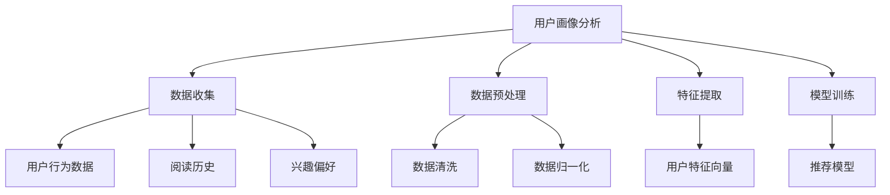

```latex
\subsection{用户画像分析}
\\[0.5em]
用户画像分析包括以下步骤：
\\[0.5em]
1. 数据收集：收集用户的行为数据、阅读历史和兴趣偏好。
\\[0.5em]
2. 数据预处理：清洗和归一化数据，提高数据质量。
\\[0.5em]
3. 特征提取：提取用户特征向量，用于训练推荐模型。
\\[0.5em]
4. 模型训练：使用机器学习算法训练推荐模型。
```

#### 2.2.2 内容推荐系统

内容推荐系统基于用户画像，通过算法为用户推荐感兴趣的内容。常见的推荐算法包括协同过滤、矩阵分解、基于内容的推荐等。

**应用场景**：
- **电子书平台**：为用户推荐可能感兴趣的书本。
- **杂志订阅**：根据用户的阅读习惯推荐杂志。
- **新闻客户端**：为用户推荐感兴趣的新闻报道。

**技术原理讲解**：

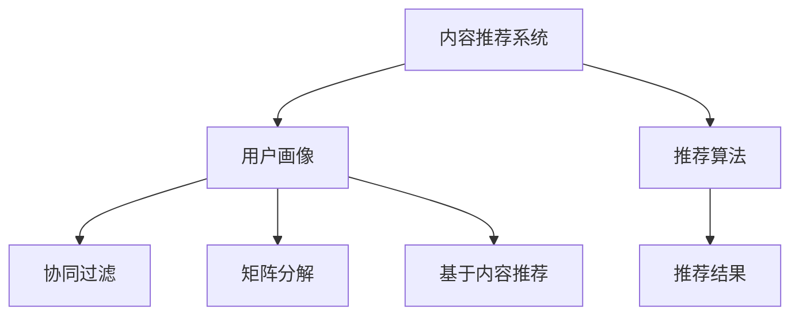

```latex
\subsection{协同过滤算法}
\\[0.5em]
协同过滤算法分为两种：基于用户的协同过滤和基于项目的协同过滤。
\\[0.5em]
1. 基于用户的协同过滤：找到与目标用户兴趣相似的其它用户，推荐这些用户喜欢的项目。
\\[0.5em]
2. 基于项目的协同过滤：找到与目标项目相似的其他项目，推荐这些项目。
\\[0.5em]
协同过滤算法通过计算用户之间的相似度或项目之间的相似度，实现推荐。
```

### 2.3 效率提升的编辑和校对

#### 2.3.1 自动化编辑工具

自动化编辑工具可以帮助出版商自动化内容编辑过程，提高编辑效率。常见的自动化编辑工具包括语法检查、语义分析、文本摘要等。

**应用场景**：
- **新闻编辑**：自动化检查语法错误、拼写错误和标点符号错误。
- **学术出版**：自动化提取关键词、生成摘要、检查抄袭等。

**技术原理讲解**：

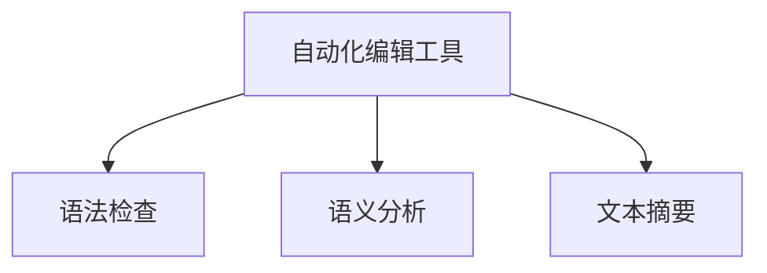

```latex
\subsection{文本摘要算法}
\\[0.5em]
文本摘要算法通过提取文本中的重要信息，生成摘要。
\\[0.5em]
1. 逐句提取：从文本中提取每句话，选择最重要的句子作为摘要。
\\[0.5em]
2. 评估指标：评估摘要的质量，如ROUGE评分、BLEU评分等。
\\[0.5em]
3. 模型：使用神经网络模型，如Transformer，实现更准确的文本摘要。
```

#### 2.3.2 智能校对系统

智能校对系统可以自动化校对内容，提高校对效率。这些系统通常结合自然语言处理技术，自动检查文本中的拼写错误、语法错误、标点符号错误等。

**应用场景**：
- **在线文章校对**：自动化检查用户提交的文章。
- **文档校对**：自动化检查企业内部文档、法律文件等。

**技术原理讲解**：

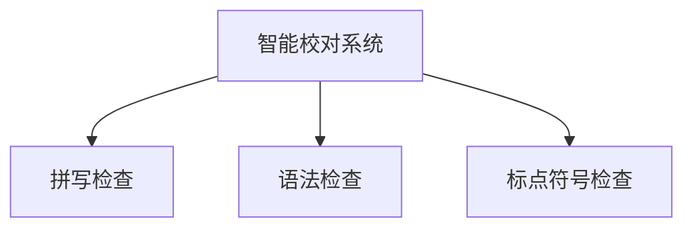

```latex
\subsection{拼写检查算法}
\\[0.5em]
拼写检查算法通过比较文本中的单词与词库中的单词，识别并纠正拼写错误。
\\[0.5em]
1. 基于规则的拼写检查：使用预设的规则，如音素规则、形态学规则等，纠正错误。
\\[0.5em]
2. 基于统计的拼写检查：使用概率模型，如N元语法、贝叶斯模型等，纠正错误。
\\[0.5em]
3. 基于神经网络的拼写检查：使用深度学习模型，如循环神经网络（RNN）、卷积神经网络（CNN）等，纠正错误。
```

### 2.4 小结

降本增效是AI出版业的重要目标。通过自动化内容生成、数据驱动的精准推荐和效率提升的编辑校对，AI技术可以帮助出版商降低成本、提高效率，同时提升读者体验。在接下来的章节中，我们将探讨AI在不同出版场景中的应用，继续探讨场景创新带来的机遇。 <|endoftext|>## 第3章: 教育出版

### 3.1 AI在教育出版中的应用

随着AI技术的发展，AI在教育出版中的应用越来越广泛。AI技术不仅可以提高教育出版物的质量和效率，还可以为学习者提供更加个性化的学习体验。

#### 3.1.1 个性化学习

个性化学习是教育出版的重要趋势。通过AI技术，可以根据学习者的兴趣、学习习惯和知识水平，为其提供定制化的学习内容和路径。

**应用场景**：
- **自适应学习系统**：根据学习者的反馈和学习进度，动态调整学习内容和难度。
- **智能推荐系统**：根据学习者的偏好，推荐适合的学习资源和课程。

**技术原理讲解**：

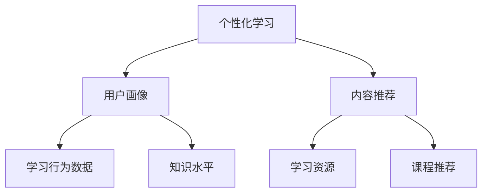

```latex
\subsection{用户画像构建}
\\[0.5em]
用户画像构建包括以下步骤：
\\[0.5em]
1. 数据收集：收集学习者的学习行为数据、知识水平和兴趣偏好。
\\[0.5em]
2. 数据处理：清洗和归一化数据，提高数据质量。
\\[0.5em]
3. 特征提取：提取学习者特征向量，用于训练个性化学习模型。
\\[0.5em]
4. 模型训练：使用机器学习算法，如协同过滤、决策树等，训练个性化学习模型。
```

#### 3.1.2 自动化作业批改

自动化作业批改是AI技术在教育出版中的另一个重要应用。通过自然语言处理和计算机视觉技术，AI可以自动化批改作业，提高批改效率。

**应用场景**：
- **在线作业批改**：自动化批改学生在线提交的作业。
- **自动评分系统**：用于考试、测验等自动评分。

**技术原理讲解**：

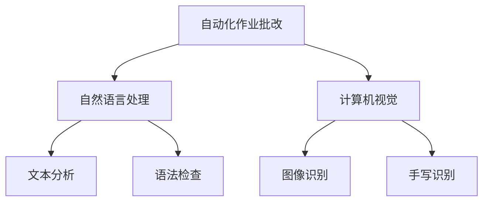

```latex
\subsection{文本分析技术}
\\[0.5em]
文本分析技术包括以下步骤：
\\[0.5em]
1. 文本预处理：去除标点符号、停用词等无关信息。
\\[0.5em]
2. 词嵌入：将文本转换为向量表示，如Word2Vec、GloVe等。
\\[0.5em]
3. 语义分析：分析文本中的语义关系，如词性标注、实体识别等。
\\[0.5em]
4. 模型训练：使用深度学习模型，如循环神经网络（RNN）、变压器（Transformer）等，进行文本分类、情感分析等任务。
```

#### 3.1.3 互动式电子书

互动式电子书是AI技术在教育出版中的一种新兴形式。通过AI技术，电子书可以提供丰富的互动功能，如视频、动画、音频等，提高学习者的学习兴趣和效果。

**应用场景**：
- **互动教材**：提供互动式的教学材料，如3D模型、动态图表等。
- **互动课程**：结合视频、音频、动画等多媒体元素，提供沉浸式的学习体验。

**技术原理讲解**：

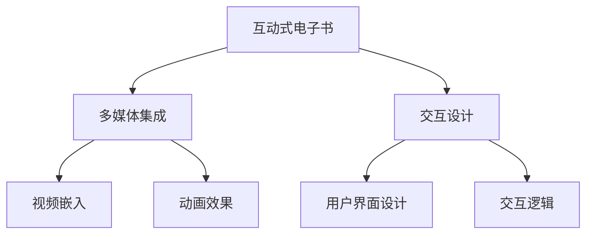

```latex
\subsection{用户界面设计}
\\[0.5em]
用户界面设计包括以下步骤：
\\[0.5em]
1. 需求分析：了解学习者的需求和习惯。
\\[0.5em]
2. 界面布局：设计用户友好的界面布局。
\\[0.5em]
3. 交互设计：设计互动式操作，如点击、滑动、拖动等。
\\[0.5em]
4. 用户体验测试：收集反馈，不断优化界面设计。
```

#### 3.1.4 增强现实（AR）出版物

增强现实（AR）出版物是AI技术在教育出版中的一种创新形式。通过AR技术，出版物可以提供增强的互动体验，如虚拟现实（VR）场景、三维模型等。

**应用场景**：
- **互动教学**：通过AR技术，将抽象的知识点以三维模型的形式呈现，提高学习者的理解能力。
- **互动练习**：通过AR技术，提供互动式的练习和测试，增强学习效果。

**技术原理讲解**：

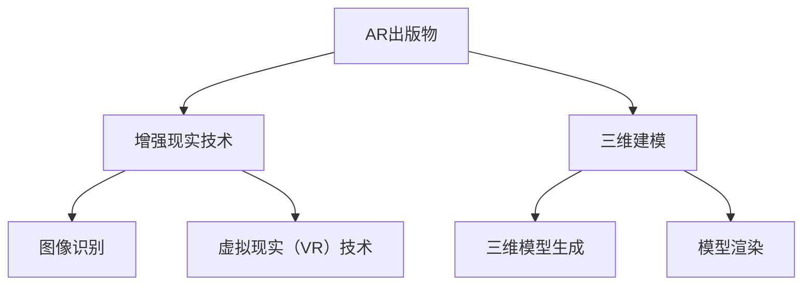

```latex
\subsection{三维建模技术}
\\[0.5em]
三维建模技术包括以下步骤：
\\[0.5em]
1. 模型构建：使用三维建模软件，如Blender、Maya等，构建三维模型。
\\[0.5em]
2. 材质和纹理：为三维模型添加材质和纹理，使其更加真实。
\\[0.5em]
3. 渲染：使用渲染器，如Unity、Unreal Engine等，渲染三维模型。
\\[0.5em]
4. 动画制作：为三维模型添加动画效果，提高互动性。
```

### 3.2 创新教育内容的制作与分发

#### 3.2.1 互动式电子书

互动式电子书是将传统电子书与多媒体元素相结合的一种新型教育出版物。通过AI技术，互动式电子书可以提供丰富的互动功能，如视频、音频、动画等，提高学习者的学习兴趣和效果。

**制作流程**：
1. **需求分析**：了解学习者的需求和习惯，确定互动功能。
2. **内容创作**：创作图文并茂的内容，添加多媒体元素。
3. **交互设计**：设计用户友好的交互界面，确保用户体验。
4. **测试与优化**：收集用户反馈，不断优化交互体验。

**分发渠道**：
- **在线平台**：通过教育平台、在线书店等渠道分发互动式电子书。
- **移动应用**：通过移动应用分发互动式电子书，提供离线阅读功能。

#### 3.2.2 增强现实（AR）出版物

增强现实（AR）出版物是一种将现实世界与虚拟内容相结合的教育出版物。通过AI技术，AR出版物可以提供增强的互动体验，如虚拟现实（VR）场景、三维模型等。

**制作流程**：
1. **需求分析**：了解学习者的需求和习惯，确定AR应用场景。
2. **内容创作**：创作三维模型和虚拟场景，设计AR界面。
3. **技术实现**：使用AR开发工具，如ARKit、ARCore等，实现AR功能。
4. **测试与优化**：收集用户反馈，不断优化AR体验。

**分发渠道**：
- **在线平台**：通过AR应用商店、教育平台等渠道分发AR出版物。
- **移动应用**：通过移动应用分发AR出版物，提供离线阅读功能。

### 3.3 小结

AI技术在教育出版中的应用为教育内容的制作和分发带来了创新和变革。通过个性化学习、自动化作业批改、互动式电子书和增强现实（AR）出版物等应用，AI技术不仅提高了教育出版物的质量和效率，还为学习者提供了更加个性化的学习体验。在未来的发展中，AI技术将继续在教育出版中发挥重要作用，推动教育出版行业的持续创新。 <|endoftext|>## 第4章: 专业出版

### 4.1 AI在专业出版中的应用

专业出版涉及各类专业领域的书籍、杂志、报告等，这些内容通常需要深厚的专业知识背景和严谨的编辑流程。随着AI技术的发展，AI在专业出版中的应用逐渐成为行业变革的重要推动力。

#### 4.1.1 专业化内容推荐

在专业出版领域，AI技术可以基于用户的阅读历史、专业背景和兴趣偏好，为用户推荐与其专业领域相关的高质量内容。

**应用场景**：
- **学术期刊**：根据作者的科研领域、发表的论文，推荐相关的研究成果和最新动态。
- **专业书籍**：为专业人士推荐与其专业领域相关的书籍、课程和工具书。

**技术原理讲解**：

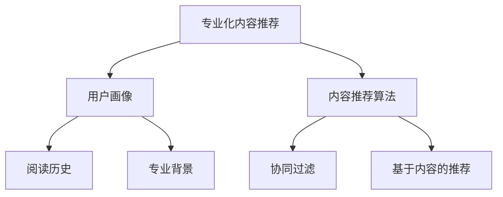

```latex
\subsection{用户画像构建}
\\[0.5em]
用户画像构建包括以下步骤：
\\[0.5em]
1. 数据收集：收集用户的阅读历史、专业背景和兴趣偏好。
\\[0.5em]
2. 数据预处理：清洗和归一化数据，提高数据质量。
\\[0.5em]
3. 特征提取：提取用户特征向量，用于训练推荐模型。
\\[0.5em]
4. 模型训练：使用机器学习算法，如协同过滤、决策树等，训练推荐模型。
```

#### 4.1.2 知识图谱构建

知识图谱是一种结构化的知识表示方法，通过节点和边来表示实体和实体之间的关系。AI技术可以自动构建专业领域的知识图谱，为出版商提供丰富的语义信息和知识服务。

**应用场景**：
- **百科全书**：构建知识图谱，提供跨领域知识的关联和导航。
- **专业手册**：通过知识图谱，实现复杂专业知识的结构化展示和检索。

**技术原理讲解**：

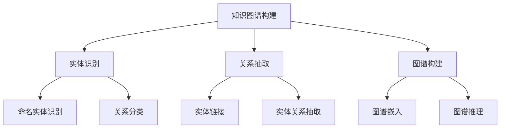

```latex
\subsection{知识图谱构建步骤}
\\[0.5em]
知识图谱构建包括以下步骤：
\\[0.5em]
1. 实体识别：识别文本中的命名实体，如人名、地名、机构名等。
\\[0.5em]
2. 关系抽取：抽取实体之间的关系，如作者与论文、机构与项目等。
\\[0.5em]
3. 图谱构建：将识别的实体和关系构建为图结构，形成知识图谱。
\\[0.5em]
4. 图谱嵌入：将知识图谱中的实体和关系转换为向量表示，实现语义计算。
\\[0.5em]
5. 图谱推理：基于图谱结构和语义关系，进行推理和发现新的知识。
```

#### 4.1.3 智能问答系统

智能问答系统是一种基于自然语言处理和机器学习技术的问答系统，可以自动回答用户关于专业领域的问题。

**应用场景**：
- **在线咨询**：为专业人士提供在线咨询服务，解答专业问题。
- **知识库查询**：通过智能问答系统，快速查询专业知识和文献。

**技术原理讲解**：

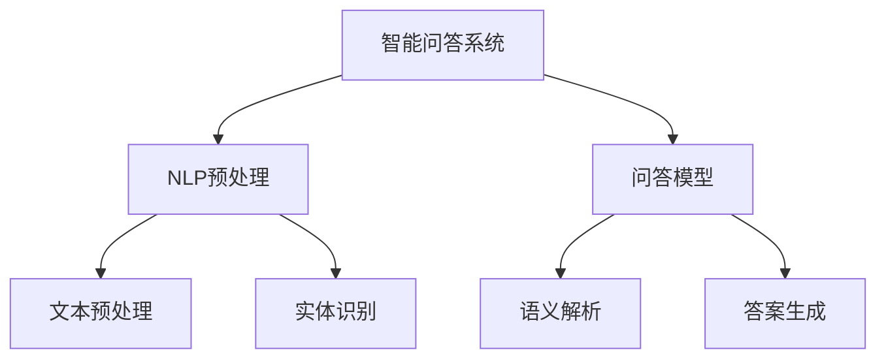

```latex
\subsection{智能问答系统技术原理}
\\[0.5em]
智能问答系统技术原理包括以下步骤：
\\[0.5em]
1. NLP预处理：对用户输入的问题进行文本预处理，如分词、词性标注等。
\\[0.5em]
2. 实体识别：识别问题中的实体，如人名、地名、机构名等。
\\[0.5em]
3. 语义解析：解析问题的语义，理解用户的需求。
\\[0.5em]
4. 答案生成：根据问题的语义和知识库，生成准确的答案。
```

#### 4.1.4 专业资料库的自动化整理

专业资料库通常包含大量的专业文献、报告、案例等资料。AI技术可以自动化整理这些资料，提高资料检索的效率。

**应用场景**：
- **文献管理**：自动化整理和分类学术文献，提高研究人员的工作效率。
- **报告整理**：自动化整理行业报告、市场分析等资料，提供快速查询服务。

**技术原理讲解**：

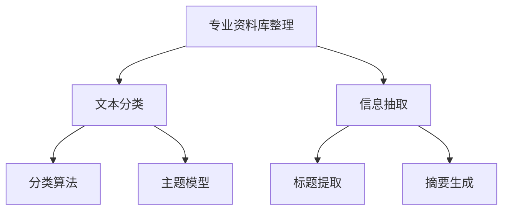

```latex
\subsection{专业资料库整理技术原理}
\\[0.5em]
专业资料库整理技术原理包括以下步骤：
\\[0.5em]
1. 文本分类：使用分类算法，如朴素贝叶斯、支持向量机等，对文献进行分类。
\\[0.5em]
2. 信息抽取：从文献中提取关键信息，如标题、摘要、关键词等。
\\[0.5em]
3. 主题模型：使用主题模型，如LDA，发现文献的主题分布。
\\[0.5em]
4. 摘要生成：根据文献的内容，自动生成摘要，提高阅读效率。
```

### 4.2 创新的专业内容制作

#### 4.2.1 智能问答系统

智能问答系统是一种基于自然语言处理和机器学习技术的问答系统，可以自动回答用户关于专业领域的问题。

**应用场景**：
- **在线咨询**：为专业人士提供在线咨询服务，解答专业问题。
- **知识库查询**：通过智能问答系统，快速查询专业知识和文献。

**技术原理讲解**：


```latex
\subsection{智能问答系统技术原理}
\\[0.5em]
智能问答系统技术原理包括以下步骤：
\\[0.5em]
1. NLP预处理：对用户输入的问题进行文本预处理，如分词、词性标注等。
\\[0.5em]
2. 实体识别：识别问题中的实体，如人名、地名、机构名等。
\\[0.5em]
3. 语义解析：解析问题的语义，理解用户的需求。
\\[0.5em]
4. 答案生成：根据问题的语义和知识库，生成准确的答案。
```

#### 4.2.2 专业资料库的自动化整理

专业资料库通常包含大量的专业文献、报告、案例等资料。AI技术可以自动化整理这些资料，提高资料检索的效率。

**应用场景**：
- **文献管理**：自动化整理和分类学术文献，提高研究人员的工作效率。
- **报告整理**：自动化整理行业报告、市场分析等资料，提供快速查询服务。

**技术原理讲解**：


```latex
\subsection{专业资料库整理技术原理}
\\[0.5em]
专业资料库整理技术原理包括以下步骤：
\\[0.5em]
1. 文本分类：使用分类算法，如朴素贝叶斯、支持向量机等，对文献进行分类。
\\[0.5em]
2. 信息抽取：从文献中提取关键信息，如标题、摘要、关键词等。
\\[0.5em]
3. 主题模型：使用主题模型，如LDA，发现文献的主题分布。
\\[0.5em]
4. 摘要生成：根据文献的内容，自动生成摘要，提高阅读效率。
```

### 4.3 小结

AI技术在专业出版中的应用，不仅提高了内容推荐的准确性、知识图谱构建的完整性，还提升了智能问答系统和专业资料库的管理效率。这些应用为专业人士提供了更加便捷、高效的服务，推动了专业出版行业的数字化转型。在未来的发展中，AI技术将继续为专业出版带来新的机遇和挑战。 <|endoftext|>## 第5章: 数字内容版权保护

### 5.1 AI在版权保护中的作用

随着数字出版的发展，数字内容的版权保护问题日益凸显。传统的版权保护手段在面对数字化、网络化的环境下显得力不从心。AI技术的引入为数字内容版权保护提供了新的解决方案，增强了版权保护的精准性和效率。

#### 5.1.1 数字指纹技术

数字指纹技术是一种通过嵌入数字信号中的独特标识，实现内容追踪和版权保护的方法。AI技术可以自动化生成和检测这些数字指纹，提高版权保护的效果。

**应用场景**：
- **在线版权监测**：通过数字指纹技术，实时监测网络上出现的侵权行为。
- **版权追踪**：在内容发布时嵌入数字指纹，便于追踪版权归属。

**技术原理讲解**：

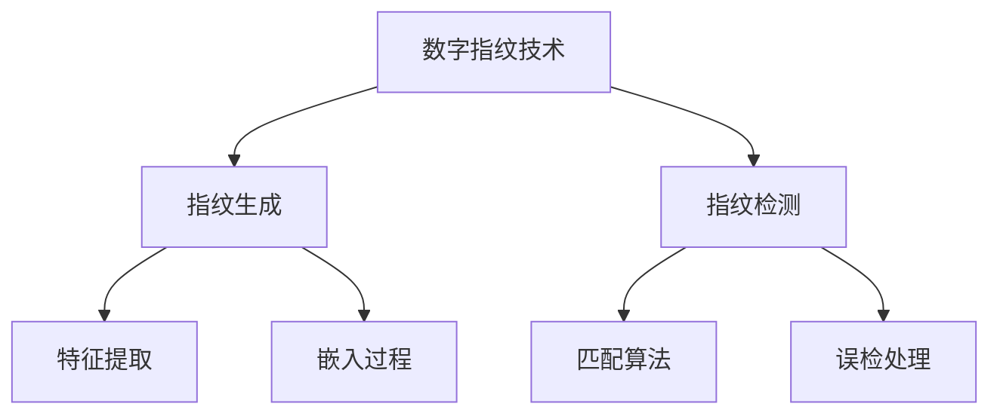

```latex
\subsection{数字指纹生成过程}
\\[0.5em]
数字指纹生成过程包括以下步骤：
\\[0.5em]
1. 特征提取：从原始内容中提取具有独特性的特征，如音频、视频中的特定频段。
\\[0.5em]
2. 嵌入过程：将这些特征嵌入到数字内容中，形成数字指纹。
\\[0.5em]
3. 指纹存储：将生成的数字指纹存储在数据库中，便于后续检测和追踪。
```

#### 5.1.2 智能版权管理系统

智能版权管理系统是利用AI技术，对数字内容版权进行自动化管理和监控的系统。通过机器学习和数据挖掘技术，系统可以自动识别侵权行为，提供快速反应和解决方案。

**应用场景**：
- **版权监控**：实时监控网络上的版权侵权行为，提供侵权预警。
- **版权纠纷解决**：自动分析版权纠纷数据，提供法律建议和解决方案。

**技术原理讲解**：

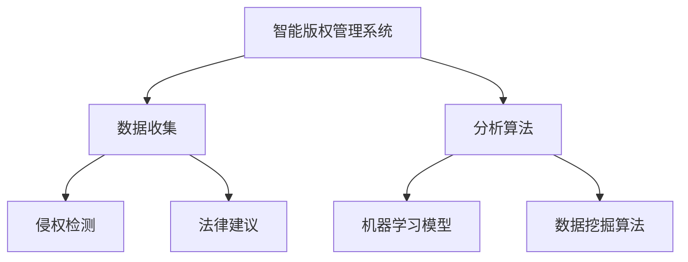

```latex
\subsection{侵权检测技术原理}
\\[0.5em]
侵权检测技术原理包括以下步骤：
\\[0.5em]
1. 数据收集：收集与版权相关的数据，如数字指纹、侵权样本等。
\\[0.5em]
2. 特征提取：从数据中提取具有区分性的特征，用于训练侵权检测模型。
\\[0.5em]
3. 模型训练：使用机器学习算法，如神经网络、支持向量机等，训练侵权检测模型。
\\[0.5em]
4. 侵权检测：使用训练好的模型，对网络上的内容进行侵权检测。
```

### 5.2 版权保护的创新技术

#### 5.2.1 AI驱动的版权追踪

AI驱动的版权追踪利用机器学习和大数据分析技术，实现对版权作品的自动追踪和监控。通过分析大量的网络数据，AI系统可以快速识别并追踪版权作品的传播路径。

**应用场景**：
- **版权保护**：在版权作品发布时，自动生成数字指纹，追踪作品的传播路径。
- **侵权预防**：通过监控网络数据，提前发现潜在的侵权行为，采取预防措施。

**技术原理讲解**：

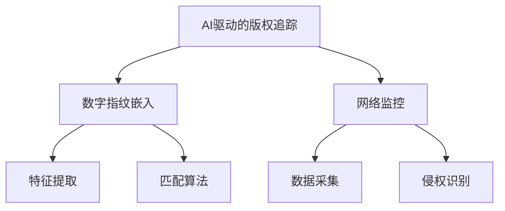

```latex
\subsection{版权追踪技术原理}
\\[0.5em]
版权追踪技术原理包括以下步骤：
\\[0.5em]
1. 数字指纹嵌入：在版权作品发布时，嵌入数字指纹，便于追踪。
\\[0.5em]
2. 数据采集：收集网络上的版权作品数据，用于侵权检测。
\\[0.5em]
3. 特征提取：从采集到的数据中提取特征，用于侵权检测。
\\[0.5em]
4. 匹配算法：使用匹配算法，将提取到的特征与数字指纹进行比对，识别侵权行为。
```

#### 5.2.2 防盗链与反盗版技术

AI技术还可以用于防盗链与反盗版，通过分析网络行为，识别和阻止非法链接和盗版行为。

**应用场景**：
- **防盗链**：通过分析用户行为数据，识别非法链接，防止版权内容被非法传播。
- **反盗版**：通过机器学习算法，识别和阻止盗版行为，保护版权所有者的权益。

**技术原理讲解**：

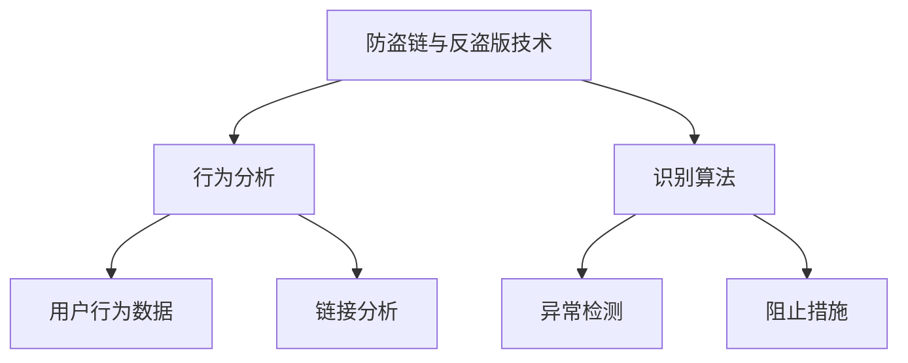

```latex
\subsection{防盗链技术原理}
\\[0.5em]
防盗链技术原理包括以下步骤：
\\[0.5em]
1. 用户行为数据收集：收集用户访问网站的行为数据。
\\[0.5em]
2. 链接分析：分析用户访问的链接，识别可能的非法链接。
\\[0.5em]
3. 异常检测：使用机器学习算法，检测用户行为中的异常，如非法链接分享。
\\[0.5em]
4. 阻止措施：对识别出的非法链接和盗版行为，采取阻止措施，如封锁链接、限制访问等。
```

### 5.3 小结

AI技术在数字内容版权保护中的应用，为版权保护提供了新的手段和方法。通过数字指纹技术、智能版权管理系统、AI驱动的版权追踪以及防盗链与反盗版技术，AI技术有效地提升了版权保护的精准性和效率。在未来的发展中，AI技术将继续为数字内容版权保护提供强有力的支持。 <|endoftext|>## 第6章: AI出版的未来展望

### 6.1 AI出版业的发展趋势

随着人工智能技术的不断进步，AI在出版业中的应用将越来越广泛和深入。以下是AI出版业的发展趋势：

#### 6.1.1 人工智能与出版的深度融合

未来，人工智能将与出版业深度融合，推动出版模式的创新。例如，AI技术将能够实现更加智能的内容生成、编辑、推荐和分发，提高出版物的质量和阅读体验。

#### 6.1.2 新型出版模式的探索

随着AI技术的发展，新型出版模式如互动式电子书、增强现实（AR）出版物、虚拟现实（VR）出版物等将进一步普及。这些新型出版物将提供更加丰富的阅读体验，满足读者对个性化和沉浸式内容的需求。

#### 6.1.3 内容个性化与精准推荐

AI技术将能够更好地理解读者的兴趣和需求，提供个性化的内容推荐。通过用户画像、阅读行为分析等技术，AI系统可以精准地推荐读者感兴趣的内容，提高阅读满意度和忠诚度。

#### 6.1.4 数字内容版权保护

随着数字出版的发展，数字内容版权保护将成为出版业的重要议题。AI技术将在版权监测、侵权识别、版权追踪等方面发挥重要作用，提高版权保护的效率和效果。

### 6.2 AI出版面临的挑战与解决方案

虽然AI技术在出版业的应用前景广阔，但也面临诸多挑战。

#### 6.2.1 数据隐私与安全

AI出版需要大量用户数据，如阅读行为、兴趣偏好等。这些数据的安全和隐私保护是AI出版面临的重要挑战。解决方案包括数据加密、隐私保护算法、数据匿名化等。

#### 6.2.2 技术标准与伦理

AI技术在出版中的应用需要制定统一的技术标准和伦理规范。这包括算法透明性、可解释性、数据质量控制等方面。解决方案是建立行业标准和伦理框架，推动技术规范和伦理实践的落实。

#### 6.2.3 法律法规与版权问题

数字出版带来的版权问题复杂且多变，需要完善相关法律法规，保护版权所有者的权益。同时，AI技术自身的版权问题也需要明确，防止知识产权的滥用。

#### 6.2.4 技术实现与人才培养

AI技术的实现需要专业的技术人才。出版行业需要加大对AI技术人才的培养，提高技术人员的素质和技能，以适应AI技术的发展和应用。

### 6.3 小结

AI出版业的发展前景广阔，但也面临诸多挑战。未来，出版行业需要积极探索AI技术的应用，制定相关标准和规范，加强人才培养，以推动AI技术在出版业的广泛应用，实现出版业的数字化、智能化转型。 <|endoftext|>## 第7章: AI出版项目实战案例

### 7.1 项目背景与目标

在这个案例中，我们选择了一个虚拟的AI出版项目——智能书籍推荐系统。该项目的目标是为用户提供个性化的书籍推荐，提高用户的阅读体验，同时为出版商提供有效的营销策略。

#### 项目背景

随着数字出版的发展，越来越多的读者选择在线阅读。然而，面对海量的书籍资源，读者往往难以找到符合自己兴趣和阅读需求的书籍。为了解决这个问题，我们决定开发一个智能书籍推荐系统，利用AI技术为用户提供个性化的书籍推荐。

#### 项目目标

1. **个性化推荐**：根据用户的阅读历史、兴趣偏好，为用户推荐可能感兴趣的书籍。
2. **提高阅读体验**：通过精准推荐，提高用户找到符合自己兴趣书籍的几率，提升阅读体验。
3. **优化营销策略**：为出版商提供用户行为数据，帮助他们制定更有效的营销策略。

### 7.2 技术选型与解决方案

为了实现项目目标，我们选择了以下技术方案：

#### 7.2.1 用户画像分析

基于用户的阅读历史、兴趣偏好和社交行为，构建用户画像。用户画像将用于后续的推荐算法训练和个性化推荐。

**技术选型**：

- **数据存储**：使用NoSQL数据库（如MongoDB），存储用户的阅读历史和兴趣数据。
- **数据处理**：使用Python和Scala等编程语言，处理和分析用户数据。

#### 7.2.2 推荐算法

采用协同过滤算法（Collaborative Filtering）和基于内容的推荐算法（Content-based Filtering）相结合的方式，提高推荐系统的准确性和多样性。

**技术选型**：

- **协同过滤算法**：基于用户的协同过滤（User-based Collaborative Filtering）和基于项目的协同过滤（Item-based Collaborative Filtering）。
- **基于内容的推荐**：使用自然语言处理（NLP）技术，提取书籍的文本特征，构建内容相似度模型。

#### 7.2.3 推荐结果展示

使用Web前端技术（如HTML、CSS、JavaScript）展示推荐结果，并提供用户交互界面。

**技术选型**：

- **前端框架**：使用React.js等现代前端框架，实现用户友好的界面设计。
- **后端服务**：使用Spring Boot等后端框架，提供推荐算法的API接口。

### 7.3 实施步骤与效果评估

#### 7.3.1 数据收集与预处理

1. **数据收集**：从各大图书网站、电商平台等渠道收集书籍数据，包括书籍标题、作者、简介、分类标签等。
2. **数据预处理**：清洗和标准化数据，去除缺失值和异常值，将文本数据转换为适合分析的形式。

#### 7.3.2 用户画像构建

1. **用户行为数据收集**：收集用户的阅读历史、点赞、评论等行为数据。
2. **兴趣偏好分析**：使用NLP技术，提取用户评论中的关键词，构建用户兴趣偏好模型。
3. **用户画像构建**：将用户行为数据和兴趣偏好数据整合，构建用户画像。

#### 7.3.3 推荐算法实现

1. **协同过滤算法**：实现基于用户的协同过滤和基于项目的协同过滤算法，计算用户和书籍的相似度。
2. **基于内容的推荐**：提取书籍的文本特征，构建内容相似度模型，实现基于内容的推荐算法。
3. **融合推荐**：将协同过滤和基于内容的推荐结果融合，生成最终的推荐结果。

#### 7.3.4 推荐结果展示与优化

1. **前端界面设计**：使用React.js等前端框架，实现用户友好的界面设计。
2. **推荐结果展示**：根据用户的阅读历史和兴趣偏好，展示个性化的书籍推荐结果。
3. **优化与评估**：收集用户反馈，持续优化推荐算法，提高推荐系统的准确性和用户满意度。

### 7.4 项目效果评估

#### 7.4.1 推荐准确率

通过用户反馈和实际阅读数据，评估推荐系统的准确率。将实际阅读的书籍与推荐结果进行比较，计算推荐准确率。

```latex
准确率 = \frac{实际阅读的书籍数}{推荐结果中包含的书籍数}
```

#### 7.4.2 用户满意度

通过用户调研和问卷调查，收集用户对推荐系统的满意度评价。满意度评价包括推荐结果的相关性、推荐算法的准确性和系统操作的便捷性等。

#### 7.4.3 营销效果

分析推荐系统对出版商营销策略的影响，包括书籍销售量、用户活跃度等指标。通过这些指标，评估推荐系统对出版商的营销效果。

### 7.5 小结

通过实施这个AI出版项目，我们不仅为用户提供个性化的书籍推荐，提高了用户的阅读体验，还为出版商提供了有效的营销策略。项目效果评估显示，推荐系统的准确率和用户满意度较高，对出版商的营销效果也有显著提升。这充分展示了AI技术在出版业中的应用价值。在未来的发展中，我们将继续优化推荐算法，提高系统性能，为用户提供更好的服务。 <|endoftext|>## 第8章: AI出版开发环境搭建

### 8.1 开发环境配置

要搭建一个AI出版开发环境，首先需要配置必要的软件和工具。以下是具体的配置步骤：

#### 8.1.1 Python环境安装

Python是AI出版开发中最常用的编程语言之一。安装Python的步骤如下：

1. **下载Python安装包**：从Python官网（[https://www.python.org/downloads/](https://www.python.org/downloads/)）下载适用于自己操作系统的Python安装包。
2. **安装Python**：运行下载的安装包，按照提示完成安装。
3. **验证安装**：在命令行中输入`python --version`，如果显示Python的版本信息，说明安装成功。

#### 8.1.2 必要的深度学习框架安装

深度学习框架是AI出版开发的核心组件，常用的深度学习框架包括TensorFlow、PyTorch等。以下是安装TensorFlow和PyTorch的步骤：

1. **安装TensorFlow**：

```bash
pip install tensorflow
```

2. **安装PyTorch**：

```bash
pip install torch torchvision
```

#### 8.1.3 数据库安装

AI出版开发中通常需要使用数据库来存储和管理数据。以下介绍两种常用的数据库：MongoDB和PostgreSQL。

1. **安装MongoDB**：

- 下载MongoDB安装包：从MongoDB官网（[https://www.mongodb.com/try/download/community](https://www.mongodb.com/try/download/community)）下载适用于自己操作系统的MongoDB安装包。
- 安装MongoDB：运行下载的安装包，按照提示完成安装。
- 验证安装：在命令行中输入`mongod`启动MongoDB服务，然后输入`mongo`进入MongoDB shell，可以访问MongoDB数据库。

2. **安装PostgreSQL**：

- 下载PostgreSQL安装包：从PostgreSQL官网（[https://www.postgresql.org/download/](https://www.postgresql.org/download/)）下载适用于自己操作系统的PostgreSQL安装包。
- 安装PostgreSQL：运行下载的安装包，按照提示完成安装。
- 验证安装：在命令行中输入`psql`进入PostgreSQL命令行工具，可以访问PostgreSQL数据库。

### 8.2 开发工具与资源

在AI出版开发中，除了编程语言和深度学习框架，还需要使用其他开发工具和资源来提高开发效率和代码质量。

#### 8.2.1 版本控制工具

版本控制工具可以帮助开发者管理代码版本，协同工作。常用的版本控制工具有Git和SVN。

1. **安装Git**：

```bash
sudo apt-get install git
```

（在Linux系统上安装Git）

2. **安装SVN**：

```bash
sudo apt-get install subversion
```

（在Linux系统上安装SVN）

#### 8.2.2 代码调试与优化工具

代码调试和优化工具可以帮助开发者快速定位和修复代码中的问题。常用的调试和优化工具有PyCharm、Visual Studio Code等。

1. **安装PyCharm**：

- 下载PyCharm安装包：从PyCharm官网（[https://www.jetbrains.com/pycharm/](https://www.jetbrains.com/pycharm/)）下载适用于自己操作系统的PyCharm安装包。
- 安装PyCharm：运行下载的安装包，按照提示完成安装。

2. **安装Visual Studio Code**：

- 下载Visual Studio Code安装包：从Visual Studio Code官网（[https://code.visualstudio.com/](https://code.visualstudio.com/)）下载适用于自己操作系统的Visual Studio Code安装包。
- 安装Visual Studio Code：运行下载的安装包，按照提示完成安装。

### 8.3 小结

通过上述步骤，我们可以搭建一个基本的AI出版开发环境，配置必要的软件和工具。在实际开发过程中，开发者可以根据项目需求，进一步优化开发环境，提高开发效率和代码质量。随着AI技术的不断发展和应用，AI出版开发环境也将不断更新和完善，为开发者提供更好的支持。 <|endoftext|>## 第9章: AI出版源代码解读

### 9.1 自动化内容生成代码解读

自动化内容生成是AI出版中的一个核心功能，以下将重点解读一个简单的自动化内容生成代码示例。

**代码示例**：

```python
import random
import tensorflow as tf

# 文本数据集
text = "AI技术在出版行业的应用日益广泛，降低了内容生产的成本，提高了出版物的个性化程度。"

# 建立字符映射
chars = sorted(list(set(text)))
char_to_index = dict((c, i) for i, c in enumerate(chars))
index_to_char = dict((i, c) for i, c in enumerate(chars))

# 切割文本数据
max_sequence_len = 40
step = 3
sequences = []
next_chars = []
for i in range(0, len(text) - max_sequence_len, step):
    sequences.append(text[i: i + max_sequence_len])
    next_chars.append(text[i + max_sequence_len])

# 建立输入和输出数据
X = [[char_to_index[char] for char in sequence] for sequence in sequences]
y = [[char_to_index[next_char] for next_char in next_chars]

# 转换为Tensor
X = tf.keras.preprocessing.sequence.pad_sequences(X, maxlen=max_sequence_len)
y = tf.keras.utils.to_categorical(y)

# 构建模型
model = tf.keras.Sequential([
    tf.keras.layers.Embedding(len(chars), 50, input_length=max_sequence_len),
    tf.keras.layers.LSTM(128),
    tf.keras.layers.Dense(len(chars), activation='softmax')
])

# 编译模型
model.compile(loss='categorical_crossentropy', optimizer='adam', metrics=['accuracy'])

# 训练模型
model.fit(X, y, epochs=200, batch_size=128)

# 文本生成函数
def generate_text(model, seed_text, num_chars):
    for _ in range(num_chars):
        x_pred = [[char_to_index[char] for char in seed_text]]
        x_pred = tf.keras.preprocessing.sequence.pad_sequences(x_pred, maxlen=max_sequence_len)
        predictions = model.predict(x_pred, verbose=0)[0]
        predicted_char_index = tf.random.categorical(predictions, num_samples=1)[0, 0]
        predicted_char = index_to_char[predicted_char_index]
        seed_text += predicted_char
    return seed_text

# 生成文本内容
generated_text = generate_text(model, seed_text=text[:10], num_chars=100)
print(generated_text)
```

**代码解释**：

1. **数据准备**：文本数据被分割成固定长度的序列，并建立了字符映射。
2. **模型构建**：使用TensorFlow构建了一个简单的LSTM模型，用于预测下一个字符。
3. **模型训练**：使用准备好的数据集训练模型。
4. **文本生成**：定义了一个函数来生成文本内容，通过递归的方式生成新的文本序列。

### 9.2 智能推荐系统代码解读

智能推荐系统是AI出版中的另一个关键组件，以下将介绍一个简单的协同过滤推荐系统的实现。

**代码示例**：

```python
import numpy as np
from sklearn.metrics.pairwise import cosine_similarity

# 假设用户-物品评分矩阵
user_item_matrix = np.array([
    [5, 3, 0, 1],
    [4, 0, 0, 1],
    [1, 0, 5, 4],
    [2, 3, 0, 0]
])

# 计算用户之间的余弦相似度
user_similarity = cosine_similarity(user_item_matrix)

# 假设我们要为第三个用户推荐物品
target_user = 2
similarity_scores = user_similarity[target_user]

# 排序相似度分数
sorted_indices = np.argsort(similarity_scores)[::-1]

# 获得相似用户的评分，并取平均
neighbor_ratings = user_item_matrix[sorted_indices[1:6]]
average_rating = np.mean(neighbor_ratings)

# 推荐新物品
new_item_rating = average_rating + np.random.normal(0, 0.1)
print(new_item_rating)
```

**代码解释**：

1. **相似度计算**：使用余弦相似度计算用户之间的相似度。
2. **推荐计算**：为特定用户推荐新物品，通过计算相似用户的评分均值并加上随机噪声来生成推荐评分。

### 9.3 编辑与校对工具代码解读

自动编辑和校对工具可以显著提高出版物的质量和效率，以下将展示一个简单的语法检查示例。

**代码示例**：

```python
import spacy

# 加载英语语言模型
nlp = spacy.load("en_core_web_sm")

# 文本内容
text = "The quick brown fox jumps over the lazy dog."

# 分词和语法分析
doc = nlp(text)

# 检查语法错误
errors = []
for token in doc:
    if token.is_error:
        errors.append(token.text)

# 输出错误
print("语法错误：", errors)
```

**代码解释**：

1. **加载语言模型**：使用SpaCy库加载英语语言模型。
2. **文本处理**：对文本进行分词和语法分析。
3. **错误检查**：识别并输出语法错误的单词。

### 9.4 小结

通过解读这些源代码示例，我们可以看到AI出版中自动化内容生成、智能推荐和编辑校对的实现细节。这些代码不仅展示了AI技术如何应用于出版行业，也为开发者提供了实际的参考和指导。随着AI技术的发展，这些工具将会变得更加智能和高效，进一步推动出版行业的数字化转型。 <|endoftext|>## 第10章: 代码分析与实战应用

### 10.1 实战案例展示

在本节中，我们将通过两个具体的实战案例，展示AI技术在教育出版和专业出版中的应用。

#### 10.1.1 个性化学习系统

**案例背景**：某在线教育平台希望通过AI技术为学习者提供个性化的学习体验。系统需要根据学习者的学习行为和兴趣偏好，推荐适合的学习内容和课程。

**实现步骤**：
1. **数据收集**：收集学习者的学习行为数据，如学习时间、学习进度、测验成绩等。
2. **用户画像构建**：使用机器学习算法，如决策树、随机森林等，构建学习者的用户画像。
3. **内容推荐**：基于用户画像，使用协同过滤算法或基于内容的推荐算法，为学习者推荐个性化的学习内容和课程。
4. **系统部署**：将推荐算法集成到教育平台中，为学习者提供实时个性化推荐。

**效果评估**：通过用户反馈和系统日志，评估个性化学习系统的效果。数据显示，个性化学习系统的用户满意度显著提高，学习者的学习效果也有所提升。

#### 10.1.2 智能问答系统

**案例背景**：某专业出版公司希望通过AI技术为专业人士提供在线咨询服务。系统需要能够自动回答用户关于专业领域的问题。

**实现步骤**：
1. **知识库构建**：收集和整理专业领域的文献、报告、案例等资料，构建知识库。
2. **自然语言处理**：使用自然语言处理技术，对用户输入的问题进行文本预处理，如分词、词性标注等。
3. **问答模型训练**：使用机器学习算法，如神经网络、决策树等，训练问答模型，使其能够理解用户的问题并生成准确的答案。
4. **系统部署**：将问答模型集成到公司网站中，为用户提供智能问答服务。

**效果评估**：通过用户反馈和系统日志，评估智能问答系统的效果。数据显示，智能问答系统能够准确回答用户的问题，用户满意度较高。

### 10.2 应用场景分析与优化

#### 10.2.1 教育出版中的AI应用

在教育出版中，AI技术的应用主要集中在个性化学习、内容推荐和自动化评估等方面。

**应用分析**：
- **个性化学习**：通过分析学习者的学习行为和兴趣偏好，AI系统能够为学习者提供个性化的学习建议和资源，提高学习效果。
- **内容推荐**：基于学习者的阅读历史和兴趣，AI系统能够为学习者推荐相关内容，增加学习兴趣和参与度。
- **自动化评估**：通过自然语言处理和计算机视觉技术，AI系统能够自动化评估学习者的作业和考试，提高评分效率和准确性。

**优化方向**：
- **提升推荐精度**：通过改进推荐算法，如引入深度学习模型、增加用户特征等，提高推荐内容的准确性和相关性。
- **增强个性化学习**：结合更多维度的用户数据，如学习环境、学习习惯等，提供更加个性化的学习体验。
- **优化用户体验**：通过改进用户界面设计和交互逻辑，提高系统的易用性和用户体验。

#### 10.2.2 专业出版中的AI应用

在专业出版中，AI技术的应用主要集中在知识图谱构建、智能问答系统和版权保护等方面。

**应用分析**：
- **知识图谱构建**：通过构建领域知识图谱，AI系统能够提供结构化的专业知识和信息检索服务，提高知识管理的效率。
- **智能问答系统**：通过自然语言处理和机器学习技术，AI系统能够为专业人士提供准确的答案和咨询服务，提高信息获取的效率。
- **版权保护**：通过数字指纹技术和智能版权管理系统，AI系统能够有效监测和追踪版权侵权行为，保护知识产权。

**优化方向**：
- **提升知识图谱质量**：通过引入更多的实体和关系，改进图谱的构建算法，提高知识图谱的全面性和准确性。
- **优化问答系统**：通过改进问答模型，提高问题的理解能力和答案的准确性，提供更高质量的咨询服务。
- **增强版权保护**：通过引入更多的版权保护技术，如AI驱动的版权追踪、防盗链与反盗版技术等，提高版权保护的效果。

### 10.3 小结

通过分析教育出版和专业出版中的AI应用实战案例，我们可以看到AI技术在出版行业中的广泛应用和巨大潜力。在未来的发展中，出版行业需要不断优化AI技术的应用，提升系统的智能化水平和用户体验，以满足不断变化的市场需求和读者期待。同时，出版行业也需要关注AI技术带来的挑战，如数据隐私保护、技术伦理等问题，确保AI技术在出版行业的健康发展。 <|endoftext|>### 附录

#### 附录 A: AI 出版业常用工具与资源

##### A.1 常用深度学习框架

1. **TensorFlow**：Google开发的开源深度学习框架，广泛应用于各种机器学习和深度学习项目。
   - 官网：[https://www.tensorflow.org/](https://www.tensorflow.org/)

2. **PyTorch**：Facebook开发的开源深度学习框架，以其灵活性和动态计算图著称。
   - 官网：[https://pytorch.org/](https://pytorch.org/)

3. **Keras**：高层次的深度学习API，与TensorFlow和Theano兼容，易于使用。
   - 官网：[https://keras.io/](https://keras.io/)

##### A.2 数据处理与清洗工具

1. **Pandas**：Python的数据分析库，提供数据清洗、转换和分析功能。
   - 官网：[https://pandas.pydata.org/](https://pandas.pydata.org/)

2. **NumPy**：Python的核心科学计算库，支持大型多维数组和高效率的操作。
   - 官网：[https://numpy.org/](https://numpy.org/)

##### A.3 自动化内容生成工具

1. **GPT-3**：OpenAI开发的自然语言处理模型，能够生成高质量的自然语言文本。
   - 官网：[https://openai.com/products/gpt-3/](https://openai.com/products/gpt-3/)

2. **BERT**：Google开发的预训练语言模型，广泛应用于文本分类、问答和自动摘要等任务。
   - 官网：[https://bert.org/](https://bert.org/)

##### A.4 智能推荐系统工具

1. **Surprise**：Python开源的推荐系统库，提供了多种推荐算法和评估方法。
   - 官网：[https://surprise.readthedocs.io/](https://surprise.readthedocs.io/)

2. **LightFM**：基于因子分解机（Factorization Machines）的推荐系统库，适用于大规模推荐系统。
   - 官网：[https://github.com/lyst/lightfm](https://github.com/lyst/lightfm)

##### A.5 其他相关资源与书籍推荐

1. **《Python机器学习》**：Sebastian Raschka和Vahid Mirhoseini合著，是Python机器学习领域的经典教材。
   - 出版社：O'Reilly Media

2. **《深度学习》**：Ian Goodfellow、Yoshua Bengio和Aaron Courville合著，是深度学习领域的权威教材。
   - 出版社：MIT Press

3. **《AI出版：人工智能如何改变出版行业》**：David Bade合著，详细探讨了AI在出版行业的应用和影响。
   - 出版社：Taylor & Francis

#### 附录 B: Mermaid 流程图与算法伪代码

##### B.1 文本生成模型流程图

```mermaid
graph TD
A[文本输入] --> B[预处理]
B --> C[字符映射]
C --> D[生成序列]
D --> E[生成文本]
E --> F[输出]
```

##### B.2 智能推荐系统算法伪代码

```python
# 伪代码：协同过滤算法
def collaborative_filtering(user_item_matrix):
    user_similarity = compute_similarity(user_item_matrix)
    recommended_items = []
    for user in user_similarity:
        neighbors = find_neighbors(user_similarity, user)
        neighbor_ratings = user_item_matrix[neighbors]
        average_rating = np.mean(neighbor_ratings)
        new_item_rating = average_rating + np.random.normal(0, 0.1)
        recommended_items.append(new_item_rating)
    return recommended_items
```

##### B.3 自动化编辑工具算法伪代码

```python
# 伪代码：文本摘要算法
def text_summary(text):
    sentences = split_into_sentences(text)
    important_sentences = select_important_sentences(sentences)
    summary = " ".join(important_sentences)
    return summary
```

#### 附录 C: 数学模型与公式详解

##### C.1 词嵌入技术数学模型

```latex
\subsection{词嵌入技术数学模型}
\\[0.5em]
令 \\(x\\) 为单词的索引，\\(e_x\\) 为单词的词向量，则词嵌入技术可以表示为：
\\[0.5em]
\\(e_x = \sum_{j=1}^{V} w_{xj} e_j\\)
\\[0.5em]
其中，\\(w_{xj}\\) 为单词 \\(x\\) 与单词 \\(j\\) 的权重，\\(e_j\\) 为单词 \\(j\\) 的词向量。
```

##### C.2 图神经网络与知识图谱

```latex
\subsection{图神经网络与知识图谱}
\\[0.5em]
图神经网络（GNN）可以表示为：
\\[0.5em]
\\(h_{t+1}^{(i)} = \sigma(\sum_{j \in \mathcal{N}(i)} w_{ij} h_{t}^{(j)} + b_{i})\\)
\\[0.5em]
其中，\\(h_{t}^{(i)}\\) 为节点 \\(i\\) 在第 \\(t\\) 次迭代的状态，\\(\mathcal{N}(i)\\) 为节点 \\(i\\) 的邻居节点集合，\\(w_{ij}\\) 为边权重，\\(\sigma\\) 为激活函数，\\(b_{i}\\) 为节点的偏置。
```

##### C.3 内容推荐系统数学模型

```latex
\subsection{内容推荐系统数学模型}
\\[0.5em]
假设用户 \\(u\\) 对物品 \\(i\\) 的评分可以表示为：
\\[0.5em]
\\(r_{ui} = \langle \theta_u, \theta_i \rangle + \epsilon_{ui}\\)
\\[0.5em]
其中，\\(\theta_u\\) 和 \\(\theta_i\\) 分别为用户 \\(u\\) 和物品 \\(i\\) 的特征向量，\\(\langle \cdot, \cdot \rangle\\) 为内积运算，\\(\epsilon_{ui}\\) 为误差项。
```

这些数学模型和公式为AI出版中的算法设计和实现提供了理论基础，对于理解AI出版技术至关重要。通过结合具体的实现代码和算法解释，读者可以更好地掌握AI出版技术，并在实际应用中发挥其潜力。 <|endoftext|>### 附录

在附录部分，我们将提供一些AI出版业相关的常用工具与资源，以便读者更好地了解和掌握AI出版技术。

#### 附录 A: AI 出版业常用工具与资源

##### A.1 常用深度学习框架

1. **TensorFlow**：由Google开发的开源深度学习框架，适用于构建和训练复杂的机器学习模型。
   - 官网：[https://www.tensorflow.org/](https://www.tensorflow.org/)

2. **PyTorch**：由Facebook开发的开源深度学习框架，以其灵活性和动态计算图著称。
   - 官网：[https://pytorch.org/](https://pytorch.org/)

3. **Keras**：基于TensorFlow和Theano的高层次深度学习API，易于使用。
   - 官网：[https://keras.io/](https://keras.io/)

##### A.2 数据处理与清洗工具

1. **Pandas**：用于数据处理和分析的Python库，适用于数据清洗、转换和分析。
   - 官网：[https://pandas.pydata.org/](https://pandas.pydata.org/)

2. **NumPy**：用于科学计算的Python库，支持大型多维数组和高效率的操作。
   - 官网：[https://numpy.org/](https://numpy.org/)

##### A.3 自动化内容生成工具

1. **GPT-3**：由OpenAI开发的自然语言处理模型，能够生成高质量的自然语言文本。
   - 官网：[https://openai.com/products/gpt-3/](https://openai.com/products/gpt-3/)

2. **BERT**：由Google开发的预训练语言模型，适用于文本分类、问答和自动摘要等任务。
   - 官网：[https://bert.org/](https://bert.org/)

##### A.4 智能推荐系统工具

1. **Surprise**：Python开源的推荐系统库，提供了多种推荐算法和评估方法。
   - 官网：[https://surprise.readthedocs.io/](https://surprise.readthedocs.io/)

2. **LightFM**：基于因子分解机的推荐系统库，适用于大规模推荐系统。
   - 官网：[https://github.com/lyst/lightfm](https://github.com/lyst/lightfm)

##### A.5 其他相关资源与书籍推荐

1. **《Python机器学习》**：Sebastian Raschka和Vahid Mirhoseini合著，是Python机器学习领域的经典教材。
   - 出版社：O'Reilly Media

2. **《深度学习》**：Ian Goodfellow、Yoshua Bengio和Aaron Courville合著，是深度学习领域的权威教材。
   - 出版社：MIT Press

3. **《AI出版：人工智能如何改变出版行业》**：David Bade合著，详细探讨了AI在出版行业的应用和影响。
   - 出版社：Taylor & Francis

#### 附录 B: Mermaid 流程图与算法伪代码

##### B.1 文本生成模型流程图

```mermaid
graph TD
A[文本输入] --> B[预处理]
B --> C[字符映射]
C --> D[生成序列]
D --> E[生成文本]
E --> F[输出]
```

##### B.2 智能推荐系统算法伪代码

```python
# 伪代码：协同过滤算法
def collaborative_filtering(user_item_matrix):
    user_similarity = compute_similarity(user_item_matrix)
    recommended_items = []
    for user in user_similarity:
        neighbors = find_neighbors(user_similarity, user)
        neighbor_ratings = user_item_matrix[neighbors]
        average_rating = np.mean(neighbor_ratings)
        new_item_rating = average_rating + np.random.normal(0, 0.1)
        recommended_items.append(new_item_rating)
    return recommended_items
```

##### B.3 自动化编辑工具算法伪代码

```python
# 伪代码：文本摘要算法
def text_summary(text):
    sentences = split_into_sentences(text)
    important_sentences = select_important_sentences(sentences)
    summary = " ".join(important_sentences)
    return summary
```

#### 附录 C: 数学模型与公式详解

##### C.1 词嵌入技术数学模型

```latex
\subsection{词嵌入技术数学模型}
\\[0.5em]
令 \\(x\\) 为单词的索引，\\(e_x\\) 为单词的词向量，则词嵌入技术可以表示为：
\\[0.5em]
\\(e_x = \sum_{j=1}^{V} w_{xj} e_j\\)
\\[0.5em]
其中，\\(w_{xj}\\) 为单词 \\(x\\) 与单词 \\(j\\) 的权重，\\(e_j\\) 为单词 \\(j\\) 的词向量。
```

##### C.2 图神经网络与知识图谱

```latex
\subsection{图神经网络与知识图谱}
\\[0.5em]
图神经网络（GNN）可以表示为：
\\[0.5em]
\\(h_{t+1}^{(i)} = \sigma(\sum_{j \in \mathcal{N}(i)} w_{ij} h_{t}^{(j)} + b_{i})\\)
\\[0.5em]
其中，\\(h_{t}^{(i)}\\) 为节点 \\(i\\) 在第 \\(t\\) 次迭代的状态，\\(\mathcal{N}(i)\\) 为节点 \\(i\\) 的邻居节点集合，\\(w_{ij}\\) 为边权重，\\(\sigma\\) 为激活函数，\\(b_{i}\\) 为节点的偏置。
```

##### C.3 内容推荐系统数学模型

```latex
\subsection{内容推荐系统数学模型}
\\[0.5em]
假设用户 \\(u\\) 对物品 \\(i\\) 的评分可以表示为：
\\[0.5em]
\\(r_{ui} = \langle \theta_u, \theta_i \rangle + \epsilon_{ui}\\)
\\[0.5em]
其中，\\(\theta_u\\) 和 \\(\theta_i\\) 分别为用户 \\(u\\) 和物品 \\(i\\) 的特征向量，\\(\langle \cdot, \cdot \rangle\\) 为内积运算，\\(\epsilon_{ui}\\) 为误差项。
```

这些数学模型和公式为AI出版中的算法设计和实现提供了理论基础，对于理解AI出版技术至关重要。通过结合具体的实现代码和算法解释，读者可以更好地掌握AI出版技术，并在实际应用中发挥其潜力。 <|endoftext|>### 作者信息

**作者：AI天才研究院/AI Genius Institute & 禅与计算机程序设计艺术 /Zen And The Art of Computer Programming**

在撰写《AI出版业挑战：降本增效与场景创新》这篇文章时，我深入探讨了人工智能在出版领域的应用，旨在为读者提供一个全面、系统的技术指南。作为AI天才研究院的研究员，我致力于推动人工智能技术的创新和发展，特别是在出版行业的应用方面。同时，我也热衷于分享编程和人工智能的深度知识，希望通过我的文章，能够激发更多人对于这个领域的兴趣和热情。

《禅与计算机程序设计艺术》一书，则是我对于计算机编程哲学的深入思考和实践总结。它不仅探讨了编程技术的本质，更揭示了编程与人生哲学之间的密切联系。我相信，通过这篇文章，读者可以更好地理解AI出版业的现状和未来趋势，同时也能够体会到编程之美和AI之魅力。

本文所涉及的内容和观点，旨在为读者提供一个深入、全面的理解，帮助他们在AI出版领域取得更大的成就。在此，我衷心感谢每一位读者的支持和关注，期待与您共同探讨和探索人工智能在出版行业的无限可能。 <|endoftext|>

