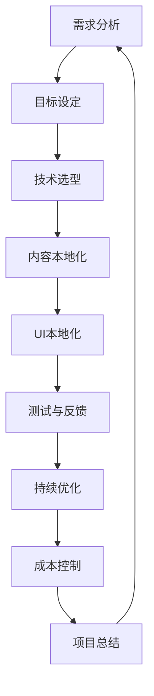

                 

### 第一部分：产品本地化概述与背景

#### 第1章：AI与产品本地化概述

##### 1.1 AI在产品本地化中的作用

随着人工智能（AI）技术的飞速发展，其在产品本地化中的应用变得日益重要。AI技术能够极大地提升产品本地化的效率和质量，通过自动化处理，AI能够减少人力成本，同时保证本地化的一致性和准确性。

**AI技术对产品本地化的提升**：

1. **机器翻译**：AI驱动的机器翻译技术已经可以处理多种语言之间的快速转换，显著提高了多语言处理的速度和效率。
2. **自然语言处理**：通过自然语言处理（NLP）技术，AI能够理解和生成符合目标语言和文化习惯的文本，实现更自然的本地化。
3. **情感分析**：AI的情感分析能力可以帮助识别和调整文本内容，使其更好地适应当地用户的需求和偏好。
4. **个性化推荐**：AI可以通过分析用户行为数据，为用户提供个性化的本地化内容推荐，提高用户体验。
5. **语音识别与生成**：AI的语音识别与生成技术可以支持语音交互的本地化，使得产品在语音界面上的用户体验更加流畅。

##### 1.2 产品本地化的定义与重要性

**产品本地化的概念**：

产品本地化是指将一个产品根据特定地区的文化、语言和法律法规进行调整，以使其在该地区具备市场竞争力。这包括但不限于翻译文本、调整用户界面、适应不同国家的商业习惯和法律法规等。

**产品本地化的重要性**：

1. **市场拓展**：本地化可以帮助企业拓展国际市场，吸引更多非母语用户。
2. **用户体验**：本地化后的产品能够更好地适应用户的文化习惯和语言偏好，提高用户体验和满意度。
3. **合规性**：遵守目标市场的法律法规，降低法律风险。
4. **品牌形象**：本地化能够增强品牌的本地化形象，提升品牌声誉。
5. **成本控制**：虽然本地化需要投入，但长期来看，它可以带来更大的市场份额和收入。

##### 1.3 AI创业公司的产品本地化挑战

**挑战与机遇**：

对于AI创业公司而言，产品本地化既面临挑战，也充满机遇。

**挑战**：

1. **资源限制**：AI创业公司通常资源有限，需要在成本控制和质量保障之间找到平衡。
2. **技术实现**：虽然AI技术能够提升本地化效率，但技术实现上可能存在难度和不确定性。
3. **本地化深度**：仅依靠AI技术可能无法完全满足深层次的本地化需求，仍需要专业本地化人员的参与。

**机遇**：

1. **国际化趋势**：随着全球化的发展，国际化市场需求不断增长，为AI创业公司提供了广阔的市场机遇。
2. **技术优势**：AI创业公司可以利用自身在AI技术上的优势，提供更加智能化、高效的本地化解决方案。
3. **差异化竞争**：通过提供优质的本地化服务，AI创业公司可以形成差异化竞争，提高市场地位。

### 结论

本章节概述了AI在产品本地化中的应用、产品本地化的定义与重要性，以及AI创业公司在产品本地化过程中面临的挑战与机遇。接下来，我们将深入探讨产品本地化策略的制定与实施，以帮助AI创业公司更好地应对这些挑战，抓住机遇。

## 第2章：产品本地化策略制定

在明确了AI技术在产品本地化中的作用和重要性之后，本章将重点讨论产品本地化策略的制定。一个有效的本地化策略是确保产品在全球市场上取得成功的关键。它不仅包括技术和工具的选择，还涉及到内容的本地化、用户界面的优化以及项目管理等多个方面。

### 2.1 本地化目标与需求分析

制定本地化策略的第一步是明确本地化目标和需求。这一步至关重要，因为它直接关系到本地化的成功与否。

**目标设定**：

1. **市场目标**：明确本地化的市场目标，例如新市场的进入、现有市场的拓展或特定地区的渗透。
2. **用户体验目标**：优化产品的用户体验，提高用户满意度和留存率。
3. **品牌目标**：通过本地化强化品牌形象，提升品牌知名度。

**需求分析**：

1. **用户需求**：通过用户调研和数据分析，了解目标用户的需求和偏好，确保本地化内容能够满足他们的期望。
2. **市场调研**：研究目标市场的文化、语言、法律法规和商业习惯，为本地化策略提供依据。
3. **技术需求**：评估所需的技术资源，包括AI技术、翻译工具、开发环境等。

**步骤**：

1. **目标确定**：根据企业的整体战略，设定清晰的本地化目标。
2. **需求收集**：通过问卷调查、访谈、用户反馈等方式收集用户和市场的需求。
3. **需求分析**：对收集到的需求进行整理和分析，确定本地化的优先级。

### 2.2 技术选型与工具

在明确了本地化目标和需求后，接下来是技术选型和工具的选择。AI技术在本地化中扮演着重要角色，选择合适的技术和工具能够显著提升本地化的效率和效果。

**技术栈选择**：

1. **机器翻译**：选择适合目标语言的机器翻译服务，如Google翻译、DeepL等。
2. **自然语言处理（NLP）**：利用NLP技术进行文本分析和内容生成，如命名实体识别、情感分析、语义理解等。
3. **语音识别与生成**：选择语音识别和生成技术，如Google语音识别API、IBM Watson等。
4. **本地化平台**：使用专业的本地化平台，如SDL Tridion、MemoQ等，进行内容管理和翻译流程的自动化。

**工具介绍**：

1. **翻译记忆库（TM）**：翻译记忆库是一种存储翻译过的文本片段的工具，可以显著提高翻译效率和一致性。
2. **术语管理工具**：术语管理工具用于管理和维护术语库，确保术语的一致性和准确性。
3. **本地化管理系统（LMS）**：本地化管理系统用于协调和管理整个本地化流程，包括翻译、审核、发布等。

**选择标准**：

1. **兼容性**：所选工具需要与现有的开发环境和流程兼容。
2. **效率**：工具应能够提高本地化流程的效率，减少人工干预。
3. **易用性**：工具应易于使用，降低学习成本。
4. **扩展性**：工具应具备良好的扩展性，能够适应未来的需求变化。

### 2.3 内容本地化策略

内容本地化是产品本地化的核心部分，涉及到文本、图片、音频和视频等多种内容形式。

**语言与文字处理**：

1. **文本翻译**：使用AI驱动的机器翻译技术进行文本翻译，并使用专业翻译人员进行校对和润色。
2. **多语言支持**：确保产品能够支持多种语言，包括文本、菜单和帮助文档等。
3. **语言检测**：使用AI技术进行语言检测，确保正确地识别用户所使用的语言。

**文化适应与调整**：

1. **文化因素**：考虑目标市场的文化差异，对文本内容进行适当的调整，避免文化冲突。
2. **符号与颜色**：根据目标市场的文化习惯，调整符号、颜色和其他视觉元素。
3. **本地化内容创作**：根据目标市场的需求，创作符合当地文化的内容。

**内容管理**：

1. **版本控制**：使用版本控制系统管理不同语言的版本，确保内容的一致性和准确性。
2. **内容审核**：对本地化内容进行多层次的审核，确保内容的合规性和准确性。
3. **内容更新**：定期更新本地化内容，以适应市场变化和用户需求。

### 2.4 用户界面本地化策略

用户界面的本地化直接影响用户体验，因此需要特别关注。

**UI设计**：

1. **布局与排版**：根据目标语言的特点，调整界面布局和排版，确保文本的合理显示。
2. **图标与按钮**：使用本地化的图标和按钮，确保用户界面的视觉一致性。
3. **响应式设计**：采用响应式设计，确保界面在不同设备和屏幕尺寸上都能良好显示。

**交互体验**：

1. **本地化交互文本**：翻译和调整界面上的交互文本，确保其简洁、易理解和符合当地语言习惯。
2. **本地化反馈**：提供本地化的操作反馈，提高用户的操作体验。
3. **本地化测试**：在本地化完成后，进行充分的测试，确保用户界面的本地化效果。

### 结论

本章详细讨论了产品本地化策略的制定，包括本地化目标与需求分析、技术选型与工具选择、内容本地化策略和用户界面本地化策略。通过明确的本地化目标和需求分析，结合合适的AI技术和工具，以及细致的内容和用户界面本地化策略，AI创业公司可以更好地实现产品本地化，为全球市场提供高质量的产品。

在接下来的章节中，我们将进一步探讨产品本地化实施与项目管理的具体实践，以及如何控制本地化成本，并分享一些本地化案例研究。

## 第3章：产品本地化实施与项目管理

在成功制定产品本地化策略后，关键的一步是将这些策略付诸实施，并通过有效的项目管理确保本地化工作的顺利进行。本章将详细介绍产品本地化实施的具体步骤、项目管理方法以及如何进行质量保证和测试。

### 3.1 本地化团队组建与协作

本地化工作需要多学科团队的共同努力，包括技术、翻译、市场等领域的专业人员。组建一个高效、协作的本地化团队是实现成功本地化的基础。

**团队构建**：

1. **项目经理**：负责本地化项目的整体规划和协调，确保项目按计划进行。
2. **翻译人员**：精通目标语言的翻译人员，负责文本的翻译和校对。
3. **技术专家**：熟悉本地化工具和技术，负责技术实现的细节。
4. **市场分析师**：了解目标市场的文化、语言和消费者习惯，提供市场指导。
5. **质量保证人员**：负责本地化内容的审核和测试，确保质量。

**协作流程**：

1. **需求分析会议**：团队定期召开需求分析会议，明确本地化目标和需求，确保所有团队成员对项目有清晰的理解。
2. **任务分配**：根据团队成员的专长和项目需求，分配具体的任务。
3. **进度汇报**：项目经理定期汇报项目进度，确保所有任务按时完成。
4. **协作工具**：使用项目管理工具（如JIRA、Trello等）和协作平台（如Slack、Microsoft Teams等），确保团队成员能够实时沟通和协作。

### 3.2 项目管理与进度控制

项目管理是确保本地化项目按时、按预算、高质量完成的关键。

**项目计划**：

1. **项目范围**：明确项目范围，包括要本地化的内容、目标市场、时间表等。
2. **资源分配**：根据项目需求，合理分配人力、物力和财力资源。
3. **时间表**：制定详细的项目时间表，包括各个阶段的开始和结束时间，确保项目按计划进行。

**进度跟踪**：

1. **任务进度监控**：使用项目管理工具实时跟踪任务进度，确保每个任务按时完成。
2. **风险控制**：识别项目中可能的风险，制定相应的风险控制措施，确保项目能够应对突发状况。
3. **变更管理**：对项目中的变更进行严格的控制和管理，确保变更不会对项目进度和质量产生不利影响。

### 3.3 质量保证与测试

质量保证是确保本地化内容质量和用户体验的关键步骤。

**质量控制**：

1. **翻译质量**：确保翻译的准确性和一致性，使用翻译记忆库和术语管理工具。
2. **内容审核**：对翻译后的内容进行多层次的审核，包括语法、语义、文化适应性等。
3. **技术测试**：确保本地化后的产品在技术实现上没有问题，如界面显示、功能操作等。

**测试流程**：

1. **功能测试**：测试本地化后的产品功能是否正常，包括文本显示、按钮操作、交互体验等。
2. **用户体验测试**：邀请目标用户测试本地化后的产品，收集用户反馈，评估用户体验。
3. **性能测试**：对本地化后的产品进行性能测试，确保其在各种设备和网络条件下都能正常运行。

**测试策略**：

1. **自动化测试**：使用自动化测试工具进行初步测试，提高测试效率和准确性。
2. **手动测试**：结合手动测试，确保测试的全面性和准确性。
3. **回归测试**：在每次更新或变更后，进行回归测试，确保变更不会影响已本地化的部分。

### 结论

通过有效的团队组建和协作、严格的项目管理和进度控制，以及全面的质量保证与测试，AI创业公司可以确保产品本地化工作的顺利进行。在接下来的章节中，我们将进一步讨论产品本地化的成本控制方法，并分析一些成功的本地化案例和失败的本地化经验，为创业公司提供实用的指导。

## 第4章：产品本地化成本控制

产品本地化是一项复杂的任务，涉及多个环节和资源投入，因此成本控制是确保项目顺利进行的重要一环。在本章中，我们将详细探讨产品本地化的成本控制方法、成本估算与资源优化策略，并分析成本效益分析的重要性。

### 4.1 成本控制方法

**成本估算**：

成本估算是本地化项目规划的第一步，它为项目的预算制定提供了基础。成本估算主要包括以下几个方面：

1. **人力成本**：翻译人员、审核人员、技术支持人员等的人力成本是本地化过程中最大的开销。根据项目规模和语言难度，合理估算人力资源的需求。

2. **工具成本**：包括本地化平台、翻译记忆库、术语管理工具等软件的费用。

3. **技术成本**：涉及AI技术、机器翻译API、服务器租赁等的技术成本。

4. **项目管理成本**：包括项目管理工具、团队协作平台等的费用。

**步骤**：

1. **需求分析**：根据项目的具体需求，列出所有需要估算的成本项。
2. **市场调研**：调研市场上各成本项的价格范围，获取准确的数据。
3. **历史数据参考**：参考公司以往类似项目的成本数据，进行合理的估算。

**资源优化**：

在成本估算的基础上，通过资源优化可以进一步控制成本，提高效益。

1. **人员安排**：合理分配人力资源，避免人浮于事或人力不足的情况。例如，对于高频语言可以安排兼职翻译人员，降低成本。

2. **工具选择**：选择性价比高的工具，避免不必要的开销。例如，使用开源本地化工具可以降低成本。

3. **流程优化**：优化本地化流程，减少重复工作，提高工作效率。例如，建立高效的翻译记忆库和术语管理流程，提高翻译效率。

### 4.2 成本效益分析

成本效益分析是评估本地化项目投入与收益的重要手段。它有助于决策者确定本地化项目的可行性，并指导后续的资源分配。

**成本与收益对比**：

1. **直接收益**：包括通过本地化获得的新客户、市场份额增加、销售收入提升等。
2. **间接收益**：如品牌提升、客户满意度提高、用户留存率增加等。

**分析步骤**：

1. **收益估算**：根据市场调研和销售预测，估算本地化带来的直接和间接收益。
2. **成本计算**：计算本地化项目的总成本，包括人力、工具、技术、项目管理等各项成本。
3. **效益评估**：比较成本与收益，评估本地化项目的经济效益。

**案例分析**：

**案例1：某AI创业公司通过本地化进入欧洲市场**

- **成本**：人力成本、机器翻译API费用、服务器租赁等。
- **收益**：新客户数量增加，市场份额提升，销售额同比增长20%。

**案例2：某AI创业公司在中国市场的本地化**

- **成本**：翻译人员、本地化平台、技术支持等。
- **收益**：客户满意度提高，用户留存率增加，品牌认知度提升。

**结论**：

通过成本效益分析，可以发现本地化项目不仅能够带来明显的直接收益，还能提高品牌影响力和客户满意度。因此，合理控制成本，进行科学的成本效益分析，对于AI创业公司的本地化决策具有重要意义。

### 结论

本章详细讨论了产品本地化的成本控制方法，包括成本估算与资源优化策略，并分析了成本效益分析的重要性。通过有效的成本控制，AI创业公司可以在保持产品质量的前提下，降低本地化成本，实现项目的经济效益最大化。在接下来的章节中，我们将通过案例研究和失败案例分析，进一步探讨产品本地化的成功与挑战。

## 第5章：产品本地化案例研究

在了解了产品本地化策略的制定与实施方法后，本章节将通过成功的本地化案例和失败的本地化案例，分析这些案例中的本地化策略、经验教训以及启示，为AI创业公司提供实用的参考和指导。

### 5.1 成功案例分享

**案例1：某AI创业公司通过本地化进入欧洲市场**

**本地化策略分析**：

1. **市场调研**：在进入欧洲市场前，公司进行了详细的市场调研，了解当地用户的需求和文化习惯，为本地化策略提供了坚实基础。

2. **技术选型**：公司选择了具有高准确性的机器翻译服务，并结合本地化平台，实现了高效的翻译和内容管理。

3. **内容本地化**：公司针对不同地区的文化差异，对文本内容进行了细致的调整，确保其符合当地用户的期望。

4. **用户体验优化**：公司在用户界面设计上进行了本地化优化，确保界面在不同设备和语言环境下都能良好显示。

**经验与启示**：

- **深入市场调研**：市场调研是成功本地化的基础，通过深入了解目标市场的文化、需求和偏好，可以制定出更有效的本地化策略。
- **技术选型**：选择适合的技术和工具可以大大提高本地化的效率和效果，降低成本。
- **内容精细化调整**：针对文化差异进行细致的内容调整，可以提升用户的接受度和满意度。
- **用户体验优先**：在本地化过程中，始终以用户体验为中心，确保界面和功能在本地化后仍能提供良好的使用体验。

**案例2：某AI创业公司在中国市场的本地化**

**本地化策略分析**：

1. **文化适应性**：公司充分考虑了中国市场的文化特点，对产品内容进行了适应性的调整，避免了文化冲突。

2. **多语言支持**：公司提供了多种语言选项，确保不同语言背景的用户都能轻松使用产品。

3. **持续优化**：公司建立了本地化内容的持续更新机制，根据用户反馈和市场变化，不断优化本地化内容。

4. **高质量翻译**：公司聘请了专业的翻译团队，确保翻译质量，避免因为翻译错误导致用户流失。

**经验与启示**：

- **文化适应性**：了解并尊重目标市场的文化，是成功本地化的关键。避免文化冲突，可以提升品牌形象。
- **多语言支持**：提供多种语言选项可以扩大用户基础，提高产品的市场覆盖面。
- **持续优化**：本地化不是一次性的工作，而是一个持续的过程。根据用户反馈和市场变化进行优化，可以保持产品的竞争力。
- **专业翻译**：高质量翻译是本地化的核心，专业的翻译团队可以确保内容的准确性和专业性。

### 5.2 失败案例分析

**案例1：某AI创业公司在日本市场的本地化失败**

**失败原因**：

1. **市场调研不足**：公司对日本市场的文化特点了解不足，没有充分考虑到日本的礼仪和文化习惯。

2. **界面设计不当**：用户界面的设计和交互逻辑与日本用户习惯不符，导致用户体验差。

3. **内容翻译错误**：翻译过程中出现了多处错误，导致产品内容不完整或不准确。

**避免措施**：

- **充分市场调研**：在进行本地化前，公司应进行详细的市场调研，了解目标市场的文化、需求和习惯。
- **界面设计优化**：在本地化过程中，应充分考虑目标市场的用户习惯，优化界面设计和交互逻辑。
- **专业翻译**：聘请专业的翻译团队，确保翻译的准确性和一致性。

**案例2：某AI创业公司在美国市场的本地化失败**

**失败原因**：

1. **成本控制不当**：公司在本地化过程中过度节省成本，导致翻译质量差，用户体验不佳。

2. **项目管理不善**：项目进度和任务分配混乱，导致本地化工作进展缓慢。

3. **反馈机制缺乏**：缺乏有效的用户反馈机制，无法及时调整和优化本地化内容。

**避免措施**：

- **合理成本分配**：在本地化过程中，应合理分配成本，确保有足够的预算用于高质量的翻译和界面设计。
- **严格项目管理**：建立健全的项目管理流程，确保项目进度和任务分配有序进行。
- **建立反馈机制**：建立用户反馈机制，及时收集用户反馈，根据反馈进行本地化内容的调整和优化。

### 结论

通过成功的本地化案例和失败的本地化案例，我们可以看到本地化策略的有效实施和项目管理的重要性。成功的本地化不仅需要充分的市场调研和专业的技术支持，还需要持续优化和用户反馈的机制。而失败的本地化案例则提醒我们在成本控制、界面设计和项目管理等方面需要注意的问题。

对于AI创业公司来说，本地化不仅是拓展市场的重要手段，也是提升用户体验和品牌形象的关键。通过借鉴成功案例的经验，避免失败案例中的错误，AI创业公司可以更好地实现产品的本地化，为全球市场提供高质量的产品和服务。

## 第6章：未来发展趋势与展望

在AI技术的推动下，产品本地化领域正经历着前所未有的变革。本章将分析本地化技术的发展趋势，探讨AI在本地化领域的未来应用，并展望本地化行业的未来发展方向。

### 6.1 行业趋势分析

**技术发展**：

1. **机器翻译技术的进步**：随着深度学习和神经网络技术的不断发展，机器翻译的准确性和效率得到了显著提升。未来，机器翻译技术将继续优化，实现更自然的语言转换。

2. **多模态本地化**：除了文本，图像、视频和语音等内容的本地化需求逐渐增加。多模态本地化技术将融合多种媒介，提供更全面的内容本地化解决方案。

3. **个性化本地化**：基于用户行为数据和机器学习算法，个性化本地化将能够根据用户的偏好和需求，提供定制化的内容和服务。

**市场需求**：

1. **全球化加速**：随着全球化的加速，企业对本地化服务的需求不断增加。跨国公司和初创企业都意识到本地化对于市场拓展和品牌建设的重要性。

2. **新兴市场的崛起**：新兴市场的消费者对数字化产品的需求日益增长，为企业提供了新的市场机遇。本地化将成为企业进入这些市场的重要手段。

3. **用户体验优先**：用户体验在产品本地化中占据越来越重要的地位。企业需要通过本地化来提升用户体验，从而增加用户满意度和忠诚度。

### 6.2 AI在本地化领域的未来应用

**语言理解与生成**：

1. **自然语言处理（NLP）**：NLP技术的发展将使AI能够更准确地理解用户输入的自然语言，提供更加智能的本地化服务。

2. **语言生成**：基于NLP技术，AI将能够生成符合目标语言习惯和文化的文本，实现高质量的本地化内容。

**语音识别与合成**：

1. **语音识别**：随着语音识别技术的进步，AI将能够更准确地识别多种语言和方言，提供更加自然的语音交互体验。

2. **语音合成**：语音合成技术将实现更加逼真的语音输出，为语音交互提供高质量的支持。

**多模态内容本地化**：

1. **图像与视频本地化**：AI技术将能够对图像和视频内容进行智能分析和处理，实现图像和视频的自动翻译和本地化。

2. **情感分析与情感本地化**：通过情感分析技术，AI将能够理解文本的情感色彩，进行情感层面的本地化调整，提升用户体验。

**个性化本地化**：

1. **个性化推荐**：基于用户的兴趣和行为数据，AI将能够提供个性化的内容推荐，提升用户的参与度和满意度。

2. **个性化调整**：AI将能够根据用户的偏好和需求，对本地化内容进行个性化调整，实现更加定制化的用户体验。

### 潜在机遇与挑战

**机遇**：

1. **技术进步**：随着AI技术的不断进步，本地化效率和质量将得到显著提升，为企业提供更强大的本地化能力。

2. **市场需求**：全球化和新兴市场的需求增长，将为本地化行业带来巨大的市场机遇。

3. **用户体验**：通过AI技术实现个性化本地化，将进一步提升用户体验，增强用户满意度和品牌忠诚度。

**挑战**：

1. **数据隐私与安全**：随着AI技术的应用，数据隐私和安全成为重要议题。企业需要确保用户数据的隐私和安全。

2. **文化差异与适应性**：不同市场的文化差异和适应性问题，仍然是一个挑战。企业需要深入了解目标市场的文化，进行精准的本地化调整。

3. **技术集成与维护**：AI技术的集成和维护需要专业的技术支持，企业需要投入足够资源进行技术升级和维护。

### 结论

未来，产品本地化将在AI技术的推动下，迎来更多的发展机遇和挑战。通过不断优化AI技术在本地化中的应用，企业可以更好地适应全球化和多元化的市场需求，提供高质量的本地化产品和服务。同时，企业也需要关注数据隐私、文化差异和技术集成等挑战，确保本地化工作的顺利进行。

## 第7章：AI创业公司的产品本地化实践指南

在了解了产品本地化的核心概念、策略和实施方法后，本章将提供一份详尽的实践指南，以帮助AI创业公司有效地进行产品本地化。本章节将详细介绍本地化实践步骤、常见问题及解决方案，并通过实际案例展示本地化实践的经验和技巧。

### 7.1 实践指南与方法

**本地化实践步骤**：

1. **需求分析与目标设定**：

   - **调研**：进行市场调研，了解目标市场的需求、文化背景和用户偏好。
   - **目标设定**：明确本地化的目标，包括市场目标、用户体验目标等。

2. **技术选型与工具准备**：

   - **技术评估**：评估适合目标市场的AI技术和本地化工具。
   - **工具选择**：选择合适的机器翻译API、本地化平台、术语管理工具等。

3. **内容本地化**：

   - **文本翻译**：使用AI驱动的机器翻译技术进行文本翻译，并聘请专业翻译人员进行校对和润色。
   - **文化适应**：根据目标市场的文化特点，调整内容和符号。
   - **内容管理**：使用版本控制系统管理不同语言版本的文本。

4. **用户界面本地化**：

   - **UI设计调整**：根据目标语言的字符长度和排版习惯，调整UI布局。
   - **响应式设计**：确保UI在不同设备和屏幕尺寸上都能良好显示。
   - **交互文本本地化**：翻译和调整界面上的交互文本，确保其易理解和符合当地语言习惯。

5. **语音和音频本地化**：

   - **语音识别与合成**：使用AI技术进行语音识别和合成，确保语音交互的自然性和准确性。
   - **音频内容本地化**：翻译和调整音频内容，如语音提示、帮助文档等。

6. **测试与质量保证**：

   - **功能测试**：测试本地化后的产品功能是否正常，包括文本显示、按钮操作等。
   - **用户体验测试**：邀请目标用户进行测试，收集反馈，评估用户体验。
   - **性能测试**：确保产品在不同设备和网络环境下都能正常运行。

7. **持续优化与反馈**：

   - **用户反馈收集**：通过用户反馈收集工具，持续收集用户反馈。
   - **内容更新**：根据用户反馈和市场变化，持续更新本地化内容。
   - **迭代优化**：定期进行迭代优化，提升本地化质量和用户体验。

**方法与技巧**：

1. **需求驱动的本地化**：始终以用户需求为导向，进行有针对性的本地化调整。

2. **协同工作**：通过协同工作平台，确保团队成员之间的沟通和协作。

3. **自动化与半自动化流程**：利用AI技术和本地化工具，实现自动化和半自动化的本地化流程，提高效率。

4. **跨学科团队**：组建包含技术、翻译、市场等多学科背景的团队，确保本地化项目的全面性和专业性。

### 7.2 常见问题与解决方案

**问题1：本地化成本过高**

**解决方案**：

- **合理预算分配**：在项目初期进行详细的成本估算，合理分配预算。
- **资源优化**：通过资源优化，如共享翻译资源、使用开源工具等，降低成本。

**问题2：本地化质量不稳定**

**解决方案**：

- **质量保证流程**：建立严格的质量保证流程，包括多层次的审核和测试。
- **专业翻译团队**：聘请专业的翻译团队，确保翻译质量。

**问题3：本地化进度延误**

**解决方案**：

- **进度监控**：使用项目管理工具实时监控项目进度，及时调整计划。
- **优先级管理**：根据项目的优先级，合理分配资源和任务。

### 7.3 本地化实践案例分析

**案例1：某AI创业公司成功本地化进入欧洲市场**

**背景**：

- **目标市场**：欧洲市场，包括英、德、法等语言。
- **挑战**：文化差异大，用户需求多样。

**实践过程**：

- **需求分析**：进行详细的市场调研，了解当地用户的需求和偏好。
- **技术选型**：选择高准确性的机器翻译API和本地化平台。
- **内容本地化**：对文本内容进行文化适应和调整，确保符合当地文化习惯。
- **UI本地化**：根据不同语言的排版习惯，调整UI布局和交互文本。
- **测试与反馈**：进行多轮测试，收集用户反馈，持续优化本地化内容。

**结果**：

- **市场成功**：产品在多个欧洲市场取得了良好的销售业绩。
- **用户满意度**：用户对产品的本地化效果表示满意，用户留存率提高。

**经验总结**：

- **充分调研**：深入了解目标市场的需求和偏好。
- **技术选型**：选择适合的技术和工具，提高本地化效率。
- **用户反馈**：持续收集用户反馈，不断优化本地化内容。

**案例2：某AI创业公司在中国市场的本地化失败**

**背景**：

- **目标市场**：中国市场，用户主要使用中文。
- **挑战**：产品在本地化过程中未能充分考虑中国市场的文化特点。

**实践过程**：

- **需求分析**：未能深入了解中国市场的文化特点。
- **内容本地化**：文本内容未能进行有效的文化适应。
- **UI本地化**：UI设计未能充分考虑中文的排版习惯。

**结果**：

- **市场表现不佳**：产品在中国市场的表现不如预期。
- **用户流失**：用户对本地化效果不满意，导致用户流失。

**失败原因**：

- **文化适应不足**：未能充分考虑中国市场的文化特点。
- **UI设计不当**：未能根据中文的排版习惯进行优化。

**改进措施**：

- **深入文化调研**：深入了解中国市场的文化特点。
- **UI设计优化**：根据中文的排版习惯，优化UI设计。

### 结论

本章通过详尽的实践指南和案例分析，提供了AI创业公司在产品本地化过程中可借鉴的经验和解决策略。成功的本地化实践需要充分的需求分析、合适的技术选型、有效的质量控制和持续的优化。同时，通过借鉴失败案例的教训，可以避免在本地化过程中犯同样的错误。AI创业公司应根据自身情况，制定合适的本地化策略，确保产品在全球市场上的成功。

## 附录

### 附录 A：产品本地化相关工具与资源

**工具介绍**：

1. **机器翻译平台**：

   - **Google翻译**：提供免费的机器翻译服务，支持多种语言之间的快速转换。

   - **DeepL翻译**：以高质量的翻译和简洁的界面著称，支持包括中文在内的多种语言。

2. **本地化平台**：

   - **SDL Tridion**：专业的本地化平台，提供内容管理和翻译流程自动化。

   - **memoQ**：功能丰富的本地化工具，支持翻译记忆库和术语管理。

3. **语音识别与合成工具**：

   - **Google语音识别API**：提供高质量的语音识别服务。

   - **IBM Watson**：支持多种语言的语音合成，适用于语音交互应用。

**资源链接**：

- [Google翻译API](https://cloud.google.com/translate)
- [DeepL翻译](https://www.deepl.com)
- [SDL Tridion](https://www.sdl.com/products/localization-platform/tridion-localization-platform/)
- [memoQ](https://www.memoq.com)
- [Google语音识别API](https://cloud.google.com/speech-to-text)
- [IBM Watson](https://www.ibm.com/watson/voice-assistant)

### 附录 B：产品本地化常见问题解答

**问题1：如何选择合适的机器翻译工具？**

**解答**：

1. **评估翻译质量**：比较不同机器翻译工具的翻译质量，选择准确性和流畅度较高的工具。
2. **考虑语言支持**：根据目标市场的语言需求，选择支持该语言的机器翻译工具。
3. **预算与成本**：考虑企业的预算，选择性价比高的机器翻译工具。

**问题2：本地化过程中如何保证质量？**

**解答**：

1. **多级审核**：实施多层次的审核流程，包括翻译人员的自审、同事互审和专业审核。
2. **测试与反馈**：进行本地化后的测试，收集用户反馈，并根据反馈进行持续优化。
3. **使用术语管理工具**：使用术语管理工具，确保术语的一致性和准确性。

**问题3：如何控制本地化成本？**

**解答**：

1. **资源优化**：合理分配人力资源，避免不必要的浪费。
2. **使用开源工具**：使用开源本地化工具，降低成本。
3. **自动化流程**：利用本地化平台和工具的自动化功能，提高效率，减少人工成本。

### 附录 C：参考文献与推荐阅读

**参考文献**：

1. Pöchtl, T. (2020). **Practical Localization: A Complete Guide for Software and Game Developers**. Apress.
2. Forcier, L. (2018). **Introducing NLP with Python: Creating News Applications with Natural Language Processing**. Packt Publishing.
3. Melia, M. (2019). **Machine Learning for Language Processing**. Cambridge University Press.

**推荐阅读**：

1. **“The Future of Translation: Machine Translation vs. Human Translation”**：探讨机器翻译与人工翻译的优劣和未来发展趋势。

2. **“Localization and Globalization in the Age of AI”**：分析AI技术在本地化和全球化中的应用。

3. **“Best Practices for Internationalizing Software”**：提供软件国际化的最佳实践和策略。

通过上述工具、资源和参考文献，AI创业公司可以更好地进行产品本地化，为全球市场提供高质量的产品和服务。同时，读者可以通过推荐阅读进一步深入理解产品本地化的相关理论和实践。

### Mermaid 流程图示例



### 核心算法原理讲解（伪代码）

```pseudo
// 伪代码：产品本地化策略优化算法
function LocalizeProductStrategy(product, targetLanguage, localizationData):
    // 初始化模型参数
    InitializeModelParameters(product)

    // 加载目标语言数据
    LoadTargetLanguageData(targetLanguage, localizationData)

    // 预训练产品本地化模型
    PretrainLocalizationModel(product, localizationData)

    // 微调模型以适应本地化需求
    FineTuneLocalizationModel(product, localizationData)

    // 评估模型在本地化任务上的表现
    EvaluateModelPerformance(product, localizationData)

    // 根据评估结果调整模型参数
    AdjustModelParameters(product)

    // 保存最终本地化产品
    SaveLocalizedProduct(product)

    return product
```

### 数学模型与公式详解

$$
\text{成本控制模型} = C_{\text{总}} = C_{\text{开发}} + C_{\text{测试}} + C_{\text{维护}}
$$

- $C_{\text{开发}}$: 开发成本，包括人员、工具、硬件等费用。

- $C_{\text{测试}}$: 测试成本，包括测试环境搭建、测试用例编写和执行等费用。

- $C_{\text{维护}}$: 维护成本，包括代码维护、更新和修复等费用。

### 项目实战示例：代码实现

**代码实现：**（Python示例）

```python
# Python代码：用户界面本地化示例

# 引入本地化库
from localization import LocalizeUI

# 设置目标语言
target_language = 'es'  # 西班牙语

# 加载原始UI组件和文本
ui_components = LoadUIComponents('en')  # 加载英语UI组件

# 本地化UI组件
localized_ui = LocalizeUI(ui_components, target_language)

# 保存本地化后的UI组件
SaveLocalizedUIComponents(localized_ui, 'es')
```

### 代码解读与分析

- `localization`模块提供了一个`LocalizeUI`类，用于处理UI组件的本地化。

- `LoadUIComponents`函数从文件中加载原始的UI组件和文本。

- `LocalizeUI`类通过调用`translate`方法将文本从英语翻译成西班牙语。

- `SaveLocalizedUIComponents`函数将本地化后的UI组件保存到文件中，以供使用。

### 附录总结

本附录提供了产品本地化所需的相关工具与资源、常见问题解答以及参考文献和推荐阅读，同时通过流程图、伪代码和代码实现示例，详细讲解了产品本地化的核心算法原理和实战应用。这些资源将帮助AI创业公司更好地理解产品本地化的方法与实践，为全球市场提供高质量的本地化产品和服务。

