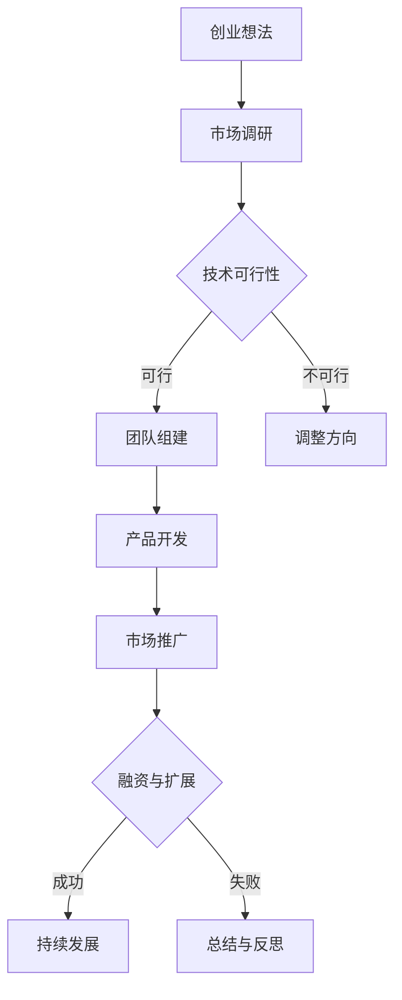

                 

### 《AI创业者的优势：垂直领域的专业力量》

> **关键词**：人工智能、创业者、垂直领域、专业力量、技术应用、成功案例

> **摘要**：
人工智能（AI）正迅速改变各行各业，为创业者提供了前所未有的机遇。本文将深入探讨AI创业者的独特优势，尤其是垂直领域的专业力量。我们将分析AI在不同行业中的应用，解析创业者如何利用这些技术实现商业突破，并通过成功案例展示AI创业的实践路径。

在人工智能时代，创业不再仅仅是对技术的简单追求，而是对垂直领域专业知识的深度理解和应用。本文将分步骤解析AI创业的各个方面，包括基础知识、垂直领域优势、实战策略以及成功经验，旨在为有志于AI创业的读者提供有价值的指导和启示。

### 第一部分：AI创业基础知识

#### 第1章：AI创业概述

##### 1.1 AI创业背景与趋势

人工智能技术的快速发展，使得各行业对智能解决方案的需求日益增长。AI创业的背景主要源于以下几个方面：

1. **技术进步**：随着深度学习、强化学习等技术的突破，AI在图像识别、自然语言处理、预测分析等方面的能力显著提升。
2. **数据资源**：互联网和大数据的普及，为AI算法提供了丰富的数据资源，推动了AI技术的应用与创新。
3. **市场需求**：传统行业对效率、质量和用户体验的要求不断提升，为AI在各个领域的应用创造了巨大市场空间。

在AI创业领域，以下是一些典型的应用案例：

1. **金融科技**：利用AI进行风险评估、欺诈检测和智能投顾，提高金融服务的效率和准确性。
2. **智能制造**：通过AI优化生产流程、设备维护和供应链管理，实现生产智能化。
3. **医疗健康**：应用AI进行医学影像分析、疾病诊断和个性化健康监测，提升医疗服务水平。

创业者应关注以下AI领域：

1. **智能交通**：利用AI技术解决交通拥堵、智能导航和自动驾驶等问题。
2. **智慧城市**：通过AI实现城市管理的智能化，包括环境监测、公共安全和社会治理等。
3. **教育科技**：利用AI提供个性化学习体验、智能辅导和教学评估。

##### 1.2 AI创业机会与挑战

AI创业机会主要体现在以下几个方面：

1. **市场需求**：随着人工智能技术的普及，各行业对智能解决方案的需求持续增长，为创业者提供了广阔的市场空间。
2. **技术突破**：AI技术的不断进步，为创业者提供了丰富的技术工具和解决方案。
3. **政策支持**：许多国家和地区纷纷出台相关政策，支持人工智能产业的发展，为创业者创造了有利的环境。

然而，AI创业也面临一系列挑战：

1. **技术壁垒**：AI技术复杂且更新迅速，创业者需要持续投入大量的时间和资源进行技术研究和创新。
2. **数据隐私**：AI应用往往需要大量的个人数据，如何保护用户隐私是创业者必须面对的问题。
3. **市场竞争**：AI创业领域的竞争日益激烈，创业者需要具备强大的创新能力和市场敏感度，才能脱颖而出。

##### 1.3 AI创业模式与路径

AI创业模式可以分为以下几种：

1. **技术研发型**：专注于AI技术的研发和创新，通过技术创新获得竞争优势。
2. **解决方案型**：针对特定行业或问题，提供定制化的AI解决方案。
3. **平台服务型**：搭建AI技术平台，为其他企业和创业者提供技术支持和工具。

AI创业路径包括以下几个阶段：

1. **市场调研**：深入了解市场需求，确定创业方向。
2. **技术研发**：选择合适的技术方向，进行技术研究和开发。
3. **团队组建**：组建专业的技术团队和运营团队，确保项目顺利推进。
4. **产品开发**：开发AI产品或解决方案，进行测试和优化。
5. **市场推广**：制定市场推广策略，扩大市场份额。
6. **融资扩展**：寻求融资机会，扩大团队和业务规模。

#### 第二部分：垂直领域专业优势

##### 第2章：AI与金融

##### 2.1 人工智能在金融领域的应用

人工智能在金融领域的应用日益广泛，主要表现在以下几个方面：

1. **金融风险评估**：利用AI技术进行风险评估，提高风险预测的准确性和效率。例如，通过机器学习算法分析历史数据和实时数据，预测信用风险、市场风险等。
2. **贷款审批**：AI技术在贷款审批中的应用，可以大大提高审批速度和准确性。通过深度学习模型，对借款人的信用记录、财务状况等多维度数据进行综合评估，快速做出决策。
3. **交易策略优化**：AI技术可以帮助金融机构优化交易策略，提高交易收益。例如，利用强化学习算法，根据市场数据和历史交易数据，动态调整交易策略。

##### 2.2 金融AI核心算法与模型

金融AI的核心算法和模型主要包括以下几个方面：

1. **强化学习**：强化学习在金融领域有着广泛的应用，例如在量化交易、智能投顾等方面。通过学习市场数据和交易数据，智能体可以不断优化交易策略，实现长期收益最大化。
2. **自然语言处理（NLP）**：NLP技术可以帮助金融机构处理大量文本数据，例如新闻报道、客户评论等，从而提取有用信息，进行市场分析和预测。
3. **图神经网络（GNN）**：图神经网络在金融领域具有强大的表示和预测能力，例如在社交网络分析、信用风险评估等方面。通过构建图结构，可以更好地理解和预测复杂金融系统的行为。

##### 2.3 金融AI项目实战

以下是一些金融AI项目的实战案例：

1. **智能投顾系统**：智能投顾系统通过AI技术，为用户提供个性化的投资建议。系统会分析用户的风险偏好、财务状况和市场数据，提供最佳的投资组合策略。
2. **风险管理平台**：风险管理平台利用AI技术，实时监控金融市场风险，预测风险事件，并自动生成风险报告，帮助金融机构制定风险管理策略。
3. **信用评分模型**：信用评分模型通过AI技术，对借款人的信用风险进行评估。模型会分析借款人的历史信用记录、财务状况、社会关系等多维度数据，生成信用评分，为金融机构提供贷款审批决策依据。

##### 第3章：AI与健康医疗

##### 3.1 健康医疗中的AI应用

人工智能在健康医疗领域有着广泛的应用，主要包括以下几个方面：

1. **医学图像分析**：AI技术可以辅助医生进行医学图像分析，如X光片、CT扫描和MRI图像。通过深度学习模型，AI可以识别和定位病变区域，提高诊断准确率。
2. **疾病诊断辅助**：AI技术可以帮助医生进行疾病诊断，例如通过分析患者的病史、症状和生物标志物数据，预测疾病发生概率。
3. **医疗数据分析**：AI技术可以对海量的医疗数据进行分析，提取有价值的信息，用于疾病预测、健康风险评估等。

##### 3.2 健康医疗AI核心技术

健康医疗AI的核心技术主要包括以下几个方面：

1. **深度学习**：深度学习技术在医学图像分析、疾病诊断等领域具有强大的应用潜力。通过训练深度神经网络，可以自动识别和分类医学图像中的异常区域。
2. **强化学习**：强化学习在医疗决策支持、智能药物研发等方面有着广泛的应用。通过不断学习和优化，智能体可以制定最优的治疗方案，提高治疗效果。
3. **机器学习**：机器学习技术可以帮助医生从海量医疗数据中提取有价值的信息，用于疾病预测、风险评估等。

##### 3.3 健康医疗AI项目实战

以下是一些健康医疗AI项目的实战案例：

1. **个性化健康监测**：个性化健康监测系统通过AI技术，实时监测患者的生理参数，如心率、血压、血糖等，并根据监测数据提供个性化的健康建议。
2. **医疗机器人**：医疗机器人利用AI技术，辅助医生进行手术操作、康复训练等。通过高精度的图像识别和运动控制，医疗机器人可以大大提高手术的准确性和效率。
3. **健康数据分析平台**：健康数据分析平台通过AI技术，对海量健康数据进行分析，提取有价值的信息，用于疾病预测、健康风险评估等，帮助医疗机构提供更加精准的医疗服务。

##### 第4章：AI与零售电商

##### 4.1 人工智能在零售电商中的应用

人工智能在零售电商中的应用，极大地提升了用户体验和运营效率，主要包括以下几个方面：

1. **智能推荐系统**：智能推荐系统通过AI技术，根据用户的历史行为和偏好，推荐最适合的商品。通过深度学习算法，推荐系统的准确性和个性化程度不断提高。
2. **客户行为分析**：客户行为分析利用AI技术，对用户在网站或App上的行为数据进行实时分析，了解用户的偏好和需求，从而优化产品和服务。
3. **库存管理优化**：库存管理优化通过AI技术，预测市场需求，优化库存水平，降低库存成本，提高供应链效率。

##### 4.2 零售电商AI核心技术

零售电商AI的核心技术主要包括以下几个方面：

1. **自然语言处理（NLP）**：NLP技术在电商领域有广泛的应用，例如通过聊天机器人与用户进行自然语言交互，提供个性化服务。
2. **计算机视觉**：计算机视觉技术在商品识别、图像识别等方面有重要应用，例如通过图像识别技术，实现自动结账、商品识别等。
3. **强化学习**：强化学习在智能推荐系统和库存管理优化等方面有着重要的应用，通过不断学习和优化，提高推荐和管理的准确性。

##### 4.3 零售电商AI项目实战

以下是一些零售电商AI项目的实战案例：

1. **个性化推荐引擎**：个性化推荐引擎通过AI技术，分析用户的历史行为和偏好，推荐最适合的商品。通过深度学习算法，推荐系统的准确性和个性化程度不断提高。
2. **智能客服系统**：智能客服系统通过AI技术，自动解答用户的常见问题，提供个性化服务。通过自然语言处理和机器学习技术，智能客服系统可以不断提高服务质量和效率。
3. **库存管理系统**：库存管理系统通过AI技术，预测市场需求，优化库存水平，降低库存成本，提高供应链效率。通过计算机视觉和强化学习技术，库存管理系统的准确性和灵活性不断提高。

#### 第三部分：AI创业实战

##### 第5章：AI创业团队建设

##### 5.1 创业团队组织结构与角色定位

AI创业团队的组织结构一般包括以下几个角色：

1. **技术团队**：负责AI技术的研发和应用，包括算法工程师、数据科学家、软件工程师等。
2. **运营团队**：负责项目的运营和推广，包括产品经理、运营经理、市场经理等。
3. **营销团队**：负责品牌建设、市场推广和客户关系管理，包括品牌经理、市场营销专家、销售代表等。

每个角色在团队中扮演着重要的角色，相互协作，共同推动项目的发展。

##### 5.2 AI创业团队协作与沟通

AI创业团队的协作与沟通至关重要，以下是一些有效的策略：

1. **团队协作工具**：使用如Trello、Slack、Asana等协作工具，提高团队的工作效率和信息共享。
2. **沟通机制与策略**：定期举行团队会议，及时沟通项目进展和问题，确保团队目标的一致性。
3. **人才引进与培养**：注重人才的引进和培养，建立专业、高效的团队。

##### 5.3 创业团队管理与激励

有效的团队管理与激励是确保项目成功的关键，以下是一些有效的策略：

1. **项目管理方法**：采用敏捷开发、迭代式开发等项目管理方法，提高项目的灵活性和响应速度。
2. **团队激励制度**：建立合理的激励制度，如股权激励、绩效奖金等，激发团队成员的积极性和创造力。
3. **风险管理与应对**：建立完善的风险管理机制，及时识别和应对项目风险，确保项目的顺利进行。

##### 第6章：AI创业项目规划与执行

##### 6.1 创业项目规划与目标设定

创业项目规划是确保项目成功的关键，以下是一些重要的步骤：

1. **市场需求分析**：深入了解市场需求，确定项目的市场定位和目标客户群体。
2. **技术可行性研究**：评估项目所需的技术能力，确保项目的技术可行性。
3. **项目里程碑规划**：制定项目的主要里程碑和阶段性目标，确保项目进度可控。

##### 6.2 AI创业项目执行与管理

项目执行与管理是确保项目顺利进行的重要环节，以下是一些关键点：

1. **项目进度控制**：通过制定详细的项目计划和进度表，实时监控项目进度，确保项目按时完成。
2. **资源配置与优化**：合理配置项目资源，确保项目所需的资金、人力和物力得到充分利用。
3. **风险评估与控制**：识别项目风险，制定相应的风险应对策略，确保项目风险在可控范围内。

##### 6.3 AI创业项目验收与迭代

项目验收与迭代是项目生命周期的重要阶段，以下是一些关键点：

1. **项目交付与验收**：确保项目按照需求完成，并进行严格的质量验收。
2. **用户反馈收集**：收集用户反馈，了解产品的实际使用情况和用户需求。
3. **产品迭代与优化**：根据用户反馈和市场需求，持续优化产品，提高用户满意度。

##### 第7章：AI创业成功案例分享

##### 7.1 成功AI创业案例分析

以下是一些AI创业成功案例的分析：

1. **项目背景与目标**：介绍项目的背景和目标，包括市场需求、技术挑战等。
2. **技术选型与实施**：分析项目所采用的技术和算法，以及具体的实施过程。
3. **市场推广与运营**：介绍项目的市场推广策略和运营情况，包括用户获取、用户留存等。
4. **融资与扩展**：分析项目的融资过程和扩展策略，包括融资额、投资方、扩展市场等。

##### 7.2 AI创业者的经验与教训

以下是一些AI创业者的经验与教训：

1. **团队建设与文化建设**：强调团队建设和文化建设的重要性，包括人才引进、团队协作、企业价值观等。
2. **技术创新与突破**：分享在技术创新和突破方面的经验和教训，包括技术选型、研发投入、团队协作等。
3. **市场定位与策略**：分析创业者的市场定位和策略，包括市场调研、目标客户、差异化竞争等。
4. **风险管理与实践**：介绍创业者如何识别和管理项目风险，以及在实际运营中如何应对风险。

#### 附录

##### 附录A：AI创业资源与工具

以下是一些AI创业常用的资源与工具：

1. **开发框架**：如TensorFlow、PyTorch等深度学习框架，Kafka、Spark等大数据处理框架。
2. **数据集与资源库**：如ImageNet、COCO等大规模数据集，以及Google Dataset Search等资源库。
3. **人工智能社区**：如arXiv、AI Stack Overflow等学术和社区资源。

##### 附录B：AI创业案例分析

以下是一些AI创业案例分析：

1. **国内外AI创业成功案例**：介绍一些成功的AI创业案例，包括项目背景、技术实现、市场表现等。
2. **AI创业失败案例分析**：分析一些AI创业失败的案例，探讨失败的原因、教训和避免失败的策略。

### **Mermaid 流程图：AI创业核心流程**

以下是AI创业的核心流程图：

### **结语**

人工智能为创业者提供了广阔的舞台，垂直领域的专业力量是AI创业的核心优势。通过本文的深入分析，我们了解了AI在不同行业的应用、创业者如何利用AI实现商业突破，以及AI创业的成功案例和实战策略。希望本文能为有志于AI创业的读者提供有价值的参考和启示。在人工智能的时代，让我们携手共创未来！

