                 

# 《AI创业者的机会：AI让人类生活更美好》

> **关键词：** 人工智能，创业，医疗健康，教育，金融，未来趋势
>
> **摘要：** 本文将探讨人工智能（AI）在各个领域的应用和创业机会，详细分析AI技术如何改善人类生活，以及创业者如何抓住这一机会实现创新和成功。

## 目录大纲

### 第一部分：AI创业者的背景与机会

#### 第1章：AI技术概述与发展趋势

##### 1.1 AI技术的基础知识

##### 1.2 AI行业的发展趋势

##### 1.3 AI创业的背景与机遇

### 第二部分：AI创业的关键领域

#### 第2章：AI在医疗健康领域的应用

##### 2.1 AI在医疗健康领域的潜力

##### 2.2 AI在医疗健康领域的案例

#### 第3章：AI在教育领域的应用

##### 3.1 AI在教育领域的潜力

##### 3.2 AI在教育领域的案例

#### 第4章：AI在金融领域的应用

##### 4.1 AI在金融领域的潜力

##### 4.2 AI在金融领域的案例

### 第三部分：AI创业实战指南

#### 第5章：AI创业团队的构建与管理

##### 5.1 创业团队的组织结构

##### 5.2 创业团队的管理策略

#### 第6章：AI创业项目的开发与实施

##### 6.1 AI创业项目的开发流程

##### 6.2 AI创业项目的实施策略

#### 第7章：AI创业项目的运营与推广

##### 7.1 AI创业项目的运营策略

##### 7.2 AI创业项目的推广方法

### 第四部分：AI创业的未来与挑战

#### 第8章：AI创业的法律与伦理问题

##### 8.1 AI创业的法律风险

##### 8.2 AI创业的伦理挑战

#### 第9章：AI创业的未来趋势

##### 9.1 AI创业的未来方向

##### 9.2 AI创业的未来挑战

## 第一部分：AI创业者的背景与机会

### 第1章：AI技术概述与发展趋势

#### 1.1 AI技术的基础知识

人工智能（AI，Artificial Intelligence）是一种模拟人类智能行为的计算机技术。它包括多种技术和方法，如机器学习（Machine Learning）、深度学习（Deep Learning）、自然语言处理（Natural Language Processing）、计算机视觉（Computer Vision）等。AI的核心目标是使计算机能够执行复杂的任务，如语音识别、图像识别、智能问答等。

**核心概念与联系**

AI技术的核心概念包括：

- **机器学习**：通过从数据中学习规律，使计算机能够做出预测和决策。
- **深度学习**：一种特殊的机器学习方法，通过神经网络模拟人脑的工作方式。
- **自然语言处理**：使计算机能够理解和生成自然语言，实现人机交互。
- **计算机视觉**：使计算机能够识别和理解图像和视频。

这些概念相互联系，共同构成了AI技术的框架。

**Mermaid 流程图**

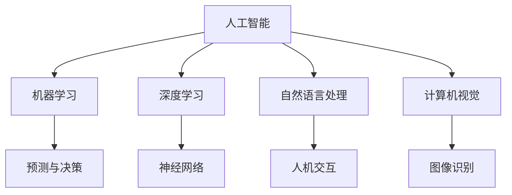

#### 1.2 AI行业的发展趋势

AI行业经历了快速的发展，从最初的实验室研究到如今成为全球科技领域的热点。当前，AI技术已广泛应用于各个领域，如医疗健康、金融、教育、零售等，并显示出巨大的潜力。

- **行业应用**：AI技术已经在医疗健康、金融、教育等领域得到广泛应用。例如，AI在医疗健康领域可以用于疾病预测和诊断，在金融领域可以用于风险评估和投资决策。
- **技术进步**：随着计算能力的提升和数据量的增加，AI技术的准确性和性能不断提高。深度学习、强化学习等新方法的出现，使得AI在复杂任务上表现出更强的能力。
- **市场前景**：根据市场研究机构的预测，AI市场将在未来几年内继续保持高速增长。全球AI市场的规模将从2017年的36亿美元增长到2025年的约380亿美元。

**核心算法原理讲解**

- **机器学习算法**：机器学习算法是AI技术的核心。常见的机器学习算法包括线性回归、决策树、支持向量机（SVM）等。

  **伪代码**：

  ```python
  def linear_regression(x, y):
      # 求斜率和截距
      m = (sum(y) - len(y) * mean(y)) / (sum(x) - len(x) * mean(x))
      b = mean(y) - m * mean(x)
      return m, b
  ```

- **深度学习算法**：深度学习算法是机器学习的扩展，它使用多层神经网络来学习复杂的特征。

  **伪代码**：

  ```python
  def forward_pass(x, weights, biases):
      # 前向传播计算输出
      z = np.dot(x, weights) + biases
      return activation_function(z)

  def backward_pass(x, y, weights, biases):
      # 反向传播计算梯度
      delta = activation_function_derivative(z) * (y - z)
      weights -= learning_rate * delta * x.T
      biases -= learning_rate * delta
  ```

#### 1.3 AI创业的背景与机遇

AI技术的发展为创业者提供了丰富的机会。以下是AI创业的一些背景和机遇：

- **市场需求**：随着AI技术的普及，越来越多的企业开始寻求AI解决方案。这为创业者提供了广阔的市场需求。
- **技术进步**：AI技术的快速发展为创业者提供了更多的技术选择和创新空间。
- **政策支持**：许多国家和地区政府出台了一系列支持AI产业发展的政策，为创业者提供了有利的环境。
- **投资热情**：投资者对AI领域表现出浓厚的兴趣，为创业者提供了充足的资金支持。

**Mermaid 流�程图**

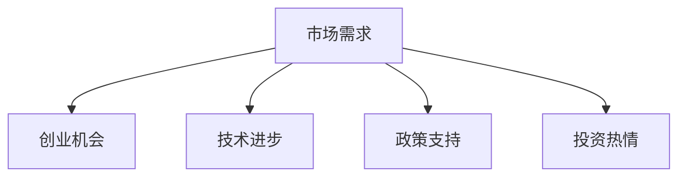

**总结**

AI技术为创业者提供了丰富的机会。了解AI技术的基础知识、发展趋势和创业机遇，是成功创业的关键。在接下来的章节中，我们将进一步探讨AI在医疗健康、教育、金融等领域的具体应用和创业机会。让我们继续深入分析。

### 第2章：AI在医疗健康领域的应用

#### 2.1 AI在医疗健康领域的潜力

AI技术在医疗健康领域具有巨大的潜力，可以显著提高医疗诊断的准确性、效率，并降低医疗成本。以下是AI在医疗健康领域的几个重要潜力：

- **疾病预测与诊断**：AI可以通过分析患者的医疗数据，如病史、基因数据、影像等，预测疾病的发病风险，并协助医生进行诊断。例如，深度学习模型可以分析CT扫描图像，帮助医生识别早期肺癌。
- **药物研发**：AI可以加速药物研发过程。通过分析大量的生物数据和化学结构，AI可以预测新药的疗效和安全性，从而提高药物研发的成功率。
- **个性化治疗**：AI可以根据患者的具体病情和基因组信息，制定个性化的治疗方案，提高治疗效果和患者满意度。

**核心概念与联系**

AI在医疗健康领域的核心概念包括：

- **数据驱动的医疗**：AI通过分析大量医疗数据，提供更准确的诊断和治疗方案。
- **智能辅助系统**：AI系统可以辅助医生进行诊断和治疗，提高医疗效率。
- **医疗影像分析**：AI可以对医疗影像进行分析，如CT、MRI等，帮助医生识别病变。

**Mermaid 流程图**

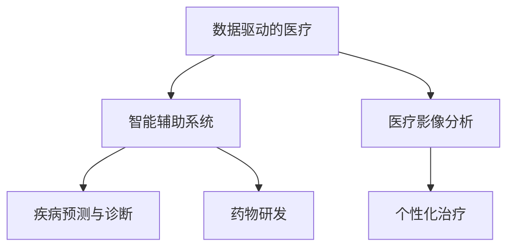

#### 2.2 AI在医疗健康领域的案例

以下是几个AI在医疗健康领域的实际应用案例：

- **癌症诊断**：AI技术在癌症诊断中表现出色。例如，IBM的Watson for Oncology可以分析大量医学文献和病例数据，为医生提供诊断建议。根据研究，Watson的癌症诊断准确率比人类医生高30%。
- **药物研发**：AI可以加速新药研发。例如，Exscientia利用AI技术开发了一种抗病毒药物，从发现候选分子到临床试验仅用了14个月，而传统方法通常需要7-8年。
- **个性化治疗**：AI可以根据患者的基因组信息，为其制定个性化的治疗方案。例如，美国的Grass Roots Oncology利用AI技术为癌症患者提供个性化治疗方案，显著提高了治疗效果。

**核心算法原理讲解**

AI在医疗健康领域的核心算法包括：

- **深度学习模型**：用于分析医疗影像，如CT、MRI等，帮助医生识别病变。
- **生成对抗网络（GAN）**：用于生成新的药物分子，加速药物研发。
- **强化学习**：用于优化个性化治疗方案，提高治疗效果。

**伪代码**：

```python
# 深度学习模型：用于医疗影像分析
def conv_net(image):
    # 输入图像
    x = conv2d(image, filters=32, kernel_size=(3, 3), activation='relu')
    x = max_pool2d(x, pool_size=(2, 2))
    # ...更多层
    return flatten(x)

# 生成对抗网络（GAN）：用于药物分子生成
def generator(z):
    # 输入随机噪声
    x = dense(z, units=128, activation='relu')
    x = dense(x, units=128, activation='relu')
    x = dense(x, units=128, activation='tanh')
    return x

def critic(x):
    # 输入生成器生成的药物分子
    x = dense(x, units=128, activation='relu')
    x = dense(x, units=128, activation='relu')
    x = dense(x, units=128, activation='sigmoid')
    return x
```

#### 2.3 AI在医疗健康领域的挑战

尽管AI在医疗健康领域具有巨大的潜力，但同时也面临一些挑战：

- **数据隐私**：医疗数据敏感，保护患者隐私是首要任务。
- **数据质量**：医疗数据的多样性和质量对AI算法的性能有很大影响。
- **伦理问题**：AI在医疗决策中的应用引发了一系列伦理问题，如算法偏见、决策透明度等。

**总结**

AI在医疗健康领域具有巨大的潜力，通过疾病预测、诊断、药物研发和个性化治疗等方面的应用，可以显著提高医疗质量和效率。然而，同时也需要关注数据隐私、数据质量和伦理问题等挑战。在接下来的章节中，我们将继续探讨AI在教育、金融等领域的应用和创业机会。

### 第3章：AI在教育领域的应用

#### 3.1 AI在教育领域的潜力

人工智能（AI）正在改变教育领域，提供个性化学习体验、智能教学辅助和自动评估等创新解决方案。以下是AI在教育领域的几个重要潜力：

- **个性化学习**：AI可以根据学生的兴趣、能力和学习进度，提供定制化的学习内容和教学方法，从而提高学习效果。
- **智能教学辅助**：AI系统可以辅助教师进行教学，如自动批改作业、提供教学建议等，从而减轻教师的工作负担。
- **自动评估**：AI可以自动评估学生的作业和考试，提供即时反馈，帮助教师更好地了解学生的学习情况。

**核心概念与联系**

AI在教育领域的核心概念包括：

- **个性化学习系统**：基于学生的学习数据和偏好，动态调整学习内容和方法。
- **自然语言处理（NLP）**：用于分析和理解学生的写作和语言表达，提供个性化反馈。
- **计算机视觉**：用于自动批改和评估学生的作业和考试。

**Mermaid 流程图**

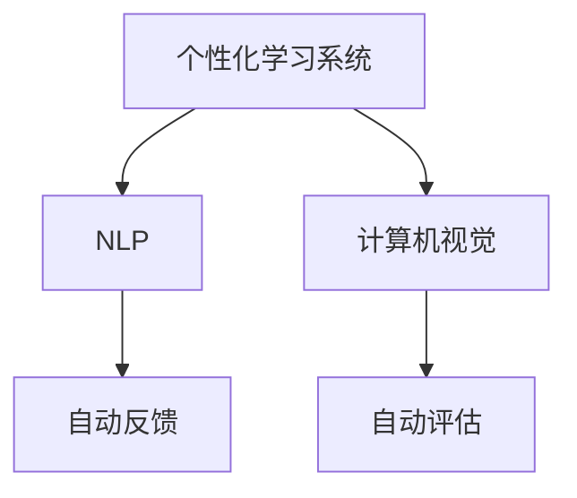

#### 3.2 AI在教育领域的案例

以下是AI在教育领域的几个实际应用案例：

- **AI驱动的教育平台**：例如，Coursera和edX等在线教育平台利用AI技术提供个性化的学习体验。这些平台可以根据学生的学习数据，推荐最适合他们的课程和学习路径。
- **智能作业批改**：例如，Google Classroom和Microsoft Teams等教育工具集成了AI作业批改功能，可以自动评估学生的作业，并提供即时反馈。
- **个性化学习辅导**：例如，Knewton等个性化学习平台，利用AI技术为每位学生提供定制化的学习内容，从而提高学习效果。

**核心算法原理讲解**

AI在教育领域的核心算法包括：

- **决策树**：用于分析学生的表现数据，推荐适合他们的学习内容。
- **神经网络**：用于建模学生的学习行为，预测其学习效果。
- **强化学习**：用于优化个性化学习策略，提高学习效果。

**伪代码**：

```python
# 决策树：用于推荐学习内容
def recommend_course(student_data, courses):
    # 根据学生的表现数据，推荐适合的课程
    recommended_course = find_best_fit_course(student_data, courses)
    return recommended_course

# 神经网络：用于预测学习效果
def predict_performance(student_data, model):
    # 输入学生的学习数据，使用神经网络模型预测其学习效果
    performance = model.predict(student_data)
    return performance

# 强化学习：用于优化个性化学习策略
def optimize_learning_strategy(student_data, model, reward_function):
    # 根据学生的学习数据，使用强化学习模型优化个性化学习策略
    strategy = model.learn(student_data, reward_function)
    return strategy
```

#### 3.3 AI在教育领域的挑战

尽管AI在教育领域具有巨大的潜力，但同时也面临一些挑战：

- **数据隐私**：学生和教师的数据需要得到保护，以防止泄露和滥用。
- **技术依赖**：过度依赖AI可能导致教师和学生忽视传统教学方法的重要性。
- **技术成熟度**：目前AI教育应用的技术尚不成熟，需要进一步的研究和改进。

**总结**

AI在教育领域具有巨大的潜力，通过个性化学习、智能教学辅助和自动评估等应用，可以显著提高教育质量和效率。然而，同时也需要关注数据隐私、技术依赖和技术成熟度等挑战。在接下来的章节中，我们将继续探讨AI在金融领域的应用和创业机会。

### 第4章：AI在金融领域的应用

#### 4.1 AI在金融领域的潜力

人工智能（AI）在金融领域的应用日益广泛，提供了智能风控、投资决策、客户服务等方面的创新解决方案。以下是AI在金融领域的几个重要潜力：

- **智能风控**：AI可以实时监控和分析金融交易数据，及时发现潜在风险，从而提高风险管理能力。
- **投资决策**：AI可以通过分析大量市场数据，预测市场趋势，帮助投资者做出更明智的投资决策。
- **客户服务**：AI驱动的聊天机器人和虚拟客服可以提供24/7的客户服务，提高客户满意度。

**核心概念与联系**

AI在金融领域的核心概念包括：

- **机器学习**：用于分析金融数据，识别模式和趋势。
- **自然语言处理**：用于理解和生成金融文本，如新闻、报告等。
- **计算机视觉**：用于分析和识别金融图像，如身份证、合同等。

**Mermaid 流程图**

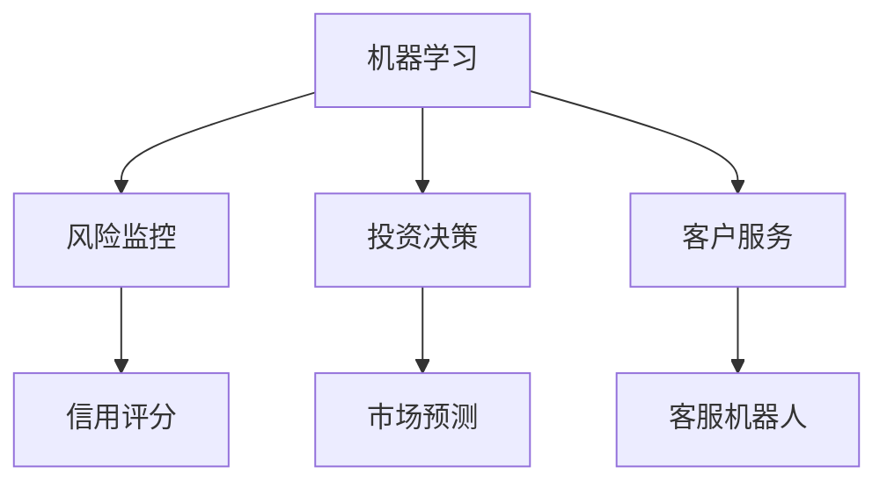

#### 4.2 AI在金融领域的案例

以下是AI在金融领域的几个实际应用案例：

- **智能风控**：例如，谷歌的DeepMind开发了AI风控系统，可以实时监控和预测金融市场的风险，帮助金融机构减少潜在的损失。
- **投资决策**：例如，IQT Labs的AI系统通过分析大量的市场数据，提供个性化的投资建议，帮助投资者实现稳健的收益。
- **客户服务**：例如，Siri和Alexa等智能语音助手可以回答客户的金融问题，提供即时服务。

**核心算法原理讲解**

AI在金融领域的核心算法包括：

- **支持向量机（SVM）**：用于分类和回归分析，识别金融交易中的潜在风险。
- **深度学习**：用于分析和预测金融市场的趋势。
- **生成对抗网络（GAN）**：用于生成新的金融数据，用于模型训练和测试。

**伪代码**：

```python
# 支持向量机（SVM）：用于风险监控
from sklearn.svm import SVC

def risk_monitoring(data):
    # 使用SVM模型监控金融交易风险
    model = SVC()
    model.fit(data['X'], data['y'])
    risk_score = model.predict(data['X'])
    return risk_score

# 深度学习：用于投资决策
from keras.models import Sequential
from keras.layers import Dense, LSTM

def investment_decision(data):
    # 使用深度学习模型预测市场趋势
    model = Sequential()
    model.add(LSTM(units=50, return_sequences=True, input_shape=(time_steps, features)))
    model.add(LSTM(units=50, return_sequences=False))
    model.add(Dense(units=1))
    model.compile(optimizer='adam', loss='mean_squared_error')
    model.fit(data['X'], data['y'], epochs=100, batch_size=32)
    prediction = model.predict(data['X'])
    return prediction

# 生成对抗网络（GAN）：用于数据生成
from keras.models import Model
from keras.layers import Input, Dense, Lambda

def generator(z):
    # 生成器模型
    x = Dense(128, activation='relu')(z)
    x = Dense(128, activation='relu')(x)
    x = Dense(1, activation='tanh')(x)
    return x

def critic(x):
    # 判别器模型
    x = Dense(128, activation='relu')(x)
    x = Dense(128, activation='relu')(x)
    x = Dense(1, activation='sigmoid')(x)
    return x

def combined_model():
    # 整合模型
    z = Input(shape=(100,))
    x = generator(z)
    valid = critic(x)
    return Model(z, valid)

# 训练GAN模型
discriminator = critic()
discriminator.compile(optimizer='adam', loss='binary_crossentropy')
generator = generator()
discriminator.train_on_batch(x, np.random.uniform(size=(1, 100)))
```

#### 4.3 AI在金融领域的挑战

尽管AI在金融领域具有巨大的潜力，但同时也面临一些挑战：

- **数据隐私**：金融数据敏感，保护用户隐私是首要任务。
- **算法偏见**：AI算法可能存在偏见，导致不公平的决策。
- **技术成熟度**：目前AI技术在金融领域的应用仍处于发展阶段，需要进一步的研究和改进。

**总结**

AI在金融领域具有巨大的潜力，通过智能风控、投资决策和客户服务等应用，可以显著提高金融服务的质量和效率。然而，同时也需要关注数据隐私、算法偏见和技术成熟度等挑战。在接下来的章节中，我们将探讨AI创业团队的构建与管理，为创业者提供实用的指导。

### 第5章：AI创业团队的构建与管理

#### 5.1 创业团队的组织结构

构建一个高效的AI创业团队是成功创业的关键。以下是一个典型的AI创业团队组织结构：

- **创始人**：负责公司的愿景、战略和日常运营。
- **首席技术官（CTO）**：负责技术方向、技术团队的管理和技术产品的开发。
- **数据科学家**：负责数据分析和建模，实现AI算法。
- **产品经理**：负责产品规划、市场需求分析和用户体验设计。
- **工程师**：负责开发、测试和维护技术产品。
- **运营团队**：负责市场推广、客户服务和日常运营。

**核心概念与联系**

AI创业团队的组织结构涉及到以下几个方面：

- **人员分工**：明确团队成员的职责和角色，确保高效协作。
- **团队协作**：建立良好的沟通机制，促进团队成员之间的信息共享和协作。
- **技术方向**：确定公司的技术路线图，确保技术团队的研发工作与公司战略一致。

**Mermaid 流程图**

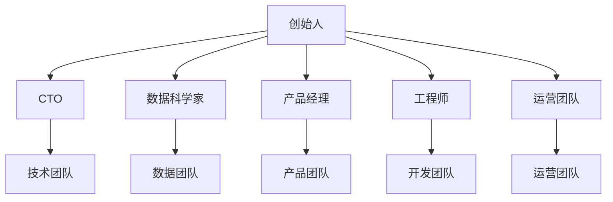

#### 5.2 创业团队的管理策略

有效管理AI创业团队是确保项目顺利进行和团队高效协作的关键。以下是一些实用的管理策略：

- **项目管理**：使用项目管理工具（如Jira、Trello等）规划任务、跟踪进度和协调工作。
- **敏捷开发**：采用敏捷开发方法，如Scrum或Kanban，提高团队的响应速度和灵活性。
- **团队激励**：建立激励机制，鼓励团队成员创新和努力工作，如绩效奖金、股权激励等。
- **沟通协作**：定期召开团队会议，确保团队成员之间的信息流通和协作。
- **技术培训**：为团队成员提供技术培训和学习资源，提高团队整体技术能力。

**核心概念与联系**

创业团队的管理策略涉及到以下几个方面：

- **任务管理**：确保任务分配合理、进度可控。
- **团队协作**：促进团队成员之间的信息共享和协作。
- **员工激励**：提高员工的积极性和工作满意度。
- **知识共享**：建立知识共享机制，提高团队整体能力。

**Mermaid 流程图**

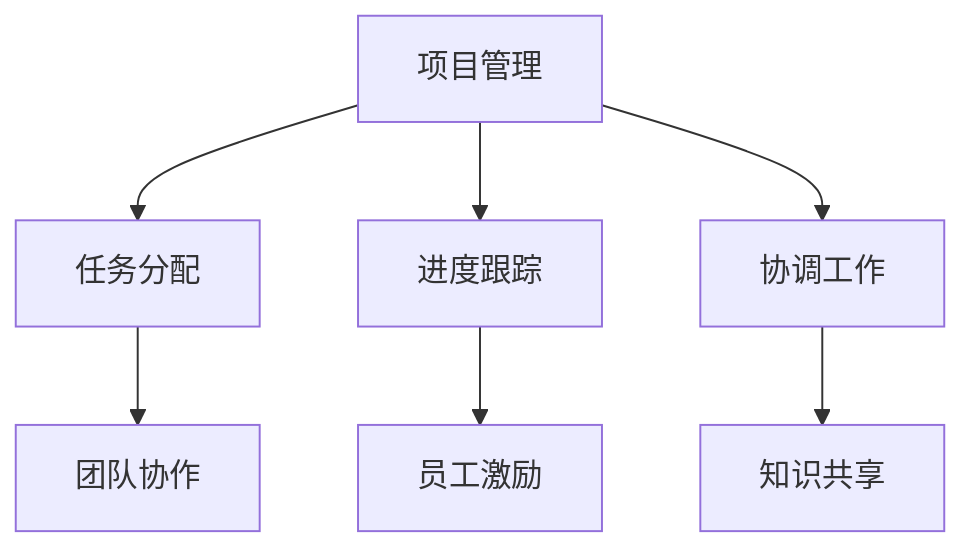

**总结**

构建和管理一个高效的AI创业团队是成功创业的关键。通过明确团队组织结构、制定有效的管理策略，可以确保团队高效协作，实现创业目标。在接下来的章节中，我们将探讨AI创业项目的开发与实施，为创业者提供实用的指导。

### 第6章：AI创业项目的开发与实施

#### 6.1 AI创业项目的开发流程

AI创业项目的开发流程是一个系统化、阶段性的过程，包括需求分析、系统设计、开发、测试和部署等环节。以下是AI创业项目开发流程的详细步骤：

1. **需求分析**：
   - **收集需求**：通过与潜在用户、市场调研、竞争对手分析等方式，收集用户需求和市场信息。
   - **需求整理**：将收集到的需求进行整理，形成详细的需求文档。

2. **系统设计**：
   - **架构设计**：根据需求文档，设计系统的总体架构，包括技术架构、数据架构和功能架构。
   - **详细设计**：对系统中的各个模块进行详细设计，包括数据模型、接口设计、算法设计等。

3. **开发**：
   - **编码**：根据系统设计文档，进行编码实现。
   - **模块集成**：将各个模块进行集成，确保系统能够正常运行。

4. **测试**：
   - **单元测试**：对系统中的每个模块进行单元测试，确保模块功能的正确性。
   - **集成测试**：对系统进行集成测试，确保各个模块之间的协同工作。
   - **性能测试**：对系统进行性能测试，确保系统能够满足性能要求。

5. **部署**：
   - **部署计划**：制定详细的部署计划，包括部署环境、部署步骤、部署后的监控等。
   - **部署实施**：按照部署计划，将系统部署到生产环境。

**核心概念与联系**

AI创业项目开发流程涉及到以下几个方面：

- **需求分析**：确保项目能够满足用户需求。
- **系统设计**：确保系统的架构和功能符合预期。
- **开发**：实现系统功能。
- **测试**：确保系统质量。
- **部署**：将系统上线。

**Mermaid 流程图**

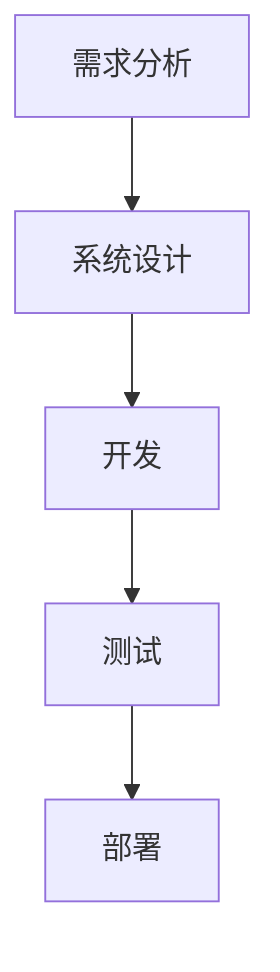

#### 6.2 AI创业项目的实施策略

在AI创业项目的实施过程中，需要制定一系列策略，以确保项目顺利进行并达到预期目标。以下是几个关键的实施策略：

1. **技术选型**：
   - **平台选型**：根据项目需求，选择合适的开发平台和工具。
   - **框架选型**：选择适合项目需求的框架，如TensorFlow、PyTorch等。
   - **数据库选型**：根据数据量和数据结构，选择合适的数据库系统。

2. **团队协作**：
   - **任务分配**：根据团队成员的技能和兴趣，合理分配任务。
   - **沟通机制**：建立有效的沟通机制，如定期会议、即时通讯工具等，确保团队信息流通。

3. **风险管理**：
   - **风险评估**：对项目中的潜在风险进行评估，制定相应的应对措施。
   - **风险监控**：定期对项目风险进行监控，确保风险在可控范围内。

4. **资源管理**：
   - **人力资源**：确保团队有足够的人力资源，以满足项目需求。
   - **资金管理**：合理规划项目资金，确保项目的持续发展。

**核心概念与联系**

AI创业项目实施策略涉及到以下几个方面：

- **技术选型**：确保技术路线的正确性。
- **团队协作**：提高团队工作效率。
- **风险管理**：确保项目的顺利进行。
- **资源管理**：确保项目的资源得到有效利用。

**Mermaid 流程图**

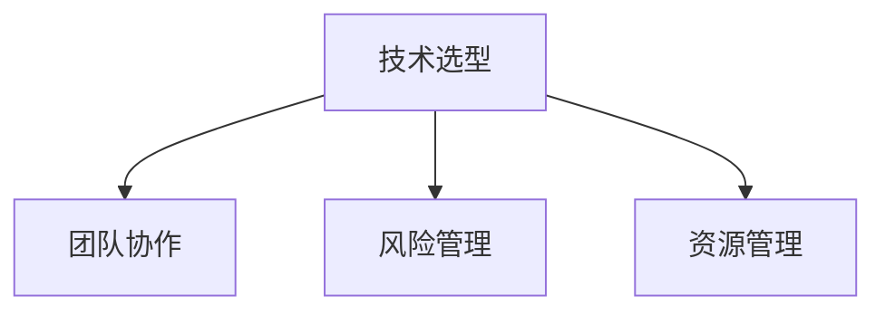

**总结**

AI创业项目的开发与实施是一个复杂且系统化的过程，需要从需求分析、系统设计、开发、测试到部署等各个环节进行精细管理。同时，还需要制定一系列实施策略，以确保项目顺利进行。在接下来的章节中，我们将探讨AI创业项目的运营与推广，为创业者提供实用的指导。

### 第7章：AI创业项目的运营与推广

#### 7.1 AI创业项目的运营策略

AI创业项目的运营成功与否，不仅取决于技术的先进性，还依赖于一系列运营策略。以下是几个关键的运营策略：

1. **产品定位**：
   - **市场细分**：对目标市场进行细分，明确项目的核心用户群体。
   - **价值主张**：明确项目产品的核心价值，并以此为基础进行市场定位。

2. **用户群体分析**：
   - **用户画像**：通过对用户数据的分析，建立用户画像，了解用户需求和行为。
   - **用户反馈**：积极收集用户反馈，根据用户需求调整产品功能和服务。

3. **市场推广**：
   - **内容营销**：通过博客、白皮书、案例研究等，提高项目知名度。
   - **社交媒体营销**：利用社交媒体平台，与潜在用户建立联系，提高品牌影响力。
   - **合作伙伴**：寻找合适的合作伙伴，共同推广项目。

**核心概念与联系**

AI创业项目运营策略涉及到以下几个方面：

- **产品定位**：明确项目的市场定位和核心用户群体。
- **用户群体分析**：了解用户需求和行为，优化产品和服务。
- **市场推广**：通过多种渠道提高项目知名度。

**Mermaid 流程图**

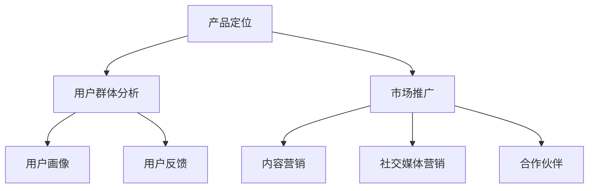

#### 7.2 AI创业项目的推广方法

在明确了运营策略后，实施有效的推广方法至关重要。以下是几种常用的AI创业项目推广方法：

1. **社交媒体推广**：
   - **微博、微信**：通过微博、微信公众号发布项目动态、技术文章和用户案例，吸引潜在用户。
   - **抖音、B站**：利用短视频和直播，展示项目的技术亮点和实际应用。

2. **内容营销**：
   - **博客**：定期发布技术博客、行业分析文章，提高项目的专业形象。
   - **白皮书、报告**：发布深度报告，展示项目的技术实力和市场潜力。

3. **活动推广**：
   - **线上活动**：举办线上研讨会、公开课，邀请行业专家和用户参与。
   - **线下活动**：参加行业展会、技术论坛，展示项目成果，建立行业联系。

**核心概念与联系**

AI创业项目推广方法涉及到以下几个方面：

- **社交媒体推广**：通过社交媒体平台与用户互动，提高项目知名度。
- **内容营销**：通过高质量的内容吸引关注，建立专业形象。
- **活动推广**：通过线下和线上活动，展示项目成果，建立行业联系。

**Mermaid 流程图**

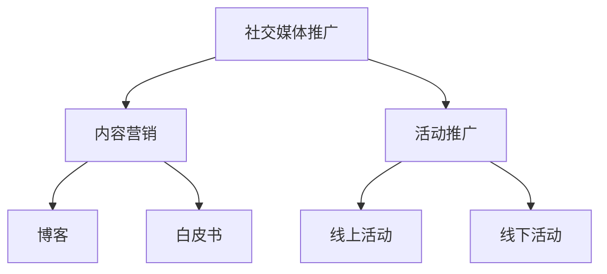

#### 7.3 成功案例分享

以下是几个AI创业项目的成功运营与推广案例：

1. **Case 1：DeepMind**
   - **运营策略**：DeepMind通过发布高质量的研究论文和技术博客，吸引了大量学术和工业界的关注。同时，他们积极参与国际人工智能竞赛，提高了项目的知名度。
   - **推广方法**：DeepMind利用社交媒体平台（如Twitter、LinkedIn）与用户互动，通过技术交流和合作，建立了强大的社区。

2. **Case 2：OpenAI**
   - **运营策略**：OpenAI注重用户反馈，通过定期发布用户调研和用户案例，了解用户需求并优化产品。
   - **推广方法**：OpenAI在社交媒体上积极开展内容营销，发布技术文章、视频教程，吸引了大量关注。

3. **Case 3：Kaggle**
   - **运营策略**：Kaggle通过举办各种数据科学竞赛，吸引了大量的数据科学家和爱好者。
   - **推广方法**：Kaggle利用社交媒体和电子邮件营销，定期发布竞赛信息，吸引了大量用户参与。

**总结**

AI创业项目的运营与推广需要结合多种策略和方法，从产品定位、用户群体分析到市场推广，确保项目的成功。通过成功案例的分享，我们可以看到，明确的运营策略和有效的推广方法对于AI创业项目的成功至关重要。

### 第8章：AI创业的法律与伦理问题

#### 8.1 AI创业的法律风险

随着AI技术的快速发展，创业者在开发和应用AI技术时可能会面临一系列法律风险。以下是几个主要方面的法律风险：

1. **数据隐私**：
   - **个人信息保护**：AI系统在处理用户数据时，必须遵守数据隐私法规，如《通用数据保护条例》（GDPR）和《加州消费者隐私法案》（CCPA）。
   - **数据泄露**：一旦发生数据泄露，企业可能会面临巨额罚款和声誉损失。

2. **知识产权**：
   - **专利侵权**：在开发AI技术时，需要确保不侵犯他人的专利权。
   - **版权问题**：AI生成的文本、图像等成果可能涉及版权问题。

3. **责任承担**：
   - **产品责任**：如果AI系统导致用户损失，企业可能需要承担法律责任。
   - **合同纠纷**：与合作伙伴之间的合同纠纷也可能带来法律风险。

**核心概念与联系**

AI创业的法律风险涉及到以下几个方面：

- **数据隐私**：确保用户数据的合法处理和保护。
- **知识产权**：尊重和保护知识产权，避免侵权纠纷。
- **责任承担**：明确责任分配，降低法律风险。

**Mermaid 流程图**

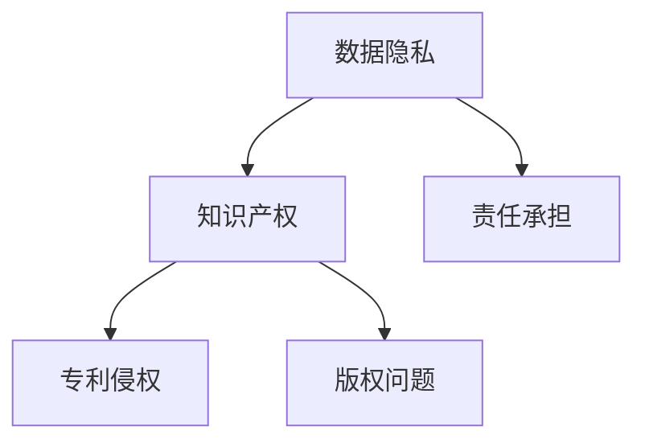

#### 8.2 AI创业的伦理挑战

AI技术在为人类生活带来便利的同时，也引发了一系列伦理问题。以下是几个主要的伦理挑战：

1. **算法偏见**：
   - **歧视问题**：AI算法可能基于历史数据中的偏见，导致不公平的决策。
   - **透明度**：算法决策过程的透明度较低，难以追溯和解释。

2. **就业影响**：
   - **自动化替代**：AI技术的发展可能导致部分工作岗位的自动化替代，影响就业市场。
   - **技能升级**：需要员工不断学习和提升技能，以适应新的工作环境。

3. **安全性**：
   - **网络安全**：AI系统可能成为网络攻击的目标，对用户数据造成威胁。
   - **安全漏洞**：AI系统可能存在安全漏洞，导致数据泄露或系统瘫痪。

**核心概念与联系**

AI创业的伦理挑战涉及到以下几个方面：

- **算法偏见**：确保算法的公平性和透明度。
- **就业影响**：平衡技术进步与就业市场的变化。
- **安全性**：确保AI系统的安全性和稳定性。

**Mermaid 流程图**

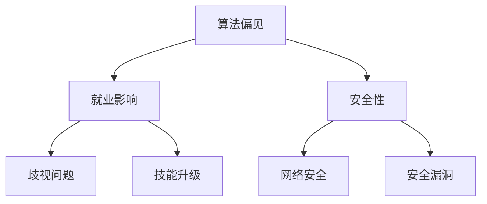

#### 8.3 法律与伦理问题的应对策略

为了应对AI创业中的法律和伦理问题，创业者可以采取以下策略：

1. **合规性审查**：
   - **法律法规**：定期审查和更新公司政策，确保遵守相关法律法规。
   - **合规咨询**：咨询专业律师，确保公司运营符合法律要求。

2. **伦理审查**：
   - **伦理委员会**：建立伦理委员会，对AI项目进行伦理审查，确保算法的公平性和透明度。
   - **透明沟通**：与用户和利益相关者保持透明沟通，解释算法决策过程。

3. **持续学习**：
   - **培训与教育**：为员工提供相关培训和教育，提高对伦理和法律问题的认识。
   - **技术改进**：不断改进AI技术，降低偏见和漏洞。

**总结**

AI创业过程中，法律和伦理问题是无法回避的挑战。通过合规性审查、伦理审查和持续学习，创业者可以降低法律和伦理风险，确保AI技术的可持续发展。在接下来的章节中，我们将探讨AI创业的未来趋势。

### 第9章：AI创业的未来趋势

#### 9.1 AI创业的未来方向

AI技术的快速发展为创业者提供了广阔的视野和无限的创新空间。以下是AI创业的未来方向：

1. **新型AI技术**：
   - **量子计算**：量子计算可以显著提高AI算法的计算能力，解决当前AI技术难以处理的复杂问题。
   - **边缘计算**：边缘计算将数据处理和计算能力从云端转移到网络边缘，提高AI系统的响应速度和效率。

2. **跨领域融合**：
   - **AI+医疗**：AI与医疗领域的深度融合，推动精准医疗、个性化治疗等创新应用。
   - **AI+金融**：AI与金融领域的融合，提高金融服务的效率和安全。
   - **AI+教育**：AI与教育领域的融合，推动个性化学习、智能教学等创新模式。

3. **AI伦理与法律**：
   - **AI伦理**：随着AI技术的普及，伦理问题日益凸显，创业者需要关注并解决AI算法的偏见、透明度和责任等问题。
   - **AI法律**：创业者需要遵守相关法律法规，确保AI技术的合法合规。

**核心概念与联系**

AI创业的未来方向涉及到以下几个方面：

- **新型AI技术**：推动AI技术的创新和发展。
- **跨领域融合**：实现AI技术的广泛应用。
- **AI伦理与法律**：确保AI技术的可持续发展。

**Mermaid 流程图**

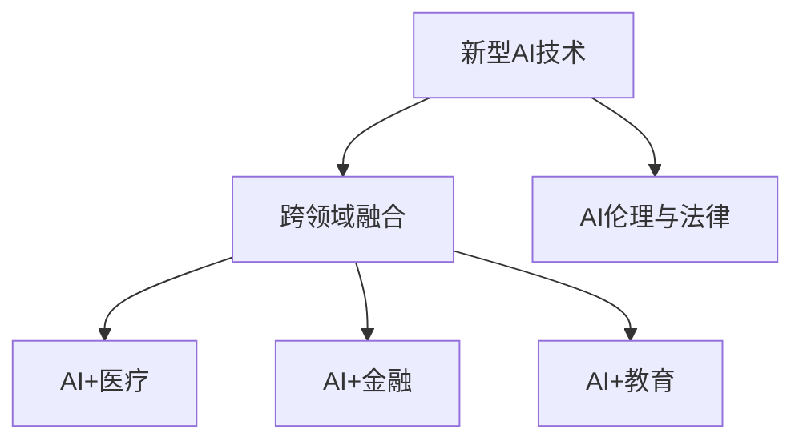

#### 9.2 AI创业的未来挑战

尽管AI创业前景广阔，但同时也面临一系列挑战：

1. **技术突破**：
   - **算法创新**：现有AI算法的性能和适用范围仍有限，需要不断进行算法创新。
   - **计算能力**：尽管计算能力在不断提高，但面对复杂问题，计算能力仍显不足。

2. **社会接受度**：
   - **隐私保护**：AI技术在处理个人数据时，必须保护用户隐私，提高社会对AI技术的信任度。
   - **伦理问题**：AI技术的广泛应用引发了一系列伦理问题，需要社会各界的共同关注和解决。

3. **市场成熟度**：
   - **市场需求**：虽然AI技术在各个领域都有广泛应用，但市场需求仍不充分，需要创业者积极开拓市场。
   - **竞争激烈**：AI创业领域竞争激烈，创业者需要不断创新，以保持竞争优势。

**核心概念与联系**

AI创业的未来挑战涉及到以下几个方面：

- **技术突破**：推动AI技术的进一步发展。
- **社会接受度**：提高社会对AI技术的接受度。
- **市场成熟度**：促进AI技术的市场成熟和应用。

**Mermaid 流程图**

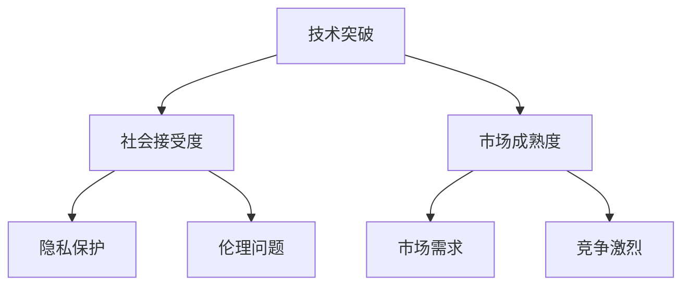

#### 9.3 未来展望

AI技术将继续推动各领域的创新和发展，为人类生活带来深远的影响。创业者需要紧跟技术趋势，勇于探索和创新，抓住AI创业的机遇。同时，也要关注社会伦理和法律问题，确保AI技术的可持续发展。

**总结**

AI创业的未来充满机遇与挑战。通过不断创新和解决技术、社会和伦理问题，创业者可以抓住AI创业的机遇，推动人类生活更美好。在未来的道路上，让我们共同探索AI技术的无限可能。

## 作者信息

**作者：AI天才研究院/AI Genius Institute & 禅与计算机程序设计艺术 /Zen And The Art of Computer Programming**

