                 

# 《AI图像搜索技术应用案例》

## 引言

随着人工智能技术的快速发展，AI图像搜索技术已成为计算机视觉领域的一个重要分支。AI图像搜索技术通过深度学习和计算机视觉算法，实现了对海量图像数据的快速检索和识别。本文旨在通过一系列实际应用案例，详细分析AI图像搜索技术的原理、算法及其在不同领域的应用，旨在为读者提供全面的了解和启示。

本文将从以下几个方面展开：

1. **AI图像搜索技术基础**：介绍图像搜索技术的起源、发展、核心概念和应用领域。
2. **图像处理与特征提取**：探讨图像预处理、特征提取方法和图像匹配算法。
3. **AI图像搜索技术应用案例**：分析社交网络、电子商务、医学影像和智能安防等领域中的应用。
4. **AI图像搜索技术展望**：探讨未来发展趋势、面临的挑战和潜在应用场景。

## 文章关键词

AI图像搜索、深度学习、计算机视觉、图像处理、特征提取、图像匹配、应用案例

## 文章摘要

本文全面探讨了AI图像搜索技术的原理、算法及其在实际应用中的效果。通过对社交网络、电子商务、医学影像和智能安防等领域的分析，本文展示了AI图像搜索技术如何通过图像预处理、特征提取和图像匹配算法，实现图像的快速检索和识别。文章还对未来AI图像搜索技术的发展趋势和挑战进行了展望，为读者提供了有价值的参考。

## AI图像搜索技术基础

### 1.1 AI图像搜索技术的起源与发展

AI图像搜索技术的起源可以追溯到20世纪90年代，当时计算机硬件性能的提升和图像处理算法的进步为图像识别技术的发展奠定了基础。最初，图像识别主要依赖手工设计的特征和传统机器学习算法，如支持向量机（SVM）和K最近邻（KNN）等。

随着深度学习技术的崛起，AI图像搜索技术迎来了新的发展机遇。2012年，AlexNet在ImageNet图像识别挑战赛中取得了显著成果，深度学习在图像识别领域的优势得到了充分体现。自此以后，深度学习算法，如卷积神经网络（CNN）和循环神经网络（RNN），逐渐成为图像搜索技术的主要驱动力。

近年来，随着计算能力的进一步提升和数据量的爆炸式增长，AI图像搜索技术不断成熟。特别是基于深度学习的特征提取和图像匹配算法，在准确性、实时性和计算效率方面取得了显著进展。

### 1.2 AI图像搜索技术的核心概念

AI图像搜索技术涉及多个核心概念，包括图像特征提取、图像匹配和图像检索。

#### 图像特征提取

图像特征提取是AI图像搜索技术的核心步骤，它通过分析图像的视觉信息，提取出能够代表图像内容的特征向量。这些特征向量通常具有高维、非线性、不变性等特点，能够有效地描述图像的内容和语义。

常见的图像特征提取方法包括：

- **基于频域的特征提取**：如傅里叶变换（FFT）和小波变换（WT），用于提取图像的频率成分。
- **基于空域的特征提取**：如SIFT（尺度不变特征变换）和SURF（加速稳健特征），用于提取图像的关键点及其描述子。
- **基于深度学习的特征提取**：如卷积神经网络（CNN）和循环神经网络（RNN），通过训练大量图像数据，自动提取图像的抽象特征。

#### 图像匹配

图像匹配是指将输入图像与数据库中的图像进行对比，找出相似度最高的图像。图像匹配是图像搜索的关键步骤，其目的是通过比较图像的特征向量，确定图像之间的相似性。

常见的图像匹配算法包括：

- **基于特征点匹配的算法**：如SIFT和SURF，通过找到图像之间的对应关系，实现图像的精确匹配。
- **基于模板匹配的算法**：如相关性匹配和距离度量，通过将输入图像与模板进行相似度比较，找出匹配度最高的区域。
- **基于深度学习的图像匹配算法**：如卷积神经网络（CNN）和深度可分离卷积（Depthwise Separable Convolution），通过训练大量的图像数据，自动提取图像的匹配特征。

#### 图像检索

图像检索是指从数据库中查找与输入图像相似或相关的图像。图像检索是AI图像搜索技术的最终目的，它通过计算输入图像与数据库中图像的特征相似度，实现图像的匹配和检索。

常见的图像检索算法包括：

- **基于最近邻的图像检索**：如K最近邻（KNN），通过计算输入图像与数据库中图像的特征相似度，找出最近邻的图像。
- **基于索引树的图像检索**：如KD树和Ball Tree，通过构建索引树来加速图像检索过程，提高检索速度。
- **基于内容感知的图像检索**：如基于颜色、纹理和形状的特征，通过分析图像的内容和结构，实现图像的精准检索。

### 1.3 AI图像搜索技术的应用领域

AI图像搜索技术具有广泛的应用领域，包括但不限于以下几个方面：

#### 社交网络

在社交网络中，AI图像搜索技术可以用于自动标记照片、推荐相关照片和识别重复照片。通过图像特征提取和匹配算法，用户可以快速找到自己感兴趣的照片，提高社交互动的体验。

#### 电子商务

在电子商务中，AI图像搜索技术可以帮助用户快速找到心仪的商品，提高用户体验。通过图像匹配和检索算法，电子商务平台可以推荐相关的商品，提高销售额。

#### 医学影像

在医学影像领域，AI图像搜索技术可以用于辅助诊断和识别病理图像。通过深度学习算法和图像特征提取技术，医生可以更准确地诊断疾病，提高医疗水平。

#### 智能安防

在智能安防领域，AI图像搜索技术可以用于监控和识别异常行为。通过图像匹配和检索算法，智能安防系统可以实时检测异常事件，提高安全防范能力。

### 1.4 AI图像搜索技术面临的挑战

尽管AI图像搜索技术取得了显著进展，但在实际应用中仍然面临一些挑战：

#### 数据多样性

不同应用场景下的图像数据具有多样性，这对图像特征提取和图像匹配算法提出了挑战。如何处理不同类型的图像数据，提取出有效的特征向量，是实现准确图像匹配的关键。

#### 计算资源消耗

深度学习算法需要大量的计算资源，这对实时性要求较高的应用场景提出了挑战。如何优化深度学习模型，提高计算效率，是实现高效图像搜索的关键。

#### 隐私保护

在AI图像搜索应用中，需要确保用户隐私得到保护，避免图像数据的滥用。如何在保证隐私保护的前提下，实现图像搜索功能，是当前研究的一个热点问题。

## 第一部分：AI图像搜索技术基础

### 第1章：AI图像搜索技术概述

#### 1.1 AI图像搜索技术的起源与发展

AI图像搜索技术的起源可以追溯到20世纪90年代，当时计算机硬件性能的提升和图像处理算法的进步为图像识别技术的发展奠定了基础。最初，图像识别主要依赖手工设计的特征和传统机器学习算法，如支持向量机（SVM）和K最近邻（KNN）等。

随着深度学习技术的崛起，AI图像搜索技术迎来了新的发展机遇。2012年，AlexNet在ImageNet图像识别挑战赛中取得了显著成果，深度学习在图像识别领域的优势得到了充分体现。自此以后，深度学习算法，如卷积神经网络（CNN）和循环神经网络（RNN），逐渐成为图像搜索技术的主要驱动力。

近年来，随着计算能力的进一步提升和数据量的爆炸式增长，AI图像搜索技术不断成熟。特别是基于深度学习的特征提取和图像匹配算法，在准确性、实时性和计算效率方面取得了显著进展。

#### 1.2 AI图像搜索技术的核心概念

AI图像搜索技术涉及多个核心概念，包括图像特征提取、图像匹配和图像检索。

##### 图像特征提取

图像特征提取是AI图像搜索技术的核心步骤，它通过分析图像的视觉信息，提取出能够代表图像内容的特征向量。这些特征向量通常具有高维、非线性、不变性等特点，能够有效地描述图像的内容和语义。

常见的图像特征提取方法包括：

- **基于频域的特征提取**：如傅里叶变换（FFT）和小波变换（WT），用于提取图像的频率成分。
- **基于空域的特征提取**：如SIFT（尺度不变特征变换）和SURF（加速稳健特征），用于提取图像的关键点及其描述子。
- **基于深度学习的特征提取**：如卷积神经网络（CNN）和循环神经网络（RNN），通过训练大量图像数据，自动提取图像的抽象特征。

##### 图像匹配

图像匹配是指将输入图像与数据库中的图像进行对比，找出相似度最高的图像。图像匹配是图像搜索的关键步骤，其目的是通过比较图像的特征向量，确定图像之间的相似性。

常见的图像匹配算法包括：

- **基于特征点匹配的算法**：如SIFT和SURF，通过找到图像之间的对应关系，实现图像的精确匹配。
- **基于模板匹配的算法**：如相关性匹配和距离度量，通过将输入图像与模板进行相似度比较，找出匹配度最高的区域。
- **基于深度学习的图像匹配算法**：如卷积神经网络（CNN）和深度可分离卷积（Depthwise Separable Convolution），通过训练大量的图像数据，自动提取图像的匹配特征。

##### 图像检索

图像检索是指从数据库中查找与输入图像相似或相关的图像。图像检索是AI图像搜索技术的最终目的，它通过计算输入图像与数据库中图像的特征相似度，实现图像的匹配和检索。

常见的图像检索算法包括：

- **基于最近邻的图像检索**：如K最近邻（KNN），通过计算输入图像与数据库中图像的特征相似度，找出最近邻的图像。
- **基于索引树的图像检索**：如KD树和Ball Tree，通过构建索引树来加速图像检索过程，提高检索速度。
- **基于内容感知的图像检索**：如基于颜色、纹理和形状的特征，通过分析图像的内容和结构，实现图像的精准检索。

#### 1.3 AI图像搜索技术的应用领域

AI图像搜索技术具有广泛的应用领域，包括但不限于以下几个方面：

##### 社交网络

在社交网络中，AI图像搜索技术可以用于自动标记照片、推荐相关照片和识别重复照片。通过图像特征提取和匹配算法，用户可以快速找到自己感兴趣的照片，提高社交互动的体验。

##### 电子商务

在电子商务中，AI图像搜索技术可以帮助用户快速找到心仪的商品，提高用户体验。通过图像匹配和检索算法，电子商务平台可以推荐相关的商品，提高销售额。

##### 医学影像

在医学影像领域，AI图像搜索技术可以用于辅助诊断和识别病理图像。通过深度学习算法和图像特征提取技术，医生可以更准确地诊断疾病，提高医疗水平。

##### 智能安防

在智能安防领域，AI图像搜索技术可以用于监控和识别异常行为。通过图像匹配和检索算法，智能安防系统可以实时检测异常事件，提高安全防范能力。

#### 1.4 AI图像搜索技术面临的挑战

尽管AI图像搜索技术取得了显著进展，但在实际应用中仍然面临一些挑战：

##### 数据多样性

不同应用场景下的图像数据具有多样性，这对图像特征提取和图像匹配算法提出了挑战。如何处理不同类型的图像数据，提取出有效的特征向量，是实现准确图像匹配的关键。

##### 计算资源消耗

深度学习算法需要大量的计算资源，这对实时性要求较高的应用场景提出了挑战。如何优化深度学习模型，提高计算效率，是实现高效图像搜索的关键。

##### 隐私保护

在AI图像搜索应用中，需要确保用户隐私得到保护，避免图像数据的滥用。如何在保证隐私保护的前提下，实现图像搜索功能，是当前研究的一个热点问题。

### 第2章：图像处理与特征提取

#### 2.1 图像预处理

图像预处理是AI图像搜索技术的关键步骤之一，它包括图像的缩放、旋转、裁剪、滤波等操作。这些操作有助于提高图像质量，为后续的特征提取和匹配提供更好的基础。

##### 2.1.1 边缘检测与形态学操作

边缘检测是一种用于提取图像边缘信息的操作。常见的边缘检测算法包括Sobel算子、Canny算子和Laplacian算子。形态学操作包括膨胀、腐蚀、开运算和闭运算，这些操作可以用于去除图像中的噪声和增强图像特征。

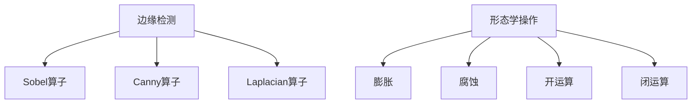

##### 2.1.2 直方图均衡化与对比度增强

直方图均衡化是一种用于增强图像对比度的操作，它通过调整图像的亮度值，使图像的直方图更加均匀。对比度增强则通过调整图像的亮度对比度参数，提高图像的清晰度。

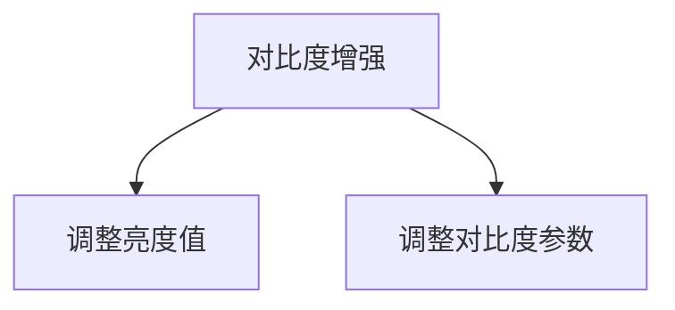

##### 2.1.3 图像裁剪与缩放

图像裁剪是一种用于提取图像特定区域的方法，而缩放则用于调整图像的大小。这两种操作在图像处理中非常常见，尤其是在图像匹配和检索时。

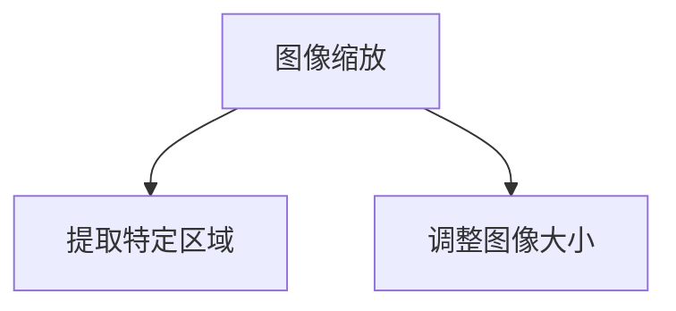

#### 2.2 图像特征提取

图像特征提取是将图像转换为特征向量表示的过程。这些特征向量用于后续的图像匹配和检索。常见的图像特征提取方法包括基于频域、空域和深度学习的特征提取。

##### 2.2.1 基于频域的特征提取

基于频域的特征提取方法包括傅里叶变换（FFT）和小波变换（WT）。这些方法通过分析图像的频率成分，提取出图像的纹理和形状特征。

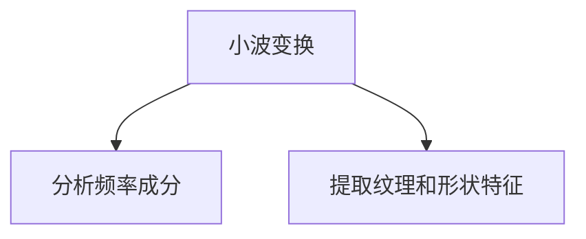

##### 2.2.2 基于空域的特征提取

基于空域的特征提取方法包括SIFT（尺度不变特征变换）和SURF（加速稳健特征）。这些方法通过检测图像的关键点，并计算关键点的描述子，提取出图像的局部特征。

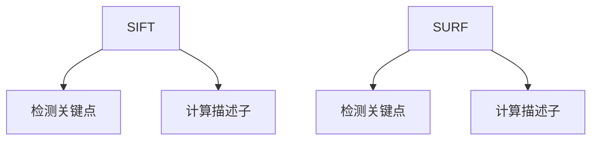

##### 2.2.3 基于深度学习的特征提取

基于深度学习的特征提取方法，如卷积神经网络（CNN）和循环神经网络（RNN），通过训练大量的图像数据，自动提取图像的抽象特征。这些特征向量具有高维、非线性、不变性等特点，能够有效描述图像的内容和语义。

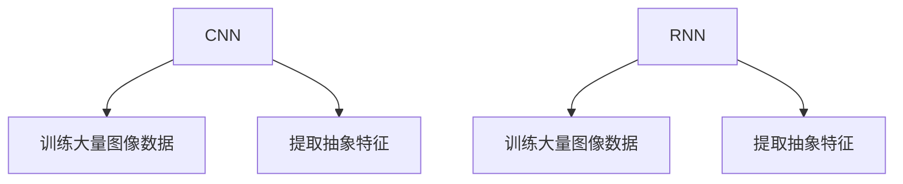

#### 2.3 图像匹配与检索算法

图像匹配与检索算法是将输入图像与数据库中的图像进行对比，找出相似度最高的图像的方法。常见的图像匹配与检索算法包括基于特征点匹配、模板匹配和基于深度学习的匹配算法。

##### 2.3.1 基于特征点匹配的算法

基于特征点匹配的算法，如SIFT和SURF，通过找到图像之间的对应关系，实现图像的精确匹配。这些算法通常通过计算特征点的距离和角度，确定图像之间的相似性。

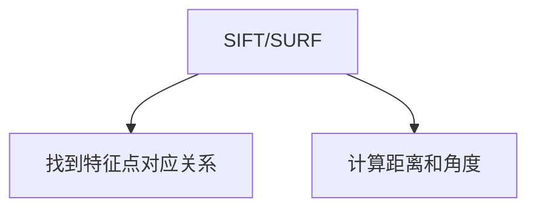

##### 2.3.2 基于模板匹配的算法

基于模板匹配的算法，如相关性匹配和距离度量，通过将输入图像与模板进行相似度比较，找出匹配度最高的区域。这些算法通常通过计算输入图像和模板之间的相似性得分，确定图像之间的匹配度。

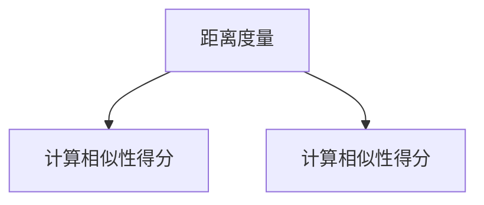

##### 2.3.3 基于深度学习的图像匹配算法

基于深度学习的图像匹配算法，如卷积神经网络（CNN）和深度可分离卷积（Depthwise Separable Convolution），通过训练大量的图像数据，自动提取图像的匹配特征。这些算法通常通过计算输入图像和数据库中图像的特征相似度，实现图像的匹配和检索。

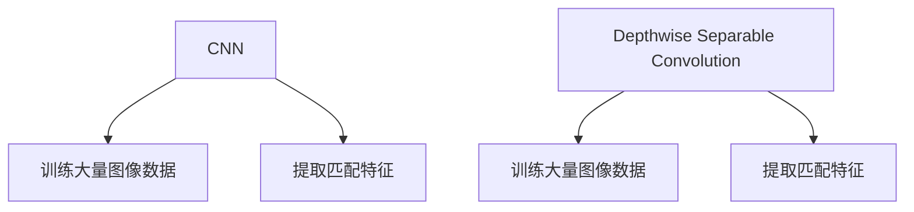

##### 2.3.4 基于最近邻的图像检索

基于最近邻的图像检索是一种简单有效的图像检索方法。它通过计算输入图像与数据库中图像的特征相似度，找出最近邻的图像。这种算法通常通过计算特征向量的欧几里得距离，确定图像之间的相似性。

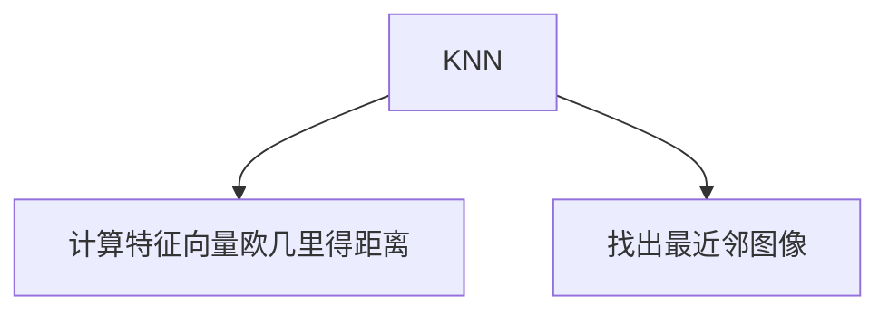

##### 2.3.5 基于索引树的图像检索

基于索引树的图像检索是一种高效的图像检索方法。它通过构建索引树来加速图像检索过程，提高检索速度。常见的索引树包括KD树和Ball Tree，这些算法通常通过计算特征向量的余弦相似度，确定图像之间的相似性。

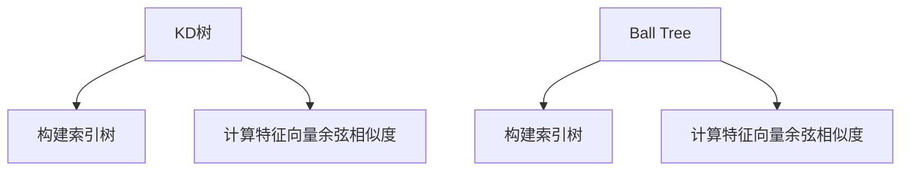

### 第3章：图像匹配与检索算法

#### 3.1 基于传统算法的图像匹配

基于传统算法的图像匹配是指利用传统的图像处理算法，如SIFT和SURF，实现图像之间的匹配。这些算法通常通过检测图像的关键点，并计算关键点的描述子，从而找到图像之间的对应关系。

##### 3.1.1 基于特征点匹配的算法

基于特征点匹配的算法是一种常用的图像匹配方法。它通过找到图像之间的对应关系，实现图像的精确匹配。常见的算法包括SIFT和SURF。

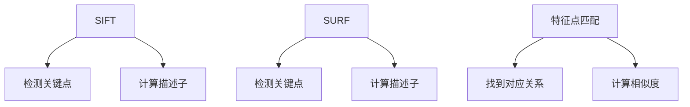

##### 3.1.2 基于模板匹配的算法

基于模板匹配的算法是一种简单的图像匹配方法。它通过将输入图像与模板进行相似度比较，找出匹配度最高的区域。常见的算法包括相关性匹配和距离度量。

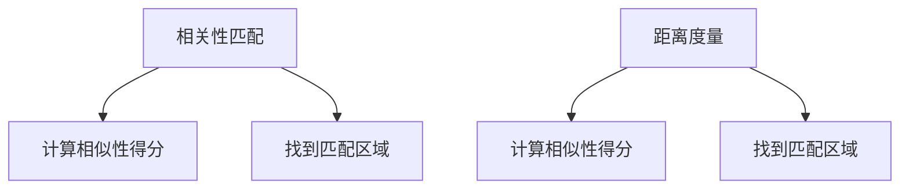

#### 3.2 基于深度学习的图像匹配

基于深度学习的图像匹配是指利用深度学习算法，如卷积神经网络（CNN）和循环神经网络（RNN），实现图像之间的匹配。这些算法通常通过训练大量的图像数据，自动提取图像的特征，从而实现图像的匹配和检索。

##### 3.2.1 卷积神经网络在图像匹配中的应用

卷积神经网络（CNN）是一种用于图像处理和计算机视觉的深度学习算法。它在图像匹配中的应用非常广泛，可以通过训练大量图像数据，自动提取图像的特征。

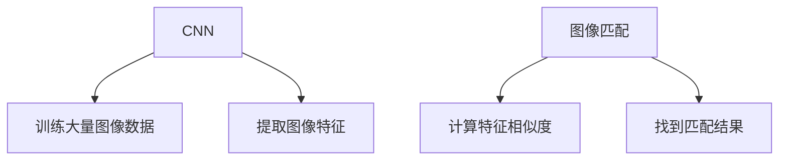

##### 3.2.2 深度可分离卷积在图像匹配中的应用

深度可分离卷积是一种高效的卷积操作，可以将卷积操作分解为深度卷积和逐点卷积，从而提高图像匹配的效率。

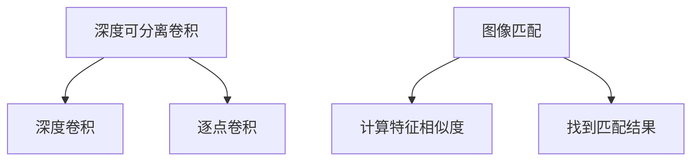

#### 3.3 图像检索算法

图像检索算法是指从数据库中查找与输入图像相似或相关的图像的方法。常见的图像检索算法包括基于最近邻的图像检索和基于索引树的图像检索。

##### 3.3.1 基于最近邻的图像检索

基于最近邻的图像检索是一种简单有效的图像检索方法。它通过计算输入图像与数据库中图像的特征相似度，找出最近邻的图像。

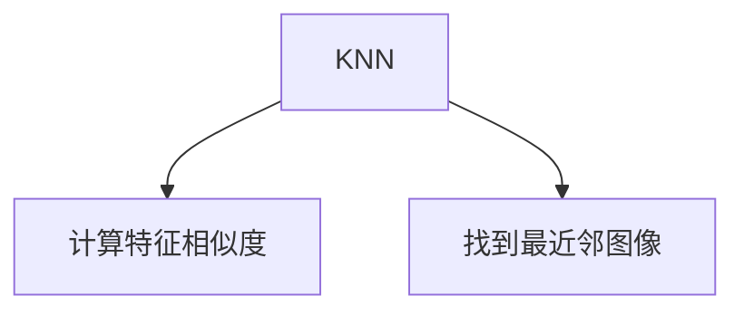

##### 3.3.2 基于索引树的图像检索

基于索引树的图像检索是一种高效的图像检索方法。它通过构建索引树来加速图像检索过程，提高检索速度。常见的索引树包括KD树和Ball Tree。

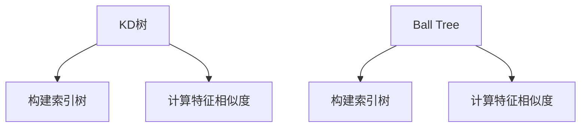

### 第4章：社交网络中的AI图像搜索

#### 4.1 社交网络图像搜索的应用场景

社交网络中的AI图像搜索具有多种应用场景，包括自动标记照片、推荐相关照片和识别重复照片等。

##### 4.1.1 自动标记照片

自动标记照片是社交网络中的一项重要功能。通过AI图像搜索技术，系统可以自动识别照片中的物体、场景和人物，并为其打上标签。这不仅提高了用户的搜索体验，也方便了用户管理和查找照片。

##### 4.1.2 推荐相关照片

AI图像搜索技术还可以用于推荐相关照片。通过分析用户的兴趣和行为，系统可以推荐用户可能感兴趣的照片。例如，当用户浏览某一类照片时，系统可以推荐更多类似的照片，从而增加用户的粘性。

##### 4.1.3 识别重复照片

识别重复照片是社交网络中的一项挑战。用户可能会上传多张相同或类似的照片，这不仅占用存储空间，也影响了用户的体验。通过AI图像搜索技术，系统可以自动识别并删除重复照片，提高存储效率和用户体验。

#### 4.2 社交网络图像搜索的系统架构

社交网络图像搜索的系统架构通常包括数据采集与预处理、图像特征提取、图像匹配与检索和用户界面等组成部分。

##### 4.2.1 数据采集与预处理

数据采集与预处理是社交网络图像搜索的基础。系统需要从多个来源收集图像数据，包括用户上传的照片、社交媒体平台等。然后，对图像进行预处理，包括去噪、增强、裁剪和缩放等操作，以提高图像的质量和一致性。

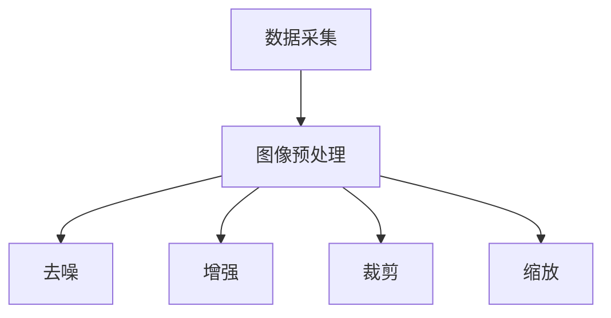

##### 4.2.2 图像特征提取

图像特征提取是将图像转换为特征向量表示的过程。通过深度学习算法，如卷积神经网络（CNN），系统可以自动提取图像的视觉特征，如颜色、纹理和形状等。

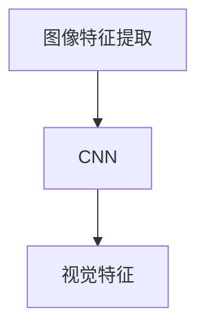

##### 4.2.3 图像匹配与检索

图像匹配与检索是社交网络图像搜索的核心。通过图像匹配算法，系统可以找到输入图像与数据库中图像之间的相似度最高的匹配。然后，基于匹配结果，系统可以检索出相似的照片，供用户浏览和选择。

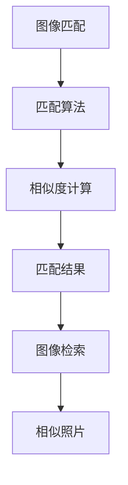

##### 4.2.4 用户界面

用户界面是社交网络图像搜索的展示部分。系统需要提供直观、易用的界面，让用户可以轻松地使用图像搜索功能。例如，用户可以上传照片，系统会自动标记照片并推荐相关照片，用户还可以浏览和选择感兴趣的照片。

```mermaid
graph TB
A[用户界面] --> B[上传照片]
B --> C[自动标记]
C --> D[推荐相关照片]
D --> E[浏览和选择照片]
```

#### 4.3 社交网络图像搜索的挑战与解决方案

社交网络图像搜索面临多个挑战，包括数据多样性、计算资源消耗和隐私保护等。

##### 4.3.1 数据多样性

社交网络中的图像数据具有多样性，包括不同的拍摄设备、光照条件、拍摄角度等。这对图像特征提取和匹配算法提出了挑战。为了解决这一问题，系统可以采用多种特征提取方法，如基于频域、空域和深度学习的特征提取，以提高匹配的准确性。

```mermaid
graph TB
A[数据多样性] --> B[多种特征提取方法]
B --> C[提高匹配准确性]
```

##### 4.3.2 计算资源消耗

深度学习算法需要大量的计算资源，这对实时性要求较高的应用场景提出了挑战。为了解决这一问题，系统可以采用模型压缩和加速技术，如模型剪枝、量化等，以提高计算效率。

```mermaid
graph TB
A[计算资源消耗] --> B[模型压缩和加速]
B --> C[提高计算效率]
```

##### 4.3.3 隐私保护

在社交网络图像搜索中，需要确保用户隐私得到保护，避免图像数据的滥用。为了解决这一问题，系统可以采用隐私保护技术，如差分隐私和同态加密等，以确保用户隐私的安全。

```mermaid
graph TB
A[隐私保护] --> B[隐私保护技术]
B --> C[确保用户隐私安全]
```

### 第5章：电子商务中的AI图像搜索

#### 5.1 电子商务中的图像搜索应用

电子商务中的AI图像搜索应用主要包括快速找到商品、推荐商品和识别商品标签等。

##### 5.1.1 快速找到商品

在电子商务平台中，用户可以通过上传图片来快速找到相似的商品。通过AI图像搜索技术，系统可以自动分析图片内容，并将其与平台上的商品进行匹配，从而帮助用户快速找到心仪的商品。

```mermaid
graph TB
A[用户上传图片] --> B[AI图像搜索]
B --> C[匹配商品]
C --> D[推荐商品]
```

##### 5.1.2 推荐商品

AI图像搜索技术还可以用于推荐商品。通过分析用户的浏览记录和购买行为，系统可以推荐用户可能感兴趣的商品。这种个性化的推荐不仅提高了用户体验，也有助于提高平台的销售额。

```mermaid
graph TB
A[用户行为分析] --> B[AI图像搜索]
B --> C[推荐商品]
```

##### 5.1.3 识别商品标签

识别商品标签是电子商务中的一项重要任务。通过AI图像搜索技术，系统可以自动识别商品上的标签和标识，并将其与平台上的商品信息进行匹配，从而帮助用户更好地了解商品。

```mermaid
graph TB
A[识别商品标签] --> B[AI图像搜索]
B --> C[匹配商品信息]
```

#### 5.2 电子商务图像搜索的系统架构

电子商务图像搜索的系统架构通常包括数据采集与预处理、图像特征提取、图像匹配与检索和用户界面等组成部分。

##### 5.2.1 数据采集与预处理

数据采集与预处理是电子商务图像搜索的基础。系统需要从多个来源收集图像数据，包括用户上传的图片、商品图片库等。然后，对图像进行预处理，包括去噪、增强、裁剪和缩放等操作，以提高图像的质量和一致性。

```mermaid
graph TB
A[数据采集] --> B[图像预处理]
B --> C[去噪]
B --> D[增强]
B --> E[裁剪]
B --> F[缩放]
```

##### 5.2.2 图像特征提取

图像特征提取是将图像转换为特征向量表示的过程。通过深度学习算法，如卷积神经网络（CNN），系统可以自动提取图像的视觉特征，如颜色、纹理和形状等。

```mermaid
graph TB
A[图像特征提取] --> B[CNN]
B --> C[视觉特征]
```

##### 5.2.3 图像匹配与检索

图像匹配与检索是电子商务图像搜索的核心。通过图像匹配算法，系统可以找到输入图像与数据库中图像之间的相似度最高的匹配。然后，基于匹配结果，系统可以检索出相似的商品，供用户浏览和选择。

```mermaid
graph TB
A[图像匹配] --> B[匹配算法]
B --> C[相似度计算]
C --> D[匹配结果]
D --> E[图像检索]
E --> F[相似商品]
```

##### 5.2.4 用户界面

用户界面是电子商务图像搜索的展示部分。系统需要提供直观、易用的界面，让用户可以轻松地使用图像搜索功能。例如，用户可以上传图片，系统会自动标记图片并推荐相关商品，用户还可以浏览和选择感兴趣的商品。

```mermaid
graph TB
A[用户界面] --> B[上传图片]
B --> C[自动标记]
C --> D[推荐商品]
D --> E[浏览和选择商品]
```

#### 5.3 电子商务图像搜索的关键技术

电子商务图像搜索的关键技术包括图像去噪与增强、图像特征融合、图像匹配优化和图像检索优化等。

##### 5.3.1 图像去噪与增强

图像去噪与增强是提高图像质量的重要步骤。通过滤波、增强等技术，可以去除图像中的噪声和增强图像特征，从而提高图像匹配和检索的准确性。

```mermaid
graph TB
A[图像去噪与增强] --> B[滤波]
B --> C[去噪]
B --> D[增强]
```

##### 5.3.2 图像特征融合

图像特征融合是将不同特征的图像转化为统一的特征表示。通过融合颜色、纹理和形状等特征，可以进一步提高图像匹配和检索的准确性。

```mermaid
graph TB
A[图像特征融合] --> B[颜色特征]
B --> C[纹理特征]
B --> D[形状特征]
```

##### 5.3.3 图像匹配优化

图像匹配优化是通过优化匹配算法来提高匹配的准确性。通过优化特征提取、相似度计算和匹配策略等步骤，可以进一步提高图像匹配的准确性。

```mermaid
graph TB
A[图像匹配优化] --> B[特征提取]
B --> C[相似度计算]
B --> D[匹配策略]
```

##### 5.3.4 图像检索优化

图像检索优化是通过优化检索算法来提高检索的准确性。通过优化索引结构、相似度计算和检索策略等步骤，可以进一步提高图像检索的准确性。

```mermaid
graph TB
A[图像检索优化] --> B[索引结构]
B --> C[相似度计算]
B --> D[检索策略]
```

### 第6章：医学影像搜索与诊断

#### 6.1 医学影像搜索的应用

医学影像搜索在医学领域具有重要的应用价值，主要包括辅助诊断、病例检索和病理图像识别等。

##### 6.1.1 辅助诊断

医学影像搜索可以通过分析患者的影像数据，辅助医生进行诊断。通过图像特征提取和匹配算法，系统可以找到与患者影像数据相似的病例，提供诊断参考。

```mermaid
graph TB
A[医学影像搜索] --> B[辅助诊断]
B --> C[分析影像数据]
B --> D[找到相似病例]
```

##### 6.1.2 病例检索

医学影像搜索可以帮助医生快速找到相似的病例，提供诊断参考。通过图像匹配和检索算法，系统可以从海量病例数据库中检索出与患者影像数据相似的病例，帮助医生制定治疗方案。

```mermaid
graph TB
A[医学影像搜索] --> B[病例检索]
B --> C[图像匹配]
B --> D[检索相似病例]
```

##### 6.1.3 病理图像识别

医学影像搜索还可以用于病理图像的识别。通过图像特征提取和匹配算法，系统可以自动识别病理图像中的病变区域，为医生提供诊断依据。

```mermaid
graph TB
A[医学影像搜索] --> B[病理图像识别]
B --> C[图像特征提取]
B --> D[识别病变区域]
```

#### 6.2 医学影像搜索的系统架构

医学影像搜索的系统架构通常包括数据采集与预处理、图像特征提取、图像匹配与检索和医学知识库构建等组成部分。

##### 6.2.1 数据采集与预处理

数据采集与预处理是医学影像搜索的基础。系统需要从多个来源收集影像数据，包括医疗设备、影像数据库等。然后，对影像数据

