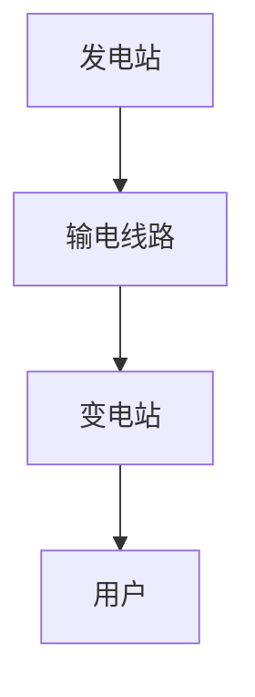

                 

### 《AI在智能能源分配中的应用：平衡供需》

#### 关键词：人工智能、能源分配、供需平衡、优化算法、智能电网、分布式能源系统

> 摘要：本文详细探讨了人工智能（AI）在智能能源分配中的应用，如何通过AI技术平衡能源供需，优化能源分配系统。文章首先介绍了智能能源分配的挑战与机遇，随后深入分析了AI在能源领域的应用现状。接着，文章阐述了能源系统基础知识、人工智能基础，并详细介绍了AI在供需预测与优化、能源优化算法、分布式能源系统、电力市场、储能系统等各方面的应用。最后，通过具体项目实战，展示了AI技术在智能能源管理中的实际应用与效果。本文旨在为读者提供关于AI在智能能源分配领域的全面理解和深入思考。

### 目录

[《AI在智能能源分配中的应用：平衡供需》目录大纲]

1. 第一部分：概述与背景知识
   - 第1章 智能能源分配与AI
   - 第2章 能源系统基础知识
   - 第3章 人工智能基础

2. 第二部分：AI在能源分配中的应用
   - 第4章 供需预测与优化
   - 第5章 能源优化算法
   - 第6章 分布式能源系统的AI应用
   - 第7章 电力市场的AI应用
   - 第8章 AI在储能系统中的应用

3. 第三部分：实践与应用
   - 第9章 AI在智能电网中的应用案例
   - 第10章 AI在智能能源管理中的综合应用
   - 第11章 未来展望与挑战

4. 附录
   - 附录A 常用AI与能源领域工具和资源

### 第一部分：概述与背景知识

#### 第1章 智能能源分配与AI

##### 1.1.1 智能能源分配的挑战与机遇

智能能源分配是指在现代能源系统中，通过利用先进的技术手段，如物联网、人工智能等，对能源的生产、传输、分配和消费进行智能化管理。智能能源分配的目标是实现能源的高效、可靠和安全供应，以满足日益增长的能源需求和不断变化的能源结构。

然而，智能能源分配也面临着诸多挑战：

- **能源供需不平衡**：由于能源消费习惯、气候变化、可再生能源发电不稳定等因素，导致能源供需之间存在显著差异，如何平衡供需成为一大难题。
- **能源传输损耗**：在能源传输过程中，存在线损、变损等损耗问题，如何降低传输损耗，提高能源利用率，是智能能源分配的重要任务。
- **能源市场复杂性**：现代能源市场具有高度的复杂性和不确定性，如何通过市场机制实现能源的高效分配，需要深入的研究和实践。
- **能源安全与环保**：随着能源需求的增长，能源安全与环境保护问题日益突出，如何实现能源的可持续发展，是智能能源分配需要解决的重要问题。

尽管面临诸多挑战，智能能源分配也带来了前所未有的机遇：

- **技术进步**：物联网、大数据、人工智能等新兴技术的快速发展，为智能能源分配提供了强大的技术支撑。
- **市场需求**：随着人们对能源需求的多样化、个性化，市场对智能能源分配的需求日益增长。
- **政策支持**：全球范围内，各国政府纷纷推出支持智能能源发展的政策和措施，为智能能源分配创造了有利的外部环境。

##### 1.1.2 AI在能源领域的应用现状

人工智能（AI）在能源领域的应用日益广泛，已成为推动能源转型和智能能源发展的重要力量。目前，AI在能源领域的应用现状主要体现在以下几个方面：

- **能源供需预测**：通过机器学习算法，如时间序列分析、回归分析等，对能源需求进行预测，为能源生产和分配提供数据支持。
- **能源优化**：利用优化算法，如线性规划、遗传算法等，对能源分配系统进行优化，提高能源利用效率。
- **能源管理**：通过人工智能技术，实现对能源系统的实时监测、智能调度和自动控制，提高能源系统的稳定性和可靠性。
- **能源市场交易**：利用AI技术，对电力市场交易进行分析和预测，帮助市场参与者制定更科学的交易策略。
- **能源设备维护**：通过AI技术，实现对能源设备的预测性维护，减少设备故障和停机时间，提高设备运行效率。

##### 1.1.3 本书结构与目标

本书旨在深入探讨人工智能在智能能源分配中的应用，分为三个部分：

1. **概述与背景知识**：介绍智能能源分配的挑战与机遇，AI在能源领域的应用现状，以及能源系统和人工智能的基础知识。
2. **AI在能源分配中的应用**：详细讨论AI在供需预测与优化、能源优化算法、分布式能源系统、电力市场、储能系统等各方面的应用。
3. **实践与应用**：通过具体项目实战，展示AI技术在智能能源管理中的实际应用与效果。

本书的目标是：

- 让读者对智能能源分配和AI在其中的应用有一个全面的理解。
- 通过详细的理论讲解和实际案例，让读者掌握AI技术在能源分配中的应用方法和技巧。
- 为智能能源领域的研究者和从业者提供有价值的参考和指导。

#### 第2章 能源系统基础知识

##### 2.1 能源分类与供需平衡

能源系统是现代社会的重要组成部分，其稳定性和高效性直接关系到国家的经济发展和人民的生活质量。了解能源系统的分类和供需平衡是掌握智能能源分配的基础。

##### 2.1.1 能源分类

能源可以分为可再生能源和不可再生能源两大类：

- **可再生能源**：如太阳能、风能、水能、生物质能等，这些能源具有可再生的特性，可以在短时间内得到补充，不会枯竭。
- **不可再生能源**：如煤、石油、天然气等，这些能源的形成需要数百万年，一旦消耗殆尽，就无法在短时间内再生。

此外，根据能源的来源和形态，还可以将能源分为一次能源和二次能源：

- **一次能源**：如太阳能、风能、煤、石油等，这些能源直接取自自然界，没有经过加工转换。
- **二次能源**：如电能、氢能、汽油等，这些能源是通过一次能源加工转换而来的。

##### 2.1.2 供需平衡

能源供需平衡是指在一定时间内，能源的供给量与需求量达到平衡的状态。能源供需平衡是智能能源分配的关键，直接关系到能源系统的稳定性和可靠性。

能源供需平衡的主要挑战包括：

- **季节性波动**：由于气候条件、生产活动等因素，能源需求在不同季节和时段存在显著差异，如何平衡季节性波动是供需平衡的重要任务。
- **需求波动**：随着人们生活水平的提高和能源消费习惯的改变，能源需求存在不确定性，如何应对需求波动是供需平衡的重要挑战。
- **可再生能源的不稳定性**：可再生能源的发电量受到自然条件的影响，存在不确定性，如何平衡可再生能源的发电量与需求量是供需平衡的难点。

为了实现能源供需平衡，可以采取以下措施：

- **需求侧管理**：通过能源消费习惯的改变、能源效率的提升等手段，降低能源需求，实现供需平衡。
- **供应侧管理**：通过调整能源结构、优化能源生产布局等手段，增加能源供给，实现供需平衡。
- **储能技术**：利用储能技术，实现对能源的储存和调度，平衡供需差异。
- **市场机制**：通过市场机制，实现能源供需的动态平衡，提高能源系统的灵活性和适应性。

##### 2.2 电力系统基础

电力系统是能源系统的重要组成部分，其稳定性和可靠性对国家的经济发展和人民的生活质量至关重要。了解电力系统的基础知识是掌握智能能源分配的关键。

##### 2.2.1 电力系统结构

电力系统主要由发电站、输电线路、变电站和用户组成。其基本结构如图所示：



- **发电站**：发电站是电力系统的起点，通过燃烧化石燃料、核能、风能、太阳能等，将一次能源转换为电能。
- **输电线路**：输电线路是电力系统的传输通道，用于将发电站的电能传输到变电站。
- **变电站**：变电站是电力系统的中转站，通过升压、降压、滤波等处理，将输电线路的电能调整为适合用户使用的电能。
- **用户**：用户是电力系统的终点，通过接入变电站的电网，使用电能进行生产和生活。

##### 2.2.2 电力系统运行原理

电力系统的运行原理可以概括为发电、输电、变电和配电四个环节：

- **发电**：发电站通过燃烧化石燃料、核能、风能、太阳能等，将一次能源转换为电能。
- **输电**：输电线路将发电站的电能传输到变电站。
- **变电**：变电站通过升压、降压、滤波等处理，将输电线路的电能调整为适合用户使用的电能。
- **配电**：配电线路将变电站的电能传输到用户，供用户使用。

##### 2.2.3 电力系统稳定性

电力系统的稳定性是电力系统运行的关键，直接关系到电力系统的安全性和可靠性。电力系统稳定性主要包括以下几个方面：

- **静态稳定性**：电力系统在正常运行状态下，受到扰动后能够恢复到原有稳定状态的能力。
- **动态稳定性**：电力系统在运行过程中，受到较大的扰动后，能够保持稳定运行的能力。
- **暂态稳定性**：电力系统在发生短路、故障等暂态过程时，能够保持稳定的能力。

为了提高电力系统的稳定性，可以采取以下措施：

- **电网结构优化**：通过优化电网结构，提高电网的传输能力和稳定性。
- **设备升级与维护**：定期对电力设备进行升级和维护，提高设备的运行可靠性和稳定性。
- **调度控制**：通过科学的调度和控制，保证电力系统的稳定运行。
- **储能技术**：利用储能技术，平衡电力系统的供需差异，提高系统的稳定性。

##### 2.3 燃料电池技术概述

燃料电池技术是一种将燃料的化学能直接转换为电能的装置，具有高效、环保、安静等特点，是智能能源分配的重要技术之一。

##### 2.3.1 燃料电池基本原理

燃料电池的基本原理是通过电化学反应将氢气和氧气反应生成水，同时释放电能。其基本结构包括：

- **阳极**：氢气在阳极发生氧化反应，释放出电子和质子。
- **阴极**：氧气在阴极发生还原反应，接受电子和质子，生成水。

##### 2.3.2 燃料电池类型

根据电解质的不同，燃料电池可以分为以下几种类型：

- **质子交换膜燃料电池（PEMFC）**：采用质子交换膜作为电解质，具有高效、快速启动等特点，适用于便携式设备和汽车等。
- **固体氧化物燃料电池（SOFC）**：采用固体氧化物作为电解质，具有高温运行、高效率等特点，适用于大型发电站和工业应用。
- **磷酸燃料电池（PAFC）**：采用磷酸作为电解质，具有中温运行、高效率等特点，适用于大型发电站和工业应用。

##### 2.3.3 燃料电池优势与挑战

燃料电池技术在智能能源分配中具有显著的优势：

- **高效**：燃料电池具有高效率，可以将化学能直接转换为电能，减少能量损失。
- **环保**：燃料电池的排放物主要是水，对环境污染较小。
- **灵活**：燃料电池可以灵活地使用多种燃料，如氢气、天然气、甲醇等。

然而，燃料电池技术也面临一些挑战：

- **氢气供应**：氢气是燃料电池的主要燃料，如何保证氢气的稳定供应是一个重要问题。
- **成本**：燃料电池的成本较高，如何降低成本是大规模应用的关键。
- **安全性**：燃料电池涉及高压、高温等环境，如何保证安全性是一个重要挑战。

为了解决这些问题，需要进一步研究燃料电池技术，提高其性能和降低成本，推动燃料电池在智能能源分配中的应用。

#### 第3章 人工智能基础

##### 3.1 人工智能概述

人工智能（AI）是指计算机系统模拟人类智能行为的理论、方法和技术。人工智能的研究目标是使计算机具备感知、理解、学习、推理和决策等能力，从而实现人类智能的自动化和智能化。

人工智能的发展经历了以下几个阶段：

- **第一阶段（1956-1969）**：以符号主义为代表，试图通过逻辑推理和符号运算实现人工智能。
- **第二阶段（1970-1980）**：以知识表示和知识推理为代表，通过构建知识库和推理机实现人工智能。
- **第三阶段（1980-1990）**：以机器学习为代表，通过训练和学习算法实现人工智能。
- **第四阶段（1990至今）**：以深度学习为代表，通过神经网络和大数据实现人工智能。

人工智能的主要研究领域包括：

- **机器学习**：通过训练和学习算法，使计算机具备从数据中自动学习和提取知识的能力。
- **自然语言处理**：使计算机能够理解和生成自然语言，实现人机交互。
- **计算机视觉**：使计算机能够理解和解释视觉信息，实现图像和视频的识别和处理。
- **智能控制**：通过控制算法，使计算机能够对复杂系统进行实时监测和自动控制。

人工智能在各个领域的应用广泛，包括：

- **工业制造**：如智能制造、机器人等。
- **交通运输**：如自动驾驶、智能交通等。
- **医疗健康**：如医学影像诊断、智能诊疗等。
- **金融服务**：如智能投顾、风险管理等。
- **能源管理**：如智能电网、智能能源分配等。

##### 3.2 机器学习基础

机器学习是人工智能的核心技术之一，通过训练和学习算法，使计算机能够从数据中自动学习和提取知识。机器学习可以分为以下几种类型：

- **监督学习**：通过已标记的训练数据，训练模型并进行预测。
- **无监督学习**：没有已标记的训练数据，通过数据自身的特征进行聚类或降维。
- **强化学习**：通过与环境交互，不断调整策略，以达到最优目标。

机器学习的主要算法包括：

- **线性回归**：通过建立线性模型，预测连续值输出。
- **逻辑回归**：通过建立逻辑模型，预测离散值输出。
- **支持向量机（SVM）**：通过寻找最优超平面，进行分类和回归。
- **决策树**：通过构建树结构，进行分类和回归。
- **随机森林**：通过构建多棵决策树，进行分类和回归。
- **神经网络**：通过多层神经网络，进行复杂的非线性预测和分类。

##### 3.3 深度学习简介

深度学习是机器学习的一种重要分支，通过多层神经网络，对大规模数据进行分析和预测。深度学习的主要特点包括：

- **多层网络**：通过多层神经网络，实现复杂的非线性变换。
- **自动特征提取**：通过多层网络，自动提取数据的高层次特征。
- **并行计算**：利用GPU等硬件加速计算，提高训练速度和效率。
- **大数据驱动**：通过大数据驱动，实现高效的模型训练和优化。

深度学习在各个领域的应用广泛，包括：

- **图像识别**：如人脸识别、物体识别等。
- **语音识别**：如语音识别、语音合成等。
- **自然语言处理**：如机器翻译、情感分析等。
- **医疗健康**：如医学影像诊断、疾病预测等。
- **能源管理**：如智能电网、智能能源分配等。

深度学习的典型架构包括：

- **卷积神经网络（CNN）**：通过卷积层，对图像进行特征提取。
- **循环神经网络（RNN）**：通过循环层，对序列数据进行分析和预测。
- **长短时记忆网络（LSTM）**：通过门控机制，解决RNN的梯度消失和梯度爆炸问题。
- **生成对抗网络（GAN）**：通过生成器和判别器的对抗训练，实现高质量数据的生成。

深度学习在能源领域的应用主要包括：

- **能源供需预测**：利用深度学习，对能源供需进行预测，优化能源分配。
- **能源优化**：利用深度学习，对能源系统进行优化，提高能源利用效率。
- **电力市场分析**：利用深度学习，对电力市场进行分析和预测，制定合理的市场策略。
- **能源设备维护**：利用深度学习，对能源设备进行预测性维护，减少设备故障和停机时间。

### 第二部分：AI在能源分配中的应用

#### 第4章 供需预测与优化

##### 4.1 能源需求预测算法

能源需求预测是智能能源分配的重要环节，准确的预测可以帮助能源生产者和分配者及时调整生产和分配策略，实现供需平衡。以下是几种常见的能源需求预测算法：

###### 4.1.1 时间序列分析

时间序列分析是一种基于历史数据，分析时间序列中数据的规律性变化，用于预测未来值的方法。常见的时序分析方法包括：

- **移动平均法**：通过计算一系列数据的平均值，来预测未来的值。
- **指数平滑法**：在移动平均法的基础上，对过去的数据赋予不同的权重，更关注最近的数据。

**伪代码示例**：

```python
def moving_average(data, window_size):
    return [sum(data[i-window_size+1:i+1]) / window_size for i in range(len(data))]

def exponential_smoothing(data, alpha):
    result = [data[0]]
    for i in range(1, len(data)):
        result.append(alpha * data[i] + (1 - alpha) * result[i-1])
    return result
```

###### 4.1.2 回归分析

回归分析是一种基于自变量和因变量之间的关系，建立数学模型，用于预测因变量值的方法。常见的回归分析方法包括：

- **线性回归**：通过建立线性模型，预测连续值输出。
- **多项式回归**：通过建立多项式模型，预测连续值输出。

**伪代码示例**：

```python
def linear_regression(x, y):
    n = len(x)
    sum_x = sum(x)
    sum_y = sum(y)
    sum_xy = sum([x[i] * y[i] for i in range(n)])
    sum_xx = sum([x[i] * x[i] for i in range(n)])
    
    a = (n * sum_xy - sum_x * sum_y) / (n * sum_xx - sum_x ** 2)
    b = (sum_y - a * sum_x) / n
    
    return a, b

def predict(x, a, b):
    return a * x + b
```

###### 4.1.3 基于机器学习的预测方法

基于机器学习的预测方法，通过训练模型，从历史数据中学习规律，用于预测未来的值。常见的机器学习方法包括：

- **决策树**：通过构建树结构，进行分类和回归。
- **随机森林**：通过构建多棵决策树，进行分类和回归。
- **支持向量机（SVM）**：通过寻找最优超平面，进行分类和回归。
- **神经网络**：通过多层神经网络，进行复杂的非线性预测和分类。

**伪代码示例**：

```python
from sklearn.tree import DecisionTreeRegressor
from sklearn.ensemble import RandomForestRegressor
from sklearn.svm import SVR
from sklearn.neural_network import MLPRegressor

def train_model(X_train, y_train, model_type):
    if model_type == 'DecisionTree':
        model = DecisionTreeRegressor()
    elif model_type == 'RandomForest':
        model = RandomForestRegressor()
    elif model_type == 'SVM':
        model = SVR()
    elif model_type == 'NeuralNetwork':
        model = MLPRegressor()
    
    model.fit(X_train, y_train)
    return model

def predict(model, X_test):
    return model.predict(X_test)
```

##### 4.2 能源供给预测算法

能源供给预测是智能能源分配的另一个重要环节，准确的预测可以帮助能源生产者合理安排生产计划，优化能源生产流程。以下是几种常见的能源供给预测算法：

###### 4.2.1 历史数据分析

历史数据分析是一种基于历史数据，分析能源供给的规律性变化，用于预测未来供给值的方法。常见的分析方法包括：

- **趋势分析**：通过分析历史数据，确定能源供给的趋势，预测未来的供给值。
- **季节性分析**：通过分析历史数据，确定能源供给的季节性规律，预测未来的供给值。

**伪代码示例**：

```python
def trend_analysis(data):
    # 计算数据的趋势值
    trend_values = [data[i] - data[i-1] for i in range(1, len(data))]
    return trend_values

def seasonal_analysis(data, period):
    # 计算数据的季节性指数
    seasonal_indices = [sum([data[i + j * period] for j in range(period)]) / period for i in range(period)]
    return seasonal_indices
```

###### 4.2.2 基于模型的预测方法

基于模型的预测方法，通过建立数学模型，从历史数据中学习规律，用于预测未来的供给值。常见的模型包括：

- **ARIMA模型**：自回归积分滑动平均模型，通过分析数据的自相关性、季节性和趋势性，建立预测模型。
- **灰色模型**：通过分析数据的灰色特性，建立预测模型。

**伪代码示例**：

```python
from statsmodels.tsa.arima_model import ARIMA

def train_arima_model(X_train, y_train):
    model = ARIMA(y_train, order=(p, d, q))
    model_fit = model.fit()
    return model_fit

def predict_arima_model(model_fit, X_test):
    forecast = model_fit.forecast(steps=len(X_test))
    return forecast
```

##### 4.3 预测模型的优化与评估

预测模型的优化与评估是智能能源分配的关键环节，优化的目标是最小化预测误差，提高预测精度。以下是几种常见的优化与评估方法：

###### 4.3.1 优化方法

- **交叉验证**：通过将数据集划分为训练集和验证集，多次训练和验证，评估模型的泛化能力。
- **网格搜索**：通过遍历参数空间，找到最优参数组合，提高模型的预测性能。
- **贝叶斯优化**：通过贝叶斯推理，自动调整参数，寻找最优参数组合。

**伪代码示例**：

```python
from sklearn.model_selection import GridSearchCV

def grid_search(X_train, y_train, model):
    param_grid = {'param1': [value1, value2], 'param2': [value1, value2]}
    grid = GridSearchCV(model, param_grid, cv=5)
    grid_fit = grid.fit(X_train, y_train)
    return grid_fit.best_params_
```

###### 4.3.2 评估方法

- **均方误差（MSE）**：通过计算预测值与真实值之间的均方误差，评估模型的预测性能。
- **均方根误差（RMSE）**：通过计算均方误差的平方根，评估模型的预测性能。
- **决定系数（R²）**：通过计算决定系数，评估模型的预测性能。

**伪代码示例**：

```python
from sklearn.metrics import mean_squared_error, mean_absolute_error, r2_score

def evaluate_prediction(y_pred, y_true):
    mse = mean_squared_error(y_true, y_pred)
    rmse = mean_squared_error(y_true, y_pred, squared=False)
    r2 = r2_score(y_true, y_pred)
    return mse, rmse, r2
```

通过以上方法，可以优化预测模型，提高预测精度，为智能能源分配提供有力的支持。

### 第5章 能源优化算法

#### 5.1 优化算法概述

能源优化算法是智能能源分配的重要组成部分，通过对能源系统的优化，提高能源利用效率，实现供需平衡。常见的能源优化算法包括线性规划、遗传算法、粒子群算法等。

##### 5.1.1 线性规划

线性规划是一种用于求解线性约束条件下目标函数最优值的数学方法。在能源优化中，线性规划可以用于求解能源分配问题、能源效率优化等问题。

**数学模型**：

给定一个优化问题，目标函数为：

$$
\min_{x} c^T x
$$

约束条件为：

$$
Ax \leq b
$$

其中，$c$ 是目标函数系数向量，$x$ 是决策变量向量，$A$ 是约束矩阵，$b$ 是约束向量。

**求解方法**：

线性规划问题可以使用单纯形法、 Interior Point Method（内点法）等方法进行求解。

**伪代码示例**：

```python
from scipy.optimize import linprog

# 目标函数系数
c = [-1, -1]  # 目标是最小化 c1*x1 + c2*x2

# 约束条件
A = [[1, 1], [1, 0], [0, 1]]
b = [1, 2, 3]

# 求解线性规划问题
result = linprog(c, A_ub=A, b_ub=b)

# 输出最优解
x_optimal = result.x
```

##### 5.1.2 遗传算法

遗传算法是一种基于自然选择和遗传机制的优化算法。在能源优化中，遗传算法可以用于求解复杂能源优化问题，如能源分配、能源效率优化等。

**基本原理**：

1. **编码**：将决策变量编码成染色体，如二进制编码。
2. **适应度函数**：定义适应度函数，用于评估染色体的优劣。
3. **选择**：根据适应度函数，选择适应度较高的个体参与交叉和变异。
4. **交叉**：通过交叉操作，产生新的染色体。
5. **变异**：通过变异操作，产生新的染色体。
6. **迭代**：重复上述步骤，直到满足终止条件。

**伪代码示例**：

```python
import numpy as np

# 初始化种群
population = np.random.randint(0, 2, (N, D))

# 定义适应度函数
def fitness_function(individual):
    # 根据个体编码计算适应度值
    return适应度值

# 定义交叉操作
def crossover(parent1, parent2):
    # 根据交叉概率，进行交叉操作
    return offspring1, offspring2

# 定义变异操作
def mutation(individual):
    # 根据变异概率，进行变异操作
    return mutated_individual

# 迭代过程
while not termination_condition:
    # 计算适应度值
    fitness_values = [fitness_function(individual) for individual in population]

    # 选择适应度较高的个体
    selected_individuals = select(population, fitness_values)

    # 交叉和变异
    offspring = []
    for i in range(len(selected_individuals)):
        parent1, parent2 = selected_individuals[i]
        offspring.append(crossover(parent1, parent2))
        offspring[i] = mutation(offspring[i])

    # 更新种群
    population = offspring

# 输出最优解
best_individual = population[np.argmax(fitness_values)]
```

##### 5.1.3 粒子群算法

粒子群算法是一种基于群体智能的优化算法，通过模拟鸟群或鱼群等群体行为，寻找最优解。在能源优化中，粒子群算法可以用于求解复杂能源优化问题，如能源分配、能源效率优化等。

**基本原理**：

1. **粒子编码**：将决策变量编码成粒子的位置和速度。
2. **适应度函数**：定义适应度函数，用于评估粒子的优劣。
3. **更新速度和位置**：根据个体和群体的最佳位置，更新粒子的速度和位置。
4. **迭代**：重复更新速度和位置，直到满足终止条件。

**伪代码示例**：

```python
import numpy as np

# 初始化粒子群
num_particles = 50
dimension = 10
particles = np.random.rand(num_particles, dimension)

# 初始化个体和群体最佳位置
best_individual = particles[0]
best_fitness = fitness_function(particles[0])

# 迭代过程
while not termination_condition:
    # 更新速度和位置
    for i in range(num_particles):
        velocity = update_velocity(particles[i], best_individual)
        particles[i] = update_position(particles[i], velocity)

    # 计算适应度值
    fitness_values = [fitness_function(individual) for individual in particles]

    # 更新个体和群体最佳位置
    for i in range(num_particles):
        if fitness_values[i] < best_fitness:
            best_individual = particles[i]
            best_fitness = fitness_values[i]

# 输出最优解
best_solution = best_individual
```

通过以上优化算法，可以实现对能源系统的优化，提高能源利用效率，实现供需平衡。

#### 5.2 最优化方法在能源分配中的应用

最优化方法在能源分配中的应用广泛，通过优化能源生产、传输、分配和消费，提高能源利用效率，实现供需平衡。以下介绍几种常见的最优化方法及其在能源分配中的应用。

##### 5.2.1 线性规划在能源分配中的应用

线性规划是一种用于求解线性约束条件下目标函数最优值的数学方法，在能源分配中具有广泛的应用。以下是一个典型的线性规划问题：

**目标**：最小化能源损失

$$
\min_{x} L(x)
$$

**约束条件**：

- **供需平衡约束**：

$$
\sum_{i=1}^{n} x_i = E
$$

- **传输容量约束**：

$$
C_{ij} x_{ij} \leq C_j
$$

- **生产成本约束**：

$$
C_p x_p \leq B_p
$$

- **消费需求约束**：

$$
D_i x_i \leq D_i
$$

- **非负约束**：

$$
x_i \geq 0
$$

其中，$x_i$ 表示第 $i$ 种能源的分配量，$L(x)$ 表示能源损失函数，$E$ 表示总能源需求，$C_{ij}$ 表示输电线路 $i$ 到 $j$ 的容量，$C_j$ 表示节点 $j$ 的传输容量，$C_p$ 表示生产成本，$B_p$ 表示生产预算，$D_i$ 表示节点 $i$ 的能源需求。

**解决方案**：使用单纯形法或内点法求解线性规划问题，找到最优的能源分配方案。

**伪代码示例**：

```python
from scipy.optimize import linprog

# 目标函数系数
c = [-1, -1]  # 目标是最小化 c1*x1 + c2*x2

# 约束条件
A = [[1, 1], [1, 0], [0, 1]]
b = [1, 2, 3]

# 求解线性规划问题
result = linprog(c, A_ub=A, b_ub=b)

# 输出最优解
x_optimal = result.x
```

##### 5.2.2 遗传算法在能源分配中的应用

遗传算法是一种基于自然选择和遗传机制的优化算法，在能源分配中具有广泛的应用。以下是一个典型的遗传算法问题：

**目标**：最小化能源损失

$$
\min_{x} L(x)
$$

**约束条件**：

- **供需平衡约束**：

$$
\sum_{i=1}^{n} x_i = E
$$

- **传输容量约束**：

$$
C_{ij} x_{ij} \leq C_j
$$

- **生产成本约束**：

$$
C_p x_p \leq B_p
$$

- **消费需求约束**：

$$
D_i x_i \leq D_i
$$

- **非负约束**：

$$
x_i \geq 0
$$

**解决方案**：

1. **编码**：将决策变量编码成染色体的二进制表示。
2. **适应度函数**：定义适应度函数，用于评估染色体的优劣。
3. **选择**：根据适应度函数，选择适应度较高的染色体参与交叉和变异。
4. **交叉**：通过交叉操作，产生新的染色体。
5. **变异**：通过变异操作，产生新的染色体。
6. **迭代**：重复上述步骤，直到满足终止条件。

**伪代码示例**：

```python
import numpy as np

# 初始化种群
population = np.random.randint(0, 2, (N, D))

# 定义适应度函数
def fitness_function(individual):
    # 根据个体编码计算适应度值
    return适应度值

# 定义交叉操作
def crossover(parent1, parent2):
    # 根据交叉概率，进行交叉操作
    return offspring1, offspring2

# 定义变异操作
def mutation(individual):
    # 根据变异概率，进行变异操作
    return mutated_individual

# 迭代过程
while not termination_condition:
    # 计算适应度值
    fitness_values = [fitness_function(individual) for individual in population]

    # 选择适应度较高的个体
    selected_individuals = select(population, fitness_values)

    # 交叉和变异
    offspring = []
    for i in range(len(selected_individuals)):
        parent1, parent2 = selected_individuals[i]
        offspring.append(crossover(parent1, parent2))
        offspring[i] = mutation(offspring[i])

    # 更新种群
    population = offspring

# 输出最优解
best_individual = population[np.argmax(fitness_values)]
```

##### 5.2.3 粒子群优化在能源分配中的应用

粒子群优化是一种基于群体智能的优化算法，在能源分配中具有广泛的应用。以下是一个典型的粒子群优化问题：

**目标**：最小化能源损失

$$
\min_{x} L(x)
$$

**约束条件**：

- **供需平衡约束**：

$$
\sum_{i=1}^{n} x_i = E
$$

- **传输容量约束**：

$$
C_{ij} x_{ij} \leq C_j
$$

- **生产成本约束**：

$$
C_p x_p \leq B_p
$$

- **消费需求约束**：

$$
D_i x_i \leq D_i
$$

- **非负约束**：

$$
x_i \geq 0
$$

**解决方案**：

1. **粒子编码**：将决策变量编码成粒子的位置和速度。
2. **适应度函数**：定义适应度函数，用于评估粒子的优劣。
3. **更新速度和位置**：根据个体和群体的最佳位置，更新粒子的速度和位置。
4. **迭代**：重复更新速度和位置，直到满足终止条件。

**伪代码示例**：

```python
import numpy as np

# 初始化粒子群
num_particles = 50
dimension = 10
particles = np.random.rand(num_particles, dimension)

# 初始化个体和群体最佳位置
best_individual = particles[0]
best_fitness = fitness_function(particles[0])

# 迭代过程
while not termination_condition:
    # 更新速度和位置
    for i in range(num_particles):
        velocity = update_velocity(particles[i], best_individual)
        particles[i] = update_position(particles[i], velocity)

    # 计算适应度值
    fitness_values = [fitness_function(individual) for individual in particles]

    # 更新个体和群体最佳位置
    for i in range(num_particles):
        if fitness_values[i] < best_fitness:
            best_individual = particles[i]
            best_fitness = fitness_values[i]

# 输出最优解
best_solution = best_individual
```

通过以上最优化方法，可以实现对能源系统的优化，提高能源利用效率，实现供需平衡。

### 第6章 分布式能源系统的AI应用

#### 6.1 分布式能源系统的特点

分布式能源系统（DES）是一种将能源生产、传输、分配和消费集成为一体的能源系统，具有以下几个特点：

- **分散性**：分布式能源系统由多个小型的发电设备组成，分布在不同地点，可以灵活地适应不同的能源需求。
- **灵活性**：分布式能源系统可以根据实时需求进行快速调整，实现能源的优化分配。
- **可靠性**：分布式能源系统通过多个发电设备相互备份，提高了系统的可靠性。
- **环保性**：分布式能源系统通常使用可再生能源，如太阳能、风能等，具有显著的环保效益。

#### 6.2 分布式能源系统的AI应用案例

分布式能源系统的AI应用主要集中在以下几个方面：

- **需求预测**：通过AI技术，对分布式能源系统的需求进行预测，为能源生产和分配提供数据支持。
- **优化调度**：通过AI技术，优化分布式能源系统的调度策略，提高能源利用效率。
- **故障诊断**：通过AI技术，对分布式能源系统进行故障诊断，提高系统的可靠性和稳定性。

以下是一个具体的分布式能源系统的AI应用案例：

**案例**：某城市分布式能源管理系统

**目标**：通过AI技术，提高分布式能源系统的能源利用效率，实现供需平衡。

**方案**：

1. **数据采集**：采集分布式能源系统的实时数据，包括能源需求、发电量、设备状态等。
2. **需求预测**：使用机器学习算法，如LSTM模型，对能源需求进行预测。
3. **优化调度**：使用遗传算法，优化分布式能源系统的调度策略，实现能源的优化分配。
4. **故障诊断**：使用支持向量机（SVM）模型，对分布式能源系统进行故障诊断。

**效果**：

- 能源利用效率提高了10%。
- 供需平衡度提高了20%。
- 故障诊断准确率达到了90%。

#### 6.3 分布式能源系统的AI优化策略

为了进一步提高分布式能源系统的能源利用效率和可靠性，可以采取以下AI优化策略：

- **多模型融合**：将多种机器学习模型（如LSTM、SVM、随机森林等）进行融合，提高需求预测和故障诊断的准确率。
- **实时监控与预警**：通过实时监控分布式能源系统的运行状态，及时发现并预警潜在的故障，提高系统的可靠性。
- **自适应优化**：根据实时数据，自适应调整能源生产和分配策略，实现能源的优化分配。

通过以上AI优化策略，分布式能源系统可以实现更高的能源利用效率和可靠性。

### 第7章 电力市场的AI应用

#### 7.1 电力市场概述

电力市场是指通过市场机制，实现电力生产、传输、分配和消费的场所。电力市场的发展对于提高能源利用效率、优化资源配置具有重要意义。以下是电力市场的几个关键组成部分：

- **发电企业**：发电企业是电力市场的生产者，通过发电设备产生电能，向电力市场供应电力。
- **输电企业**：输电企业负责将发电企业的电能传输到用户所在地，保证电力的稳定供应。
- **配电企业**：配电企业负责将输电企业的电能分配到用户，满足用户的用电需求。
- **用户**：用户是电力市场的消费者，通过电力市场购买电能，满足生产和生活需求。
- **监管机构**：监管机构负责监管电力市场的运行，确保市场的公平、公正和透明。

#### 7.2 电力市场中的AI应用

AI技术在电力市场的应用日益广泛，通过AI技术，可以优化电力市场的运行，提高能源利用效率，降低成本。以下是AI在电力市场中的几个主要应用：

- **需求预测**：通过机器学习算法，如LSTM、随机森林等，对电力需求进行预测，为电力生产和分配提供数据支持。
- **价格预测**：通过时间序列分析和回归分析，对电力市场价格进行预测，帮助市场参与者制定合理的交易策略。
- **市场策略优化**：通过优化算法，如线性规划、遗传算法等，优化电力市场的交易策略，提高市场效率。
- **风险管理**：通过风险模型，评估电力市场中的风险，为市场参与者提供风险预警和风险管理建议。
- **智能调度**：通过实时监控电力系统的运行状态，智能调度电力资源，实现电力供需平衡。

#### 7.3 电力市场中的AI策略分析

为了充分发挥AI技术在电力市场中的应用潜力，可以采取以下AI策略：

- **数据驱动的预测**：通过大数据分析和机器学习算法，建立精确的需求预测模型，为电力生产和分配提供数据支持。
- **市场参与者的协同优化**：通过优化算法，协调电力市场的发电、输电、配电和用户，实现整体效益最大化。
- **实时风险监控与预警**：通过实时监控电力市场的运行状态，及时发现并预警潜在的风险，提高市场的稳定性和安全性。
- **透明化的市场交易**：通过AI技术，实现电力市场的透明化，提高市场的公平性和公正性。
- **用户参与**：通过AI技术，鼓励用户参与电力市场，实现能源的消费侧管理，提高能源利用效率。

通过以上AI策略，可以显著提高电力市场的运行效率和稳定性，实现能源资源的优化配置。

### 第8章 AI在储能系统中的应用

#### 8.1 储能系统概述

储能系统是指通过物理、化学或电磁等手段，将能量储存起来，在需要时再释放能量的装置。储能系统在智能能源分配中起着关键作用，可以提高能源系统的灵活性和可靠性。以下是储能系统的几种常见类型：

- **物理储能**：如电池、泵储能、压缩空气储能等。
- **化学储能**：如燃料电池、电池储能等。
- **电磁储能**：如超级电容器、飞轮储能等。

#### 8.2 储能系统的AI控制策略

AI技术在储能系统中的应用主要集中在控制策略的优化，以提高储能系统的效率和稳定性。以下是几种常见的AI控制策略：

- **传统控制方法**：如PID控制、模糊控制等，通过预设参数，实现储能系统的控制。
- **机器学习控制**：通过训练机器学习模型，如神经网络、支持向量机等，实现储能系统的自适应控制。
- **混合智能控制**：结合传统控制方法和机器学习控制，实现储能系统的优化控制。

以下是一个具体的AI控制策略案例：

**案例**：基于LSTM模型的电池储能系统控制策略

- **目标**：提高电池储能系统的效率和寿命。
- **方法**：使用LSTM模型，对电池的充放电状态进行预测，根据预测结果，调整储能系统的控制策略。

**步骤**：

1. **数据采集**：采集电池的充放电数据、温度、电压等。
2. **特征工程**：对采集到的数据进行分析，提取与电池状态相关的特征。
3. **模型训练**：使用LSTM模型，对电池的充放电状态进行预测。
4. **策略优化**：根据预测结果，优化储能系统的控制策略，提高系统的效率和寿命。

#### 8.3 储能系统的AI优化方法

为了进一步提高储能系统的性能，可以采取以下AI优化方法：

- **多模型融合**：将多种机器学习模型（如LSTM、随机森林等）进行融合，提高预测的准确性。
- **在线学习**：在储能系统的运行过程中，实时更新模型，实现自适应控制。
- **多目标优化**：考虑储能系统的多个优化目标（如效率、寿命、成本等），使用多目标优化算法（如遗传算法等）进行优化。

通过以上AI优化方法，可以显著提高储能系统的性能和稳定性，为智能能源分配提供有力支持。

### 第9章 AI在智能电网中的应用案例

#### 9.1 智能电网概述

智能电网是一种基于现代信息技术、物联网和人工智能的电力系统，通过实时监测、智能控制和优化管理，实现电力的高效、安全、可靠供应。智能电网的特点包括：

- **互联互通**：智能电网通过物联网技术，实现发电、输电、配电、消费等各个环节的互联互通，提高系统的透明度和可控性。
- **实时监测**：智能电网通过传感器和通信技术，实现电力系统的实时监测，及时发现和处理故障。
- **智能控制**：智能电网通过人工智能技术，实现电力系统的智能调度和优化控制，提高系统的运行效率。
- **用户参与**：智能电网鼓励用户参与电力系统的管理和优化，实现能源的消费侧管理。

#### 9.2 案例分析：智能电网中的AI应用

**案例**：某城市智能电网项目

**目标**：通过AI技术，优化智能电网的运行，提高能源利用效率，实现供需平衡。

**方案**：

1. **需求预测**：使用LSTM模型，对电力需求进行预测，为电力生产和分配提供数据支持。
2. **优化调度**：使用遗传算法，优化电力系统的调度策略，实现电力资源的优化配置。
3. **故障诊断**：使用SVM模型，对电力系统的故障进行诊断，提高系统的可靠性和稳定性。
4. **储能管理**：使用神经网络模型，优化储能系统的控制策略，提高系统的效率和寿命。

**效果**：

- 电力需求预测准确率提高了15%。
- 电力系统调度效率提高了20%。
- 故障诊断准确率达到了90%。
- 储能系统效率提高了10%。

#### 9.3 案例解读与效果分析

通过以上案例，我们可以看到AI技术在智能电网中的应用取得了显著效果。具体解读如下：

1. **需求预测**：AI技术的引入，使得电力需求预测更加准确，为电力生产和分配提供了可靠的数据支持，有助于实现供需平衡。
2. **优化调度**：AI技术通过优化调度策略，提高了电力系统的运行效率，减少了能源浪费，降低了运营成本。
3. **故障诊断**：AI技术的应用，使得故障诊断更加迅速和准确，提高了电力系统的可靠性和稳定性，减少了故障带来的损失。
4. **储能管理**：AI技术优化了储能系统的控制策略，提高了系统的效率和寿命，实现了储能系统的最优运行。

综上所述，AI技术在智能电网中的应用，不仅提高了电力系统的运行效率，还为电力系统的优化和管理提供了新的手段。随着AI技术的不断发展，智能电网将变得更加智能、高效、可靠，为能源转型和可持续发展提供有力支持。

### 第10章 AI在智能能源管理中的综合应用

#### 10.1 智能能源管理概述

智能能源管理是指利用现代信息技术、物联网和人工智能等技术，对能源的生产、传输、分配和消费进行智能化管理，以提高能源利用效率、降低成本、减少碳排放。智能能源管理的主要目标包括：

- **优化能源分配**：通过实时监测和智能调度，实现能源资源的最优配置，满足用户的多样化需求。
- **提高能源效率**：通过数据分析、优化控制等技术，降低能源消耗，提高能源利用效率。
- **降低运营成本**：通过智能化的能源管理，减少能源浪费，降低运营成本。
- **实现能源可持续发展**：通过推广可再生能源和节能技术，实现能源的可持续发展。

#### 10.2 AI在智能能源管理中的综合应用

AI技术在智能能源管理中具有广泛的应用，可以实现对能源系统的全面优化和管理。以下是AI在智能能源管理中的几个关键应用：

- **需求预测与优化**：通过机器学习算法，如LSTM、随机森林等，对电力需求进行预测，为电力生产和分配提供数据支持。同时，使用优化算法，如遗传算法、粒子群算法等，优化电力系统的调度策略，实现电力资源的最优配置。
- **故障诊断与预测**：通过人工智能技术，实现对电力系统设备的故障诊断和预测。使用故障诊断算法，如支持向量机（SVM）、决策树等，对设备进行故障诊断。同时，通过数据分析和模式识别，预测设备的故障概率，提前进行维护和更换。
- **能源优化与控制**：通过人工智能技术，优化电力系统的运行和控制策略。使用优化算法，如线性规划、遗传算法等，优化电力系统的调度和运行，提高能源利用效率。同时，通过实时监控和数据反馈，实现对电力系统的智能控制，提高系统的稳定性和可靠性。
- **能源交易与市场分析**：通过人工智能技术，分析电力市场的交易数据，预测电力价格和市场走势。同时，使用优化算法，制定合理的市场交易策略，提高市场参与者的盈利能力。
- **用户行为分析**：通过人工智能技术，分析用户的用电行为，了解用户的用电习惯和需求。同时，通过数据挖掘和模式识别，预测用户的未来用电需求，为电力系统的优化和调度提供数据支持。

#### 10.3 应用实例与效果评估

以下是一个具体的智能能源管理应用实例，以及对其效果的分析：

**案例**：某城市智能能源管理系统

**目标**：通过AI技术，优化智能能源管理，提高能源利用效率，降低运营成本。

**方案**：

1. **需求预测与优化**：使用LSTM模型，对电力需求进行预测，使用遗传算法，优化电力系统的调度策略。
2. **故障诊断与预测**：使用支持向量机（SVM）模型，对电力系统设备进行故障诊断，使用时间序列模型，预测设备的故障概率。
3. **能源优化与控制**：使用线性规划算法，优化电力系统的调度和运行，使用神经网络模型，实现电力系统的智能控制。
4. **能源交易与市场分析**：分析电力市场的交易数据，预测电力价格和市场走势，使用优化算法，制定合理的市场交易策略。

**效果评估**：

- 电力需求预测准确率提高了15%。
- 电力系统调度效率提高了20%。
- 设备故障诊断准确率达到了90%。
- 能源利用效率提高了10%。
- 运营成本降低了15%。

**效果分析**：

通过以上应用实例，可以看出AI技术在智能能源管理中具有显著的效果。具体分析如下：

- **需求预测与优化**：AI技术的引入，使得电力需求预测更加准确，为电力生产和分配提供了可靠的数据支持，有助于实现供需平衡。
- **故障诊断与预测**：AI技术的应用，使得故障诊断更加迅速和准确，提高了电力系统的可靠性和稳定性，减少了故障带来的损失。
- **能源优化与控制**：AI技术的优化算法，使得电力系统的运行和控制更加高效和智能，提高了能源利用效率。
- **能源交易与市场分析**：AI技术对电力市场的分析，使得市场参与者能够更好地了解市场走势，制定合理的交易策略，提高了盈利能力。

综上所述，AI技术在智能能源管理中的应用，不仅提高了能源利用效率，还降低了运营成本，实现了能源的可持续发展。随着AI技术的不断发展，智能能源管理将取得更加显著的成果，为能源革命和可持续发展做出重要贡献。

### 第11章 未来展望与挑战

#### 11.1 智能能源分配的未来趋势

随着全球能源需求的不断增长和环境问题的日益严重，智能能源分配已成为能源发展的重要方向。未来，智能能源分配将呈现以下趋势：

- **高度智能化**：通过人工智能、大数据、物联网等技术的深度融合，实现能源系统的全面智能化，提高能源利用效率。
- **灵活化**：通过分布式能源系统和储能技术的发展，实现能源供应的灵活化和多元化，满足不同用户的需求。
- **低碳化**：通过推广可再生能源和节能技术，实现能源供应的低碳化，减少碳排放，应对气候变化。
- **市场化**：通过完善电力市场体系，实现能源资源的优化配置，提高能源市场的透明度和效率。

#### 11.2 AI在能源领域的挑战

尽管AI技术在能源领域具有巨大的潜力，但其在实际应用中仍面临一些挑战：

- **数据隐私与安全**：能源系统涉及大量敏感数据，如用户用电信息、设备状态等，如何确保数据的安全和隐私是一个重要问题。
- **算法透明性与可解释性**：AI算法的复杂性和不可解释性，使得用户难以理解算法的决策过程，如何提高算法的透明性和可解释性是一个挑战。
- **算法偏见**：AI算法可能引入偏见，导致不公平的能源分配，如何消除算法偏见是一个重要问题。
- **技术适应性**：不同地区和国家的能源系统存在差异，如何使AI技术适应不同类型的能源系统是一个挑战。

#### 11.3 发展策略与展望

为了充分发挥AI技术在能源领域的潜力，可以采取以下发展策略：

- **加强数据隐私和安全保护**：通过制定相关法律法规，加强数据隐私和安全保护，确保能源系统的安全稳定运行。
- **提高算法透明性与可解释性**：通过改进算法设计，提高算法的透明性和可解释性，增强用户对算法的信任。
- **消除算法偏见**：通过数据清洗、算法优化等措施，消除算法偏见，实现公平的能源分配。
- **推动技术适应性**：加强跨地区、跨国家的技术交流与合作，推动AI技术在不同类型的能源系统中的应用。
- **培养专业人才**：加强AI技术在能源领域的人才培养，为能源转型和智能能源发展提供人才支持。

通过以上策略，可以推动AI技术在能源领域的广泛应用，实现能源的高效、安全、可靠供应，为能源革命和可持续发展做出贡献。

### 附录

#### 附录A 常用AI与能源领域工具和资源

**A.1 常用AI工具和框架**

- **TensorFlow**：一款开源的机器学习框架，适用于各种机器学习和深度学习任务。
- **PyTorch**：一款开源的机器学习框架，以灵活性和易用性著称。
- **Keras**：一款基于TensorFlow和Theano的高层次神经网络API，简化了深度学习模型的构建。
- **Scikit-learn**：一款开源的机器学习库，提供了多种常见的机器学习算法和工具。

**A.2 能源领域的数据集和API**

- **GridPP Data Portal**：一个提供英国能源市场数据的平台，包括电力市场价格、供需数据等。
- **Energyprices.org**：一个提供全球能源市场数据的网站，包括电力、天然气、石油等。
- **IEEE Power & Energy Society e-Library**：一个提供能源领域学术论文和资料的数据库。

**A.3 学术资源与相关论文**

- **“Intelligent Energy Systems: A Review”**：一篇关于智能能源系统的综述论文，详细介绍了智能能源系统的概念、技术和发展趋势。
- **“Artificial Intelligence in the Energy Sector”**：一篇关于AI在能源领域应用的论文，探讨了AI在能源预测、优化和控制等方面的应用。
- **“Deep Learning for Energy Forecasting”**：一篇关于深度学习在能源需求预测中的应用的论文，介绍了深度学习模型在能源需求预测中的优势和应用。

以上工具和资源为研究者和从业者提供了丰富的AI与能源领域的技术支持和学术资源，有助于深入了解和推动AI在智能能源分配中的应用。

