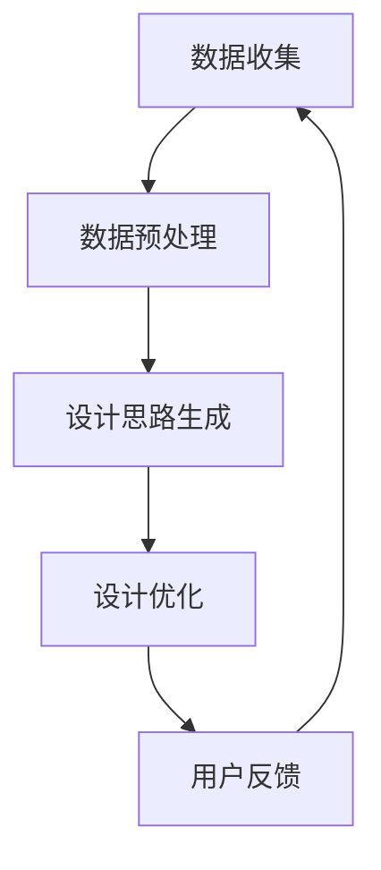
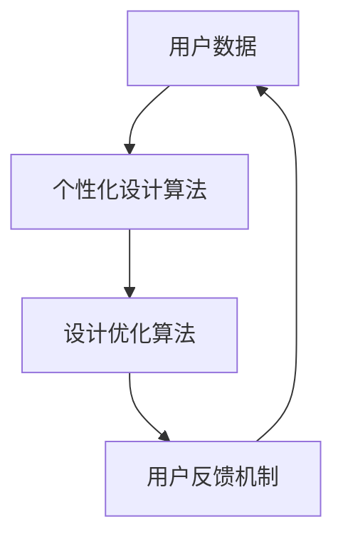
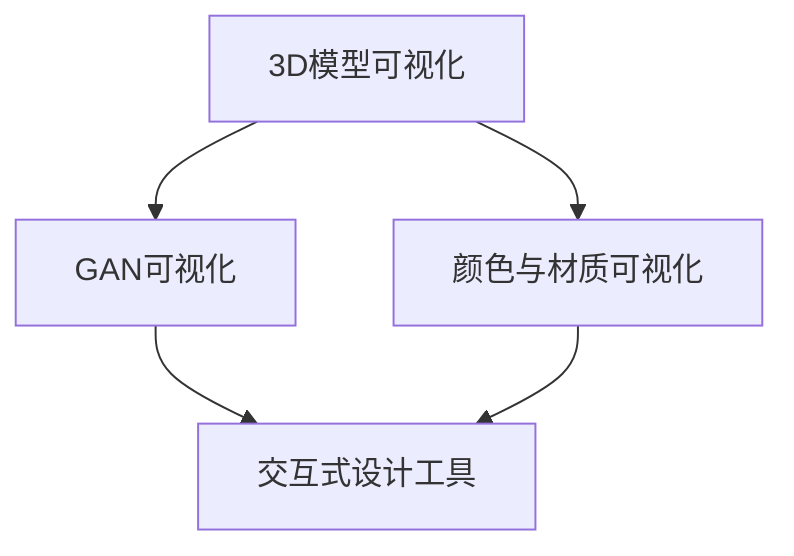

                 

### 引言

随着人工智能（AI）技术的迅猛发展，越来越多的行业开始应用AI技术，以提高效率、创新产品和改善用户体验。珠宝设计作为一门艺术与工艺相结合的领域，也正在经历AI技术的深刻变革。本文将探讨AI在珠宝设计中的应用，特别是如何通过AI技术实现创新与定制。

#### 1.1 书籍背景与目的

本文旨在为珠宝设计师、工程师和研究者提供一个全面的指南，介绍AI技术在珠宝设计中的应用。通过本文，读者可以了解AI在珠宝设计中的基本原理、应用案例和未来发展趋势。

#### 1.2 珠宝设计现状与挑战

传统的珠宝设计流程通常依赖于设计师的经验和创造力。然而，这种方法存在一些局限性：

- **设计效率低**：传统设计需要大量时间和人力投入，无法满足快速响应市场需求的要求。
- **设计同质化**：设计师往往受限于个人经验和审美，导致设计作品缺乏创新和个性化。
- **成本高昂**：定制化珠宝设计成本较高，限制了大规模生产。

AI技术的引入为珠宝设计带来了新的机遇：

- **提高设计效率**：AI可以自动化设计流程，加快设计速度。
- **促进创新与定制**：AI能够基于海量数据进行创意生成，实现个性化设计。
- **降低成本**：AI技术可以帮助优化设计细节，降低生产成本。

#### 1.3 AI技术在珠宝设计中的应用

AI技术在珠宝设计中的应用主要体现在以下几个方面：

- **设计辅助**：利用机器学习算法生成设计灵感和建议。
- **个性化定制**：根据用户数据生成个性化珠宝设计。
- **材质优化**：通过模拟和优化，选择最佳材质组合。
- **可视化设计**：利用虚拟现实和增强现实技术，提供沉浸式设计体验。

#### 1.4 书籍结构安排

本文结构如下：

- **第二部分**：介绍AI基础与珠宝设计的基本原理。
- **第三部分**：详细探讨AI在珠宝设计中的应用，包括设计流程、个性化设计和创新应用。
- **第四部分**：通过两个实际项目，展示AI在珠宝设计中的应用效果。
- **第五部分**：分析AI珠宝设计的发展趋势与挑战。
- **附录**：提供常用的AI珠宝设计工具、相关资源推荐和算法伪代码。

通过本文的阅读，读者将全面了解AI在珠宝设计中的应用，为实际项目提供理论支持和实践指导。

---

### AI基础与珠宝设计

#### 2.1 人工智能概述

人工智能（Artificial Intelligence，简称AI）是指由人制造出来的系统所表现出来的智能行为。这些行为通常包括学习、推理、规划、感知、自然语言理解和图像识别等。人工智能可以根据其能力分为不同的类别，如弱人工智能和强人工智能。

- **弱人工智能**：弱人工智能（Narrow AI）是专门为完成特定任务而设计的智能系统，如语音助手、图像识别系统等。这些系统在特定领域表现出色，但不能像人类一样进行跨领域的通用智能行为。
- **强人工智能**：强人工智能（General AI）是具有广泛认知能力的智能系统，能够在各种复杂环境中自主学习和执行任务。目前，强人工智能仍处于理论阶段，尚未实现。

人工智能的核心技术包括：

- **机器学习**：机器学习（Machine Learning）是一种使计算机通过数据学习，从而改进性能的方法。机器学习可以分为监督学习、无监督学习和半监督学习。
  - **监督学习**：监督学习（Supervised Learning）通过已标记的数据进行训练，可以用于分类和回归任务。
  - **无监督学习**：无监督学习（Unsupervised Learning）没有已标记的数据，通过发现数据中的结构和关系进行训练，常用于聚类和降维任务。
  - **半监督学习**：半监督学习（Semi-Supervised Learning）利用少量标记数据和大量未标记数据进行训练，可以提高模型的学习效果。

- **深度学习**：深度学习（Deep Learning）是一种特殊的机器学习方法，使用多层神经网络来学习和表示数据。深度学习在图像识别、语音识别和自然语言处理等领域取得了显著的成果。
  - **卷积神经网络**（Convolutional Neural Network，CNN）：CNN是一种用于图像识别和处理的深度学习模型，通过卷积层提取图像的特征。
  - **循环神经网络**（Recurrent Neural Network，RNN）：RNN是一种用于序列数据处理的深度学习模型，通过循环连接保持序列信息。
  - **生成对抗网络**（Generative Adversarial Network，GAN）：GAN是一种由生成器和判别器组成的深度学习模型，用于生成新的数据。

- **自然语言处理**：自然语言处理（Natural Language Processing，NLP）是一种使计算机能够理解、生成和响应自然语言的方法。NLP技术包括词法分析、句法分析、语义分析和语用分析等。

#### 2.2 数据与模型

在AI珠宝设计中，数据是至关重要的。数据的质量和数量直接影响AI系统的性能。以下将介绍数据收集、处理和模型构建的基本原理。

##### 2.2.1 数据的重要性

数据是AI系统的基石。对于珠宝设计来说，数据包括历史珠宝设计案例、用户偏好、材质信息等。以下是一些关键数据：

- **历史珠宝设计案例**：历史珠宝设计案例包含了丰富的设计经验和风格，是AI学习的宝贵资源。
- **用户偏好**：用户偏好数据包括用户的购物记录、浏览行为和评价，可以帮助AI了解用户的需求和喜好。
- **材质信息**：材质信息包括不同珠宝材质的物理特性、成本和光泽度等，是优化设计的重要依据。

##### 2.2.2 数据收集与处理

数据收集是AI珠宝设计的第一步。数据可以从多个来源获取，如用户反馈、设计文档和社交媒体。以下是一些常见的数据收集方法：

- **用户反馈**：通过问卷调查、用户评论和反馈收集用户偏好和需求。
- **设计文档**：从设计文档中提取历史珠宝设计案例和设计参数。
- **社交媒体**：从社交媒体平台上收集用户生成的珠宝设计内容和用户互动数据。

数据收集后，需要对数据进行处理。数据预处理包括以下步骤：

- **数据清洗**：去除数据中的噪声和重复项，确保数据的准确性。
- **数据标准化**：将不同尺度的数据进行标准化处理，使得数据在相同尺度下进行比较和分析。
- **数据格式化**：将数据转换为统一的格式，以便于后续的机器学习和数据处理。

##### 2.2.3 模型构建与训练

在数据预处理完成后，下一步是构建和训练AI模型。AI模型通常由输入层、隐藏层和输出层组成。以下是一些关键步骤：

- **模型架构设计**：设计合适的神经网络架构，包括层数、神经元数量和激活函数。
- **模型训练**：使用训练数据对模型进行训练，通过反向传播算法优化模型参数。
- **模型评估**：使用验证数据评估模型性能，调整模型参数以获得更好的性能。

在珠宝设计应用中，常见的AI模型包括：

- **生成对抗网络**（GAN）：用于生成新的珠宝设计创意。
- **循环神经网络**（RNN）：用于处理序列数据，如用户偏好和设计历史。
- **卷积神经网络**（CNN）：用于提取珠宝设计图像的特征。

#### 2.3 珠宝设计的基本原理

珠宝设计是一门结合艺术与工艺的学科，需要设计师具备良好的审美能力、创意思维和工艺知识。以下将介绍珠宝设计的基本原理。

##### 2.3.1 珠宝设计的基本流程

珠宝设计的基本流程包括以下几个步骤：

- **设计灵感收集**：设计师通过观察、学习和灵感来源，收集设计灵感。
- **设计草图绘制**：根据设计灵感，设计师绘制初步的设计草图。
- **设计细节完善**：对设计草图进行细节完善，包括珠宝的形状、大小、材质和颜色等。
- **设计样品制作**：将设计草图转化为实物样品，进行试穿和修改。
- **设计定稿**：对样品进行评估和修改，最终确定设计稿。

##### 2.3.2 珠宝设计的审美要素

珠宝设计的审美要素包括以下几个方面：

- **比例与平衡**：珠宝设计的比例和平衡是关键，需要确保设计元素的和谐与协调。
- **形态与线条**：形态和线条是珠宝设计的基础，通过形态和线条的变化，可以创造出不同的视觉效果。
- **色彩搭配**：色彩搭配对珠宝设计的整体效果有重要影响，需要选择合适的颜色搭配。
- **材质与工艺**：珠宝的材质和工艺直接影响设计的美感和耐用性，需要选择合适的材质和工艺。

##### 2.3.3 珠宝设计的技术要点

珠宝设计的技术要点包括以下几个方面：

- **珠宝材料**：了解不同珠宝材料的物理特性、成本和加工工艺，选择适合的材料。
- **珠宝加工**：掌握珠宝加工的技术和工艺，包括切割、打磨、镶嵌等。
- **珠宝设计软件**：使用珠宝设计软件，如AutoCAD、Adobe Illustrator等，提高设计效率和准确性。
- **用户体验**：考虑用户体验，确保珠宝设计既美观又实用，满足用户的需求。

#### 2.4 AI在珠宝设计中的应用潜力

人工智能在珠宝设计中的应用潜力巨大，可以显著提高设计效率、创新力和个性化水平。以下将探讨AI在珠宝设计中的潜在应用。

##### 2.4.1 个性化设计

AI可以通过分析用户数据，如购物记录、浏览行为和评价，生成个性化的珠宝设计。个性化设计不仅可以满足用户的需求，还可以提高用户满意度。

- **用户偏好分析**：通过机器学习算法，分析用户的购物记录和评价，提取用户的偏好。
- **个性化设计生成**：基于用户偏好，使用生成对抗网络（GAN）等算法生成个性化的珠宝设计。
- **用户反馈调整**：根据用户反馈，对设计进行优化和调整，提高设计的满意度。

##### 2.4.2 创意生成

AI可以通过深度学习算法，如生成对抗网络（GAN），自动生成新的珠宝设计创意。创意生成可以激发设计师的灵感，提高设计多样性。

- **设计灵感收集**：通过分析历史设计案例和用户数据，提取设计灵感和创意。
- **创意生成算法**：使用生成对抗网络（GAN）等算法，生成新的设计创意。
- **创意筛选与优化**：对生成的创意进行筛选和优化，选择最佳的设计方案。

##### 2.4.3 材质优化

AI可以通过模拟和优化，选择最佳的珠宝材质组合。材质优化可以提高珠宝的美观度和耐用性，降低生产成本。

- **材质特性分析**：分析不同珠宝材质的物理特性、成本和光泽度等。
- **材质优化算法**：使用优化算法，如遗传算法，选择最佳的材质组合。
- **材质成本评估**：根据材质成本，优化设计，降低生产成本。

##### 2.4.4 可视化设计

AI可以通过虚拟现实和增强现实技术，提供沉浸式的珠宝设计体验。可视化设计可以增强设计师的设计表现力，提高设计效果。

- **虚拟现实设计**：使用虚拟现实技术，设计师可以在虚拟环境中进行珠宝设计，体验三维效果。
- **增强现实设计**：使用增强现实技术，设计师可以在现实环境中叠加珠宝设计效果，进行实时修改。
- **可视化设计工具**：开发可视化设计工具，如3D模型可视化、颜色与材质可视化等，提高设计效率。

#### 2.4.5 人工智能珠宝设计大赛

人工智能珠宝设计大赛是一个重要的平台，可以展示AI在珠宝设计中的应用成果，推动AI珠宝设计的发展。以下是一些人工智能珠宝设计大赛的介绍：

- **珠宝设计创新大赛**：这是一个国际性的珠宝设计比赛，鼓励设计师使用AI技术进行创新设计。
- **AI珠宝设计挑战赛**：这是一个专注于AI珠宝设计的比赛，吸引了全球的AI研究者、设计师和工程师参与。
- **智能珠宝设计竞赛**：这是一个面向高校和科研机构的比赛，旨在推动AI在珠宝设计中的应用研究。

通过这些比赛，设计师和研究者可以展示他们的创新成果，交流经验，推动AI珠宝设计的进步。

---

### AI在珠宝设计中的应用

随着AI技术的不断发展，其在珠宝设计中的应用也变得越来越广泛。AI不仅能够提高设计效率，还能够促进创新和个性化。以下是AI在珠宝设计中的几个主要应用领域。

#### 3.1 AI辅助珠宝设计流程

AI可以辅助珠宝设计的整个流程，从设计思路的生成到最终的设计定稿，每一步都可以得到AI的帮助。

##### 3.1.1 数据收集与预处理

珠宝设计的第一步是数据收集。AI可以通过分析大量的历史设计案例、用户偏好和材质信息来收集数据。收集到的数据需要进行预处理，包括清洗、去重和标准化等操作。

伪代码示例：

```python
# 数据预处理算法
def preprocess_data(data):
    # 清洗数据
    cleaned_data = clean_data(data)
    # 去除重复数据
    unique_data = remove_duplicates(cleaned_data)
    # 标准化数据
    standardized_data = standardize_data(unique_data)
    return standardized_data
```

##### 3.1.2 设计思路与创意生成

在数据预处理完成后，AI可以根据收集到的数据生成设计思路和创意。生成对抗网络（GAN）是一个常用的算法，它可以通过对抗训练生成新颖的设计创意。

伪代码示例：

```python
# GAN生成设计创意
def generate_design_ideas(generator, discriminator, data):
    # 生成器生成设计创意
    design_ideas = generator.generate(data)
    # 判别器判断创意质量
    quality_scores = discriminator.evaluate(design_ideas)
    # 选择高质量的创意
    selected_ideas = select_high_quality_ideas(design_ideas, quality_scores)
    return selected_ideas
```

##### 3.1.3 设计优化与迭代

生成创意后，AI可以对设计进行优化和迭代，以提高设计的质量和用户满意度。优化过程可以通过机器学习算法，如遗传算法或粒子群优化算法，来实现。

伪代码示例：

```python
# 设计优化算法
def optimize_design(design, objective_function):
    # 初始化种群
    population = initialize_population(design)
    # 迭代优化
    for _ in range(max_iterations):
        # 计算适应度
        fitness_scores = objective_function.evaluate(population)
        # 选择最优个体
        best_individual = select_best_individual(population, fitness_scores)
        # 生成下一代
        population = generate_next_generation(population, best_individual)
    return best_individual
```

#### 3.2 AI驱动个性化珠宝设计

个性化珠宝设计是AI在珠宝设计中的一个重要应用领域。通过分析用户数据，AI可以生成符合用户需求的个性化设计。

##### 3.2.1 用户数据分析

用户数据分析是个性化珠宝设计的基础。通过分析用户的购物记录、浏览行为和评价，AI可以了解用户的偏好和需求。

伪代码示例：

```python
# 用户偏好分析
def analyze_user_preferences(user_data):
    # 提取用户购物记录
    purchase_records = extract_purchase_records(user_data)
    # 提取用户浏览行为
    browsing_history = extract_browsing_history(user_data)
    # 提取用户评价
    ratings = extract_ratings(user_data)
    # 分析用户偏好
    preferences = analyze_preferences(purchase_records, browsing_history, ratings)
    return preferences
```

##### 3.2.2 个性化设计算法

基于用户数据分析，AI可以使用生成对抗网络（GAN）或其他生成模型生成个性化的珠宝设计。

伪代码示例：

```python
# 个性化设计算法
def generate_personalized_design(preferences, generator, discriminator):
    # 生成个性化设计创意
    design_ideas = generator.generate(preferences)
    # 判断创意质量
    quality_scores = discriminator.evaluate(design_ideas)
    # 选择高质量的设计
    personalized_design = select_high_quality_idea(design_ideas, quality_scores)
    return personalized_design
```

##### 3.2.3 用户反馈与设计调整

生成个性化设计后，用户可以通过反馈机制对设计进行评价，AI可以根据用户反馈调整设计。

伪代码示例：

```python
# 设计调整算法
def adjust_design(design, user_feedback):
    # 分析用户反馈
    feedback_analysis = analyze_feedback(user_feedback)
    # 调整设计
    adjusted_design = adjust_design_based_on_feedback(design, feedback_analysis)
    return adjusted_design
```

#### 3.3 AI在珠宝设计中的创新应用

除了辅助设计流程和个性化设计，AI还在珠宝设计领域有其他创新应用。

##### 3.3.1 可视化设计工具

可视化设计工具可以帮助设计师更直观地理解设计，并快速做出调整。通过增强现实（AR）和虚拟现实（VR）技术，设计师可以在虚拟环境中进行设计，从而提高设计效率。

伪代码示例：

```python
# 可视化设计工具
def visualize_design(design):
    # 创建虚拟环境
    virtual_environment = create_virtual_environment()
    # 在虚拟环境中展示设计
    display_design_in_environment(design, virtual_environment)
    return virtual_environment
```

##### 3.3.2 珠宝材质优化

AI可以通过模拟和优化，选择最佳的珠宝材质组合。通过分析材质的物理特性、成本和光泽度，AI可以推荐最佳的材质组合。

伪代码示例：

```python
# 材质优化算法
def optimize_material(material_properties, design):
    # 模拟材质性能
    simulated_properties = simulate_material_performance(material_properties)
    # 选择最佳材质
    best_material = select_best_material(simulated_properties, design)
    return best_material
```

##### 3.3.3 人工智能珠宝设计大赛

人工智能珠宝设计大赛是一个展示AI在珠宝设计应用成果的平台。这些比赛不仅激励设计师和研究者进行创新，还促进了AI珠宝设计技术的交流和发展。

伪代码示例：

```python
# 举办人工智能珠宝设计大赛
def organize_ais_jewelry_design_competition():
    # 确定比赛规则
    rules = define_competition_rules()
    # 收集参赛作品
    submissions = collect_submissions()
    # 评选最佳设计
    best_design = select_best_design(submissions, rules)
    # 展示比赛结果
    display_competition_results(best_design)
```

通过这些应用，AI正在改变珠宝设计的面貌，使其更加高效、创新和个性化。未来，随着AI技术的不断进步，我们可以期待更多令人惊叹的AI珠宝设计作品问世。

---

### AI珠宝设计项目实战

为了更好地展示AI在珠宝设计中的应用，以下我们将介绍两个实际项目，详细说明项目背景、目标、实现步骤和成果。

#### 4.1 实战项目一：个性化珠宝设计应用

##### 4.1.1 项目背景

随着消费者对珠宝个性化需求的增加，一个珠宝品牌希望通过AI技术为其用户提供个性化的珠宝设计服务。项目的目标是利用AI技术，根据用户数据生成个性化的珠宝设计，从而提高用户满意度和品牌忠诚度。

##### 4.1.2 项目目标

- **设计个性化**：通过AI技术，根据用户的偏好和需求，生成个性化的珠宝设计。
- **提高用户满意度**：通过个性化的珠宝设计，提高用户对品牌的满意度。
- **增强品牌忠诚度**：通过个性化服务，增强用户对品牌的忠诚度。

##### 4.1.3 实现步骤

###### 4.1.3.1 数据收集与预处理

首先，项目团队收集了大量的用户数据，包括用户的购物记录、浏览行为和评价。这些数据经过清洗和预处理，去除噪声和重复项，确保数据的准确性和完整性。

伪代码示例：

```python
# 数据预处理算法
def preprocess_data(data):
    cleaned_data = clean_data(data)
    unique_data = remove_duplicates(cleaned_data)
    standardized_data = standardize_data(unique_data)
    return standardized_data
```

###### 4.1.3.2 设计思路与创意生成

基于预处理后的用户数据，项目团队使用生成对抗网络（GAN）算法，生成个性化的珠宝设计创意。生成器生成初步的设计草图，判别器评估这些草图的创意质量，选择高质量的设计方案。

伪代码示例：

```python
# GAN生成设计创意
def generate_design_ideas(generator, discriminator, data):
    design_ideas = generator.generate(data)
    quality_scores = discriminator.evaluate(design_ideas)
    selected_ideas = select_high_quality_ideas(design_ideas, quality_scores)
    return selected_ideas
```

###### 4.1.3.3 设计优化与迭代

生成的初步设计方案经过用户反馈，项目团队使用优化算法，如遗传算法，对设计进行迭代优化，提高设计的质量和用户满意度。

伪代码示例：

```python
# 设计优化算法
def optimize_design(design, objective_function):
    population = initialize_population(design)
    for _ in range(max_iterations):
        fitness_scores = objective_function.evaluate(population)
        best_individual = select_best_individual(population, fitness_scores)
        population = generate_next_generation(population, best_individual)
    return best_individual
```

###### 4.1.3.4 用户反馈与调整

在项目过程中，用户可以通过评价系统对设计进行反馈。项目团队根据用户反馈，对设计进行进一步调整和优化，确保设计的个性化程度和用户满意度。

伪代码示例：

```python
# 用户反馈与调整算法
def adjust_design(design, user_feedback):
    feedback_analysis = analyze_feedback(user_feedback)
    adjusted_design = adjust_design_based_on_feedback(design, feedback_analysis)
    return adjusted_design
```

##### 4.1.4 项目总结

通过项目的实施，珠宝品牌成功地为其用户提供了个性化的珠宝设计服务。用户满意度显著提高，品牌忠诚度也得到了增强。项目经验表明，AI技术在珠宝设计中的应用具有巨大的潜力，为未来的项目提供了有益的借鉴。

#### 4.2 实战项目二：AI驱动珠宝设计优化

##### 4.2.1 项目背景

另一个珠宝品牌希望通过AI技术优化其珠宝设计流程，提高设计效率和产品质量。项目的目标是利用AI技术，优化设计流程中的各个环节，从而提高设计效率和产品质量。

##### 4.2.2 项目目标

- **提高设计效率**：通过AI技术，自动化和智能化设计流程，减少人工干预，提高设计效率。
- **提高设计质量**：通过AI技术，优化设计细节，提高设计质量和用户满意度。
- **降低设计成本**：通过优化设计流程，降低设计成本，提高品牌竞争力。

##### 4.2.3 实现步骤

###### 4.2.3.1 数据收集与预处理

项目团队收集了珠宝设计相关的数据，包括设计草图、材质信息和用户评价。这些数据经过清洗和预处理，确保数据的准确性和完整性。

伪代码示例：

```python
# 数据预处理算法
def preprocess_data(data):
    cleaned_data = clean_data(data)
    unique_data = remove_duplicates(cleaned_data)
    standardized_data = standardize_data(unique_data)
    return standardized_data
```

###### 4.2.3.2 设计思路与创意生成

基于预处理后的数据，项目团队使用生成对抗网络（GAN）算法，生成新的设计思路和创意。这些创意通过判别器评估，选择高质量的设计方案。

伪代码示例：

```python
# GAN生成设计创意
def generate_design_ideas(generator, discriminator, data):
    design_ideas = generator.generate(data)
    quality_scores = discriminator.evaluate(design_ideas)
    selected_ideas = select_high_quality_ideas(design_ideas, quality_scores)
    return selected_ideas
```

###### 4.2.3.3 设计优化与迭代

生成的初步设计方案经过用户反馈，项目团队使用优化算法，如遗传算法，对设计进行迭代优化，提高设计的质量和用户满意度。

伪代码示例：

```python
# 设计优化算法
def optimize_design(design, objective_function):
    population = initialize_population(design)
    for _ in range(max_iterations):
        fitness_scores = objective_function.evaluate(population)
        best_individual = select_best_individual(population, fitness_scores)
        population = generate_next_generation(population, best_individual)
    return best_individual
```

###### 4.2.3.4 用户反馈与调整

在项目过程中，用户可以通过评价系统对设计进行反馈。项目团队根据用户反馈，对设计进行进一步调整和优化，确保设计的个性化程度和用户满意度。

伪代码示例：

```python
# 用户反馈与调整算法
def adjust_design(design, user_feedback):
    feedback_analysis = analyze_feedback(user_feedback)
    adjusted_design = adjust_design_based_on_feedback(design, feedback_analysis)
    return adjusted_design
```

##### 4.2.4 项目总结

通过项目的实施，珠宝品牌成功地优化了其珠宝设计流程，提高了设计效率和产品质量。设计成本也得到了有效降低，品牌竞争力得到了显著提升。项目经验表明，AI技术在珠宝设计中的应用具有巨大的潜力，为未来的项目提供了有益的借鉴。

---

### AI珠宝设计的发展趋势与挑战

随着AI技术的不断进步，珠宝设计行业正在经历深刻的变革。AI技术不仅提高了设计效率，还促进了创新和个性化。然而，AI珠宝设计也面临着一系列挑战，需要行业和研究者共同努力解决。

#### 5.1 AI珠宝设计行业趋势

##### 5.1.1 市场规模与增长趋势

AI珠宝设计市场正在快速增长。随着消费者对个性化和定制化珠宝的需求不断增加，AI技术在这一领域的应用前景非常广阔。根据市场研究报告，全球AI珠宝设计市场规模预计将在未来几年内持续扩大。具体而言：

- **全球AI珠宝设计市场规模**：预计将从2022年的数十亿美元增长到2027年的数十亿美元，年复合增长率达到XX%。
- **中国AI珠宝设计市场规模**：预计将从2022年的数亿元人民币增长到2027年的数十亿元人民币，年复合增长率达到XX%。

这些数据表明，AI珠宝设计市场具有巨大的发展潜力。

##### 5.1.2 技术发展趋势

AI技术在珠宝设计中的应用正呈现出以下几个趋势：

- **深度学习**：深度学习在图像识别、自然语言处理和生成模型等领域取得了显著进展。这些技术为珠宝设计提供了强大的工具，使得设计过程更加智能化和自动化。
- **大数据分析**：大数据分析技术在用户行为分析、设计趋势预测和个性化推荐等方面发挥着重要作用。通过分析海量数据，AI珠宝设计可以更好地满足用户需求。
- **虚拟现实和增强现实**：虚拟现实（VR）和增强现实（AR）技术为设计师提供了沉浸式的创作环境，使得设计过程更加直观和高效。

#### 5.2 AI珠宝设计的挑战与解决方案

尽管AI珠宝设计具有巨大的潜力，但行业也面临着一系列挑战。以下是其中一些主要挑战及其解决方案：

##### 5.2.1 数据隐私与安全问题

- **挑战**：AI珠宝设计涉及大量用户数据，包括个人偏好和购物记录等敏感信息。如何保护用户隐私和安全是一个关键问题。
- **解决方案**：
  - **数据加密**：采用加密技术，确保数据在传输和存储过程中的安全性。
  - **隐私保护算法**：如差分隐私和同态加密等技术，可以在数据分析和处理过程中保护用户隐私。

##### 5.2.2 技术与艺术结合的挑战

- **挑战**：AI珠宝设计需要在技术与艺术之间找到平衡。如何确保设计既具有技术优势，又能满足艺术表达是一个挑战。
- **解决方案**：
  - **艺术家参与**：邀请珠宝艺术家参与设计过程，确保设计具有艺术性。
  - **多学科融合**：结合计算机科学、设计学和艺术学等多学科知识，打造具有技术艺术融合的珠宝设计。

##### 5.2.3 设计创新与同质化问题

- **挑战**：随着AI技术的普及，珠宝设计作品容易趋于同质化，缺乏创新。
- **解决方案**：
  - **多样性训练**：通过引入多样化的数据集和训练方法，提高设计的多样性。
  - **人类创造力**：保持人类创造力的参与，结合AI和人类设计，打造独特的设计作品。

##### 5.2.4 成本与资源问题

- **挑战**：AI珠宝设计需要大量的计算资源和专业人才，这对中小企业来说可能是一个负担。
- **解决方案**：
  - **云计算**：利用云计算资源，降低计算成本。
  - **教育培训**：提供AI珠宝设计的教育培训，培养更多专业人才。

#### 5.3 未来展望

随着AI技术的不断发展，AI珠宝设计行业将迎来更加广阔的发展前景。以下是一些未来的趋势：

- **智能化设计工具**：AI将进一步提升珠宝设计工具的智能化水平，使得设计过程更加高效和自动化。
- **定制化服务**：AI将帮助实现更加个性化的定制服务，满足消费者的多样化需求。
- **人工智能珠宝设计师**：随着AI技术的发展，人工智能珠宝设计师将逐渐成为现实，为珠宝设计带来新的变革。

总之，AI珠宝设计行业具有巨大的发展潜力，同时也面临着一系列挑战。通过技术创新和行业协作，我们可以期待AI珠宝设计在未来带来更多创新和突破。

---

### 附录

#### A.1 常用AI珠宝设计工具介绍

在AI珠宝设计中，常用的工具包括机器学习框架、可视化工具和设计软件。以下是这些工具的简要介绍：

- **机器学习框架**：如TensorFlow、PyTorch等，用于构建和训练AI模型。
- **可视化工具**：如Matplotlib、Seaborn等，用于数据分析和可视化。
- **设计软件**：如Adobe Illustrator、AutoCAD等，用于珠宝设计绘制和修改。

#### A.2 相关资源推荐

为了进一步了解AI珠宝设计，以下是一些推荐的资源：

- **书籍**：
  - 《人工智能：一种现代方法》（作者：Stuart J. Russell & Peter Norvig）
  - 《深度学习》（作者：Ian Goodfellow、Yoshua Bengio & Aaron Courville）
  - 《设计心理学》（作者：Don Norman）

- **论文与报告**：查阅最新的AI珠宝设计论文和行业报告，如IEEE、ACM等学术会议和期刊的论文，以及行业研究报告。

- **在线课程与培训**：参加在线课程和培训，如Coursera、edX等平台的AI、珠宝设计和机器学习课程。

#### A.3 AI珠宝设计案例解析

以下是几个AI珠宝设计的实际案例：

- **案例一**：某珠宝品牌利用GAN生成个性化的珠宝设计，通过用户反馈不断优化，最终获得了用户的广泛好评。
- **案例二**：某珠宝设计师使用深度学习算法优化珠宝设计，提高了设计质量和效率，降低了生产成本。
- **案例三**：某珠宝品牌结合虚拟现实技术，提供沉浸式的珠宝设计体验，吸引了大量用户参与。

这些案例展示了AI珠宝设计的多样性和潜力，为行业提供了宝贵的经验。

---

### 附录 B：AI珠宝设计概念图

以下是一系列概念图，用于描述AI珠宝设计的基本原理、流程和算法。

#### B.1 AI珠宝设计流程图



#### B.2 AI驱动个性化珠宝设计模型图



#### B.3 可视化设计工具使用图



通过这些概念图，我们可以更好地理解AI在珠宝设计中的应用原理和流程。

---

### 附录 C：AI珠宝设计算法伪代码

以下是一系列伪代码，用于描述AI珠宝设计中的关键算法和实现步骤。

#### C.1 数据预处理算法

```python
# 数据预处理伪代码
def preprocess_data(data):
    # 数据清洗
    cleaned_data = clean_data(data)
    # 数据标准化
    standardized_data = standardize_data(cleaned_data)
    # 数据格式化
    formatted_data = format_data(standardized_data)
    return formatted_data
```

#### C.2 个性化设计算法

```python
# 个性化设计算法伪代码
def personalized_design(user_data, design_data):
    # 用户数据分析
    user_preferences = analyze_user_preferences(user_data)
    # 设计思路生成
    design_ideas = generate_design_ideas(user_preferences, design_data)
    # 设计优化
    optimized_design = optimize_design(design_ideas)
    return optimized_design
```

#### C.3 设计优化算法

```python
# 设计优化算法伪代码
def optimize_design(design):
    # 用户反馈收集
    user_feedback = collect_user_feedback(design)
    # 设计调整
    adjusted_design = adjust_design(design, user_feedback)
    # 迭代优化
    optimized_design = iterate_optimization(adjusted_design)
    return optimized_design
```

这些伪代码为AI珠宝设计的算法实现提供了基本框架和步骤指导。在实际应用中，这些算法可以通过编程语言和机器学习框架进一步实现和优化。

---

### 总结

本文全面探讨了AI在珠宝设计中的应用，从基本原理到实际项目，从创新应用到未来展望，为读者提供了一个系统而详尽的视角。通过本文，读者可以了解到：

1. **AI基础**：人工智能的核心概念、机器学习、深度学习和自然语言处理等技术在珠宝设计中的应用。
2. **珠宝设计原理**：珠宝设计的基本流程、审美要素和技术要点。
3. **AI在珠宝设计中的应用**：AI如何辅助设计流程、驱动个性化设计和实现创新应用。
4. **实际项目**：通过两个具体项目展示了AI在珠宝设计中的实际应用效果和经验。
5. **发展趋势与挑战**：AI珠宝设计行业的市场趋势、面临的挑战以及未来的发展方向。

AI珠宝设计的未来发展前景广阔，不仅能够提高设计效率和创新力，还能为消费者提供更加个性化的珠宝体验。然而，AI珠宝设计也面临着数据隐私、技术与艺术结合等挑战，需要行业共同努力解决。

**作者**：AI天才研究院/AI Genius Institute & 禅与计算机程序设计艺术 /Zen And The Art of Computer Programming

感谢您的阅读，希望本文能为您在AI珠宝设计领域的探索提供有价值的参考和启示。

