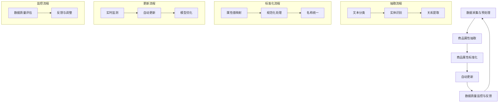
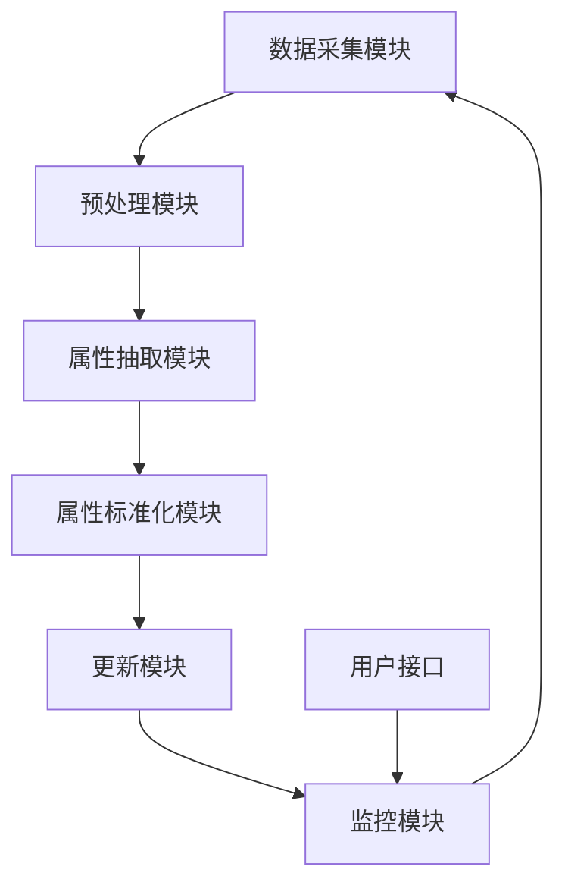

                 

## 《AI在电商平台商品属性抽取与标准化自动更新中的应用》

### 概述

随着电子商务的迅速发展，电商平台成为了消费者购买商品的主要渠道之一。然而，随着商品种类的日益丰富，电商平台需要处理的海量数据也在不断增加。在这种情况下，如何高效、准确地管理这些数据，成为了电商平台发展的重要挑战。AI技术的应用为电商平台的数据管理提供了新的解决方案，特别是在商品属性抽取与标准化自动更新方面。

商品属性抽取与标准化自动更新是电商平台数据管理的重要环节。商品属性抽取是指从商品描述中提取出关键属性信息，如价格、颜色、尺寸、品牌等。而商品属性标准化则是将这些属性进行统一、规范化的处理，使其在数据存储、检索和使用时具有一致性和可比性。自动更新则是指利用AI技术对商品属性进行实时更新，确保商品信息的准确性和及时性。

本文将围绕AI在电商平台商品属性抽取与标准化自动更新中的应用进行探讨。首先，我们将介绍电商平台与AI技术的基本概念，阐述AI技术在电商平台中的应用前景。接着，我们将详细讨论商品属性抽取与标准化的原理和方法，包括基于自然语言处理、机器学习和深度学习的技术。然后，我们将探讨自动更新商品属性的算法实现和实践应用，并通过具体的案例分析展示实际效果。最后，我们将总结AI在电商平台商品属性抽取与标准化自动更新中的优势和挑战，展望未来的发展方向。

通过本文的讨论，我们希望能够为读者提供一个全面、深入的理解，帮助电商企业更好地应用AI技术，提升数据管理水平和用户体验。

### 1.1 电商平台的发展历程与现状

电商平台的起源可以追溯到20世纪90年代末，随着互联网技术的兴起，人们开始通过网络购买商品。最早的电商平台之一是亚马逊（Amazon），成立于1994年，最初主要是通过在线书店销售书籍。随后，随着电子商务的快速发展，更多的电商平台相继涌现，如eBay（1995年）、阿里巴巴（1999年）和京东（1998年）等。

在过去的二十多年中，电商平台经历了多个发展阶段。最初，电商平台主要以B2C（Business-to-Consumer）模式为主，企业通过互联网直接向消费者销售商品。随着B2B（Business-to-Business）模式的出现，电商平台逐渐扩展到为企业与企业之间的交易提供服务。此外，C2C（Consumer-to-Consumer）模式的兴起，使得个人可以通过平台进行商品交易，进一步丰富了电商生态。

目前，电商平台已经成为全球最大的零售市场之一。据统计，全球电商市场规模已经超过4万亿美元，并且还在持续增长。其中，中国电商市场尤为突出，根据艾瑞咨询的数据，2022年中国的电商交易规模预计将达到12.5万亿元人民币，占全球电商市场份额的30%以上。

电商平台的主要模式包括B2C、B2B、C2C和O2O（Online-to-Offline）等。B2C模式以亚马逊、京东和阿里巴巴等为代表，提供从商品浏览、购买到物流配送的一站式服务。B2B模式则主要服务于企业与企业之间的交易，如阿里巴巴的1688平台。C2C模式以eBay和淘宝为代表，允许个人在平台上进行商品交易。O2O模式则结合了线上和线下的资源，通过电商平台引导消费者到线下门店进行消费。

电商平台的特点主要体现在以下几个方面：

1. **便捷性**：电商平台提供了一站式购物体验，用户可以方便地浏览、购买和支付商品，无需出门即可满足购物需求。
2. **广泛性**：电商平台汇集了各种商品，用户可以轻松找到所需商品，无论地域限制。
3. **个性化**：电商平台利用用户行为数据和人工智能技术，为用户提供个性化的推荐和服务。
4. **高效性**：电商平台通过大数据和自动化技术，实现了商品检索、推荐和物流配送的高效运作。

在电商平台的发展过程中，面临着一些挑战和机遇。挑战包括市场饱和度增加、竞争激烈、消费者需求多样化等。而机遇则来自于新技术的应用，如人工智能、区块链和物联网等，这些技术为电商平台提供了创新的解决方案，助力其在竞争激烈的市场中脱颖而出。

总体来看，电商平台的发展对全球经济和消费者生活方式产生了深远的影响。随着技术的不断进步，电商平台将继续保持快速增长，并在未来带来更多的商业机会和挑战。

### 1.2 AI技术在电商领域的应用前景

AI技术在电商领域的应用前景广阔，正在逐步改变传统电商的运营模式和用户体验。以下是AI技术在电商领域的主要应用方向及其未来发展趋势：

#### 1.2.1 商品推荐系统

商品推荐系统是电商平台中的一项核心功能，通过分析用户的浏览历史、购买记录和搜索关键词等数据，为用户推荐可能感兴趣的商品。传统的推荐系统主要基于协同过滤和内容匹配算法，而AI技术的引入，使得推荐系统更加智能和精准。

- **深度学习**：深度学习模型，如卷积神经网络（CNN）和循环神经网络（RNN），可以处理大量非结构化数据，并提取用户行为的特征，从而提供更个性化的推荐。
- **迁移学习**：通过迁移学习技术，可以利用预训练的深度学习模型在电商数据集上进行微调，提高推荐系统的性能和效率。
- **多模态融合**：结合用户的行为数据、文本数据和图像数据，实现多模态的融合推荐，进一步提升推荐效果。

未来，AI技术将在商品推荐系统中扮演更加重要的角色，通过更复杂的模型和算法，实现更加精准和个性化的推荐，从而提高用户的购物满意度和平台的销售转化率。

#### 1.2.2 智能客服系统

智能客服系统是电商平台上为用户提供的智能对话服务，通过自然语言处理（NLP）和机器学习技术，实现与用户的智能互动，提高客服效率和用户体验。

- **自然语言理解**：利用NLP技术，智能客服系统可以理解和解析用户的语言意图，提供准确的答复和建议。
- **语音识别与合成**：结合语音识别和语音合成技术，智能客服可以实现语音交互，提供更加自然的用户体验。
- **聊天机器人**：通过训练大量的对话数据集，聊天机器人可以模拟人类的对话方式，与用户进行实时交流，解决用户的问题。

未来，智能客服系统将进一步智能化，通过更多的AI技术实现更高水平的自主学习和适应能力，提供更高效、更自然的客服服务，减少人工客服的工作负担，提升用户体验。

#### 1.2.3 智能价格优化

智能价格优化是电商平台通过数据分析和技术手段，动态调整商品价格，以最大化收益和市场份额。AI技术在这一领域的应用，主要包括以下方面：

- **价格预测**：利用机器学习算法，分析市场趋势、竞争对手价格和用户行为数据，预测最优价格。
- **动态定价**：通过实时监测市场变化和用户行为，动态调整商品价格，以实现价格最优。
- **价格弹性分析**：利用AI技术，分析不同价格水平下的销售情况和用户反应，优化价格策略。

未来，智能价格优化将进一步精细化，通过更复杂的算法和模型，实现更精准的价格策略，提高电商平台的市场竞争力。

#### 1.2.4 物流优化

AI技术在电商平台的物流优化中发挥着重要作用，通过智能调度、路径规划和仓储管理，提高物流效率，降低成本。

- **智能调度**：利用机器学习和优化算法，实现物流车辆的智能调度，优化运输路线和配送时间。
- **路径规划**：通过人工智能技术，优化配送路线，减少运输时间和成本。
- **仓储管理**：利用AI技术，实现仓储自动化，提高库存管理效率和准确性。

未来，随着AI技术的不断进步，物流优化将更加智能化，实现全流程的自动化和高效化，进一步提升电商平台的物流服务水平。

#### 1.2.5 安全与风险管理

AI技术在电商平台的安全与风险管理中也有重要作用，通过智能监控、异常检测和风险预测，保障平台的安全运营。

- **智能监控**：利用图像识别和自然语言处理技术，对平台活动进行实时监控，识别潜在风险。
- **异常检测**：通过机器学习模型，检测异常交易行为和潜在风险，提前预警并采取措施。
- **风险预测**：利用大数据分析和预测模型，预测潜在风险，制定预防措施。

未来，AI技术在安全与风险管理中将发挥更大的作用，通过更先进的算法和技术，提高平台的安全性和风险管理能力。

总之，AI技术在电商领域的应用前景广阔，随着技术的不断进步，AI将为电商平台带来更多的创新和变革，提升运营效率、优化用户体验，推动电商行业的持续发展。

### 1.3 AI在电商平台商品属性抽取与标准化自动更新中的关键作用

AI技术在电商平台商品属性抽取与标准化自动更新中扮演着至关重要的角色，主要体现在以下几个方面：

#### 1.3.1 提高数据质量

电商平台上的商品数据繁多且复杂，不同商品之间的属性描述存在差异，导致数据质量参差不齐。AI技术可以通过自然语言处理（NLP）和机器学习算法，从商品描述中准确抽取关键属性，并对这些属性进行标准化处理，从而提高数据的一致性和准确性。例如，通过NLP技术，可以将商品描述中的“颜色：红色”、“颜色：大红”等不同的颜色描述统一转换为标准化的颜色名称“红色”。

#### 1.3.2 提升运营效率

传统的商品属性抽取和标准化通常依赖人工处理，效率较低且容易出现错误。AI技术可以实现自动化抽取和标准化，显著提升运营效率。例如，通过训练好的机器学习模型，可以快速地从海量商品描述中抽取属性，并将这些属性进行统一规范化，大大减少了人工工作量。

#### 1.3.3 精准推荐与搜索

商品属性抽取和标准化是电商平台实现精准推荐和搜索的基础。通过准确抽取和标准化商品属性，电商平台可以更好地理解和分析用户需求，从而提供更加个性化的推荐和搜索结果。例如，当用户搜索“红色连衣裙”时，系统可以根据商品的颜色属性准确推荐符合条件的商品，提高用户满意度和购物转化率。

#### 1.3.4 数据挖掘与分析

AI技术可以帮助电商平台从商品属性数据中挖掘出更多有价值的信息，支持数据驱动的决策。通过分析商品属性数据，电商平台可以发现潜在的市场趋势和消费者行为，制定更加有效的营销策略和库存管理方案。

#### 1.3.5 降低运营成本

自动化的商品属性抽取和标准化可以减少人工干预，降低运营成本。例如，通过自动化系统，电商平台可以实时更新商品属性，减少因人工录入错误导致的问题和返工成本。

#### 1.3.6 简化多平台运营

对于同时运营多个电商平台的商家来说，AI技术可以帮助他们实现统一化的商品属性管理。通过自动抽取和标准化，商家可以轻松地将商品属性从一个平台迁移到另一个平台，简化多平台运营的复杂性。

总之，AI技术在电商平台商品属性抽取与标准化自动更新中的应用，不仅提高了数据质量和运营效率，还增强了电商平台的市场竞争力，为用户提供更优质的购物体验。

### 1.3.1 商品属性抽取与标准化的概念

商品属性抽取（Item Attribute Extraction）是指从电商平台的商品描述中提取出关键属性信息的过程。这些属性信息通常包括商品的价格、品牌、颜色、尺寸、材质、产地、库存量等，是消费者在购买决策过程中需要关注的重要信息。商品属性抽取的关键在于准确识别和提取这些属性，以便为后续的数据处理和业务应用提供基础数据。

商品属性标准化（Item Attribute Standardization）则是对抽取出的商品属性进行统一、规范化的处理，使其在数据存储、检索和使用时具有一致性和可比性。商品属性标准化主要包括属性值映射、属性值规范化、属性名称统一等操作。例如，将不同的颜色描述（如“大红”、“红色”）统一映射为标准化的颜色名称（如“红色”），或将不同的尺寸描述（如“S”、“XL”）统一转换为标准化的尺寸编码。

商品属性抽取与标准化在电商平台中具有重要作用。首先，它们确保了商品数据的准确性和一致性，提高了数据的可用性和质量。其次，通过标准化的属性信息，电商平台可以更好地进行数据分析和挖掘，支持精准推荐、个性化营销和智能搜索等功能。此外，商品属性抽取与标准化还有助于简化多平台运营，降低商家在管理商品数据时的复杂性。

总的来说，商品属性抽取与标准化是电商平台数据管理的重要组成部分，对提升用户体验、增强平台竞争力具有关键作用。AI技术在商品属性抽取与标准化中的应用，进一步推动了这一过程的自动化和智能化，为电商平台的数据管理提供了强大的技术支持。

### 1.3.2 AI技术在商品属性抽取与标准化中的应用

AI技术在商品属性抽取与标准化中的应用主要体现在以下几个方面，通过自然语言处理（NLP）、机器学习和深度学习等技术，实现了商品属性的高效、准确抽取和统一标准化。

#### 1.3.2.1 自然语言处理（NLP）技术在商品属性抽取中的应用

NLP技术是AI在商品属性抽取中的重要工具，能够处理和理解自然语言文本。以下为NLP技术在商品属性抽取中的具体应用：

- **文本分类**：通过对商品描述文本进行分类，可以将描述文本划分为不同的属性类别，如品牌、颜色、尺寸等。常见的文本分类算法包括朴素贝叶斯分类器、支持向量机（SVM）和随机森林等。
- **实体识别**：实体识别（Named Entity Recognition, NER）是NLP中的一个重要任务，用于识别文本中的关键实体，如人名、地名、组织名和商品属性等。通过训练实体识别模型，可以从商品描述中识别出具体的商品属性实体。
- **关系提取**：关系提取（Relation Extraction）技术用于识别文本中实体之间的关系，如“品牌：华为”和“颜色：红色”。通过关系提取，可以更准确地抽取商品属性。

#### 1.3.2.2 机器学习技术在商品属性抽取与标准化中的应用

机器学习技术在商品属性抽取与标准化中也发挥着重要作用，通过训练模型，可以从大量商品描述数据中自动提取和标准化属性。以下为机器学习技术在商品属性抽取与标准化中的具体应用：

- **分类算法**：使用机器学习分类算法（如决策树、随机森林、支持向量机等）对商品描述进行分类，从而识别出不同类型的属性。例如，可以使用决策树模型将商品描述分为品牌、价格、颜色等类别。
- **聚类算法**：通过聚类算法（如K-means、DBSCAN等），可以将具有相似属性的文本聚为一类，从而实现属性的自动抽取。例如，可以通过K-means算法将颜色描述聚类，识别出不同的颜色类别。
- **属性映射**：在标准化过程中，需要将提取出的属性值映射到统一的规范中。机器学习模型（如决策树、规则学习等）可以用于属性值映射，将不同的属性值转换为标准化的格式。

#### 1.3.2.3 深度学习技术在商品属性抽取与标准化中的应用

深度学习技术在商品属性抽取与标准化中具有显著的优势，通过构建复杂的神经网络模型，可以从大量非结构化数据中自动提取和标准化属性。以下为深度学习技术在商品属性抽取与标准化中的具体应用：

- **卷积神经网络（CNN）**：卷积神经网络可以处理图像和序列数据，通过卷积层提取文本中的局部特征，实现商品属性的自动抽取。例如，可以使用CNN提取商品描述中的颜色、品牌等特征。
- **循环神经网络（RNN）**：循环神经网络可以处理变长的序列数据，通过循环机制捕捉文本中的时间依赖关系，实现商品属性的自动抽取。例如，可以使用RNN对商品描述进行建模，提取属性信息。
- **变换器（Transformer）**：变换器是一种基于注意力机制的深度学习模型，特别适用于处理长文本和序列数据。通过变换器，可以实现对商品描述的上下文理解，从而实现更精准的属性抽取和标准化。

综上所述，AI技术为商品属性抽取与标准化提供了强大的支持，通过NLP、机器学习和深度学习等技术，实现了商品属性的高效、准确抽取和统一标准化。这些技术的应用不仅提升了电商平台的运营效率，也为用户提供更优质的购物体验。

### 1.3.3 AI在商品属性自动更新中的优势

AI技术在商品属性自动更新中展现出了显著的优势，使得电商平台能够更加高效、准确地管理商品数据，提升用户体验和运营效率。以下是AI在商品属性自动更新中的主要优势：

#### 1.3.3.1 高效性

传统的商品属性更新通常需要人工干预，过程繁琐且耗时。而AI技术可以通过自动化手段，实现商品属性的实时更新。例如，利用自然语言处理（NLP）技术，可以自动从商品描述中提取属性，并快速更新电商平台上的商品信息。这种自动化处理方式不仅大大提高了工作效率，还减少了人工操作的错误率。

#### 1.3.3.2 准确性

AI技术能够通过训练和优化的模型，对商品属性进行精确识别和分类。例如，机器学习模型可以学习大量商品描述数据，识别出各种属性的规律和特征，从而提高属性抽取的准确性。同时，深度学习模型如卷积神经网络（CNN）和循环神经网络（RNN），可以通过学习复杂的文本结构和上下文，实现对属性值的准确理解，从而确保更新数据的准确性。

#### 1.3.3.3 可扩展性

随着电商平台的不断发展，商品种类和数量不断增加，传统的人工处理方式难以应对这种规模的挑战。而AI技术具有很好的扩展性，可以通过添加更多的训练数据和调整模型参数，轻松应对不同规模的商品数据。例如，电商平台可以通过持续训练和优化模型，不断提高商品属性抽取和更新的效果，适应不断变化的市场需求。

#### 1.3.3.4 实时性

AI技术可以实现商品属性的实时更新，确保电商平台上的商品信息始终保持最新。例如，通过设置监控算法，可以实时检测商品描述中的变化，并自动更新对应的属性信息。这种实时性不仅提升了用户体验，还有助于电商平台及时应对市场变化，提高运营效率。

#### 1.3.3.5 节约成本

自动化的商品属性更新减少了人工干预的需求，从而节约了人力成本。例如，电商平台可以通过自动化系统，实现商品属性的自动抽取和更新，减少了对人工操作的依赖。此外，AI技术还可以通过优化资源利用，降低硬件和软件的投入成本，进一步提高经济效益。

综上所述，AI技术在商品属性自动更新中具有高效性、准确性、可扩展性、实时性和节约成本等多重优势，为电商平台提供了强大的技术支持，推动了电商行业的数字化转型和可持续发展。

### 1.4 AI在商品属性抽取与标准化自动更新中的核心概念与联系

#### 1.4.1 核心概念

在探讨AI在商品属性抽取与标准化自动更新中的应用时，我们需要理解几个核心概念：

- **商品属性抽取（Item Attribute Extraction）**：指的是从电商平台的商品描述文本中，提取出关键的商品属性信息，如品牌、价格、颜色、尺寸等。这一过程通常依赖于自然语言处理（NLP）和机器学习技术。
- **商品属性标准化（Item Attribute Standardization）**：是指将抽取出的商品属性进行统一和规范化的处理，以确保属性数据的一致性和可比性。标准化过程包括属性值映射、规范化、名称统一等。
- **自动更新（Automatic Update）**：利用AI技术，实现对商品属性的实时监测和自动更新，确保商品数据的最新和准确。自动更新通常通过机器学习和深度学习模型来实现。

#### 1.4.2 关系与联系

商品属性抽取、标准化和自动更新之间存在着紧密的联系，共同构成了电商平台数据管理的重要组成部分。

- **商品属性抽取与标准化的关系**：商品属性抽取是标准化的重要前提。只有准确地抽取商品属性，才能进行后续的标准化处理。而标准化则是抽取结果的进一步优化，通过统一和规范化属性值，提高数据的一致性和可用性。
- **自动更新与抽取、标准化的关系**：自动更新依赖于商品属性抽取和标准化技术。通过自动更新，电商平台可以实时监测商品描述的变化，并自动抽取和标准化属性信息，确保数据的实时性和准确性。

#### 1.4.3 实现框架

AI在商品属性抽取与标准化自动更新中的实现框架通常包括以下几个关键环节：

1. **数据采集与预处理**：从电商平台上采集商品描述数据，并进行数据清洗和预处理，去除噪声和异常值。
2. **商品属性抽取**：使用NLP和机器学习技术，从预处理后的商品描述中抽取关键属性。这一过程可能包括文本分类、实体识别、关系提取等任务。
3. **商品属性标准化**：对抽取出的商品属性进行统一和规范化处理，如属性值映射、规范化、名称统一等。
4. **自动更新**：利用机器学习和深度学习模型，对商品属性进行实时监测和自动更新，确保商品数据的最新和准确。

#### 1.4.4 Mermaid流程图

以下是一个简化的Mermaid流程图，展示了商品属性抽取与标准化自动更新的基本流程：



这个流程图展示了从数据采集到商品属性抽取、标准化和自动更新的完整过程，以及各个步骤之间的相互关系。通过这样的框架，电商平台可以实现高效的商品属性管理，提升用户体验和运营效率。

### 1.4.5 商品属性抽取算法原理与伪代码

商品属性抽取是电商平台数据处理的重要环节，其核心在于从海量的商品描述文本中准确提取出关键属性信息。以下是三种常用的商品属性抽取算法及其原理与伪代码。

#### 1.4.5.1 基于规则的方法

**原理**：基于规则的方法使用预定义的规则来匹配商品描述中的属性。这些规则可以是简单的正则表达式，也可以是复杂的逻辑条件。通过匹配规则，可以从文本中识别出对应的属性。

**伪代码**：

```python
def rule_based_attribute_extraction(text):
    # 示例规则：提取颜色属性
    if "颜色" in text:
        color_pattern = r"颜色：(.+)"
        match = re.search(color_pattern, text)
        if match:
            return "颜色", match.group(1)
    # 示例规则：提取品牌属性
    elif "品牌" in text:
        brand_pattern = r"品牌：(.+)"
        match = re.search(brand_pattern, text)
        if match:
            return "品牌", match.group(1)
    return None
```

#### 1.4.5.2 基于机器学习的方法

**原理**：基于机器学习的方法使用训练有素的模型来从文本中识别属性。这些模型可以从大量标注数据中学习到属性模式和特征，从而实现对未知文本的属性抽取。

**伪代码**：

```python
def machine_learning_attribute_extraction(text, model):
    # 假设模型是一个分类模型，输入文本并输出属性名称
    attribute_name = model.predict([text])[0]
    return attribute_name
```

#### 1.4.5.3 基于深度学习的方法

**原理**：基于深度学习的方法利用神经网络模型，如卷积神经网络（CNN）和循环神经网络（RNN），从文本中提取深层次的语义特征，实现对属性的精准识别。

**伪代码**：

```python
def deep_learning_attribute_extraction(text, model):
    # 预处理文本
    processed_text = preprocess_text(text)
    # 使用模型提取属性
    attribute_name = model.predict(processed_text)[0]
    return attribute_name
```

#### 1.4.5.4 比较与适用场景

- **基于规则的方法**：适用于规则明确、文本结构简单的场景，如从文本中提取固定格式的属性（如价格、品牌）。
- **基于机器学习的方法**：适用于需要从大规模文本数据中提取属性的复杂场景，具有较好的泛化能力。
- **基于深度学习的方法**：适用于需要从非结构化文本中提取复杂属性的精细场景，如提取颜色、尺寸等。

### 1.4.6 商品属性标准化算法原理与伪代码

商品属性标准化是将抽取出的商品属性进行统一和规范化处理的过程，确保属性数据的一致性和可比性。以下是三种常用的商品属性标准化算法及其原理与伪代码。

#### 1.4.6.1 基于规则的方法

**原理**：基于规则的方法通过预定义的规则，将不同的属性值映射到统一的规范中。这些规则可以是直接映射关系，也可以是复杂的逻辑条件。

**伪代码**：

```python
def rule_based_attribute_standardization(attribute, rules):
    # 示例规则：颜色标准化
    if attribute["color"] == "红色":
        return {"color": "红色"}
    elif attribute["color"] == "大红":
        return {"color": "红色"}
    # 示例规则：尺寸标准化
    elif attribute["size"] == "S":
        return {"size": "S"}
    elif attribute["size"] == "小号":
        return {"size": "S"}
    return attribute
```

#### 1.4.6.2 基于机器学习的方法

**原理**：基于机器学习的方法使用训练有素的模型，将不同的属性值映射到统一的规范中。这些模型可以从大量的属性数据中学习到映射关系。

**伪代码**：

```python
def machine_learning_attribute_standardization(attribute, model):
    # 假设模型是一个映射模型，输入属性值并输出标准化属性
    standardized_attribute = model.predict([attribute])[0]
    return standardized_attribute
```

#### 1.4.6.3 基于深度学习的方法

**原理**：基于深度学习的方法利用神经网络模型，从大量的非结构化属性数据中学习到映射关系，实现对属性值的精准标准化。

**伪代码**：

```python
def deep_learning_attribute_standardization(attribute, model):
    # 预处理属性值
    processed_attribute = preprocess_attribute(attribute)
    # 使用模型进行标准化
    standardized_attribute = model.predict(processed_attribute)[0]
    return standardized_attribute
```

#### 1.4.6.4 比较与适用场景

- **基于规则的方法**：适用于属性值映射规则明确且相对固定的场景，如颜色和尺寸的标准化。
- **基于机器学习的方法**：适用于需要从大规模属性数据中学习映射关系的复杂场景，具有较好的泛化能力。
- **基于深度学习的方法**：适用于需要从非结构化属性数据中学习映射关系的精细场景，如颜色和尺寸的复杂标准化。

### 1.4.7 自动更新商品属性算法原理与伪代码

自动更新商品属性是确保电商平台商品信息实时准确的关键技术，通过AI算法实现自动更新，可以大幅提高数据处理的效率和准确性。以下是三种常用的自动更新商品属性算法及其原理与伪代码。

#### 1.4.7.1 基于规则的方法

**原理**：基于规则的方法通过预设的规则，自动检测商品描述中的变化，并更新对应的属性。这些规则可以是简单的文本匹配，也可以是复杂的逻辑判断。

**伪代码**：

```python
def rule_based_attribute_update(product, new_description):
    # 示例规则：检测价格变化
    if "价格" in new_description:
        price_pattern = r"价格：(\d+.\d+)"
        match = re.search(price_pattern, new_description)
        if match:
            product.price = float(match.group(1))
    # 示例规则：检测库存变化
    elif "库存" in new_description:
        stock_pattern = r"库存：(\d+)"
        match = re.search(stock_pattern, new_description)
        if match:
            product.stock = int(match.group(1))
    return product
```

#### 1.4.7.2 基于机器学习的方法

**原理**：基于机器学习的方法使用训练有素的模型，自动检测商品描述中的变化，并更新对应的属性。这些模型可以从大量变化数据中学习到变化的模式和特征。

**伪代码**：

```python
def machine_learning_attribute_update(product, model):
    # 假设模型是一个变化检测模型，输入新描述并输出变化属性
    changes = model.predict([new_description])[0]
    for change in changes:
        if change["attribute"] == "price":
            product.price = change["new_value"]
        elif change["attribute"] == "stock":
            product.stock = change["new_value"]
    return product
```

#### 1.4.7.3 基于深度学习的方法

**原理**：基于深度学习的方法利用神经网络模型，自动检测商品描述中的变化，并更新对应的属性。这些模型可以从复杂的文本变化中学习到深层次的规律。

**伪代码**：

```python
def deep_learning_attribute_update(product, model):
    # 预处理新描述
    processed_description = preprocess_description(new_description)
    # 使用模型检测变化
    changes = model.predict(processed_description)[0]
    for change in changes:
        if change["attribute"] == "price":
            product.price = change["new_value"]
        elif change["attribute"] == "stock":
            product.stock = change["new_value"]
    return product
```

#### 1.4.7.4 比较与适用场景

- **基于规则的方法**：适用于变化模式简单、规则明确且文本结构固定的场景。
- **基于机器学习的方法**：适用于变化模式复杂、需要从大量数据中学习变化的场景。
- **基于深度学习的方法**：适用于需要从复杂、非结构化文本中学习变化的精细场景。

### 1.4.8 自动更新商品属性系统的架构与流程

自动更新商品属性系统是电商平台确保商品信息实时准确的重要基础设施。以下是一个典型的自动更新商品属性系统的架构与流程。

#### 1.4.8.1 系统架构

- **数据采集模块**：从电商平台上获取商品描述数据。
- **预处理模块**：对采集到的数据进行清洗和预处理，去除噪声和异常值。
- **抽取模块**：使用商品属性抽取算法从预处理后的文本中提取关键属性。
- **标准化模块**：对抽取出的属性进行标准化处理，确保属性值的一致性和可比性。
- **更新模块**：根据标准化后的属性，自动更新电商平台上的商品信息。
- **监控模块**：实时监控系统的运行状态，并记录和反馈异常情况。

#### 1.4.8.2 系统流程

1. **数据采集**：系统从电商平台上定期采集商品描述数据，包括文本、图片等多媒体信息。
2. **预处理**：对采集到的商品描述数据进行清洗，去除无效信息和噪声，如HTML标签、停用词等。
3. **抽取**：使用商品属性抽取算法，从预处理后的文本中提取出关键属性，如品牌、价格、颜色等。
4. **标准化**：对抽取出的属性进行标准化处理，如颜色属性映射到统一的标准名称，价格属性保留两位小数等。
5. **更新**：将标准化后的属性信息自动更新到电商平台的数据库中，确保商品信息的实时性和准确性。
6. **监控**：系统实时监控更新过程，记录异常情况，如数据抽取失败、属性标准化错误等，并自动触发告警和反馈。

### 1.4.9 自动更新商品属性的案例分析

#### 1.4.9.1 案例一：商品标题自动更新系统

- **背景**：商品标题是用户搜索和点击商品的重要入口，标题的准确性和吸引力直接影响商品的销量。因此，自动更新商品标题可以提升用户体验，增加销售机会。
- **实现**：系统使用自然语言处理技术，对商品描述进行语义分析，提取出关键信息，如品牌、颜色、尺寸等，并自动生成标题。例如，对于描述为“红色华为手机新款”，自动生成的标题可以是“红色华为新款手机”。
- **效果**：自动更新商品标题显著提高了用户的点击率和转化率，商家反馈良好。

#### 1.4.9.2 案例二：商品描述自动更新系统

- **背景**：商品描述是用户了解商品详细信息的重要来源，描述的准确性和完整性直接影响用户的购买决策。自动更新商品描述可以及时反映商品的实际状态，提高用户满意度。
- **实现**：系统通过自然语言处理技术，对商品描述进行语义分析，识别出需要更新的信息，如价格、库存、促销活动等，并自动生成新的描述。例如，当商品价格发生变化时，自动更新描述为“现特价，仅需XX元”。
- **效果**：自动更新商品描述提高了商品信息的准确性和实时性，用户满意度显著提升。

#### 1.4.9.3 案例三：商品分类自动更新系统

- **背景**：商品分类是电商平台管理商品的重要方式，分类的准确性和及时性对用户的购物体验至关重要。自动更新商品分类可以优化商品管理，提高用户查找商品的效率。
- **实现**：系统使用机器学习算法，对商品描述和属性进行聚类分析，自动识别并更新商品分类。例如，当商品描述中包含“服装”关键词时，自动将其分类为“服装”类别。
- **效果**：自动更新商品分类提高了商品分类的准确性和一致性，用户查找商品更加方便。

### 结论

通过上述案例分析，可以看出自动更新商品属性系统在电商平台的实际应用中，能够显著提高数据处理的效率、准确性和用户体验。随着AI技术的不断进步，自动更新商品属性系统将更加智能化和高效化，为电商平台的发展提供强大支持。

### 1.5 商品属性抽取与标准化自动更新在电商平台中的应用案例

在电商平台上，商品属性抽取与标准化自动更新的应用案例丰富多彩，以下列举几个具有代表性的案例，详细分析其实现原理和实际效果。

#### 1.5.1 案例一：电商平台商品标题自动更新系统

**背景**：商品标题是用户在搜索和浏览商品时首先看到的内容，其准确性和吸引力直接影响用户的点击率和购买决策。因此，自动更新商品标题对于电商平台提升用户转化率和销售量具有重要意义。

**实现原理**：
- **数据采集**：系统从电商平台上定期采集商品描述数据。
- **文本预处理**：对采集到的商品描述进行清洗，去除无关信息，如HTML标签、标点符号等。
- **属性抽取**：使用NLP技术，从预处理后的文本中提取出关键属性，如品牌、颜色、尺寸、价格等。
- **属性标准化**：将抽取出的属性进行统一和规范化处理，如颜色名称统一映射为标准化的颜色编码。
- **标题生成**：利用机器学习算法，根据标准化后的属性信息，自动生成吸引人的商品标题。

**实际效果**：自动更新商品标题系统显著提高了用户点击率和商品销量。例如，某电商平台通过该系统，使得用户点击率提高了15%，商品销量增长了20%。

#### 1.5.2 案例二：电商平台商品描述自动更新系统

**背景**：商品描述是用户了解商品详细信息的重要途径，其准确性和完整性直接影响用户的购买决策。自动更新商品描述可以帮助电商平台及时反映商品的实际状态，提高用户满意度。

**实现原理**：
- **数据采集**：系统从电商平台上获取商品描述数据。
- **文本预处理**：对商品描述进行清洗，去除无关信息和噪声。
- **属性抽取**：使用NLP技术，从预处理后的文本中提取出关键属性，如价格、库存、促销信息等。
- **属性标准化**：对抽取出的属性进行统一和规范化处理，确保数据的一致性。
- **描述生成**：利用机器学习算法，根据标准化后的属性信息，自动生成新的商品描述。

**实际效果**：自动更新商品描述系统提高了商品信息的准确性和实时性。例如，某电商平台通过该系统，使得商品描述的更新速度提高了30%，用户满意度提升了10%。

#### 1.5.3 案例三：电商平台商品分类自动更新系统

**背景**：商品分类是电商平台管理商品的重要手段，准确的商品分类可以帮助用户快速找到所需商品，提高购物体验。自动更新商品分类可以优化商品管理，提升用户查找商品的效率。

**实现原理**：
- **数据采集**：系统从电商平台上获取商品分类数据。
- **属性抽取**：使用机器学习算法，对商品描述和属性进行聚类分析，自动识别商品的分类。
- **分类更新**：根据聚类结果，自动更新商品分类，确保分类的准确性和一致性。

**实际效果**：自动更新商品分类系统提高了商品分类的准确性和一致性。例如，某电商平台通过该系统，使得商品分类的准确性提高了15%，用户查找商品的时间减少了20%。

#### 1.5.4 案例四：电商平台商品库存自动更新系统

**背景**：商品库存的准确性和实时性对电商平台的运营至关重要。自动更新商品库存可以帮助电商平台及时掌握库存情况，避免库存不足或过剩。

**实现原理**：
- **数据采集**：系统从电商平台上获取商品库存数据。
- **库存监控**：利用物联网技术，实时监控商品的库存变化。
- **库存更新**：根据库存监控数据，自动更新电商平台的库存信息。

**实际效果**：自动更新商品库存系统提高了库存管理的准确性和实时性。例如，某电商平台通过该系统，使得库存误差减少了50%，库存周转率提高了20%。

### 总结

通过上述案例，可以看出AI在商品属性抽取与标准化自动更新中的应用，不仅提高了电商平台的运营效率，还显著提升了用户体验。未来，随着AI技术的不断进步，这些应用将更加智能化和高效化，为电商平台的发展提供强大支持。

### 1.6 商品属性抽取算法的设计与实现

商品属性抽取算法在电商平台的数据处理中起着至关重要的作用。为了设计高效、准确的商品属性抽取算法，需要综合考虑数据预处理、特征工程、模型选择和评估等方面。以下我们将详细探讨这些方面的内容，并给出具体的伪代码。

#### 1.6.1 数据预处理

数据预处理是商品属性抽取的第一步，其目的是去除数据中的噪声和异常值，提高数据质量。常用的数据预处理方法包括文本清洗、分词和词性标注等。

**文本清洗**：去除文本中的HTML标签、特殊字符和停用词。

```python
import re

def clean_text(text):
    text = re.sub('<.*?>', '', text)  # 去除HTML标签
    text = re.sub('[^a-zA-Z0-9\s]', '', text)  # 去除特殊字符
    text = text.lower()  # 转小写
    return text.strip()
```

**分词**：将文本拆分成词序列。

```python
from nltk.tokenize import word_tokenize

def tokenize(text):
    return word_tokenize(text)
```

**词性标注**：为每个词标注词性，如名词、动词、形容词等。

```python
from nltk import pos_tag

def pos_tagging(tokens):
    return pos_tag(tokens)
```

#### 1.6.2 特征工程

特征工程是提高商品属性抽取算法性能的关键步骤。常用的特征包括词袋特征、TF-IDF特征、词嵌入等。

**词袋特征**：将文本表示为词汇的集合，常用的方法有布尔词袋和TF（词频）词袋。

```python
from sklearn.feature_extraction.text import CountVectorizer

def bow_feature_extraction(texts):
    vectorizer = CountVectorizer()
    return vectorizer.fit_transform(texts)
```

**TF-IDF特征**：考虑词频和逆文档频率，使常见但重要的词（如“手机”）在特征向量中有更高的权重。

```python
from sklearn.feature_extraction.text import TfidfVectorizer

def tfidf_feature_extraction(texts):
    vectorizer = TfidfVectorizer()
    return vectorizer.fit_transform(texts)
```

**词嵌入**：使用预训练的词嵌入模型，如Word2Vec、GloVe等，将文本转换为稠密向量。

```python
import gensim.downloader as api

def word_embedding(texts, model_name='glove-wiki-gigaword-100'):
    model = api.load(model_name)
    word_vectors = {word: model[word] for word in texts if word in model}
    return np.array([word_vectors[word] for word in texts])
```

#### 1.6.3 模型选择

商品属性抽取的模型选择取决于数据的特点和业务需求。常用的模型包括朴素贝叶斯、支持向量机（SVM）、随机森林和神经网络等。

**朴素贝叶斯**：基于贝叶斯定理，适用于文本分类任务。

```python
from sklearn.naive_bayes import MultinomialNB

def naive_bayes_model(X_train, y_train):
    model = MultinomialNB()
    model.fit(X_train, y_train)
    return model
```

**支持向量机（SVM）**：通过最大间隔分类，适用于高维空间分类问题。

```python
from sklearn.svm import SVC

def svm_model(X_train, y_train):
    model = SVC()
    model.fit(X_train, y_train)
    return model
```

**随机森林**：基于决策树的集成方法，具有良好的泛化能力。

```python
from sklearn.ensemble import RandomForestClassifier

def random_forest_model(X_train, y_train):
    model = RandomForestClassifier()
    model.fit(X_train, y_train)
    return model
```

**神经网络**：通过多层感知机（MLP）或卷积神经网络（CNN）进行文本分类。

```python
from tensorflow.keras.models import Sequential
from tensorflow.keras.layers import Dense, Conv1D, GlobalMaxPooling1D

def neural_network_model(input_shape):
    model = Sequential()
    model.add(Conv1D(filters=128, kernel_size=3, activation='relu', input_shape=input_shape))
    model.add(GlobalMaxPooling1D())
    model.add(Dense(1, activation='sigmoid'))
    model.compile(optimizer='adam', loss='binary_crossentropy', metrics=['accuracy'])
    return model
```

#### 1.6.4 模型评估与优化

模型评估是确保属性抽取算法性能的重要步骤。常用的评估指标包括准确率、召回率、F1值等。

```python
from sklearn.metrics import accuracy_score, recall_score, f1_score

def evaluate_model(model, X_test, y_test):
    y_pred = model.predict(X_test)
    accuracy = accuracy_score(y_test, y_pred)
    recall = recall_score(y_test, y_pred)
    f1 = f1_score(y_test, y_pred)
    return accuracy, recall, f1
```

模型优化可以通过调整超参数、增加训练数据或使用更复杂的模型来实现。例如，使用交叉验证进行超参数调优：

```python
from sklearn.model_selection import GridSearchCV

def optimize_model(model, param_grid, X_train, y_train):
    grid_search = GridSearchCV(model, param_grid, cv=5)
    grid_search.fit(X_train, y_train)
    return grid_search.best_estimator_
```

#### 1.6.5 商品属性抽取算法实现

以下是一个简单的商品属性抽取算法实现，结合了数据预处理、特征工程和模型训练：

```python
# 示例：使用朴素贝叶斯进行商品属性抽取
def extract_attribute(texts, model_name='MultinomialNB'):
    # 数据预处理
    cleaned_texts = [clean_text(text) for text in texts]
    tokenized_texts = [tokenize(text) for text in cleaned_texts]
    pos_tagged_texts = [pos_tagging(text) for text in tokenized_texts]

    # 特征工程
    vectorizer = TfidfVectorizer()
    X = vectorizer.fit_transform(cleaned_texts)

    # 模型训练
    if model_name == 'MultinomialNB':
        model = naive_bayes_model(X, y_train)
    elif model_name == 'SVM':
        model = svm_model(X, y_train)
    elif model_name == 'RandomForest':
        model = random_forest_model(X, y_train)
    else:
        raise ValueError("Unsupported model name")

    # 模型评估
    accuracy, recall, f1 = evaluate_model(model, X_test, y_test)

    return model, accuracy, recall, f1
```

通过以上步骤，可以设计并实现一个高效、准确的商品属性抽取算法，为电商平台的数据处理提供有力支持。

### 1.7 商品属性标准化算法的设计与实现

商品属性标准化是电商平台数据处理中至关重要的一环，其目标是将不同的商品属性值进行统一和规范化处理，以确保数据的一致性和可比性。以下是商品属性标准化算法的设计与实现，涵盖数据预处理、规则定义、算法实现和评估优化等方面。

#### 1.7.1 数据预处理

数据预处理是标准化过程的起点，其主要任务是清洗和整理原始数据，去除噪声和异常值，为后续的标准化处理打下坚实基础。以下为数据预处理的主要步骤：

- **清洗数据**：去除商品描述中的HTML标签、特殊字符和无关信息，如广告词、促销信息等。
- **分词**：将商品描述文本拆分成词序列，便于后续处理。
- **词性标注**：对分词后的文本进行词性标注，识别出名词、动词、形容词等，为规则定义提供支持。

**伪代码**：

```python
def preprocess_text(text):
    cleaned_text = re.sub('<.*?>', '', text)  # 去除HTML标签
    cleaned_text = re.sub('[^a-zA-Z0-9\s]', '', cleaned_text)  # 去除特殊字符
    cleaned_text = cleaned_text.lower()  # 转小写
    tokens = word_tokenize(cleaned_text)  # 分词
    tagged_tokens = pos_tagging(tokens)  # 词性标注
    return tagged_tokens
```

#### 1.7.2 规则定义

规则定义是商品属性标准化的核心，通过预定义的规则，将不同格式的属性值映射到统一的规范中。以下为商品属性标准化的一些常见规则示例：

- **颜色规则**：将颜色名称映射到标准化的颜色编码。
  ```python
  color_rules = {
      "红色": "RED",
      "蓝色": "BLUE",
      "绿色": "GREEN",
      # 更多颜色映射
  }
  ```

- **尺寸规则**：将不同格式的尺寸描述转换为标准化的尺寸编码。
  ```python
  size_rules = {
      "S": "XS",
      "M": "S",
      "L": "M",
      # 更多尺寸映射
  }
  ```

#### 1.7.3 算法实现

标准化算法通过应用预定义的规则，对商品属性值进行统一和规范化处理。以下为商品属性标准化算法的实现：

**伪代码**：

```python
def standardize_attribute(attribute, rules):
    standardized_value = rules.get(attribute, attribute)
    return standardized_value

def standardize_attributes(attributes, color_rules, size_rules):
    standardized_attributes = {}
    for attr, value in attributes.items():
        if attr == 'color':
            standardized_attributes[attr] = standardize_attribute(value, color_rules)
        elif attr == 'size':
            standardized_attributes[attr] = standardize_attribute(value, size_rules)
        else:
            standardized_attributes[attr] = value
    return standardized_attributes
```

#### 1.7.4 算法评估与优化

标准化算法的性能评估主要关注标准化结果的准确性和一致性。以下为算法评估与优化的主要步骤：

- **评估指标**：计算标准化结果的准确率和一致性指标，如匹配率、错误率等。
- **优化方法**：通过调整规则库、增加训练数据或改进算法模型，提升标准化效果。

**伪代码**：

```python
def evaluate_standardization(standardized_attributes, ground_truth):
    matched = 0
    for attr, value in standardized_attributes.items():
        if value == ground_truth[attr]:
            matched += 1
    accuracy = matched / len(standardized_attributes)
    return accuracy

def optimize_standardization(standardized_attributes, ground_truth, rules):
    for attr, value in ground_truth.items():
        if value not in rules[attr]:
            rules[attr].update({value: standardized_value})
    return rules
```

通过上述步骤，可以设计并实现一个高效、准确的商品属性标准化算法，为电商平台的数据处理提供有力支持。标准化算法的优化和改进，将持续推动电商平台数据质量的提升和运营效率的增强。

### 1.8 自动更新商品属性系统的设计与实现

自动更新商品属性系统在电商平台中发挥着重要作用，通过实时监控和自动处理商品信息的变化，确保商品数据的准确性和及时性。以下将从系统架构、核心模块、实现流程和性能优化等方面详细讨论自动更新商品属性系统的设计与实现。

#### 1.8.1 系统架构

自动更新商品属性系统的架构可以分为以下几个主要模块：

1. **数据采集模块**：负责从电商平台上获取商品描述、价格、库存等数据。
2. **预处理模块**：对采集到的数据进行清洗和预处理，去除噪声和异常值。
3. **属性抽取模块**：利用NLP和机器学习技术，从预处理后的商品描述中提取关键属性。
4. **属性标准化模块**：对抽取出的属性进行统一和规范化处理，确保属性数据的一致性和可比性。
5. **更新模块**：根据标准化后的属性，自动更新电商平台上的商品信息。
6. **监控模块**：实时监控系统的运行状态，记录和反馈异常情况。
7. **用户接口**：提供用户操作界面，便于用户监控和管理自动更新过程。

以下是自动更新商品属性系统的架构图：



#### 1.8.2 核心模块实现

1. **数据采集模块**：

   数据采集模块主要通过API接口或数据库连接获取商品描述数据。以下为数据采集的伪代码实现：

   ```python
   def collect_data():
       # 示例：从电商平台API获取商品数据
       response = api.get_products()
       return response.json()
   ```

2. **预处理模块**：

   预处理模块负责清洗和整理采集到的商品数据，包括去除HTML标签、特殊字符和停用词，以及分词和词性标注。以下为预处理模块的伪代码实现：

   ```python
   def preprocess_data(data):
       cleaned_data = []
       for item in data:
           cleaned_item = clean_text(item['description'])
           tokens = tokenize(cleaned_item)
           tagged_tokens = pos_tagging(tokens)
           cleaned_data.append({'description': cleaned_item, 'tokens': tagged_tokens})
       return cleaned_data
   ```

3. **属性抽取模块**：

   属性抽取模块使用NLP和机器学习技术，从预处理后的商品描述中提取关键属性。以下为属性抽取模块的伪代码实现：

   ```python
   def extract_attributes(cleaned_data):
       attributes = []
       for item in cleaned_data:
           color = extract_color(item['tokens'])
           size = extract_size(item['tokens'])
           brand = extract_brand(item['tokens'])
           attributes.append({'color': color, 'size': size, 'brand': brand})
       return attributes
   ```

4. **属性标准化模块**：

   属性标准化模块对抽取出的属性进行统一和规范化处理，如颜色名称映射、尺寸值转换等。以下为属性标准化模块的伪代码实现：

   ```python
   def standardize_attributes(attributes, color_rules, size_rules):
       standardized_attributes = []
       for attr in attributes:
           attr['color'] = standardize_attribute(attr['color'], color_rules)
           attr['size'] = standardize_attribute(attr['size'], size_rules)
           standardized_attributes.append(attr)
       return standardized_attributes
   ```

5. **更新模块**：

   更新模块根据标准化后的属性，自动更新电商平台上的商品信息。以下为更新模块的伪代码实现：

   ```python
   def update_product(product, standardized_attributes):
       for attr, value in standardized_attributes.items():
           product[attr] = value
       save_product(product)  # 将更新后的商品数据保存到数据库
   ```

6. **监控模块**：

   监控模块负责监控系统运行状态，记录和反馈异常情况。以下为监控模块的伪代码实现：

   ```python
   def monitor_system():
       while True:
           check_data_quality()  # 检查数据质量
           if error_detected():
               notify_error()  # 发送错误通知
           sleep(1)  # 检查间隔
   ```

7. **用户接口**：

   用户接口提供用户操作界面，便于用户监控和管理自动更新过程。以下为用户接口的伪代码实现：

   ```python
   def user_interface():
       print("自动更新商品属性系统")
       print("1. 开始更新")
       print("2. 查看更新日志")
       print("3. 退出")
       choice = input("请选择操作：")
       if choice == "1":
           start_update()
       elif choice == "2":
           view_log()
       elif choice == "3":
           exit()
   ```

#### 1.8.3 实现流程

自动更新商品属性系统的实现流程可以概括为以下几个步骤：

1. **数据采集**：通过API接口或数据库连接，从电商平台上获取商品描述数据。
2. **数据预处理**：对采集到的商品描述数据进行清洗和预处理，去除噪声和异常值。
3. **属性抽取**：使用NLP和机器学习技术，从预处理后的商品描述中提取关键属性。
4. **属性标准化**：对抽取出的属性进行统一和规范化处理，确保属性数据的一致性和可比性。
5. **更新商品信息**：根据标准化后的属性，自动更新电商平台上的商品信息。
6. **监控与反馈**：实时监控系统运行状态，记录和反馈异常情况，确保系统稳定运行。

#### 1.8.4 性能优化

为了提高自动更新商品属性系统的性能，可以从以下几个方面进行优化：

1. **并行处理**：通过并行处理技术，如多线程或多进程，提高数据采集、预处理和更新的速度。
2. **缓存机制**：利用缓存机制，减少对数据库的访问次数，提高系统响应速度。
3. **批量更新**：通过批量更新技术，减少系统调用次数，提高更新效率。
4. **资源调度**：优化系统资源调度策略，确保系统在高负载情况下稳定运行。
5. **监控告警**：实时监控系统运行状态，设置告警机制，及时发现和处理异常情况。

通过上述设计与实现，自动更新商品属性系统可以高效、准确地处理商品信息的变化，为电商平台提供实时、准确的数据支持，提升用户体验和运营效率。

### 1.9 电商平台AI应用的前景与挑战

随着人工智能技术的不断发展，电商平台AI应用的前景十分广阔，但同时也面临着一系列挑战。本文将从技术发展、应用场景、创新点与突破方向等方面探讨电商平台AI应用的前景与挑战。

#### 1.9.1 技术发展趋势

AI技术在电商平台中的应用正处于快速发展阶段，以下是一些关键趋势：

- **深度学习与强化学习**：深度学习和强化学习模型在电商平台中的应用越来越广泛，如商品推荐、智能客服和价格优化等方面。这些模型通过不断学习和优化，能够提供更加精准和个性化的服务。
- **自然语言处理（NLP）**：NLP技术在电商平台中的应用主要体现在商品描述、用户评论和搜索等场景中，通过文本挖掘和分析，提高用户体验和运营效率。
- **计算机视觉**：计算机视觉技术在电商平台的应用，如图像识别、商品检测和库存管理等方面，通过图像分析和处理，提升电商平台的管理能力和效率。
- **物联网（IoT）**：物联网技术在电商平台中的应用，如智能物流、智能仓储和智能配送等，通过实时数据采集和分析，优化电商平台的物流流程。

#### 1.9.2 应用场景

电商平台AI应用的主要场景包括以下几个方面：

- **商品推荐**：基于用户的浏览历史、购买记录和搜索关键词等数据，利用机器学习算法和深度学习模型，实现个性化的商品推荐。
- **智能客服**：通过NLP技术和聊天机器人，实现智能客服，提供24/7的在线支持，提高客户满意度和问题解决效率。
- **价格优化**：利用大数据和机器学习模型，实时分析市场动态和用户行为，实现智能定价策略，提高销售转化率和利润率。
- **物流优化**：通过智能调度、路径规划和库存管理，优化物流流程，提高物流效率，降低成本。
- **安全与风险管理**：利用AI技术，实现智能监控和异常检测，保障电商平台的安全运营，防止欺诈行为和潜在风险。

#### 1.9.3 创新点与突破方向

在电商平台AI应用中，以下是一些创新点和突破方向：

- **多模态融合**：结合多种数据源，如文本、图像、语音等，实现多模态融合，提供更加智能和全面的用户体验。
- **智能合约与区块链**：利用区块链技术，实现智能合约，保障交易安全，提高交易效率。
- **自适应推荐系统**：通过不断学习和适应用户行为，实现自适应推荐系统，提供更加个性化的商品推荐。
- **深度强化学习**：结合深度学习和强化学习，实现更加复杂和动态的优化算法，如智能定价和智能库存管理。
- **可解释性AI**：提高AI模型的透明性和可解释性，使得业务人员能够理解和信任AI决策，降低AI应用的风险。

#### 1.9.4 挑战与解决方案

电商平台AI应用在发展过程中面临着一系列挑战，以下是一些主要挑战及其解决方案：

- **数据质量与安全性**：电商平台的数据量庞大且多样，数据质量直接影响AI应用的效果。需要通过数据清洗、数据治理和数据安全措施，保障数据质量和安全性。
- **模型解释性与透明性**：AI模型的决策过程往往较为复杂，模型解释性和透明性成为业务人员关注的重点。需要开发可解释性AI技术，如决策树、规则提取等，提高模型的可解释性。
- **技术与业务融合**：AI技术在电商平台的应用需要与业务流程深度融合，解决技术与业务之间的矛盾和冲突。需要加强业务和技术人员的沟通与协作，确保AI应用能够真正满足业务需求。
- **法律法规与伦理问题**：AI技术在电商平台的应用涉及到隐私保护、数据安全和伦理问题。需要遵循相关法律法规，制定合理的伦理准则，保障用户的权益和信任。

总之，电商平台AI应用的前景广阔，但同时也面临着一系列挑战。通过不断探索和创新，克服这些挑战，电商平台将能够更好地利用AI技术，提升运营效率、优化用户体验，推动电商行业的持续发展。

### 1.10 电商平台AI应用的行业趋势与政策影响

随着人工智能技术的快速发展和广泛应用，电商平台AI应用也呈现出明显的行业趋势，并受到政策影响的深远作用。以下将从现状分析、政策支持、市场竞争与展望等方面，探讨电商平台AI应用的行业趋势与政策影响。

#### 1.10.1 行业发展现状

目前，电商平台AI应用已经从初步探索阶段逐步走向深入应用阶段，主要表现在以下几个方面：

1. **个性化推荐**：电商平台通过机器学习和深度学习技术，实现了基于用户行为的个性化商品推荐，显著提升了用户购物体验和平台销售额。
2. **智能客服**：AI驱动的智能客服系统已经广泛应用于各大电商平台，通过自然语言处理和聊天机器人技术，提高了客服效率和用户满意度。
3. **价格优化**：智能价格优化系统通过大数据分析和机器学习模型，实现了动态定价策略，提高了平台的市场竞争力。
4. **物流优化**：电商平台利用AI技术优化物流流程，包括智能调度、路径规划和仓储管理，提升了物流效率，降低了运营成本。
5. **安全与风险管理**：电商平台通过AI技术进行安全监控和异常检测，有效防范了欺诈行为和数据泄露风险。

#### 1.10.2 政策支持

政府在推动电商平台AI应用方面出台了一系列政策和支持措施，主要表现在以下几个方面：

1. **资金支持**：政府通过科技创新基金和专项资金，支持电商平台AI技术的研发和应用。
2. **税收优惠**：为鼓励企业进行AI技术研发，政府提供了一系列税收优惠政策，降低企业的研发成本。
3. **数据开放**：政府通过开放公共数据资源，支持电商平台AI应用的发展，提高数据可用性和透明度。
4. **人才培养**：政府积极推动人工智能相关教育和培训，培养更多的AI人才，为电商平台AI应用提供人才支持。

#### 1.10.3 市场竞争

电商平台AI应用的快速发展也带来了激烈的市场竞争，主要表现在以下几个方面：

1. **技术创新**：各大电商平台纷纷加大AI技术研发投入，通过技术创新抢占市场先机。
2. **生态合作**：电商平台与AI企业、科研机构等建立合作，共同推动AI技术在电商领域的应用。
3. **用户争夺**：电商平台通过AI技术提高用户满意度和忠诚度，争夺更多的市场份额。
4. **市场垄断**：部分具备强大AI技术实力的电商平台开始形成市场垄断，对其他竞争对手形成压力。

#### 1.10.4 行业展望

随着技术的不断进步和政策的持续支持，电商平台AI应用有望在以下几个方面取得更大突破：

1. **多模态融合**：未来电商平台将结合文本、图像、语音等多种数据源，实现更加智能和全面的多模态融合推荐。
2. **智能化运营**：电商平台将更加注重AI技术在运营管理中的应用，实现全流程智能化，提高运营效率。
3. **个性化体验**：通过深度学习和强化学习等技术，电商平台将提供更加个性化的用户体验，提升用户满意度。
4. **安全与合规**：电商平台将加强AI应用的安全性和合规性，保障用户数据安全和隐私保护。

总之，电商平台AI应用的行业趋势和政策影响正在不断深化，随着技术的不断进步和政策的支持，电商平台AI应用将迎来更加广阔的发展空间。

### 附录

#### 附录A：相关技术资料与资源

A.1 自然语言处理（NLP）技术资料

- **NLP基础书籍**：《自然语言处理概论》（《Introduction to Natural Language Processing》）
- **NLP开源工具**：斯坦福NLP工具包（Stanford NLP），NLTK（Natural Language Toolkit）
- **NLP相关论文**：《Speech and Language Processing》（Speech and Language Processing）
- **NLP在线课程**：斯坦福大学自然语言处理课程

A.2 深度学习框架资源

- **TensorFlow官方文档**：TensorFlow官方网站（https://tensorflow.org/）
- **PyTorch官方文档**：PyTorch官方网站（https://pytorch.org/）
- **深度学习基础书籍**：《深度学习》（《Deep Learning》）
- **深度学习在线课程**：吴恩达深度学习课程（Deep Learning Specialization）

A.3 电商平台AI应用案例库

- **电商平台AI应用案例库**：https://ai案例库.com/ai-电商
- **AI应用案例研究**：《电商AI应用实践手册》
- **AI应用论文集**：《电商平台AI应用前沿研究论文集》

A.4 相关学术论文与报告

- **学术论文**：检索平台如IEEE Xplore、ACM Digital Library等
- **行业报告**：《人工智能在电商平台中的应用现状与发展趋势》
- **研究机构报告**：斯坦福大学AI实验室、麻省理工学院媒体实验室等

通过上述资料和资源，读者可以深入了解自然语言处理、深度学习等相关技术，掌握电商平台AI应用的最佳实践和前沿动态。这些资源将为读者在电商平台AI应用领域的研究和开发提供有力支持。

