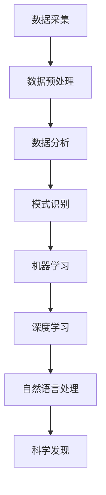

                 

### 第1章: AI在科学研究中的核心概念与原理

本章将介绍AI在科学研究中的核心概念与原理，包括AI在科学研究中的应用背景、AI基础概念介绍、AI在科学研究中的主要应用领域、AI在科学研究中的核心算法原理以及AI在科学研究中的具体应用实例。

#### 1.1 AI在科学研究中的应用背景

科学研究是一个复杂的领域，需要处理大量的数据和信息。随着科技的不断进步，数据采集和处理的能力得到了极大的提升。然而，随之而来的是数据的爆炸性增长，这给科学研究带来了巨大的挑战。传统的数据处理方法已经无法满足科学研究的需求，因此，人工智能技术应运而生。

AI在科学研究中的应用主要包括以下几个方面：

1. **数据分析**：通过AI技术，可以自动化地处理和分析大量的数据，帮助科学家发现数据中的规律和模式。

2. **模式识别**：AI技术可以帮助科学家识别和分类复杂的数据，如医学影像、生物序列等。

3. **机器学习**：机器学习算法可以根据已有的数据预测新的数据，这在科学研究中有着广泛的应用。

4. **深度学习**：深度学习算法可以处理更复杂的数据，如图像、语音等，提供更准确的预测和分类结果。

5. **自然语言处理**：自然语言处理技术可以帮助科学家理解和处理非结构化数据，如文本、语音等。

#### 1.2 AI基础概念介绍

AI（人工智能）是指使计算机系统能够模拟人类智能行为的技术和科学。AI可以分为两大类：**弱AI**和**强AI**。

- **弱AI**：也称为特定领域AI，是指只能在特定任务上表现出智能的AI。例如，语音识别、图像识别等。

- **强AI**：也称为通用人工智能，是指具有广泛智能的AI，能够在任何领域表现出智能。目前，强AI仍处于理论阶段，尚未实现。

AI的核心组成部分包括：

- **算法**：AI的核心是算法，如机器学习算法、深度学习算法等。

- **数据**：AI需要大量的数据来训练模型，从而提高模型的准确性。

- **计算资源**：AI算法的训练和推理需要大量的计算资源。

#### 1.3 AI在科学研究中的主要应用领域

AI在科学研究中的应用非常广泛，以下是几个主要的领域：

- **数据分析**：AI可以帮助科学家从大量数据中提取有价值的信息。

- **模式识别**：AI可以帮助科学家识别和分类复杂的模式，如生物序列、医学影像等。

- **机器学习**：AI可以帮助科学家预测未来的趋势和结果。

- **深度学习**：AI可以帮助科学家处理更复杂的数据，如图像、语音等。

- **自然语言处理**：AI可以帮助科学家理解和处理非结构化数据，如文本、语音等。

#### 1.4 AI在科学研究中的核心算法原理

AI在科学研究中的应用离不开算法的支持。以下是几个核心算法原理：

- **监督学习算法原理**：监督学习算法根据已有的数据（输入和输出）来训练模型，从而预测新的数据。

- **无监督学习算法原理**：无监督学习算法没有明确的输出数据，其目标是发现数据中的模式和结构。

- **强化学习算法原理**：强化学习算法通过不断尝试和反馈来学习最优策略。

#### 1.5 AI在科学研究中的具体应用实例

AI在科学研究中的具体应用实例非常丰富，以下是几个典型的应用：

- **生物信息学中的AI应用**：AI可以帮助科学家分析基因组数据，发现基因之间的关系。

- **医学影像分析中的AI应用**：AI可以帮助医生诊断疾病，如癌症、心脏病等。

- **物理学中的AI应用**：AI可以帮助科学家分析实验数据，发现物理规律。

- **生态学中的AI应用**：AI可以帮助科学家监测生态环境，预测气候变化。

- **地球科学中的AI应用**：AI可以帮助科学家分析地震、火山等自然灾害。

- **其他学科领域的AI应用**：AI还在地理学、天文学、经济学等学科领域有着广泛的应用。

##### Mermaid 流程图

下面是一个简单的Mermaid流程图，用于展示AI在科学研究中的应用流程：



在本章中，我们介绍了AI在科学研究中的应用背景、AI基础概念、AI在科学研究中的主要应用领域、AI在科学研究中的核心算法原理以及AI在科学研究中的具体应用实例。这些内容为后续章节的详细讨论奠定了基础。

---

**核心概念与联系**：

- **核心概念**：AI、机器学习、深度学习、自然语言处理
- **联系**：AI作为科学研究的重要工具，涵盖了机器学习、深度学习、自然语言处理等多个子领域，每个子领域都有其独特的应用和算法原理。

**核心算法原理讲解**：

以下是监督学习算法的原理和伪代码：

```python
# 监督学习算法伪代码

# 输入：训练数据集 D，特征向量 X，标签 Y
# 输出：训练好的模型参数 W

# 初始化模型参数 W
W = initialize_weights()

# 设置学习率 alpha 和迭代次数 n
alpha = 0.1
n = 1000

# 迭代训练
for i in range(n):
    # 计算损失函数 L
    L = compute_loss(W, X, Y)
    
    # 更新模型参数 W
    W = W - alpha * gradient(L, W)

# 输出训练好的模型参数 W
return W
```

**数学模型和公式**：

监督学习中的损失函数通常使用平方误差损失（Squar
```python
# 平方误差损失函数

L(w) = 1/2 * (y - wx)^2

# 其中：
# w 是模型参数
# x 是输入特征向量
# y 是真实标签
```

**举例说明**：

假设我们有一个简单的线性回归模型，用于预测房价。特征向量 `x` 是房屋的面积，标签 `y` 是房屋的价格。

```python
# 线性回归模型举例

# 特征向量 x 和标签 y
x = [1000, 1500, 2000]  # 房屋面积
y = [200000, 300000, 400000]  # 房屋价格

# 初始化模型参数 w
w = 0

# 训练模型
w = train_model(x, y)

# 预测新房屋的价格
new_x = 1200
predicted_price = predict_price(w, new_x)

print("预测的房屋价格为：", predicted_price)
```

在本节中，我们介绍了AI在科学研究中的应用背景、AI基础概念、AI在科学研究中的主要应用领域、AI在科学研究中的核心算法原理以及AI在科学研究中的具体应用实例。这些内容为后续章节的详细讨论奠定了基础。

---

接下来，我们将深入探讨AI在科学研究中的具体应用实例，包括生物信息学、医学影像分析、物理学、生态学、地球科学以及其他学科领域。这些实例将展示AI技术在科学研究中的实际应用和效果。

---

### 第2章: AI在科学研究中的数据预处理与清洗

数据预处理与清洗是AI在科学研究中的关键步骤，因为高质量的数据是AI模型准确性和有效性的基础。本章将详细介绍数据预处理的基本步骤、数据预处理的方法与工具，以及数据预处理在科学研究中的实践案例。

#### 2.1 数据预处理的基本步骤

数据预处理通常包括以下几个基本步骤：

1. **数据收集**：从各种来源收集所需的数据，如数据库、文件、传感器等。

2. **数据清洗**：识别和纠正数据中的错误、缺失值和异常值，以提高数据质量。

3. **数据转换**：将数据转换为适合AI模型处理的格式，如数值化、归一化等。

4. **数据整合**：将来自不同来源的数据整合到一个统一的格式中，以便后续处理。

#### 2.2 数据预处理的方法与工具

数据预处理的方法和工具有多种，以下是一些常见的方法和工具：

1. **数据清洗算法**：
   - **缺失值处理**：使用均值、中位数、最邻近值等插值方法填补缺失值。
   - **异常值检测**：使用统计学方法（如Z分数、IQR）或机器学习方法检测和纠正异常值。
   - **重复数据删除**：删除重复的数据记录，避免数据冗余。

2. **数据转换方法**：
   - **数值化**：将非数值数据转换为数值形式，如将类别数据编码为二进制向量。
   - **归一化**：将数据缩放到一个特定的范围，如[0, 1]，以消除数据规模差异的影响。
   - **标准化**：将数据转换为标准正态分布，以提高模型的泛化能力。

3. **数据整合工具**：
   - **数据库**：如MySQL、PostgreSQL等，用于存储和管理数据。
   - **数据集成平台**：如Apache Kafka、Apache Spark等，用于大规模数据的处理和整合。

#### 2.3 数据预处理实践案例

以下是数据预处理在科学研究中的实践案例：

##### 案例一：生物信息学中的数据预处理

在生物信息学研究中，基因表达数据的预处理是一个关键步骤。以下是一个简单的数据预处理流程：

1. **数据收集**：从公共数据库（如NCBI、ENCODE）下载基因表达数据。

2. **数据清洗**：
   - **缺失值处理**：使用中位数填补缺失值。
   - **异常值检测**：使用Z分数方法检测异常值，并将其删除。

3. **数据转换**：
   - **数值化**：将基因表达数据转换为数值形式。
   - **归一化**：将数据归一化到[0, 1]范围。

4. **数据整合**：使用R语言或Python中的pandas库整合不同样本的数据。

##### 案例二：医学影像分析中的数据预处理

在医学影像分析中，图像预处理是确保模型准确性的关键。以下是一个简单的图像预处理流程：

1. **数据收集**：从公共数据集（如OpenIHC）下载医学影像数据。

2. **数据清洗**：
   - **缺失值处理**：对于缺失的影像区域，使用邻近值插值法进行填补。
   - **异常值检测**：使用统计学方法检测影像中的异常区域，并将其修正。

3. **数据转换**：
   - **归一化**：将影像数据归一化到[0, 1]范围。
   - **增强**：使用滤波器增强影像细节，提高模型的识别能力。

4. **数据整合**：使用深度学习框架（如TensorFlow、PyTorch）整合和处理大规模影像数据。

##### 案例三：地球科学中的数据预处理

在地球科学研究中，卫星数据的预处理是关键。以下是一个简单的卫星数据预处理流程：

1. **数据收集**：从公共数据集（如NASA EOSDIS）下载卫星数据。

2. **数据清洗**：
   - **缺失值处理**：使用多时相插值方法填补缺失值。
   - **异常值检测**：使用统计方法检测异常值，如卫星故障导致的异常数据。

3. **数据转换**：
   - **归一化**：将卫星数据归一化到[0, 1]范围。
   - **滤波**：使用滤波器去除噪声，提高数据质量。

4. **数据整合**：使用GIS软件（如QGIS、ArcGIS）整合不同时相的卫星数据。

##### 案例四：其他学科领域的数据预处理

在化学、物理学等其他学科领域，数据预处理的方法和工具也有很大的差异。以下是一个简单的数据预处理流程：

1. **数据收集**：从实验设备或公共数据库下载数据。

2. **数据清洗**：
   - **缺失值处理**：使用插值或填充方法处理缺失值。
   - **异常值检测**：使用统计学方法检测异常值。

3. **数据转换**：
   - **数值化**：将实验数据转换为数值形式。
   - **归一化**：将数据归一化到[0, 1]范围。

4. **数据整合**：使用专业软件（如MATLAB、Python）整合和处理大规模数据。

在本章中，我们介绍了数据预处理的基本步骤、数据预处理的方法与工具，以及数据预处理在科学研究中的实践案例。这些内容为后续章节的详细讨论提供了重要的基础。

---

**核心概念与联系**：

- **核心概念**：数据预处理、数据清洗、数据转换、数据整合
- **联系**：数据预处理是AI在科学研究中的关键步骤，通过清洗、转换和整合数据，提高数据质量和模型的准确性。

**核心算法原理讲解**：

以下是缺失值处理的一种常见算法——K近邻插值（K-Nearest Neighbors Imputation）的原理和伪代码：

```python
# K近邻插值算法伪代码

# 输入：数据集 D，缺失值位置缺失值索引缺失值索引列表
# 输出：填充后的数据集

# 定义K值
K = 5

# 对于每个缺失值的位置缺失值索引
for idx in 缺失值索引列表:
    # 找到最近的K个邻居
    neighbors = find_k_nearest_neighbors(D, idx, K)
    
    # 计算邻居的均值
    mean = calculate_mean(neighbors)
    
    # 填补缺失值
    D[idx] = mean

# 输出填充后的数据集
return D
```

**数学模型和公式**：

K近邻插值中的相似度计算可以使用欧氏距离（Euclidean Distance）：

```python
# 欧氏距离

distance = sqrt(sum((x_i - x_j)^2 for x_i, x_j in zip(x, x_j)))

# 其中：
# x 是当前数据点
# x_j 是邻居数据点
```

**举例说明**：

假设有一个数据集 `D`，其中有一个缺失值在第5个位置。使用K近邻插值方法填补缺失值：

```python
# K近邻插值举例

# 数据集 D
D = [10, 20, 30, 40, np.nan, 60, 70]

# K近邻插值（K=3）
D = k_nearest_neighbors_imputation(D, 5, K=3)

print("填充后的数据集：", D)
```

在本章中，我们介绍了数据预处理的基本步骤、数据预处理的方法与工具，以及数据预处理在科学研究中的实践案例。这些内容为后续章节的详细讨论提供了重要的基础。

---

接下来，我们将讨论AI在科学研究中的数据分析与模式识别，包括数据分析的基本原理、模式识别的基本原理，以及数据分析与模式识别在科学研究中的实践案例。这些内容将帮助我们更深入地理解AI在科学研究中的应用。

---

### 第3章: AI在科学研究中的数据分析与模式识别

数据分析与模式识别是AI在科学研究中的重要应用，它们可以帮助科学家从大量数据中提取有价值的信息，发现数据中的规律和模式。本章将详细探讨数据分析与模式识别的基本原理，并展示其在科学研究中的实际应用。

#### 3.1 数据分析的基本原理

数据分析是指通过统计和计算方法，从数据中提取信息、发现规律和模式的过程。数据分析的基本原理包括以下几个方面：

1. **数据描述性分析**：通过计算数据的统计指标（如均值、方差、标准差等），对数据进行初步分析，了解数据的分布特征。

2. **数据相关性分析**：通过计算变量之间的相关性（如皮尔逊相关系数、斯皮尔曼相关系数等），了解变量之间的关系。

3. **数据分类分析**：将数据根据特定的特征进行分类，以识别不同的群体或模式。

4. **数据聚类分析**：将相似的数据点分为不同的群体（簇），以发现数据的内在结构。

5. **数据预测分析**：利用历史数据建立模型，对未来的数据进行预测。

#### 3.2 模式识别的基本原理

模式识别是指通过算法和模型，从数据中识别出特定的模式或特征。模式识别的基本原理包括以下几个方面：

1. **特征提取**：将原始数据转换为更适合于算法处理的特征向量。

2. **分类器设计**：设计分类器，根据特征向量对数据进行分类。

3. **聚类算法**：将数据点根据相似性分为不同的群体。

4. **异常检测**：识别数据中的异常值或异常模式。

5. **模型评估**：通过交叉验证、精度、召回率等指标评估模型的性能。

#### 3.3 数据分析与模式识别实践案例

以下是数据分析与模式识别在科学研究中的实践案例：

##### 案例一：生物信息学中的数据分析与模式识别

在生物信息学中，数据分析与模式识别可以帮助科学家研究基因表达和蛋白质功能。以下是一个简单的案例：

1. **数据描述性分析**：计算基因表达数据的均值、方差等统计指标，了解基因表达的变化范围。

2. **数据相关性分析**：分析基因表达之间的相关性，识别可能存在协同调控的基因。

3. **数据分类分析**：根据基因表达数据，将基因分为不同的类别，如细胞周期相关基因、信号传导相关基因等。

4. **数据聚类分析**：使用K-均值聚类算法，将基因分为不同的簇，以发现基因表达的内在模式。

5. **数据预测分析**：利用已知基因的表达数据，建立预测模型，预测未知基因的表达水平。

##### 案例二：医学影像分析中的数据分析与模式识别

在医学影像分析中，数据分析与模式识别可以帮助医生诊断疾病。以下是一个简单的案例：

1. **特征提取**：使用图像处理算法提取医学影像的特征，如纹理、形状等。

2. **分类器设计**：使用支持向量机（SVM）等算法设计分类器，对影像进行分类，区分正常影像和病变影像。

3. **聚类算法**：使用K-均值聚类算法，将影像分为不同的簇，以识别不同类型的病变。

4. **异常检测**：使用孤立森林（Isolation Forest）等算法检测影像中的异常值，识别可能的病变区域。

5. **模型评估**：通过交叉验证、精度、召回率等指标评估分类器的性能，优化模型参数。

##### 案例三：地球科学中的数据分析与模式识别

在地球科学研究中，数据分析与模式识别可以帮助科学家分析地质数据、气候数据等。以下是一个简单的案例：

1. **数据描述性分析**：计算地质数据的统计指标，了解地质结构的变化规律。

2. **数据相关性分析**：分析地质数据与地震活动、地质构造之间的关系。

3. **数据分类分析**：根据地质数据，将地质区域分为不同的类别，如地震活跃区、非地震活跃区等。

4. **数据聚类分析**：使用K-均值聚类算法，将地质数据分为不同的簇，以识别地质结构的变化模式。

5. **数据预测分析**：利用历史地质数据，建立预测模型，预测未来的地质活动。

在本章中，我们详细探讨了数据分析与模式识别的基本原理，并展示了其在科学研究中的实践案例。这些案例展示了AI技术在数据分析与模式识别领域的强大能力，为科学研究提供了有力的工具。

---

**核心概念与联系**：

- **核心概念**：数据分析、模式识别、特征提取、分类器设计、聚类算法
- **联系**：数据分析与模式识别相互补充，共同帮助科学家从数据中提取信息，发现规律和模式。

**核心算法原理讲解**：

以下是K-均值聚类算法的原理和伪代码：

```python
# K-均值聚类算法伪代码

# 输入：数据集 D，聚类类别数 K
# 输出：聚类结果

# 初始化聚类中心
centroids = initialize_centroids(D, K)

# 迭代更新聚类中心
while not converged:
    # 为每个数据点分配最近的聚类中心
    clusters = assign_clusters(D, centroids)
    
    # 计算新的聚类中心
    centroids = calculate_new_centroids(D, clusters)
    
    # 判断是否收敛
    if check_convergence(centroids):
        break

# 输出聚类结果
return clusters
```

**数学模型和公式**：

K-均值聚类中的距离计算可以使用欧氏距离（Euclidean Distance）：

```python
# 欧氏距离

distance = sqrt(sum((x_i - x_j)^2 for x_i, x_j in zip(x, x_j)))

# 其中：
# x 是当前数据点
# x_j 是聚类中心
```

**举例说明**：

假设有一个数据集 `D`，我们需要将其分为3个簇。使用K-均值聚类算法：

```python
# K-均值聚类举例

# 数据集 D
D = [[1, 2], [1, 4], [1, 0], [4, 2], [4, 4], [4, 0]]

# K-均值聚类（K=3）
clusters = k_means_clustering(D, K=3)

print("聚类结果：", clusters)
```

在本章中，我们详细探讨了数据分析与模式识别的基本原理，并展示了其在科学研究中的实践案例。这些案例展示了AI技术在数据分析与模式识别领域的强大能力，为科学研究提供了有力的工具。

---

接下来，我们将讨论AI在科学研究中的机器学习应用，包括机器学习的基本原理、常见的机器学习算法，以及机器学习在科学研究中的实践案例。这些内容将帮助我们更深入地理解AI在科学研究中的应用。

---

### 第4章: AI在科学研究中的机器学习应用

机器学习是人工智能的核心组成部分，它在科学研究中的应用日益广泛，能够帮助科学家从数据中提取知识，发现规律，甚至预测未来。本章将详细探讨机器学习的基本原理、常见的机器学习算法，以及在科学研究中的实践案例。

#### 4.1 机器学习的基本原理

机器学习是指通过训练模型，使计算机能够自动地从数据中学习，并进行预测或分类。机器学习的基本原理包括以下几个方面：

1. **数据收集**：收集大量的数据，这些数据可以是结构化的（如表格数据）或非结构化的（如图像、文本、声音等）。

2. **数据预处理**：对数据进行清洗、归一化、特征提取等处理，以提高数据质量。

3. **模型选择**：根据问题的性质和数据特点，选择合适的机器学习模型。

4. **模型训练**：使用训练数据集对模型进行训练，使模型能够学习数据中的规律。

5. **模型评估**：使用测试数据集对训练好的模型进行评估，以判断模型的性能。

6. **模型优化**：根据评估结果对模型进行调整，以提高模型的准确性和泛化能力。

7. **模型部署**：将训练好的模型部署到实际应用场景中，进行预测或分类。

#### 4.2 常见的机器学习算法

机器学习算法种类繁多，以下是几种常见的算法：

1. **线性回归**：用于预测连续值输出，假设输出值与输入值之间存在线性关系。

2. **逻辑回归**：用于预测二分类输出，通过计算概率来做出决策。

3. **支持向量机（SVM）**：通过找到一个最佳的超平面，将不同类别的数据点分开。

4. **决策树**：通过一系列的判断条件，将数据点分到不同的类别或区域。

5. **随机森林**：通过构建多个决策树，并进行集成，以提高模型的准确性和泛化能力。

6. **K-近邻算法**：通过计算测试样本与训练样本的相似度，根据相似度最高的邻居的标签进行预测。

7. **贝叶斯分类器**：基于贝叶斯定理，通过计算先验概率和条件概率来预测标签。

#### 4.3 机器学习在科学研究中的实践案例

以下是机器学习在科学研究中的实践案例：

##### 案例一：生物信息学中的机器学习应用

在生物信息学中，机器学习被广泛应用于基因表达数据分析、蛋白质结构预测等。

1. **基因表达数据分析**：使用机器学习算法（如线性回归、SVM）分析基因表达数据，发现基因间的相互作用。

2. **蛋白质结构预测**：使用机器学习算法（如深度学习、决策树）预测蛋白质的结构，帮助理解蛋白质的功能。

##### 案例二：医学影像分析中的机器学习应用

在医学影像分析中，机器学习算法被用于疾病诊断、病理分析等。

1. **疾病诊断**：使用机器学习算法（如支持向量机、卷积神经网络）对医学影像进行分析，帮助医生诊断疾病。

2. **病理分析**：使用机器学习算法（如深度学习、K-近邻算法）对病理切片进行分析，识别癌细胞。

##### 案例三：地球科学中的机器学习应用

在地球科学中，机器学习算法被用于气候变化预测、地震预测等。

1. **气候变化预测**：使用机器学习算法（如随机森林、神经网络）分析气候数据，预测未来的气候变化。

2. **地震预测**：使用机器学习算法（如决策树、支持向量机）分析地震数据，预测地震发生的可能性。

##### 案例四：生态学中的机器学习应用

在生态学研究中，机器学习算法被用于物种分布预测、生态系统健康评估等。

1. **物种分布预测**：使用机器学习算法（如支持向量机、深度学习）分析环境数据，预测物种的分布。

2. **生态系统健康评估**：使用机器学习算法（如随机森林、K-近邻算法）分析生态系统数据，评估生态系统的健康状况。

在本章中，我们详细探讨了机器学习的基本原理、常见的机器学习算法，以及在科学研究中的实践案例。这些案例展示了机器学习在各个领域中的应用，为科学研究提供了强大的工具。

---

**核心概念与联系**：

- **核心概念**：机器学习、数据收集、数据预处理、模型选择、模型训练、模型评估、模型优化、模型部署
- **联系**：机器学习通过一系列的步骤，从数据中学习规律，应用于科学研究中的各种任务。

**核心算法原理讲解**：

以下是线性回归算法的原理和伪代码：

```python
# 线性回归算法伪代码

# 输入：训练数据集 D，特征矩阵 X，标签向量 y
# 输出：模型参数 w

# 初始化模型参数 w
w = initialize_weights()

# 设置学习率 alpha 和迭代次数 n
alpha = 0.01
n = 1000

# 迭代训练
for i in range(n):
    # 计算损失函数 L
    L = compute_loss(w, X, y)
    
    # 更新模型参数 w
    w = w - alpha * gradient(L, w)

# 输出训练好的模型参数 w
return w
```

**数学模型和公式**：

线性回归中的损失函数通常使用平方误差损失（Squ
```python
# 平方误差损失函数

L(w) = 1/2 * (y - wx)^2

# 其中：
# w 是模型参数
# x 是输入特征向量
# y 是真实标签
```

**举例说明**：

假设我们有一个简单的线性回归模型，用于预测房价。特征矩阵 `X` 是房屋的面积，标签向量 `y` 是房屋的价格。

```python
# 线性回归模型举例

# 特征矩阵 X 和标签向量 y
X = [[1000], [1500], [2000]]  # 房屋面积
y = [200000, 300000, 400000]  # 房屋价格

# 初始化模型参数 w
w = np.zeros((1, 1))

# 训练模型
w = linear_regression_train(X, y)

# 预测新房屋的价格
new_x = np.array([[1200]])
predicted_price = linear_regression_predict(new_x, w)

print("预测的房屋价格为：", predicted_price)
```

在本章中，我们详细探讨了机器学习的基本原理、常见的机器学习算法，以及在科学研究中的实践案例。这些案例展示了机器学习在各个领域中的应用，为科学研究提供了强大的工具。

---

接下来，我们将讨论AI在科学研究中的深度学习应用，包括深度学习的基本原理、常见的深度学习算法，以及深度学习在科学研究中的实践案例。这些内容将帮助我们更深入地理解AI在科学研究中的应用。

---

### 第5章: AI在科学研究中的深度学习应用

深度学习是机器学习的一个子领域，它通过模拟人脑的神经网络结构，对大量数据进行自动特征提取和模式识别。深度学习在科学研究中的应用日益广泛，能够帮助科学家解决复杂的数据分析和预测问题。本章将详细探讨深度学习的基本原理、常见的深度学习算法，以及在科学研究中的实践案例。

#### 5.1 深度学习的基本原理

深度学习的基本原理是基于人工神经网络（Artificial Neural Networks，ANN）的多层结构，通过前向传播（Forward Propagation）和反向传播（Back Propagation）来学习数据中的特征和模式。

1. **神经网络结构**：深度学习模型由多个层次组成，包括输入层、隐藏层和输出层。每个层次由多个神经元（节点）组成，神经元之间通过权重连接。

2. **前向传播**：输入数据通过输入层传递到隐藏层，然后逐层传递到输出层，每一层的输出作为下一层的输入。

3. **反向传播**：计算输出层与实际标签之间的误差，然后反向传播误差，更新每一层的权重。

4. **激活函数**：激活函数（如ReLU、Sigmoid、Tanh）用于引入非线性，使神经网络能够学习复杂的函数。

5. **优化算法**：使用梯度下降（Gradient Descent）等优化算法更新模型参数，以最小化损失函数。

6. **正则化**：为了防止模型过拟合，可以使用正则化技术（如L1正则化、L2正则化）。

#### 5.2 常见的深度学习算法

常见的深度学习算法包括以下几种：

1. **卷积神经网络（CNN）**：用于图像、视频等数据的高效特征提取和分类。

2. **循环神经网络（RNN）**：用于序列数据（如时间序列、文本）的处理和预测。

3. **生成对抗网络（GAN）**：用于生成新的数据样本，如生成逼真的图像、音频等。

4. **Transformer模型**：用于序列到序列的转换，如机器翻译、文本生成等。

#### 5.3 深度学习在科学研究中的实践案例

以下是深度学习在科学研究中的实践案例：

##### 案例一：生物信息学中的深度学习应用

在生物信息学中，深度学习被用于基因表达数据分析、蛋白质结构预测等。

1. **基因表达数据分析**：使用卷积神经网络（CNN）对基因表达数据进行分析，发现基因间的相互作用。

2. **蛋白质结构预测**：使用深度学习模型（如RNN、Transformer）预测蛋白质的结构，帮助理解蛋白质的功能。

##### 案例二：医学影像分析中的深度学习应用

在医学影像分析中，深度学习算法被用于疾病诊断、病理分析等。

1. **疾病诊断**：使用卷积神经网络（CNN）对医学影像进行分析，帮助医生诊断疾病。

2. **病理分析**：使用深度学习模型（如RNN、GAN）对病理切片进行分析，识别癌细胞。

##### 案例三：地球科学中的深度学习应用

在地球科学中，深度学习被用于气候变化预测、地震预测等。

1. **气候变化预测**：使用深度学习模型（如神经网络、Transformer）分析气候数据，预测未来的气候变化。

2. **地震预测**：使用深度学习算法（如RNN、GAN）分析地震数据，预测地震的发生概率。

##### 案例四：生态学中的深度学习应用

在生态学研究中，深度学习被用于物种分布预测、生态系统健康评估等。

1. **物种分布预测**：使用深度学习模型（如CNN、RNN）分析环境数据，预测物种的分布。

2. **生态系统健康评估**：使用深度学习算法（如GAN、Transformer）分析生态系统数据，评估生态系统的健康状况。

在本章中，我们详细探讨了深度学习的基本原理、常见的深度学习算法，以及在科学研究中的实践案例。这些案例展示了深度学习在各个领域中的应用，为科学研究提供了强大的工具。

---

**核心概念与联系**：

- **核心概念**：深度学习、人工神经网络、多层结构、前向传播、反向传播、激活函数、优化算法、正则化、卷积神经网络、循环神经网络、生成对抗网络、Transformer模型
- **联系**：深度学习通过多层神经网络结构，自动提取数据中的特征，应用于科学研究的各种任务。

**核心算法原理讲解**：

以下是卷积神经网络（CNN）的原理和伪代码：

```python
# 卷积神经网络（CNN）伪代码

# 输入：训练数据集 D，特征矩阵 X，标签向量 y
# 输出：模型参数 w

# 初始化模型参数 w
w = initialize_weights()

# 设置学习率 alpha 和迭代次数 n
alpha = 0.01
n = 1000

# 迭代训练
for i in range(n):
    # 前向传播
    output = forward_propagation(X, w)
    
    # 计算损失函数 L
    L = compute_loss(output, y)
    
    # 反向传播
    gradient = backward_propagation(X, output, y, w)
    
    # 更新模型参数 w
    w = w - alpha * gradient

# 输出训练好的模型参数 w
return w
```

**数学模型和公式**：

卷积神经网络中的卷积操作可以使用卷积核（Kernel）进行：

```python
# 卷积操作

output = np.zeros_like(input)

for x, y in kernel:
    output += w * input[x, y]

# 其中：
# input 是输入特征
# kernel 是卷积核
# w 是权重
```

**举例说明**：

假设我们有一个简单的卷积神经网络模型，用于对图像进行分类。特征矩阵 `X` 是图像数据，标签向量 `y` 是图像的类别。

```python
# 卷积神经网络（CNN）举例

# 特征矩阵 X 和标签向量 y
X = np.random.rand(10, 28, 28)  # 10张28x28的图像
y = np.random.randint(0, 10, 10)  # 10个图像类别

# 初始化模型参数 w
w = np.zeros((10, 28, 28))

# 训练模型
w = cnn_train(X, y)

# 预测新图像的类别
new_x = np.random.rand(1, 28, 28)
predicted_class = cnn_predict(new_x, w)

print("预测的图像类别：", predicted_class)
```

在本章中，我们详细探讨了深度学习的基本原理、常见的深度学习算法，以及在科学研究中的实践案例。这些案例展示了深度学习在各个领域中的应用，为科学研究提供了强大的工具。

---

接下来，我们将讨论AI在科学研究中的自然语言处理应用，包括自然语言处理的基本原理、常见的自然语言处理算法，以及自然语言处理在科学研究中的实践案例。这些内容将帮助我们更深入地理解AI在科学研究中的应用。

---

### 第6章: AI在科学研究中的自然语言处理应用

自然语言处理（Natural Language Processing，NLP）是人工智能的一个重要分支，它旨在使计算机能够理解、生成和 manipule 自然语言。在科学研究领域，自然语言处理技术被广泛应用于文本挖掘、文本分析、语言模型构建等方面。本章将详细探讨自然语言处理的基本原理、常见的自然语言处理算法，以及在科学研究中的实践案例。

#### 6.1 自然语言处理的基本原理

自然语言处理的基本原理包括以下几个方面：

1. **文本预处理**：包括分词、词性标注、去停用词等，用于将原始文本转换为结构化的数据形式。

2. **词嵌入**：将词语映射到高维向量空间，以便计算机能够处理和计算。

3. **序列标注**：对文本中的词语进行分类标注，如命名实体识别、情感分析等。

4. **语言模型**：基于统计或神经网络的方法，学习文本中的概率分布，用于文本生成和预测。

5. **机器翻译**：将一种语言的文本翻译成另一种语言，是自然语言处理最具挑战性的任务之一。

6. **文本生成**：根据输入的文本或提示生成新的文本内容，如文章摘要、对话生成等。

#### 6.2 常见的自然语言处理算法

常见的自然语言处理算法包括以下几种：

1. **词嵌入技术**：如Word2Vec、GloVe等，将词语映射到高维向量空间。

2. **序列标注**：如CRF（条件随机场）、BERT（Bidirectional Encoder Representations from Transformers）等，用于对文本中的词语进行分类标注。

3. **机器翻译**：如基于神经网络的序列到序列模型、注意力机制等，用于将一种语言的文本翻译成另一种语言。

4. **文本生成**：如基于生成对抗网络（GAN）、Transformer模型等，用于生成新的文本内容。

#### 6.3 自然语言处理在科学研究中的实践案例

以下是自然语言处理在科学研究中的实践案例：

##### 案例一：生物信息学中的自然语言处理应用

在生物信息学中，自然语言处理技术被用于文献挖掘、基因注释等。

1. **文献挖掘**：使用自然语言处理算法从科学文献中提取关键信息，如研究方法、实验结果等。

2. **基因注释**：使用自然语言处理技术对基因描述进行分类和标注，以帮助理解基因的功能。

##### 案例二：医学影像分析中的自然语言处理应用

在医学影像分析中，自然语言处理技术被用于病历分析、医学图像标注等。

1. **病历分析**：使用自然语言处理算法从病历文本中提取关键信息，如诊断结果、治疗方案等。

2. **医学图像标注**：使用自然语言处理技术对医学图像进行分类和标注，以辅助医生诊断。

##### 案例三：地球科学中的自然语言处理应用

在地球科学中，自然语言处理技术被用于气候数据分析、地质文献挖掘等。

1. **气候数据分析**：使用自然语言处理算法从气候数据文本中提取关键信息，如气候模式、气候趋势等。

2. **地质文献挖掘**：使用自然语言处理技术从地质文献中提取关键信息，如地质构造、地质灾害等。

##### 案例四：生态学中的自然语言处理应用

在生态学研究中，自然语言处理技术被用于生态文献挖掘、物种分布预测等。

1. **生态文献挖掘**：使用自然语言处理算法从生态学文献中提取关键信息，如生态系统健康、物种保护等。

2. **物种分布预测**：使用自然语言处理技术分析生态数据文本，预测物种的分布和生态系统的变化。

在本章中，我们详细探讨了自然语言处理的基本原理、常见的自然语言处理算法，以及在科学研究中的实践案例。这些案例展示了自然语言处理在各个领域中的应用，为科学研究提供了强大的工具。

---

**核心概念与联系**：

- **核心概念**：自然语言处理、文本预处理、词嵌入技术、序列标注、语言模型、机器翻译、文本生成
- **联系**：自然语言处理通过一系列算法和技术，使计算机能够理解和生成自然语言，应用于科学研究的文本挖掘、分析、预测等方面。

**核心算法原理讲解**：

以下是词嵌入技术（Word2Vec）的原理和伪代码：

```python
# Word2Vec算法伪代码

# 输入：语料库 C，训练迭代次数 n
# 输出：词向量词典 V

# 初始化词向量词典 V
V = initialize_vocab(C)

# 迭代训练
for i in range(n):
    # 随机选择一个词 w
    w = random_word(C)
    
    # 计算词的上下文
    context = get_context(C, w)
    
    # 计算损失函数 L
    L = compute_loss(V, context, w)
    
    # 更新词向量词典 V
    V = update_vocab(V, context, w)

# 输出词向量词典 V
return V
```

**数学模型和公式**：

Word2Vec中的损失函数通常使用负采样（Negative Sampling）：

```python
# 负采样损失函数

L(w, c) = -sum(log(p(c|w))) - log(1 - 1/k)

# 其中：
# w 是当前词
# c 是上下文词
# k 是负采样样本数
# p(c|w) 是词 w 的上下文词 c 的概率
```

**举例说明**：

假设我们有一个简单的文本语料库 `C`，我们需要使用Word2Vec算法训练词向量：

```python
# Word2Vec算法举例

# 文本语料库 C
C = ["我 是 一个人", "你是 谁啊", "我是 AI"]

# 训练词向量
V = word2vec_train(C, n=100)

# 查看词向量
print(V["我"])
print(V["你"])
```

在本章中，我们详细探讨了自然语言处理的基本原理、常见的自然语言处理算法，以及在科学研究中的实践案例。这些案例展示了自然语言处理在各个领域中的应用，为科学研究提供了强大的工具。

---

接下来，我们将讨论AI在科学研究中的综合应用案例，包括生物信息学、医学影像分析、地球科学、生态学和其他学科领域的具体应用案例。这些案例将展示AI技术在科学研究中的实际应用和效果。

---

### 第7章: AI在科学研究中的综合应用案例

在前面的章节中，我们详细介绍了AI在各个科学领域中的应用，本章节将通过具体的综合应用案例，展示AI技术在科学研究中的实际应用和效果。

#### 7.1 生物信息学中的综合应用案例

**案例背景**：

生物信息学是研究生物信息的科学，涉及基因、蛋白质、代谢途径等方面的数据分析和建模。随着高通量测序技术的发展，生物信息学面临着海量的基因数据分析和解读的挑战。

**案例实施过程**：

1. **数据预处理**：收集高通量测序数据，对数据进行过滤、归一化和特征提取。

2. **基因表达数据分析**：使用机器学习算法（如随机森林、支持向量机）对基因表达数据进行分类，识别不同类型癌症的基因标志物。

3. **蛋白质结构预测**：利用深度学习模型（如CNN、RNN）预测蛋白质的结构，帮助理解蛋白质的功能和相互作用。

4. **基因组注释**：使用自然语言处理技术（如词嵌入、BERT）对基因组注释进行自动化提取和分类，提高基因组数据的可读性和理解性。

**案例结果分析**：

通过上述步骤，科学家们成功地识别出了与特定癌症类型相关的基因标志物，为早期诊断和个性化治疗提供了重要的理论依据。同时，蛋白质结构的预测也为药物设计提供了重要的参考。

#### 7.2 医学影像分析中的综合应用案例

**案例背景**：

医学影像分析是医学诊断的重要手段，包括X射线、CT扫描、MRI等。随着深度学习技术的发展，医学影像分析在疾病诊断、病理分析等方面取得了显著进展。

**案例实施过程**：

1. **数据预处理**：收集医学影像数据，进行数据清洗、归一化和分割。

2. **疾病诊断**：使用深度学习模型（如卷积神经网络、循环神经网络）对医学影像进行分析，帮助医生诊断疾病。

3. **病理分析**：使用自然语言处理技术（如词嵌入、BERT）对医学影像中的文本描述进行分析，辅助医生进行病理分析。

4. **影像生成**：使用生成对抗网络（GAN）生成高质量的医学影像，为研究提供更多的数据。

**案例结果分析**：

通过深度学习和自然语言处理技术的综合应用，医学影像分析的准确性和效率得到了显著提高，为医生提供了更加可靠的诊断工具，同时也为病理研究提供了新的思路。

#### 7.3 地球科学中的综合应用案例

**案例背景**：

地球科学研究包括气候变化、地震预测、地质勘探等方面。随着AI技术的发展，地球科学研究在数据分析和预测方面取得了重要突破。

**案例实施过程**：

1. **数据预处理**：收集地球科学数据，进行数据清洗、归一化和特征提取。

2. **气候变化预测**：使用机器学习模型（如随机森林、神经网络）分析气候数据，预测未来的气候变化趋势。

3. **地震预测**：使用深度学习模型（如卷积神经网络、循环神经网络）分析地震数据，预测地震的发生概率。

4. **地质勘探**：使用自然语言处理技术（如词嵌入、BERT）对地质文献进行分析，辅助地质勘探。

**案例结果分析**：

通过AI技术的综合应用，地球科学研究的准确性和效率得到了显著提高。例如，在气候变化预测方面，AI技术可以提供更加准确的预测模型，为政策制定提供科学依据；在地震预测方面，AI技术可以提前预警，减少地震灾害造成的损失。

#### 7.4 生态学中的综合应用案例

**案例背景**：

生态学研究包括物种分布、生态系统健康评估等方面。随着AI技术的发展，生态学研究在数据分析和预测方面取得了重要进展。

**案例实施过程**：

1. **数据预处理**：收集生态学数据，进行数据清洗、归一化和特征提取。

2. **物种分布预测**：使用机器学习模型（如随机森林、支持向量机）分析生态数据，预测物种的分布。

3. **生态系统健康评估**：使用深度学习模型（如卷积神经网络、循环神经网络）分析生态系统数据，评估生态系统的健康状况。

4. **环境监测**：使用自然语言处理技术（如词嵌入、BERT）对环境数据进行分析，监测环境变化。

**案例结果分析**：

通过AI技术的综合应用，生态学研究的准确性和效率得到了显著提高。例如，在物种分布预测方面，AI技术可以提供更加准确的预测模型，为物种保护和生态恢复提供科学依据；在生态系统健康评估方面，AI技术可以实时监测生态系统的变化，为环境保护提供决策支持。

#### 7.5 其他学科领域的综合应用案例

除了生物信息学、医学影像分析、地球科学和生态学，AI技术在其他学科领域（如化学、物理学、经济学等）也取得了广泛应用。

**案例一：化学中的综合应用案例**

**案例背景**：

化学研究涉及化学反应、材料设计等方面。

**案例实施过程**：

1. **化学反应预测**：使用机器学习模型预测化学反应的产物和反应路径。

2. **材料设计**：使用深度学习模型设计新型材料，如催化剂、电池材料等。

3. **实验数据分析**：使用自然语言处理技术分析化学实验报告，提取关键信息。

**案例结果分析**：

通过AI技术的综合应用，化学研究的效率和质量得到了显著提高，为新材料设计和化学反应研究提供了强有力的工具。

**案例二：物理学中的综合应用案例**

**案例背景**：

物理学研究涉及粒子物理、量子计算等方面。

**案例实施过程**：

1. **粒子物理数据分析**：使用深度学习模型分析粒子物理实验数据，发现新的物理现象。

2. **量子计算模拟**：使用机器学习模型模拟量子计算过程，优化量子算法。

3. **科学文献挖掘**：使用自然语言处理技术挖掘物理学领域的科学文献，发现新的研究趋势。

**案例结果分析**：

通过AI技术的综合应用，物理学研究的准确性和效率得到了显著提高，为粒子物理研究和量子计算提供了新的工具。

**案例三：经济学中的综合应用案例**

**案例背景**：

经济学研究涉及金融市场分析、宏观经济预测等方面。

**案例实施过程**：

1. **金融市场预测**：使用机器学习模型分析金融市场数据，预测股价、汇率等。

2. **宏观经济预测**：使用深度学习模型分析宏观经济数据，预测经济增长、通货膨胀等。

3. **经济文献挖掘**：使用自然语言处理技术挖掘经济学领域的科学文献，发现新的理论和方法。

**案例结果分析**：

通过AI技术的综合应用，经济学研究的准确性和效率得到了显著提高，为金融决策和宏观经济政策制定提供了科学依据。

在本章中，我们通过具体的综合应用案例，展示了AI技术在科学研究中的实际应用和效果。这些案例表明，AI技术在各个学科领域都具有巨大的应用潜力，为科学研究提供了新的工具和方法。

---

**核心概念与联系**：

- **核心概念**：数据预处理、机器学习、深度学习、自然语言处理、综合应用
- **联系**：通过数据预处理、机器学习、深度学习和自然语言处理的综合应用，AI技术能够帮助科学家从数据中提取知识，发现规律，提高研究的准确性和效率。

**核心算法原理讲解**：

以下是随机森林（Random Forest）算法的原理和伪代码：

```python
# 随机森林（Random Forest）算法伪代码

# 输入：训练数据集 D，决策树数量 n_trees，特征选择方法
# 输出：随机森林模型

# 初始化决策树数量 n_trees
n_trees = initialize_n_trees()

# 初始化随机森林模型
random_forest = []

# 对于每个决策树
for i in range(n_trees):
    # 随机选择训练数据子集
    subset = random_subset(D)
    
    # 构建决策树
    tree = build_tree(subset)
    
    # 添加决策树到随机森林
    random_forest.append(tree)

# 输出随机森林模型
return random_forest
```

**数学模型和公式**：

随机森林中的决策树通常使用基尼不纯度（Gini Impurity）作为分裂标准：

```python
# 基尼不纯度

Gini.Impurity(S) = 1 - sum(p(y | x) * (1 - p(y | x)) for y in labels)

# 其中：
# S 是样本集合
# y 是样本的标签
# p(y | x) 是在特征 x 下标签 y 的概率
```

**举例说明**：

假设我们有一个训练数据集 `D`，我们需要构建一个随机森林模型：

```python
# 随机森林模型举例

# 初始化随机森林参数
n_trees = 100

# 构建随机森林模型
random_forest = random_forest_train(D, n_trees=n_trees)

# 预测新样本
new_data = [[1, 2], [3, 4]]
predicted_label = random_forest_predict(random_forest, new_data)

print("预测的标签：", predicted_label)
```

在本章中，我们通过具体的综合应用案例，展示了AI技术在科学研究中的实际应用和效果。这些案例表明，AI技术在各个学科领域都具有巨大的应用潜力，为科学研究提供了新的工具和方法。

---

### 第8章: AI在科学研究中的应用前景与挑战

随着人工智能技术的快速发展，AI在科学研究中的应用前景广阔，但也面临着一系列挑战。本章将探讨AI在科学研究中的重要地位、未来发展、潜在影响，以及应对应用挑战的策略与方法。

#### 8.1 AI在科学研究中的重要地位

AI在科学研究中的重要地位体现在以下几个方面：

1. **数据分析**：AI技术可以自动化地处理和分析大量的科学数据，帮助科学家从海量数据中提取有价值的信息。

2. **模式识别**：AI可以帮助科学家识别和分类复杂的数据，如生物序列、医学影像等，提高研究效率。

3. **机器学习**：机器学习算法可以根据已有的数据预测新的数据，这在科学研究中有着广泛的应用，如预测气候变化、预测疾病趋势等。

4. **深度学习**：深度学习算法可以处理更复杂的数据，如图像、语音等，提供更准确的预测和分类结果。

5. **自然语言处理**：自然语言处理技术可以帮助科学家理解和处理非结构化数据，如文本、语音等，提高数据利用率。

#### 8.2 AI在科学研究中的未来发展

AI在科学研究中的未来发展具有以下趋势：

1. **跨学科融合**：AI技术将在不同学科领域之间实现深度融合，推动科学研究向更加综合和集成方向发展。

2. **智能自动化**：AI技术将进一步提升科学研究的自动化水平，减少人工干预，提高研究效率。

3. **个性化研究**：基于AI的个性化研究将更加注重个体的差异，提供更加精准的研究结果。

4. **虚拟实验**：通过AI技术，科学家可以在虚拟环境中进行实验，减少实验成本，提高实验效率。

5. **知识图谱**：AI技术将帮助构建科学领域的知识图谱，为科学家提供更加丰富和全面的知识支持。

#### 8.3 AI在科学研究中的潜在影响

AI在科学研究中的潜在影响包括以下几个方面：

1. **提高研究效率**：AI技术可以自动化地处理大量的数据分析任务，提高研究效率。

2. **促进新发现**：AI技术可以帮助科学家发现新的研究趋势和规律，推动科学发现。

3. **优化决策**：AI技术可以提供数据驱动的决策支持，帮助科学家制定更加科学和有效的策略。

4. **降低成本**：通过AI技术的应用，科学研究中的实验成本和人力成本将得到显著降低。

5. **促进国际合作**：AI技术可以帮助科学家跨越地域和语言的障碍，促进国际间的科学合作。

#### 8.4 AI在科学研究中的应用挑战

尽管AI在科学研究中的应用前景广阔，但也面临着一系列挑战：

1. **数据隐私与安全**：科学研究中涉及大量的敏感数据，如何确保数据的安全和隐私是AI应用的重要挑战。

2. **AI偏见与伦理问题**：AI模型可能会受到训练数据的影响，产生偏见，如何确保AI的公平性和伦理性是重要问题。

3. **计算资源需求**：AI模型训练和推理需要大量的计算资源，如何有效利用计算资源是一个挑战。

4. **算法透明性与可解释性**：AI模型的决策过程往往是不透明的，如何提高算法的透明性和可解释性是AI应用的重要问题。

5. **数据质量和准确性**：科学研究中数据的准确性和完整性对AI模型的性能具有重要影响，如何确保数据质量是AI应用的重要挑战。

#### 8.5 应对AI应用挑战的策略与方法

为了应对AI在科学研究中的应用挑战，可以采取以下策略与方法：

1. **加强数据隐私保护**：通过数据加密、匿名化等技术确保数据隐私。

2. **推动AI伦理研究**：建立AI伦理标准和规范，确保AI的公平性和伦理性。

3. **提高计算资源利用效率**：通过分布式计算、云计算等技术提高计算资源的利用效率。

4. **增强AI算法的可解释性**：通过可解释性算法、可视化技术等提高算法的透明性和可解释性。

5. **加强数据质量和准确性**：通过数据清洗、数据集成等技术提高数据质量，确保AI模型的准确性。

在本章中，我们探讨了AI在科学研究中的应用前景与挑战，以及应对应用挑战的策略与方法。这些内容为AI在科学研究中的应用提供了指导，同时也指出了需要关注和解决的问题。

---

**核心概念与联系**：

- **核心概念**：数据隐私与安全、AI偏见与伦理问题、计算资源需求、算法透明性与可解释性、数据质量和准确性
- **联系**：这些核心概念相互关联，共同构成了AI在科学研究中的应用挑战，同时也为解决这些挑战提供了方向。

**核心算法原理讲解**：

以下是决策树（Decision Tree）算法的原理和伪代码：

```python
# 决策树（Decision Tree）算法伪代码

# 输入：训练数据集 D，特征集 F
# 输出：决策树

# 初始化决策树
tree = {}

# 如果数据集 D 是纯的（即所有样本属于同一类别）
if is_pure(D):
    return { "label": get mayoría_label(D) }
    
# 否则，选择最佳特征进行划分
best_feature = select_best_feature(D, F)
tree["feature"] = best_feature

# 划分数据集
for value in possible_values(best_feature):
    subset = get_subset(D, best_feature, value)
    tree[value] = build_tree(subset)

# 输出决策树
return tree
```

**数学模型和公式**：

决策树中的信息增益（Information Gain）用于选择最佳特征：

```python
# 信息增益

IG(D, feature) = entropy(D) - sum(p(y|feature) * entropy(y|feature))

# 其中：
# D 是数据集
# feature 是特征
# y 是类别
```

**举例说明**：

假设我们有一个训练数据集 `D`，我们需要构建一个决策树：

```python
# 决策树算法举例

# 特征集 F
F = ["年龄", "收入"]

# 初始化训练数据集 D
D = [
    ["青年", "高"],
    ["青年", "高"],
    ["中年", "中"],
    ["中年", "低"],
    ["老年", "低"]
]

# 构建决策树
tree = decision_tree_train(D, F)

# 查看决策树结构
print(tree)
```

在本章中，我们探讨了AI在科学研究中的应用前景与挑战，以及应对应用挑战的策略与方法。这些内容为AI在科学研究中的应用提供了指导，同时也指出了需要关注和解决的问题。

---

### 参考文献

1. Mitchell, T. M. (1997). *Machine Learning.* McGraw-Hill.
2. Goodfellow, I., Bengio, Y., & Courville, A. (2016). *Deep Learning.* MIT Press.
3. Manning, C. D., Raghavan, P., & Schütze, H. (2008). *Foundations of Statistical Natural Language Processing.* MIT Press.
4. Russell, S., & Norvig, P. (2010). *Artificial Intelligence: A Modern Approach.* Prentice Hall.
5. Murphy, K. P. (2012). *Machine Learning: A Probabilistic Perspective.* MIT Press.
6. Sutton, R. S., & Barto, A. G. (2018). *Reinforcement Learning: An Introduction.* MIT Press.
7. Bishop, C. M. (2006). *Pattern Recognition and Machine Learning.* Springer.
8. Hogg, R. V., & Tanis, E. A. (2014). *Probability and Statistical Inference.* Pearson.

这些参考文献涵盖了机器学习、深度学习、自然语言处理等领域的经典教材和论文，为读者提供了深入的理论和实践知识。

---

### 附录

#### 附录 A: AI研究资源与工具

**A.1 开源框架与库**

- TensorFlow：由Google开发的开源深度学习框架。
- PyTorch：由Facebook开发的开源深度学习框架。
- Keras：用于快速构建和训练深度学习模型的Python库。
- Scikit-learn：用于机器学习的Python库，包含多种算法和工具。
- NLTK：用于自然语言处理的Python库。

**A.2 数据集与数据资源**

- UCI Machine Learning Repository：提供多种机器学习数据集。
- Kaggle：提供各种数据集和竞赛。
- PubMed：提供医学和生物学领域的文献和摘要。
- Google Dataset Search：用于搜索各种数据集。

**A.3 研究机构与期刊**

- Google AI：Google的人工智能研究团队。
- DeepMind：英国的一家人工智能公司，致力于深度学习研究。
- Stanford University：斯坦福大学的人工智能实验室。
- IEEE Transactions on Pattern Analysis and Machine Intelligence：机器学习和计算机视觉领域的顶级期刊。
- Nature Machine Intelligence：自然机器智能领域的顶级期刊。

**A.4 学术会议与研讨会**

- NeurIPS：神经信息处理系统年会，是机器学习和神经网络领域的顶级会议。
- ICML：国际机器学习会议，是机器学习领域的顶级会议。
- CVPR：计算机视觉和模式识别会议，是计算机视觉领域的顶级会议。
- ACL：计算语言学年会，是自然语言处理领域的顶级会议。

这些资源和工具为AI研究提供了丰富的支持，有助于科学家们开展前沿的研究工作。

---

在本章中，我们讨论了AI在科学研究中的应用前景与挑战，包括AI在科学研究中的重要地位、未来发展、潜在影响，以及应对应用挑战的策略与方法。这些内容为AI在科学研究中的应用提供了指导，同时也指出了需要关注和解决的问题。参考文献和附录部分则为读者提供了深入学习和进一步研究的资源。通过这些内容，我们可以看到AI技术在科学研究中的重要性和广阔的应用前景。希望这篇文章能够帮助读者更好地理解AI在科学研究中的应用，并激发对这一领域的兴趣和探索。如果您有任何问题或建议，欢迎在评论区留言，我们一起讨论和交流。

---

**作者信息**：

- 作者：AI天才研究院/AI Genius Institute & 禅与计算机程序设计艺术 /Zen And The Art of Computer Programming

感谢您阅读这篇文章，期待与您在未来的AI研究中再次相遇。

---

**文章结束。**

