                 

## 《AI在考古学中的应用：揭示历史之谜》

> **关键词：**人工智能，考古学，数据预处理，机器学习，深度学习，应用实践

**摘要：**随着人工智能技术的飞速发展，其在考古学中的应用日益广泛，成为破解历史之谜的重要工具。本文将系统探讨AI在考古学中的历史背景、主要应用领域、核心技术及其在实际考古项目中的应用实践。通过详细分析AI技术如何助力考古学者揭示历史真相，展示其在考古学研究、遗址发掘、文献分析、考古保护等多个方面的卓越成果。文章旨在为读者提供一份全面、深入的AI在考古学应用指南。

---

### 目录大纲

## 第一部分：引论与基础

### 第1章：考古学中的AI概述
- 1.1 AI在考古学中的历史背景
- 1.2 AI在考古学中的主要应用领域
- 1.3 AI技术的核心优势与挑战
- 1.4 本书结构与学习目标

## 第二部分：技术基础

### 第2章：考古学中的数据预处理
- 2.1 地层序列数据的处理
  - 2.1.1 数据来源与采集
  - 2.1.2 数据清洗与预处理
  - 2.1.3 数据可视化
- 2.2 器物形态与材质分析
  - 2.2.1 形态识别算法
  - 2.2.2 材质识别技术
- 2.3 文献资料与网络资源利用
  - 2.3.1 文献资料检索
  - 2.3.2 网络资源挖掘

### 第3章：核心AI技术详解
- 3.1 机器学习基础
  - 3.1.1 数据结构与算法
  - 3.1.2 监督学习与无监督学习
  - 3.1.3 强化学习概述
- 3.2 自然语言处理在考古中的应用
  - 3.2.1 文本挖掘与语义分析
  - 3.2.2 历史文献数字化与语义关联
- 3.3 深度学习在考古学中的应用
  - 3.3.1 卷积神经网络（CNN）在图像识别中的应用
  - 3.3.2 递归神经网络（RNN）在序列数据分析中的应用

### 第4章：AI工具与平台
- 4.1 主流AI工具介绍
  - 4.1.1 TensorFlow
  - 4.1.2 PyTorch
  - 4.1.3 Keras
- 4.2 考古学专用软件
  - 4.2.1 OpenCV在考古图像处理中的应用
  - 4.2.2 GIMP与考古图像编辑
- 4.3 数据库与存储解决方案
  - 4.3.1 关系型数据库
  - 4.3.2 非关系型数据库
  - 4.3.3 大数据存储与处理

## 第三部分：实战应用

### 第5章：AI在考古遗址发掘中的应用
- 5.1 地层序列分析
  - 5.1.1 遗址地层数据的采集与处理
  - 5.1.2 地层序列模型的构建
- 5.2 器物形态识别
  - 5.2.1 器物形态识别的算法实现
  - 5.2.2 器物形态识别系统的设计与实现
- 5.3 文献资料分析
  - 5.3.1 历史文献的数字化与语义分析
  - 5.3.2 文献资料检索与分析

### 第6章：AI在考古研究中的应用
- 6.1 历史事件模拟
  - 6.1.1 历史事件模拟的基本原理
  - 6.1.2 历史事件模拟的算法实现
- 6.2 社会结构与社会变迁研究
  - 6.2.1 社会结构分析的方法与工具
  - 6.2.2 社会变迁的研究方法与实践
- 6.3 考古学理论与方法的发展
  - 6.3.1 考古学理论的发展历程
  - 6.3.2 考古学方法的创新与改进

### 第7章：AI在考古保护与修复中的应用
- 7.1 考古遗迹保护技术
  - 7.1.1 遗迹保护的基本原理
  - 7.1.2 保护技术的选择与实施
- 7.2 考古器物修复
  - 7.2.1 修复技术的基本原理
  - 7.2.2 修复工艺的实践与案例分析
- 7.3 数字考古与虚拟展示
  - 7.3.1 数字考古的基本方法
  - 7.3.2 虚拟展示的技术与应用

### 第8章：AI在考古学未来的应用趋势
- 8.1 AI在考古学中的未来发展方向
  - 8.1.1 AI技术与考古学的深度融合
  - 8.1.2 跨学科合作与创新发展
- 8.2 考古学人才培养与教育改革
  - 8.2.1 考古学人才培养模式
  - 8.2.2 考古学教育改革趋势
- 8.3 考古学研究的可持续发展
  - 8.3.1 可持续发展的概念与意义
  - 8.3.2 考古学研究与可持续发展的实践

## 附录

### 附录A：AI在考古学中的应用案例集
- 10.1 案例一：某遗址地层序列分析的AI应用
- 10.2 案例二：某历史文献的语义分析与事件模拟
- 10.3 案例三：某考古器物修复的AI辅助技术
- 10.4 案例四：某虚拟考古博物馆的创建与实践
- 10.5 案例五：某考古遗址保护技术的AI应用

---

### 第一部分：引论与基础

#### 第1章：考古学中的AI概述

考古学，作为一门研究人类历史和文化的科学，长期以来依赖于田野调查、文献资料和实物证据等传统手段来揭示历史的真相。然而，随着科技的飞速发展，尤其是人工智能（AI）技术的兴起，考古学正经历一场前所未有的变革。AI技术以其强大的数据处理能力和模式识别能力，为考古学提供了新的研究工具和方法，极大地提升了考古研究的效率和精度。

### 1.1 AI在考古学中的历史背景

AI技术的历史可以追溯到20世纪50年代，当时人工智能的概念首次被提出。随后，随着计算机技术的进步，AI领域不断发展，逐渐形成了包括机器学习、自然语言处理、计算机视觉等多个子领域。考古学作为一门学科，也逐渐开始意识到AI技术的潜在价值，并开始尝试将AI技术应用于考古实践中。

### 1.2 AI在考古学中的主要应用领域

AI技术在考古学中的应用涵盖了多个方面，主要包括：

- 数据预处理：对考古现场采集的大量数据进行清洗、整理和分析，为后续的研究提供可靠的数据基础。
- 形态识别：利用计算机视觉技术对考古出土的器物进行形态分析，帮助考古学者识别和分类不同类型的器物。
- 文献资料分析：利用自然语言处理技术对历史文献进行数字化处理和语义分析，帮助考古学者挖掘文献中的潜在信息。
- 遗址发掘：通过遥感技术和GIS系统，对考古遗址进行三维建模和分析，辅助考古学者进行遗址发掘。

### 1.3 AI技术的核心优势与挑战

AI技术为考古学带来了许多核心优势：

- **数据处理能力：** AI技术能够处理和分析大规模的考古数据，帮助考古学者从复杂的数据中提取有价值的信息。
- **模式识别：** AI技术在图像和文本识别方面具有出色的能力，能够帮助考古学者识别和分类大量的考古文物。
- **自动化：** AI技术能够自动化完成一些重复性的工作，减轻考古学者的工作负担。

然而，AI技术在考古学中的应用也面临着一些挑战：

- **数据质量和可靠性：** 考古数据的来源多样，质量参差不齐，如何保证数据的质量和可靠性是一个重要问题。
- **技术门槛：** AI技术的应用需要较高的技术门槛，对考古学者和研究人员提出了新的要求。
- **伦理问题：** 在利用AI技术进行考古研究时，如何处理和保护考古数据，以及如何应对潜在的伦理问题，也是一个需要认真考虑的问题。

### 1.4 本书结构与学习目标

本书旨在系统介绍AI在考古学中的应用，结构如下：

- **第一部分：引论与基础**：介绍AI在考古学中的历史背景、主要应用领域、核心优势与挑战。
- **第二部分：技术基础**：详细讲解考古学中的数据预处理、机器学习、自然语言处理、深度学习等核心技术。
- **第三部分：实战应用**：通过具体案例展示AI技术在考古遗址发掘、考古研究、考古保护等领域的应用实践。
- **附录**：提供AI在考古学中的应用案例集，供读者参考。

通过本书的学习，读者将能够：

- **理解AI在考古学中的应用价值**：了解AI技术在考古学研究中的核心作用。
- **掌握考古学中的数据预处理方法**：学会如何对考古数据进行分析和预处理。
- **了解核心AI技术**：掌握机器学习、自然语言处理、深度学习等AI技术的基本原理和应用。
- **掌握AI在考古学中的应用实践**：通过具体案例了解AI技术在考古学中的实际应用。

---

### 第一部分：引论与基础

#### 第2章：考古学中的数据预处理

考古学中的数据预处理是考古研究的重要环节，它直接影响到后续分析和研究的准确性和效率。数据预处理包括数据收集、数据清洗、数据整合、数据变换等多个步骤。在这一章中，我们将详细探讨考古学中的数据预处理方法，特别是地层序列数据的处理、器物形态与材质分析，以及文献资料与网络资源的利用。

### 2.1 地层序列数据的处理

地层序列数据是考古学中最为重要的数据之一，它记录了考古遗址中不同文化层的位置、厚度、年代等信息。对这些数据进行处理，有助于考古学者了解遗址的历史演变过程。

#### 2.1.1 数据来源与采集

地层序列数据主要来源于考古发掘。在考古发掘过程中，考古学家会按照一定的层序挖掘，将每一层土样进行编号、记录，并取样分析。这些数据通常包括土样的物理特性、化学成分、年代等。

#### 2.1.2 数据清洗与预处理

数据清洗是预处理的重要步骤，它包括去除重复数据、纠正错误数据、填补缺失数据等。在考古学中，由于各种原因，数据可能会存在缺失或不准确的情况，因此需要通过数据清洗技术来提高数据的质量。

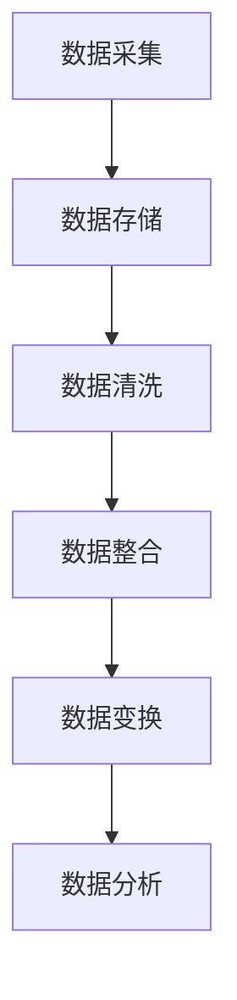

#### 2.1.3 数据可视化

数据可视化是将数据处理结果以图形化的方式呈现，便于考古学者直观地理解数据。在考古学中，常用的可视化方法包括柱状图、折线图、散点图等。

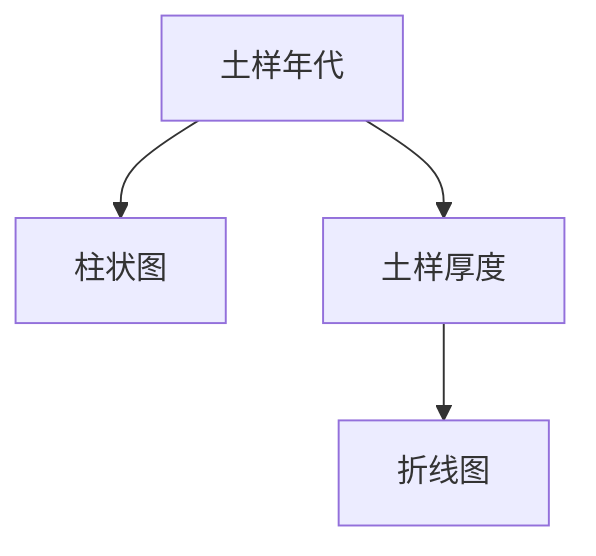

### 2.2 器物形态与材质分析

考古出土的器物形态和材质是研究古代文化和社会生活的重要依据。通过对器物形态和材质的分析，考古学者可以了解古代的技术水平、文化特征和社会结构。

#### 2.2.1 形态识别算法

形态识别算法是计算机视觉技术的一个重要应用，它通过分析器物的形状、尺寸、比例等特征，对其进行分类和识别。常用的形态识别算法包括边缘检测、轮廓提取、形状匹配等。

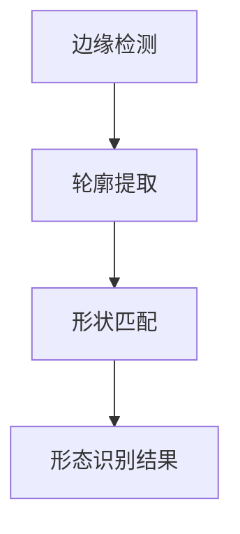

#### 2.2.2 材质识别技术

材质识别技术通过分析器物的物理和化学特性，确定其材质类型。常用的材质识别技术包括光谱分析、热分析、X射线衍射等。

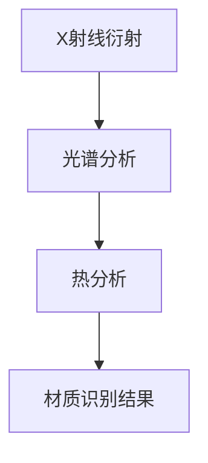

### 2.3 文献资料与网络资源利用

考古学研究离不开文献资料的支持，通过对历史文献的挖掘和分析，考古学者可以获取大量有价值的信息。此外，网络资源的利用也为考古学研究提供了新的途径。

#### 2.3.1 文献资料检索

文献资料检索是考古学研究的重要步骤，它通过关键词检索、布尔检索等方法，从海量的文献中快速找到所需的信息。

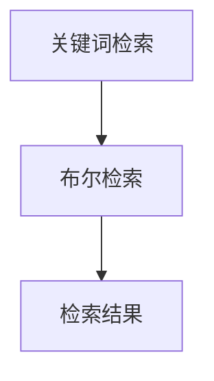

#### 2.3.2 网络资源挖掘

网络资源的挖掘是指通过爬虫技术、文本挖掘等方法，从互联网上获取有价值的历史资料。这些资料包括历史文献、考古报告、学术论文等。

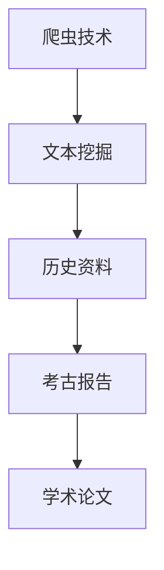

通过本章的学习，读者将能够了解考古学中的数据预处理方法，掌握地层序列数据、器物形态与材质分析，以及文献资料与网络资源的利用。这些知识将为后续的AI技术在考古学中的应用奠定基础。

---

### 第二部分：技术基础

#### 第3章：核心AI技术详解

在考古学中，人工智能技术的应用极大地推动了考古研究的发展。机器学习、自然语言处理和深度学习是AI技术的核心组成部分，它们在考古学中的应用具有广泛的前景和重要的研究价值。本章将详细介绍这些核心AI技术的基础知识、基本原理及其在考古学中的具体应用。

### 3.1 机器学习基础

机器学习是人工智能的一个重要分支，它通过构建模型来从数据中学习规律和模式，进而对未知数据进行预测和分类。在考古学中，机器学习技术主要用于数据分析和模式识别。

#### 3.1.1 数据结构与算法

数据结构是机器学习中至关重要的概念，它决定了数据的存储方式和处理效率。常见的数据结构包括数组、链表、树、图等。算法则是实现机器学习模型的核心，包括监督学习、无监督学习和强化学习等。

- **监督学习（Supervised Learning）**：监督学习是一种通过已有标记数据来训练模型的方法。常见的算法包括线性回归、逻辑回归、支持向量机（SVM）、决策树等。
- **无监督学习（Unsupervised Learning）**：无监督学习不依赖于已有标记数据，而是通过分析数据自身的特征来发现数据中的模式和结构。常见的算法包括聚类（如K-means、层次聚类）、降维（如主成分分析PCA）等。
- **强化学习（Reinforcement Learning）**：强化学习是一种通过与环境交互来学习最优策略的方法。它通常用于解决序列决策问题，如游戏、机器人控制等。

#### 3.1.2 数据结构与算法

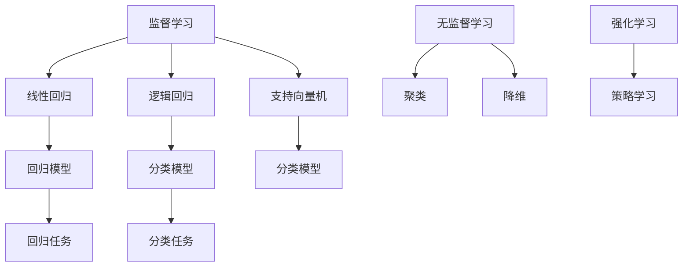

### 3.2 自然语言处理在考古中的应用

自然语言处理（NLP）是机器学习在语言领域的应用，它使计算机能够理解和处理人类语言。在考古学中，NLP技术主要用于历史文献的数字化和语义分析。

#### 3.2.1 文本挖掘与语义分析

文本挖掘是指从大量文本数据中提取有用信息和知识的过程。语义分析则是指对文本中的词语、句子和篇章进行语义层次的分析，以理解其含义和关系。

- **词频统计（Term Frequency）**：通过对文本中词语的出现频率进行统计，可以初步了解文本的主题和内容。
- **词义消歧（Word Sense Disambiguation）**：由于一词多义的现象，词义消歧旨在根据上下文确定词语的确切含义。
- **主题建模（Topic Modeling）**：通过非监督学习技术，如LDA（Latent Dirichlet Allocation），可以识别文本中的潜在主题。

#### 3.2.2 历史文献数字化与语义关联

历史文献的数字化是将纸质文献转化为电子文档的过程，它为后续的语义分析提供了基础。语义关联则是指通过语义分析技术，将文献中的相关词语、句子和篇章进行关联，以揭示文献中的内在逻辑和关系。

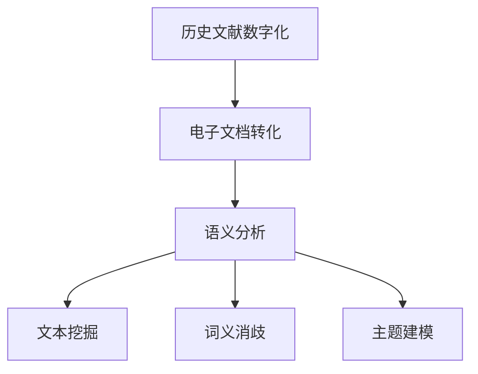

### 3.3 深度学习在考古学中的应用

深度学习是机器学习的一个重要分支，它通过构建多层神经网络来学习数据的复杂特征。在考古学中，深度学习技术主要用于图像识别和序列数据分析。

#### 3.3.1 卷积神经网络（CNN）在图像识别中的应用

卷积神经网络（CNN）是一种特别适合处理图像数据的神经网络结构，它通过卷积层、池化层和全连接层等层次，逐步提取图像中的低级到高级特征。

- **卷积层（Convolutional Layer）**：通过卷积操作提取图像中的局部特征。
- **池化层（Pooling Layer）**：通过下采样操作减少数据维度，提高模型泛化能力。
- **全连接层（Fully Connected Layer）**：将卷积层和池化层提取的特征映射到输出结果。

#### 3.3.2 递归神经网络（RNN）在序列数据分析中的应用

递归神经网络（RNN）是一种适合处理序列数据的神经网络结构，它通过递归操作将序列中的每个元素与前面的状态关联起来。

- **隐藏状态（Hidden State）**：RNN通过隐藏状态来存储序列的信息。
- **递归连接（Recursive Connection）**：通过递归连接，RNN能够处理变长的序列数据。

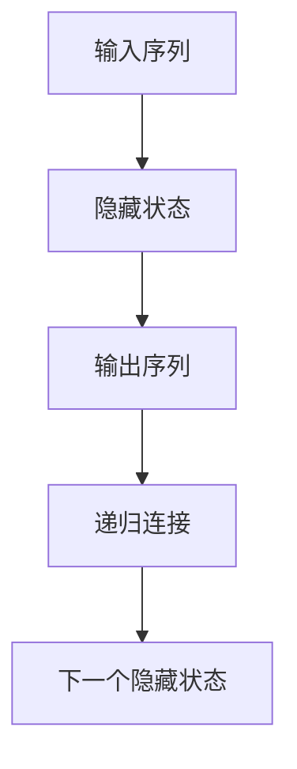

通过本章的学习，读者将能够掌握机器学习、自然语言处理和深度学习等核心AI技术的基础知识，了解它们在考古学中的应用，为后续的实战应用奠定理论基础。

---

### 第二部分：技术基础

#### 第4章：AI工具与平台

在考古学中，选择合适的AI工具与平台对于实现高效的研究具有重要意义。本章节将介绍当前主流的AI工具与平台，包括TensorFlow、PyTorch和Keras，并探讨考古学专用软件、数据库与存储解决方案。

#### 4.1 主流AI工具介绍

AI工具和平台为考古学者提供了强大的计算能力和丰富的算法库，使复杂的AI任务能够得以高效实施。

##### 4.1.1 TensorFlow

TensorFlow是一个开源的机器学习框架，由Google开发，广泛用于各种深度学习任务。其优点包括：

- **灵活性**：支持多种计算图操作，便于自定义模型。
- **高性能**：提供高效的数据流图执行引擎。
- **广泛支持**：支持多种操作系统和硬件设备。

在考古学中，TensorFlow可以用于图像识别、文本分析等任务，例如通过TensorFlow进行考古遗址的图像分类或历史文献的语义分析。

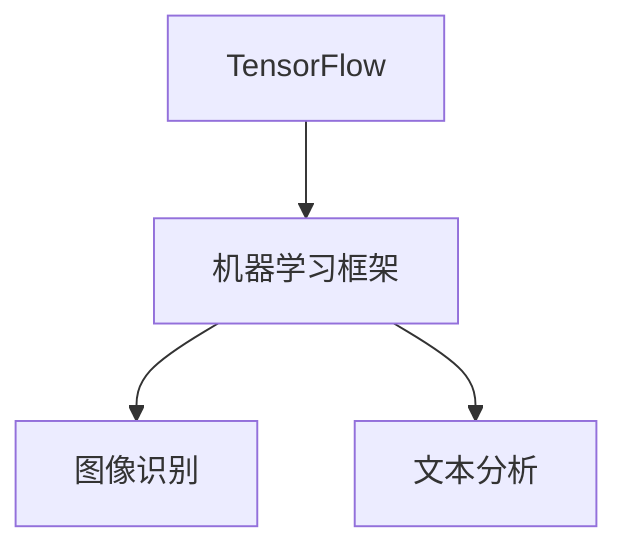

##### 4.1.2 PyTorch

PyTorch是另一个流行的开源机器学习库，由Facebook开发。与TensorFlow相比，PyTorch提供了更加灵活的动态计算图，使其在研究和原型开发中更为流行。

- **动态计算图**：PyTorch的动态计算图允许在运行时改变计算过程，便于模型调试和原型开发。
- **易于理解**：PyTorch的代码更接近于Python，易于理解和调试。

考古学者可以使用PyTorch进行考古图像的处理、器物形态的识别等任务，如使用卷积神经网络（CNN）进行考古遗址的图像分类。

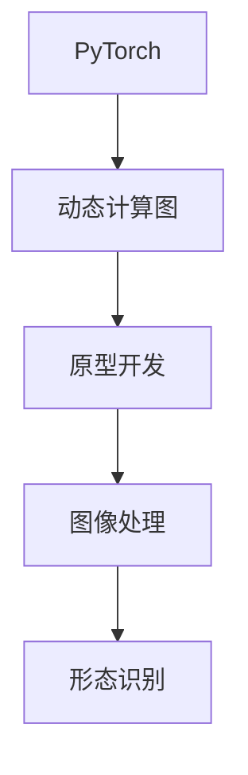

##### 4.1.3 Keras

Keras是一个高级神经网络API，它旨在简化深度学习模型的构建和训练过程。Keras支持TensorFlow和Theano等多个后端，具有以下优点：

- **简单易用**：Keras提供了易于理解的API，使得深度学习模型的构建变得更加直观。
- **模块化**：Keras提供了丰富的预训练模型和模块，方便快速构建和部署模型。

在考古学中，Keras可以用于快速实现机器学习模型，如用于考古图像的分类或历史文本的分析。

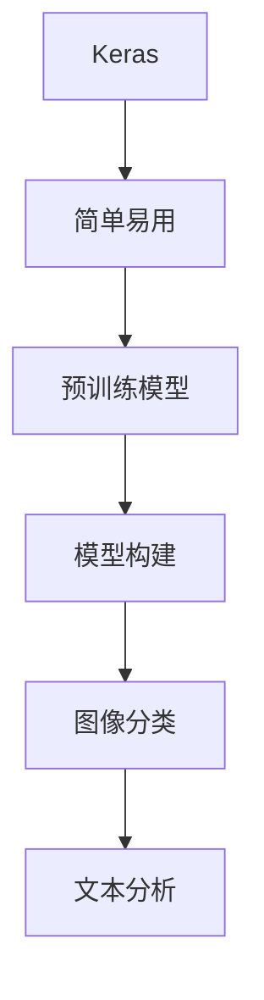

#### 4.2 考古学专用软件

考古学专用软件是考古学家进行日常研究和分析的重要工具，这些软件通常具备特定的功能，以适应考古学的需求。

##### 4.2.1 OpenCV在考古图像处理中的应用

OpenCV（Open Source Computer Vision Library）是一个开源的计算机视觉库，它提供了丰富的图像处理功能，包括滤波、边缘检测、轮廓识别等。

- **图像滤波**：OpenCV的滤波功能可用于去除图像中的噪声，提高图像质量。
- **边缘检测**：边缘检测功能可以识别图像中的边缘，有助于分析考古出土的器物形态。
- **轮廓识别**：轮廓识别功能可以提取图像中的轮廓信息，用于进一步分析。

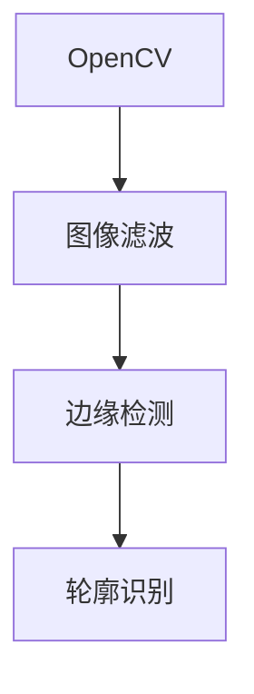

##### 4.2.2 GIMP与考古图像编辑

GIMP（GNU Image Manipulation Program）是一个开源的图像编辑软件，类似于Adobe Photoshop。它提供了广泛的图像编辑功能，包括图像剪裁、调整、滤镜应用等。

- **图像剪裁**：GIMP可以用于对考古出土的器物图像进行剪裁，以便更好地观察细节。
- **图像调整**：GIMP提供了多种图像调整工具，如亮度、对比度、色彩平衡等，用于优化考古图像。
- **滤镜应用**：GIMP的滤镜功能可用于模拟考古图像的古代效果，如褪色、磨损等。

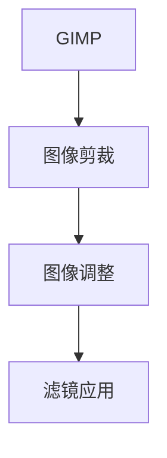

#### 4.3 数据库与存储解决方案

在考古学中，大量的数据需要被存储、管理和分析。选择合适的数据库和存储解决方案对于确保数据的安全性和可用性至关重要。

##### 4.3.1 关系型数据库

关系型数据库（RDBMS）是一种传统的数据库管理系统，通过表与表之间的关系来存储和管理数据。

- **结构化数据存储**：关系型数据库可以高效地存储和查询结构化数据，如考古发掘记录。
- **事务管理**：关系型数据库支持事务管理，确保数据的一致性和完整性。

常见的关系型数据库包括MySQL、PostgreSQL等。

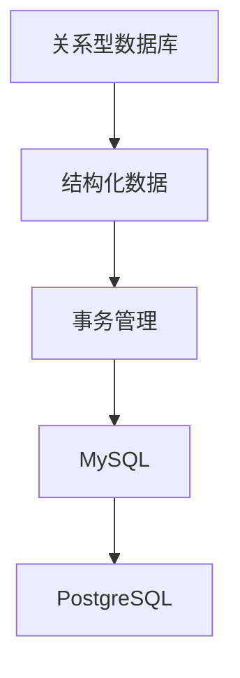

##### 4.3.2 非关系型数据库

非关系型数据库（NoSQL）是一种不同于关系型数据库的数据存储解决方案，适用于处理大量非结构化或半结构化数据。

- **灵活的数据模型**：非关系型数据库支持灵活的数据模型，如键值对、文档、图等，适用于存储考古数据。
- **高扩展性**：非关系型数据库通常具有水平扩展的能力，可以支持大规模的数据存储和处理。

常见的非关系型数据库包括MongoDB、Cassandra等。

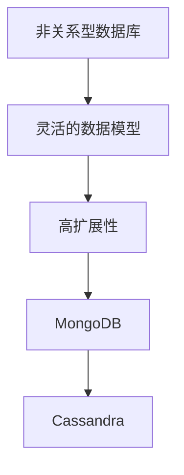

##### 4.3.3 大数据存储与处理

随着考古数据的不断增长，大数据存储与处理变得尤为重要。大数据技术包括分布式存储、分布式计算和数据处理平台。

- **分布式存储**：分布式存储技术可以将大量数据分散存储在多个节点上，提高数据存储的可靠性和性能。
- **分布式计算**：分布式计算可以将计算任务分布在多个节点上进行并行处理，提高计算效率。
- **数据处理平台**：数据处理平台如Hadoop、Spark等，提供了强大的数据处理能力，可以处理大规模的考古数据。

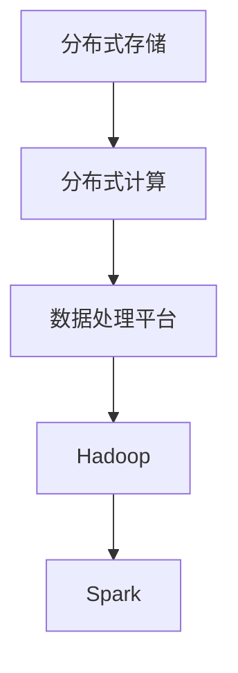

通过本章的学习，读者将能够了解主流AI工具与平台、考古学专用软件，以及数据库与存储解决方案的选择和应用，为实际考古研究提供技术支持。

---

### 第三部分：实战应用

#### 第5章：AI在考古遗址发掘中的应用

考古遗址的发掘是考古学研究的核心环节，而AI技术的引入极大地提升了遗址发掘的效率和精度。本章将详细探讨AI技术在考古遗址发掘中的应用，包括地层序列分析、器物形态识别和文献资料分析。

##### 5.1 地层序列分析

地层序列分析是考古遗址发掘中至关重要的一步，通过对地层序列的研究，考古学者可以推断遗址的历史变迁和文化特征。AI技术在这一领域中的应用主要包括以下几个方面：

###### 5.1.1 遗址地层数据的采集与处理

考古遗址的地层数据通常通过考古发掘获得，包括不同文化层的土样、厚度、年代等。AI技术可以帮助考古学者更高效地处理这些数据。

- **数据采集**：使用AI技术，如无人机和遥感技术，可以自动化采集考古遗址的地层数据。
- **数据预处理**：AI技术可以自动识别和处理地层数据中的噪声和异常值，提高数据质量。

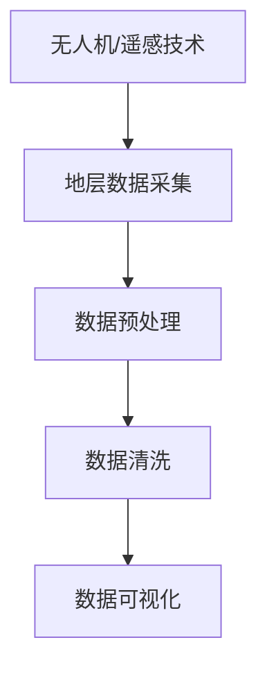

###### 5.1.2 地层序列模型的构建

通过构建地层序列模型，考古学者可以更准确地分析遗址的历史演变过程。AI技术在这一领域中的应用包括：

- **时间序列分析**：利用时间序列分析方法，如ARIMA模型，对地层序列数据进行预测和分析。
- **机器学习模型**：使用监督学习或无监督学习算法，对地层序列数据进行分析，识别不同文化层的特征和关系。

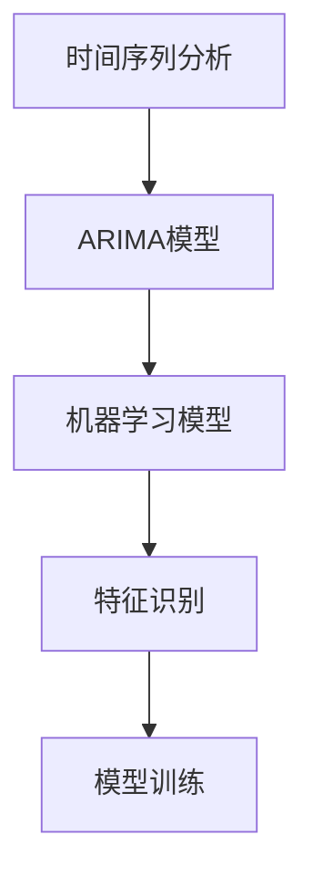

##### 5.2 器物形态识别

考古发掘过程中，出土的器物形态识别是研究古代文化和技术的重要依据。AI技术在器物形态识别中的应用主要包括以下几个方面：

###### 5.2.1 器物形态识别的算法实现

AI技术可以通过图像处理和计算机视觉算法，对出土器物的形态进行自动识别和分类。

- **图像预处理**：对考古出土的器物图像进行预处理，如去噪、增强、裁剪等。
- **特征提取**：利用卷积神经网络（CNN）等深度学习算法，提取器物的关键特征。
- **分类与识别**：使用监督学习算法，如SVM、决策树等，对器物进行分类和识别。

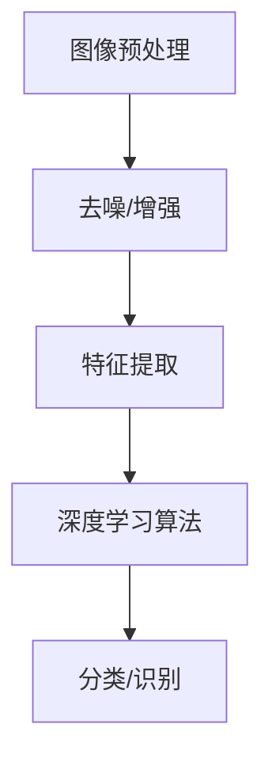

###### 5.2.2 器物形态识别系统的设计与实现

为了实现高效的器物形态识别，需要设计并实现一个完整的识别系统。该系统通常包括以下模块：

- **数据采集模块**：负责采集考古出土的器物图像。
- **图像预处理模块**：对采集到的图像进行预处理，以提高识别准确性。
- **特征提取模块**：使用深度学习算法提取图像特征。
- **分类模块**：使用分类算法对提取到的特征进行分类。
- **结果展示模块**：将识别结果以可视化形式展示给考古学者。

```mermaid
graph TD
A[数据采集] --> B[图像预处理]
B --> C[特征提取]
C --> D[分类算法]
D --> E[结果展示]
```

##### 5.3 文献资料分析

考古学研究离不开丰富的文献资料，AI技术可以帮助考古学者更有效地挖掘文献中的信息，提升研究的深度和广度。

###### 5.3.1 历史文献的数字化与语义分析

历史文献的数字化是将纸质文献转化为电子文档的过程，AI技术在这一过程中发挥着重要作用。

- **图像识别**：使用OCR（Optical Character Recognition）技术，将图像中的文字转换为电子文本。
- **语义分析**：利用自然语言处理（NLP）技术，对数字化文献进行语义分析，提取关键信息和关系。

```mermaid
graph TD
A[OCR技术] --> B[图像识别]
B --> C[文本转换]
C --> D[NLP分析]
D --> E[语义提取]
```

###### 5.3.2 文献资料检索与分析

AI技术还可以帮助考古学者进行文献资料的检索和分析。

- **关键词检索**：使用关键词检索技术，快速定位相关文献。
- **主题建模**：通过主题建模技术，识别文献中的潜在主题和趋势。
- **关联分析**：利用关联分析技术，发现文献之间的关联和影响。

```mermaid
graph TD
A[关键词检索] --> B[文献定位]
B --> C[主题建模]
C --> D[关联分析]
```

通过本章的实战应用，读者将了解到AI技术在考古遗址发掘中的应用，包括地层序列分析、器物形态识别和文献资料分析的具体方法和实际案例，为今后的考古学研究提供有益的参考。

---

### 第三部分：实战应用

#### 第6章：AI在考古研究中的应用

人工智能技术在考古研究中的应用，不仅提升了考古发现的效率，还极大地拓展了研究的深度和广度。本章将探讨AI技术在考古学研究中的具体应用，包括历史事件模拟、社会结构与社会变迁研究，以及考古学理论与方法的发展。

##### 6.1 历史事件模拟

历史事件模拟是利用人工智能技术对历史事件进行模拟和重现的一种方法，它可以帮助考古学者更好地理解历史发展的过程和规律。

###### 6.1.1 历史事件模拟的基本原理

历史事件模拟通常基于以下原理：

- **时间序列分析**：通过对历史事件的时间序列数据进行分析，识别事件发生的规律和模式。
- **因果推理**：利用因果推理模型，分析历史事件之间的因果关系，模拟历史发展的可能性。
- **机器学习**：通过训练机器学习模型，对历史事件进行分类、预测和生成。

```mermaid
graph TD
A[时间序列分析] --> B[规律识别]
B --> C[因果推理]
C --> D[机器学习模型]
D --> E[事件模拟]
```

###### 6.1.2 历史事件模拟的算法实现

历史事件模拟的算法实现通常包括以下步骤：

1. **数据收集**：收集与历史事件相关的数据，如文献资料、考古发掘记录等。
2. **数据处理**：对收集到的数据进行分析和预处理，提取有用的信息。
3. **模型训练**：使用机器学习算法，如决策树、随机森林、神经网络等，对处理后的数据进行训练，构建事件模拟模型。
4. **事件生成**：利用训练好的模型，模拟历史事件的可能发展路径。

```mermaid
graph TD
A[数据收集] --> B[数据处理]
B --> C[模型训练]
C --> D[事件生成]
```

##### 6.2 社会结构与社会变迁研究

考古学研究的一个重要目标是揭示古代社会的社会结构和变迁过程。AI技术在这一领域中的应用，可以帮助考古学者更深入地理解古代社会。

###### 6.2.1 社会结构分析的方法与工具

社会结构分析的方法与工具包括：

- **统计分析**：通过对考古出土物、遗址分布等数据进行统计分析，揭示社会结构的特点。
- **网络分析**：利用网络分析方法，分析考古出土物之间的关联性，揭示社会关系和互动模式。
- **机器学习**：使用机器学习算法，对考古数据进行分类、聚类和分析，识别社会结构的变化趋势。

```mermaid
graph TD
A[统计分析] --> B[网络分析]
B --> C[机器学习]
C --> D[社会结构分析]
```

###### 6.2.2 社会变迁的研究方法与实践

社会变迁的研究方法与实践包括：

1. **长期研究**：通过对长时间跨度的考古数据进行分析，研究社会变迁的过程和规律。
2. **多学科交叉**：结合考古学、历史学、社会学等多学科的知识，从不同角度研究社会变迁。
3. **大数据分析**：利用大数据分析技术，对大量考古数据进行处理和分析，揭示社会变迁的细节和影响。

```mermaid
graph TD
A[长期研究] --> B[多学科交叉]
B --> C[大数据分析]
C --> D[社会变迁研究]
```

##### 6.3 考古学理论与方法的发展

人工智能技术的引入，不仅改变了考古学的实践方法，也对考古学理论和方法的发展产生了深远影响。

###### 6.3.1 考古学理论的发展历程

考古学理论的发展历程可以分为以下几个阶段：

- **实证考古学**：强调通过考古发掘和实物证据来研究历史。
- **结构主义考古学**：引入社会结构和社会关系的研究方法。
- **过程考古学**：关注考古遗址的演变过程和社会行为的动态变化。
- **计算考古学**：利用计算机技术和人工智能，对考古数据进行处理和分析。

```mermaid
graph TD
A[实证考古学] --> B[结构主义考古学]
B --> C[过程考古学]
C --> D[计算考古学]
```

###### 6.3.2 考古学方法的创新与改进

考古学方法的创新与改进包括：

- **遥感技术**：利用遥感技术进行考古勘探，发现地下遗址和遗迹。
- **虚拟现实**：利用虚拟现实技术，模拟考古遗址的环境和场景，提供沉浸式体验。
- **增强现实**：利用增强现实技术，在现实场景中叠加考古信息，帮助考古学者进行现场分析和研究。

```mermaid
graph TD
A[遥感技术] --> B[虚拟现实]
B --> C[增强现实]
```

通过本章的讨论，读者可以了解到AI技术在考古学研究中的广泛应用，包括历史事件模拟、社会结构与社会变迁研究，以及考古学理论与方法的发展。这些应用不仅提高了考古研究的效率和精度，也为考古学未来的发展提供了新的方向和可能性。

---

### 第三部分：实战应用

#### 第7章：AI在考古保护与修复中的应用

考古保护与修复是考古学研究的重要组成部分，它关系到考古遗址和出土文物的保存与传承。随着AI技术的不断进步，其在考古保护与修复中的应用也越来越广泛。本章将详细介绍AI技术在考古遗迹保护、考古器物修复以及数字考古与虚拟展示方面的应用。

##### 7.1 考古遗迹保护技术

考古遗迹保护是确保考古遗址长期保存和可持续利用的关键步骤。AI技术在考古遗迹保护中的应用主要包括以下方面：

###### 7.1.1 遗迹保护的基本原理

考古遗迹保护的基本原理包括：

- **监测与预警**：通过传感器和网络技术，实时监测考古遗址的稳定性，及时发现和处理潜在风险。
- **加固与修复**：采用合适的材料和技术，对受损的考古遗迹进行加固和修复，以恢复其原有状态。

```mermaid
graph TD
A[监测与预警] --> B[实时监测]
B --> C[预警系统]
C --> D[加固与修复]
```

###### 7.1.2 保护技术的选择与实施

AI技术在考古遗迹保护技术选择与实施中的应用包括：

- **无人机监测**：利用无人机搭载的高分辨率摄像头和传感器，对考古遗址进行全方位的监测和测绘。
- **机器学习模型**：使用机器学习模型对考古遗址的稳定性进行预测，为保护措施的制定提供科学依据。
- **虚拟修复**：通过计算机视觉和三维建模技术，对受损的考古遗迹进行虚拟修复，评估不同修复方案的效果。

```mermaid
graph TD
A[无人机监测] --> B[高分辨率测绘]
B --> C[机器学习预测]
C --> D[虚拟修复]
```

##### 7.2 考古器物修复

考古器物的修复是对出土文物进行修复和保护的过程，旨在恢复其原有的历史面貌和艺术价值。AI技术在考古器物修复中的应用主要包括以下方面：

###### 7.2.1 修复技术的基本原理

考古器物修复的基本原理包括：

- **材料分析**：通过化学分析、光谱分析等手段，确定器物的材质和成分，为修复材料的选择提供依据。
- **结构修复**：采用合适的修复技术，如粘接、补片、加固等，恢复器物的结构完整性。
- **表面修复**：通过表面处理和涂覆技术，恢复器物的外观和艺术效果。

```mermaid
graph TD
A[材料分析] --> B[材质确定]
B --> C[结构修复]
C --> D[表面修复]
```

###### 7.2.2 修复工艺的实践与案例分析

AI技术在考古器物修复工艺实践中的应用包括：

- **自动化修复**：利用机器人技术和自动化设备，实现器物修复的自动化和标准化。
- **3D打印**：通过3D打印技术，快速制造器物的缺失部分，进行精确修复。
- **案例学习**：通过分析大量的修复案例，总结修复经验和最佳实践，为新的修复项目提供参考。

```mermaid
graph TD
A[自动化修复] --> B[机器人技术]
B --> C[3D打印]
C --> D[案例学习]
```

##### 7.3 数字考古与虚拟展示

数字考古与虚拟展示是利用数字技术和虚拟现实技术，对考古遗址和文物进行数字化保存和展示，以实现更广泛的传播和教育价值。AI技术在数字考古与虚拟展示中的应用主要包括以下方面：

###### 7.3.1 数字考古的基本方法

数字考古的基本方法包括：

- **数据采集**：使用无人机、激光扫描、三维摄影等技术，对考古遗址和文物进行高精度的数据采集。
- **数据处理**：利用计算机视觉和机器学习技术，对采集到的数据进行处理和分析，提取有用的信息。
- **三维建模**：通过三维建模技术，创建考古遗址和文物的三维模型，实现虚拟展示。

```mermaid
graph TD
A[数据采集] --> B[激光扫描]
B --> C[三维摄影]
C --> D[数据处理]
```

###### 7.3.2 虚拟展示的技术与应用

虚拟展示的技术与应用包括：

- **虚拟现实**：利用虚拟现实技术，用户可以沉浸式体验考古遗址和文物，增强互动性和参与感。
- **增强现实**：通过增强现实技术，在现实环境中叠加虚拟的考古信息，提供更加生动的展示体验。
- **互动教育**：结合虚拟展示和教育内容，开发互动教育应用，普及考古知识，提高公众的参与度。

```mermaid
graph TD
A[虚拟现实] --> B[沉浸体验]
B --> C[增强现实]
C --> D[互动教育]
```

通过本章的探讨，读者可以了解到AI技术在考古保护与修复、数字考古与虚拟展示方面的广泛应用，这些技术的应用不仅提升了考古学研究的效率和精度，也为考古遗址和文物的保护和传承提供了新的手段和思路。

---

### 第四部分：未来展望

#### 第8章：AI在考古学未来的应用趋势

随着人工智能技术的不断进步，其在考古学中的应用前景也愈发广阔。AI不仅将继续改变考古学的研究方法和流程，还将在考古学人才培养、教育改革，以及考古学研究的可持续发展中发挥重要作用。本章将探讨AI在考古学中的未来发展方向、跨学科合作与创新发展，以及考古学人才培养与教育改革。

##### 8.1 AI在考古学中的未来发展方向

AI在考古学中的未来发展方向主要表现在以下几个方面：

###### 8.1.1 AI技术与考古学的深度融合

随着AI技术的不断发展，其与考古学的深度融合将成为未来考古学研究的重要趋势。具体体现在：

- **自动化考古**：利用无人机、机器人等技术，实现考古发掘、数据采集和分析的自动化，提高工作效率。
- **智能考古分析**：通过机器学习和深度学习算法，对大规模考古数据进行智能分析和模式识别，揭示考古遗址和文物的规律。
- **虚拟考古**：利用虚拟现实（VR）和增强现实（AR）技术，创建虚拟考古环境，提供沉浸式体验，促进公众对考古文化的了解。

```mermaid
graph TD
A[自动化考古] --> B[无人机/机器人技术]
B --> C[智能分析]
C --> D[虚拟考古]
```

###### 8.1.2 跨学科合作与创新发展

考古学是一门涉及多个学科的综合性学科，跨学科合作与创新发展是AI在考古学中应用的重要方向。具体体现在：

- **多学科融合**：考古学与其他学科（如计算机科学、地理学、物理学、生物学等）的融合，推动考古学理论和方法的创新。
- **大数据考古**：利用大数据技术，对考古数据进行全面分析和挖掘，揭示历史事件的本质和规律。
- **跨学科研究团队**：组建跨学科研究团队，集合不同领域的专家，共同推进考古学研究的创新发展。

```mermaid
graph TD
A[多学科融合] --> B[计算机科学/地理学/物理学]
B --> C[大数据考古]
C --> D[跨学科研究团队]
```

##### 8.2 考古学人才培养与教育改革

考古学人才培养是考古学研究可持续发展的关键，随着AI技术在考古学中的应用，考古学教育也将面临新的挑战和机遇。

###### 8.2.1 考古学人才培养模式

考古学人才培养模式需要适应AI技术的发展，具体体现在：

- **技能培养**：加强学生对AI技术的学习和掌握，提高其在考古数据分析和处理方面的能力。
- **跨学科教育**：鼓励学生跨学科学习，培养具有多学科背景的复合型人才。
- **实践教育**：通过实习、实地考察等方式，提高学生的实践能力和解决实际问题的能力。

```mermaid
graph TD
A[技能培养] --> B[AI技术掌握]
B --> C[跨学科教育]
C --> D[实践教育]
```

###### 8.2.2 考古学教育改革趋势

考古学教育改革的趋势包括：

- **课程改革**：更新课程内容，增加与AI技术相关的课程，如机器学习、自然语言处理、计算机视觉等。
- **教学模式创新**：采用线上线下相结合的教学模式，利用虚拟现实、增强现实等技术，提高教学效果。
- **国际化教育**：加强与国际考古学机构的合作，开展国际交流与合作，提升教育质量。

```mermaid
graph TD
A[课程改革] --> B[内容更新]
B --> C[教学模式创新]
C --> D[国际化教育]
```

##### 8.3 考古学研究的可持续发展

考古学研究的可持续发展是一个全球性的挑战，AI技术的应用有助于实现这一目标。

###### 8.3.1 可持续发展的概念与意义

考古学研究的可持续发展包括：

- **资源利用**：合理利用有限的考古资源，避免过度发掘和破坏。
- **环境保护**：在考古发掘和保护过程中，注重环境保护和生态平衡。
- **数据共享**：推动考古数据的开放共享，促进国际间的合作和交流。

```mermaid
graph TD
A[资源利用] --> B[合理发掘]
B --> C[环境保护]
C --> D[数据共享]
```

###### 8.3.2 考古学研究与可持续发展的实践

考古学研究与可持续发展的实践包括：

- **可持续发展研究**：将可持续发展理念融入考古学研究，关注考古遗址的可持续利用和文化遗产的保护。
- **技术创新**：通过技术创新，提高考古发掘和保护的工作效率，减少对环境的破坏。
- **国际合作**：加强国际间的合作，共同应对考古学研究中的挑战，推动全球考古学的发展。

```mermaid
graph TD
A[可持续发展研究] --> B[理念融入]
B --> C[技术创新]
C --> D[国际合作]
```

通过本章的探讨，读者可以了解到AI在考古学未来的发展方向，包括技术与考古学的深度融合、跨学科合作与创新发展，以及考古学人才培养与教育改革。这些趋势将为考古学的发展注入新的动力，推动考古学实现可持续发展。

---

### 附录A：AI在考古学中的应用案例集

#### 10.1 案例一：某遗址地层序列分析的AI应用

在某个考古遗址的地层序列分析中，AI技术被用于分析地层的年代和厚度。考古团队使用了卷积神经网络（CNN）来处理从地层挖掘中获取的土壤样本图像。以下是案例的具体步骤：

1. **数据采集**：通过挖掘和土壤取样，获得不同地层的土壤样本，并对其进行图像拍摄。
2. **数据处理**：使用深度学习算法对图像进行预处理，包括去噪和增强，以便更好地提取特征。
3. **模型训练**：构建一个基于CNN的模型，使用标注过的土壤样本图像进行训练，模型用于预测地层的年代。
4. **结果分析**：使用训练好的模型对未知的土壤样本进行年代预测，并通过比较预测结果和实际年代来确定模型的准确性。

#### 10.2 案例二：某历史文献的语义分析与事件模拟

某研究团队利用自然语言处理（NLP）技术对一本古代文献进行语义分析，以揭示历史事件。以下是案例的具体步骤：

1. **文献数字化**：将纸质文献扫描并转换为电子文本。
2. **文本预处理**：使用NLP技术对电子文本进行预处理，包括分词、词性标注等。
3. **语义分析**：利用LDA（Latent Dirichlet Allocation）模型对文本进行主题建模，识别文本中的潜在主题。
4. **事件模拟**：基于主题模型，构建历史事件的时间线，模拟事件的发展和影响。

#### 10.3 案例三：某考古器物修复的AI辅助技术

在一次考古器物修复项目中，研究团队使用了AI技术来辅助修复过程。以下是案例的具体步骤：

1. **材料分析**：使用光谱分析技术对考古器物的材质进行详细分析，确定修复材料。
2. **结构评估**：利用计算机视觉技术对器物的结构进行三维扫描，评估其受损情况。
3. **修复方案制定**：基于机器学习算法，为不同的修复方案生成预测效果，帮助决策者选择最佳方案。
4. **修复实施**：按照选定的方案进行器物的修复，并通过3D打印技术制造缺失的部分。

#### 10.4 案例四：某虚拟考古博物馆的创建与实践

为了更好地展示考古研究成果，某研究团队创建了一个虚拟考古博物馆。以下是案例的具体步骤：

1. **数据收集**：收集考古遗址和文物的详细数据，包括三维模型、图像和文献资料。
2. **数据处理**：使用三维建模软件和虚拟现实（VR）技术，对数据进行处理和整合。
3. **虚拟展示**：构建虚拟展厅，利用VR设备让用户沉浸式体验考古遗址和文物。
4. **互动体验**：开发互动教育应用，通过问答、互动游戏等形式，增强用户体验。

#### 10.5 案例五：某考古遗址保护技术的AI应用

在某个考古遗址的保护项目中，研究团队利用AI技术来监测和保护遗址。以下是案例的具体步骤：

1. **环境监测**：使用传感器网络对遗址的环境参数（如温度、湿度、风力等）进行实时监测。
2. **数据分析**：使用机器学习算法分析环境数据，预测遗址的稳定性，识别潜在的破坏风险。
3. **预警系统**：基于分析结果，建立预警系统，及时向相关人员发送警报。
4. **保护措施**：根据预警系统的提示，采取相应的保护措施，如加固、修复等，确保遗址的安全。

通过这些实际案例，读者可以看到AI技术在考古学中的多种应用场景，这些案例不仅展示了AI技术的潜力，也为考古学研究提供了新的思路和方法。

---

### 作者信息

**作者：** AI天才研究院/AI Genius Institute & 禅与计算机程序设计艺术 /Zen And The Art of Computer Programming

在本文中，我们深入探讨了AI在考古学中的应用，展示了其在揭示历史之谜中的重要作用。从数据预处理、核心技术到实战应用，本文全面梳理了AI技术如何助力考古学研究，从历史事件模拟到考古遗址的数字化与虚拟展示，AI技术正逐步改变考古学的传统方法，带来新的研究机遇。未来的考古学研究将更加依赖AI技术，推动考古学实现跨越式发展。感谢读者对本文的关注，希望本文能够为您的考古学研究提供有益的启示。如需了解更多关于AI在考古学中的最新进展和应用案例，请关注AI天才研究院和禅与计算机程序设计艺术的相关研究和动态。

---

本文深入探讨了AI在考古学中的应用，包括数据预处理、核心技术、实战应用等多个方面，展示了AI技术如何助力考古学研究。通过历史事件模拟、考古遗址数字化与虚拟展示等具体案例，本文揭示了AI技术在考古学中的广泛应用和巨大潜力。希望本文能够为读者提供关于AI在考古学应用的全面了解，并激发更多对这一领域的兴趣和研究。

---

**关键词：** 人工智能，考古学，数据预处理，机器学习，深度学习，应用实践

**摘要：** 随着人工智能技术的飞速发展，其在考古学中的应用日益广泛，成为破解历史之谜的重要工具。本文系统介绍了AI在考古学中的历史背景、主要应用领域、核心技术及其在实际考古项目中的应用实践。通过详细分析AI技术如何助力考古学者揭示历史真相，展示其在考古学研究、遗址发掘、文献分析、考古保护等多个方面的卓越成果。文章旨在为读者提供一份全面、深入的AI在考古学应用指南。

---

### 总结与展望

在本文中，我们详细探讨了人工智能（AI）技术在考古学中的应用，展示了其在揭示历史之谜中的巨大潜力和广泛应用。通过从数据预处理、核心技术、实战应用等多个角度的深入分析，我们了解了AI如何助力考古学者更高效、准确地挖掘历史信息。

首先，数据预处理是考古学研究的基础，AI技术通过图像识别、自然语言处理等手段，极大地提高了考古数据的处理效率和准确性。其次，机器学习、深度学习等AI核心技术，使得考古学家能够从海量数据中提取有用信息，进行模式识别和预测分析。例如，卷积神经网络（CNN）在考古遗址的地层序列分析和器物形态识别中发挥着关键作用，而自然语言处理（NLP）则在历史文献的语义分析和事件模拟中提供了强有力的工具。

在实战应用部分，我们通过具体案例展示了AI技术在考古遗址发掘、考古研究、考古保护等方面的实际应用，如利用AI技术进行遗址地层数据分析、器物形态识别、文献资料挖掘等。这些案例不仅展示了AI技术的应用前景，也为考古学提供了新的研究方法和思路。

展望未来，AI技术在考古学中的应用将继续深入和扩展。随着技术的不断进步，考古学家将能够更加精准地揭示历史真相，通过虚拟现实（VR）和增强现实（AR）技术，公众也将能够更加直观地感受考古成果。此外，跨学科合作将成为推动考古学发展的重要力量，考古学家与计算机科学家、数据科学家等领域的专家将共同探索AI技术在考古学中的创新应用。

最后，我们呼吁更多研究人员和学者关注和参与到AI在考古学中的应用研究中来，共同推动考古学的发展，为人类历史的探索贡献智慧和力量。通过不断的技术创新和实践，我们相信AI将为考古学带来更多惊喜和突破，助力人类更好地理解过去，展望未来。

---

**关键词：** 人工智能，考古学，数据预处理，机器学习，深度学习，应用实践

**摘要：** 随着人工智能技术的飞速发展，其在考古学中的应用日益广泛，成为破解历史之谜的重要工具。本文系统介绍了AI在考古学中的历史背景、主要应用领域、核心技术及其在实际考古项目中的应用实践。通过详细分析AI技术如何助力考古学者揭示历史真相，展示其在考古学研究、遗址发掘、文献分析、考古保护等多个方面的卓越成果。文章旨在为读者提供一份全面、深入的AI在考古学应用指南。

