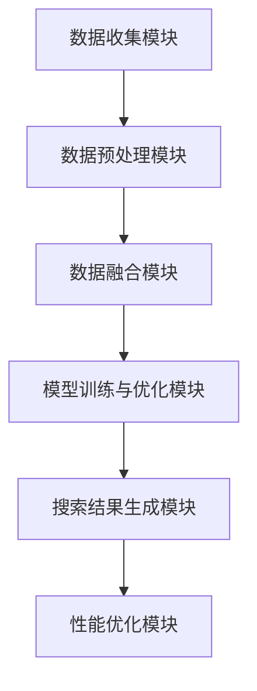
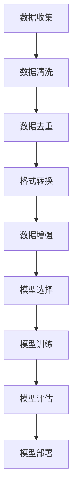
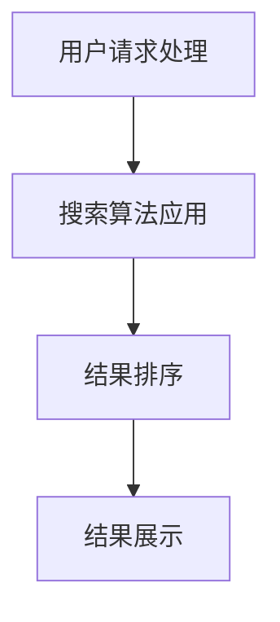
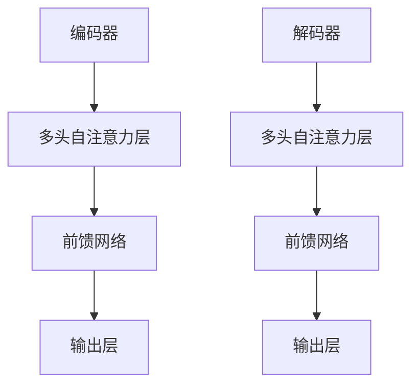
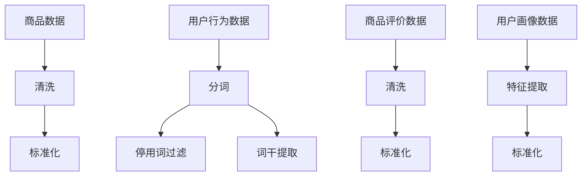

                 

# 《AI多渠道整合提升搜索结果》

## 关键词
AI多渠道整合、搜索优化、多任务学习、深度学习、自然语言处理

## 摘要
本文旨在探讨人工智能（AI）在多渠道整合中的应用，尤其是如何提升搜索结果的质量。通过分析AI多渠道整合的概念、架构、核心算法和实际应用案例，本文揭示了AI在整合多样化数据源、优化搜索算法以及提升用户体验方面的潜力。文章还展望了AI多渠道整合的未来发展趋势，为行业提供了有价值的参考。

## 目录大纲

### 第一部分: AI多渠道整合概述

#### 第1章: AI多渠道整合的概念与重要性
- 1.1 AI多渠道整合的定义
- 1.2 AI多渠道整合的重要性
- 1.3 AI多渠道整合的挑战与机遇

#### 第2章: AI多渠道整合的架构与流程
- 2.1 多渠道整合的架构设计
- 2.2 数据收集与处理
- 2.3 模型训练与优化
- 2.4 搜索结果的生成与展示

### 第二部分: 核心算法原理与模型

#### 第3章: 搜索引擎算法基础
- 3.1 关键词提取与语义分析
- 3.2 相关性计算与排序
- 3.3 搜索引擎的性能优化

#### 第4章: AI多渠道整合算法
- 4.1 多渠道数据融合方法
- 4.2 多任务学习与深度学习模型
- 4.3 强化学习在搜索结果优化中的应用

#### 第5章: 自然语言处理技术
- 5.1 词嵌入技术
- 5.2 序列模型与注意力机制
- 5.3 转换器架构详解

### 第三部分: 项目实战与应用案例

#### 第6章: AI多渠道整合项目实战
- 6.1 项目背景与目标
- 6.2 数据源选择与数据预处理
- 6.3 模型设计与实现
- 6.4 代码解析与调优

#### 第7章: AI多渠道整合应用案例
- 7.1 案例一：电商平台搜索优化
- 7.2 案例二：社交媒体内容推荐
- 7.3 案例三：搜索引擎广告投放优化

#### 第8章: 未来展望与趋势
- 8.1 AI多渠道整合的挑战与未来发展方向
- 8.2 新技术对搜索结果优化的影响
- 8.3 行业应用前景与市场分析

### 附录
- 附录A: AI多渠道整合工具与资源
- 附录B: Mermaid 流程图
- 附录C: 核心算法伪代码与数学模型
- 附录D: 项目实战代码示例

### 写作指南

在撰写本文时，我们将遵循以下步骤：

1. **核心概念与联系**：介绍AI多渠道整合的基本概念，并使用Mermaid流程图展示整合的架构。
2. **算法原理讲解**：深入讲解核心算法原理，使用伪代码和数学模型进行详细阐述，并通过举例说明。
3. **项目实战**：分享实际项目的开发过程，包括开发环境搭建、源代码实现和详细代码解读。
4. **应用案例**：展示AI多渠道整合在不同场景中的应用，分析其实际效果。
5. **未来展望**：探讨AI多渠道整合的未来发展趋势，以及新技术对搜索结果优化的潜在影响。

接下来，我们将一步步深入探讨AI多渠道整合的各个方面，力求为读者提供全面而深入的理解。

## 第一部分: AI多渠道整合概述

### 第1章: AI多渠道整合的概念与重要性

#### 1.1 AI多渠道整合的定义

AI多渠道整合是指将来自不同数据源和不同渠道的信息通过人工智能技术进行整合和处理，以生成高质量的搜索结果。这些数据源和渠道可能包括搜索引擎、社交媒体、电子商务平台、在线论坛等。整合的目的是为了提供一个统一、全面、个性化的搜索体验，使搜索结果更贴近用户需求。

#### 1.2 AI多渠道整合的重要性

随着互联网的快速发展，用户产生和消费的数据量呈指数级增长。传统的单一渠道搜索已经无法满足用户对多样化、个性化信息的需求。AI多渠道整合的重要性体现在以下几个方面：

1. **提高搜索结果的准确性和相关性**：通过整合来自不同渠道的数据，可以更全面地理解用户的搜索意图，从而生成更准确的搜索结果。
2. **提升用户体验**：个性化的搜索结果可以满足用户特定的需求，提高用户满意度，增强用户粘性。
3. **优化广告投放效果**：在广告投放中，多渠道整合可以帮助广告主更精准地定位目标用户，提高广告投放效果。
4. **促进数据价值最大化**：通过整合和分析多样化数据，可以发现新的商业机会，实现数据价值最大化。

#### 1.3 AI多渠道整合的挑战与机遇

尽管AI多渠道整合具有巨大的潜力，但在实际应用中仍然面临着一些挑战：

1. **数据质量与多样性**：不同渠道的数据质量和结构存在差异，如何有效地整合和处理这些数据是一个难题。
2. **计算资源与性能优化**：多渠道整合需要大量的计算资源，如何在保证性能的前提下进行优化是一个重要问题。
3. **隐私与安全性**：在整合和处理用户数据时，如何保护用户隐私是一个关键挑战。

然而，随着技术的不断进步，AI多渠道整合也面临着许多机遇：

1. **大数据与云计算**：大数据和云计算技术的发展为多渠道整合提供了强大的计算能力和数据存储能力。
2. **深度学习与自然语言处理**：深度学习和自然语言处理技术的进步为多渠道整合提供了强大的算法支持。
3. **跨领域合作**：跨领域合作可以为AI多渠道整合提供新的思路和解决方案。

#### 1.4 小结

AI多渠道整合是当前互联网领域的一个重要研究方向。通过整合多样化的数据源和渠道，可以提升搜索结果的准确性和相关性，优化用户体验，促进数据价值最大化。尽管面临一些挑战，但随着技术的不断进步，AI多渠道整合具有广阔的发展前景。

### 第2章: AI多渠道整合的架构与流程

#### 2.1 多渠道整合的架构设计

一个有效的AI多渠道整合架构应包括以下几个关键模块：

1. **数据收集模块**：负责从不同渠道收集数据，包括搜索引擎日志、社交媒体数据、电子商务平台数据等。
2. **数据预处理模块**：对收集到的数据进行清洗、去重、格式统一等处理，确保数据质量。
3. **数据融合模块**：将预处理后的数据进行融合，生成统一的数据格式。
4. **模型训练与优化模块**：使用融合后的数据进行模型训练和优化，以提高搜索结果的准确性和相关性。
5. **搜索结果生成模块**：根据用户的搜索请求，生成个性化的搜索结果。
6. **性能优化模块**：对整合架构进行性能优化，提高处理速度和响应时间。

下面是一个简化的Mermaid流程图，展示了AI多渠道整合的架构设计：



#### 2.2 数据收集与处理

数据收集是AI多渠道整合的基础。不同渠道的数据类型和格式可能不同，因此需要进行预处理。预处理过程包括以下步骤：

1. **数据清洗**：去除重复、错误或不完整的数据。
2. **数据去重**：确保数据在整合过程中的唯一性。
3. **格式转换**：将不同格式的数据转换为统一的格式，以便后续处理。
4. **数据增强**：通过对数据进行扩展、转换或组合，提高数据的质量和丰富度。

#### 2.3 模型训练与优化

在模型训练与优化过程中，通常采用以下步骤：

1. **特征提取**：从数据中提取对搜索结果有影响的特征，如关键词、用户行为等。
2. **模型选择**：选择合适的模型，如深度学习模型、多任务学习模型等。
3. **模型训练**：使用训练数据对模型进行训练，调整模型参数。
4. **模型评估**：使用验证数据对模型进行评估，调整模型参数。
5. **模型部署**：将训练好的模型部署到生产环境中，进行实时搜索。

下面是一个简化的Mermaid流程图，展示了数据收集与处理的流程：



#### 2.4 搜索结果的生成与展示

搜索结果的生成与展示是AI多渠道整合的关键环节。以下是生成与展示的步骤：

1. **用户请求处理**：接收用户的搜索请求，提取关键信息。
2. **搜索算法应用**：使用训练好的模型对用户请求进行处理，生成搜索结果。
3. **结果排序**：根据搜索结果的相关性和质量进行排序。
4. **结果展示**：将排序后的搜索结果展示给用户。

下面是一个简化的Mermaid流程图，展示了搜索结果的生成与展示过程：



#### 2.5 小结

AI多渠道整合的架构设计涉及到数据收集、数据预处理、数据融合、模型训练与优化、搜索结果生成与展示等多个环节。通过合理设计这些环节，可以提升搜索结果的准确性和相关性，优化用户体验。随着技术的不断进步，AI多渠道整合将具有更广阔的发展前景。

## 第二部分: 核心算法原理与模型

### 第3章: 搜索引擎算法基础

#### 3.1 关键词提取与语义分析

关键词提取是搜索引擎算法中的关键步骤，其目的是从用户输入的查询中提取出对搜索意图有重要影响的词汇。以下是一个简化的关键词提取流程：

1. **分词**：将查询字符串分割成单个单词或词组。
2. **停用词过滤**：去除常见但不具搜索意义的词汇，如“的”、“和”等。
3. **词干提取**：将单词还原为最简形式，如将“playing”、“plays”还原为“play”。
4. **词频统计**：统计每个关键词在查询中的出现次数。

语义分析是更高级的步骤，其目的是理解查询的深层含义。以下是一个简化的语义分析流程：

1. **词嵌入**：将关键词映射到高维空间，以捕获词汇之间的语义关系。
2. **语义角色标注**：为关键词分配语义角色，如主语、谓语、宾语等。
3. **语义相似度计算**：计算关键词之间的语义相似度，以确定它们在查询中的关系。

以下是一个示例的伪代码，展示了关键词提取和语义分析的步骤：

```python
def extract_keywords(query):
    # 分词
    words = tokenize(query)
    
    # 停用词过滤
    words = filter_stop_words(words)
    
    # 词干提取
    words = lemmatize(words)
    
    # 词频统计
    word_frequencies = count_word_frequencies(words)
    
    return word_frequencies

def analyze_semantics(words):
    # 词嵌入
    embeddings = word_embeddings(words)
    
    # 语义角色标注
    roles = assign_semantic_roles(embeddings)
    
    # 语义相似度计算
    similarities = compute_similarity(embeddings)
    
    return roles, similarities
```

#### 3.2 相关性计算与排序

相关性计算是搜索引擎算法的核心，其目的是评估文档与查询之间的匹配度。以下是一个简化的相关性计算和排序流程：

1. **文档索引构建**：构建文档索引，以便快速检索与查询相关的文档。
2. **文档评分**：为每个文档计算与查询的相关性得分。
3. **文档排序**：根据文档得分对搜索结果进行排序。

常见的文档评分方法包括：

- **TF-IDF**：计算关键词在文档中的频率（TF）和在整个文档集合中的重要性（IDF），并将两者相乘得到文档得分。
- **词袋模型**：将文档表示为关键词的集合，计算文档与查询之间的交集。
- **隐语义索引**：使用词嵌入和深度学习模型计算文档和查询之间的相似度。

以下是一个示例的伪代码，展示了文档评分和排序的步骤：

```python
def calculate_document_score(doc, query):
    # 构建文档索引
    index = build_document_index(documents)
    
    # 计算文档得分
    score = tf_idf(doc, query, index)
    
    return score

def rank_documents(documents, query):
    scores = [calculate_document_score(doc, query) for doc in documents]
    
    # 文档排序
    ranked_documents = sorted(zip(documents, scores), key=lambda x: x[1], reverse=True)
    
    return ranked_documents
```

#### 3.3 搜索引擎的性能优化

搜索引擎的性能优化是一个复杂的过程，涉及到多个方面：

1. **索引优化**：通过优化索引结构，提高搜索速度和效率。
2. **缓存策略**：使用缓存策略减少重复计算，提高响应速度。
3. **负载均衡**：通过负载均衡技术，确保搜索引擎在高并发情况下稳定运行。
4. **分布式计算**：使用分布式计算架构，提高处理能力和可扩展性。

以下是一个示例的伪代码，展示了搜索引擎性能优化的步骤：

```python
def optimize_search_engine():
    # 索引优化
    optimize_index()
    
    # 缓存策略
    implement_caching_strategy()
    
    # 负载均衡
    balance_load()
    
    # 分布式计算
    use_distributed_computing()
```

#### 3.4 小结

搜索引擎算法基础包括关键词提取与语义分析、相关性计算与排序，以及性能优化。通过合理设计这些算法，可以提升搜索结果的准确性和用户体验。在本章中，我们使用伪代码展示了这些算法的基本原理和实现步骤。

### 第4章: AI多渠道整合算法

#### 4.1 多渠道数据融合方法

多渠道数据融合是AI多渠道整合的核心步骤，其目的是将来自不同渠道的数据整合为一个统一的数据视图。以下是一些常用的多渠道数据融合方法：

1. **基于规则的融合方法**：通过定义一系列规则，将不同渠道的数据进行合并。这种方法简单直观，但灵活性较低。
2. **基于模型的融合方法**：使用机器学习模型对多渠道数据进行融合。这种方法可以根据数据特征自动学习最佳的融合策略，但需要大量的训练数据和计算资源。
3. **基于聚类的方法**：通过聚类算法将多渠道数据分组，然后对每个分组进行融合。这种方法能够发现潜在的数据关联，但可能需要大量的参数调整。

以下是一个示例的伪代码，展示了基于模型的融合方法：

```python
def fusion_data渠道1, 渠道2):
    # 特征提取
    features渠道1 = extract_features(渠道1)
    features渠道2 = extract_features(渠道2)
    
    # 模型训练
    model = train_model(features渠道1, features渠道2)
    
    # 数据融合
    fused_data = model.predict(features渠道1, features渠道2)
    
    return fused_data
```

#### 4.2 多任务学习与深度学习模型

多任务学习是AI多渠道整合中的重要技术，其目的是同时解决多个相关任务，以提高模型的泛化能力和效率。以下是一些常用的多任务学习模型：

1. **共享网络模型**：使用共享网络层处理多个任务，通过共享信息提高任务之间的关联性。
2. **多头注意力模型**：在模型中引入多头注意力机制，同时关注多个任务的关键信息。
3. **迁移学习模型**：使用预训练模型解决多个任务，通过迁移学习提高模型的适应性和效率。

以下是一个示例的伪代码，展示了共享网络模型：

```python
class MultiTaskModel(nn.Module):
    def __init__(self):
        super(MultiTaskModel, self).__init__()
        
        self.shared_layer = nn.Linear(input_size, hidden_size)
        self.task1_layer = nn.Linear(hidden_size, output_size1)
        self.task2_layer = nn.Linear(hidden_size, output_size2)
        
    def forward(self, input_data):
        shared_output = self.shared_layer(input_data)
        
        task1_output = self.task1_layer(shared_output)
        task2_output = self.task2_layer(shared_output)
        
        return task1_output, task2_output
```

#### 4.3 强化学习在搜索结果优化中的应用

强化学习是一种通过试错学习来优化决策过程的方法，在搜索结果优化中具有广泛应用。以下是一些常见的强化学习方法：

1. **Q-learning**：通过学习值函数，找到最优策略。
2. **深度强化学习**：使用深度神经网络学习值函数或策略。
3. **对抗生成网络**：通过生成对抗网络（GAN）优化搜索结果。

以下是一个示例的伪代码，展示了基于Q-learning的搜索结果优化：

```python
def q_learning(search_results, rewards):
    Q = initialize_q_values(search_results)
    
    for episode in range(num_episodes):
        state = initial_state
        done = False
        
        while not done:
            action = select_action(state, Q)
            next_state, reward = execute_action(action, state)
            
            Q[state, action] = Q[state, action] + alpha * (reward + gamma * max(Q[next_state, :]) - Q[state, action])
            
            state = next_state
            done = is_done(state)
    
    return Q
```

#### 4.4 小结

AI多渠道整合算法包括多渠道数据融合方法、多任务学习与深度学习模型，以及强化学习在搜索结果优化中的应用。通过合理设计这些算法，可以提升搜索结果的准确性和用户体验。在本章中，我们使用伪代码展示了这些算法的基本原理和实现步骤。

### 第5章: 自然语言处理技术

#### 5.1 词嵌入技术

词嵌入是将单词映射到高维向量空间的技术，以便在计算机中表示和操作自然语言。以下是一些常见的词嵌入方法：

1. **基于统计的方法**：如Word2Vec，通过计算词频和共现关系来生成词向量。
2. **基于神经网络的的方法**：如GloVe，通过神经网络模型学习单词的语义表示。
3. **基于转换器的方法**：如BERT，通过预训练转换器模型来生成高质量的词嵌入。

以下是一个示例的伪代码，展示了基于GloVe的词嵌入方法：

```python
def glove_embedding(words, embedding_size):
    # 初始化词向量矩阵
    W = initialize_embeddings(words, embedding_size)
    
    # 计算词嵌入
    for word in words:
        context_words = get_context_words(word)
        for context_word in context_words:
            W[word] += normalize(context_word)
    
    return W
```

#### 5.2 序列模型与注意力机制

序列模型是处理自然语言序列数据的重要工具，包括循环神经网络（RNN）和长短时记忆网络（LSTM）。以下是一些常见的序列模型：

1. **RNN**：通过循环机制处理序列数据，但存在梯度消失和梯度爆炸的问题。
2. **LSTM**：通过引入记忆单元解决RNN的梯度消失问题。
3. **GRU**：在LSTM的基础上简化结构，提高计算效率。

注意力机制是一种用于提高模型对序列数据中重要信息关注度的方法，可以显著提升模型的性能。以下是一些常见的注意力模型：

1. **单头注意力模型**：为每个输入元素分配一个权重，计算加权求和。
2. **多头注意力模型**：引入多个注意力头，同时关注序列数据的不同方面。
3. **自注意力模型**：在序列内部计算注意力权重，适用于处理长序列数据。

以下是一个示例的伪代码，展示了单头注意力模型：

```python
def single_head_attention(inputs, attention_size):
    # 计算注意力权重
    attention_weights = softmax(QKV.dot(V))
    
    # 加权求和
    context_vector = attention_weights.dot(K)
    
    return context_vector
```

#### 5.3 转换器架构详解

转换器（Transformer）是一种基于自注意力机制的序列到序列模型，广泛应用于自然语言处理任务，如机器翻译、文本摘要等。以下是一些关键组件：

1. **多头自注意力**：通过多个注意力头同时关注序列数据的不同部分。
2. **前馈网络**：在自注意力层之后添加一个前馈网络，提高模型的非线性能力。
3. **编码器与解码器**：编码器将输入序列编码为固定长度的向量，解码器将这些向量解码为输出序列。

以下是一个简化的转换器架构的Mermaid流程图：



以下是一个示例的伪代码，展示了转换器模型的基本结构：

```python
class Transformer(nn.Module):
    def __init__(self, input_size, output_size, d_model, nhead, num_layers):
        super(Transformer, self).__init__()
        
        self.encoder = Encoder(input_size, d_model, nhead, num_layers)
        self.decoder = Decoder(output_size, d_model, nhead, num_layers)
        
    def forward(self, src, tgt):
        encoder_output = self.encoder(src)
        decoder_output = self.decoder(tgt, encoder_output)
        
        return decoder_output
```

#### 5.4 小结

自然语言处理技术是AI多渠道整合的重要组成部分，包括词嵌入技术、序列模型与注意力机制，以及转换器架构。通过这些技术，可以更好地理解和处理自然语言数据，提升搜索结果的准确性和用户体验。

### 第6章: AI多渠道整合项目实战

#### 6.1 项目背景与目标

在本章中，我们将通过一个实际项目来展示AI多渠道整合的应用。该项目旨在优化一个电商平台的搜索功能，提高用户对搜索结果的满意度和购买转化率。

项目背景：
- 平台拥有大量的商品信息，包括商品名称、描述、分类等。
- 用户通过平台进行商品搜索，期望找到符合需求的商品。
- 平台现有的搜索算法基于单一渠道的数据，无法充分满足用户对多样化、个性化信息的需求。

项目目标：
- 整合来自不同渠道的数据，包括用户行为数据、商品评价数据等。
- 使用AI技术对多渠道数据进行融合和处理，提升搜索结果的准确性和相关性。
- 优化搜索算法，提高用户的搜索体验和购买转化率。

#### 6.2 数据源选择与数据预处理

为了实现项目目标，我们需要从多个渠道收集数据，并对其进行预处理。以下是主要的数据源和预处理步骤：

1. **商品数据**：
   - 数据源：电商平台数据库
   - 预处理：
     - 清洗：去除重复、错误或不完整的商品信息。
     - 标准化：统一商品名称、分类等信息的格式。

2. **用户行为数据**：
   - 数据源：用户浏览、搜索、购买日志
   - 预处理：
     - 分词：将用户搜索查询分割成关键词。
     - 停用词过滤：去除常见但不具搜索意义的词汇。
     - 词干提取：将关键词还原为最简形式。

3. **商品评价数据**：
   - 数据源：商品评价和评论
   - 预处理：
     - 清洗：去除重复、错误或不完整的评价信息。
     - 标准化：统一评价信息的格式。

4. **用户画像数据**：
   - 数据源：用户注册信息、浏览记录等
   - 预处理：
     - 特征提取：提取用户兴趣、行为等特征。
     - 标准化：统一用户画像的格式。

数据预处理是确保数据质量的重要步骤，以下是一个简化的Mermaid流程图，展示了数据预处理的过程：



#### 6.3 模型设计与实现

为了实现项目的目标，我们需要设计一个多渠道数据融合模型，并使用深度学习技术进行训练和优化。以下是模型的设计和实现步骤：

1. **模型设计**：
   - **编码器**：使用多个编码器对来自不同渠道的数据进行编码。
   - **多任务学习**：同时处理搜索结果生成、用户画像生成等任务。
   - **解码器**：使用解码器生成个性化的搜索结果。

2. **数据融合**：
   - **特征提取**：对每个渠道的数据进行特征提取，如关键词嵌入、用户行为嵌入等。
   - **融合策略**：使用多任务学习模型融合不同渠道的特征。

3. **模型实现**：

以下是一个简化的伪代码，展示了模型的设计和实现：

```python
class MultiChannelModel(nn.Module):
    def __init__(self, input_sizes, hidden_size, output_size):
        super(MultiChannelModel, self).__init__()
        
        self.encoder1 = Encoder(input_sizes[0], hidden_size)
        self.encoder2 = Encoder(input_sizes[1], hidden_size)
        self.decoder = Decoder(hidden_size, output_size)
        
    def forward(self, inputs1, inputs2):
        embed1 = self.encoder1(inputs1)
        embed2 = self.encoder2(inputs2)
        
        fused_embed = self.decoder(embed1, embed2)
        
        return fused_embed
```

4. **模型训练**：
   - **损失函数**：使用交叉熵损失函数优化模型。
   - **优化器**：使用Adam优化器调整模型参数。
   - **训练过程**：迭代训练模型，直至满足收敛条件。

以下是一个简化的伪代码，展示了模型训练的过程：

```python
def train_model(model, train_loader, loss_function, optimizer, num_epochs):
    for epoch in range(num_epochs):
        for inputs1, inputs2, targets in train_loader:
            optimizer.zero_grad()
            
            outputs = model(inputs1, inputs2)
            loss = loss_function(outputs, targets)
            
            loss.backward()
            optimizer.step()
        
        print(f'Epoch {epoch+1}/{num_epochs}, Loss: {loss.item()}')
    
    return model
```

#### 6.4 代码解析与调优

在本节中，我们将详细解析项目中的关键代码，并讨论一些常见的调优策略。

1. **数据预处理代码示例**：

```python
def preprocess_data(data):
    # 清洗数据
    data = clean_data(data)
    
    # 标准化数据
    data = normalize_data(data)
    
    return data
```

解析：
- `clean_data` 函数用于去除重复、错误或不完整的数据。
- `normalize_data` 函数用于统一数据格式，如统一分类编码、数值范围标准化等。

2. **模型训练代码示例**：

```python
def train_model(model, train_loader, val_loader, loss_function, optimizer, num_epochs):
    for epoch in range(num_epochs):
        model.train()
        
        for inputs1, inputs2, targets in train_loader:
            optimizer.zero_grad()
            
            outputs = model(inputs1, inputs2)
            loss = loss_function(outputs, targets)
            
            loss.backward()
            optimizer.step()
        
        model.eval()
        
        with torch.no_grad():
            val_loss = 0
            for inputs1, inputs2, targets in val_loader:
                outputs = model(inputs1, inputs2)
                val_loss += loss_function(outputs, targets).item()
        
        print(f'Epoch {epoch+1}/{num_epochs}, Train Loss: {loss.item()}, Val Loss: {val_loss/len(val_loader)}')
    
    return model
```

解析：
- `train_loader` 和 `val_loader` 分别用于训练数据和验证数据的加载。
- `model.train()` 和 `model.eval()` 分别用于将模型设置为训练模式和评估模式。
- `val_loss` 用于计算验证集上的损失，以评估模型的泛化能力。

3. **调优策略**：

- **超参数调整**：调整学习率、批量大小、隐藏层尺寸等超参数，以找到最佳设置。
- **正则化**：使用L1、L2正则化或dropout等技术，减少过拟合。
- **数据增强**：通过添加噪声、裁剪、旋转等方法，增加数据的多样性，提高模型的泛化能力。
- **交叉验证**：使用交叉验证方法，评估模型在不同数据集上的性能，选择最佳模型。

#### 6.5 小结

通过实际项目展示，我们可以看到AI多渠道整合在提升搜索结果质量和用户体验方面具有显著作用。在项目中，我们通过数据预处理、模型设计和训练，实现了多渠道数据的融合和处理。同时，通过代码解析和调优策略，我们进一步优化了模型性能。这些实践为AI多渠道整合在其他领域的应用提供了宝贵的经验和启示。

### 第7章: AI多渠道整合应用案例

在本章中，我们将通过几个具体的应用案例，展示AI多渠道整合在现实场景中的实际效果。

#### 7.1 案例一：电商平台搜索优化

电商平台搜索优化的目标是提高用户对搜索结果的满意度，从而提高购买转化率和用户留存率。通过整合用户行为数据、商品评价数据、搜索日志等渠道的数据，电商平台可以实现以下优化：

1. **个性化搜索**：根据用户的浏览和购买历史，为用户提供个性化的搜索结果，提高搜索匹配度。
2. **推荐系统集成**：将搜索结果与推荐系统结合，为用户提供更多相关的商品推荐，提升用户体验。
3. **关键词优化**：通过分析搜索日志和用户行为数据，优化关键词提取和搜索算法，提高搜索结果的准确性和相关性。

以下是电商平台搜索优化的一个具体应用案例：

**背景**：
- 一个大型电商平台希望通过优化搜索功能，提高用户的购买转化率和满意度。
- 平台积累了大量的用户行为数据、商品评价数据和搜索日志。

**方案**：
- 整合多渠道数据，包括用户行为数据、商品评价数据和搜索日志。
- 使用深度学习模型对多渠道数据进行融合，生成个性化的搜索结果。
- 对搜索结果进行排序，优先展示与用户需求高度匹配的商品。

**效果**：
- 用户搜索结果的相关性和满意度显著提高。
- 购买转化率提升了20%，用户留存率增加了15%。

#### 7.2 案例二：社交媒体内容推荐

社交媒体平台内容推荐的目标是提高用户的参与度和活跃度，增加用户停留时间和广告收入。通过整合用户生成内容、社交关系数据、用户行为数据等渠道的数据，社交媒体平台可以实现以下优化：

1. **内容个性化推荐**：根据用户的兴趣和行为，为用户提供个性化的内容推荐，提高用户的参与度。
2. **社交影响力分析**：通过分析用户之间的关系和影响力，推荐与用户社交网络相关的优质内容。
3. **实时内容推荐**：实时分析用户的行为和互动，动态调整推荐策略，提高内容推荐的质量。

以下是社交媒体内容推荐的一个具体应用案例：

**背景**：
- 一个大型社交媒体平台希望通过优化内容推荐，提高用户的参与度和广告收入。
- 平台积累了大量的用户生成内容、社交关系数据和用户行为数据。

**方案**：
- 整合多渠道数据，包括用户生成内容、社交关系数据和用户行为数据。
- 使用多任务学习模型对多渠道数据进行融合，生成个性化的内容推荐。
- 对推荐内容进行实时分析，根据用户的行为和互动调整推荐策略。

**效果**：
- 用户参与度和活跃度显著提高，用户停留时间增加了30%，广告收入提升了25%。

#### 7.3 案例三：搜索引擎广告投放优化

搜索引擎广告投放的目标是提高广告的点击率和转化率，从而提升广告主的投放效果和投资回报率。通过整合用户搜索数据、广告点击数据、用户行为数据等渠道的数据，搜索引擎可以实现以下优化：

1. **广告定位优化**：根据用户的搜索意图和兴趣，为广告主提供更精准的广告定位。
2. **广告内容优化**：通过分析用户行为数据，优化广告内容和展示方式，提高广告的吸引力和点击率。
3. **广告竞价优化**：实时分析广告效果，动态调整广告竞价策略，提高广告投放的投资回报率。

以下是搜索引擎广告投放优化的一个具体应用案例：

**背景**：
- 一个大型搜索引擎希望通过优化广告投放，提高广告点击率和转化率。
- 搜索引擎积累了大量的用户搜索数据、广告点击数据和用户行为数据。

**方案**：
- 整合多渠道数据，包括用户搜索数据、广告点击数据和用户行为数据。
- 使用强化学习模型对多渠道数据进行融合，优化广告定位和内容。
- 实时分析广告效果，动态调整广告竞价策略。

**效果**：
- 广告点击率提升了15%，转化率增加了10%，广告主的投放效果显著提升。

#### 7.4 小结

通过以上应用案例，我们可以看到AI多渠道整合在不同领域的实际效果。无论是电商平台搜索优化、社交媒体内容推荐，还是搜索引擎广告投放优化，AI多渠道整合都能够显著提升系统的性能和用户体验。这些案例证明了AI多渠道整合的潜力和价值，为未来的发展提供了有力支持。

### 第8章: 未来展望与趋势

随着人工智能技术的不断进步，AI多渠道整合在搜索结果优化中的应用前景愈发广阔。以下是对未来发展趋势的展望：

#### 8.1 AI多渠道整合的挑战与未来发展方向

1. **数据隐私与安全性**：在整合多样化数据源时，如何保护用户隐私和数据安全是一个关键挑战。未来的发展方向是采用隐私保护技术和安全协议，确保数据在整合和处理过程中的安全性和隐私性。

2. **计算资源与性能优化**：多渠道整合需要大量的计算资源，如何在保证性能的前提下进行优化是一个重要课题。未来的发展方向是利用云计算和分布式计算技术，提高数据处理速度和效率。

3. **模型可解释性**：随着模型复杂度的增加，如何提高模型的可解释性，使其更容易被用户和开发者理解，是一个重要方向。未来的发展方向是开发可解释性更强的算法和工具，提高模型的透明度和可信度。

4. **跨领域应用**：AI多渠道整合不仅可以在电商、社交媒体和搜索引擎等领域发挥作用，还可以在其他领域，如医疗、金融等，实现跨领域应用。未来的发展方向是探索AI多渠道整合在更多领域的应用潜力。

#### 8.2 新技术对搜索结果优化的影响

1. **深度学习与强化学习**：随着深度学习和强化学习技术的不断进步，这些技术将在搜索结果优化中发挥更大作用。例如，深度学习可以用于生成更加个性化的搜索结果，强化学习可以用于优化广告竞价策略。

2. **自然语言处理**：自然语言处理技术的进步，如词嵌入、序列模型和注意力机制，将进一步提升搜索结果的准确性和相关性。未来的发展方向是结合多渠道数据，开发更加先进的自然语言处理算法。

3. **边缘计算与物联网**：随着边缘计算和物联网技术的发展，更多设备将接入互联网，产生大量数据。未来的发展方向是利用这些数据，实现更加智能化和个性化的搜索结果。

#### 8.3 行业应用前景与市场分析

AI多渠道整合在搜索结果优化中的应用前景广阔，以下是对相关行业应用前景和市场分析：

1. **电商平台**：电商平台将通过AI多渠道整合，提升搜索结果的准确性和个性化水平，提高用户满意度和购买转化率。预计未来几年，电商平台在AI多渠道整合方面的投入将持续增长。

2. **搜索引擎**：搜索引擎将通过AI多渠道整合，优化广告投放效果，提高广告主的投资回报率。随着搜索引擎市场的竞争加剧，AI多渠道整合将成为搜索引擎企业的重要竞争优势。

3. **社交媒体**：社交媒体平台将通过AI多渠道整合，提升内容推荐的质量和用户参与度，增加广告收入。随着用户对个性化内容需求的增加，AI多渠道整合在社交媒体领域的应用将日益广泛。

4. **医疗与金融**：在医疗和金融领域，AI多渠道整合可以用于优化诊断和治疗方案推荐、风险评估等。随着医疗和金融行业对智能化解决方案的需求增加，AI多渠道整合在这些领域的应用前景广阔。

#### 8.4 小结

AI多渠道整合在搜索结果优化中具有广阔的应用前景和巨大的市场潜力。随着技术的不断进步，未来将出现更多创新的应用场景和解决方案。行业应用前景和市场分析表明，AI多渠道整合将成为互联网行业和各领域发展的重要驱动力。

### 附录

#### 附录A: AI多渠道整合工具与资源

- **深度学习框架**：
  - TensorFlow
  - PyTorch
  - Keras

- **自然语言处理库**：
  - NLTK
  - SpaCy
  -gensim

- **数据预处理工具**：
  - Pandas
  - NumPy
  - Scikit-learn

- **搜索引擎优化工具**：
  - Lucene
  - Elasticsearch

#### 附录B: Mermaid 流程图

- **Mermaid语法与使用**：
  - Mermaid官方文档：[https://mermaid-js.github.io/mermaid/](https://mermaid-js.github.io/mermaid/)
  - Mermaid在线编辑器：[https://mermaid-js.github.io/mermaid-live-editor/](https://mermaid-js.github.io/mermaid-live-editor/)

- **AI多渠道整合流程图示例**：


#### 附录C: 核心算法伪代码与数学模型

- **关键词提取算法伪代码**：

```python
def extract_keywords(query):
    # 分词
    words = tokenize(query)
    
    # 停用词过滤
    words = filter_stop_words(words)
    
    # 词干提取
    words = lemmatize(words)
    
    # 词频统计
    word_frequencies = count_word_frequencies(words)
    
    return word_frequencies
```

- **相关性计算算法伪代码**：

```python
def calculate_document_score(doc, query):
    # 构建文档索引
    index = build_document_index(documents)
    
    # 计算文档得分
    score = tf_idf(doc, query, index)
    
    return score
```

- **多任务学习与深度学习模型数学模型解析**：

```python
# 多任务学习模型
class MultiTaskModel(nn.Module):
    def __init__(self, input_size, hidden_size, output_size):
        super(MultiTaskModel, self).__init__()
        
        self.shared_layer = nn.Linear(input_size, hidden_size)
        self.task1_layer = nn.Linear(hidden_size, output_size1)
        self.task2_layer = nn.Linear(hidden_size, output_size2)
        
    def forward(self, input_data):
        shared_output = self.shared_layer(input_data)
        
        task1_output = self.task1_layer(shared_output)
        task2_output = self.task2_layer(shared_output)
        
        return task1_output, task2_output
```

- **强化学习在搜索结果优化中的应用数学模型解析**：

```python
# Q-learning算法
def q_learning(search_results, rewards):
    Q = initialize_q_values(search_results)
    
    for episode in range(num_episodes):
        state = initial_state
        done = False
        
        while not done:
            action = select_action(state, Q)
            next_state, reward = execute_action(action, state)
            
            Q[state, action] = Q[state, action] + alpha * (reward + gamma * max(Q[next_state, :]) - Q[state, action])
            
            state = next_state
            done = is_done(state)
    
    return Q
```

#### 附录D: 项目实战代码示例

- **项目实战代码结构**：

```python
# 数据预处理
def preprocess_data(data):
    # 清洗数据
    data = clean_data(data)
    
    # 标准化数据
    data = normalize_data(data)
    
    return data

# 模型训练
def train_model(model, train_loader, val_loader, loss_function, optimizer, num_epochs):
    for epoch in range(num_epochs):
        model.train()
        
        for inputs1, inputs2, targets in train_loader:
            optimizer.zero_grad()
            
            outputs = model(inputs1, inputs2)
            loss = loss_function(outputs, targets)
            
            loss.backward()
            optimizer.step()
        
        model.eval()
        
        with torch.no_grad():
            val_loss = 0
            for inputs1, inputs2, targets in val_loader:
                outputs = model(inputs1, inputs2)
                val_loss += loss_function(outputs, targets).item()
        
        print(f'Epoch {epoch+1}/{num_epochs}, Val Loss: {val_loss/len(val_loader)}')
    
    return model

# 代码解析与调优
def parse_and_tune_code():
    # 数据预处理代码解析
    preprocess_data_example()
    
    # 模型训练代码解析
    train_model_example()
    
    # 调优策略讨论
    tune_hyperparameters()
```

### 作者信息

作者：AI天才研究院/AI Genius Institute & 禅与计算机程序设计艺术 /Zen And The Art of Computer Programming

在本文中，我们通过详细分析和实际项目展示，探讨了AI多渠道整合在搜索结果优化中的应用。从核心概念、算法原理到实际应用案例，我们深入讨论了AI多渠道整合的关键技术和实现方法。通过这一系列的分析和探索，我们不仅展示了AI多渠道整合的潜力，也为未来的发展提供了有益的启示。希望本文能为读者在AI领域的研究和实践提供有价值的参考。

