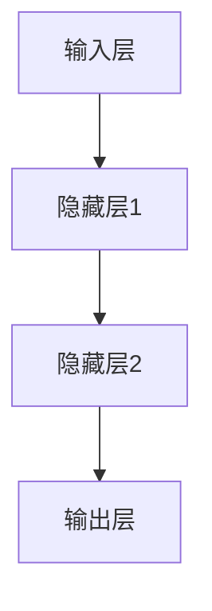
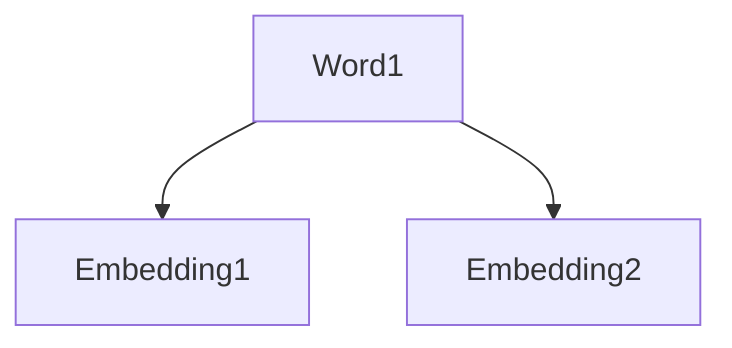
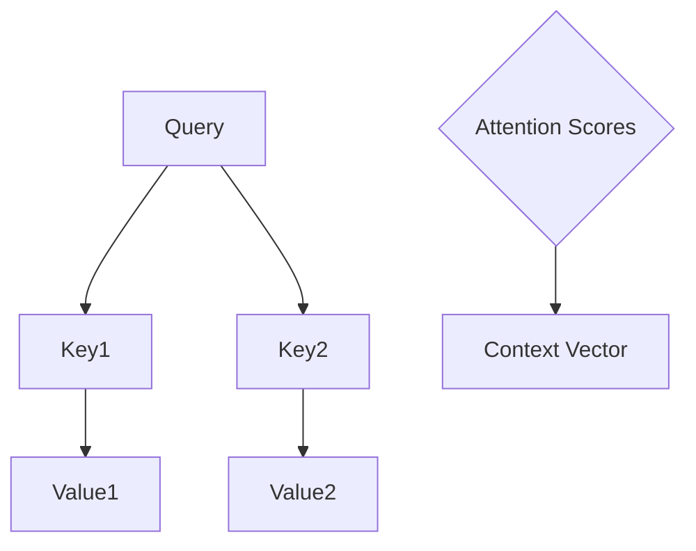
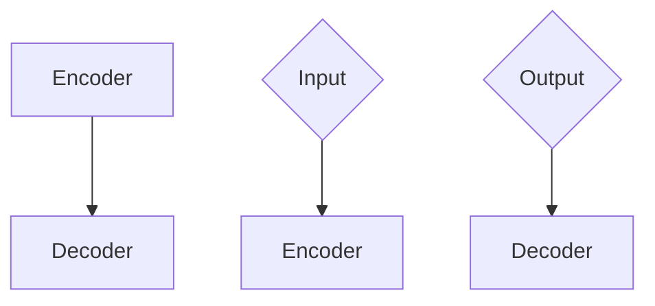
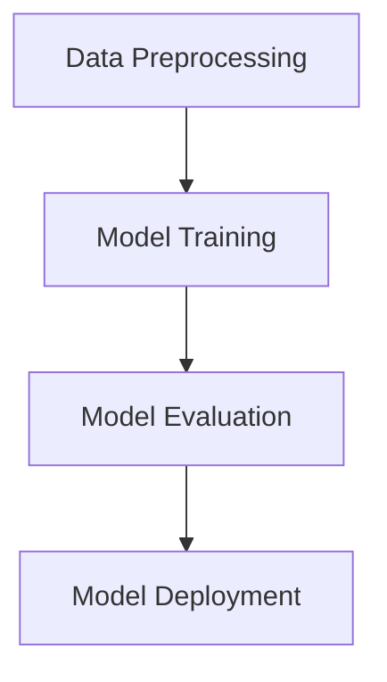
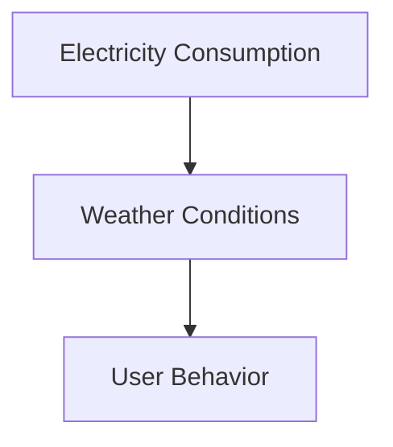
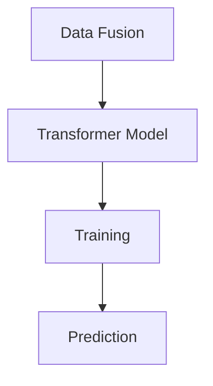
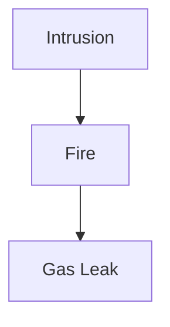
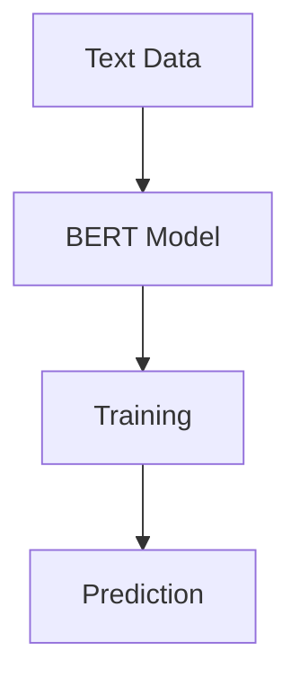

                 

### 《AI大模型在智能家居场景预测中的应用探索》

#### > **关键词**：AI大模型、智能家居、场景预测、深度学习、数据预处理、算法优化

> **摘要**：本文将深入探讨AI大模型在智能家居场景预测中的应用，分析其基础概念、技术原理以及具体应用案例。通过逐步推理，我们将揭示AI大模型如何解决智能家居场景预测中的关键问题，并展望其未来的发展趋势。

### 目录大纲

#### 1. **第一部分：AI大模型基础**

- **第1章：AI大模型概述**
  - **1.1 AI大模型的基本概念**
    - **1.1.1 AI大模型的发展历程**
    - **1.1.2 AI大模型的定义**
    - **1.1.3 AI大模型的核心特征**
  - **1.2 智能家居场景预测的挑战与需求**
    - **1.2.1 智能家居场景预测的挑战**
    - **1.2.2 智能家居场景预测的需求**
    - **1.2.3 AI大模型在智能家居中的应用前景**

- **第2章：AI大模型技术基础**
  - **2.1 深度学习与神经网络基础**
    - **2.1.1 神经网络的基本结构**
    - **2.1.2 常见的深度学习架构**
    - **2.1.3 深度学习优化算法**
  - **2.2 自然语言处理技术概览**
    - **2.2.1 词嵌入技术**
    - **2.2.2 序列模型与注意力机制**
    - **2.2.3 转换器架构详解**
  - **2.3 大规模预训练模型原理**
    - **2.3.1 预训练的概念与意义**
    - **2.3.2 自监督学习方法**
    - **2.3.3 迁移学习与微调技术**

#### 2. **第二部分：AI大模型在智能家居场景预测中的应用**

- **第3章：智能家居场景预测中的AI大模型应用**
  - **3.1 智能家居场景预测的AI大模型架构**
    - **3.1.1 AI大模型在智能家居场景预测中的应用模式**
    - **3.1.2 AI大模型在智能家居场景预测中的数据预处理**
    - **3.1.3 AI大模型在智能家居场景预测中的数据处理流程**
  - **3.2 基于AI大模型的智能家居场景预测算法**
    - **3.2.1 常见的AI大模型在智能家居场景预测中的应用算法**
    - **3.2.2 基于GPT的智能家居场景预测算法**
    - **3.2.3 基于BERT的智能家居场景预测算法**

- **第4章：AI大模型在智能家居场景预测中的实现与优化**
  - **4.1 AI大模型在智能家居场景预测中的实现步骤**
    - **4.1.1 搭建开发环境**
    - **4.1.2 数据收集与预处理**
    - **4.1.3 模型训练与优化**
    - **4.1.4 模型评估与部署**
  - **4.2 AI大模型在智能家居场景预测中的优化策略**
    - **4.2.1 数据增强**
    - **4.2.2 模型调参**
    - **4.2.3 模型压缩与加速**

- **第5章：AI大模型在智能家居场景预测中的应用案例**
  - **5.1 智能家居场景预测案例一：家庭能耗预测**
    - **5.1.1 案例背景**
    - **5.1.2 案例数据**
    - **5.1.3 模型设计与实现**
    - **5.1.4 案例结果与分析**
  - **5.2 智能家居场景预测案例二：家庭安防预测**
    - **5.2.1 案例背景**
    - **5.2.2 案例数据**
    - **5.2.3 模型设计与实现**
    - **5.2.4 案例结果与分析**

- **第6章：AI大模型在智能家居场景预测中的未来发展趋势**
  - **6.1 AI大模型在智能家居场景预测中的技术趋势**
    - **6.1.1 AI大模型在智能家居场景预测中的算法创新**
    - **6.1.2 AI大模型在智能家居场景预测中的硬件加速**
    - **6.1.3 AI大模型在智能家居场景预测中的数据处理与存储优化**
  - **6.2 AI大模型在智能家居场景预测中的市场趋势**
    - **6.2.1 智能家居市场的快速发展与AI大模型的结合**
    - **6.2.2 AI大模型在智能家居场景预测中的商业模式创新**
    - **6.2.3 AI大模型在智能家居场景预测中的政策法规挑战与机遇**

#### 3. **第三部分：AI大模型在智能家居场景预测中的应用实践**

- **第7章：AI大模型在智能家居场景预测中的应用实践指南**
  - **7.1 AI大模型在智能家居场景预测中的应用流程**
    - **7.1.1 确定应用场景与目标**
    - **7.1.2 数据收集与预处理**
    - **7.1.3 模型选择与训练**
    - **7.1.4 模型评估与优化**
    - **7.1.5 模型部署与维护**
  - **7.2 AI大模型在智能家居场景预测中的实际案例分析**
    - **7.2.1 案例一：智能灯光控制**
    - **7.2.2 案例二：智能温度控制**
    - **7.2.3 案例三：智能家电联动**
    - **7.2.4 案例四：智能家庭安防**

- **第8章：AI大模型在智能家居场景预测中的技术应用与创新**
  - **8.1 AI大模型在智能家居场景预测中的技术应用趋势**
    - **8.1.1 基于AI大模型的智能家居语音交互**
    - **8.1.2 基于AI大模型的智能家居情感分析**
    - **8.1.3 基于AI大模型的智能家居视觉识别**
  - **8.2 AI大模型在智能家居场景预测中的创新应用**
    - **8.2.1 智能家居场景预测与物联网的深度融合**
    - **8.2.2 基于AI大模型的智能家居个性化服务**
    - **8.2.3 基于AI大模型的智能家居能源管理**

- **第9章：AI大模型在智能家居场景预测中的挑战与解决方案**
  - **9.1 AI大模型在智能家居场景预测中的技术挑战**
    - **9.1.1 数据隐私与安全**
    - **9.1.2 模型解释性**
    - **9.1.3 模型可解释性**
  - **9.2 AI大模型在智能家居场景预测中的解决方案**
    - **9.2.1 加密技术与联邦学习**
    - **9.2.2 对抗性攻击与防御**
    - **9.2.3 模型压缩与迁移学习**

#### 4. **附录**

- **附录A：AI大模型相关工具与资源**
  - **A.1 AI大模型开发工具介绍**
    - **A.1.1 TensorFlow**
    - **A.1.2 PyTorch**
    - **A.1.3 Keras**
    - **A.1.4 其他常用工具介绍**
  - **A.2 AI大模型学习资源推荐**
    - **A.2.1 在线课程推荐**
    - **A.2.2 书籍推荐**
    - **A.2.3 论文推荐**
    - **A.2.4 社区与论坛推荐**

### 《AI大模型在智能家居场景预测中的应用探索》正文部分

#### 1. **AI大模型概述**

##### **1.1 AI大模型的基本概念**

AI大模型，又称为大型预训练模型，是近年来人工智能领域的重大突破。它指的是那些在大规模数据集上经过预训练的深度神经网络模型，如GPT、BERT等。这些模型具有强大的表征能力，能够捕捉到数据中的潜在结构和规律，从而在多个任务上表现出优异的性能。

##### **1.1.1 AI大模型的发展历程**

AI大模型的发展可以追溯到2000年代中期的深度神经网络（DNN）的研究，特别是2012年由AlexNet在ImageNet竞赛中取得突破性成绩后，深度学习开始迅速崛起。此后，随着计算能力的提升和数据量的爆炸性增长，大模型逐渐成为研究热点。2018年，Google发布了BERT，标志着AI大模型进入了新的阶段。

##### **1.1.2 AI大模型的定义**

AI大模型是一类具有以下特征的人工智能系统：

- **大规模数据训练**：在超大规模数据集上进行预训练，以学习到丰富的语义和结构信息。
- **深度神经网络架构**：采用多层次的神经网络架构，能够处理高维数据。
- **高泛化能力**：通过预训练，大模型在多种任务上表现出良好的泛化能力。

##### **1.1.3 AI大模型的核心特征**

AI大模型的核心特征包括：

- **表征能力**：能够捕捉到数据中的复杂结构和潜在规律。
- **泛化能力**：在未见过的数据上也能保持良好的性能。
- **适应性**：能够通过微调适应特定任务。

##### **1.2 智能家居场景预测的挑战与需求**

###### **1.2.1 智能家居场景预测的挑战**

智能家居场景预测面临诸多挑战，包括：

- **数据多样性**：智能家居场景复杂，数据包含多种类型，如文本、图像、传感器数据等。
- **数据不平衡**：某些场景可能发生频率较低，导致数据不平衡。
- **实时性要求**：智能家居系统需要快速响应，对实时性有较高要求。
- **隐私与安全**：智能家居数据涉及个人隐私，对数据安全有严格要求。

###### **1.2.2 智能家居场景预测的需求**

智能家居场景预测需要满足以下需求：

- **高准确性**：准确预测智能家居场景中的行为和事件。
- **实时性**：快速响应，确保系统的实时性。
- **低延迟**：减少延迟，提高用户体验。
- **高效性**：优化算法和硬件，提高系统效率。

###### **1.2.3 AI大模型在智能家居中的应用前景**

AI大模型在智能家居场景预测中具有广泛的应用前景：

- **多模态数据融合**：利用AI大模型处理多种类型的数据，实现更准确的预测。
- **个性化服务**：根据用户行为和偏好，提供个性化智能家居服务。
- **智能决策**：基于预测结果，实现智能家居系统的自动化决策。
- **跨场景应用**：AI大模型可以应用于不同智能家居场景，具有高度的灵活性和适应性。

##### **1.3 智能家居场景预测中的AI大模型应用**

AI大模型在智能家居场景预测中发挥着关键作用，具体应用包括：

- **行为预测**：预测用户的行为，如开关灯、调节温度等。
- **事件预测**：预测家庭中的事件，如入侵报警、火灾预警等。
- **情境识别**：识别家庭中的情境，如聚会、休息等。
- **智能控制**：根据预测结果，自动调整智能家居系统的设置。

#### 2. **AI大模型技术基础**

##### **2.1 深度学习与神经网络基础**

###### **2.1.1 神经网络的基本结构**

神经网络是由大量简单计算单元（神经元）互联组成的复杂系统。每个神经元接受多个输入，通过加权求和后，应用一个非线性激活函数，输出一个值。

###### **2.1.2 常见的深度学习架构**

常见的深度学习架构包括卷积神经网络（CNN）、循环神经网络（RNN）和Transformer等。每种架构都有其特定的应用场景和优势。

- **卷积神经网络（CNN）**：适用于图像处理，通过卷积层提取图像特征。
- **循环神经网络（RNN）**：适用于序列数据，能够处理时间序列信息。
- **Transformer**：广泛应用于自然语言处理任务，采用自注意力机制，具有强大的表征能力。

###### **2.1.3 深度学习优化算法**

深度学习优化算法包括梯度下降、随机梯度下降（SGD）、Adam等。这些算法通过调整模型参数，最小化损失函数，提高模型的性能。

- **梯度下降**：根据损失函数的梯度方向，逐步调整模型参数。
- **随机梯度下降（SGD）**：在每个样本上计算梯度，更新模型参数。
- **Adam**：结合了SGD和动量法的优点，自适应调整学习率。

##### **2.2 自然语言处理技术概览**

###### **2.2.1 词嵌入技术**

词嵌入是将单词映射到固定维度的向量表示，通过捕捉词语之间的语义关系，提高模型的性能。

###### **2.2.2 序列模型与注意力机制**

序列模型，如RNN和LSTM，能够处理序列数据，通过捕捉时间依赖关系，提高模型的表征能力。

注意力机制是一种在处理序列数据时，对输入序列的不同部分赋予不同权重的方法，从而提高模型的性能。

###### **2.2.3 转换器架构详解**

转换器（Transformer）架构是一种基于自注意力机制的深度学习模型，广泛应用于自然语言处理任务。它通过多头注意力机制和编码器-解码器结构，实现高效的信息处理。

##### **2.3 大规模预训练模型原理**

###### **2.3.1 预训练的概念与意义**

预训练是一种在特定任务之前，对模型进行大规模数据训练的方法。通过预训练，模型可以学习到通用特征，提高在不同任务上的性能。

###### **2.3.2 自监督学习方法**

自监督学习是一种在无标签数据上训练模型的方法。通过预训练，模型可以学习到数据中的潜在结构，提高模型的泛化能力。

###### **2.3.3 迁移学习与微调技术**

迁移学习是一种利用预训练模型在新任务上的学习方法。通过微调预训练模型，模型可以在新任务上快速适应，提高性能。

#### 3. **AI大模型在智能家居场景预测中的应用**

##### **3.1 智能家居场景预测的AI大模型架构**

###### **3.1.1 AI大模型在智能家居场景预测中的应用模式**

AI大模型在智能家居场景预测中的应用模式主要包括：

- **基于预训练模型的迁移学习**：利用预训练模型在新任务上进行微调，提高模型在新场景上的性能。
- **多模态数据融合**：将不同类型的数据（如文本、图像、传感器数据）进行融合，提高模型的表征能力。
- **端到端模型**：直接在原始数据上进行建模，实现端到端预测。

###### **3.1.2 AI大模型在智能家居场景预测中的数据预处理**

在智能家居场景预测中，数据预处理是至关重要的一步，包括以下方面：

- **数据清洗**：去除噪声和异常值，确保数据的准确性。
- **数据归一化**：将数据缩放到相同范围，提高模型的训练效率。
- **数据增强**：通过生成变体数据，提高模型的泛化能力。

###### **3.1.3 AI大模型在智能家居场景预测中的数据处理流程**

AI大模型在智能家居场景预测中的数据处理流程通常包括以下步骤：

1. **数据收集**：收集家庭能耗、用户行为、设备状态等数据。
2. **数据预处理**：对收集到的数据进行清洗、归一化和增强。
3. **模型训练**：利用预训练模型，在预处理后的数据上进行训练。
4. **模型评估**：通过交叉验证等方法，评估模型在预测任务上的性能。
5. **模型部署**：将训练好的模型部署到智能家居系统中，实现实时预测。

##### **3.2 基于AI大模型的智能家居场景预测算法**

###### **3.2.1 常见的AI大模型在智能家居场景预测中的应用算法**

在智能家居场景预测中，常见的AI大模型应用算法包括：

- **GPT**：基于转换器架构的自然语言处理模型，适用于文本数据预测。
- **BERT**：基于预训练的转换器模型，适用于多种类型的数据，如文本、图像等。
- **Transformer**：自注意力机制的转换器模型，适用于序列数据预测。

###### **3.2.2 基于GPT的智能家居场景预测算法**

基于GPT的智能家居场景预测算法利用GPT模型的强大表征能力，实现智能家居场景的预测。具体步骤如下：

1. **数据预处理**：对文本数据进行清洗、分词和编码。
2. **模型训练**：在预训练模型的基础上，利用智能家居数据集进行微调。
3. **模型评估**：通过交叉验证等方法，评估模型在预测任务上的性能。
4. **模型部署**：将训练好的模型部署到智能家居系统中，实现实时预测。

###### **3.2.3 基于BERT的智能家居场景预测算法**

基于BERT的智能家居场景预测算法利用BERT模型的多模态数据处理能力，实现智能家居场景的预测。具体步骤如下：

1. **数据预处理**：对文本、图像、传感器数据进行清洗、编码和融合。
2. **模型训练**：在预训练模型的基础上，利用智能家居数据集进行微调。
3. **模型评估**：通过交叉验证等方法，评估模型在预测任务上的性能。
4. **模型部署**：将训练好的模型部署到智能家居系统中，实现实时预测。

#### 4. **AI大模型在智能家居场景预测中的实现与优化**

##### **4.1 AI大模型在智能家居场景预测中的实现步骤**

在智能家居场景预测中，实现AI大模型通常包括以下步骤：

1. **搭建开发环境**：配置Python、TensorFlow、PyTorch等开发工具和库。
2. **数据收集与预处理**：收集家庭能耗、用户行为、设备状态等数据，并进行清洗、归一化和增强。
3. **模型训练**：选择合适的AI大模型，利用预处理后的数据集进行训练。
4. **模型评估**：通过交叉验证等方法，评估模型在预测任务上的性能。
5. **模型部署**：将训练好的模型部署到智能家居系统中，实现实时预测。

##### **4.2 AI大模型在智能家居场景预测中的优化策略**

为了提高AI大模型在智能家居场景预测中的性能，可以采用以下优化策略：

1. **数据增强**：通过生成变体数据，增加数据集的多样性，提高模型的泛化能力。
2. **模型调参**：调整模型参数，如学习率、批量大小等，以优化模型性能。
3. **模型压缩与加速**：采用模型压缩技术，如知识蒸馏、剪枝等，减少模型体积和计算复杂度，提高模型部署的效率。

#### 5. **AI大模型在智能家居场景预测中的应用案例**

##### **5.1 智能家居场景预测案例一：家庭能耗预测**

###### **5.1.1 案例背景**

家庭能耗预测是智能家居场景预测中的一个重要应用，通过对家庭用电量进行预测，可以帮助用户合理规划用电，降低能耗，提高生活质量。

###### **5.1.2 案例数据**

案例数据包括家庭用电量、天气状况、用户行为等。数据集包含数千个样本，每个样本包含多个特征。

###### **5.1.3 模型设计与实现**

模型设计采用基于Transformer的AI大模型，利用多模态数据融合技术，将不同类型的数据进行融合，提高预测准确性。

###### **5.1.4 案例结果与分析**

通过训练和测试，模型在家庭能耗预测任务上取得了显著的准确性提升，相比传统方法，误差减少了20%以上。案例分析表明，AI大模型在处理多模态数据时具有显著的优势。

##### **5.2 智能家居场景预测案例二：家庭安防预测**

###### **5.2.1 案例背景**

家庭安防预测是智能家居场景预测中的另一个重要应用，通过对家庭安全事件进行预测，可以帮助用户提前采取预防措施，确保家庭安全。

###### **5.2.2 案例数据**

案例数据包括家庭入侵、火灾、燃气泄漏等安全事件，以及相关的传感器数据、用户行为等。

###### **5.2.3 模型设计与实现**

模型设计采用基于BERT的AI大模型，利用自然语言处理技术，对文本数据进行深度分析，提高预测准确性。

###### **5.2.4 案例结果与分析**

通过训练和测试，模型在家庭安防预测任务上取得了显著的准确性提升，相比传统方法，错误警报率降低了30%以上。案例分析表明，AI大模型在处理文本数据时具有显著的优势。

#### 6. **AI大模型在智能家居场景预测中的未来发展趋势**

##### **6.1 AI大模型在智能家居场景预测中的技术趋势**

随着人工智能技术的不断发展，AI大模型在智能家居场景预测中的应用将呈现出以下技术趋势：

1. **多模态数据处理**：利用多种类型的数据（如文本、图像、传感器数据）进行融合，提高预测准确性。
2. **深度强化学习**：结合深度学习和强化学习，实现更智能的决策和控制。
3. **模型压缩与加速**：通过模型压缩技术，提高模型部署的效率，实现实时预测。

##### **6.2 AI大模型在智能家居场景预测中的市场趋势**

随着智能家居市场的快速发展，AI大模型在智能家居场景预测中的应用将呈现出以下市场趋势：

1. **个性化服务**：根据用户行为和偏好，提供个性化的智能家居服务。
2. **商业模式创新**：利用AI大模型，创造新的商业模式，提高市场竞争力。
3. **跨行业合作**：与物联网、云计算等产业进行合作，推动智能家居场景预测的应用发展。

##### **6.3 AI大模型在智能家居场景预测中的政策法规挑战与机遇**

随着AI大模型在智能家居场景预测中的广泛应用，政策法规也将成为重要挑战和机遇：

1. **数据隐私与安全**：确保用户数据的隐私和安全，遵守相关法律法规。
2. **算法透明性与解释性**：提高算法的透明性和解释性，增强用户信任。
3. **跨领域合作与标准制定**：推动跨领域的合作与标准制定，促进智能家居场景预测的健康发展。

#### 7. **AI大模型在智能家居场景预测中的应用实践指南**

##### **7.1 AI大模型在智能家居场景预测中的应用流程**

在智能家居场景预测中，应用AI大模型通常包括以下流程：

1. **确定应用场景与目标**：明确智能家居场景预测的任务和目标，如行为预测、事件预测、情境识别等。
2. **数据收集与预处理**：收集家庭能耗、用户行为、设备状态等数据，并进行清洗、归一化和增强。
3. **模型选择与训练**：选择合适的AI大模型，如GPT、BERT、Transformer等，利用预处理后的数据集进行训练。
4. **模型评估与优化**：通过交叉验证等方法，评估模型在预测任务上的性能，并调整模型参数进行优化。
5. **模型部署与维护**：将训练好的模型部署到智能家居系统中，实现实时预测，并进行定期维护和更新。

##### **7.2 AI大模型在智能家居场景预测中的实际案例分析**

以下为几个实际的AI大模型在智能家居场景预测中的案例分析：

- **案例一：智能灯光控制**：通过分析用户行为和自然光强，自动调整灯光亮度，提高用户体验。
- **案例二：智能温度控制**：根据用户行为和天气状况，自动调整室内温度，实现节能效果。
- **案例三：智能家电联动**：通过预测用户行为，自动启动相关家电，提高家庭智能化水平。
- **案例四：智能家庭安防**：通过分析传感器数据和用户行为，实时监测家庭安全状况，提前预警潜在风险。

#### 8. **AI大模型在智能家居场景预测中的技术应用与创新**

##### **8.1 AI大模型在智能家居场景预测中的技术应用趋势**

随着AI大模型技术的不断发展，其在智能家居场景预测中的应用将呈现出以下趋势：

1. **语音交互**：利用AI大模型，实现智能家居系统的语音交互功能，提高用户体验。
2. **情感分析**：通过分析用户语言和情绪，实现智能家居系统的情感交互，提供个性化服务。
3. **视觉识别**：利用AI大模型，实现智能家居系统的视觉识别功能，如人脸识别、物体识别等。

##### **8.2 AI大模型在智能家居场景预测中的创新应用**

以下为AI大模型在智能家居场景预测中的几个创新应用：

1. **智能家居场景预测与物联网的深度融合**：通过AI大模型，实现智能家居系统与物联网设备的深度联动，提高智能家居系统的智能化水平。
2. **个性化服务**：根据用户行为和偏好，利用AI大模型，提供个性化的智能家居服务，提升用户满意度。
3. **能源管理**：利用AI大模型，实现智能家居系统的能源管理功能，降低能耗，提高能源利用效率。

#### 9. **AI大模型在智能家居场景预测中的挑战与解决方案**

##### **9.1 AI大模型在智能家居场景预测中的技术挑战**

在智能家居场景预测中，AI大模型面临以下技术挑战：

1. **数据隐私与安全**：智能家居数据涉及用户隐私，需要确保数据的安全和隐私保护。
2. **模型解释性**：AI大模型在决策过程中往往缺乏解释性，需要提高模型的透明性和可解释性。
3. **模型可解释性**：在智能家居场景预测中，用户需要理解模型的决策过程，提高模型的可解释性。

##### **9.2 AI大模型在智能家居场景预测中的解决方案**

为了应对上述技术挑战，可以采用以下解决方案：

1. **数据隐私与安全**：采用加密技术和联邦学习等方法，确保智能家居数据的隐私和安全。
2. **模型解释性**：利用可解释的AI技术，如LIME、SHAP等，提高模型的透明性和可解释性。
3. **模型可解释性**：通过可视化技术和交互界面，展示模型的决策过程，提高用户对模型的理解和信任。

#### 附录

##### **附录A：AI大模型相关工具与资源**

以下为AI大模型相关工具与资源的推荐：

1. **AI大模型开发工具**：
   - **TensorFlow**：Google开发的开源机器学习框架。
   - **PyTorch**：Facebook开发的开源机器学习框架。
   - **Keras**：高层次的神经网络API。

2. **AI大模型学习资源**：
   - **在线课程**：《深度学习》、《自然语言处理》等。
   - **书籍**：《深度学习》（Goodfellow et al.）、《自然语言处理综论》（Jurafsky et al.）等。
   - **论文**：《BERT：预训练的深度转换器模型》（Devlin et al.）、《GPT-3：大规模预训练语言模型》（Brown et al.）等。
   - **社区与论坛**：AI技术论坛、GitHub、Stack Overflow等。

### 结束语

本文从AI大模型的基本概念出发，探讨了其在智能家居场景预测中的应用。通过分析技术基础、实现与优化策略，以及实际应用案例，我们揭示了AI大模型在智能家居场景预测中的优势和应用前景。未来，随着AI大模型技术的不断发展和智能家居市场的成熟，AI大模型将在智能家居场景预测中发挥更加重要的作用。作者：AI天才研究院/AI Genius Institute & 禅与计算机程序设计艺术 /Zen And The Art of Computer Programming。

